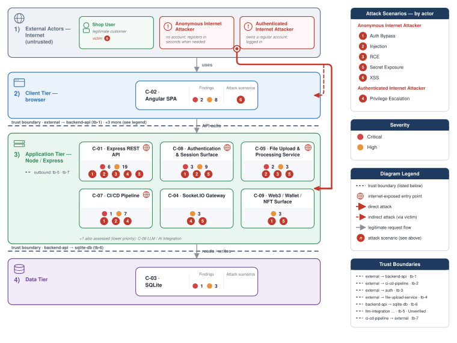

# appsec-advisor

[](#)
[](LICENSE)
[](https://docs.claude.com/en/docs/claude-code)
[](https://docs.oasis-open.org/sarif/sarif-v2.1.0/sarif-v2.1.0.html)
[](https://codecov.io/gh/matthiasrohr/appsec-advisor)

> ⚠️ **Beta — not production ready.** `appsec-advisor` is under active development. Interfaces, schemas, and output may change without notice.

`appsec-advisor` is a Claude Code plugin for code-derived threat modeling — the model is derived from the repository, not maintained by hand. It maps the implemented architecture, applies STRIDE, and produces findings with a mitigation plan. It complements workshops: automate a first pass, re-run it as code changes, and involve experts where judgment is needed.

Beyond threat modeling, it supports requirements audits, change reviews, and CI gates. AppSec teams can tailor it for internal use; see [Enterprise rollout](#enterprise-rollout).

[Why appsec-advisor?](#why-appsec-advisor) · [Security](#security-notes) · [Quick start](#quick-start) · [Workflow](docs/threat-modeler.md#threat-model-lifecycle) · [Documentation](#documentation) · [Project structure](#project-structure) · [Contributing](#contributing)

---

## Why appsec-advisor?

### The problem

Workshop and design-review threat models become stale as the implementation changes, and most automated security tools focus on dependencies, code patterns, secrets, and misconfigurations — not on the architecture in between.

`appsec-advisor` covers the gap to manual architecture review by identifying risks such as missing trust-boundary controls, implicit service trust, and unauthenticated internal paths. Because the model is derived from the repository, re-running a scan keeps it current instead of letting it drift from the code.

### How this relates to classic threat modeling

Classic threat modeling (workshops, design reviews) owns intent, business impact, and residual-risk decisions. It needs skilled people and does not scale to every service. This tool automates the *technical* picture from the repository, so teams start with coverage and specialists focus on difficult cases.

| | Classic | `appsec-advisor` |
|---|---|---|
| Starts from | Design sessions and domain knowledge | Repository evidence: code and config |
| Good at | Context, priorities, accept-risk | Automation, breadth, staying current |
| Scales by | Booking more workshops | Re-running the scan on more repos |

Use both: automate and scale the technical model; use expert time where the report is thin or you need more depth.

**What it does not cover.** The analysis is limited to repository evidence and configured related repositories; it cannot verify runtime behaviour, production-only setup, or external controls. It does not model business processes or user journeys. Treat it as review input, not sign-off.

### Why this isn't a SAST tool

SAST finds bugs on concrete code paths. This tool looks at the architecture around them — missing controls, trust between components, risks with no single bad line. It sits next to scanners, not instead of them.

## Security notes

> [!IMPORTANT]
> **Treat scanned repositories as untrusted input.** Repository content enters the LLM context and may attempt prompt injection. The interactive setup grants unrestricted shell access to avoid mid-run prompts, so scan third-party or vendor code with `--trust-mode untrusted` inside a container or VM. See [Security: Untrusted repositories](SECURITY.md#known-issues--untrusted-repositories).

**Data handling.** Only source, manifests, and configuration for analyzed components are sent to Anthropic; surfaced secrets are masked. The plugin requires `api.anthropic.com`, cannot run air-gapped, and uses provider-side prompt caching.

**Output safety.** Python renders reports from validated structured data, and publishing stops if the secret scan finds an unmasked secret.

---

## Quick start

Requires [Claude Code](https://docs.claude.com/en/docs/claude-code), Python 3.10+, and `git` on `PATH`. Optional Mermaid dependencies add stricter diagram validation; see the [Threat Modeler reference](docs/threat-modeler.md).

**Model compatibility.** `appsec-advisor` supports current Anthropic models and is tuned for Sonnet 5. Economy defaults keep token-heavy work on Sonnet 4.6 and use Sonnet 5 selectively; explicit per-agent pins remain available. Each scan prints the resolved routing. See [Session Model](docs/threat-modeler.md#session-model).

**1. Start Claude Code in the target repository**

Clone the plugin once, then start Claude Code from the repository you want to assess:

```bash
git clone https://github.com/matthiasrohr/appsec-advisor.git /path/to/appsec-advisor
cd /path/to/repository-to-assess
claude --plugin-dir /path/to/appsec-advisor
```

Typing the plugin namespace in Claude Code should show the registered skills:

```text
/appsec-advisor:
```

**2. Configure permissions and create the model**

Run the one-time permission setup:

```text
/appsec-advisor:check-permissions --update
```

Restart or reload Claude Code, then create the model:

```text
/appsec-advisor:create-threat-model
```

The assessment writes `threat-model.md` and `threat-model.yaml` to `docs/security/`.

**3. Continue with the model**

After the first assessment, use the model directly from the Claude Code console:

```text
# Reassess components affected by code changes
/appsec-advisor:update-threat-model

# Review findings and record fix, accept-risk, or defer decisions
/appsec-advisor:review-threat-model

# Optionally publish a reviewed model to version control
/appsec-advisor:publish-threat-model

# Or ask about the model without a command
what are the most critical findings?
what should I fix first?
does it cover SSRF?
```

Updates preserve finding IDs; questions are read-only and cite them. Review decisions are stored separately, and publishing remains optional.

For depth, cost, focused scans, actors, and repository context, see the [Threat Modeler reference](docs/threat-modeler.md).

## What's new in 0.5.1-beta & 0.5.2-beta

- **First-class trust boundaries.** Assessed in a dedicated stage, drawn in the architecture diagram, and referenced by the findings that cross them — a confirmed internet-facing crossing can raise a finding's severity.
- **Secure-coding baseline — a new capability next to threat modeling.** `install-baseline` writes the bundled [AI Secure Coding Baseline](https://github.com/matthiasrohr/ai-secure-coding-baseline) into Claude Code's instruction files, so the rules reach every prompt before code is written; `verify-baseline` lets CI gate on it.
- **Cheap-STRIDE depth tier**, on by default outside thorough scans. The internal tail is screened on a smaller budget; exposed and data-carrying components keep full depth, and all six STRIDE categories still run everywhere.
- **Threat Dragon export (alpha).** `--formats threatdragon` writes Threat Dragon v2 JSON — the one interchange format that carries threats and mitigations into both Threat Dragon and OWASP ThreatAtlas.
- **Session status banner.** Reports the threat model and the loaded secure-coding baseline, and flags either when it needs attention; `/appsec-advisor:help` lists the commands.
- **Extended org profiles.** Ship your own skills and baseline, configure the banner, disable individual skills.

## What's new in 0.5-beta

**Ask questions about your threat model — just type them in the Claude Code console.** No command to remember: the new `ask-threat-model` skill picks up any question about the model, so there is no report to re-read and no export to grep:

```text
what are the most critical findings?
what should I fix first?
does it cover SSRF?
```

Answers stay grounded in the model and cite finding IDs. See the [Quick start](#quick-start).

- **`review-threat-model`** — decide fix, accept, or defer in bulk, with owners.
- **Weakness Register** — surfaces systemic and design weaknesses with a security-principles verdict.
- **Beyond JavaScript** — access-control, crypto, and mass-assignment checks now cover Java, Python, Go, PHP, C#/.NET, Ruby/Rails, and mobile.

[Full changelog](CHANGELOG.md)

## Threat Modeler

`/appsec-advisor:create-threat-model` derives an architecture model from the repository and runs STRIDE analysis to produce a structured security review.

Each assessment is:

- **Repository-grounded:** Derives architecture, trust boundaries, and data flows from code and configuration.
- **Organization-aware:** Incorporates requirements, known threats, and related services when configured.
- **Architecture-focused:** Identifies risks such as implicit service trust and unauthenticated paths that code scanners often miss.
- **Validated:** Passes findings through schemas, validation, and fixed report templates.
- **Stable across reruns:** Preserves finding IDs so changes remain traceable.

The report covers architecture observations, risk-ranked findings, affected components, remediation guidance, and generated diagrams. Default outputs are `threat-model.md` and `threat-model.yaml`; optional exports include PDF, HTML, SARIF, and pentest task lists.

The result is a starting point for security review, not a release verdict. An AppSec engineer or security architect should validate findings before they drive remediation, exceptions, or risk acceptance.

**Standards coverage.** Findings are cross-referenced to established OWASP catalogs, rendered as linked reference badges in the report:

- [OWASP Top 10:2025](https://owasp.org/Top10/2025/) — the web application security risks, mapped per finding with a deterministic coverage check that flags any category with no identified threat.
- [OWASP Top 10 for LLM Applications (2025)](https://genai.owasp.org/llm-top-10/) — applied as an additional lens whenever the repository has an LLM/AI surface.
- [OWASP Top 10 for Agentic Applications (2026)](https://genai.owasp.org/resource/owasp-top-10-for-agentic-applications-for-2026/) — applied on top of the LLM lens when the surface is agentic (an LLM wired to tools, memory, or other agents).

**Example:** [Read a thorough assessment of OWASP Juice Shop](examples/threat-modeler/threat-model-juice-shop-thorough-v0.5.md) — or browse [more examples](examples/threat-modeler/README.md).



Assessments consume model tokens and typically take tens of minutes; thorough runs may exceed an hour. The [Threat Modeler reference](docs/threat-modeler.md#assessment-depth--cost-control) compares measured costs by depth and model and documents hard cost and time limits.

**Session model.** For normal runs, use Sonnet 4.6 (`/model claude-sonnet-4-6`); it delivered comparable threat models at lower cost in our tests and is already the headless default. See [Session Model](docs/threat-modeler.md#session-model) for routing and overrides.

The committed pricing values used for local cost calculation can be adjusted independently of model routing. See [Pricing](docs/configuration.md#pricing) for the scope and precedence of those values.

## Requirements Audit

`/appsec-advisor:audit-security-requirements` grades the repository against an internal AppSec requirements catalog. It is faster than a full threat model and fits PR gates, compliance dashboards, and audit preparation.

```text
# Run with the configured catalog
/appsec-advisor:audit-security-requirements

# Run standalone with a URL (no config change needed)
/appsec-advisor:audit-security-requirements --requirements https://URL/appsec-requirements.yaml
```

The requirements audit and threat modeler use the same configured catalog.

If you do not have a catalog, adapt `data/appsec-requirements-fallback.yaml`. The [requirements harvester](docs/harvester.md) can build and refresh the YAML from Confluence, Antora, or static HTML.

See the [Requirements Audit reference](docs/security-requirements-audit-skill.md) for catalog setup, status values, and flags.

## Additional developer tools

These developer tools provide security guidance while code is being written or reviewed. They use the configured requirements catalog, or the bundled baseline when none is configured.

| Tool | Type | Scope | Entry point | When to use it |
|---|---|---|---|---|
| Secure-coding baseline | Skill | Instruction files | `/appsec-advisor:install-baseline` · `/appsec-advisor:verify-baseline` · `/appsec-advisor:remove-baseline` | Put secure-coding rules in the assistant's context before it writes code, check that they actually loaded, and take them out again. |
| [Security Coach hook](docs/dev-security-helper-usage.md#security-coach-hook) (*experimental*) | Hook | Prompt-time guidance | `APPSEC_COACH=1 claude --plugin-dir /path/to/appsec-advisor` | Add security guidance to Claude's context while you write security-sensitive code. |
| [appsec-reviewer](docs/dev-security-helper-usage.md#appsec-reviewer-agent) (*experimental*) | Agent | Change review engine | `appsec-reviewer` | Embed the reviewer in a Claude Code or Agent SDK workflow. |
| [verify-requirements](docs/dev-security-helper-usage.md#verify-requirements-skill) (*experimental*) | Skill | Interactive diff review | `/appsec-advisor:verify-requirements` | Review current, staged, or base-ref changes from an interactive Claude Code session. |
| [appsec-reviewer-cli](docs/dev-security-helper-usage.md#appsec-reviewer-cli) (*experimental*) | CLI | CI diff review | `appsec-reviewer-cli review --diff origin/main --output security-review.md` | Run the same requirements review headlessly in CI or other automation. |

The secure-coding baseline is an instruction file Claude Code loads before it writes code, so the rules apply on every prompt rather than only on the ones that mention security. The plugin ships the [AI Secure Coding Baseline](https://github.com/matthiasrohr/ai-secure-coding-baseline) and reports at every session start whether it is loaded; an organization can ship its own instead — see [Secure-coding baseline](docs/org-profiles.md#secure-coding-baseline).

Full guide: [`docs/dev-security-helper-usage.md`](docs/dev-security-helper-usage.md) · Requirements catalog setup: [`docs/harvester.md`](docs/harvester.md) · Security Coach: [`docs/security-coach-skill.md`](docs/security-coach-skill.md).

For persistent verbose event output and log rotation limits, see [Logging](docs/configuration.md#logging). The `--verbose` flag remains the normal per-run choice.

## Where to start

New to the plugin, or unsure which command fits? The help page prints a short
command reference with example calls and works in a repository that has no
threat model yet:

```text
/appsec-advisor:help
```

## Report a failed run

If a threat-model run fails, create an **anonymized** diagnostic bundle:

```text
/appsec-advisor:report-error
```

Review it, then attach it to a GitHub issue if you choose. The command excludes source code, findings, evidence, and report content, and sends nothing automatically.

## Enterprise rollout

AppSec and Platform teams can build an organization-branded plugin while continuing to use the upstream analysis, schemas, and validation. The quickest path is the [organization packaging template](https://github.com/matthiasrohr/appsec-advisor-packaging-template), which creates a separate internal repository for the organization profile, package policy, and CI configuration.

Together, organization profiles and package policy let teams:

- use internal requirements and organization or platform context;
- standardize assessment depth, outputs, and quality controls;
- enforce cost, duration, remote-source, and CI guardrails;
- include only approved skills, hooks, and MCP servers.

The example below combines a pinned upstream release with organization-owned configuration to build an internal plugin package.


For the full build and publishing workflow, see the [packaging runbook](docs/internal-plugin-packaging.md). The [org profile reference](docs/org-profiles.md) documents supported controls, and [configuration](docs/configuration.md#organization-profile) explains profile selection.

## Documentation

Use these routes to move from the overview into the detailed documentation without losing the context of the workflow you are following.

| Goal | Start here |
|---|---|
| Run, focus, or configure a threat model | [Threat Modeler](docs/threat-modeler.md) |
| Add business context, known threats, or trust-boundary declarations to a repository | [Repo-local context](docs/threat-modeler.md#repo-local-context) |
| Configure external context, local pricing, logging, or an organization profile | [Advanced Configuration](docs/configuration.md) |
| Choose an assessment depth or understand model cost | [Model Selection, Cost & Context Window](docs/model-selection.md) |
| Configure and run requirements audits | [Requirements Audit](docs/security-requirements-audit-skill.md) |
| Build or refresh a requirements catalog | [Requirements Harvester](docs/harvester.md) |
| Use developer-time security guidance | [Dev Security Helper](docs/dev-security-helper-usage.md) |
| Run locally without interaction or integrate with CI | [Non-interactive Mode](docs/headless-mode.md) |
| Package the plugin for an organization | [Internal Plugin Packaging](docs/internal-plugin-packaging.md) |
| Configure organizational context and guardrails | [Organization Profiles](docs/org-profiles.md) |
| Browse complete report examples | [Threat Modeler Examples](examples/threat-modeler/README.md) |
| Develop or contribute to the plugin | [Contributing](CONTRIBUTING.md) and [AGENTS.md](AGENTS.md) |
| Report or understand security concerns | [Security Policy](SECURITY.md) |

## Project structure

The repository separates agent-driven discovery and prose from deterministic contracts, validation, rendering, and release gates.

```text
appsec-advisor/
├── .claude-plugin/     # Claude Code plugin manifest
├── skills/            # User-invocable skills and workflows
├── agents/            # Specialized agents, phase instructions, and shared standards
├── data/              # Policy data, taxonomies, budgets, and report contracts
├── schemas/           # YAML and JSON contracts for intermediate and delivered artifacts
├── templates/         # Deterministic report and fragment templates
├── scripts/           # Orchestration, validation, rendering, export, and CLI helpers
├── hooks/             # Claude Code hooks and security steering configuration
├── docs/              # User references, contracts, runbooks, and design analysis
├── examples/          # Reference reports and enterprise packaging examples
├── tests/             # Contract, regression, integration, and end-to-end tests
└── config.json        # Shared plugin defaults
```

The central implementation boundary is deliberate:

- Agents inspect the repository, build security context, and author analysis.
- Schemas define the shape of artifacts exchanged between pipeline stages.
- Python validates structured artifacts, renders reports, generates exports, and enforces release gates.
- Tests protect schema, report, permission, cleanup, and compatibility contracts from drift.

For the contributor-level path map and the tests required for each kind of change, see [Repository layout](CONTRIBUTING.md#repository-layout) and [AGENTS.md](AGENTS.md).

## Roadmap

Nothing here carries a date, and the order is rough intent rather than a commitment.

- **Other coding agents**: a scan needs Claude Code today. GitHub Copilot CLI is the first alternative — the Python core, schemas, and gates stay the same, only the agent layer around them is new, and each report names the agent that produced it. Whether a Copilot session has the context capacity for the pipeline remains an open question in the [implementation plan](docs/internal/analysis/implplan-copilot-mvp-2026-07-30.md).

- **Change-scoped scans**: a threat-model update for a branch, pull request, or merge request, so a change can be assessed before it merges. The [developer-time tools](docs/dev-security-helper-usage.md) that already review a diff are experimental and become supported on the way.

- **Component overrides**: exposure, sensitivity, and type are inferred from the repository, and that inference decides how deeply STRIDE covers a component. A `.appsec/components.yaml` overlay will correct it. Raising coverage lands first; lowering it is logged and shown in the report, because it removes analysis.

- **Specifications as input**: a design finding is emitted only where a specification states something insecure outright, labeled as coming from the spec rather than from the implementation.

- **Imported threat models**: a model from another tool becomes context for the analysis, never a source of findings on its own.

- **Cross-repository view**: the per-repository models of a system combined into one view, instead of read one at a time.

- **Larger and more varied codebases**: more languages, architectures, and deployment models, and runs that stay workable on large multi-component repositories. Continuous rather than a single change.

## Related projects

### Companion repositories

- **[matthiasrohr/appsec-advisor-packaging-template](https://github.com/matthiasrohr/appsec-advisor-packaging-template)**: Template for an internal package with organization defaults and requirements. It holds the organization profile, package policy, and CI configuration, and consumes a pinned upstream release — see [Enterprise rollout](#enterprise-rollout).

- **[matthiasrohr/ai-secure-coding-baseline](https://github.com/matthiasrohr/ai-secure-coding-baseline)**: The secure-coding rules `install-baseline` writes into a coding assistant's instruction files, published and versioned separately under CC BY 4.0. The plugin bundles a copy as an offline fallback; an organization can point the same mechanism at its own baseline.

### Comparable tools

- **[davidmatousek/tachi](https://github.com/davidmatousek/tachi)**: Claude Code harness that runs multi-agent STRIDE and AI threat analysis over an architecture description, which you write or have it generate from the codebase. Its focus is that description as the unit of analysis, which keeps it stack-agnostic; a later step reads the codebase to find which controls already exist against the threats it derived. `appsec-advisor` starts at the repository instead and ties each finding to evidence in the code.

- **[mrwadams/stride-gpt](https://github.com/mrwadams/stride-gpt)**: LLM-generated STRIDE threat models with attack trees, DREAD scoring, and MITRE ATT&CK and ATLAS mapping. Its CLI covers both stages: `quick` works from a written description, `analyze` from an agentic pass over a codebase. It is standalone and runs against any model provider, whereas `appsec-advisor` runs inside Claude Code and wraps the model in a deterministic pipeline — schema-validated artifacts, finding IDs that survive an incremental re-scan, and QA gates. This is the closest overlap in the list.

- **[OWASP pytm](https://github.com/OWASP/pytm)**: Python library for threat models as code. You declare elements, dataflows, and trust boundaries in a script, run it, and it renders data flow and sequence diagrams and matches threats from a bundled rule library. Its focus is a model that developers write and review as source, and its threats follow from the attributes they declared on each element. `appsec-advisor` derives those elements and boundaries from the repository instead, and ties each finding to the code it read.

- **[OWASP Threat Dragon](https://owasp.org/www-project-threat-dragon/)**: Open-source diagramming tool for threat models, as a desktop app or a web application. Its focus is the diagram a modeler draws and the threats attached to it, which a rule engine can suggest from the diagram, whereas `appsec-advisor` derives that model from the repository. `--formats threatdragon` (alpha) writes its v2 JSON, so a generated model opens in Threat Dragon as an editable diagram with its threats attached — see the [export reference](docs/threat-dragon-export.md).

- **[OWASP ThreatAtlas](https://owasp.org/www-project-threatatlas/)**: Self-hosted web application for team-based threat modeling sessions on shared data flow diagrams. Its focus is the workshop and its record, whereas `appsec-advisor` keeps a code-derived model current between sessions. The two combine well: a generated model imports via **Diagram → Import** as Threat Dragon JSON (`--formats threatdragon`, alpha), which brings the derived components, data flows, threats, and mitigations into the session instead of drawing them from memory. That is the only import shape ThreatAtlas accepts that carries findings — its other three drop them and restore geometry alone.

- **[OWASP Precogly](https://github.com/precogly/precogly)**: Self-hosted platform with a DFD editor, curated library packs, and compliance traceability, for architects running a threat modeling program. Its focus is the program-wide system of record, whereas `appsec-advisor` generates the per-repository model next to the code. The two combine well: the generated model is a starting point for the maintained DFD, and findings can be tracked against the program's requirements.

- **[Claude Security](https://support.claude.com/en/articles/14661296-use-claude-security)**: Anthropic's codebase vulnerability scanner for Enterprise plans. Its focus is exploitable implementation flaws, whereas `appsec-advisor` covers what has no vulnerable line to point at, such as missing authorization or an undefined trust boundary.

## Contributing

Development happens on [`dev`](../../tree/dev) — branch from it and target it with your pull request. `main` only carries releases, which are merged over from `dev` and tagged.

See [CONTRIBUTING.md](CONTRIBUTING.md) for development setup, repository conventions, repository layout, and required tests.

Read [AGENTS.md](AGENTS.md) before changing runtime behavior, schemas, prompts, permissions, cleanup behavior, or report output. Security vulnerabilities follow the private reporting process in [SECURITY.md](SECURITY.md).
