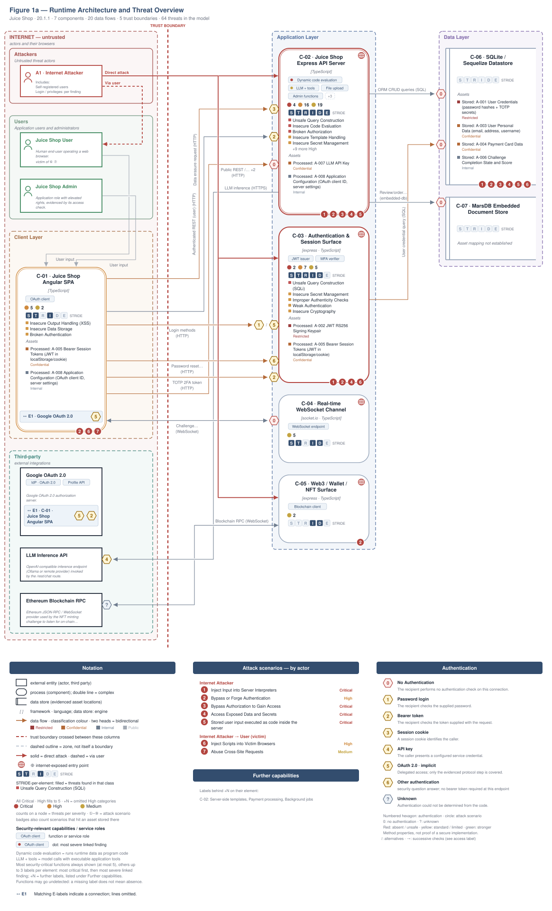
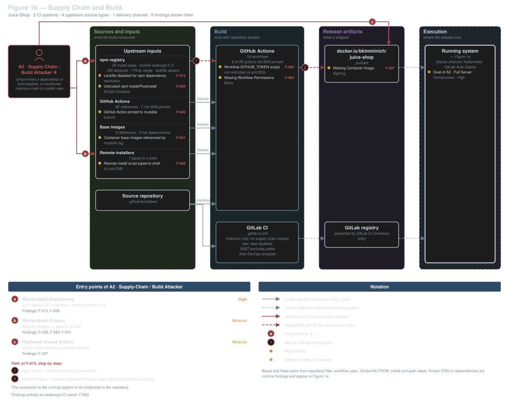
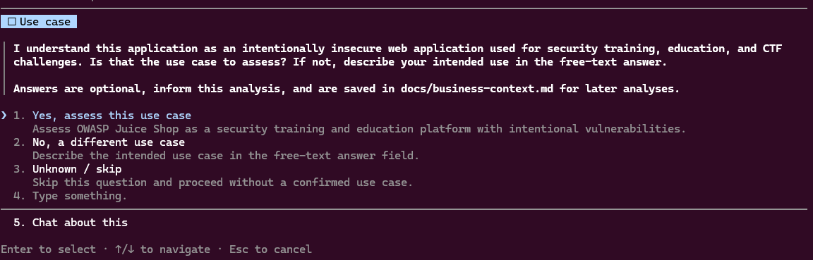
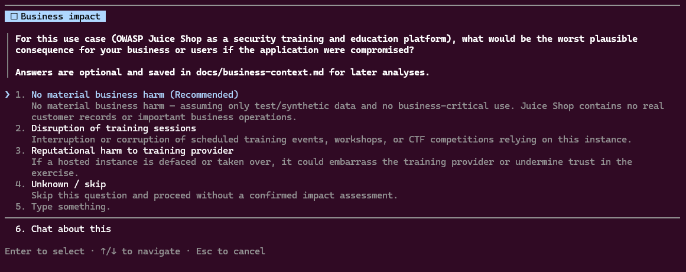

# appsec-advisor

[](CHANGELOG.md)
[](LICENSE)
[](https://docs.claude.com/en/docs/claude-code)
[](docs/threat-modeler.md)
[](https://docs.oasis-open.org/sarif/sarif/v2.1.0/sarif-v2.1.0.html)
[](https://codecov.io/gh/appsec-foundry/appsec-advisor)

> ⚠️ **Beta: not production ready.** `appsec-advisor` is under active development. Interfaces, schemas, and output may change without notice.

`appsec-advisor` is a Claude Code plugin for **automated, code-derived threat modeling**. It reconstructs application components, data flows, and trust boundaries from code and configuration, then applies STRIDE to identify threats in the implemented architecture. Findings reference repository evidence and include remediation guidance.

The **Threat Analyst** covers the design side: on request, it analyzes a planned feature or a selected code change for threats and asks the team for missing design facts. The plugin also includes requirements audits, change reviews, and CI gates.

[Why appsec-advisor?](#why-appsec-advisor) · [Security](#security-notes) · [Quick start](#quick-start) · [Threat Modeler](#threat-modeler) · [Threat Analyst](#threat-analyst) · [Requirements Audit](#requirements-audit) · [Developer tools](#additional-developer-tools) · [Report a failed run](#report-a-failed-run) · [Enterprise rollout](#enterprise-rollout) · [Documentation](#documentation) · [What's new in 0.6.0-beta.4](#whats-new-in-060-beta4) · [Contributing](#contributing)

---

## Why appsec-advisor?

Threat modeling examines what could go wrong with a system and which controls it needs. Teams can start from an intended design or an existing implementation. Both perspectives inform security decisions throughout development.

| | Starting from design | Starting from implementation |
|---|---|---|
| **Basis** | Planned architecture, requirements, and security assumptions | Code, configuration, and supplied context |
| **Focus** | Anticipate threats and choose controls | Identify threats and control gaps in the implemented architecture |
| **Use of results** | Guide implementation and review | Inform design reviews and remediation |

`appsec-advisor` supports both starting points. The [Threat Modeler](#threat-modeler) derives a full model from the implementation; run it again as code and configuration change to revisit security assumptions and design decisions. The [Threat Analyst](#threat-analyst) assesses a planned feature before it is built and checks single changes while they are developed. Business context and trust-boundary declarations help explain conditions that the code alone cannot establish.

An existing threat model is not required. The generated architecture and findings provide a starting point for team review.

Organizations can add their own requirements and tools without maintaining a fork of the core analysis pipeline. See [Enterprise rollout](#enterprise-rollout).

### Scope and limitations

The assessment uses evidence from the analyzed repository and supplied context, including configured related-repository models. It cannot verify runtime behavior or production-only controls. Business context and design intent require input from the team. Automated analysis supports workshops and expert review. An AppSec engineer or security architect should validate findings before they drive remediation or risk acceptance.

## Security notes

> [!IMPORTANT]
> **Treat scanned repositories as untrusted input.** Repository content enters the LLM context and may attempt prompt injection. Untrusted mode is the default; keep it enabled and use a container or VM for third-party or vendor code. See [Security: Untrusted repositories](SECURITY.md#known-issues--untrusted-repositories).

**Data handling.** Source, manifests, and configuration for analyzed components are sent to Anthropic. Surfaced secrets are masked. The plugin requires `api.anthropic.com`, cannot run air-gapped, and uses provider-side prompt caching.

### Output safety

Python renders reports from validated structured data. If a run artifact contains an unmasked secret, the run fails before its outputs are considered publishable.

---

## Quick start

Requires [Claude Code](https://docs.claude.com/en/docs/claude-code), Python 3.10+, and `git` on `PATH`. Optional Mermaid dependencies provide stricter diagram validation; see the [Threat Modeler reference](docs/threat-modeler.md).

For most repositories, run the Claude Code session on Sonnet 4.6. The orchestration session remains active for the full assessment and therefore has the largest effect on cost. Agent models are routed separately: a standard scan uses Sonnet 5.5 for judgment and report authoring, while STRIDE discovery remains on Sonnet 4.6. Very large repositories may require a Sonnet 5.5 session for the larger context window. See [Model Selection](docs/model-selection.md).

### 1. Install the plugin

Add the marketplace and install the plugin. This installs the current release from `main` and needs no checkout. If GitHub SSH access is not configured, run `export CLAUDE_CODE_PLUGIN_PREFER_HTTPS=1` in your shell before installing or updating to use HTTPS for both the marketplace and plugin downloads:

```bash
claude plugin marketplace add appsec-foundry/appsec-advisor
claude plugin install appsec-advisor@appsec-foundry
```

Later releases arrive with `claude plugin update appsec-advisor@appsec-foundry`, which takes effect after a restart. `/appsec-advisor:status --check-updates` compares the core version against the release branch.

Then start Claude Code from the repository you want to assess:

```bash
cd /path/to/repository-to-assess
claude
```

To run the development branch instead of a release, clone the repository and start Claude Code with the checkout:

```bash
git clone --branch dev https://github.com/appsec-foundry/appsec-advisor.git /path/to/appsec-advisor
cd /path/to/repository-to-assess
claude --plugin-dir /path/to/appsec-advisor
```

### 2. Configure permissions and create the model

Run the one-time permission setup:

```text
/appsec-advisor:check-permissions --update
```

The command adds the missing rules, including `Bash(*)`, to this repository's `.claude/settings.local.json`. Without them the assessment stops before it starts, unless your settings set `defaultMode` to `auto` or `bypassPermissions`.

Restart or reload Claude Code, then create the model:

```text
/appsec-advisor:create-threat-model
```

The assessment writes `threat-model.md` and `threat-model.yaml` to `docs/security/`.

### 3. Work with the model

```text
# Ask about the model in plain language
what are the most critical findings?
how well is authentication protected?
what should I fix first?

# Fix findings, accept their risk, or build a remediation plan
/appsec-advisor:review-threat-model

# Analyze a planned feature or your current changes
/appsec-advisor:analyze-threats Let support staff export customer data as CSV.
/appsec-advisor:analyze-threats --worktree

# Reassess after code changes while preserving history
/appsec-advisor:create-threat-model --full

# Optionally publish a reviewed model to version control
/appsec-advisor:publish-threat-model
```

Updates preserve finding IDs. Review decisions are stored separately. Run `/appsec-advisor:help` for the complete command list.

## Threat Modeler

Run `/appsec-advisor:create-threat-model` to get:

- an architecture model with components, data flows, and trust boundaries;
- findings ordered by risk and tied to repository evidence;
- a Weakness Register for systemic and design patterns;
- mitigation guidance and generated diagrams;
- `threat-model.md` and `threat-model.yaml`, with optional PDF, HTML, SARIF, Threat Dragon, and pentest-task exports.

The report links findings to the [OWASP Top 10:2025](https://owasp.org/Top10/2025/). If the repository contains an LLM or agentic application, it also checks the relevant [OWASP LLM](https://genai.owasp.org/llm-top-10/) and [Agentic Applications](https://genai.owasp.org/resource/owasp-top-10-for-agentic-applications-for-2026/) categories.

**Example:** [Read a thorough assessment of OWASP Juice Shop](https://github.com/appsec-foundry/appsec-advisor-examples/blob/main/threat-modeler/threat-model-juice-shop-thorough-v0.6.0b4.md) or browse [more examples](https://github.com/appsec-foundry/appsec-advisor-examples).

Figure 1a shows the runtime components, data flows, and attack paths identified in OWASP Juice Shop.

<picture>
  <source media="(prefers-color-scheme: dark)" srcset="docs/images/figure1-example-dark.svg">
  
</picture>

For repositories with a build pipeline, Figure 1b links build inputs and release artifacts to the most severe supply-chain attacks and the relevant controls.

<picture>
  <source media="(prefers-color-scheme: dark)" srcset="docs/images/figure1b-example-dark.svg">
  
</picture>

Assessments consume model tokens and usually take tens of minutes; thorough runs may exceed an hour. The [Threat Modeler reference](docs/threat-modeler.md#assessment-depth--cost-control) covers depth, focused scans, repository context, measured costs, and limits.

### Assess multiple repositories

The current headless runner accepts one repository per invocation. From the plugin checkout, run a separate assessment for each local checkout and select a distinct output directory. Replace the example paths with your repository and report locations:

```bash
./scripts/run-headless.sh --repo /repos/repo1 --output /reports/repo1 --full
./scripts/run-headless.sh --repo /repos/repo2 --output /reports/repo2 --full
./scripts/run-headless.sh --repo /repos/repo3 --output /reports/repo3 --full
```

Each run produces its own threat model and Figure 1. Configure `docs/related-repos.yaml` in the repository being assessed to include existing dependency models as [cross-repository context](docs/threat-modeler.md#cross-repo-context). These imports inform the local analysis; they do not rescan dependency source code or produce one combined Figure 1. See [non-interactive mode](docs/headless-mode.md) for authentication, budgets, and other runner options.

A combined source assessment using multiple `--repo` arguments is still under development. Until it is available, the runner rejects a repeated `--repo` flag instead of assessing only one of the selected repositories.

## Threat Analyst

Run `/appsec-advisor:analyze-threats` before or while you build a feature. It reports:

- likely threats to the planned feature or the selected change;
- the security requirements that apply to it;
- assumptions it made and questions the team needs to answer.

The report is advisory and does not change `threat-model.yaml`. The Threat Analyst is *experimental*.

| When | Command |
|---|---|
| Before coding | `/appsec-advisor:analyze-threats Let support staff export customer data as CSV.` |
| During implementation | `/appsec-advisor:analyze-threats --worktree` |
| Before merging | `/appsec-advisor:analyze-threats --base <target-branch> --head HEAD` |

The [Threat Analyst guide](docs/threat-analyst.md) covers staged changes, saved answers, the [advisory CI job](docs/threat-analyst.md#advisory-ci), and limitations.

## Requirements Audit

`/appsec-advisor:audit-security-requirements` checks the repository against an AppSec requirements catalog. It provides a faster control assessment for pull-request gates, compliance dashboards, and audit preparation.

```text
# Use the configured catalog
/appsec-advisor:audit-security-requirements

# Use a catalog URL for this run
/appsec-advisor:audit-security-requirements --requirements https://appsec.int.example.com/appsec-requirements.yaml
```

If you do not have a catalog, adapt `data/appsec-requirements-fallback.yaml` or use the [requirements harvester](docs/harvester.md). See the [Requirements Audit reference](docs/security-requirements-audit-skill.md) for setup and options.

## Additional developer tools

| Tool | Use |
|---|---|
| [Secure-coding baseline](https://github.com/appsec-foundry/aiscb) | Install, update, verify, or remove secure-coding instructions with `install-baseline`, `update-baseline`, `verify-baseline`, and `remove-baseline`. |
| [Security Coach](docs/dev-security-helper-usage.md#security-coach-hook) (*experimental*) | Add security guidance while writing security-sensitive code. |
| [appsec-reviewer](docs/dev-security-helper-usage.md#appsec-reviewer-agent) (*experimental*) | Embed change review in Claude Code or an Agent SDK workflow. |
| [verify-requirements](docs/dev-security-helper-usage.md#verify-requirements-skill) (*experimental*) | Review an interactive diff against the requirements catalog. |
| [appsec-reviewer-cli](docs/dev-security-helper-usage.md#appsec-reviewer-cli) (*experimental*) | Run the same change review in CI or other automation. |

See the [developer tools guide](docs/dev-security-helper-usage.md) for commands and configuration.

### Security score

The security score checks a repository without building a threat model. It returns a score from 0 to 100, `undetermined` if too few checks apply, or `incomplete` without a score if a required scanner fails or emits invalid output. Findings and diagnostics remain visible in every verdict. You need Python 3.10+, PyYAML, jsonschema, and git.

```text
/appsec-advisor:security-score
```

For CI or other automation, run the script from a plugin checkout:

```bash
python3 /path/to/appsec-advisor/scripts/analyzers/security_score.py --repo /path/to/project
```

Both accept the same options. `--repo` also accepts an HTTPS GitHub or GitLab Git URL. Use `--json` or `--yaml` for structured output validated against `schemas/security-score.schema.yaml`. Exit codes are 0 for a score, 2 for insufficient coverage, and 1 for incomplete execution or an error. Compare commits only with matching scoring versions, catalog fingerprints, and applicable coverage in `comparability`. Findings without a scored baseline and findings excluded by severity policy are disclosed separately.

### Deterministic scan script

Run the scanner for findings, endpoints, and detected technologies without building a threat model. You need Python 3.10+, PyYAML, jsonschema, and git.

```bash
python3 /path/to/appsec-advisor/scripts/analyzers/repo_scan.py --repo /path/to/project
```

`--repo` accepts a local directory or an HTTPS GitHub or GitLab Git URL. Use `--high` to show only High and Critical findings, or `--json scan.json` to save a JSON report. See `--help` for scan selection.

## Report a failed run

Investigate a suspected plugin error and prepare a minimal issue draft with:

```text
/appsec-advisor:report-error
```

The skill checks the plugin cause locally and distinguishes source inspection from an executed neutral reproduction. It shows the complete issue draft before asking for permission to publish it to `appsec-foundry/appsec-advisor`. Raw logs, project source, findings, and diagnostic attachments are excluded. Review the draft for remaining internal names; your GitHub account remains visible as the issue author. Publication requires an existing GitHub CLI login.

Use `/appsec-advisor:report-error --bundle-only` for the local diagnostic archive workflow. Log scrubbing is best effort; inspect the entire archive before sharing it manually. Unattended scans never ask questions or publish issues.

## Enterprise rollout

AppSec and Platform teams can supply organization-specific requirements, defaults, guardrails, skills, hooks, and MCP servers. The [organization packaging template](https://github.com/appsec-foundry/appsec-advisor-packaging-template) keeps this configuration in a separate internal package built from a pinned upstream release. Core agent definitions remain upstream-owned.

<picture>
  <source media="(prefers-color-scheme: dark)" srcset="docs/images/orgpackaging-dark.svg">
  
</picture>

See [Internal Plugin Packaging](docs/internal-plugin-packaging.md) and [Organization Profiles](docs/org-profiles.md).

## Documentation

| Goal | Start here |
|---|---|
| Run or configure a threat model | [Threat Modeler](docs/threat-modeler.md) |
| Analyze a planned feature or selected code change | [Threat Analyst](docs/threat-analyst.md) |
| Configure models, cost, or logging | [Configuration](docs/configuration.md) and [Model Selection](docs/model-selection.md) |
| Configure requirements audits | [Requirements Audit](docs/security-requirements-audit-skill.md) |
| Run an existing plugin checkout without interaction | [Non-interactive Mode](docs/headless-mode.md) |

## Project structure

Agents inspect the repository and perform the security analysis. Deterministic Python validates structured artifacts, renders reports, generates exports, and enforces release gates. Schemas define the data exchanged between pipeline stages.

The main directories are `agents/`, `skills/`, `scripts/`, `schemas/`, `templates/`, and `tests/`. See the [repository layout](CONTRIBUTING.md#repository-layout) for the complete map and the tests required for each kind of change.

## Related projects

### Companion repositories

- [appsec-advisor-tools](https://github.com/appsec-foundry/appsec-advisor-tools) provides a launcher and CI templates for unattended assessments. It provisions the plugin and target, then delegates the assessment to this plugin's headless runner.
- [appsec-advisor-packaging-template](https://github.com/appsec-foundry/appsec-advisor-packaging-template) builds organization-specific plugin packages from pinned upstream releases.
- [aiscb](https://github.com/appsec-foundry/aiscb) contains the secure-coding rules bundled by the plugin.

### Comparable tools

| Project | Primary scope | Relation to `appsec-advisor` |
|---|---|---|
| [tachi](https://github.com/davidmatousek/tachi) | Multi-agent analysis of an architecture description. | Tachi treats the description as its primary input; `appsec-advisor` derives the model from code and configuration. |
| [stride-gpt](https://github.com/mrwadams/stride-gpt) | Provider-independent STRIDE analysis from a description or codebase. | `stride-gpt` supports several model providers; `appsec-advisor` runs in Claude Code and adds schema validation and stable finding IDs. |
| [OWASP pytm](https://github.com/OWASP/pytm) | Threat models authored and maintained as Python code. | pytm requires developers to declare the model; `appsec-advisor` derives it from the implementation. |
| [OWASP Threat Dragon](https://owasp.org/www-project-threat-dragon/) | Visual threat modeling and editable data-flow diagrams. | Threat Dragon starts from a modeler-authored diagram; `appsec-advisor` can generate and export an initial model from a repository. |
| [OWASP ThreatAtlas](https://owasp.org/www-project-threatatlas/) | Collaborative threat-modeling workshops on shared diagrams. | ThreatAtlas records the workshop model; `appsec-advisor` maintains a code-derived model between sessions. |
| [OWASP Precogly](https://github.com/precogly/precogly) | Program-level threat modeling, libraries, and compliance traceability. | Precogly acts as a maintained system of record; `appsec-advisor` produces a model for an individual repository. |
| [Claude Security](https://support.claude.com/en/articles/14661296-use-claude-security) | Enterprise scanning for exploitable codebase vulnerabilities. | Claude Security focuses on implementation flaws; `appsec-advisor` also identifies architectural gaps without a single vulnerable line. |

The Threat Dragon export can carry generated models into Threat Dragon and ThreatAtlas.

## What's new

Highlights from the 0.6.0 beta releases.

### What's new in 0.6.0-beta.4

- Interactive runs propose the application's use case and its worst plausible business impact for confirmation, and save the answers in `docs/security/business-context.md` for later analyses. The answers keep business-critical assets in scope and inform finding priority.

  

  

- `scripts/analyzers/repo_scan.py` runs standalone checks with severity filtering and endpoint and technology inventories; both it and `/appsec-advisor:security-score` support local repositories and HTTPS GitHub/GitLab URLs, with YAML or JSON exports.
- Architecture and attack-route diagrams show technology, authentication evidence, attacker prerequisites, weaknesses, impact, and linked findings, with detail views for large architectures. Existing models need a new analysis to populate missing authentication evidence.
- Malicious insiders and attackers holding a user's device now require opt-in through `.appsec/actors.yaml` or the organization profile; otherwise, they are listed as not assessed.
- `/appsec-advisor:report-error` investigates suspected plugin errors and prepares anonymised GitHub issue drafts for review and explicit publication approval; `--bundle-only` keeps diagnostics local.
- Fixes restore Config and IaC findings in reports and improve authentication checks, severity consistency, and run reliability. Security Score withholds a score when a required scanner fails or returns invalid output.

### What's new in 0.6.0-beta.3

- Redesigned architecture diagrams show actors, services, assets, data flows, trust boundaries, weaknesses, and attack paths while preserving login and privilege requirements. Worst-case scenario tables show attack-path verification status.
- Management and completion summaries highlight up to three open threat-modeling questions, linked to findings, for assumptions the code cannot settle.
- Headless runs show live progress, token use, and cost; `--soft-budget` warns about projected overruns without stopping an active run.
- `/appsec-advisor:repo-profile` inspects repository size, languages, build manifests, and tracked-versus-untracked content without model calls or network access.
- Baseline installation and updates verify signed releases and checksums.
- Source scans cover executable NoSQL predicates and input-driven code or template compilation, alongside fixes to run recovery, reports, and cost tracking.

### What's new in 0.6.0-beta.2

- Findings name violated requirements, mitigations quote the relevant blueprint sections, and the Management Summary states compliance and failed requirements.
- `/appsec-advisor:security-score` provides a scanner-only score from 0 to 100; `/appsec-advisor:status` shows installed versions, skills, profile, and configuration, with update checks through `--check-updates`.
- `/appsec-advisor:authnz-review` exports pentest tasks with discovered routes as the endpoint catalog; source scans flag unchecked LLM output reaching rendering, interpreters, or privileged actions.
- `/appsec-advisor:update-baseline` refreshes installed secure-coding baselines, including organization-provided sources.
- Fixes improve run recovery, business-context handling, and exports.

### What's new in 0.6.0-beta.1

- Runs support only full, rebuild, and rerender; use `--full` to reassess changed code while preserving report history. Reference runs reduced analysis costs by 39.8% at quick depth and 26.8% at thorough depth.
- Trust boundaries appear in diagrams and link to crossing findings. Optional business context, collected interactively or through `--context`, keeps named sensitive assets in scope and informs finding impact and priority.
- `install-baseline`, `verify-baseline`, and `remove-baseline` manage the [AI Secure Coding Baseline](https://github.com/appsec-foundry/aiscb), including CI enforcement; `/appsec-advisor:help` lists available commands.
- Organization profiles can ship custom skills and baselines, configure the session banner, and disable individual skills.
- `--formats threatdragon` adds alpha Threat Dragon v2 exports for Threat Dragon and OWASP ThreatAtlas.
- Fixes improve analysis coverage, run recovery, and report consistency.

See the [full changelog](CHANGELOG.md) for all changes.

## Contributing

Development happens on [`dev`](../../tree/dev). Branch from it and target it with your pull request; `main` contains tagged releases.

See [CONTRIBUTING.md](CONTRIBUTING.md) for setup and repository conventions. Read [AGENTS.md](AGENTS.md) before changing runtime behavior, schemas, prompts, permissions, cleanup behavior, or report output. Report vulnerabilities through [SECURITY.md](SECURITY.md).
