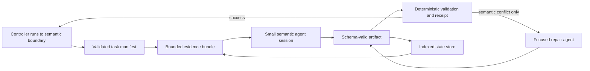

# Threat-analysis context cost and state architecture

Date: 2026-08-05
Status: verified analysis; no runtime change implemented
Primary benchmark: OWASP Juice Shop thorough run `003c27f7-83e6-4b01-b46a-cadb493c69e1`

## Decision

The threat analyst does not need its complete conversational history across all
of its turns. It needs the current phase contract, a compact run manifest, the
validated outputs of preceding phases, and targeted evidence on demand. The
current three-session split preserves the filesystem as authoritative state,
but every threat-analyst session still starts with the same approximately
66.3k-token context and then accumulates tool results until it exits or Claude
Code compacts it.

The avoidable cost is larger than the initial prompt-only estimate:

- Shrinking the repeated threat-analyst startup context from about 66.3k to
  30k tokens saves approximately **USD 1.84** on the measured run even if turn
  count and all later behavior stay unchanged.
- Combining phase-specific prompts, schema-validated state rehydration, compact
  tool receipts, and fewer model roundtrips should save approximately
  **USD 2.5-4.0 within the threat-analyst role**, or 37-59% of that role's
  measured USD 6.80.
- Applying the same architecture to the thin top-level controller and the
  per-component STRIDE prompt should save approximately **USD 8-12 per thorough
  run**, or 20-30% of the reconstructed USD 40.69 benchmark.
- A 32-39% pipeline reduction is technically conceivable, but it is an
  aggressive target that needs finding-level quality evaluation. More than
  about 40% is unlikely to be quality-equivalent without changing model tier,
  analysis scope, or verification depth.

Prompt caching alone is not the answer. It makes repeated context cheaper but
does not remove that context from the model window. The preferred design is a
validated state machine with small semantic sessions and targeted state reads.
Claude Code's automatic context cleanup is a safety net, not a controllable
substitute for that architecture. Direct API context editing remains an
optional future optimization only if its integration cost is justified.

The design should share authoritative state, not a complete live conversation.
Keep a small common prompt kernel for invariants that every semantic agent must
obey. Persist the complete cross-phase state as validated artifacts and pass
only a compact manifest plus targeted projections to each session.

The first optimization boundary is context admission: reduce what the plugin
places in a session before its first model turn. Session splitting, compact
receipts, and targeted reads then keep that smaller context from growing back.
Context editing and summary compaction act only on residual growth and must not
be used to compensate for an oversized initial prompt.

The second optimization boundary is model-turn admission. The model should not
advance the workflow, poll state, format commands, or interpret successful
validator output when deterministic code can do so. The first release target
is to reduce the measured 928 usage turns to at most 700 while preserving model
tier, assessment depth, selected components, and quality gates. A target near
650 is reasonable only after the 700-turn quality gate holds across repeated
runs.

## Scope and benchmark identity

The benchmark is the latest completed result under
`/home/mrohr/juice-shop/docs/security` at analysis time.

| Item | Value |
|---|---|
| Juice Shop repository | `/home/mrohr/juice-shop` |
| Juice Shop commit | `33518f5a0911e25d9df747b1e70fb7af279a755c` |
| Plugin repository | `/home/mrohr/appsec-advisor` |
| Plugin commit before this document | `d9f6bdef0c2ca64f409e6b789c977f9ece159772` |
| Run ID | `003c27f7-83e6-4b01-b46a-cadb493c69e1` |
| Run configuration | `/home/mrohr/juice-shop/docs/security/.skill-config.json` |
| Stage summary | `/home/mrohr/juice-shop/docs/security/.stage-stats.jsonl` |
| Final named report | `/home/mrohr/juice-shop/docs/security/threat-model-juice-shop-thorough-v0.5.2.md` |
| Final report timestamp | `2026-08-03 01:01:50.372557076 +0200` |
| Main Claude transcript | `/home/mrohr/.claude/projects/-home-mrohr-juice-shop/003c27f7-83e6-4b01-b46a-cadb493c69e1.jsonl` |
| Subagent transcripts | `/home/mrohr/.claude/projects/-home-mrohr-juice-shop/003c27f7-83e6-4b01-b46a-cadb493c69e1/subagents/` |
| Claude Code recorded in run | `2.1.220` |
| Claude Code inspected for context-editing access | `2.1.221` |

The run used `thorough`, `full`, ten STRIDE components, Opus 5 for STRIDE,
Sonnet 4.6 for the top-level and threat-analyst sessions, extended QA, and no
cheap STRIDE. The exact invocation is retained in `.skill-config.json`.

The interactive main session continued after the assessment and therefore its
event and hook logs contain later development work. This analysis cuts the main
JSONL at `2026-08-02T23:02:00Z`, immediately after the final named report was
written. All 29 subagent transcripts end before that cutoff. Raw final hook
totals are not a valid run boundary for this benchmark.

## Measurement method

Claude JSONL may repeat one usage snapshot for several content blocks. Counts
were deduplicated by `message.id`, matching `scripts/context_window_report.py`.
For one model turn:

```text
resident input = input_tokens
               + cache_creation_input_tokens
               + cache_read_input_tokens
```

`cache_read_input_tokens` is per-turn throughput. It is not current window
occupancy. Summing it is nevertheless the relevant cost measure because a token
retained in the conversation is served again on later turns.

The principal reproducibility command for the three threat sessions is:

```bash
python3 scripts/context_window_report.py --json --turn-diagnostics \
  /home/mrohr/.claude/projects/-home-mrohr-juice-shop/003c27f7-83e6-4b01-b46a-cadb493c69e1/subagents/agent-a249115917e51d8cb.jsonl \
  /home/mrohr/.claude/projects/-home-mrohr-juice-shop/003c27f7-83e6-4b01-b46a-cadb493c69e1/subagents/agent-a4bcfda6be804dfd3.jsonl \
  /home/mrohr/.claude/projects/-home-mrohr-juice-shop/003c27f7-83e6-4b01-b46a-cadb493c69e1/subagents/agent-a9172099c47d5a875.jsonl
```

Turn diagnostics aggregate all assistant content blocks by `message.id` before
classification. The primary-category precedence is agent dispatch, repair,
artifact write, validation, status or logging, workflow routing, evidence
request, then semantic decision. Mixed, low-confidence, and unclassified turns
require manual adjudication before a zero-turn claim. Transcript usage measures
assembled resident context and does not attribute runtime, agent, task, tool
schema, or preloaded-skill startup layers.

The fixed 30-session benchmark, including the bounded main-session transcript,
is reproduced with:

```bash
python3 scripts/context_window_report.py --json --turn-diagnostics \
  --before 2026-08-02T23:02:00Z \
  /home/mrohr/.claude/projects/-home-mrohr-juice-shop/003c27f7-83e6-4b01-b46a-cadb493c69e1.jsonl \
  /home/mrohr/.claude/projects/-home-mrohr-juice-shop/003c27f7-83e6-4b01-b46a-cadb493c69e1
```

This reconstructs 928 usage turns, 2,897,245 cache-write tokens,
67,264,203 cache-read tokens, 230,524 output tokens, and USD 40.69 with the
versioned 2026-08-05 pricing table.

Token costs use the model-specific first-party list prices current on the
analysis date: Sonnet 4.6 USD 3/15 per million input/output tokens, Opus 5 USD
5/25, and the corresponding 5-minute cache-write and cache-hit rates. The
formula is:

```text
cost = input * input_rate
     + output * output_rate
     + cache_creation * 5m_cache_write_rate
     + cache_read * cache_hit_rate
```

Anthropic documents that prompt-cache hits cost 0.1 times base input and
5-minute writes cost 1.25 times base input. It also documents that tool
definitions, tool calls, and tool results count as input. See [Claude pricing](https://platform.claude.com/docs/en/about-claude/pricing)
and [tool-context management](https://platform.claude.com/docs/en/agents-and-tools/tool-use/manage-tool-context).

`scripts/verify_run_costs.py` previously priced Haiku 4.5 at USD 0.80/4.00 and
USD 1.00/0.08 for 5-minute writes/hits. The versioned 2026-08-05 table uses USD
1.00/5.00 and USD 1.25/0.10. The corrected rate produces **USD 40.69** for this
benchmark; the prior table produced USD 40.64.

## Reconstructed run cost

| Role | Sessions | Usage turns | Cache writes | Cache reads | Output | Cost |
|---|---:|---:|---:|---:|---:|---:|
| Thin top-level session | 1 | 178 | 356,359 | 18,715,573 | 96,384 | USD 8.40 |
| Threat analyst | 3 | 134 | 637,201 | 14,110,308 | 11,315 | USD 6.80 |
| Per-component STRIDE | 10 | 187 | 923,152 | 14,025,178 | 60,287 | USD 14.29 |
| Other subagents | 16 | 429 | 980,533 | 20,413,144 | 62,538 | USD 11.20 |
| **Total** | **30** | **928** | **2,897,245** | **67,264,203** | **230,524** | **USD 40.69** |

The total is an API-list-price reconstruction, not an account invoice. It
includes the main session and every subagent transcript under the run ID. The
older `docs/headless-mode.md` measurements of roughly USD 18/31/50 for
quick/standard/thorough are useful historical scale references, but they are
not same-commit A/B results and must not be substituted for this benchmark.

## Threat-analyst detail

| Semantic session | Transcript | Turns | First resident | Peak resident | Cache writes | Cache reads | Cost |
|---|---|---:|---:|---:|---:|---:|---:|
| Stage 1a, discovery and architecture | `agent-a249115917e51d8cb.jsonl` | 61 | 66,380 | 154,535 | 211,634 | 7,254,595 | USD 3.04 |
| Analyst A, controls and dispatch preparation | `agent-a4bcfda6be804dfd3.jsonl` | 25 | 66,327 | 166,509 | 219,568 | 2,732,406 | USD 1.66 |
| Analyst B, merge and triage | `agent-a9172099c47d5a875.jsonl` | 48 | 66,330 | 118,096 | 205,999 | 4,123,307 | USD 2.10 |
| **Total** | | **134** | | | **637,201** | **14,110,308** | **USD 6.80** |

Cache reads cost USD 4.23 and cache writes cost USD 2.39. Together they are
97.4% of the role's reconstructed cost. Output and uncached input account for
only USD 0.18. Optimizing generated prose or switching small deterministic
steps to a cheaper model cannot address the dominant cost by itself.

All three initial turns created a fresh approximately 66.3k-token 5-minute
cache entry and recorded zero initial cache hits:

| Session start | 5-minute cache creation | 1-hour creation | Initial cache read |
|---|---:|---:|---:|
| Stage 1a | 66,377 | 0 | 0 |
| Analyst A | 66,324 | 0 | 0 |
| Analyst B | 66,327 | 0 | 0 |

The sessions began 29 and 44 minutes apart. The observed runtime did not reuse
their common prefix across Agent invocations. A one-hour cache could reduce
cold-write cost if Claude Code exposed it for this dispatch path and preserved
the same cache key, but it would not reduce resident context or cache-read token
volume. Converting the second and third 66k writes to hits is worth only about
USD 0.46, so cache TTL is secondary.

The repeated first-turn context is consistent with the large shared agent
definition: `agents/appsec-threat-analyst.md` is 152,034 bytes. Its phase-group
files are already read lazily, but reading a file later only delays its arrival;
it does not evict it from the same session. Smaller agents in the same run
started near 20-30k resident tokens, which makes a 30k phase-specific target
plausible rather than hypothetical.

The 66.3k session-start floor served across 134 turns accounts for about 8.89M
resident-token turns. Total resident-token throughput was 14.75M, leaving about
5.86M above the startup floor. The fixed prompt and the growing history are
both material.

### What the repeated 66.3k context represents

The approximately 66.3k initial resident context is effectively a repeated
common prompt prefix, not shared memory that is paid for or loaded once. Each
threat-analyst invocation receives its own agent system prompt, dispatch task,
tool schemas, and runtime-supplied startup context. Claude Code currently
documents the latter as basic environment details, the applicable `CLAUDE.md`
hierarchy, git status, and any explicitly preloaded skills; a custom subagent
does not receive the complete default Claude Code system prompt. See [custom
subagent startup context](https://code.claude.com/docs/en/sub-agents#what-loads-at-startup).
The three session starts each recorded about 66.3k five-minute cache-creation
tokens and zero cache-read tokens. No common prefix was reused across those
Agent invocations in the benchmark.

The exact attribution within the 66.3k floor cannot be reconstructed from the
usage counters alone. `agents/appsec-threat-analyst.md` is 152,034 bytes and is
the largest avoidable contributor identified, while smaller agents in the same
run began near 20-30k resident tokens. This supports a 25-30k initial target for
phase-specific threat agents, but it does not prove that Claude Code's immutable
runtime floor or the tool-schema contribution is any exact value within that
range. Measure the new definitions rather than treating this estimate as a
contract.

The same-run starts provide stronger producer evidence than the threat-agent
measurement alone:

| Agent | Definition bytes | Declared tools | First resident |
|---|---:|---:|---:|
| Management-summary renderer | 2,540 | 3 | 20,674 |
| Context resolver | 37,139 | 3 | 29,894 |
| Threat renderer | 93,392 | 3 | 45,938 |
| Threat analyst, Stage 1a | 152,034 | 6 | 66,380 |

The management-summary renderer, context resolver, and threat renderer all used
Sonnet 4.6 and declared the same three tools. Their startup context rises with
their agent-definition size, so the definition is a demonstrated first-order
producer. The comparison is not an exact token attribution: task prompts and
runtime metadata differ, and the benchmark did not capture a `/context`
category snapshot. A controlled startup A/B must measure each layer before the
25-30k target becomes a release contract.

The observed failure to reuse the initial prefix is consistent with the three
sessions starting 29 and 44 minutes apart while their cache entries used the
five-minute lifetime. A hypothetical shared one-hour prompt cache would reduce
some initial writes, but the same prefix would still occupy the model window
and incur cache-read tokens on later turns. Its measured opportunity remains
about USD 0.46 for the second and third starts.

## Claude Code context-editing accessibility

The platform distinction is material to the implementation decision:

| Capability | Claude Code access | Control available to this plugin |
|---|---|---|
| Automatic removal of older tool outputs near the context limit | Documented Claude Code behavior | Indirect only; no tool selection or retention policy |
| Summary compaction | `/compact`, `/autocompact`, `--autocompact`, `autoCompactWindow`, and `CLAUDE_CODE_AUTO_COMPACT_WINDOW` | Threshold and summary focus, with a 100k minimum automatic-compaction window |
| Per-tool API context editing with `clear_tool_uses_20250919` | Not exposed by the inspected Claude Code Agent path | No documented CLI flag, setting, Agent frontmatter field, or per-dispatch Agent argument |
| Direct Messages API context editing | Available outside Claude Code | Full `trigger`, `keep`, `clear_at_least`, `exclude_tools`, and `clear_tool_inputs` policy |

Claude Code documents that it clears older tool outputs first and summarizes
the conversation afterward if necessary. It also documents fresh isolated
subagent contexts. See [how Claude Code manages a full context window](https://code.claude.com/docs/en/how-claude-code-works)
and [context-window controls](https://code.claude.com/docs/en/context-window).
This is automatic lifecycle behavior, not a public selective-editing contract.
The documented subagent fields include `maxTurns`, `tools`, `model`, `skills`,
and `memory`, but no `context_management` field. See [custom subagents](https://code.claude.com/docs/en/sub-agents).

Local inspection of Claude Code 2.1.221 found request serialization for the API
`context_management` field. For normal thinking-enabled requests, the policy
constructed by this build contains only `clear_thinking_20251015` with
`keep: "all"`. The documented meaning of `keep: "all"` is to preserve all
thinking blocks and maximize cache reuse. The build does not construct a
`clear_tool_uses_20250919` policy for this path. An internal
`USE_API_CONTEXT_MANAGEMENT` string is also present, but its branch is hard
disabled in this build. It is not a supported configuration surface and must
not be used as an implementation dependency.

The inspected executable has SHA-256
`60db8e88d42c24b5199c92cfd56ec88370c510c3789c6f364af748354f087ada`.
These commands reproduce the version, public CLI surface, and the relevant
version-specific request-policy function without executing the binary's
internal code:

```bash
claude --version
claude --help | rg 'autocompact|context|compact'
sha256sum /home/mrohr/.local/share/claude/versions/2.1.221
grep -abo 'function nBp' /home/mrohr/.local/share/claude/versions/2.1.221
dd if=/home/mrohr/.local/share/claude/versions/2.1.221 \
  bs=1 skip=272496600 count=300 status=none
```

The byte offset is evidence for that exact executable, not a stable Claude Code
interface. A future build must be inspected independently and judged by its
documented public surface first.

An auxiliary Juice Shop transcript from Claude Code 2.1.201 provides an
observable response example. At 421,386 cache-read input tokens the API response
reported `context_management: {"applied_edits": []}`:

`/home/mrohr/.claude/projects/-home-mrohr-juice-shop/43992925-9d60-4688-8c7e-a7fd6e2d4323.jsonl:1494`

The recorded response can be reduced to the cited fields with:

```bash
sed -n '1494p' \
  /home/mrohr/.claude/projects/-home-mrohr-juice-shop/43992925-9d60-4688-8c7e-a7fd6e2d4323.jsonl \
  | jq '{version, model: .message.model,
         cache_read: .message.usage.cache_read_input_tokens,
         context_management: .message.context_management}'
```

This sample proves that no server-side context edit was applied to that request.
It does not prove that Claude Code never performs its documented client-side
automatic cleanup, nor does it replace an A/B test on a future version. The
primary run's 2.1.220 transcript does not contain applied-edit telemetry, so no
selective deletion saving is credited in this analysis.

The direct Messages API exposes the desired fine-grained policy and reports
cleared tool uses and tokens. Tool-result clearing invalidates cached prompt
prefixes at the edit point, however, so it is not a free reduction. A useful
policy needs a sufficiently large `clear_at_least` value to repay the cache
rewrite. See [Anthropic context editing](https://platform.claude.com/docs/en/build-with-claude/context-editing).

### Prompt-only counterfactual

Assume each threat session starts at 30k instead of 66.3k, retains the same
number of turns, and changes no later tool behavior:

```text
saving = removed initial tokens * 5m cache-write rate
       + removed initial tokens * later turns * cache-hit rate
       = approximately USD 1.84
```

This is 27% of threat-analyst cost and 4.5% of total pipeline cost. It is the
low-risk lower bound for prompt modularization, not the full opportunity.

### Growing-history evidence

Threat-analyst tool results contained 518,622 characters in total:

| Session | Tool-result characters |
|---|---:|
| Stage 1a | 164,107 |
| Analyst A | 270,837 |
| Analyst B | 83,678 |

Analyst A auto-compacted at 171,885 pre-compaction tokens after reaching
166,509 measured resident tokens. That compaction took 132.337 seconds and
dropped 153,990 tokens. The main session compacted twice during the run; those
two compactions took another 257.484 seconds. The pipeline therefore spent
**389.821 seconds, or 6 minutes 29.8 seconds**, in three observed compactions.
Intentional checkpoint boundaries can avoid much of this latency and are less
lossy than an automatic prose summary.

Autocompaction is not free. It reads the large prior context, generates a
structured summary with the session's thinking configuration, and causes part
of the resulting prompt prefix to be cached again. The compact-boundary record
contains duration and before/after token counts but no usage record for the
internal summary request. Therefore the USD 40.69 reconstruction excludes any
separately billed summary usage that is absent from normal assistant-message
usage records and should be treated as a lower bound for that reason.

The first regular Analyst A turn after compaction had about 86,733 resident
input tokens, roughly 79.8k fewer than the 166,509-token pre-compaction peak.
Nine regular turns remained. Holding their work constant, this avoided roughly
0.72M cache-read token-turns, worth about USD 0.22 at the Sonnet 4.6 cache-hit
rate. The first post-compaction turn also created 34,075 cache tokens, worth
about USD 0.13 before counting the hidden summary input, output, and thinking.
The event was therefore only marginally cost-effective at best and may have
been net-cost-increasing, although it was operationally necessary to keep the
session within its context window.

This estimate is a counterfactual, not an invoice reconstruction. It assumes
the same nine later turns and approximately the same 79.8k resident reduction
per turn. Its decision value is that a lower autocompact threshold is not
automatically cheaper: it removes less context per event, can trigger more
events, and needs enough later turns to amortize summary and cache-rebuild cost.

### Why the run used 928 model turns

A usage turn is an internal model response with metered usage, not a user-facing
conversation turn. In an agentic loop, one task commonly expands into a model
decision, one or more tool calls, tool-result interpretation, a validation
call, and a repair decision. Ten parallel component agents and sixteen other
specialists multiply that loop even when the user issued only one command.

The transcripts establish the role totals, but they do not label each turn by
purpose. The practical attribution below is therefore a producer analysis, not
an exact retrospective classification:

| Role | Turns | Work that legitimately needs model judgment | Avoidable or consolidatable roundtrips |
|---|---:|---|---|
| Thin top-level session | 178 | Choosing and dispatching the next semantic specialist, presenting blockers | Status and logging, fixed routing, successful gate interpretation, repeated artifact-presence checks |
| Threat analyst | 134 | Architecture synthesis, control interpretation, unresolved merge or triage judgments | Phase routing, repeated broad reads, deterministic merge and validation commands, routine post-STRIDE progression |
| Per-component STRIDE | 187 | Evidence interpretation and six-category threat reasoning | File discovery already derivable from recon, repeated index reads, mechanical normalization, successful schema checks |
| Other subagents | 429 | Focused recon, boundary, abuse, rendering, and review judgments | Repeated startup contracts, unbatched evidence reads, status prose, deterministic success paths that re-enter a model |

The 928 turns are therefore not a minimum amount of security reasoning. They
are the observed cost of security reasoning plus workflow control, evidence
discovery, tool transport, validation, and recovery. Some multi-turn source
inspection is necessary: a model cannot reliably assess an exploit path from a
count and a hash. The reducible part is the repeated discovery and control loop
around that judgment.

Future A/B telemetry should classify each model turn as exactly one of:

- `semantic_decision`;
- `evidence_request`;
- `agent_dispatch`;
- `artifact_write`;
- `validation`;
- `repair`;
- `status_or_logging`; or
- `workflow_routing`.

The target is zero dedicated `status_or_logging` turns, no validation-only
model re-entry after a successful deterministic check, at most one
`workflow_routing` turn per semantic boundary, and repair turns only for
failures requiring new security judgment. Evidence requests remain model
turns, but should use a bounded bundle and batch independent source slices in
one call.

## Why the whole conversation is not required

The pipeline already persists the semantic state needed by later phases:

| State | Benchmark path | Size |
|---|---|---:|
| Components | `/home/mrohr/juice-shop/docs/security/.components.json` | 5,211 bytes |
| Data flows | `/home/mrohr/juice-shop/docs/security/.data-flows.json` | 5,233 bytes |
| Assets | `/home/mrohr/juice-shop/docs/security/.assets.json` | 3,685 bytes |
| Attack-surface overrides | `/home/mrohr/juice-shop/docs/security/.attack-surface-overrides.json` | 2,450 bytes |
| Trust boundaries | `/home/mrohr/juice-shop/docs/security/.trust-boundaries.json` | 8,874 bytes |
| Security controls | `/home/mrohr/juice-shop/docs/security/.security-controls.json` | 34,901 bytes |
| STRIDE dispatch context | `/home/mrohr/juice-shop/docs/security/.stride-analyst-context.json` | 15,880 bytes |
| Merged threats | `/home/mrohr/juice-shop/docs/security/.threats-merged.json` | 509,197 bytes |
| Triage flags | `/home/mrohr/juice-shop/docs/security/.triage-flags.json` | 47,785 bytes |

The correct operation is not to inject all of these files into every prompt.
It is to validate them, pass a small manifest of IDs, hashes, counts, and paths,
and load only the records needed by the current decision. The 509k merged-threat
file especially needs deterministic projections by threat ID or component,
not a complete read by each consumer.

Conversation history still has value for unresolved qualitative judgments,
ambiguous evidence, and tradeoffs that have not yet been encoded. Those should
be made explicit in a contracted decision record. Relying on implicit dialogue
memory makes resume nondeterministic and couples correctness to context-window
behavior.

## Recommended architecture



The control rule is: **Python controls execution; the model decides security
meaning.** The controller should keep running deterministic steps until the
next semantic boundary and then return one schema-valid action. It should not
ask a model to decide whether a successful validator permits the documented
next step.

Deterministic ownership includes path canonicalization, schema validation,
sorting, enum normalization, hashes, counts, stable-reference checks, fixed
next-action selection, logging, and artifact-presence gates. It does not
include inventing evidence, deciding exploitability, consolidating ambiguous
root causes, assigning unsupported severity, or manufacturing a finding to
satisfy coverage.

### Shared-context design

"Shared context" has three materially different implementations:

| Form | Assessment | Cost and quality effect |
|---|---|---|
| Common prompt prefix | Keep only a small invariant kernel | Repeated in each session and each later turn; cache reuse can make it cheaper but cannot remove it from the context window |
| Validated state on disk | Recommended shared-state mechanism | Complete state remains available without becoming resident until a consumer requests a projection |
| Continued or resumed conversation | Do not use as the cross-phase state mechanism | Preserves old tool results and dialogue, recreating the growing cache-read problem |

The shared prompt kernel should contain only rules whose absence could change
every semantic agent's behavior:

- trust and untrusted-input boundaries;
- stable-ID and artifact-authority rules;
- phase-independent schema and validation obligations;
- logging, completion, and failure semantics;
- concise shared prose and evidence invariants actually used by the agent.

Phase algorithms, complete sidecar examples, renderer-only rules, triage-only
rules, and instructions for future phases must stay out of the common kernel.
Putting the full shared state into `CLAUDE.md`, Agent frontmatter, or every
dispatch prompt would recreate the 66k floor under a different name.

### Startup context admission contract

Every plugin-authored input present before the first model turn needs an owner,
a scope, a budget, and a drift guard. The initial contract should separate these
layers instead of treating first resident context as one number:

| Layer | Owner and admission rule | Initial design budget |
|---|---|---:|
| Runtime floor | Claude Code; measure separately and do not hide it inside a plugin budget | observed, not assigned |
| Shared AppSec kernel | One shared file; only invariants required by every threat semantic role | at most 4k tokens |
| Role and phase contract | One definition per semantic role; no future-phase, renderer, repair, or unrelated mode instructions | at most 3k tokens |
| Dispatch task | Thin controller; scalar run values and paths, no artifact bodies or repeated contracts | at most 1.5k tokens |
| State manifest | Deterministic producer; IDs, constrained paths, hashes, counts, and unresolved-decision keys | below 0.5k tokens |
| Tool schemas and preloaded skills | Per-agent allow-list; admit only capabilities and skills used on that dispatch path | fit within total below |
| Total plugin-selected startup payload | Sum of kernel, role contract, dispatch, manifest, tool schemas, and preloaded skills | at most 10k tokens |

The layer figures are admission budgets to validate, not facts inferred from
file bytes. Measure static prompt layers with the provider token-counting path
or a controlled one-variable startup A/B, and measure the assembled result from
Claude JSONL usage. Record both: an aggregate 30k result can still conceal a
growing common kernel or an unrelated phase contract.

Replace the current single `threat_analyst` byte ceiling in
`data/context-budgets.yaml` with separate surfaces for the common kernel and
each semantic role when the migration is implemented. Retain byte ceilings as
fast drift guards, but add ownership checks that reject phase-exclusive
sections, full artifact examples, and tools not used by that role. The real
resident-token acceptance test remains authoritative because byte counts do not
cover runtime-supplied context or tokenizer differences.

The shared state store remains the current output directory and its contracted
artifacts. A session should initially receive a bounded manifest such as:

```json
{
  "run_id": "003c27f7-83e6-4b01-b46a-cadb493c69e1",
  "phase": "post-stride-triage",
  "artifacts": {
    "components": {
      "path": ".components.json",
      "records": 10,
      "sha256": "..."
    },
    "threats": {
      "path": ".threats-merged.json",
      "records": 87,
      "sha256": "..."
    }
  },
  "unresolved_decisions": ["boundary-disposition-004"]
}
```

Paths are constrained beneath the output directory and imported values remain
untrusted data. The agent requests deterministic projections by stable ID,
component, or unresolved-decision key. Reading an entire artifact remains an
explicit escape hatch when a cross-cutting judgment requires it.

A practical target shape is an unavoidable Claude Code runtime floor, an
at-most-10k plugin-selected startup payload, and targeted reads during the
session. Only the 25-30k total initial target is
anchored to observed smaller-agent starts; the individual layer allocations are
design budgets to validate, not measured facts.

### 1. Replace the mega prompt with semantic agents

Keep the existing `appsec-threat-analyst` name as a compatibility entry point if
needed, but dispatch smaller definitions for:

1. architecture synthesis after recon;
2. control assessment and STRIDE dispatch preparation;
3. post-STRIDE merge review and triage exceptions.

Trust-boundary analysis, STRIDE, evidence verification, deterministic merge,
and rendering already have distinct owners. A new agent should not duplicate
those responsibilities. Each semantic session receives only its phase contract
and the shared safety, prose, logging, and completion rules it actually uses.

This is real lazy loading. Merely telling the current 152k-byte agent to read
phase files later is not, because its base definition remains resident and
later reads remain in history.

### 2. Rehydrate validated state, not conversational prose

Add a compact stage receipt only if the existing checkpoint and sidecar schemas
cannot carry the required information. A receipt should contain:

- schema and producer versions;
- run ID and phase ID;
- artifact paths constrained beneath the output directory;
- content hashes, counts, and stable public IDs;
- validation status and explicit unresolved decisions;
- no report prose, evidence dumps, shell commands, or imported instructions.

Consumers validate the receipt and artifact schemas before reading targeted
slices. Imported repository strings remain untrusted data and cannot select
commands, write paths, or permissions. This architecture improves resume and
incremental correctness in addition to cost.

An LLM-authored summary must not become authoritative state. It can be an
advisory note attached to a validated receipt, but the structured artifacts and
source evidence remain canonical.

The current controller action already provides a schema-validated exchange via
`schemas/orchestration-action.schema.json`, and the existing checkpoints and
artifact schemas already rehydrate most stage state. Extend those contracts
before adding another persisted receipt. A deterministic post-agent gate should
derive hashes, counts, and validation status from disk; the agent's final
assistant message remains only the bounded notification required by
`agents/shared/completion-contract.md`.

### 3. Return compact tool receipts

Scripts should write full artifacts to disk and return bounded stdout such as:

```json
{
  "status": "ok",
  "artifact": ".security-controls.json",
  "sha256": "...",
  "records": 47,
  "warnings": 1
}
```

Add deterministic projection commands for component IDs, threat IDs, controls,
and unresolved flags. Avoid rereading whole JSON documents when a phase needs a
count, a hash, or five selected records. Batch adjacent validations and logging
operations so they produce one model roundtrip and one compact result.

For STRIDE, extend the existing per-component dispatch context rather than
injecting another inline prompt body. A bounded evidence bundle should contain
validated control and boundary records plus source-slice references such as
repository-relative file, start line, end line, and content hash. It must not
copy whole source files. The analyzer reads the bundle once, batches the
independent cited slices, and escapes to broader search only when it records why
the bundle was insufficient.

Reducing threat-analyst turns by 20-30% while holding the average context shape
constant would remove roughly 3-5M cache-read tokens, worth about USD 0.9-1.5
at Sonnet rates. This overlaps with context-clearing savings and must not be
added mechanically to every scenario.

### 4. Treat native Claude Code cleanup as a safety net

Claude Code automatically clears older tool outputs as context fills, but the
inspected 2.1.221 Agent surface does not expose which results it removes or when
it removes them. Autocompact exposes a threshold for the later summary pass,
not the API's per-tool retention policy. Therefore:

- do not assume API tool-result context editing is active in this plugin;
- do not use undocumented environment variables or binary implementation
  details as feature flags;
- prefer semantic session boundaries and compact receipts first;
- use a 100-150k autocompact window only as a measured safety net for sessions
  that can legitimately grow that large;
- keep compaction focus instructions limited to durable decisions, unresolved
  work, artifact identities, and evidence caveats;
- test native tool-result clearing behind a capability check only if a future
  documented Claude Code or Agent surface exposes it;
- do not replace the Agent tool with an SDK subprocess without separately
  tracing hooks, permissions, cost caps, cancellation, packaging, and telemetry.

For a future supported selective-editing path, a reasonable experiment is to
trigger at 90-100k input tokens, write and validate a compact checkpoint before
clearing, retain the latest three to five tool uses, exclude any tool that
returns authoritative state, and clear at least 20-30k tokens. Exact thresholds
require an A/B run because clearing too often increases cache writes.

Lowering `--autocompact` to 100k is not equivalent. Compaction creates a lossy
summary, whereas tool-result clearing can preserve structured state on disk and
remove only stale bulk. A 100k window can also compact a productive session
prematurely and pay summary latency more often. Use it only after the semantic
sessions and their expected peak sizes are known.

Replacing Claude Code Agent dispatch with direct Messages API calls solely to
obtain context editing is not recommended now. It would create a second agent
runtime and require explicit parity for hooks, permissions, tool execution,
model routing, cancellation, resume, logging, packaging, and cost enforcement.
Reconsider it only if measured post-architecture residual context cost is large
enough to justify that surface.

### 5. Keep cache TTL as a secondary lever

A shared one-hour cache for stable phase-independent instructions would reduce
some repeated cold writes. It does not change the amount of context presented
to the model and is worth less than USD 0.5 for the three measured threat
sessions. It should follow prompt modularization, not substitute for it.

### 6. Apply the same pattern to the top-level and STRIDE prompts

The thin top-level runtime is substantially better than the historical legacy
runtime, but it still used 178 turns, cost USD 8.40, and compacted twice. More
Stage 2-4 actions can be one deterministic controller call that returns a
bounded next-action receipt. The parent needs subagent status and artifact
paths, not the accumulated prose of the complete run.

The ten thorough STRIDE agents cost USD 14.29 and started near a roughly
51-52k-token floor. Removing 16-26k unused or conditional prompt tokens while
keeping the same 187 turns is worth approximately USD 2.4-3.9. Use
phase-independent safety and output contracts as the stable prefix, and load
specialized lenses only for matching component signals. All six STRIDE
categories, evidence requirements, category flushes, and completion semantics
remain mandatory.

For quick mode, a 20-26k smaller STRIDE startup prompt over ten screened
eight-turn agents is worth approximately USD 1.2-1.5 even before reducing any
turn. This is why prompt modularization matters especially in the fast tier:
short agents do less useful work over which to amortize a large cold start.

The remaining 16 subagents accumulated about 12.82M first-resident-token turns
when each session's first resident value is held across its observed turns.
That is not an avoidable-cost estimate because their definitions and platform
floors differ, but it is enough to require a second-pass admission inventory.
After the threat, STRIDE, and top-level paths are measured, rank the other roles
by fixed-prefix throughput and trim their definitions, dispatch tasks, tools,
and preloaded context in that order.

The post-STRIDE path is the highest-leverage turn-control migration. Today the
second threat analyst runs merge, deterministic posture emitters, evidence
verification, triage pre-flight, specialist dispatch, ranking, and final
synthesis. The existing `orchestration_controller.py`, `merge_threats.py`,
`triage_validate_ratings.py`, `triage_compute_ranking.py`, and
`build_threat_model_yaml.py` should own the fixed progression. Existing focused
merger and triage agents retain ambiguous semantic decisions. A small
post-STRIDE synthesis agent should run only for contracted qualitative outputs
that deterministic producers cannot derive, and a repair agent should run only
when a gate returns a semantic conflict.

## Options not recommended as the primary design

| Option | Assessment |
|---|---|
| Gzip or generic text compression | Reduces bytes at rest, not tokens after the model receives decompressed content. Useful for storage only. |
| Minified JSON | Small incremental gain. Deterministic field projection and record slicing provide much larger savings. |
| LLM summary as state | Loses evidence and decisions nondeterministically. Use schema-valid artifacts plus an optional advisory note. |
| Vector database first | Adds retrieval uncertainty and operational complexity. Stable IDs and deterministic indexes fit the current artifacts better. |
| Larger context window | Avoids a hard limit but does not reduce cache-read volume or cost. |
| One-hour prompt cache alone | Reduces cold-write cost only and depends on cross-session cache-key reuse that was not observed. |
| Full shared live conversation | Retains implicit decisions but also all stale tool results and dialogue. Use explicit decision records and fresh semantic sessions instead. |
| Full shared state injected into every prompt | Makes state immediately visible but recreates the repeated resident-token floor. Pass a manifest and load projections on demand. |
| More automatic compaction | Can reduce later context but adds latency and lossy summaries. Use validated checkpoints and semantic session boundaries first. |
| Undocumented Claude Code context-management flag | The inspected build has internal code but no supported user or Agent control. It can change without notice and is not an implementation option. |
| Direct Messages API solely for context editing | Exposes the desired policy but creates a parallel runtime with hooks, permissions, resume, and telemetry obligations. Reconsider only after the lower-risk architecture is measured. |
| Cheaper model routing | Can save more dollars but changes reasoning quality. Treat it as a separate product-mode decision, not a context optimization. |

## Savings scenarios

The ranges below avoid counting the same removed token once as prompt trimming,
once as context editing, and once as turn reduction.

| Scenario | Changes | Thorough saving | Share of USD 40.69 | Expected impact |
|---|---|---:|---:|---|
| Conservative | Threat prompt modularization, compact receipts, modest top-level batching | USD 4-7 | 10-17% | Low quality risk; mostly removes duplicated instructions and status text |
| Recommended | Semantic threat agents, validated rehydration, compact tool results, deterministic run-to-boundary control, conditional STRIDE prompt, at least 25% fewer usage turns | **USD 8-12** | **20-30%** | Moderate implementation complexity; coverage should remain unchanged |
| Aggressive | Recommended design plus a future supported selective-clearing path and deeper STRIDE/main turn consolidation | USD 13-16 | 32-39% | Not currently implementable through plugin Agent dispatch; higher regression and cache-invalidation risk |

An Opus-to-Sonnet STRIDE switch would have saved approximately USD 5.7 on the
same recorded token counts, but the turn pattern and findings would not remain
the same. It is excluded from the quality-equivalent architecture totals.

### Mode projection

No same-commit quick/standard/thorough A/B exists for the latest Juice Shop run.
These are projections anchored to the latest thorough trace and the historical
USD 18/31/50 mode measurements in `docs/headless-mode.md`, not verified mode
benchmarks.

| Mode | Existing STRIDE soft targets | Context architecture effect | Provisional saving |
|---|---|---|---:|
| Quick | Full-depth components: 10/15/20 turns by complexity; screened cheap-STRIDE components: flat 8 turns | Highest proportional cold-prompt benefit; automatic cleanup and compaction often will not trigger because sessions are short | about USD 3-5, or 15-25% of a historical USD 18 run |
| Standard | Full-depth components: 15/22/31; screened cheap-STRIDE components: flat 8 | Balanced benefit from prompt trimming and compact results | about USD 6-9, or 18-28% of a historical USD 31 run |
| Thorough | 20/28/35; cheap STRIDE off by default | Largest absolute benefit from semantic boundaries and avoiding compaction | **USD 8-12, or 20-30% of this USD 40.69 run** |

The per-component figures are soft dispatch targets. The STRIDE agent's hard
harness ceiling is 96 turns, and deterministic file-footprint rules can derive
up to 80 working turns plus a 16-turn wrap-up buffer. The threat analyst has a
depth-independent hard `maxTurns: 300`; the phase-limited benchmark sessions
actually used 61, 25, and 48 usage turns. This proposal reduces context and
roundtrips, not STRIDE category coverage or hard safety ceilings.

## Effects and risks

### Expected benefits

- lower list-price-equivalent cost and token-rate pressure;
- lower peak resident context and fewer six-figure cache reads;
- fewer or shorter automatic compactions and lower tail latency;
- more deterministic resume and incremental execution;
- clearer producer/consumer boundaries and easier per-phase cost attribution;
- smaller prompts that make quick mode behave more like a fast mode.

### Engineering and quality risks

- State can drift if producer, schema, validator, and consumer are not changed
  atomically.
- An over-aggressive state projection can hide a cross-phase qualitative
  decision or evidence caveat.
- More sessions create more cold cache writes; splitting every phase is worse
  than using a few coherent semantic islands.
- Context editing can invalidate a useful prompt cache and cost more if it
  clears too little or too often.
- Session boundaries increase dispatch and rehydration latency for short work.
- Additional sidecars require cleanup, checkpoint, permission, packaging, and
  resume tests.
- LLM output variance can make a single run look cheaper or better by chance.

## Implementation order

The executable work packages, contract traces, rollout slices, and repository
gates are defined in
`docs/internal/analysis/implplan-threat-analysis-context-and-turn-reduction-2026-08-05.md`.
Their required order is:

1. Add per-session startup-layer and per-turn-purpose telemetry without changing
   runtime behavior.
2. Define the startup admission contract and bounded evidence-bundle contract.
3. Extend the current orchestration action and controller so deterministic work
   runs to the next semantic boundary and returns one bounded receipt.
4. Atomically add evidence projections, split the three threat semantic roles,
   and move post-STRIDE fixed progression out of the mega-agent. Do not ship a
   smaller prompt before its validated inputs and consumers exist.
5. A/B the full/rebuild threat path on the same Claude Code version, model
   routing, commit, and configuration.
6. Apply the proven pattern to the STRIDE definition and top-level Stage 2-4
   path, then rank the remaining roles by fixed-prefix throughput.
7. Migrate incremental and resume only after full/rebuild parity.
8. Tune compaction or test a future supported selective-clearing capability only
   against residual cost after the architecture migration.

## Verification plan and acceptance criteria

Use the same Juice Shop commit, plugin commit, invocation flags, model IDs,
concurrency, and output formats. Start fresh Claude sessions and record cache
creation policy. Run at least three baseline and three variant assessments for
each mode before using averages for a release claim.

The variant must satisfy all existing deterministic gates plus these
comparisons:

- identical component inventory and selection decisions;
- all six STRIDE categories completed for every selected component;
- no decrease in schema-valid evidence-backed findings against a neutral golden
  fixture and no unexplained Juice Shop finding loss;
- no weakening of severity caps, CVSS eligibility, T/F identity, cross-links,
  or renderer/QA gates;
- no increase in unsupported, ambiguous, rejected, or duplicate findings;
- no increase in repair-loop frequency or incomplete agent exits;
- full, incremental, resume, rebuild, and failure-recovery parity;
- p50 cost reduction at least 15% for quick and 20% for thorough;
- p50 total usage turns at or below 700 on the target thorough fixture, from the
  measured 928 baseline, with a later stretch target at or below 650 only after
  the quality gate holds;
- every measured model turn assigned one turn-purpose category, with zero
  dedicated `status_or_logging` turns, no validation-only model re-entry after
  successful deterministic validation, and at most one `workflow_routing` turn
  per semantic boundary;
- a recorded startup breakdown for the runtime floor, shared kernel, role/phase
  contract, dispatch task, state manifest, and tool/skill surface;
- shared AppSec kernel at or below 4k tokens, each phase contract at or below 3k
  tokens, and the total plugin-selected startup payload at or below 10k tokens,
  unless an explicit quality A/B justifies a narrowly scoped exception;
- initial resident context at or below 30k for each threat semantic session,
  unless measurement proves a higher immutable Claude Code floor;
- no complete shared analysis artifact in the common prompt or initial dispatch;
- no renderer, repair, future-phase, or mode-specific algorithm in the shared
  kernel, and no unused tool or preloaded skill in a semantic agent definition;
- peak resident context below 120k for threat semantic sessions, with no
  automatic threat-session compaction in the target fixture.

Record findings by stable mechanism/evidence identity rather than generated
wording. A single cheaper run is insufficient evidence because model turn count
and finding expression vary naturally.

## Falsifiers and open questions

The recommendation should be revised if any of the following is observed:

- a same-commit A/B shows the 66k initial floor is primarily Claude Code runtime
  overhead unrelated to the agent definition or selected tool surface;
- phase-specific agents repeatedly reread enough artifacts to erase their prompt
  savings;
- cross-session cache reuse makes cold-write assumptions materially wrong;
- a future Claude Code release documents and applies selective tool-result
  editing by default, materially changing the architectural baseline;
- finding recall drops after explicit decision receipts and targeted state reads;
- dispatch startup latency dominates quick-mode wall time.

The current platform answer is that Claude Code performs automatic cleanup but
does not expose selective `context_management` controls to plugin Agents. The
remaining platform question is whether a future documented Agent surface will
add per-tool policy and clearing telemetry. The recommended architecture does
not depend on that feature; it only increases the attainable saving once
semantic state is safely persisted.
