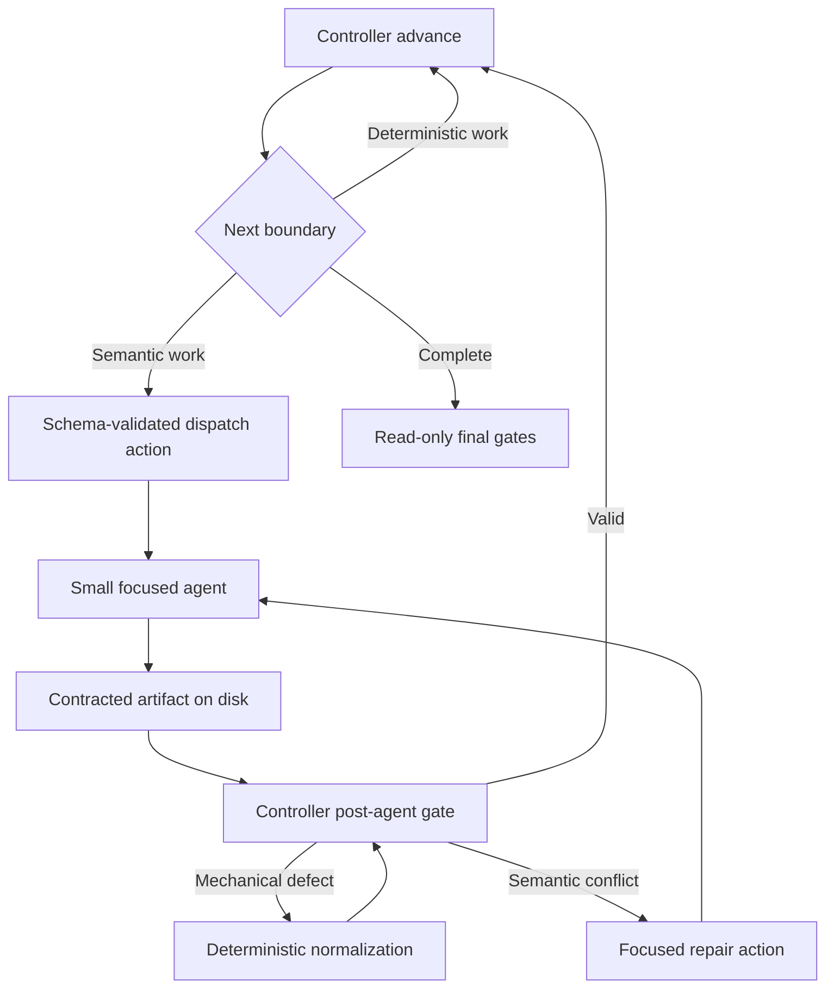

# Implementation plan — threat-analysis context and turn reduction

- Date: 2026-08-05
- Base: `d9f6bdef0c2ca64f409e6b789c977f9ece159772`
- Primary replay target: OWASP Juice Shop run
  `003c27f7-83e6-4b01-b46a-cadb493c69e1`
- Related:

  - `docs/internal/analysis/analysis-threat-analyst-context-cost-2026-08-05.md`
  - `docs/internal/contracts/orchestration-actions.md`
  - `docs/internal/contracts/schema-invariants.md`
  - `agents/shared/completion-contract.md`
  - `docs/internal/analysis/implplan-dedicated-trust-boundary-assessment-stage-2026-07-27.md`

## Status and decision

Implement the cost reduction as an extension of the existing deterministic
control plane. Do not introduce a second orchestrator and do not treat
compaction as the primary optimization.

The execution rule is:

```text
Python controls execution and validates state.
The model decides security meaning at explicit semantic boundaries.
The filesystem remains authoritative between boundaries.
```

The migration has two independent but complementary admission gates:

1. context admission limits what enters a semantic session and what later tool
   results remain useful;
2. turn admission prevents status, fixed routing, successful validation, and
   mechanical normalization from entering a model loop at all.

The first release target is a p50 reduction from 928 to at most 700 usage turns
on the fixed thorough benchmark, together with at least 20% reconstructed cost
reduction. A later 650-turn target is a stretch goal, not a release gate for the
first migration.

## Verified starting point

The measured thorough run used 30 sessions, 928 usage turns, 67.26M cache-read
tokens, 2.90M cache-write tokens, and USD 40.69 at list price. The role split
was:

| Role | Sessions | Turns | Reconstructed cost |
|---|---:|---:|---:|
| Thin top-level | 1 | 178 | USD 8.40 |
| Threat analyst | 3 | 134 | USD 6.80 |
| STRIDE analyzers | 10 | 187 | USD 14.29 |
| Other subagents | 16 | 429 | USD 11.20 |

The current architecture already provides the foundation for this plan:

- `scripts/orchestration_controller.py` validates every action against
  `schemas/orchestration-action.schema.json` and already owns many post-stage
  gates.
- `skills/create-threat-model/SKILL-thin-stage1.md` already dispatches Stage 1a,
  Stage 1b, Analyst A, bounded STRIDE waves, and Analyst B as separate contexts.
- `scripts/build_stride_dispatch_manifest.py` already builds a schema-validated
  component manifest and references per-component `.dispatch-context/` files.
- `scripts/stride_dispatch_waves.py` already owns bounded scheduling and retry
  state.
- `merge_threats.py`, `triage_validate_ratings.py`,
  `triage_compute_ranking.py`, and `build_threat_model_yaml.py` already own much
  of the post-STRIDE deterministic progression.
- `agents/shared/completion-contract.md` already prevents artifact prose from
  being copied into the parent conversation.

The remaining defect is ownership. The 152,034-byte threat-analyst definition
still carries multiple phase algorithms, and Analyst B still acts as a workflow
engine around deterministic scripts and focused specialists. STRIDE agents
still discover and reread evidence that the pipeline can project before
dispatch.

## Goals

1. Keep plugin-selected startup payload at or below 10k tokens per new threat
   semantic role and initial resident context at or below 30k when the runtime
   floor permits it.
2. Reduce the target thorough run to at most 700 p50 usage turns without model,
   depth, selected-component, or quality-gate changes.
3. Make successful deterministic validation and its fixed successor one
   controller operation, without a validation-only model re-entry.
4. Make status and logging consume zero dedicated model turns.
5. Give each semantic role only its current contract, bounded state manifest,
   necessary tools, and targeted evidence.
6. Keep all six STRIDE categories and existing evidence requirements mandatory.
7. Preserve existing artifact formats, T/F identity, severity rules, resume
   behavior, and renderer/QA ownership.
8. Keep the current Agent runtime, hooks, permission model, cancellation, and
   telemetry surfaces.

## Non-goals

- Do not reduce assessment depth, selected components, evidence standards, or
  verification merely to meet a token target.
- Do not switch Opus work to Sonnet or Sonnet work to Haiku as part of this
  migration.
- Do not put the complete shared state into `CLAUDE.md`, agent definitions, or
  dispatch prompts.
- Do not make an LLM-authored summary or completion message authoritative.
- Do not add a vector store or direct Messages API runtime.
- Do not depend on undocumented Claude Code context-management flags.
- Do not lower autocompaction thresholds until the new session peaks are
  measured.
- Do not rewrite deterministic merge, ranking, or stable-ID algorithms in
  prompts.

## Target execution model



The skill remains the Agent-call execution shim because the Python controller
cannot invoke Claude Agent tools. The controller owns every fixed decision up
to that call: which plugin-owned role is allowed, which bounded inputs it
receives, which artifacts must appear, which validators run, and which fixed
stage follows success.

One controller action may request a bounded parallel wave. The skill issues all
Agent tool blocks in one assistant message, as it already does for STRIDE. The
action must never contain repository-selected agent names, commands,
instruction files, tools, or write paths.

## Turn-admission contract

Every measured model turn receives one diagnostic category:

| Category | Owner after migration | Admission rule |
|---|---|---|
| `semantic_decision` | Focused agent | Admit only when evidence requires qualitative security judgment |
| `evidence_request` | Focused agent | Use the bounded bundle first and batch independent slices |
| `agent_dispatch` | Thin skill | At most one parent turn per semantic boundary or parallel wave |
| `artifact_write` | Focused agent | One contracted write phase per semantic output where practical |
| `validation` | Controller | No validation-only model turn on success |
| `repair` | Deterministic normalizer or focused repair agent | Dispatch a model only for semantic conflicts |
| `status_or_logging` | Python event writers | Zero dedicated model turns |
| `workflow_routing` | Controller | At most one parent turn per semantic boundary |

Extend `scripts/context_window_report.py` rather than adding a production
sidecar. Its optional JSON diagnostic output should classify deduplicated
assistant usage records from transcript tool calls with a documented precedence
rule and report mixed or low-confidence classifications separately. This is
benchmark telemetry, not authoritative runtime state.

The classifier must distinguish a batched turn from its number of tool uses.
One response that dispatches eight STRIDE agents is one parent
`agent_dispatch` turn, not eight turns. Subagent turns remain counted in their
own transcripts.

## Context-admission contract

Create one concise shared threat-analysis kernel containing only:

- untrusted-input and evidence rules;
- stable-ID and artifact-authority rules;
- phase-independent severity and CVSS boundaries;
- validation, failure, logging, and completion semantics; and
- shared prose rules used by every threat semantic role.

Keep phase algorithms, renderer rules, repair instructions, mode branches,
large examples, and future-phase work outside the kernel. The initial budgets
are:

| Surface | Maximum |
|---|---:|
| Shared kernel | 4k tokens |
| One role contract | 3k tokens |
| Dispatch task | 1.5k tokens |
| State manifest | 0.5k tokens |
| Total plugin-selected startup payload, including tools and preloaded skills | 10k tokens |
| Initial resident context, including measured runtime floor | 30k tokens |

Replace the single `threat_analyst` byte allowance in
`data/context-budgets.yaml` with separate kernel and role surfaces. Retain byte
limits as fast drift guards, but use transcript token measurements for release
acceptance.

## Contract changes

### Contract A — orchestration action receipts and dispatch jobs

Extend, do not replace:

```text
scripts/orchestration_controller.py
schemas/orchestration-action.schema.json
docs/internal/contracts/orchestration-actions.md
```

Add bounded, controller-authored fields for:

- plugin-owned semantic role enum;
- bounded parallel dispatch jobs;
- artifact path, schema identity, SHA-256, record count, and validation status;
- unresolved semantic decision keys; and
- fixed resume action.

The schema must cap array sizes and strings, reject unknown properties, and
constrain artifact paths beneath the output directory. The controller derives
receipts from files after validation. Agent prose cannot populate them.

The action remains ephemeral. Do not add a persisted stage-receipt sidecar
unless resume testing proves that current checkpoints and contracted artifacts
cannot reconstruct the action.

### Contract B — per-component STRIDE evidence bundle

Add:

```text
schemas/stride-evidence-bundle.schema.json
scripts/build_stride_evidence_bundles.py
$OUTPUT_DIR/.dispatch-context/<component-id>/evidence-bundle.json
```

The producer consumes only validated current artifacts and emits bounded
component-local data:

- component identity and selected paths;
- interfaces and trust-boundary crossings;
- relevant actors and security controls;
- known-threat, prior-finding, requirements, and cross-repository references;
- deterministic recon signals; and
- source-slice references with repository-relative file, start line, end line,
  signal kind, and content hash.

It must not copy complete source files, choose findings, assign severity, or
turn imported strings into commands or instruction paths. Slice ranges and
array sizes need explicit caps with deterministic risk ordering and disclosure
when truncation occurs.

Extend `schemas/stride-dispatch-manifest.schema.yaml` and
`build_stride_dispatch_manifest.py` with the bundle path and fingerprint. Keep
the existing individual index paths during the migration for compatibility.
`validate_dispatch_manifest.py` must validate the bundle and its component ID
before dispatch.

The existing `.dispatch-context/` cleanup entry already covers the new file.
Update permission rationale, cleanup tests, and diagnostic inventory only where
the new producer or artifact changes their actual contract.

### Contract C — semantic role outputs

Add focused definitions for these responsibilities:

```text
agents/appsec-architecture-analyst.md
agents/appsec-control-analyst.md
agents/appsec-post-stride-synthesizer.md
```

- The architecture analyst consumes completed recon and contracted topology
  inputs. It writes the existing architecture-stage artifacts and does not
  dispatch other agents or run downstream gates.
- The control analyst consumes validated architecture, boundary, and control
  inputs. It writes the existing Phase-8 control and STRIDE-context artifacts
  and does not dispatch STRIDE.
- The post-STRIDE synthesizer runs only for qualitative mitigation overrides,
  cross-finding root-cause synthesis, or other explicitly contracted outputs
  that deterministic producers cannot derive. It does not run merge, ranking,
  YAML build, validators, logging, or stage routing.

Keep `agents/appsec-threat-analyst.md` as the legacy path until full/rebuild,
incremental, and resume parity are complete. Do not let new and legacy agents
write the same artifact in one run.

### Contract D — post-STRIDE progression

Move fixed progression from Analyst B into controller commands backed by the
existing scripts:

```text
STRIDE verify
  -> merge_threats.py collect
  -> focused merger only when ambiguous groups exist
  -> merge_threats.py finalize
  -> deterministic Phase-10 posture emitters
  -> evidence-verifier dispatch only when its sampling contract selects work
  -> triage_validate_ratings.py
  -> focused triage validator
  -> triage_compute_ranking.py
  -> focused post-STRIDE synthesis only when required
  -> build_threat_model_yaml.py
  -> validate_intermediate.py and completeness gates
```

Each controller command runs until the next semantic dispatch or a blocker. A
successful empty candidate set skips its specialist. A validator success never
returns a repair action. A mechanical defect is normalized only where the
relevant contract already permits normalization. An ambiguous merge, evidence
conflict, or unsupported qualitative synthesis may return a focused semantic
action.

The deterministic ordering, stable-ID allocation, severity caps, CVSS
eligibility, and current failure semantics remain authoritative. Remove any
inline LLM fallback that would reimplement a deterministic script.

## Work packages

### WP0 — freeze measurement and add turn telemetry

Change:

- `scripts/context_window_report.py`;
- `tests/test_context_window_report.py`;
- `scripts/verify_run_costs.py` and `tests/test_verify_run_costs.py` for the
  separately identified Haiku 4.5 pricing correction; and
- the benchmark command in the related analysis.

Add startup-layer reporting, role totals, turn-purpose classification,
compaction duration, and unclassified/mixed-turn disclosure. Reproduce the
existing totals before changing runtime behavior.

Exit gate: the report reconstructs 928 turns and USD 40.69 from the fixed run,
and all existing output remains backward compatible unless a new flag is used.

### WP1 — land schemas, admission budgets, and security constraints

Change:

- `data/context-budgets.yaml`;
- `tests/test_prompt_token_bounds.py`;
- `tests/test_agent_definitions.py`;
- `schemas/orchestration-action.schema.json`;
- `docs/internal/contracts/orchestration-actions.md`;
- `data/required-permissions.yaml`; and
- permission coverage tests.

Add the shared kernel, role surfaces, bounded dispatch-job shape, artifact
receipt shape, and evidence-bundle schema. No runtime selects the new path yet.

Exit gate: schema tests reject traversal, absolute paths, unknown roles,
repository-selected instruction paths, oversized arrays, duplicate component
IDs, and unbounded strings.

### WP2 — build and validate evidence bundles

Implement `build_stride_evidence_bundles.py` with its mandatory
`tests/test_build_stride_evidence_bundles.py`. Wire it into manifest production
and validation behind a temporary internal rollout switch.

Update:

- `scripts/build_stride_dispatch_manifest.py`;
- `scripts/validate_dispatch_manifest.py`;
- `schemas/stride-dispatch-manifest.schema.yaml`;
- `tests/test_dispatch_manifest.py`;
- `tests/test_validate_dispatch_manifest.py`; and
- cleanup, diagnostic, and permission tests when their contracts require it.

Exit gate: the same selected component set is produced, every selected
component has a valid bundle, imported data cannot alter paths or execution,
and bundle omission fails before Agent dispatch on the new path.

### WP3 — extend the controller to run to semantic boundaries

Add controller actions for STRIDE preparation, post-wave verification,
conditional merge review, post-merge progression, conditional triage, and
post-triage finalization. Reuse the current action schema and controller; do not
add a parallel state machine.

Change:

- `scripts/orchestration_controller.py`;
- `skills/create-threat-model/SKILL-thin-stage1.md`;
- `docs/internal/contracts/orchestration-actions.md`;
- `tests/test_orchestration_controller.py`;
- `tests/test_stage1_dispatch_contract.py`;
- `tests/test_dispatch_prompt_cache_order.py`; and
- the existing merge, triage, and checkpoint tests touched by ownership changes.

The thin skill should perform only fixed presentation, one controller call,
and the returned Agent wave. Logging and stats commands should be part of the
controller operation where their contract allows it.

Exit gate: on a success-only fixture, post-STRIDE deterministic progression
does not enter the threat analyst. Candidate-free merge and triage branches
skip their specialists. Every semantic dispatch is allow-listed and bounded.

### WP4 — split threat semantic roles atomically

Add the three focused agent definitions and switch only thin full/rebuild runs
to them behind the rollout switch. Move specialist fan-out and gates to the
controller/skill boundary before removing those instructions from the legacy
definition.

Change:

- the new agent files;
- `skills/create-threat-model/SKILL-thin-stage1.md`;
- relevant phase-group files so each algorithm has one owner;
- `data/context-budgets.yaml`;
- `tests/test_agent_definitions.py`;
- `tests/test_prompt_token_bounds.py`; and
- stage artifact and checkpoint tests.

This package activates only together with WP1-WP3. A small prompt without its
validated projection is not a shippable intermediate state.

Exit gate: each new role starts at or below the admission budgets, has no unused
tool or preloaded skill, cannot execute future phases, and produces the same
contracted artifacts and checkpoints as the legacy full/rebuild path.

### WP5 — modularize the STRIDE agent

Reduce `agents/appsec-stride-analyzer.md` to the mandatory six-category
workflow, evidence rules, output contract, and failure semantics. Put optional
component lenses in plugin-owned bounded files selected only from validated
feature enums. Repository content may select data values but never a lens path.

The analyzer must:

1. read its evidence bundle once;
2. batch independent source slices;
3. record a bounded escape reason before broader discovery;
4. keep all six categories mandatory; and
5. leave schema validation and mechanical repair to the post-agent gate.

Update agent, manifest, caching-order, token-bound, dispatch, and STRIDE golden
tests. Preserve cheap-STRIDE pacing and full-depth exclusions exactly.

Exit gate: first resident STRIDE context falls by at least 16k tokens against
the fixed run, selected-component and six-category coverage are unchanged, and
broader-search escapes are measurable.

### WP6 — reduce top-level and remaining fixed-prefix throughput

After WP0-WP5 pass A/B, apply the same action-receipt and admission inventory to
Stage 2-4 and then to other roles ranked by:

```text
first resident tokens * observed turns
```

Extend `orchestration_controller.py` only where deterministic work currently
returns to the parent before another semantic boundary. Do not merge renderer,
QA, or architect-review semantics into the controller.

Exit gate: no status-only or successful-validation turn remains in the thin
top-level trace, and renderer/QA mutation order is unchanged.

### WP7 — incremental, resume, and default rollout

Keep incremental and resume on the legacy threat analyst until full/rebuild
parity is established. Then migrate one mode at a time with checkpoint,
preserved-state, stable-ID, retry-budget, and cleanup tests.

Retain `APPSEC_THIN_ORCHESTRATOR=0` as the documented legacy escape hatch. The
temporary context-v2 switch may become the default only after the acceptance
matrix passes; remove it once both paths no longer need side-by-side A/B.

## Rollout slices

| Slice | Default behavior | Purpose |
|---|---|---|
| A | Existing runtime | WP0 telemetry only |
| B | Existing runtime; context-v2 opt-in | WP1-WP3 contracts, bundles, and controller actions |
| C | Context-v2 opt-in for full/rebuild | WP4 focused threat roles |
| D | Context-v2 opt-in for full/rebuild | WP5 STRIDE modularization |
| E | Context-v2 default for full/rebuild | WP6 top-level changes after A/B |
| F | Context-v2 default for all supported modes | WP7 incremental and resume parity |

Each slice must be revertible by selection of the prior runtime. Do not keep
two producers active for the same artifact within one invocation.

## Verification matrix

Use the same target commit, Claude Code version, models, depth, concurrency,
formats, and clean-session conditions. Run at least three baselines and three
variants before evaluating p50 cost or turns.

Required behavior coverage:

| Dimension | Cases |
|---|---|
| Mode | full, rebuild, incremental, resume |
| Depth | quick, standard, thorough |
| STRIDE execution | parallel, serial fallback, bounded retry, blocked component |
| Merge | no candidates, ambiguous candidates, failed specialist, invalid decision artifact |
| Triage | no flags, semantic flags, missing specialist output, invalid output |
| State | fresh output, preserved baseline, stale checkpoint, corrupted sidecar |
| Report path | normal Stage 2, rerender, Stage 3 skipped, Stage 4 repair plan |

Compare findings by stable mechanism, evidence location, component, and public
identity rather than generated title wording.

## Acceptance criteria

Quality and compatibility:

- identical finalized component inventory and STRIDE selection;
- all six STRIDE categories completed for every selected component;
- no unexplained loss of schema-valid evidence-backed findings;
- no weakening of severity caps, CVSS eligibility, T/F identity, cross-links,
  cleanup, permission, renderer, QA, or architect-review gates;
- no increase in unsupported, rejected, ambiguous, or duplicate findings;
- no increase in incomplete exits or semantic repair frequency; and
- full/rebuild parity before incremental/resume activation.

Context and turns:

- shared kernel at or below 4k tokens;
- each focused role contract at or below 3k tokens;
- total plugin-selected startup payload at or below 10k tokens;
- initial resident context at or below 30k for each focused threat role unless
  a controlled A/B proves a higher immutable runtime floor;
- peak threat-role context below 120k with no automatic compaction on the target
  fixture;
- p50 total usage turns at or below 700 from the 928-turn baseline;
- zero dedicated `status_or_logging` turns;
- no validation-only model re-entry after successful deterministic validation;
- at most one `workflow_routing` turn per semantic boundary; and
- no complete shared analysis artifact in a common prompt or initial dispatch.

Cost and latency:

- p50 reconstructed cost reduction of at least 15% at quick and 20% at
  thorough;
- no compaction latency in focused threat sessions on the target fixture; and
- no regression in p50 wall time after controlling for model variance and
  concurrency.

Repository gates:

- targeted schema, controller, dispatch, permissions, cleanup, checkpoint,
  resume, and golden-fixture tests pass;
- every new `scripts/` module has a matching `tests/test_*.py` covering success
  and failure paths;
- `make lint` passes;
- `make test` passes; and
- `make check` passes before default rollout.

## Risks and mitigations

| Risk | Mitigation |
|---|---|
| A projection hides cross-cutting evidence | Preserve bounded escape reads, record the reason, and compare escape and finding rates in A/B |
| Session splitting increases cold starts | Use three coherent semantic roles, not one agent per mechanical phase |
| A new receipt duplicates state | Extend ephemeral orchestration actions first; add no persisted receipt without a resume gap |
| Controller normalization changes security meaning | Limit it to contract-owned mechanical fields and route semantic conflicts to focused agents |
| Agent and controller both own a stage | Activate producers atomically and forbid dual writes in tests |
| Turn classifier overstates precision | Publish precedence, mixed classifications, and confidence; keep it diagnostic |
| Prompt reduction causes broad rereads | Measure full-artifact reads and bundle escapes; fail the A/B if they erase savings |
| One cheaper run reflects model variance | Require three baseline and three variant runs and compare p50 plus finding identity |
| New sidecars break cleanup or resume | Reuse `.dispatch-context/`, trace cleanup and diagnostics, and test every preserved-state mode |

## Stop conditions

Do not make context-v2 the default if any of these occur:

- unexplained finding loss or weaker evidence;
- a role repeatedly reads complete shared artifacts instead of projections;
- the 700-turn gate is reached by skipping verification or semantic work;
- initial resident context remains near 66k after the agent split, indicating
  the assumed avoidable startup producer was wrong;
- repair or incomplete-exit frequency increases materially;
- incremental or resume changes T/F identity; or
- cost falls by less than 20% at thorough after WP0-WP6 while quality remains
  constant.

If startup remains high, remeasure runtime, task, tools, preloaded skills, and
agent-definition layers independently before changing the architecture. If
turns remain high, inspect the turn-purpose report and move only the largest
non-semantic category to its existing deterministic owner.
