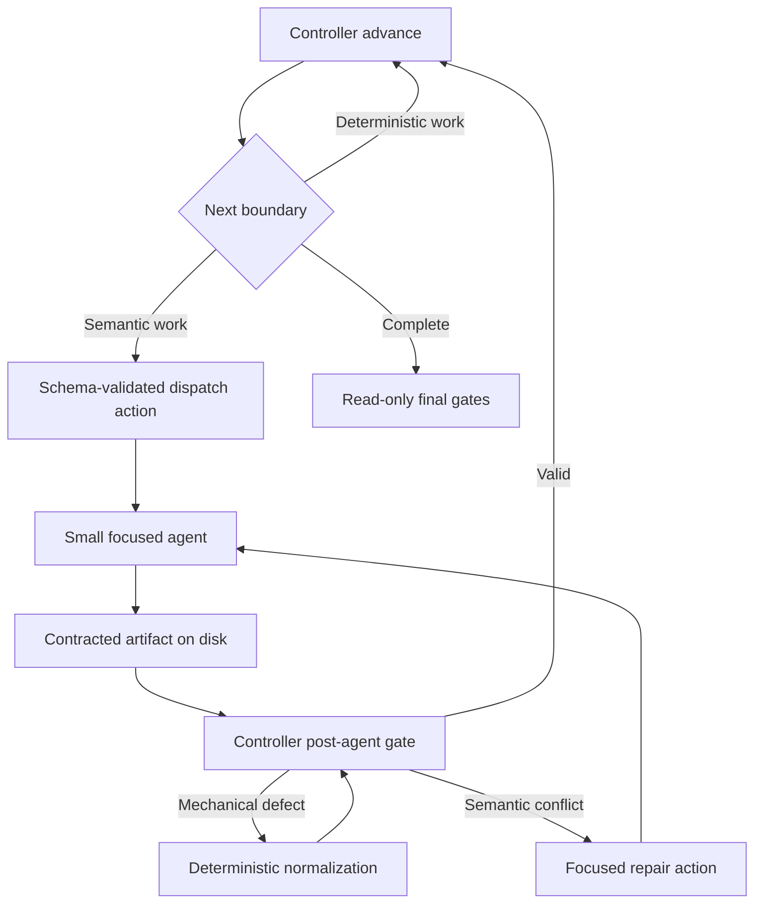

# Implementation plan — threat-analysis context and turn reduction

- Date: 2026-08-05
- Base: `d9f6bdef0c2ca64f409e6b789c977f9ece159772`
- Primary replay target: OWASP Juice Shop run
  `003c27f7-83e6-4b01-b46a-cadb493c69e1`
- Related:

  - `docs/internal/analysis/analysis-threat-analyst-context-cost-2026-08-05.md`
  - `docs/internal/contracts/orchestration-actions.md`
  - `docs/internal/contracts/schema-invariants.md`
  - `agents/shared/completion-contract.md`
  - `docs/internal/analysis/implplan-dedicated-trust-boundary-assessment-stage-2026-07-27.md`
  - `docs/internal/analysis/analysis-context-routing-control-plane-2026-08-07.md`

## Status and decision

Implement the cost reduction as an extension of the existing deterministic
control plane. Do not introduce a second orchestrator and do not treat
compaction as the primary optimization.

The execution rule is:

```text
Python controls execution and validates state.
The model decides security meaning at explicit semantic boundaries.
The filesystem remains authoritative between boundaries.
```

The migration has two independent but complementary admission gates:

1. context admission limits what enters a semantic session and what later tool
   results remain useful;
2. turn admission prevents status, fixed routing, successful validation, and
   mechanical normalization from entering a model loop at all.

These are standing rules, not plan-local decisions. Their durable ownership,
generation coexistence, admission, semantic-producer, and context-routing
contracts live in `docs/internal/contracts/orchestration-actions.md` and
`docs/internal/contracts/context-routing.md`; this plan records migration and
acceptance status only.

## Active completion scope

This plan now ends at tested full/rebuild context-v2 acceptance. The postfix4
post-STRIDE component correction, live-status fixes, abort-reason issue
reporting, focused regressions, and repository gates are complete. `make lint`
passes, and `make check` reports 12,510 passed and 95 skipped. Only the
following work remains active:

1. Run one correctly invoked quick rebuild checkpoint through merge, evidence
   verification, abuse verification, rendering, final gates, and terminal
   cleanup. The run must also prove bounded parallel STRIDE and abuse waves,
   current-claim joins, no action replay, and no continuation after
   `RUN_ABORTED`.
2. Run the fixed thorough three-baseline/three-context-v2 cohort. Adjudicate
   every quality delta and evaluate the 700-turn and 20% reconstructed-cost
   gates from cohort medians rather than a single run.
3. Record the acceptance result. Keep context-v2 resume fail-closed and do not
   make context-v2 a release default from this plan.

The following work is outside this plan:

- Stage 2-4 admission optimization and broad top-level throughput work. Open a
  separately scoped follow-up only if the controlled cohort misses a release
  gate and turn telemetry identifies that surface as a material cause.
- Context-v2 incremental or resume support, legacy-switch removal, and release
  default rollout. Those changes require a separate compatibility plan.
- An exhaustive mode, depth, selector, organization-extension, rerender, and
  repair-path cross-product beyond the current regression suite, the live
  checkpoint, and the fixed comparison cohort.
- Migration performed only to eliminate a `legacy_unreceipted` label for a
  bounded, validated policy scalar or source-access rule. An unbounded shared
  artifact or unvalidated execution input remains a blocker.

Historical checkpoints below retain the scope and terminology that applied
when they were written. This section and the remaining verification section
define the current completion gate.

The first release target is a p50 reduction from 928 to at most 700 usage turns
on the fixed thorough benchmark, together with at least 20% reconstructed cost
reduction. A later 650-turn target is a stretch goal, not a release gate for the
first migration.

## Verified starting point

The measured thorough run used 30 sessions, 928 usage turns, 67.26M cache-read
tokens, 2.90M cache-write tokens, and USD 40.69 at list price. The role split
was:

| Role | Sessions | Turns | Reconstructed cost |
|---|---:|---:|---:|
| Thin top-level | 1 | 178 | USD 8.40 |
| Threat analyst | 3 | 134 | USD 6.80 |
| STRIDE analyzers | 10 | 187 | USD 14.29 |
| Other subagents | 16 | 429 | USD 11.20 |

The current architecture already provides the foundation for this plan:

- `scripts/orchestration_controller.py` validates every action against
  `schemas/orchestration-action.schema.json` and already owns many post-stage
  gates.
- `skills/create-threat-model/SKILL-thin-stage1.md` already dispatches Stage 1a,
  Stage 1b, Analyst A, bounded STRIDE waves, and Analyst B as separate contexts.
- `scripts/build_stride_dispatch_manifest.py` already builds a schema-validated
  component manifest and references per-component `.dispatch-context/` files.
- `scripts/stride_dispatch_waves.py` already owns bounded scheduling and retry
  state.
- `merge_threats.py`, `triage_validate_ratings.py`,
  `triage_compute_ranking.py`, and `build_threat_model_yaml.py` already own much
  of the post-STRIDE deterministic progression.
- `agents/shared/completion-contract.md` already prevents artifact prose from
  being copied into the parent conversation.

The remaining defect is ownership. The 152,034-byte threat-analyst definition
still carries multiple phase algorithms, and Analyst B still acts as a workflow
engine around deterministic scripts and focused specialists. STRIDE agents
still discover and reread evidence that the pipeline can project before
dispatch.

## Goals

1. Keep plugin-selected startup payload at or below 10k tokens per new threat
   semantic role and initial resident context at or below 30k when the runtime
   floor permits it.
2. Reduce the target thorough run to at most 700 p50 usage turns without model,
   depth, selected-component, or quality-gate changes.
3. Make successful deterministic validation and its fixed successor one
   controller operation, without a validation-only model re-entry.
4. Make status and logging consume zero dedicated model turns.
5. Give each semantic role only its current contract, bounded state manifest,
   necessary tools, and targeted evidence.
6. Keep all six STRIDE categories and existing evidence requirements mandatory.
7. Preserve existing artifact formats, T/F identity, severity rules, resume
   behavior, and renderer/QA ownership.
8. Keep the current Agent runtime, hooks, permission model, cancellation, and
   telemetry surfaces.
9. Make every context delivery explainable through one schema-validated catalog
   and effective routing plan before extending context reduction to Stage 2-4.

## Non-goals

- Do not reduce assessment depth, selected components, evidence standards, or
  verification merely to meet a token target.
- Do not switch Opus work to Sonnet or Sonnet work to Haiku as part of this
  migration.
- Do not put the complete shared state into `CLAUDE.md`, agent definitions, or
  dispatch prompts.
- Do not make an LLM-authored summary or completion message authoritative.
- Do not add a vector store or direct Messages API runtime.
- Do not depend on undocumented Claude Code context-management flags.
- Do not lower autocompaction thresholds until the new session peaks are
  measured.
- Do not rewrite deterministic merge, ranking, or stable-ID algorithms in
  prompts.

## Target execution model



The skill remains the Agent-call execution shim because the Python controller
cannot invoke Claude Agent tools. The controller owns every fixed decision up
to that call: which plugin-owned role is allowed, which bounded inputs it
receives, which artifacts must appear, which validators run, and which fixed
stage follows success.

One controller action may request a bounded parallel wave. The skill issues all
Agent tool blocks in one assistant message, as it already does for STRIDE. The
action must never contain repository-selected agent names, commands,
instruction files, tools, or write paths.

## Turn-admission contract

Every measured model turn receives one primary diagnostic category:

| Category | Owner after migration | Admission rule |
|---|---|---|
| `semantic_decision` | Focused agent | Admit only when evidence requires qualitative security judgment |
| `evidence_request` | Focused agent | Use the bounded bundle first and batch independent slices |
| `agent_dispatch` | Thin skill | At most one parent turn per semantic boundary or parallel wave |
| `artifact_write` | Focused agent | One contracted write phase per semantic output where practical |
| `validation` | Controller | No validation-only model turn on success |
| `repair` | Deterministic normalizer or focused repair agent | Dispatch a model only for semantic conflicts |
| `status_or_logging` | Python event writers | Zero dedicated model turns |
| `workflow_routing` | Controller | At most one parent turn per semantic boundary |

Extend `scripts/context_window_report.py` rather than adding a production
sidecar. Before classification, aggregate every JSONL content block with the
same assistant `message.id`; deduplicating by retaining only the first block can
drop a later `tool_use` block from the same model response. Its optional JSON
diagnostic output should assign one primary category with a documented
precedence rule, retain secondary category candidates, and report confidence.
Mixed and low-confidence turns remain visible and require manual adjudication
before a release gate may claim zero turns in a category. This is benchmark
telemetry, not authoritative runtime state.

The classifier must distinguish a batched turn from its number of tool uses.
One response that dispatches eight STRIDE agents is one parent
`agent_dispatch` turn, not eight turns. Subagent turns remain counted in their
own transcripts.

Transcript usage cannot attribute the first resident context to the runtime,
agent definition, task, tool schemas, and preloaded skills. Measure static
plugin-owned layers with the provider token-counting path when available, or
with controlled one-variable startup A/B sessions otherwise. Use transcript
usage only for the assembled first-resident measurement. Record the measurement
method, Claude Code version, model, tool allow-list, task hash, and agent
definition hash with every startup-layer result.

## Context-admission contract

Create `skills/internal-threat-analysis-kernel/SKILL.md` as one concise,
plugin-owned shared threat-analysis kernel containing only:

- untrusted-input and evidence rules;
- stable-ID and artifact-authority rules;
- phase-independent severity and CVSS boundaries;
- validation, failure, logging, and completion semantics; and
- shared prose rules used by every threat semantic role.

Keep phase algorithms, renderer rules, repair instructions, mode branches,
large examples, and future-phase work outside the kernel. The initial budgets
are:

| Surface | Maximum |
|---|---:|
| Shared kernel | 4k tokens |
| One role contract | 3k tokens |
| Dispatch task | 1.5k tokens |
| State manifest | 0.5k tokens |
| Total plugin-selected startup payload, including tools and preloaded skills | 10k tokens |
| Initial resident context, including measured runtime floor | 30k tokens |

Preload the kernel through the documented custom-agent `skills` frontmatter so
it is present before the first model turn. A semantic role must not spend a
runtime `Read` turn loading it. Packaging and agent-definition tests must prove
that only the intended roles preload it and that repository content cannot
select another skill.

Treat the kernel as a non-user-configurable transitive dependency of the
focused core agents. Internal packaging must retain it whenever those agents are
shipped, regardless of organization skill include/exclude policy or runtime
skill toggles. Update the packaging contract and tests rather than allowing an
internal build to ship an agent whose required kernel was filtered out.

Add separate kernel and role surfaces to `data/context-budgets.yaml`. Retain the
existing `threat_analyst` allowance while any legacy path can still select that
agent; remove it only with the legacy agent or its final runtime reference.
Byte limits remain fast drift guards, while static token measurements and
transcript resident measurements own release acceptance. WP0 must measure the
tool and preloaded-skill surface before the 10k total becomes an enforced gate:
the four initial allocations already consume 9k and must be rebalanced if the
required tool schemas do not fit in the remaining 1k.

## Contract changes

### Contract A — orchestration action receipts and dispatch jobs

Extend, do not replace:

```text
scripts/orchestration_controller.py
schemas/orchestration-action.schema.json
docs/internal/contracts/orchestration-actions.md
```

Add bounded, controller-authored fields for:

- plugin-owned semantic role enum;
- bounded parallel dispatch jobs;
- artifact path, schema identity, SHA-256, record count, and validation status;
- unresolved semantic decision keys; and
- fixed resume action.

Keep the current human-readable `receipts: string[]` field for compatibility and
add structured `artifact_receipts`; do not change the element type of the
existing field in place. Version the new dispatch-job and receipt shapes. The
schema must cap arrays, strings, and total jobs, and reject unknown properties.
It can reject syntactic traversal and absolute paths, but it cannot prove total
serialized size, filesystem containment, provenance, symlink safety, or
uniqueness by object key.

The controller-side semantic validator must therefore:

- map the semantic role enum to plugin-owned agent, instruction, tool, and
  output-contract constants; an action never carries a repository-selected
  agent or instruction path;
- resolve the canonical output root once and reject traversal, absolute paths,
  and symlink escapes for every artifact path;
- reject duplicate job and component IDs independently of JSON Schema;
- reject an action whose canonical serialized form exceeds the documented byte
  cap;
- fail closed when the structural validator is unavailable;
- derive receipts from the exact validated bytes, not agent prose; and
- re-read and re-hash an artifact immediately before consumption so a receipt
  cannot authorize bytes changed after validation.

Subprocess stdout and stderr included in an action must be reduced to bounded
status fields; full diagnostic output stays on disk. Agent prose cannot populate
receipts.

The action remains ephemeral. Do not add a persisted stage-receipt sidecar
unless resume testing proves that current checkpoints and contracted artifacts
cannot reconstruct the action.

Before adding `fixed_resume_action`, define and test the reconstruction function
from `.skill-config.json`, the runtime-generation marker, checkpoints, artifact
schema versions, and validated artifact fingerprints. If two valid successor
actions can be reconstructed from the same durable state, the state contract is
insufficient and must be fixed before rollout rather than resolved by model
judgment.

### Contract B — per-component STRIDE evidence bundle

Add:

```text
schemas/stride-evidence-bundle.schema.json
scripts/build_stride_evidence_bundles.py
$OUTPUT_DIR/.dispatch-context/<component-id>/evidence-bundle.json
```

The producer consumes only validated current artifacts and emits bounded
component-local data:

- component identity and selected paths;
- interfaces and trust-boundary crossings;
- relevant actors and security controls;
- known-threat, prior-finding, requirements, and cross-repository references;
- deterministic recon signals; and
- source-slice references with repository-relative file, start line, end line,
  signal kind, and content hash.

It must not copy complete source files, choose findings, assign severity, or
turn imported strings into commands or instruction paths. Slice ranges and
array sizes need explicit caps with deterministic risk ordering and disclosure
when truncation occurs.

The bundle contract must also cap total serialized bytes, estimated tokens,
total referenced source lines, and values per signal class. Its ordering may use
only documented deterministic signal fields; it must not infer qualitative
security importance. Truncation metadata records the original count, retained
count, omitted count, cap, and ordering key for every affected class.

Every source slice records a repository ID from a controller-owned registry,
repository-relative path, range, and content hash. The primary repository entry
is bound to the analyzed commit plus a dirty-worktree fingerprint. A related
repository entry is allowed only when it was resolved from
`docs/related-repos.yaml` through the existing canonical source-resolution
contract. The validator re-resolves every path under its registered repository
root and re-hashes every slice before dispatch. A mismatch makes the bundle
stale and requires deterministic regeneration; it never degrades to an
unverified Agent read.

Extend `schemas/stride-dispatch-manifest.schema.yaml` and
`build_stride_dispatch_manifest.py` with the bundle path and fingerprint. Keep
the existing individual index paths during the migration for compatibility.
`validate_dispatch_manifest.py` must validate the bundle and its component ID
before dispatch.

On the context-v2 path, the validator must also apply the same canonical
containment checks to the retained legacy `index_paths`. Compatibility means
retaining those fields during migration, not retaining acceptance of arbitrary
absolute paths. Missing `jsonschema`, malformed source artifacts, a stale
fingerprint, duplicate component IDs, or a bundle outside `.dispatch-context/`
is fatal before Agent dispatch.

The existing `.dispatch-context/` cleanup entry already covers the new file.
Update permission rationale, cleanup tests, and diagnostic inventory only where
the new producer or artifact changes their actual contract.

### Contract C — semantic role outputs

Add focused definitions for these responsibilities:

```text
agents/appsec-architecture-analyst.md
agents/appsec-control-analyst.md
agents/appsec-post-stride-synthesizer.md
```

- The architecture analyst consumes completed recon and contracted topology
  inputs. It writes the existing architecture-stage artifacts and does not
  dispatch other agents or run downstream gates.
- The control analyst consumes validated architecture, boundary, and control
  inputs. It writes the existing Phase-8 control and STRIDE-context artifacts
  and does not dispatch STRIDE.
- The post-STRIDE synthesizer runs only for qualitative mitigation overrides,
  cross-finding root-cause synthesis, or other explicitly contracted outputs
  that deterministic producers cannot derive. It does not run merge, ranking,
  YAML build, validators, workflow logging, or stage routing; it still emits its
  own agent lifecycle and semantic step events.

Keep `agents/appsec-threat-analyst.md` as the legacy path until full/rebuild,
incremental, and resume parity are complete. Do not let new and legacy agents
write the same artifact in one run.

### Contract C1 — complete phase and producer ownership

The migration is not activated from role names alone. Land and test this
producer map before a focused agent is selectable:

| Boundary | Semantic producer | Deterministic owner and required handoff |
|---|---|---|
| Phases 1 and 2 | Existing context resolver and recon scanner, dispatched as one bounded Level-0 wave | Controller resolves cache/fingerprint decisions and validates `.threat-modeling-context.md`, `.recon-summary.md`, and contracted recon sidecars |
| Phase 2.5 | Legacy config agent only when the deterministic IaC-surface check selects it; Context-v2 uses the deterministic catalog producer directly | Controller owns the surface check and validates complete `.config-scan-findings.json` semantics |
| Phase 2.6 | None unless an existing coverage contract explicitly selects a specialist | Existing route, database-separation, and architecture-coverage scripts own their sidecars and exit semantics |
| Phase 2.7 | Existing actor discoverer only when the cache/depth contract selects it | Existing actor resolvers own the canonical actor artifacts and validation |
| Phases 3–6 | Architecture analyst | Controller validates `.components.json`, `.data-flows.json`, `.assets.json`, attack-surface sidecars, architecture-stage fragments, and the Phase-6 checkpoint, then runs component finalization |
| Phase 7 / Stage 1b | Existing trust-boundary analyst | Existing assessment-input builder, promotion, normalization, coverage gate, and checkpoint remain authoritative |
| Phases 8 and 8b | Control analyst | Controller validates `.security-controls.json`, requirements violations, STRIDE-context inputs, early structural artifacts, and the Phase-8 checkpoint |
| Phase 9 dispatch | Per-component STRIDE analyzers | Controller builds and validates bundles and the manifest; skill issues the bounded Agent wave; wave controller owns attempts and completion |
| Phase 9 merge | Existing threat merger only for ambiguous candidate groups | `merge_threats.py` owns collect/finalize, ordering, and IDs |
| Phase 10 | None | Existing deterministic posture emitters own their outputs |
| Phase 10a | Existing evidence verifier only when its sampling contract selects findings | Controller validates the verification artifact and applies existing failure semantics |
| Phase 10b | Existing triage validator only for unresolved semantic flags; post-STRIDE synthesizer only for contracted qualitative outputs | Existing rating validation and ranking scripts remain authoritative; controller validates `.mitigation-overrides.json` and `.tier-root-causes.json` |
| YAML handoff | None | `build_threat_model_yaml.py`, `validate_intermediate.py`, completeness gates, and the Phase-10b checkpoint own the Stage-2 handoff |

For every row, the implementation patch must name exact input and output schema
versions, allowed writers, validator commands, exit-code classes, checkpoint
transition, retry budget, and next action in the orchestration contract. The
controller must preserve the existing parallel recon behavior, cache decisions,
failure fallbacks, budget-critical handling, and trust-boundary substage; moving
the Agent call to Level 0 must not silently simplify those contracts.

The controller and skill own `AGENT_INVOKE`/`AGENT_DONE`, phase transitions, and
fixed presentation. Focused agents own only their `AGENT_START`/`AGENT_END`,
semantic step events, artifact writes, and semantic failure details. Update
`agents/shared/logging-standard.md` and its tests with that ownership change.
Logging remains batched with useful work, and no controller-authored proxy event
may claim to be an agent-authored semantic event.

### Contract D — post-STRIDE progression

Move fixed progression from Analyst B into controller commands backed by the
existing scripts:

```text
STRIDE verify
  -> merge_threats.py collect
  -> focused merger only when ambiguous groups exist
  -> merge_threats.py finalize
  -> deterministic Phase-10 posture emitters
  -> evidence-verifier dispatch only when its sampling contract selects work
  -> triage_validate_ratings.py
  -> focused triage validator
  -> triage_compute_ranking.py
  -> focused post-STRIDE synthesis only when required
  -> build_threat_model_yaml.py
  -> validate_intermediate.py and completeness gates
```

Each controller command runs until the next semantic dispatch or a blocker. A
successful empty candidate set skips its specialist. A validator success never
returns a repair action. A mechanical defect is normalized only where the
relevant contract already permits normalization. An ambiguous merge, evidence
conflict, or unsupported qualitative synthesis may return a focused semantic
action.

The deterministic ordering, stable-ID allocation, severity caps, CVSS
eligibility, and current failure semantics remain authoritative. Remove any
inline LLM fallback that would reimplement a deterministic script.

Contract D is not production-selectable until the post-STRIDE synthesizer and
all required semantic branches exist. WP3 may exercise controller transitions
in unit, fixture, and shadow comparison modes, but the live runtime continues
through the legacy Analyst-B boundary until WP4 activates the complete producer
set atomically.

### Contract E — context catalog and effective routing plan

Add one plugin-owned, schema-validated catalog for context elements, consumers,
and routing policy. It must describe the existing producer-consumer edges before
it changes their behavior. Do not create a second orchestrator or a second
semantic-role registry.

The catalog separates plugin consumers from analyzed application components. A
route binds one versioned context element to one plugin-owned semantic or
deterministic consumer under validated run and component selectors:

```text
plugin consumer x application component x context element -> bounded delivery
```

Each independently routable context element defines its producer, schema or
bounded scalar contract, scope, deterministic projector, trust class, delivery
audience, limits, requiredness, priority, freshness inputs, and failure
behavior. Core policy owns the allow-listed consumers, projectors, instruction
files, tools, commands, paths, mandatory contexts, and maximum limits.
Repository content may contribute validated facts, but it cannot select or
alter those execution surfaces or remove a mandatory context.

The controller resolves core policy, trusted organization extensions, bounded
repository declarations, invocation settings, and the finalized component
inventory into one schema-validated effective routing plan. Each plan entry
records the dispatch job, application component, context ID, selection reason,
source receipt, projector, trust class, requiredness, source and delivered size,
truncation or omission, and exact-byte freshness binding. Orchestration actions
reference the effective plan and artifact receipts instead of repeating large
context descriptions.

The catalog covers run state; discovery and recon; components, interfaces, data
flows, actors, assets, trust boundaries, and external systems; known threats,
prior findings, related repositories, cross-repository evidence, requirements,
organization and external context, user-defined abuse cases, controls, source
slices, focus and exclude paths, secrets, dependencies, supply-chain and LLM
signals; taxonomy and lenses; merge, verification, rating, and mitigation
inputs; stable identity and carry-forward state; and rendering and QA inputs.
Not every element is agent-visible: deterministic consumers retain ownership of
stable IDs, severity and CVSS enforcement, cleanup, schema validation, and
report mutation order, and semantic roles receive only the bounded decision or
projection they require.

The detailed inventory, trust layers, selector model, example configuration,
validation rules, and migration sequence are defined in
`docs/internal/analysis/analysis-context-routing-control-plane-2026-08-07.md`.
That analysis is subordinate to this plan; it is not a separate rollout plan.

## Work packages

### WP0 — freeze measurement and add turn telemetry

Change:

- `scripts/context_window_report.py`;
- `tests/test_context_window_report.py`;
- `scripts/verify_run_costs.py` and `tests/test_verify_run_costs.py` for the
  separately identified Haiku 4.5 pricing correction; and
- the benchmark command in the related analysis.

Add startup-layer reporting, role totals, turn-purpose classification,
compaction duration, and unclassified/mixed-turn disclosure. Reproduce the
existing totals before changing runtime behavior.

Aggregate all content blocks by assistant `message.id` before inspecting tool
uses. Add controlled startup measurements for the empty runtime floor, each
tool allow-list, the shared kernel, each role definition, the dispatch task, and
the state manifest. Do not label a counter-derived residual as a measured
layer. Pin the Claude Code version, model ID, pricing table version, and input
hashes in the diagnostic result.

Exit gate: the report reconstructs 928 turns and USD 40.69 from the fixed run,
batched tool-use turns retain every content block, and all existing output
remains backward compatible unless a new flag is used. A reviewed measurement
record either proves that the required tool surface fits the 10k plugin-owned
startup budget or amends the individual allocations before WP1 enforces them.

### WP1 — land schemas, admission budgets, and security constraints

Change:

- `data/context-budgets.yaml`;
- `tests/test_prompt_token_bounds.py`;
- `tests/test_agent_definitions.py`;
- `tests/test_skill_definitions.py`;
- `schemas/orchestration-action.schema.json`;
- `docs/internal/contracts/orchestration-actions.md`;
- `scripts/package_internal_plugin.py`, its packaging contract, and packaging
  tests for the mandatory internal kernel;
- `data/required-permissions.yaml`; and
- permission coverage tests.

Add the internal preloaded kernel, role surfaces, bounded and versioned
dispatch-job shape, separate artifact-receipt shape, action-size cap, and
evidence-bundle schema. Retain the legacy threat-analyst budget. No runtime
selects the new path yet.

Exit gate: schema and semantic-validation tests reject traversal, absolute
paths, symlink escapes, unknown roles, repository-selected instruction paths,
oversized arrays/actions, duplicate component IDs, missing validation
dependencies, and unbounded strings. Tests prove that role enums resolve only
through the plugin-owned registry and that an artifact changed after receipt
creation is rejected at consumption.

### WP2 — build and validate evidence bundles

Implement `build_stride_evidence_bundles.py` with its mandatory
`tests/test_build_stride_evidence_bundles.py`. Wire it into manifest production
and validation behind a temporary internal rollout switch. In Slice B this is a
shadow/fixture path only: it may build and compare receipts, but it must not
change the live Agent dispatch or artifact producer.

Update:

- `scripts/build_stride_dispatch_manifest.py`;
- `scripts/validate_dispatch_manifest.py`;
- `schemas/stride-dispatch-manifest.schema.yaml`;
- `tests/test_dispatch_manifest.py`;
- `tests/test_validate_dispatch_manifest.py`; and
- cleanup, diagnostic, and permission tests when their contracts require it.

Exit gate: the same selected component set is produced, every selected
component has a valid bundle, imported data cannot alter paths or execution,
and bundle omission fails before Agent dispatch on the new path. Total bytes,
estimated tokens, source-line budgets, per-class truncation disclosure,
primary-repository dirty-worktree changes, related-repository registry checks,
stale slice hashes, legacy index-path containment, and cross-repository escape
attempts have explicit success and failure tests.

### WP3 — extend the controller to run to semantic boundaries

Add controller actions for the Phase-1/2 bounded wave, conditional Phase 2.5,
Phase-2.6 deterministic work, Phase-2.7 actor resolution, architecture and
control handoffs, STRIDE preparation, post-wave verification, conditional merge
review, post-merge progression, conditional triage, and post-triage
finalization. Reuse the current action schema and controller; do not add a
parallel state machine.

Change:

- `scripts/orchestration_controller.py`;
- `skills/create-threat-model/SKILL-thin-stage1.md`;
- `docs/internal/contracts/orchestration-actions.md`;
- `agents/shared/logging-standard.md`;
- `tests/test_orchestration_controller.py`;
- `tests/test_stage1_dispatch_contract.py`;
- `tests/test_dispatch_prompt_cache_order.py`; and
- the existing merge, triage, and checkpoint tests touched by ownership changes.

At each boundary, the thin skill should perform only fixed presentation, one
controller call, and the returned Agent wave. Logging and stats commands should
be part of the controller operation where their updated contract assigns
ownership. Preserve the current one-message parallel recon and STRIDE dispatch
semantics.

Exit gate: on a success-only fixture, post-STRIDE deterministic progression
does not enter the threat analyst. Candidate-free merge and triage branches
skip their specialists. Every semantic dispatch is allow-listed and bounded.
The full producer map has transition tests, but live context-v2 activation is
still disabled until WP4 supplies every semantic role.

### WP4 — split threat semantic roles atomically

Add the three focused agent definitions and switch only thin full/rebuild runs
to them behind the rollout switch. Move specialist fan-out and gates to the
controller/skill boundary before removing those instructions from the legacy
definition.

Change:

- the new agent files;
- `skills/create-threat-model/SKILL-thin-stage1.md`;
- relevant phase-group files so each algorithm has one owner;
- `data/context-budgets.yaml`;
- `tests/test_agent_definitions.py`;
- `tests/test_skill_definitions.py` and packaging tests for the preloaded kernel;
- `tests/test_prompt_token_bounds.py`; and
- stage artifact and checkpoint tests.

This package activates only together with WP1-WP3. A small prompt without its
validated projection is not a shippable intermediate state.

Exit gate: each new role starts at or below the admission budgets, has no unused
tool or preloaded skill, cannot execute future phases, and produces the same
contracted artifacts and checkpoints as the legacy full/rebuild path. Context,
recon, config, actor, boundary, merge, evidence, and triage specialists are
dispatched only at the Level-0 boundaries in Contract C1; no focused semantic
role retains the `Agent` tool unless a separately documented contract requires
it.

### WP5 — modularize the STRIDE agent

Reduce `agents/appsec-stride-analyzer.md` to the mandatory six-category
workflow, evidence rules, output contract, and failure semantics. Put optional
component lenses in plugin-owned bounded files selected only from validated
feature enums. Repository content may select data values but never a lens path.
Preload the same internal kernel and remove duplicated shared invariants from
the analyzer; do not add a runtime kernel-read turn.

The analyzer must:

1. read its evidence bundle once;
2. batch independent source slices;
3. record a bounded escape reason before broader discovery;
4. keep all six categories mandatory; and
5. leave schema validation and mechanical repair to the post-agent gate.

Update agent, manifest, caching-order, token-bound, dispatch, and STRIDE golden
tests. Preserve cheap-STRIDE pacing and full-depth exclusions exactly.

Exit gate: first resident STRIDE context falls by at least 16k tokens against
the fixed run, selected-component and six-category coverage are unchanged, and
broader-search escapes are measurable.

### WP5a — centralize context catalog and routing

Begin only after the context-v2 Stage-1 path completes one live full/rebuild
invocation and its producer or schema blockers are closed. Fix the existing
`focus_paths`/`exclude_paths` delivery gap first, then inventory and pin every
current Stage-1 producer-consumer edge before changing admission behavior.

The first implementation slice is fixed and must complete before catalog
scaffolding begins:

1. Trace and test the existing path from the control-analyst producer and
   `stride-analyst-context` schema through the STRIDE dispatch manifest to the
   evidence-bundle builder, bundle schema, thin runtime, and v2 STRIDE
   consumer. The current loss occurs after manifest construction: live
   component `focus_paths` survive into the manifest but do not enter the
   evidence bundle or v2 consumer admission.
2. Define one normalized, bounded, repository-relative representation for both
   fields. Compatibility input may remain string-or-list during migration, but
   the deterministic boundary must reject empty values, absolute paths,
   traversal, repository or symlink escape, invalid component references, and
   over-limit path collections before dispatch.
3. Treat focus paths as component-scoped prioritization inputs, not additional
   read permission. Admit their bounded source projections before optional
   broad discovery, record every admitted or omitted path in the bundle
   receipt, and retain the existing component, repository-registry, freshness,
   and byte limits.
4. Treat exclude paths only as component-local suppression of optional broad
   discovery. They must not suppress a focus path, a mandatory deterministic
   signal, an already selected or cited evidence file, a contracted receipt,
   or any other component's inputs. A conflict fails validation instead of
   silently hiding evidence.
5. Carry the normalized routing decision through the evidence-bundle schema
   and exact-byte receipt. Do not inline source files or complete shared
   artifacts into the dispatch prompt; the v2 consumer continues to read only
   its bounded bundle and plugin-owned references.
6. Add producer, schema, manifest, bundle, dispatch, path-containment, limit,
   conflict, stale-input, and negative security tests. Use neutral fixtures and
   cover absolute paths, traversal, symlink escape, unknown components,
   oversized lists, focus/exclude overlap, and attempts to exclude mandatory
   evidence.

This slice exits only when a valid focus path measurably changes bounded bundle
admission, a valid exclude path affects only optional discovery, all decisions
are reconstructable from receipts, and neither field can widen repository
access or hide mandatory evidence. It is a contract repair, not the context
catalog migration itself. After it passes, inventory the current Stage-1 edges
and pin their behavior before introducing the catalog resolver in shadow form.

Add:

- the plugin-owned context catalog and its schema;
- semantic validation for consumers, projectors, selectors, dependencies,
  limits, trust layers, and failure behavior;
- a deterministic resolver and schema-validated effective routing plan;
- human-readable diagnostics that explain inclusion, exclusion, projection,
  truncation, and missing optional context without exposing sensitive content;
- exact-byte receipts and pre-dispatch freshness checks for each delivery; and
- cleanup, permission, packaging, checkpoint, and resume contracts for the new
  configuration and runtime artifacts.

Migrate existing Stage-1 role metadata, evidence bundles, taxonomy slices,
lenses, known threats, related-repository evidence, external and organization
context, trust boundaries, actors, requirements, prior findings, controls,
source slices, focus and exclude paths, and abuse cases one source at a time.
Preserve selected components, cheap/full depth, six-category coverage, evidence,
findings, and failure gates while the current behavior moves under the catalog.

Repository declarations remain untrusted data. Trusted organization packages
may add schema-backed context sources, catalogs, assignments, and stricter
limits, but neither layer may select instructions, agents, tools, commands,
projectors, arbitrary paths, or write targets. Neither layer may remove a
mandatory core route, relax a maximum, or downgrade a failure rule.

Exit gate: every Stage-1 context delivery has one catalog entry and validation
path; the effective plan reconstructs and explains every dispatch input; all
mandatory and forbidden deliveries are enforced; the existing Stage-1 fixtures
remain behaviorally equivalent; and no complete shared artifact enters a
focused role when a bounded projection exists.

### WP6 — deferred outside this plan

Stage 2-4 admission optimization and broad top-level throughput work are not
required to accept the full/rebuild Stage-1 migration. Reopen that surface in a
separate plan only when the controlled cohort misses an acceptance target and
turn-purpose telemetry identifies it as a material cause. Renderer, QA, and
architect-review ownership remain unchanged.

### WP7 — deferred outside this plan

The implemented generation selection, persistence, schema-version binding,
and incompatible-generation rejection remain in place. Context-v2 incremental
and resume support, legacy-switch removal, and release-default rollout are not
active work here. Resume stays fail-closed, and the branch-local convenience
default must not be promoted to a release default by this plan.

## Rollout slices

| Slice | Default behavior | Purpose |
|---|---|---|
| A | Existing runtime | WP0 telemetry only |
| B | Existing runtime; context-v2 shadow/fixture evaluation only | WP1-WP3 contracts, bundles, and controller actions without changing the live producer path |
| C | Context-v2 opt-in for full/rebuild | WP4 focused threat roles |
| D | Context-v2 opt-in for full/rebuild | WP5 STRIDE modularization |
| D2 | Context-v2 opt-in for full/rebuild | WP5a context catalog, effective routing plan, and Stage-1 migration |
| E | Deferred outside this plan | Stage 2-4 and broader top-level optimization |
| F | Deferred outside this plan | Incremental, resume, and release-default rollout |

Each slice must be revertible by selection of the prior runtime. Do not keep
two producers active for the same artifact within one invocation.

## Implementation status

Status as of 2026-08-14:

| Work package | Status | Remaining gate |
|---|---|---|
| WP0 | Implemented, repository-tested, and captured in one complete live run | Reconfirm the measurements in the fixed comparison cohort |
| WP1 | Implemented, repository-tested, and captured in one complete live run | Evaluate the admission targets in the fixed comparison cohort |
| WP2 | Implemented, repository-tested, and exercised in one live context-v2 run | Collect the bounded-context acceptance measurements |
| WP3 | Implemented, repository-tested, and exercised through final rendering in one complete live invocation | Establish behavior and finding parity against the legacy runtime |
| WP4 | Implemented for full/rebuild; selected by default on this feature branch | Establish artifact and finding parity against the legacy runtime |
| WP5 | Implemented for full/rebuild; selected by default on this feature branch | Establish the resident-context and escape-rate targets |
| WP5a | Repository implementation, successive corrective slices, and repository gates are complete | Pass one valid live checkpoint, then pass the fixed controlled cohort |
| WP6 | Deferred outside this plan | None; open a separate plan only if cohort telemetry proves it necessary |
| WP7 | Safe boundary retained; context-v2 resume remains rejected | None in this plan; compatibility migration and rollout require a separate plan |

The first WP5a slice now normalizes bounded literal repository-relative focus
and exclude paths at the deterministic manifest-to-bundle boundary. Focus
paths admit receipted source projections before optional discovery; exclude
paths affect only component-local optional discovery and fail on overlap with
focus, deterministic, selected, or cited evidence. The exact-byte bundle
receipt carries the normalized decision, and the v2 consumer reads it only
from the bundle. Path containment, symlink escape, unknown component, list
limit, overlap, mandatory-evidence, dispatch, and freshness cases are covered.
The frozen Stage-1 inventory now covers all context-v2 semantic roles, the
separate Stage-1d abuse verifier, deterministic projections, implicit prompt
inputs, direct source reads, plugin-owned references, receipts, failure modes,
and lifecycle effects. Drift tests bind the inventory to the current role
registry and consumer contracts.

The WP5a catalog slice adds a human-readable catalog, separate plugin-owned
bindings, schema and semantic validation, and a schema-validated effective plan
with an exact-byte receipt. Human assignments name the
threat-modeling category, agent, required, optional, or forbidden delivery,
optional-context importance, whole-run, current-component, or current-candidate
target, and reason. Paths, schemas, models, commands, projectors, trust labels,
and limits remain internal. The review removed unused component selectors and
runtime migration status from the human surface.

The first active migration gives every STRIDE analyzer one receipted component
context plan instead of the full dispatch manifest. It binds the component
evidence bundle, taxonomy slice, fixed lens IDs, depth and sampling policy,
turn and estimate values, resolved STRIDE profile, and the optional
related-repository, business-context, architecture-context, and six
security-category projections to fourteen active effective-plan delivery
decisions. An omitted optional projection remains an audited omission and is
physically absent from the component plan and Agent inputs. The full effective
plan stays in the controller
audit path and is revalidated by exact bytes immediately before dispatch; it is
never an Agent input.

The business and organization-context migration resolves only the organization
documents selected by the active preset and loads them once as bounded
untrusted control-analysis input. An optional document-level
`applies_to_components` list is validated against final component IDs and acts
as a hard projection bound. The control analyst may emit only business purpose,
compromise impact, sensitive assets, security obligations, and declared
security assumptions for a matching component. The deterministic builder
normalizes those values into a separate bounded
`.dispatch-context/<component-id>/business-context.json`; it removes the raw
object from the manifest, validates the component and content fingerprints,
and dispatches the artifact only when the component plan selects it. The
Evidence Bundle remains mandatory and contains no business projection, so one
context can be withheld without hiding evidence or changing repository access.
Security architecture and analytically derived assumptions remain separate
from the business object. Actors, abuse cases, trust boundaries, existing
controls and mitigations, threats, and proposed mitigations remain separate
source migrations.

The architecture-context migration now projects security role, exposed
interfaces, security dependencies, deployment constraints, and analytical
architecture assumptions into a separate optional component artifact. The
projection is physically absent when the control analyst has no
security-relevant architecture fact beyond the component registry. It cannot
carry actors, boundary decisions, controls, mitigations, threats, findings,
severity, or path-selection instructions, and the complete architecture model
remains forbidden to STRIDE agents.

The complete related-repository registry is now controller-only. Each bundle
fingerprints only the primary root and related roots cited by its admitted
source slices. When those slices exist, the controller writes one bounded,
receipted component projection containing exactly their repository IDs and
validated roots, binds it to the component plan and source-registry hash, and
rejects extra, missing, unknown, stale, cross-component, or non-STRIDE use. A
job with no related source evidence receives no root projection. STRIDE wave
concurrency is capped at five so worst-case projection receipts remain within
the unchanged 64-artifact immediate verification gate.

Known threats, canonical boundaries, resolved actors, requirement violations,
prior findings, and existing controls now use separate bounded component
projections. Each projection carries a source fingerprint, normalized records,
limits, an exact-byte receipt, and its own component-plan row; an empty source
is physically absent. The required Evidence Bundle no longer duplicates those
categories. Generated threats and proposed mitigations now use separate
receipted post-STRIDE projections. Evidence verification receives only its
deterministically selected sample with exact-source-bound code windows, and the
controller owns canonical annotations. Stage 1d receives one receipted abuse-
case candidate projection per job; the complete match set remains controller-
owned.

The 2026-08-08 contract review traced these projections through source index,
producer, schema, manifest, component plan, action, exact-byte receipt,
consumer reconstruction, permission, cleanup, and resume-version surfaces. It
also covers shared-budget reconstruction, wrapper-shaped known-threat input,
empty and truncated projections, stale sources and hashes, duplicate and
cross-role admission, and symlinked output paths. `context_routing.py validate`,
`make lint`, `make test`, and `make check` pass. The final test runs each report
11,783 passed and 95 skipped; `make test` reports 91.68% coverage.

The first post-projection WP5a smoke reached the architecture, boundary, and
control stages, then stopped before STRIDE bundle construction. Recon had
invented conventional source names, the architecture producer copied them
into component paths and data-flow evidence, and the control producer reused
one as a focus path. The bundle gate correctly rejected the missing path, but
the defect had already crossed two stage boundaries. Recon now permits source
claims only from observed tool output; architecture treats recon paths as
unverified leads; and the producer plus controller gates resolve every
component glob, data-flow evidence file and line, and recon `Key files`
reference against the contained target repository. Deterministic component
reconciliation no longer emits existence-independent fallback paths.

The next preserved-runtime smoke, run
`88129c09-c950-4121-9580-880765a82eff`, proved that the new post-recon gate
blocked the defect before architecture, but also exposed a producer/contract
format gap: the recon role emitted line ranges, bare files, directories, and
invented conventional names in `Key files`, then skipped its required local
validator. The producer and template now require one exact observed
regular-file and single-line reference per entry. The shared deterministic
normalizer is a fail-safe at both the producer command and controller boundary;
it can only delete unverifiable entries or write `none detected`, never create
path evidence. Exact-entry parsing now rejects ranges and trailing annotations
instead of accidentally accepting their numeric prefix.

At that point, the next checkpoint was a fresh opt-in full Juice Shop run at
quick depth with runtime files preserved. The later R4 run superseded that
checkpoint and exposed the remaining projection work described below.

The implemented WP0-WP5 scope includes:

- controller actions from `context-v2-begin` through `context-v2-finalize`,
  including the Phase-1/2 pre-passes, conditional Phase 2.5, Phase 2.6, and
  Phase-2.7 actor resolution;
- focused semantic roles, modular STRIDE lenses, bounded evidence bundles, and
  the internal shared kernel;
- exact-byte, versioned artifact receipts with pre-dispatch hash verification;
- a controller-owned local repository registry with path, symlink, repository
  identity, duplicate-root, and stale-slice enforcement;
- a bounded merge-review projection instead of admitting the complete merge
  candidate artifact, with one or more disjoint decisions per admitted group;
- a shared deterministic auto-emitter handoff before mitigation-quality and
  completeness validation in both legacy and context-v2 finalization; and
- fail-closed authoritative gates plus persisted artifact-schema compatibility
  checks.

Context-v2 is now the branch default for compact-runtime full and rebuild runs;
`APPSEC_CONTEXT_V2=0` selects legacy for a new invocation. Deadline,
cost-limited, live-phase, incremental, resume, and compact-runtime opt-out
invocations stay on `legacy`. `resolve_config.py` persists that generation and
its artifact schema versions; the controller reads them from durable state,
refuses a cross-generation continuation, and hands the skill
`SKILL-thin-stage1-v2.md` instead of the legacy Stage-1 runtime.

The implemented part of WP7 covers generation selection, persistence,
schema-version persistence, incompatible-generation rejection, and the
branch-local full/rebuild default. Incremental and resume still use the legacy
threat analyst. The controlled release rollout and acceptance remain open.

Local verification on 2026-08-07 passed `git diff --check`, `make lint`,
`make test`, and `make check`. The final `make test` and `make check` runs each
reported 11,655 passed and 95 skipped; `make test` reported 91.92% coverage.

The implementation plan is not complete. The first smoke attempt on 2026-08-06
combined `APPSEC_CONTEXT_V2=1` with `--max-wall-time`, which selected the legacy
top-level runtime while incorrectly persisting `context-v2`. Monitoring caught
the legacy threat analyst after 54 turns and the run was aborted. The producer
selection now derives from the same compact-runtime eligibility as routing and
rejects an inconsistent combination. A second smoke attempt entered context-v2
and dispatched the three-role recon wave, but exposed that concurrent Agent
registrations could replace one another and that the hook counted all parallel
tool calls against one 25-turn budget. It set `.budget-critical` at an aggregate
25 turns and was aborted before STRIDE. Session registration is now serialized;
shared-session budgeting is disabled after a second Agent dispatch, and nested
`Stop` events cannot emit an assessment summary while the run lock remains
owned. A third smoke attempt completed the parallel recon wave and the focused
architecture Agent, then exposed a missing controller-owned component
finalization, an overlong data-flow classification from the architecture
producer, and a missing controller-owned Phase-6 checkpoint. The parent model
manually repaired those runtime artifacts and reached the trust-boundary Agent
before the run was aborted. The controller now validates architecture
fragments, finalizes components, binds the derived inventory fingerprint into
the data-flow sidecar, builds the boundary input, and writes the checkpoint in
that order. The producer uses the bounded classification vocabulary, and the
compact runtime treats an abort as terminal instead of entering a legacy repair
loop. The same smoke also showed that shared-session telemetry attributed
cumulative usage to the most recently recognized legacy role; plugin-owned
roles are now registered generically and multi-Agent hook telemetry is labeled
`shared-session` with `scope=session-cumulative`. Live status now suppresses a
prior-run cutoff warning when the current v2 lock has a fresh heartbeat even if
its short-lived launcher PID has exited. No successful live context-v2
invocation or paid A/B cohort has run.

A fourth smoke attempt, run
`50badedf-90aa-4065-ac6a-6090d59148f2`, exercised the corrected path through
parallel recon, architecture, trust-boundary analysis, control analysis,
context-v2 manifest and evidence-bundle production, and the first six-component
STRIDE wave. Architecture finalization produced one identical component
fingerprint in the finalization receipt, data flows, and boundary input. The
Phase-6 and Phase-7 controller gates passed without manual artifact edits, all
six selected components received bounded bundles, all six analyzers wrote six
categories with `partial=false`, and no shared-session budget marker fired.
The first STRIDE wave reached approximately USD 3.72 in cumulative session
telemetry. Its post-wave gate accepted only `frontend-spa`: the other five
outputs carried malformed optional `boundary_refs` shapes, and two used
unmapped CWE values with the forbidden `TH-UNCLASSIFIED` sentinel. The bounded
retry controller therefore dispatched five second attempts, and the run was
aborted before they completed. The producer now carries the exact boundary-ref
shape, valid last-resort TH mappings, the literal progress command, and absolute
bundle-path resolution. The merge-owned pre-gate normalizer drops malformed
optional boundary links without changing findings or evidence, and the CWE map
now covers CWE-620 and CWE-799. Replaying the six captured outputs through that
gate validates all six without a retry. Post-abort live status now requires
merged threats plus a late checkpoint before claiming budget exhaustion, and
directs an incomplete context-v2 run to a fresh restart instead of unsupported
resume. The post-STRIDE merge, evidence, triage, synthesis, YAML handoff, and
rendering boundaries remained unexercised at that point.

A fifth smoke attempt, run
`6aa53070-5542-4b3d-afcf-3a5d618e1a08`, exercised the corrected path through
seven-component STRIDE analysis and every remaining Stage-1 semantic boundary.
All seven analyzers produced six-category outputs with `partial=false`, and the
post-wave gate accepted them without retries. The controller merged 48 raw
threats, admitted eight bounded merge decisions, verified a 16-threat sample,
ran deterministic triage and post-STRIDE synthesis, and built a structurally
valid canonical model with 42 threats and 42 mitigations. Finalization then
failed mitigation-quality validation because context-v2 had omitted the shared
deterministic auto-emitter pass that hydrates mitigation detail from threat
remediation. The controller now calls the same auto-emitter helper in both
legacy and context-v2 finalization, after initial structure validation and
before mitigation-quality and completeness gates. A full
`context-v2-finalize` replay against a preserved copy of the live runtime passed
those gates and produced the Stage-1c render checkpoint without modifying the
target runtime. Monitoring now excludes seed-only STRIDE placeholders from the
completed count and describes interrupted runs without falsely claiming that
merge was never reached. The smoke was aborted before live Stage-2 rendering,
so no successful complete live context-v2 invocation or paid A/B cohort exists.

A sixth smoke attempt, run
`566f85ee-e2b3-4309-b866-fc433445c805`, completed recon, architecture, and the
trust-boundary handoff. It produced six components, 15 data flows, 13 assets,
10 boundary candidates, and 21 boundary dispositions before the Phase-8 gate
rejected `.stride-analyst-context.json`. The control analyst had placed a
397-character repository summary in the reserved `_stride_profile` field,
whose compatibility schema permits only a string of at most 200 characters or
a bounded scalar object. The context-v2 producer contract now forbids that
field, the controller removes it as an ownership backstop before schema
validation, and manifest construction derives the profile exclusively from the
resolved run configuration. Replaying `context-v2-prepare-stride` against a
copy of the captured runtime passed in three seconds, validated seven evidence
bundles, and returned the seven-component STRIDE dispatch wave. The smoke also
showed that live status could report an interrupted run after the short-lived
launcher heartbeat expired despite recent tool or Agent activity, and that the
trust-boundary producer could resolve `shared/logging-standard.md` under the
wrong plugin directory. Live cutoff suppression now considers bounded recent
activity, and the producer names the absolute plugin-owned logging contract.
The run ended before STRIDE dispatch, so the corrected final Stage-1 gate and
Stage 2-4 still have not passed in one live invocation.

A seventh smoke attempt, run
`c55b8503-375d-471a-8004-de1c7f228dd9`, passed the corrected Phase-8 contract,
produced ten component contexts without the reserved `_stride_profile` field,
and dispatched seven full-depth STRIDE analyzers. All seven wrote six-category
outputs with `partial=false`; the post-wave gate accepted them without retries.
The selected components were all authentication, frontend, LLM, real-time, or
internet-exposed surfaces, so cheap-stride correctly screened none of them.
Context-v2 had nevertheless dropped the user-visible full/light label from its
dispatch-job contract; jobs now carry a required `analysis_depth` and the thin
runtime uses it in Agent descriptions and progress prompts. The merger reviewed
eight admitted groups and wrote nine decisions because one genuine partial
cluster required disjoint `merge [0,2]` and `keep [1]` decisions. The controller
incorrectly rejected the repeated group ID even though the v2 schema, producer
contract, and deterministic merge consumer all support partial-cluster
decisions. It now requires at least one decision per admitted group and validates
index bounds, survivor membership, and disjoint subsets instead. Replaying the
captured `context-v2-post-merge` boundary on a runtime copy accepted the exact
artifact, produced 50 merged threats, and returned the evidence-verifier job.
Live status now treats recent completed phase events as activity and lets an
in-window `RUN_ABORTED` override stale tool markers with the explicit
`controller_abort` cause. The thin runtime now also forbids legacy-style claims
that `--full` resumes retained context-v2 artifacts at only the failed boundary;
a later full run starts Stage 1 again. The live run ended at the merge gate, so
a corrected complete Stage 1 and Stage 2-4 invocation still has not passed.

A pre-A/B contract audit on 2026-08-06 then traced each changed Stage-1
artifact through its producer, schema, controller gate, consumer, cleanup, and
permission surface. It closed stale-output and duplicate-output ownership in
semantic actions, declared the evidence and triage mutations of
`.threats-merged.json` as in-place outputs, restored the resolved STRIDE profile
and bounded taxonomy slice to every v2 analyzer dispatch, and corrected the
client/server/data tier keys in post-STRIDE synthesis. Recon signals and
evidence verification now have explicit schemas plus controller-owned semantic
checks; the evidence summary's total is bound to the canonical merged threat
count, and an invalid optional summary supplies no evidence-guard signal.

The same audit bounded and validated the Markdown context and recon contracts,
removed empty analyst-context placeholders, rejected unknown component IDs,
and made recon reuse require both a valid summary and valid signal sidecar. It
also found that the recon producer had mixed `6.x` and `7.x` references while
the canonical template's Security-Relevant Code block and its consumers use
Sections 7.1–7.32. The template, producer self-check, and controller gate now
agree on 7.1–7.32; the cross-repository parser still accepts the previously
emitted 6.25 form as a compatibility input. The 200-line recon size is an
observable optimization target, not a blocking contract; the controller owns
the 1,000-line and 262,144-byte safety limits. The interrupted Juice Shop
runtime contains the superseded 6.x recon form and must not be resumed as a v2
continuation; a fresh full run will replace it. The post-audit focused suite
reported 1,228 passing tests. The subsequent repository-wide `make lint`,
`make test`, and `make check` gates passed. `make test` reported 11,617 passed,
95 skipped, and 91.92% coverage; the final `make check` run reported the same
test counts and passed its format, configuration, fragment-registry, and
target-specificity drift gates. No further contract defect was found by those
gates.

An eighth smoke attempt on 2026-08-07 aborted at the post-recon gate. The
artifact was complete through Sections 8–10, so the reported truncation
explanation was false: the recon producer had emitted the historical Cat-28
mapping as `7.28 AI Coding Assistant` and omitted canonical Sections 7.28–7.32.
The session transcript showed the structural cause. The role consumed exactly
all 25 allowed tool calls; calls 23 and 24 wrote the two artifacts, and call 25
printed completion statistics without running the required heading check.

The correction does not rely on repository size or an optimistic turn-ceiling
increase. The recon role now admits at most 22 discovery tool calls, reserves
at least ten publication and validation calls, and retains four calls as
failure headroom. Deterministic scans, finding lists, tree output, and source
reads remain bounded, so a larger repository may extend deterministic scan
runtime but cannot consume the model-turn publication reserve. The producer
must run `validate_recon_summary.py` immediately after the summary write and
before the signal write. That validator and the controller share the exact
template-heading contract, including titles and order; the prompt and template
also disambiguate Cat 28 from canonical Section 7.32 and require explicit
no-surface bodies instead of conditional heading omission. The initial focused
regression suite reported 418 passing tests; the broader contract suite reported
776 passing tests. The subsequent `make lint`, `make test`, and `make check`
gates passed. `make test` and `make check` each reported 11,624 passed and 95
skipped; `make test` reported 91.93% coverage.

An earlier smoke attempt, run `7073e7bf-f627-4a4e-8996-3df9f39829fc`, completed
an opt-in context-v2 full invocation at quick depth without manual runtime
artifact edits. Recon, architecture, trust-boundary analysis, control analysis,
six component-specific STRIDE jobs, bounded merge review, evidence verification,
deterministic triage, post-STRIDE synthesis, canonical YAML construction, Stage
2 rendering, and the deterministic Stage-3 gate all completed. The controller
merged 40 threats and the quick severity floor delivered 37 findings: six
Critical, 20 High, and 11 Medium. The run produced `threat-model.yaml` and
`threat-model.md`, cleared its checkpoint and lock, and ended after 58 minutes
33 seconds. Cumulative shared-session telemetry reported 119,437 output tokens,
368,939 cache-write tokens, 15,284,414 cache-read tokens, and USD 7.7612 under
subscription accounting. These are cumulative session-throughput figures, not
a measurement of simultaneously resident context, but they keep the remaining
top-level reduction work visible.

Monitoring found two nonterminal defects. The context resolver wrote and
sourced a shell environment file containing repository-derived paths; its
producer contract now keeps repository values out of executable shell text.
An independent full-QA replay also found that anchor enrichment could expand a
compact finding link with the YAML storage form `Title — file:line`; the
consumer now converts the locator to the required backticked parenthesized form
before enrichment.
The exact completed output passes the full QA replay after that correction, and
both fixes are covered by the repository-wide gates above. They have not been
re-exercised in another paid live invocation.

A later preserved-runtime rebuild smoke at
`/tmp/appsec-context-v2-wp5a-smoke-20260808-r4` confirmed that rebuild cleanup
retained the resolved context-v2 generation. It completed recon, architecture,
boundary and control analysis, five independently planned STRIDE jobs, bounded
merge review, evidence verification, deterministic triage, and post-STRIDE
synthesis. Final YAML construction then exposed a producer/contract mismatch:
the runtime-only `rebuild` cleanup mode was copied into the public `meta.mode`
and changelog mode, whose delivery schema permits only `full` and
`incremental`. The YAML producer now maps every non-incremental run to `full`
while retaining the explicit rebuild invocation and audit note. Replaying the
exact captured artifacts produces a schema-valid model with 37 threats, 37
mitigations, 108 attack-surface entries, and seven components. Recovery
classification now also treats an in-window controller `RUN_ABORTED` as
terminal even when a partial YAML exists, so the headless wrapper cannot
recommend unsupported context-v2 resume.

The aborted smoke reported 274,170 output tokens, 17,771,358 cache-read tokens,
1,076,818 cache-write tokens, and USD 12.13. The preceding legacy run reported
USD 24.07, but the context-v2 run never entered Stage 2, so the apparent 49.6%
reduction is not an end-to-end comparison. Receipts also exposed remaining
WP5a pressure: recon emitted 521 lines against its 200-line target,
architecture received the full 247-route inventory, and the evidence and root-
cause roles still received full merged-threat artifacts. These projections
must be bounded before the controlled A/B gate.

The first R4 pressure fix bounds deterministic recon patterns to 12 findings
per category and 96 across the run, with category-diverse risk ordering and
explicit pre-cap and omission counts. Actor discovery and architecture now
consume an exact-source-bound recon projection capped at 200 retained heading
and body lines. Architecture also receives at most 96 risk-shaped and
framework-diverse routes while the complete inventory remains available to
deterministic consumers. Against the preserved R4 artifacts, those projections
reduce recon patterns from 151,318 to 31,807 bytes, recon Markdown from 521
source lines to 197 retained lines, and routes from 247 to 96 records. All
three inputs have schemas, active catalog routes, exact-byte action receipts,
source-hash freshness checks, cleanup under `.dispatch-context/`, and existing
output-tree permissions.

The remaining R4 pressure fix moves evidence sampling into the deterministic
controller and embeds one exact 11-line source window per selected finding.
The verifier writes only its verdict sidecar; the controller stages, validates,
and atomically applies accepted annotations. Post-STRIDE synthesis receives
separate generated-threat and proposed-mitigation projections instead of the
complete merged set and triage flags. Stage 1d similarly receives one bounded
candidate projection per verifier job instead of the complete abuse-case match
set. Against the preserved R4 artifacts, the 146,456-byte merged input becomes
a 38,208-byte, 17-finding evidence sample plus 27,102-byte threat and
26,551-byte mitigation projections for 41 pre-render threats. An offline match
of the same artifacts produced five abuse candidates whose individual inputs
range from 2,670 to 6,153 bytes, compared with the 29,119-byte complete match
set. The four schemas, deterministic producers, controller reconstruction,
focused consumers, cleanup ownership, artifact-version registry, catalog
routes, permissions, and regression tests move together.

The R5 checkpoint at
`/tmp/appsec-context-v2-wp5a-smoke-20260809-r5` stopped at the authoritative
Stage-1 context gate. The context resolver spent all 25 tool calls and about
51k tokens on discovery, returned without `.threat-modeling-context.md`, and
prevented recon output from advancing. The same producer had emitted the
plugin repository rather than the requested target as `Repo Root` in R4, so a
larger publication reserve would not address the complete correctness defect.
Context-v2 now replaces that model session with a deterministic producer that
uses the controller's canonical repository root, caps source counts and bytes,
rejects escaping symlinks, validates URLs and redirects, fences imported data,
fails closed on invalid or oversized `known-threats.yaml`, writes the existing
related-repository sidecars, and validates the final Markdown contract before
recon dispatch. An offline Juice Shop replay produced a valid 9,344-byte
context artifact with `Repo Root` set to `/home/mrohr/juice-shop`.

R5 also exposed a JSON Schema overlap: integer recon line numbers matched both
the `integer` and `number` branches of a `oneOf`, so a valid 96-record capped
artifact failed validation. The scalar contract now uses one bounded `number`
branch. The captured producer output retained 96 of 1,134 patterns, omitted
1,038, and occupied 41,584 bytes versus 151,318 bytes in R4, a 72.5% reduction.
Invalid optional recon output is removed before routing, and invalid optional
config output is replaced by its schema-valid no-surface stub.

The receipt audit found a broader enforcement defect: an active output binding
could fall back to `shadow_hashed` when its action carried no validated
producer receipt. Active delivery now requires an exact artifact, hash, and
contract receipt. Applying that rule exposed previously unreceipted per-
component taxonomy slices; the controller now validates and receipts each
slice before STRIDE dispatch. Required architecture, boundary, control, and
post-STRIDE producers also reserve fixed publication turns so repository size
cannot consume their write and validation allowance. A schema-structure audit
found no other `integer`/`number` union overlap.

The headless wrapper creates an empty `.headless-result.json` before the run
lock exists. Live status interpreted that bounded startup interval as a
completed run without a report and displayed a false incomplete-run warning.
A recent empty capture is now a 120-second startup marker unless an explicit
abort exists; old empty captures remain terminal evidence. R5 reported 44,170
output tokens, 4,691,069 cache-read tokens, 285,359 cache-write tokens, and USD
2.04, but it did not reach architecture or STRIDE and is not an end-to-end
cost sample.

The R6 checkpoint at
`/tmp/appsec-context-v2-wp5a-smoke-20260809-r6` confirmed the deterministic
context producer, bounded recon-pattern projection, and startup-status fix. It
then stopped before architecture because the routing profile compared 525
physical pretty-printed JSON lines with the recon schema's 200 retained
semantic source lines. The producer and routing unit tests had covered those
limits separately and therefore missed the incompatible boundary. Routing
`max_lines` now means physical serialized lines, while retained source lines
and evidence windows remain schema-owned semantic limits. A maximal
schema-valid producer test now crosses the receipt-counting and routing limit
code for recon, routes, evidence samples, mitigation projections, and the
default abuse-case library.

The same audit found two latent instances of the unit mismatch. A maximal
256-record evidence sample with 11-line source windows can exceed 2,816
physical JSON lines, and a 512-record mitigation projection with 20 steps per
record can exceed 10,000. Their serialized line profiles now admit the complete
schema-valid shape while retaining the existing 524,288-byte caps. The unused
`max_paths` binding field was removed because no routing code enforced it;
path-bearing collections remain bounded by their artifact schemas, and a drift
test now requires every declared profile field to map to an enforced counter.
The remaining specialized profiles were replayed or exercised at their bounded
producer shapes without another incompatibility.

An R6 side effect exposed a separate config-producer contract drift. The
context-v2 runtime omitted the Config Scanner's required `ASSESSMENT_DEPTH`
alias, and its inventory instructions did not require repository operations to
resolve beneath `REPO_ROOT`. The agent first wrote a 25-finding scan of the
plugin worktree outside `OUTPUT_DIR`, then produced a 70-finding target artifact
while its completion log retained the first scan's counts. Context-v2 now
passes the depth alias, the producer contract confines every scan target to the
canonical repository root and every output to the declared directory, and
completion counts must be derived from the validated final bytes. Contract
tests pin all three requirements.

Replaying `context-v2-post-recon` against an isolated copy of the exact R6
artifacts passed with the final bindings. The effective plan admitted the
recon projection as `action_validated` with 44 records, 525 physical lines,
18,253 bytes, and 4,564 estimated tokens. It admitted the route projection as
`action_validated` with 96 records, 1,756 physical lines, 49,204 bytes, and
12,301 estimated tokens, then emitted the architecture action. R6 reported
32,800 output tokens, 2,767,407 cache-read tokens, 216,731 cache-write tokens,
and USD 1.27, but it did not reach architecture analysis and remains unsuitable
as an end-to-end cost or quality sample.

The R7 checkpoint at
`/tmp/appsec-context-v2-wp5a-smoke-20260809-r7` passed the context publication,
recon, config, architecture, boundary, control, and first STRIDE-wave gates.
The raw 485-line recon summary projected to 199 retained semantic lines, 524
serialized lines, 17,906 bytes, and 4,477 estimated tokens with 181 body lines
omitted. The 247-route inventory projected to 96 routes, 1,756 serialized
lines, 49,204 bytes, and 12,301 estimated tokens with 151 routes omitted. Both
deliveries were `action_validated`. The Config Scanner received quick depth,
reported the same 24 checks and 27 findings as its validated artifact, cited
only Juice Shop paths, and wrote no artifact in the plugin or target root.

R7 selected six STRIDE components and dispatched five in the first wave. Four
completed with one threat in each of the six categories. The API component
authored six complete categories on both attempts, but each output used the
old discovery-escape field names `unresolved_decision` and `selected_lens`.
The version-1 STRIDE schema requires `decision_key` and `lens`, so the wave gate
correctly rejected both outputs and exhausted the two-attempt budget before
the second-wave Web3 component or any post-STRIDE work ran. The agent contract
had described the values without naming their exact JSON fields, while tests
covered schema acceptance and prompt presence separately instead of replaying
the known producer alias shape through wave completion.

The producer now names every discovery-escape field exactly. The wave gate
also owns a lossless backstop that renames only those two aliases when the
canonical field is absent; conflicting fields remain fatal. An isolated replay
of the exact final R7 API artifact passes wave completion and persists the
canonical names. Retry claims now carry their validation reasons into the
controller log, and retry-budget errors include the component-specific reason
instead of diagnosing every schema failure as an oversized component.

R7 reported 270,901 output tokens, 14,211,199 cache-read tokens, 1,068,913
cache-write tokens, 47 top-level turns, about 50.6 minutes wall time, and USD
11.66. The long Control call and STRIDE wave each crossed the five-minute cache
TTL, and the invalid API shape paid for a complete second dispatch. R7 is a
useful failure-cost and bounded-context sample but is not an end-to-end cost or
quality sample.

The R8 checkpoint at
`/tmp/appsec-context-v2-wp5a-smoke-20260809-r8` passed deterministic context
publication, recon, architecture, boundary, and control gates. The raw
493-line recon summary projected to 200 retained semantic lines, 525 serialized
lines, 20,226 bytes, and 5,057 estimated tokens with 182 body lines omitted.
The 247-route inventory again projected to 96 routes, 1,756 serialized lines,
49,204 bytes, and 12,301 estimated tokens with 151 routes omitted. Both
deliveries were `action_validated`; the full route inventory remained forbidden
to the architecture role.

R8 stopped while preparing STRIDE because the API component declared
`routes/**/*.ts` while its bounded analyst routing selected the literal
directory `routes`. Evidence-bundle containment tested that directory by
inventing `routes/x`; the suffix-constrained file glob could never match that
probe, and Python `fnmatch` also treated `**/` as requiring a nested directory.
The bundle producer and validator now use the same component-glob semantics as
the canonical reclassifier, where `**/` admits zero or more directory levels.
A literal focus directory must equal or descend from the static prefix of a
component glob; a broader parent remains invalid, and every projected file is
still checked against the complete glob. Replaying the exact R8 artifacts now
builds and validates all six component manifests and evidence bundles and
returns the five-job first STRIDE wave. The API `routes` projection admitted 11
of 61 candidate files and recorded 50 source-budget omissions.

The same checkpoint exposed an independent producer gap before it became a
blocking gate: the Config Scanner reported only 12 of 24 catalog checks and two
findings. Context-v2 now skips that model dispatch and invokes a deterministic
catalog executor after recon. The producer canonicalizes every selected file,
rejects symlink escapes, evaluates every catalog entry, writes atomically, and
uses the run epoch for a stable timestamp. Semantic validation binds
`checks_run`, `violations`, local-ID sequence, check IDs, and finding metadata
to the canonical catalog. The catalog inventory now shares category-wide
patterns for recursive Dockerfiles, both YAML extensions, Compose aliases, and
Dependabot alternatives, closing a gap where the surface selector started a
scan for files the producer could not enumerate. An exact Juice Shop replay
evaluates all 24 checks and emits 30 findings: unlike R7, it does not flag the
fully SHA-pinned lint-fixer workflow, reports the absent npm lockfile, and
evaluates the nested smoke-test Dockerfile. A failed fresh producer cannot
reuse stale config bytes, and config enrichment remains non-blocking.

The designated R9 checkpoint at
`/tmp/appsec-context-v2-wp5a-smoke-20260809-r9` completed successfully through
final rendering and deterministic gates. It produced 42 findings: six
Critical, 21 High, and 15 Medium. The headless result recorded 157 total turns,
5,114,602 milliseconds, 29,589,045 cache-read tokens, 1,496,506 cache-write
tokens, 369,404 output tokens, and USD 19.66941455. Six components were selected
for STRIDE while the final model retained eight components. Active effective-
plan deliveries carried physical line, byte, and estimated-token counts and no
active delivery used `shadow_hashed`.

R9 also exposed measurement and lifecycle defects that did not fail the run.
Only abuse verification and rendering reached `.stage-stats.jsonl`, so the run
cannot support an exact phase-by-phase cost claim. The preserved output retained
19 `.active-tool-calls` entries after termination. The Completion Summary called
all eight modeled components analyzed even though the selection contained six.
The abuse-verifier row reported 212,533 tokens, 101 tool calls, and 185,975
milliseconds and was the largest recorded role cost driver, but its priced token
classes and turns are unavailable. Do not allocate the exact run cost to roles
proportionally; that would create unsupported precision.

Two committed follow-ups after R9 reduce and protect the next run. Commit
`022bf115` bounds abuse verification with exact source windows and a turn limit,
removes redundant reads and writes, excludes scan and code-fix artifacts from
recon, removes refuted threats from abuse inputs, and routes known
vulnerabilities as `threats.known_threats`. Commit `7961c132` sorts the Findings
Index by Critical, High, Medium, Low, and Info with deterministic tie-breaking.
The postfix run exercised the bounded abuse projections and proved that the
refuted threat did not enter the intermediate YAML, but it ended before the
abuse stats row and final report. The limiter's complete cost effect and the
Findings Index sort therefore remain unverified.

The pre-R10 repository follow-up closes the remaining generic false-pass and
measurement paths. Projection gates now reconstruct recon, route, evidence,
generated-threat, proposed-mitigation, and abuse-case inputs and compare every
deterministic field except the self-referential serialized-byte field. The
context catalog rejects missing schema paths, corrects the requirements route
to `requirements-catalog.schema.yaml`, and gives the active taxonomy slice a
schema plus category-reference validation. The terminal outer hook clears live
tool markers even when other runtime diagnostics are preserved, without
following a symlinked marker directory. Completion output distinguishes the
STRIDE-selected count from the modeled inventory, combines its report reading
path, exposes read-only threat-model Q&A as a numbered action, and no longer
recommends a requirements rerun without user intent. Stage 1 records one
aggregated usage row per semantic role, Stage 1d binds its row to the verifier
dispatch window, and `measure_run.py` preserves stage variants, reports
role-record coverage, and imports exact headless totals.

The line-limit audit found no remaining semantic-versus-physical unit mismatch
in the active large projections. Semantic producer caps remain separate from
routing limits, which count serialized physical lines. R9 examples fit both
dimensions: recon retained at most 200 semantic lines while serializing to 524
physical lines; its route projection serialized to 1,756 physical lines; the
largest evidence and synthesis projections remained below their physical line,
byte, and token profiles. Regression tests construct projections whose physical
line counts exceed their semantic window counts so either unit cannot silently
stand in for the other.

The first R10 attempt at
`/tmp/appsec-context-v2-wp5a-smoke-20260809-r10` stopped on the subscription
session limit during the first STRIDE wave. Its headless result reports HTTP
429, 51 turns, and USD 9.8493143. Three component outputs completed, frontend
and authentication remained partial, and Web3 had not started, so this attempt
is operational evidence but not an acceptance result. A subsequent `--resume`
attempt was aborted after 33 turns and USD 3.7767751 when it silently entered
the legacy full runtime and restarted context resolution, recon, and Config/IaC.
That spend is recorded separately and is not part of an R10 cost comparison.

The failed recovery exposed two generic lifecycle defects. The nominally
read-only broad status command ran stale-state cleanup and removed the phase-7
analysis-handoff checkpoint, while the headless wrapper allowed context-v2
`--resume` even though resume migration belongs to WP7. Status inspection is
now non-mutating, cleanup preserves completed phase-6/7 continuation markers,
and headless context-v2 rejects resume before trust preflight or model dispatch;
its recovery hint also selects a fresh rebuild. The wrapper clears live
tool-call markers after the child process exits even when a capacity error or
operator interrupt prevents the outer Stop hook. This fail-closed behavior is
temporary until WP7 implements and tests context-v2 resume semantics.

A second fresh R10 retry at
`/tmp/appsec-context-v2-wp5a-smoke-20260810-r10-fresh` was manually aborted
during the trust-boundary dispatch after 33 turns and USD 2.88304065. It
completed recon and the Phase-3-6 architecture gate, but it is not an
acceptance result. The run proved that the compact context-v2 Stage-1 runtime
never started the required heartbeat watchdog: the lock heartbeat remained at
the initial Stage-1 timestamp while foreground agents continued returning.
It also showed that an Agent marker used the previous shared-session role and
that missing nested PostToolUse events retained the completed role until the
age filter hid it. The headless exit backstop removed all live-call markers
after the operator abort, confirming that terminal cleanup independently.

The post-abort telemetry fix starts the fixed watchdog before the first
context-v2 boundary command. Agent markers now derive their role from the
concrete `subagent_type`; a later different context-v2 foreground role retires
the prior marker, while same-role parallel STRIDE and abuse waves remain
visible. The progress renderer anchors watchdog output to the dispatched
pipeline phase and renders scanner completion events. Regression coverage
includes context-v2, legacy, parallel-role, missing-PostToolUse, and symlinked
marker-directory cases.
The focused telemetry, hook, status, watchdog, headless-completion, prompt,
permission, and target-specificity suites pass 747 tests. `make lint` and the
standalone configuration, fragment-registry, and target-specificity gates pass.
Per operator direction, the complete test suite was not rerun after this
follow-up.

The aborted retry also exposed a repository-independent recon contamination
path. The configured exclusion covered only `docs/security/`, while users may
place preserved assessment outputs under any repository-relative name. The
target contained several such directories, and the deterministic recon sidecar
reported 169 Category-9 and 85 Category-13 findings, including generated
taxonomy, actor, and component artifacts from earlier runs. The resulting
summary grew to 590 physical lines and 35,331 bytes, and the recon role recorded
103,010 tokens, 34 tool calls, and 308,847 milliseconds. Architecture recorded
83,729 tokens, 32 tool calls, and 312,258 milliseconds, so the contamination
explains material recon waste but does not by itself establish the root cause
of all Stage-1 latency.

Recon and STRIDE discovery now detect prior assessment directories from either
the final Markdown/YAML report pair or two independent runtime markers. The
detector does not follow directory symlinks, does not classify a directory from
one similarly named file, and supplies the detected prefixes to both model Grep
exclusions and deterministic recon traversal. Configured path-prefix rules
remain per-file checks so their `always_include` override still preserves API
contracts and ADRs. A deterministic replay against the same target reduced
Category 9 from 169 to 14 findings and Category 13 from 85 to 25, with no
finding path under any detected prior assessment directory. The raw recon
template and agent definition remain large fixed inputs. The postfix run now
shows that exclusion fixes correctness without reducing live recon cost; any
producer redesign must remain repository-neutral and preserve the canonical
recon contract.

### Continuation checkpoint — 2026-08-10 after the R10 postfix run

Continue on branch `feature/turn-admission-telemetry`. Before this checkpoint
update, the branch was clean at `43ef4b4a`; the remote branch pointed to the
same commit. Preserve the ordered implementation history:

- `c08be9c6` restores context-v2 watchdog and foreground-role progress;
- `1da43366` excludes user-named prior assessment outputs from deterministic
  and model-driven recon;
- `8eace243` makes context-v2 the branch default for eligible full/rebuild runs
  and retains `APPSEC_CONTEXT_V2=0` as the legacy selection;
- `9f00e2a1` clears live tool markers before monitor cleanup and from an
  all-mode wrapper `EXIT` backstop;
- `e4f83820` records the pre-run continuation checkpoint; and
- `43ef4b4a` binds the decision register to its own references.

Commits `f2d48520` and `62e592d5` are independent decision-register work in
the same history and must also be preserved. Context-v2 remains a convenience
default only on this feature branch. The failed smoke does not justify a
release default, and `APPSEC_CONTEXT_V2=0` remains the rollback for a new run.

The operator ran the planned command without an environment prefix because
`8eace243` selected `runtime_generation=context-v2` from the persisted rebuild
configuration:

```bash
./scripts/run-headless.sh \
  --repo /home/mrohr/juice-shop \
  --output /tmp/appsec-context-v2-wp5a-smoke-20260810-r10-postfix \
  --model claude-sonnet-4-6 \
  --reasoning-model sonnet-economy \
  --assessment-depth quick \
  --abuse-cases \
  --keep-runtime-files \
  --trust-mode trusted \
  --rebuild
```

The run ended at the subscription session limit during Stage 1d abuse
verification. The child result has `subtype=success` because the host request
returned normally, but `is_error=true` and its result is `You've hit your
session limit`; the wrapper correctly exited with code 1. It attempted the
deterministic compose backstop and failed closed because `ms-verdict.json` and
`security-architecture.md` had not been rendered. The preserved output has a
237,222-byte `threat-model.yaml` but no `threat-model.md`, SARIF, Findings
Index, Completion Summary, or final QA and architect-review result. Do not
classify this invocation as a successful R10 or use it in the controlled A/B
cohort.

The exact partial headless totals are 82 turns, 4,057,449 milliseconds wall
time, 7,406 input tokens, 330,443 output tokens, 22,163,647 cache-read tokens,
1,266,462 cache-write tokens, and USD 15.6995814. R9 reported 157 turns,
5,114,602 milliseconds, 29,589,045 cache-read tokens, and USD 19.66941455. The
postfix values are lower only because rendering and review never completed;
they do not prove a cost reduction.

The live run proves three committed changes:

1. Context-v2 is selected by default for this eligible rebuild without
   `APPSEC_CONTEXT_V2=1`.
2. Assessment-output exclusion is correct. The postfix recon sidecar has 273
   findings instead of the contaminated `fresh2` run's 528, Category 9 fell
   from 169 to 14, Category 13 fell from 85 to 25, and no finding path is under
   a detected `docs/security*` assessment directory.
3. Terminal cleanup works on a session-limit failure with runtime preservation:
   `.active-tool-calls` is absent after wrapper exit. The retained lock is a
   preserved diagnostic and `appsec_status.py --live` reports it as not alive.

The recon correction is not a latency fix. The raw postfix summary has 520
physical lines and 30,075 bytes, compared with 499 lines and 25,648 bytes in
the contaminated `fresh2` run. Recon used 140,725 tokens, 26 tool calls, and
249,635 milliseconds, which is 35.7% more tokens and 15.7% more duration than
`fresh2`. The fixed role definition, template, publication work, and provider
latency remain material. The run recorded a 282-second provider wait in the
first STRIDE wave and a 492-second wait before the second-wave Web3 analyzer
resumed. Fresh lock heartbeats, later semantic events, and successful Agent
returns distinguish those waits from a local deadlock.

All Stage-1 gates before the external limit passed. Architecture, boundary,
control, both STRIDE waves, merge review, evidence verification, post-STRIDE
synthesis, canonical YAML construction, and the deterministic Stage-2 handoff
completed. Six selected components each produced all six STRIDE categories
with `partial=false`. The final component inventory contains seven components:
`backend-api`, `frontend-spa`, `auth-service`, `data-store`,
`realtime-service`, `ci-cd-pipeline`, and `web3-nft`. R9 retained eight and had
a separate `llm-client`; the postfix run folded LLM signals into `backend-api`.
Six components were selected in both runs, but postfix selected `data-store`
where R9 selected `llm-client`. This is an unresolved inventory and selection
delta, not count parity.

The stage rows written before the interruption are:

| Role | Tokens | Tool calls | Duration |
|---|---:|---:|---:|
| Recon scanner | 140,725 | 26 | 249,635 ms |
| Architecture analyst | 90,780 | 27 | 335,177 ms |
| Trust-boundary analyst | 67,819 | 17 | 305,049 ms |
| Control analyst | 94,461 | 19 | 434,021 ms |
| STRIDE analyzers | 452,782 | 153 | 3,128,567 ms aggregate compute |
| Threat merger | 44,940 | 6 | 191,535 ms |
| Evidence verifier | 54,053 | 15 | 212,337 ms |
| Post-STRIDE synthesizer | 52,406 | 9 | 105,674 ms |

The STRIDE row is internally inconsistent: six Agent dispatches occurred over
two waves, but `dispatch_count` is five and `recorded_dispatch_count` is two.
`record_stage_stats._merge_accumulate` takes the maximum per-wave dispatch
count instead of preserving the total distinct dispatches. The session limit
prevented the Stage 1d stats command, so there is no abuse-verifier usage row.
Per-role priced token classes, turns, and cost remain unavailable from the
provider. Do not synthesize them by proportional allocation.

The final effective routing plan is valid at revision 10 with ten actions and
154 decisions: 65 delivered, 32 forbidden, 15 `legacy_unreceipted`, 14
observed scalars, and 28 omitted optionals. No active delivery used
`shadow_hashed`. The merge-review action correctly logged shadow mode because
its bounded route is still declared `shadow-only`; runtime generation remained
context-v2, and its required 27,095-byte candidate projection was validated
and receipted. The remaining `legacy_unreceipted` contexts are
`discovery.repository_surface`, `discovery.scan_policy`,
`architecture.targeted_source`, `controls.analysis_source`, one
`threats.optional_discovery` input per STRIDE component, and one
`abuse_cases.evidence` input per verifier. They remain explicit WP5a migration
debt and prevent a literal claim that every Stage-1 input is receipted.

The largest delivered projections demonstrate the corrected separation
between semantic and physical dimensions:

| Context | Physical lines | Bytes | Estimated tokens |
|---|---:|---:|---:|
| Architecture coverage | 1,868 | 70,962 | 17,741 |
| Route projection, 96 records | 1,756 | 49,204 | 12,301 |
| Recon patterns | 1,002 | 39,339 | 9,835 |
| Boundary assessment | 1,268 | 32,599 | 8,150 |
| Generated-threat projection | 502 | 29,061 | 7,266 |
| Proposed-mitigation projection | 462 | 28,871 | 7,218 |
| Merge-review projection | 1 | 27,095 | 6,774 |
| Evidence sample | 711 | 24,579 | 6,145 |
| Architecture recon projection | 524 | 20,115 | 5,029 |
| Largest component evidence bundle | 1 | 19,504 | 4,876 |

Stage 1d dispatched five bounded abuse-verifier jobs. Their projections range
from 91 to 213 physical lines, 3,863 to 8,876 bytes, and 966 to 2,219 estimated
tokens. Four verdict files are complete. `AC-T-002` retains one decided and one
pending step because the host limit interrupted finalization. The limiter's
bounded delivery is therefore live-proven, but its cost effect is not: R9's
212,533 tokens, 101 tool calls, and 185,975 milliseconds cannot be compared
with a missing postfix role row.

The intermediate YAML contains 40 threats: seven Critical, 22 High, and 11
Medium. R9 had 42 findings at six Critical, 21 High, and 15 Medium; the fixed
reference has 47 at nine Critical, 27 High, and 11 Medium. The postfix model
recovers stored XSS through `DomSanitizer.bypassSecurityTrustHtml`, OAuth
implicit flow, bearer tokens in local storage, JWT algorithm restriction, and
hardcoded JWT signing material. It does not recover the reference's DOM XSS at
`search-result.component.ts:143`, derived OAuth credential at
`oauth.component.ts:30`, bundled test credentials, or JWT role-claim database
revalidation. These are real unresolved coverage losses.

The DOM-XSS loss has a concrete projection cause. The frontend evidence bundle
records the search-result file as a focus path, known-threat entry, and recon
signal, but `path_routing.focus_admission` omits its source projection with
`reason=source-budget` after admitting two earlier sanitizer-bypass files. The
OAuth component exists under the selected frontend glob but has no derived-
credential recon signal or source slice. The backend and auth architecture
context records the role-claim revalidation assumption, but the relevant
source window does not reach the bounded analyzer input. Fix admission ordering
and missing generic signals at their producers; do not seed fixture titles or
raise all budgets without a measured contract reason.

Evidence verification sampled 12 of 44 merged threats: ten verified, one
refuted, and one ambiguous. Refuted `T-012` is absent from the 40-threat YAML,
so the refutation filter works. Abuse matching has two independent defects:

- `AC-T-004` is marked not applicable because `has_registration` is absent
  even though the deterministic auto-emitter later records open registration
  from `POST /api/Users`; scope signals do not have one canonical producer.
- That inactive row binds `T-009` to `routes/address.ts:11`, while final
  intermediate `T-009` is a SQL-injection finding at `routes/search.ts:23`.
  The cause of this stale public-ID reference must be traced across match,
  merge, refutation, and final ID allocation before the row may be rendered.

One progress event described `data-store` as cheap STRIDE while its action,
component context plan, Agent description, and final event all specified full
depth. The analysis ran at full depth; the model-authored progress label was
wrong. Progress must render the controller-owned `analysis_depth` rather than
allow a role to restate it.

R10 acceptance therefore remains failed for three independent reasons: the
external session limit prevented rendering; component and finding parity are
unresolved; and role telemetry is incomplete. Findings-index ordering and the
new Completion Summary cannot be evaluated because `threat-model.md` does not
exist. The next action is implementation and regression testing, not another
live invocation or an unsupported resume.

#### Required implementation sequence before another live checkpoint

1. Preserve the postfix directory as read-only evidence. Do not resume it,
   rebuild into it, or treat its partial YAML as an accepted report.
2. Trace component production through `agents/appsec-architecture-analyst.md`,
   `scripts/finalize_component_inventory.py`, architecture coverage, and
   `scripts/build_stride_dispatch_manifest.py`. Define a repository-neutral
   rule for when a security-distinct LLM surface remains separate instead of
   being folded into a general backend. Add producer, finalization, selection,
   and Completion Summary regression tests.
3. Trace focus and signal ordering through
   `scripts/build_stride_evidence_bundles.py` and its schemas. A bounded bundle
   must preserve independently relevant mechanisms rather than letting earlier
   same-class paths consume all source windows. Add neutral tests where a
   later focus path carries a distinct source-to-sink mechanism. Keep byte,
   physical-line, source-line, and token limits enforced separately.
4. Add repository-neutral recon coverage for derived credentials, bundled
   credentials, and authoritative role-claim use only when source evidence
   supports each mechanism. Each check must state its inspected signal,
   trigger, false-positive exclusions, CWE, severity cap, finding type, and
   required file-and-line evidence. Trace the output through recon schemas,
   component projection, analyzer input, and deterministic gates.
5. Reconcile abuse scope through `scripts/match_abuse_cases.py`, the canonical
   recon signal schema, `scripts/detect_open_registration.py`, and
   `scripts/auto_emitter_pass.sh`. Select one authoritative registration signal
   or a deterministic mapping; do not maintain two independently derived facts.
   Add positive, negative, stale, and missing-signal tests.
6. Trace abuse finding identity through `scripts/match_abuse_cases.py`,
   `merge_threats.py`, evidence annotation and refutation, final ID allocation,
   `scripts/build_abuse_case_contexts.py`, and
   `scripts/promote_verified_abuse_cases.py`. Bind only stable final IDs or
   remap by a contracted identity key after finalization. Add tests for ID gaps,
   refuted findings, reordered findings, inactive cases, and partial verifier
   output.
7. Correct multi-wave telemetry in `scripts/record_stage_stats.py`. Preserve
   the number of distinct dispatches across non-overlapping waves instead of
   taking the maximum wave width, while retaining idempotency on repeated stats
   writes. Record every returned Agent usage block before another semantic turn
   can be lost to a host limit. On abnormal termination, disclose unrecorded
   active roles rather than fabricating unavailable tokens or priced cost.
8. Make STRIDE progress consume the action's `analysis_depth` in the thin
   runtime and logging path. Add a regression where a full component follows a
   screened component and cannot inherit or invent the prior label.
9. Run the focused producer, bundle, recon, abuse, ID, telemetry, progress,
   routing, completion-summary, headless, and permission tests. Replay neutral
   golden fixtures where a deterministic-tail or scanner change requires it.
10. Run `make lint`, `make test`, and `make check` once the focused suites are
    green. Update this checkpoint with exact counts and commit at that fully
    green boundary.

Do not start the next paid scan until items 2-10 are complete. Begin it shortly
after a subscription reset or through a capacity source that will not expire
mid-run. Context-v2 resume remains WP7 work and must stay fail-closed.

After a passing R10, the next work is the controlled three-baseline/three-v2
A/B cohort, then WP6, then WP7 incremental and resume parity. Release rollout,
the acceptance matrix, required-branch-check enforcement, the 700-turn target,
resident-context targets, and cost-reduction gates remain open. A single R10
run cannot close any of them.

After the required implementation sequence and green repository gates, the
next live checkpoint is a fresh R10 retry using the same target and quick model
cohort as R9. Every existing `fresh`, `fresh2`, R10, and postfix directory
contains aborted, pre-fix, or partial evidence and must remain unchanged. Use a
new path and verify that it is absent before dispatch. The target's repository-
owned Claude configuration was attested by the operator for the postfix run;
the retry may carry `--trust-mode trusted` only while that attestation remains
valid. Otherwise move the configuration outside the target and use the default
untrusted preflight.

The planned retry path is
`/tmp/appsec-context-v2-wp5a-smoke-20260810-r10-postfix2`. Do not run this
command merely because the path is documented; all ten pre-scan items above
must be complete first:

```bash
./scripts/run-headless.sh \
  --repo /home/mrohr/juice-shop \
  --output /tmp/appsec-context-v2-wp5a-smoke-20260810-r10-postfix2 \
  --model claude-sonnet-4-6 \
  --reasoning-model sonnet-economy \
  --assessment-depth quick \
  --abuse-cases \
  --keep-runtime-files \
  --trust-mode trusted \
  --rebuild
```

R10 passes only when all of these conditions hold:

- the invocation exits successfully through final rendering with no context,
  schema, contract, projection, or reconstruction abort;
- `runtime_generation=context-v2` is authoritative, the repository root is
  `/home/mrohr/juice-shop`, all selected components cover all six STRIDE
  categories, and the final status, lock, checkpoint, and Completion Summary
  agree;
- the Stage-1 watchdog refreshes the lock throughout every context-v2 boundary,
  live progress names the current semantic phase, and completed foreground
  roles do not remain listed beside their successors;
- every intended active context route is delivered through a current
  `action_validated` receipt, no active delivery uses `shadow_hashed`, and
  focused evidence, synthesis, and abuse jobs do not receive their complete
  shared source artifacts or another candidate's projection;
- every major projection reports source, retained and omitted records,
  serialized physical lines, bytes, and estimated tokens; the delivered recon
  projection remains at or below 200 semantic retained lines and 1,024
  serialized physical lines, routes remain at or below 96 records, and every
  routing profile passes in its declared unit; the raw recon producer is
  measured separately and is not judged against the projection's semantic cap;
- `.stage-stats.jsonl` has a usage row for every dispatched semantic role and
  reports each role's aggregate tokens, tool calls, and duration; the headless
  result reports exact total turns and per-model priced token classes and cost;
  per-role turns and cost remain explicitly unavailable unless the runtime
  starts emitting the required fields;
- the abuse-verifier row is compared with R9's 212,533 tokens, 101 tool calls,
  and 185,975 milliseconds, together with its candidate count and source-window
  sizes, so the limiter's effect is measured rather than inferred;
- total findings and the severity distribution are recorded and mapped against
  both R9 and
  `examples/threat-modeler/threat-model-juice-shop-quick-v0.5.2.yaml`; any real
  loss is explained, and DOM-based XSS plus supported OAuth-derived credential
  and JWT role/claim findings are restored where the source evidence remains;
- no refuted finding or run, scan, code-fix, or generated output artifact is
  reintroduced as a candidate; `.recon-patterns.json` contains no path under a
  detected assessment output; and targeted repository escape reads remain
  receipted and bounded;
- the Findings Index is ordered Critical, High, Medium, Low, Info with stable
  within-severity order; `.active-tool-calls` is absent after terminal Stop even
  with `--keep-runtime-files`; and the Completion Summary reports six
  STRIDE-analyzed and eight modeled components when the R9 selection repeats;
- deterministic Config/IaC evaluates all 24 checks and preserves its known
  pinned-tree expectations, startup does not report a false incomplete run, and
  every routing, retry, producer-gate, and compaction warning is retained for
  review.

R10 is a live smoke checkpoint, not the controlled three-pair A/B acceptance
cohort. It cannot close WP6, the controlled A/B evidence, WP7 incremental and
resume parity, controlled release rollout, or the acceptance matrix.

### Pre-R10 implementation checkpoint — 2026-08-14

Work resumed on `feature/turn-admission-telemetry` from clean commit
`1bc2ccbf`. The R10 postfix evidence and every proposed corrective action were
rechecked against the current producer, contract, consumer, validator, cleanup,
permission, and test paths. No entry in `docs/internal/decisions.md` changed and
no context, source-line, byte, token, turn, or component ceiling was raised.

The component-count delta is not itself a defect. The architecture producer now
states the repository-neutral boundary explicitly: an AI/LLM surface remains a
separate component only when it is a distinct deployable unit or crosses a
different trust boundary. A co-deployed LLM route stays in its owning component
and retains the LLM lens. The existing deterministic selector already floors
that folded component into STRIDE through `known_llm_patterns`, and the
Completion Summary already reads modeled and selected counts from their
authoritative artifacts. Do not force eight modeled components merely to match
R9; R10 must report the actual inventory and explain any topology change.

The following generic defects are fixed with regression coverage:

1. Bounded source-slice selection no longer lets lexically early, repetitive
   signals consume all 24 slots. It round-robins focused paths first, preserves
   independently detected mechanisms and files, and carries both source and
   sink locations when a deterministic signal declares them. All existing
   physical-line, source-line, byte, and estimated-token limits remain active.
2. The bundle producer accepts its own canonical empty `focus_paths: []` and
   `exclude_paths: []` on reconstruction. Previously a second pass failed
   closed with a misleading 16-path-cap error after a valid first pass.
3. Deterministic recon now emits repository-neutral review signals for a
   reversible OAuth-local credential derived from an identity claim and for a
   reusable test/demo/shared credential bundled in executable client source.
   The latter is redacted in the recon artifact. The checks exclude test,
   fixture, generated, short-placeholder, random-credential, and password-KDF
   cases and carry CWE, severity, finding type, and exact file/line evidence.
4. A role or permission claim named by admitted architecture context is now a
   concrete analyzer decision question. When current slices cannot show the
   server-side authority, the analyzer uses its one bounded
   `missing-control-proof` escape. No static rule claims that every signed JWT
   role is a vulnerability.
5. `AC-T-004` now consumes the contracted
   `has_open_self_registration` signal instead of the nonexistent
   `has_registration` token. At abuse-match time, the later deterministic
   `meta.open_user_registration` result authoritatively overlays the earlier
   recon value: true adds the signal, false removes a stale true, and an absent
   late verdict leaves recon unchanged.
6. The apparent stale `T-009` was disproved. `T-009` names the same IDOR in
   `.threats-merged.json` and the intermediate YAML. The real defect was a
   semantic false match: generic `privilege escalation` prose bound that IDOR
   to a CWE-915 mass-assignment step. A finding with a different CWE now needs
   the case's CWE-family match or a code-structural sink; no public-ID migration
   or renumbering was introduced.
7. Stage telemetry now sums dispatch counts across non-overlapping STRIDE waves
   instead of taking the largest wave width. Each context-v2 stats group carries
   a stable accumulation ID derived from role, agent type, model, and wave start,
   so replaying one orchestration turn does not double-count tokens, tools,
   duration, or dispatches; observed wall time still keeps the widest window.
8. The context-v2 STRIDE producer must copy `analysis.depth` exactly as
   `full` or `light` into start/end progress. It may not infer
   `cheap-STRIDE` from quick mode, a profile, a turn budget, or the preceding
   component.

A reconstruction replay was performed only in
`/tmp/appsec-r10-reprojection-check`; the preserved postfix directory was not
modified. With the original postfix manifest and recon evidence, the rebuilt
frontend bundle retains 24 source slices, 24 referenced source lines, 20,574
bytes, and 5,144 estimated tokens. The receipt now admits
`frontend/src/app/search-result/search-result.component.ts`, and its slices
include both deterministic sanitizer-bypass locations at lines 110 and 143.

The focused producer, recon, abuse, telemetry, prompt, inventory, selection,
registration, and Completion Summary suites pass. The final focused run
reported 505 passed tests, and the broader contract/schema/cleanup/routing/
orchestration fixture set reported 919 passed and 17 skipped tests. `make lint`
passes. The coverage run reported 91.43% coverage, 12,446 passed, and 95 skipped
after exposing one exact prompt-wording regression; restoring the contracted
single bundle read made the affected 239 prompt, budget, definition, and cache-
order tests pass. The final `make check` then passed lint, formatting,
configuration, fragment-registry, target-specificity, and all 12,447 tests with
95 skips in 640.27 seconds. A third duplicate coverage run was deliberately not
started after that full green current-tree gate.

This checkpoint is ready for its green-boundary commit. The commit containing
this paragraph is the handoff boundary; use the branch HEAD rather than the
pre-change `1bc2ccbf` when starting R10.

At that checkpoint, no further repository implementation was known to be
required before R10. The next attempted invocation exposed the additional
contract and terminal-cleanup defects recorded below. A paid retry remains a
source of evidence, not proof of completion. It must still measure the abuse-
verifier cost effect, final report and Findings Index, terminal state, full
Completion Summary, provider stalls, and coverage against R9 and the fixed
reference. Per-role priced token classes, turns, and cost remain unavailable
from the provider; report that limitation instead of allocating total cost
proportionally. The partial postfix run also cannot validate a Stage-1d stats
row because the host limit interrupted that role before its Agent usage block
returned.

After a passing R10, the controlled three-baseline/three-context-v2 A/B cohort,
WP6, WP7 incremental and resume parity, rollout, the acceptance matrix, the
700-turn target, resident-context targets, and cost-reduction gates remain open.
Do not mark WP5a live acceptance or the overall plan complete from repository
tests alone.

A subsequent governance audit moved standing orchestration and admission rules
into the durable contracts, pinned the legacy/context-v2 tool topology, added a
review ratchet for every prompt surface, registered the repository-local
Claude contributor instructions as development resident context, and bound the
duplicated context-v2 schema vocabularies with cross-schema drift tests. The
startup aggregate remains measurement-only until WP5a produces reviewed stable
startup records. GitHub `main` currently has neither required status checks nor
a ruleset, so merge enforcement remains an external rollout gate rather than a
repository-tested guarantee.

The acceptance matrix, runtime parity, 700-turn target, resident-context
targets, and cost-reduction gates remain unverified. WP5a live acceptance,
WP6, incremental/resume migration, and release rollout slices E and F must not be
reported as complete.

### Post-91321d13 pre-R10 abort — 2026-08-14

The first invocation after commit `91321d13` wrote to
`/tmp/appsec-context-v2-wp5a-smoke-20260810-` and reached an authoritative
`RUN_ABORTED` at `2026-08-14T07:03:33Z`. Preserve that directory as failed-run
evidence and do not resume it or rebuild into it.

The persisted invocation was exactly:

```text
--repo /home/mrohr/juice-shop --output /tmp/appsec-context-v2-wp5a-smoke-20260810-
```

The omitted flags explain why this was not R10. Resolution selected
`assessment_depth=standard`, `mode=full (first run)`, `rebuild=false`, and
`keep_runtime_files=false`. The invocation did not carry `--abuse-cases`, but
abuse verification was not effectively disabled: standard depth resolved
`skip_abuse_case_verification=false` with label `enabled`. The run still fails
the R10 cohort definition because quick depth, explicit abuse-case inclusion,
runtime preservation, and rebuild were not requested.

Actor resolution produced a valid static catalog with `catalog_actors`,
`resolved_actors`, and `disabled_actors`, followed by a separately valid final
resolved set. The routing binding and actor-dispatch receipt incorrectly
validated the static catalog as `actors-resolved.schema.yaml`, so the controller
rejected producer-correct bytes. The fix adds
`actors-merged-static.schema.yaml` v1, validates static membership, activation,
disable provenance, and ID uniqueness before atomic publication, registers the
artifact version, and binds the static route and exact-byte receipt to that
contract. The final `.actors-resolved.json` route remains on its existing
contract.

The raw recon summary contained 476 physical lines against the 200-line
producer target. This did not expand either semantic consumer input. Actor
discovery and architecture share the same receipted recon projection; it
retained exactly 200 semantic lines, serialized to 525 physical JSON lines and
19,246 bytes, and stayed below the active 1,024-line and 131,072-byte routing
limits. The warning is therefore raw-producer cost evidence, not a projection
or consumer-limit failure. Regression coverage now builds an oversized raw
summary and proves both semantic and physical delivery remain bounded.

The abort also exposed a lifecycle gap outside the headless-wrapper backstop.
The controller recorded `RUN_ABORTED` while the run lock still belonged to the
outer session, so the subsequent Stop hook correctly treated that Stop as
nonterminal and could leave the recon-scanner marker in
`.active-tool-calls/`. A controller abort now performs the same symlink-safe
live-marker cleanup directly after diagnostic aggregation. Runtime artifacts
and the abort reason remain preserved.

Focused actor contract, resolver, routing, receipt, recon projection, abort
cleanup, and existing live-marker tests pass with 519 tests. The targeted
contract, schema, cleanup, agent-definition, config, and headless-completion
suite passes with 707 tests. `make lint`, `make test`, and `make check` pass;
`make test` reports 12,453 passed, 95 skipped, and 91.42% coverage, while
`make check` reports the same test counts and passes its format, configuration,
fragment-registry, and target-specificity gates. No follow-up live scan was
started before this green commit boundary.

### Post-e1ad2ba6 invalid pre-R10 rerun — 2026-08-14

The invocation started after commit `e1ad2ba6` reused
`/tmp/appsec-context-v2-wp5a-smoke-20260810-` instead of the reserved
`r10-postfix2` path. Its persisted invocation again contained only `--repo`
and `--output`, so it resolved to standard depth with `rebuild=false` and
`keep_runtime_files=false`. Run `0c910129-20d9-47ec-81df-a561d0a9035c` was
therefore not an R10 cohort member and also modified the preserved prior abort
directory. The reserved postfix2 path remained absent.

The run live-proved the static actor fix: its 493-line raw recon summary passed
the bounded projection and static/resolved actor receipts, actor discovery
completed, and architecture, boundary, and control roles ran. Architecture
produced five semantic components before deterministic reconciliation added
the CI/CD and Web3 surfaces. Boundary analysis promoted seven candidates and
accounted for all 18 mandatory signals. The run then reached an authoritative
`RUN_ABORTED` at `2026-08-14T08:15:20Z` while building the STRIDE evidence
bundles. Terminal cleanup removed `.active-tool-calls/`, live-proving the
controller-abort cleanup added in `e1ad2ba6`.

The reported first failure was a `websocket-server` focus path,
`lib/startup/registerWebsocketEvents.ts`, outside that component's finalized
`server.ts` scope. Replaying the new semantic validator against the preserved
artifacts exposed the second latent failure that the fail-fast consumer had
not reached: `auth-service` also focused `lib/insecurity.ts` outside its four
`routes/*.ts` paths. Both files existed and carried evidence relevant to the
named component; the architecture producer had modeled only entrypoints or
route handlers and omitted delegated or shared implementation files from the
component ownership globs. The control producer then emitted useful routing
hints but validated only the standalone JSON Schema. The controller checked
schema, size, and component IDs, so cross-artifact path ownership remained
unvalidated until the bundle consumer blocked after the control role had
returned.

The source correction requires architecture components to own every concrete
file used to support their assigned security role, including delegated
initialization and middleware; co-located semantic components may share a file
when evidence supports both roles. Control analysis may not repair or broaden
that ownership. It must retain an out-of-scope fact as semantic context and
omit the routing hint. `validate_intermediate.py` now applies the bundle's
canonical path and glob semantics to `.stride-analyst-context.json` against
the finalized `.components.json` and repository at the producer gate. The
controller repeats that cross-artifact validation before manifest construction,
and the existing bundle check remains an independent fail-closed boundary.
Focused producer, controller, prompt, and bundle regressions pass with 672
tests. The adjacent contract, schema, routing, inventory, token-bound, and
dispatch suites add 233 passing tests. `make lint`, configuration validation,
and context-routing validation pass. `make test` reports 12,460 passed, 95
skipped, and 91.41% coverage; the final `make check` reports the same test
counts and passes its format, configuration, fragment-registry, and
target-specificity gates. No follow-up live scan was started before this green
commit boundary.

### R10 postfix2 serial-wave defect — 2026-08-14

The correctly invoked postfix2 run used quick depth, explicit abuse-case
verification, retained runtime files, trusted mode, and rebuild at
`/tmp/appsec-context-v2-wp5a-smoke-20260810-r10-postfix2`. It live-proved the
actor, recon-projection, architecture-ownership, control-routing, and receipt
fixes through five complete six-category STRIDE outputs. It is not an accepted
R10 result because the five-job wave configured with concurrency five ran
strictly serially.

Hook dispatches started `backend-api` at `10:18:49Z`, `auth-service` at
`10:29:43Z`, `frontend-spa` at `10:38:45Z`, `realtime-channel` at `10:49:24Z`,
and `web3-nft` at `10:54:54Z`. Each of the first four analyzers completed before
the next started. The 246-, 473-, and 594-second idle intervals contained only
the independent heartbeat and resumed without retry, so they are model/API
waits. Serial dispatch incorrectly summed those waits across the wave instead
of bounding wall time by the slowest component.

The controller correctly returned `action=dispatch_parallel`; the compact
context-v2 runtime consumed it as foreground calls and relied on the model to
emit every tool block in one assistant message. The same soft invariant had
already failed in an earlier legacy run. The existing serial detector still
returned success because it recognized only legacy `stride-analyzer`
`[component] Starting/complete` lines, while context-v2 emitted hook
`AGENT_SPAWN` records and `AGENT_END` details under the v2 role.

The correction launches every context-v2 STRIDE job as a non-blocking Agent
call before waiting. The PreToolUse hook denies a foreground context-v2 STRIDE
call before it creates an active-call marker, making parallel dispatch
mechanical rather than prompt-only. `wait_stride_progress.py` now consults the
deterministic wave validator, so a write-first seed cannot release the boundary,
and the controller retains retry and abort ownership. The v2 producer emits
canonical component-tagged boundary events. The serial detector consumes the
real v2 hook and completion shapes while retaining legacy coverage; replaying
it against the preserved postfix2 directory reports all five serialized
components.

The completed run exposed the same defect in Stage 1d: the six verifier starts
at `11:18:44Z`, `11:21:25Z`, `11:25:20Z`, `11:28:05Z`, `11:29:52Z`, and
`11:31:35Z` were serial despite `dispatch_parallel`. Context-v2 now backgrounds
the complete abuse-verifier wave, mechanically rejects foreground verifier
calls, and blocks in `wait_abuse_progress.py` until every declared verdict has
decided all steps. Missing, malformed, or write-first pending verdicts cannot
release the boundary.

The sole reported run issue, `AC-T-006`, was an upstream deterministic matcher
false positive. Its RCE step accepted the generic parent `CWE-74` as sufficient
evidence and bound `T-016`, an unauthenticated wallet-address insertion into an
in-memory set at `routes/web3Wallet.ts:16`, even though the admitted source
window contained no interpreter, template, eval, or deserialization sink. The
verifier correctly returned a reasoned inconclusive verdict. `CWE-74` is now a
context-dependent family signal: it requires an accompanying case-specific
mechanism match, while specific execution CWEs and direct source probes retain
their existing behavior. Regression coverage pins both the wallet-state false
positive and a real template-injection match. No new live scan is part of this
corrective change.

### R10 postfix3 replay and parallel-join abort — 2026-08-14

The postfix3 run at
`/tmp/appsec-context-v2-wp5a-smoke-20260810-r10-postfix3` used the intended
quick depth, explicit abuse-case verification, retained runtime files, trusted
mode, and rebuild. It is not an accepted R10 result. The wrapper correctly
failed closed because the run returned without `threat-model.md`.

The first architecture producer completed at `12:42:52Z`. The parent then
invoked `context-v2-post-recon` again instead of the successor
`context-v2-post-architecture`. Semantic dispatch actions were replaceable in
the effective plan, and `_context_v2_dispatch` removed declared outputs before
resolving that plan. The replay therefore deleted the fresh components,
data-flow, asset, and attack-surface artifacts and produced `RUN_ABORTED` at
`12:43:31Z`. The abort existed only as an event and did not prevent later tool
use, so the parent incorrectly dispatched a second architecture producer and
continued the same invocation.

The later STRIDE wave live-proved the postfix2 parallelization correction. Five
Agent starts occurred between `13:10:23Z` and `13:11:06Z`, before any analyzer
completed. The persisted plan contained a sixth component in wave two. The
waiter validated global plan completion instead of the five component IDs in
the current action, so it could not finish after those five outputs completed.
Its configured 15-minute loop also exceeded the host Bash tool's 600-second
ceiling and was terminated after 601 seconds. The parent then ended after the
five completion notifications without claiming wave two or invoking the merge
boundary.

The hook log split the evidence across two directories. Agent prompts recovered
`OUTPUT_DIR`, but Bash and Stop hooks inherited no run output and wrote to the
plugin's default `docs/security` directory. This hid the waiter termination and
outer Stop from the retained postfix3 hook log and prevented those hooks from
enforcing run-local continuation state.

The correction makes the effective plan an append-only execution ledger and
rejects a repeated semantic action before output preparation. STRIDE retries
receive attempt-qualified job IDs and a schema-validated attempt field. Every
context-v2 entry point and PreToolUse reject continuation after an in-window
`RUN_ABORTED`; controller abort aggregation remains responsible for terminal
live-marker cleanup. Headless exports the resolved output directory before the
Claude child starts, so every hook observes the same run-local state.

The STRIDE waiter now receives exactly the component IDs in the returned
dispatch action. It persists one 15-minute wave deadline, polls in slices below
the host Bash limit, returns `75` when another slice is required, and returns
deadline ownership to `context-v2-post-stride` for retry classification. The
persisted active claim prevents a premature boundary call from claiming the
same running component again. The compact runtime treats each waiter slice as
nonterminal and advances only from the validated current-wave result. No Stop
hook is used for this lifecycle boundary because agent and controller Stop
events do not have a reliably distinct payload on every supported host version.

The question whether each STRIDE category should represent a deterministic
catalogue of concrete checks is deliberately deferred until the lifecycle and
acceptance work is stable. The design, outcome receipt, naming alternative,
and unresolved decisions are preserved in
`proposal-stride-check-catalogue-2026-08-14.md`; no catalogue behavior is part
of this corrective slice.

Current implementation status: the postfix3 corrective slice is complete at a
green repository boundary. `make lint` passes, `make test` reports 12,487
passed and 95 skipped with 91.38% coverage, and `make check` repeats the same
12,487 passed and 95 skipped after its format, configuration,
fragment-registry, and drift gates pass. No live scan was started, so R10
acceptance, the controlled A/B cohort, WP6, WP7 parity, and the
resident-context, turn, and cost targets remain open.

### Postfix4 contract and producer root-cause correction — 2026-08-14

A producer-to-consumer audit of the postfix3 boundary found three repository
defects before the reserved postfix4 live run. The wave producer had added
`wait_started_at` and `active_claim` while its published schema and durable
artifact-version registry remained on the prior shape. Attempt-qualified job
IDs still sent every retry to the same canonical component output, so expiry
could admit a second live writer without proving the first background producer
had terminated. The terminal-abort guard searched the entire log line for
`RUN_ABORTED`, allowing untrusted detail text to impersonate the event column.

The correction versions and validates the complete wave plan as v2, including
the five-job concurrency bound. Each STRIDE attempt now owns a distinct output
under `.stride-attempts/`; only the currently claimed, schema-valid attempt is
atomically promoted to `.stride-<component>.json`. A late prior attempt can
therefore mutate only its own transient file. The shared event-log parser now
extracts the canonical event column, and lifecycle guards require that parsed
event to equal `RUN_ABORTED`.

The same audit found older defects outside the context-reduction design:
cross-repository readers consumed legacy severity, lifecycle, and evidence
fields instead of the current output contract; Composer parsing discarded real
packages beginning with `php`; and final YAML was published before validation
while validation silently migrated only its in-memory copy. Those producers
and consumers are corrected in the same repository hardening slice, but they do
not change WP5a routing, prompt admission, or turn targets.

### R10 postfix4 post-STRIDE abort and correction — 2026-08-14

The postfix4 command did not create its reserved output directory. The actual
invocation and `.skill-config.json` ended at
`/tmp/appsec-context-v2-wp5a-smoke-`; it ran at standard depth without rebuild,
runtime preservation, or the reserved suffix. It is therefore not an R10
cohort member independently of its pipeline outcome.

The run still supplied useful lifecycle evidence. Five Wave-1 STRIDE agents
started concurrently, the controller joined only the persisted active claim,
Wave 2 started its two agents concurrently, all seven attempt-1 artifacts were
promoted, and no action was replayed. Merge completed with 12 decisions and the
evidence verifier completed 29 samples before the controller emitted
`RUN_ABORTED`. No controller, agent, synthesis, abuse-verification, or rendering
action followed the abort, and terminal cleanup removed `.active-tool-calls`.

The abort was deterministic: source scanning assigned `T-007` at
`routes/search.ts:23` to the provisional `backend-api` id, while the run's
component registry owns `routes/**` under `api-backend`. The legacy pipeline
reclassified such producer placeholders after YAML construction, but
context-v2 built post-STRIDE synthesis contexts before that pass and correctly
rejected the unknown component. Context-v2 now runs the existing deterministic
reclassifier directly against `.threats-merged.json` and `.components.json`
before triage, validates the mutated register, and fails closed when any
component remains unresolved. A replay on a copy of the postfix4 artifacts
reassigned nine threats, validated all 58 merged threats, and built both
synthesis projections successfully.

The same run exposed three status defects. `appsec_status.py --live` treated
`dispatch-times.json` as an active call, retained completed component progress,
and used the older checkpoint phase instead of the newer structured progress
phase for display and timeout filtering. Those reads now require a valid tool
marker, omit completed progress, and use the freshest phase. Run issue
aggregation now reports the exact authoritative `RUN_ABORTED` reason instead
of only the missing-report symptom.

The postfix4 correction and repository gates are complete. One valid R10
checkpoint and the fixed controlled cohort remain open. WP6 and WP7 are
outside the active scope. No replacement scan is part of this corrective
slice. After a green commit boundary, the next reserved R10 invocation is:

```bash
/home/mrohr/appsec-advisor/scripts/run-headless.sh \
  --repo /home/mrohr/juice-shop \
  --output /tmp/appsec-context-v2-wp5a-smoke-20260810-r10-postfix5 \
  --model claude-sonnet-4-6 \
  --reasoning-model sonnet-economy \
  --assessment-depth quick \
  --abuse-cases \
  --keep-runtime-files \
  --trust-mode trusted \
  --rebuild
```

### Postfix5 lifecycle, budget, and depth telemetry correction — 2026-08-14

The retained postfix5 artifacts were inspected read-only after the live status
declared the run incomplete and no live tool markers remained. Recon had one
`AGENT_SPAWN` and one `SCAN_END`; the later outer `SESSION_STOP` and
PostToolUse-generated `AGENT_INVOKE` did not represent a second dispatch.
Stage statistics and budget telemetry then continued charging parent controller
tools to recon until the shared-session counter reached `MAX_TURNS`. The
transient critical marker cannot prove that orchestration consumed it, but its
global existence made that possible. Five STRIDE calls did start before the
first join, so parallel scheduling was not the defect. The same trace showed
controller depth `full` rendered as `light`, `TBD`, or absent in agent-authored
progress.

The code trace confirmed the common cause. Agent PreToolUse wrote a spawn and
replaced the latest role in `.session-agent-map`; PostToolUse mislabeled a
successful return as `AGENT_INVOKE`; the watchdog keyed counters and markers by
the shared session; Stop and later parent PostToolUse paths selected the latest
registered role; the renderer treated both spawn and invoke as starts; and
STRIDE progress accepted depth inferred from prompt or model-authored text.

The corrected producer-to-control chain is:

1. Agent PreToolUse uses the host `tool_use_id` as immutable `agent_call_id`,
   validates context-v2 `ACTION_ID` and `JOB_ID`, and persists schema-v1
   lifecycle state under `.active-tool-calls/`.
2. The lifecycle contract admits only `AGENT_SPAWN -> AGENT_RUNNING ->
   AGENT_DONE | AGENT_FAILED`. SubagentStart/PostToolUse bind the host
   `agent_id`; SubagentStop usage without that identity is visibly
   unattributed, never assigned through the session map. A matched SubagentStop
   terminalizes the call, so missing, delayed, and repeated PostToolUse cannot
   reopen it.
3. The schema-v2 budget state opens with that call and closes atomically at
   SubagentStop, foreground PostToolUse, explicit error, or deterministic join.
   Transcript tool-use IDs reconcile the exact subagent count. Parent tools
   after closure cannot select the call.
4. Warning and critical marker entries validate against the call-specific
   marker schema. They are actionable only while lifecycle state is running,
   the job belongs to the routing-ledger action, and STRIDE component and
   attempt still match `.dispatch-waves.json`'s active claim. Legacy or stale
   entries remain readable but inert.
5. Controller and abuse consumers use the validated active-claim query. The
   controller ledger, active wave claim, attempt output, validation, and atomic
   promotion remain authoritative; hook and status state remains observational.
6. The renderer emits one start per call ID and one terminal state, ignores
   legacy `AGENT_INVOKE` as lifecycle, and refuses an empty role prefix.
7. STRIDE hook logs, agent logs, progress files, reconciled progress, and status
   re-read `analysis.depth` from the schema-valid current component plan.
   Schema-v2 progress also persists the lifecycle action, attempt-qualified job,
   and attempt after checking the active wave claim. Model-authored `TBD`,
   missing, contradictory, or stale-attempt values cannot select progress.
8. Terminal cleanup first fails remaining calls and closes their counters and
   markers, then removes `.active-tool-calls/`. Parallel wave claims,
   attempt-qualified outputs, promotion, replay rejection, and abort
   terminality are unchanged.

No turn, time, context, concurrency, or retry limit changed. No decision entry
changed. The postfix5 output remains regression evidence only; no replacement
scan was started. Before broad repository gates, the focused lifecycle,
watchdog, hook, renderer, stage-stat, wave, join, depth, status, cleanup, and
schema selection passed 935 tests in 19.68 seconds. This includes a neutral
31-tool-use regression, sequential roles sharing one session, parallel calls,
missing and reordered returns, idempotent replay, stale and current critical
claims, both depth tiers, contradictory depth rejection, five pre-join starts,
and terminal live-state cleanup. Broad gate results are recorded below after
they run. `make lint` passed. The coverage-enabled `make test` run reached 95%
without an observed failure before its runner detached and discarded the final
summary, so that invocation has no retained exit result. The subsequent
`make check` gate passed lint, formatting, configuration validation, fragment
registry drift validation, and the complete correctness suite: 12,546 passed
and 95 skipped in 674.10 seconds. The unavailable `.venv/bin/pytest` command
was a local environment baseline condition; the repository's configured
Python 3.10.12 and pytest 9.0.2 executed the recorded tests.

## Remaining verification

Only two verification layers remain:

1. One correctly invoked quick rebuild R10 checkpoint that completes the full
   pipeline. Inspect run-local logs and artifacts for concurrent wave starts,
   active-claim joins, successor waves, action-ledger uniqueness, abort
   terminality, merge, evidence and abuse verification, rendering, final
   deliverables, issue reporting, and live-marker cleanup.
2. Three legacy and three context-v2 thorough runs with the same target commit,
   Claude Code version, model IDs, pricing table, concurrency, formats, and
   clean-session conditions. Alternate the variants where practical and report
   median, range, and service-load drift.

Before the cohort, freeze matching keys for mechanism, evidence location,
component, and public identity. Classify every finding, severity, evidence, and
component-selection delta as expected variance, explained improvement or
regression, or unresolved. Aggregate counts cannot waive a lost evidence-backed
finding, and an unresolved delta blocks acceptance.

Incremental, resume, release-default, organization-extension, rerender, repair,
and exhaustive mode/depth cross-product testing are not remaining tasks in this
plan. Existing tests for those surfaces remain guards and must stay green.

## Completion criteria

The plan is complete only when:

- the valid R10 run reaches final rendering and read-only gates with all six
  STRIDE categories for every selected component;
- STRIDE and abuse waves start concurrently, join only their current claims,
  start successor waves once, do not replay actions, and never continue after
  an authoritative `RUN_ABORTED`;
- terminal state removes `.active-tool-calls`, reports the exact abort reason
  when aborted, and contains every expected deliverable when successful;
- the controlled cohort has no unexplained loss of evidence-backed findings or
  weakening of severity, CVSS, stable-ID, cleanup, permission, renderer, QA, or
  architect-review gates;
- focused role definitions remain within their existing kernel, role, startup,
  and initial-resident admission budgets, or the cohort identifies and records
  an immutable runtime floor;
- the thorough context-v2 cohort median is at most 700 usage turns and at least
  20% cheaper than the 928-turn baseline, with every usage turn aggregated from
  all blocks of its assistant message before classification;
- no dedicated `status_or_logging` turn, validation-only re-entry after a
  successful gate, or complete shared analysis artifact in a common semantic
  prompt is observed;
- every delivered artifact used for an active semantic decision is bounded,
  schema-validated, exact-byte receipted, and fresh at consumption; and
- the focused suites, `make lint`, `make test`, and `make check` pass.

Quick-mode cost, broad Stage 2-4 optimization, context-v2 incremental and
resume parity, GitHub branch-policy enforcement, and release-default rollout
are not completion criteria for this plan.

## Risks and mitigations

| Risk | Mitigation |
|---|---|
| A projection hides cross-cutting evidence | Preserve bounded escape reads, record the reason, and compare escape and finding rates in A/B |
| Controller normalization changes security meaning | Limit it to contract-owned mechanical fields and route semantic conflicts to focused agents |
| Agent and controller both own a stage | Activate producers atomically and forbid dual writes in tests |
| Turn classifier overstates precision | Publish precedence, mixed classifications, and confidence; keep it diagnostic |
| Prompt reduction causes broad rereads | Measure full-artifact reads and bundle escapes; fail the A/B if they erase savings |
| One cheaper run reflects model variance | Require three baseline and three variant runs and compare p50 plus finding identity |
| Transcript deduplication hides a tool call | Aggregate all blocks by `message.id` before turn classification |
| A validated file changes before consumption | Bind receipts to exact bytes and re-hash immediately before use |

## Stop conditions

Do not accept this plan if any of these occur:

- unexplained finding loss or weaker evidence;
- a role repeatedly reads complete shared artifacts instead of projections;
- the 700-turn gate is reached by skipping verification or semantic work;
- initial resident context remains near 66k after the agent split, indicating
  the assumed avoidable startup producer was wrong;
- repair or incomplete-exit frequency increases materially;
- parallel waves serialize, join the wrong claim, replay an action, or continue
  after `RUN_ABORTED`;
- cost falls by less than 20% at thorough after the controlled cohort while
  quality remains constant;
- any release metric depends on unadjudicated mixed or low-confidence turns;
- bundle freshness cannot be reconstructed from repository and artifact
  fingerprints; or
- a required repository gate remains red.

If startup remains high, remeasure runtime, task, tools, preloaded skills, and
agent-definition layers independently before changing the architecture. If
turns remain high, inspect the turn-purpose report and move only the largest
non-semantic category to its existing deterministic owner.
