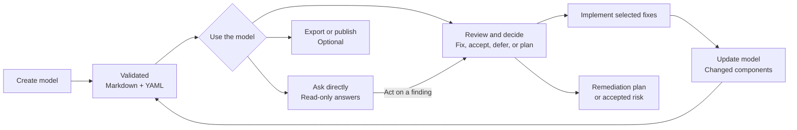
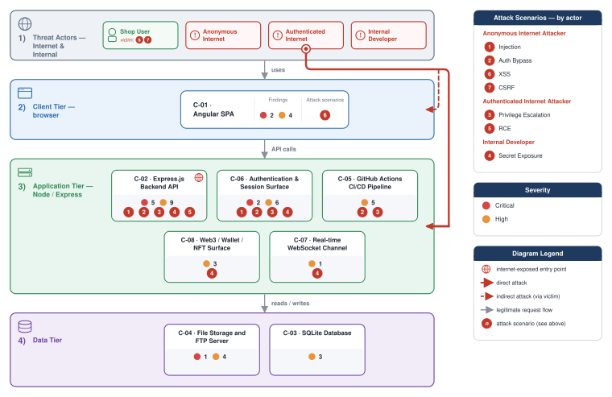

# Threat Modeler

`/appsec-advisor:create-threat-model` derives an architecture model from a repository and applies STRIDE. The result is a security review for engineering and AppSec teams.

→ [Back to README](../README.md)

## Contents

- [What you get](#what-you-get)
- [Threat model lifecycle](#threat-model-lifecycle)
- [Example report: OWASP Juice Shop](#example-report-owasp-juice-shop)
- [What it checks](#what-it-checks)
- [Usage examples](#usage-examples)
- [Assessment depth & cost control](#assessment-depth--cost-control)
- [Repo-local context](#repo-local-context)
- [Cross-repo context](#cross-repo-context)
- [Architecture](#architecture)
- [Workflow commands](#workflow-commands)

## What you get

An assessment produces a security architecture and threat model report based on the repository. The report covers architecture observations, trust boundaries, STRIDE findings, risk-ranked threats, affected components, remediation guidance, and generated diagrams.

The Markdown and YAML outputs are generated from the same validated data.

### Technical vs. functional threat modeling

This skill generates a *technical* threat model. It starts from repository evidence — source files, manifests, and configuration — to identify components, trust boundaries, data flows, and STRIDE findings. It is intentionally distinct from *functional* or DFD-based threat modeling, which maps business processes, user workflows, and domain assets. Use the output to review whether the implemented technical architecture enforces the intended security design.

Trust-boundary assessment has its own stage. Discovery first finalizes the
component registry and persists data flows; a fresh focused analyst then
classifies every deterministic crossing signal. A coverage gate blocks STRIDE
when signals are missing, stale, or malformed, while explicitly unresolved
crossings remain visible for review. This separation also gives boundary work
its own retry, resume checkpoint, timing, and audit artifacts.

**Default outputs**

- `threat-model.md` — human-readable report for engineers, architects, and security reviewers.
- `threat-model.yaml` — structured export used for automation and incremental reruns.

**Optional deliverables**

| File | Enable with | Description |
|---|---|---|
| `threat-model.pdf` | `--pdf` | PDF with a cover page, table of contents, and rendered diagrams. Requires `pandoc` and `weasyprint`. |
| `threat-model.html` | `--html` | Self-contained HTML for browsers and wiki attachments. Requires `pandoc`. |
| `threat-model.sarif.json` | `--sarif` | SARIF v2.1 output for code scanning integrations. |
| `pentest-tasks.yaml` | `--pentest-tasks` | Endpoint catalog and test plan for supported pentest tooling. |
| `threat-model.threatdragon.json` | `--threatdragon` | **Alpha.** OWASP Threat Dragon v2 JSON, which also imports into OWASP ThreatAtlas. Opt-in only and lossy — see [Threat Dragon export](threat-dragon-export.md). |

Optional formats can also be generated from an existing assessment:

```text
# Generate every export format from an existing threat-model.yaml / .md
/appsec-advisor:export-threat-model

# Single format
/appsec-advisor:export-threat-model --formats sarif
/appsec-advisor:export-threat-model --formats html
/appsec-advisor:export-threat-model --formats pentest --pentest-target https://staging.example.com

# Alpha: OWASP Threat Dragon JSON, which also imports into OWASP ThreatAtlas
/appsec-advisor:export-threat-model --formats threatdragon
```

The Threat Dragon export is alpha and is not part of the default set — request it by name. It is lossy, because Threat Dragon's schema holds much less than ours; see [Threat Dragon export](threat-dragon-export.md).

SARIF, pentest tasks and Threat Dragon are generated from `threat-model.yaml` without model calls. PDF and HTML are converted from `threat-model.md`. Diagram rendering also requires `mmdc` and Chrome or Chromium. Check the export dependencies with:

```text
/appsec-advisor:export-threat-model --check-only
```

Use `--no-mermaid` to export PDF or HTML without rendered diagrams. To enable strict Mermaid validation during assessments, install the optional parser with `npm install --prefix "$CLAUDE_PLUGIN_ROOT/scripts"`.

## Threat model lifecycle

A threat model is a continuing security-review workflow, not just a generated report. Create it once, then ask questions, make decisions, implement selected changes, and reassess as the repository evolves.



### Create or update the model

Run `/appsec-advisor:create-threat-model` for the first assessment. It analyzes repository evidence and produces validated Markdown and YAML. After code changes, `/appsec-advisor:update-threat-model` re-analyzes affected components and preserves finding identity across runs. It stops with guidance when no prior model exists, so an update cannot become an accidental first full scan.

### Ask about the model directly

You do not need a command to explore an existing model. Ask a natural-language question in the Claude Code console:

```text
what are the most critical findings?
does the model cover SSRF?
what is the mitigation for F-003?
is the threat model still current?
```

The `ask-threat-model` workflow reads the structured model without rescanning the repository or changing files. Answers are grounded in the model, cite finding IDs, and say when the model does not contain the requested information. The explicit `/appsec-advisor:ask-threat-model <question>` form is also available. Use `/appsec-advisor:show-threat-model` when you want the fixed overview block rather than an answer to a specific question.

### Review, decide, or implement

Run `/appsec-advisor:review-threat-model` when you want to act on findings. Its modes support read-only browsing, recording fix, accept-risk, or defer decisions across selected findings, applying chosen code fixes one at a time, and building a remediation plan with owners and targets.

Triage decisions live separately from the generated model and survive reassessment. The review workflow never regenerates or re-scores `threat-model.yaml`; source changes happen only after an explicit implementation choice.

### Export or publish

`/appsec-advisor:export-threat-model` generates PDF, HTML, SARIF, or pentest tasks from an existing assessment without another repository analysis. `/appsec-advisor:publish-threat-model` is the separate, deliberate path for making reviewed report files trackable in version control after its publication checks pass.

## Example report: OWASP Juice Shop

The [OWASP Juice Shop example](../examples/threat-modeler/threat-model-juice-shop-thorough-v0.5.md) shows a complete thorough assessment with evidence links, abuse cases, and attack paths.

Example security posture diagram from the report:



## What it checks

Before running STRIDE, `appsec-advisor` performs a reconnaissance pass that collects security-relevant signals from the repository. Those signals give the analysis a starting point: routes, trust boundaries, auth flows, risky sinks, security controls, deployment files, and supply-chain configuration.

| Area | What is inspected |
|---|---|
| **Security Architecture** | Data flows, trust boundaries, service boundaries, compartmentalization, and security-relevant architectural patterns. |
| **Authentication & Access Control** | JWT handling, OAuth/OIDC flows, session handling, role checks, authorization middleware, and client-side access guards. |
| **Input Handling & Injection** | SQL/NoSQL query construction, unsafe deserialization patterns, request validation, and user-controlled input reaching sensitive sinks. |
| **Cryptography & Secrets** | Hardcoded secrets, weak hashing or crypto choices, key handling patterns, and sensitive configuration values. |
| **Frontend Security** | XSS-prone patterns, unsafe browser storage, client-side exposure of sensitive data, and security-relevant bundle content. |
| **Operations & Configuration** | CORS configuration, security headers, exposed management/debug endpoints, verbose errors, and stack-trace leakage. |
| **Supply Chain** | Dependency and lockfile signals, unpinned GitHub Actions, container image pinning, and build/deployment configuration. |
| **GenAI / LLM Security** | Prompt-injection surfaces, tool or agent boundaries, vector-store access patterns, LLM API usage, and OWASP LLM Top 10 related risks. |
| **Threat Actors** | Insider, supply-chain, partner, and adjacent-tenant threats where they apply. |
| **Abuse Cases** | Relevant catalog scenarios are selected from recon signals and repository paths; candidates are checked step-by-step against code evidence. |

> [!NOTE]
> These checks provide context for STRIDE. They do not replace dedicated SAST, SCA, secrets, or IaC scanners.

## Usage examples

Run these commands directly within the Claude Code interface.

```text
# Show help text
/appsec-advisor:create-threat-model --help

# Deeper assessment
/appsec-advisor:create-threat-model --assessment-depth thorough

# Force a fresh scan and discard cached run state
/appsec-advisor:create-threat-model --full --rebuild

# Preview the run without writing files
/appsec-advisor:create-threat-model --dry-run
```

### Focused analysis

Target specific components to reduce cost and review time on large monorepos or during iteration.

```text
# Focus on a logical service by name
/appsec-advisor:create-threat-model focus on the authentication service

# Target a specific directory path
/appsec-advisor:create-threat-model focus on the /services/payment-gateway
```

### Large component inventories

Full and rebuild scans keep every criteria-selected component in scope, including
inventories that exceed the operational component ceiling because many services
are externally reachable. STRIDE analyzers run in resumable waves of up to eight
components by default; completed component files are reused after an interrupted
parent session. Set `APPSEC_STRIDE_CONCURRENCY=1..32` in the Claude Code
environment to tune host pressure without changing coverage. A selected component
that remains missing, partial, or schema-invalid after one retry blocks merge and
report publication.

### With requirements catalog

Use `--requirements` to include your organization's security requirements. See the [harvester guide](harvester.md) for creating the catalog YAML from Confluence, Antora, or other HTML pages.

```text
# Run threat model with requirements fetched from a URL
/appsec-advisor:create-threat-model --requirements https://URL/appsec-requirements.yaml

# Use the bundled mock server to test the loop locally before connecting a real catalog
python3 scripts/mock-server.py
/appsec-advisor:create-threat-model --requirements http://127.0.0.1:4444/requirements.yaml
```

Once `requirements_yaml_url` is set in the plugin's skill configuration, the `--requirements` flag is optional — every subsequent run picks up the catalog automatically.

### Scanning external repositories

Run the analysis against a repository other than the current working directory using `--repo` and `--output`.

```text
# Scan a repository located outside the current working directory
/appsec-advisor:create-threat-model --repo ../another-api --output ./audits/another-api
```

For cross-repo context, declare related services in `docs/related-repos.yaml`; see [Cross-repo context](#cross-repo-context) below.

> [!TIP]
> For the current flag reference, run `/appsec-advisor:create-threat-model --help` or read [`skills/create-threat-model/HELP.txt`](../skills/create-threat-model/HELP.txt).

## Assessment depth & cost control

Assessment depth controls coverage, review depth, runtime, and cost.

### Analysis modes

Choose the lightest mode that fits the decision the report will support.

Within a run, *which* components get a full STRIDE pass is criteria-driven, not a fixed per-depth count. Each depth includes everything from the lighter one:

| Component criterion | quick | standard | thorough |
|---|:---:|:---:|:---:|
| Role-floor: frontend, auth, AI/LLM surface | ✓ | ✓ | ✓ |
| Internet-exposed | ✓ | ✓ | ✓ |
| Exposure-unknown (reachability not provably internal) | ✓ | ✓ | ✓ |
| CI/CD & deployment pipelines | | ✓ | ✓ |
| Crown-jewel stores (credentials, PII, payment, secrets) | | ✓ | ✓ |
| File-upload surface | | ✓ | ✓ |
| Real-time channels | | ✓ | ✓ |
| Proven-internal (reachable but not exposed) | | | ✓ |

Thorough increases both component coverage and per-component analysis depth.

### Cost by depth

These OWASP Juice Shop runs are all on plugin **v0.5.1-dev** (quick/thorough on v0.5.0-beta) with the Claude Code session (the orchestrator) on **Sonnet 4.6**, the recommended economy setup. They compare modes but do not predict the exact bill for another repository.

| Mode | Best fit | Review depth | API cost (USD) and time |
|---|---|---|---|
| **Quick** `--assessment-depth quick` | Early feedback and low-risk changes | Reduced analysis; skips abuse-case validation and final model-based QA | $18.03 and 68 minutes ([sample](../examples/threat-modeler/threat-model-juice-shop-quick-v0.5.md)) |
| **Standard** *(default)* | Normal threat models and security reviews | Full analysis, abuse-case validation, and QA | $30.83 and 89 minutes ([sample](../examples/threat-modeler/threat-model-juice-shop-standard-v0.5.md)) |
| **Thorough** `--assessment-depth thorough` | High-risk services and major releases | Deeper component analysis and architecture review | $48.01 and ~138 minutes ([sample](../examples/threat-modeler/threat-model-juice-shop-thorough-v0.5.md)) |

> [!NOTE]
> Cost and runtime vary with repository size, stack, cache state, and model selection. Incremental scans commonly use 70–90% fewer tokens when a previous model is available.

**Cross-repo check (standard).** Cost tracks codebase size. [`insecure-spring-app`](https://github.com/matthiasrohr/insecure-spring-app), an intentionally-vulnerable Spring Boot fixture, was assessed at `standard` on the same setup (table below). Its **$31.32** breaks down as $30.73 Sonnet 4.6 + $0.59 Haiku helpers, across 8 analyzed components in ~96 min wall-clock (pipeline only; full session was ~4h 46m including this doc update). The higher component count versus the prior v0.5.0-beta run ($24.65, 5 components) reflects the v0.5.1 criteria expansion that adds crown-jewel stores and additional internet-exposed surfaces to the standard selection set; the session cost also includes the v0.5.1-dev triage/merger upgrade to Sonnet 5. The bill is close to Juice Shop here despite the smaller repository because the component count converged — fewer source files but a similarly broad attack surface.

| Repo | Stack | Mode | Plugin | Session | Threats | API cost |
|---|---|---|---|---|---|---|
| OWASP Juice Shop | Node/Angular | standard | v0.5.1-dev | Sonnet 4.6 | 60 | $30.83 |
| insecure-spring-app | Spring Boot | standard | v0.5.1-dev | Sonnet 4.6 | 49 | $31.32 |

`--stride-cap N` limits non-Critical findings per STRIDE category and component. It is off by default. In the standard benchmark, a cap of 2 trims the finding count by roughly a third and saves roughly $4. The selected cap is recorded in the report.

Phase 10a evidence verification is capped at 20 non-Critical findings in quick mode, 30 in standard mode, and 100 in thorough mode. Use `--evidence-verifier-cap N` to change that limit; Critical findings do not count toward the cap and are selected first.

Cheap-stride is the screening-depth tier for the internal tail. It is **on by default at quick and standard depth and off at thorough**; `--cheap-stride` forces it on at any depth and `--no-cheap-stride` forces it off. The pre-flight names which of the two decided, so a run never screens silently. Components that carry the attack surface — authentication, frontend, LLM, internet-exposed, file-upload, and realtime components — keep full STRIDE depth, and so do data stores and the central request-handling backend (the API or gateway layer everything else is reached through). Authentication and the core API are never screened under any configuration. Every other selected component gets a screening pass instead: a flat 8-turn budget with `ESTIMATED_THREAT_COUNT=low`, which skips verification greps and file re-reads. One turn is one tool call the agent makes — reading a file, searching the code — so a screened component gets roughly eight looks at the repository before it has to write up, enough to spot what a file shows on its face but not to trace a control across several files. All six STRIDE categories are still covered; the tier is a budget and pacing lever, never a reduction in category coverage. Screened components are disclosed as such — `Screened` in the §3 component table, a separate clause in the Management Summary scope line, and `analysis_depth: screening` in `.stride-selection.json`.

Defaulting it is only defensible because of the reachability fail-safe described below: an unreliable component model costs budget, never depth. Thorough keeps full depth everywhere because it is the mode a user picks when depth outweighs cost. Use `--no-cheap-stride` at quick or standard when even a proven-internal component must be analyzed at full depth.

The data-store carve-out is measured rather than precautionary. In the juice-shop A/B (`docs/internal/analysis/analysis-cheap-stride-vs-standard-2026-07-25.md`) a screened datastore pair kept its data-at-rest findings but lost every model-design finding the same code yielded at full depth — a conditional-sanitize bypass, the database file placement, and missing query timeouts. That class is what the verification round buys, and the data-store signal is a type anchor, so sparing on it stays selective.

Crown-jewel status deliberately does not spare a component. It reads the analyst's `handles_sensitive_data` flag, which over-tags: 6 of 11 components carried it in that run and 6 of 8 in the comparison run. The same measurement found no coverage loss for the screened crown-jewel API — 18 findings including 4 Criticals at 8 turns.

What does spare it is the reachability fail-safe. A component with no canonical access-zone token is never screened, because screening asserts the component is tail and nothing has proven it internal. This is what put juice-shop's internet-facing REST API into the screening set in the first place: the analyst wrote the runtime tier (`server`, a runtime-only zone) into `deployment_zones` instead of a reachability zone, so the exposure signal never fired. The comparison run tagged the same component `internet-facing` and it kept full depth — analysis depth must not hinge on which synonym the analyst picked. The consequence is that on a repo whose zone vocabulary drifted the flag has little or nothing to screen; when it screens nothing at all the manifest builder says so on stderr (`CHEAP_STRIDE_INERT`) rather than letting a full-price run read as a cheapened one. ci-cd is the one exception to the fail-safe: it is identified by role rather than by reachability, and screening it measured ~zero loss because its substance comes from the deterministic config scanner.

`--register-severity-floor` controls which effective severities enter the canonical report and its SARIF and pentest-task exports. The default, `medium`, excludes Low and Informational findings to keep the register actionable. Use `--register-severity-floor low` or `informational` when a complete lower-severity export is required.

### Reasoning model

`--reasoning-model` sets which foundation model runs the **threat-reasoning core** (STRIDE, triage, merge). The rest of the pipeline is routed independently of the tier.

| Tier | STRIDE · triage · merge | When to use |
|---|---|---|
| `sonnet-economy` | Sonnet 4.6 · Sonnet 5\* · Sonnet 5\* | Default for quick and standard. Helper tasks use Haiku. **\*Standard buy-back:** at `standard`, triage + merger (and renderer + abuse-verifier) resolve to Sonnet 5; STRIDE stays Sonnet 4.6. `quick` is all-Sonnet 4.6. |
| `sonnet` | Sonnet · Sonnet · Sonnet | Keeps helper tasks on Sonnet. |
| `opus-cheap` | Sonnet · Sonnet · **Opus** | Uses Opus only for merging. |
| `opus` | **Opus** · **Opus** · **Opus** | Default for thorough. Costs noticeably more than the economy default for a similar finding count. |

`--stride-model`, `--triage-model`, and `--merger-model` override one part of the selected tier. Each accepts a tier alias (`sonnet` / `opus`) or an explicit version id (e.g. `claude-sonnet-5`, `claude-sonnet-4-6`) to pin an exact model regardless of the session — the bare `sonnet` alias otherwise follows the host session model. Direct flags take precedence over the matching `APPSEC_*_MODEL` environment variables. `--no-opus` disables all Opus selections.

> **`--merger-model` caveat.** STRIDE and triage run as separate model-pinned sub-agents, so their pins always take effect. The merge runs **inline/deterministic** on the everyday `sonnet-economy` path — a separate `appsec-threat-merger` sub-agent is only dispatched on the opt-in *hybrid* path (when `--merger-model`/`APPSEC_MERGER_MODEL` resolves to an **Opus** id, or at `--assessment-depth thorough`). So `--merger-model claude-sonnet-5` at standard has **no effect**. The effective-routing table at scan start marks the merger row `inline unless hybrid/Opus`.

Each role gets a concrete model per depth — no subagent is left on the bare `sonnet` alias (which would silently follow your session):

| Role | Agents | quick | standard | thorough |
|---|---|---|---|---|
| Reasoning — discovery | STRIDE | Sonnet 4.6 | Sonnet 4.6 | Opus |
| Reasoning — judgment | triage, merge | Sonnet 4.6 | **Sonnet 5** | Opus |
| Presentation | renderer, abuse-verifier | Sonnet 4.6 | **Sonnet 5** | **Sonnet 5** |
| Mechanical / contract | qa-content, qa-routine | Sonnet 4.6¹ | Sonnet 4.6¹ | Sonnet 4.6 |
| Deterministic helpers | context-resolver, recon-scanner, config-scanner | Haiku | Haiku | Haiku |
| Session | orchestrator | follows session² | follows session² | follows session² |

¹ qa-routine (mechanical link/anchor fixes) runs on Haiku at quick/standard. ² the orchestrator *is* the session model — the plugin can't pin it; see *Session Model* below.

STRIDE stays on 4.6 because threat *discovery* depends on recall, where 4.6 matched or beat Sonnet 5 while costing less; triage/merge/renderer/abuse-verifier get Sonnet 5 where a benchmark showed a real gain (severity calibration, dedup, CISO framing, decisive verdicts). Two caveats: the explicit-id pins only take effect on the **headless path** (an interactive run's subagents inherit the session model), and the merger pin is inert at standard (see caveat above). The whole split is skipped under the explicit `sonnet` tier.

For standard assessments, using Opus only for triage costs just slightly more than the all-Sonnet baseline, while the full Opus tier costs substantially more:

```text
/appsec-advisor:create-threat-model --reasoning-model sonnet-economy --triage-model opus --stride-cap 2
```

The report records the resolved model mix in *Run Statistics*.

### Session Model

The **session model** — the model the main Claude Code loop runs on — is the biggest single cost driver, and the one part the defaults can't set for you. It pays for the dominant cache-read of a full run plus every agent that isn't pinned elsewhere (orchestrator, Stage-2 renderer, abuse-case verifier, content-QA). A running session can't switch its own model, so this is a Claude Code setting, not a plugin flag.

Running the session on **Sonnet-4.6** roughly **halves** the cost versus Sonnet-5 for the same report (see *Background* below). Set it:

- **Interactive:** `/model claude-sonnet-4-6` before launching, or add `"model": "claude-sonnet-4-6"` to `.claude/settings.json` (project) or `~/.claude/settings.json` (global). The scan warns at start when it detects a non-4.6 host and prints the exact restart command; effective per-agent routing is shown in the Pre-flight box.
- **Headless / CI:** `scripts/run-headless.sh` **defaults** to `claude-sonnet-4-6` — no flag needed. Override per run with `--model <id>`.

**Rule of thumb: run the session on Sonnet-4.6 and pin *up* only the few stages where Sonnet-5 pays off.** STRIDE/triage/merger stay 4.6 on either session; a Sonnet-5 session only adds Sonnet-5 rates to the cache-read, orchestrator, renderer, abuse-verifier and content-QA for no quality gain. The three buy-backs are small token slices, so the run stays close to pure-4.6 cost:

| Stage | Buy-back knob |
|---|---|
| Triage (severity calibration) | `--triage-model claude-sonnet-5` |
| Renderer (§7 + MS, CISO framing) | `APPSEC_RENDERER_MODEL=claude-sonnet-5` |
| Abuse-case verifier (decisive verdicts) | `APPSEC_ABUSE_VERIFIER_MODEL=claude-sonnet-5` |

Interactively, `--triage-model` works as a flag; the two `APPSEC_*_MODEL` pins must sit in the `.claude/settings.json` `"env"` block (an inline `VAR=… /command` does not reach the skill). Headless, all three can be passed inline before `run-headless.sh`.

#### Background: why Sonnet 4.6 costs less

A threat-model scan is token-heavy and largely mechanical: it reads an entire repository into context and emits structured fragments, so the bill is dominated by tokens processed (mostly cached input re-read), not hard reasoning. Sonnet 5 and 4.6 bill at comparable per-token rates, but Sonnet 5's updated tokenizer represents the same source text with **more** tokens — roughly 30 % more in this project's A/B runs — and because the work is token-bound, that flows straight through to cost. Sonnet 5's edge is reasoning *quality*, not token efficiency, so the economical setup keeps the mechanical majority on 4.6 and spends Sonnet 5 only where its reasoning measurably improves the result.

### Budget guardrails

Set hard limits for runtime and API cost:

| Interactive plugin | Headless / CI | Meaning |
|---|---|---|
| `--max-wall-time` | `--max-duration` | Maximum runtime |
| `--max-cost` | `--max-budget` | Maximum API spend |

Example:

| Mode | Time limit | Cost limit | Example |
|---|---|---|---|
| **Interactive plugin** | `--max-wall-time` | `--max-cost` | `/appsec-advisor:create-threat-model --max-cost 5 --max-wall-time 30m` |
| **Headless / CI** | `--max-duration` | `--max-budget` | `./scripts/run-headless.sh --incremental --max-duration 1800 --max-budget 5` |

> [!NOTE]
> Cost limits only apply when using an `ANTHROPIC_API_KEY`. When running on a standard Claude subscription, there is no per-token API billing, so cost limits are ignored. Time limits remain active in both modes.

> [!TIP]
> The interactive session model is billed separately from `--reasoning-model`. Running the session itself on Opus added about 25–55% to measured total cost without changing the analysis model. Use a Sonnet session for routine runs.

## Repo-local context

Three optional files add team-owned context. None of them can suppress a finding supported by repository evidence.

### Business context — `docs/business-context.md`

Use this Markdown file for facts the code cannot show: critical flows, regulatory scope, sensitive data, and high-impact failure scenarios. The first 200 lines are read.

### Known threats — `docs/known-threats.yaml`

A list of threats the team already knows about: prior pentest findings, accepted risks, or issues you want every run to re-check. The file is schema-validated up front, so a malformed entry stops the run early instead of being dropped silently.

```yaml
threats:
  - id: PT-2025-001
    title: Stored XSS in product reviews
    stride: Tampering
    component: web-frontend
    severity: High
    status: open
    description: Review body rendered without sanitization.
    evidence: src/reviews/render.ts:42
```

Each entry's `status` decides what the scan does with it:

| `status` | What the scan does |
|---|---|
| `open` | Re-reads the cited evidence and includes the threat if it still holds |
| `mitigated` | Verifies the mitigation is actually present in the code |
| `accepted` | Records it under accepted risks, without re-checking |
| `false-positive` | Skips it entirely |

Optional fields per entry: `evidence` (`file:line`), `pentest_ref`, `accepted_risk`, `mitigation_ref`.

### Trust-boundary declarations — `.appsec/trust-boundaries.yaml`

Use this optional file when deployment, tenancy, or ownership intent cannot be
derived reliably from source. Declarations add or clarify catalogue rows; they
cannot suppress detected boundaries, claim that a control is effective, or
change a finding's rating by themselves.

```yaml
boundaries:
  - key: public-api
    name: Public API ingress
    from: external
    to: api
    kind: network
    assumption: Authenticated requests are authorized before protected operations.
    evidence:
      - file: deploy/ingress.yaml
        line: 18
```

`key` is stable repository identity. The assessment assigns the public `tb-N`
ID. Paths must be repository-relative, and the complete declaration file is
ignored when it does not satisfy the strict schema. A declaration-only change
refreshes the canonical catalogue and report without dispatching STRIDE
analyzers for otherwise unchanged components.

Detected boundaries use evidence confidence `confirmed`, `inferred`, or
`unknown`. Any resolved crossing may become an analyzer candidate; confidence
only orders them. Figure 1 exposure and finding links additionally require
`confirmed`, so an `inferred` crossing is analyzed but never linked. An
unresolved or conflicted row remains visible for review but is never treated as
an observed path or an ineffective control.
Legacy sidecars remain displayable during rerender, but they do not receive new
IDs or feed semantic consumers; a fresh scan is required to normalize them.

The report's **Trust Boundaries** catalogue distinguishes confirmed
`internet-facing`, `outbound`, and `internal` crossings from `inferred` rows and
rows that require review. It links a boundary to findings only when the finding
has its own verified evidence for a gap at that crossing. Adjacency alone does
not create a finding and does not affect severity.

A validated finding-level link to a resolved, confirmed `external → component`
ingress can raise effective severity by one band, up to `High`. The link must
cite evidence already owned by that finding. Multiple ingress links still
produce only one step, evidence marked `refuted` or `ambiguous` never qualifies,
and the normal per-CWE severity caps still apply. Internal, outbound, inferred,
unresolved, conflicted, dangling, wrong-origin, and evidence-free links do not
change severity. Raw risk remains unchanged and every effective-severity change
is recorded in the triage audit.
Canonical YAML and the query command contain the complete catalogue; the
Markdown catalogue is capped for readability, finding cards link only visible
anchors, and SARIF carries linked IDs in result properties. Figure 1 remains a
summary and is not the canonical boundary view.

Boundary finding links are best-effort enrichment. Each component receives at
most 2/4/6 candidate crossings for quick/standard/thorough; quick additionally
keeps only a component's primary crossings. A resolved crossing that reaches no
component is reported as a coverage gap. Candidates are read with the existing
parallel context batch and never add an analyzer turn or expand the incremental
dispatch set. A source-clean component may therefore retain its prior links
until a later source-triggered, full, or rebuild run.

## Cross-repo context

`appsec-advisor` scans one repository at a time. If your service calls another service, you can still give the scan useful cross-repo context.

Declare the services this repo depends on in `docs/related-repos.yaml`.

> **Note:** Actor pull from `related-repos.yaml` is not supported. Declaring a related repo does not import its actor definitions. The compromised-third-party-service actor is activated only when the scan detects external API calls in the repo itself, not through `related-repos.yaml` declarations.

### Add context for services you call

If this repo calls another internal service, add that service's threat model to `docs/related-repos.yaml`:

```yaml
related:
  - name: payments-api
    threat_model: ../payments-api/docs/security/threat-model.yaml
    interface: POST /api/v1/payments
```

On the next scan, `appsec-advisor` uses that upstream threat model as context for the local component that calls `payments-api`.

`threat_model:` accepts a local path or `https://...` URL. For private repos, use `auth_env:` to name an environment variable that contains the fetch header.

The `interface:` value is matched against the upstream model's `attack_surface[].entry_point`. When it matches, the scan can use upstream details such as protocol, authentication requirement, handling component, and documented controls.

Imported data is context, not verified evidence. It can suggest findings but cannot suppress local evidence.

### Declare assumptions about the upstream service

If this repo relies on a specific upstream guarantee, declare it explicitly:

```yaml
    expected_auth: JWT
    expected_validation: schema
```

If the upstream threat model documents something different, the scan can raise a cross-repo hypothesis at that boundary. For example, expecting `JWT` while the upstream model documents `api-key` can seed an authentication-related finding.

These fields are optional. Without them, the scan still uses the upstream model as context, but it does not perform this expectation check.

## Architecture

The pipeline extracts architecture and security signals, runs STRIDE by component, verifies evidence, and renders the validated results. The final report does not come from a single free-form model response.


## Workflow commands

Use these commands after an assessment or to recover an interrupted run.

| Command | Purpose |
|---|---|
| `/appsec-advisor:ask-threat-model <question>` | Answer a free-form question from the structured model without rescanning or writing files. Natural-language questions about the model route here even when the command is omitted. |
| `/appsec-advisor:show-threat-model` | Print the fixed read-only overview with scan identity, severity mix, mitigation backlog, worst-case scenarios, control posture, and freshness. |
| `/appsec-advisor:update-threat-model` | Incrementally update an existing threat model — alias for `create-threat-model --incremental`, re-analyzing only changed components. Aborts with guidance when no model exists yet (never bootstraps a first full scan). An explicit `--full`/`--rebuild`/`--rerender`/`--resume` is honored instead. |
| `/appsec-advisor:review-threat-model` | Open a triage console over an existing report — a one-screen verdict (severity mix, hottest areas and components, mitigation coverage), then drill into top findings, top mitigations, or a security domain and bulk-decide mitigate / accept-risk / defer (with owner and target) on a whole selection at once; writes a prioritised `remediation-plan.md`. Runs independently of the assessment and only reads the model. |
| `/appsec-advisor:publish-threat-model` | Make selected report files trackable in git after the publish checks pass. |
| `/appsec-advisor:export-threat-model` | Re-export an existing threat model into PDF, HTML, SARIF, or pentest tasks without model calls. |
| `/appsec-advisor:threat-model-health` | Check whether the current threat model is fresh, stale, missing, or blocked by run debris. |
| `/appsec-advisor:clean-run-state` | Remove stale run-state after an interrupted or crashed assessment. |
| `/appsec-advisor:fix-run-issues` | Apply safe auto-fixes for issues recorded by the previous run, or print manual repair guidance. |
| `/appsec-advisor:status` | Show plugin version, configuration, and last-run state. |
| `/appsec-advisor:check-permissions` | Check or update the Claude Code permissions needed for unattended runs. |

Outside of a Claude Code session (e.g. in CI setup), use the equivalent Makefile target:

```sh
make setup-target [REPO=<path>] [SCOPE=local|project|user]
```

`REPO` defaults to the current directory. `SCOPE` controls which settings file is written (`local` = `.claude/settings.local.json`, default; `project` = `.claude/settings.json`; `user` = `~/.claude/settings.json`).
