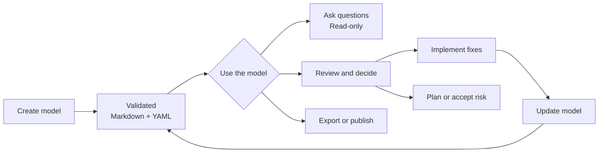

# Threat Modeler

`/appsec-advisor:create-threat-model` derives an architecture model from a repository and applies STRIDE. The result is a **code-derived threat model** for engineering and AppSec teams.

→ [Back to README](../README.md)

## Contents

- [What you get](#what-you-get)
- [Threat model lifecycle](#threat-model-lifecycle)
- [Example report](#example-report-owasp-juice-shop)
- [What it checks](#what-it-checks)
- [Trust boundaries](#trust-boundaries)
- [Usage examples](#usage-examples)
- [Assessment depth & cost control](#assessment-depth--cost-control)
- [Repo-local context](#repo-local-context)
- [Cross-repo context](#cross-repo-context)
- [Architecture](#architecture)
- [Workflow commands](#workflow-commands)

## What you get

An assessment produces an architecture and security report from repository evidence. It covers components, data flows, trust boundaries, STRIDE findings, affected code, mitigation guidance, and diagrams. The Markdown and YAML outputs come from the same validated data.

**Default outputs**

- `threat-model.md` — report for engineers, architects, and security reviewers.
- `threat-model.yaml` — structured model used by automation and incremental scans.

**Optional outputs**

| File | Enable with | Notes |
|---|---|---|
| `threat-model.pdf` | `--pdf` | Requires `pandoc` and `weasyprint`. |
| `threat-model.html` | `--html` | Requires `pandoc`. |
| `threat-model.sarif.json` | `--sarif` | SARIF v2.1 for code-scanning integrations. |
| `pentest-tasks.yaml` | `--pentest-tasks` | Endpoint catalog and pentest plan. |
| `threat-model.threatdragon.json` | `--threatdragon` | Alpha, opt-in, and lossy. Also imports into OWASP ThreatAtlas. |

Generate optional formats from an existing assessment without running the analysis again:

```text
# All stable formats
/appsec-advisor:export-threat-model

# Selected formats
/appsec-advisor:export-threat-model --formats sarif
/appsec-advisor:export-threat-model --formats html
/appsec-advisor:export-threat-model --formats pentest --pentest-target https://staging.example.com

# Alpha: Threat Dragon v2 JSON
/appsec-advisor:export-threat-model --formats threatdragon
```

SARIF, pentest tasks, and Threat Dragon are generated from `threat-model.yaml`. PDF and HTML are converted from `threat-model.md`; rendered diagrams also require `mmdc` and Chrome or Chromium. Check dependencies with `/appsec-advisor:export-threat-model --check-only`, or use `--no-mermaid` to export PDF or HTML without rendered diagrams. See [Threat Dragon export](threat-dragon-export.md) for that format's limits.

## Threat model lifecycle

Create the model once, work through its findings, and update it as the repository changes.



### Create or update the model

Run `/appsec-advisor:create-threat-model` for the first assessment. After code changes, `/appsec-advisor:update-threat-model` re-analyzes affected components and preserves finding identity. It refuses to run when no prior model exists, so an update cannot accidentally become a full first scan.

Incremental scans preserve T/F finding IDs. A shallower scan carries forward findings it could not reverify; an equal-or-deeper scan records non-reproduced findings as resolved. `--rebuild` deliberately clears the prior model and stable-ID cache, allowing IDs to be reassigned.

### Ask about the model

Ask a question directly in Claude Code:

```text
what are the most critical findings?
does the model cover SSRF?
what is the mitigation for F-003?
is the threat model still current?
```

The read-only `ask-threat-model` workflow uses the structured model without rescanning or changing files. The explicit form is `/appsec-advisor:ask-threat-model <question>`. Use `/appsec-advisor:show-threat-model` for a fixed overview.

### Review and decide

`/appsec-advisor:review-threat-model` supports browsing findings, recording fix, accept-risk, or defer decisions, implementing selected fixes, and creating a remediation plan with owners and targets.

Decisions are stored separately from the generated model and survive reassessment. The workflow changes source only after an explicit implementation choice.

### Export or publish

`/appsec-advisor:export-threat-model` creates exports from an existing model. `/appsec-advisor:publish-threat-model` is the separate path for making reviewed report files trackable in version control.

## Example report: OWASP Juice Shop

The [OWASP Juice Shop example](../examples/threat-modeler/threat-model-juice-shop-thorough-v0.5.2.md) shows a thorough assessment with evidence links, abuse cases, and attack paths.


## What it checks

Before STRIDE, a reconnaissance pass collects routes, authentication flows, trust boundaries, sensitive sinks, security controls, deployment files, and supply-chain configuration.

| Area | What is inspected |
|---|---|
| **Security architecture** | Data flows, boundaries, compartmentalization, and security-relevant architecture patterns. |
| **Authentication and access control** | JWT, OAuth/OIDC, sessions, role checks, authorization middleware, and client-side guards. |
| **Input handling and injection** | Query construction, unsafe deserialization, request validation, and untrusted input reaching sensitive sinks. |
| **Cryptography and secrets** | Hardcoded secrets, weak algorithms, key handling, and sensitive configuration. |
| **Frontend security** | XSS-prone patterns, browser storage, exposed data, and security-relevant bundle content. |
| **Operations and configuration** | CORS, security headers, management endpoints, verbose errors, and stack traces. |
| **Supply chain** | Dependency and lockfile signals, GitHub Actions, container images, and build configuration. |
| **GenAI and LLM security** | Prompt injection, tool boundaries, vector-store access, model APIs, and OWASP LLM risks. |
| **Threat actors** | Insider, supply-chain, partner, and adjacent-tenant threats where applicable. |
| **Abuse cases** | Catalog scenarios selected from repository signals and verified step-by-step against code evidence. |

These checks provide context for STRIDE. They do not replace dedicated SAST, SCA, secrets, or IaC scanners. A hypothesis becomes a finding only when repository evidence supports it, and the report remains review input rather than a release verdict.

## Trust boundaries

A trust boundary is a crossing between two components at one enforcement point, not a zone. Crossings that use the same enforcement point are consolidated so the report lists controls rather than every connection.

### Assumptions and verdicts

Each boundary states the security condition it depends on. Findings determine the verdict:

| Verdict | Meaning |
|---|---|
| **Refuted** | A linked finding demonstrates a control gap at the crossing. |
| **Unconfirmed** | Relevant findings exist behind the crossing, but none examined the crossing itself. |
| *No finding contradicts it* | The report contains no evidence against the condition. |
| *Not examined* | The boundary protects no component in this model. |

Only a finding with verified evidence at that crossing is linked. Proximity alone does not create a link, and `Unconfirmed` is a coverage statement rather than proof that the control works.

### Effect on finding priority

A refuted boundary can make findings behind it easier to reach and therefore rank them higher. A finding linked to a confirmed internet ingress may have its effective severity raised by one level, up to `High`. Evidence requirements and per-CWE severity caps still apply; inferred, internal, outbound, or unresolved boundaries do not trigger the raise.

Declarations alone never change a rating. The next scan re-evaluates the path when a boundary finding is fixed.

### Where the catalog appears

`threat-model.yaml` and `ask-threat-model` contain the full boundary catalog. The Markdown report keeps the table readable but always includes boundaries referenced by findings. SARIF carries the linked boundary per result; the architecture diagram is a summary rather than the authoritative catalog.

## Usage examples

Run these commands in Claude Code:

```text
# Show all options
/appsec-advisor:create-threat-model --help

# Deeper assessment
/appsec-advisor:create-threat-model --assessment-depth thorough

# Fresh scan that may reassign finding IDs
/appsec-advisor:create-threat-model --full --rebuild

# Preview without writing files
/appsec-advisor:create-threat-model --dry-run
```

### Focused analysis

Focus on a component or directory to reduce cost and review time:

```text
/appsec-advisor:create-threat-model focus on the authentication service
/appsec-advisor:create-threat-model focus on the /services/payment-gateway
```

### Large component inventories

Full and rebuild scans keep all selected components in scope. STRIDE runs in resumable waves of up to eight components by default, and completed component results survive an interrupted parent session. Set `APPSEC_STRIDE_CONCURRENCY=1..10` to tune host pressure without reducing coverage. A component that remains missing or invalid after retry blocks publication.

### Requirements catalog

Use `--requirements` to include an AppSec requirements catalog. See the [harvester guide](harvester.md) for creating one.

```text
/appsec-advisor:create-threat-model --requirements https://URL/appsec-requirements.yaml
```

Once `requirements_yaml_url` is configured, later runs use the catalog without the flag.

### External repositories

Use `--repo` and `--output` when the repository is outside the current working directory:

```text
/appsec-advisor:create-threat-model --repo ../another-api --output ./audits/another-api
```

For cross-repository analysis context, see [Cross-repo context](#cross-repo-context). For the complete flag reference, run `/appsec-advisor:create-threat-model --help` or read [`HELP.txt`](../skills/create-threat-model/HELP.txt).

## Assessment depth & cost control

Choose the lightest mode that supports the decision you need to make. Each depth includes the components selected by the lighter modes.

| Component criterion | quick | standard | thorough |
|---|:---:|:---:|:---:|
| Frontend, authentication, or AI/LLM surface | ✓ | ✓ | ✓ |
| Internet-exposed or exposure unknown | ✓ | ✓ | ✓ |
| CI/CD and deployment pipeline | | ✓ | ✓ |
| Crown-jewel data store | | ✓ | ✓ |
| File upload or real-time channel | | ✓ | ✓ |
| Proven internal component | | | ✓ |

Thorough increases both component coverage and per-component analysis depth.

### Measured cost by depth

The following OWASP Juice Shop runs used a Sonnet 4.6 Claude Code session. Quick and standard used v0.5.2-dev; thorough used v0.5.1-dev. Results vary with repository, cache state, and model routing.

| Mode | Best fit | Review depth | Measured API cost and time |
|---|---|---|---|
| **Quick** `--assessment-depth quick` | Early feedback and low-risk changes | Reduced analysis; no abuse-case validation or final model-based QA | $25.02 and 70 minutes ([sample](../examples/threat-modeler/threat-model-juice-shop-quick-v0.5.2.md)) |
| **Standard** *(default)* | Normal security reviews | Full analysis, abuse-case validation, and QA | $25.39 and 124 minutes ([sample](../examples/threat-modeler/threat-model-juice-shop-standard-v0.5.2.md)) |
| **Thorough** `--assessment-depth thorough` | High-risk services and major releases | Deeper component and architecture review | $48.01 and about 138 minutes ([sample](../examples/threat-modeler/threat-model-juice-shop-thorough-v0.5.2.md)) |

The standard run included one STRIDE retry. Incremental scans commonly use 70–90% fewer tokens when a previous model is available. Cost follows the number and complexity of analyzed components more closely than raw repository size.

### Additional controls

| Option | Effect |
|---|---|
| `--cheap-stride` / `--no-cheap-stride` | Use or disable the light pass for proven-internal components. It is on by default for quick and standard and off for thorough. All six STRIDE categories still run. |
| `--stride-cap N` | Limit non-Critical findings per STRIDE category and component. Off by default. |
| `--evidence-verifier-cap N` | Limit non-Critical findings sent through evidence verification. Critical findings are always selected first. |
| `--register-severity-floor LEVEL` | Set the lowest severity included in the report and exports. Default: `medium`. |

Authentication, frontend, LLM, internet-exposed, file-upload, real-time, data-store, and core-backend components keep full STRIDE depth. Components with unknown reachability also keep full depth.

### Model routing

The orchestrator and analysis agents are controlled separately:

- The **Claude Code session model** runs the orchestrator. For normal repositories, Sonnet 4.6 is recommended because this session is the main cost driver. Repositories with at least 2,500 source files may need Sonnet 5 for its larger context window.
- `--reasoning-model` selects the analysis tier. The default `sonnet-economy` routing keeps STRIDE on Sonnet 4.6 and uses Sonnet 5 selectively for judgment and presentation in standard scans.

| Tier | STRIDE · triage · merge | Use |
|---|---|---|
| `sonnet-economy` | Sonnet 4.6 · Sonnet 5* · Sonnet 5* | Default for quick and standard. In quick mode all three use Sonnet 4.6. |
| `sonnet` | Sonnet · Sonnet · Sonnet | Latest Sonnet for the reasoning core. |
| `opus-cheap` | Sonnet · Sonnet · Opus | Opus only for merging. |
| `opus` | Opus · Opus · Opus | Default for thorough. |

*In standard mode, the routing targets Sonnet 5 for triage, merging, rendering, and abuse-case verification. STRIDE stays on 4.6 for recall and cost. Exact version pins depend on the execution path; interactive subagents may inherit the session model. The pre-flight table shows the resolved routing for each run.*

Set the interactive session before starting:

```text
/model claude-sonnet-4-6
```

Headless runs default to 4.6 and accept `scripts/run-headless.sh --model <id>`. Per-stage overrides are available through `--stride-model`, `--triage-model`, and `--merger-model`; `--no-opus` disables Opus selections. See [Model Selection, Cost & Context Window](model-selection.md) for routing precedence, execution-path caveats, and benchmark details.

### Budget guardrails

| Interactive | Headless / CI | Effect |
|---|---|---|
| `--max-wall-time` | `--max-duration` | Maximum runtime. |
| `--max-cost` | `--max-budget` | Maximum API spend. |

```text
/appsec-advisor:create-threat-model --max-cost 5 --max-wall-time 30m
./scripts/run-headless.sh --incremental --max-duration 1800 --max-budget 5
```

Cost limits require an `ANTHROPIC_API_KEY`; time limits also work with Claude subscriptions.

## Repo-local context

Four optional files add team-owned context. They are treated as data and cannot suppress findings supported by repository evidence.

### Business context — `docs/business-context.md`

Use this file for facts the code cannot show:

```markdown
## Business purpose
What the system does for the business or its users.

## Impact if compromised
Concrete harm from loss of confidentiality, integrity, or availability.

## Sensitive assets
Data, funds, credentials, decisions, or operations the system handles.

## Security obligations
Applicable policy, contractual, legal, or regulatory duties.

## Security assumptions
Conditions you assume rather than enforce in code.
```

Partial answers are fine. Named sensitive assets also cause their components to receive full-depth analysis.

A fresh interactive run can capture pasted text or a raw Markdown/plain-text URL. Captured URLs pass through the URL and SSRF policy, and content containing a credential is refused. `--skip-context` suppresses the question. Headless runs use `--context <url|path>` for run-only context and never write `docs/business-context.md`.

Changing persistent context does not re-rate an existing model automatically. Run `--full` to apply it to every finding. Keep actor definitions, abuse cases, trust boundaries, threat ratings, and claimed controls out of this file; they have separate inputs or require repository evidence.

### Actor layer — `.appsec/actors.yaml`

Use this schema-validated file to add, override, or disable actors. The repository normally inherits organization actors; `inherit_org: false` removes that layer. An organization-level disable cannot be re-enabled by the repository.

```yaml
disable:
  - id: ACT-D-1
    reason: This repository has no direct customer accounts.
discovery:
  enabled: false
inherit_org: true
```

Actor choices made in conversation apply only to that run. Commit `.appsec/actors.yaml` when a choice must persist.

### Known threats — `docs/known-threats.yaml`

Use this file for prior pentest findings, accepted risks, or issues every run should revisit. Invalid entries stop the run during schema validation.

```yaml
threats:
  - id: PT-2025-001
    title: Stored XSS in product reviews
    stride: Tampering
    component: web-frontend
    severity: High
    status: open
    description: Review body rendered without sanitization.
    evidence: src/reviews/render.ts:42
```

| `status` | Behavior |
|---|---|
| `open` | Re-read the evidence and include the threat if it still holds. |
| `mitigated` | Verify that the mitigation exists. |
| `accepted` | Record the accepted risk without rechecking it. |
| `false-positive` | Skip the entry. |

Optional fields are `evidence`, `pentest_ref`, `accepted_risk`, and `mitigation_ref`.

### Trust-boundary declarations — `.appsec/trust-boundaries.yaml`

Use this file when deployment, tenancy, or ownership intent is not visible in source. Declarations add or clarify catalog rows. They cannot remove detected boundaries, assert that a control works, or change a rating by themselves.

```yaml
boundaries:
  - key: public-api
    name: Public API ingress
    from: external
    to: api
    kind: network
    assumption: Authenticated requests are authorized before protected operations.
    evidence:
      - file: deploy/ingress.yaml
        line: 18
```

`key` is the stable repository identity; the report assigns the public `tb-N` ID. Paths must be repository-relative. Invalid declaration files are rejected rather than partially applied. Unresolved or conflicting declarations remain visible as coverage gaps.

## Cross-repo context

`appsec-advisor` scans one repository at a time. Add a called service's model to `docs/related-repos.yaml` when it should inform the local analysis:

```yaml
related:
  - name: payments-api
    threat_model: ../payments-api/docs/security/threat-model.yaml
    interface: POST /api/v1/payments
    expected_auth: JWT
    expected_validation: schema
```

`threat_model` accepts a local path or HTTPS URL. For private repositories, `auth_env` names the environment variable containing the fetch header. `interface` matches the upstream model's entry point. Optional expectations can trigger a local probe when the upstream model documents something different.

Imported content remains untrusted context. It can suggest a hypothesis but cannot establish a finding, CVSS score, or suppression without evidence from the target repository. Related repositories do not import actor definitions.

## Architecture

The pipeline extracts architecture and security signals, runs STRIDE by component, verifies evidence, and renders validated results. The final report is not a single free-form model response.


## Workflow commands

| Command | Purpose |
|---|---|
| `/appsec-advisor:ask-threat-model <question>` | Answer from the structured model without rescanning or writing files. |
| `/appsec-advisor:show-threat-model` | Show a fixed overview of freshness, findings, mitigations, and control posture. |
| `/appsec-advisor:update-threat-model` | Re-analyze changed components in an existing model. |
| `/appsec-advisor:review-threat-model` | Review findings, record decisions, implement selected fixes, or build a remediation plan. |
| `/appsec-advisor:publish-threat-model` | Make selected report files trackable after publication checks. |
| `/appsec-advisor:export-threat-model` | Export an existing model without another analysis. |
| `/appsec-advisor:threat-model-health` | Check whether the model is fresh, stale, missing, or blocked. |
| `/appsec-advisor:clean-run-state` | Remove stale state after an interrupted run. |
| `/appsec-advisor:fix-run-issues` | Apply safe fixes or show repair guidance for the previous run. |
| `/appsec-advisor:status` | Show plugin version, configuration, and last-run state. |
| `/appsec-advisor:check-permissions` | Check or update permissions for unattended runs. |

Outside Claude Code, configure a target repository with:

```sh
make setup-target [REPO=<path>] [SCOPE=local|project|user]
```

`REPO` defaults to the current directory. `SCOPE` selects local, project, or user settings.
