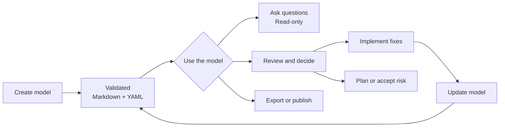
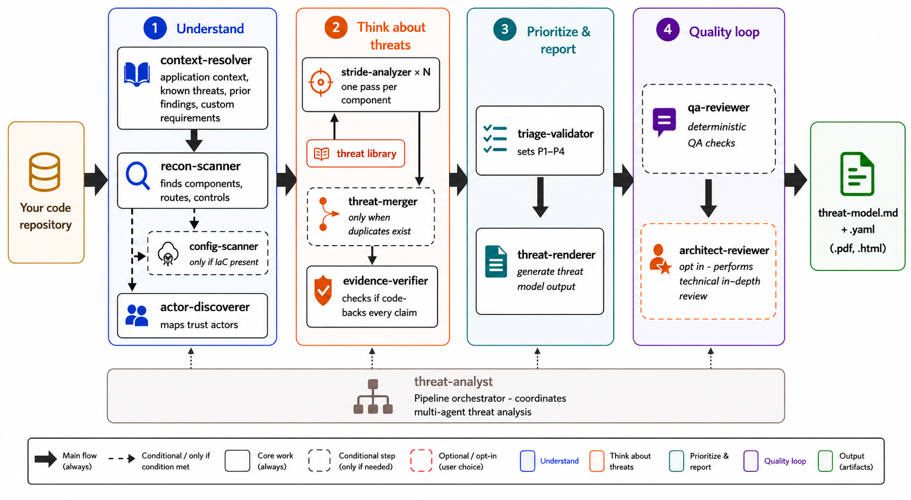

# Threat Modeler

`/appsec-advisor:create-threat-model` derives the implemented architecture from a repository and applies STRIDE. **Code-derived threat modeling** means that code and configuration are the primary evidence, rather than a manually maintained diagram.

→ [Back to README](../README.md)

## Contents

- [What you get](#what-you-get)
- [Threat model lifecycle](#threat-model-lifecycle)
- [Example report](#example-report-owasp-juice-shop)
- [What it checks](#what-it-checks)
- [Trust boundaries](#trust-boundaries)
- [Usage examples](#usage-examples)
- [Assessment depth & cost control](#assessment-depth--cost-control)
- [Repo-local context](#repo-local-context)
- [Cross-repo context](#cross-repo-context)
- [Architecture](#architecture)
- [Workflow commands](#workflow-commands)

## What you get

An assessment generates an architecture and security report from repository evidence. The report covers components, data flows, trust boundaries, STRIDE findings, affected code, remediation guidance, and diagrams. The Markdown and YAML outputs are rendered from the same validated data.

**Default outputs**

- `threat-model.md` — report for engineers, architects, and security reviewers.
- `threat-model.yaml` — structured model used by automation and incremental scans.

**Optional outputs**

| File | Enable with | Notes |
|---|---|---|
| `threat-model.pdf` | `--pdf` | Requires `pandoc` and `weasyprint`. |
| `threat-model.html` | `--html` | Requires `pandoc`. |
| `threat-model.sarif.json` | `--sarif` | SARIF v2.1 for code-scanning integrations. |
| `pentest-tasks.yaml` | `--pentest-tasks` | Endpoint catalog and pentest plan. |
| `threat-model.threatdragon.json` | `--threatdragon` | Alpha, opt-in, and lossy. Also imports into OWASP ThreatAtlas. |

Generate optional formats from an existing assessment without running the analysis again:

```text
# All stable formats
/appsec-advisor:export-threat-model

# Selected formats
/appsec-advisor:export-threat-model --formats sarif
/appsec-advisor:export-threat-model --formats html
/appsec-advisor:export-threat-model --formats pentest --pentest-target https://staging.example.com

# Alpha: Threat Dragon v2 JSON
/appsec-advisor:export-threat-model --formats threatdragon
```

SARIF, pentest tasks, and Threat Dragon are generated from `threat-model.yaml`. PDF and HTML are converted from `threat-model.md`; rendered diagrams also require `mmdc` and Chrome or Chromium. Check dependencies with `/appsec-advisor:export-threat-model --check-only`, or use `--no-mermaid` to export PDF or HTML without rendered diagrams. See [Threat Dragon export](threat-dragon-export.md) for that format's limits.

## Threat model lifecycle

Treat the threat model as a maintained review artifact. Create the initial model, review its findings, and update it as the repository changes.



### Create or update the model

Use `/appsec-advisor:create-threat-model` for the first assessment. After a code change, `/appsec-advisor:update-threat-model` checks the affected components again and keeps the existing finding IDs. If there is no earlier model, the update command stops and tells you to create one first.

Incremental scans preserve T/F finding IDs. A shallower scan carries forward findings it could not reverify; an equal-or-deeper scan records non-reproduced findings as resolved. `--rebuild` deliberately clears the prior model and stable-ID cache, allowing IDs to be reassigned.

### Ask about the model

Ask a question directly in Claude Code:

```text
what are the most critical findings?
does the model cover SSRF?
what is the mitigation for F-003?
is the threat model still current?
```

These questions read `threat-model.yaml`; they do not scan the repository again or change files. You can also write `/appsec-advisor:ask-threat-model <question>`. Use `/appsec-advisor:show-threat-model` when you want the standard overview.

### Review and decide

`/appsec-advisor:review-threat-model` supports finding review, fix and risk decisions, implementation of selected fixes, and remediation planning with owners and target dates.

Decisions are stored separately from the generated model and survive reassessment. The workflow changes source only after an explicit implementation choice.

### Export or publish

`/appsec-advisor:export-threat-model` creates exports from an existing model. `/appsec-advisor:publish-threat-model` is the separate path for making reviewed report files trackable in version control.

## Example report: OWASP Juice Shop

The [OWASP Juice Shop example](../examples/threat-modeler/threat-model-juice-shop-thorough-v0.5.2.md) shows a thorough assessment with evidence links, abuse cases, and attack paths.


## What it checks

Before it runs STRIDE, the plugin maps routes, authentication flows, trust boundaries, sensitive sinks, security controls, deployment files, and supply-chain configuration.

| Area | What is inspected |
|---|---|
| **Security architecture** | Data flows, boundaries, compartmentalization, and security-relevant architecture patterns. |
| **Authentication and access control** | JWT, OAuth/OIDC, sessions, role checks, authorization middleware, and client-side guards. |
| **Input handling and injection** | Query construction, unsafe deserialization, request validation, and untrusted input reaching sensitive sinks. |
| **Cryptography and secrets** | Hardcoded secrets, weak algorithms, key handling, and sensitive configuration. |
| **Frontend security** | XSS-prone patterns, browser storage, exposed data, and security-relevant bundle content. |
| **Operations and configuration** | CORS, security headers, management endpoints, verbose errors, and stack traces. |
| **Supply chain** | Dependency and lockfile signals, GitHub Actions, container images, and build configuration. |
| **GenAI and LLM security** | Prompt injection, tool boundaries, vector-store access, model APIs, and OWASP LLM risks. |
| **Threat actors** | Insider, supply-chain, partner, and adjacent-tenant threats where applicable. |
| **Abuse cases** | Catalog scenarios selected from repository signals and verified step-by-step against code evidence. |

These signals form the analysis context for STRIDE. They do not replace SAST, SCA, secret scanning, or IaC scanning. A hypothesis becomes a finding only when repository evidence supports it, and the resulting report still requires expert review.

## Trust boundaries

In this model, a trust boundary is the crossing where one component transfers data or control to another and relies on a security check. It is an enforcement point, not a zone. Connections governed by the same enforcement point are consolidated into one boundary.

### Assumptions and verdicts

Each boundary states the security condition it depends on. Findings determine the verdict:

| Verdict | Meaning |
|---|---|
| **Refuted** | A linked finding demonstrates a control gap at the crossing. |
| **Unconfirmed** | Relevant findings exist behind the crossing, but none examined the crossing itself. |
| *No finding contradicts it* | The report contains no evidence against the condition. |
| *Not examined* | The boundary protects no component in this model. |

A finding is linked only when its evidence applies to that crossing. Component adjacency alone does not create a link. `Unconfirmed` indicates incomplete coverage, not an effective control.

### Effect on finding priority

A refuted boundary reduces the number of enforced crossings between an attacker and the components behind it, which can move their findings up the ranking. If a finding is linked to a confirmed internet ingress, its effective severity may rise by one level, up to `High`. Evidence requirements and per-CWE severity caps still apply. Internal, outbound, inferred, or unresolved boundaries do not trigger this increase.

Declarations alone never change a rating. The next scan re-evaluates the path when a boundary finding is fixed.

### Where the catalog appears

The complete boundary catalog is in `threat-model.yaml` and available through `ask-threat-model`. The Markdown report shows a shorter table, but it never omits a boundary referenced by a finding. SARIF includes the linked boundary on each result. The architecture diagram is a summary, not the canonical boundary view.

## Usage examples

Run these commands in Claude Code:

```text
# Show all options
/appsec-advisor:create-threat-model --help

# Deeper assessment
/appsec-advisor:create-threat-model --assessment-depth thorough

# Fresh scan that may reassign finding IDs
/appsec-advisor:create-threat-model --full --rebuild

# Preview without writing files
/appsec-advisor:create-threat-model --dry-run
```

### Focused analysis

Focus on a component or directory to reduce cost and review time:

```text
/appsec-advisor:create-threat-model focus on the authentication service
/appsec-advisor:create-threat-model focus on the /services/payment-gateway
```

### Large component inventories

Full and rebuild scans keep every selected component in scope. By default, STRIDE processes up to eight components concurrently and retains completed results across an interrupted parent session. Set `APPSEC_STRIDE_CONCURRENCY=1..10` to adjust parallelism for host capacity. Publication is blocked if a component still has no valid result after retry.

### Requirements catalog

Use `--requirements` to include an AppSec requirements catalog. See the [harvester guide](harvester.md) for creating one.

```text
/appsec-advisor:create-threat-model --requirements https://URL/appsec-requirements.yaml
```

Once `requirements_yaml_url` is configured, later runs use the catalog without the flag.

### External repositories

Use `--repo` and `--output` when the repository is outside the current working directory:

```text
/appsec-advisor:create-threat-model --repo ../another-api --output ./audits/another-api
```

For cross-repository analysis context, see [Cross-repo context](#cross-repo-context). For the complete flag reference, run `/appsec-advisor:create-threat-model --help` or read [`HELP.txt`](../skills/create-threat-model/HELP.txt).

## Assessment depth & cost control

Select the lowest assessment depth that provides sufficient coverage for the intended review. Each deeper mode retains the component coverage of the preceding modes and adds more.

| Component criterion | quick | standard | thorough |
|---|:---:|:---:|:---:|
| Frontend, authentication, or AI/LLM surface | ✓ | ✓ | ✓ |
| Internet-exposed or exposure unknown | ✓ | ✓ | ✓ |
| CI/CD and deployment pipeline | | ✓ | ✓ |
| Crown-jewel data store | | ✓ | ✓ |
| File upload or real-time channel | | ✓ | ✓ |
| Proven internal component | | | ✓ |

Thorough increases both component coverage and per-component analysis depth.

### Measured cost by depth

The following OWASP Juice Shop runs used a Sonnet 4.6 Claude Code session on v0.5.2-dev. Results vary with repository, cache state, and model routing.

| Mode | Best fit | Review depth | Measured API cost and time |
|---|---|---|---|
| **Quick** `--assessment-depth quick` | Early feedback and low-risk changes | Reduced analysis; no abuse-case validation or final model-based QA | $15.06 and 97 minutes ([sample](../examples/threat-modeler/threat-model-juice-shop-quick-v0.5.2.md)) |
| **Standard** *(default)* | Normal security reviews | Full analysis, abuse-case validation, and QA | $25.39 and 124 minutes ([sample](../examples/threat-modeler/threat-model-juice-shop-standard-v0.5.2.md)) |
| **Thorough** `--assessment-depth thorough` | High-risk services and major releases | Deeper component and architecture review | $35.15 and about 138 minutes ([sample](../examples/threat-modeler/threat-model-juice-shop-thorough-v0.5.2.md)) |

The standard run included one STRIDE retry. Incremental scans commonly use 70–90% fewer tokens when a previous model is available. Cost follows the number and complexity of analyzed components more closely than raw repository size.

### Additional controls

| Option | Effect |
|---|---|
| `--cheap-stride` / `--no-cheap-stride` | Use or disable the light pass for proven-internal components. It is on by default for quick and standard and off for thorough. All six STRIDE categories still run. |
| `--stride-cap N` | Limit non-Critical findings per STRIDE category and component. Off by default. |
| `--evidence-verifier-cap N` | Limit non-Critical findings sent through evidence verification. Critical findings are always selected first. |
| `--register-severity-floor LEVEL` | Set the lowest severity included in the report and exports. Default: `medium`. |

Authentication, frontend, LLM, internet-exposed, file-upload, real-time, data-store, and core-backend components keep full STRIDE depth. Components with unknown reachability also keep full depth.

### Model routing

There are two model choices, and they affect different parts of a run:

- The **Claude Code session model** runs the orchestrator. Use Sonnet 4.6 for most repositories; the long-running session accounts for most of the cost. Repositories with at least 2,500 source files may require Sonnet 5 for its larger context window.
- `--reasoning-model` chooses the analysis tier. The default `sonnet-economy` tier leaves STRIDE on Sonnet 4.6 and uses Sonnet 5 for semantic judgment and report authoring in a standard scan.

| Tier | STRIDE · triage · merge | Use |
|---|---|---|
| `sonnet-economy` | Sonnet 4.6 · Sonnet 5* · Sonnet 5* | Default for quick and standard. In quick mode all three use Sonnet 4.6. |
| `sonnet` | Sonnet · Sonnet · Sonnet | Latest Sonnet for the reasoning core. |
| `opus-cheap` | Sonnet · Sonnet · Opus | Opus only for merging. |
| `opus` | Opus · Opus · Opus | Default for thorough. |

*In standard mode, the routing targets Sonnet 5 for triage, merging, rendering, and abuse-case verification. STRIDE stays on 4.6 for recall and cost. Exact version pins depend on the execution path; interactive subagents may inherit the session model. The pre-flight table shows the resolved routing for each run.*

Set the interactive session before starting:

```text
/model claude-sonnet-4-6
```

Headless runs default to 4.6 and accept `scripts/run-headless.sh --model <id>`. Per-stage overrides are available through `--stride-model`, `--triage-model`, and `--merger-model`; `--no-opus` disables Opus selections. See [Model Selection, Cost & Context Window](model-selection.md) for routing precedence, execution-path caveats, and benchmark details.

### Budget guardrails

| Interactive | Headless / CI | Effect |
|---|---|---|
| `--max-wall-time` | `--max-duration` | Maximum runtime. |
| `--max-cost` | `--max-budget` | Maximum API spend. |

```text
/appsec-advisor:create-threat-model --max-cost 5 --max-wall-time 30m
./scripts/run-headless.sh --incremental --max-duration 1800 --max-budget 5
```

Cost limits require an `ANTHROPIC_API_KEY`; time limits also work with Claude subscriptions.

## Repo-local context

Four optional files provide context that cannot be derived from code. The plugin treats their contents as data, and they cannot suppress a finding supported by repository evidence.

### Business context — `docs/business-context.md`

Use this file for business facts that are not visible in code:

```markdown
## Business purpose
What the system does for the business or its users.

## Impact if compromised
Concrete harm from loss of confidentiality, integrity, or availability.

## Sensitive assets
Data, funds, credentials, decisions, or operations the system handles.

## Security obligations
Applicable policy, contractual, legal, or regulatory duties.

## Security assumptions
Conditions you assume rather than enforce in code.
```

Partial answers are fine. Named sensitive assets keep their components in standard scope and protect them from ceiling drops. They do not by themselves disable cheap STRIDE. When technical ranking scores are equal, mapped compromise impact, sensitive assets, or obligations place affected findings and mitigations first. This tie-breaker does not change severity or mitigation priority.

On a fresh interactive run, you can paste this context or provide a raw Markdown or plain-text URL. The URL is checked before it is fetched, and content containing a credential is refused. Use `--skip-context` if you do not want the question. A headless run accepts `--context <url|path>` for that run only; it never writes `docs/business-context.md`.

Changing persistent context does not re-rate an existing model automatically. Run `--full` to apply it to every finding. Keep actor definitions, abuse cases, trust boundaries, threat ratings, and claimed controls out of this file; they have separate inputs or require repository evidence.

### Actor layer — `.appsec/actors.yaml`

Use this file to add, change, or disable actors for the repository. It is checked against a schema before the scan starts. Organization actors are inherited by default; set `inherit_org: false` to leave them out. A repository cannot re-enable an actor disabled by the organization.

```yaml
disable:
  - id: ACT-D-1
    reason: This repository has no direct customer accounts.
discovery:
  enabled: false
inherit_org: true
```

Actor choices made in conversation apply only to that run. Commit `.appsec/actors.yaml` when a choice must persist.

### Known threats — `docs/known-threats.yaml`

Use this file for prior pentest findings, accepted risks, or issues that each assessment should revisit. Schema validation runs before analysis, and an invalid entry stops the assessment.

```yaml
threats:
  - id: PT-2025-001
    title: Stored XSS in product reviews
    stride: Tampering
    component: web-frontend
    severity: High
    status: open
    description: Review body rendered without sanitization.
    evidence: src/reviews/render.ts:42
```

| `status` | Behavior |
|---|---|
| `open` | Re-read the evidence and include the threat if it still holds. |
| `mitigated` | Verify that the mitigation exists. |
| `accepted` | Record the accepted risk without rechecking it. |
| `false-positive` | Skip the entry. |

Optional fields are `evidence`, `pentest_ref`, `accepted_risk`, and `mitigation_ref`.

### Trust-boundary declarations — `.appsec/trust-boundaries.yaml`

Use this file when deployment, tenancy, or ownership is not clear from the source. A declaration can add a boundary or clarify one the scan found. It cannot remove a detected boundary, claim that a control works, or change a rating on its own.

```yaml
boundaries:
  - key: public-api
    name: Public API ingress
    from: external
    to: api
    kind: network
    assumption: Authenticated requests are authorized before protected operations.
    evidence:
      - file: deploy/ingress.yaml
        line: 18
```

`key` is the stable repository identity; the report assigns the public `tb-N` ID. Paths must be repository-relative. Invalid declaration files are rejected rather than partially applied. Unresolved or conflicting declarations remain visible as coverage gaps.

## Cross-repo context

`appsec-advisor` scans one repository at a time. Add a called service's model to `docs/related-repos.yaml` when it should inform the local analysis:

```yaml
related:
  - name: payments-api
    threat_model: ../payments-api/docs/security/threat-model.yaml
    interface: POST /api/v1/payments
    expected_auth: JWT
    expected_validation: schema
```

`threat_model` accepts a local path or HTTPS URL. For private repositories, `auth_env` names the environment variable containing the fetch header. `interface` matches the upstream model's entry point. Optional expectations can trigger a local probe when the upstream model documents something different.

The imported model remains untrusted context. It may produce a hypothesis for local verification, but it cannot establish a finding, assign a CVSS score, or override target-repository evidence. Actor definitions are not imported from related repositories.

## Architecture

Agents read the repository and make the security judgments. Python checks their structured output and builds the report. The report does not come from one free-form model response.



## Workflow commands

| Command | Purpose |
|---|---|
| `/appsec-advisor:ask-threat-model <question>` | Answer from the structured model without rescanning or writing files. |
| `/appsec-advisor:show-threat-model` | Show a fixed overview of freshness, findings, mitigations, and control posture. |
| `/appsec-advisor:update-threat-model` | Re-analyze changed components in an existing model. |
| `/appsec-advisor:review-threat-model` | Review findings, record decisions, implement selected fixes, or build a remediation plan. |
| `/appsec-advisor:publish-threat-model` | Make selected report files trackable after publication checks. |
| `/appsec-advisor:export-threat-model` | Export an existing model without another analysis. |
| `/appsec-advisor:threat-model-health` | Check whether the model is fresh, stale, missing, or blocked. |
| `/appsec-advisor:clean-run-state` | Remove stale state after an interrupted run. |
| `/appsec-advisor:fix-run-issues` | Apply safe fixes or show repair guidance for the previous run. |
| `/appsec-advisor:status` | Show plugin version, configuration, and last-run state. |
| `/appsec-advisor:check-permissions` | Check or update permissions for unattended runs. |

Outside Claude Code, configure a target repository with:

```sh
make setup-target [REPO=<path>] [SCOPE=local|project|user]
```

`REPO` defaults to the current directory. `SCOPE` selects local, project, or user settings.
