# Threat Model - docs

_Generated by appsec-advisor v0.5.2-dev (analysis v5)_


---

> | | |
> |---|---|
> | **Project** | DVWA |
> | **Description** | Damn Vulnerable Web Application (DVWA) is a PHP/MariaDB web application that is damn vulnerable. Its main goal is to be an aid for security professionals to test their skills and tools in a legal environment, help web developers better understand… |
> | **Repository** | `https://github.com/digininja/DVWA` |
> | **Homepage** | `https://github.com/digininja/DVWA` |

---

## Changelog

_Append-only history of assessment runs. Most recent first._

| Version | Date | Mode | Depth | Reasoning | Baseline → Current | Δ Threats | Code | Note |
|--------|---------------------|--------|--------|--------------|------------------|----------------|--------|---------------|
| v1 | 2026-08-18 22:32 CEST | full | standard | sonnet-economy | _(initial)_ | 45 total | - | first full scan |

---

## Table of Contents

- [Management Summary](#management-summary)
- [Critical Attack Tree](#critical-attack-tree)
1. [System Overview](#1-system-overview)
   - [Scope](#scope)
   - [Trust Boundaries](#trust-boundaries)
2. [Architecture Diagrams](#2-architecture-diagrams)
   - [2.1 System Context](#21-system-context)
   - [2.2 Container Architecture](#22-container-architecture)
   - [2.3 Components](#23-components)
   - [2.4 Technology Architecture](#24-technology-architecture)
3. [Attack Walkthroughs](#3-attack-walkthroughs)
   - [3.1 Missing authentication on all UserController endpoints in REST API Lab Module](#31-missing-authentication-on-all-usercontroller-endpoints-in-rest-api-lab-module)
   - [3.2 Security level controlled by client cookie in DVWA Web UI](#32-security-level-controlled-by-client-cookie-in-dvwa-web-ui)
   - [3.3 Unparameterized SQL injection into users table in Login](#33-unparameterized-sql-injection-into-users-table-in-login)
   - [3.4 Hardcoded bearer token signing secret in Login](#34-hardcoded-bearer-token-signing-secret-in-login)
   - [3.5 Plaintext DB credentials in version-controlled `compose.yml`](#35-plaintext-db-credentials-in-version-controlled-composeyml)
   - [3.6 OS command injection in Health Controller](#36-os-command-injection-in-health-controller)
   - [3.7 Wildcard CORS permits any origin to read API responses in REST API Lab Module](#37-wildcard-cors-permits-any-origin-to-read-api-responses-in-rest-api-lab-module)
   - [3.8 Hardcoded root pass**** (8 chars) enables full DB privilege escalation](#38-hardcoded-root-pass-8-chars-enables-full-db-privilege-escalation)
4. [Assets](#4-assets)
5. [Attack Surface](#5-attack-surface)
   - [5.1 Unauthenticated Entry Points (3)](#51-unauthenticated-entry-points-3)
   - [5.2 Authenticated Entry Points (2)](#52-authenticated-entry-points-2)
6. [Security Architecture](#6-security-architecture)
   - [6.1 Security Control Overview](#61-security-control-overview)
   - [6.2 Identity and Authentication Controls](#62-identity-and-authentication-controls)
   - [6.3 Session and Token Controls](#63-session-and-token-controls)
   - [6.4 Authorization Controls](#64-authorization-controls)
   - [6.5 Query Construction and Data Access Controls](#65-query-construction-and-data-access-controls)
   - [6.6 Input Boundary Validation Controls](#66-input-boundary-validation-controls)
   - [6.7 Output Encoding and Rendering Controls](#67-output-encoding-and-rendering-controls)
   - [6.8 Browser and Cross-Origin Controls](#68-browser-and-cross-origin-controls)
   - [6.9 Cryptography Secrets and Data Protection](#69-cryptography-secrets-and-data-protection)
   - [6.10 File Parser and Outbound Request Controls](#610-file-parser-and-outbound-request-controls)
   - [6.11 Operations Runtime and Supply Chain Controls](#611-operations-runtime-and-supply-chain-controls)
   - [6.12 Real-time and Not Applicable Controls](#612-real-time-and-not-applicable-controls)
   - [6.13 Defense-in-Depth Summary](#613-defense-in-depth-summary)
7. [Weakness Register](#7-weakness-register)
8. [Findings Register](#8-findings-register)
9. [Abuse Cases](#9-abuse-cases)
10. [Mitigation Register](#10-mitigation-register)
11. [Out of Scope](#11-out-of-scope)
   - [Not Covered by This Method](#not-covered-by-this-method)
   - [Excluded from This Assessment](#excluded-from-this-assessment)
- [Appendix: Run Statistics](#appendix-run-statistics)
- [Appendix A - Vektor Taxonomy](#appendix-a-vektor-taxonomy)

---

## Management Summary

### Verdict

🔴 The application carries multiple severe defects - hardcoded secrets, unauthenticated user management, unfiltered input reaching databases and server commands, and client-controlled security bypass - that together make full server compromise achievable without valid credentials.

**Risk distribution:** 🔴 Critical: 6 · 🟠 High: 16 · 🟡 Medium: 13 · 🟢 Low: 0 · **Total: 35**<br/>**Assessment evidence:** 23 confirmed-exploitable finding(s) · 1 implementation weakness(es) · 4 design weakness(es)


**Scope:** 4 of 5 components received full STRIDE analysis - the externally-reachable, authentication-bearing, and business-critical surface. 1 further component(s) received a reduced-budget screening pass (all six STRIDE categories, no verification greps) and are marked `Screened` in the component table. (see [§1 Scope](#scope)).


**Basis:** a code-derived threat model at implementation level - built from repository evidence, not a planning document. Design intent, business processes, runtime behaviour and production-only configuration are outside what this analysis can see (see [§11 Out of Scope](#11-out-of-scope)).

<br/>

**Any internet visitor can achieve the following outcomes without prior access:**

<blockquote style="border-left: 3px solid #dc2626; background: #fef2f2; padding: 16px 20px; margin: 0;">

- **Remote server takeover** — An attacker can run arbitrary commands on the server through the health check, achieving full control with no prior access requ**** (8 chars). *(🔴 [F-006](#f-006) — OS command injection via unsanitized \$target in exec (`HealthController.php:88`))*
- **Full user database stolen** — User input flows directly into database queries, allowing extraction of every account and pass**** (8 chars) record without any credentials. *(🔴 [F-007](#f-007) — Unparameterized SQL injection into users table (`login.php:39`))*
- **All user accounts modifiable by anyone** — The user management interface requires no login, letting any visitor view, create, modify, or delete every account on the system. *(🔴 [F-009](#f-009) — Missing authentication on all UserController endpoints (`UserController.php:265`))*
- **Admin access via forged identity token** — A signing key committed to source code lets any repository reader create forged administrator tokens that the application accepts. *(🔴 [F-005](#f-005) — Hardcoded bearer token signing secret (`src/Login.php:10`) → [W-001](#w-001))* — ✓ verified attack path
- **Exposure from committed database secrets** — Database pass**** (8 chars)s stored in version-controlled configuration files give any reader direct database access without further steps. *(🔴 [F-008](#f-008) — Plaintext DB credentials in version-controlled `compose.yml` (`compose.yml:34`) → [W-001](#w-001))*
- **Security protections disabled by users** — Security enforcement level is stored in a cookie, allowing any user to disable protections the server is supposed to enforce. *(🔴 [F-010](#f-010) — Security level controlled by client cookie (`dvwa/includes/dvwaPage.inc.php:204`))*

</blockquote>

<br/>

Full remediation requires addressing committed credentials, unauthenticated access, and unfiltered user input before any network exposure.

### Top Weaknesses

The systemic root-cause problems behind the findings - the classes to fix, not just individual bugs. Each links to the full [Weakness Register](#7-weakness-register) with its findings and remediation.

- 🔴 **[W-001](#w-001) - Secrets are committed to source instead of a managed store** (Critical) - Cryptographic keys, credentials, and other high-entropy secrets are embedded as literals in source or config rather than resolved at runtime from a managed secret store, so anyone with repository r… _Proven by [F-005](#f-005), [F-008](#f-008), [F-028](#f-028)._
- 🟠 **[W-002](#w-002) - Input handling lacks enforced boundary validation** (High) - Request handlers do not validate input against one enforced server-side schema or allowlist at the boundary - validation is either absent on the vulnerable parameters or limited to rejecting select…
- 🟠 **[W-003](#w-003) - Build pipeline trusts mutable third-party references** (High) - CI/CD workflows resolve third-party actions and other build dependencies to mutable tags or branches instead of immutable commit digests, so a retagged or compromised upstream runs inside the pipel… _Proven by [F-021](#f-021)._

### Security Posture & Top Threats

**Figure 1 - Architecture & Top Threats**

Architecture tiers top-to-bottom (External Actors → Client → Application → Data) with the top threats per component. The in-figure legend on the right explains the attack scenarios, severity dots and symbols. Dashed slate lines mark trust-boundary crossings, labelled with the `tb-N` ids catalogued in [§1 Trust Boundaries](#trust-boundaries).

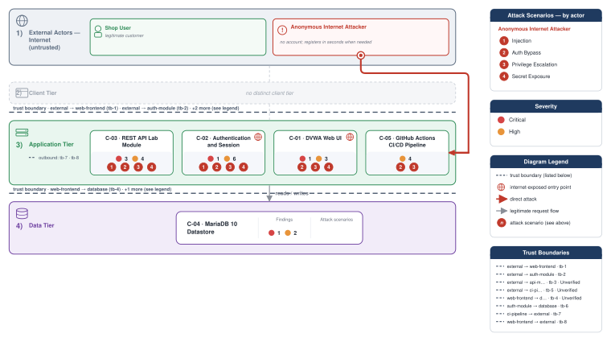

**Figure 2 - Risk Flow: Actor → Tier → Impact**

Heatmap: **actors** (left) → **architecture tiers** (middle, Client → Application → Data) → **impact** (right). Numbered red arrows ①–④ are the threats enumerated in the Top Threats table below.

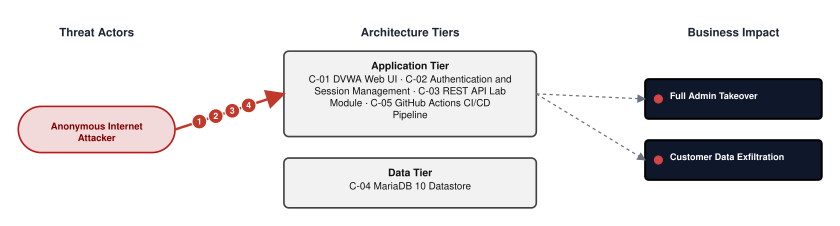

**Threat actors.** The actors below drive the numbered attack paths in the figures above.

- **Anonymous Internet Attacker** — no account; registers in seconds when needed; drives ① Insecure Query Construction & Data Access, ② Hardcoded Secrets & Weak Cryptography, ③ Broken Authorization & Access Control, ④ Sensitive File & Secret Exposure.

**4 structural threats**, grouped by weakness class - each row is one threat, not one finding. *Threat Description* states the general architectural weakness (STRIDE in brackets); *Findings* lists the concrete instances, each linked to [§8 Findings Register](#8-findings-register) with its component; *Risk & Impact* combines severity with business consequence.

| # | Threat Description | Findings (→ Component) | Risk & Impact | Fix |
|---|------------------------------------|------------------------------------------------|------------------------------------|--------|
| <a id="path-injection"></a>① | **Insecure Query Construction & Data Access** _(T·I)_<br/>user input flows into a server-side interpreter (SQL, NoSQL, XML, YAML, LDAP, OS shell) without parameterization or schema validation. | <span style="white-space:nowrap">🔴&nbsp;[F-006](#f-006)</span> - OS command injection via unsanitized \$target in exec (`HealthController.php:88`) <span style="white-space:nowrap">→&nbsp;[C-03](#c-03)</span>&nbsp;REST API Lab Module<br/><span style="white-space:nowrap">🔴&nbsp;[F-007](#f-007)</span> - Unparameterized SQL injection into users table (`login.php:39`) <span style="white-space:nowrap">→&nbsp;[C-02](#c-02)</span>&nbsp;Authentication and Session Management<br/><span style="white-space:nowrap">🟠&nbsp;[F-014](#f-014)</span> - OS Command Injection (`HealthController.php:88`) <span style="white-space:nowrap">→&nbsp;[C-03](#c-03)</span>&nbsp;REST API Lab Module | 🔴 **Critical**<br/>Customer Data Exfiltration | <span style="white-space:nowrap">● [M-005](#m-005)</span> — Replace exec shell invocation with escapeshellarg-guarded call or IP-only a…<br/><span style="white-space:nowrap">● [M-006](#m-006)</span> — Use parameterized database queries |
| <a id="path-auth-bypass"></a>② | **Hardcoded Secrets & Weak Cryptography** _(S·E)_<br/>authentication can be circumvented or forged because credentials, signing keys, or password hashes are weak, missing, or exposed. | <span style="white-space:nowrap">🔴&nbsp;[F-005](#f-005)</span> - Hardcoded bearer token signing secret (`Login.php:10`) <span style="white-space:nowrap">→&nbsp;[C-03](#c-03)</span>&nbsp;REST API Lab Module<br/><span style="white-space:nowrap">🔴&nbsp;[F-008](#f-008)</span> - Plaintext DB credentials in version-controlled compose\.yml (`compose.yml:34`) <span style="white-space:nowrap">→&nbsp;[C-04](#c-04)</span>&nbsp;MariaDB 10 Datastore<br/><span style="white-space:nowrap">🟠&nbsp;[F-023](#f-023)</span> - Unsalted `MD5` pass**** (8 chars) storage enables hash reversal (`MySQL.php:55`) <span style="white-space:nowrap">→&nbsp;[C-04](#c-04)</span>&nbsp;MariaDB 10 Datastore<br/><span style="white-space:nowrap">🟠&nbsp;[F-026](#f-026)</span> - `MD5` without salt for all pass**** (8 chars) storage and login verification (`login.php:27`) <span style="white-space:nowrap">→&nbsp;[C-02](#c-02)</span>&nbsp;Authentication and Session Management<br/><span style="white-space:nowrap">🔴&nbsp;[F-028](#f-028)</span> - Hardcoded root pass**** (8 chars) enables full DB privilege escalation (`compose.yml:31`) <span style="white-space:nowrap">→&nbsp;[C-04](#c-04)</span>&nbsp;MariaDB 10 Datastore<br/><span style="white-space:nowrap">🟡&nbsp;[F-031](#f-031)</span> - Broken hash primitive PHP `dvwa/includes/dvwaPage.inc.php:651` (`MD5/SHA-1`) (`dvwaPage.inc.php:651`) <span style="white-space:nowrap">→&nbsp;[C-02](#c-02)</span>&nbsp;Authentication and Session Management<br/><span style="white-space:nowrap">🟡&nbsp;[F-032](#f-032)</span> - Broken hash primitive PHP (`impossible.php:14`) <span style="white-space:nowrap">→&nbsp;[C-01](#c-01)</span>&nbsp;DVWA Web UI<br/><span style="white-space:nowrap">🟡&nbsp;[F-033](#f-033)</span> - Broken hash primitive PHP (`impossible.php:19`) <span style="white-space:nowrap">→&nbsp;[C-01](#c-01)</span>&nbsp;DVWA Web UI<br/><span style="white-space:nowrap">🟡&nbsp;[F-034](#f-034)</span> - Broken hash primitive PHP `vulnerabilities/csrf/source/impossible.php:15` (`SHA-1`) (`impossible.php:15`) <span style="white-space:nowrap">→&nbsp;[C-01](#c-01)</span>&nbsp;DVWA Web UI<br/><span style="white-space:nowrap">🟡&nbsp;[F-035](#f-035)</span> - Broken hash primitive PHP `vulnerabilities/csrf/source/impossible.php:29` (`SHA-1`) (`impossible.php:29`) <span style="white-space:nowrap">→&nbsp;[C-01](#c-01)</span>&nbsp;DVWA Web UI<br/><span style="white-space:nowrap">🟡&nbsp;[F-036](#f-036)</span> - Broken hash primitive PHP `vulnerabilities/csrf/test_credentials.php:19` (`SHA-1`) (`test_credentials.php:19`) <span style="white-space:nowrap">→&nbsp;[C-01](#c-01)</span>&nbsp;DVWA Web UI<br/><span style="white-space:nowrap">🟡&nbsp;[F-037](#f-037)</span> - Broken hash primitive PHP `vulnerabilities/javascript/index.php:43` (`MD5/SHA-1`) (`index.php:43`) <span style="white-space:nowrap">→&nbsp;[C-01](#c-01)</span>&nbsp;DVWA Web UI<br/><span style="white-space:nowrap">🟡&nbsp;[F-038](#f-038)</span> - Broken hash primitive PHP `vulnerabilities/javascript/source/low.php:18` (`SHA-1`) (`low.php:18`) <span style="white-space:nowrap">→&nbsp;[C-01](#c-01)</span>&nbsp;DVWA Web UI<br/><span style="white-space:nowrap">🟡&nbsp;[F-041](#f-041)</span> - Container image signing via cosign or attest-build-provenance (`codeql-analysis.yml:1`) <span style="white-space:nowrap">→&nbsp;[C-05](#c-05)</span>&nbsp;GitHub Actions CI/CD Pipeline | 🔴 **Critical**<br/>Full Admin Takeover · Customer Data Exfiltration | <span style="white-space:nowrap">● [M-004](#m-004)</span> — Move secrets to a managed secret store<br/><span style="white-space:nowrap">● [M-007](#m-007)</span> — Move secrets to a managed secret store |
| <a id="path-privilege-escalation"></a>③ | **Broken Authorization & Access Control** _(E·I)_<br/>authorization checks are absent or bypassable, allowing horizontal and vertical privilege jumps from a self-registered or low-rights account. Includes mass-assignment of privileged attributes. | <span style="white-space:nowrap">🔴&nbsp;[F-009](#f-009)</span> - Missing authentication on all UserController endpoints (`UserController.php:265`) <span style="white-space:nowrap">→&nbsp;[C-03](#c-03)</span>&nbsp;REST API Lab Module<br/><span style="white-space:nowrap">🔴&nbsp;[F-010](#f-010)</span> - Security level controlled by client cookie (`dvwaPage.inc.php:204`) <span style="white-space:nowrap">→&nbsp;[C-01](#c-01)</span>&nbsp;DVWA Web UI<br/><span style="white-space:nowrap">🟠&nbsp;[F-020](#f-020)</span> - GitHub Actions workflow-level permissions block (`codeql-analysis.yml:1`) <span style="white-space:nowrap">→&nbsp;[C-05](#c-05)</span>&nbsp;GitHub Actions CI/CD Pipeline<br/><span style="white-space:nowrap">🟠&nbsp;[F-025](#f-025)</span> - Missing object-level authorization on order endpoints BOLA (`OrderController.php:96`) <span style="white-space:nowrap">→&nbsp;[C-03](#c-03)</span>&nbsp;REST API Lab Module<br/><span style="white-space:nowrap">🟠&nbsp;[F-027](#f-027)</span> - Missing permissions block (`docker-image.yml:1`) <span style="white-space:nowrap">→&nbsp;[C-05](#c-05)</span>&nbsp;GitHub Actions CI/CD Pipeline<br/><span style="white-space:nowrap">🟡&nbsp;[F-042](#f-042)</span> - `GITHUB_TOKEN` scope minimization (`codeql-analysis.yml:1`) <span style="white-space:nowrap">→&nbsp;[C-05](#c-05)</span>&nbsp;GitHub Actions CI/CD Pipeline<br/><span style="white-space:nowrap">🟡&nbsp;[F-047](#f-047)</span> - Security-level cookie client-controlled without server authorization (`dvwaPage.inc.php:204`) <span style="white-space:nowrap">→&nbsp;[C-02](#c-02)</span>&nbsp;Authentication and Session Management | 🔴 **Critical**<br/>Full Admin Takeover · Customer Data Exfiltration | <span style="white-space:nowrap">● [M-008](#m-008)</span> — Enforce server-side authorization on every endpoint<br/><span style="white-space:nowrap">● [M-009](#m-009)</span> — Enforce correct server-side authorization |
| <a id="path-sensitive-data-exposure"></a>④ | **Sensitive File & Secret Exposure** _(I)_<br/>confidential files, credentials, and management-plane endpoints are reachable on unauthenticated routes; SSRF lets the server fetch internal resources on the attacker's behalf; unsafe path-handling primitives leak server content. | <span style="white-space:nowrap">🟠&nbsp;[F-017](#f-017)</span> - API server URL declared without TLS cleartext HTTP (`UserController.php:15`) <span style="white-space:nowrap">→&nbsp;[C-03](#c-03)</span>&nbsp;REST API Lab Module<br/><span style="white-space:nowrap">🟡&nbsp;[F-030](#f-030)</span> - Unvalidated open redirect (`low.php:4`) <span style="white-space:nowrap">→&nbsp;[C-01](#c-01)</span>&nbsp;DVWA Web UI<br/><span style="white-space:nowrap">🟡&nbsp;[F-043](#f-043)</span> - CAPTCHA bypass token in HTML comment (`index.php:75`) <span style="white-space:nowrap">→&nbsp;[C-01](#c-01)</span>&nbsp;DVWA Web UI<br/><span style="white-space:nowrap">🟡&nbsp;[F-044](#f-044)</span> - Database error exposed via die on login failure (`login.php:40`) <span style="white-space:nowrap">→&nbsp;[C-02](#c-02)</span>&nbsp;Authentication and Session Management | 🟠 **High**<br/>Customer Data Exfiltration | <span style="white-space:nowrap">◕ [M-015](#m-015)</span> — Configure TLS termination and update the API server URL to https:// in UserCont…<br/><span style="white-space:nowrap">◑ [M-028](#m-028)</span> — Validate redirect targets against an allowlist |

_STRIDE: S spoofing · T tampering · R repudiation · I information disclosure · D denial of service · E elevation of privilege. Risk, findings, components, impact and Fix are derived deterministically; only the one-line weakness description is authored._

**Verified attack chains.** 3 fully viable ([AC-T-002](#ac-t-002), [AC-T-005](#ac-t-005), [AC-T-006](#ac-t-006)). These chains combine individual findings into end-to-end exploitation paths verified step-by-step against the code - see [§9 Abuse Cases](#9-abuse-cases) for the per-step breakdown and blocking mitigations.

### Top Mitigations

Highest-impact P1/P2 mitigations - 10 of 25 qualifying (38 total). Full detail in [§10 Mitigation Register](#10-mitigation-register). All 10 mitigation(s) that fix a Critical finding are always listed here.

| # | Component | Mitigation | Addresses | Effort |
|---|----------------------|------------------------------------------------|------------------------------------------------|------|
| **1** | [C-01](#c-01) — DVWA Web UI | ● [M-009](#m-009) — Enforce correct server-side authorization (`dvwaPage.inc.php:204`) | 🔴 [F-010](#f-010) — Security level controlled by client cookie (`dvwaPage.inc.php`) | Medium |
| **2** | [C-02](#c-02) — Authentication and Session Management | ● [M-006](#m-006) — Use parameterized database queries (`login.php:39`) | 🔴 [F-007](#f-007) — Unparameterized SQL injection into users table (`login.php`) | Medium |
| **3** | [C-03](#c-03) — REST API Lab Module | ● [M-004](#m-004) — Move secrets to a managed secret store (`Login.php:10`) | 🔴 [F-005](#f-005) — Hardcoded bearer token signing secret (`Login.php`) | Low |
| **4** | [C-03](#c-03) — REST API Lab Module | ● [M-005](#m-005) — Replace exec shell invocation with escapeshellarg-guarded call or IP-only a… (`HealthController.php:88`) | 🔴 [F-006](#f-006) — OS command injection via unsanitized \$target in exec (`HealthController.php`) | Low |
| **5** | [C-03](#c-03) — REST API Lab Module | ● [M-008](#m-008) — Enforce server-side authorization on every endpoint (`UserController.php:265`) | 🔴 [F-009](#f-009) — Missing authentication on all UserController endpoints (`UserController.php`) | Low |
| **6** | [C-04](#c-04) — MariaDB 10 Datastore | ● [M-007](#m-007) — Move secrets to a managed secret store (`compose.yml:34`) | 🔴 [F-008](#f-008) — Plaintext DB credentials in version-controlled compose\.yml (`.yml`) | Low |
| **7** | [C-01](#c-01) — DVWA Web UI | ◕ [M-027](#m-027) — Require authentication on every exposed endpoint (`setup.php:6`) | 🔴 [F-029](#f-029) — `Setup.php` accessible without authentication (`setup.php`) | Low |
| **8** | [C-02](#c-02) — Authentication and Session Management | ◕ [M-010](#m-010) — Require authentication on every exposed endpoint (`dvwaPage.inc.php:149`) | 🔴 [F-011](#f-011) — Authentication bypass via disable_authentication flag (`dvwaPage.inc.php`) | Medium |
| **9** | [C-03](#c-03) — REST API Lab Module | ◕ [M-016](#m-016) — Restrict CORS to trusted origins (`index.php:11`) | 🔴 [F-018](#f-018) — Wildcard CORS permits any origin to read API responses (`index.php`) | Low |
| **10** | [C-04](#c-04) — MariaDB 10 Datastore | ◕ [M-026](#m-026) — Move secrets to a managed secret store (`compose.yml:31`) | 🔴 [F-028](#f-028) — Hardcoded root pass**** (8 chars) enables full DB privilege escalation (`.yml`) | Low |

*15 additional P1/P2 mitigations capped from the leader-board · 13 P3 backlog items in [§10 Mitigation Register](#10-mitigation-register). Sorted by priority (P1 first), then component, then leverage (most findings first), severity (Critical first), and effort (Low first).*

### Operational Strengths

Operational controls rated Adequate or Partial - grouped into broad clusters (full per-control breakdown in [§6](#6-security-architecture)). Clusters demoted to Weak by open Critical/High findings appear in [§6](#6-security-architecture) instead, not here.

<table style="table-layout:fixed;width:100%">
<colgroup><col width="20%" style="width:20%"><col width="33%" style="width:33%"><col width="47%" style="width:47%"></colgroup>
<thead><tr><th>Strength</th><th>What's in Place</th><th>Effectiveness</th></tr></thead>
<tbody>
<tr><td style="overflow-wrap:break-word"><strong>Container &amp; Supply-Chain Hardening</strong></td><td style="overflow-wrap:break-word"><em>Build-time and runtime hardening - minimal base image, non-root execution, dependency inventory.</em><br/>Lockfile hygiene<br/>Third-Party CI Action Pinning</td><td style="overflow-wrap:break-word">✅ Adequate</td></tr>
</tbody>
</table>


**Bottom line:** These controls narrow specific attack surfaces but none eliminates a Critical finding on its own.

---

<a id="critical-attack-chain"></a><a id="critical-attack-tree"></a>
## Critical Attack Tree

The root is the worst-case attacker goal; below it, each capability branch groups the Critical findings that achieve it. Branches feed the goal by OR - any single path suffices.

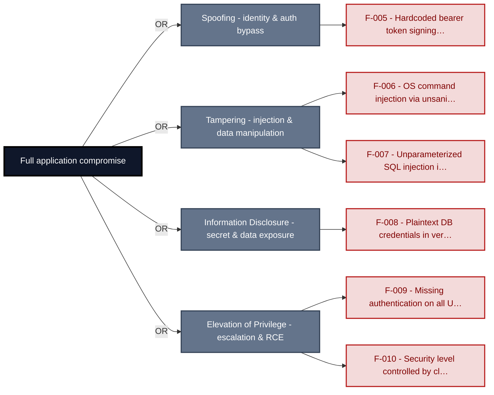

**Findings** (full detail in [§8 Findings Register](#8-findings-register)): [F-005](#f-005) · [F-006](#f-006) · [F-007](#f-007) · [F-008](#f-008) · [F-009](#f-009) · [F-010](#f-010)

---

## 1. System Overview

**Repository:** `https://github.com/digininja/DVWA`

### Scope

This threat model covers 5 components of DVWA: **DVWA Web UI**, **Authentication and Session Management**, **REST API Lab Module**, **MariaDB 10 Datastore**, **GitHub Actions CI/CD Pipeline**.

All 5 modeled components received full STRIDE threat analysis.

**Out of scope:** third-party hosted dependencies, browser runtime, operating-system kernel, and the underlying network infrastructure.

**Basis:** a code-derived threat model at implementation level, built from source, configuration and git history. It describes the system as built, not as designed.

---

### Trust Boundaries

Canonical boundary crossings. **Assumption & verdict** names the condition that makes each crossing safe and whether this report still supports it, judged one condition at a time - which conditions apply follows from the direction of the crossing.

<table style="table-layout:fixed;width:100%">
<colgroup><col width="6%" style="width:6%"><col width="25%" style="width:25%"><col width="11%" style="width:11%"><col width="15%" style="width:15%"><col width="25%" style="width:25%"><col width="18%" style="width:18%"></colgroup>
<thead><tr><th>ID</th><th>Boundary / crossing</th><th>Exposure</th><th>Kind</th><th>Assumption &amp; verdict</th><th>Linked findings</th></tr></thead>
<tbody>
<tr><td style="white-space:nowrap"><a id="tb-1"></a>tb-1</td><td style="overflow-wrap:break-word"><strong>external → web-frontend</strong><br/>Control: dvwaPageStartup authenticated session check</td><td>🌐 <strong>External</strong></td><td style="overflow-wrap:break-word">network</td><td style="overflow-wrap:break-word">Every protected lab page calls dvwaPageStartup(['authenticated']), which redirects unauthenticated requests to <code>login.php</code>.<br/><em>confirmed</em><br/>Validation: <strong>broken</strong> · 2 related · <a href="#66-input-boundary-validation-controls">§6.6</a><br/>Authentication: <strong>broken</strong> · <a href="#62-identity-and-authentication-controls">§6.2</a><br/>Authorization: in doubt · 1 related · <a href="#64-authorization-controls">§6.4</a></td><td style="overflow-wrap:break-word"><em>Validation</em><br/>🔴 <a href="#f-006">F-006</a><br/><em>Authentication</em><br/>🟠 <a href="#f-012">F-012</a><br/><em>Unattributed</em><br/>🔴 <a href="#f-029">F-029</a></td></tr>
<tr><td style="white-space:nowrap"><a id="tb-2"></a>tb-2</td><td style="overflow-wrap:break-word"><strong>external → auth-module</strong><br/>Control: <code>checkToken()</code> CSRF token validation</td><td>🌐 <strong>External</strong></td><td style="overflow-wrap:break-word">network · identity</td><td style="overflow-wrap:break-word">The login form submission is accepted only after <code>checkToken()</code> confirms the user_token matches the server-held session_token.<br/><em>confirmed</em><br/>Validation: in doubt · 1 related · <a href="#66-input-boundary-validation-controls">§6.6</a><br/>Authentication: in doubt · 4 related · <a href="#62-identity-and-authentication-controls">§6.2</a><br/>Authorization: in doubt · 1 related · <a href="#64-authorization-controls">§6.4</a></td><td style="overflow-wrap:break-word">-</td></tr>
<tr><td style="white-space:nowrap"><a id="tb-3"></a>tb-3</td><td style="overflow-wrap:break-word"><strong>external → api-module</strong><br/>Control: Login::<code>check_access_token()</code> bearer token check</td><td>◐ <strong>Unverified</strong></td><td style="overflow-wrap:break-word">network · identity</td><td style="overflow-wrap:break-word">Protected API endpoints validate the caller's bearer token with Login::<code>check_access_token()</code> before returning data.<br/><em>inferred</em><br/>Validation: in doubt · 2 related · <a href="#66-input-boundary-validation-controls">§6.6</a><br/>Authentication: in doubt · 2 related · <a href="#62-identity-and-authentication-controls">§6.2</a><br/>Authorization: in doubt · 2 related · <a href="#64-authorization-controls">§6.4</a></td><td style="overflow-wrap:break-word">-</td></tr>
<tr><td style="white-space:nowrap"><a id="tb-4"></a>tb-4</td><td style="overflow-wrap:break-word"><strong>web-frontend → database</strong><br/>Control: security-level-gated query parameterization</td><td>◐ <strong>Unverified</strong></td><td style="overflow-wrap:break-word">network</td><td style="overflow-wrap:break-word">At impossible security level, lab queries use PDO prepared statements; lower levels intentionally use unescaped string interpolation.<br/><em>inferred</em><br/><strong>In doubt</strong> - 5 finding(s) in the components it covers, none linked here.</td><td style="overflow-wrap:break-word">-</td></tr>
<tr><td style="white-space:nowrap"><a id="tb-5"></a>tb-5</td><td style="overflow-wrap:break-word"><strong>external → ci-pipeline</strong><br/>Control: GitHub branch protection on master</td><td>◐ <strong>Unverified</strong></td><td style="overflow-wrap:break-word">build pipeline · operator</td><td style="overflow-wrap:break-word">Only authenticated GitHub accounts with repository write access and passing branch protection checks on master can trigger the image-build pipeline.<br/><em>inferred</em><br/>Validation: in doubt · 1 related · <a href="#66-input-boundary-validation-controls">§6.6</a><br/>Authentication: in doubt · 1 related · <a href="#62-identity-and-authentication-controls">§6.2</a><br/>Authorization: in doubt · 3 related · <a href="#64-authorization-controls">§6.4</a></td><td style="overflow-wrap:break-word">-</td></tr>
<tr><td style="white-space:nowrap"><a id="tb-6"></a>tb-6</td><td style="overflow-wrap:break-word"><strong>auth-module → database</strong><br/>Control: <code>mysqli_real_escape_string()</code> query construction</td><td>🔒 <strong>Internal</strong></td><td style="overflow-wrap:break-word">network</td><td style="overflow-wrap:break-word">All credential lookup queries escape user input via <code>mysqli_real_escape_string()</code> before string interpolation into the SQL query.<br/><em>confirmed</em><br/>Query construction: <strong>broken</strong> · <a href="#65-query-construction-and-data-access-controls">§6.5</a></td><td style="overflow-wrap:break-word"><em>Query construction</em><br/>🔴 <a href="#f-007">F-007</a><br/>🔴 <a href="#f-008">F-008</a></td></tr>
<tr><td style="white-space:nowrap"><a id="tb-7"></a>tb-7</td><td style="overflow-wrap:break-word"><strong>ci-pipeline → external</strong><br/>Control: <code>GITHUB_TOKEN</code> package-write scope</td><td>↗ <strong>Egress</strong></td><td style="overflow-wrap:break-word">build pipeline · operator</td><td style="overflow-wrap:break-word">The pushed Docker image is built from the committed Dockerfile; <code>GITHUB_TOKEN</code> package-write scope limits pushes to the owner's <code>ghcr.io</code> namespace.<br/><em>confirmed</em><br/>Egress content: <strong>broken</strong><br/>Egress destination: <em>not examined</em> · <a href="#610-file-parser-and-outbound-request-controls">§6.10</a><br/>Response trust: <em>not examined</em></td><td style="overflow-wrap:break-word"><em>Egress content</em><br/>🟡 <a href="#f-002">F-002</a></td></tr>
<tr><td style="white-space:nowrap"><a id="tb-8"></a>tb-8</td><td style="overflow-wrap:break-word"><strong>web-frontend → external</strong><br/>Control: none identified</td><td>↗ <strong>Egress</strong></td><td style="overflow-wrap:break-word">network · operator</td><td style="overflow-wrap:break-word">Nothing beyond the g-recaptcha-response token and recaptcha_private_key reaches the Google reCAPTCHA API; the endpoint URL is not user-supplied.<br/><em>confirmed</em><br/><em>No finding contradicts it.</em></td><td style="overflow-wrap:break-word">-</td></tr>
</tbody>
</table>

_Exposure, most exposed first: ⚠ Review (endpoints unresolved) · 🌐 External (reached from outside the model) · ◐ Unverified (crossing not confirmed) · 🔒 Internal (both ends modelled) · ↗ Egress (reaches outside the model)._

_Kind - the crossing mechanism (build pipeline, in-process, network), then after `·` what changes across it: data-origin, identity, operator, privilege, tenant. Shown alone, nothing changes._

_Conditions - **inbound**: validation, authentication, authorization · **outbound**: egress content, egress destination, response trust (replies are untrusted input) · **internal**: query construction (data never becomes program text), authentication, authorization._

_Verdict per condition - **broken**: a linked finding proves the gap · in doubt: related findings, none linked here · not examined: nothing bears on it. `N related` counts further findings on the same condition. Linked findings sit under the condition they break, or under _Unattributed_. A link raises effective severity only at a confirmed internet ingress; raw risk never changes._

_Identical on every row, so stated once here instead of in a column: source `detected` (derived from inspected repository evidence); status `resolved`. Any row that deviates is shown in the table._

---

## 2. Architecture Diagrams

### 2.1 System Context

Who interacts with DVWA from the outside, and through which channels. Solid arrows show normal usage; dashed red arrows mark unauthenticated probing or exploit paths (C4 Level 1).

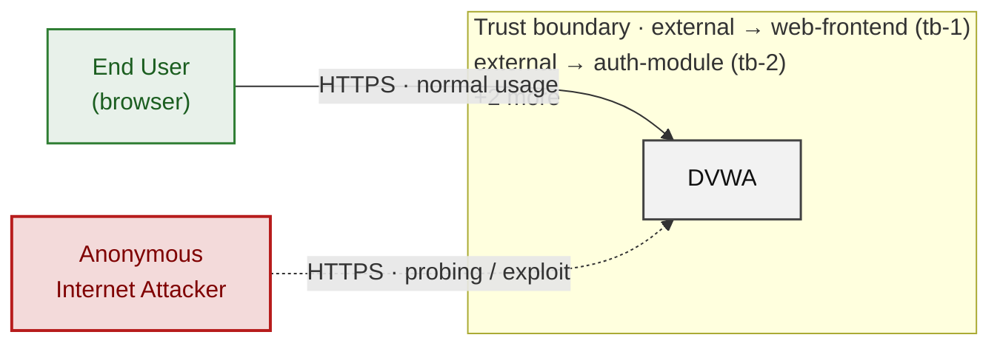

*Trust boundaries not named above: external → api-module (tb-3), external → ci-pipeline (tb-5), auth-module → database (tb-6), web-frontend → database (tb-4), +2 more - every boundary is listed in [§1 Trust Boundaries](#trust-boundaries).*

**Key takeaway:** Every actor in the context interacts with DVWA through its external interface, so authentication and input validation at that edge govern the entire attack surface.

### 2.2 Container Architecture

How the system decomposes into deployable units. Each box is a separate runtime process or service container; arrows show synchronous request paths between them. Components with ≥3 Critical findings carry a red border, ≥2 High amber (C4 Level 2).

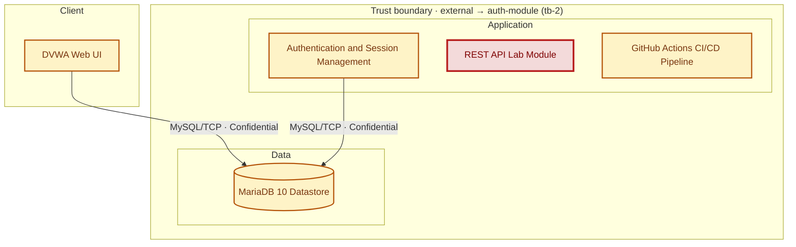

*Trust boundaries not drawn above: auth-module → database (tb-6), external → web-frontend (tb-1), ci-pipeline → external (tb-7), web-frontend → external (tb-8) - every boundary is listed in [§1 Trust Boundaries](#trust-boundaries).*

**Key takeaway:** The system decomposes into 1 client, 3 application and 1 data unit(s); REST API Lab Module carries the most Critical findings (3) and bounds the worst-case blast radius.

### 2.3 Components


Who reaches each component, and through which trust zone. Browser code runs on the user's device, so the client column is part of the untrusted zone, not a zone of its own - trust changes only where traffic enters the Application tier. Solid green arrows show legitimate data flow, dashed red arrows mark intrusion vectors. The component table directly below holds source paths and linked threats per `C-NN`; per-finding evidence is in [§8 Findings Register](#8-findings-register).

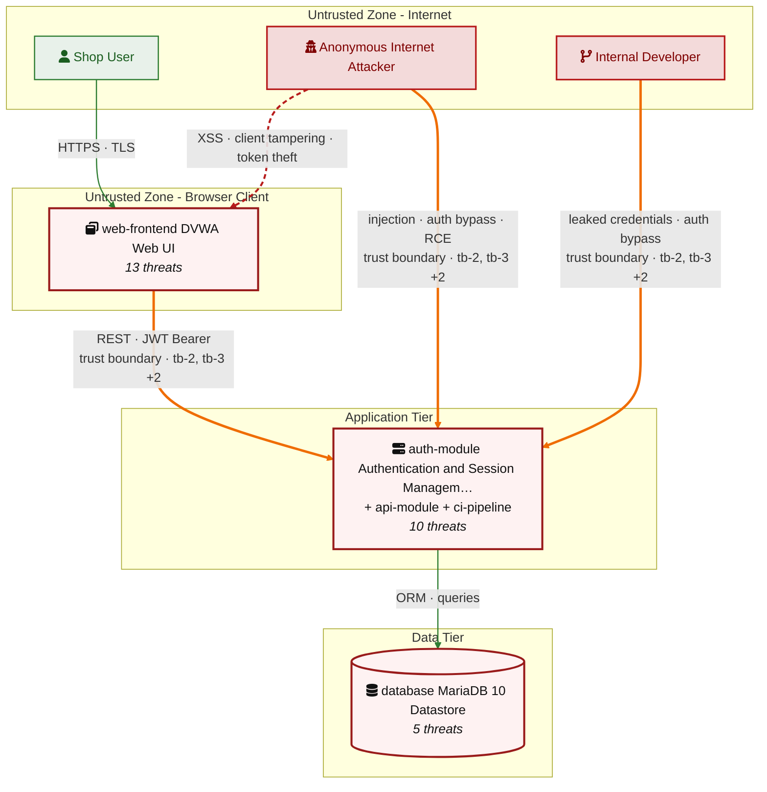

*Trust boundaries crossed by the `==>` edges above: external → auth-module (tb-2), external → api-module (tb-3), web-frontend → database (tb-4), external → ci-pipeline (tb-5) - every boundary is listed in [§1 Trust Boundaries](#trust-boundaries).*

**Key takeaway:** DVWA Web UI concentrates the most findings (13 of 45 across all components); the table below maps each component to its source paths and linked threats.

| ID | Name | Type | Key Paths | Linked Threats | Scope |
|----|----------------------|-----------|------------------------------|------------------------------------------------|--------|
| <a id="c-01"></a><a id="web-frontend"></a><span style="white-space:nowrap">C-01</span> | DVWA Web UI | application | `index.php`<br/>`setup.php`<br/>`about.php`<br/>`dvwa/**`<br/>`vulnerabilities/brute/**` | 🔴 [F-010](#f-010) — Security level controlled by client cookie (`dvwaPage.inc.php:204`)<br/>🟠 [F-016](#f-016) — DOM XSS via innerHTML in (`authbypass.js:43`)<br/>🟠 [F-022](#f-022) — `Package-lock.json` present and committed (`package-lock.json:0`)<br/>🔴 [F-029](#f-029) — `Setup.php` accessible without authentication (`setup.php:6`)<br/>🟡 [F-030](#f-030) — Unvalidated open redirect (`low.php:4`)<br/>🟡 [F-032](#f-032) — Broken hash primitive PHP (`impossible.php:14`)<br/>🟡 [F-033](#f-033) — Broken hash primitive PHP (`impossible.php:19`)<br/>🟡 [F-034](#f-034) — Broken hash primitive PHP `vulnerabilities/csrf/source/impossible.php:15` (SHA-1) (`impossible.php:15`)<br/>🟡 [F-035](#f-035) — Broken hash primitive PHP `vulnerabilities/csrf/source/impossible.php:29` (SHA-1) (`impossible.php:29`)<br/>🟡 [F-036](#f-036) — Broken hash primitive PHP `vulnerabilities/csrf/test_credentials.php:19` (SHA-1) (`test_credentials.php:19`)<br/>🟡 [F-037](#f-037) — Broken hash primitive PHP `vulnerabilities/javascript/index.php:43` (`MD5/SHA-1`) (`index.php:43`)<br/>🟡 [F-038](#f-038) — Broken hash primitive PHP `vulnerabilities/javascript/source/low.php:18` (SHA-1) (`low.php:18`)<br/>🟡 [F-043](#f-043) — CAPTCHA bypass token in HTML comment (`index.php:75`) | Analyzed |
| <a id="c-02"></a><a id="auth-module"></a><span style="white-space:nowrap">C-02</span> | Authentication and Session Management | application | `login.php`<br/>`dvwa/includes/dvwaPage.inc.php`<br/>`dvwa/includes/**`<br/>`config/config.inc.php.dist` | 🟠 [F-001](#f-001) — No rate limiting on login endpoint (`login.php:39`)<br/>🔴 [F-007](#f-007) — Unparameterized SQL injection into users table (`login.php:39`)<br/>🔴 [F-011](#f-011) — Authentication bypass via disable_authentication flag (`dvwaPage.inc.php:149`)<br/>🟠 [F-012](#f-012) — Session fixation on non-impossible security levels (`dvwaPage.inc.php:103`)<br/>🟠 [F-019](#f-019) — Session cookie Secure flag always false (`dvwaPage.inc.php:60`)<br/>🟠 [F-024](#f-024) — No rate limiting or lockout on unauthenticated login endpoint (`login.php`:absent)<br/>🟠 [F-026](#f-026) — MD5 without salt for all pass**** (8 chars) storage and login verification (`login.php:27`)<br/>🟡 [F-031](#f-031) — Broken hash primitive PHP `dvwa/includes/dvwaPage.inc.php:651` (`MD5/SHA-1`) (`dvwaPage.inc.php:651`)<br/>🟡 [F-044](#f-044) — Database error exposed via die on login failure (`login.php:40`)<br/>🟡 [F-047](#f-047) — Security-level cookie client-controlled without server authorization (`dvwaPage.inc.php:204`) | Analyzed |
| <a id="c-03"></a><a id="api-module"></a><span style="white-space:nowrap">C-03</span> | REST API Lab Module | application | `vulnerabilities/api/**` | 🟡 [F-003](#f-003) — Missing Authentication Event Logging (`LoginController.php:60`)<br/>🔴 [F-005](#f-005) — Hardcoded bearer token signing secret (`Login.php:10`)<br/>🔴 [F-006](#f-006) — OS command injection via unsanitized \$target in exec (`HealthController.php:88`)<br/>🔴 [F-009](#f-009) — Missing authentication on all UserController endpoints (`UserController.php:265`)<br/>🟠 [F-014](#f-014) — OS Command Injection (`HealthController.php:88`)<br/>🟠 [F-017](#f-017) — API server URL declared without TLS cleartext HTTP (`UserController.php:15`)<br/>🔴 [F-018](#f-018) — Wildcard CORS permits any origin to read API responses (`index.php:11`)<br/>🟠 [F-025](#f-025) — Missing object-level authorization on order endpoints BOLA (`OrderController.php:96`)<br/>🟡 [F-045](#f-045) — No rate limiting on login endpoints enabling credential brute-force (`LoginController.php:48`) | Analyzed |
| <a id="c-04"></a><a id="database"></a><span style="white-space:nowrap">C-04</span> | MariaDB 10 Datastore | data | `compose.yml`<br/>`config/config.inc.php.dist` | 🔴 [F-008](#f-008) — Plaintext DB credentials in version-controlled (`compose.yml:34`)<br/>🟠 [F-023](#f-023) — Unsalted MD5 pass**** (8 chars) storage enables hash reversal (`MySQL.php:55`)<br/>🔴 [F-028](#f-028) — Hardcoded root pass**** (8 chars) enables full DB privilege escalation (`compose.yml:31`)<br/>🟡 [F-039](#f-039) — Missing query audit logging in MariaDB config (`compose.yml:28`)<br/>🟡 [F-046](#f-046) — No resource limits on MariaDB container (`compose.yml:28`) | Analyzed |
| <a id="c-05"></a><a id="ci-pipeline"></a><span style="white-space:nowrap">C-05</span> | GitHub Actions CI/CD Pipeline | application | `.github/workflows/**`<br/>`Dockerfile` | 🟡 [F-002](#f-002) — Unsigned Docker image push (`docker-image.yml:41`)<br/>🟠 [F-015](#f-015) — Mutable GitHub Action tag (`docker-image.yml:16`)<br/>🟠 [F-020](#f-020) — GitHub Actions workflow-level permissions block (`codeql-analysis.yml:1`)<br/>🟠 [F-021](#f-021) — Third-party GitHub Actions pinned to commit SHA (`codeql-analysis.yml:45`)<br/>🟠 [F-027](#f-027) — Missing permissions block (`docker-image.yml:1`)<br/>🟡 [F-040](#f-040) — Dockerfile USER directive (non-root) (`Dockerfile:1`)<br/>🟡 [F-041](#f-041) — Container image signing via cosign or attest-build-provenance (`codeql-analysis.yml:1`)<br/>🟡 [F-042](#f-042) — `GITHUB_TOKEN` scope minimization (`codeql-analysis.yml:1`) | Screened |
### 2.4 Technology Architecture

The technology stack the system is built on. Each box names the framework or runtime that fills that role; per-component findings live in the [§2.3](#23-components) component table above, and the full per-finding catalogue is in [§8 Findings Register](#8-findings-register).

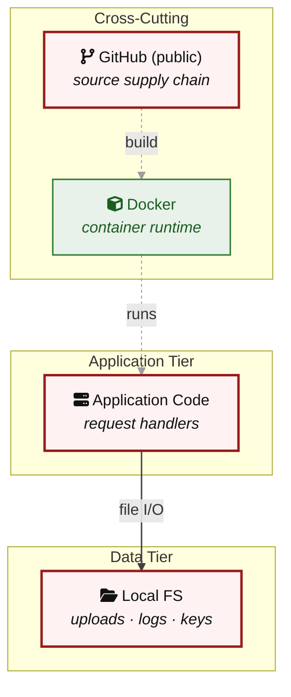

**Key takeaway:** The stack spans 1 data-tier store(s) behind the application tier; injection and data-at-rest exposure track the data tier, detailed per finding in [§8 Findings Register](#8-findings-register).

> **Legend:** `-->` synchronous request/response (REST, HTTPS, gRPC) · `==>` crosses an untrusted trust boundary (security-critical) · **red border** ≥ 3 Critical threats on the component · **amber border** ≥ 2 High threats

---

## 3. Attack Walkthroughs

This section walks through how the **8 highest-priority of 10 Critical findings** are exploited - selected by severity, chain relevance, and threat-category diversity, with Access Control and LLM Abuse represented when present. Each walkthrough has attack steps, a focused sequence diagram, and the primary mitigation. How weaknesses combine toward the worst-case goal is in the [Critical Attack Tree](#critical-attack-tree); every other Critical, plus full per-finding context (severity rationale, assets, detection signals), is in the [§8 Findings Register](#8-findings-register).

### 3.1 Missing authentication on all UserController endpoints in REST API Lab Module

**Source:** 🔴 [F-009](#f-009) — `vulnerabilities/api/src/UserController.php:265`

Severity **Critical** ([CWE-862](https://cwe.mitre.org/data/definitions/862.html)). STRIDE: Elevation of Privilege. See [§8 F-009](#f-009) for the full register row.

**Attack Steps**

1. Attacker sends GET `/vulnerabilities/api/v2/user/` with no Authorization header and receives all user records including pass**** (8 chars) hashes.
2. Attacker sends PUT `/vulnerabilities/api/v2/user/1` with body `{"name": "owned", "level": 1}` and elevates the user record without any authentication.
3. Attacker sends DELETE `/vulnerabilities/api/v2/user/2` and removes a user account, disrupting service for legitimate users.

**Sequence Diagram**

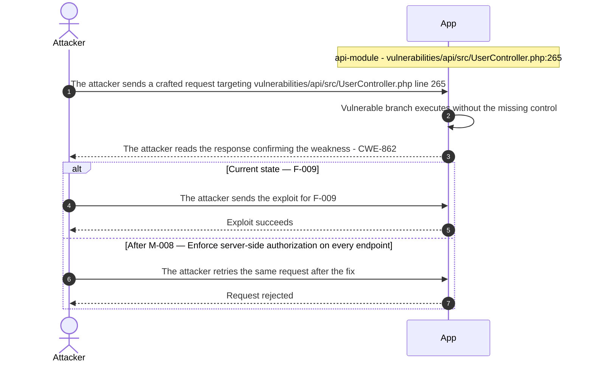

**Key takeaway:** Until ● [M-008](#m-008) (Enforce server-side authorization on every endpoint) lands, 🔴 [F-009](#f-009) — Missing authentication on all UserController endpoints (`UserController.php:265`) is exploitable at `vulnerabilities/api/src/UserController.php:265` (Critical-severity, [CWE-862](https://cwe.mitre.org/data/definitions/862.html)).

**Defense in Depth**

- Primary mitigation: ● [M-008](#m-008) (Enforce server-side authorization on every endpoint)

### 3.2 Security level controlled by client cookie in DVWA Web UI

**Source:** 🔴 [F-010](#f-010) — `dvwa/includes/dvwaPage.inc.php:204`

Severity **Critical** ([CWE-863](https://cwe.mitre.org/data/definitions/863.html)). STRIDE: Elevation of Privilege. See [§8 F-010](#f-010) for the full register row.

**Attack Steps**

1. Attacker authenticates with any valid credential and inspects the browser cookie store, finding a 'security' cookie set to 'high'.
2. Attacker changes the cookie value to 'low' using browser developer tools or a proxy; `dvwaPage.inc.php:204` reads the new value unconditionally.
3. All module handlers now execute their low-security variants: `exec/source/low.php` exposes OS command injection, `sqli/source/low.php` exposes raw SQL, and `open_redirect/source/low.php` exposes the unvalidated redirect.
4. Attacker exploits any low-level vulnerability, for example submitting ip=`127.0.0.1`|id to gain remote code execution.

**Sequence Diagram**

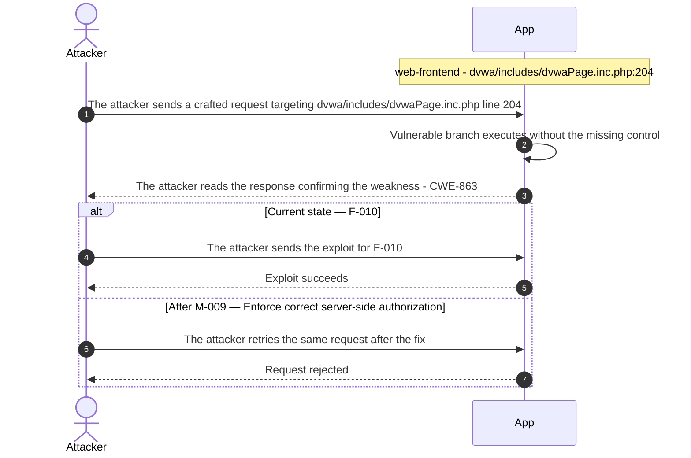

**Key takeaway:** Until ● [M-009](#m-009) (Enforce correct server-side authorization) lands, 🔴 [F-010](#f-010) — Security level controlled by client cookie (`dvwa/includes/dvwaPage.inc.php:204`) is exploitable at `dvwa/includes/dvwaPage.inc.php:204` (Critical-severity, [CWE-863](https://cwe.mitre.org/data/definitions/863.html)).

**Defense in Depth**

- Primary mitigation: ● [M-009](#m-009) (Enforce correct server-side authorization)

### 3.3 Unparameterized SQL injection into users table in Login

**Source:** 🔴 [F-007](#f-007) — `login.php:39`

Severity **Critical** ([CWE-89](https://cwe.mitre.org/data/definitions/89.html)). STRIDE: Tampering. See [§8 F-007](#f-007) for the full register row.

**Attack Steps**

1. Attacker submits username "admin'--" in the DVWA login form at low security level, closing the string and commenting out the pass**** (8 chars) check.
2. The application interpolates the input into '`SELECT * FROM users WHERE user='admin'--' AND`...' at `login.php:39` and sends it to MariaDB.
3. MariaDB executes the truncated query and returns the admin row; attacker gains an authenticated session without knowing the pass**** (8 chars).
4. Attacker follows up with a UNION SELECT payload to dump the full users table, recovering all `MD5` pass**** (8 chars) hashes.

**Sequence Diagram**

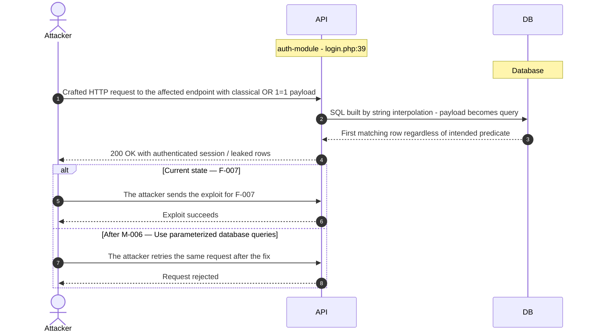

**Key takeaway:** Until ● [M-006](#m-006) (Use parameterized database queries) lands, 🔴 [F-007](#f-007) — Unparameterized SQL injection into users table (`login.php:39`) is exploitable at `login.php:39` (Critical-severity, [CWE-89](https://cwe.mitre.org/data/definitions/89.html)).

**Defense in Depth**

- Primary mitigation: ● [M-006](#m-006) (Use parameterized database queries)

### 3.4 Hardcoded bearer token signing secret in Login

**Source:** 🔴 [F-005](#f-005) — `vulnerabilities/api/src/Login.php:10`

Severity **Critical** ([CWE-798](https://cwe.mitre.org/data/definitions/798.html)). STRIDE: Spoofing. See [§8 F-005](#f-005) for the full register row.

**Attack Steps**

1. Attacker reads the constant `ACCESS_TOKEN_SECRET` = `'12345'` from `vulnerabilities/api/src/Login.php` line 10 (exposed via public repo or DVWA lab access).
2. Attacker crafts a token payload with an arbitrary user identity and a future expiry, then signs it using the known secret via Token::`create_token()`.
3. Attacker submits the forged Bearer token in the Authorization header to any protected endpoint (e.g. GET `/vulnerabilities/api/v2/order/`) and receives a 200 response with full data.
4. Attacker reuses the same secret to forge refresh tokens using `REFRESH_TOKEN_SECRET` = `'98765'` and extends their access indefinitely without re-authenticating.

**Sequence Diagram**


**Key takeaway:** Until ● [M-004](#m-004) (Move secrets to a managed secret store) lands, 🔴 [F-005](#f-005) — Hardcoded bearer token signing secret (`src/Login.php:10`) is exploitable at `vulnerabilities/api/src/Login.php:10` (Critical-severity, [CWE-798](https://cwe.mitre.org/data/definitions/798.html)).

**Defense in Depth**

- Primary mitigation: ● [M-004](#m-004) (Move secrets to a managed secret store)

### 3.5 Plaintext DB credentials in version-controlled compose\.yml

**Source:** 🔴 [F-008](#f-008) — `compose.yml:34`

Severity **Critical** ([CWE-798](https://cwe.mitre.org/data/definitions/798.html)). STRIDE: Information Disclosure. See [§8 F-008](#f-008) for the full register row.

**Attack Steps**

1. Attacker browses the public DVWA repository on GitHub and opens `compose.yml`.
2. Attacker reads `MYSQL_ROOT_PASSWORD`=dvwa at line 31 and `MYSQL_PASSWORD`=p@ss**** (8 chars) at line 34, obtaining two working credential pairs.
3. Attacker uses the credentials to authenticate to any internet-accessible DVWA deployment that was not configured with rotated secrets.
4. Attacker reads or modifies all database tables using the dvwa or root account.

**Sequence Diagram**


**Key takeaway:** Until ● [M-007](#m-007) (Move secrets to a managed secret store) lands, 🔴 [F-008](#f-008) — Plaintext DB credentials in version-controlled `compose.yml` (`compose.yml:34`) is exploitable at `compose.yml:34` (Critical-severity, [CWE-798](https://cwe.mitre.org/data/definitions/798.html)).

**Defense in Depth**

- Primary mitigation: ● [M-007](#m-007) (Move secrets to a managed secret store)

### 3.6 OS command injection in Health Controller

**Source:** 🔴 [F-006](#f-006) — `vulnerabilities/api/src/HealthController.php:88`

Severity **Critical** ([CWE-78](https://cwe.mitre.org/data/definitions/78.html)). STRIDE: Tampering. See [§8 F-006](#f-006) for the full register row.

**Attack Steps**

1. Attacker sends POST `/vulnerabilities/api/v2/health/connectivity` with Content-Type: application/json and body `{"target": "127.0.0.1; id"}` to the unauthenticated endpoint.
2. PHP executes exec('ping -c 4 127.0.0.1; id', ...) where the semicolon introduces a second command interpreted by the shell.
3. The id command executes as the web server user (www-data or equivalent); attacker substitutes a reverse-shell payload to gain persistent interactive access.
4. Attacker pivots from the web server context to read DVWA database credentials, `/etc/passwd`, or other sensitive files on the host.

**Sequence Diagram**

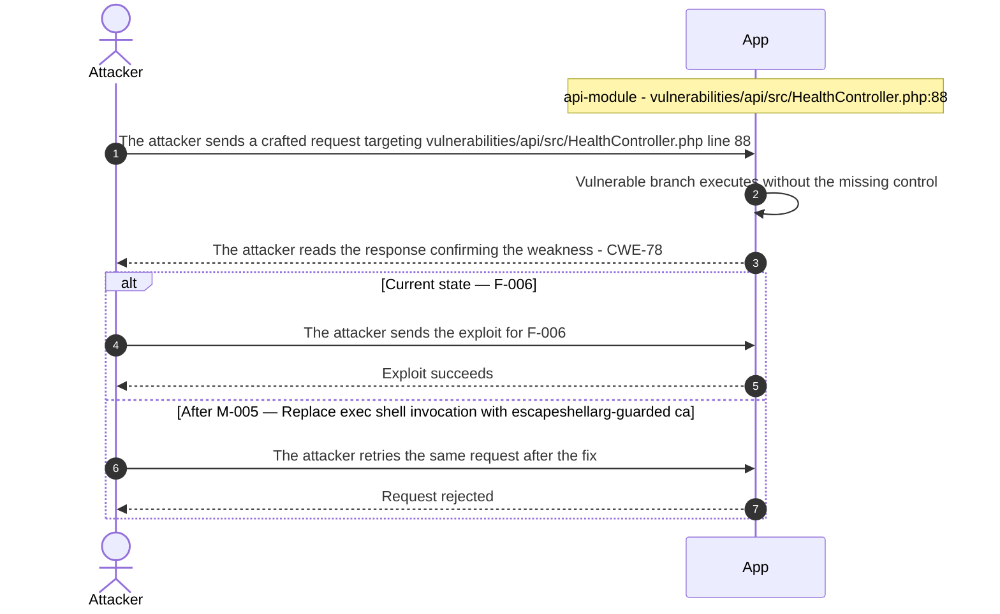

**Key takeaway:** Until ● [M-005](#m-005) (Replace exec shell invocation with escapeshellarg-guarded ca) lands, 🔴 [F-006](#f-006) — OS command injection via unsanitized \$target in exec (`HealthController.php:88`) is exploitable at `vulnerabilities/api/src/HealthController.php:88` (Critical-severity, [CWE-78](https://cwe.mitre.org/data/definitions/78.html)).

**Defense in Depth**

- Primary mitigation: ● [M-005](#m-005) (Replace exec shell invocation with escapeshellarg-guarded call or IP-only a…)

### 3.7 Wildcard CORS permits any origin to read API responses in REST API Lab Module

**Source:** 🔴 [F-018](#f-018) — `vulnerabilities/api/public/index.php:11`

Severity **High** ([CWE-942](https://cwe.mitre.org/data/definitions/942.html)). STRIDE: Information Disclosure. See [§8 F-018](#f-018) for the full register row.

**Attack Steps**

1. An attacker crafts a request targeting the weak spot at `vulnerabilities/api/public/index.php:11`.
2. The attacker sends it; the missing control never rejects the crafted input.
3. A malicious web page on an arbitrary origin makes an XHR to the API with a user's bearer token (stored in JS memory); the browser forwards the Authorization header and the Access-Control-Allow-Origin: * response header allows the malicious page to read the full JSON response body containing user and order data.

**Sequence Diagram**

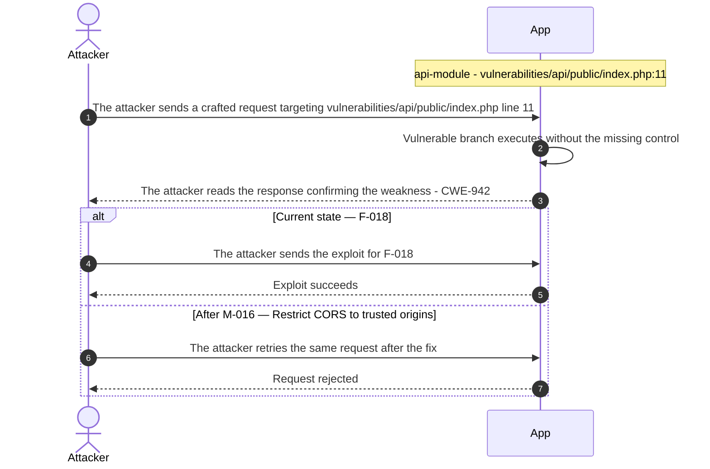

**Key takeaway:** Until ◕ [M-016](#m-016) (Restrict CORS to trusted origins) lands, 🔴 [F-018](#f-018) — Wildcard CORS permits any origin to read API responses (`public/index.php:11`) is exploitable at `vulnerabilities/api/public/index.php:11` (High-severity, [CWE-942](https://cwe.mitre.org/data/definitions/942.html)).

**Defense in Depth**

- Primary mitigation: ◕ [M-016](#m-016) (Restrict CORS to trusted origins)

### 3.8 Hardcoded root pass**** (8 chars) enables full DB privilege escalation

**Source:** 🔴 [F-028](#f-028) — `compose.yml:31`

Severity **High** ([CWE-798](https://cwe.mitre.org/data/definitions/798.html)). STRIDE: Elevation of Privilege. See [§8 F-028](#f-028) for the full register row.

**Attack Steps**

1. An attacker crafts a request targeting the weak spot at `compose.yml:31`.
2. The attacker sends it; the missing control never rejects the crafted input.
3. `compose.yml:31` sets `MYSQL_ROOT_PASSWORD`=dvwa, a publicly committed value; any container on the dvwa Docker network that reaches MariaDB TCP 3306 authenticates as root with GRANT ALL privileges, then drops or replaces the `dvwa.users` table, creates new privileged accounts, or reads all databases including any sensitive data outside the dvwa schema.

**Sequence Diagram**

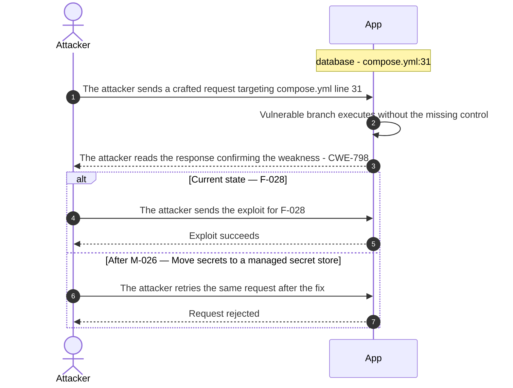

**Key takeaway:** Until ◕ [M-026](#m-026) (Move secrets to a managed secret store) lands, 🔴 [F-028](#f-028) — Hardcoded root pass**** (8 chars) enables full DB privilege escalation (`compose.yml:31`) is exploitable at `compose.yml:31` (High-severity, [CWE-798](https://cwe.mitre.org/data/definitions/798.html)).

**Defense in Depth**

- Primary mitigation: ◕ [M-026](#m-026) (Move secrets to a managed secret store)

<!-- generated:`walkthrough_renderer` -->

---

## 4. Assets

Information assets and the classification level that drives the Confidentiality / Integrity / Availability targets used in [§8 Findings Register](#8-findings-register) risk scoring.

| Asset | Classification | Description |
|----------------------|--------------|------------------------------------|
| API Bearer Token Signing Secrets | Restricted | Hardcoded JWT-like signing secrets in<br/>`vulnerabilities/api/src/Login.php`<br/>(`ACCESS_TOKEN_SECRET`=`'12345'`,<br/>`REFRESH_TOKEN_SECRET`=`'98765'`); used to sign<br/>and verify all API access and refresh<br/>tokens. Because the secrets are committed to<br/>the public repository, any party can forge<br/>valid API tokens. |
| User Credentials (MariaDB users table) | Confidential | `MD5`-hashed pass**** (8 chars)s and usernames<br/>stored in the MariaDB `dvwa.users` table; demo<br/>credentials (admin/pass**** (8 chars),<br/>gordonb/abc123, etc.) are intentional<br/>teaching material but constitute operational<br/>authentication secrets within the lab<br/>environment. Exposure enables account<br/>takeover and session hijacking. |
| PHP Session Tokens | Confidential | Server-side PHP session identifiers issued<br/>on successful login and stored as browser<br/>cookies; control access to all vulnerability<br/>lab modules and the admin setup interface.<br/>Session IDs are regenerated on login per<br/>`login.php` but not on security-level change. |
| Google reCAPTCHA Private Key | Confidential | Google reCAPTCHA private API key configured<br/>at config/config.inc.php.dist line 28; used<br/>by the Insecure CAPTCHA lab to verify<br/>challenge-response tokens with Google's API.<br/>Key exposure allows an attacker to bypass<br/>CAPTCHA validation in the lab and any real<br/>reCAPTCHA-protected service sharing the same<br/>key. |
| DVWA MariaDB Database | Internal | MariaDB 10 database instance running as a<br/>Docker Compose internal service; stores all<br/>application data including user credentials,<br/>vulnerability lab state, and challenge<br/>flags. Default MySQL pass**** (8 chars) ('p@ss****<br/>(8 chars)') is set via environment variable<br/>in compose\.yml line 34; database is<br/>accessible only within the Docker internal<br/>network. |
| DVWA Docker Container Image (`ghcr.io`) | Internal | Multi-arch Docker image published to<br/>ghcr.io/digininja/dvwa by the GitHub Actions<br/>pipeline; contains the full application code<br/>including intentional vulnerability<br/>payloads. Image is not signed (no<br/>cosign/sigstore), lacks SLSA provenance, and<br/>is built from an unpinned base image<br/>(php:8-apache without `SHA256` digest). |

---

## 5. Attack Surface

Network-reachable entry points classified by authentication requirement. Each row links to the threat(s) referenced in its **Notes** column. The **Risk** column reflects the highest-severity linked finding. Entry points with no linked finding are still listed when they sit on a sensitive surface (authentication, registration, management) or look like a missing-auth/authz suspect - marked **⚑ Review** in Notes.

### 5.1 Unauthenticated Entry Points (3)

<table style="table-layout:fixed;width:100%">
<colgroup><col width="9%" style="width:9%"><col width="30%" style="width:30%"><col width="14%" style="width:14%"><col width="47%" style="width:47%"></colgroup>
<thead><tr><th>Method</th><th>Route</th><th>Risk</th><th>Notes</th></tr></thead>
<tbody>
<tr><td>?</td><td style="overflow-wrap:anywhere"><code>Apache HTTP port 4280 (login.​php, setup.​php)</code></td><td>🔴 Critical</td><td>🟡 <a href="#f-003">F-003</a> — Missing Authentication Event Logging (<code>LoginController.php:60</code>)<br/>🔴 <a href="#f-005">F-005</a> — Hardcoded bearer token signing secret (<code>Login.php:10</code>)<br/>🟡 <a href="#f-045">F-045</a> — No rate limiting on login endpoints enabling credential brute-force (<code>LoginController.php:48</code>)<br/>Container bound to <code>127.0.0.1:4280</code> in <code>compose.yml</code>; <code>login.php</code> and <code>setup.php</code> are reachable without authentication. Intended public entry point for lab access.</td></tr>
<tr><td>?</td><td style="overflow-wrap:anywhere"><code>REST API Swagger UI and /​vulnerabilities/​api/​ routes</code></td><td>🔴 Critical</td><td>🔴 <a href="#f-006">F-006</a> — OS command injection via unsanitized $target in exec (<code>HealthController.php:88</code>)<br/>🟠 <a href="#f-017">F-017</a> — API server URL declared without TLS cleartext HTTP (<code>UserController.php:15</code>)<br/>🔴 <a href="#f-018">F-018</a> — Wildcard CORS permits any origin to read API responses (<code>index.php:11</code>)<br/>API documentation at <code>/vulnerabilities/api/help/help.php</code> is publicly accessible; API login endpoint at <code>/vulnerabilities/api/v2/login/login</code> requires no prior authentication. Wildcard CORS header (Access-Control-Allow-Origin: *) set at <code>vulnerabilities/api/public/index.php:11</code>.</td></tr>
<tr><td>?</td><td style="overflow-wrap:anywhere"><code>GitHub Actions CI pipeline (master branch push trigger)</code></td><td>-</td><td>Public repository; any contributor with push access to master triggers the <code>docker-image.yml</code> workflow. No artifact signing or SLSA provenance configured; pipeline uses non-SHA-pinned third-party actions (actions/checkout@v6.0.2).</td></tr>
</tbody>
</table>

### 5.2 Authenticated Entry Points (2)

<table style="table-layout:fixed;width:100%">
<colgroup><col width="9%" style="width:9%"><col width="30%" style="width:30%"><col width="14%" style="width:14%"><col width="47%" style="width:47%"></colgroup>
<thead><tr><th>Method</th><th>Route</th><th>Risk</th><th>Notes</th></tr></thead>
<tbody>
<tr><td>?</td><td style="overflow-wrap:anywhere"><code>hackable/​ upload and file-​inclusion directory</code></td><td>-</td><td>Directory at /hackable/ (including hackable/uploads/ and hackable/flags/) is served by Apache and writable by the web process; used by the File Upload and File Inclusion labs. Requires authenticated session but is reachable with low-privilege credentials.</td></tr>
<tr><td>?</td><td style="overflow-wrap:anywhere"><code>MariaDB TCP 3306 (internal Docker network)</code></td><td>-</td><td>Database service exposed only on the internal Docker dvwa network (no external port binding per <code>compose.yml</code>); credentials are the demo pass**<strong> (8 chars) 'p@ss</strong>** (8 chars)' configured via <code>MYSQL_PASSWORD</code> environment variable.</td></tr>
</tbody>
</table>

---

## 6. Security Architecture

This chapter is organized by security-control category. The architecture section avoids artificial control IDs and finding-ID columns in overview tables. Findings are listed only where the affected control is described.

_[§6](#6-security-architecture) schema v2 (13-section control-category layout). Cataloged controls: 23 total - 2 adequate, 5 partial, 5 weak, 4 unsafe, 7 missing. Linked threats: 45._

**How to read the verdicts.** Every control category (and every sub-control below it) carries exactly one status. The two red verdicts do **not** mean the same thing - this is the distinction that decides what you have to do about a finding:

| Status | Meaning | What it asks of you |
|----------|------------------------------------|------------------------|
| 🟢 Adequate | Control is present and sound | Nothing - keep it |
| 🟡 Partial | Present, but with meaningful gaps | Close the gap |
| 🟠 Weak | Present, but has exploitable gaps | Strengthen it |
| 🔴 Unsafe | **Present and relied upon, but defeated /<br/>trivially bypassable** | **Fix the existing control** |
| 🔴 Missing | **Control was never built** | **Add the control** |
| - | Not applicable to this codebase | - |

So "🔴 Unsafe" on a control category does *not* mean the control is absent - it means the control exists but does not hold (e.g. an `MD5` pass**** (8 chars) hash, a raw-SQL query path, a hardcoded signing key). "🔴 Missing" is reserved for controls that were never built (e.g. no Content-Security-Policy header).

### 6.1 Security Control Overview

<!-- §6.1 MECHANICAL-FROZEN — DO NOT EDIT (overview table is pregenerator-owned) -->

| Control category | Verdict | Main reason |
|----------------------|---------|------------------------------------|
| [6.2 Identity and Authentication Controls](#62-identity-and-authentication-controls) | 🔴 Unsafe | 9 routed findings; catalogued controls are<br/>present but defeated (e.g. Password Hashing<br/>Algorithm, Authentication Gate<br/>(dvwaPageStartup)). |
| [6.3 Session and Token Controls](#63-session-and-token-controls) | 🟠 Weak | 1 routed finding; catalogued controls are<br/>weak (e.g. Session Cookie Hardening, Session<br/>Regeneration on Privilege Change). |
| [6.4 Authorization Controls](#64-authorization-controls) | 🔴 Missing | 7 routed findings; requ**** (8 chars) controls<br/>not in place (e.g. Object-Level Ownership<br/>Check (BOLA/IDOR)). |
| [6.5 Query Construction and Data Access Controls](#65-query-construction-and-data-access-controls) | 🟠 Weak | 1 routed finding; no compensating controls<br/>catalogued. |
| [6.6 Input Boundary Validation Controls](#66-input-boundary-validation-controls) | 🟠 Weak | 1 routed finding; no compensating controls<br/>catalogued. |
| [6.7 Output Encoding and Rendering Controls](#67-output-encoding-and-rendering-controls) | 🟠 Weak | 1 routed finding; no compensating controls<br/>catalogued. |
| [6.8 Browser and Cross-Origin Controls](#68-browser-and-cross-origin-controls) | 🔴 Unsafe | 1 routed finding; catalogued controls are<br/>present but defeated (e.g. XSS Output<br/>Encoding, Content Security Policy). |
| [6.9 Cryptography Secrets and Data Protection](#69-cryptography-secrets-and-data-protection) | 🔴 Unsafe | 3 routed findings; catalogued controls are<br/>present but defeated (e.g. API Bearer Token<br/>Signing Secret, Runtime Secret Injection for<br/>Database Credentials). |
| [6.10 File Parser and Outbound Request Controls](#610-file-parser-and-outbound-request-controls) | 🟠 Weak | 4 routed findings; no compensating controls<br/>catalogued. |
| [6.11 Operations Runtime and Supply Chain Controls](#611-operations-runtime-and-supply-chain-controls) | 🔴 Missing | 7 routed findings; requ**** (8 chars) controls<br/>not in place (e.g. Third-Party CI Action<br/>Pinning, Artifact Signing and SBOM<br/>Generation). |
| [6.12 Real-time and Not Applicable Controls](#612-real-time-and-not-applicable-controls) | - | No controls or findings routed to this<br/>category. |
| [6.13 Defense-in-Depth Summary](#613-defense-in-depth-summary) | - | No controls or findings routed to this<br/>category. |

<!-- §6.1 MECHANICAL-FROZEN END -->

### 6.2 Identity and Authentication Controls

<a id="ctrl-identity-and-authentication-controls"></a>

**Dependent crossings:** [tb-1](#tb-1) refuted - 🟠 [F-012](#f-012) — Session fixation on non-impossible security levels (`dvwaPage.inc.php:103`) · [tb-2](#tb-2) unconfirmed - 🟠 [F-001](#f-001) — No rate limiting on login endpoint (`login.php`), 🔴 [F-011](#f-011) — Authentication bypass via disable_authentication flag (`dvwaPage.inc.php:149`), 🟠 [F-012](#f-012) — Session fixation on non-impossible security levels (`dvwaPage.inc.php:103`), +1 · [tb-3](#tb-3) unconfirmed - 🔴 [F-005](#f-005) — Hardcoded bearer token signing secret (`src/Login.php:10`), 🟡 [F-045](#f-045) — No rate limiting on login endpoints enabling credential brute-force · [tb-5](#tb-5) unconfirmed - 🟡 [F-041](#f-041) — Container image signing via cosign or attest-build-provenance

**Verdict:** 🔴 Unsafe

<!-- The line below is mechanically derived from the controls table — LLM must not re-author it. -->
**Controls covered:**

- [6.2.1 Password-Based Authentication](#621-password-based-authentication)
- [6.2.2 Anonymous Access](#622-anonymous-access)

**Implemented controls:** `dvwa/includes/dvwaPage.inc.php`; `login.php`; `dvwa/includes/dvwaPage.inc.php:132`; `login.php`:6; `dvwa/includes/dvwaPage.inc.php`; `login.php`:18; `dvwa/includes/dvwaPage.inc.php:146`; `vulnerabilities/captcha/source/impossible.php:40`,48 (parameterized); `login.php`:22,39 (escape-only).

**Assessment:** Authentication centers on `dvwaPageStartup()` at `dvwa/includes/dvwaPage.inc.php:132`, which checks `$_SESSION['dvwa_username']` and redirects unauthenticated users to `login.php`. Password verification at `login.php:27` applies `md5()` before comparing against the stored hash. The `disable_authentication` flag at line 149 is the structural failure - when set, the gate evaporates entirely. Three of the five catalogued controls are defeated or partially bypassed; no MFA, OAuth, or registration flow was detected. Each successful login terminates in a PHP session; that session's cookie handling is assessed in [§6.3 Session and Token Controls](#63-session-and-token-controls).

<!-- §6.2 AUTH-MECHANISMS-FROZEN — deterministic inventory, pregenerator-owned. DO NOT EDIT. -->
**Authentication mechanisms (at a glance).** Every authentication mechanism detected on the application, its effective status, where it is assessed, and its linked findings. Controls are catalogued by domain, so JWT/session handling is assessed under [§6.3 Session and Token Controls](#63-session-and-token-controls) and pass**** (8 chars) hashing under [§6.9 Cryptography Secrets and Data Protection](#69-cryptography-secrets-and-data-protection).

| Mechanism | Status | Assessed in | Findings |
|----------------------|---------|-----------|------------------------------------------------|
| Password login | 🟡 Partial | [§6.2](#62-identity-and-authentication-controls) | 🔴 [F-011](#f-011) — Authentication bypass via disable_authentication flag (`dvwaPage.inc.php:149`)<br/>🟡 [F-045](#f-045) — No rate limiting on login endpoints enabling credential brute-force |
| Password storage (hashing) | 🔴 Unsafe | [§6.9](#69-cryptography-secrets-and-data-protection) | [W-004](#w-004) — Security-sensitive data uses weak cryptographic primitives |
| JWT / bearer-token session | 🔴 Unsafe | [§6.3](#63-session-and-token-controls) | [W-001](#w-001) — Secrets are committed to source instead of a managed store |

_Also checked, not detected on this codebase: User registration, Password reset / change, Session-token storage, Multi-factor authentication (TOTP / 2FA), OAuth / OIDC federated login._

<!-- §6.2 AUTH-MECHANISMS-FROZEN END -->

<a id="password-based-authentication"></a>
#### 6.2.1 Password-Based Authentication

**Status:** 🔴 Unsafe - `MD5` without salt and authentication gate bypassable via `disable_authentication` flag; replace hash with Argon2id or bcrypt and remove bypass in internet-exposed deployments.

DVWA's primary authentication mechanism is a username/credential login at `login.php`, backed by a PHP session managed through `dvwaPageStartup()` at `dvwa/includes/dvwaPage.inc.php:132`. All submitted credentials pass through PHP's `md5()` before comparison against the stored hash - a fast hash with no work factor and no per-user salt.

The diagram shows the intended login flow with CSRF token validation:

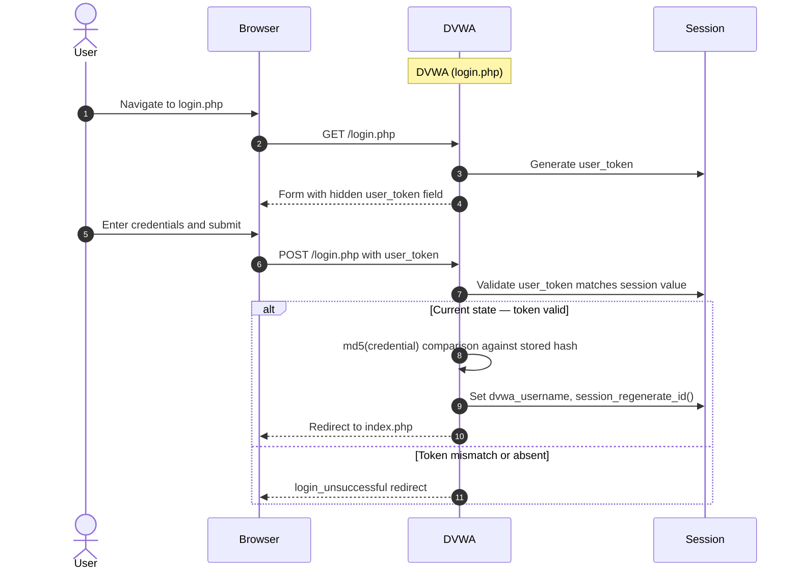

**Security assessment**

Four weaknesses affect this mechanism:

- **Credential storage (assessed in [§6.9](#69-cryptography-secrets-and-data-protection)):** `dvwa/includes/dbms/MySQL.php:55` stores hashes as unsalted `MD5` — no work factor and no per-user salt; a precomputed rainbow table yields plaintext for any common credential instantly. `login.php:27` applies the same `md5()` for login comparison, so every account in a database dump is recoverable without brute force.
- **Authentication gate:** `dvwaPageStartup()` at `dvwa/includes/dvwaPage.inc.php:132` checks `$_SESSION['dvwa_username']` and redirects unauthenticated users to `login.php:6` before any page content renders. The gate is structurally sound when `disable_authentication` is absent.
- **Login CSRF token:** `login.php:18` embeds a CSRF token as a hidden form field; `dvwa/includes/dvwaPage.inc.php:146` validates it on POST. Protection is present on the login endpoint; coverage of other state-changing lab endpoints is incomplete.
- **Login query construction:** `login.php:22` builds the WHERE clause by string interpolation — a `' OR '1'='1` payload in the user field returns the default admin account without a valid credential. PDO parameterization appears only at the impossible level (`vulnerabilities/captcha/source/impossible.php:40,48`).

**Relevant findings**

- 🟠 [F-001](#f-001) — No rate limiting on login endpoint
- 🟡 [F-002](#f-002) — Unsigned Docker image push
- 🔴 [F-011](#f-011) — Authentication bypass via disable_authentication flag
- 🟠 [F-023](#f-023) — Unsalted MD5 pass**** (8 chars) storage enables hash reversal
- 🟠 [F-026](#f-026) — MD5 without salt for all pass**** (8 chars) storage and login verification
- 🟡 [F-045](#f-045) — No rate limiting on login endpoints enabling credential brute-force

<a id="anonymous-access"></a>
#### 6.2.2 Anonymous Access

**Status:** 🔴 Unsafe - `disable_authentication` flag eliminates all credential checks - must not be enabled in any internet-exposed deployment.

The `disable_authentication` configuration flag in `config/config.inc.php.dist` is a training-mode bypass that allows DVWA to run without any login screen. When `$_DVWA['disable_authentication']` is truthy, `dvwa/includes/dvwaPage.inc.php:149` short-circuits `dvwaPageStartup()` entirely - no credential check, no session validation, no redirect. Every protected page is directly accessible to unauthenticated requests. This is not a degraded control; it is the complete absence of authentication. Any internet-accessible deployment with this flag active exposes all functionality to anonymous access.

**Relevant findings**

- 🔴 [F-011](#f-011) — Authentication bypass via disable_authentication flag


**Security assessment**

_Not assessed in detail; see the control overview in [§7.1](#7-weakness-register)._
### 6.3 Session and Token Controls

<a id="ctrl-session-and-token-controls"></a>

**Dependent crossings:** [tb-1](#tb-1) refuted - 🟠 [F-012](#f-012) — Session fixation on non-impossible security levels (`dvwaPage.inc.php:103`) · [tb-2](#tb-2) unconfirmed - 🟠 [F-001](#f-001) — No rate limiting on login endpoint (`login.php`), 🔴 [F-011](#f-011) — Authentication bypass via disable_authentication flag (`dvwaPage.inc.php:149`), 🟠 [F-012](#f-012) — Session fixation on non-impossible security levels (`dvwaPage.inc.php:103`), +1 · [tb-3](#tb-3) unconfirmed - 🔴 [F-005](#f-005) — Hardcoded bearer token signing secret (`src/Login.php:10`), 🟡 [F-045](#f-045) — No rate limiting on login endpoints enabling credential brute-force · [tb-5](#tb-5) unconfirmed - 🟡 [F-041](#f-041) — Container image signing via cosign or attest-build-provenance

**Verdict:** 🟠 Weak

<!-- The line below is mechanically derived from the controls table — LLM must not re-author it. -->
**Controls covered:**

- [6.3.1 Session Cookie Hardening](#631-session-cookie-hardening)
- [6.3.2 Session Regeneration on Privilege Change](#632-session-regeneration-on-privilege-change)

**Implemented controls:** `dvwa/includes/dvwaPage.inc.php`; `dvwa/includes/dvwaPage.inc.php`.

**Assessment:** DVWA uses a PHP `PHPSESSID` session cookie for all authenticated pages, issued after `dvwaPageStartup()` succeeds. The session identifier is bound to the browser cookie. The REST API module at `vulnerabilities/api/` uses a separately-issued bearer token; that token's signing secret is assessed under [§6.9 Cryptography Secrets and Data Protection](#69-cryptography-secrets-and-data-protection). The sub-sections below trace the PHP session cookie lifecycle: flag hardening and session ID regeneration on privilege change.

<a id="session-cookie-hardening"></a>
#### 6.3.1 Session Cookie Hardening

**Status:** 🟡 Partial - No confirmed Secure/HttpOnly/SameSite flags; HTTP-only deployment means Secure flag is inapplicable.

`dvwa/includes/dvwaPage.inc.php` manages the PHP session lifecycle. `session_start()` is called on each page load and `$_SESSION['dvwa_username']` is populated on successful login, binding the session to the browser's `PHPSESSID` cookie.

**Security assessment**

No `Secure`, `HttpOnly`, or `SameSite` cookie attributes were confirmed in the session configuration. For HTTP-only deployments the `Secure` flag is structurally inapplicable, but `HttpOnly` and `SameSite` are independently requ**** (8 chars) and absent. Without `HttpOnly`, any XSS payload running in the browser context can read `PHPSESSID` directly - compounding the DOM XSS exposure at `vulnerabilities/authbypass/authbypass.js:43`.

**Relevant findings**

- 🟠 [F-012](#f-012) — Session fixation on non-impossible security levels

<a id="session-regeneration-on-privilege-change"></a>
#### 6.3.2 Session Regeneration on Privilege Change

**Status:** 🟡 Partial - Regeneration on login described; full coverage of all privilege transitions unconfirmed.

`dvwa/includes/dvwaPage.inc.php` calls `session_regenerate_id()` on successful login to rotate the session ID and prevent session fixation attacks on the login boundary.

The diagram shows the intended session regeneration on successful authentication:

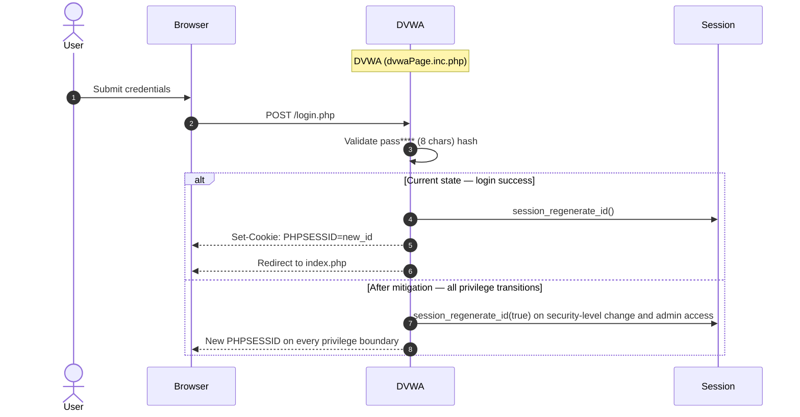

**Security assessment**

Regeneration is confirmed at the login boundary. Other privilege transitions - security-level changes via the DVWA settings page, first access to admin-only pages - are not confirmed to trigger a new session ID. Session fixation remains possible if an attacker plants a known `PHPSESSID` before the victim crosses a non-login privilege boundary.

**Relevant findings**

- 🟠 [F-012](#f-012) — Session fixation on non-impossible security levels

### 6.4 Authorization Controls

<a id="ctrl-authorization-controls"></a>

**Dependent crossings:** [tb-1](#tb-1) unconfirmed - 🔴 [F-010](#f-010) — Security level controlled by client cookie (`dvwa/includes/dvwaPage.inc.php:204`) · [tb-2](#tb-2) unconfirmed - 🟡 [F-047](#f-047) — Security-level cookie client-controlled without server authorization · [tb-3](#tb-3) unconfirmed - 🔴 [F-009](#f-009) — Missing authentication on all UserController endpoints (`UserController.php:265`), 🟠 [F-025](#f-025) — Missing object-level authorization on order endpoints BOLA · [tb-5](#tb-5) unconfirmed - 🟠 [F-020](#f-020) — GitHub Actions workflow-level permissions block, 🟠 [F-027](#f-027) — Missing permissions block (`.github/workflows/docker-image.yml:1`), 🟡 [F-042](#f-042) — GITHUB_TOKEN scope minimization

**Verdict:** 🔴 Missing

<!-- The line below is mechanically derived from the controls table — LLM must not re-author it. -->
**Controls covered:**

- [6.4.1 Object-Level Ownership Check](#641-object-level-ownership-check)

**Implemented controls:** Security-level routing channels each request through a security-level-specific source file (`/source/low.php`, `/source/medium.php`, `/source/high.php`, `/source/impossible.php`); `dvwaPageStartup()` verifies session presence before any page content renders.

**Assessment:** The security level that governs module behavior is read from the client-controlled `security` cookie - no server-side session value overrides it. Object-level ownership is absent across all REST API endpoints; `vulnerabilities/api/src/OrderController.php` accepts any valid bearer token against any order ID without confirming the token subject owns that resource. No middleware enforces resource-to-owner binding on any endpoint.

<a id="object-level-ownership-check"></a><a id="object-level-ownership-check-bolaidor"></a>
#### 6.4.1 Object-Level Ownership Check

**Status:** 🔴 Missing - No ownership checks on user or order resources - intentional IDOR exposure in api-module.

The REST API at `vulnerabilities/api/src/` routes orders and user data through controller classes. `OrderController.php` handles `getOrder`, `updateOrder`, and `deleteOrder` operations that act on specific resource IDs supplied by the caller.

**Security assessment**

No token subject–to–resource-owner check exists in `OrderController.php`. A valid bearer token for any authenticated user can read or modify any other user's orders by substituting the target order ID in the request. The same gap applies to `UserController.php` endpoints. This is intentional IDOR training exposure for the API lab module - the impossible-level path is the only one that would be expected to close it.

**Relevant findings**

- 🔴 [F-009](#f-009) — Missing authentication on all UserController endpoints
- 🔴 [F-010](#f-010) — Security level controlled by client cookie
- 🟠 [F-020](#f-020) — GitHub Actions workflow-level permissions block

### 6.5 Query Construction and Data Access Controls

<a id="ctrl-query-construction-and-data-access-controls"></a>

**Dependent crossings:** [tb-6](#tb-6) refuted - 🔴 [F-007](#f-007) — Unparameterized SQL injection into users table (`login.php:39`), 🔴 [F-008](#f-008) — Plaintext DB credentials in version-controlled `compose.yml` (`compose.yml:34`)

**Verdict:** 🟠 Weak

<!-- The line below is mechanically derived from the section's default mechanism — LLM must not re-author it. -->
**Controls covered:**

- [6.5.1 Database Query Construction](#651-database-query-construction)

**Implemented controls:** PDO prepared statements at the impossible security level (`vulnerabilities/captcha/source/impossible.php:40,48`); `mysqli_real_escape_string()` applied in the low/medium-level login handler.

**Assessment:** Parameterized queries appear only in impossible-level source files. All lower security levels build SQL by string interpolation, and `mysqli_real_escape_string()` provides quoting-only mitigation rather than structural separation of query logic from user-controlled values. The `login.php` authentication query is injectable at every non-impossible security level.

<a id="database-query-construction"></a><a id="query-construction"></a>
#### 6.5.1 Database Query Construction

**Status:** 🟠 Weak - String interpolation in login and module queries; PDO parameterized queries only at impossible level.

`login.php:22` uses string interpolation to build the authentication query against the `users` table. The same pattern repeats across most module source files at low, medium, and high security levels - the codebase deliberately demonstrates injectable query construction at each training tier.

**Security assessment**

`login.php:22` builds the WHERE clause by direct interpolation of `$user` and `$pass`. The vulnerable login lookup is built as a raw SQL string:

```php
$query = "SELECT * FROM `users` WHERE user='$user' AND pass**** (8 chars)='$pass';";
```

Submitting `' OR '1'='1` as the username returns the first database row. `vulnerabilities/captcha/source/impossible.php:40,48` is the only module that substitutes PDO `bindParam()` - all other levels share the injectable pattern.

**Relevant findings**

- 🔴 [F-007](#f-007) — Unparameterized SQL injection into users table

### 6.6 Input Boundary Validation Controls

<a id="ctrl-input-boundary-validation-controls"></a>

**Dependent crossings:** [tb-1](#tb-1) refuted - 🔴 [F-006](#f-006) — OS command injection via unsanitized \$target in exec (`HealthController.php:88`) · [tb-2](#tb-2) unconfirmed - 🔴 [F-007](#f-007) — Unparameterized SQL injection into users table (`login.php:39`) · [tb-3](#tb-3) unconfirmed - 🔴 [F-006](#f-006) — OS command injection via unsanitized \$target in exec (`HealthController.php:88`), 🟠 [F-014](#f-014) — OS Command Injection · [tb-5](#tb-5) unconfirmed - 🟠 [F-021](#f-021) — Third-party GitHub Actions pinned to commit SHA

**Verdict:** 🟠 Weak

<!-- The line below is mechanically derived from the controls table — LLM must not re-author it. -->
**Controls covered:**

- [6.6.1 Validation Approach](#661-validation-approach)

**Implemented controls:** Whitelist validation and strict type checks at the impossible security level; `htmlspecialchars()` applied in impossible-level PHP outputs; security-level routing to separate source files per module.

**Assessment:** No input validation baseline applies server-side below the impossible security level. The security level is read from the client-controlled `security` cookie, which any user can downgrade to `low` to access the weakest validation path. At the impossible level, allowlist checks and parameterized queries are applied; at all other levels, user-controlled input reaches SQL queries, file operations, and command execution without structural validation.

<a id="validation-approach"></a>
#### 6.6.1 Validation Approach

**Status:** 🟠 Weak - Input validation enforced only at impossible level; security level is client-controlled and can be downgraded.

DVWA's vulnerability modules route requests through security-level-specific source files. The impossible level applies explicit allowlist validation, type checks, and parameterized queries before any operation. Lower security levels intentionally skip or weaken these checks to expose the training vulnerability.

**Security assessment**

`dvwa/includes/dvwaPage.inc.php` reads the security level from the client `security` cookie without any server-side session binding. A user can set `security=low` in the cookie to access the weakest validation path on any module, regardless of the security level configured in the DVWA settings. This makes the per-level validation intentionally defeatable - the training design requires it, but it means no validation baseline holds for any authenticated user.

**Relevant findings**

- 🟡 [F-046](#f-046) — No resource limits on MariaDB container

### 6.7 Output Encoding and Rendering Controls

**Verdict:** 🟠 Weak

<!-- The line below is mechanically derived from the section's default mechanism — LLM must not re-author it. -->
**Controls covered:**

- [6.7.1 Output Encoding and Client-Side Rendering](#671-output-encoding-and-client-side-rendering)

**Implemented controls:** PHP `htmlspecialchars()` applied in impossible-level module outputs.

**Assessment:** PHP `htmlspecialchars()` is the output encoding function used in impossible-level module outputs. JavaScript modules at all security levels perform DOM mutation; `vulnerabilities/authbypass/authbypass.js:43` assigns API response data directly to `innerHTML` without encoding, providing a confirmed DOM-based XSS entry point.

<a id="output-encoding-and-client-side-rendering"></a>
#### 6.7.1 Output Encoding and Client-Side Rendering

**Status:** 🟠 Weak - innerHTML without encoding in `authbypass.js`; server-side encoding only at impossible level.

`vulnerabilities/authbypass/authbypass.js` manages the table rendering logic for the authentication bypass lab module. It calls `updateTable()` to inject API response data into the page DOM. At the impossible level, PHP outputs are passed through `htmlspecialchars()` before rendering.

**Security assessment**

`vulnerabilities/authbypass/authbypass.js:43` assigns API response content directly to the `innerHTML` property of a DOM element. Any HTML or script content in the API response executes in the browser context without encoding. At medium and high security levels, PHP-side `htmlspecialchars()` may encode server-rendered output, but the JavaScript DOM sink at line 43 is unguarded at all security levels.

**Relevant findings**

- 🟠 [F-016](#f-016) — DOM XSS via innerHTML in `authbypass.js`

### 6.8 Browser and Cross-Origin Controls

**Verdict:** 🔴 Unsafe

<!-- The line below is mechanically derived from the controls table — LLM must not re-author it. -->
**Controls covered:**

- [6.8.1 XSS Output Encoding](#681-xss-output-encoding)
- [6.8.2 Content Security Policy](#682-content-security-policy)
- [6.8.3 CORS Origin Restriction](#683-cors-origin-restriction)

**Implemented controls:** `vulnerabilities/authbypass/authbypass.js:43`; `vulnerabilities/api/public/index.php:11`; `vulnerabilities/api/gen_openapi.php:6`.

**Assessment:** Three browser controls fail simultaneously. CORS wildcard at `vulnerabilities/api/public/index.php:11` allows any web origin to read API responses. No `Content-Security-Policy` header is emitted, leaving injected scripts unconstrained at the browser level. DOM XSS at `vulnerabilities/authbypass/authbypass.js:43` is the confirmed exploitation path against which both absent controls would otherwise provide a secondary barrier.

<a id="xss-output-encoding"></a>
#### 6.8.1 XSS Output Encoding

**Status:** 🟠 Weak - innerHTML without encoding confirmed; XSS exposure is intentional across multiple modules.

`vulnerabilities/authbypass/authbypass.js` manages UI table updates for the authentication bypass lab. It calls `updateTable()` which constructs DOM content from API response values and writes them into the page.

**Security assessment**

`vulnerabilities/authbypass/authbypass.js:43` uses raw `innerHTML` assignment to render API response data without any encoding step. Any HTML or `<script>` content in the response executes in the browser context. This DOM-based XSS is an intentional training exposure - but because `HttpOnly` is absent on the session cookie (see [§6.3](#63-session-and-token-controls)), a successful XSS payload can also read `PHPSESSID`.

**Relevant findings**

- 🔴 [F-018](#f-018) — Wildcard CORS permits any origin to read API responses

<a id="content-security-policy"></a>
#### 6.8.2 Content Security Policy

**Status:** 🔴 Missing - No CSP header - script injection is unconstrained at the browser level.

Content Security Policy is the browser-side policy that restricts which script sources a page may execute. When present, it provides a secondary barrier against XSS even after server-side escaping fails - a `script-src 'self'` policy would block injected inline scripts regardless of encoding gaps.

**Security assessment**

No `Content-Security-Policy` header is emitted by the DVWA PHP application at any security level. Without CSP, any injected script - through the confirmed DOM XSS at `vulnerabilities/authbypass/authbypass.js:43` or through stored XSS in other modules - executes without restriction in the browser. Adding CSP would close the browser-side gap independently of the encoding fixes needed in the PHP and JavaScript layers.

**Relevant findings**

- 🔴 [F-018](#f-018) — Wildcard CORS permits any origin to read API responses

<a id="cors-origin-restriction"></a>
#### 6.8.3 CORS Origin Restriction

**Status:** 🔴 Unsafe - Wildcard CORS active - any origin can read API responses; intentional teaching defect.

`vulnerabilities/api/public/index.php` is the front controller for the REST API lab module. It sets response headers - including the CORS policy - for all API responses before routing to controller classes.

**Security assessment**

`vulnerabilities/api/public/index.php:11` sets `Access-Control-Allow-Origin: *`, and `vulnerabilities/api/gen_openapi.php:6` applies the same wildcard to the OpenAPI endpoint. Any attacker-controlled page can initiate a cross-origin request from a victim's browser and read the full API response body, including any authenticated data returned to the victim's session. This is an intentional CORS misconfiguration for the API security lab.

**Relevant findings**

- 🔴 [F-018](#f-018) — Wildcard CORS permits any origin to read API responses

### 6.9 Cryptography Secrets and Data Protection


**Systemic weaknesses:** [W-001](#w-001), [W-004](#w-004)
**Verdict:** 🔴 Unsafe

<!-- The line below is mechanically derived from the controls table — LLM must not re-author it. -->
**Controls covered:**

- [6.9.1 API Bearer Token Signing Secret](#691-api-bearer-token-signing-secret)
- [6.9.2 Runtime Secret Injection for Database Credentials](#692-runtime-secret-injection-for-database-credentials)

**Implemented controls:** `vulnerabilities/api/src/LoginController.php`; compose\.yml:28.

**Assessment:** Two hardcoded secrets are the dominant failures. `ACCESS_TOKEN_SECRET = '12345'` at `vulnerabilities/api/src/Login.php:10` makes bearer token forgery trivial for any source reader. The `MYSQL_ROOT_PASSWORD` is a plaintext string literal in `compose.yml:28`, committed to version control alongside the application. Env-var injection for the database connection is present as a pattern but the secret value is not externalized.

<a id="api-bearer-token-signing-secret"></a>
#### 6.9.1 API Bearer Token Signing Secret

**Status:** 🔴 Unsafe - Hardcoded signing secret - token forgery trivial for anyone with source access.

`vulnerabilities/api/src/Login.php` issues and validates bearer tokens for the REST API module. `Token::create_token()` signs tokens using a constant secret, and `Login::check_access_token()` validates incoming tokens by comparing the decrypted secret field against the stored constant.

**Security assessment**

Two PHP string literal secrets live in `vulnerabilities/api/src/Login.php`:

- Line 10: `ACCESS_TOKEN_SECRET = '12345'` - any reader of the source tree can sign a token for any user identity and access all API data.
- `REFRESH_TOKEN_SECRET = '98765'` - the same weakness extends to refresh tokens, making indefinite session extension costless.

`Login::check_access_token()` is structurally sound but rendered void by the fixed secret. Rotating the secret requires a code change and redeployment - no runtime injection path exists.

**Relevant findings**

- 🔴 [F-005](#f-005) — Hardcoded bearer token signing secret
- 🔴 [F-008](#f-008) — Plaintext DB credentials in version-controlled `compose.yml` (Plaintext DB credentials in version-controlled compose\.yml)
- 🔴 [F-028](#f-028) — Hardcoded root pass**** (8 chars) enables full DB privilege escalation

<a id="runtime-secret-injection-for-database-credentials"></a>
#### 6.9.2 Runtime Secret Injection for Database Credentials

**Status:** 🟡 Partial - Env-var injection present; no secrets manager or rotation mechanism.

`compose.yml:28` configures the MariaDB service with environment variables for the database connection, following the container-native pattern of injecting credentials at runtime rather than embedding them in application source files.

**Security assessment**

The env-var injection pattern is correct, but the current `compose.yml` supplies `MYSQL_ROOT_PASSWORD` as a plaintext string literal committed to the repository. The secret is version-controlled alongside the code and appears in every `git log` snapshot. No Docker secret mount, `.env` file exclusion, or secrets manager is in use. Anyone with repository read access - including any GitHub collaborator - can read the database root pass**** (8 chars).

**Relevant findings**

- 🔴 [F-005](#f-005) — Hardcoded bearer token signing secret
- 🔴 [F-008](#f-008) — Plaintext DB credentials in version-controlled `compose.yml` (Plaintext DB credentials in version-controlled compose\.yml)
- 🔴 [F-028](#f-028) — Hardcoded root pass**** (8 chars) enables full DB privilege escalation

### 6.10 File Parser and Outbound Request Controls

<a id="ctrl-file-parser-and-outbound-request-controls"></a>

_No trust boundary in this model depends on this control class._

**Verdict:** 🟠 Weak

<!-- The line below is mechanically derived from the section's default mechanism — LLM must not re-author it. -->
**Controls covered:**

- [6.10.1 File Parser and Outbound Request Handling](#6101-file-parser-and-outbound-request-handling)

**Implemented controls:** File upload type and size checks at impossible security level; allowlist-based redirect validation at impossible level for the open redirect module.

**Assessment:** Three distinct file-handling and outbound request exposures are present as intentional training exercises: OS command injection via an unguarded `exec()` call, unrestricted file upload at low/medium security levels, and an unvalidated open redirect. Each is scoped to a specific vulnerability module and intentionally exploitable at lower security levels.

<a id="file-parser-and-outbound-request-handling"></a>
#### 6.10.1 File Parser and Outbound Request Handling

**Status:** 🟠 Weak - OS command injection, unrestricted file upload, and open redirect present as intentional training exposures.

The API health endpoint at `vulnerabilities/api/src/HealthController.php` accepts a target parameter and executes a network probe. File upload functionality exists across multiple vulnerability modules. The open redirect module at `vulnerabilities/open_redirect/` accepts a URL parameter and issues an HTTP redirect.

**Security assessment**

Three independent exposures cover this domain:

- `vulnerabilities/api/src/HealthController.php` passes `$target` directly to `exec()` without `escapeshellarg()` - OS command injection via the health check endpoint at all security levels.
- File upload modules at low and medium security levels impose no file type or size validation, allowing arbitrary file upload to the web root.
- `vulnerabilities/open_redirect/source/low.php` performs `header("Location: " . $_GET['redirect'])` with no allowlist check, enabling attacker-controlled redirects from the DVWA hostname.

**Relevant findings**

- 🔴 [F-006](#f-006) — OS command injection via unsanitized \$target in exec (OS command injection via unsanitized \$target in exec)
- 🟠 [F-014](#f-014) — OS Command Injection
- 🟡 [F-030](#f-030) — Unvalidated open redirect
- 🟡 [F-043](#f-043) — CAPTCHA bypass token in HTML comment

### 6.11 Operations Runtime and Supply Chain Controls


**Systemic weaknesses:** [W-003](#w-003)
**Verdict:** 🔴 Missing

<!-- The line below is mechanically derived from the controls table — LLM must not re-author it. -->
**Controls covered:**

- [6.11.1 Third-Party CI Action Pinning](#6111-third-party-ci-action-pinning)
- [6.11.2 Artifact Signing and SBOM Generation](#6112-artifact-signing-and-sbom-generation)
- [6.11.3 Automated SCA scanning](#6113-automated-sca-scanning)
- [6.11.4 Automated dependency updates](#6114-automated-dependency-updates)
- [6.11.5 Lockfile hygiene](#6115-lockfile-hygiene)

**Implemented controls:** `.github/workflows/docker-image.yml:16`,19,22; `.github/workflows/shiftleft-analysis.yml:24`.

**Assessment:** Four of five supply-chain controls are absent. GitHub Actions in `docker-image.yml` and `shiftleft-analysis.yml` reference third-party actions by mutable tags, not commit SHAs. No SCA tool alerts on known-vulnerable packages. The Docker image push at `.github/workflows/docker-image.yml:41` generates no cosign signature or SLSA provenance attestation. `package-lock.json` is committed - the one deterministic supply-chain anchor in the repository.

<a id="third-party-ci-action-pinning"></a>
#### 6.11.1 Third-Party CI Action Pinning

**Status:** 🟠 Weak - Mutable tag refs - pin to commit SHA to prevent silent action substitution.

`.github/workflows/docker-image.yml` and `.github/workflows/shiftleft-analysis.yml` use GitHub-managed runners and reference third-party actions in their `uses:` directives to build, scan, and push the DVWA Docker image.

**Security assessment**

`.github/workflows/docker-image.yml:16,19,22` and `.github/workflows/shiftleft-analysis.yml:24` reference third-party actions by mutable tags (e.g. `@v2`, `@v3`). If the upstream action repository is compromised or the tag is moved to a different commit, the next CI run silently executes attacker-controlled code with the pipeline's `GITHUB_TOKEN` scope, including the `packages:write` permission that allows registry pushes.

**Relevant findings**

- 🟡 [F-003](#f-003) — Missing Authentication Event Logging
- 🟠 [F-015](#f-015) — Mutable GitHub Action tag
- 🟠 [F-021](#f-021) — Third-party GitHub Actions pinned to commit SHA

<a id="artifact-signing-and-sbom-generation"></a>
#### 6.11.2 Artifact Signing and SBOM Generation

**Status:** 🔴 Missing - No signing or SBOM - published images have no verifiable provenance.

Artifact signing and SBOM generation attach cryptographic provenance to a container image, allowing consumers to verify that the pulled image matches the source commit that built it. `.github/workflows/docker-image.yml:41` is the step that pushes the built image to the container registry.

**Security assessment**

`.github/workflows/docker-image.yml:41` performs `docker buildx build --push` with no subsequent `cosign sign`, `actions/attest-build-provenance`, or `--provenance=true` step. Published `dvwa:latest` images carry no verifiable provenance and no SBOM. Downstream consumers cannot distinguish a legitimate build from a substituted image, and post-incident forensic reconstruction cannot scope which builds are trustworthy.

**Relevant findings**

- 🟡 [F-003](#f-003) — Missing Authentication Event Logging
- 🟠 [F-015](#f-015) — Mutable GitHub Action tag
- 🟠 [F-021](#f-021) — Third-party GitHub Actions pinned to commit SHA

<a id="automated-sca-scanning"></a>
#### 6.11.3 Automated SCA scanning

**Status:** 🔴 Missing - No SCA scanner configured; known-vulnerable packages in the dependency tree go undetected.

Software Composition Analysis scanning checks the resolved dependency tree against vulnerability databases and alerts when a known-CVE package enters the supply chain. `package-lock.json` records the resolved Node\.js dependency graph that an SCA tool would consume.

**Security assessment**

No Dependabot, Renovate, Snyk, or equivalent SCA tool is configured in `.github/` or the repository settings. Known-vulnerable packages in `package-lock.json` receive no automated alert and no pull request proposing an upgrade. The `shiftleft-analysis.yml` workflow performs SAST scanning but not SCA - vulnerable transitive dependencies pass through the CI pipeline without detection.

**Relevant findings**

- 🟡 [F-003](#f-003) — Missing Authentication Event Logging
- 🟠 [F-015](#f-015) — Mutable GitHub Action tag
- 🟠 [F-021](#f-021) — Third-party GitHub Actions pinned to commit SHA

<a id="automated-dependency-updates"></a>
#### 6.11.4 Automated dependency updates

**Status:** 🔴 Missing - No Dependabot or Renovate configuration; dependency versions advance only by manual update.

Automated dependency update tooling (Dependabot, Renovate) opens pull requests when a dependency releases a new version, keeping the resolved dependency tree current with patches and security releases without requiring manual developer action.

**Security assessment**

No `.github/dependabot.yml` or Renovate configuration file exists in the repository. Dependency versions in `package-lock.json` advance only when a developer manually runs `npm update` and commits the result. Security patches for transitive dependencies go unnoticed between manual update cycles, accumulating known-vulnerable package exposure silently.

**Relevant findings**

- 🟡 [F-003](#f-003) — Missing Authentication Event Logging
- 🟠 [F-015](#f-015) — Mutable GitHub Action tag
- 🟠 [F-021](#f-021) — Third-party GitHub Actions pinned to commit SHA

<a id="lockfile-hygiene"></a>
#### 6.11.5 Lockfile hygiene

**Status:** 🟢 Adequate - `package-lock.json` committed and consistent; Node\.js dependency graph is deterministic.

`package-lock.json` records exact resolved versions for all Node\.js dependencies, giving CI reproducible installs and a baseline for SCA tooling. The file is committed and tracked in version control alongside `package.json`.

**Security assessment**

`package-lock.json` is present and committed. The Node\.js dependency graph is reproducible across environments and build runs. This is the one supply-chain control that holds - CI installs are deterministic. PHP Composer lockfile hygiene (`composer.lock`) is outside the scope of the Node\.js lockfile; its status was not confirmed in recon and should be verified separately.

**Relevant findings**

- 🟡 [F-003](#f-003) — Missing Authentication Event Logging
- 🟠 [F-015](#f-015) — Mutable GitHub Action tag
- 🟠 [F-021](#f-021) — Third-party GitHub Actions pinned to commit SHA

### 6.12 Real-time and Not Applicable Controls

<!-- §6.12 LOCKED — mechanically derived from absence of real-time findings. Renderer must not rewrite the line below. -->
_Not applicable - no real-time / WebSocket findings routed to this category, and no AI/LLM, GraphQL, or gRPC surfaces detected by the recon scan. Controls catalogued elsewhere (container hardening, dependency determinism) are covered in their primary [§6](#6-security-architecture) sections._

### 6.13 Defense-in-Depth Summary

**Verdict:** 🔴 Unsafe

Two controls qualify as genuine positives: `package-lock.json` is committed and pins the Node\.js dependency graph deterministically, and `session_regenerate_id()` is called on login to rotate the session ID. The impossible-level source files demonstrate correct patterns throughout - PDO parameterized queries, `htmlspecialchars()`, allowlist validation - confirming the codebase deliberately carries both the weak and the hardened form of each control. No other layer of defense is intact.

The gaps compound each other. SQL injection at `login.php:22` yields an authenticated session; unsalted `MD5` at `dvwa/includes/dbms/MySQL.php:55` means any dumped credential is immediately reversible via rainbow table; the bearer token secret `'12345'` at `vulnerabilities/api/src/Login.php:10` makes token forgery costless for any source reader; and the absence of CSP means any injected script executes without browser-side containment. Restoring layered defense requires removing `disable_authentication` from any internet-exposed deployment, replacing `MD5` with Argon2id or bcrypt, replacing string-interpolated queries with PDO bound parameters across all security levels, moving both token signing secrets to runtime-injected environment variables, and adding a `Content-Security-Policy` header to contain injected scripts independently of the encoding fixes.

<!-- enriched:standard -->

---

<a id="weakness-register"></a>
## 7. Weakness Register

Systemic control gaps behind the findings, ordered by severity (W-001 = most severe). Each weakness names the missing, home-grown, or misused control, the findings that evidence it, the components it spans, and its remediation. A weakness may also rest on observed unsafe practice or an absent architectural control with no confirmed exploit - only confirmed findings carry a CVSS score.

- 🔴 **Critical** · [W-001](#w-001) - Secrets are committed to source instead of a managed store · confirmed · 3 findings · 2 components
- 🟠 **High** · [W-002](#w-002) - Input handling lacks enforced boundary validation · confirmed · 0 findings · 1 component
- 🟠 **High** · [W-003](#w-003) - Build pipeline trusts mutable third-party references · confirmed · 1 finding · 1 component
- 🟡 **Medium** · [W-004](#w-004) - Security-sensitive data uses weak cryptographic primitives · observed-practice · 10 findings · 3 components
- 🟡 **Medium** · [W-005](#w-005) - Frontend rendering lacks enforced output encoding · design-risk · 0 findings · 0 components

<a id="w-001"></a>
### W-001 — Secrets are committed to source instead of a managed store

🔴 **Critical** · design weakness · confirmed · 3 findings

Cryptographic keys, credentials, and other high-entropy secrets are embedded as literals in source or config rather than resolved at runtime from a managed secret store, so anyone with repository read access obtains reusable signing material and credentials.

**Confirmed findings:**

- 🔴 [F-005](#f-005) — Hardcoded bearer token signing secret (`Login.php:10`)
- 🔴 [F-008](#f-008) — Plaintext DB credentials in version-controlled compose\.yml (`.yml:34`)
- 🔴 [F-028](#f-028) — Hardcoded root pass**** (8 chars) enables full DB privilege escalation (`.yml:31`)

**Architecture evidence:** Managed Secret Store, Runtime Secret Injection

**Affected components:** [C-03](#c-03), [C-04](#c-04)

**Remediation:**

- **Structural** — move every secret to a managed secret store or injected environment configuration, rotate the exposed values, and add secret-scanning to CI
- **Tactical** — ● [M-004](#m-004) — Move secrets to a managed secret store, ● [M-007](#m-007) — Move secrets to a managed secret store, ◕ [M-026](#m-026) — Move secrets to a managed secret store

<a id="w-002"></a>
### W-002 — Input handling lacks enforced boundary validation

🟠 **High** · design weakness · confirmed

Request handlers do not validate input against one enforced server-side schema or allowlist at the boundary - validation is either absent on the vulnerable parameters or limited to rejecting selected bad patterns (a blacklist). New encodings and unanticipated input forms can therefore reach downstream parsers or interpreters.

**Architecture evidence:** Schema Validation, Allowlist Validation

**Affected components:** backend-api

**Remediation:**

- **Structural** — enforce server-side schemas and domain-specific allowlists before input reaches parsing, persistence, or command construction

<a id="w-003"></a>
### W-003 — Build pipeline trusts mutable third-party references

🟠 **High** · design weakness · confirmed · 1 finding

CI/CD workflows resolve third-party actions and other build dependencies to mutable tags or branches instead of immutable commit digests, so a retagged or compromised upstream runs inside the pipeline with its token and secret scope.

**Confirmed findings:**

- 🟠 [F-021](#f-021) — Third-party GitHub Actions pinned to commit SHA

**Architecture evidence:** Commit-SHA Action Pinning, Dependency Provenance Verification

**Affected components:** ci-cd-pipeline

**Remediation:**

- **Structural** — pin every third-party action and build dependency to an immutable commit SHA (or a vetted internal mirror) and enforce SHA-pinning in CI
- **Tactical** — ◕ [M-019](#m-019) — Pin third-party dependencies to immutable versions

<a id="w-004"></a>
### W-004 — Security-sensitive data uses weak cryptographic primitives

🟡 **Medium** · implementation weakness · observed-practice · 10 findings

Password, token, or integrity protection uses a weak hash, predictable random source, or insufficient work factor. The application may use a standard library, but the selected primitive does not provide the requ**** (8 chars) security property.

**Practice sites:**

- 🟠 [F-023](#f-023) — Unsalted MD5 pass**** (8 chars) storage enables hash reversal (`MySQL.php:55`) (`dvwa/includes/DBMS/MySQL.php:55`)
- 🟠 [F-026](#f-026) — MD5 without salt for all pass**** (8 chars) storage and login verification (`login.php`:27) (`login.php:27`)
- 🟡 [F-031](#f-031) — Broken hash primitive PHP `dvwa/includes/dvwaPage.inc.php:651` (MD5/SHA-1) (`dvwa/includes/dvwaPage.inc.php:651`)
- 🟡 [F-032](#f-032) — Broken hash primitive PHP `vulnerabilities/captcha/source/impossible.php:14` (`vulnerabilities/captcha/source/impossible.php:14`)
- 🟡 [F-033](#f-033) — Broken hash primitive PHP `vulnerabilities/captcha/source/impossible.php:19` (`vulnerabilities/captcha/source/impossible.php:19`)
- 🟡 [F-034](#f-034) — Broken hash primitive PHP `vulnerabilities/csrf/source/impossible.php:15` (SHA-1) (`vulnerabilities/csrf/source/impossible.php:15`)
- 🟡 [F-035](#f-035) — Broken hash primitive PHP `vulnerabilities/csrf/source/impossible.php:29` (SHA-1) (`vulnerabilities/csrf/source/impossible.php:29`)
- 🟡 [F-036](#f-036) — Broken hash primitive PHP `vulnerabilities/csrf/test_credentials.php:19` (SHA-1) (`vulnerabilities/csrf/test_credentials.php:19`)
- 🟡 [F-037](#f-037) — Broken hash primitive PHP `vulnerabilities/javascript/index.php:43` (MD5/SHA-1) (`vulnerabilities/javascript/index.php:43`)
- 🟡 [F-038](#f-038) — Broken hash primitive PHP `vulnerabilities/javascript/source/low.php:18` (SHA-1) (`vulnerabilities/javascript/source/low.php:18`)
- `dvwa/includes/dvwaPage.inc.php:651`

**Affected components:** [C-02](#c-02), backend-api, [C-04](#c-04)

**Remediation:**

- **Structural** — standardise on a pass**** (8 chars) KDF, a CSPRNG for secrets, and modern authenticated cryptographic primitives with centrally reviewed parameters
- **Tactical** — ◕ [M-021](#m-021) — Hash pass**** (8 chars)s with a strong, salted algorithm, ◕ [M-024](#m-024) — Hash pass**** (8 chars)s with a strong, salted algorithm, ◑ [M-029](#m-029) — Use modern cryptographic hash and KDF algorithms

<a id="w-005"></a>
### W-005 — Frontend rendering lacks enforced output encoding

🟡 **Medium** · design weakness · design-risk

Browser rendering paths write HTML or DOM content directly without one enforced contextual-encoding or sanitisation boundary. Safety depends on each individual component using the right API.

**Architecture evidence:** Template Autoescape, Output Encoding, Content Security Policy

**Remediation:**

- **Structural** — use framework-safe rendering by default and isolate any requ**** (8 chars) raw HTML behind one reviewed sanitisation and Trusted Types policy

---

## 8. Findings Register

Findings are grouped by severity (Critical → High → Medium → Low); within a tier they are ordered by attack vektor (Repo-Read → Internet-Anon → Internet-User → Victim-Required). Each finding is a card with the same fixed fields, in order: **Severity · Component · Location** → **Issue** → **Root cause** → **Evidence** → **Fix** → **Classification** (with external CWE / OWASP links).

**Risk Distribution:** 🔴 Critical: 6 · 🟠 High: 19 · 🟡 Medium: 20 · 🟢 Low: 0 · **Total findings: 45**
**STRIDE Coverage:** Spoofing: 5 · Tampering: 13 · Repudiation: 2 · Information Disclosure: 13 · Denial of Service: 4 · Elevation of Privilege: 8

The systemic root-cause view is summarized in **Top Weaknesses** in the Management Summary; evidence-backed weaknesses are documented in the [Weakness Register](#weakness-register).

**Findings index:**<br/>🔴 [F-005](#f-005) — Hardcoded bearer token signing secret (`Login.php:10`)<br/>🔴 [F-006](#f-006) — OS command injection via unsanitized \$target in exec…<br/>🔴 [F-007](#f-007) — Unparameterized SQL injection into users table (`login.php`:39)<br/>🔴 [F-008](#f-008) — Plaintext DB credentials in version-controlled compose\.yml…<br/>🔴 [F-009](#f-009) — Missing authentication on all UserController endpoints…<br/>🔴 [F-010](#f-010) — Security level controlled by client cookie…<br/>🔴 [F-011](#f-011) — Missing Authentication — `dvwa/includes/dvwaPage.inc.php:149`<br/>🔴 [F-018](#f-018) — Wildcard CORS permits any origin to read API responses…<br/>🔴 [F-028](#f-028) — Hardcoded Credentials — `compose.yml:31`<br/>🔴 [F-029](#f-029) — `Setup.php` accessible without authentication (`setup.php`:6)…<br/>🟠 [F-001](#f-001) — No rate limiting on login endpoint (`login.php`) — `login.php:39`<br/>🟠 [F-012](#f-012) — Session fixation on non-impossible security levels…<br/>🟠 [F-014](#f-014) — OS Command Injection<br/>🟠 [F-015](#f-015) — Mutable GitHub Action tag (`docker-image.yml:16`)<br/>🟠 [F-016](#f-016) — DOM XSS via innerHTML in `authbypass.js` (`authbypass.js:43`)…<br/>🟠 [F-017](#f-017) — API server URL declared without TLS cleartext HTTP…<br/>🟠 [F-019](#f-019) — Session cookie Secure flag always false…<br/>🟠 [F-020](#f-020) — GitHub Actions workflow-level permissions block<br/>🟠 [F-021](#f-021) — Third-party GitHub Actions pinned to commit SHA<br/>🟠 [F-022](#f-022) — `Package-lock.json` present and committed — `package-lock.json`<br/>🟠 [F-023](#f-023) — Unsalted MD5 pass**** (8 chars) storage enables hash reversal…<br/>🟠 [F-024](#f-024) — No rate limiting or lockout on unauthenticated login endpoint…<br/>🟠 [F-025](#f-025) — Missing object-level authorization on order endpoints BOLA…<br/>🟠 [F-026](#f-026) — Password Hash with Insufficient Effort — `login.php:27`<br/>🟠 [F-027](#f-027) — Missing permissions block (`docker-image.yml:1`)…<br/>🟡 [F-002](#f-002) — Unsigned Docker image push (`docker-image.yml:41`)…<br/>🟡 [F-003](#f-003) — Missing Authentication Event Logging<br/>🟡 [F-030](#f-030) — Open Redirect — `vulnerabilities/open_redirect/source/low.php:4`<br/>🟡 [F-031](#f-031) — Broken hash primitive PHP `dvwa/includes/dvwaPage.inc.php:651`…<br/>🟡 [F-032](#f-032) — Broken hash primitive PHP `vulnerabilities/captcha/source/impossible.php`…<br/>🟡 [F-033](#f-033) — Broken hash primitive PHP `vulnerabilities/captcha/source/impossible.php`…<br/>🟡 [F-034](#f-034) — Broken hash primitive PHP `vulnerabilities/csrf/source/impossible.php:15`…<br/>🟡 [F-035](#f-035) — Broken hash primitive PHP `vulnerabilities/csrf/source/impossible.php:29`…<br/>🟡 [F-036](#f-036) — Use of Weak Hash — `vulnerabilities/csrf/test_credentials.php:19`<br/>🟡 [F-037](#f-037) — Broken hash primitive PHP `vulnerabilities/javascript/index.php:43`…<br/>🟡 [F-038](#f-038) — Broken hash primitive PHP `vulnerabilities/javascript/source/low.php:18`…<br/>🟡 [F-039](#f-039) — Missing query audit logging in MariaDB config (`.yml:28`)…<br/>🟡 [F-040](#f-040) — Dockerfile USER directive (non-root) — `Dockerfile:1`<br/>🟡 [F-041](#f-041) — Container image signing via cosign or attest-build-provenance<br/>🟡 [F-042](#f-042) — Incorrect Permission Assignment<br/>🟡 [F-043](#f-043) — CAPTCHA bypass token in HTML comment…<br/>🟡 [F-044](#f-044) — Database error exposed via die on login failure (`login.php`:40)…<br/>🟡 [F-045](#f-045) — No rate limiting on login endpoints enabling credential brute-force…<br/>🟡 [F-046](#f-046) — No resource limits on MariaDB container (`.yml:28`)…<br/>🟡 [F-047](#f-047) — Security-level cookie client-controlled without server authorization…

<a id="th-01"></a><a id="th-03"></a><a id="th-06"></a><a id="th-02"></a><a id="th-09"></a><a id="th-11"></a><a id="th-14"></a><a id="th-17"></a><a id="th-12"></a><a id="th-15"></a><a id="th-16"></a><a id="th-18"></a>

### 🔴 Critical (6)

<a id="t-005"></a><a id="f-005"></a>
#### F-005 · Hardcoded bearer token signing secret (src/Login.php:10)

**Severity:** 🔴 Critical  ·  **Component:** [C-03](#c-03) - REST API Lab Module  ·  **Location:** Multiple locations (2)

**Weakness:** [W-001](#w-001) - Secrets are committed to source instead of a managed store

**Instances (2):** 🔴 `vulnerabilities/api/src/Login.php:10`, 🟠 `vulnerabilities/api/src/LoginController.php:60`

**Issue:** An attacker reads `ACCESS_TOKEN_SECRET` = `'12345'` from `Login.php` source, then constructs and signs a custom token claiming any user identity, and presents it as a valid Bearer token to every protected endpoint. Any attacker who reads the source can forge valid session tokens for any user identity and access all order and user data, or perform any write operation across the entire API.

**Evidence:** ✓ verified - `Login.php` line 10 defines `ACCESS_TOKEN_SECRET` as the PHP string literal '12345'; line 33 verifies tokens by comparing the decrypted secret field against this constant, making offline token forgery trivial for any identity.

```
// vulnerabilities/api/src/Login.php:10
class Login
{
	private const ACCESS_TOKEN_LIFE = 180;
	private const ACCESS_TOKEN_SECRET = "12345";
	private const REFRESH_TOKEN_LIFE = 240;
	private const REFRESH_TOKEN_SECRET = "98765";
	
```

**Fix:** Move the credential out of source control into a secret store and rotate it → ● [M-004](#m-004) — Move secrets to a managed secret store (`Login.php:10`)

**Classification:** Cryptographic Failures · STRIDE: Spoofing · [CWE-798](https://cwe.mitre.org/data/definitions/798.html) · [OWASP A04:2025](https://owasp.org/Top10/2025/A04_2025-Cryptographic_Failures/) · walkthrough [Walkthrough §3.4](#34-hardcoded-bearer-token-signing-secret-in-login)

<a id="t-006"></a><a id="f-006"></a>
#### F-006 · OS command injection via unsanitized \$target in exec (HealthController.php:88)

**Severity:** 🔴 Critical  ·  **Component:** [C-03](#c-03) - REST API Lab Module  ·  **Location:** Multiple locations (2)

**Trust boundary gap:** [tb-1](#tb-1) 🌐 External - external → web-frontend · Validation: The tb-1 validation leg assumes input is validated before use; `low.php`:10 passes raw request data to a shell sink without any validation at this boundary.

**Instances (2):** `vulnerabilities/api/src/HealthController.php:88`, `vulnerabilities/exec/source/low.php:10`

**Issue:** An unauthenticated attacker sends POST `/vulnerabilities/api/v2/health/connectivity` with a JSON body where 'target' contains shell metacharacters, causing `exec()` to execute arbitrary OS commands as the web server user. Unauthenticated remote code execution as the web server OS user, enabling full host compromise, credential theft, and lateral movement.

**Evidence:** ✓ verified - `HealthController.php` line 88 calls exec('ping -c 4 ' . \$target) where \$target is taken verbatim from \$_POST JSON input with no sanitization, quoting, or allowlist validation, permitting shell metacharacter injection.

```
// vulnerabilities/api/src/HealthController.php:88
		if (array_key_exists ("target", $input)) {
			$target = $input['target'];

			exec ("ping -c 4 " . $target, $output, $ret_var);

			if ($ret_var == 0) {
				$response['status_code_header'] = 'HTTP/1.1 200 OK';
```

**Fix:** Replace shell invocations with an argv-list API and validate every input → ● [M-005](#m-005) — Replace exec shell invocation with escapeshellarg-guarded call or IP-only a… (`HealthController.php:88`)

**Classification:** Injection · STRIDE: Tampering · [CWE-78](https://cwe.mitre.org/data/definitions/78.html) · [OWASP A05:2025](https://owasp.org/Top10/2025/A05_2025-Injection/) · walkthrough [Walkthrough §3.6](#36-os-command-injection-in-health-controller)

<a id="t-007"></a><a id="f-007"></a>
#### F-007 · Unparameterized SQL injection into users table (login.php:39)

**Severity:** 🔴 Critical  ·  **Component:** [C-02](#c-02) - Authentication and Session Management  ·  **Location:** Multiple locations (3)

**Trust boundary gap:** [tb-6](#tb-6) - auth-module → database · Query construction: Unsanitized username crosses the auth-module → database trust boundary via string-interpolated query rather than parameterized statement.

**Instances (3):** 🟡 `login.php:39`, 🟠 `dvwa/includes/DBMS/MySQL.php:37`, 🟠 `dvwa/includes/dvwaPage.inc.php:571`

**Issue:** At low and medium DVWA security levels the login query interpolates the raw POST username and md5-hashed pass**** (8 chars) directly into SQL (`login.php`:39); an attacker submits a crafted username containing SQL metacharacters that alter the WHERE clause, bypassing authentication or exfiltrating rows, and can use UNION injection to read or overwrite arbitrary database tables. Authentication bypass for any account and full exfiltration of the users table including `MD5` pass**** (8 chars) hashes; secondary writes to other tables are possible via stacked queries.

**Evidence:** ✓ verified - `login.php`:39 constructs the authentication query by direct string interpolation of user input after only `mysqli_real_escape_string`, which is bypassable through numeric and boolean contexts; parameterized statements are absent at low and medium levels.

```
// login.php:39
		dvwaRedirect( DVWA_WEB_PAGE_TO_ROOT . 'setup.php' );
	}

	$query  = "SELECT * FROM `users` WHERE user='$user' AND password='$pass';";
	$result = @mysqli_query($GLOBALS["___mysqli_ston"],  $query ) or die( '<pre>' . ((is_object($GLOBALS["___mysqli_ston"])) ? mysqli_error($GLOBALS["___mysqli_ston"]) : (($___mysqli_res = mysqli_connect_error()) ? $___mysqli_res : false)) . '.<br />Try <a href="setup.php">installing again</a>.</pre>' );
	if( $result && mysqli_num_rows( $result ) == 1 ) {    // Login Successful...
		dvwaMessagePush( "You have logged in as '{$user}'" );
```

**Fix:** Switch all SQL execution to parameterised queries or ORM-bound parameters → ● [M-006](#m-006) — Use parameterized database queries (`login.php:39`)

**Classification:** Injection · STRIDE: Tampering · [CWE-89](https://cwe.mitre.org/data/definitions/89.html) · [OWASP A05:2025](https://owasp.org/Top10/2025/A05_2025-Injection/) · walkthrough [Walkthrough §3.3](#33-unparameterized-sql-injection-into-users-table-in-login)

<a id="t-008"></a><a id="f-008"></a>
#### F-008 · Plaintext DB credentials in version-controlled compose\.yml (compose\.yml:34)

**Severity:** 🔴 Critical  ·  **Component:** [C-04](#c-04) - MariaDB 10 Datastore  ·  **Location:** Multiple locations (2)

**Weakness:** [W-001](#w-001) - Secrets are committed to source instead of a managed store

**Trust boundary gap:** [tb-6](#tb-6) - auth-module → database · Query construction: auth-module connects to database using the static dvwa credential committed at compose\.yml:34; any peer with that credential is indistinguishable from the legitimate app.

**Instances (2):** `config/config.inc.php.dist:21`, `compose.yml:34`

**Issue:** `compose.yml` lines 31-34 commit both the MariaDB root pass**** (8 chars) ('dvwa') and the dvwa user pass**** (8 chars) ('p@ss**** (8 chars)') to the repository in plaintext; anyone with read access to the repository-including public GitHub visitors-obtains working database credentials without interacting with the running system. Any reader of the repository obtains the database root and user pass**** (8 chars)s; combined with any DVWA deployment reachable from the network, this enables full database compromise.

**Evidence:** ✓ verified - `compose.yml:31` and :34 contain literal credential values `MYSQL_ROOT_PASSWORD`=dvwa and `MYSQL_PASSWORD`=p@ss**** (8 chars) committed to version control, making them permanently discoverable in git history even after a subsequent change.

```yaml
// compose.yml:34
      - MYSQL_ROOT_PASSWORD=dvwa
      - MYSQL_DATABASE=dvwa
      - MYSQL_USER=dvwa
      - MYSQL_PASSWORD=**** (8 chars)
    volumes:
      - dvwa:/var/lib/mysql
    networks:
```

**Fix:** Move the credential out of source control into a secret store and rotate it → ● [M-007](#m-007) — Move secrets to a managed secret store (`compose.yml:34`)

**Classification:** Cryptographic Failures · STRIDE: Information Disclosure · [CWE-798](https://cwe.mitre.org/data/definitions/798.html) · [OWASP A04:2025](https://owasp.org/Top10/2025/A04_2025-Cryptographic_Failures/) · walkthrough [Walkthrough §3.5](#35-plaintext-db-credentials-in-version-controlled-composeyml)

<a id="t-009"></a><a id="f-009"></a>
#### F-009 · Missing authentication on all UserController endpoints (UserController.php:265)

**Severity:** 🔴 Critical  ·  **Component:** [C-03](#c-03) - REST API Lab Module  ·  **Location:** `vulnerabilities/api/src/UserController.php:265`

**Issue:** An unauthenticated attacker sends requests to GET `/user/`, POST `/user/`, PUT `/user/`{id}, or DELETE `/user/`{id} without an Authorization header; `UserController.processRequest()` dispatches directly to data operations with no token validation, granting full user data access and modification. Any unauthenticated client can enumerate all user records (including privilege levels and pass**** (8 chars) hashes), create admin-level users, modify or delete any user account, or perform privilege escalation by setting level=1 on any user.

**Evidence:** ✓ verified - `UserController.processRequest()` at line 265 switches on HTTP method and calls getUser/getAllUsers/addUser/updateUser/deleteUser directly; unlike OrderController, no `checkToken()` call precedes these operations, leaving all user data endpoints completely unauthenticated.

```
// vulnerabilities/api/src/UserController.php:265
		return $response;
	}

	public function processRequest() {
		switch ($this->requestMethod) {
			case 'GET':
				if ($this->userId) {
```

**Fix:** ● [M-008](#m-008) — Enforce server-side authorization on every endpoint (`UserController.php:265`)

**Classification:** Broken Access Control · STRIDE: Elevation of Privilege · [CWE-862](https://cwe.mitre.org/data/definitions/862.html) · [OWASP A01:2025](https://owasp.org/Top10/2025/A01_2025-Broken_Access_Control/) · walkthrough [Walkthrough §3.1](#31-missing-authentication-on-all-usercontroller-endpoints-in-rest-api-lab-module)

<a id="t-010"></a><a id="f-010"></a>
#### F-010 · Security level controlled by client cookie (dvwa/includes/dvwaPage.inc.php:204)

**Severity:** 🔴 Critical  ·  **Component:** [C-01](#c-01) - DVWA Web UI  ·  **Location:** `dvwa/includes/dvwaPage.inc.php:204`

**Issue:** An authenticated attacker opens browser developer tools and changes the 'security' cookie from 'high' to 'low'; `dvwaSecurityLevelGet()` reads security level directly from \$_COOKIE['security'] without session-side verification, causing all subsequent requests to route through the intentionally vulnerable low-security code variants (unsanitized `shell_exec`, raw SQL, unfiltered redirect). Any authenticated user can immediately downgrade to the most vulnerable code path across all lab modules, effectively gaining the attack surface of the low-security level regardless of the intended deployment configuration.

**Evidence:** ✓ verified - `dvwaPage.inc.php`:200-205 implements `dvwaSecurityLevelGet()` by returning \$_COOKIE['security'] directly when set, with no comparison to a server-side session value. Line 226 shows that `setcookie()` sets the security cookie with HttpOnly only at impossible level, making the cookie script-readable at lower levels.

```
// dvwa/includes/dvwaPage.inc.php:204
	global $_DVWA;

	// If there is a security cookie, that takes priority.
	if (isset($_COOKIE['security'])) {
		return $_COOKIE[ 'security' ];
	}

```

**Fix:** ● [M-009](#m-009) — Enforce correct server-side authorization (`dvwaPage.inc.php:204`)

**Classification:** Broken Access Control · STRIDE: Elevation of Privilege · [CWE-863](https://cwe.mitre.org/data/definitions/863.html) · [OWASP A01:2025](https://owasp.org/Top10/2025/A01_2025-Broken_Access_Control/) · walkthrough [Walkthrough §3.2](#32-security-level-controlled-by-client-cookie-in-dvwa-web-ui)

### 🟠 High (19)

<a id="t-001"></a><a id="f-001"></a>
#### F-001 · No rate limiting on login endpoint (login.php)

**Severity:** 🟠 High  ·  **Component:** [C-02](#c-02) - Authentication and Session Management  ·  **Location:** `login.php:39`

**Issue:** An attacker submits unlimited POST requests to `login.php` with differing pass**** (8 chars) values; the login handler performs a database query and bcrypt comparison on each attempt without any rate limit, account lockout, or CAPTCHA enforcement, enabling unrestricted credential brute force at the speed of the server's hashing throughput. An attacker can enumerate all user pass**** (8 chars)s offline-equivalent through online brute force; any account with a weak pass**** (8 chars) is compromised, including the default admin account.

**Evidence:** ◌ ambiguous - Inspection of `login.php` (80 lines fully read) reveals no rate-limiting calls, no lockout counter increments, and no CAPTCHA. The brute force module at `vulnerabilities/brute/source/low.php:12` confirms the same unthrottled query pattern for the training endpoint. No rate-limiting middleware is invoked from `dvwaPage.inc.php`.

```
// login.php:39
	}

	$query  = "SELECT * FROM `users` WHERE user='$user' AND password='$pass';";
	$result = @mysqli_query($GLOBALS["___mysqli_ston"],  $query ) or die( '<pre>' . ((is_object($GLOBALS["___mysqli_ston"])) ? mysqli_error($GLOBALS["___mysqli_ston"]) : (($___mysqli_res = mysqli_connect_error()) ? $___mysqli_res : false)) . '.<br />Try <a href="setup.php">installing again</a>.</pre>' );
	if( $result && mysqli_num_rows( $result ) == 1 ) {    // Login Successful...
```

**Fix:** Apply rate limiting and lock-out thresholds on authentication endpoints → ◕ [M-001](#m-001) — Rate-limit and lock out repeated authentication attempts (`login.php:39`)

**Classification:** Broken Authentication · STRIDE: Denial of Service · [CWE-307](https://cwe.mitre.org/data/definitions/307.html) · [OWASP A07:2025](https://owasp.org/Top10/2025/A07_2025-Authentication_Failures/)

<a id="t-011"></a><a id="f-011"></a>
#### F-011 · Missing Authentication

**Severity:** 🟠 High _(raw Critical)_  ·  **Component:** [C-02](#c-02) - Authentication and Session Management  ·  **Location:** `dvwa/includes/dvwaPage.inc.php:149`

**Issue:** An attacker targeting a deployment where `DISABLE_AUTHENTICATION` env var is set to a truthy value sends any HTTP request without a valid session; `dvwaIsLoggedIn()` returns true unconditionally at line 149, granting full authenticated access to every protected lab page. Complete authentication bypass - all lab pages, admin functions, and the setup endpoint are accessible to any unauthenticated caller without credentials.

**Evidence:** ✓ verified - `dvwaIsLoggedIn()` at line 149 returns true unconditionally when \$_DVWA['disable_authentication'] is set and truthy, with no session check performed; config/config.inc.php.dist:43 shows `DISABLE_AUTHENTICATION` env var falls back to false but accepts any truthy string.

```
// dvwa/includes/dvwaPage.inc.php:149
	global $_DVWA;

	if (array_key_exists("disable_authentication", $_DVWA) && $_DVWA['disable_authentication']) {
		return true;
	}
```

**Fix:** ◕ [M-010](#m-010) — Require authentication on every exposed endpoint (`dvwaPage.inc.php:149`)

**Classification:** Unauthenticated Management Plane · STRIDE: Spoofing · [CWE-306](https://cwe.mitre.org/data/definitions/306.html) · [OWASP A01:2025](https://owasp.org/Top10/2025/A01_2025-Broken_Access_Control/)

<a id="t-012"></a><a id="f-012"></a>
#### F-012 · Session fixation on non-impossible security levels (dvwaPage.inc.php:103)

**Severity:** 🟠 High  ·  **Component:** [C-02](#c-02) - Authentication and Session Management  ·  **Location:** Multiple locations (2)

**Trust boundary gap:** [tb-1](#tb-1) 🌐 External - external → web-frontend · Authentication: Session fixation violates the tb-1 authentication assumption by not invalidating the pre-login session ID that an external attacker could have seeded.

**Instances (2):** `dvwa/includes/dvwaPage.inc.php:103`, `dvwa/includes/dvwaPage.inc.php:102`

**Issue:** An attacker shares a URL containing a known session identifier with a victim; when the victim authenticates at any security level other than 'impossible', line 103 calls `session_id($_COOKIE[session_name()])` preserving the attacker-supplied ID, and the attacker uses that same ID to access the now-authenticated session. Attacker hijacks any user's session by planting a known session ID before login, gaining the victim's full authenticated identity after credentials are entered.

**Evidence:** ✓ verified - `dvwa_start_session()` at line 102-103 conditionally calls `session_id($_COOKIE[session_name()])` for non-impossible levels, explicitly preserving the caller-supplied session cookie rather than generating a new ID; the code comment at line 93 confirms this is intentional to allow session fixation attacks as a lab exercise.

```
// dvwa/includes/dvwaPage.inc.php:103
	else {
		if (isset($_COOKIE[session_name()])) // if a session id already exists
			session_id($_COOKIE[session_name()]); // we keep the same id
		session_start(); // otherwise a new one will be generated here
	}
```

**Fix:** ◕ [M-011](#m-011) — Rotate the session identifier on authentication (`dvwaPage.inc.php:103`)

**Classification:** Broken Authentication · STRIDE: Spoofing · [CWE-384](https://cwe.mitre.org/data/definitions/384.html) · [OWASP A07:2025](https://owasp.org/Top10/2025/A07_2025-Authentication_Failures/)

<a id="t-014"></a><a id="f-014"></a>
#### F-014 · OS Command Injection

**Severity:** 🟠 High  ·  **Component:** [C-03](#c-03) - REST API Lab Module  ·  **Location:** Multiple locations (9)

**Instances (9):** `vulnerabilities/api/src/HealthController.php:88`, `vulnerabilities/exec/source/high.php:26`, `vulnerabilities/exec/source/high.php:30`, `vulnerabilities/exec/source/impossible.php:22`, `vulnerabilities/exec/source/impossible.php:26`, `vulnerabilities/exec/source/low.php:10`, `vulnerabilities/exec/source/low.php:14`, `vulnerabilities/exec/source/medium.php:19` … (+1 more)

**Issue:** A shell command built from request data yields arbitrary command execution.

**Evidence:** ✓ verified

```
// vulnerabilities/api/src/HealthController.php:88
			$target = $input['target'];

			exec ("ping -c 4 " . $target, $output, $ret_var);

			if ($ret_var == 0) {
```

**Fix:** Replace shell invocations with an argv-list API and validate every input → ◕ [M-012](#m-012) — Avoid the shell; if unavoidable, escapeshellarg every dynamic argument (`HealthController.php:88`)

**Classification:** Injection · STRIDE: Tampering · [CWE-78](https://cwe.mitre.org/data/definitions/78.html) · [OWASP A05:2025](https://owasp.org/Top10/2025/A05_2025-Injection/)

<a id="t-015"></a><a id="f-015"></a>
#### F-015 · Mutable GitHub Action tag (.github/workflows/docker-image.yml:16)

**Severity:** 🟠 High  ·  **Component:** [C-05](#c-05) - GitHub Actions CI/CD Pipeline  ·  **Location:** Multiple locations (2)

**Instances (2):** `.github/workflows/docker-image.yml:16`, `Dockerfile:1`

**Issue:** An attacker who compromises the docker/setup-qemu-action or docker/setup-buildx-action GitHub repository re-tags the v3 release to point to malicious code; the next pipeline run silently executes that code inside the build environment where `GITHUB_TOKEN` and build secrets are available. Arbitrary code executes in the build environment with access to `GITHUB_TOKEN` (package-write scope) and any repository secrets, enabling registry poisoning, secret exfiltration, or artifact tampering.

**Evidence:** ✓ verified - `docker-image.yml` lines 16, 19, and 22 use `docker/setup-qemu-action@v3`, `docker/setup-buildx-action@v3`, and `docker/login-action@v3` with mutable version tags and no SHA pin; IAC-011 High signals confirm unpinned actions at lines 16 and 22.

```yaml
// .github/workflows/docker-image.yml:16

    - name: Set up QEMU
      uses: docker/setup-qemu-action@v3

    - name: Set up Docker Buildx
```

**Fix:** Replace the unmaintained dependency with a maintained equivalent or fork it under ownership → ◕ [M-013](#m-013) — Pin the container base image to an immutable digest (`docker-image.yml:16`)

**Classification:** Supply-Chain Integrity · STRIDE: Tampering · [CWE-1104](https://cwe.mitre.org/data/definitions/1104.html) · [OWASP A03:2025](https://owasp.org/Top10/2025/A03_2025-Software_Supply_Chain_Failures/)

<a id="t-016"></a><a id="f-016"></a>
#### F-016 · DOM XSS via innerHTML in authbypass.js (authbypass.js:43)

**Severity:** 🟠 High  ·  **Component:** [C-01](#c-01) - DVWA Web UI  ·  **Location:** `vulnerabilities/authbypass/authbypass.js:43`

**Issue:** An attacker with write access to user records inserts a JavaScript payload in the `user_id` or `first_name` field; when any authenticated user loads the auth bypass module, `authbypass.js:43-49` assigns the server-returned field values directly to `cell.innerHTML`, executing the attacker's script in the victim's authenticated browser context. Attacker script runs in the victim's authenticated browser context, enabling session cookie theft (at security levels where HttpOnly is absent), forced state-changing requests, or CSRF token exfiltration.

**Evidence:** ✓ verified - `authbypass.js:43` assigns `cell0.innerHTML` = user['user_id'] + '<input...value="' + user['user_id'] + '"...'; lines 45, 47, 49 assign `first_name` and surname fields the same way. Recon signals (category 19, subcategory frontend-unsafe-html-sink) confirm all four innerHTML sinks at these lines.

```javascript
// vulnerabilities/authbypass/authbypass.js:43
			var row = table_body.insertRow(0);
			var cell0 = row.insertCell(-1);
			cell0.innerHTML = user['user_id'] + '<input type="hidden" id="user_id_' + user['user_id'] + '" name="user_id" value="' + user['user_id'] + '" />';
			var cell1 = row.insertCell(1);
			cell1.innerHTML = '<input type="text" id="first_name_' + user['user_id'] + '" name="first_name" value="' + user['first_name'] + '" />';
```

**Fix:** Output-encode untrusted strings at every sink and remove all `bypassSecurityTrustHtml` calls → ◕ [M-014](#m-014) — Encode output instead of bypassing the framework sanitizer (`authbypass.js:43`)

**Classification:** Cross-Site Scripting (XSS) · STRIDE: Tampering · [CWE-79](https://cwe.mitre.org/data/definitions/79.html) · [OWASP A05:2025](https://owasp.org/Top10/2025/A05_2025-Injection/)

<a id="t-017"></a><a id="f-017"></a>
#### F-017 · API server URL declared without TLS cleartext HTTP (src/UserController.php:15)

**Severity:** 🟠 High  ·  **Component:** [C-03](#c-03) - REST API Lab Module  ·  **Location:** `vulnerabilities/api/src/UserController.php:15`

**Issue:** The OpenAPI server URL is hardcoded as 'http://dvwa.test' with no TLS, causing all bearer tokens, order data, and user records to traverse the network in plaintext where a network-adjacent attacker can capture them. Bearer tokens, user credentials, order addresses, and all API payloads are exposed to passive interception on the network, enabling session hijacking and data exfiltration without server compromise.

**Evidence:** ◌ ambiguous - `UserController.php` line 15 contains the OAT\Server annotation 'url: `http://dvwa.test`' declaring the API server without TLS; the architecture confirms the endpoint is internet-facing. Bearer tokens transmitted over cleartext HTTP are trivially captured by any network-adjacent observer.

```
// vulnerabilities/api/src/UserController.php:15
# get the HTTP_HOST value from them. For now I'm hard coding it to make
# my dev life easier.
#[OAT\Server(url: 'http://dvwa.test', description: "API server")]

#[OAT\Tag(name: "user", description: "User operations.")]
```

**Fix:** Force TLS on every transport channel and reject downgrades → ◕ [M-015](#m-015) — Configure TLS termination and update the API server URL to https:// in UserCont… (`UserController.php:15`)

**Classification:** Cryptographic Failures · STRIDE: Information Disclosure · [CWE-319](https://cwe.mitre.org/data/definitions/319.html) · [OWASP A04:2025](https://owasp.org/Top10/2025/A04_2025-Cryptographic_Failures/)

<a id="t-018"></a><a id="f-018"></a>
#### F-018 · Wildcard CORS permits any origin to read API responses (public/index.php:11)

**Severity:** 🟠 High  ·  **Component:** [C-03](#c-03) - REST API Lab Module  ·  **Location:** `vulnerabilities/api/public/index.php:11`

**Issue:** A malicious web page on an arbitrary origin makes an XHR to the API with a user's bearer token (stored in JS memory); the browser forwards the Authorization header and the Access-Control-Allow-Origin: * response header allows the malicious page to read the full JSON response body containing user and order data. Any website can read authenticated API responses including order addresses, user records, and privilege levels from a victim browser session, enabling data exfiltration without server-side compromise.

**Evidence:** ✓ verified - `public/index.php` line 11 emits 'Access-Control-Allow-Origin: *' for every API response; `gen_openapi.php` line 6 applies the same header to the OpenAPI spec. The wildcard allows credentials-attached cross-origin reads when the client stores tokens in JavaScript-accessible storage.

**Fix:** Replace the wildcard CORS origin with an explicit allow-list → ◕ [M-016](#m-016) — Restrict CORS to trusted origins (`index.php:11`)

**Classification:** Broken Access Control · STRIDE: Information Disclosure · [CWE-942](https://cwe.mitre.org/data/definitions/942.html) · [OWASP A01:2025](https://owasp.org/Top10/2025/A01_2025-Broken_Access_Control/) · walkthrough [Walkthrough §3.7](#37-wildcard-cors-permits-any-origin-to-read-api-responses-in-rest-api-lab-module)

<a id="t-019"></a><a id="f-019"></a>
#### F-019 · Session cookie Secure flag always false (dvwa/includes/dvwaPage.inc.php:60)

**Severity:** 🟠 High  ·  **Component:** [C-02](#c-02) - Authentication and Session Management  ·  **Location:** `dvwa/includes/dvwaPage.inc.php:60`

**Issue:** An attacker positioned on the same network as a victim intercepts the HTTP request to the DVWA login page; because the session cookie is issued without Secure=true (line 60: \$secure = false hardcoded at all security levels), the browser transmits PHPSESSID over plaintext HTTP, and the attacker copies the cookie to impersonate the victim. Session cookie transmitted over HTTP is intercepted in transit, enabling session hijacking and full impersonation of the authenticated user.

**Evidence:** ✓ verified - `dvwa_start_session()` sets \$secure = false at line 60 unconditionally, then passes it to `session_set_cookie_params()` at line 72; no code path sets \$secure to true regardless of the security level or transport configuration.

```
// dvwa/includes/dvwaPage.inc.php:60

	$maxlifetime = 86400;
	$secure = false;
	$domain = parse_url($_SERVER['HTTP_HOST'], PHP_URL_HOST);

```

**Fix:** Set `Secure` on every session cookie and enforce HTTPS-only delivery → ◕ [M-017](#m-017) — Set session cookie Secure flag unconditionally and tie HttpOnly to security lev… (`dvwaPage.inc.php:60`)

**Classification:** Error Information Disclosure · STRIDE: Information Disclosure · [CWE-614](https://cwe.mitre.org/data/definitions/614.html) · [OWASP A02:2025](https://owasp.org/Top10/2025/A02_2025-Security_Misconfiguration/)

<a id="t-020"></a><a id="f-020"></a>
#### F-020 · GitHub Actions workflow-level permissions block

**Severity:** 🟠 High  ·  **Component:** [C-05](#c-05) - GitHub Actions CI/CD Pipeline  ·  **Location:** Multiple locations (5)

**Instances (5):** `.github/workflows/codeql-analysis.yml:1`, `.github/workflows/docker-image.yml:1`, `.github/workflows/pytest.yml:1`, `.github/workflows/shiftleft-analysis.yml:1`, `.github/workflows/vulnerable.yml:1`

**Issue:** GitHub Actions workflow-level permissions block: Without an explicit permissions block, the workflow inherits the repository default (commonly write-all) for `GITHUB_TOKEN` - any compromised step can push code, create releases, or approve PRs.

**Evidence:** ◌ ambiguous

```yaml
// .github/workflows/codeql-analysis.yml:1
# For most projects, this workflow file will not need changing; you simply need
# to commit it to your repository.
#
```

**Fix:** ◕ [M-018](#m-018) — Apply least-privilege permissions (`codeql-analysis.yml:1`)

**Classification:** Error Information Disclosure · STRIDE: Information Disclosure · [CWE-732](https://cwe.mitre.org/data/definitions/732.html) · [OWASP A02:2025](https://owasp.org/Top10/2025/A02_2025-Security_Misconfiguration/)

<a id="t-021"></a><a id="f-021"></a>
#### F-021 · Third-party GitHub Actions pinned to commit SHA

**Severity:** 🟠 High  ·  **Component:** [C-05](#c-05) - GitHub Actions CI/CD Pipeline  ·  **Location:** Multiple locations (3)

**Weakness:** [W-003](#w-003) - Build pipeline trusts mutable third-party references

**Instances (3):** `.github/workflows/shiftleft-analysis.yml:27`, `.github/workflows/codeql-analysis.yml:45`, `.github/workflows/shiftleft-analysis.yml:24`

**Issue:** Third-party GitHub Actions pinned to commit SHA: Tag-based action references (@v3, @main) are mutable - a compromised publisher can retroactively inject malicious code into an already-used tag.

**Evidence:** ✓ verified

```yaml
// .github/workflows/codeql-analysis.yml:45
    # Initializes the CodeQL tools for scanning.
    - name: Initialize CodeQL
      uses: github/codeql-action/init@v4.33.0
      with:
        languages: ${{ matrix.language }}
```

**Fix:** ◕ [M-019](#m-019) — Pin third-party dependencies to immutable versions (`codeql-analysis.yml:45`)

**Classification:** Supply-Chain Integrity · STRIDE: Information Disclosure · [CWE-829](https://cwe.mitre.org/data/definitions/829.html) · [OWASP A03:2025](https://owasp.org/Top10/2025/A03_2025-Software_Supply_Chain_Failures/)

<a id="t-022"></a><a id="f-022"></a>
#### F-022 · Package-lock.json present and committed

**Severity:** 🟠 High  ·  **Component:** [C-01](#c-01) - DVWA Web UI  ·  **Location:** `package-lock.json`

**Issue:** `package-lock.json` present and committed: Without a lockfile, `npm install` installs different transitive versions on each run - supply-chain attacks become undetectable.

**Evidence:** ✓ verified

**Fix:** Replace the unmaintained dependency with a maintained equivalent or fork it under ownership → ◕ [M-020](#m-020) — Pin the container base image to an immutable digest (`package-lock.json:0`)

**Classification:** Supply-Chain Integrity · STRIDE: Information Disclosure · [CWE-1104](https://cwe.mitre.org/data/definitions/1104.html) · [OWASP A03:2025](https://owasp.org/Top10/2025/A03_2025-Software_Supply_Chain_Failures/)

<a id="t-023"></a><a id="f-023"></a>
#### F-023 · Unsalted MD5 pass**** (8 chars) storage enables hash reversal (MySQL.php:55)

**Severity:** 🟠 High  ·  **Component:** [C-04](#c-04) - MariaDB 10 Datastore  ·  **Location:** `dvwa/includes/DBMS/MySQL.php:55`

**Weakness:** [W-004](#w-004) - Security-sensitive data uses weak cryptographic primitives

**Issue:** All user accounts are seeded with unsalted `MD5` hashes (`MySQL.php:55`) and the authentication path hashes submitted pass**** (8 chars)s with bare `md5()` (`login.php`:27); an attacker who obtains a copy of the users table via SQL injection or direct database access recovers plaintext pass**** (8 chars)s for all accounts using precomputed rainbow tables, including the admin account whose `MD5` hash for 'pass**** (8 chars)' is universally known. Full plaintext credential recovery for all user accounts if the users table is read; the admin pass**** (8 chars) 'pass**** (8 chars)' is recoverable in milliseconds from its `MD5` hash 5f4dcc3b5aa765d61d8327deb882cf99.

**Evidence:** ✓ verified - `MySQL.php:55` inserts user rows using `MD5`('pass**** (8 chars)') with no salt; `login.php`:27 confirms the same unsalted `md5()` is used at authentication, meaning stored hashes are directly comparable to rainbow-table entries.

**Fix:** Replace the broken hash with a salted password-hashing function (bcrypt/Argon2id) → ◕ [M-021](#m-021) — Hash pass**** (8 chars)s with a strong, salted algorithm (`MySQL.php:55`)

**Classification:** Cryptographic Failures · STRIDE: Information Disclosure · [CWE-916](https://cwe.mitre.org/data/definitions/916.html) · [OWASP A04:2025](https://owasp.org/Top10/2025/A04_2025-Cryptographic_Failures/)

<a id="t-024"></a><a id="f-024"></a>
#### F-024 · No rate limiting or lockout on unauthenticated login endpoint (login.php:absent)

**Severity:** 🟠 High  ·  **Component:** [C-02](#c-02) - Authentication and Session Management  ·  **Location:** -

**Issue:** An attacker sends unlimited POST requests to `login.php` with different pass**** (8 chars) candidates; there is no sleep, account lockout, CAPTCHA, or server-side rate limit at any point in the authentication path, so credentials can be brute-forced at the rate the server can process MySQL queries. Attacker exhausts credential space for any account through unauthenticated brute force, obtaining valid credentials without detection or throttling.

**Evidence:** ✓ verified - A search for rate-limiting or lockout patterns (`rate_limit`, sleep, usleep, account.*lock, `failed_login` increment) in `login.php` returned zero hits; the known-threats bundle confirms this absence as intentional for the brute-force lab, but the endpoint is internet-facing and unprotected.

**Fix:** Apply rate limiting and lock-out thresholds on authentication endpoints → ◕ [M-022](#m-022) — Rate-limit and lock out repeated authentication attempts

**Classification:** Broken Authentication · STRIDE: Denial of Service · [CWE-307](https://cwe.mitre.org/data/definitions/307.html) · [OWASP A07:2025](https://owasp.org/Top10/2025/A07_2025-Authentication_Failures/)

<a id="t-025"></a><a id="f-025"></a>
#### F-025 · Missing object-level authorization on order endpoints BOLA

**Severity:** 🟠 High  ·  **Component:** [C-03](#c-03) - REST API Lab Module  ·  **Location:** `vulnerabilities/api/src/OrderController.php:96`

**Issue:** An authenticated attacker supplies another user's order ID in GET `/order/`{id}, PUT `/order/`{id}, or DELETE `/order/`{id}; OrderController validates the bearer token but performs no check that the token subject owns the requested order, returning or mutating the target order. Any authenticated user can enumerate, modify, or delete orders belonging to other users by incrementing the order ID, exposing shipping addresses and order contents and enabling fraudulent order manipulation.

**Evidence:** ◌ ambiguous - `OrderController.getOrder()` at line 96 calls `checkToken()` to verify the bearer token is valid but then retrieves \$this->data[\$id] with no comparison between the order's owner and the token's identity; the same pattern applies to `updateOrder()` and `deleteOrder()`. Any valid token is sufficient to read or modify any order ID.

```
// vulnerabilities/api/src/OrderController.php:96
    ]  
	
	private function getOrder($id)
	{
		if (!$this->checkToken()) {
```

**Fix:** Tie every object lookup to the requesting user's identity and reject cross-tenant references → ◕ [M-023](#m-023) — Enforce object-level (ownership) authorization (`OrderController.php:96`)

**Classification:** Broken Access Control · STRIDE: Elevation of Privilege · [CWE-639](https://cwe.mitre.org/data/definitions/639.html) · [OWASP A01:2025](https://owasp.org/Top10/2025/A01_2025-Broken_Access_Control/)

<a id="t-026"></a><a id="f-026"></a>
#### F-026 · Password Hash with Insufficient Effort

**Severity:** 🟠 High  ·  **Component:** [C-02](#c-02) - Authentication and Session Management  ·  **Location:** `login.php:27`

**Weakness:** [W-004](#w-004) - Security-sensitive data uses weak cryptographic primitives

**Issue:** An attacker who obtains the users table (via SQL injection or a database backup) runs the extracted `MD5` digests through a precomputed rainbow table; all five seeded pass**** (8 chars)s ('pass**** (8 chars)', 'abc123', 'charley', 'letmein') are instantly reversed, and the attacker authenticates as any user including admin. All user pass**** (8 chars) hashes are instantly reversible, granting the attacker credentials for every account including admin, enabling full application takeover.

**Evidence:** ✓ verified - `login.php`:27 hashes the submitted pass**** (8 chars) with md5(\$pass) before comparison; `dvwa/includes/DBMS/MySQL.php:55` seeds the users table with `MD5`('pass**** (8 chars)'), `MD5('abc123')`, etc.; `dvwaPage.inc.php` recon signal CRYPTO-PHP-001 at line 651 also flags md5; no salt is added at any stage.

**Fix:** Replace the broken hash with a salted password-hashing function (bcrypt/Argon2id) → ◕ [M-024](#m-024) — Hash pass**** (8 chars)s with a strong, salted algorithm (`login.php:27`)

**Classification:** Cryptographic Failures · STRIDE: Elevation of Privilege · [CWE-916](https://cwe.mitre.org/data/definitions/916.html) · [OWASP A04:2025](https://owasp.org/Top10/2025/A04_2025-Cryptographic_Failures/)

<a id="t-027"></a><a id="f-027"></a>
#### F-027 · Missing permissions block (.github/workflows/docker-image.yml:1)

**Severity:** 🟠 High  ·  **Component:** [C-05](#c-05) - GitHub Actions CI/CD Pipeline  ·  **Location:** `.github/workflows/docker-image.yml:1`

**Issue:** A compromised GitHub Action step in `docker-image.yml` (e.g., via a re-tagged third-party action per 🟠 [F-015](#f-015) — Mutable GitHub Action tag (`.github/workflows/docker-image.yml:16`)) executes with the default `GITHUB_TOKEN`, which on repositories with legacy defaults grants write access to contents, packages, pull-requests, and issues; the compromised step can push malicious commits, create releases, or modify package metadata under the project owner's identity. A compromised step gains write access to repository contents, `ghcr.io` packages, and GitHub releases, enabling persistent backdoor injection or malicious package publication under the project's trusted identity.

**Evidence:** ◌ ambiguous - `docker-image.yml` has no `permissions:` key at workflow level or job level (lines 1–45); IAC-010 High config-scan signal at line 1 confirms the missing permissions block, meaning the `GITHUB_TOKEN` inherits the repository's default scope, which may be write-all on older repositories.

```yaml
// .github/workflows/docker-image.yml:1
name: Docker Image CI

on:
```

**Fix:** Add explicit server-side authorisation checks on every protected route → ◕ [M-025](#m-025) — Apply least-privilege filesystem access (`docker-image.yml:1`)

**Classification:** Broken Access Control · STRIDE: Elevation of Privilege · [CWE-284](https://cwe.mitre.org/data/definitions/284.html) · [OWASP A01:2025](https://owasp.org/Top10/2025/A01_2025-Broken_Access_Control/)

<a id="t-028"></a><a id="f-028"></a>
#### F-028 · Hardcoded Credentials

**Severity:** 🟠 High _(raw Critical)_  ·  **Component:** [C-04](#c-04) - MariaDB 10 Datastore  ·  **Location:** `compose.yml:31`

**Weakness:** [W-001](#w-001) - Secrets are committed to source instead of a managed store

**Issue:** `compose.yml:31` sets `MYSQL_ROOT_PASSWORD`=dvwa, a publicly committed value; any container on the dvwa Docker network that reaches MariaDB TCP 3306 authenticates as root with GRANT ALL privileges, then drops or replaces the `dvwa.users` table, creates new privileged accounts, or reads all databases including any sensitive data outside the dvwa schema. Root-level database access enables destruction of all data, creation of backdoor accounts, and exfiltration of every table across all schemas, rendering the application permanently compromised.

**Evidence:** ✓ verified - `compose.yml:31` commits `MYSQL_ROOT_PASSWORD`=dvwa in plaintext; the root account in MariaDB has unrestricted GRANT ALL ON *.* privileges by default, so this credential grants full database control to any authenticated connection.

```yaml
// compose.yml:31
    image: docker.io/library/mariadb:10
    environment:
      - MYSQL_ROOT_PASSWORD=dvwa
      - MYSQL_DATABASE=dvwa
      - MYSQL_USER=dvwa
```

**Fix:** Move the credential out of source control into a secret store and rotate it → ◕ [M-026](#m-026) — Move secrets to a managed secret store (`compose.yml:31`)

**Classification:** Cryptographic Failures · STRIDE: Elevation of Privilege · [CWE-798](https://cwe.mitre.org/data/definitions/798.html) · [OWASP A04:2025](https://owasp.org/Top10/2025/A04_2025-Cryptographic_Failures/) · walkthrough [Walkthrough §3.8](#38-hardcoded-root-pass-8-chars-enables-full-db-privilege-escalation)

<a id="t-029"></a><a id="f-029"></a>
#### F-029 · Setup.php accessible without authentication (setup.php:6)

**Severity:** 🟠 High  ·  **Component:** [C-01](#c-01) - DVWA Web UI  ·  **Location:** `setup.php:6`

**Trust boundary gap:** [tb-1](#tb-1) 🌐 External - external → web-frontend · Authentication: The tb-1 authentication assumption states that every protected page calls dvwaPageStartup(\['authenticated'\]); `setup.php` violates this by calling dvwaPageStartup(\[\]) without the 'authenticated' element.

**Issue:** An unauthenticated attacker navigates to /setup.php and loads the page to receive a fresh CSRF token; the attacker then submits the database creation form with that token, triggering DVWA to drop and recreate all database tables, destroying all user data and resetting the application to its default state. Any internet-accessible DVWA instance can have its database reset by an unauthenticated visitor, destroying all training data, accounts, and configurations and making the application unavailable until reinstalled.

**Evidence:** ◌ ambiguous - `setup.php`:6 calls `dvwaPageStartup(array())` with an empty array, meaning no 'authenticated' element is present and `dvwaPageStartup()` skips the authentication check at `dvwaPage.inc.php`:133. The setup form uses a CSRF token that any visitor can obtain by loading `setup.php`.

```
// setup.php:6
require_once DVWA_WEB_PAGE_TO_ROOT . 'dvwa/includes/dvwaPage.inc.php';

dvwaPageStartup( array( ) );

$page = dvwaPageNewGrab();
```

**Fix:** ◕ [M-027](#m-027) — Require authentication on every exposed endpoint (`setup.php:6`)

**Classification:** Unauthenticated Management Plane · STRIDE: Elevation of Privilege · [CWE-306](https://cwe.mitre.org/data/definitions/306.html) · [OWASP A01:2025](https://owasp.org/Top10/2025/A01_2025-Broken_Access_Control/)

### 🟡 Medium (20)

<a id="t-002"></a><a id="f-002"></a>
#### F-002 · Unsigned Docker image push (.github/workflows/docker-image.yml:41)

**Severity:** 🟡 Medium  ·  **Component:** [C-05](#c-05) - GitHub Actions CI/CD Pipeline  ·  **Location:** `.github/workflows/docker-image.yml:41`

**Trust boundary gap:** [tb-7](#tb-7) - ci-pipeline → external · Egress content: Docker image crosses the ci-pipeline→`ghcr.io` egress boundary without a cosign signature, leaving consumers of that boundary unable to verify artifact authenticity.

**Issue:** An attacker who briefly compromises the `ghcr.io` session or intercepts image delivery publishes a malicious image under the same dvwa:latest tag; pull-side consumers cannot distinguish it from the legitimate build because no cosign signature or SLSA provenance attestation links the registry artifact to its source commit. Downstream consumers of dvwa:latest execute a backdoored container with no cryptographic means to detect the substitution.

**Evidence:** ✓ verified - `docker-image.yml` line 41 shows `docker buildx build --push` with no subsequent cosign signing step or --provenance/--sbom flag; the `docker-image.yml` has no actions/attest-build-provenance or slsa-github-generator step anywhere in the file.

**Fix:** ◑ [M-002](#m-002) — Verify token signatures before trusting claims (`docker-image.yml:41`)

**Classification:** Supply-Chain Integrity · STRIDE: Spoofing · [CWE-345](https://cwe.mitre.org/data/definitions/345.html) · [OWASP A03:2025](https://owasp.org/Top10/2025/A03_2025-Software_Supply_Chain_Failures/)

<a id="t-003"></a><a id="f-003"></a>
#### F-003 · Missing Authentication Event Logging

**Severity:** 🟡 Medium  ·  **Component:** [C-03](#c-03) - REST API Lab Module  ·  **Location:** Multiple locations (2)

**Instances (2):** `vulnerabilities/api/src/LoginController.php:60`, `login.php:44`

**Issue:** An attacker attempts repeated logins, successfully authenticates, then reads or modifies orders and user records; no log entry records any of these events, preventing forensic reconstruction of the attack timeline. Successful authentication, failed login attempts, user creation or deletion, and order modifications leave no audit trail, preventing detection of credential stuffing, unauthorized data access, or account takeover.

**Evidence:** ✓ verified - `LoginController.php` lines 60-71 handle the login success path (returning a token) and the 401 failure path with no call to `error_log()`, `syslog()`, or any logging mechanism; OrderController and UserController data-mutation methods similarly omit audit records.

**Fix:** ◑ [M-003](#m-003) — Add security audit logging (`LoginController.php:60`)

**Classification:** Missing Audit Logging & Accountability · STRIDE: Repudiation · [CWE-778](https://cwe.mitre.org/data/definitions/778.html) · [OWASP A09:2025](https://owasp.org/Top10/2025/A09_2025-Security_Logging_and_Alerting_Failures/)

<a id="t-030"></a><a id="f-030"></a>
#### F-030 · Open Redirect

**Severity:** 🟡 Medium  ·  **Component:** [C-01](#c-01) - DVWA Web UI  ·  **Location:** `vulnerabilities/open_redirect/source/low.php:4`

**Issue:** An attacker crafts a DVWA link with redirect= set to an external attacker-controlled URL; the low-level handler passes the raw \$_GET['redirect'] value directly to `header('location: ...')` without scheme or host validation, forwarding the victim's browser to a phishing page under the trusted DVWA origin. Victims who follow a correctly formed DVWA link are silently redirected to an attacker-controlled host, enabling phishing for DVWA credentials or broader credential theft under the trusted hostname.

**Evidence:** ✓ verified - `open_redirect/source/low.php:4` executes header('location: ' . \$_GET['redirect']) with no allowlist, prefix check, or relative-path enforcement. The known-threats context confirms this as an intentional lab vulnerability at low level.

**Fix:** ◑ [M-028](#m-028) — Validate redirect targets against an allowlist (`low.php:4`)

**Classification:** Open Redirect · STRIDE: Spoofing · [CWE-601](https://cwe.mitre.org/data/definitions/601.html) · [OWASP A01:2025](https://owasp.org/Top10/2025/A01_2025-Broken_Access_Control/)

<a id="t-031"></a><a id="f-031"></a>
#### F-031 · Broken hash primitive PHP dvwa/includes/dvwaPage.inc.php:651 (MD5/SHA-1)

**Severity:** 🟡 Medium  ·  **Component:** [C-02](#c-02) - Authentication and Session Management  ·  **Location:** `dvwa/includes/dvwaPage.inc.php:651`

**Weakness:** [W-004](#w-004) - Security-sensitive data uses weak cryptographic primitives

**Issue:** `MD5`/SHA-1 are collision-broken; unsafe for pass**** (8 chars)s or integrity of untrusted data.

**Evidence:** ✓ verified

**Fix:** Replace the broken hash with a salted password-hashing function (bcrypt/Argon2id) → ◑ [M-029](#m-029) — Use modern cryptographic hash and KDF algorithms (`dvwaPage.inc.php:651`)

**Classification:** Cryptographic Failures · STRIDE: Tampering · [CWE-328](https://cwe.mitre.org/data/definitions/328.html) · [OWASP A04:2025](https://owasp.org/Top10/2025/A04_2025-Cryptographic_Failures/)

<a id="t-032"></a><a id="f-032"></a>
#### F-032 · Broken hash primitive PHP vulnerabilities/captcha/source/impossible.php:14

**Severity:** 🟡 Medium  ·  **Component:** [C-01](#c-01) - DVWA Web UI  ·  **Location:** `vulnerabilities/captcha/source/impossible.php:14`

**Weakness:** [W-004](#w-004) - Security-sensitive data uses weak cryptographic primitives

**Issue:** `MD5`/SHA-1 are collision-broken; unsafe for pass**** (8 chars)s or integrity of untrusted data.

**Evidence:** ◌ ambiguous

**Fix:** Replace the broken hash with a salted password-hashing function (bcrypt/Argon2id) → ◑ [M-029](#m-029) — Use modern cryptographic hash and KDF algorithms (`dvwaPage.inc.php:651`)

**Classification:** Cryptographic Failures · STRIDE: Tampering · [CWE-328](https://cwe.mitre.org/data/definitions/328.html) · [OWASP A04:2025](https://owasp.org/Top10/2025/A04_2025-Cryptographic_Failures/)

<a id="t-033"></a><a id="f-033"></a>
#### F-033 · Broken hash primitive PHP vulnerabilities/captcha/source/impossible.php:19

**Severity:** 🟡 Medium  ·  **Component:** [C-01](#c-01) - DVWA Web UI  ·  **Location:** `vulnerabilities/captcha/source/impossible.php:19`

**Weakness:** [W-004](#w-004) - Security-sensitive data uses weak cryptographic primitives

**Issue:** `MD5`/SHA-1 are collision-broken; unsafe for pass**** (8 chars)s or integrity of untrusted data.

**Evidence:** ◌ ambiguous

**Fix:** Replace the broken hash with a salted password-hashing function (bcrypt/Argon2id) → ◑ [M-029](#m-029) — Use modern cryptographic hash and KDF algorithms (`dvwaPage.inc.php:651`)

**Classification:** Cryptographic Failures · STRIDE: Tampering · [CWE-328](https://cwe.mitre.org/data/definitions/328.html) · [OWASP A04:2025](https://owasp.org/Top10/2025/A04_2025-Cryptographic_Failures/)

<a id="t-034"></a><a id="f-034"></a>
#### F-034 · Broken hash primitive PHP vulnerabilities/csrf/source/impossible.php:15 (SHA-1)

**Severity:** 🟡 Medium  ·  **Component:** [C-01](#c-01) - DVWA Web UI  ·  **Location:** `vulnerabilities/csrf/source/impossible.php:15`

**Weakness:** [W-004](#w-004) - Security-sensitive data uses weak cryptographic primitives

**Issue:** `MD5`/SHA-1 are collision-broken; unsafe for pass**** (8 chars)s or integrity of untrusted data.

**Evidence:** ◌ ambiguous

**Fix:** Replace the broken hash with a salted password-hashing function (bcrypt/Argon2id) → ◑ [M-029](#m-029) — Use modern cryptographic hash and KDF algorithms (`dvwaPage.inc.php:651`)

**Classification:** Cross-Site Request Forgery (CSRF) · STRIDE: Tampering · [CWE-328](https://cwe.mitre.org/data/definitions/328.html) · [OWASP A01:2025](https://owasp.org/Top10/2025/A01_2025-Broken_Access_Control/)

<a id="t-035"></a><a id="f-035"></a>
#### F-035 · Broken hash primitive PHP vulnerabilities/csrf/source/impossible.php:29 (SHA-1)

**Severity:** 🟡 Medium  ·  **Component:** [C-01](#c-01) - DVWA Web UI  ·  **Location:** `vulnerabilities/csrf/source/impossible.php:29`

**Weakness:** [W-004](#w-004) - Security-sensitive data uses weak cryptographic primitives

**Issue:** `MD5`/SHA-1 are collision-broken; unsafe for pass**** (8 chars)s or integrity of untrusted data.

**Evidence:** ◌ ambiguous

**Fix:** Replace the broken hash with a salted password-hashing function (bcrypt/Argon2id) → ◑ [M-029](#m-029) — Use modern cryptographic hash and KDF algorithms (`dvwaPage.inc.php:651`)

**Classification:** Cross-Site Request Forgery (CSRF) · STRIDE: Tampering · [CWE-328](https://cwe.mitre.org/data/definitions/328.html) · [OWASP A01:2025](https://owasp.org/Top10/2025/A01_2025-Broken_Access_Control/)

<a id="t-036"></a><a id="f-036"></a>
#### F-036 · Use of Weak Hash

**Severity:** 🟡 Medium  ·  **Component:** [C-01](#c-01) - DVWA Web UI  ·  **Location:** `vulnerabilities/csrf/test_credentials.php:19`

**Weakness:** [W-004](#w-004) - Security-sensitive data uses weak cryptographic primitives

**Issue:** `MD5`/SHA-1 are collision-broken; unsafe for pass**** (8 chars)s or integrity of untrusted data.

**Evidence:** ◌ ambiguous

**Fix:** Replace the broken hash with a salted password-hashing function (bcrypt/Argon2id) → ◑ [M-029](#m-029) — Use modern cryptographic hash and KDF algorithms (`dvwaPage.inc.php:651`)

**Classification:** Cross-Site Request Forgery (CSRF) · STRIDE: Tampering · [CWE-328](https://cwe.mitre.org/data/definitions/328.html) · [OWASP A01:2025](https://owasp.org/Top10/2025/A01_2025-Broken_Access_Control/)

<a id="t-037"></a><a id="f-037"></a>
#### F-037 · Broken hash primitive PHP vulnerabilities/javascript/index.php:43 (MD5/SHA-1)

**Severity:** 🟡 Medium  ·  **Component:** [C-01](#c-01) - DVWA Web UI  ·  **Location:** `vulnerabilities/javascript/index.php:43`

**Weakness:** [W-004](#w-004) - Security-sensitive data uses weak cryptographic primitives

**Issue:** `MD5`/SHA-1 are collision-broken; unsafe for pass**** (8 chars)s or integrity of untrusted data.

**Evidence:** ◌ ambiguous

**Fix:** Replace the broken hash with a salted password-hashing function (bcrypt/Argon2id) → ◑ [M-029](#m-029) — Use modern cryptographic hash and KDF algorithms (`dvwaPage.inc.php:651`)

**Classification:** Cryptographic Failures · STRIDE: Tampering · [CWE-328](https://cwe.mitre.org/data/definitions/328.html) · [OWASP A04:2025](https://owasp.org/Top10/2025/A04_2025-Cryptographic_Failures/)

<a id="t-038"></a><a id="f-038"></a>
#### F-038 · Broken hash primitive PHP vulnerabilities/javascript/source/low.php:18 (SHA-1)

**Severity:** 🟡 Medium  ·  **Component:** [C-01](#c-01) - DVWA Web UI  ·  **Location:** `vulnerabilities/javascript/source/low.php:18`

**Weakness:** [W-004](#w-004) - Security-sensitive data uses weak cryptographic primitives

**Issue:** `MD5`/SHA-1 are collision-broken; unsafe for pass**** (8 chars)s or integrity of untrusted data.

**Evidence:** ✓ verified

**Fix:** Replace the broken hash with a salted password-hashing function (bcrypt/Argon2id) → ◑ [M-029](#m-029) — Use modern cryptographic hash and KDF algorithms (`dvwaPage.inc.php:651`)

**Classification:** Cryptographic Failures · STRIDE: Tampering · [CWE-328](https://cwe.mitre.org/data/definitions/328.html) · [OWASP A04:2025](https://owasp.org/Top10/2025/A04_2025-Cryptographic_Failures/)

<a id="t-039"></a><a id="f-039"></a>
#### F-039 · Missing query audit logging in MariaDB config (compose\.yml:28)

**Severity:** 🟡 Medium  ·  **Component:** [C-04](#c-04) - MariaDB 10 Datastore  ·  **Location:** `compose.yml:28`

**Issue:** No MariaDB `general_log`, `slow_query_log`, or binary log is configured in `compose.yml`; an attacker who injects SQL, exfiltrates credential hashes, or deletes rows leaves no database-level audit trail, making forensic reconstruction of the attack sequence impossible. Security-relevant database events including injected queries, mass reads, and row deletions cannot be attributed to a session or client; incident response is limited to application-layer logs if those exist.

**Evidence:** ◌ ambiguous - `compose.yml` defines the db service at line 28 with no MariaDB logging arguments; a zero-hit search for logging configuration keywords confirms the absence.

**Fix:** ◑ [M-030](#m-030) — Add security audit logging (`compose.yml:28`)

**Classification:** Missing Audit Logging & Accountability · STRIDE: Repudiation · [CWE-778](https://cwe.mitre.org/data/definitions/778.html) · [OWASP A09:2025](https://owasp.org/Top10/2025/A09_2025-Security_Logging_and_Alerting_Failures/)

<a id="t-040"></a><a id="f-040"></a>
#### F-040 · Dockerfile USER directive (non-root)

**Severity:** 🟡 Medium  ·  **Component:** [C-05](#c-05) - GitHub Actions CI/CD Pipeline  ·  **Location:** `Dockerfile:1`

**Issue:** Dockerfile USER directive (non-root): Containers running as root expand container-escape blast radius.

**Evidence:** ◌ ambiguous

**Fix:** ◑ [M-031](#m-031) — Drop unnecessary privileges in build and runtime (`Dockerfile:1`)

**Classification:** Error Information Disclosure · STRIDE: Information Disclosure · [CWE-250](https://cwe.mitre.org/data/definitions/250.html) · [OWASP A02:2025](https://owasp.org/Top10/2025/A02_2025-Security_Misconfiguration/)

<a id="t-041"></a><a id="f-041"></a>
#### F-041 · Container image signing via cosign or attest-build-provenance

**Severity:** 🟡 Medium  ·  **Component:** [C-05](#c-05) - GitHub Actions CI/CD Pipeline  ·  **Location:** Multiple locations (5)

**Instances (5):** `.github/workflows/codeql-analysis.yml:1`, `.github/workflows/docker-image.yml:1`, `.github/workflows/pytest.yml:1`, `.github/workflows/shiftleft-analysis.yml:1`, `.github/workflows/vulnerable.yml:1`

**Issue:** Container image signing via cosign or attest-build-provenance: Unsigned container images cannot be verified for provenance - any registry intermediary could substitute them.

**Evidence:** ◌ ambiguous

**Fix:** Pin the signature algorithm explicitly and reject `alg:none` and unknown algorithms → ◑ [M-032](#m-032) — Sign and verify release artifacts (`codeql-analysis.yml:1`)

**Classification:** Broken Authentication · STRIDE: Information Disclosure · [CWE-347](https://cwe.mitre.org/data/definitions/347.html) · [OWASP A07:2025](https://owasp.org/Top10/2025/A07_2025-Authentication_Failures/)

<a id="t-042"></a><a id="f-042"></a>
#### F-042 · Incorrect Permission Assignment

**Severity:** 🟡 Medium  ·  **Component:** [C-05](#c-05) - GitHub Actions CI/CD Pipeline  ·  **Location:** Multiple locations (5)

**Instances (5):** `.github/workflows/codeql-analysis.yml:1`, `.github/workflows/docker-image.yml:1`, `.github/workflows/pytest.yml:1`, `.github/workflows/shiftleft-analysis.yml:1`, `.github/workflows/vulnerable.yml:1`

**Issue:** `GITHUB_TOKEN` scope minimization: `contents: read` at workflow root forces per-job opt-in for write scopes - minimal privilege by default.

**Evidence:** ◌ ambiguous

**Fix:** ◑ [M-033](#m-033) — Apply least-privilege permissions (`codeql-analysis.yml:1`)

**Classification:** Error Information Disclosure · STRIDE: Information Disclosure · [CWE-732](https://cwe.mitre.org/data/definitions/732.html) · [OWASP A02:2025](https://owasp.org/Top10/2025/A02_2025-Security_Misconfiguration/)

<a id="t-043"></a><a id="f-043"></a>
#### F-043 · CAPTCHA bypass token in HTML comment (vulnerabilities/captcha/index.php:75)

**Severity:** 🟡 Medium  ·  **Component:** [C-01](#c-01) - DVWA Web UI  ·  **Location:** `vulnerabilities/captcha/index.php:75`

**Issue:** When the CAPTCHA module renders at high security level, `captcha/index.php:75` embeds an HTML comment containing the literal bypass response value 'hidd3n_valu3' and bypass User-Agent 'reCAPTCHA' in the page body; any authenticated user who views the page source can read these values and craft requests that bypass the CAPTCHA verification without completing the challenge. Any authenticated user can bypass the CAPTCHA control at high security level by reading the embedded hint, undermining the intended difficulty progression and exposing the bypass mechanism to any attacker who gains authenticated access.

**Evidence:** ✓ verified - `captcha/index.php:75` appends the string '<!-- **DEV NOTE**   Response: \'`hidd3n_valu3`\'   &&   User-Agent: \'reCAPTCHA\'   **`/DEV` NOTE** -->' to the HTML body only when vulnerabilityFile == 'high.php'; this is delivered to all authenticated viewers of the high-level CAPTCHA page.

**Fix:** Restrict the response to the minimum fields needed and never echo secrets → ◑ [M-034](#m-034) — Stop exposing internal information to clients (`index.php:75`)

**Classification:** Error Information Disclosure · STRIDE: Information Disclosure · [CWE-200](https://cwe.mitre.org/data/definitions/200.html) · [OWASP A02:2025](https://owasp.org/Top10/2025/A02_2025-Security_Misconfiguration/)

<a id="t-044"></a><a id="f-044"></a>
#### F-044 · Database error exposed via die on login failure (login.php:40)

**Severity:** 🟡 Medium  ·  **Component:** [C-02](#c-02) - Authentication and Session Management  ·  **Location:** `login.php:40`

**Issue:** When a database error occurs during the login query, PHP `die()` renders the raw `mysqli_error()` string inside a <pre> tag directly in the HTTP response, exposing database driver version, SQL state, and internal query context to any unauthenticated requestor who can trigger the condition. Exposes database driver error messages including SQL state codes and internal query fragments, enabling an attacker to enumerate database structure, version, or connection parameters to aid further exploitation.

**Evidence:** ◌ ambiguous - `login.php`:40 calls @`mysqli_query(...)` or die('<pre>' . ((is_object(\$GLOBALS['___mysqli_ston'])) ? mysqli_error(\$GLOBALS['___mysqli_ston']) : ...) . '</pre>'); a database unavailability or query error returns the full error string in the response body.

**Fix:** Replace developer error pages with a generic message in production responses → ◑ [M-035](#m-035) — Return generic error messages to clients (`login.php:40`)

**Classification:** Error Information Disclosure · STRIDE: Information Disclosure · [CWE-209](https://cwe.mitre.org/data/definitions/209.html) · [OWASP A02:2025](https://owasp.org/Top10/2025/A02_2025-Security_Misconfiguration/)

<a id="t-045"></a><a id="f-045"></a>
#### F-045 · No rate limiting on login endpoints enabling credential brute-force

**Severity:** 🟡 Medium  ·  **Component:** [C-03](#c-03) - REST API Lab Module  ·  **Location:** `vulnerabilities/api/src/LoginController.php:48`

**Issue:** An attacker sends an unbounded series of POST `/login` requests with different pass**** (8 chars)s against the 'mrbennett' account; with no lockout or rate limit, the attacker exhausts the credential space and discovers the pass**** (8 chars) 'becareful' within seconds. An attacker performs unlimited pass**** (8 chars) guessing against user accounts, achieving authentication via brute force; a high-volume request flood also exhausts server resources and denies service to legitimate users.

**Evidence:** ✓ verified - `LoginController.php` lines 48-72 (loginJSON) and lines 75-147 (login) accept POST requests and compare credentials without any rate-limit header check, delay, lockout counter, or CAPTCHA, allowing unlimited authentication attempts per second.

**Fix:** Apply rate limiting and lock-out thresholds on authentication endpoints → ◑ [M-036](#m-036) — Rate-limit and lock out repeated authentication attempts (`LoginController.php:48`)

**Classification:** Broken Authentication · STRIDE: Denial of Service · [CWE-307](https://cwe.mitre.org/data/definitions/307.html) · [OWASP A07:2025](https://owasp.org/Top10/2025/A07_2025-Authentication_Failures/)

<a id="t-046"></a><a id="f-046"></a>
#### F-046 · No resource limits on MariaDB container (compose\.yml:28)

**Severity:** 🟡 Medium  ·  **Component:** [C-04](#c-04) - MariaDB 10 Datastore  ·  **Location:** `compose.yml:28`

**Issue:** The db service in `compose.yml` defines no Docker resource limits (memory, CPU) and no MariaDB `max_connections` or `max_allowed_packet` arguments; an attacker who can execute queries via SQL injection or the disclosed dvwa credential issues resource-exhausting queries or bulk inserts that consume unbounded host memory and CPU, making the database and the application unavailable. Unbounded query or connection load can exhaust host memory, causing the MariaDB container to be OOM-killed or hang, denying service to all application users.

**Evidence:** ✓ verified - `compose.yml` db service block starting at line 28 defines no `deploy.resources` constraints and passes no MariaDB tuning arguments; a zero-hit search for resource-bounding keywords in `compose.yml` confirms the absence.

**Fix:** Bound the request rate and the per-request resource budget on this endpoint → ◑ [M-037](#m-037) — Rate-limit expensive requests and bound input size (`compose.yml:28`)

**Classification:** Denial of Service · STRIDE: Denial of Service · [CWE-400](https://cwe.mitre.org/data/definitions/400.html) · [OWASP A06:2025](https://owasp.org/Top10/2025/A06_2025-Insecure_Design/)

<a id="t-047"></a><a id="f-047"></a>
#### F-047 · Security-level cookie client-controlled without server authorization

**Severity:** 🟡 Medium  ·  **Component:** [C-02](#c-02) - Authentication and Session Management  ·  **Location:** `dvwa/includes/dvwaPage.inc.php:204`

**Issue:** An authenticated low-privilege user sets their browser cookie 'security=low'; `dvwaSecurityLevelGet()` at line 204 reads \$_COOKIE['security'] directly without verifying the caller is admin or that the change was authorized server-side; all subsequent requests use 'low' security level, disabling HttpOnly and SameSite cookie flags and reducing protections on every vulnerability lab handler. Any authenticated user can self-lower the security level from 'impossible' to 'low', removing HttpOnly and SameSite protections from the session cookie and relaxing all lab-level controls for their own session.

**Evidence:** ✓ verified - `dvwaSecurityLevelGet()` at line 204 returns \$_COOKIE['security'] unconditionally when the cookie is present, with no server-side session check against who is permitted to change the security level; any browser can inject or modify this cookie to choose 'low', 'medium', 'high', or 'impossible'.

**Fix:** Add explicit server-side authorisation checks on every protected route → ◑ [M-038](#m-038) — Apply least-privilege filesystem access (`dvwaPage.inc.php:204`)

**Classification:** Broken Access Control · STRIDE: Elevation of Privilege · [CWE-284](https://cwe.mitre.org/data/definitions/284.html) · [OWASP A01:2025](https://owasp.org/Top10/2025/A01_2025-Broken_Access_Control/)

---

## 9. Abuse Cases

_Abuse cases describe end-to-end attack scenarios that chain individual findings into an exploitation path. Each case is **mandatory** - defined in the org profile / plugin library and evaluated against every repository. Every chain step references a finding from [§8 Findings Register](#8-findings-register); each step is code-confirmed against the repository and the chain verdict is folded deterministically from the per-step results, never rated by hand._

| # | Scenario | Actor | Combined Risk | Verdict |
|--------|------------------------------------|------------------|-------------|--------------|
| [AC-T-002](#ac-t-002) | Bulk Data Exfiltration via Broken Object<br/>Authorization | authenticated-user | 🔴 Critical | ⚠ Fully viable |
| [AC-T-005](#ac-t-005) | Authentication Bypass via Exposed Secret<br/>Material | external-attacker | 🔴 Critical | ⚠ Fully viable |
| [AC-T-006](#ac-t-006) | Remote Code Execution via Server-Side<br/>Injection | external-attacker | 🔴 Critical | ⚠ Fully viable |

_Verdict: ⚠ Fully viable - no effective control blocks this chain · ◐ Partially blocked - at least one step has a compensating control but the chain is not fully closed · ✓ Mitigated - chain is broken at a verified step · ? Inconclusive - could not be verified end-to-end._

---

<a id="ac-t-002"></a>
### AC-T-002 — Bulk Data Exfiltration via Broken Object Authorization

> **Source:** mandatory · **Actor:** authenticated-user - authenticated low-privilege user · **Combined Risk:** 🔴 Critical · **Verdict:** ⚠ Fully viable

**Goal:** Enumerate and exfiltrate other users' records, then escalate own permissions via unguarded mass assignment.

**Prerequisite:** Attacker holds a valid, non-privileged user account.

**Attack chain**

| Step | Finding | Outcome |
|--------|------------------------------------------------|----------------------|
| 1 | 🟠 [F-025](#f-025) — Missing object-level authorization on order endpoints BOLA (`OrderController.php:96`) | Attacker enumerates and retrieves records<br/>for arbitrary object IDs; no ownership<br/>comparison is performed. |
| 2 | _no matching finding_<br/>`vulnerabilities/api/src/UserController.php:224` | Update endpoint persists an unfiltered `role`<br/>(or equivalent) field supplied in the<br/>request body. |

**Why combined risk exceeds individual ratings**

The ownership gap exposes every record, and the mass-assignment gap lets the same low-privilege actor self-elevate - together they turn a single compromised account into full tenant data access and role escalation.

**Blocking mitigations**

Implementing any single mitigation below severs the chain at the named step, so the end-to-end abuse can no longer complete:

- ◕ [M-023](#m-023) — Enforce object-level (ownership) authorization (**P2**): remediating 🟠 [F-025](#f-025) — Missing object-level authorization on order endpoints BOLA breaks the chain at **Step 1**, removing the link the rest of the chain depends on.

---

<a id="ac-t-005"></a>
### AC-T-005 — Authentication Bypass via Exposed Secret Material

> **Source:** mandatory · **Actor:** external-attacker - unauthenticated external attacker · **Combined Risk:** 🔴 Critical · **Verdict:** ⚠ Fully viable

**Goal:** Forge trusted tokens / credentials and impersonate any user.

**Prerequisite:** Signing material or other secrets are reachable (committed to a public repo, served by an unauthenticated route, or in an exposed directory).

**Attack chain**

| Step | Finding | Outcome |
|--------|------------------------------------------------|----------------------|
| 1 | 🔴 [F-005](#f-005) — Hardcoded bearer token signing secret (`Login.php:10`) | A private key, signing secret, or credential<br/>file is committed to the source repository<br/>or served without authentication. |
| 2 | _no matching finding_<br/>`vulnerabilities/api/src/Login.php:33` | The exposed key/secret is the same one the<br/>server trusts, so a token signed with it (or<br/>the leaked credential) is accepted as<br/>authentic. |

**Why combined risk exceeds individual ratings**

Exposed signing material collapses the entire authentication boundary: any attacker who reads the key can mint a valid token for any identity or role, with no credential ever requ**** (8 chars).

**Blocking mitigations**

Implementing any single mitigation below severs the chain at the named step, so the end-to-end abuse can no longer complete:

- ● [M-004](#m-004) — Move secrets to a managed secret store (**P1**): remediating 🔴 [F-005](#f-005) — Hardcoded bearer token signing secret breaks the chain at **Step 1**, removing the link the rest of the chain depends on.

---

<a id="ac-t-006"></a>
### AC-T-006 — Remote Code Execution via Server-Side Injection

> **Source:** mandatory · **Actor:** external-attacker - unauthenticated external attacker · **Combined Risk:** 🔴 Critical · **Verdict:** ⚠ Fully viable

**Goal:** Execute arbitrary code in the application process.

**Prerequisite:** An input reaches a server-side interpreter / template / eval.

**Attack chain**

| Step | Finding | Outcome |
|--------|------------------------------------------------|----------------------|
| 1 | 🟠 [F-018](#f-018) — Wildcard CORS permits any origin to read API responses (`index.php:11`) | Attacker-controlled input is passed to `eval`,<br/>a server-side template engine, an unsafe<br/>sandbox, or an unsafe deserializer. |

**Why combined risk exceeds individual ratings**

A single injection into a server-side interpreter yields code execution in the application process - the highest-impact outcome, granting full filesystem and network access from one unauthenticated request.

**Blocking mitigations**

Implementing any single mitigation below severs the chain at the named step, so the end-to-end abuse can no longer complete:

- ◕ [M-016](#m-016) — Restrict CORS to trusted origins (**P2**): remediating 🟠 [F-018](#f-018) — Wildcard CORS permits any origin to read API responses breaks the chain at **Step 1**, removing the link the rest of the chain depends on.

---

### Generic catalog — evaluated, not applicable

_These common abuse-case scenarios from the standard library were checked against this codebase and did not apply. They are listed so the assessment's abuse-case coverage is explicit, not silent._

| Scenario | Source | Why not applicable |
|------------------------------------|---------|----------------------|
| Account Takeover via Stored XSS + Token<br/>Hijacking | mandatory | requ**** (8 chars) signal(s) absent:<br/>`has_client_storage` |
| Privilege Escalation to Admin via JWT<br/>Algorithm Confusion | mandatory | no finding matched the requ**** (8 chars) chain<br/>step(s) for this scenario |
| Privilege Escalation via Mass-Assignment on<br/>Registration | mandatory | requ**** (8 chars) signal(s) absent:<br/>`has_open_self_registration` |
| Privileged Action via Prompt Injection into<br/>a Tool-Calling Model | mandatory | requ**** (8 chars) signal(s) absent:<br/>`has_llm_surface` |

---

## 10. Mitigation Register

Each mitigation block lists the findings it **Addresses**, the CWEs it **Prevents**, and the **Priority** (P1 = before deployment, P2 = current sprint, P3 = next quarter, P4 = backlog). The **Why** / **How** / **Verification** fields are populated only when authored; if a field is omitted, refer to the linked finding's *Evidence* line for file:line context and to the threat-category description in [§8 Findings Register](#8-findings-register) for the underlying weakness.

**Mitigations index:**<br/>● [M-004](#m-004) — Move secrets to a managed secret store<br/>● [M-005](#m-005) — Replace exec shell invocation with escapeshellarg-guarded call or…<br/>● [M-006](#m-006) — Use parameterized database queries<br/>● [M-007](#m-007) — Move secrets to a managed secret store<br/>● [M-008](#m-008) — Enforce server-side authorization on every endpoint<br/>● [M-009](#m-009) — Enforce correct server-side authorization<br/>◕ [M-001](#m-001) — Rate-limit and lock out repeated authentication attempts<br/>◕ [M-010](#m-010) — Require authentication on every exposed endpoint<br/>◕ [M-011](#m-011) — Rotate the session identifier on authentication<br/>◕ [M-012](#m-012) — Avoid the shell; if unavoidable, escapeshellarg every dynamic argument<br/>◕ [M-013](#m-013) — Pin the container base image to an immutable digest<br/>◕ [M-014](#m-014) — Encode output instead of bypassing the framework sanitizer<br/>◕ [M-015](#m-015) — Configure TLS termination and update the API server URL to https:// in…<br/>◕ [M-016](#m-016) — Restrict CORS to trusted origins<br/>◕ [M-017](#m-017) — Set session cookie Secure flag unconditionally and tie HttpOnly to…<br/>◕ [M-018](#m-018) — Apply least-privilege permissions<br/>◕ [M-019](#m-019) — Pin third-party dependencies to immutable versions<br/>◕ [M-020](#m-020) — Pin the container base image to an immutable digest<br/>◕ [M-021](#m-021) — Hash pass**** (8 chars)s with a strong, salted algorithm<br/>◕ [M-022](#m-022) — Rate-limit and lock out repeated authentication attempts<br/>◕ [M-023](#m-023) — Enforce object-level (ownership) authorization<br/>◕ [M-024](#m-024) — Hash pass**** (8 chars)s with a strong, salted algorithm<br/>◕ [M-025](#m-025) — Apply least-privilege filesystem access<br/>◕ [M-026](#m-026) — Move secrets to a managed secret store<br/>◕ [M-027](#m-027) — Require authentication on every exposed endpoint<br/>◑ [M-002](#m-002) — Verify token signatures before trusting claims<br/>◑ [M-003](#m-003) — Add security audit logging<br/>◑ [M-028](#m-028) — Validate redirect targets against an allowlist<br/>◑ [M-029](#m-029) — Use modern cryptographic hash and KDF algorithms<br/>◑ [M-030](#m-030) — Add security audit logging<br/>◑ [M-031](#m-031) — Drop unnecessary privileges in build and runtime<br/>◑ [M-032](#m-032) — Sign and verify release artifacts<br/>◑ [M-033](#m-033) — Apply least-privilege permissions<br/>◑ [M-034](#m-034) — Stop exposing internal information to clients<br/>◑ [M-035](#m-035) — Return generic error messages to clients<br/>◑ [M-036](#m-036) — Rate-limit and lock out repeated authentication attempts<br/>◑ [M-037](#m-037) — Rate-limit expensive requests and bound input size<br/>◑ [M-038](#m-038) — Apply least-privilege filesystem access

### P1 — Immediate

<a id="m-004"></a>
#### M-004 — Move secrets to a managed secret store

**Addresses:**

- 🔴 [F-005](#f-005) — Hardcoded bearer token signing secret (`Login.php:10`)

**Weaknesses addressed:** [W-001](#w-001)

**Prevents CWEs:**

- [CWE-798](https://cwe.mitre.org/data/definitions/798.html) - Use of Hard-coded Credentials

**Priority:** P1 - Immediate · **Effort:** Low · **File:** `vulnerabilities/api/src/Login.php:10`

**How:**

1. Remove the `ACCESS_TOKEN_SECRET` and `REFRESH_TOKEN_SECRET` string literals from `Login.php` and read them from an environment variable or application configuration at startup.
2. Generate a minimum 256-bit random secret using `openssl_random_pseudo_bytes()` or equivalent CSPRNG on first deployment and store it in a secret manager or .env file outside the repository.
3. Add a PHPUnit test that asserts Login::`check_access_token()` rejects a token signed with a different secret, confirming that secret rotation invalidates existing tokens.

_Example implementation in `vulnerabilities/api/src/Login.php:10`: it applies **Move secrets to a managed secret store**. The ordered steps above remain authoritative._

```typescript
// Read secrets from env / vault, not the source.
const hmacKey = process.env.ORDER_HMAC_KEY
if (!hmacKey) throw new Error('ORDER_HMAC_KEY not set')
const sig = createHmac('sha256', hmacKey).update(payload).digest('hex')
```

**Verification:** Confirm `ACCESS_TOKEN_SECRET` is not a string literal in `Login.php`: `grep -n 'ACCESS_TOKEN_SECRET.*=' vulnerabilities/api/src/Login.php should return only the const declaration referencing a configuration call`, not a hardcoded value.

**Reference:** [CWE-798](https://cwe.mitre.org/data/definitions/798.html): `https://cwe.mitre.org/data/definitions/798.html`

---

<a id="m-005"></a>
#### M-005 — Replace exec shell invocation with escapeshellarg-guarded call or IP-only a…

**Addresses:**

- 🔴 [F-006](#f-006) — OS command injection via unsanitized \$target in exec (`HealthController.php:88`)

**Prevents CWEs:**

- [CWE-78](https://cwe.mitre.org/data/definitions/78.html)

**Priority:** P1 - Immediate · **Effort:** Low · **File:** `vulnerabilities/api/src/HealthController.php:88`

**How:**

1. Replace `exec('ping -c 4 ' . $target)` with exec('ping -c 4 ' . `escapeshellarg($target)`) as an immediate mitigation, or preferably validate \$target against an IPv4/hostname allowlist pattern before use.
2. Add authentication (Login::`check_access_token()`) to the connectivity endpoint so it is not reachable without a valid bearer token.
3. Add a test that sends `{"target": "127.0.0.1; id"}` to `/health/connectivity` and asserts the response does not contain uid= and returns HTTP 400 or 401.

**Verification:** Send `POST /vulnerabilities/api/v2/health/connectivity` with `{"target": "127.0.0.1; id"}` and confirm the response body does not contain 'uid=' and returns a non-200 status or sanitized error.

**Reference:** [CWE-78](https://cwe.mitre.org/data/definitions/78.html): `https://cwe.mitre.org/data/definitions/78.html`

---

<a id="m-006"></a>
#### M-006 — Use parameterized database queries

**Addresses:**

- 🔴 [F-007](#f-007) — Unparameterized SQL injection into users table (`login.php:39`)

**Prevents CWEs:**

- [CWE-89](https://cwe.mitre.org/data/definitions/89.html) - SQL Injection

**Priority:** P1 - Immediate · **Effort:** Medium · **File:** `login.php:39`

**How:**

1. Convert the login query at `login.php`:39 to a PDO prepared statement with named parameters for user and pass**** (8 chars).
2. Run the DVWA test suite and verify authentication succeeds for valid credentials and fails for SQL metacharacter payloads.

_Example implementation in `login.php:39`: it applies **Use parameterized database queries**. The ordered steps above remain authoritative._

```typescript
// Reject string interpolation; use parameter binding.
await sequelize.query(
  'SELECT * FROM Users WHERE email = :email AND password = :password',
  { replacements: { email, password: hash(password) }, type: QueryTypes.SELECT }
)
```

**Verification:** Run sqlmap -u 'http://localhost:4280/login.php' --data `'username=admin&pass**** (8 chars)=x'` and confirm no injectable parameter is found.

**Reference:** [OWASP Cheat Sheet: Query Parameterization Cheat Sheet](https://cheatsheetseries.owasp.org/cheatsheets/Query_Parameterization_Cheat_Sheet.html)

---

<a id="m-007"></a>
#### M-007 — Move secrets to a managed secret store

**Addresses:**

- 🔴 [F-008](#f-008) — Plaintext DB credentials in version-controlled (`compose.yml:34`)

**Weaknesses addressed:** [W-001](#w-001)

**Prevents CWEs:**

- [CWE-798](https://cwe.mitre.org/data/definitions/798.html) - Use of Hard-coded Credentials

**Priority:** P1 - Immediate · **Effort:** Low · **File:** `compose.yml:34`

**How:**

1. Replace the four literal values in `compose.yml` with Docker secret references or an .env file added to .gitignore.
2. Use git-filter-repo to purge the committed plaintext values from all branches and tags, then force-push and rotate both pass**** (8 chars)s immediately.

_Example implementation in `compose.yml:34`: it applies **Move secrets to a managed secret store**. The ordered steps above remain authoritative._

```typescript
// Read secrets from env / vault, not the source.
const hmacKey = process.env.ORDER_HMAC_KEY
if (!hmacKey) throw new Error('ORDER_HMAC_KEY not set')
const sig = createHmac('sha256', hmacKey).update(payload).digest('hex')
```

**Verification:** Run `git log --all -S 'p@ss**** (8 chars)' --oneline`; confirm zero results after the history rewrite.

**Reference:** [cwe.mitre.org: 798](https://cwe.mitre.org/data/definitions/798.html)

---

<a id="m-008"></a>
#### M-008 — Enforce server-side authorization on every endpoint

**Addresses:**

- 🔴 [F-009](#f-009) — Missing authentication on all UserController endpoints (`UserController.php:265`)

**Prevents CWEs:**

- [CWE-862](https://cwe.mitre.org/data/definitions/862.html) - Missing Authorization

**Priority:** P1 - Immediate · **Effort:** Low · **File:** `vulnerabilities/api/src/UserController.php:265`

**How:**

1. Add a `checkToken()` method to UserController mirroring the pattern in OrderController lines 24-36, and call it at the start of each case in `processRequest()` returning HTTP 401 on failure.
2. add ownership validation so a non-admin token subject can only read or update its own user record (compare token sub claim to requested user ID).
3. Add a test that sends `GET /user/` without an Authorization header and asserts HTTP 401 is returned.

_Example implementation in `vulnerabilities/api/src/UserController.php:265`: it applies **Enforce server-side authorization on every endpoint**. The ordered steps above remain authoritative._

```typescript
// Add server-side role check on every admin route.
router.use('/admin/*', (req, res, next) => {
  if (req.user?.role !== 'admin') return res.status(403).end()
  next()
})
```

**Verification:** `curl -X GET` `http://dvwa.test/vulnerabilities/api/v2/user/` and confirm the response is HTTP 401 with no user data in the body.

**Reference:** [CWE-862](https://cwe.mitre.org/data/definitions/862.html): `https://cwe.mitre.org/data/definitions/862.html`

---

<a id="m-009"></a>
#### M-009 — Enforce correct server-side authorization

**Addresses:**

- 🔴 [F-010](#f-010) — Security level controlled by client cookie (`dvwaPage.inc.php:204`)

**Prevents CWEs:**

- [CWE-863](https://cwe.mitre.org/data/definitions/863.html)

**Priority:** P1 - Immediate · **Effort:** Medium · **File:** `dvwa/includes/dvwaPage.inc.php:204`

**How:**

1. Store the security level in \$_SESSION['dvwa']['security_level'] when set by an administrator; remove the direct \$_COOKIE['security'] read at `dvwaPage.inc.php`:204.
2. Make `dvwaSecurityLevelSet()` write to the session rather than (or in addition to) the cookie, so that client-side cookie modification has no effect on module routing.
3. Add a test that changes the security cookie to 'low' mid-session and asserts the module still executes the session-stored security level variant.

**Verification:** Set security=low in the browser cookie while the session security level is 'high'; confirm `/vulnerabilities/exec` still executes `high.php` and not `low.php`.

**Reference:** [CWE-863: Incorrect Authorization](https://cwe.mitre.org/data/definitions/863.html)

---

### P2 — This Sprint

<a id="m-001"></a>
#### M-001 — Rate-limit and lock out repeated authentication attempts

**Addresses:**

- 🟠 [F-001](#f-001) — No rate limiting on login endpoint (`login.php:39`)

**Prevents CWEs:**

- [CWE-307](https://cwe.mitre.org/data/definitions/307.html) - Improper Restriction of Excessive Authentication Attempts

**Priority:** P2 - This Sprint · **Effort:** Medium · **File:** `login.php:39`

**How:**

1. Track failed login attempts per username and per source IP in a shared server-side store (database or cache); after N failures within a time window, enforce a lockout period or require CAPTCHA.
2. Apply a minimum response delay on authentication failure to reduce online brute-force throughput.
3. Add tests asserting that N+1 failed attempts within the window returns a lockout response rather than another login form.

_Example implementation in `login.php:39`: it applies **Rate-limit and lock out repeated authentication attempts**. The ordered steps above remain authoritative._

```typescript
// Per-IP + per-account rate limiting on auth endpoints.
import rateLimit from 'express-rate-limit'
app.use('/rest/user/login',
  rateLimit({ windowMs: 60_000, max: 5, standardHeaders: true }))
```

**Verification:** Submit 20 consecutive failed login attempts for the same account within 60 seconds; the 21st attempt must receive a throttle or lockout response.

**Reference:** [CWE-307: Improper Restriction of Excessive Authentication Attempts](https://cwe.mitre.org/data/definitions/307.html)

---

<a id="m-010"></a>
#### M-010 — Require authentication on every exposed endpoint

**Addresses:**

- 🔴 [F-011](#f-011) — Authentication bypass via disable_authentication flag (`dvwaPage.inc.php:149`)

**Prevents CWEs:**

- [CWE-306](https://cwe.mitre.org/data/definitions/306.html)

**Priority:** P2 - This Sprint · **Effort:** Medium · **File:** `dvwa/includes/dvwaPage.inc.php:149`

**How:**

1. Remove the `disable_authentication` shortcut from `dvwaIsLoggedIn()` and `checkToken()`, or restrict it to loopback-only deployments verified at startup.
2. Add an integration test that sets `DISABLE_AUTHENTICATION`=true and confirms a request without a session cookie still receives a 302 redirect to `login.php`.

**Verification:** Set `DISABLE_AUTHENTICATION`=true, send `GET /index.php` with no session cookie, and confirm response is 302 to `login.php` rather than 200 with page content.

**Reference:** [CWE-306](https://cwe.mitre.org/data/definitions/306.html): Missing Authentication for Critical Function

---

<a id="m-011"></a>
#### M-011 — Rotate the session identifier on authentication

**Addresses:**

- 🟠 [F-012](#f-012) — Session fixation on non-impossible security levels (`dvwaPage.inc.php:103`)

**Prevents CWEs:**

- [CWE-384](https://cwe.mitre.org/data/definitions/384.html)

**Priority:** P2 - This Sprint · **Effort:** Low · **File:** `dvwa/includes/dvwaPage.inc.php:103`

**How:**

1. Call `session_regenerate_id(true)` inside `dvwaLogin()` after setting the session username, regardless of security level.
2. Write a test that sets a cookie with a known session ID, completes login, and asserts the returned Set-Cookie header contains a different session ID.

**Verification:** Record session ID before login; submit valid credentials; confirm Set-Cookie on redirect carries a different PHPSESSID value.

**Reference:** [CWE-384](https://cwe.mitre.org/data/definitions/384.html): Session Fixation

---

<a id="m-012"></a>
#### M-012 — Avoid the shell; if unavoidable, escapeshellarg every dynamic argument

**Addresses:**

- 🟠 [F-014](#f-014) — OS Command Injection (`HealthController.php:88`)

**Prevents CWEs:**

- [CWE-78](https://cwe.mitre.org/data/definitions/78.html)

**Priority:** P2 - This Sprint · **Effort:** Medium · **File:** `vulnerabilities/api/src/HealthController.php:88`

**How:** Avoid the shell; if unavoidable, escapeshellarg every dynamic argument.

1. Avoid the shell; if unavoidable, escapeshellarg every dynamic argument.
2. Add a regression test (or CI check) that fails on the vulnerable pattern and passes once the fix is in place.

**Verification:** Re-run the INJ-PHP-002 scanner check; it reports no match at `vulnerabilities/api/src/HealthController.php:88`, and the regression test passes.

---

<a id="m-013"></a>
#### M-013 — Pin the container base image to an immutable digest

**Addresses:**

- 🟠 [F-015](#f-015) — Mutable GitHub Action tag (`docker-image.yml:16`)

**Prevents CWEs:**

- [CWE-1104](https://cwe.mitre.org/data/definitions/1104.html) - Use of Unmaintained Third-Party Components

**Priority:** P2 - This Sprint · **Effort:** Low · **File:** `.github/workflows/docker-image.yml:16`

**How:**

1. Replace each `uses: <action>@<tag>` with `uses: <action>@<40-char-sha>  # <tag>` using the current commit SHA from the action's upstream repository.
2. Add a Dependabot or Renovate configuration for `github-actions` ecosystem to receive automated SHA-update PRs.

_Example implementation in `.github/workflows/docker-image.yml:16`: it applies **Pin the container base image to an immutable digest**. The ordered steps above remain authoritative._

```bash
# Pin and audit dependencies; fail CI on known vulns.
npm audit --omit=dev --audit-level=high
# Upgrade unmaintained packages in package.json, then:
npm install && npm test
```

**Verification:** Run `grep -E 'uses: .+@[a-f0-9]{40}' .github/workflows/docker-image.yml` and confirm four matches (checkout, setup-qemu, setup-buildx, login-action).

**Reference:** [GitHub Docs: Security Hardening For Github Actions](https://docs.github.com/en/actions/security-guides/security-hardening-for-github-actions#using-third-party-actions)

---

<a id="m-014"></a>
#### M-014 — Encode output instead of bypassing the framework sanitizer

**Addresses:**

- 🟠 [F-016](#f-016) — DOM XSS via innerHTML in (`authbypass.js:43`)

**Prevents CWEs:**

- [CWE-79](https://cwe.mitre.org/data/definitions/79.html) - Cross-site Scripting

**Priority:** P2 - This Sprint · **Effort:** Low · **File:** `vulnerabilities/authbypass/authbypass.js:43`

**How:**

1. Replace all `innerHTML` assignments in `updateTable()` at `authbypass.js:43-49` with `createTextNode()` for data values and explicit DOM API calls (`createElement`, `setAttribute`) to build form inputs.
2. Add a test that stores  as a user field and asserts the script does not execute when the page loads.

_Example implementation in `vulnerabilities/authbypass/authbypass.js:43`: it applies **Encode output instead of bypassing the framework sanitizer**. The ordered steps above remain authoritative._

```typescript
// Never call bypassSecurityTrust*; let Angular sanitize.
// template:  <div [innerHTML]="product.description"></div>
// component: no DomSanitizer.bypassSecurityTrustHtml(...)
this.product.description = raw  // bound directly; Angular escapes
```

**Verification:** Insert  as a `first_name` value; loading `/vulnerabilities/authbypass` must not trigger the alert.

**Reference:** [CWE-79: Improper Neutralization of Input During Web Page Generation (XSS)](https://cwe.mitre.org/data/definitions/79.html)

---

<a id="m-015"></a>
#### M-015 — Configure TLS termination and update the API server URL to https:// in UserCont…

**Addresses:**

- 🟠 [F-017](#f-017) — API server URL declared without TLS cleartext HTTP (`UserController.php:15`)

**Prevents CWEs:**

- [CWE-319](https://cwe.mitre.org/data/definitions/319.html)

**Priority:** P2 - This Sprint · **Effort:** Medium · **File:** `vulnerabilities/api/src/UserController.php:15`

**How:**

1. Configure TLS on the web server or an upstream reverse proxy; update the OAT\Server annotation in `UserController.php` line 15 to use 'https://dvwa.test'.
2. Add an HTTP-to-HTTPS redirect to ensure no client ever completes a plaintext request.
3. Verify with: `curl -v http://dvwa.test/vulnerabilities/api/v2/order/` and confirm a 301/302 redirect to https:// is returned.

**Verification:** `curl -v http://dvwa.test/vulnerabilities/api/v2/order/` and confirm all responses use HTTPS or redirect to HTTPS with no API data returned over plaintext.

**Reference:** [CWE-319](https://cwe.mitre.org/data/definitions/319.html): `https://cwe.mitre.org/data/definitions/319.html`

---

<a id="m-016"></a>
#### M-016 — Restrict CORS to trusted origins

**Addresses:**

- 🔴 [F-018](#f-018) — Wildcard CORS permits any origin to read API responses (`index.php:11`)

**Prevents CWEs:**

- [CWE-942](https://cwe.mitre.org/data/definitions/942.html)

**Priority:** P2 - This Sprint · **Effort:** Low · **File:** `vulnerabilities/api/public/index.php:11`

**How:**

1. Replace `header('Access-Control-Allow-Origin: *')` with an origin allowlist check: compare \$_SERVER['HTTP_ORIGIN'] against an explicit array of allowed origins and reflect only a matched value.
2. Apply the same fix to `gen_openapi.php`.
3. Add a test that sends Origin: `https://evil.example.com` and asserts the response does not contain Access-Control-Allow-Origin: `https://evil.example.com`.

**Verification:** `curl -H 'Origin`: `https://evil.example.com`' -I `http://dvwa.test/vulnerabilities/api/v2/order/` and confirm the response does not echo back that origin in Access-Control-Allow-Origin.

**Reference:** [CWE-942](https://cwe.mitre.org/data/definitions/942.html): `https://cwe.mitre.org/data/definitions/942.html`

---

<a id="m-017"></a>
#### M-017 — Set session cookie Secure flag unconditionally and tie HttpOnly to security lev…

**Addresses:**

- 🟠 [F-019](#f-019) — Session cookie Secure flag always false (`dvwaPage.inc.php:60`)

**Prevents CWEs:**

- [CWE-614](https://cwe.mitre.org/data/definitions/614.html)

**Priority:** P2 - This Sprint · **Effort:** Low · **File:** `dvwa/includes/dvwaPage.inc.php:60`

**How:**

1. Change line 60 from \$secure = false to \$secure = true, or detect HTTPS at runtime with `isset($_SERVER['HTTPS'])` && \$_SERVER['HTTPS'] !== 'off'.
2. Confirm with a `curl -v request` over HTTP that the Set-Cookie header for PHPSESSID includes the Secure attribute.

**Verification:** Start DVWA over HTTPS; log in; inspect Set-Cookie response header and confirm Secure; HttpOnly appear on the PHPSESSID cookie.

**Reference:** [CWE-614](https://cwe.mitre.org/data/definitions/614.html): Sensitive Cookie in HTTPS Session Without 'Secure' Attribute

---

<a id="m-018"></a>
#### M-018 — Apply least-privilege permissions

**Addresses:**

- 🟠 [F-020](#f-020) — GitHub Actions workflow-level permissions block (`codeql-analysis.yml:1`)

**Prevents CWEs:**

- [CWE-732](https://cwe.mitre.org/data/definitions/732.html)

**Priority:** P2 - This Sprint · **Effort:** Medium · **File:** `.github/workflows/codeql-analysis.yml:1`

**How:** Add `permissions: { contents: read }` at workflow root; elevate per-job only wh…

1. Add `permissions: { contents: read }` at workflow root; elevate per-job only where needed
2. Add a regression test (or CI check) that fails on the vulnerable pattern and passes once the fix is in place.

**Verification:** Re-run the IAC-010 scanner check; it reports no match at .`github/workflows/codeql-analysis.yml:1`, and the regression test passes.

---

<a id="m-019"></a>
#### M-019 — Pin third-party dependencies to immutable versions

**Addresses:**

- 🟠 [F-021](#f-021) — Third-party GitHub Actions pinned to commit SHA (`codeql-analysis.yml:45`)

**Weaknesses addressed:** [W-003](#w-003)

**Prevents CWEs:**

- [CWE-829](https://cwe.mitre.org/data/definitions/829.html)

**Priority:** P2 - This Sprint · **Effort:** Medium · **File:** `.github/workflows/codeql-analysis.yml:45`

**How:** Pin every third-party action to a full 40-char commit SHA

1. Pin every third-party action to a full 40-char commit SHA
2. Add a regression test (or CI check) that fails on the vulnerable pattern and passes once the fix is in place.

**Verification:** Re-run the IAC-011 scanner check; it reports no match at .`github/workflows/codeql-analysis.yml:45`, and the regression test passes.

---

<a id="m-020"></a>
#### M-020 — Pin the container base image to an immutable digest

**Addresses:**

- 🟠 [F-022](#f-022) — `Package-lock.json` present and committed (`package-lock.json:0`)

**Prevents CWEs:**

- [CWE-1104](https://cwe.mitre.org/data/definitions/1104.html) - Use of Unmaintained Third-Party Components

**Priority:** P2 - This Sprint · **Effort:** Medium · **File:** `package-lock.json:0`

**How:** Commit `package-lock.json`; use `npm ci` in CI

1. Commit `package-lock.json`; use `npm ci` in CI
2. Add a regression test (or CI check) that fails on the vulnerable pattern and passes once the fix is in place.

_Example implementation in `package-lock.json:0`: it applies **Pin the container base image to an immutable digest**. The ordered steps above remain authoritative._

```bash
# Pin and audit dependencies; fail CI on known vulns.
npm audit --omit=dev --audit-level=high
# Upgrade unmaintained packages in package.json, then:
npm install && npm test
```

**Verification:** Re-run the IAC-050 scanner check; it reports no match at `package-lock.json:0`, and the regression test passes.

---

<a id="m-021"></a>
#### M-021 — Hash pass**** (8 chars)s with a strong, salted algorithm

**Addresses:**

- 🟠 [F-023](#f-023) — Unsalted MD5 pass**** (8 chars) storage enables hash reversal (`MySQL.php:55`)

**Weaknesses addressed:** [W-004](#w-004)

**Prevents CWEs:**

- [CWE-916](https://cwe.mitre.org/data/definitions/916.html)

**Priority:** P2 - This Sprint · **Effort:** Medium · **File:** `dvwa/includes/DBMS/MySQL.php:55`

**How:**

1. Replace `md5($pass)` in `login.php`:27 and the `MD5()` calls in `MySQL.php:55` with PHP pass**** (8 chars)`_hash($pass, PASSWORD_ARGON2ID)` and pass**** (8 chars)`_verify()` respectively.
2. Add a migration that rehashes existing accounts on next login and removes raw `MD5` hashes from the users table.

_Example implementation in `dvwa/includes/DBMS/MySQL.php:55`: it applies **Hash pass**** (8 chars)s with a strong, salted algorithm**. The ordered steps above remain authoritative._

```typescript
// Replace md5/sha1 password hashes with bcrypt or argon2.
import bcrypt from 'bcrypt'
const hash = await bcrypt.hash(plaintext, 12)
const ok = await bcrypt.compare(plaintext, storedHash)
```

**Verification:** After migration, run SELECT pass**** (8 chars) FROM users WHERE user='admin' and confirm the value begins with \$argon2id\$, not a 32-character hex string.

**Reference:** [OWASP Cheat Sheet: Password Storage Cheat Sheet](https://cheatsheetseries.owasp.org/cheatsheets/Password_Storage_Cheat_Sheet.html)

---

<a id="m-022"></a>
#### M-022 — Rate-limit and lock out repeated authentication attempts

**Addresses:**

- 🟠 [F-024](#f-024) — No rate limiting or lockout on unauthenticated login endpoint (`login.php`:absent)

**Prevents CWEs:**

- [CWE-307](https://cwe.mitre.org/data/definitions/307.html) - Improper Restriction of Excessive Authentication Attempts

**Priority:** P2 - This Sprint · **Effort:** Medium

**How:**

1. Track `failed_login` count per username in the users table (column exists at `MySQL.php:42`) and block further attempts after a configurable threshold with a time-based lockout.
2. Add a shared-store IP-level counter (APCu or Redis) that limits total login attempts per source IP to a configurable ceiling per minute.
3. Write a test that submits 50 failed logins in sequence and confirms the 51st returns a lockout response rather than a login prompt.

_Example implementation for **Rate-limit and lock out repeated authentication attempts**: The ordered steps above remain authoritative._

```typescript
// Per-IP + per-account rate limiting on auth endpoints.
import rateLimit from 'express-rate-limit'
app.use('/rest/user/login',
  rateLimit({ windowMs: 60_000, max: 5, standardHeaders: true }))
```

**Verification:** Submit 20 failed logins from a single IP; confirm subsequent attempts return HTTP 429 or a lockout page within the configured window.

**Reference:** [CWE-307](https://cwe.mitre.org/data/definitions/307.html): Improper Restriction of Excessive Authentication Attempts

---

<a id="m-023"></a>
#### M-023 — Enforce object-level (ownership) authorization

**Addresses:**

- 🟠 [F-025](#f-025) — Missing object-level authorization on order endpoints BOLA (`OrderController.php:96`)

**Prevents CWEs:**

- [CWE-639](https://cwe.mitre.org/data/definitions/639.html) - Authorization Bypass Through User-Controlled Key (IDOR)

**Priority:** P2 - This Sprint · **Effort:** Medium · **File:** `vulnerabilities/api/src/OrderController.php:96`

**How:**

1. Extract the user identity (name or ID) from the decrypted token in `checkToken()` and return it alongside the boolean result.
2. In `getOrder()`, `updateOrder()`, and `deleteOrder()`, compare the token subject to the order's owner field before returning or mutating the record; return HTTP 403 on mismatch.
3. Add a test that authenticates as user A, then requests order ID belonging to user B, and asserts HTTP 403 is returned.

_Example implementation in `vulnerabilities/api/src/OrderController.php:96`: it applies **Enforce object-level (ownership) authorization**. The ordered steps above remain authoritative._

```typescript
// Ownership check before touching a resource.
const basket = await Basket.findByPk(req.params.id)
if (!basket || basket.UserId !== req.user.id) return res.status(403).end()
```

**Verification:** Authenticate as 'tony', then send `GET /vulnerabilities/api/v2/order/2` (Morph's order) and confirm the response is HTTP 403.

**Reference:** [CWE-639](https://cwe.mitre.org/data/definitions/639.html): `https://cwe.mitre.org/data/definitions/639.html`

---

<a id="m-024"></a>
#### M-024 — Hash pass**** (8 chars)s with a strong, salted algorithm

**Addresses:**

- 🟠 [F-026](#f-026) — MD5 without salt for all pass**** (8 chars) storage and login verification (`login.php:27`)

**Weaknesses addressed:** [W-004](#w-004)

**Prevents CWEs:**

- [CWE-916](https://cwe.mitre.org/data/definitions/916.html)

**Priority:** P2 - This Sprint · **Effort:** High · **File:** `login.php:27`

**How:**

1. Replace `md5($pass)` at `login.php`:27 with pass**** (8 chars)`_verify($pass, $storedHash)` using PHP's built-in Argon2id support (PHP 7.2+).
2. Re-seed all user records in `MySQL.php:54-59` using pass**** (8 chars)`_hash()` with `PASSWORD_ARGON2ID` and unique per-user salts generated automatically by the function.
3. Add a migration to rehash existing `MD5` entries on next successful login, marking the algorithm in a separate column.
4. Write a test that stores a known plaintext, retrieves the hash, modifies one character, and confirms pass**** (8 chars)_verify returns false.

_Example implementation in `login.php:27`: it applies **Hash pass**** (8 chars)s with a strong, salted algorithm**. The ordered steps above remain authoritative._

```javascript
// Store: $hash = pass**** (8 chars)_hash($plaintext, PASSWORD_ARGON2ID);
// Verify: $ok = pass**** (8 chars)_verify($submitted, $storedHash);
```

**Verification:** Hash 'pass**** (8 chars)' with the new scheme; confirm the digest does not equal '5f4dcc3b5aa765d61d8327deb882cf99' (the `MD5` value) and that pass**** (8 chars)_verify('pass**** (8 chars)', \$hash) returns true.

**Reference:** [CWE-916](https://cwe.mitre.org/data/definitions/916.html): Use of Password Hash With Insufficient Computational Effort

---

<a id="m-025"></a>
#### M-025 — Apply least-privilege filesystem access

**Addresses:**

- 🟠 [F-027](#f-027) — Missing permissions block (`docker-image.yml:1`)

**Prevents CWEs:**

- [CWE-284](https://cwe.mitre.org/data/definitions/284.html) - Improper Access Control

**Priority:** P2 - This Sprint · **Effort:** Low · **File:** `.github/workflows/docker-image.yml:1`

**How:**

1. Add `permissions: { contents: read, packages: write }` at the workflow level in `docker-image.yml` (before `jobs:`) to grant only the scopes needed: read source and push to ghcr.io.
2. Verify no other step in the workflow requires additional scopes; if so, declare those at the individual job level rather than broadening the workflow-level grant.

_Example implementation in `.github/workflows/docker-image.yml:1`: it applies **Apply least-privilege filesystem access**. The ordered steps above remain authoritative._

```typescript
// Centralize access decisions in a single middleware.
function requireRole(role: 'admin' | 'user') {
  return (req, res, next) =>
    req.user?.role === role ? next() : res.status(403).end()
}
```

**Verification:** After adding the block: `gh run view <run-id> --json permissions` must show exactly `contents: read` and `packages: write`; any additional write scope indicates over-permission.

**Reference:** [GitHub Docs: Security Hardening For Github Actions](https://docs.github.com/en/actions/security-guides/security-hardening-for-github-actions#considering-cross-repository-access)

---

<a id="m-026"></a>
#### M-026 — Move secrets to a managed secret store

**Addresses:**

- 🔴 [F-028](#f-028) — Hardcoded root pass**** (8 chars) enables full DB privilege escalation (`compose.yml:31`)

**Weaknesses addressed:** [W-001](#w-001)

**Prevents CWEs:**

- [CWE-798](https://cwe.mitre.org/data/definitions/798.html) - Use of Hard-coded Credentials

**Priority:** P2 - This Sprint · **Effort:** Low · **File:** `compose.yml:31`

**How:**

1. Replace `MYSQL_ROOT_PASSWORD`=dvwa in `compose.yml` with a reference to a Docker secret or external .env file, and generate a random 32-character pass**** (8 chars).
2. Add --skip-grant-tables is never set; verify the root user is restricted to localhost inside the container by running SELECT host FROM `mysql.user` WHERE user='root'.

_Example implementation in `compose.yml:31`: it applies **Move secrets to a managed secret store**. The ordered steps above remain authoritative._

```typescript
// Read secrets from env / vault, not the source.
const hmacKey = process.env.ORDER_HMAC_KEY
if (!hmacKey) throw new Error('ORDER_HMAC_KEY not set')
const sig = createHmac('sha256', hmacKey).update(payload).digest('hex')
```

**Verification:** From a second container on the dvwa network, attempt mysql -h db -u root -p and confirm login fails without the new secret value.

**Reference:** [cwe.mitre.org: 798](https://cwe.mitre.org/data/definitions/798.html)

---

<a id="m-027"></a>
#### M-027 — Require authentication on every exposed endpoint

**Addresses:**

- 🔴 [F-029](#f-029) — `Setup.php` accessible without authentication (`setup.php:6`)

**Prevents CWEs:**

- [CWE-306](https://cwe.mitre.org/data/definitions/306.html)

**Priority:** P2 - This Sprint · **Effort:** Low · **File:** `setup.php:6`

**How:**

1. Change `setup.php`:6 from `dvwaPageStartup`(`array()`) to `dvwaPageStartup`(`array('authenticated')`) so that unauthenticated requests are redirected to `login.php`.
2. Optionally add an admin-role check beyond authentication to restrict database operations to privileged users only.
3. Add a test asserting that an unauthenticated GET or POST to `setup.php` returns a redirect to `login.php` rather than the setup form.

**Verification:** Make an unauthenticated POST to `/setup.php` with a valid CSRF token; response must be a redirect to `login.php`, not a database-creation success message.

**Reference:** [CWE-306: Missing Authentication for Critical Function](https://cwe.mitre.org/data/definitions/306.html)

---

### P3 — Next Quarter

<a id="m-002"></a>
#### M-002 — Verify token signatures before trusting claims

**Addresses:**

- 🟡 [F-002](#f-002) — Unsigned Docker image push (`docker-image.yml:41`)

**Prevents CWEs:**

- [CWE-345](https://cwe.mitre.org/data/definitions/345.html)

**Priority:** P3 - Next Quarter · **Effort:** Medium · **File:** `.github/workflows/docker-image.yml:41`

**How:**

1. Add `id-token: write` and `attestations: write` to the job permissions block, then append a `uses: actions/attest-build-provenance@<SHA>` step after the buildx push step.
2. Alternatively add `cosign sign --key env://COSIGN_KEY $IMAGE_ID:$VERSION` after the push and store `COSIGN_KEY` in repository secrets.
3. Add a consumer-side `cosign verify` step in downstream deployment workflows and document the verification procedure.

**Verification:** After adding attestation: `gh attestation verify oci://ghcr.io/<owner>/dvwa:latest --repo <owner>/DVWA` must exit 0 with a verified attestation bundle.

**Reference:** [GitHub Docs: Using Artifact Attestations To Establish Provenance For Builds](https://docs.github.com/en/actions/security-guides/using-artifact-attestations-to-establish-provenance-for-builds)

---

<a id="m-003"></a>
#### M-003 — Add security audit logging

**Addresses:**

- 🟡 [F-003](#f-003) — Missing Authentication Event Logging (`LoginController.php:60`)

**Prevents CWEs:**

- [CWE-778](https://cwe.mitre.org/data/definitions/778.html) - Insufficient Logging

**Priority:** P3 - Next Quarter · **Effort:** Medium · **File:** `vulnerabilities/api/src/LoginController.php:60`

**How:**

1. Emit a structured log entry (at minimum: timestamp, event type, username or `user_id`, source IP, outcome) on every login attempt (success and failure) in `LoginController.php`::`loginJSON()` and `LoginController.php`::`login()`.
2. Emit log entries for order create, update, and delete in `OrderController.php` and for user create, update, and delete in `UserController.php`.
3. Direct log output to a file or syslog channel outside the web root; confirm that log entries contain no plaintext pass**** (8 chars)s or tokens.

_Example implementation in `vulnerabilities/api/src/LoginController.php:60`: it applies **Add security audit logging**. The ordered steps above remain authoritative._

```typescript
// Log authn / authz outcomes with stable correlation ids.
logger.info({ event: 'auth.login.fail', userId, ip: req.ip, reqId })
logger.info({ event: 'authz.deny', userId, route: req.path, reqId })
```

**Verification:** A failed admin probe leaves an `authz.deny` line in the central log within 1 s.

**Reference:** [CWE-778](https://cwe.mitre.org/data/definitions/778.html): `https://cwe.mitre.org/data/definitions/778.html`

---

<a id="m-028"></a>
#### M-028 — Validate redirect targets against an allowlist

**Addresses:**

- 🟡 [F-030](#f-030) — Unvalidated open redirect (`low.php:4`)

**Prevents CWEs:**

- [CWE-601](https://cwe.mitre.org/data/definitions/601.html)

**Priority:** P3 - Next Quarter · **Effort:** Low · **File:** `vulnerabilities/open_redirect/source/low.php:4`

**How:**

1. Restrict the redirect target at `low.php`:4 to relative paths or an explicit allowlist of known module names; reject absolute external URLs with a 400.
2. Add a test that submits redirect=`https://evil.example.com` and asserts a non-redirect response code.

**Verification:** Submit `GET /vulnerabilities/open_redirect/?redirect=https://evil.example.com`; response must not be a 3xx redirect to that host.

**Reference:** [CWE-601: URL Redirection to Untrusted Site (Open Redirect)](https://cwe.mitre.org/data/definitions/601.html)

---

<a id="m-029"></a>
#### M-029 — Use modern cryptographic hash and KDF algorithms

**Addresses:**

- 🟡 [F-031](#f-031) — Broken hash primitive PHP `dvwa/includes/dvwaPage.inc.php:651` (`MD5/SHA-1`) (`dvwaPage.inc.php:651`)
- 🟡 [F-032](#f-032) — Broken hash primitive PHP (`impossible.php:14`)
- 🟡 [F-033](#f-033) — Broken hash primitive PHP (`impossible.php:19`)
- 🟡 [F-034](#f-034) — Broken hash primitive PHP `vulnerabilities/csrf/source/impossible.php:15` (SHA-1) (`impossible.php:15`)
- 🟡 [F-035](#f-035) — Broken hash primitive PHP `vulnerabilities/csrf/source/impossible.php:29` (SHA-1) (`impossible.php:29`)
- 🟡 [F-036](#f-036) — Broken hash primitive PHP `vulnerabilities/csrf/test_credentials.php:19` (SHA-1) (`test_credentials.php:19`)
- 🟡 [F-037](#f-037) — Broken hash primitive PHP `vulnerabilities/javascript/index.php:43` (`MD5/SHA-1`) (`index.php:43`)
- 🟡 [F-038](#f-038) — Broken hash primitive PHP `vulnerabilities/javascript/source/low.php:18` (SHA-1) (`low.php:18`)

**Weaknesses addressed:** [W-004](#w-004)

**Prevents CWEs:**

- [CWE-328](https://cwe.mitre.org/data/definitions/328.html)

**Priority:** P3 - Next Quarter · **Effort:** Medium · **File:** `dvwa/includes/dvwaPage.inc.php:651`

**How:** Use pass**** (8 chars)`_hash()` (bcrypt/argon2) for credentials and `hash('sha256', …)` for i…

1. Use pass**** (8 chars)`_hash()` (bcrypt/argon2) for credentials and `hash('sha256', …)` for integrity.
2. Add a regression test (or CI check) that fails on the vulnerable pattern and passes once the fix is in place.

**Verification:** Re-run the CRYPTO-PHP-001 scanner check; it reports no match at dvwa/includes/`dvwaPage.inc.php`:651, and the regression test passes.

---

<a id="m-030"></a>
#### M-030 — Add security audit logging

**Addresses:**

- 🟡 [F-039](#f-039) — Missing query audit logging in MariaDB config (`compose.yml:28`)

**Prevents CWEs:**

- [CWE-778](https://cwe.mitre.org/data/definitions/778.html) - Insufficient Logging

**Priority:** P3 - Next Quarter · **Effort:** Low · **File:** `compose.yml:28`

**How:**

1. Add --general-log=1 --general-log-file=`/var/log/mysql/general.log` and --log-bin to the db service command in `compose.yml` and mount a host volume for log persistence.
2. Verify log files are created and contain query events after container restart.

_Example implementation in `compose.yml:28`: it applies **Add security audit logging**. The ordered steps above remain authoritative._

```typescript
// Log authn / authz outcomes with stable correlation ids.
logger.info({ event: 'auth.login.fail', userId, ip: req.ip, reqId })
logger.info({ event: 'authz.deny', userId, route: req.path, reqId })
```

**Verification:** Execute a known SELECT query, then inspect `/var/log/mysql/general.log` inside the db container and confirm the query appears with a timestamp.

**Reference:** [cwe.mitre.org: 778](https://cwe.mitre.org/data/definitions/778.html)

---

<a id="m-031"></a>
#### M-031 — Drop unnecessary privileges in build and runtime

**Addresses:**

- 🟡 [F-040](#f-040) — Dockerfile USER directive (non-root) (`Dockerfile:1`)

**Prevents CWEs:**

- [CWE-250](https://cwe.mitre.org/data/definitions/250.html)

**Priority:** P3 - Next Quarter · **Effort:** Medium · **File:** `Dockerfile:1`

**How:** Add USER <non-root-uid>

1. Add USER <non-root-uid>
2. Add a regression test (or CI check) that fails on the vulnerable pattern and passes once the fix is in place.

**Verification:** Re-run the IAC-002 scanner check; it reports no match at Dockerfile:1, and the regression test passes.

---

<a id="m-032"></a>
#### M-032 — Sign and verify release artifacts

**Addresses:**

- 🟡 [F-041](#f-041) — Container image signing via cosign or attest-build-provenance (`codeql-analysis.yml:1`)

**Prevents CWEs:**

- [CWE-347](https://cwe.mitre.org/data/definitions/347.html) - Improper Verification of Cryptographic Signature

**Priority:** P3 - Next Quarter · **Effort:** Medium · **File:** `.github/workflows/codeql-analysis.yml:1`

**How:** Add cosign signing step to release workflow; or use actions/attest-build-proven…

1. Add cosign signing step to release workflow; or use actions/attest-build-provenance
2. Add a regression test (or CI check) that fails on the vulnerable pattern and passes once the fix is in place.

_Example implementation in `.github/workflows/codeql-analysis.yml:1`: it applies **Sign and verify release artifacts**. The ordered steps above remain authoritative._

```typescript
// Always verify on the public key; never trust the unsigned header.
const decoded = jwt.verify(token, publicKey, { algorithms: ['RS256'] })
```

**Verification:** Re-run the IAC-040 scanner check; it reports no match at .`github/workflows/codeql-analysis.yml:1`, and the regression test passes.

---

<a id="m-033"></a>
#### M-033 — Apply least-privilege permissions

**Addresses:**

- 🟡 [F-042](#f-042) — `GITHUB_TOKEN` scope minimization (`codeql-analysis.yml:1`)

**Prevents CWEs:**

- [CWE-732](https://cwe.mitre.org/data/definitions/732.html)

**Priority:** P3 - Next Quarter · **Effort:** Medium · **File:** `.github/workflows/codeql-analysis.yml:1`

**How:** Add `permissions: { contents: read }` at root; per-job elevate to…

1. Add `permissions: { contents: read }` at root; per-job elevate to `contents: write` only where needed
2. Add a regression test (or CI check) that fails on the vulnerable pattern and passes once the fix is in place.

**Verification:** Re-run the IAC-015 scanner check; it reports no match at .`github/workflows/codeql-analysis.yml:1`, and the regression test passes.

---

<a id="m-034"></a>
#### M-034 — Stop exposing internal information to clients

**Addresses:**

- 🟡 [F-043](#f-043) — CAPTCHA bypass token in HTML comment (`index.php:75`)

**Prevents CWEs:**

- [CWE-200](https://cwe.mitre.org/data/definitions/200.html) - Exposure of Sensitive Information

**Priority:** P3 - Next Quarter · **Effort:** Low · **File:** `vulnerabilities/captcha/index.php:75`

**How:**

1. Delete the \$page['body'] .= HTML comment block at `captcha/index.php:74-75` that embeds the bypass token in the page.
2. Verify that the rendered HTML at high security level no longer contains 'hidd3n_valu3' or '`reCAPTCHA`' in any comment.

_Example implementation in `vulnerabilities/captcha/index.php:75`: it applies **Stop exposing internal information to clients**. The ordered steps above remain authoritative._

```typescript
// Remove directory-listing middleware; require auth on management endpoints.
// app.use('/ftp', serveIndex(...))   // delete
app.use('/metrics', requireRole('admin'), promBundle())
```

**Verification:** Load `/vulnerabilities/captcha` at high security level and grep the response body for 'hidd3n_valu3'; the string must not appear.

**Reference:** [CWE-200: Exposure of Sensitive Information to an Unauthorized Actor](https://cwe.mitre.org/data/definitions/200.html)

---

<a id="m-035"></a>
#### M-035 — Return generic error messages to clients

**Addresses:**

- 🟡 [F-044](#f-044) — Database error exposed via die on login failure (`login.php:40`)

**Prevents CWEs:**

- [CWE-209](https://cwe.mitre.org/data/definitions/209.html)

**Priority:** P3 - Next Quarter · **Effort:** Low · **File:** `login.php:40`

**How:**

1. Replace the `die()` call at `login.php`:40 with a generic 'Service unavailable' redirect or page, and log the raw `mysqli_error()` output to the server error log only.
2. Add a test that simulates a database connection failure and asserts the response body contains no SQL error text.

**Verification:** Induce a database error (e.g. close the MySQL port) and confirm the HTTP response body contains no MySQL error string.

**Reference:** [CWE-209: Generation of Error Message Containing Sensitive Information](https://cwe.mitre.org/data/definitions/209.html)

---

<a id="m-036"></a>
#### M-036 — Rate-limit and lock out repeated authentication attempts

**Addresses:**

- 🟡 [F-045](#f-045) — No rate limiting on login endpoints enabling credential brute-force (`LoginController.php:48`)

**Prevents CWEs:**

- [CWE-307](https://cwe.mitre.org/data/definitions/307.html) - Improper Restriction of Excessive Authentication Attempts

**Priority:** P3 - Next Quarter · **Effort:** Medium · **File:** `vulnerabilities/api/src/LoginController.php:48`

**How:**

1. Implement a server-side rate limiter (e.g., using APCu or Redis) that tracks failed attempts per username and per source IP, enforcing a lockout after 5 consecutive failures within a 5-minute window.
2. Return HTTP 429 with a Retry-After header when the limit is exceeded.
3. Add a test that sends 10 failed login attempts and asserts the 11th attempt returns 429.

_Example implementation in `vulnerabilities/api/src/LoginController.php:48`: it applies **Rate-limit and lock out repeated authentication attempts**. The ordered steps above remain authoritative._

```typescript
// Per-IP + per-account rate limiting on auth endpoints.
import rateLimit from 'express-rate-limit'
app.use('/rest/user/login',
  rateLimit({ windowMs: 60_000, max: 5, standardHeaders: true }))
```

**Verification:** Send 10 sequential `POST /login` requests with incorrect credentials and confirm the 6th or subsequent response returns HTTP 429.

**Reference:** [CWE-307](https://cwe.mitre.org/data/definitions/307.html): `https://cwe.mitre.org/data/definitions/307.html`

---

<a id="m-037"></a>
#### M-037 — Rate-limit expensive requests and bound input size

**Addresses:**

- 🟡 [F-046](#f-046) — No resource limits on MariaDB container (`compose.yml:28`)

**Prevents CWEs:**

- [CWE-400](https://cwe.mitre.org/data/definitions/400.html) - Uncontrolled Resource Consumption

**Priority:** P3 - Next Quarter · **Effort:** Low · **File:** `compose.yml:28`

**How:**

1. Add a `deploy.resources.limits` block to the db service in `compose.yml` specifying memory and cpus bounds appropriate for the target host.
2. Append --max-connections=100 and --max-allowed-packet=16M to a MariaDB command override in `compose.yml`.

**Verification:** Run docker stats db and confirm the container is capped at the configured memory limit during a simulated load test.

**Reference:** [docs.docker.com: 05 Services](https://docs.docker.com/compose/compose-file/05-services/#resources)

---

<a id="m-038"></a>
#### M-038 — Apply least-privilege filesystem access

**Addresses:**

- 🟡 [F-047](#f-047) — Security-level cookie client-controlled without server authorization (`dvwaPage.inc.php:204`)

**Prevents CWEs:**

- [CWE-284](https://cwe.mitre.org/data/definitions/284.html) - Improper Access Control

**Priority:** P3 - Next Quarter · **Effort:** Medium · **File:** `dvwa/includes/dvwaPage.inc.php:204`

**How:**

1. Move the authoritative security level from \$_COOKIE['security'] to \$_SESSION['dvwa']['security_level'], set only on successful POST from `security.php` by an admin-level user.
2. Retain the cookie only as a transport hint validated and overridden by the session value, or remove it entirely.
3. Add a test confirming that a non-admin user POSTing to `security.php` to lower the level receives a 403 and the session level is unchanged.

_Example implementation in `dvwa/includes/dvwaPage.inc.php:204`: it applies **Apply least-privilege filesystem access**. The ordered steps above remain authoritative._

```typescript
// Centralize access decisions in a single middleware.
function requireRole(role: 'admin' | 'user') {
  return (req, res, next) =>
    req.user?.role === role ? next() : res.status(403).end()
}
```

**Verification:** As a non-admin authenticated user, set Cookie: security=low and request a lab page; confirm the page executes at the server-assigned level rather than 'low'.

**Reference:** [CWE-284](https://cwe.mitre.org/data/definitions/284.html): Improper Access Control

---

### P4 — Backlog

_No P4 mitigations._

---

## 11. Out of Scope

### Not Covered by This Method

This is a code-derived threat model at implementation level: it is built from source, configuration and git history, models the system as built rather than as designed, and does not replace a design-time review.

- Design intent and the reasoning behind it - no design documents, ADRs or workshop context are read.
- Business processes and user journeys that leave the code.
- Runtime behaviour, deployment topology and production-only configuration.
- External and organizational controls.

Treat this report as review input, not sign-off.

### Excluded from This Assessment

The following items are **explicitly excluded** from this threat model. Findings against these areas should be tracked separately.

- Third-party hosted dependencies and SaaS endpoints
- Browser runtime vulnerabilities and end-user device security
- Operating system kernel and container runtime
- Underlying network infrastructure (DNS, BGP, ISP)
- Physical security of hosting facilities

---

## Appendix: Run Statistics

| Field | Value |
|----------------------|----------------------|
| Invocation | `/appsec-advisor:create-threat-model --slug dvwa-standard-v0.5.2 --keep-runtime-files` |
| Generated | 2026-08-18 20:32 UTC |
| Mode | full |
| Assessment depth | standard |
| Plugin version | 0.5.2-dev (analysis v5) |
| Orchestrator model | claude-sonnet-4-6 |
| Reasoning models | sonnet-economy - STRIDE claude-sonnet-4-6,<br/>triage claude-sonnet-5, merger<br/>claude-sonnet-5 |
| Repository | `/home/mrohr/DVWA` |
| Output directory | `/home/mrohr/DVWA/docs/security` |
| Wall clock (active) | 143m 45s |
| Agent compute (Σ parallel dispatches) | 62m 35s |

### Per-Stage Breakdown

| Stage | Description | Agent | Model | Duration | Tool calls | Tokens |
|--------|-----------------------|----------------------|---------------|--------|----------|--------|
| 1 | `recon_scanner` | appsec-recon-scanner | haiku | 3m 18s | 24 | 91,467 |
| 1 | `actor_discoverer` | appsec-actor-discoverer | sonnet | 2m 44s | 11 | 39,584 |
| 1 | `architecture_analyst` | appsec-architecture-analyst | sonnet | 5m 55s | 36 | 58,550 |
| 1 | `trust_boundary_analyst` | appsec-trust-boundary-analyst | sonnet | 5m 36s | 16 | 54,769 |
| 1 | `control_analyst` | appsec-control-analyst | sonnet | 5m 29s | 18 | 53,460 |
| 1 | `stride_analyzer` | appsec-stride-analyzer-v2 | sonnet | 7m 44s | 22 | 58,992 |
| 1 | `threat_merger` | appsec-threat-merger | sonnet | 5m 04s | 8 | 43,647 |
| 1 | `evidence_verifier` | appsec-evidence-verifier | sonnet | 4m 52s | 17 | 49,037 |
| 1 | `post_stride_synthesizer` | appsec-post-stride-synthesizer | sonnet | 1m 41s | 7 | 42,085 |
| 1 | Abuse Case Verification | appsec-abuse-case-verifier | claude-sonnet-5 | 8m 15s | 46 | 86,596 |
| 2 | Report Rendering | appsec-threat-renderer | claude-sonnet-5 | 11m 52s | 39 | 146,552 |
| **Total** | - | - | - | **62m 35s** | **244** | **724,739** |

### Per-Phase Duration Breakdown

| Phase | Description | Agent (Model) | Duration |
|--------|---------------------------------|----------------------|--------|
| Phase 11 | Finalization (controller compose) | threat-analyst (sonnet-4-6) | 13m 46s |

---

<a id="appendix-a-vektor-taxonomy"></a>
## Appendix A — Vektor Taxonomy

This appendix defines the attacker-starting-position labels used in the Top Threats table and throughout [§8 Findings Register](#8-findings-register). Each label answers the question *what does the attacker need before the exploit begins?*

<a id="vektor-internet-anon"></a>
### Internet Anon

**Attacker position:** Unauthenticated attacker from the public internet · **Breach distance:** 1

**Preconditions:**

- Endpoint is reachable from the internet (no IP allowlist, no VPN)
- No authentication middleware blocks the request

**Typical CWEs:** [CWE-89](https://cwe.mitre.org/data/definitions/89.html) · [CWE-79](https://cwe.mitre.org/data/definitions/79.html) · [CWE-306](https://cwe.mitre.org/data/definitions/306.html) · [CWE-327](https://cwe.mitre.org/data/definitions/327.html) · [CWE-611](https://cwe.mitre.org/data/definitions/611.html) · [CWE-918](https://cwe.mitre.org/data/definitions/918.html)

**Typical OWASP Top 10:** A01:2025, A05:2025, A07:2025

<a id="vektor-internet-user"></a>
### Internet User

**Attacker position:** Any authenticated low-privilege user (valid JWT / session) · **Breach distance:** 2

**Preconditions:**

- Attacker has signed up or otherwise obtained a valid user session
- Endpoint is behind auth but not behind role/admin checks

**Typical CWEs:** [CWE-434](https://cwe.mitre.org/data/definitions/434.html) · [CWE-611](https://cwe.mitre.org/data/definitions/611.html) · [CWE-918](https://cwe.mitre.org/data/definitions/918.html) · [CWE-352](https://cwe.mitre.org/data/definitions/352.html) · [CWE-287](https://cwe.mitre.org/data/definitions/287.html)

**Typical OWASP Top 10:** A01:2025, A06:2025, A02:2025

<a id="vektor-internet-priv-user"></a>
### Internet Priv User

**Attacker position:** Authenticated admin-level user (JWT with admin role or equivalent) · **Breach distance:** 2

**Preconditions:**

- Attacker holds admin credentials or has elevated privileges
- Endpoint gated on admin role but still exploitable once reached

**Typical CWEs:** [CWE-862](https://cwe.mitre.org/data/definitions/862.html) · [CWE-79](https://cwe.mitre.org/data/definitions/79.html) · [CWE-94](https://cwe.mitre.org/data/definitions/94.html)

**Typical OWASP Top 10:** A01:2025

<a id="vektor-victim-required"></a>
### Victim-Required

**Attacker position:** Attacker needs victim interaction - social engineering, crafted link, or live session · **Breach distance:** 2

**Preconditions:**

- Victim must click a link, load a page, or have an active session
- Applies to XSS, CSRF, click-jacking, open redirect

**Typical CWEs:** [CWE-79](https://cwe.mitre.org/data/definitions/79.html) · [CWE-352](https://cwe.mitre.org/data/definitions/352.html) · [CWE-601](https://cwe.mitre.org/data/definitions/601.html) · [CWE-1021](https://cwe.mitre.org/data/definitions/1021.html)

**Typical OWASP Top 10:** A01:2025, A05:2025

<a id="vektor-build-time"></a>
### Build-Time

**Attacker position:** Attacker controls a build input - CI runner, dependency, base image, or external data fetched during build · **Breach distance:** 3

**Preconditions:**

- Compromise of a dependency, registry, or base image
- OR compromise of a CI runner with write access to artifacts

**Typical CWEs:** [CWE-506](https://cwe.mitre.org/data/definitions/506.html) · [CWE-829](https://cwe.mitre.org/data/definitions/829.html) · [CWE-1039](https://cwe.mitre.org/data/definitions/1039.html) · [CWE-1104](https://cwe.mitre.org/data/definitions/1104.html)

**Typical OWASP Top 10:** A08:2025

<a id="vektor-repo-read"></a>
### Repo-Read

**Attacker position:** Attacker gains read access to source repository (leaked clone, forked fork, insider, compromised developer workstation) · **Breach distance:** 3

**Preconditions:**

- Read access to the source tree at or after commit time
- No runtime exploit needed - the vulnerability is the content of the repo

**Typical CWEs:** [CWE-798](https://cwe.mitre.org/data/definitions/798.html) · [CWE-312](https://cwe.mitre.org/data/definitions/312.html) · [CWE-540](https://cwe.mitre.org/data/definitions/540.html)

**Typical OWASP Top 10:** A04:2025, A07:2025

<a id="vektor-n-a"></a>
### n/a

**Attacker position:** Architectural / meta-finding - no runtime entry point, the finding describes a design defect aggregating multiple code-level findings

**Preconditions:**

- Finding is AF-NNN (architectural) rather than F-NNN (code-level)