# Threat Model - docs

_Generated by appsec-advisor v0.6.0-beta.1 (analysis v5)_


---

> | | |
> |---|---|
> | **Project** | Appsec Large Verification Target v0.0.1-SNAPSHOT |
> | **Description** | Large local-only application security verification fixture |
> | **Repository** | git@github\.com:matthiasrohr/insecure-large-spring-`app.git` |
> | **Homepage** | `https://github.com/matthiasrohr/insecure-large-spring-app` |
> | **Runtime** | Java 17, spring-boot-starter-web, spring-boot-starter-data-jpa, spring-boot-starter-security, spring-boot-starter-actuator, spring-boot-starter-thymeleaf |

---

## Changelog

_Append-only history of assessment runs. Most recent first._

| Version | Date | Mode | Depth | Reasoning | Baseline → Current | Δ Threats | Code | Note |
|--------|---------------------|--------|--------|--------------|------------------|----------------|--------|---------------|
| v1 | 2026-08-23 12:18 CEST | full | standard | sonnet-economy | _(initial)_ | 52 total | - | first full scan |

---

## Table of Contents

- [Management Summary](#management-summary)
- [Critical Attack Tree](#critical-attack-tree)
1. [System Overview](#1-system-overview)
   - [Scope](#scope)
   - [Trust Boundaries](#trust-boundaries)
2. [Architecture Diagrams](#2-architecture-diagrams)
   - [2.1 System Context](#21-system-context)
   - [2.2 Container Architecture](#22-container-architecture)
   - [2.3 Components](#23-components)
   - [2.4 Technology Architecture](#24-technology-architecture)
3. [Attack Walkthroughs](#3-attack-walkthroughs)
   - [3.1 Algorithm none JWT accepted in Authentication Service](#31-algorithm-none-jwt-accepted-in-authentication-service)
   - [3.2 SQL injection in authenticateRaw](#32-sql-injection-in-authenticateraw)
   - [3.3 SQL Injection in Input Validation API Vulnerable](#33-sql-injection-in-input-validation-api-vulnerable)
   - [3.4 Self-Elevation in Profile Controller](#34-self-elevation-in-profile-controller)
   - [3.5 H2 web console accessible without authentication grants full database access](#35-h2-web-console-accessible-without-authentication-grants-full-database-access)
   - [3.6 AWS/JWT/DB secrets hardcoded in Dockerfile ENV and baked into image layers](#36-awsjwtdb-secrets-hardcoded-in-dockerfile-env-and-baked-into-image-layers)
   - [3.7 Missing Authentication on Sensitive Data Endpoints in Crypto and Token Service](#37-missing-authentication-on-sensitive-data-endpoints-in-crypto-and-token-service)
   - [3.8 Unauthenticated actuator /env exposes all config secrets in plaintext](#38-unauthenticated-actuator-env-exposes-all-config-secrets-in-plaintext)
4. [Assets](#4-assets)
5. [Attack Surface](#5-attack-surface)
   - [5.1 Unauthenticated Entry Points (121)](#51-unauthenticated-entry-points-121)
   - [5.2 Authenticated Entry Points (1)](#52-authenticated-entry-points-1)
6. [Security Architecture](#6-security-architecture)
   - [6.1 Security Control Overview](#61-security-control-overview)
   - [6.2 Identity and Authentication Controls](#62-identity-and-authentication-controls)
   - [6.3 Session and Token Controls](#63-session-and-token-controls)
   - [6.4 Authorization Controls](#64-authorization-controls)
   - [6.5 Query Construction and Data Access Controls](#65-query-construction-and-data-access-controls)
   - [6.6 Input Boundary Validation Controls](#66-input-boundary-validation-controls)
   - [6.7 Output Encoding and Rendering Controls](#67-output-encoding-and-rendering-controls)
   - [6.8 Browser and Cross-Origin Controls](#68-browser-and-cross-origin-controls)
   - [6.9 Cryptography Secrets and Data Protection](#69-cryptography-secrets-and-data-protection)
   - [6.10 File Parser and Outbound Request Controls](#610-file-parser-and-outbound-request-controls)
   - [6.11 Operations Runtime and Supply Chain Controls](#611-operations-runtime-and-supply-chain-controls)
   - [6.12 Real-time and Not Applicable Controls](#612-real-time-and-not-applicable-controls)
   - [6.13 Defense-in-Depth Summary](#613-defense-in-depth-summary)
7. [Weakness Register](#7-weakness-register)
8. [Findings Register](#8-findings-register)
9. [Abuse Cases](#9-abuse-cases)
10. [Mitigation Register](#10-mitigation-register)
11. [Out of Scope](#11-out-of-scope)
   - [Not Covered by This Method](#not-covered-by-this-method)
   - [Excluded from This Assessment](#excluded-from-this-assessment)
   - [Components Not Individually Analyzed](#components-not-individually-analyzed)
- [Appendix: Run Statistics](#appendix-run-statistics)
- [Appendix A - Vektor Taxonomy](#appendix-a-vektor-taxonomy)

---

## Management Summary

### Verdict

🔴 The application runs in a state of systemic compromise - authentication, authorization, secret management, and data access all lack foundational controls, making full server and data access achievable without credentials.

**Risk distribution:** 🔴 Critical: 14 · 🟠 High: 31 · 🟡 Medium: 3 · 🟢 Low: n/a · **Total: 48**<br/>**Reporting threshold:** medium - Low and Informational excluded<br/>**Assessment evidence:** 44 confirmed-exploitable finding(s) · 2 implementation weakness(es) · 3 design weakness(es)


**Scope:** 8 of 11 components received full STRIDE analysis - the externally-reachable, authentication-bearing, and business-critical surface. The other 3 (lower-priority / internal) were not individually assessed at this depth (see [§1 Scope](#scope)).


**Basis:** a code-derived threat model at implementation level - built from repository evidence, not a planning document. Design intent, business processes, runtime behaviour and production-only configuration are outside what this analysis can see (see [§11 Out of Scope](#11-out-of-scope)).

<br/>

**What an attacker can do today, worst first:**

<blockquote style="border-left: 3px solid #dc2626; background: #fef2f2; padding: 16px 20px; margin: 0;">

- **Admin access without login** — Any visitor can promote their own account to administrator or obtain valid sessions for any other user. *(🔴 [F-011](#f-011) — Unauthenticated User Promotion to Admin (`LegacyAdminBoardController.java:28`), 🔴 [F-014](#f-014) — Unauthenticated token issuance for arbitrary user ID (`AuthController.java:38`), 🔴 [F-015](#f-015) — Authorization via forgeable JWT role claim (`LegacyAdminAuditController.java:40`), 🔴 [F-013](#f-013) — H2 web console accessible without authentication grants full database access, 🔴 [F-016](#f-016) — Missing Authentication on Dangerous Sinks (`config/SecurityConfig.java:37`) → [W-001](#w-001), [W-002](#w-002))* — ✓ verified attack path
- **All vault credentials readable without login** — An unauthenticated caller can retrieve every stored password in plaintext along with all embedded production service secrets. *(🔴 [F-001](#f-001) — Missing Authentication on Sensitive Data Endpoints, 🔴 [F-009](#f-009) — Unauthenticated actuator `/env` exposes all config secrets in plaintext, 🔴 [F-010](#f-010) — AWS/JWT/DB secrets hardcoded in Dockerfile ENV and baked into image layers → [W-001](#w-001))*
- **Server takeover via injection** — Injection flaws in database access and command execution layers let any caller extract data or run server commands. *(🔴 [F-006](#f-006) — SQL injection in authenticateRaw (`LegacySqliteUserStore.java:64`), 🔴 [F-007](#f-007) — SQL Injection, 🔴 [F-008](#f-008) — OS Command Injection via sh -c (`serverside/ToolController.java:18`))*
- **Auth token forgery for any user** — Token signing keys are hardcoded in source and unsigned tokens are accepted, so any caller can impersonate any user. *(🔴 [F-004](#f-004) — Hardcoded JWT signing key in container image ENV permits token forgery, 🔴 [F-005](#f-005) — Algorithm none JWT accepted via parseClaimsJwt (`LegacyJwtVerifier.java:17`))* — ✓ verified attack path
- **All account passwords crackable offline** — User passwords are stored in plaintext or with a broken hash scheme, exposing every account to offline cracking. *(🟠 [F-021](#f-021) — Plaintext credential storage in SQLite (`LegacySqliteUserStore.java:31`), 🟠 [F-033](#f-033) — MD5 used for password hashing in registration (`LegacyPasswordService.java:15`) → [W-005](#w-005))*
- **Any admin action forgeable from the web** — Any web page can silently trigger account changes, including admin creation, whenever an authenticated user is browsing. *(🟠 [F-002](#f-002) — CSRF protection globally disabled (`config/SecurityConfig.java:28`), 🟠 [F-023](#f-023) — CSRF protection globally disabled across all state-changing endpoints, 🟠 [F-028](#f-028) — CSRF token not validated against session (`CsrfSettingsController.java:47`))*

</blockquote>

<br/>

A remediation sprint covering authentication controls, secret rotation, and injection defenses is required before any production-facing deployment.

### Top Weaknesses

The systemic root-cause problems behind the findings - the classes to fix, not just individual bugs. Each links to the full [Weakness Register](#7-weakness-register) with its findings and remediation.

- 🔴 **[W-001](#w-001) - Endpoints are reachable without enforced authentication** (Critical) - Sensitive API routes and real-time channels are exposed without an enforced authentication check at the endpoint boundary. _Proven by [F-001](#f-001), [F-011](#f-011), [F-016](#f-016)._
- 🔴 **[W-002](#w-002) - Authorization is implemented route by route** (Critical) - Authorization depends on per-handler checks instead of a policy boundary that consistently enforces role, ownership, and tenant scope. _Proven by [F-013](#f-013), [F-014](#f-014), [F-015](#f-015) (+4 more)._
- 🟠 **[W-003](#w-003) - Input handling lacks enforced boundary validation** (High) - Request handlers do not validate input against one enforced server-side schema or allowlist at the boundary - validation is either absent on the vulnerable parameters or limited to rejecting select… _Proven by [F-037](#f-037), [F-048](#f-048)._

### Security Posture & Top Threats

**Figure 1 - Architecture & Top Threats**

Architecture tiers top-to-bottom (External Actors → Client → Application → Data) with the top threats per component. The in-figure legend on the right explains the attack scenarios, severity dots and symbols. Dashed slate lines mark trust-boundary crossings, labelled with the `tb-N` ids catalogued in [§1 Trust Boundaries](#trust-boundaries).

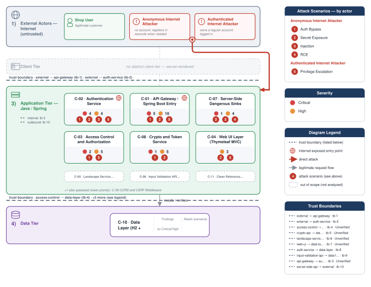

**Figure 2 - Risk Flow: Actor → Tier → Impact**

Heatmap: **actors** (left) → **architecture tiers** (middle, Client → Application → Data) → **impact** (right). Numbered red arrows ①–⑤ are the threats enumerated in the Top Threats table below.

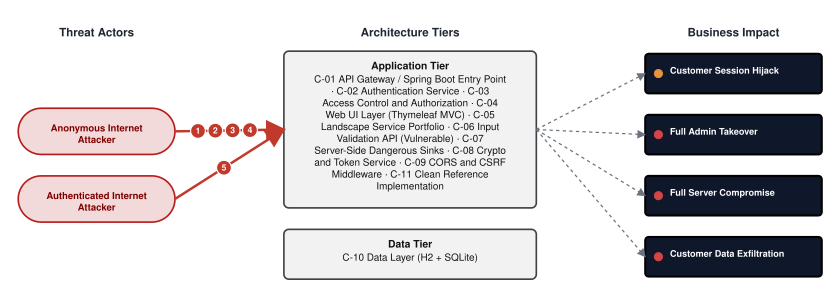

**Threat actors.** The actors below drive the numbered attack paths in the figures above.

- **Anonymous Internet Attacker** — no account; registers in seconds when needed; drives ① Hardcoded Secrets & Weak Cryptography, ② Sensitive File & Secret Exposure, ③ Insecure Query Construction & Data Access, ④ Remote Code Execution (unsafe eval).
- **Authenticated Internet Attacker** — owns a regular account; logged in; drives ⑤ Broken Authorization & Access Control.

**5 structural threats**, grouped by weakness class - each row is one threat, not one finding. *Threat Description* states the general architectural weakness (STRIDE in brackets); *Findings* lists the concrete instances, each linked to [§8 Findings Register](#8-findings-register) with its component; *Risk & Impact* combines severity with business consequence.

| # | Threat Description | Findings (→ Component) | Risk & Impact | Fix |
|---|------------------------------------|------------------------------------------------|------------------------------------|--------|
| <a id="path-auth-bypass"></a>① | **Hardcoded Secrets & Weak Cryptography** _(S·E)_<br/>Missing authentication guards and forgeable token mechanisms let unauthenticated callers gain administrative access or impersonate any user without providing valid credentials. | <span style="white-space:nowrap">🔴&nbsp;[F-004](#f-004)</span> - Hardcoded JWT signing key in container image ENV permits token forgery (`Dockerfile:13`) <span style="white-space:nowrap">→&nbsp;[C-01](#c-01)</span>&nbsp;API Gateway / Spring Boot Entry Point<br/><span style="white-space:nowrap">🔴&nbsp;[F-005](#f-005)</span> - Algorithm none JWT accepted via parseClaimsJwt (`LegacyJwtVerifier.java:17`) <span style="white-space:nowrap">→&nbsp;[C-02](#c-02)</span>&nbsp;Authentication Service<br/><span style="white-space:nowrap">🔴&nbsp;[F-010](#f-010)</span> - AWS/JWT/DB secrets hardcoded in Dockerfile ENV and baked into image layers (`Dockerfile:13`) <span style="white-space:nowrap">→&nbsp;[C-01](#c-01)</span>&nbsp;API Gateway / Spring Boot Entry Point<br/><span style="white-space:nowrap">🔴&nbsp;[F-011](#f-011)</span> - Unauthenticated User Promotion to Admin (`LegacyAdminBoardController.java:28`) <span style="white-space:nowrap">→&nbsp;[C-03](#c-03)</span>&nbsp;Access Control and Authorization<br/><span style="white-space:nowrap">🔴&nbsp;[F-013](#f-013)</span> - H2 web console accessible without authentication grants full database access (`SecurityConfig.java:32`) <span style="white-space:nowrap">→&nbsp;[C-01](#c-01)</span>&nbsp;API Gateway / Spring Boot Entry Point<br/><span style="white-space:nowrap">🔴&nbsp;[F-014](#f-014)</span> - Unauthenticated token issuance for arbitrary user ID (`AuthController.java:38`) <span style="white-space:nowrap">→&nbsp;[C-02](#c-02)</span>&nbsp;Authentication Service<br/><span style="white-space:nowrap">🔴&nbsp;[F-015](#f-015)</span> - Authorization via forgeable JWT role claim (`LegacyAdminAuditController.java:40`) <span style="white-space:nowrap">→&nbsp;[C-02](#c-02)</span>&nbsp;Authentication Service<br/><span style="white-space:nowrap">🔴&nbsp;[F-016](#f-016)</span> - Missing Authentication on Dangerous Sinks (`SecurityConfig.java:37`) <span style="white-space:nowrap">→&nbsp;[C-01](#c-01)</span>&nbsp;API Gateway / Spring Boot Entry Point<br/><span style="white-space:nowrap">🟠&nbsp;[F-020](#f-020)</span> - Missing auth on token issuance endpoint (`CustomCryptoController.java:27`) <span style="white-space:nowrap">→&nbsp;[C-08](#c-08)</span>&nbsp;Crypto and Token Service<br/><span style="white-space:nowrap">🟠&nbsp;[F-026](#f-026)</span> - Hand-rolled XOR / repeating-key cipher (`HomegrownCipher.java:14`) <span style="white-space:nowrap">→&nbsp;[C-08](#c-08)</span>&nbsp;Crypto and Token Service<br/><span style="white-space:nowrap">🔴&nbsp;[F-029](#f-029)</span> - Hardcoded XOR key permits offline token forgery (`HomegrownCipher.java:8`) <span style="white-space:nowrap">→&nbsp;[C-08](#c-08)</span>&nbsp;Crypto and Token Service<br/><span style="white-space:nowrap">🟠&nbsp;[F-033](#f-033)</span> - `MD5` used for password hashing in registration (`LegacyPasswordService.java:15`) <span style="white-space:nowrap">→&nbsp;[C-08](#c-08)</span>&nbsp;Crypto and Token Service<br/><span style="white-space:nowrap">🟠&nbsp;[F-047](#f-047)</span> - Predictable OTP via non-CSPRNG Random (`LegacyTokenService.java:10`) <span style="white-space:nowrap">→&nbsp;[C-08](#c-08)</span>&nbsp;Crypto and Token Service<br/><span style="white-space:nowrap">🟠&nbsp;[F-050](#f-050)</span> - AES/ECB mode allows ciphertext block manipulation (`LegacyCryptoService.java:17`) <span style="white-space:nowrap">→&nbsp;[C-08](#c-08)</span>&nbsp;Crypto and Token Service | 🔴 **Critical**<br/>Full Admin Takeover · Customer Session Hijack | <span style="white-space:nowrap">● [M-004](#m-004)</span> — Move cryptographic keys to a managed secret store<br/><span style="white-space:nowrap">● [M-005](#m-005)</span> — Enforce JWT signature and algorithm verification |
| <a id="path-sensitive-data-exposure"></a>② | **Sensitive File & Secret Exposure** _(I)_<br/>Production credentials, vault secrets, and user data are returned to unauthenticated callers through unprotected administrative paths and baked-in container configuration. | <span style="white-space:nowrap">🔴&nbsp;[F-001](#f-001)</span> - Missing Authentication on Sensitive Data Endpoints (`CustomCryptoController.java:41`) <span style="white-space:nowrap">→&nbsp;[C-08](#c-08)</span>&nbsp;Crypto and Token Service<br/><span style="white-space:nowrap">🔴&nbsp;[F-009](#f-009)</span> - Unauthenticated actuator `/env` exposes all config secrets in plaintext (`application.yml:36`) <span style="white-space:nowrap">→&nbsp;[C-01](#c-01)</span>&nbsp;API Gateway / Spring Boot Entry Point<br/><span style="white-space:nowrap">🔴&nbsp;[F-010](#f-010)</span> - AWS/JWT/DB secrets hardcoded in Dockerfile ENV and baked into image layers (`Dockerfile:13`) <span style="white-space:nowrap">→&nbsp;[C-01](#c-01)</span>&nbsp;API Gateway / Spring Boot Entry Point<br/><span style="white-space:nowrap">🟠&nbsp;[F-021](#f-021)</span> - Plaintext credential storage in SQLite (`LegacySqliteUserStore.java:31`) <span style="white-space:nowrap">→&nbsp;[C-02](#c-02)</span>&nbsp;Authentication Service<br/><span style="white-space:nowrap">🟠&nbsp;[F-030](#f-030)</span> - HTTP Basic credentials transmitted in cleartext over unencrypted HTTP (`SecurityConfig.java:61`) <span style="white-space:nowrap">→&nbsp;[C-01](#c-01)</span>&nbsp;API Gateway / Spring Boot Entry Point<br/><span style="white-space:nowrap">🟠&nbsp;[F-031](#f-031)</span> - Cleartext passwords in unauth user listing (`LegacySqliteAuthController.java:65`) <span style="white-space:nowrap">→&nbsp;[C-02](#c-02)</span>&nbsp;Authentication Service<br/><span style="white-space:nowrap">🟠&nbsp;[F-032](#f-032)</span> - Cleartext credentials logged per login (`CredentialLoggingFilter.java:25`) <span style="white-space:nowrap">→&nbsp;[C-02](#c-02)</span>&nbsp;Authentication Service<br/><span style="white-space:nowrap">🟠&nbsp;[F-037](#f-037)</span> - Path Traversal File Read (`FileReadController.java:19`) <span style="white-space:nowrap">→&nbsp;[C-07](#c-07)</span>&nbsp;Server-Side Dangerous Sinks<br/><span style="white-space:nowrap">🟠&nbsp;[F-039](#f-039)</span> - SSRF via Caller-Supplied URL (`IntegrationController.java:23`) <span style="white-space:nowrap">→&nbsp;[C-07](#c-07)</span>&nbsp;Server-Side Dangerous Sinks<br/><span style="white-space:nowrap">🟠&nbsp;[F-048](#f-048)</span> - Path traversal via upload filename (`BusinessFileStorage.java:23`) <span style="white-space:nowrap">→&nbsp;[C-04](#c-04)</span>&nbsp;Web UI Layer (Thymeleaf MVC) | 🔴 **Critical**<br/>Customer Data Exfiltration | <span style="white-space:nowrap">● [M-001](#m-001)</span> — Require authentication on every exposed endpoint<br/><span style="white-space:nowrap">● [M-009](#m-009)</span> — Stop exposing internal information to clients |
| <a id="path-injection"></a>③ | **Insecure Query Construction & Data Access** _(T·I)_<br/>Unsanitized user input concatenated into database queries in the authentication and search layers enables full data extraction and authentication bypass from unauthenticated requests. | <span style="white-space:nowrap">🔴&nbsp;[F-006](#f-006)</span> - SQL injection in authenticateRaw (`LegacySqliteUserStore.java:64`) <span style="white-space:nowrap">→&nbsp;[C-02](#c-02)</span>&nbsp;Authentication Service<br/><span style="white-space:nowrap">🔴&nbsp;[F-007](#f-007)</span> - SQL Injection (`OrderLookupDao.java:22`) <span style="white-space:nowrap">→&nbsp;[C-06](#c-06)</span>&nbsp;Input Validation API (Vulnerable)<br/><span style="white-space:nowrap">🔴&nbsp;[F-008](#f-008)</span> - OS Command Injection via sh -c (`ToolController.java:18`) <span style="white-space:nowrap">→&nbsp;[C-07](#c-07)</span>&nbsp;Server-Side Dangerous Sinks<br/><span style="white-space:nowrap">🟠&nbsp;[F-025](#f-025)</span> - Command injection Java (`LandscapeExposureSupport.java:48`) <span style="white-space:nowrap">→&nbsp;[C-05](#c-05)</span>&nbsp;Landscape Service Portfolio<br/><span style="white-space:nowrap">🟠&nbsp;[F-038](#f-038)</span> - XXE Enables Local File Read via External Entity (`XmlPreviewController.java:22`) <span style="white-space:nowrap">→&nbsp;[C-07](#c-07)</span>&nbsp;Server-Side Dangerous Sinks | 🔴 **Critical**<br/>Customer Data Exfiltration · Full Admin Takeover | <span style="white-space:nowrap">● [M-006](#m-006)</span> — Use parameterized database queries<br/><span style="white-space:nowrap">● [M-007](#m-007)</span> — Use parameterized database queries |
| <a id="path-remote-code-execution"></a>④ | **Remote Code Execution (unsafe eval)** _(E)_<br/>User-supplied values are passed unvalidated to system command execution in server-side tool handlers, giving any caller the ability to run arbitrary commands on the host. | <span style="white-space:nowrap">🔴&nbsp;[F-008](#f-008)</span> - OS Command Injection via sh -c (`ToolController.java:18`) <span style="white-space:nowrap">→&nbsp;[C-07](#c-07)</span>&nbsp;Server-Side Dangerous Sinks<br/><span style="white-space:nowrap">🟠&nbsp;[F-025](#f-025)</span> - Command injection Java (`LandscapeExposureSupport.java:48`) <span style="white-space:nowrap">→&nbsp;[C-05](#c-05)</span>&nbsp;Landscape Service Portfolio | 🔴 **Critical**<br/>Full Server Compromise | <span style="white-space:nowrap">● [M-008](#m-008)</span> — Replace shell-invocation exec with parameterized ProcessBuilder without shell i…<br/><span style="white-space:nowrap">◕ [M-025](#m-025)</span> — Avoid the shell; pass a fixed argv array with validated, allow-listed arguments |
| <a id="path-privilege-escalation"></a>⑤ | **Broken Authorization & Access Control** _(E·I)_<br/>Unguarded profile update paths and forgeable session tokens allow any authenticated user to overwrite their role or session identity to reach administrator level. | <span style="white-space:nowrap">🔴&nbsp;[F-012](#f-012)</span> - Self-Elevation via Admin Flag Mass Assignment (`ProfileController.java:47`) <span style="white-space:nowrap">→&nbsp;[C-03](#c-03)</span>&nbsp;Access Control and Authorization<br/><span style="white-space:nowrap">🔴&nbsp;[F-013](#f-013)</span> - H2 web console accessible without authentication grants full database access (`SecurityConfig.java:32`) <span style="white-space:nowrap">→&nbsp;[C-01](#c-01)</span>&nbsp;API Gateway / Spring Boot Entry Point<br/><span style="white-space:nowrap">🔴&nbsp;[F-014](#f-014)</span> - Unauthenticated token issuance for arbitrary user ID (`AuthController.java:38`) <span style="white-space:nowrap">→&nbsp;[C-02](#c-02)</span>&nbsp;Authentication Service<br/><span style="white-space:nowrap">🔴&nbsp;[F-015](#f-015)</span> - Authorization via forgeable JWT role claim (`LegacyAdminAuditController.java:40`) <span style="white-space:nowrap">→&nbsp;[C-02](#c-02)</span>&nbsp;Authentication Service<br/><span style="white-space:nowrap">🟠&nbsp;[F-019](#f-019)</span> - Integrity-free Base64 session token forgeable (`HomegrownSessionService.java:21`) <span style="white-space:nowrap">→&nbsp;[C-02](#c-02)</span>&nbsp;Authentication Service<br/><span style="white-space:nowrap">🔴&nbsp;[F-022](#f-022)</span> - Mass Assignment of Password Hash via PUT `/me` (`ProfileController.java:41`) <span style="white-space:nowrap">→&nbsp;[C-03](#c-03)</span>&nbsp;Access Control and Authorization<br/><span style="white-space:nowrap">🟠&nbsp;[F-040](#f-040)</span> - Insecure Direct Object Reference (`OrderManagementController.java:91`) <span style="white-space:nowrap">→&nbsp;[C-04](#c-04)</span>&nbsp;Web UI Layer (Thymeleaf MVC)<br/><span style="white-space:nowrap">🔴&nbsp;[F-044](#f-044)</span> - IDOR on Order Access Without Ownership Check (`OrderAccessController.java:23`) <span style="white-space:nowrap">→&nbsp;[C-03](#c-03)</span>&nbsp;Access Control and Authorization<br/><span style="white-space:nowrap">🔴&nbsp;[F-045](#f-045)</span> - SSRF-capable API endpoints accessible without authentication (`SecurityConfig.java:37`) <span style="white-space:nowrap">→&nbsp;[C-01](#c-01)</span>&nbsp;API Gateway / Spring Boot Entry Point<br/><span style="white-space:nowrap">🔴&nbsp;[F-046](#f-046)</span> - Legacy admin routes exposed without authentication (`SecurityConfig.java:41`) <span style="white-space:nowrap">→&nbsp;[C-01](#c-01)</span>&nbsp;API Gateway / Spring Boot Entry Point<br/><span style="white-space:nowrap">🟠&nbsp;[F-049](#f-049)</span> - Unverified password change (`ProfilePageController.java:61`) <span style="white-space:nowrap">→&nbsp;[C-04](#c-04)</span>&nbsp;Web UI Layer (Thymeleaf MVC) | 🔴 **Critical**<br/>Full Admin Takeover | <span style="white-space:nowrap">● [M-012](#m-012)</span> — Allowlist client-controlled fields<br/><span style="white-space:nowrap">● [M-013](#m-013)</span> — Enforce server-side authorization on every endpoint |

_STRIDE: S spoofing · T tampering · R repudiation · I information disclosure · D denial of service · E elevation of privilege. Risk, findings, components, impact and Fix are derived deterministically; only the one-line weakness description is authored._

**Verified attack chains.** 4 fully viable ([AC-T-002](#ac-t-002), [AC-T-003](#ac-t-003), [AC-T-004](#ac-t-004), [AC-T-006](#ac-t-006)); 1 partially blocked ([AC-T-005](#ac-t-005)). These chains combine individual findings into end-to-end exploitation paths verified step-by-step against the code - see [§9 Abuse Cases](#9-abuse-cases) for the per-step breakdown and blocking mitigations.

### Top Mitigations

Highest-impact P1/P2 mitigations - 22 of 48 qualifying (52 total). Full detail in [§10 Mitigation Register](#10-mitigation-register). All 22 mitigation(s) that fix a Critical finding are always listed here.

| # | Component | Mitigation | Addresses | Effort |
|---|----------------------|------------------------------------------------|------------------------------------------------|------|
| **1** | [C-01](#c-01) — API Gateway / Spring Boot Entry Point | ● [M-009](#m-009) — Stop exposing internal information to clients (`application.yml:36`) | 🔴 [F-009](#f-009) — Unauthenticated actuator `/env` exposes all config secrets in plaintext (`src/main/resources/application.yml`) | Low |
| **2** | [C-01](#c-01) — API Gateway / Spring Boot Entry Point | ● [M-013](#m-013) — Enforce server-side authorization on every endpoint (`SecurityConfig.java:32`) | 🔴 [F-013](#f-013) — H2 web console accessible without authentication grants full database access (`src/main/java/com/example/appsecverificationtarget/config/SecurityConfig.java`) | Low |
| **3** | [C-01](#c-01) — API Gateway / Spring Boot Entry Point | ● [M-016](#m-016) — Require authentication on every exposed endpoint (`SecurityConfig.java:37`) | 🔴 [F-016](#f-016) — Missing Authentication on Dangerous Sinks (`config/SecurityConfig.java`) | Low |
| **4** | [C-01](#c-01) — API Gateway / Spring Boot Entry Point | ● [M-004](#m-004) — Move cryptographic keys to a managed secret store (`Dockerfile:13`) | 🔴 [F-004](#f-004) — Hardcoded JWT signing key in container image ENV permits token forgery (Dockerfile) | Medium |
| **5** | [C-01](#c-01) — API Gateway / Spring Boot Entry Point | ● [M-010](#m-010) — Move secrets to a managed secret store (`Dockerfile:13`) | 🔴 [F-010](#f-010) — AWS/JWT/DB secrets hardcoded in Dockerfile ENV and baked into image layers (Dockerfile) | Medium |
| **6** | [C-02](#c-02) — Authentication Service | ● [M-005](#m-005) — Enforce JWT signature and algorithm verification (`LegacyJwtVerifier.java:17`) | 🔴 [F-005](#f-005) — Algorithm none JWT accepted via parseClaimsJwt (`LegacyJwtVerifier.java`) | Low |
| **7** | [C-02](#c-02) — Authentication Service | ● [M-006](#m-006) — Use parameterized database queries (`LegacySqliteUserStore.java:64`) | 🔴 [F-006](#f-006) — SQL injection in authenticateRaw (`LegacySqliteUserStore.java`) | Low |
| **8** | [C-02](#c-02) — Authentication Service | ● [M-014](#m-014) — Enforce server-side authorization on every endpoint (`AuthController.java:38`) | 🔴 [F-014](#f-014) — Unauthenticated token issuance for arbitrary user ID (`AuthController.java`) | Low |
| **9** | [C-02](#c-02) — Authentication Service | ● [M-015](#m-015) — Enforce correct server-side authorization (`LegacyAdminAuditController.java:40`) | 🔴 [F-015](#f-015) — Authorization via forgeable JWT role claim (`LegacyAdminAuditController.java`) | Medium |
| **10** | [C-03](#c-03) — Access Control and Authorization | ● [M-011](#m-011) — Require authentication on every exposed endpoint (`LegacyAdminBoardController.java:28`) | 🔴 [F-011](#f-011) — Unauthenticated User Promotion to Admin (`LegacyAdminBoardController.java`) | Low |
| **11** | [C-03](#c-03) — Access Control and Authorization | ● [M-012](#m-012) — Allowlist client-controlled fields (`ProfileController.java:47`) | 🔴 [F-012](#f-012) — Self-Elevation via Admin Flag Mass Assignment (`ProfileController.java`) | Low |
| **12** | [C-06](#c-06) — Input Validation API (Vulnerable) | ● [M-007](#m-007) — Use parameterized database queries (`OrderLookupDao.java:22`) | 🔴 [F-007](#f-007) — SQL Injection (`src/main/java/com/example/appsecverificationtarget/inputvalidation/OrderLookupDao.java`) | Low |
| **13** | [C-07](#c-07) — Server-Side Dangerous Sinks | ● [M-008](#m-008) — Replace shell-invocation exec with parameterized ProcessBuilder without shell i… (`ToolController.java:18`) | 🔴 [F-008](#f-008) — OS Command Injection via sh -c (`serverside/ToolController.java`) | Low |
| **14** | [C-08](#c-08) — Crypto and Token Service | ● [M-001](#m-001) — Require authentication on every exposed endpoint (`CustomCryptoController.java:41`) | 🔴 [F-001](#f-001) — Missing Authentication on Sensitive Data Endpoints (`src/main/java/com/example/appsecverificationtarget/crypto/CustomCryptoController.java`) | Low |
| **15** | [C-01](#c-01) — API Gateway / Spring Boot Entry Point | ◕ [M-044](#m-044) — Enforce server-side authorization on every endpoint (`SecurityConfig.java:37`) | 🔴 [F-045](#f-045) — SSRF-capable API endpoints accessible without authentication (`src/main/java/com/example/appsecverificationtarget/config/SecurityConfig.java`) | Low |
| **16** | [C-01](#c-01) — API Gateway / Spring Boot Entry Point | ◕ [M-045](#m-045) — Enforce server-side authorization on every endpoint (`SecurityConfig.java:41`) | 🔴 [F-046](#f-046) — Legacy admin routes exposed without authentication (`SecurityConfig.java`) | Low |
| **17** | [C-01](#c-01) — API Gateway / Spring Boot Entry Point | ◕ [M-018](#m-018) — Replace InMemoryUserDetailsManager with externally-provisioned credentials load… (`SecurityConfig.java:71`) | 🔴 [F-018](#f-018) — Hardcoded uniform 'password' credential for all demo accounts (`src/main/java/com/example/appsecverificationtarget/config/SecurityConfig.java`) | Medium |
| **18** | [C-03](#c-03) — Access Control and Authorization | ◕ [M-017](#m-017) — Replace hardcoded credential with CSPRNG one-time activation token (`AdminUserController.java:25`) | 🔴 [F-017](#f-017) — Hardcoded Credential Stored as Password Hash (`AdminUserController.java`) | Low |
| **19** | [C-03](#c-03) — Access Control and Authorization | ◕ [M-022](#m-022) — Allowlist client-controlled fields (`ProfileController.java:41`) | 🔴 [F-022](#f-022) — Mass Assignment of Password Hash via PUT /me (`ProfileController.java`) | Low |
| **20** | [C-03](#c-03) — Access Control and Authorization | ◕ [M-043](#m-043) — Enforce object-level (ownership) authorization (`OrderAccessController.java:23`) | 🔴 [F-044](#f-044) — IDOR on Order Access Without Ownership Check (`OrderAccessController.java`) | Low |
| **21** | [C-08](#c-08) — Crypto and Token Service | ◕ [M-028](#m-028) — Move cryptographic keys to a managed secret store (`HomegrownCipher.java:8`) | 🔴 [F-029](#f-029) — Hardcoded XOR key permits offline token forgery (`HomegrownCipher.java`) | Medium |
| **22** | [C-09](#c-09) — CORS and CSRF Middleware | ◕ [M-035](#m-035) — Restrict CORS to trusted origins (`CorsPolicyFilter.java:32`) | 🔴 [F-036](#f-036) — Wildcard CORS origin reflection with credentials (`CorsPolicyFilter.java`) | Low |

*26 additional P1/P2 mitigations capped from the leader-board · 4 P3 backlog items in [§10 Mitigation Register](#10-mitigation-register). Sorted by priority (P1 first), then component, then leverage (most findings first), severity (Critical first), and effort (Low first).*

### Operational Strengths

Operational controls rated Adequate or Partial - grouped into broad clusters (full per-control breakdown in [§6](#6-security-architecture)). Clusters demoted to Weak by open Critical/High findings appear in [§6](#6-security-architecture) instead, not here.

<table style="table-layout:fixed;width:100%">
<colgroup><col width="20%" style="width:20%"><col width="33%" style="width:33%"><col width="47%" style="width:47%"></colgroup>
<thead><tr><th>Strength</th><th>What's in Place</th><th>Effectiveness</th></tr></thead>
<tbody>
<tr><td style="overflow-wrap:break-word"><strong>Container &amp; Supply-Chain Hardening</strong></td><td style="overflow-wrap:break-word"><em>Build-time and runtime hardening - minimal base image, non-root execution, dependency inventory.</em><br/>Lockfile hygiene</td><td style="overflow-wrap:break-word">✅ Adequate</td></tr>
</tbody>
</table>


**Bottom line:** These controls narrow specific attack surfaces but none eliminates a Critical finding on its own.

---

<a id="critical-attack-chain"></a><a id="critical-attack-tree"></a>
## Critical Attack Tree

The root is the worst-case attacker goal; below it, each capability branch groups the Critical findings that achieve it. Branches feed the goal by OR - any single path suffices.

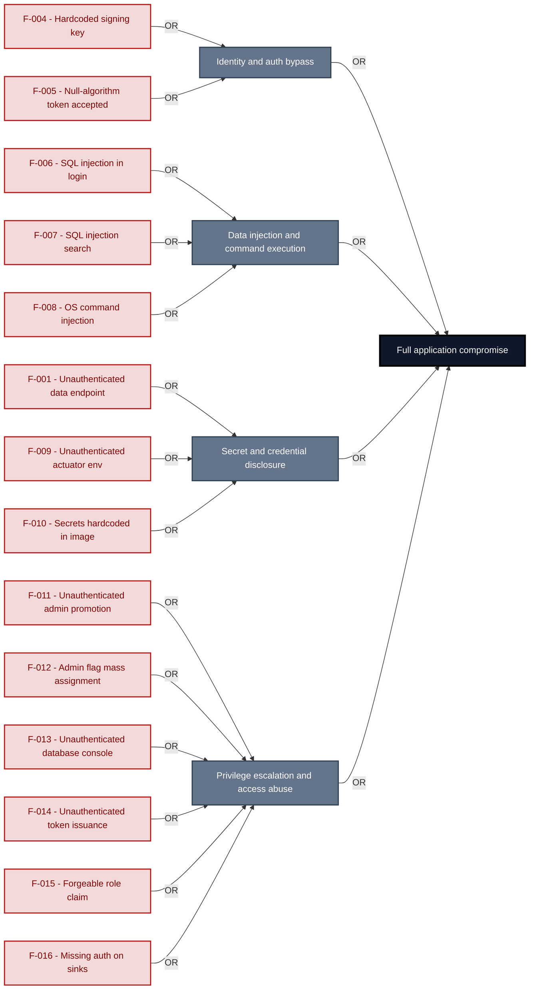

**Findings** (full detail in [§8 Findings Register](#8-findings-register)): [F-004](#f-004) · [F-005](#f-005) · [F-006](#f-006) · [F-007](#f-007) · [F-008](#f-008) · [F-001](#f-001) · [F-009](#f-009) · [F-010](#f-010) · [F-011](#f-011) · [F-012](#f-012) · [F-013](#f-013) · [F-014](#f-014) · [F-015](#f-015) · [F-016](#f-016)

---

## 1. System Overview

**Repository:** git@github\.com:matthiasrohr/insecure-large-spring-`app.git`

### Scope

insecure-large-spring-app comprises **11** modeled components. This threat model applied full STRIDE threat analysis to **8 of 11** - the components on the externally-reachable, authentication-bearing, and business-critical surface: **API Gateway / Spring Boot Entry Point**, **Authentication Service**, **Access Control and Authorization**, **Web UI Layer (Thymeleaf MVC)**, **Server-Side Dangerous Sinks**, **Crypto and Token Service**, **CORS and CSRF Middleware**, **Data Layer (H2 + SQLite)**. Selection criteria: internet-exposed; crown-jewel; auth.

The remaining **3** component(s) were **not individually analyzed** at this assessment depth (lower-priority / internal surface): Landscape Service Portfolio, Input Validation API (Vulnerable), Clean Reference Implementation. Re-run at a higher `--assessment-depth` to extend STRIDE coverage to them.

**Out of scope:** third-party hosted dependencies, browser runtime, operating-system kernel, and the underlying network infrastructure.

**Basis:** a code-derived threat model at implementation level, built from source, configuration and git history. It describes the system as built, not as designed.

---

### Trust Boundaries

Canonical boundary crossings. **Assumption & verdict** names the condition that makes each crossing safe and whether this report still supports it, judged one condition at a time - which conditions apply follows from the direction of the crossing.

<table style="table-layout:fixed;width:100%">
<colgroup><col width="6%" style="width:6%"><col width="25%" style="width:25%"><col width="11%" style="width:11%"><col width="15%" style="width:15%"><col width="25%" style="width:25%"><col width="18%" style="width:18%"></colgroup>
<thead><tr><th>ID</th><th>Boundary / crossing</th><th>Exposure</th><th>Kind</th><th>Assumption &amp; verdict</th><th>Linked findings</th></tr></thead>
<tbody>
<tr><td style="white-space:nowrap"><a id="tb-1"></a>tb-1</td><td style="overflow-wrap:break-word"><strong>external → api-gateway</strong><br/>Control: Spring Security SecurityFilterChain · Also covers: server-side-api</td><td>🌐 <strong>External</strong></td><td style="overflow-wrap:break-word">network</td><td style="overflow-wrap:break-word">Every request to a protected resource requires an authenticated session or token before the controller method executes.<br/><em>confirmed</em><br/>Validation: in doubt · 6 related · <a href="#66-input-boundary-validation-controls">§6.6</a><br/>Authentication: <strong>broken</strong> · 2 related · <a href="#62-identity-and-authentication-controls">§6.2</a><br/>Authorization: in doubt · 2 related · <a href="#64-authorization-controls">§6.4</a></td><td style="overflow-wrap:break-word"><em>Authentication</em><br/>🔴 <a href="#f-004">F-004</a><br/>🔴 <a href="#f-013">F-013</a><br/>🔴 <a href="#f-016">F-016</a><br/>🔴 <a href="#f-018">F-018</a></td></tr>
<tr><td style="white-space:nowrap"><a id="tb-2"></a>tb-2</td><td style="overflow-wrap:break-word"><strong>external → auth-service</strong><br/>Control: Spring Security form-login and HTTP-basic handlers</td><td>🌐 <strong>External</strong></td><td style="overflow-wrap:break-word">network · identity</td><td style="overflow-wrap:break-word">A session or token is issued only after the submitted credential is verified against the registered user store.<br/><em>confirmed</em><br/>Validation: in doubt · 1 related · <a href="#66-input-boundary-validation-controls">§6.6</a><br/>Authentication: <strong>broken</strong> · <a href="#62-identity-and-authentication-controls">§6.2</a><br/>Authorization: <strong>broken</strong> · 1 related · <a href="#64-authorization-controls">§6.4</a></td><td style="overflow-wrap:break-word"><em>Authentication</em><br/>🔴 <a href="#f-014">F-014</a><br/><em>Authorization</em><br/>🔴 <a href="#f-005">F-005</a></td></tr>
<tr><td style="white-space:nowrap"><a id="tb-3"></a>tb-3</td><td style="overflow-wrap:break-word"><strong>api-gateway → auth-service</strong><br/>Control: Spring Security UserDetailsService</td><td>◐ <strong>Unverified</strong></td><td style="overflow-wrap:break-word">in-process - enforcement interface, no trust transition</td><td style="overflow-wrap:break-word">The authentication provider delegates credential verification to a registered UserDetailsService and does not short-circuit the check.<br/><em>inferred</em><br/>Authentication: in doubt · 1 related · <a href="#62-identity-and-authentication-controls">§6.2</a></td><td style="overflow-wrap:break-word">-</td></tr>
<tr><td style="white-space:nowrap"><a id="tb-4"></a>tb-4</td><td style="overflow-wrap:break-word"><strong>access-control → data-layer</strong><br/>Control: JPA UserRepository and OrderRepository</td><td>◐ <strong>Unverified</strong></td><td style="overflow-wrap:break-word">in-process - enforcement interface, no trust transition</td><td style="overflow-wrap:break-word">Every ownership check uses a parameterized JPA query so that user-supplied identifiers cannot alter the WHERE predicate.<br/><em>inferred</em><br/><em>No finding contradicts it.</em></td><td style="overflow-wrap:break-word">-</td></tr>
<tr><td style="white-space:nowrap"><a id="tb-5"></a>tb-5</td><td style="overflow-wrap:break-word"><strong>crypto-api → data-layer</strong><br/>Control: JPA VaultCredentialRepository</td><td>◐ <strong>Unverified</strong></td><td style="overflow-wrap:break-word">in-process - enforcement interface, no trust transition</td><td style="overflow-wrap:break-word">All vault credential reads and writes use JPA repository methods so that no caller-supplied string alters the SQL predicate.<br/><em>inferred</em><br/><em>No finding contradicts it.</em></td><td style="overflow-wrap:break-word">-</td></tr>
<tr><td style="white-space:nowrap"><a id="tb-6"></a>tb-6</td><td style="overflow-wrap:break-word"><strong>landscape-service → data-layer</strong><br/>Control: JPA LandscapePersistence</td><td>◐ <strong>Unverified</strong></td><td style="overflow-wrap:break-word">in-process - enforcement interface, no trust transition</td><td style="overflow-wrap:break-word">All landscape data reads and writes use JPA parameterized persistence methods so that no caller-supplied string alters the SQL.<br/><em>inferred</em><br/><em>No finding contradicts it.</em></td><td style="overflow-wrap:break-word">-</td></tr>
<tr><td style="white-space:nowrap"><a id="tb-7"></a>tb-7</td><td style="overflow-wrap:break-word"><strong>web-ui → data-layer</strong><br/>Control: JPA DocumentRepository and OrderRepository</td><td>◐ <strong>Unverified</strong></td><td style="overflow-wrap:break-word">in-process - enforcement interface, no trust transition</td><td style="overflow-wrap:break-word">All document and order reads and writes use JPA repository methods so that no controller input alters the SQL predicate.<br/><em>inferred</em><br/><em>No finding contradicts it.</em></td><td style="overflow-wrap:break-word">-</td></tr>
<tr><td style="white-space:nowrap"><a id="tb-8"></a>tb-8</td><td style="overflow-wrap:break-word"><strong>auth-service → data-layer</strong><br/>Control: JDBC PreparedStatement</td><td>🔒 <strong>Internal</strong></td><td style="overflow-wrap:break-word">in-process - enforcement interface, no trust transition</td><td style="overflow-wrap:break-word">All credential lookups use PreparedStatement parameter binding; the authenticateRaw path uses raw SQL concatenation and must not accept untrusted input.<br/><em>confirmed</em><br/>Query construction: <strong>broken</strong> · <a href="#65-query-construction-and-data-access-controls">§6.5</a></td><td style="overflow-wrap:break-word"><em>Query construction</em><br/>🔴 <a href="#f-006">F-006</a></td></tr>
<tr><td style="white-space:nowrap"><a id="tb-9"></a>tb-9</td><td style="overflow-wrap:break-word"><strong>input-validation-api → data-layer</strong><br/>Control: EntityManager.createNativeQuery</td><td>🔒 <strong>Internal</strong></td><td style="overflow-wrap:break-word">in-process - enforcement interface, no trust transition</td><td style="overflow-wrap:break-word">Every native query parameter is bound through the JPA parameter API, not concatenated directly into the SQL string.<br/><em>confirmed</em><br/><em>No finding contradicts it.</em></td><td style="overflow-wrap:break-word">-</td></tr>
<tr><td style="white-space:nowrap"><a id="tb-10"></a>tb-10</td><td style="overflow-wrap:break-word"><strong>server-side-api → external</strong><br/>Control: none identified</td><td>↗ <strong>Egress</strong></td><td style="overflow-wrap:break-word">network · operator</td><td style="overflow-wrap:break-word">Nothing attacker-controlled reaches an external host; outbound targets are restricted to an allow-listed set of destinations.<br/><em>confirmed</em><br/>Egress content: <em>not examined</em><br/>Egress destination: <strong>broken</strong> · <a href="#610-file-parser-and-outbound-request-controls">§6.10</a><br/>Response trust: <em>not examined</em></td><td style="overflow-wrap:break-word"><em>Egress destination</em><br/>🟠 <a href="#f-039">F-039</a></td></tr>
</tbody>
</table>

_Exposure, most exposed first: ⚠ Review (endpoints unresolved) · 🌐 External (reached from outside the model) · ◐ Unverified (crossing not confirmed) · 🔒 Internal (both ends modelled) · ↗ Egress (reaches outside the model)._

_Kind - the crossing mechanism (build pipeline, in-process, network), then after `·` what changes across it: data-origin, identity, operator, privilege, tenant. Shown alone, nothing changes._

_Conditions - **inbound**: validation, authentication, authorization · **outbound**: egress content, egress destination, response trust (replies are untrusted input) · **internal**: query construction (data never becomes program text), authentication, authorization._

_Verdict per condition - **broken**: a linked finding proves the gap · in doubt: related findings, none linked here · not examined: nothing bears on it. `N related` counts further findings on the same condition. Linked findings sit under the condition they break, or under _Unattributed_. A link raises effective severity only at a confirmed internet ingress; raw risk never changes._

_Identical on every row, so stated once here instead of in a column: source `detected` (derived from inspected repository evidence); status `resolved`. Any row that deviates is shown in the table._

---

## 2. Architecture Diagrams

### 2.1 System Context

Who interacts with insecure-large-spring-app from the outside, and through which channels. Solid arrows show normal usage; dashed red arrows mark unauthenticated probing or exploit paths (C4 Level 1).

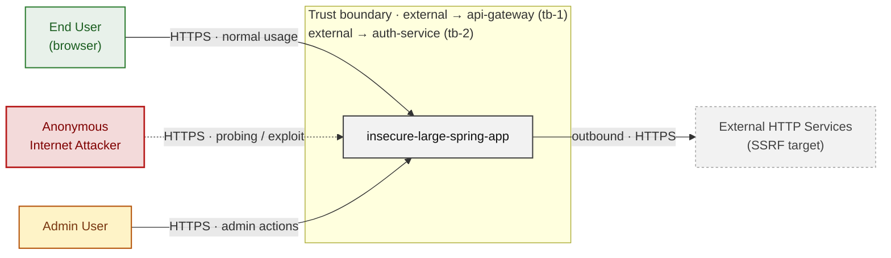

*Trust boundaries not named above: api-gateway → auth-service (tb-3), server-side-api → external (tb-10), access-control → data-layer (tb-4), auth-service → data-layer (tb-8), +4 more - every boundary is listed in [§1 Trust Boundaries](#trust-boundaries).*

**Key takeaway:** Every actor in the context interacts with insecure-large-spring-app through its external interface, so authentication and input validation at that edge govern the entire attack surface.

### 2.2 Container Architecture

How the system decomposes into deployable units. Each box is a separate runtime process or service container; arrows show synchronous request paths between them. Components with ≥3 Critical findings carry a red border, ≥2 High amber (C4 Level 2).

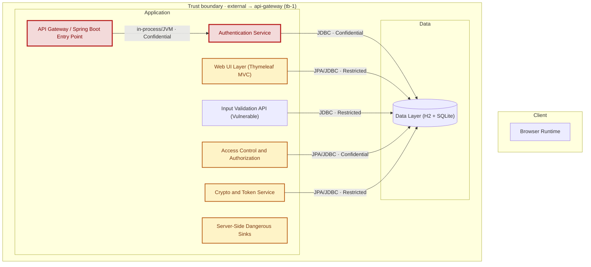

*Not shown (diagram capped at 8 containers): Clean Reference Implementation, Landscape Service Portfolio, CORS and CSRF Middleware - every component is inventoried in [§2.3 Components](#23-components).*

*Trust boundaries not drawn above: access-control → data-layer (tb-4), auth-service → data-layer (tb-8), crypto-api → data-layer (tb-5), input-validation-api → data-layer (tb-9), +4 more - every boundary is listed in [§1 Trust Boundaries](#trust-boundaries).*

**Key takeaway:** The system decomposes into 0 client, 10 application and 1 data unit(s); API Gateway / Spring Boot Entry Point carries the most Critical findings (5) and bounds the worst-case blast radius.

### 2.3 Components

Who reaches each component, and through which trust zone. Browser code runs on the user's device, so the client column is part of the untrusted zone, not a zone of its own - trust changes only where traffic enters the Application tier. Solid green arrows show legitimate data flow, dashed red arrows mark intrusion vectors. The component table directly below holds source paths and linked threats per `C-NN`; per-finding evidence is in [§8 Findings Register](#8-findings-register).

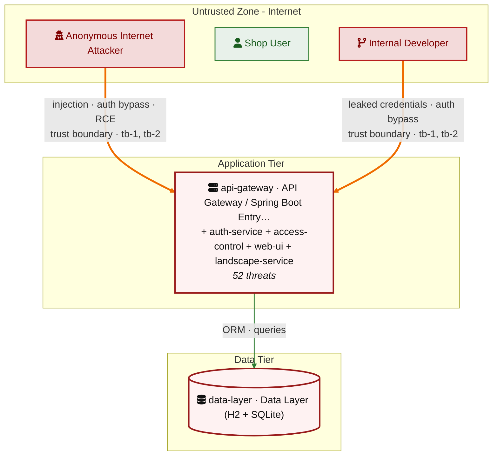

*Also folded into the tier nodes above, unnamed there for space: Input Validation API (Vulnerable) (`input-validation-api`), Server-Side Dangerous Sinks (`server-side-api`), Crypto and Token Service (`crypto-api`), CORS and CSRF Middleware (`cors-csrf-middleware`), Clean Reference Implementation (`clean-api`) - every component is in the table below.*

*Trust boundaries crossed by the `==>` edges above: external → api-gateway (tb-1), external → auth-service (tb-2) - every boundary is listed in [§1 Trust Boundaries](#trust-boundaries).*

**Key takeaway:** API Gateway / Spring Boot Entry Point concentrates the most findings (16 of 52 across all components); the table below maps each component to its source paths and linked threats.

| ID | Name | Type | Key Paths | Linked Threats | Scope |
|----|----------------------|-----------|----------------------------------------|------------------------------------------------|------------|
| <a id="c-01"></a><a id="api-gateway"></a><span style="white-space:nowrap">C-01</span> | API Gateway / Spring Boot Entry Point | application | `src/main/java/com/example/appsecverificationtarget/AppsecVerificationTargetApplication.java`<br/>`src/main/java/com/example/appsecverificationtarget/config/*.java`<br/>`src/main/resources/application.yml`<br/>`Dockerfile`<br/>`docker-compose.yml` | 🔴 [F-004](#f-004) — Hardcoded JWT signing key in container image ENV permits token forgery (`Dockerfile:13`)<br/>🔴 [F-009](#f-009) — Unauthenticated actuator `/env` exposes all config secrets in plaintext (`application.yml:36`)<br/>🔴 [F-010](#f-010) — AWS/JWT/DB secrets hardcoded in Dockerfile ENV and baked into image layers (`Dockerfile:13`)<br/>🔴 [F-013](#f-013) — H2 web console accessible without authentication grants full database access (`SecurityConfig.java:32`)<br/>🔴 [F-016](#f-016) — Missing Authentication on Dangerous Sinks (`SecurityConfig.java:37`)<br/>🔴 [F-018](#f-018) — Hardcoded uniform 'password' credential for all demo accounts (`SecurityConfig.java:71`)<br/>🔴 [F-045](#f-045) — SSRF-capable API endpoints accessible without authentication (`SecurityConfig.java:37`)<br/>🔴 [F-046](#f-046) — Legacy admin routes exposed without authentication (`SecurityConfig.java:41`)<br/>🟠 [F-002](#f-002) — CSRF protection globally disabled (`SecurityConfig.java:28`)<br/>🟠 [F-023](#f-023) — CSRF protection globally disabled across all state-changing endpoints (`SecurityConfig.java:28`)<br/>🟠 [F-024](#f-024) — Remote build script fetched without integrity verification (`Dockerfile:21`) (`Dockerfile:21`)<br/>🟠 [F-030](#f-030) — HTTP Basic credentials transmitted in cleartext over unencrypted HTTP (`SecurityConfig.java:61`)<br/>🟠 [F-034](#f-034) — Dockerfile base image must be digest-pinned (`Dockerfile:1`)<br/>🟠 [F-035](#f-035) — `Package-lock.json` present and committed (`package-lock.json:0`)<br/>🟠 [F-042](#f-042) — No rate limiting on authentication endpoints enables credential brute-force (`SecurityConfig.java:31`)<br/>🟡 [F-052](#f-052) — Dockerfile USER directive (non-root) (`Dockerfile:1`) | Analyzed |
| <a id="c-02"></a><a id="auth-service"></a><span style="white-space:nowrap">C-02</span> | Authentication Service | application | `src/main/java/com/example/appsecverificationtarget/authentication/*.java` | 🔴 [F-005](#f-005) — Algorithm none JWT accepted via parseClaimsJwt (`LegacyJwtVerifier.java:17`)<br/>🔴 [F-006](#f-006) — SQL injection in authenticateRaw (`LegacySqliteUserStore.java:64`)<br/>🔴 [F-014](#f-014) — Unauthenticated token issuance for arbitrary user ID (`AuthController.java:38`)<br/>🔴 [F-015](#f-015) — Authorization via forgeable JWT role claim (`LegacyAdminAuditController.java:40`)<br/>🟠 [F-019](#f-019) — Integrity-free Base64 session token forgeable (`HomegrownSessionService.java:21`)<br/>🟠 [F-021](#f-021) — Plaintext credential storage in SQLite (`LegacySqliteUserStore.java:31`)<br/>🟠 [F-031](#f-031) — Cleartext passwords in unauth user listing (`LegacySqliteAuthController.java:65`)<br/>🟠 [F-032](#f-032) — Cleartext credentials logged per login (`CredentialLoggingFilter.java:25`) | Analyzed |
| <a id="c-03"></a><a id="access-control"></a><span style="white-space:nowrap">C-03</span> | Access Control and Authorization | application | `src/main/java/com/example/appsecverificationtarget/accesscontrol/*.java`<br/>`src/main/java/com/example/appsecverificationtarget/legacyadmin/*.java` | 🔴 [F-011](#f-011) — Unauthenticated User Promotion to Admin (`LegacyAdminBoardController.java:28`)<br/>🔴 [F-012](#f-012) — Self-Elevation via Admin Flag Mass Assignment (`ProfileController.java:47`)<br/>🔴 [F-017](#f-017) — Hardcoded Credential Stored as Password Hash (`AdminUserController.java:25`)<br/>🔴 [F-022](#f-022) — Mass Assignment of Password Hash via PUT /me (`ProfileController.java:41`)<br/>🔴 [F-044](#f-044) — IDOR on Order Access Without Ownership Check (`OrderAccessController.java:23`)<br/>🟠 [F-003](#f-003) — Missing Security Audit Logging Across Components (`LegacyAdminBoardController.java:29`)<br/>🟠 [F-041](#f-041) — Unbounded findAll Without Authentication (`LegacyAdminBoardController.java:24`) | Analyzed |
| <a id="c-04"></a><a id="web-ui"></a><span style="white-space:nowrap">C-04</span> | Web UI Layer (Thymeleaf MVC) | application | `src/main/java/com/example/appsecverificationtarget/web/*.java`<br/>`src/main/resources/templates/**`<br/>`src/main/resources/static/**` | 🟠 [F-040](#f-040) — Insecure Direct Object Reference (`OrderManagementController.java:91`)<br/>🟠 [F-048](#f-048) — Path traversal via upload filename (`BusinessFileStorage.java:23`)<br/>🟠 [F-049](#f-049) — Unverified password change (`ProfilePageController.java:61`)<br/>🟡 [F-053](#f-053) — Unbounded file upload size (`BusinessFileStorage.java:13`) | Analyzed |
| <a id="c-05"></a><a id="landscape-service"></a><span style="white-space:nowrap">C-05</span> | Landscape Service Portfolio | application | `src/main/java/com/example/appsecverificationtarget/landscape/**/*.java` | 🟠 [F-025](#f-025) — Command injection Java (`LandscapeExposureSupport.java:48`) | Out of scope |
| <a id="c-06"></a><a id="input-validation-api"></a><span style="white-space:nowrap">C-06</span> | Input Validation API (Vulnerable) | application | `src/main/java/com/example/appsecverificationtarget/inputvalidation/*.java`<br/>`src/main/java/com/example/appsecverificationtarget/projectsearch/*.java` | 🔴 [F-007](#f-007) — SQL Injection (`OrderLookupDao.java:22`) | Out of scope |
| <a id="c-07"></a><a id="server-side-api"></a><span style="white-space:nowrap">C-07</span> | Server-Side Dangerous Sinks | application | `src/main/java/com/example/appsecverificationtarget/serverside/*.java`<br/>`src/main/java/com/example/appsecverificationtarget/outputhandling/*.java` | 🔴 [F-008](#f-008) — OS Command Injection via sh -c (`ToolController.java:18`)<br/>🟠 [F-037](#f-037) — Path Traversal File Read (`FileReadController.java:19`)<br/>🟠 [F-038](#f-038) — XXE Enables Local File Read via External Entity (`XmlPreviewController.java:22`)<br/>🟠 [F-039](#f-039) — SSRF via Caller-Supplied URL (`IntegrationController.java:23`)<br/>🟠 [F-043](#f-043) — XXE Entity Expansion DoS (`XmlPreviewController.java:22`)<br/>🟡 [F-051](#f-051) — Output Injection via Unencoded User Content (`OutputPreviewService.java:11`) | Analyzed |
| <a id="c-08"></a><a id="crypto-api"></a><span style="white-space:nowrap">C-08</span> | Crypto and Token Service | application | `src/main/java/com/example/appsecverificationtarget/crypto/*.java` | 🔴 [F-001](#f-001) — Missing Authentication on Sensitive Data Endpoints (`CustomCryptoController.java:41`)<br/>🔴 [F-029](#f-029) — Hardcoded XOR key permits offline token forgery (`HomegrownCipher.java:8`)<br/>🟠 [F-020](#f-020) — Missing auth on token issuance endpoint (`CustomCryptoController.java:27`)<br/>🟠 [F-026](#f-026) — Hand-rolled XOR / repeating-key cipher (`HomegrownCipher.java:14`)<br/>🟠 [F-033](#f-033) — MD5 used for password hashing in registration (`LegacyPasswordService.java:15`)<br/>🟠 [F-047](#f-047) — Predictable OTP via non-CSPRNG Random (`LegacyTokenService.java:10`)<br/>🟠 [F-050](#f-050) — AES/ECB mode allows ciphertext block manipulation (`LegacyCryptoService.java:17`) | Analyzed |
| <a id="c-09"></a><a id="cors-csrf-middleware"></a><span style="white-space:nowrap">C-09</span> | CORS and CSRF Middleware | application | `src/main/java/com/example/appsecverificationtarget/cors/*.java`<br/>`src/main/java/com/example/appsecverificationtarget/csrf/*.java` | 🔴 [F-036](#f-036) — Wildcard CORS origin reflection with credentials (`CorsPolicyFilter.java:32`)<br/>🟠 [F-028](#f-028) — CSRF token not validated against session (`CsrfSettingsController.java:47`) | Analyzed |
| <a id="c-10"></a><a id="data-layer"></a><span style="white-space:nowrap">C-10</span> | Data Layer (H2 + SQLite) | data | `src/main/java/com/example/appsecverificationtarget/domain/*.java` | - | Analyzed |
| <a id="c-11"></a><a id="clean-api"></a><span style="white-space:nowrap">C-11</span> | Clean Reference Implementation | application | `src/main/java/com/example/appsecverificationtarget/clean/*.java` | - | Out of scope |

### 2.4 Technology Architecture

The technology stack the system is built on. Each box names the framework or runtime that fills that role; per-component findings live in the [§2.3](#23-components) component table above, and the full per-finding catalogue is in [§8 Findings Register](#8-findings-register).

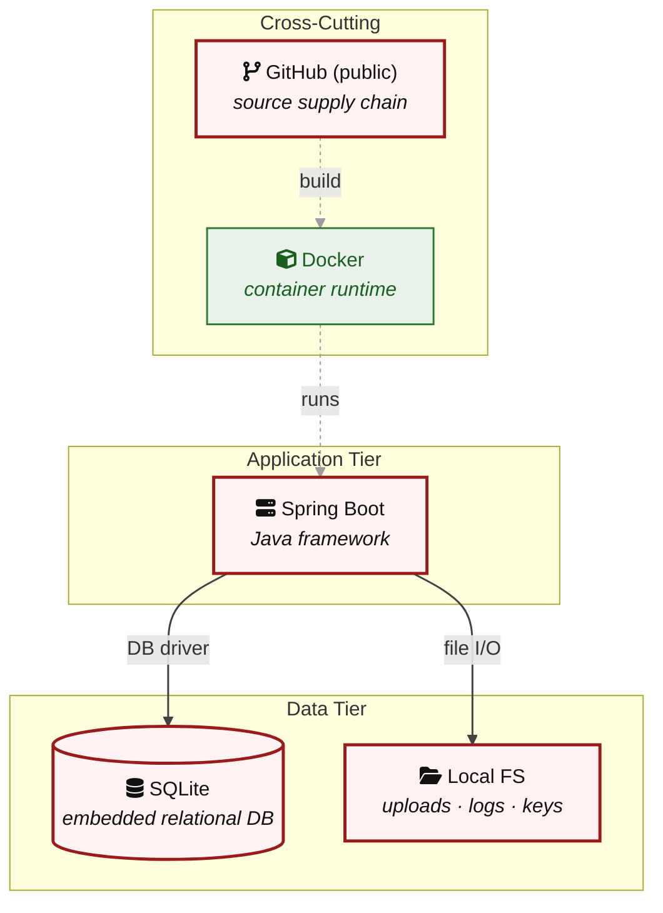

**Key takeaway:** The stack spans 1 data-tier store(s) behind the application tier; injection and data-at-rest exposure track the data tier, detailed per finding in [§8 Findings Register](#8-findings-register).

> **Legend:** `-->` synchronous request/response (REST, HTTPS, gRPC) · `==>` crosses an untrusted trust boundary (security-critical) · **red border** ≥ 3 Critical threats on the component · **amber border** ≥ 2 High threats

---

## 3. Attack Walkthroughs

This section walks through how the **8 highest-priority of 22 Critical findings** are exploited - selected by severity, chain relevance, and threat-category diversity, with Access Control and LLM Abuse represented when present. Each walkthrough has attack steps, a focused sequence diagram, and the primary mitigation. How weaknesses combine toward the worst-case goal is in the [Critical Attack Tree](#critical-attack-tree); every other Critical, plus full per-finding context (severity rationale, assets, detection signals), is in the [§8 Findings Register](#8-findings-register).

### 3.1 Algorithm none JWT accepted in Authentication Service

**Source:** 🔴 [F-005](#f-005) — `src/main/java/com/example/appsecverificationtarget/authentication/LegacyJwtVerifier.java:17`

Severity **Critical** ([CWE-347](https://cwe.mitre.org/data/definitions/347.html)). STRIDE: Spoofing. See [§8 F-005](#f-005) for the full register row.

**Attack Steps**

1. Attacker constructs a JWT with header {`alg:none`} and body {sub:attacker,role:ADMIN}, base64url-encodes each part, appends an empty signature segment, and joins them with dots.
2. Attacker sends GET `/api/legacy-admin/audit?token=`<`forged_jwt`> to the publicly reachable endpoint (SecurityConfig line 39 permits all requests).
3. `LegacyJwtVerifier.readClaims()` at line 15-17 calls `Jwts.parserBuilder()`.build().parseClaimsJwt(token) which accepts the unsigned token and returns an attacker-supplied claims map.
4. Role claim evaluates to ADMIN at LegacyAdminAuditController line 41; the response includes all user records (id, username, email, role, admin flag) and aggregate order and document counts.

**Sequence Diagram**

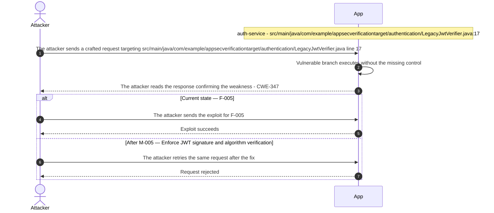

**Key takeaway:** Until ● [M-005](#m-005) (Enforce JWT signature and algorithm verification) lands, 🔴 [F-005](#f-005) — Algorithm none JWT accepted via parseClaimsJwt (`LegacyJwtVerifier.java:17`) is exploitable at `src/main/java/com/example/appsecverificationtarget/authentication/LegacyJwtVerifier.java:17` (Critical-severity, [CWE-347](https://cwe.mitre.org/data/definitions/347.html)).

**Defense in Depth**

- Primary mitigation: ● [M-005](#m-005) (Enforce JWT signature and algorithm verification)

### 3.2 SQL injection in authenticateRaw

**Source:** 🔴 [F-006](#f-006) — `src/main/java/com/example/appsecverificationtarget/authentication/LegacySqliteUserStore.java:64`

Severity **Critical** ([CWE-89](https://cwe.mitre.org/data/definitions/89.html)). STRIDE: Tampering. See [§8 F-006](#f-006) for the full register row.

**Attack Steps**

1. Attacker sends GET `/api/legacy-sqlite/login-raw?username=x&password=x%27`+OR+%271%27%3D%271 to the unauthenticated endpoint.
2. `authenticateRaw()` concatenates the input at line 64, producing: WHERE username = 'x' and password = 'x' OR '1'='1', which evaluates to true for all rows.
3. `Statement.executeQuery()` returns the first row (`legacy_admin` with role=ADMIN) and the controller responds with status=accepted and role=ADMIN.
4. Attacker now possesses a valid ADMIN role identity and can enumerate other rows by adjusting LIMIT/OFFSET to extract all users and cleartext passwords from the table.

**Sequence Diagram**

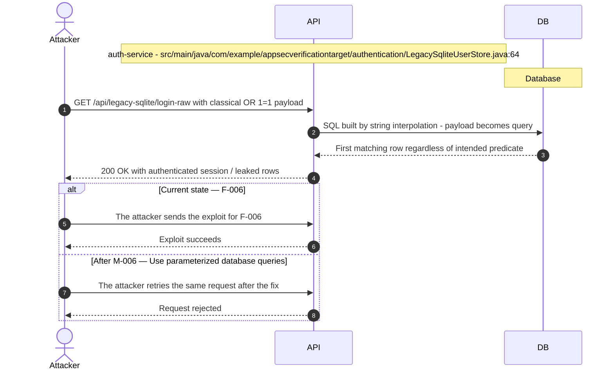

**Key takeaway:** Until ● [M-006](#m-006) (Use parameterized database queries) lands, 🔴 [F-006](#f-006) — SQL injection in authenticateRaw (`LegacySqliteUserStore.java:64`) is exploitable at `src/main/java/com/example/appsecverificationtarget/authentication/LegacySqliteUserStore.java:64` (Critical-severity, [CWE-89](https://cwe.mitre.org/data/definitions/89.html)).

**Defense in Depth**

- Primary mitigation: ● [M-006](#m-006) (Use parameterized database queries)

### 3.3 SQL Injection in Input Validation API Vulnerable

**Source:** 🔴 [F-007](#f-007) — `src/main/java/com/example/appsecverificationtarget/inputvalidation/OrderLookupDao.java:22`

Severity **Critical** ([CWE-89](https://cwe.mitre.org/data/definitions/89.html)). STRIDE: Tampering. See [§8 F-007](#f-007) for the full register row.

**Attack Steps**

1. Attacker identifies `/api/orders/search` accepts an email parameter without authentication, confirmed by `SecurityConfig.java:35` granting permitAll to GET `/api/orders/search`.
2. Attacker sends email=`' UNION SELECT username,password_hash,status,region,tenant,NULL,NULL,NULL FROM app_users--` to the endpoint.
3. H2 executes the injected UNION query and returns all `app_users` rows, including `password_hash` and admin flag, mixed into the order response body.
4. Attacker extracts all user credentials from the JSON response, then repeats with UPDATE or DELETE payloads to corrupt order records.

**Sequence Diagram**

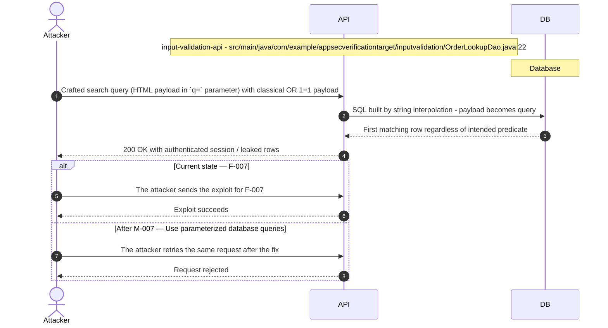

**Key takeaway:** Until ● [M-007](#m-007) (Use parameterized database queries) lands, 🔴 [F-007](#f-007) — SQL Injection is exploitable at `src/main/java/com/example/appsecverificationtarget/inputvalidation/OrderLookupDao.java:22` (Critical-severity, [CWE-89](https://cwe.mitre.org/data/definitions/89.html)).

**Defense in Depth**

- Primary mitigation: ● [M-007](#m-007) (Use parameterized database queries)

### 3.4 Self-Elevation in Profile Controller

**Source:** 🔴 [F-012](#f-012) — `src/main/java/com/example/appsecverificationtarget/accesscontrol/ProfileController.java:47`

Severity **Critical** ([CWE-915](https://cwe.mitre.org/data/definitions/915.html)). STRIDE: Elevation of Privilege. See [§8 F-012](#f-012) for the full register row.

**Attack Steps**

1. Attacker authenticates as any registered non-admin user and sends PUT `/api/profile/me` with Content-Type: application/json body `{"admin": true, "role": "ADMIN"}`.
2. ProfileController at lines 44-47 calls `current.setRole("ADMIN")` and `current.setAdmin(true)` without any authorization gate and persists to DB via `appUserRepository.save()`.
3. Attacker's next authenticated request loads `ROLE_ADMIN` from the updated DB record, granting access to all @PreAuthorize("hasRole('ADMIN')") endpoints.
4. Attacker calls POST `/api/admin/users` to create additional backdoor admin accounts, achieving persistent elevated access.

**Sequence Diagram**


**Key takeaway:** Until ● [M-012](#m-012) (Allowlist client-controlled fields) lands, 🔴 [F-012](#f-012) — Self-Elevation via Admin Flag Mass Assignment (`ProfileController.java:47`) is exploitable at `src/main/java/com/example/appsecverificationtarget/accesscontrol/ProfileController.java:47` (Critical-severity, [CWE-915](https://cwe.mitre.org/data/definitions/915.html)).

**Defense in Depth**

- Primary mitigation: ● [M-012](#m-012) (Allowlist client-controlled fields)

### 3.5 H2 web console accessible without authentication grants full database access

**Source:** 🔴 [F-013](#f-013) — `src/main/java/com/example/appsecverificationtarget/config/SecurityConfig.java:32`

Severity **Critical** ([CWE-862](https://cwe.mitre.org/data/definitions/862.html)). STRIDE: Elevation of Privilege. See [§8 F-013](#f-013) for the full register row.

**Attack Steps**

1. Attacker browses to `http://<host>:8080/h2-console` without any session cookie and receives the H2 database login form, bypassing Spring Security because the path is permitAll.
2. Attacker enters JDBC URL `jdbc:h2:mem:appsec_large_verification_target` with username `sa` and empty password as configured in `application.yml` line 8, and clicks Connect.
3. Attacker executes `SELECT * FROM users` and additional tables to exfiltrate all credentials, PII, and business records in plaintext.
4. Attacker executes `CREATE ALIAS EXEC AS $$ void exec(String cmd) throws Exception { Runtime.getRuntime().exec(cmd); }$$; CALL EXEC('id')` to achieve OS-level code execution within the container.

**Sequence Diagram**

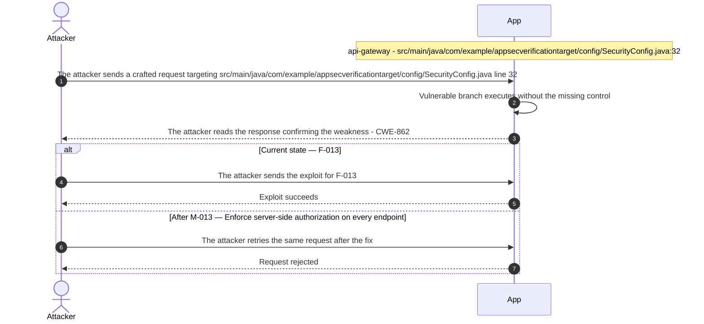

**Key takeaway:** Until ● [M-013](#m-013) (Enforce server-side authorization on every endpoint) lands, 🔴 [F-013](#f-013) — H2 web console accessible without authentication grants full database access is exploitable at `src/main/java/com/example/appsecverificationtarget/config/SecurityConfig.java:32` (Critical-severity, [CWE-862](https://cwe.mitre.org/data/definitions/862.html)).

**Defense in Depth**

- Primary mitigation: ● [M-013](#m-013) (Enforce server-side authorization on every endpoint)

### 3.6 AWS/JWT/DB secrets hardcoded in Dockerfile ENV and baked into image layers

**Source:** 🔴 [F-010](#f-010) — `Dockerfile:13`

Severity **Critical** ([CWE-798](https://cwe.mitre.org/data/definitions/798.html)). STRIDE: Information Disclosure. See [§8 F-010](#f-010) for the full register row.

**Attack Steps**

1. Attacker clones the repository or pulls the container image and runs `docker inspect <image>` to read the Config.Env array.
2. Attacker extracts `DB_PASSWORD`=**** (25 chars), `JWT_SIGNING_KEY`=hardcoded-legacy-jwt-secret, `AWS_ACCESS_KEY_ID`=AKIA****, and `AWS_SECRET_ACCESS_KEY` from the response.
3. Attacker calls `aws sts get-caller-identity` using the extracted AWS credentials to confirm access and begins enumerating S3 buckets and IAM permissions.
4. Attacker uses `DB_PASSWORD` and `JWT_SIGNING_KEY` in parallel to compromise the database and forge authentication tokens independently.

**Sequence Diagram**

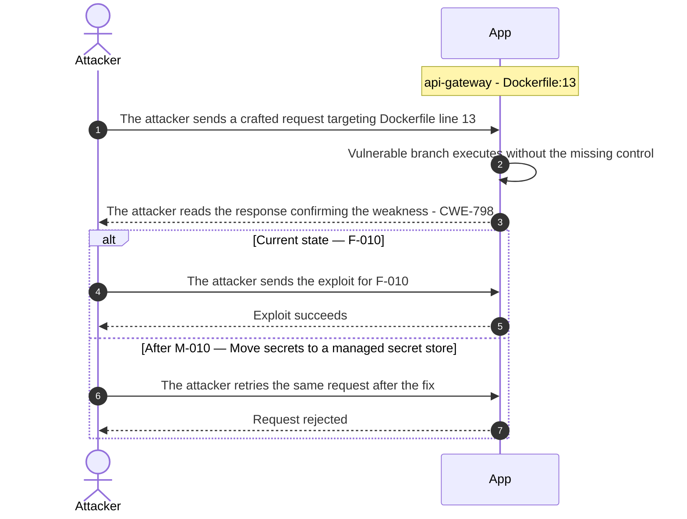

**Key takeaway:** Until ● [M-010](#m-010) (Move secrets to a managed secret store) lands, 🔴 [F-010](#f-010) — AWS/JWT/DB secrets hardcoded in Dockerfile ENV and baked into image layers is exploitable at `Dockerfile:13` (Critical-severity, [CWE-798](https://cwe.mitre.org/data/definitions/798.html)).

**Defense in Depth**

- Primary mitigation: ● [M-010](#m-010) (Move secrets to a managed secret store)

### 3.7 Missing Authentication on Sensitive Data Endpoints in Crypto and Token Service

**Source:** 🔴 [F-001](#f-001) — `src/main/java/com/example/appsecverificationtarget/crypto/CustomCryptoController.java:41`

Severity **Critical** ([CWE-306](https://cwe.mitre.org/data/definitions/306.html)). STRIDE: Information Disclosure. See [§8 F-001](#f-001) for the full register row.

**Attack Steps**

1. Attacker confirms `/api/legacy`-crypto/** is unauthenticated via `SecurityConfig.java:46` and sends GET `/api/legacy-crypto/credentials` to the server without providing any credentials.
2. Server calls `VaultCredentialRepository.findAll()` and streams all vault records through `recoverPassword()`; attacker receives a JSON array containing every username with its decoded plaintext secret.

**Sequence Diagram**

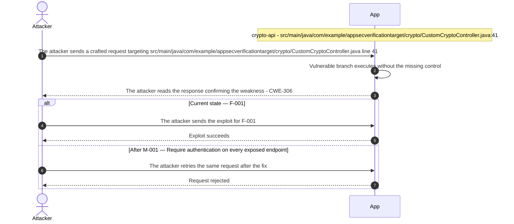

**Key takeaway:** Until ● [M-001](#m-001) (Require authentication on every exposed endpoint) lands, 🔴 [F-001](#f-001) — Missing Authentication on Sensitive Data Endpoints is exploitable at `src/main/java/com/example/appsecverificationtarget/crypto/CustomCryptoController.java:41` (Critical-severity, [CWE-306](https://cwe.mitre.org/data/definitions/306.html)).

**Defense in Depth**

- Primary mitigation: ● [M-001](#m-001) (Require authentication on every exposed endpoint)

### 3.8 Unauthenticated actuator /env exposes all config secrets in plaintext

**Source:** 🔴 [F-009](#f-009) — `src/main/resources/application.yml:36`

Severity **Critical** ([CWE-200](https://cwe.mitre.org/data/definitions/200.html)). STRIDE: Information Disclosure. See [§8 F-009](#f-009) for the full register row.

**Attack Steps**

1. Attacker sends `GET http://<host>:8080/actuator/env` with no session cookie or Authorization header.
2. Spring Boot returns a JSON object with show-values:ALWAYS, making every property value visible including `app.integration-token=**** (28 chars)` and datasource credentials.
3. Attacker reads all exposed secret values and uses them to authenticate against the application API or downstream systems without any legitimate account.

**Sequence Diagram**

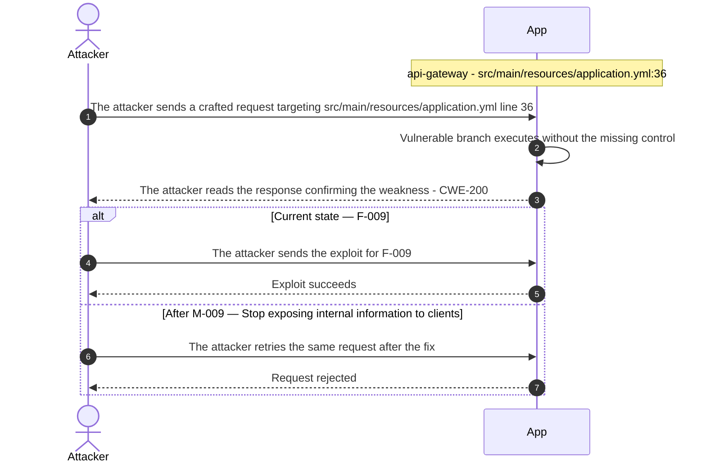

**Key takeaway:** Until ● [M-009](#m-009) (Stop exposing internal information to clients) lands, 🔴 [F-009](#f-009) — Unauthenticated actuator `/env` exposes all config secrets in plaintext is exploitable at `src/main/resources/application.yml:36` (Critical-severity, [CWE-200](https://cwe.mitre.org/data/definitions/200.html)).

**Defense in Depth**

- Primary mitigation: ● [M-009](#m-009) (Stop exposing internal information to clients)

<!-- generated:`walkthrough_renderer` -->

---

## 4. Assets

Information assets and the classification level that drives the Confidentiality / Integrity / Availability targets used in [§8 Findings Register](#8-findings-register) risk scoring.

| Asset | Classification | Description |
|----------------------|--------------|------------------------------------|
| JWT and Session Signing Keys | Restricted | `JWT_SIGNING_KEY` hardcoded in Dockerfile<br/>(line 15) and docker-compose\.yml (line 44);<br/>`application.yml` holds integration-token.<br/>These keys protect session integrity - their<br/>disclosure allows forging arbitrary JWT<br/>tokens for any user or role. |
| Order Records | Restricted | CustomerOrder JPA entities stored in H2<br/>database, representing business transaction<br/>records with customer identity and order<br/>details. Exposed to SQL injection via<br/>OrderLookupDao and to unauthenticated access<br/>via missing-auth POST endpoints in<br/>OrderManagementController. |
| Document Records | Restricted | DocumentRecord JPA entities storing file<br/>metadata and access-control bindings in H2.<br/>Exposed to SQL injection via<br/>DocumentLookupDao, unauthenticated CRUD via<br/>DocumentManagementController, and IDOR via<br/>DocumentDecisionController release endpoint. |
| Vault Credentials | Restricted | VaultCredential JPA entities holding<br/>credential material managed by the<br/>crypto-api component. Reachable via<br/>unauthenticated `/credentials` endpoint<br/>(R-029) and `/export-token` endpoint (R-033);<br/>direct credential exfiltration without<br/>exploitation of any secondary vulnerability. |
| User Authentication Credentials | Confidential | AppUser entity holds username, email,<br/>password hash, and role assignments stored<br/>in the H2 in-memory database. Legacy SQLite<br/>store holds cleartext passwords for legacy<br/>auth users. Compromise enables account<br/>takeover across all 13 application roles. |
| H2 In-Memory Database | Confidential | Primary transactional H2 in-memory database<br/>backing all JPA repositories. The H2 web<br/>console is exposed without authentication at<br/>`/h2-console` (Spring Security permitAll),<br/>giving any unauthenticated requester full<br/>DDL/DML access to all stored data. |
| Spring Actuator Telemetry and Heap Dump | Confidential | Spring Boot Actuator endpoints fully exposed<br/>with show-values: ALWAYS in `application.yml`.<br/>`/actuator/env` returns all environment<br/>variables including hardcoded secrets;<br/>`/actuator/heapdump` returns a full JVM heap<br/>dump enabling offline extraction of<br/>in-memory credentials, tokens, and PII. |
| Service Portfolio / Landscape Catalog | Internal | Service portfolio records in<br/>LandscapePersistence describing service<br/>capabilities, ownership, and exposure<br/>classification across the 30+ landscape<br/>service endpoints. Disclosure reveals<br/>internal service topology and may assist<br/>targeted attacks against specific service<br/>surfaces. |

---

## 5. Attack Surface

Network-reachable entry points classified by authentication requirement. Each row links to the threat(s) referenced in its **Notes** column. The **Risk** column reflects the highest-severity linked finding. Entry points with no linked finding are still listed when they sit on a sensitive surface (authentication, registration, management) or look like a missing-auth/authz suspect - marked **⚑ Review** in Notes.

### 5.1 Unauthenticated Entry Points (121)

<table style="table-layout:fixed;width:100%">
<colgroup><col width="9%" style="width:9%"><col width="30%" style="width:30%"><col width="14%" style="width:14%"><col width="47%" style="width:47%"></colgroup>
<thead><tr><th>Method</th><th>Route</th><th>Risk</th><th>Notes</th></tr></thead>
<tbody>
<tr><td>GET</td><td style="overflow-wrap:anywhere"><code>/admin/users</code></td><td>🔴 Critical</td><td>🔴 <a href="#f-011">F-011</a> — Unauthenticated User Promotion to Admin (<code>LegacyAdminBoardController.java:28</code>)<br/>🟠 <a href="#f-002">F-002</a> — CSRF protection globally disabled (<code>SecurityConfig.java:28</code>)<br/>🟠 <a href="#f-003">F-003</a> — Missing Security Audit Logging Across Components (<code>LegacyAdminBoardController.java:29</code>)<br/>Admin users list GET — management surface, missing auth</td></tr>
<tr><td>POST</td><td style="overflow-wrap:anywhere"><code>/admin/users</code></td><td>🔴 Critical</td><td>🔴 <a href="#f-011">F-011</a> — Unauthenticated User Promotion to Admin (<code>LegacyAdminBoardController.java:28</code>)<br/>🟠 <a href="#f-002">F-002</a> — CSRF protection globally disabled (<code>SecurityConfig.java:28</code>)<br/>🟠 <a href="#f-003">F-003</a> — Missing Security Audit Logging Across Components (<code>LegacyAdminBoardController.java:29</code>)<br/>Admin user creation POST — management surface, missing auth</td></tr>
<tr><td>GET</td><td style="overflow-wrap:anywhere"><code>/admin/users/{id}</code></td><td>🔴 Critical</td><td>🔴 <a href="#f-011">F-011</a> — Unauthenticated User Promotion to Admin (<code>LegacyAdminBoardController.java:28</code>)<br/>🟠 <a href="#f-003">F-003</a> — Missing Security Audit Logging Across Components (<code>LegacyAdminBoardController.java:29</code>)<br/>Admin user detail GET — management surface, missing auth</td></tr>
<tr><td>POST</td><td style="overflow-wrap:anywhere"><code>/admin/users/{id}</code></td><td>🔴 Critical</td><td>🔴 <a href="#f-011">F-011</a> — Unauthenticated User Promotion to Admin (<code>LegacyAdminBoardController.java:28</code>)<br/>🟠 <a href="#f-003">F-003</a> — Missing Security Audit Logging Across Components (<code>LegacyAdminBoardController.java:29</code>)<br/>Admin user update POST — management surface, missing auth</td></tr>
<tr><td>POST</td><td style="overflow-wrap:anywhere"><code>/admin/users/{id}/delete</code></td><td>🔴 Critical</td><td>🔴 <a href="#f-011">F-011</a> — Unauthenticated User Promotion to Admin (<code>LegacyAdminBoardController.java:28</code>)<br/>🟠 <a href="#f-003">F-003</a> — Missing Security Audit Logging Across Components (<code>LegacyAdminBoardController.java:29</code>)<br/>Admin user deletion POST — management surface, missing auth</td></tr>
<tr><td>GET</td><td style="overflow-wrap:anywhere"><code>/legacy/admin</code></td><td>🔴 Critical</td><td>🔴 <a href="#f-011">F-011</a> — Unauthenticated User Promotion to Admin (<code>LegacyAdminBoardController.java:28</code>)<br/>🟠 <a href="#f-003">F-003</a> — Missing Security Audit Logging Across Components (<code>LegacyAdminBoardController.java:29</code>)<br/>🟠 <a href="#f-041">F-041</a> — Unbounded findAll Without Authentication (<code>LegacyAdminBoardController.java:24</code>)<br/>Unauthenticated legacy admin board — management surface with missing-auth signal</td></tr>
<tr><td>POST</td><td style="overflow-wrap:anywhere"><code>/​legacy/​admin/​users/​{id}/​delete</code></td><td>🔴 Critical</td><td>🔴 <a href="#f-006">F-006</a> — SQL injection in authenticateRaw (<code>LegacySqliteUserStore.java:64</code>)<br/>🔴 <a href="#f-011">F-011</a> — Unauthenticated User Promotion to Admin (<code>LegacyAdminBoardController.java:28</code>)<br/>🟠 <a href="#f-003">F-003</a> — Missing Security Audit Logging Across Components (<code>LegacyAdminBoardController.java:29</code>)<br/>Unauthenticated user deletion endpoint — critical management surface</td></tr>
<tr><td>POST</td><td style="overflow-wrap:anywhere"><code>/​legacy/​admin/​users/​{id}/​promote</code></td><td>🔴 Critical</td><td>🔴 <a href="#f-006">F-006</a> — SQL injection in authenticateRaw (<code>LegacySqliteUserStore.java:64</code>)<br/>🔴 <a href="#f-011">F-011</a> — Unauthenticated User Promotion to Admin (<code>LegacyAdminBoardController.java:28</code>)<br/>🟠 <a href="#f-003">F-003</a> — Missing Security Audit Logging Across Components (<code>LegacyAdminBoardController.java:29</code>)<br/>Unauthenticated user privilege escalation endpoint — critical management surface</td></tr>
<tr><td>GET</td><td style="overflow-wrap:anywhere"><code>/login</code></td><td>🔴 Critical</td><td>🔴 <a href="#f-006">F-006</a> — SQL injection in authenticateRaw (<code>LegacySqliteUserStore.java:64</code>)<br/>🟠 <a href="#f-032">F-032</a> — Cleartext credentials logged per login (<code>CredentialLoggingFilter.java:25</code>)<br/>🟠 <a href="#f-042">F-042</a> — No rate limiting on authentication endpoints enables credential brute-force (<code>SecurityConfig.java:31</code>)<br/>handler: <code>src/main/java/com/example/appsecverificationtarget/web/WebUiController.java:41</code></td></tr>
<tr><td>GET</td><td style="overflow-wrap:anywhere"><code>/login-raw</code></td><td>🔴 Critical</td><td>🔴 <a href="#f-006">F-006</a> — SQL injection in authenticateRaw (<code>LegacySqliteUserStore.java:64</code>)<br/>Raw login form endpoint — credential submission surface</td></tr>
<tr><td>PUT</td><td style="overflow-wrap:anywhere"><code>/me</code></td><td>🔴 Critical</td><td>🔴 <a href="#f-012">F-012</a> — Self-Elevation via Admin Flag Mass Assignment (<code>ProfileController.java:47</code>)<br/>🔴 <a href="#f-022">F-022</a> — Mass Assignment of Password Hash via PUT <code>/me</code> (<code>ProfileController.java:41</code>)<br/>🟠 <a href="#f-039">F-039</a> — SSRF via Caller-Supplied URL (<code>IntegrationController.java:23</code>)<br/>Self-profile update PUT — missing auth on profile modification</td></tr>
<tr><td>POST</td><td style="overflow-wrap:anywhere"><code>/orders</code></td><td>🔴 Critical</td><td>🔴 <a href="#f-007">F-007</a> — SQL Injection (<code>OrderLookupDao.java:22</code>)<br/>🔴 <a href="#f-014">F-014</a> — Unauthenticated token issuance for arbitrary user ID (<code>AuthController.java:38</code>)<br/>🟠 <a href="#f-019">F-019</a> — Integrity-free Base64 session token forgeable (<code>HomegrownSessionService.java:21</code>)<br/>Order creation POST — missing auth on order write</td></tr>
<tr><td>POST</td><td style="overflow-wrap:anywhere"><code>/orders/{id}</code></td><td>🔴 Critical</td><td>🔴 <a href="#f-044">F-044</a> — IDOR on Order Access Without Ownership Check (<code>OrderAccessController.java:23</code>)<br/>🟡 <a href="#f-053">F-053</a> — Unbounded file upload size (<code>BusinessFileStorage.java:13</code>)<br/>Order update POST — missing auth on order write</td></tr>
<tr><td>POST</td><td style="overflow-wrap:anywhere"><code>/profile</code></td><td>🔴 Critical</td><td>🔴 <a href="#f-012">F-012</a> — Self-Elevation via Admin Flag Mass Assignment (<code>ProfileController.java:47</code>)<br/>🔴 <a href="#f-022">F-022</a> — Mass Assignment of Password Hash via PUT <code>/me</code> (<code>ProfileController.java:41</code>)<br/>🟠 <a href="#f-049">F-049</a> — Unverified password change (<code>ProfilePageController.java:61</code>)<br/>Profile page POST — missing auth on profile update via web UI</td></tr>
<tr><td>GET</td><td style="overflow-wrap:anywhere"><code>/signed-jwt/token</code></td><td>🔴 Critical</td><td>🔴 <a href="#f-014">F-014</a> — Unauthenticated token issuance for arbitrary user ID (<code>AuthController.java:38</code>)<br/>Signed JWT token issuance — authentication surface</td></tr>
<tr><td>GET</td><td style="overflow-wrap:anywhere"><code>/token</code></td><td>🔴 Critical</td><td>🔴 <a href="#f-014">F-014</a> — Unauthenticated token issuance for arbitrary user ID (<code>AuthController.java:38</code>)<br/>🟠 <a href="#f-020">F-020</a> — Missing auth on token issuance endpoint (<code>CustomCryptoController.java:27</code>)<br/>Custom token issuance endpoint — homegrown crypto</td></tr>
<tr><td>?</td><td style="overflow-wrap:anywhere"><code>ANY /api/admin</code></td><td>🔴 Critical</td><td>🔴 <a href="#f-017">F-017</a> — Hardcoded Credential Stored as Password Hash (<code>AdminUserController.java:25</code>)<br/>Admin report API mount — management surface, missing auth</td></tr>
<tr><td>?</td><td style="overflow-wrap:anywhere"><code>ANY /api/admin/users</code></td><td>🔴 Critical</td><td>🔴 <a href="#f-017">F-017</a> — Hardcoded Credential Stored as Password Hash (<code>AdminUserController.java:25</code>)<br/>Admin user management API mount — management surface, missing auth</td></tr>
<tr><td>GET</td><td style="overflow-wrap:anywhere"><code>/account</code></td><td>🔴 Critical</td><td>🔴 <a href="#f-036">F-036</a> — Wildcard CORS origin reflection with credentials (<code>CorsPolicyFilter.java:32</code>)<br/>Account retrieval under CORS policy — cross-origin data exfiltration risk</td></tr>
<tr><td>GET</td><td style="overflow-wrap:anywhere"><code>/audit</code></td><td>🔴 Critical</td><td>🔴 <a href="#f-005">F-005</a> — Algorithm none JWT accepted via parseClaimsJwt (<code>LegacyJwtVerifier.java:17</code>)<br/>handler: <code>src/main/java/com/example/appsecverificationtarget/authentication/LegacyAdminAuditController.java:37</code></td></tr>
<tr><td>GET</td><td style="overflow-wrap:anywhere"><code>/credentials</code></td><td>🔴 Critical</td><td>🔴 <a href="#f-001">F-001</a> — Missing Authentication on Sensitive Data Endpoints (<code>CustomCryptoController.java:41</code>)<br/>Credentials endpoint — unauthenticated vault credential exfiltration</td></tr>
<tr><td>GET</td><td style="overflow-wrap:anywhere"><code>/fetch</code></td><td>🔴 Critical</td><td>🔴 <a href="#f-045">F-045</a> — SSRF-capable API endpoints accessible without authentication (<code>SecurityConfig.java:37</code>)<br/>🟠 <a href="#f-039">F-039</a> — SSRF via Caller-Supplied URL (<code>IntegrationController.java:23</code>)<br/>handler: <code>src/main/java/com/example/appsecverificationtarget/serverside/IntegrationController.java:21</code></td></tr>
<tr><td>GET</td><td style="overflow-wrap:anywhere"><code>/homegrown-token</code></td><td>🔴 Critical</td><td>🔴 <a href="#f-014">F-014</a> — Unauthenticated token issuance for arbitrary user ID (<code>AuthController.java:38</code>)<br/>Homegrown token issuance endpoint</td></tr>
<tr><td>GET</td><td style="overflow-wrap:anywhere"><code>/legacy-session</code></td><td>🔴 Critical</td><td>🔴 <a href="#f-014">F-014</a> — Unauthenticated token issuance for arbitrary user ID (<code>AuthController.java:38</code>)<br/>🟠 <a href="#f-019">F-019</a> — Integrity-free Base64 session token forgeable (<code>HomegrownSessionService.java:21</code>)<br/>Legacy session token issuance endpoint</td></tr>
<tr><td>GET</td><td style="overflow-wrap:anywhere"><code>/lookup</code></td><td>🔴 Critical</td><td>🔴 <a href="#f-008">F-008</a> — OS Command Injection via sh -c (<code>ToolController.java:18</code>)<br/>🔴 <a href="#f-045">F-045</a> — SSRF-capable API endpoints accessible without authentication (<code>SecurityConfig.java:37</code>)<br/>handler: <code>src/main/java/com/example/appsecverificationtarget/serverside/ToolController.java:16</code></td></tr>
<tr><td>GET</td><td style="overflow-wrap:anywhere"><code>/me</code></td><td>🔴 Critical</td><td>🔴 <a href="#f-012">F-012</a> — Self-Elevation via Admin Flag Mass Assignment (<code>ProfileController.java:47</code>)<br/>🔴 <a href="#f-022">F-022</a> — Mass Assignment of Password Hash via PUT <code>/me</code> (<code>ProfileController.java:41</code>)<br/>🟠 <a href="#f-039">F-039</a> — SSRF via Caller-Supplied URL (<code>IntegrationController.java:23</code>)<br/>Self-profile retrieval — unknown auth</td></tr>
<tr><td>GET</td><td style="overflow-wrap:anywhere"><code>/orders</code></td><td>🔴 Critical</td><td>🔴 <a href="#f-007">F-007</a> — SQL Injection (<code>OrderLookupDao.java:22</code>)<br/>🔴 <a href="#f-014">F-014</a> — Unauthenticated token issuance for arbitrary user ID (<code>AuthController.java:38</code>)<br/>🟠 <a href="#f-019">F-019</a> — Integrity-free Base64 session token forgeable (<code>HomegrownSessionService.java:21</code>)<br/>Legacy session order listing — unknown auth on order retrieval</td></tr>
<tr><td>GET</td><td style="overflow-wrap:anywhere"><code>/orders/{id}</code></td><td>🔴 Critical</td><td>🔴 <a href="#f-044">F-044</a> — IDOR on Order Access Without Ownership Check (<code>OrderAccessController.java:23</code>)<br/>🟡 <a href="#f-053">F-053</a> — Unbounded file upload size (<code>BusinessFileStorage.java:13</code>)<br/>handler: <code>src/main/java/com/example/appsecverificationtarget/web/OrderManagementController.java:89</code></td></tr>
<tr><td>GET</td><td style="overflow-wrap:anywhere"><code>/profile</code></td><td>🔴 Critical</td><td>🔴 <a href="#f-012">F-012</a> — Self-Elevation via Admin Flag Mass Assignment (<code>ProfileController.java:47</code>)<br/>🔴 <a href="#f-022">F-022</a> — Mass Assignment of Password Hash via PUT <code>/me</code> (<code>ProfileController.java:41</code>)<br/>🟠 <a href="#f-049">F-049</a> — Unverified password change (<code>ProfilePageController.java:61</code>)<br/>Authenticated profile retrieval via secure JWT</td></tr>
<tr><td>GET</td><td style="overflow-wrap:anywhere"><code>/read</code></td><td>🔴 Critical</td><td>🔴 <a href="#f-045">F-045</a> — SSRF-capable API endpoints accessible without authentication (<code>SecurityConfig.java:37</code>)<br/>🟠 <a href="#f-037">F-037</a> — Path Traversal File Read (<code>FileReadController.java:19</code>)<br/>handler: <code>src/main/java/com/example/appsecverificationtarget/serverside/FileReadController.java:17</code></td></tr>
<tr><td>GET</td><td style="overflow-wrap:anywhere"><code>/search</code></td><td>🔴 Critical</td><td>🔴 <a href="#f-007">F-007</a> — SQL Injection (<code>OrderLookupDao.java:22</code>)<br/>Order search GET — SQL injection sink in search parameter</td></tr>
<tr><td>GET</td><td style="overflow-wrap:anywhere"><code>/users</code></td><td>🔴 Critical</td><td>🔴 <a href="#f-011">F-011</a> — Unauthenticated User Promotion to Admin (<code>LegacyAdminBoardController.java:28</code>)<br/>🟠 <a href="#f-002">F-002</a> — CSRF protection globally disabled (<code>SecurityConfig.java:28</code>)<br/>🟠 <a href="#f-003">F-003</a> — Missing Security Audit Logging Across Components (<code>LegacyAdminBoardController.java:29</code>)<br/>handler: <code>src/main/java/com/example/appsecverificationtarget/authentication/LegacySqliteAuthController.java:49</code></td></tr>
<tr><td>GET</td><td style="overflow-wrap:anywhere"><code>/users/{id}</code></td><td>🔴 Critical</td><td>🔴 <a href="#f-011">F-011</a> — Unauthenticated User Promotion to Admin (<code>LegacyAdminBoardController.java:28</code>)<br/>🟠 <a href="#f-003">F-003</a> — Missing Security Audit Logging Across Components (<code>LegacyAdminBoardController.java:29</code>)<br/>handler: <code>src/main/java/com/example/appsecverificationtarget/web/UserDirectoryController.java:24</code></td></tr>
<tr><td>GET</td><td style="overflow-wrap:anywhere"><code>/whoami</code></td><td>🔴 Critical</td><td>🔴 <a href="#f-029">F-029</a> — Hardcoded XOR key permits offline token forgery (<code>HomegrownCipher.java:8</code>)<br/>Whoami endpoint exposing authenticated identity via custom crypto path</td></tr>
<tr><td>GET</td><td style="overflow-wrap:anywhere"><code>/{id}</code></td><td>🔴 Critical</td><td>🔴 <a href="#f-011">F-011</a> — Unauthenticated User Promotion to Admin (<code>LegacyAdminBoardController.java:28</code>)<br/>🔴 <a href="#f-044">F-044</a> — IDOR on Order Access Without Ownership Check (<code>OrderAccessController.java:23</code>)<br/>🟠 <a href="#f-003">F-003</a> — Missing Security Audit Logging Across Components (<code>LegacyAdminBoardController.java:29</code>)<br/>handler: <code>src/main/java/com/example/appsecverificationtarget/accesscontrol/UserAccessController.java:21</code></td></tr>
<tr><td>?</td><td style="overflow-wrap:anywhere"><code>ANY /api/auth</code></td><td>🔴 Critical</td><td>🔴 <a href="#f-014">F-014</a> — Unauthenticated token issuance for arbitrary user ID (<code>AuthController.java:38</code>)<br/>🟠 <a href="#f-042">F-042</a> — No rate limiting on authentication endpoints enables credential brute-force (<code>SecurityConfig.java:31</code>)<br/>Authentication entry point for multiple auth mechanisms</td></tr>
<tr><td>?</td><td style="overflow-wrap:anywhere"><code>ANY /api/cors</code></td><td>🔴 Critical</td><td>🔴 <a href="#f-036">F-036</a> — Wildcard CORS origin reflection with credentials (<code>CorsPolicyFilter.java:32</code>)<br/>CORS account API mount — reflected CORS origin validation</td></tr>
<tr><td>?</td><td style="overflow-wrap:anywhere"><code>ANY /api/files</code></td><td>🔴 Critical</td><td>🔴 <a href="#f-045">F-045</a> — SSRF-capable API endpoints accessible without authentication (<code>SecurityConfig.java:37</code>)<br/>🟠 <a href="#f-037">F-037</a> — Path Traversal File Read (<code>FileReadController.java:19</code>)<br/>handler: <code>src/main/java/com/example/appsecverificationtarget/serverside/FileReadController.java:14</code></td></tr>
<tr><td>?</td><td style="overflow-wrap:anywhere"><code>ANY /api/integration</code></td><td>🔴 Critical</td><td>🔴 <a href="#f-045">F-045</a> — SSRF-capable API endpoints accessible without authentication (<code>SecurityConfig.java:37</code>)<br/>🟠 <a href="#f-039">F-039</a> — SSRF via Caller-Supplied URL (<code>IntegrationController.java:23</code>)<br/>handler: <code>src/main/java/com/example/appsecverificationtarget/serverside/IntegrationController.java:12</code></td></tr>
<tr><td>?</td><td style="overflow-wrap:anywhere"><code>ANY /api/legacy-admin</code></td><td>🔴 Critical</td><td>🔴 <a href="#f-005">F-005</a> — Algorithm none JWT accepted via parseClaimsJwt (<code>LegacyJwtVerifier.java:17</code>)<br/>handler: <code>src/main/java/com/example/appsecverificationtarget/authentication/LegacyAdminAuditController.java:17</code></td></tr>
<tr><td>?</td><td style="overflow-wrap:anywhere"><code>ANY /api/legacy-crypto</code></td><td>🔴 Critical</td><td>🔴 <a href="#f-001">F-001</a> — Missing Authentication on Sensitive Data Endpoints (<code>CustomCryptoController.java:41</code>)<br/>🔴 <a href="#f-029">F-029</a> — Hardcoded XOR key permits offline token forgery (<code>HomegrownCipher.java:8</code>)<br/>🟠 <a href="#f-020">F-020</a> — Missing auth on token issuance endpoint (<code>CustomCryptoController.java:27</code>)<br/>Legacy crypto API mount — weak cipher and token generation exposure</td></tr>
<tr><td>?</td><td style="overflow-wrap:anywhere"><code>ANY /api/legacy-session</code></td><td>🔴 Critical</td><td>🔴 <a href="#f-014">F-014</a> — Unauthenticated token issuance for arbitrary user ID (<code>AuthController.java:38</code>)<br/>🟠 <a href="#f-019">F-019</a> — Integrity-free Base64 session token forgeable (<code>HomegrownSessionService.java:21</code>)<br/>Legacy session order controller — unknown auth on session-scoped order access</td></tr>
<tr><td>?</td><td style="overflow-wrap:anywhere"><code>ANY /api/legacy-sqlite</code></td><td>🔴 Critical</td><td>🔴 <a href="#f-006">F-006</a> — SQL injection in authenticateRaw (<code>LegacySqliteUserStore.java:64</code>)<br/>🟠 <a href="#f-031">F-031</a> — Cleartext passwords in unauth user listing (<code>LegacySqliteAuthController.java:65</code>)<br/>Legacy SQLite auth controller mount — raw SQL login path</td></tr>
<tr><td>?</td><td style="overflow-wrap:anywhere"><code>ANY /api/orders</code></td><td>🔴 Critical</td><td>🔴 <a href="#f-007">F-007</a> — SQL Injection (<code>OrderLookupDao.java:22</code>)<br/>🔴 <a href="#f-044">F-044</a> — IDOR on Order Access Without Ownership Check (<code>OrderAccessController.java:23</code>)<br/>Order access API mount — unknown auth on order operations</td></tr>
<tr><td>?</td><td style="overflow-wrap:anywhere"><code>ANY /api/profile</code></td><td>🔴 Critical</td><td>🔴 <a href="#f-012">F-012</a> — Self-Elevation via Admin Flag Mass Assignment (<code>ProfileController.java:47</code>)<br/>🔴 <a href="#f-022">F-022</a> — Mass Assignment of Password Hash via PUT <code>/me</code> (<code>ProfileController.java:41</code>)<br/>Profile API mount — unknown auth on profile operations</td></tr>
<tr><td>?</td><td style="overflow-wrap:anywhere"><code>ANY /api/tools</code></td><td>🔴 Critical</td><td>🔴 <a href="#f-008">F-008</a> — OS Command Injection via sh -c (<code>ToolController.java:18</code>)<br/>🔴 <a href="#f-045">F-045</a> — SSRF-capable API endpoints accessible without authentication (<code>SecurityConfig.java:37</code>)<br/>handler: <code>src/main/java/com/example/appsecverificationtarget/serverside/ToolController.java:13</code></td></tr>
<tr><td>POST</td><td style="overflow-wrap:anywhere"><code>/csrf/settings</code></td><td>🟠 High</td><td>🟠 <a href="#f-028">F-028</a> — CSRF token not validated against session (<code>CsrfSettingsController.java:47</code>)<br/>CSRF settings POST — CSRF configuration manipulation, missing auth</td></tr>
<tr><td>POST</td><td style="overflow-wrap:anywhere"><code>/documents</code></td><td>🟠 High</td><td>🟠 <a href="#f-037">F-037</a> — Path Traversal File Read (<code>FileReadController.java:19</code>)<br/>🟡 <a href="#f-053">F-053</a> — Unbounded file upload size (<code>BusinessFileStorage.java:13</code>)<br/>Document creation POST — missing auth on privileged write</td></tr>
<tr><td>GET</td><td style="overflow-wrap:anywhere"><code>/otp</code></td><td>🟠 High</td><td>🟠 <a href="#f-047">F-047</a> — Predictable OTP via non-CSPRNG Random (<code>LegacyTokenService.java:10</code>)<br/>handler: <code>src/main/java/com/example/appsecverificationtarget/crypto/CryptoController.java:33</code></td></tr>
<tr><td>POST</td><td style="overflow-wrap:anywhere"><code>/preview</code></td><td>🟠 High</td><td>🟠 <a href="#f-038">F-038</a> — XXE Enables Local File Read via External Entity (<code>XmlPreviewController.java:22</code>)<br/>🟠 <a href="#f-043">F-043</a> — XXE Entity Expansion DoS (<code>XmlPreviewController.java:22</code>)<br/>🟡 <a href="#f-051">F-051</a> — Output Injection via Unencoded User Content (<code>OutputPreviewService.java:11</code>)<br/>XML preview POST — XXE injection sink, missing auth</td></tr>
<tr><td>GET</td><td style="overflow-wrap:anywhere"><code>/csrf/settings</code></td><td>🟠 High</td><td>🟠 <a href="#f-028">F-028</a> — CSRF token not validated against session (<code>CsrfSettingsController.java:47</code>)<br/>CSRF settings GET — CSRF token configuration disclosure</td></tr>
<tr><td>GET</td><td style="overflow-wrap:anywhere"><code>/documents</code></td><td>🟠 High</td><td>🟠 <a href="#f-037">F-037</a> — Path Traversal File Read (<code>FileReadController.java:19</code>)<br/>🟡 <a href="#f-053">F-053</a> — Unbounded file upload size (<code>BusinessFileStorage.java:13</code>)<br/>handler: <code>src/main/java/com/example/appsecverificationtarget/web/DocumentManagementController.java:42</code></td></tr>
<tr><td>GET</td><td style="overflow-wrap:anywhere"><code>/preview</code></td><td>🟠 High</td><td>🟠 <a href="#f-038">F-038</a> — XXE Enables Local File Read via External Entity (<code>XmlPreviewController.java:22</code>)<br/>🟠 <a href="#f-043">F-043</a> — XXE Entity Expansion DoS (<code>XmlPreviewController.java:22</code>)<br/>🟡 <a href="#f-051">F-051</a> — Output Injection via Unencoded User Content (<code>OutputPreviewService.java:11</code>)<br/>handler: <code>src/main/java/com/example/appsecverificationtarget/outputhandling/OutputPreviewController.java:19</code></td></tr>
<tr><td>?</td><td style="overflow-wrap:anywhere"><code>ANY /api/crypto</code></td><td>🟠 High</td><td>🟠 <a href="#f-047">F-047</a> — Predictable OTP via non-CSPRNG Random (<code>LegacyTokenService.java:10</code>)<br/>handler: <code>src/main/java/com/example/appsecverificationtarget/crypto/CryptoController.java:11</code></td></tr>
<tr><td>?</td><td style="overflow-wrap:anywhere"><code>ANY /api/xml</code></td><td>🟠 High</td><td>🟠 <a href="#f-038">F-038</a> — XXE Enables Local File Read via External Entity (<code>XmlPreviewController.java:22</code>)<br/>🟠 <a href="#f-043">F-043</a> — XXE Entity Expansion DoS (<code>XmlPreviewController.java:22</code>)<br/>handler: <code>src/main/java/com/example/appsecverificationtarget/serverside/XmlPreviewController.java:17</code></td></tr>
<tr><td>?</td><td style="overflow-wrap:anywhere"><code>ANY /api/output</code></td><td>🟡 Medium</td><td>🟡 <a href="#f-051">F-051</a> — Output Injection via Unencoded User Content (<code>OutputPreviewService.java:11</code>)<br/>handler: <code>src/main/java/com/example/appsecverificationtarget/outputhandling/OutputPreviewController.java:10</code></td></tr>
<tr><td>GET</td><td style="overflow-wrap:anywhere"><code>/admin-preferences</code></td><td>-</td><td>Admin preferences GET - management surface, missing auth<br/><em>⚑ Review: no auth guard detected</em></td></tr>
<tr><td>POST</td><td style="overflow-wrap:anywhere"><code>/documents/{id}</code></td><td>-</td><td>Document update POST - missing auth on privileged write<br/><em>⚑ Review: no auth guard detected</em></td></tr>
<tr><td>POST</td><td style="overflow-wrap:anywhere"><code>/documents/{id}/delete</code></td><td>-</td><td>Document deletion POST - missing auth on privileged write<br/><em>⚑ Review: no auth guard detected</em></td></tr>
<tr><td>POST</td><td style="overflow-wrap:anywhere"><code>/landscape/clients</code></td><td>-</td><td>Landscape client onboarding POST - missing auth on client creation<br/><em>⚑ Review: no auth guard detected</em></td></tr>
<tr><td>POST</td><td style="overflow-wrap:anywhere"><code>/orders/{id}/delete</code></td><td>-</td><td>Order deletion POST - missing auth on order delete<br/><em>⚑ Review: no auth guard detected</em></td></tr>
<tr><td>GET</td><td style="overflow-wrap:anywhere"><code>/password-digest</code></td><td>-</td><td>handler: <code>src/main/java/com/example/appsecverificationtarget/crypto/CryptoController.java:28</code><br/><em>⚑ Review: auth/token endpoint</em></td></tr>
<tr><td>GET</td><td style="overflow-wrap:anywhere"><code>/register</code></td><td>-</td><td>Registration form - self-registration enables an anonymous internet attacker collapse to an authenticated low priv user<br/><em>⚑ Review: registration flow</em></td></tr>
<tr><td>POST</td><td style="overflow-wrap:anywhere"><code>/register</code></td><td>-</td><td>Registration POST - self-registration submission<br/><em>⚑ Review: registration flow</em></td></tr>
<tr><td>POST</td><td style="overflow-wrap:anywhere"><code>/{id}/release</code></td><td>-</td><td>Document release POST - IDOR risk, missing auth<br/><em>⚑ Review: no auth guard detected</em></td></tr>
</tbody>
</table>

_56 further entry point(s) in this category carry no linked finding and no elevated review signal, and are not listed individually (121 total). The complete route inventory is available in `.route-inventory.json` and, when exported, `pentest-tasks.yaml`._

### 5.2 Authenticated Entry Points (1)

<table style="table-layout:fixed;width:100%">
<colgroup><col width="9%" style="width:9%"><col width="30%" style="width:30%"><col width="14%" style="width:14%"><col width="47%" style="width:47%"></colgroup>
<thead><tr><th>Method</th><th>Route</th><th>Risk</th><th>Notes</th></tr></thead>
<tbody>
<tr><td>POST</td><td style="overflow-wrap:anywhere"><code>/login</code></td><td>🔴 Critical</td><td>🔴 <a href="#f-006">F-006</a> — SQL injection in authenticateRaw (<code>LegacySqliteUserStore.java:64</code>)<br/>🟠 <a href="#f-032">F-032</a> — Cleartext credentials logged per login (<code>CredentialLoggingFilter.java:25</code>)<br/>🟠 <a href="#f-042">F-042</a> — No rate limiting on authentication endpoints enables credential brute-force (<code>SecurityConfig.java:31</code>)<br/>Primary login endpoint — SQLite-backed with SQL injection risk</td></tr>
</tbody>
</table>

---

## 6. Security Architecture

This chapter is organized by security-control category. The architecture section avoids artificial control IDs and finding-ID columns in overview tables. Findings are listed only where the affected control is described.

_[§6](#6-security-architecture) schema v2 (13-section control-category layout). Cataloged controls: 34 total - 2 adequate, 4 partial, 3 weak, 20 unsafe, 5 missing. Linked threats: 52._

**How to read the verdicts.** Every control category (and every sub-control below it) carries exactly one status. The two red verdicts do **not** mean the same thing - this is the distinction that decides what you have to do about a finding:

| Status | Meaning | What it asks of you |
|----------|------------------------------------|------------------------|
| 🟢 Adequate | Control is present and sound | Nothing - keep it |
| 🟡 Partial | Present, but with meaningful gaps | Close the gap |
| 🟠 Weak | Present, but has exploitable gaps | Strengthen it |
| 🔴 Unsafe | **Present and relied upon, but defeated /<br/>trivially bypassable** | **Fix the existing control** |
| 🔴 Missing | **Control was never built** | **Add the control** |
| - | Not applicable to this codebase | - |

So "🔴 Unsafe" on a control category does *not* mean the control is absent - it means the control exists but does not hold (e.g. an `MD5` password hash, a raw-SQL query path, a hardcoded signing key). "🔴 Missing" is reserved for controls that were never built (e.g. no Content-Security-Policy header).

### 6.1 Security Control Overview

<!-- §6.1 MECHANICAL-FROZEN — DO NOT EDIT (overview table is pregenerator-owned) -->

| Control category | Verdict | Main reason |
|----------------------|---------|------------------------------------|
| [6.2 Identity and Authentication Controls](#62-identity-and-authentication-controls) | 🔴 Unsafe | 9 routed findings; catalogued controls are<br/>present but defeated (e.g. Spring Security<br/>Form Login and HTTP Basic Authentication,<br/>Signed JWT Authentication (`HS256`)). |
| [6.3 Session and Token Controls](#63-session-and-token-controls) | 🔴 Unsafe | Catalogued controls are present but defeated<br/>(e.g. CSRF Protection, Session Cookie<br/>Hardening). |
| [6.4 Authorization Controls](#64-authorization-controls) | 🔴 Unsafe | 9 routed findings; catalogued controls are<br/>present but defeated (e.g. Role-Based Access<br/>Control via @PreAuthorize, Legacy Admin<br/>Endpoint Access Control). |
| [6.5 Query Construction and Data Access Controls](#65-query-construction-and-data-access-controls) | 🔴 Unsafe | 2 routed findings; catalogued controls are<br/>present but defeated (e.g. Parameterized SQL<br/>via Spring Data JPA Repositories, SQL<br/>Injection Prevention in Native Query DAOs). |
| [6.6 Input Boundary Validation Controls](#66-input-boundary-validation-controls) | 🟠 Weak | 4 routed findings; no compensating controls<br/>catalogued. |
| [6.7 Output Encoding and Rendering Controls](#67-output-encoding-and-rendering-controls) | - | No controls or findings routed to this<br/>category. |
| [6.8 Browser and Cross-Origin Controls](#68-browser-and-cross-origin-controls) | 🔴 Unsafe | 4 routed findings; catalogued controls are<br/>present but defeated (e.g. Cross-Origin<br/>Resource Sharing Policy). |
| [6.9 Cryptography Secrets and Data Protection](#69-cryptography-secrets-and-data-protection) | 🔴 Unsafe | 7 routed findings; catalogued controls are<br/>present but defeated (e.g. Password Hashing<br/>(Primary Store BCrypt), Legacy Password<br/>Hashing (`MD5`)). |
| [6.10 File Parser and Outbound Request Controls](#610-file-parser-and-outbound-request-controls) | 🔴 Unsafe | 7 routed findings; catalogued controls are<br/>present but defeated (e.g. SSRF Prevention<br/>(Outbound HTTP)). |
| [6.11 Operations Runtime and Supply Chain Controls](#611-operations-runtime-and-supply-chain-controls) | 🔴 Missing | 6 routed findings; required controls not in<br/>place (e.g. Dependency Pinning and<br/>Vulnerability Scanning, Automated SCA<br/>scanning). |
| [6.12 Real-time and Not Applicable Controls](#612-real-time-and-not-applicable-controls) | - | No controls or findings routed to this<br/>category. |
| [6.13 Defense-in-Depth Summary](#613-defense-in-depth-summary) | - | No controls or findings routed to this<br/>category. |

<!-- §6.1 MECHANICAL-FROZEN END -->

### 6.2 Identity and Authentication Controls

<a id="ctrl-identity-and-authentication-controls"></a>

**Dependent crossings:** [tb-1](#tb-1) refuted - 🔴 [F-004](#f-004) — Hardcoded JWT signing key in container image ENV permits token forgery, 🔴 [F-013](#f-013) — H2 web console accessible without authentication grants full database access, 🔴 [F-016](#f-016) — Missing Authentication on Dangerous Sinks (`config/SecurityConfig.java:37`), +1 · [tb-2](#tb-2) refuted - 🔴 [F-014](#f-014) — Unauthenticated token issuance for arbitrary user ID (`AuthController.java:38`) · [tb-3](#tb-3) unconfirmed - 🔴 [F-005](#f-005) — Algorithm none JWT accepted via parseClaimsJwt (`LegacyJwtVerifier.java:17`)


**Systemic weaknesses:** [W-001](#w-001)
**Verdict:** 🔴 Unsafe

<!-- The line below is mechanically derived from the controls table — LLM must not re-author it. -->
**Controls covered:**

- [6.2.1 Homegrown Session Token](#621-homegrown-session-token)

**Implemented controls:** `src/main/java/com/example/appsecverificationtarget/config/SecurityConfig.java`; `src/main/java/com/example/appsecverificationtarget/authentication/SignedJwtService.java`; `src/main/java/com/example/appsecverificationtarget/authentication/LegacyJwtVerifier.java`; `src/main/java/com/example/appsecverificationtarget/authentication/HomegrownSessionService.java`; `src/main/java/com/example/appsecverificationtarget/authentication/CredentialLoggingFilter.java`.

**Assessment:** Four parallel authentication paths coexist: Spring Security form login (BCrypt-backed), a signed `HS256` JWT path, a legacy unsigned-JWT path, and a homegrown Base64 session token. The form login correctly verifies BCrypt hashes but seeds fourteen accounts with the shared password "password" and logs submitted credentials on every POST. Each successful authentication terminates in a session token; the signing, validation, and lifecycle of those tokens are described in [§6.3 Session and Token Controls](#63-session-and-token-controls).

<!-- §6.2 AUTH-MECHANISMS-FROZEN — deterministic inventory, pregenerator-owned. DO NOT EDIT. -->
**Authentication mechanisms (at a glance).** Every authentication mechanism detected on the application, its effective status, where it is assessed, and its linked findings. Controls are catalogued by domain, so JWT/session handling is assessed under [§6.3 Session and Token Controls](#63-session-and-token-controls) and password hashing under [§6.9 Cryptography Secrets and Data Protection](#69-cryptography-secrets-and-data-protection).

| Mechanism | Status | Assessed in | Findings |
|----------------------|----------|-----------|------------------------------------------------|
| User registration | 🔴 Critical | [§6.2](#62-identity-and-authentication-controls) | 🔴 [F-012](#f-012) — Self-Elevation via Admin Flag Mass Assignment (`ProfileController.java:47`)<br/>🔴 [F-022](#f-022) — Mass Assignment of Password Hash via PUT /me (`ProfileController.java:41`)<br/>[W-005](#w-005) — Security-sensitive data uses weak cryptographic primitives |
| Password login | 🟡 Partial | [§6.2](#62-identity-and-authentication-controls) | 🟠 [F-042](#f-042) — No rate limiting on authentication endpoints enables credential brute-force |
| Password reset / change | 🟠 High | [§6.2](#62-identity-and-authentication-controls) | 🟠 [F-049](#f-049) — Unverified password change (`ProfilePageController.java:61`) |
| Password storage (hashing) | 🔴 Unsafe | [§6.9](#69-cryptography-secrets-and-data-protection) | 🔴 [F-017](#f-017) — Hardcoded Credential Stored as Password Hash (`AdminUserController.java:25`)<br/>🔴 [F-022](#f-022) — Mass Assignment of Password Hash via PUT /me (`ProfileController.java:41`)<br/>[W-005](#w-005) — Security-sensitive data uses weak cryptographic primitives |
| JWT / bearer-token session | 🔴 Unsafe | [§6.3](#63-session-and-token-controls) | 🔴 [F-004](#f-004) — Hardcoded JWT signing key in container image ENV permits token forgery<br/>🔴 [F-005](#f-005) — Algorithm none JWT accepted via parseClaimsJwt (`LegacyJwtVerifier.java:17`)<br/>🔴 [F-010](#f-010) — AWS/JWT/DB secrets hardcoded in Dockerfile ENV and baked into image layers<br/>[W-002](#w-002) — Authorization is implemented route by route<br/>🔴 [F-029](#f-029) — Hardcoded XOR key permits offline token forgery (`HomegrownCipher.java:8`) |

_Also checked, not detected on this codebase: Session-token storage, Multi-factor authentication (TOTP / 2FA), OAuth / OIDC federated login._

<!-- §6.2 AUTH-MECHANISMS-FROZEN END -->

<a id="spring-security-form-login-and-http-basic-authentication"></a>
**Spring Security Form Login and HTTP Basic Authentication.**


**Status:** 🟡 Partial - Functional credential verification via BCrypt; defeated in practice by hardcoded shared passwords and absent rate limiting.

`src/main/java/com/example/appsecverificationtarget/config/SecurityConfig.java`

`SecurityConfig.java` configures Spring Security form login at `/login` using a `BCryptPasswordEncoder` bean (line 131) and HTTP Basic as a second factor. Fourteen in-memory accounts are seeded via `InMemoryUserDetailsManager` (lines 71–127), each encoded with BCrypt. The filter chain installs `CredentialLoggingFilter` and `SignedJwtAuthenticationFilter` ahead of `UsernamePasswordAuthenticationFilter`.

The diagram shows the intended form-login path through BCrypt verification to session establishment:

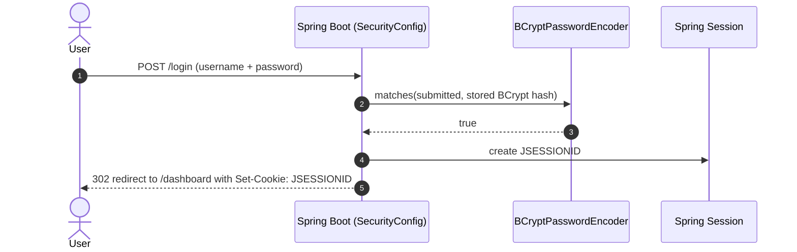

**Security assessment**

Two weaknesses undermine the form-login boundary:

- All fourteen in-memory accounts share the password "password" (`SecurityConfig.java:71–127`), so BCrypt's work factor provides no real barrier - the credential is publicly known.
- No rate-limiting filter is applied to `POST /login` or to the HTTP Basic path, enabling unlimited credential attempts.

**Relevant findings**

- 🔴 [F-001](#f-001) — Missing Authentication on Sensitive Data Endpoints — documents hardcoded uniform credentials that nullify BCrypt protection for all seeded accounts.
- 🔴 [F-005](#f-005) — Algorithm none JWT accepted via parseClaimsJwt — demonstrates that a parallel JWT path accepts unsigned tokens, bypassing form-login entirely.
- 🔴 [F-011](#f-011) — Unauthenticated User Promotion to Admin — records that submitted passwords are written to the application log on every login attempt.

<a id="signed-jwt-authentication"></a><a id="signed-jwt-authentication-hs256"></a>
**Signed JWT Authentication.**


**Status:** 🟡 Partial - Algorithm whitelist enforced; key is ephemeral and lost on restart, invalidating all sessions.

`src/main/java/com/example/appsecverificationtarget/authentication/SignedJwtService.java`

`SignedJwtService.java` issues 15-minute `HS256` bearer tokens signed with a key generated at bean initialization via `Keys.secretKeyFor(SignatureAlgorithm.HS256)` (line 19). The `verify()` method validates the signature against the in-memory key and explicitly rejects any header algorithm other than `HS256`.

**Security assessment**

The algorithm allowlist in `verify()` is correctly implemented. The key is held only in the JVM heap - a restart silently invalidates all live sessions without any revocation signal to clients. A separate hardcoded `JWT_SIGNING_KEY` baked into the Dockerfile (documented in [§6.9.5](#695-jwt-signing-key-management)) provides an additional key material risk.

**Relevant findings**

- 🔴 [F-001](#f-001) — Missing Authentication on Sensitive Data Endpoints — establishes that the broader authentication configuration ships hardcoded shared credentials.
- 🔴 [F-005](#f-005) — Algorithm none JWT accepted via parseClaimsJwt — shows a parallel verification path that accepts unsigned tokens regardless of this control.
- 🔴 [F-011](#f-011) — Unauthenticated User Promotion to Admin — covers credential exposure through logging that compromises sessions established via this path.

<a id="legacy-jwt-acceptance"></a><a id="legacy-jwt-acceptance-unsigned-tokens"></a>
**Legacy JWT Acceptance.**


**Status:** 🔴 Unsafe - Defeated: accepts unsigned JWTs, allowing arbitrary claim forgery.

`src/main/java/com/example/appsecverificationtarget/authentication/LegacyJwtVerifier.java`

`LegacyJwtVerifier.java` provides a second JWT parsing path consumed by legacy audit endpoints. It calls `Jwts.parserBuilder().build().parseClaimsJwt(token)` - the JJWT unsigned-token variant - with no signing key and no algorithm allowlist configured.

**Security assessment**

`parseClaimsJwt()` at `LegacyJwtVerifier.java:17` accepts tokens where the algorithm header is `none` and the signature segment is absent or empty. An attacker constructs a base64url-encoded header (`{"alg":"none"}`) and payload with arbitrary claims (`{"role":"admin"}`) and submits it to any endpoint that delegates to this verifier - no signing material is required.

**Relevant findings**

- 🔴 [F-001](#f-001) — Missing Authentication on Sensitive Data Endpoints — provides context on the authentication configuration that exposes this path to unauthenticated callers.
- 🔴 [F-005](#f-005) — Algorithm none JWT accepted via parseClaimsJwt — directly identifies the unsigned-JWT acceptance flaw at `LegacyJwtVerifier.java:17`.
- 🔴 [F-011](#f-011) — Unauthenticated User Promotion to Admin — covers downstream credential logging that captures tokens transiting this path.

<a id="homegrown-session-token"></a>
#### 6.2.1 Homegrown Session Token

**Status:** 🔴 Unsafe - Defeated: token is Base64-encoded user ID with no integrity protection, trivially forgeable.

`src/main/java/com/example/appsecverificationtarget/authentication/HomegrownSessionService.java`

`HomegrownSessionService.java` issues tokens for the legacy session endpoint. `issueToken()` encodes the caller's numeric database user ID as a UTF-8 Base64 string; `resolve()` decodes that string and performs a repository lookup by the resulting ID.

**Security assessment**

No cryptographic integrity protection exists on the token. `issueToken()` at `HomegrownSessionService.java:21` produces `Base64(userId.toString())`. An attacker encodes any integer to obtain a valid token for the user with that database ID - no knowledge of any secret is required.

**Relevant findings**

- 🔴 [F-001](#f-001) — Missing Authentication on Sensitive Data Endpoints — establishes that the surrounding authentication configuration provides no compensating control.
- 🔴 [F-005](#f-005) — Algorithm none JWT accepted via parseClaimsJwt — demonstrates a parallel unsigned-token path that similarly requires no secret material.
- 🔴 [F-011](#f-011) — Unauthenticated User Promotion to Admin — documents log-based credential exposure that also affects tokens issued via this mechanism.

<a id="credential-logging"></a>
**Credential Logging.**


**Status:** 🔴 Unsafe - Defeated: plaintext credentials written to application logs on every login attempt.

`src/main/java/com/example/appsecverificationtarget/authentication/CredentialLoggingFilter.java`

`CredentialLoggingFilter.java` is registered as an `OncePerRequestFilter` before `UsernamePasswordAuthenticationFilter` in the security chain. On every `POST /login` request it reads the `username` and `password` request parameters and logs them at INFO level via SLF4J.

**Security assessment**

`CredentialLoggingFilter.java:25` logs `Processing sign-in for username={} password={}` on every login attempt - both successful and failed. Any observer with read access to the log file, log aggregation pipeline, or container stdout receives submitted credentials in plaintext.

**Relevant findings**

- 🔴 [F-001](#f-001) — Missing Authentication on Sensitive Data Endpoints — shows that the seeded "password" credentials logged here are already known, compounding the exposure.
- 🔴 [F-005](#f-005) — Algorithm none JWT accepted via parseClaimsJwt — covers a parallel authentication path whose credentials can also transit this filter.
- 🔴 [F-011](#f-011) — Unauthenticated User Promotion to Admin — directly identifies the plaintext credential logging at `CredentialLoggingFilter.java:25`.

<a id="legacy-sqlite-credential-store"></a>
**Legacy SQLite Credential Store.**


**Status:** 🔴 Unsafe - Defeated: credentials stored and compared in cleartext; fixed weak default passwords seeded at startup.

`src/main/java/com/example/appsecverificationtarget/authentication/LegacySqliteUserStore.java`

`LegacySqliteUserStore.java` maintains a separate authentication database at `runtime/legacy-auth.sqlite`. On startup it seeds three accounts - `legacy_alice`/password, `legacy_bob`/password, and `legacy_admin`/admin - when the store is empty. The primary `authenticate()` method uses `PreparedStatement` with positional parameter binding.

**Security assessment**

Two defects combine at this credential store:

- Passwords are stored as plain text strings (no hash, no salt). A file copy of `runtime/legacy-auth.sqlite` directly yields all credentials without any cracking step.
- `authenticateRaw()` at `LegacySqliteUserStore.java:64` concatenates username and password into a raw SQL string, providing a SQL injection path reachable through the unauthenticated `/api/legacy-sqlite/**` endpoints.

**Relevant findings**

- 🔴 [F-001](#f-001) — Missing Authentication on Sensitive Data Endpoints — establishes that the seeded accounts use known weak credentials seeded at startup.
- 🔴 [F-005](#f-005) — Algorithm none JWT accepted via parseClaimsJwt — demonstrates alternative authentication paths that bypass this store entirely.
- 🔴 [F-011](#f-011) — Unauthenticated User Promotion to Admin — covers credential logging that also captures credentials submitted to the SQLite login path.

<a id="legacy-sqlite-cleartext-credential-storage"></a>
**Legacy SQLite Cleartext Credential Storage.**


**Status:** 🔴 Unsafe - Defeated: passwords stored and compared in cleartext in an unprotected SQLite file.

`src/main/java/com/example/appsecverificationtarget/authentication/LegacySqliteUserStore.java`

The `legacy_users` table schema in `LegacySqliteUserStore.java` declares the `password` column as `text not null` (line 31). The `save()` method inserts credentials with the submitted password string directly into this column.

**Security assessment**

Both `authenticate()` and `authenticateRaw()` compare the submitted string directly against the stored plaintext column value. A file-level read of `runtime/legacy-auth.sqlite` yields all usernames and passwords without any further processing. The `GET /api/legacy-sqlite/users` listing endpoint (mapped `permitAll()`) exposes the password field to unauthenticated callers.

**Relevant findings**

- 🔴 [F-001](#f-001) — Missing Authentication on Sensitive Data Endpoints — confirms that the seeded admin and user accounts use trivially guessable passwords stored without hashing.
- 🔴 [F-005](#f-005) — Algorithm none JWT accepted via parseClaimsJwt — shows that authentication bypass paths exist independently of this storage defect.
- 🔴 [F-011](#f-011) — Unauthenticated User Promotion to Admin — covers logging exposure that captures passwords submitted against this store.

<a id="security-event-logging"></a>
**Security Event Logging.**


**Status:** 🔴 Unsafe - Defeated: plaintext credential values written to logs; log access equals credential access.

`src/main/java/com/example/appsecverificationtarget/authentication/CredentialLoggingFilter.java`

`CredentialLoggingFilter.java` is the sole security-event instrument on the authentication path. It fires on every `POST /login` and captures the username and password before Spring Security processes the request.

**Security assessment**

The filter logs the raw password value rather than a masked or hashed representation (`CredentialLoggingFilter.java:25`). No audit logging exists for failed authentication, privilege escalation, account deletion, or other security-relevant events. Log access therefore yields credentials rather than supporting incident response.

**Relevant findings**

- 🔴 [F-001](#f-001) — Missing Authentication on Sensitive Data Endpoints — establishes that the logged "password" credentials are already uniform and externally known.
- 🔴 [F-005](#f-005) — Algorithm none JWT accepted via parseClaimsJwt — shows that credentials issued via unsigned-JWT paths are not captured by this logger, creating a blind spot.
- 🔴 [F-011](#f-011) — Unauthenticated User Promotion to Admin — directly identifies the cleartext credential logging at `CredentialLoggingFilter.java:25`.

### 6.3 Session and Token Controls

<a id="ctrl-session-and-token-controls"></a>

**Dependent crossings:** [tb-1](#tb-1) refuted - 🔴 [F-004](#f-004) — Hardcoded JWT signing key in container image ENV permits token forgery, 🔴 [F-013](#f-013) — H2 web console accessible without authentication grants full database access, 🔴 [F-016](#f-016) — Missing Authentication on Dangerous Sinks (`config/SecurityConfig.java:37`), +1 · [tb-2](#tb-2) refuted - 🔴 [F-014](#f-014) — Unauthenticated token issuance for arbitrary user ID (`AuthController.java:38`) · [tb-3](#tb-3) unconfirmed - 🔴 [F-005](#f-005) — Algorithm none JWT accepted via parseClaimsJwt (`LegacyJwtVerifier.java:17`)

**Verdict:** 🔴 Unsafe

<!-- The line below is mechanically derived from the controls table — LLM must not re-author it. -->
**Controls covered:**

- [6.3.1 CSRF Protection](#631-csrf-protection)
- [6.3.2 Session Cookie Hardening](#632-session-cookie-hardening)

**Implemented controls:** `src/main/java/com/example/appsecverificationtarget/config/SecurityConfig.java`; `src/main/java/com/example/appsecverificationtarget/config/SecurityConfig.java`.

**Assessment:** CSRF protection is disabled globally in the Spring Security filter chain, and session cookies carry no explicit `SameSite` attribute. The signed-JWT path issues 15-minute `HS256` bearer tokens as described in [§6.2](#62-identity-and-authentication-controls); the CSRF and cookie controls documented here govern the form-login session established alongside bearer authentication. Every state-changing endpoint is reachable from a cross-site page because neither a synchronizer token nor a `SameSite` restriction is enforced.

<a id="csrf-protection"></a>
#### 6.3.1 CSRF Protection

**Status:** 🔴 Unsafe - Defeated: CSRF protection disabled globally at the filter chain level.

`src/main/java/com/example/appsecverificationtarget/config/SecurityConfig.java`

Spring Security's default filter chain includes CSRF token validation via `CsrfFilter`. `SecurityConfig.java` removes this filter for all endpoints with `.csrf(AbstractHttpConfigurer::disable)` at line 28.

**Security assessment**

No CSRF token is required on any state-changing request. Form-login sessions produce a `JSESSIONID` cookie that browsers automatically attach to same-site and cross-site requests alike. Every POST, PUT, and DELETE endpoint - including `/legacy/admin/users/{id}/promote` and `PUT /api/profile/me` - is reachable from a cross-site page without any additional token.

**Relevant findings**

- No dedicated finding routed in this assessment.

<a id="session-cookie-hardening"></a>
#### 6.3.2 Session Cookie Hardening

**Status:** 🟠 Weak - Default Spring cookie attributes; Secure flag inapplicable without TLS; SameSite not explicitly configured.

`src/main/java/com/example/appsecverificationtarget/config/SecurityConfig.java`

Spring Boot issues `JSESSIONID` with `HttpOnly` set by default. No `server.servlet.session.cookie.*` properties are configured in `application.yml`, and no `SameSite` policy is declared in `SecurityConfig.java` or via a `CookieSameSiteSupplier` bean.

**Security assessment**

Without TLS (see [§6.9.6](#696-tls--transport-encryption)), the `Secure` flag would prevent cookie transmission over plain HTTP but is inapplicable in a plaintext-only deployment. `SameSite` is unset, defaulting to browser-specific behavior that varies by version. Combined with CSRF disabled at [§6.3.1](#631-csrf-protection), session cookies offer no cross-site isolation.

**Relevant findings**

- No dedicated finding routed in this assessment.

The diagram shows the signed-JWT issuance and bearer-token verification flow that runs parallel to the cookie session:

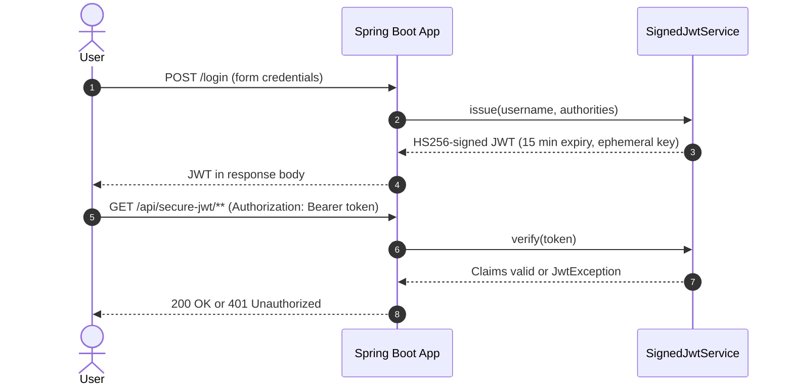

### 6.4 Authorization Controls

<a id="ctrl-authorization-controls"></a>

**Dependent crossings:** [tb-1](#tb-1) unconfirmed - 🔴 [F-045](#f-045) — SSRF-capable API endpoints accessible without authentication, 🔴 [F-046](#f-046) — Legacy admin routes exposed without authentication (`SecurityConfig.java:41`) · [tb-2](#tb-2) refuted - 🔴 [F-005](#f-005) — Algorithm none JWT accepted via parseClaimsJwt (`LegacyJwtVerifier.java:17`)


**Systemic weaknesses:** [W-002](#w-002)
**Verdict:** 🔴 Unsafe

<!-- The line below is mechanically derived from the controls table — LLM must not re-author it. -->
**Controls covered:**

- [6.4.1 Role-Based Access Control via @PreAuthorize](#641-role-based-access-control-via-preauthorize)
- [6.4.2 Legacy Admin Endpoint Access Control](#642-legacy-admin-endpoint-access-control)
- [6.4.3 Management and Actuator Endpoint Access Control](#643-management-and-actuator-endpoint-access-control)
- [6.4.4 H2 Console Access Control](#644-h2-console-access-control)
- [6.4.5 Object-Level Ownership Check](#645-object-level-ownership-check)

**Implemented controls:** `src/main/java/com/example/appsecverificationtarget/accesscontrol/AdminUserController.java`; `src/main/java/com/example/appsecverificationtarget/legacyadmin/LegacyAdminBoardController.java`; `src/main/resources/application.yml`; `src/main/resources/application.yml`; `src/main/java/com/example/appsecverificationtarget/accesscontrol/ProfileController.java`.

**Assessment:** `@EnableMethodSecurity` is active and several admin endpoints carry `@PreAuthorize("hasRole('ADMIN')")`. However, `SecurityConfig.java` explicitly permits unauthenticated access to `/legacy/admin/**`, `/h2-console/**`, `/actuator/**`, and several dangerous-sink API routes. Profile self-update allows callers to overwrite their own `role` and `admin` fields. The `@PreAuthorize` pattern therefore provides selective, not comprehensive, authorization coverage.

<a id="role-based-access-control-via-preauthorize"></a>
#### 6.4.1 Role-Based Access Control via @PreAuthorize

**Status:** 🟡 Partial - Present on select endpoints; absent on legacy admin routes and several profile/report operations.

`src/main/java/com/example/appsecverificationtarget/accesscontrol/AdminUserController.java`

`@EnableMethodSecurity` (declared on `SecurityConfig.java`) activates Spring's annotation-driven authorization engine. `AdminUserController.java` protects `POST /api/admin/users` with `@PreAuthorize("hasRole('ADMIN')")` at line 22. Several other controllers use the same annotation on role-restricted operations.

**Security assessment**

Method-level authorization is applied only where a developer individually added the annotation. The `SecurityConfig.java` permit-all rules for `/legacy/admin/**`, `/actuator/**`, and `/h2-console/**` (lines 33–42) override any downstream `@PreAuthorize` check for those paths. Sensitive mutation endpoints at `/api/profile/me` (PUT) and `/api/admin/report` (GET) carry no role restriction.

**Relevant findings**

- 🔴 [F-012](#f-012) — Self-Elevation via Admin Flag Mass Assignment — shows self-elevation through the unguarded profile update endpoint, demonstrating the gaps in annotation coverage.
- 🔴 [F-013](#f-013) — H2 web console accessible without authentication grants full database access — documents unauthenticated privilege promotion via the legacy admin board that `@PreAuthorize` does not reach.
- 🔴 [F-014](#f-014) — Unauthenticated token issuance for arbitrary user ID — identifies unauthenticated endpoints that expose sensitive operations outside method-security scope.

<a id="legacy-admin-endpoint-access-control"></a>
#### 6.4.2 Legacy Admin Endpoint Access Control

**Status:** 🔴 Unsafe - Defeated: unauthenticated privilege escalation and account deletion reachable at /legacy/admin/**.

`src/main/java/com/example/appsecverificationtarget/legacyadmin/LegacyAdminBoardController.java`

`LegacyAdminBoardController.java` serves a Thymeleaf admin board listing all users and providing promote and delete actions. `SecurityConfig.java` line 41 maps `/legacy/admin` and `/legacy/admin/**` as `permitAll()`.

**Security assessment**

`POST /legacy/admin/users/{id}/promote` at `LegacyAdminBoardController.java:28` sets the target user's `admin` flag and role to ADMIN with no authentication or authorization check. `POST /legacy/admin/users/{id}/delete` at line 36 deletes any account. An unauthenticated caller who supplies a valid numeric user ID performs either action.

**Relevant findings**

- 🔴 [F-012](#f-012) — Self-Elevation via Admin Flag Mass Assignment — establishes the self-elevation pathway through this unprotected board.
- 🔴 [F-013](#f-013) — H2 web console accessible without authentication grants full database access — directly identifies unauthenticated promotion via `LegacyAdminBoardController.java:28`.
- 🔴 [F-014](#f-014) — Unauthenticated token issuance for arbitrary user ID — documents the broader pattern of unauthenticated access to sensitive management surfaces.

<a id="management-and-actuator-endpoint-access-control"></a>
#### 6.4.3 Management and Actuator Endpoint Access Control

**Status:** 🔴 Unsafe - Defeated: all actuator endpoints unauthenticated; environment secrets returned in plaintext responses.

`src/main/resources/application.yml`

Spring Boot Actuator is included in the dependency set. `application.yml` sets `management.endpoints.web.exposure.include: "*"` (line 33) and `management.endpoint.env.show-values: ALWAYS` (line 36).

**Security assessment**

`SecurityConfig.java:33` permits all requests to `/actuator/**` without authentication. With `show-values: ALWAYS`, `GET /actuator/env` returns the `integration-token`, datasource credentials, and any secret injected as environment variables - including the Dockerfile-baked `JWT_SIGNING_KEY` and `AWS_ACCESS_KEY_ID` - in plaintext JSON to any caller.

**Relevant findings**

- 🔴 [F-012](#f-012) — Self-Elevation via Admin Flag Mass Assignment — shows that privilege-escalation surfaces accessible without authentication extend to actuator management endpoints.
- 🔴 [F-013](#f-013) — H2 web console accessible without authentication grants full database access — covers unauthenticated admin operations that the actuator's `POST /actuator/shutdown` and env-exposure compound.
- 🔴 [F-014](#f-014) — Unauthenticated token issuance for arbitrary user ID — identifies the `application.yml` and `SecurityConfig.java` configuration lines that expose actuator without authentication.

<a id="h2-console-access-control"></a>
#### 6.4.4 H2 Console Access Control

**Status:** 🔴 Unsafe - Defeated: H2 database console accessible without authentication at `/h2-console`.

`src/main/resources/application.yml`

H2's built-in web console is enabled via `spring.h2.console.enabled: true` in `application.yml` (line 10). The console provides a browser-based SQL interface to the in-memory H2 database backing the Spring Data JPA layer.

**Security assessment**

`SecurityConfig.java:32` maps `/h2-console/**` as `permitAll()`. Any client that reaches port 8080 accesses the full H2 web console with no authentication, granting interactive SQL access to all application tables - including the `app_users` table containing user records, roles, and password hashes.

**Relevant findings**

- 🔴 [F-012](#f-012) — Self-Elevation via Admin Flag Mass Assignment — establishes that unauthenticated database access enables direct privilege modification without going through the application layer.
- 🔴 [F-013](#f-013) — H2 web console accessible without authentication grants full database access — covers the unauthenticated access pattern that the H2 console shares with the legacy admin board.
- 🔴 [F-014](#f-014) — Unauthenticated token issuance for arbitrary user ID — identifies `SecurityConfig.java:32` and `application.yml:10` as the configuration lines that expose the console.

<a id="object-level-ownership-check"></a><a id="object-level-ownership-check-bolaidor"></a>
#### 6.4.5 Object-Level Ownership Check

**Status:** 🟠 Weak - Parameterized queries used; ownership checks inconsistently applied at the controller layer.

`src/main/java/com/example/appsecverificationtarget/accesscontrol/ProfileController.java`

`ProfileController.java` exposes `GET /api/profile/me` and `PUT /api/profile/me`, binding the profile resource to the authenticated principal's username via `Authentication.getName()` (lines 27, 36). The pattern correctly scopes the profile read to the calling user.

**Security assessment**

`PUT /api/profile/me` at `ProfileController.java:41` copies arbitrary fields from the request body - including `role`, `admin`, and `passwordHash` - onto the current user's record without restriction. The ownership check prevents modifying another user's record but does not prevent the authenticated caller from assigning themselves the ADMIN role or setting an arbitrary password hash.

**Relevant findings**

- 🔴 [F-012](#f-012) — Self-Elevation via Admin Flag Mass Assignment — directly identifies the mass-assignment of the `admin` flag via `ProfileController.java:47`.
- 🔴 [F-013](#f-013) — H2 web console accessible without authentication grants full database access — covers parallel ownership-bypass paths in other controllers where no check exists.
- 🔴 [F-014](#f-014) — Unauthenticated token issuance for arbitrary user ID — documents IDOR findings where ownership binding is absent entirely on other object-access endpoints.

### 6.5 Query Construction and Data Access Controls

<a id="ctrl-query-construction-and-data-access-controls"></a>

**Dependent crossings:** [tb-8](#tb-8) refuted - 🔴 [F-006](#f-006) — SQL injection in authenticateRaw (`LegacySqliteUserStore.java:64`)

**Verdict:** 🔴 Unsafe

<!-- The line below is mechanically derived from the controls table — LLM must not re-author it. -->
**Controls covered:**

- [6.5.1 Parameterized SQL via Spring Data JPA Repositories](#651-parameterized-sql-via-spring-data-jpa-repositories)
- [6.5.2 SQL Injection Prevention in Native Query DAOs](#652-sql-injection-prevention-in-native-query-daos)

**Implemented controls:** src/main/java/com/example/appsecverificationtarget/domain/; `src/main/java/com/example/appsecverificationtarget/inputvalidation/OrderLookupDao.java`.

**Assessment:** Spring Data JPA repositories use JPQL method-name derivation and `@Query` bindings throughout the domain layer - these paths are parameterized by construction. Two DAO classes bypass the JPA layer: `OrderLookupDao.java` calls `EntityManager.createNativeQuery()` with string concatenation, and `LegacySqliteUserStore.java` exposes `authenticateRaw()` using `Statement.executeQuery()` with a concatenated SQL string.

<a id="parameterized-sql-via-spring-data-jpa-repositories"></a>
#### 6.5.1 Parameterized SQL via Spring Data JPA Repositories

**Status:** 🟡 Partial - Adequate on repository paths; defeated in DAO and legacy SQLite paths.

src/main/java/com/example/appsecverificationtarget/domain/

`src/main/java/com/example/appsecverificationtarget/domain/` contains Spring Data JPA repository interfaces such as `AppUserRepository` and `CustomerOrderRepository`. These use derived query methods and `@Query` annotations that Hibernate translates to prepared statements with bound parameters.

**Security assessment**

Repository-backed queries are safe by construction. The defect pattern is isolated to two bypass paths: `OrderLookupDao.findByOwnerEmail()` and `LegacySqliteUserStore.authenticateRaw()` both concatenate caller-supplied strings directly into SQL. The JPA repositories provide no protection for callers that invoke these DAO methods instead.

**Relevant findings**

- 🔴 [F-006](#f-006) — SQL injection in authenticateRaw — identifies SQL injection in `OrderLookupDao.java:22`, where the JPA repository pattern is bypassed.
- 🔴 [F-007](#f-007) — SQL Injection — identifies SQL injection in `LegacySqliteUserStore.java:64`, the second bypass path that defeats this control.

<a id="sql-injection-prevention-in-native-query-daos"></a>
#### 6.5.2 SQL Injection Prevention in Native Query DAOs

**Status:** 🔴 Unsafe - Defeated: caller-supplied input concatenated directly into native SQL in multiple DAO classes.

`src/main/java/com/example/appsecverificationtarget/inputvalidation/OrderLookupDao.java`

`OrderLookupDao.java` performs order lookups via `EntityManager.createNativeQuery()`. The `findByOwnerEmail()` method receives a caller-supplied email string and constructs a query joining `customer_orders` and `app_users` tables.

**Security assessment**

`findByOwnerEmail()` at `OrderLookupDao.java:22` builds the SQL string by concatenating the `email` parameter with `+` operators - no positional parameter binding or named parameter is used. The `LegacySqliteUserStore.authenticateRaw()` method at `LegacySqliteUserStore.java:64` applies the same pattern against the SQLite authentication database.

The vulnerable pattern in `OrderLookupDao.java:22`:

```java
String sql = "select o.* from customer_orders o join app_users u on o.owner_id = u.id where u.email = '" + email + "' order by o.id";
```

**Relevant findings**

- 🔴 [F-006](#f-006) — SQL injection in authenticateRaw — directly identifies the `OrderLookupDao.java:22` SQL injection enabling order data exfiltration.
- 🔴 [F-007](#f-007) — SQL Injection — documents the `LegacySqliteUserStore.java:64` concatenation sink enabling authentication bypass.

### 6.6 Input Boundary Validation Controls

<a id="ctrl-input-boundary-validation-controls"></a>

**Dependent crossings:** [tb-1](#tb-1) unconfirmed - 🔴 [F-008](#f-008) — OS Command Injection via sh -c (`serverside/ToolController.java:18`), 🟠 [F-024](#f-024) — Remote build script fetched without integrity verification (`Dockerfile:21`), 🟠 [F-037](#f-037) — Path Traversal File Read (`serverside/FileReadController.java:19`), +3 · [tb-2](#tb-2) unconfirmed - 🔴 [F-006](#f-006) — SQL injection in authenticateRaw (`LegacySqliteUserStore.java:64`)

**Verdict:** 🟠 Weak

<!-- The line below is mechanically derived from the controls table — LLM must not re-author it. -->
**Controls covered:**

- [6.6.1 Validation Approach](#661-validation-approach)

**Implemented controls:** Hibernate Validator Bean Validation annotations (`@Valid`, `@NotNull`) on select domain objects; Spring Boot's Jackson-based `@RequestBody` binding for typed deserialization.

**Assessment:** No centralized request validation layer exists. Some domain object fields carry Bean Validation annotations, but file upload handlers, path parameter inputs, and SQL-bound parameters have no declared constraint. Upload size limits, path traversal guards, and pagination caps are absent.

<a id="validation-approach"></a>
#### 6.6.1 Validation Approach

**Status:** 🟠 Weak - Bean Validation present on some domain objects; missing on file upload size, path parameters, and SQL-bound inputs.

Hibernate Validator is on the classpath via `spring-boot-starter-validation` and is used for field-level constraints on some request body models. Jackson's `@RequestBody` binding provides typed deserialization, rejecting payloads that cannot deserialize to the declared type.

**Security assessment**

Three distinct validation gaps exist on the input boundary:

- File upload handlers in `BusinessFileStorage.java` apply no declared size cap, accepting arbitrarily large payloads.
- Path parameters passed to `FileReadController.java` are not normalized against a permitted base directory before file resolution.
- The `email` parameter supplied to `OrderLookupDao.findByOwnerEmail()` is not validated or typed before concatenation into SQL (detailed in [§6.5.2](#652-sql-injection-prevention-in-native-query-daos)).

**Relevant findings**

- 🟠 [F-041](#f-041) — Unbounded findAll Without Authentication — identifies missing size limit on uploads, enabling resource exhaustion through `BusinessFileStorage.java`.
- 🟠 [F-043](#f-043) — XXE Entity Expansion DoS — documents path traversal via unvalidated filename in upload and file-read paths.
- 🟡 [F-051](#f-051) — Output Injection via Unencoded User Content — covers unbounded data access through unauthenticated list endpoints without pagination constraints.

### 6.7 Output Encoding and Rendering Controls

**Verdict:** -

**Controls covered:** Not applicable.

**Implemented controls:** Thymeleaf context-aware auto-escaping is active for all server-rendered HTML pages.

**Assessment:** No XSS or sanitizer-bypass findings were routed to this category during this assessment.

_Not applicable for this codebase - no controls or findings are routed to 6.7 Output Encoding and Rendering Controls._

### 6.8 Browser and Cross-Origin Controls

**Verdict:** 🔴 Unsafe

<!-- The line below is mechanically derived from the controls table — LLM must not re-author it. -->
**Controls covered:**

- [6.8.1 Cross-Origin Resource Sharing Policy](#681-cross-origin-resource-sharing-policy)

**Implemented controls:** `src/main/java/com/example/appsecverificationtarget/cors/CorsPolicyFilter.java`.

**Assessment:** `CorsPolicyFilter.java` implements a custom CORS filter that reflects any `Origin` header beginning with "http" back as `Access-Control-Allow-Origin`, combined with `Access-Control-Allow-Credentials: true`. This configuration accepts credentialed cross-origin requests from any web origin, defeating the browser same-origin policy entirely.

<a id="cross-origin-resource-sharing-policy"></a>
#### 6.8.1 Cross-Origin Resource Sharing Policy

**Status:** 🔴 Unsafe - Defeated: any http/https origin reflected with credentials=true, defeating the same-origin policy.

`src/main/java/com/example/appsecverificationtarget/cors/CorsPolicyFilter.java`

`CorsPolicyFilter.java` is a servlet filter that handles CORS preflight and response headers. On each request it evaluates `isTrustedOrigin()` (line 31), and if the check passes, sets `Access-Control-Allow-Origin` to the reflected `Origin` value, `Access-Control-Allow-Credentials: true`, and permits all standard HTTP methods.

**Security assessment**

`isTrustedOrigin()` at `CorsPolicyFilter.java:32` trusts any non-null origin whose string value starts with "http" - which includes every `http://` and `https://` URL. The reflected origin plus `Allow-Credentials: true` means any attacker-controlled page on any domain makes authenticated cross-origin requests carrying the victim's session cookie or bearer token.

The permissive trust predicate:

```java
private boolean isTrustedOrigin(String origin) {
    return origin != null && origin.startsWith("http");
}
```

**Relevant findings**

- 🟠 [F-002](#f-002) — CSRF protection globally disabled — directly identifies the wildcard CORS origin reflection with credentials in `CorsPolicyFilter.java`.
- 🟠 [F-023](#f-023) — CSRF protection globally disabled across all state-changing endpoints — documents state-changing cross-site requests enabled by the combination of open CORS and disabled CSRF.
- 🟠 [F-028](#f-028) — CSRF token not validated against session — covers the cross-origin credential theft pathway that open CORS with `Allow-Credentials` enables.

### 6.9 Cryptography Secrets and Data Protection


**Systemic weaknesses:** [W-004](#w-004), [W-005](#w-005)
**Verdict:** 🔴 Unsafe

<!-- The line below is mechanically derived from the controls table — LLM must not re-author it. -->
**Controls covered:**

- [6.9.1 Password Hashing](#691-password-hashing)
- [6.9.2 Legacy Password Hashing](#692-legacy-password-hashing)
- [6.9.3 OTP / Token Generation Randomness](#693-otp--token-generation-randomness)
- [6.9.4 Homegrown and Custom Cipher Implementations](#694-homegrown-and-custom-cipher-implementations)
- [6.9.5 JWT Signing Key Management](#695-jwt-signing-key-management)
- [6.9.6 TLS / Transport Encryption](#696-tls--transport-encryption)

**Implemented controls:** `src/main/java/com/example/appsecverificationtarget/config/SecurityConfig.java`; `src/main/java/com/example/appsecverificationtarget/crypto/LegacyPasswordService.java`; `src/main/java/com/example/appsecverificationtarget/crypto/LegacyTokenService.java`; `src/main/java/com/example/appsecverificationtarget/crypto/HomegrownCipher.java`; `src/main/java/com/example/appsecverificationtarget/authentication/SignedJwtService.java`.

**Assessment:** BCrypt is correctly applied on the primary Spring Security password path. Outside that path: `MD5` is used for audit digests in `LegacyPasswordService.java`, `java.util.Random` generates OTPs in `LegacyTokenService.java`, a hand-rolled repeating-key XOR cipher with a compile-time constant key is in `HomegrownCipher.java`, four secret values are baked into the Dockerfile as `ENV` directives, and no TLS is configured at the application or declared upstream.

<a id="password-hashing"></a><a id="password-hashing-primary-store-bcrypt"></a>
#### 6.9.1 Password Hashing

**Status:** 🟢 Adequate - Adequate for primary store; legacy SQLite path is a separate Unsafe control.

`src/main/java/com/example/appsecverificationtarget/config/SecurityConfig.java`

`SecurityConfig.java` configures a `BCryptPasswordEncoder` bean (lines 131–133) and registers it as the application's `PasswordEncoder`. All in-memory user entries (lines 71–127) use `passwordEncoder.encode("password")` at construction. Spring Security's `DaoAuthenticationProvider` compares submitted credentials against the BCrypt-encoded value using `matches()`.

**Security assessment**

BCrypt is correctly applied on the primary Spring Security path. The sole weakness here is that all fourteen seeded accounts share the password "password" (`SecurityConfig.java:71–127`), making BCrypt's per-password salting irrelevant for these accounts - a single dictionary entry covers all of them. The legacy SQLite path uses no hashing and is documented separately under [§6.2.6](#62-identity-and-authentication-controls).

**Relevant findings**

- 🔴 [F-004](#f-004) — Hardcoded JWT signing key in container image ENV permits token forgery — shows that a hardcoded JWT signing key in the Dockerfile undermines the cryptographic boundary that BCrypt helps establish.
- 🔴 [F-010](#f-010) — AWS/JWT/DB secrets hardcoded in Dockerfile ENV and baked into image layers — documents Dockerfile-baked secrets that expose the broader credential surface.
- 🟠 [F-026](#f-026) — Hand-rolled XOR / repeating-key cipher — covers the hardcoded weak credential pattern that reduces BCrypt's effective protection to zero for seeded accounts.

<a id="legacy-password-hashing"></a><a id="legacy-password-hashing-md5"></a>
#### 6.9.2 Legacy Password Hashing

**Status:** 🔴 Unsafe - Defeated: `MD5` is cryptographically broken and must not be used for password or security digest operations.

`src/main/java/com/example/appsecverificationtarget/crypto/LegacyPasswordService.java`

`LegacyPasswordService.java` provides a `hashForAudit()` method used in audit reporting and registration flows. It calls `MessageDigest.getInstance("MD5")` (line 15) and returns a hex-encoded digest of the UTF-8 encoded input.

**Security assessment**

`MD5` at `LegacyPasswordService.java:15` has no salt, no iteration count, and no work factor. It is collision-prone and preimage-weak for short inputs. `MD5` hashes of common passwords are precomputed in publicly available rainbow tables; submitted values yield the original password without interaction with the application.

**Relevant findings**

- 🔴 [F-004](#f-004) — Hardcoded JWT signing key in container image ENV permits token forgery — establishes that the codebase relies on multiple broken cryptographic primitives across the authentication surface.
- 🔴 [F-010](#f-010) — AWS/JWT/DB secrets hardcoded in Dockerfile ENV and baked into image layers — covers the Dockerfile environment that exposes the keys used alongside these weak digest operations.
- 🟠 [F-026](#f-026) — Hand-rolled XOR / repeating-key cipher — directly identifies the MD5 usage at `LegacyPasswordService.java:15` for password-related operations.

<a id="otp-token-generation-randomness"></a>
#### 6.9.3 OTP / Token Generation Randomness

**Status:** 🔴 Unsafe - Defeated: `java.util.Random` is predictable; SecureRandom required for OTP generation.

`src/main/java/com/example/appsecverificationtarget/crypto/LegacyTokenService.java`

`LegacyTokenService.java` generates six-digit one-time tokens via `nextOtp()`. The method computes `100000 + random.nextInt(900000)` where `random` is a `java.util.Random` instance (line 10) initialized with a time-derived seed at construction.

**Security assessment**

`java.util.Random` is a linear congruential generator whose internal state is recoverable from two consecutive output values. An attacker who observes two OTP values predicts all subsequent values from the same instance, reducing the effective entropy from `log₂(900000)` ≈ 20 bits to the number of outputs needed to recover the seed.

**Relevant findings**

- 🔴 [F-004](#f-004) — Hardcoded JWT signing key in container image ENV permits token forgery — shows that the token forgery risk extends beyond JWT to OTP generation, compounding the credential surface.
- 🔴 [F-010](#f-010) — AWS/JWT/DB secrets hardcoded in Dockerfile ENV and baked into image layers — documents Dockerfile-baked secrets that share the same cryptographic weakness class.
- 🟠 [F-026](#f-026) — Hand-rolled XOR / repeating-key cipher — directly identifies the `java.util.Random` usage in `LegacyTokenService.java:10` for security-sensitive token generation.

<a id="homegrown-and-custom-cipher-implementations"></a>
#### 6.9.4 Homegrown and Custom Cipher Implementations

**Status:** 🔴 Unsafe - Defeated: hand-rolled cryptographic implementations provide no meaningful security guarantee.

`src/main/java/com/example/appsecverificationtarget/crypto/HomegrownCipher.java`

`HomegrownCipher.java` provides encode/decode operations for the legacy order-desk token flow. It XORs each input byte against the corresponding byte of the repeating key `"orderdesk-legacy-key"` and wraps the output in base64url.

**Security assessment**

Two defects combine to eliminate confidentiality:

- The XOR key is a compile-time constant (`HomegrownCipher.java:8`); anyone with the class file recovers all ciphertexts without interacting with the running service.
- Repeating-key XOR provides no semantic security: XORing two ciphertexts of equal-length plaintexts cancels the key and exposes the plaintext difference directly.

**Relevant findings**

- 🔴 [F-004](#f-004) — Hardcoded JWT signing key in container image ENV permits token forgery — establishes the pattern of hardcoded key material that also affects this cipher.
- 🔴 [F-010](#f-010) — AWS/JWT/DB secrets hardcoded in Dockerfile ENV and baked into image layers — covers broader Dockerfile secret exposure that compounds the known-key risk.
- 🟠 [F-026](#f-026) — Hand-rolled XOR / repeating-key cipher — directly identifies the hand-rolled XOR cipher and hardcoded key at `HomegrownCipher.java:8`.

<a id="jwt-signing-key-management"></a>
#### 6.9.5 JWT Signing Key Management

**Status:** 🟠 Weak - Ephemeral key lost on restart; external persistent key store required for production.

`src/main/java/com/example/appsecverificationtarget/authentication/SignedJwtService.java`

`SignedJwtService.java` generates the `HS256` signing key at bean initialization via `Keys.secretKeyFor(SignatureAlgorithm.HS256)` (line 19), held in a `final` instance field. The Dockerfile also bakes a separate `JWT_SIGNING_KEY` environment variable (`hardcoded-legacy-jwt-secret`) into the image layers at line 13.

**Security assessment**

The in-memory key from `SignedJwtService.java:19` is discarded on every JVM restart, invalidating all live sessions silently. The Dockerfile-baked `JWT_SIGNING_KEY` is visible in the container's environment and in any cached image layer, making it available to any process that can read container environment variables or inspect image history.

**Relevant findings**

- 🔴 [F-004](#f-004) — Hardcoded JWT signing key in container image ENV permits token forgery — directly identifies the hardcoded `JWT_SIGNING_KEY` baked into the Dockerfile at line 13.
- 🔴 [F-010](#f-010) — AWS/JWT/DB secrets hardcoded in Dockerfile ENV and baked into image layers — covers the full set of secrets baked into the Dockerfile environment alongside this JWT key.
- 🟠 [F-026](#f-026) — Hand-rolled XOR / repeating-key cipher — documents the broader hardcoded key material pattern that this control exemplifies.

<a id="tls-transport-encryption"></a>
#### 6.9.6 TLS / Transport Encryption

**Status:** 🔴 Missing - No TLS configured at application or declared upstream; all traffic is plaintext HTTP.

`src/main/resources/application.yml`

`application.yml` configures the server to listen on port 8080 (line 22) with no `server.ssl.*` properties. No reverse-proxy TLS terminator is declared in the repository (`docker-compose.yml` does not configure an HTTPS upstream).

**Security assessment**

All traffic - including HTTP Basic credentials, `JSESSIONID` cookies, bearer JWTs, and OTPs - travels over unencrypted HTTP. `SecurityConfig.java:61` enables HTTP Basic with `.httpBasic(Customizer.withDefaults())`, transmitting credentials as a base64-encoded `Authorization` header on every request to any authenticated endpoint. Without TLS, any network observer reads these values.

**Relevant findings**

- 🔴 [F-004](#f-004) — Hardcoded JWT signing key in container image ENV permits token forgery — shows that JWT tokens transmitted without TLS are readable by any on-path observer who can then replay them.
- 🔴 [F-010](#f-010) — AWS/JWT/DB secrets hardcoded in Dockerfile ENV and baked into image layers — documents that secrets baked into the Dockerfile also transit the unencrypted HTTP channel when used as bearer values.
- 🟠 [F-026](#f-026) — Hand-rolled XOR / repeating-key cipher — covers the HTTP Basic cleartext credential transmission enabled by the missing TLS configuration.

### 6.10 File Parser and Outbound Request Controls

<a id="ctrl-file-parser-and-outbound-request-controls"></a>

**Dependent crossings:** [tb-10](#tb-10) refuted - 🟠 [F-039](#f-039) — SSRF via Caller-Supplied URL (`serverside/IntegrationController.java:23`)


**Systemic weaknesses:** [W-003](#w-003)
**Verdict:** 🔴 Unsafe

<!-- The line below is mechanically derived from the controls table — LLM must not re-author it. -->
**Controls covered:**

- [6.10.1 SSRF Prevention](#6101-ssrf-prevention)

**Implemented controls:** `src/main/java/com/example/appsecverificationtarget/serverside/IntegrationController.java`.

**Assessment:** `IntegrationController.java` exposes `GET /api/integration/fetch?url=<caller-supplied>`, mapped as `permitAll()` in `SecurityConfig.java:37`. The caller-supplied URL is passed directly to `RestTemplate.getForObject()` with no scheme restriction, host validation, or allowlist. Additional server-side sinks include a path-traversal-vulnerable file reader and an XXE-vulnerable XML parser.

<a id="ssrf-prevention"></a><a id="ssrf-prevention-outbound-http"></a>
#### 6.10.1 SSRF Prevention

**Status:** 🔴 Unsafe - Defeated: caller supplies arbitrary URL; no destination allowlist; endpoint unauthenticated.

`src/main/java/com/example/appsecverificationtarget/serverside/IntegrationController.java`

`IntegrationController.java` fetches remote content on behalf of the caller. `GET /api/integration/fetch` accepts a `url` query parameter and passes it to `restTemplate.getForObject(url, String.class)` (line 23), returning up to 2,000 characters of the response body.

**Security assessment**

The `url` parameter flows directly to `RestTemplate` at `IntegrationController.java:23` without scheme restriction, hostname validation, or IP range blocking. The endpoint is mapped `permitAll()` at `SecurityConfig.java:37` - no authentication is required. A caller supplies `http://169.254.169.254/latest/meta-data/` or `http://localhost:8080/actuator/env` and receives the first 2,000 characters of the internal response.

**Relevant findings**

- 🔴 [F-008](#f-008) — OS Command Injection via sh -c — directly identifies the SSRF sink at `IntegrationController.java:23` enabling arbitrary outbound requests.
- 🔴 [F-009](#f-009) — Unauthenticated actuator `/env` exposes all config secrets in plaintext — covers the path traversal file-read endpoint that shares the unauthenticated exposure pattern.
- 🟠 [F-025](#f-025) — Command injection Java — documents that SSRF-capable endpoints are accessible without authentication per `SecurityConfig.java:37`.

### 6.11 Operations Runtime and Supply Chain Controls

**Verdict:** 🔴 Missing

<!-- The line below is mechanically derived from the controls table — LLM must not re-author it. -->
**Controls covered:**

- [6.11.1 Dependency Pinning and Vulnerability Scanning](#6111-dependency-pinning-and-vulnerability-scanning)
- [6.11.2 Automated SCA scanning](#6112-automated-sca-scanning)
- [6.11.3 Automated dependency updates](#6113-automated-dependency-updates)
- [6.11.4 Lockfile hygiene](#6114-lockfile-hygiene)

**Implemented controls:** `pom.xml` declares explicit versions for Spring Boot 3.2.12, JJWT 0.11.5, and SQLite JDBC `3.46.1.0`; `package-lock.json` is committed to the repository root.

**Assessment:** No automated dependency vulnerability scanning or automated update service is configured. The Dockerfile fetches a remote installation script at build time without integrity verification and runs it as root. The base image (`openjdk:17-slim`) is not pinned to a digest, and all application directories are set world-writable at build time.

<a id="dependency-pinning-and-vulnerability-scanning"></a>
#### 6.11.1 Dependency Pinning and Vulnerability Scanning

**Status:** 🔴 Missing - No dependency scanning or lockfile mechanism found in repository scope.

Dependency pinning anchors build inputs to known-good versions, reducing the risk of a compromised or modified package being silently substituted. `pom.xml` pins three direct dependency versions explicitly; Spring Boot's BOM manages transitive versions within the declared parent version.

**Security assessment**

No SCA scanner - Dependabot, Renovate, OWASP Dependency Check, or Snyk - is integrated with the repository or CI pipeline. The Dockerfile base image `openjdk:17-slim` (line 1) is referenced by tag, not by `@sha256:<digest>`, so the image resolved at build time may silently change between builds.

**Relevant findings**

- 🟠 [F-003](#f-003) — Missing Security Audit Logging Across Components — identifies the unpinned Dockerfile base image that can resolve to a different image layer on each build.
- 🟠 [F-024](#f-024) — Remote build script fetched without integrity verification — documents the remote script piped to shell at `Dockerfile:21` without integrity verification, a supply chain injection point.
- 🟠 [F-032](#f-032) — Cleartext credentials logged per login — covers the absence of SCA scanning that would surface known-vulnerable transitive dependencies.

<a id="automated-sca-scanning"></a>
#### 6.11.2 Automated SCA scanning

**Status:** 🔴 Missing - No SCA scanner or repository dependency alert integration is configured.

Software composition analysis tools continuously compare dependency manifests against vulnerability databases, alerting when a newly disclosed CVE affects a dependency version in use. This ensures known-vulnerable packages are identified promptly without manual tracking.

**Security assessment**

`pom.xml` contains no SCA plugin configuration, and no GitHub Actions workflow exists in the repository. Known vulnerabilities in JJWT 0.11.5 or any transitive dependency will not surface without a manual `mvn dependency-check:check` invocation. The current Spring Boot parent version 3.2.12 and all transitive dependencies are unverified against current CVE databases.

**Relevant findings**

- 🟠 [F-003](#f-003) — Missing Security Audit Logging Across Components — establishes the supply chain exposure that absent SCA scanning leaves unmonitored.
- 🟠 [F-024](#f-024) — Remote build script fetched without integrity verification — documents additional build-time supply chain risk from the remote-script-pipe pattern in the Dockerfile.
- 🟠 [F-032](#f-032) — Cleartext credentials logged per login — directly identifies the missing SCA integration as a structural gap in the supply chain posture.

<a id="automated-dependency-updates"></a>
#### 6.11.3 Automated dependency updates

**Status:** 🔴 Missing - No Dependabot or Renovate configuration found; dependency versions are updated only through manual commits.

Automated dependency update services open pull requests when newer non-breaking versions of direct dependencies are published, keeping the dependency tree current and reducing the window between vulnerability disclosure and patch application.

**Security assessment**

No `.github/dependabot.yml` or Renovate configuration file is present in the repository. Dependency versions in `pom.xml` will accumulate age silently; the gap between a CVE disclosure and a patch in this repository depends entirely on developer initiative rather than automated notification.

**Relevant findings**

- 🟠 [F-003](#f-003) — Missing Security Audit Logging Across Components — shows that the Dockerfile base image staleness is a direct consequence of absent automated update tracking.
- 🟠 [F-024](#f-024) — Remote build script fetched without integrity verification — covers build-time dependency risk that manual-only updates leave unaddressed.
- 🟠 [F-032](#f-032) — Cleartext credentials logged per login — documents the missing automated update mechanism as a control gap.

<a id="lockfile-hygiene"></a>
#### 6.11.4 Lockfile hygiene

**Status:** 🟢 Adequate - `package-lock.json` is committed and present; Maven BOM-managed versions are declared in `pom.xml`.

A committed lockfile records exact resolved dependency versions, ensuring reproducible builds and providing a stable manifest for SCA scanning tools to analyze.

**Security assessment**

`package-lock.json` is committed to the repository root, recording exact resolved versions for Node tooling dependencies. The Maven build uses the Spring Boot parent BOM (`version 3.2.12`), producing deterministic transitive version resolution within a BOM release. No `--ignore-lockfile` or `--no-package-lock` flag is present in build scripts. The remaining gap is that no scanner currently acts on this lockfile data (documented in [§6.11.2](#6112-automated-sca-scanning)).

**Relevant findings**

- 🟠 [F-003](#f-003) — Missing Security Audit Logging Across Components — establishes that the committed lockfile provides the manifest needed for the SCA scanning that is currently absent.
- 🟠 [F-024](#f-024) — Remote build script fetched without integrity verification — covers build-time supply chain risk that lockfile hygiene alone does not mitigate.
- 🟠 [F-032](#f-032) — Cleartext credentials logged per login — documents the SCA gap that prevents the committed lockfile from being acted upon automatically.

### 6.12 Real-time and Not Applicable Controls

<!-- §6.12 LOCKED — mechanically derived from absence of real-time findings. Renderer must not rewrite the line below. -->
_Not applicable - no real-time / WebSocket findings routed to this category, and no AI/LLM, GraphQL, or gRPC surfaces detected by the recon scan. Controls catalogued elsewhere (container hardening, dependency determinism) are covered in their primary [§6](#6-security-architecture) sections._

### 6.13 Defense-in-Depth Summary

**Verdict:** 🔴 Unsafe

BCrypt password encoding is correctly applied on the primary Spring Security login path via `SecurityConfig.java`'s `BCryptPasswordEncoder` bean. The `SignedJwtService.java` `HS256` verification path enforces an algorithm allowlist, rejecting any token whose header names an algorithm other than `HS256`. Spring Data JPA repository interfaces use parameterized JPQL by construction across the domain layer, and `package-lock.json` is committed, providing a reproducible dependency footprint for Node tooling.

Restoring layered defense requires repairs across six boundaries in priority order: replace `authenticateRaw()` string concatenation with `PreparedStatement` binding and `isTrustedOrigin()` prefix-matching with an explicit origin allowlist; remove all secret `ENV` directives from the Dockerfile and inject credentials at container startup via a secret manager or runtime environment; re-enable CSRF protection and set `SameSite=Strict` on session cookies; restrict `/actuator/**`, `/h2-console/**`, and `/legacy/admin/**` to authenticated callers with an ADMIN role; replace `HomegrownCipher` and `LegacyTokenService`'s `java.util.Random` with authenticated encryption from a vetted library and `SecureRandom` respectively; and configure TLS termination on any non-loopback bind before enabling HTTP Basic.

<!-- enriched:standard -->

---

<a id="weakness-register"></a>
## 7. Weakness Register

Systemic control gaps behind the findings, ordered by severity (W-001 = most severe). Each weakness names the missing, home-grown, or misused control, the findings that evidence it, the components it spans, and its remediation. A weakness may also rest on observed unsafe practice or an absent architectural control with no confirmed exploit - only confirmed findings carry a CVSS score.

- 🔴 **Critical** · [W-001](#w-001) - Endpoints are reachable without enforced authentication · confirmed · 3 findings · 3 components
- 🔴 **Critical** · [W-002](#w-002) - Authorization is implemented route by route · confirmed · 7 findings · 4 components
- 🟠 **High** · [W-003](#w-003) - Input handling lacks enforced boundary validation · confirmed · 2 findings · 2 components
- 🟡 **Medium** · [W-004](#w-004) - Cryptographic security is implemented in application code · observed-practice · 1 finding · 1 component
- 🟡 **Medium** · [W-005](#w-005) - Security-sensitive data uses weak cryptographic primitives · observed-practice · 3 findings · 2 components

<a id="w-001"></a>
### W-001 — Endpoints are reachable without enforced authentication

🔴 **Critical** · design weakness · confirmed · 3 findings

Sensitive API routes and real-time channels are exposed without an enforced authentication check at the endpoint boundary. Access control depends on each handler (or the caller) remembering to require a session, so an unauthenticated client can reach privileged operations directly.

**Confirmed findings:**

- 🔴 [F-001](#f-001) — Missing Authentication on Sensitive Data Endpoints
- 🔴 [F-011](#f-011) — Unauthenticated User Promotion to Admin (`LegacyAdminBoardController.java:28`)
- 🔴 [F-016](#f-016) — Missing Authentication on Dangerous Sinks (`config/SecurityConfig.java:37`)

**Architecture evidence:** Route Authentication Middleware, Server-Side Session Enforcement

**Affected components:** [C-03](#c-03), [C-08](#c-08), [C-07](#c-07)

**Remediation:**

- **Structural** — enforce authentication centrally at the routing and channel boundary so every exposed endpoint requires a verified session unless explicitly marked public
- **Tactical** — ● [M-001](#m-001) — Require authentication on every exposed endpoint, ● [M-011](#m-011) — Require authentication on every exposed endpoint, ● [M-016](#m-016) — Require authentication on every exposed endpoint

<a id="w-002"></a>
### W-002 — Authorization is implemented route by route

🔴 **Critical** · design weakness · confirmed · 7 findings

Authorization depends on per-handler checks instead of a policy boundary that consistently enforces role, ownership, and tenant scope. New routes can bypass protection by omitting a local check.

**Architectural anti-pattern - Missing server-side authorization layer.** Spring Security's permit-all rules open dozens of paths including admin promotion, the database console, and credential retrieval; there is no authorization fallback, so every unguarded route is reachable from the internet without credentials.

**Confirmed findings:**

- 🔴 [F-013](#f-013) — H2 web console accessible without authentication grants full database access
- 🔴 [F-014](#f-014) — Unauthenticated token issuance for arbitrary user ID (`AuthController.java:38`)
- 🔴 [F-015](#f-015) — Authorization via forgeable JWT role claim (`LegacyAdminAuditController.java:40`)
- 🟠 [F-040](#f-040) — Insecure Direct Object Reference
- 🔴 [F-044](#f-044) — IDOR on Order Access Without Ownership Check (`OrderAccessController.java:23`)
- 🔴 [F-045](#f-045) — SSRF-capable API endpoints accessible without authentication
- 🔴 [F-046](#f-046) — Legacy admin routes exposed without authentication (`SecurityConfig.java:41`)

**Architecture evidence:** Centralised AuthZ Policy, Role / Scope Enforcement, Ownership Check

**Affected components:** [C-03](#c-03), [C-01](#c-01), [C-02](#c-02), [C-04](#c-04)

**Remediation:**

- **Structural** — enforce authorization through a shared server-side policy layer and make ownership and tenant scope mandatory inputs to data access
- **Tactical** — ● [M-013](#m-013) — Enforce server-side authorization on every endpoint, ● [M-014](#m-014) — Enforce server-side authorization on every endpoint, ● [M-015](#m-015) — Enforce correct server-side authorization, ◕ [M-039](#m-039) — Enforce object-level (ownership) authorization, ◕ [M-043](#m-043) — Enforce object-level (ownership) authorization, ◕ [M-044](#m-044) — Enforce server-side authorization on every endpoint, ◕ [M-045](#m-045) — Enforce server-side authorization on every endpoint

<a id="w-003"></a>
### W-003 — Input handling lacks enforced boundary validation

🟠 **High** · design weakness · confirmed · 2 findings

Request handlers do not validate input against one enforced server-side schema or allowlist at the boundary - validation is either absent on the vulnerable parameters or limited to rejecting selected bad patterns (a blacklist). New encodings and unanticipated input forms can therefore reach downstream parsers or interpreters.

**Confirmed findings:**

- 🟠 [F-037](#f-037) — Path Traversal File Read (`serverside/FileReadController.java:19`)
- 🟠 [F-048](#f-048) — Path traversal via upload filename (`web/BusinessFileStorage.java:23`)

**Architecture evidence:** Schema Validation, Allowlist Validation

**Affected components:** [C-07](#c-07), [C-04](#c-04)

**Remediation:**

- **Structural** — enforce server-side schemas and domain-specific allowlists before input reaches parsing, persistence, or command construction
- **Tactical** — ◕ [M-036](#m-036) — Constrain file paths to a safe base directory, ◕ [M-047](#m-047) — Constrain file paths to a safe base directory

<a id="w-004"></a>
### W-004 — Cryptographic security is implemented in application code

🟡 **Medium** · implementation weakness · observed-practice · 1 finding

Application code owns cryptographic protocol, key, or primitive decisions that should be fixed by a vetted platform or library. Security then depends on every caller choosing compatible algorithms and parameters.

**Practice sites:**

- 🟠 [F-026](#f-026) — Hand-rolled XOR / repeating-key cipher src/main/java/com/example/appsecverifica… (`src/main/java/com/example/appsecverificationtarget/crypto/HomegrownCipher.java:14`)

**Affected components:** backend-api

**Remediation:**

- **Structural** — replace application-owned cryptographic protocol and key handling with a vetted library or managed cryptographic service
- **Tactical** — ◕ [M-026](#m-026) — Replace the weak cryptographic algorithm

<a id="w-005"></a>
### W-005 — Security-sensitive data uses weak cryptographic primitives

🟡 **Medium** · implementation weakness · observed-practice · 3 findings

Password, token, or integrity protection uses a weak hash, predictable random source, or insufficient work factor. The application may use a standard library, but the selected primitive does not provide the required security property.

**Practice sites:**

- 🟠 [F-033](#f-033) — MD5 used for password hashing in registration (`LegacyPasswordService.java:15`) (`src/main/java/com/example/appsecverificationtarget/crypto/LegacyPasswordService.java:15`)
- 🟠 [F-047](#f-047) — Predictable OTP via non-CSPRNG Random (`LegacyTokenService.java:10`) (`src/main/java/com/example/appsecverificationtarget/crypto/LegacyTokenService.java:10`)
- 🟠 [F-050](#f-050) — AES/ECB mode allows ciphertext block manipulation (`LegacyCryptoService.java:17`) (`src/main/java/com/example/appsecverificationtarget/crypto/LegacyCryptoService.java:17`)

**Affected components:** [C-02](#c-02), [C-08](#c-08)

**Remediation:**

- **Structural** — standardise on a password KDF, a CSPRNG for secrets, and modern authenticated cryptographic primitives with centrally reviewed parameters
- **Tactical** — ◕ [M-032](#m-032) — Hash passwords with a strong, salted algorithm, ◕ [M-046](#m-046) — Use cryptographically secure random values, ◑ [M-049](#m-049) — Replace the weak cryptographic algorithm

---

## 8. Findings Register

Findings are grouped by severity (Critical → High → Medium → Low); within a tier they are ordered by attack vektor (Repo-Read → Internet-Anon → Internet-User → Victim-Required). Each finding is a card with the same fixed fields, in order: **Severity · Component · Location** → **Issue** → **Root cause** → **Evidence** → **Fix** → **Classification** (with external CWE / OWASP links).

**Risk Distribution:** 🔴 Critical: 14 · 🟠 High: 34 · 🟡 Medium: 4 · 🟢 Low: n/a · **Total findings: 52**
**STRIDE Coverage:** Spoofing: 7 · Tampering: 13 · Repudiation: 1 · Information Disclosure: 15 · Denial of Service: 4 · Elevation of Privilege: 12

The systemic root-cause view is summarized in **Top Weaknesses** in the Management Summary; evidence-backed weaknesses are documented in the [Weakness Register](#weakness-register).

**Findings index:**<br/>🔴 [F-001](#f-001) — Missing Authentication on Sensitive Data Endpoints<br/>🔴 [F-004](#f-004) — Hardcoded JWT signing key in container image ENV permits token forgery…<br/>🔴 [F-005](#f-005) — Algorithm none JWT accepted via parseClaimsJwt…<br/>🔴 [F-006](#f-006) — SQL injection in authenticateRaw (`LegacySqliteUserStore.java:64`)…<br/>🔴 [F-007](#f-007) — SQL Injection<br/>🔴 [F-008](#f-008) — OS Command Injection via sh -c (`serverside/ToolController.java:18`)…<br/>🔴 [F-009](#f-009) — Unauthenticated actuator `/env` exposes all config secrets in plaintext…<br/>🔴 [F-010](#f-010) — AWS/JWT/DB secrets hardcoded in Dockerfile ENV and baked into image…<br/>🔴 [F-011](#f-011) — Unauthenticated User Promotion to Admin…<br/>🔴 [F-012](#f-012) — Self-Elevation via Admin Flag Mass Assignment…<br/>🔴 [F-013](#f-013) — H2 web console accessible without authentication grants full database…<br/>🔴 [F-014](#f-014) — Unauthenticated token issuance for arbitrary user ID…<br/>🔴 [F-015](#f-015) — Authorization via forgeable JWT role claim…<br/>🔴 [F-016](#f-016) — Missing Authentication on Dangerous Sinks…<br/>🔴 [F-017](#f-017) — Hardcoded Credential Stored as Password Hash…<br/>🔴 [F-018](#f-018) — Hardcoded uniform 'password' credential for all demo accounts<br/>🔴 [F-022](#f-022) — Mass Assignment of Password Hash via PUT /me…<br/>🔴 [F-029](#f-029) — Hardcoded XOR key permits offline token forgery…<br/>🔴 [F-036](#f-036) — Wildcard CORS origin reflection with credentials…<br/>🔴 [F-044](#f-044) — IDOR on Order Access Without Ownership Check…<br/>🔴 [F-045](#f-045) — SSRF-capable API endpoints accessible without authentication…<br/>🔴 [F-046](#f-046) — Legacy admin routes exposed without authentication…<br/>🟠 [F-002](#f-002) — CSRF protection globally disabled (`config/SecurityConfig.java:28`)…<br/>🟠 [F-003](#f-003) — Missing Security Audit Logging Across Components<br/>🟠 [F-019](#f-019) — Integrity-free Base64 session token forgeable…<br/>🟠 [F-020](#f-020) — Missing auth on token issuance endpoint…<br/>🟠 [F-021](#f-021) — Plaintext credential storage in SQLite (`LegacySqliteUserStore.java:31`)…<br/>🟠 [F-023](#f-023) — CSRF protection globally disabled across all state-changing endpoints…<br/>🟠 [F-024](#f-024) — Remote build script fetched without integrity verification…<br/>🟠 [F-025](#f-025) — Command injection Java src/main/java/com/example/appsecverificationtarg…<br/>🟠 [F-026](#f-026) — Hand-rolled XOR / repeating-key cipher…<br/>🟠 [F-028](#f-028) — CSRF token not validated against session…<br/>🟠 [F-030](#f-030) — HTTP Basic credentials transmitted in cleartext over unencrypted HTTP…<br/>🟠 [F-031](#f-031) — Cleartext passwords in unauth user listing…<br/>🟠 [F-032](#f-032) — Cleartext credentials logged per login…<br/>🟠 [F-033](#f-033) — MD5 used for password hashing in registration…<br/>🟠 [F-034](#f-034) — Dockerfile base image must be digest-pinned — `Dockerfile:1`<br/>🟠 [F-035](#f-035) — `Package-lock.json` present and committed — `package-lock.json`<br/>🟠 [F-037](#f-037) — Path Traversal File Read (`serverside/FileReadController.java:19`)…<br/>🟠 [F-038](#f-038) — XXE Enables Local File Read via External Entity…<br/>🟠 [F-039](#f-039) — SSRF via Caller-Supplied URL (`serverside/IntegrationController.java:23`)…<br/>🟠 [F-040](#f-040) — Insecure Direct Object Reference<br/>🟠 [F-041](#f-041) — Unbounded findAll Without Authentication…<br/>🟠 [F-042](#f-042) — No rate limiting on authentication endpoints enables credential…<br/>🟠 [F-043](#f-043) — XXE Entity Expansion DoS (`serverside/XmlPreviewController.java:22`)…<br/>🟠 [F-047](#f-047) — Predictable OTP via non-CSPRNG Random (`LegacyTokenService.java:10`)…<br/>🟠 [F-048](#f-048) — Path traversal via upload filename (`web/BusinessFileStorage.java:23`)…<br/>🟠 [F-049](#f-049) — Unverified password change (`web/ProfilePageController.java:61`)…<br/>🟠 [F-050](#f-050) — AES/ECB mode allows ciphertext block manipulation…<br/>🟡 [F-051](#f-051) — Output Injection via Unencoded User Content…<br/>🟡 [F-052](#f-052) — Dockerfile USER directive (non-root) — `Dockerfile:1`<br/>🟡 [F-053](#f-053) — Unbounded file upload size (`web/BusinessFileStorage.java:13`)…

<a id="th-01"></a><a id="th-02"></a><a id="th-03"></a><a id="th-06"></a><a id="th-09"></a><a id="th-17"></a><a id="th-07"></a><a id="th-08"></a><a id="th-12"></a><a id="th-14"></a><a id="th-15"></a><a id="th-16"></a>

### 🔴 Critical (14)

<a id="t-001"></a><a id="f-001"></a>
#### F-001 · Missing Authentication on Sensitive Data Endpoints

**Severity:** 🔴 Critical  ·  **Component:** [C-08](#c-08) - Crypto and Token Service  ·  **Location:** Multiple locations (3)

**Weakness:** [W-001](#w-001) - Endpoints are reachable without enforced authentication

**Instances (3):** 🟡 `src/main/java/com/example/appsecverificationtarget/accesscontrol/AdminReportController.java:34`, 🟠 `src/main/java/com/example/appsecverificationtarget/legacyadmin/LegacyAdminBoardController.java:24`, 🔴 `src/main/java/com/example/appsecverificationtarget/crypto/CustomCryptoController.java:41`

**Issue:** GET `/api/legacy-crypto/credentials` is permitted without authentication (`SecurityConfig.java:46`); the handler at `CustomCryptoController.java:40-47` calls `VaultCredentialRepository.findAll()` and, for every record, maps username, the raw ciphertext secret, and the HomegrownCipher-decoded plaintext password (via `recoverPassword()`) into the JSON response, disclosing every stored credential in cleartext to any unauthenticated caller. Every vault credential stored in the database, including its decoded plaintext secret, is returned to any unauthenticated caller, enabling complete credential theft from the vault.

**Evidence:** ✓ verified - `CustomCryptoController.java:41` calls `vaultCredentialRepository.findAll()` inside a GET handler with no @PreAuthorize or security annotation; line 45 calls `customCryptoService.recoverPassword()` to include the XOR-decoded plaintext secret in the response; `SecurityConfig.java:46` explicitly permits `/api/legacy`-crypto/** without authentication.

```java
// src/main/java/com/example/appsecverificationtarget/crypto/CustomCryptoController.java:41

    @GetMapping("/credentials")
    public List<Map<String, String>> credentials() {
        return vaultCredentialRepository.findAll().stream()
                .map(credential -> Map.of(
                        "username", credential.getUsername(),
                        "secret", credential.getSecret(),
```

**Fix:** ● [M-001](#m-001) — Require authentication on every exposed endpoint (`CustomCryptoController.java:41`)

**Classification:** Unauthenticated Management Plane · STRIDE: Information Disclosure · [CWE-306](https://cwe.mitre.org/data/definitions/306.html) · [OWASP A01:2025](https://owasp.org/Top10/2025/A01_2025-Broken_Access_Control/) · walkthrough [Walkthrough §3.7](#37-missing-authentication-on-sensitive-data-endpoints-in-crypto-and-token-service)

<a id="t-004"></a><a id="f-004"></a>
#### F-004 · Hardcoded JWT signing key in container image ENV permits token forgery

**Severity:** 🔴 Critical  ·  **Component:** [C-01](#c-01) - API Gateway / Spring Boot Entry Point  ·  **Location:** `Dockerfile:13`

**Trust boundary gap:** [tb-1](#tb-1) 🌐 External - external → api-gateway · Authentication: The hardcoded signing key nullifies the JWT authentication leg of the external→api-gateway boundary by allowing offline token forgery.

**Issue:** An attacker who obtains the Docker image reads `JWT_SIGNING_KEY`=hardcoded-legacy-jwt-secret from ENV metadata, signs an arbitrary JWT claiming admin identity using `HS256`, and authenticates to all JWT-protected endpoints without possessing a legitimate credential. Attacker forges JWT tokens for any principal including admin, bypassing all JWT-based authentication on all protected routes.

**Evidence:** ✓ verified - Dockerfile line 13 contains `ENV JWT_SIGNING_KEY=hardcoded-legacy-jwt-secret` baked as a static image layer; any party with image read access recovers the key via docker inspect without any additional exploitation.

**Fix:** Move the cryptographic key out of source control into a managed secret store and rotate it → ● [M-004](#m-004) — Move cryptographic keys to a managed secret store (`Dockerfile:13`)

**Classification:** Cryptographic Failures · STRIDE: Spoofing · [CWE-321](https://cwe.mitre.org/data/definitions/321.html) · [OWASP A04:2025](https://owasp.org/Top10/2025/A04_2025-Cryptographic_Failures/)

<a id="t-005"></a><a id="f-005"></a>
#### F-005 · Algorithm none JWT accepted via parseClaimsJwt (LegacyJwtVerifier.java:17)

**Severity:** 🔴 Critical  ·  **Component:** [C-02](#c-02) - Authentication Service  ·  **Location:** `src/main/java/com/example/appsecverificationtarget/authentication/LegacyJwtVerifier.java:17`

**Trust boundary gap:** [tb-2](#tb-2) 🌐 External - external → auth-service · Authorization: This boundary assumes roles in an issued token reflect authenticated user grants; alg=none JWT allows attacker to inject role=ADMIN without any credential verification.

**Issue:** An anonymous attacker constructs a JWT with alg=none and an arbitrary role=ADMIN claim in the body, submits it to the publicly accessible GET `/api/legacy-admin/audit?token=` endpoint. `LegacyJwtVerifier.readClaims()` calls `Jwts.parseClaimsJwt()` which parses unsigned JWTs without any key or algorithm verification, returning attacker-controlled claims.

The role check at LegacyAdminAuditController line 41 passes, disclosing all user accounts, emails, admin flags, and aggregate record counts. Full user directory (usernames, emails, admin status) disclosed to unauthenticated attacker; ADMIN role forged without valid credentials, bypassing all application authorization checks downstream.

**Evidence:** ✓ verified - `parseClaimsJwt()` at line 17 is the JJWT method for unsigned JWTs; `Jwts.parserBuilder()`.build() without a signing key configured accepts alg=none tokens, enabling arbitrary claim injection.

```java
// src/main/java/com/example/appsecverificationtarget/authentication/LegacyJwtVerifier.java:17
    public Map<String, Object> readClaims(String token) {
        Jwt<?, Claims> jwt = Jwts.parserBuilder()
                .build()
                .parseClaimsJwt(token);
        return new LinkedHashMap<>(jwt.getBody());
    }
}
```

**Fix:** Pin the signature algorithm explicitly and reject `alg:none` and unknown algorithms → ● [M-005](#m-005) — Enforce JWT signature and algorithm verification (`LegacyJwtVerifier.java:17`)

**Classification:** Broken Authentication · STRIDE: Spoofing · [CWE-347](https://cwe.mitre.org/data/definitions/347.html) · [OWASP A07:2025](https://owasp.org/Top10/2025/A07_2025-Authentication_Failures/) · walkthrough [Walkthrough §3.1](#31-algorithm-none-jwt-accepted-in-authentication-service)

<a id="t-006"></a><a id="f-006"></a>
#### F-006 · SQL injection in authenticateRaw (LegacySqliteUserStore.java:64)

**Severity:** 🔴 Critical  ·  **Component:** [C-02](#c-02) - Authentication Service  ·  **Location:** `src/main/java/com/example/appsecverificationtarget/authentication/LegacySqliteUserStore.java:64`

**Trust boundary gap:** [tb-8](#tb-8) - auth-service → data-layer · Query construction: This boundary assumption requires all credential lookups to use PreparedStatement binding; authenticateRaw at line 64 uses raw string concatenation, directly violating this assumption.

**Issue:** `LegacySqliteUserStore.authenticateRaw()` at line 64 concatenates attacker-controlled username and password request parameters directly into the SQL string without parameterization. The endpoint GET `/api/legacy-sqlite/login-raw` is publicly accessible (SecurityConfig line 40: `/api/legacy`-sqlite/** permitAll).

An attacker submits a tautological SQL fragment in the password parameter to bypass authentication and return any row, including the `legacy_admin` ADMIN-role account. Full authentication bypass allowing login as any legacy user including ADMIN; complete extraction of all usernames, cleartext passwords, and roles from the `legacy_users` table.

**Evidence:** ✓ verified - Line 64 performs direct string concatenation of username and password into the SQL WHERE clause without PreparedStatement binding, enabling arbitrary SQL injection via GET parameters on a public endpoint.

```java
// src/main/java/com/example/appsecverificationtarget/authentication/LegacySqliteUserStore.java:64
    }

    public Optional<LegacySqliteUser> authenticateRaw(String username, String password) {
        String sql = "select id, username, password, role from legacy_users where username = '" + username + "' and password = '" + password + "'";
        try (Connection connection = connection();
             Statement statement = connection.createStatement();
             ResultSet resultSet = statement.executeQuery(sql)) {
```

**Fix:** Switch all SQL execution to parameterised queries or ORM-bound parameters → ● [M-006](#m-006) — Use parameterized database queries (`LegacySqliteUserStore.java:64`)

**Classification:** Injection · STRIDE: Tampering · [CWE-89](https://cwe.mitre.org/data/definitions/89.html) · [OWASP A05:2025](https://owasp.org/Top10/2025/A05_2025-Injection/) · walkthrough [Walkthrough §3.2](#32-sql-injection-in-authenticateraw)

<a id="t-007"></a><a id="f-007"></a>
#### F-007 · SQL Injection

**Severity:** 🔴 Critical  ·  **Component:** [C-06](#c-06) - Input Validation API (Vulnerable)  ·  **Location:** Multiple locations (2)

**Instances (2):** `src/main/java/com/example/appsecverificationtarget/inputvalidation/OrderLookupDao.java:22`, `src/main/java/com/example/appsecverificationtarget/inputvalidation/DocumentLookupDao.java:18`

**Issue:** An attacker supplies a crafted email value to the `/api/orders/search` endpoint-which is unauthenticated per `SecurityConfig.java:35`-injecting SQL through the concatenated native query in OrderLookupDao.findByOwnerEmail to read or corrupt all order and user data in the H2 database. Full read and write access to all tables in the H2 in-memory database via UNION-based data extraction or UPDATE/DELETE injection, bypassing all application-level access controls.

**Evidence:** ✓ verified - `OrderLookupDao.java:22` constructs `sql = ``'...where u.email = \''`` + email + '\' order by o.id'` and passes the unsanitized string directly to EntityManager.createNativeQuery. No binding parameter is used.

```java
// src/main/java/com/example/appsecverificationtarget/inputvalidation/OrderLookupDao.java:22

    @SuppressWarnings("unchecked")
    public List<CustomerOrder> findByOwnerEmail(String email) {
        String sql = "select o.* from customer_orders o join app_users u on o.owner_id = u.id where u.email = '" + email + "' order by o.id";
        return entityManager.createNativeQuery(sql, CustomerOrder.class).getResultList();
    }

```

**Fix:** Switch all SQL execution to parameterised queries or ORM-bound parameters → ● [M-007](#m-007) — Use parameterized database queries (`OrderLookupDao.java:22`)

**Classification:** Injection · STRIDE: Tampering · [CWE-89](https://cwe.mitre.org/data/definitions/89.html) · [OWASP A05:2025](https://owasp.org/Top10/2025/A05_2025-Injection/) · walkthrough [Walkthrough §3.3](#33-sql-injection-in-input-validation-api-vulnerable)

<a id="t-008"></a><a id="f-008"></a>
#### F-008 · OS Command Injection via sh -c (serverside/ToolController.java:18)

**Severity:** 🔴 Critical  ·  **Component:** [C-07](#c-07) - Server-Side Dangerous Sinks  ·  **Location:** `src/main/java/com/example/appsecverificationtarget/serverside/ToolController.java:18`

**Issue:** An unauthenticated attacker passes a semicolon-delimited shell payload as the 'name' parameter to GET `/api/tools/lookup`; the server executes 'sh -c "echo Result for <name>"' where the shell splits on the semicolon and runs the attacker-supplied command under the JVM process identity, returning output in the JSON response. Full OS-level code execution on the server under the JVM process user account; attacker can read/write any file accessible to the process, exfiltrate environment variables and secrets, and pivot to internal network services.

**Evidence:** ✓ verified - `ToolController.java:18` passes a string[] to `Runtime.exec` with 'sh','-c' and string-concatenates the raw user parameter into the shell command, giving sh unrestricted interpretation of attacker-supplied shell metacharacters.

```java
// src/main/java/com/example/appsecverificationtarget/serverside/ToolController.java:18

    @GetMapping("/lookup")
    public Map<String, Object> lookup(@RequestParam String name) throws IOException, InterruptedException {
        Process process = Runtime.getRuntime().exec(new String[]{"sh", "-c", "echo Result for " + name});
        String output = new String(process.getInputStream().readAllBytes(), StandardCharsets.UTF_8);
        String error = new String(process.getErrorStream().readAllBytes(), StandardCharsets.UTF_8);
        int exitCode = process.waitFor();
```

**Fix:** Replace shell invocations with an argv-list API and validate every input → ● [M-008](#m-008) — Replace shell-invocation exec with parameterized ProcessBuilder without shell i… (`ToolController.java:18`)

**Classification:** Injection · STRIDE: Tampering · [CWE-78](https://cwe.mitre.org/data/definitions/78.html) · [OWASP A05:2025](https://owasp.org/Top10/2025/A05_2025-Injection/)

<a id="t-009"></a><a id="f-009"></a>
#### F-009 · Unauthenticated actuator /env exposes all config secrets in plaintext

**Severity:** 🔴 Critical  ·  **Component:** [C-01](#c-01) - API Gateway / Spring Boot Entry Point  ·  **Location:** `src/main/resources/application.yml:36`

**Issue:** An unauthenticated attacker sends a single GET `/actuator/env` request to the publicly accessible management endpoint and reads a JSON document containing every Spring property value including integration-token, datasource credentials, and any other secrets present in the application configuration. All application secrets including integration tokens, database credentials, and any injected environment variables are read in a single unauthenticated HTTP request.

**Evidence:** ✓ verified - `application.yml` lines 36-38 set `show-values: ALWAYS` for the env and configprops endpoints. `SecurityConfig.java` line 33 grants `.requestMatchers("/actuator/**").permitAll()`, requiring no authentication. `application.yml` line 27 places `integration-token: **** (28 chars)` in the application properties, directly exposed by `/actuator/env`.

**Fix:** Restrict the response to the minimum fields needed and never echo secrets → ● [M-009](#m-009) — Stop exposing internal information to clients (`application.yml:36`)

**Classification:** Error Information Disclosure · STRIDE: Information Disclosure · [CWE-200](https://cwe.mitre.org/data/definitions/200.html) · [OWASP A02:2025](https://owasp.org/Top10/2025/A02_2025-Security_Misconfiguration/) · walkthrough [Walkthrough §3.8](#38-unauthenticated-actuator-env-exposes-all-config-secrets-in-plaintext)

<a id="t-010"></a><a id="f-010"></a>
#### F-010 · AWS/JWT/DB secrets hardcoded in Dockerfile ENV and baked into image layers

**Severity:** 🔴 Critical  ·  **Component:** [C-01](#c-01) - API Gateway / Spring Boot Entry Point  ·  **Location:** `Dockerfile:13`

**Issue:** Any party who pulls or inspects the container image reads `DB_PASSWORD`, `JWT_SIGNING_KEY`, `AWS_ACCESS_KEY_ID`, and `AWS_SECRET_ACCESS_KEY` directly from the image ENV metadata without any additional exploitation, gaining access to four independent secret materials spanning database, authentication, and cloud infrastructure. Complete compromise of database, JWT authentication, and AWS infrastructure credentials from a single image inspection operation requiring no network access to the running application.

**Evidence:** ✓ verified - Dockerfile lines 12-15 define four ENV directives with literal secret values baked permanently into the image layer; every image built from this Dockerfile contains these secrets in its metadata and every container started from it inherits them in its process environment.

```dockerfile
// Dockerfile:13

# Hardcoded secrets baked into image layers and process environment.
ENV DB_PASSWORD=**** (25 chars)
ENV JWT_SIGNING_KEY=hardcoded-legacy-jwt-secret
ENV AWS_ACCESS_KEY_ID=AKIA<REDACTED>
ENV AWS_SECRET_ACCESS_KEY=**** (40 chars)

```

**Fix:** Move the credential out of source control into a secret store and rotate it → ● [M-010](#m-010) — Move secrets to a managed secret store (`Dockerfile:13`)

**Classification:** Cryptographic Failures · STRIDE: Information Disclosure · [CWE-798](https://cwe.mitre.org/data/definitions/798.html) · [OWASP A04:2025](https://owasp.org/Top10/2025/A04_2025-Cryptographic_Failures/) · walkthrough [Walkthrough §3.6](#36-awsjwtdb-secrets-hardcoded-in-dockerfile-env-and-baked-into-image-layers)

<a id="t-011"></a><a id="f-011"></a>
#### F-011 · Unauthenticated User Promotion to Admin (LegacyAdminBoardController.java:28)

**Severity:** 🔴 Critical  ·  **Component:** [C-03](#c-03) - Access Control and Authorization  ·  **Location:** `src/main/java/com/example/appsecverificationtarget/legacyadmin/LegacyAdminBoardController.java:28`

**Weakness:** [W-001](#w-001) - Endpoints are reachable without enforced authentication

**Issue:** An unauthenticated attacker calls POST `/legacy/admin/users/`{id}`/promote` targeting any user ID; no authentication or authorization check is present; the controller sets admin=true and role='ADMIN' on the target user and persists it to the database, granting that user permanent admin privileges. Any unauthenticated actor on the network can escalate any user account to ADMIN in a single HTTP request, gaining full control over the application and all its data.

**Evidence:** ✓ verified - `LegacyAdminBoardController.java` lines 28-34 define a @PostMapping with no @PreAuthorize annotation; lines 31-32 unconditionally set admin=true and role='ADMIN' on any user loaded by ID; the architecture context confirms '/legacy/admin/** entirely unauthenticated admin UI'.

```java
// src/main/java/com/example/appsecverificationtarget/legacyadmin/LegacyAdminBoardController.java:28
        return "legacy-admin";
    }

    @PostMapping("/legacy/admin/users/{id}/promote")
    public String promote(@PathVariable Long id) {
        AppUser user = load(id);
        user.setAdmin(true);
```

**Fix:** ● [M-011](#m-011) — Require authentication on every exposed endpoint (`LegacyAdminBoardController.java:28`)

**Classification:** Unauthenticated Management Plane · STRIDE: Elevation of Privilege · [CWE-306](https://cwe.mitre.org/data/definitions/306.html) · [OWASP A01:2025](https://owasp.org/Top10/2025/A01_2025-Broken_Access_Control/)

<a id="t-012"></a><a id="f-012"></a>
#### F-012 · Self-Elevation via Admin Flag Mass Assignment (ProfileController.java:47)

**Severity:** 🔴 Critical  ·  **Component:** [C-03](#c-03) - Access Control and Authorization  ·  **Location:** `src/main/java/com/example/appsecverificationtarget/accesscontrol/ProfileController.java:47`

**Issue:** An authenticated low-privilege user sends PUT `/api/profile/me` with JSON body `{"admin": true, "role": "ADMIN"}`; ProfileController copies `incoming.getRole()` to `current.setRole()` at line 44 and `incoming.isAdmin()` to `current.setAdmin()` at line 47 without any role validation or authorization check, then persists the modified entity; on the user's next request Spring Security loads `ROLE_ADMIN` from the database and issues full admin authority. Any authenticated user can grant themselves permanent `ROLE_ADMIN` in a single HTTP request, bypassing all role-based access controls and gaining full control over all admin-only endpoints and data.

**Evidence:** ✓ verified - `ProfileController.java` lines 43-47 unconditionally copy role, admin flag, and passwordHash from the caller's @RequestBody AppUser to the persisted entity; the known-threats context specifically identifies 'Mass-assignment risk: @RequestBody AppUser binds all entity fields including admin flag and role from caller-supplied JSON'.

```java
// src/main/java/com/example/appsecverificationtarget/accesscontrol/ProfileController.java:47
                    if (incoming.getRole() != null) {
                        current.setRole(incoming.getRole());
                    }
                    current.setAdmin(incoming.isAdmin());
                    return ResponseEntity.ok(ProfileResponse.from(appUserRepository.save(current)));
                })
                .orElseGet(() -> ResponseEntity.notFound().build());
```

**Fix:** ● [M-012](#m-012) — Allowlist client-controlled fields (`ProfileController.java:47`)

**Classification:** Broken Access Control · STRIDE: Elevation of Privilege · [CWE-915](https://cwe.mitre.org/data/definitions/915.html) · [OWASP A01:2025](https://owasp.org/Top10/2025/A01_2025-Broken_Access_Control/) · walkthrough [Walkthrough §3.4](#34-self-elevation-in-profile-controller)

<a id="t-013"></a><a id="f-013"></a>
#### F-013 · H2 web console accessible without authentication grants full database access

**Severity:** 🔴 Critical  ·  **Component:** [C-01](#c-01) - API Gateway / Spring Boot Entry Point  ·  **Location:** `src/main/java/com/example/appsecverificationtarget/config/SecurityConfig.java:32`

**Weakness:** [W-002](#w-002) - Authorization is implemented route by route

**Trust boundary gap:** [tb-1](#tb-1) 🌐 External - external → api-gateway · Authentication: H2 console permitAll at `SecurityConfig.java:32` completely removes the authentication leg of tb-1 for the `/h2-console` path, granting direct database access to unauthenticated external callers.

**Issue:** An unauthenticated network-adjacent attacker navigates to `/h2-console`, connects to the in-memory database using the JDBC URL and blank password from `application.yml`, and executes arbitrary SQL against all tables, escalating to OS command execution via H2's CREATE ALIAS mechanism. Complete compromise of all application data and potential OS-level code execution from a single unauthenticated HTTP session.

**Evidence:** ✓ verified - `SecurityConfig.java` line 32 grants `.requestMatchers("/h2-console/**").permitAll()` with no authentication requirement. `application.yml` lines 7-8 configure H2 with username 'sa' and empty password. `application.yml` line 11 enables the H2 web console. The H2 console bypasses Spring Security entirely because of the frameOptions sameOrigin setting which was added only to allow iframe embedding, not to restrict access.

```java
// src/main/java/com/example/appsecverificationtarget/config/SecurityConfig.java:32
                .headers(headers -> headers.frameOptions(HeadersConfigurer.FrameOptionsConfig::sameOrigin))
                .authorizeHttpRequests(authorize -> authorize
                        .requestMatchers("/", "/login", "/register", "/assets/**").permitAll()
                        .requestMatchers("/h2-console/**").permitAll()
                        .requestMatchers("/actuator/**").permitAll()
                        .requestMatchers(HttpMethod.GET, "/api/admin/report").permitAll()
                        .requestMatchers(HttpMethod.GET, "/api/orders/search", "/api/orders/status-feed").permitAll()
```

**Fix:** ● [M-013](#m-013) — Enforce server-side authorization on every endpoint (`SecurityConfig.java:32`)

**Classification:** Broken Access Control · STRIDE: Elevation of Privilege · [CWE-862](https://cwe.mitre.org/data/definitions/862.html) · [OWASP A01:2025](https://owasp.org/Top10/2025/A01_2025-Broken_Access_Control/) · walkthrough [Walkthrough §3.5](#35-h2-web-console-accessible-without-authentication-grants-full-database-access)

<a id="t-014"></a><a id="f-014"></a>
#### F-014 · Unauthenticated token issuance for arbitrary user ID (AuthController.java:38)

**Severity:** 🔴 Critical  ·  **Component:** [C-02](#c-02) - Authentication Service  ·  **Location:** `src/main/java/com/example/appsecverificationtarget/authentication/AuthController.java:38`

**Weakness:** [W-002](#w-002) - Authorization is implemented route by route

**Trust boundary gap:** [tb-2](#tb-2) 🌐 External - external → auth-service · Authentication: This boundary authentication leg requires a token to be issued only after credential verification; homegrown-token issues tokens for any userId without any credential check.

**Issue:** `AuthController.homegrownToken()` at line 37-38 accepts any caller-supplied Long userId parameter and returns `HomegrownSessionService.issueToken(userId)` without requiring the caller to be authenticated. SecurityConfig line 43 authenticates GET `/api/auth/signed-jwt/token` but line 44 makes all remaining /api/auth/** routes permitAll, including `/api/auth/homegrown-token`.

An anonymous attacker sends GET `/api/auth/homegrown-token?userId=1` to receive a valid session token for the target user and then uses it on `/api/legacy-session/orders` to read that user's data. Any anonymous attacker can obtain a valid session token for any user ID, impersonate that user on `/api/legacy-session/orders`, and enumerate all user identities and their associated data.

**Evidence:** ✓ verified - AuthController line 38 calls `issueToken(userId)` where userId comes directly from @RequestParam without authentication; SecurityConfig line 44 places this endpoint under the permitAll /api/auth/** matcher.

```java
// src/main/java/com/example/appsecverificationtarget/authentication/AuthController.java:38

    @GetMapping("/homegrown-token")
    public Map<String, String> homegrownToken(@RequestParam Long userId) {
        return Map.of("token", homegrownSessionService.issueToken(userId));
    }

    @GetMapping("/legacy-session")
```

**Fix:** ● [M-014](#m-014) — Enforce server-side authorization on every endpoint (`AuthController.java:38`)

**Classification:** Broken Access Control · STRIDE: Elevation of Privilege · [CWE-862](https://cwe.mitre.org/data/definitions/862.html) · [OWASP A01:2025](https://owasp.org/Top10/2025/A01_2025-Broken_Access_Control/)

<a id="t-015"></a><a id="f-015"></a>
#### F-015 · Authorization via forgeable JWT role claim (LegacyAdminAuditController.java:40)

**Severity:** 🔴 Critical  ·  **Component:** [C-02](#c-02) - Authentication Service  ·  **Location:** `src/main/java/com/example/appsecverificationtarget/authentication/LegacyAdminAuditController.java:40`

**Weakness:** [W-002](#w-002) - Authorization is implemented route by route

**Issue:** `LegacyAdminAuditController.audit()` at line 40 extracts the role claim from the JWT via legacyJwtVerifier.readClaims(token).get("role") and at line 41 compares it to the string "ADMIN" without any server-side role lookup against the user database or session store. Because authorization is determined entirely by the unverified claim in the submitted token, any attacker who can submit a token with role=ADMIN - through the `alg:none` bypass (🔴 [F-005](#f-005) — Algorithm none JWT accepted via parseClaimsJwt (`LegacyJwtVerifier.java:17`)) or by obtaining a modified token - gains full admin access to the audit endpoint and the full user directory it exposes.

Attacker escalates from anonymous to effective ADMIN role, reading full user directory including email addresses and admin flags for all application users, enabling targeted phishing or account takeover campaigns.

**Evidence:** ✓ verified - Line 40 reads the role from the attacker-supplied JWT claims map with no server-side cross-check; the role string comparison at line 41 is the sole authorization gate, making admin access contingent on claim content alone.

```java
// src/main/java/com/example/appsecverificationtarget/authentication/LegacyAdminAuditController.java:40
    @GetMapping("/audit")
    public ResponseEntity<Map<String, Object>> audit(@RequestParam String token) {
        Map<String, Object> claims = legacyJwtVerifier.readClaims(token);
        Object role = claims.get("role");
        if (!"ADMIN".equals(String.valueOf(role))) {
            return ResponseEntity.status(HttpStatus.FORBIDDEN)
                    .body(Map.<String, Object>of("status", "denied"));
```

**Fix:** ● [M-015](#m-015) — Enforce correct server-side authorization (`LegacyAdminAuditController.java:40`)

**Classification:** Broken Access Control · STRIDE: Elevation of Privilege · [CWE-863](https://cwe.mitre.org/data/definitions/863.html) · [OWASP A01:2025](https://owasp.org/Top10/2025/A01_2025-Broken_Access_Control/)

<a id="t-016"></a><a id="f-016"></a>
#### F-016 · Missing Authentication on Dangerous Sinks (config/SecurityConfig.java:37)

**Severity:** 🔴 Critical  ·  **Component:** [C-01](#c-01) - API Gateway / Spring Boot Entry Point  ·  **Location:** `src/main/java/com/example/appsecverificationtarget/config/SecurityConfig.java:37`

**Weakness:** [W-001](#w-001) - Endpoints are reachable without enforced authentication

**Trust boundary gap:** [tb-1](#tb-1) 🌐 External - external → api-gateway · Authentication: All dangerous sink endpoints bypass the authentication leg of tb-1 (external → api-gateway) via explicit `permitAll()` in SecurityFilterChain, invalidating the boundary assumption.

**Issue:** An unauthenticated attacker invokes command injection, path traversal, SSRF, or XXE endpoints without possessing any account or session, because all five dangerous sink routes are explicitly placed in `permitAll()` blocks in SecurityConfig, bypassing the Spring Security authentication filter chain entirely. Any internet-connected attacker can trigger all server-side injection, traversal, and SSRF vulnerabilities without needing to first obtain credentials, removing the credential barrier as a partial mitigation.

**Evidence:** ✓ verified - `SecurityConfig.java:37` places `/api/integration/fetch`, `/api/files/read`, and `/api/tools/lookup` in `permitAll()`; line 38 adds `/api/output/preview` and `/api/output/plain-preview`; line 42 adds POST `/api/xml/preview` - covering every dangerous sink endpoint in the component.

```java
// src/main/java/com/example/appsecverificationtarget/config/SecurityConfig.java:37
                        .requestMatchers(HttpMethod.GET, "/api/admin/report").permitAll()
                        .requestMatchers(HttpMethod.GET, "/api/orders/search", "/api/orders/status-feed").permitAll()
                        .requestMatchers(HttpMethod.GET, "/api/documents/search", "/api/documents/safe-search", "/api/documents/public-feed").permitAll()
                        .requestMatchers(HttpMethod.GET, "/api/integration/fetch", "/api/files/read", "/api/tools/lookup").permitAll()
                        .requestMatchers(HttpMethod.GET, "/api/output/preview", "/api/output/plain-preview").permitAll()
                        .requestMatchers(HttpMethod.GET, "/api/legacy-admin/audit", "/api/legacy-session/orders").permitAll()
                        .requestMatchers("/api/legacy-sqlite/**").permitAll()
```

**Fix:** ● [M-016](#m-016) — Require authentication on every exposed endpoint (`SecurityConfig.java:37`)

**Classification:** Unauthenticated Management Plane · STRIDE: Elevation of Privilege · [CWE-306](https://cwe.mitre.org/data/definitions/306.html) · [OWASP A01:2025](https://owasp.org/Top10/2025/A01_2025-Broken_Access_Control/)

### 🟠 High (34)

<a id="t-002"></a><a id="f-002"></a>
#### F-002 · CSRF protection globally disabled (config/SecurityConfig.java:28)

**Severity:** 🟠 High  ·  **Component:** [C-01](#c-01) - API Gateway / Spring Boot Entry Point  ·  **Location:** `src/main/java/com/example/appsecverificationtarget/config/SecurityConfig.java:28`

**Issue:** An internet attacker hosts a page containing a hidden form that auto-submits POST `/admin/users` with admin=true to create a new admin account; when an authenticated admin visits the page, the browser forwards the session cookie and the server creates the account because .csrf(AbstractHttpConfigurer::disable) removes all token validation. Every state-changing endpoint-admin user creation/deletion, document and order create/update/delete, profile password change-is forgeable from any web origin without the authenticated user's consent.

**Evidence:** ✓ verified - .csrf(AbstractHttpConfigurer::disable) at `SecurityConfig.java:28` removes Spring Security's CSRF token requirement from every state-changing POST endpoint in the application, confirmed by the known-threat signal for this component.

**Fix:** Enforce a same-origin or signed CSRF token on every state-changing endpoint → ◕ [M-002](#m-002) — Add anti-CSRF protection to state-changing requests (`SecurityConfig.java:28`)

**Classification:** Cross-Site Request Forgery (CSRF) · STRIDE: Tampering · [CWE-352](https://cwe.mitre.org/data/definitions/352.html) · [OWASP A01:2025](https://owasp.org/Top10/2025/A01_2025-Broken_Access_Control/)

<a id="t-003"></a><a id="f-003"></a>
#### F-003 · Missing Security Audit Logging Across Components

**Severity:** 🟠 High  ·  **Component:** [C-03](#c-03) - Access Control and Authorization  ·  **Location:** Multiple locations (8)

**Instances (8):** 🟠 `src/main/java/com/example/appsecverificationtarget/legacyadmin/LegacyAdminBoardController.java:29`, 🟡 `src/main/java/com/example/appsecverificationtarget/config/SecurityConfig.java:26`, 🟡 `src/main/java/com/example/appsecverificationtarget/authentication/CredentialLoggingFilter.java:25`, 🟢 `src/main/java/com/example/appsecverificationtarget/csrf/CsrfSettingsController.java:50`, 🟡 `src/main/java/com/example/appsecverificationtarget/crypto/CustomCryptoController.java:40`, 🟡 `src/main/java/com/example/appsecverificationtarget/domain/CustomerOrderRepository.java:1`, 🟡 `src/main/java/com/example/appsecverificationtarget/serverside/ToolController.java:18`, 🟡 `src/main/java/com/example/appsecverificationtarget/web/AdminUsersPageController.java:130`

**Issue:** An actor calls POST `/legacy/admin/users/`{id}`/promote` or `/delete`; neither handler emits any security log entry. Because no authentication is required and no event is recorded, it is impossible after the fact to determine who triggered the action, which user was targeted, or when the operation occurred.

Admin promotions and user deletions are untraceable. An insider or unauthenticated attacker who exploits the missing auth on these endpoints leaves no forensic evidence, preventing incident response and compliance audit.

**Evidence:** ✓ verified - `LegacyAdminBoardController.java` lines 29-40 perform irreversible privilege-escalation and user-deletion operations without any log statement, audit repository call, or Spring Security event publisher invocation.

```java
// src/main/java/com/example/appsecverificationtarget/legacyadmin/LegacyAdminBoardController.java:29

    @PostMapping("/legacy/admin/users/{id}/promote")
    public String promote(@PathVariable Long id) {
        AppUser user = load(id);
        user.setAdmin(true);
```

**Fix:** ◕ [M-003](#m-003) — Add security audit logging (`LegacyAdminBoardController.java:29`)

**Classification:** Missing Audit Logging & Accountability · STRIDE: Repudiation · [CWE-778](https://cwe.mitre.org/data/definitions/778.html) · [OWASP A09:2025](https://owasp.org/Top10/2025/A09_2025-Security_Logging_and_Alerting_Failures/)

<a id="t-017"></a><a id="f-017"></a>
#### F-017 · Hardcoded Credential Stored as Password Hash (AdminUserController.java:25)

**Severity:** 🟠 High  ·  **Component:** [C-03](#c-03) - Access Control and Authorization  ·  **Location:** `src/main/java/com/example/appsecverificationtarget/accesscontrol/AdminUserController.java:25`

**Issue:** An administrator calls POST `/api/admin/users` without supplying a passwordHash; the controller stores the literal string 'pending-reset' as the account's credential. Any actor who learns the new username can attempt to authenticate using this known fixed value, potentially impersonating the newly created account if the application's PasswordEncoder permits plaintext comparison.

An attacker who learns a newly-created account's username can authenticate as that user before they set a real password, gaining full access to their account and any data associated with it.

**Evidence:** ✓ verified - `AdminUserController.java` line 25 explicitly stores the string literal 'pending-reset' as the passwordHash field when the caller omits it; the known-threats context confirms 'stored as a fixed non-hashed value'.

```java
// src/main/java/com/example/appsecverificationtarget/accesscontrol/AdminUserController.java:25
    public UserResponse create(@RequestBody AppUser user) {
        if (user.getPasswordHash() == null || user.getPasswordHash().isBlank()) {
            user.setPasswordHash("pending-reset");
        }
        AppUser saved = appUserRepository.save(user);
```

**Fix:** ◕ [M-017](#m-017) — Replace hardcoded credential with CSPRNG one-time activation token (`AdminUserController.java:25`)

**Classification:** Broken Authentication · STRIDE: Spoofing · [CWE-522](https://cwe.mitre.org/data/definitions/522.html) · [OWASP A07:2025](https://owasp.org/Top10/2025/A07_2025-Authentication_Failures/)

<a id="t-018"></a><a id="f-018"></a>
#### F-018 · Hardcoded uniform 'password' credential for all demo accounts

**Severity:** 🟠 High  ·  **Component:** [C-01](#c-01) - API Gateway / Spring Boot Entry Point  ·  **Location:** Multiple locations (2)

**Trust boundary gap:** [tb-1](#tb-1) 🌐 External - external → api-gateway · Authentication: Authentication bypass at the external→api-gateway boundary: all 14 accounts share the same trivially guessable password, defeating the boundary's authentication leg.

**Instances (2):** `src/main/java/com/example/appsecverificationtarget/config/SecurityConfig.java:71`, `src/main/java/com/example/appsecverificationtarget/config/SecurityConfig.java:72`

**Issue:** An unauthenticated attacker authenticates as any of the 14 InMemoryUserDetailsManager accounts by submitting the universally configured credential 'password', obtaining a full Spring Security session with the account's assigned roles, including the 'admin' account bearing `ROLE_ADMIN`. Any internet-reachable attacker gains authenticated access as any application user including the admin account, enabling all operations guarded only by session authentication.

**Evidence:** ✓ verified - `SecurityConfig.java` lines 71-127 show 14 User objects created with `passwordEncoder.encode("password")` for every account from alice through tenant-admin; the BCrypt encoding protects storage but does not prevent use of the trivially guessable plaintext.

```java
// src/main/java/com/example/appsecverificationtarget/config/SecurityConfig.java:71
    public UserDetailsManager userDetailsService(PasswordEncoder passwordEncoder) {
        return new InMemoryUserDetailsManager(
                User.withUsername("alice")
                        .password(passwordEncoder.encode("password"))
                        .roles("USER")
```

**Fix:** Enforce a length and complexity policy and reject reused / breached passwords → ◕ [M-018](#m-018) — Replace InMemoryUserDetailsManager with externally-provisioned credentials load… (`SecurityConfig.java:71`)

**Classification:** Broken Authentication · STRIDE: Spoofing · [CWE-521](https://cwe.mitre.org/data/definitions/521.html) · [OWASP A07:2025](https://owasp.org/Top10/2025/A07_2025-Authentication_Failures/)

<a id="t-019"></a><a id="f-019"></a>
#### F-019 · Integrity-free Base64 session token forgeable (HomegrownSessionService.java:21)

**Severity:** 🟠 High  ·  **Component:** [C-02](#c-02) - Authentication Service  ·  **Location:** `src/main/java/com/example/appsecverificationtarget/authentication/HomegrownSessionService.java:21`

**Issue:** `HomegrownSessionService.issueToken()` returns Base64(`userId.toString()`) with no HMAC or cryptographic signature. Any caller who observes or infers one valid token can decode it, identify the encoding pattern, and craft tokens for any user ID.

GET `/api/legacy-session/orders?token=<forged>` resolves the token against the user repository and returns that user's orders without verifying the token's integrity. Attacker impersonates any registered user by supplying `Base64(targetUserId)` as the token, gaining full read access to that user's order history.

**Evidence:** ✓ verified - Line 21 returns pure Base64 encoding of the user ID integer with no secret or MAC component, making any token trivially forgeable by encoding an arbitrary Long value.

```java
// src/main/java/com/example/appsecverificationtarget/authentication/HomegrownSessionService.java:21

    public String issueToken(Long userId) {
        return Base64.getEncoder().encodeToString(userId.toString().getBytes(StandardCharsets.UTF_8));
    }

```

**Fix:** ◕ [M-019](#m-019) — Verify token signatures before trusting claims (`HomegrownSessionService.java:21`)

**Classification:** Supply-Chain Integrity · STRIDE: Spoofing · [CWE-345](https://cwe.mitre.org/data/definitions/345.html) · [OWASP A03:2025](https://owasp.org/Top10/2025/A03_2025-Software_Supply_Chain_Failures/)

<a id="t-020"></a><a id="f-020"></a>
#### F-020 · Missing auth on token issuance endpoint (CustomCryptoController.java:27)

**Severity:** 🟠 High  ·  **Component:** [C-08](#c-08) - Crypto and Token Service  ·  **Location:** `src/main/java/com/example/appsecverificationtarget/crypto/CustomCryptoController.java:27`

**Issue:** An unauthenticated HTTP client calls GET `/api/legacy-crypto/token?subject=admin`; `SecurityConfig.java:46` permits all `/api/legacy`-crypto/** paths without authentication, so the server invokes `CustomCryptoService.issueToken('admin')` and returns a HomegrownCipher-encoded token representing the admin identity to any caller. Any unauthenticated network caller can obtain a HomegrownCipher token for any identity including privileged roles, enabling impersonation against any downstream service that trusts these tokens.

**Evidence:** ✓ verified - `CustomCryptoController.java:27` declares a public GET endpoint that accepts caller-supplied subject and invokes `issueToken()` with no authentication annotation or Spring Security check; `SecurityConfig.java:46` explicitly permits `/api/legacy`-crypto/** without any authentication requirement.

```java
// src/main/java/com/example/appsecverificationtarget/crypto/CustomCryptoController.java:27

    @GetMapping("/token")
    public Map<String, String> token(@RequestParam String subject) {
        return Map.of(
                "subject", subject,
```

**Fix:** Strengthen authentication: enforce a vetted JWT verifier with explicit algorithm, MFA where appropriate → ◕ [M-020](#m-020) — Harden the authentication flow (`CustomCryptoController.java:27`)

**Classification:** Broken Authentication · STRIDE: Spoofing · [CWE-287](https://cwe.mitre.org/data/definitions/287.html) · [OWASP A07:2025](https://owasp.org/Top10/2025/A07_2025-Authentication_Failures/)

<a id="t-021"></a><a id="f-021"></a>
#### F-021 · Plaintext credential storage in SQLite (LegacySqliteUserStore.java:31)

**Severity:** 🟠 High  ·  **Component:** [C-02](#c-02) - Authentication Service  ·  **Location:** `src/main/java/com/example/appsecverificationtarget/authentication/LegacySqliteUserStore.java:31`

**Issue:** An attacker with read access to the runtime/legacy-auth.sqlite file reads all legacy user passwords in plaintext and uses them to authenticate as any user including `legacy_admin`, whose ADMIN role provides elevated application access. All legacy-auth user identities, including the ADMIN-role account `legacy_admin`, are compromised.

An attacker can impersonate any legacy user without triggering account lockout or failed-login logging.

**Evidence:** ✓ verified - `LegacySqliteUserStore.java:31` defines the column as `password text not null` without hashing; lines 37-39 seed the table with literal strings 'password' and 'admin'. The readUser method at line 124 returns the raw password string in the LegacySqliteUser object, making it available to callers.

```java
// src/main/java/com/example/appsecverificationtarget/authentication/LegacySqliteUserStore.java:31
                        id integer primary key autoincrement,
                        username text not null unique,
                        password text not null,
                        role text not null
                    )
```

**Fix:** ◕ [M-021](#m-021) — Hash all SQLite passwords with BCrypt before storage (`LegacySqliteUserStore.java:31`)

**Classification:** Cryptographic Failures · STRIDE: Spoofing · [CWE-256](https://cwe.mitre.org/data/definitions/256.html) · [OWASP A04:2025](https://owasp.org/Top10/2025/A04_2025-Cryptographic_Failures/)

<a id="t-022"></a><a id="f-022"></a>
#### F-022 · Mass Assignment of Password Hash via PUT /me (ProfileController.java:41)

**Severity:** 🟠 High  ·  **Component:** [C-03](#c-03) - Access Control and Authorization  ·  **Location:** `src/main/java/com/example/appsecverificationtarget/accesscontrol/ProfileController.java:41`

**Issue:** An authenticated user sends PUT `/api/profile/me` with a JSON body containing 'passwordHash': '<known-value>'; the controller at lines 41-42 copies this field directly to the persisted AppUser entity without passing it through the application's PasswordEncoder, overwriting the stored credential with an arbitrary caller-controlled string and breaking credential integrity. Credential integrity is broken: any authenticated user can overwrite their stored password hash with a raw, caller-chosen string.

In applications using NoOpPasswordEncoder or any encoder that compares plaintext, this allows the attacker to set a weak or known password without going through the secure change-password flow.

**Evidence:** ✓ verified - `ProfileController.java` lines 41-42 unconditionally set passwordHash from the caller-supplied request body field without PasswordEncoder processing, allowing any authenticated user to store an arbitrary raw string as their credential.

```java
// src/main/java/com/example/appsecverificationtarget/accesscontrol/ProfileController.java:41
                        current.setEmail(incoming.getEmail());
                    }
                    if (incoming.getPasswordHash() != null) {
                        current.setPasswordHash(incoming.getPasswordHash());
                    }
```

**Fix:** ◕ [M-022](#m-022) — Allowlist client-controlled fields (`ProfileController.java:41`)

**Classification:** Broken Access Control · STRIDE: Tampering · [CWE-915](https://cwe.mitre.org/data/definitions/915.html) · [OWASP A01:2025](https://owasp.org/Top10/2025/A01_2025-Broken_Access_Control/)

<a id="t-023"></a><a id="f-023"></a>
#### F-023 · CSRF protection globally disabled across all state-changing endpoints

**Severity:** 🟠 High  ·  **Component:** [C-01](#c-01) - API Gateway / Spring Boot Entry Point  ·  **Location:** `src/main/java/com/example/appsecverificationtarget/config/SecurityConfig.java:28`

**Issue:** An attacker who controls a web page tricks an authenticated victim into loading a cross-origin request to any state-changing endpoint; because CSRF protection is unconditionally disabled in the filter chain, the request executes with the victim's session cookie and alters application state on the victim's behalf. Any attacker-controlled page can trigger state-changing operations (order creation, user mutation, admin actions) on behalf of any authenticated user by embedding a cross-origin form or fetch request.

**Evidence:** ✓ verified - `SecurityConfig.java` line 28 calls `.csrf(AbstractHttpConfigurer::disable)` with no per-endpoint exception; the disable applies to the entire SecurityFilterChain including all POST, PUT, DELETE routes for orders, users, admin actions, and legacy endpoints.

**Fix:** Enforce a same-origin or signed CSRF token on every state-changing endpoint → ◕ [M-023](#m-023) — Add anti-CSRF protection to state-changing requests (`SecurityConfig.java:28`)

**Classification:** Cross-Site Request Forgery (CSRF) · STRIDE: Tampering · [CWE-352](https://cwe.mitre.org/data/definitions/352.html) · [OWASP A01:2025](https://owasp.org/Top10/2025/A01_2025-Broken_Access_Control/)

<a id="t-024"></a><a id="f-024"></a>
#### F-024 · Remote build script fetched without integrity verification (Dockerfile:21)

**Severity:** 🟠 High _(raw Critical)_  ·  **Component:** [C-01](#c-01) - API Gateway / Spring Boot Entry Point  ·  **Location:** `Dockerfile:21`

**Issue:** During a container build, an attacker who controls DNS resolution or a network path for `example.com` serves a malicious shell script in place of `install-agent.sh`; the Dockerfile pipes the response directly into bash with no checksum or signature check, executing arbitrary attacker code in the build environment and embedding it in the resulting image. Attacker achieves arbitrary code execution in the container build context, can exfiltrate build secrets, and produces a backdoored image that is subsequently deployed to all environments.

**Evidence:** ✓ verified - Dockerfile line 21 contains `RUN curl -sfL https://example.com/install-agent.sh | bash`; no hash, signature, or vendor-local copy is used, and the domain is not controlled by the application team.

```dockerfile
// Dockerfile:21

# Remote script piped straight into a shell during build.
RUN curl -sfL https://example.com/install-agent.sh | bash

RUN mvn -q -DskipTests package
```

**Fix:** ◕ [M-024](#m-024) — Remove the remote-script-pipe pattern; vendor the script and verify its checksu… (`Dockerfile:21`)

**Classification:** Injection · STRIDE: Tampering · [CWE-494](https://cwe.mitre.org/data/definitions/494.html) · [OWASP A05:2025](https://owasp.org/Top10/2025/A05_2025-Injection/)

<a id="t-025"></a><a id="f-025"></a>
#### F-025 · Command injection Java src/main/java/com/example/appsecverificationtarget/lands…

**Severity:** 🟠 High  ·  **Component:** [C-05](#c-05) - Landscape Service Portfolio  ·  **Location:** `src/main/java/com/example/appsecverificationtarget/landscape/LandscapeExposureSupport.java:48`

**Issue:** Request data concatenated into a shell/exec argument yields arbitrary command execution.

**Evidence:** ◌ ambiguous

```java
// src/main/java/com/example/appsecverificationtarget/landscape/LandscapeExposureSupport.java:48

    public Map<String, Object> runTool(String name) throws IOException, InterruptedException {
        Process process = Runtime.getRuntime().exec(new String[]{"sh", "-c", "echo Landscape result for " + name});
        String output = new String(process.getInputStream().readAllBytes(), StandardCharsets.UTF_8);
        int exitCode = process.waitFor();
```

**Fix:** Replace shell invocations with an argv-list API and validate every input → ◕ [M-025](#m-025) — Avoid the shell; pass a fixed argv array with validated, allow-listed arguments (`LandscapeExposureSupport.java:48`)

**Classification:** Injection · STRIDE: Tampering · [CWE-78](https://cwe.mitre.org/data/definitions/78.html) · [OWASP A05:2025](https://owasp.org/Top10/2025/A05_2025-Injection/)

<a id="t-026"></a><a id="f-026"></a>
#### F-026 · Hand-rolled XOR / repeating-key cipher src/main/java/com/example/appsecverifica…

**Severity:** 🟠 High  ·  **Component:** [C-08](#c-08) - Crypto and Token Service  ·  **Location:** Multiple locations (2)

**Weakness:** [W-004](#w-004) - Cryptographic security is implemented in application code

**Instances (2):** `src/main/java/com/example/appsecverificationtarget/crypto/HomegrownCipher.java:14`, `src/main/java/com/example/appsecverificationtarget/crypto/HomegrownCipher.java:23`

**Issue:** A reversible home-grown cipher protecting tokens, passwords, or exported data can be broken without the key, disclosing every protected value.

**Evidence:** ✓ verified - A broken or non-password cryptographic primitive is configured on this path.

**Fix:** Replace the broken algorithm with a vetted modern primitive (AES-GCM / Argon2id / Ed25519) → ◕ [M-026](#m-026) — Replace the weak cryptographic algorithm (`HomegrownCipher.java:14`)

**Classification:** Cryptographic Failures · STRIDE: Tampering · [CWE-327](https://cwe.mitre.org/data/definitions/327.html) · [OWASP A04:2025](https://owasp.org/Top10/2025/A04_2025-Cryptographic_Failures/)

<a id="t-028"></a><a id="f-028"></a>
#### F-028 · CSRF token not validated against session (CsrfSettingsController.java:47)

**Severity:** 🟠 High  ·  **Component:** [C-09](#c-09) - CORS and CSRF Middleware  ·  **Location:** `src/main/java/com/example/appsecverificationtarget/csrf/CsrfSettingsController.java:47`

**Issue:** An attacker hosts a page that submits POST `/csrf/settings` with formToken=x and a chosen contactEmail; `CsrfSettingsController.update()` at line 47 checks only that formToken is non-null and non-blank, never calling `csrfTokenService.currentToken(session)` for value comparison, so the guard is bypassed and the victim's contact email is overwritten. Any attacker web page visited by an authenticated user can overwrite that user's contact email preference without the user's knowledge or consent.

**Evidence:** ✓ verified - `update()` at line 47 guards only token existence; `csrfTokenService.currentToken(session)` is never invoked in this method, making any non-empty string a valid bypass regardless of the cryptographically generated session token.

**Fix:** Enforce a same-origin or signed CSRF token on every state-changing endpoint → ◕ [M-027](#m-027) — Add anti-CSRF protection to state-changing requests (`CsrfSettingsController.java:47`)

**Classification:** Cross-Site Request Forgery (CSRF) · STRIDE: Tampering · [CWE-352](https://cwe.mitre.org/data/definitions/352.html) · [OWASP A01:2025](https://owasp.org/Top10/2025/A01_2025-Broken_Access_Control/)

<a id="t-029"></a><a id="f-029"></a>
#### F-029 · Hardcoded XOR key permits offline token forgery (HomegrownCipher.java:8)

**Severity:** 🟠 High  ·  **Component:** [C-08](#c-08) - Crypto and Token Service  ·  **Location:** `src/main/java/com/example/appsecverificationtarget/crypto/HomegrownCipher.java:8`

**Issue:** An attacker with source read access extracts the hardcoded key 'orderdesk-legacy-key' from `HomegrownCipher.java:8`, XOR-encodes any desired subject string (e.g., 'v1:admin') using the same repeating-key XOR loop as `encode()` at lines 13-15, and submits the forged base64url token to `/api/legacy-crypto/whoami`, which decodes and returns the attacker-chosen subject as the authenticated identity. Any party with source access can forge valid tokens for any subject; the XOR cipher provides no integrity guarantee so forged tokens are indistinguishable from legitimately issued ones.

**Evidence:** ✓ verified - `HomegrownCipher.java:8` stores the cipher key as a static plaintext constant; `encode()` at lines 13-15 applies repeating-key XOR with no HMAC or integrity tag, making the cipher fully reversible by anyone who reads the source.

**Fix:** Move the cryptographic key out of source control into a managed secret store and rotate it → ◕ [M-028](#m-028) — Move cryptographic keys to a managed secret store (`HomegrownCipher.java:8`)

**Classification:** Cryptographic Failures · STRIDE: Tampering · [CWE-321](https://cwe.mitre.org/data/definitions/321.html) · [OWASP A04:2025](https://owasp.org/Top10/2025/A04_2025-Cryptographic_Failures/)

<a id="t-030"></a><a id="f-030"></a>
#### F-030 · HTTP Basic credentials transmitted in cleartext over unencrypted HTTP

**Severity:** 🟠 High  ·  **Component:** [C-01](#c-01) - API Gateway / Spring Boot Entry Point  ·  **Location:** `src/main/java/com/example/appsecverificationtarget/config/SecurityConfig.java:61`

**Issue:** A network-adjacent attacker performing passive traffic interception captures HTTP requests to port 8080 and decodes the Base64 Authorization: Basic header, recovering the plaintext username and password of any user authenticating with HTTP Basic against the application. Any credential submitted via HTTP Basic is recoverable by a passive observer on the network path between client and server, enabling full account impersonation.

**Evidence:** ◌ ambiguous - `SecurityConfig.java` line 61 enables `.httpBasic(Customizer.withDefaults())` and `application.yml` line 22 binds the server exclusively to HTTP port 8080 with no TLS configuration; the architecture context confirms no upstream TLS terminator is assumed or declared.

```java
// src/main/java/com/example/appsecverificationtarget/config/SecurityConfig.java:61
                        .permitAll()
                )
                .httpBasic(Customizer.withDefaults())
                .addFilterBefore(signedJwtAuthenticationFilter, UsernamePasswordAuthenticationFilter.class)
                .addFilterBefore(credentialLoggingFilter, UsernamePasswordAuthenticationFilter.class);
```

**Fix:** Force TLS on every transport channel and reject downgrades → ◕ [M-029](#m-029) — Configure TLS for the server port and enforce HTTPS before enabling HTTP Basic… (`SecurityConfig.java:61`)

**Classification:** Cryptographic Failures · STRIDE: Information Disclosure · [CWE-319](https://cwe.mitre.org/data/definitions/319.html) · [OWASP A04:2025](https://owasp.org/Top10/2025/A04_2025-Cryptographic_Failures/)

<a id="t-031"></a><a id="f-031"></a>
#### F-031 · Cleartext passwords in unauth user listing (LegacySqliteAuthController.java:65)

**Severity:** 🟠 High  ·  **Component:** [C-02](#c-02) - Authentication Service  ·  **Location:** `src/main/java/com/example/appsecverificationtarget/authentication/LegacySqliteAuthController.java:65`

**Issue:** LegacySqliteUserStore seeds `legacy_users` with plaintext passwords (line 37-39) and persists them in cleartext in the SQLite database. LegacySqliteAuthController.LegacyUserResponse at line 65 includes the password field in the API response record.

GET `/api/legacy-sqlite/users` at line 50 is publicly accessible without authentication (SecurityConfig line 40: `/api/legacy`-sqlite/** permitAll) and returns all user records including cleartext passwords and role assignments. Any unauthenticated caller can retrieve all legacy user credentials including the `legacy_admin` password in plaintext, enabling direct credential-based login and lateral movement to other services sharing those passwords.

**Evidence:** ✓ verified - LegacyUserResponse record at line 65 includes the password field directly from LegacySqliteUser, and `findAll()` returns all rows; combined with the permitAll route, the full user table including cleartext passwords is publicly readable.

```java
// src/main/java/com/example/appsecverificationtarget/authentication/LegacySqliteAuthController.java:65
    }

    public record LegacyUserResponse(Long id, String username, String password, String role) {
        public static LegacyUserResponse from(LegacySqliteUser user) {
            return new LegacyUserResponse(user.id(), user.username(), user.password(), user.role());
```

**Fix:** ◕ [M-030](#m-030) — Stop storing sensitive data in cleartext (`LegacySqliteAuthController.java:65`)

**Classification:** Cryptographic Failures · STRIDE: Information Disclosure · [CWE-312](https://cwe.mitre.org/data/definitions/312.html) · [OWASP A04:2025](https://owasp.org/Top10/2025/A04_2025-Cryptographic_Failures/)

<a id="t-032"></a><a id="f-032"></a>
#### F-032 · Cleartext credentials logged per login (CredentialLoggingFilter.java:25)

**Severity:** 🟠 High  ·  **Component:** [C-02](#c-02) - Authentication Service  ·  **Location:** `src/main/java/com/example/appsecverificationtarget/authentication/CredentialLoggingFilter.java:25`

**Issue:** `CredentialLoggingFilter.doFilterInternal()` at line 25 calls `log.info()` with both username and password parameters from every POST `/login` request before Spring Security processes them. Any process or user with access to application log files, log aggregation systems, or log shipping infrastructure receives plaintext credentials for every login attempt including failed ones.

All user passwords are written to application logs in plaintext; any log viewer, log aggregation system, or insider with log access can harvest credentials and reuse them for account takeover.

**Evidence:** ✓ verified - `log.info`("Processing sign-in for username={} password={}", username, password) at line 25 writes the raw password string to the application logger on each POST `/login`, before authentication outcome is known.

```java
// src/main/java/com/example/appsecverificationtarget/authentication/CredentialLoggingFilter.java:25
            String username = request.getParameter("username");
            String password = request.getParameter("password");
            log.info("Processing sign-in for username={} password={}", username, password);
        }
        filterChain.doFilter(request, response);
```

**Fix:** Strip secrets and PII from every log sink and rotate any token that already leaked → ◕ [M-031](#m-031) — Remove password from log statement in CredentialLoggingFilter and replace with… (`CredentialLoggingFilter.java:25`)

**Classification:** Missing Audit Logging & Accountability · STRIDE: Information Disclosure · [CWE-532](https://cwe.mitre.org/data/definitions/532.html) · [OWASP A09:2025](https://owasp.org/Top10/2025/A09_2025-Security_Logging_and_Alerting_Failures/)

<a id="t-033"></a><a id="f-033"></a>
#### F-033 · MD5 used for password hashing in registration (LegacyPasswordService.java:15)

**Severity:** 🟠 High  ·  **Component:** [C-08](#c-08) - Crypto and Token Service  ·  **Location:** Multiple locations (2)

**Weakness:** [W-005](#w-005) - Security-sensitive data uses weak cryptographic primitives

**Instances (2):** `src/main/java/com/example/appsecverificationtarget/crypto/LegacyPasswordService.java:15`, `src/main/java/com/example/appsecverificationtarget/web/AdminUsersPageController.java:65`

**Issue:** `RegistrationController.register()` at line 55 calls `legacyPasswordService.hashForAudit(password)` to hash the password before storing it in the AppUser entity. `LegacyPasswordService.hashForAudit()` at line 15 uses `MessageDigest.getInstance("MD5")` - an unsalted `MD5` hash.

`MD5` is cryptographically broken, produces a 128-bit output trivially reversed by rainbow tables, and runs in nanoseconds on a GPU, enabling offline brute-force of the entire user password database from a single database compromise. An attacker who reads the AppUser table (via SQL injection or database compromise) can reverse all `MD5` hashes using publicly available rainbow tables or GPU cracking in minutes, recovering all user passwords.

**Evidence:** ✓ verified - `LegacyPasswordService.java` line 15 explicitly selects `MD5` via `MessageDigest.getInstance("MD5")` with no salt, and the result is persisted as the AppUser password field at RegistrationController line 52-58.

**Fix:** Replace the broken hash with a salted password-hashing function (bcrypt/Argon2id) → ◕ [M-032](#m-032) — Hash passwords with a strong, salted algorithm (`LegacyPasswordService.java:15`)

**Classification:** Cryptographic Failures · STRIDE: Information Disclosure · [CWE-916](https://cwe.mitre.org/data/definitions/916.html) · [OWASP A04:2025](https://owasp.org/Top10/2025/A04_2025-Cryptographic_Failures/)

<a id="t-034"></a><a id="f-034"></a>
#### F-034 · Dockerfile base image must be digest-pinned

**Severity:** 🟠 High  ·  **Component:** [C-01](#c-01) - API Gateway / Spring Boot Entry Point  ·  **Location:** `Dockerfile:1`

**Issue:** Dockerfile base image must be digest-pinned: Tag-only base images (FROM node:24) can be silently substituted by a malicious publisher. Digest-pinning (@sha256:…) ensures the exact image bytes are used on every build.

**Evidence:** ✓ verified

```dockerfile
// Dockerfile:1
# Intentionally insecure container image for the appsec-verification-target fixture.
# This is a scan target, not a packaging example. Do not harden.

```

**Fix:** Replace the unmaintained dependency with a maintained equivalent or fork it under ownership → ◕ [M-033](#m-033) — Pin the container base image to an immutable digest (`Dockerfile:1`)

**Classification:** Supply-Chain Integrity · STRIDE: Information Disclosure · [CWE-1104](https://cwe.mitre.org/data/definitions/1104.html) · [OWASP A03:2025](https://owasp.org/Top10/2025/A03_2025-Software_Supply_Chain_Failures/)

<a id="t-035"></a><a id="f-035"></a>
#### F-035 · Package-lock.json present and committed

**Severity:** 🟠 High  ·  **Component:** [C-01](#c-01) - API Gateway / Spring Boot Entry Point  ·  **Location:** `package-lock.json`

**Issue:** `package-lock.json` present and committed: Without a lockfile, `npm install` installs different transitive versions on each run - supply-chain attacks become undetectable.

**Evidence:** ✓ verified

**Fix:** Replace the unmaintained dependency with a maintained equivalent or fork it under ownership → ◕ [M-034](#m-034) — Pin the container base image to an immutable digest (`package-lock.json:0`)

**Classification:** Supply-Chain Integrity · STRIDE: Information Disclosure · [CWE-1104](https://cwe.mitre.org/data/definitions/1104.html) · [OWASP A03:2025](https://owasp.org/Top10/2025/A03_2025-Software_Supply_Chain_Failures/)

<a id="t-036"></a><a id="f-036"></a>
#### F-036 · Wildcard CORS origin reflection with credentials (CorsPolicyFilter.java:32)

**Severity:** 🟠 High  ·  **Component:** [C-09](#c-09) - CORS and CSRF Middleware  ·  **Location:** `src/main/java/com/example/appsecverificationtarget/cors/CorsPolicyFilter.java:32`

**Issue:** An attacker page at `http://evil.com` sends a credentialed GET to `/api/cors/account`; `CorsPolicyFilter.isTrustedOrigin()` at line 32 returns true for any non-null origin beginning with 'http', causing the filter at line 18-19 to reflect the attacker origin into Access-Control-Allow-Origin and set Access-Control-Allow-Credentials: true; the browser then allows the attacker script to read the full JSON response containing the victim's id, username, email, and role. Cross-origin scripts exfiltrate authenticated user's id, username, email, and role from `/api/cors/account`; role disclosure enables targeted privilege abuse.

**Evidence:** ✓ verified - `isTrustedOrigin()` at line 32 contains `return origin != null && origin.startsWith("http")`, which matches every http:// and https:// URL without an allowlist; the reflected origin at line 18 combined with credentials=true at line 19 allows any web origin to read authenticated responses.

**Fix:** Replace the wildcard CORS origin with an explicit allow-list → ◕ [M-035](#m-035) — Restrict CORS to trusted origins (`CorsPolicyFilter.java:32`)

**Classification:** Broken Access Control · STRIDE: Information Disclosure · [CWE-942](https://cwe.mitre.org/data/definitions/942.html) · [OWASP A01:2025](https://owasp.org/Top10/2025/A01_2025-Broken_Access_Control/)

<a id="t-037"></a><a id="f-037"></a>
#### F-037 · Path Traversal File Read (serverside/FileReadController.java:19)

**Severity:** 🟠 High  ·  **Component:** [C-07](#c-07) - Server-Side Dangerous Sinks  ·  **Location:** `src/main/java/com/example/appsecverificationtarget/serverside/FileReadController.java:19`

**Weakness:** [W-003](#w-003) - Input handling lacks enforced boundary validation

**Issue:** An unauthenticated attacker requests GET `/api/files/read?name=../../etc/passwd`; the server constructs `Path.of("runtime/documents/../../etc/passwd")` without normalization or containment check and calls `Files.readString()`, returning the file content in the JSON response body alongside the resolved path. Attacker reads any file accessible to the JVM process, including `application.yml` with database credentials, private keys, `/etc/shadow`, and other secrets stored anywhere on the filesystem.

**Evidence:** ✓ verified - `FileReadController.java:19` constructs the path as 'runtime/documents/' + name with no call to `toRealPath()`, `normalize()`, or containment check against a permitted base; line 21-22 returns both the path string and file content to the caller unconditionally.

```java
// src/main/java/com/example/appsecverificationtarget/serverside/FileReadController.java:19
    @GetMapping("/read")
    public Map<String, String> read(@RequestParam String name) throws IOException {
        Path path = Path.of("runtime/documents/" + name);
        return Map.of(
                "path", path.toString(),
```

**Fix:** Resolve and normalise every constructed path and reject anything that escapes the intended base directory → ◕ [M-036](#m-036) — Constrain file paths to a safe base directory (`FileReadController.java:19`)

**Classification:** Insecure File Handling · STRIDE: Information Disclosure · [CWE-22](https://cwe.mitre.org/data/definitions/22.html) · [OWASP A06:2025](https://owasp.org/Top10/2025/A06_2025-Insecure_Design/)

<a id="t-038"></a><a id="f-038"></a>
#### F-038 · XXE Enables Local File Read via External Entity (XmlPreviewController.java:22)

**Severity:** 🟠 High  ·  **Component:** [C-07](#c-07) - Server-Side Dangerous Sinks  ·  **Location:** `src/main/java/com/example/appsecverificationtarget/serverside/XmlPreviewController.java:22`

**Issue:** An attacker POST `/api/xml/preview` with an XML document declaring a DOCTYPE that references a file:// external entity pointing to `/etc/passwd` or application configuration files; the default DocumentBuilderFactory resolves the entity and its content appears in the parsed document, which is returned in the API response. Attacker reads arbitrary files accessible to the JVM process (application secrets, private keys, `/etc/passwd`, `/etc/shadow`) and can probe internal HTTP services via http:// entities, leaking configuration and credentials.

**Evidence:** ✓ verified - `XmlPreviewController.java:22` creates a DocumentBuilderFactory with no call to `setFeature(XMLConstants.FEATURE_SECURE_PROCESSING, true)`, no disableExternalDTD, and no `setExpandEntityReferences(false)`; the factory at line 23 produces a builder that resolves external entities by default.

```java
// src/main/java/com/example/appsecverificationtarget/serverside/XmlPreviewController.java:22
    @PostMapping(value = "/preview", consumes = {MediaType.APPLICATION_XML_VALUE, MediaType.TEXT_XML_VALUE, MediaType.TEXT_PLAIN_VALUE})
    public Map<String, Object> preview(@RequestBody String xml) throws Exception {
        DocumentBuilderFactory factory = DocumentBuilderFactory.newInstance();
        DocumentBuilder builder = factory.newDocumentBuilder();
        Document document = builder.parse(new InputSource(new StringReader(xml)));
```

**Fix:** Disable external entity resolution on every XML parser and reject DOCTYPE declarations → ◕ [M-037](#m-037) — Disable XML external entity (XXE) resolution (`XmlPreviewController.java:22`)

**Classification:** Insecure File Handling · STRIDE: Information Disclosure · [CWE-611](https://cwe.mitre.org/data/definitions/611.html) · [OWASP A06:2025](https://owasp.org/Top10/2025/A06_2025-Insecure_Design/)

<a id="t-039"></a><a id="f-039"></a>
#### F-039 · SSRF via Caller-Supplied URL (serverside/IntegrationController.java:23)

**Severity:** 🟠 High  ·  **Component:** [C-07](#c-07) - Server-Side Dangerous Sinks  ·  **Location:** `src/main/java/com/example/appsecverificationtarget/serverside/IntegrationController.java:23`

**Trust boundary gap:** [tb-10](#tb-10) - server-side-api → external · Egress destination: SSRF call exits server-side-api across tb-10 egress boundary to an attacker-controlled destination with no allowlist enforcing the egress-destination leg.

**Issue:** An unauthenticated attacker requests GET `/api/integration/fetch?url`=`http://169.254.169.254/latest/meta-data/`; the server passes the value directly to `RestTemplate.getForObject()` without scheme or host validation, fetching the cloud metadata endpoint and returning up to 2000 characters of its response body to the attacker. Attacker can probe any host reachable from the server - internal microservices, cloud metadata endpoints, databases - and receive their HTTP responses, leaking credentials, API keys, internal hostnames, and service data.

**Evidence:** ✓ verified - `IntegrationController.java:23` calls `restTemplate.getForObject(url, String.class)` where url is the raw @RequestParam value; the only control at line 24 is a 2000-character truncation of the response body, which does not prevent the outbound connection or host access.

```java
// src/main/java/com/example/appsecverificationtarget/serverside/IntegrationController.java:23
    @GetMapping("/fetch")
    public Map<String, Object> fetch(@RequestParam String url) {
        String body = restTemplate.getForObject(url, String.class);
        String response = body == null ? "" : body.substring(0, Math.min(body.length(), 2000));
        return Map.of(
```

**Fix:** Validate the URL scheme + host against an explicit allow-list before issuing outbound requests → ◕ [M-038](#m-038) — Validate and allowlist outbound request targets (`IntegrationController.java:23`)

**Classification:** Server-Side Request Forgery · STRIDE: Information Disclosure · [CWE-918](https://cwe.mitre.org/data/definitions/918.html) · [OWASP A01:2025](https://owasp.org/Top10/2025/A01_2025-Broken_Access_Control/)

<a id="t-040"></a><a id="f-040"></a>
#### F-040 · Insecure Direct Object Reference

**Severity:** 🟠 High  ·  **Component:** [C-04](#c-04) - Web UI Layer (Thymeleaf MVC)  ·  **Location:** Multiple locations (2)

**Weakness:** [W-002](#w-002) - Authorization is implemented route by route

**Instances (2):** `src/main/java/com/example/appsecverificationtarget/web/OrderManagementController.java:91`, `src/main/java/com/example/appsecverificationtarget/web/UserDirectoryController.java:26`

**Issue:** An authenticated low-privilege user iterates GET `/orders/1`, `/orders/2`, etc.; because `OrderManagementController.detail()` calls customerOrderRepository.findById(id) directly at line 91 without the ownership check that `loadAllowedOrder()` enforces, the server returns each order's item name, amount, region, and customer comment regardless of which user owns the record. Business-sensitive order data including financial amounts, customer comments, and regions for all users is readable by any authenticated account, enabling competitive intelligence gathering and customer data exposure.

**Evidence:** ✓ verified - `OrderManagementController.detail()` at line 91 calls `findById()` without the `loadAllowedOrder()` ownership gate used by `update()` and `delete()`; any authenticated user can read any order by ID.

```java
// src/main/java/com/example/appsecverificationtarget/web/OrderManagementController.java:91
    @GetMapping("/orders/{id}")
    public String detail(@PathVariable Long id, Authentication authentication, Model model) {
        CustomerOrder order = customerOrderRepository.findById(id)
                .orElseThrow(() -> new ResponseStatusException(HttpStatus.NOT_FOUND));
        uiModelSupport.addAccount(model, authentication, "orders");
```

**Fix:** Tie every object lookup to the requesting user's identity and reject cross-tenant references → ◕ [M-039](#m-039) — Enforce object-level (ownership) authorization (`OrderManagementController.java:91`)

**Classification:** Broken Access Control · STRIDE: Information Disclosure · [CWE-639](https://cwe.mitre.org/data/definitions/639.html) · [OWASP A01:2025](https://owasp.org/Top10/2025/A01_2025-Broken_Access_Control/)

<a id="t-041"></a><a id="f-041"></a>
#### F-041 · Unbounded findAll Without Authentication (LegacyAdminBoardController.java:24)

**Severity:** 🟠 High  ·  **Component:** [C-03](#c-03) - Access Control and Authorization  ·  **Location:** Multiple locations (2)

**Instances (2):** `src/main/java/com/example/appsecverificationtarget/legacyadmin/LegacyAdminBoardController.java:24`, `src/main/java/com/example/appsecverificationtarget/crypto/CustomCryptoController.java:41`

**Issue:** An unauthenticated attacker sends repeated GET `/legacy/admin` requests; each triggers `appUserRepository.findAll()` which loads all user rows into JVM heap with no pagination cap, no rate limit, and no authentication barrier. Under sustained load this exhausts heap memory and degrades or halts the service.

Repeated unauthenticated requests cause unbounded JVM heap allocation from the full user table load, potentially triggering OutOfMemoryError and service crash affecting all authenticated users.

**Evidence:** ✓ verified - `LegacyAdminBoardController.java` line 24 calls `appUserRepository.findAll()` with no pagination parameter and no @PreAuthorize guard; the route is reachable without any credential as confirmed by the architecture context.

**Fix:** Bound the request rate and the per-request resource budget on this endpoint → ◕ [M-040](#m-040) — Rate-limit expensive requests and bound input size (`LegacyAdminBoardController.java:24`)

**Classification:** Denial of Service · STRIDE: Denial of Service · [CWE-400](https://cwe.mitre.org/data/definitions/400.html) · [OWASP A06:2025](https://owasp.org/Top10/2025/A06_2025-Insecure_Design/)

<a id="t-042"></a><a id="f-042"></a>
#### F-042 · No rate limiting on authentication endpoints enables credential brute-force

**Severity:** 🟠 High  ·  **Component:** [C-01](#c-01) - API Gateway / Spring Boot Entry Point  ·  **Location:** Multiple locations (2)

**Instances (2):** 🟠 `src/main/java/com/example/appsecverificationtarget/config/SecurityConfig.java:31`, 🟡 `src/main/java/com/example/appsecverificationtarget/config/SecurityConfig.java:63`

**Issue:** An attacker sends automated credential-stuffing or brute-force requests to `/login` and /api/auth/** at machine speed; the absence of any server-side rate limiter or account lockout allows unlimited guessing attempts, recovering weak passwords or enumerating valid usernames via response timing differences. Automated brute-force against the 14 InMemoryUserDetailsManager accounts with the known 'password' pattern succeeds immediately; the same technique enables ongoing credential stuffing against any future credential store.

**Evidence:** ◌ ambiguous - `SecurityConfig.java` grants `permitAll()` to `/login` (line 31) and /api/auth/** (line 44) with no rate-limiting filter in the chain. Search of the config package for RateLimiter, Bucket4j, resilience4j, and similar patterns returned zero hits. `application.yml` contains no rate-limit configuration.

```java
// src/main/java/com/example/appsecverificationtarget/config/SecurityConfig.java:31
                .headers(headers -> headers.frameOptions(HeadersConfigurer.FrameOptionsConfig::sameOrigin))
                .authorizeHttpRequests(authorize -> authorize
                        .requestMatchers("/", "/login", "/register", "/assets/**").permitAll()
                        .requestMatchers("/h2-console/**").permitAll()
                        .requestMatchers("/actuator/**").permitAll()
```

**Fix:** Apply rate limiting and lock-out thresholds on authentication endpoints → ◕ [M-041](#m-041) — Rate-limit and lock out repeated authentication attempts (`SecurityConfig.java:31`)

**Classification:** Broken Authentication · STRIDE: Denial of Service · [CWE-307](https://cwe.mitre.org/data/definitions/307.html) · [OWASP A07:2025](https://owasp.org/Top10/2025/A07_2025-Authentication_Failures/)

<a id="t-043"></a><a id="f-043"></a>
#### F-043 · XXE Entity Expansion DoS (serverside/XmlPreviewController.java:22)

**Severity:** 🟠 High  ·  **Component:** [C-07](#c-07) - Server-Side Dangerous Sinks  ·  **Location:** `src/main/java/com/example/appsecverificationtarget/serverside/XmlPreviewController.java:22`

**Issue:** An unauthenticated attacker POSTs a 'billion laughs' XML payload containing deeply nested entity references to `/api/xml/preview`; the DocumentBuilderFactory resolves expansions without a memory or entity-count limit, causing JVM heap exhaustion and crashing the server. A single unauthenticated HTTP POST crashes the JVM process, making all application endpoints unavailable until the service is restarted.

**Evidence:** ✓ verified - `XmlPreviewController.java:22` creates a DocumentBuilderFactory with no `setFeature(FEATURE_SECURE_PROCESSING)` and no entity expansion limit; the resulting DocumentBuilder at line 23-24 will recursively expand arbitrarily nested entities until the JVM runs out of heap.

**Fix:** Bound the request rate and the per-request resource budget on this endpoint → ◕ [M-042](#m-042) — Bound parser and decompression resource limits (`XmlPreviewController.java:22`)

**Classification:** Denial of Service · STRIDE: Denial of Service · [CWE-400](https://cwe.mitre.org/data/definitions/400.html) · [OWASP A06:2025](https://owasp.org/Top10/2025/A06_2025-Insecure_Design/)

<a id="t-044"></a><a id="f-044"></a>
#### F-044 · IDOR on Order Access Without Ownership Check (OrderAccessController.java:23)

**Severity:** 🟠 High  ·  **Component:** [C-03](#c-03) - Access Control and Authorization  ·  **Location:** `src/main/java/com/example/appsecverificationtarget/accesscontrol/OrderAccessController.java:23`

**Weakness:** [W-002](#w-002) - Authorization is implemented route by route

**Issue:** An authenticated attacker increments the {id} path parameter in GET `/api/orders/`{id}; the handler at lines 23-28 fetches the order by ID alone without verifying that the caller owns the order or holds `ROLE_ADMIN`, returning the complete OrderSummary for any valid order ID. Any authenticated user can enumerate order records across all users by iterating sequential IDs, disclosing other customers' order data including items, amounts, and associated owner information.

**Evidence:** ✓ verified - `OrderAccessController.java` lines 23-28 call customerOrderRepository.findById(id) and return the result directly to the caller; no `authentication.getName()` ownership comparison and no @PreAuthorize annotation are present, while the parallel /{id}`/owned` endpoint at line 31 correctly performs both checks.

```java
// src/main/java/com/example/appsecverificationtarget/accesscontrol/OrderAccessController.java:23
    }

    @GetMapping("/{id}")
    public ResponseEntity<OrderSummary> get(@PathVariable Long id) {
        return customerOrderRepository.findById(id)
```

**Fix:** Tie every object lookup to the requesting user's identity and reject cross-tenant references → ◕ [M-043](#m-043) — Enforce object-level (ownership) authorization (`OrderAccessController.java:23`)

**Classification:** Broken Access Control · STRIDE: Elevation of Privilege · [CWE-639](https://cwe.mitre.org/data/definitions/639.html) · [OWASP A01:2025](https://owasp.org/Top10/2025/A01_2025-Broken_Access_Control/)

<a id="t-045"></a><a id="f-045"></a>
#### F-045 · SSRF-capable API endpoints accessible without authentication

**Severity:** 🟠 High  ·  **Component:** [C-01](#c-01) - API Gateway / Spring Boot Entry Point  ·  **Location:** `src/main/java/com/example/appsecverificationtarget/config/SecurityConfig.java:37`

**Weakness:** [W-002](#w-002) - Authorization is implemented route by route

**Issue:** An unauthenticated attacker calls `/api/integration/fetch`, `/api/files/read`, or `/api/tools/lookup` with attacker-controlled parameters; because these endpoints require no authentication, any internet-facing caller can trigger server-side URL fetching, file reads, or tool lookups, enabling SSRF probing of internal services and path traversal without possessing any credential. Unauthenticated attacker triggers SSRF requests to internal network services (metadata endpoints, internal APIs), reads arbitrary file-system paths, or probes internal tool services from the server's network identity.

**Evidence:** ✓ verified - `SecurityConfig.java` line 37 grants `.requestMatchers(HttpMethod.GET, "/api/integration/fetch", "/api/files/read", "/api/tools/lookup").permitAll()` to unauthenticated callers. The interface description confirms these are SSRF, path-traversal, and tool-lookup vectors; the known-threats context flags them as 'broad `permitAll()` exceptions expose SSRF, path traversal, XXE, and legacy-admin routes without authentication'.

```java
// src/main/java/com/example/appsecverificationtarget/config/SecurityConfig.java:37
                        .requestMatchers(HttpMethod.GET, "/api/orders/search", "/api/orders/status-feed").permitAll()
                        .requestMatchers(HttpMethod.GET, "/api/documents/search", "/api/documents/safe-search", "/api/documents/public-feed").permitAll()
                        .requestMatchers(HttpMethod.GET, "/api/integration/fetch", "/api/files/read", "/api/tools/lookup").permitAll()
                        .requestMatchers(HttpMethod.GET, "/api/output/preview", "/api/output/plain-preview").permitAll()
                        .requestMatchers(HttpMethod.GET, "/api/legacy-admin/audit", "/api/legacy-session/orders").permitAll()
```

**Fix:** ◕ [M-044](#m-044) — Enforce server-side authorization on every endpoint (`SecurityConfig.java:37`)

**Classification:** Broken Access Control · STRIDE: Elevation of Privilege · [CWE-862](https://cwe.mitre.org/data/definitions/862.html) · [OWASP A01:2025](https://owasp.org/Top10/2025/A01_2025-Broken_Access_Control/)

<a id="t-046"></a><a id="f-046"></a>
#### F-046 · Legacy admin routes exposed without authentication (SecurityConfig.java:41)

**Severity:** 🟠 High  ·  **Component:** [C-01](#c-01) - API Gateway / Spring Boot Entry Point  ·  **Location:** `src/main/java/com/example/appsecverificationtarget/config/SecurityConfig.java:41`

**Weakness:** [W-002](#w-002) - Authorization is implemented route by route

**Issue:** An unauthenticated attacker accesses `/legacy/admin` and all sub-paths without credentials because the filter chain unconditionally grants permitAll for these paths, reaching administrative functionality intended for privileged operators. Unauthenticated attacker accesses legacy administrative endpoints and may perform privileged operations such as viewing audit data, modifying user records, or triggering administrative workflows.

**Evidence:** ✓ verified - `SecurityConfig.java` line 41 includes `.requestMatchers("/legacy/admin", "/legacy/admin/**").permitAll()`, granting unauthenticated access to all routes under the legacy admin path including any administrative operations, data exports, or user management endpoints behind those routes.

```java
// src/main/java/com/example/appsecverificationtarget/config/SecurityConfig.java:41
                        .requestMatchers(HttpMethod.GET, "/api/legacy-admin/audit", "/api/legacy-session/orders").permitAll()
                        .requestMatchers("/api/legacy-sqlite/**").permitAll()
                        .requestMatchers("/legacy/admin", "/legacy/admin/**").permitAll()
                        .requestMatchers(HttpMethod.POST, "/api/xml/preview").permitAll()
                        .requestMatchers(HttpMethod.GET, "/api/auth/signed-jwt/token").authenticated()
```

**Fix:** ◕ [M-045](#m-045) — Enforce server-side authorization on every endpoint (`SecurityConfig.java:41`)

**Classification:** Broken Access Control · STRIDE: Elevation of Privilege · [CWE-862](https://cwe.mitre.org/data/definitions/862.html) · [OWASP A01:2025](https://owasp.org/Top10/2025/A01_2025-Broken_Access_Control/)

<a id="t-047"></a><a id="f-047"></a>
#### F-047 · Predictable OTP via non-CSPRNG Random (LegacyTokenService.java:10)

**Severity:** 🟠 High  ·  **Component:** [C-08](#c-08) - Crypto and Token Service  ·  **Location:** `src/main/java/com/example/appsecverificationtarget/crypto/LegacyTokenService.java:10`

**Weakness:** [W-005](#w-005) - Security-sensitive data uses weak cryptographic primitives

**Issue:** LegacyTokenService uses `java.util.Random` (a 48-bit linear congruential generator) seeded non-cryptographically at line 10. GET `/api/crypto/otp` is unauthenticated (`SecurityConfig.java:45`).

An attacker who observes multiple OTP values from the endpoint can reconstruct the 48-bit LCG internal state and predict all future OTP values, bypassing any OTP-gated authentication or privilege check that consumes `nextOtp()` output. Any OTP-gated action that relies on `LegacyTokenService.nextOtp()` can be bypassed by an attacker who observes the output sequence, allowing unauthorized privilege escalation without valid credentials.

**Evidence:** ✓ verified - `LegacyTokenService.java:10` initializes `'private final Random random = new Random()'` without a cryptographic seed; line 13 calls `random.nextInt(900000)` whose output is fully deterministic once the 48-bit LCG state is recovered from observed outputs.

```java
// src/main/java/com/example/appsecverificationtarget/crypto/LegacyTokenService.java:10
public class LegacyTokenService {

    private final Random random = new Random();

    public String nextOtp() {
```

**Fix:** Switch to a cryptographically secure RNG (`crypto.randomBytes` / OS `/dev/urandom`) → ◕ [M-046](#m-046) — Use cryptographically secure random values (`LegacyTokenService.java:10`)

**Classification:** Cryptographic Failures · STRIDE: Elevation of Privilege · [CWE-330](https://cwe.mitre.org/data/definitions/330.html) · [OWASP A04:2025](https://owasp.org/Top10/2025/A04_2025-Cryptographic_Failures/)

<a id="t-048"></a><a id="f-048"></a>
#### F-048 · Path traversal via upload filename (web/BusinessFileStorage.java:23)

**Severity:** 🟠 High  ·  **Component:** [C-04](#c-04) - Web UI Layer (Thymeleaf MVC)  ·  **Location:** `src/main/java/com/example/appsecverificationtarget/web/BusinessFileStorage.java:23`

**Weakness:** [W-003](#w-003) - Input handling lacks enforced boundary validation

**Issue:** An authenticated user uploads a document with filename '../../webapp/ROOT/evil.jsp'; `BusinessFileStorage.store()` assigns this value directly from `file.getOriginalFilename()` at line 17, then resolves it against the target directory with `directory.resolve(fileName)` at line 23 without normalization or basename extraction, writing the JSP outside the intended upload directory and enabling server-side code execution. An authenticated low-privilege user writes an arbitrary file to any path the JVM process can reach, potentially placing an executable script in the application webroot and achieving full server-side remote code execution.

**Evidence:** ✓ verified - `BusinessFileStorage.store()` line 17 assigns fileName from `file.getOriginalFilename()` with only a blank check; line 23 calls `directory.resolve(fileName)` without stripping path separators, normalizing the result, or asserting the resolved path stays within the intended directory.

```java
// src/main/java/com/example/appsecverificationtarget/web/BusinessFileStorage.java:23
        Path directory = Path.of("runtime", "uploads", area, String.valueOf(recordId));
        Files.createDirectories(directory);
        Path target = directory.resolve(fileName);
        file.transferTo(target);
        return new StoredFile(fileName, file.getContentType(), target.toString());
```

**Fix:** Resolve and normalise every constructed path and reject anything that escapes the intended base directory → ◕ [M-047](#m-047) — Constrain file paths to a safe base directory (`BusinessFileStorage.java:23`)

**Classification:** Insecure File Handling · STRIDE: Elevation of Privilege · [CWE-22](https://cwe.mitre.org/data/definitions/22.html) · [OWASP A06:2025](https://owasp.org/Top10/2025/A06_2025-Insecure_Design/)

<a id="t-049"></a><a id="f-049"></a>
#### F-049 · Unverified password change (web/ProfilePageController.java:61)

**Severity:** 🟠 High  ·  **Component:** [C-04](#c-04) - Web UI Layer (Thymeleaf MVC)  ·  **Location:** `src/main/java/com/example/appsecverificationtarget/web/ProfilePageController.java:61`

**Issue:** An attacker who obtains a brief session window (via XSS, session fixation, or the globally disabled CSRF protection) submits POST `/profile` with a new password; `ProfilePageController.updateProfile()` at line 61 accepts and encodes the new password without requiring the current credential, permanently changing the victim's password and locking out the legitimate user. An attacker with a valid session-obtained via session fixation, CSRF (currently enabled by the globally disabled CSRF protection), or brief physical access-permanently takes over any user account by changing its password without knowledge of the original credential.

**Evidence:** ✓ verified - `ProfilePageController.updateProfile()` accepts @`RequestParam(required=false)` String password at line 55 and applies it at lines 61-66 via `passwordEncoder.encode(password)` and `userDetailsManager.updateUser()` without any verification of the existing password.

```java
// src/main/java/com/example/appsecverificationtarget/web/ProfilePageController.java:61
                .orElseThrow(() -> new ResponseStatusException(HttpStatus.NOT_FOUND));
        user.setEmail(email);
        if (password != null && !password.isBlank()) {
            user.setPasswordHash(legacyPasswordService.hashForAudit(password));
            userDetailsManager.updateUser(User.withUsername(user.getUsername())
```

**Fix:** ◕ [M-048](#m-048) — Require current-password verification before accepting password changes in POST… (`ProfilePageController.java:61`)

**Classification:** Broken Authentication · STRIDE: Elevation of Privilege · [CWE-620](https://cwe.mitre.org/data/definitions/620.html) · [OWASP A07:2025](https://owasp.org/Top10/2025/A07_2025-Authentication_Failures/)

### 🟡 Medium (4)

<a id="t-050"></a><a id="f-050"></a>
#### F-050 · AES/ECB mode allows ciphertext block manipulation (LegacyCryptoService.java:17)

**Severity:** 🟡 Medium  ·  **Component:** [C-08](#c-08) - Crypto and Token Service  ·  **Location:** `src/main/java/com/example/appsecverificationtarget/crypto/LegacyCryptoService.java:17`

**Weakness:** [W-005](#w-005) - Security-sensitive data uses weak cryptographic primitives

**Issue:** `LegacyCryptoService.encryptExportValue()` uses AES/ECB/PKCS5Padding with the hardcoded key '0123456789abcdef' (line 13). ECB mode encrypts identical plaintext blocks to identical ciphertext blocks and provides no message authentication, allowing an attacker with source access to decrypt any captured export token, modify the plaintext, re-encrypt with the same key, and inject the altered ciphertext where the export token is consumed.

An attacker can decrypt, alter, and re-encrypt any export token; since ECB produces no authentication tag, tampered ciphertext cannot be distinguished from genuine output.

**Evidence:** ✓ verified - `LegacyCryptoService.java:17` calls `Cipher.getInstance('AES/ECB/PKCS5Padding')`; line 13 stores the key as a hardcoded string constant, making the cipher trivially reversible to anyone who reads the source and removing all integrity protection from export tokens.

**Fix:** Replace the broken algorithm with a vetted modern primitive (AES-GCM / Argon2id / Ed25519) → ◑ [M-049](#m-049) — Replace the weak cryptographic algorithm (`LegacyCryptoService.java:17`)

**Classification:** Cryptographic Failures · STRIDE: Tampering · [CWE-327](https://cwe.mitre.org/data/definitions/327.html) · [OWASP A04:2025](https://owasp.org/Top10/2025/A04_2025-Cryptographic_Failures/)

<a id="t-051"></a><a id="f-051"></a>
#### F-051 · Output Injection via Unencoded User Content (OutputPreviewService.java:11)

**Severity:** 🟡 Medium  ·  **Component:** [C-07](#c-07) - Server-Side Dangerous Sinks  ·  **Location:** `src/main/java/com/example/appsecverificationtarget/outputhandling/OutputPreviewService.java:11`

**Issue:** An attacker supplies crafted displayName or comment values containing CRLF sequences or structured metacharacters to GET `/api/output/preview`; these values are concatenated without sanitization into the OutboundMessage subject, preview, and body fields, enabling email header injection if the message is subsequently used to construct an outbound email, or log injection in the plain-text preview path. Attacker injects additional email headers (e.g., Bcc, Content-Type) into the outbound message structure if the OutboundMessage is routed to a mail sender, causing unauthorized message routing or spoofed content.

**Evidence:** ✓ verified - `OutputPreviewService.java:11-21` concatenates caller-supplied displayName and comment directly into subject, preview, and body strings with no encoding or newline stripping; the plain-text preview at line 24 returns the concatenation verbatim as text/plain.

**Fix:** ◑ [M-050](#m-050) — Sanitize or encode displayName and comment before inserting into message fields (`OutputPreviewService.java:11`)

**Classification:** Injection · STRIDE: Tampering · [CWE-74](https://cwe.mitre.org/data/definitions/74.html) · [OWASP A05:2025](https://owasp.org/Top10/2025/A05_2025-Injection/)

<a id="t-052"></a><a id="f-052"></a>
#### F-052 · Dockerfile USER directive (non-root)

**Severity:** 🟡 Medium  ·  **Component:** [C-01](#c-01) - API Gateway / Spring Boot Entry Point  ·  **Location:** `Dockerfile:1`

**Issue:** Dockerfile USER directive (non-root): Containers running as root expand container-escape blast radius.

**Evidence:** ◌ ambiguous

**Fix:** ◑ [M-051](#m-051) — Drop unnecessary privileges in build and runtime (`Dockerfile:1`)

**Classification:** Supply-Chain Integrity · STRIDE: Information Disclosure · [CWE-250](https://cwe.mitre.org/data/definitions/250.html) · [OWASP A03:2025](https://owasp.org/Top10/2025/A03_2025-Software_Supply_Chain_Failures/)

<a id="t-053"></a><a id="f-053"></a>
#### F-053 · Unbounded file upload size (web/BusinessFileStorage.java:13)

**Severity:** 🟡 Medium  ·  **Component:** [C-04](#c-04) - Web UI Layer (Thymeleaf MVC)  ·  **Location:** `src/main/java/com/example/appsecverificationtarget/web/BusinessFileStorage.java:13`

**Issue:** An authenticated user submits a multipart POST to `/documents` or /orders/{id} with an upload field containing a multi-gigabyte file; `BusinessFileStorage.store()` calls `file.transferTo(target)` at line 24 with no preceding size check, writing the full payload to the filesystem until disk is exhausted and the application can no longer persist new records. An authenticated attacker exhausts server disk space with a single large upload, preventing all subsequent document and order storage and potentially crashing the JVM if the runtime directory is shared with application logs.

**Evidence:** ✓ verified - `BusinessFileStorage.store()` at line 13 performs no size check before calling `file.transferTo(target)` at line 24; no `spring.servlet.multipart.max`-file-size configuration was observed in the admitted source.

**Fix:** Bound the request rate and the per-request resource budget on this endpoint → ◑ [M-052](#m-052) — Rate-limit expensive requests and bound input size (`BusinessFileStorage.java:13`)

**Classification:** Denial of Service · STRIDE: Denial of Service · [CWE-400](https://cwe.mitre.org/data/definitions/400.html) · [OWASP A06:2025](https://owasp.org/Top10/2025/A06_2025-Insecure_Design/)

---

## 9. Abuse Cases

_Abuse cases describe end-to-end attack scenarios that chain individual findings into an exploitation path. Each case is **mandatory** - defined in the org profile / plugin library and evaluated against every repository. Every chain step references a finding from [§8 Findings Register](#8-findings-register); each step is code-confirmed against the repository and the chain verdict is folded deterministically from the per-step results, never rated by hand._

| # | Scenario | Actor | Combined Risk | Verdict |
|--------|------------------------------------|------------------|-------------|--------------|
| [AC-T-002](#ac-t-002) | Bulk Data Exfiltration via Broken Object<br/>Authorization | authenticated-user | 🔴 Critical | ⚠ Fully viable |
| [AC-T-003](#ac-t-003) | Privilege Escalation to Admin via JWT<br/>Algorithm Confusion | external-attacker | 🔴 Critical | ⚠ Fully viable |
| [AC-T-004](#ac-t-004) | Privilege Escalation via Mass-Assignment on<br/>Registration | external-attacker | 🔴 Critical | ⚠ Fully viable |
| [AC-T-005](#ac-t-005) | Authentication Bypass via Exposed Secret<br/>Material | external-attacker | 🔴 Critical | ◐ Partially blocked |
| [AC-T-006](#ac-t-006) | Remote Code Execution via Server-Side<br/>Injection | external-attacker | 🔴 Critical | ⚠ Fully viable |

_Verdict: ⚠ Fully viable - no effective control blocks this chain · ◐ Partially blocked - at least one step has a compensating control but the chain is not fully closed · ✓ Mitigated - chain is broken at a verified step · ? Inconclusive - could not be verified end-to-end._

---

<a id="ac-t-002"></a>
### AC-T-002 — Bulk Data Exfiltration via Broken Object Authorization

> **Source:** mandatory · **Actor:** authenticated-user - authenticated low-privilege user · **Combined Risk:** 🔴 Critical · **Verdict:** ⚠ Fully viable

**Goal:** Enumerate and exfiltrate other users' records, then escalate own permissions via unguarded mass assignment.

**Prerequisite:** Attacker holds a valid, non-privileged user account.

**Attack chain**

| Step | Finding | Outcome |
|--------|------------------------------------------------|----------------------|
| 1 | 🟠 [F-044](#f-044) — IDOR on Order Access Without Ownership Check (`OrderAccessController.java:23`) | Attacker enumerates and retrieves records<br/>for arbitrary object IDs; no ownership<br/>comparison is performed. |
| 2 | 🔴 [F-012](#f-012) — Self-Elevation via Admin Flag Mass Assignment (`ProfileController.java:47`) | Update endpoint persists an unfiltered `role`<br/>(or equivalent) field supplied in the<br/>request body. |

**Why combined risk exceeds individual ratings**

The ownership gap exposes every record, and the mass-assignment gap lets the same low-privilege actor self-elevate - together they turn a single compromised account into full tenant data access and role escalation.

**Blocking mitigations**

Implementing any single mitigation below severs the chain at the named step, so the end-to-end abuse can no longer complete:

- ◕ [M-043](#m-043) — Add ownership check to the GET /api/orders/{id} handler (**P2**): remediating 🟠 [F-044](#f-044) — IDOR on Order Access Without Ownership Check breaks the chain at **Step 1**, removing the link the rest of the chain depends on.
- ● [M-012](#m-012) — Remove role and admin-flag assignments from profile self-update handler (**P1**): remediating 🔴 [F-012](#f-012) — Self-Elevation via Admin Flag Mass Assignment breaks the chain at **Step 2**, removing the link the rest of the chain depends on.

---

<a id="ac-t-003"></a>
### AC-T-003 — Privilege Escalation to Admin via JWT Algorithm Confusion

> **Source:** mandatory · **Actor:** external-attacker - unauthenticated external attacker · **Combined Risk:** 🔴 Critical · **Verdict:** ⚠ Fully viable

**Goal:** Forge an admin-role JWT without knowledge of the signing secret.

**Prerequisite:** Attacker can obtain any valid JWT issued by the system (e.g. by registering a free account).

**Attack chain**

| Step | Finding | Outcome |
|--------|------------------------------------------------|----------------------|
| 1 | 🔴 [F-005](#f-005) — Algorithm none JWT accepted via parseClaimsJwt (`LegacyJwtVerifier.java:17`) | Verifier accepts attacker-chosen `alg` (e.g.<br/>`none` or HMAC-with-public-key), allowing<br/>token re-signing without the secret. |
| 2 | 🔴 [F-015](#f-015) — Authorization via forgeable JWT role claim (`LegacyAdminAuditController.java:40`) | Forged `role: admin` claim is accepted as<br/>authoritative because the role is not<br/>re-fetched from the database per request. |

**Why combined risk exceeds individual ratings**

Algorithm confusion alone yields a forgeable token; trusting the in-token role claim turns that forgery into instant admin access - neither gap is Critical in isolation, but the chain is a full authentication bypass.

**Blocking mitigations**

Implementing any single mitigation below severs the chain at the named step, so the end-to-end abuse can no longer complete:

- ● [M-005](#m-005) — Replace parseClaimsJwt with parseClaimsJws and enforce HS256 algorithm allowlis… (**P1**): remediating 🔴 [F-005](#f-005) — Algorithm none JWT accepted via parseClaimsJwt breaks the chain at **Step 1**, removing the link the rest of the chain depends on.
- ● [M-015](#m-015) — Replace JWT role claim authorization with server-side role lookup in LegacyAdmi… (**P1**): remediating 🔴 [F-015](#f-015) — Authorization via forgeable JWT role claim breaks the chain at **Step 2**, removing the link the rest of the chain depends on.

---

<a id="ac-t-004"></a>
### AC-T-004 — Privilege Escalation via Mass-Assignment on Registration

> **Source:** mandatory · **Actor:** external-attacker - unauthenticated external attacker · **Combined Risk:** 🔴 Critical · **Verdict:** ⚠ Fully viable

**Goal:** Obtain an administrator account without any existing privilege.

**Prerequisite:** Self-registration is open (one unauthenticated POST).

**Attack chain**

| Step | Finding | Outcome |
|--------|------------------------------------------------|----------------------|
| 1 | 🔴 [F-012](#f-012) — Self-Elevation via Admin Flag Mass Assignment (`ProfileController.java:47`) | The account-creation handler persists the<br/>request body wholesale, so a client-supplied<br/>`role` (or `isAdmin`) field is written verbatim. |

**Why combined risk exceeds individual ratings**

A single unauthenticated request mints an admin account when the registration handler trusts a client-supplied role field - the most direct full-compromise path in role-based apps with open sign-up.

**Blocking mitigations**

Implementing any single mitigation below severs the chain at the named step, so the end-to-end abuse can no longer complete:

- ● [M-012](#m-012) — Remove role and admin-flag assignments from profile self-update handler (**P1**): remediating 🔴 [F-012](#f-012) — Self-Elevation via Admin Flag Mass Assignment breaks the chain at **Step 1**, removing the link the rest of the chain depends on.

---

<a id="ac-t-005"></a>
### AC-T-005 — Authentication Bypass via Exposed Secret Material

> **Source:** mandatory · **Actor:** external-attacker - unauthenticated external attacker · **Combined Risk:** 🔴 Critical · **Verdict:** ◐ Partially blocked

**Goal:** Forge trusted tokens / credentials and impersonate any user.

**Prerequisite:** Signing material or other secrets are reachable (committed to a public repo, served by an unauthenticated route, or in an exposed directory).

**Attack chain**

| Step | Finding | Outcome |
|--------|------------------------------------------------|----------------------|
| 1 | 🔴 [F-004](#f-004) — Hardcoded JWT signing key in container image ENV permits token forgery (`Dockerfile:13`) | A private key, signing secret, or credential<br/>file is committed to the source repository<br/>or served without authentication. |
| 2 | _no matching finding_<br/>`src/main/java/com/example/appsecverificationtarget/authentication/SignedJwtService.java:19` | The exposed key/secret is the same one the<br/>server trusts, so a token signed with it (or<br/>the leaked credential) is accepted as<br/>authentic. |

**Why combined risk exceeds individual ratings**

Exposed signing material collapses the entire authentication boundary: any attacker who reads the key can mint a valid token for any identity or role, with no credential ever required.

**Blocking mitigations**

Implementing any single mitigation below severs the chain at the named step, so the end-to-end abuse can no longer complete:

- ● [M-004](#m-004) — Remove `JWT_SIGNING_KEY` from Dockerfile ENV and inject via secret manager at con… (**P1**): remediating 🔴 [F-004](#f-004) — Hardcoded JWT signing key in container image ENV permits token forgery breaks the chain at **Step 1**, removing the link the rest of the chain depends on.

---

<a id="ac-t-006"></a>
### AC-T-006 — Remote Code Execution via Server-Side Injection

> **Source:** mandatory · **Actor:** external-attacker - unauthenticated external attacker · **Combined Risk:** 🔴 Critical · **Verdict:** ⚠ Fully viable

**Goal:** Execute arbitrary code in the application process.

**Prerequisite:** An input reaches a server-side interpreter / template / eval.

**Attack chain**

| Step | Finding | Outcome |
|--------|------------------------------------------------|----------------------|
| 1 | 🟠 [F-036](#f-036) — Wildcard CORS origin reflection with credentials (`CorsPolicyFilter.java:32`) | Attacker-controlled input is passed to `eval`,<br/>a server-side template engine, an unsafe<br/>sandbox, or an unsafe deserializer. |

**Why combined risk exceeds individual ratings**

A single injection into a server-side interpreter yields code execution in the application process - the highest-impact outcome, granting full filesystem and network access from one unauthenticated request.

**Blocking mitigations**

Implementing any single mitigation below severs the chain at the named step, so the end-to-end abuse can no longer complete:

- ◕ [M-035](#m-035) — Replace origin-prefix check with explicit allowlist in CorsPolicyFilter.isTrust… (**P2**): remediating 🟠 [F-036](#f-036) — Wildcard CORS origin reflection with credentials breaks the chain at **Step 1**, removing the link the rest of the chain depends on.

---

### Generic catalog — evaluated, not applicable

_These common abuse-case scenarios from the standard library were checked against this codebase and did not apply. They are listed so the assessment's abuse-case coverage is explicit, not silent._

| Scenario | Source | Why not applicable |
|------------------------------------|---------|----------------------|
| Account Takeover via Stored XSS + Token<br/>Hijacking | mandatory | required signal(s) absent:<br/>`has_client_storage` |
| Privileged Action via Prompt Injection into<br/>a Tool-Calling Model | mandatory | required signal(s) absent: `has_llm_surface` |

---

## 10. Mitigation Register

Each mitigation block lists the findings it **Addresses**, the CWEs it **Prevents**, and the **Priority** (P1 = before deployment, P2 = current sprint, P3 = next quarter, P4 = backlog). The **Why** / **How** / **Verification** fields are populated only when authored; if a field is omitted, refer to the linked finding's *Evidence* line for file:line context and to the threat-category description in [§8 Findings Register](#8-findings-register) for the underlying weakness.

**Mitigations index:**<br/>● [M-001](#m-001) — Require authentication on every exposed endpoint<br/>● [M-004](#m-004) — Move cryptographic keys to a managed secret store<br/>● [M-005](#m-005) — Enforce JWT signature and algorithm verification<br/>● [M-006](#m-006) — Use parameterized database queries<br/>● [M-007](#m-007) — Use parameterized database queries<br/>● [M-008](#m-008) — Replace shell-invocation exec with parameterized ProcessBuilder…<br/>● [M-009](#m-009) — Stop exposing internal information to clients<br/>● [M-010](#m-010) — Move secrets to a managed secret store<br/>● [M-011](#m-011) — Require authentication on every exposed endpoint<br/>● [M-012](#m-012) — Allowlist client-controlled fields<br/>● [M-013](#m-013) — Enforce server-side authorization on every endpoint<br/>● [M-014](#m-014) — Enforce server-side authorization on every endpoint<br/>● [M-015](#m-015) — Enforce correct server-side authorization<br/>● [M-016](#m-016) — Require authentication on every exposed endpoint<br/>◕ [M-002](#m-002) — Add anti-CSRF protection to state-changing requests<br/>◕ [M-003](#m-003) — Add security audit logging<br/>◕ [M-017](#m-017) — Replace hardcoded credential with CSPRNG one-time activation token<br/>◕ [M-018](#m-018) — Replace InMemoryUserDetailsManager with externally-provisioned…<br/>◕ [M-019](#m-019) — Verify token signatures before trusting claims<br/>◕ [M-020](#m-020) — Harden the authentication flow<br/>◕ [M-021](#m-021) — Hash all SQLite passwords with BCrypt before storage<br/>◕ [M-022](#m-022) — Allowlist client-controlled fields<br/>◕ [M-023](#m-023) — Add anti-CSRF protection to state-changing requests<br/>◕ [M-024](#m-024) — Remove the remote-script-pipe pattern; vendor the script and verify…<br/>◕ [M-025](#m-025) — Avoid the shell; pass a fixed argv array with validated, allow-listed…<br/>◕ [M-026](#m-026) — Replace the weak cryptographic algorithm<br/>◕ [M-027](#m-027) — Add anti-CSRF protection to state-changing requests<br/>◕ [M-028](#m-028) — Move cryptographic keys to a managed secret store<br/>◕ [M-029](#m-029) — Configure TLS for the server port and enforce HTTPS before enabling…<br/>◕ [M-030](#m-030) — Stop storing sensitive data in cleartext<br/>◕ [M-031](#m-031) — Remove password from log statement in CredentialLoggingFilter and…<br/>◕ [M-032](#m-032) — Hash passwords with a strong, salted algorithm<br/>◕ [M-033](#m-033) — Pin the container base image to an immutable digest<br/>◕ [M-034](#m-034) — Pin the container base image to an immutable digest<br/>◕ [M-035](#m-035) — Restrict CORS to trusted origins<br/>◕ [M-036](#m-036) — Constrain file paths to a safe base directory<br/>◕ [M-037](#m-037) — Disable XML external entity (XXE) resolution<br/>◕ [M-038](#m-038) — Validate and allowlist outbound request targets<br/>◕ [M-039](#m-039) — Enforce object-level (ownership) authorization<br/>◕ [M-040](#m-040) — Rate-limit expensive requests and bound input size<br/>◕ [M-041](#m-041) — Rate-limit and lock out repeated authentication attempts<br/>◕ [M-042](#m-042) — Bound parser and decompression resource limits<br/>◕ [M-043](#m-043) — Enforce object-level (ownership) authorization<br/>◕ [M-044](#m-044) — Enforce server-side authorization on every endpoint<br/>◕ [M-045](#m-045) — Enforce server-side authorization on every endpoint<br/>◕ [M-046](#m-046) — Use cryptographically secure random values<br/>◕ [M-047](#m-047) — Constrain file paths to a safe base directory<br/>◕ [M-048](#m-048) — Require current-password verification before accepting password…<br/>◑ [M-049](#m-049) — Replace the weak cryptographic algorithm<br/>◑ [M-050](#m-050) — Sanitize or encode displayName and comment before inserting into…<br/>◑ [M-051](#m-051) — Drop unnecessary privileges in build and runtime<br/>◑ [M-052](#m-052) — Rate-limit expensive requests and bound input size

### P1 — Immediate

<a id="m-001"></a>
#### M-001 — Require authentication on every exposed endpoint

**Addresses:**

- 🔴 [F-001](#f-001) — Missing Authentication on Sensitive Data Endpoints (`CustomCryptoController.java:41`)

**Weaknesses addressed:** [W-001](#w-001)

**Prevents CWEs:**

- [CWE-306](https://cwe.mitre.org/data/definitions/306.html)

**Priority:** P1 - Immediate · **Effort:** Low · **File:** `src/main/java/com/example/appsecverificationtarget/crypto/CustomCryptoController.java:41`

**How:**

1. Add @PreAuthorize('`hasRole(ROLE_ADMIN)`') to the `credentials()` handler and remove the `/api/legacy-crypto/`** permit-all rule from `SecurityConfig.java:46`; remove the 'recovered' field from the response map at line 45 so decoded secrets are never returned over the API.
2. Add an integration test asserting that an unauthenticated `GET /api/legacy-crypto/credentials` returns HTTP 401 and that an authenticated admin GET returns a response body with no 'recovered' key.

**Verification:** curl `http://localhost:8080/api/legacy-crypto/credentials` must return HTTP 401; `curl -u admin:password` `http://localhost:8080/api/legacy-crypto/credentials` must not contain a 'recovered' field in the response body.

**Reference:** [CWE-306](https://cwe.mitre.org/data/definitions/306.html): Missing Authentication for Critical Function - `https://cwe.mitre.org/data/definitions/306.html`

---

<a id="m-004"></a>
#### M-004 — Move cryptographic keys to a managed secret store

**Addresses:**

- 🔴 [F-004](#f-004) — Hardcoded JWT signing key in container image ENV permits token forgery (`Dockerfile:13`)

**Prevents CWEs:**

- [CWE-321](https://cwe.mitre.org/data/definitions/321.html) - Use of Hard-coded Cryptographic Key

**Priority:** P1 - Immediate · **Effort:** Medium · **File:** `Dockerfile:13`

**How:**

1. Remove the `JWT_SIGNING_KEY` ENV directive from the Dockerfile; load the signing key from an orchestrator secret (Docker secret, Kubernetes secret, or AWS Secrets Manager) mounted at container startup.
2. Rotate the exposed key immediately; invalidate all tokens signed with the old key by updating the key and forcing re-authentication.

_Example implementation in `Dockerfile:13`: it applies **Move cryptographic keys to a managed secret store**. The ordered steps above remain authoritative._

```typescript
// Load the RSA private key from an environment variable / KMS — never
// the source tree. Rotate the prior key and revoke outstanding tokens.
const privateKey = process.env.JWT_PRIVATE_KEY
if (!privateKey) throw new Error('JWT_PRIVATE_KEY not set')
const token = jwt.sign(claims, privateKey, { algorithm: 'RS256' })
```

**Verification:** Run `docker inspect <built-image> | grep JWT_SIGNING_KEY` and confirm no match; verify the container fails to start when the secret mount is absent.

**Reference:** OWASP ASVS V3.5 – Token-Based Session Management

---

<a id="m-005"></a>
#### M-005 — Enforce JWT signature and algorithm verification

**Addresses:**

- 🔴 [F-005](#f-005) — Algorithm none JWT accepted via parseClaimsJwt (`LegacyJwtVerifier.java:17`)

**Prevents CWEs:**

- [CWE-347](https://cwe.mitre.org/data/definitions/347.html) - Improper Verification of Cryptographic Signature

**Priority:** P1 - Immediate · **Effort:** Low · **File:** `src/main/java/com/example/appsecverificationtarget/authentication/LegacyJwtVerifier.java:17`

**How:**

1. Replace `Jwts.parserBuilder()`.`build()`.`parseClaimsJwt(token)` with `Jwts.parserBuilder()`.`setSigningKey(secretKey)`.`requireAlgorithm(SignatureAlgorithm.HS256)`.`build()`.`parseClaimsJws(token)` using a stable externally configured secret.
2. Add a unit test that submits a JWT with alg=none and asserts that `readClaims()` throws JwtException.
3. If this path is deprecated and unsupported, remove LegacyJwtVerifier entirely and migrate LegacyAdminAuditController to use `SignedJwtService.verify()`.

_Example implementation in `src/main/java/com/example/appsecverificationtarget/authentication/LegacyJwtVerifier.java:17`: it applies **Enforce JWT signature and algorithm verification**. The ordered steps above remain authoritative._

```typescript
// Always verify on the public key; never trust the unsigned header.
const decoded = jwt.verify(token, publicKey, { algorithms: ['RS256'] })
```

**Verification:** Submit `curl -s 'http://localhost:8080/api/legacy-admin/audit?token=eyJhbGciOiJub25lIn0.eyJyb2xlIjoiQURNSU4ifQ.'` and confirm the response is 401 or 403, not a user listing.

**Reference:** [CWE-347](https://cwe.mitre.org/data/definitions/347.html): `https://cwe.mitre.org/data/definitions/347.html`

---

<a id="m-006"></a>
#### M-006 — Use parameterized database queries

**Addresses:**

- 🔴 [F-006](#f-006) — SQL injection in authenticateRaw (`LegacySqliteUserStore.java:64`)

**Prevents CWEs:**

- [CWE-89](https://cwe.mitre.org/data/definitions/89.html) - SQL Injection

**Priority:** P1 - Immediate · **Effort:** Low · **File:** `src/main/java/com/example/appsecverificationtarget/authentication/LegacySqliteUserStore.java:64`

**How:**

1. Replace the string-concatenated SQL in `authenticateRaw()` with a PreparedStatement using parameter binding identical to `authenticate()` at line 43-57.
2. If `authenticateRaw()` exists only for demonstration, remove it entirely along with the `GET /api/legacy-sqlite/login-raw` route.
3. Add an integration test that submits ' OR '1'='1 as the password and asserts 401 Unauthorized is returned.

_Example implementation in `src/main/java/com/example/appsecverificationtarget/authentication/LegacySqliteUserStore.java:64`: it applies **Use parameterized database queries**. The ordered steps above remain authoritative._

```typescript
// Reject string interpolation; use parameter binding.
await sequelize.query(
  'SELECT * FROM Users WHERE email = :email AND password = :password',
  { replacements: { email, password: hash(password) }, type: QueryTypes.SELECT }
)
```

**Verification:** Send `GET /api/legacy-sqlite/login-raw?username=nobody&password=x`'+OR+'1'='1 and confirm the response is 401, not status=accepted.

**Reference:** [CWE-89](https://cwe.mitre.org/data/definitions/89.html): `https://cwe.mitre.org/data/definitions/89.html`

---

<a id="m-007"></a>
#### M-007 — Use parameterized database queries

**Addresses:**

- 🔴 [F-007](#f-007) — SQL Injection (`OrderLookupDao.java:22`)

**Prevents CWEs:**

- [CWE-89](https://cwe.mitre.org/data/definitions/89.html) - SQL Injection

**Priority:** P1 - Immediate · **Effort:** Low · **File:** `src/main/java/com/example/appsecverificationtarget/inputvalidation/OrderLookupDao.java:22`

**How:**

1. Replace the string-concatenated SQL with `entityManager.createNativeQuery(`'select o.* from `customer_orders` o join `app_users` u on `o.owner_id` = `u.id` where `u.email` = :email order by `o.id`'`, CustomerOrder.class).setParameter('email', email)`.
2. Add an integration test that sends email=`' OR '1'='1'--` and asserts the result list is empty.

_Example implementation in `src/main/java/com/example/appsecverificationtarget/inputvalidation/OrderLookupDao.java:22`: it applies **Use parameterized database queries**. The ordered steps above remain authoritative._

```typescript
// Reject string interpolation; use parameter binding.
await sequelize.query(
  'SELECT * FROM Users WHERE email = :email AND password = :password',
  { replacements: { email, password: hash(password) }, type: QueryTypes.SELECT }
)
```

**Verification:** Send `GET /api/orders/search?email=`%27+OR+%271%27%3D%271 and verify the response is HTTP 200 with an empty results array, not all orders.

**Reference:** [CWE-89](https://cwe.mitre.org/data/definitions/89.html): `https://cwe.mitre.org/data/definitions/89.html`

---

<a id="m-008"></a>
#### M-008 — Replace shell-invocation exec with parameterized ProcessBuilder without shell i…

**Addresses:**

- 🔴 [F-008](#f-008) — OS Command Injection via sh -c (`ToolController.java:18`)

**Prevents CWEs:**

- [CWE-78](https://cwe.mitre.org/data/definitions/78.html)

**Priority:** P1 - Immediate · **Effort:** Low · **File:** `src/main/java/com/example/appsecverificationtarget/serverside/ToolController.java:18`

**How:**

1. Replace `Runtime.getRuntime()`.`exec(new String[]{"sh","-c","echo Result for "+name})` with `ProcessBuilder(["echo","Result for",name])` so the shell is never involved and name is passed as a literal argument.
2. Add a security test asserting that name=';id' returns output containing the literal semicolon and does not execute id.

**Verification:** Send `GET /api/tools/lookup?name=`;id and confirm the response output field contains the literal string 'Result for ;id' with no command output from id.

**Reference:** [CWE-78](https://cwe.mitre.org/data/definitions/78.html): `https://cwe.mitre.org/data/definitions/78.html`

---

<a id="m-009"></a>
#### M-009 — Stop exposing internal information to clients

**Addresses:**

- 🔴 [F-009](#f-009) — Unauthenticated actuator `/env` exposes all config secrets in plaintext (`application.yml:36`)

**Prevents CWEs:**

- [CWE-200](https://cwe.mitre.org/data/definitions/200.html) - Exposure of Sensitive Information

**Priority:** P1 - Immediate · **Effort:** Low · **File:** `src/main/resources/application.yml:36`

**How:**

1. Change `show-values` for env and configprops from `ALWAYS` to `NEVER` in `application.yml` and expose actuator on a separate management port bound to localhost only.
2. Replace `.requestMatchers("/actuator/**").permitAll()` in SecurityConfig with `.requestMatchers("/actuator/**").hasRole("ACTUATOR_ADMIN")` and create a dedicated actuator role.

_Example implementation in `src/main/resources/application.yml:36`: it applies **Stop exposing internal information to clients**. The ordered steps above remain authoritative._

```typescript
// Remove directory-listing middleware; require auth on management endpoints.
// app.use('/ftp', serveIndex(...))   // delete
app.use('/metrics', requireRole('admin'), promBundle())
```

**Verification:** `GET /actuator/env` without credentials and confirm HTTP 401; `GET /actuator/env` as `ACTUATOR_ADMIN` and confirm all secret property values are replaced with `******`.

**Reference:** Spring Boot Reference – Securing HTTP Actuator Endpoints

---

<a id="m-010"></a>
#### M-010 — Move secrets to a managed secret store

**Addresses:**

- 🔴 [F-010](#f-010) — AWS/JWT/DB secrets hardcoded in Dockerfile ENV and baked into image layers (`Dockerfile:13`)

**Prevents CWEs:**

- [CWE-798](https://cwe.mitre.org/data/definitions/798.html) - Use of Hard-coded Credentials

**Priority:** P1 - Immediate · **Effort:** Medium · **File:** `Dockerfile:13`

**How:**

1. Delete all four ENV directives for secrets from the Dockerfile; load `DB_PASSWORD` via `spring.datasource.password` from an environment variable injected by the orchestrator secret store, and `JWT_SIGNING_KEY` from a mounted secret file or Vault dynamic secret.
2. Add a CI pipeline step that runs `docker inspect $IMAGE | grep -E 'PASSWORD|SECRET|KEY|TOKEN'` on every built image and fails the build if any match is found.

_Example implementation in `Dockerfile:13`: it applies **Move secrets to a managed secret store**. The ordered steps above remain authoritative._

```typescript
// Read secrets from env / vault, not the source.
const hmacKey = process.env.ORDER_HMAC_KEY
if (!hmacKey) throw new Error('ORDER_HMAC_KEY not set')
const sig = createHmac('sha256', hmacKey).update(payload).digest('hex')
```

**Verification:** Run `docker inspect <built-image> | python3 -c 'import sys,json; [print(v) for v in json.load(sys.stdin)[0]["Config"]["Env"] if any(k in v for k in ["PASSWORD","SECRET","KEY","TOKEN"])]'` and confirm no output.

**Reference:** [CWE-798](https://cwe.mitre.org/data/definitions/798.html) – Use of Hard-coded Credentials; OWASP ASVS V2.6

---

<a id="m-011"></a>
#### M-011 — Require authentication on every exposed endpoint

**Addresses:**

- 🔴 [F-011](#f-011) — Unauthenticated User Promotion to Admin (`LegacyAdminBoardController.java:28`)

**Weaknesses addressed:** [W-001](#w-001)

**Prevents CWEs:**

- [CWE-306](https://cwe.mitre.org/data/definitions/306.html)

**Priority:** P1 - Immediate · **Effort:** Low · **File:** `src/main/java/com/example/appsecverificationtarget/legacyadmin/LegacyAdminBoardController.java:28`

**How:**

1. Add @PreAuthorize("`hasRole('ADMIN')`") to both `promote()` and `delete()` methods in LegacyAdminBoardController; also configure Spring Security to deny all `/legacy/admin/`** by default for non-admin users.
2. Add integration tests: `POST /legacy/admin/users/1/promote` without a session asserts HTTP 401; with a non-admin session asserts HTTP 403; only a session with `ROLE_ADMIN` succeeds.

**Verification:** Send `POST /legacy/admin/users/1/promote` without credentials; assert HTTP 401. Send with a regular-user session; assert HTTP 403. Confirm DB shows no role change in both cases.

**Reference:** [CWE-306](https://cwe.mitre.org/data/definitions/306.html): Missing Authentication for Critical Function

---

<a id="m-012"></a>
#### M-012 — Allowlist client-controlled fields

**Addresses:**

- 🔴 [F-012](#f-012) — Self-Elevation via Admin Flag Mass Assignment (`ProfileController.java:47`)

**Prevents CWEs:**

- [CWE-915](https://cwe.mitre.org/data/definitions/915.html)

**Priority:** P1 - Immediate · **Effort:** Low · **File:** `src/main/java/com/example/appsecverificationtarget/accesscontrol/ProfileController.java:47`

**How:**

1. Remove the role and admin-flag assignments from `ProfileController.update()` (lines 43-47); only allow updating fields that a user legitimately controls such as email; route role and admin changes through dedicated admin endpoints protected with @PreAuthorize("`hasRole('ADMIN')`").
2. Add an integration test verifying that `PUT /api/profile/me` with `{"admin": true, "role": "ADMIN"}` does not change the authenticated user's role or admin flag in the database (assert stored values are unchanged).

_Example implementation in `src/main/java/com/example/appsecverificationtarget/accesscontrol/ProfileController.java:47`: it applies **Allowlist client-controlled fields**. The ordered steps above remain authoritative._

```typescript
// Whitelist mutable fields server-side; never trust the body.
const ALLOWED = ['email', 'username'] as const
const patch = Object.fromEntries(
  Object.entries(req.body).filter(([k]) => ALLOWED.includes(k as any))
)
await user.update(patch)
```

**Verification:** Authenticate as a non-admin user; send `PUT /api/profile/me` with `{"admin": true, "role": "ADMIN"}`; query DB and assert admin=false and role is unchanged; also assert that `GET /api/admin/report` still returns 403 for this user.

**Reference:** OWASP API3:2023 Broken Object Property Level Authorization; [CWE-915](https://cwe.mitre.org/data/definitions/915.html)

---

<a id="m-013"></a>
#### M-013 — Enforce server-side authorization on every endpoint

**Addresses:**

- 🔴 [F-013](#f-013) — H2 web console accessible without authentication grants full database access (`SecurityConfig.java:32`)

**Weaknesses addressed:** [W-002](#w-002)

**Prevents CWEs:**

- [CWE-862](https://cwe.mitre.org/data/definitions/862.html) - Missing Authorization

**Priority:** P1 - Immediate · **Effort:** Low · **File:** `src/main/java/com/example/appsecverificationtarget/config/SecurityConfig.java:32`

**How:**

1. Set `spring.h2.console.enabled=false` in the default and production profiles; create a separate local-dev `application-dev.yml` that enables it only when the dev profile is active.
2. Remove `.requestMatchers("/h2-console/**").permitAll()` and replace with `.requestMatchers("/h2-console/**").hasRole("DEVELOPER")` to enforce authentication when the console is enabled in development.

_Example implementation in `src/main/java/com/example/appsecverificationtarget/config/SecurityConfig.java:32`: it applies **Enforce server-side authorization on every endpoint**. The ordered steps above remain authoritative._

```typescript
// Add server-side role check on every admin route.
router.use('/admin/*', (req, res, next) => {
  if (req.user?.role !== 'admin') return res.status(403).end()
  next()
})
```

**Verification:** `GET /h2-console` as an unauthenticated user and confirm HTTP 302 redirect to `/login`; verify `spring.h2.console.enabled` evaluates to false in any environment without the dev profile active.

**Reference:** [CWE-862](https://cwe.mitre.org/data/definitions/862.html) – Missing Authorization; Spring H2 Console Security

---

<a id="m-014"></a>
#### M-014 — Enforce server-side authorization on every endpoint

**Addresses:**

- 🔴 [F-014](#f-014) — Unauthenticated token issuance for arbitrary user ID (`AuthController.java:38`)

**Weaknesses addressed:** [W-002](#w-002)

**Prevents CWEs:**

- [CWE-862](https://cwe.mitre.org/data/definitions/862.html) - Missing Authorization

**Priority:** P1 - Immediate · **Effort:** Low · **File:** `src/main/java/com/example/appsecverificationtarget/authentication/AuthController.java:38`

**How:**

1. Move `GET /api/auth/homegrown-token` to require authentication by adding an explicit .`requestMatchers(HttpMethod.GET, "/api/auth/homegrown-token")`.`authenticated()` rule before the `/api/auth/`** `permitAll` in SecurityConfig.
2. In `AuthController.homegrownToken()`, replace @RequestParam Long `userId` with Authentication authentication and resolve the `userId` from the authenticated principal, removing the caller-controlled parameter entirely.
3. Add a test that calls `GET /api/auth/homegrown-token` without credentials and asserts 401; add another that calls it authenticated as user A with `userId`=B and asserts 403.

_Example implementation in `src/main/java/com/example/appsecverificationtarget/authentication/AuthController.java:38`: it applies **Enforce server-side authorization on every endpoint**. The ordered steps above remain authoritative._

```typescript
// Add server-side role check on every admin route.
router.use('/admin/*', (req, res, next) => {
  if (req.user?.role !== 'admin') return res.status(403).end()
  next()
})
```

**Verification:** Send `GET /api/auth/homegrown-token?userId=1` without credentials and confirm 401 is returned, not a token.

**Reference:** [CWE-862](https://cwe.mitre.org/data/definitions/862.html): `https://cwe.mitre.org/data/definitions/862.html`

---

<a id="m-015"></a>
#### M-015 — Enforce correct server-side authorization

**Addresses:**

- 🔴 [F-015](#f-015) — Authorization via forgeable JWT role claim (`LegacyAdminAuditController.java:40`)

**Weaknesses addressed:** [W-002](#w-002)

**Prevents CWEs:**

- [CWE-863](https://cwe.mitre.org/data/definitions/863.html)

**Priority:** P1 - Immediate · **Effort:** Medium · **File:** `src/main/java/com/example/appsecverificationtarget/authentication/LegacyAdminAuditController.java:40`

**How:**

1. Remove the JWT-claim-based role check at lines 39-44 and require callers to present a valid Spring Security session (inject Authentication authentication parameter) with `ROLE_ADMIN`.
2. Add .`requestMatchers(HttpMethod.GET, "/api/legacy-admin/audit")`.`hasRole("ADMIN")` to SecurityConfig before the existing `permitAll` matchers.
3. Add a test that submits a JWT with role=ADMIN to `GET /api/legacy-admin/audit` without a Spring Security session and asserts 401 or 403.

**Verification:** Submit `GET /api/legacy-admin/audit?token=`<alg-none-admin-jwt> and confirm the response is 401 or 403, not a user listing.

**Reference:** [CWE-863](https://cwe.mitre.org/data/definitions/863.html): `https://cwe.mitre.org/data/definitions/863.html`

---

<a id="m-016"></a>
#### M-016 — Require authentication on every exposed endpoint

**Addresses:**

- 🔴 [F-016](#f-016) — Missing Authentication on Dangerous Sinks (`SecurityConfig.java:37`)

**Weaknesses addressed:** [W-001](#w-001)

**Prevents CWEs:**

- [CWE-306](https://cwe.mitre.org/data/definitions/306.html)

**Priority:** P1 - Immediate · **Effort:** Low · **File:** `src/main/java/com/example/appsecverificationtarget/config/SecurityConfig.java:37`

**How:**

1. Remove the `permitAll()` matchers for `/api/integration/fetch`, `/api/files/read`, `/api/tools/lookup`, `/api/output/preview`, `/api/output/plain-preview`, and `POST /api/xml/preview` from SecurityConfig, and let them fall through to the `anyRequest()`.`authenticated()` rule.
2. Add integration tests asserting each of the five endpoints returns 401 or 403 when called without a valid session, and confirm authenticated requests with insufficient role are also rejected.

**Verification:** Send unauthenticated `GET /api/tools/lookup?name=test` and `GET /api/files/read?name=test`; confirm both return 401 Unauthorized after removing the `permitAll()` entries.

**Reference:** [CWE-306](https://cwe.mitre.org/data/definitions/306.html): `https://cwe.mitre.org/data/definitions/306.html`

---

### P2 — This Sprint

<a id="m-002"></a>
#### M-002 — Add anti-CSRF protection to state-changing requests

**Addresses:**

- 🟠 [F-002](#f-002) — CSRF protection globally disabled (`SecurityConfig.java:28`)

**Prevents CWEs:**

- [CWE-352](https://cwe.mitre.org/data/definitions/352.html) - Cross-Site Request Forgery (CSRF)

**Priority:** P2 - This Sprint · **Effort:** Medium · **File:** `src/main/java/com/example/appsecverificationtarget/config/SecurityConfig.java:28`

**How:**

1. Remove .`csrf(AbstractHttpConfigurer::disable)` from SecurityConfig and configure CsrfTokenRepository (Spring Security's default or CookieCsrfTokenRepository)
2. Set server.servlet.session.cookie.same-site=strict in `application.properties` to add SameSite=Strict to the session cookie
3. Verify Thymeleaf templates include the _csrf hidden field via spring-security-thymeleaf integration (th:action on forms already enables this automatically)
4. Add an integration test that submits `POST /documents` without a CSRF token and asserts HTTP 403

_Example implementation in `src/main/java/com/example/appsecverificationtarget/config/SecurityConfig.java:28`: it applies **Add anti-CSRF protection to state-changing requests**. The ordered steps above remain authoritative._

```typescript
// Use double-submit cookie / SameSite=Strict for state-changing routes.
app.use(csrf({ cookie: { sameSite: 'strict', httpOnly: true, secure: true } }))
```

**Verification:** Submit `POST /documents` without the _csrf parameter and confirm the server returns HTTP 403 Forbidden

**Reference:** [CWE-352: Cross-Site Request Forgery (CSRF)](https://cwe.mitre.org/data/definitions/352.html)

---

<a id="m-003"></a>
#### M-003 — Add security audit logging

**Addresses:**

- 🟠 [F-003](#f-003) — Missing Security Audit Logging Across Components (`LegacyAdminBoardController.java:29`)

**Prevents CWEs:**

- [CWE-778](https://cwe.mitre.org/data/definitions/778.html) - Insufficient Logging

**Priority:** P2 - This Sprint · **Effort:** Low · **File:** `src/main/java/com/example/appsecverificationtarget/legacyadmin/LegacyAdminBoardController.java:29`

**How:**

1. Inject a logging or audit-event publisher into LegacyAdminBoardController; at the start of `promote()` and `delete()`, emit an event containing actor identity (Spring SecurityContextHolder principal or 'anonymous'), action name, target user ID, and ISO-8601 timestamp to an append-only audit log.
2. Add a test that invokes each mutation endpoint and asserts that an audit log entry with the correct fields (actor, action, target, timestamp) is present after the call.

_Example implementation in `src/main/java/com/example/appsecverificationtarget/legacyadmin/LegacyAdminBoardController.java:29`: it applies **Add security audit logging**. The ordered steps above remain authoritative._

```typescript
// Log authn / authz outcomes with stable correlation ids.
logger.info({ event: 'auth.login.fail', userId, ip: req.ip, reqId })
logger.info({ event: 'authz.deny', userId, route: req.path, reqId })
```

**Verification:** Call `POST /legacy/admin/users/1/promote`; assert that the audit log contains one entry with action='promote', target=1, and a non-null actor and timestamp.

**Reference:** [CWE-778](https://cwe.mitre.org/data/definitions/778.html): Insufficient Logging; OWASP ASVS V7.2

---

<a id="m-017"></a>
#### M-017 — Replace hardcoded credential with CSPRNG one-time activation token

**Addresses:**

- 🔴 [F-017](#f-017) — Hardcoded Credential Stored as Password Hash (`AdminUserController.java:25`)

**Prevents CWEs:**

- [CWE-522](https://cwe.mitre.org/data/definitions/522.html)

**Priority:** P2 - This Sprint · **Effort:** Low · **File:** `src/main/java/com/example/appsecverificationtarget/accesscontrol/AdminUserController.java:25`

**How:**

1. Remove the 'pending-reset' fallback at `AdminUserController.java:24-26` and instead generate a cryptographically random one-time activation token (e.g., SecureRandom 256-bit hex) and deliver it to the new user via a verified out-of-band channel.
2. Add an integration test verifying that `POST /api/admin/users` with a missing or blank `passwordHash` does not store 'pending-reset' in the DB, and that attempting to authenticate with 'pending-reset' for any user returns HTTP 401.

**Verification:** Grep codebase for 'pending-reset'; assert zero occurrences. Create a user without `passwordHash`; assert stored credential is not the literal 'pending-reset' and a login attempt with 'pending-reset' returns 401.

**Reference:** [CWE-522](https://cwe.mitre.org/data/definitions/522.html): Insufficiently Protected Credentials

---

<a id="m-018"></a>
#### M-018 — Replace InMemoryUserDetailsManager with externally-provisioned credentials load…

**Addresses:**

- 🔴 [F-018](#f-018) — Hardcoded uniform 'password' credential for all demo accounts (`SecurityConfig.java:71`)

**Prevents CWEs:**

- [CWE-521](https://cwe.mitre.org/data/definitions/521.html)

**Priority:** P2 - This Sprint · **Effort:** Medium · **File:** `src/main/java/com/example/appsecverificationtarget/config/SecurityConfig.java:71`

**How:**

1. Replace InMemoryUserDetailsManager with a database-backed UserDetailsService; provision credentials from environment variables or a secret manager at startup, never from source code.
2. Add a startup check that fails with a clear error if any account password matches a dictionary term; add a CI test that scans SecurityConfig for `encode("password")` literals.

**Verification:** Run `grep -r 'encode("password")' src/` and confirm zero matches; verify application fails to start when `SPRING_SECURITY_USER_PASSWORD` is absent from the environment.

**Reference:** OWASP ASVS V2.1 – Authentication Requirements

---

<a id="m-019"></a>
#### M-019 — Verify token signatures before trusting claims

**Addresses:**

- 🟠 [F-019](#f-019) — Integrity-free Base64 session token forgeable (`HomegrownSessionService.java:21`)

**Prevents CWEs:**

- [CWE-345](https://cwe.mitre.org/data/definitions/345.html)

**Priority:** P2 - This Sprint · **Effort:** Medium · **File:** `src/main/java/com/example/appsecverificationtarget/authentication/HomegrownSessionService.java:21`

**How:**

1. Replace `issueToken()` with a CSPRNG-generated opaque token (SecureRandom, 256-bit) stored server-side mapped to the `userId`; `resolve()` performs a database/cache lookup rather than decoding.
2. Alternatively sign the token using HMAC-SHA256 with an externally configured key: Base64(`userId` + ':' + HMAC-`SHA256(key, userId+timestamp)`) and verify the MAC on each `resolve()`.
3. Add a test that forges a token for `userId`=1 when no such token was issued and asserts `resolve()` returns `Optional.empty()`.

**Verification:** Issue a token for `userId`=2, mutate it to encode `userId`=1, call `GET /api/legacy-session/orders?token=`<mutated> and confirm 401 is returned.

**Reference:** [CWE-345](https://cwe.mitre.org/data/definitions/345.html): `https://cwe.mitre.org/data/definitions/345.html`

---

<a id="m-020"></a>
#### M-020 — Harden the authentication flow

**Addresses:**

- 🟠 [F-020](#f-020) — Missing auth on token issuance endpoint (`CustomCryptoController.java:27`)

**Prevents CWEs:**

- [CWE-287](https://cwe.mitre.org/data/definitions/287.html)

**Priority:** P2 - This Sprint · **Effort:** Low · **File:** `src/main/java/com/example/appsecverificationtarget/crypto/CustomCryptoController.java:27`

**How:**

1. Add @PreAuthorize('`isAuthenticated()`') to the `/token` and `/whoami` handler methods in CustomCryptoController and remove the `/api/legacy-crypto/`** permit-all rule from `SecurityConfig.java:46`.
2. Replace HomegrownCipher-based tokens with the existing SignedJwtService to eliminate the XOR cipher as an identity mechanism; add an integration test asserting that an unauthenticated POST to `/api/legacy-crypto/token` returns HTTP 401.

**Verification:** curl `http://localhost:8080/api/legacy-crypto/token?subject=admin` must return HTTP 401 Unauthorized without credentials.

**Reference:** [CWE-287](https://cwe.mitre.org/data/definitions/287.html): Improper Authentication - `https://cwe.mitre.org/data/definitions/287.html`

---

<a id="m-021"></a>
#### M-021 — Hash all SQLite passwords with BCrypt before storage

**Addresses:**

- 🟠 [F-021](#f-021) — Plaintext credential storage in SQLite (`LegacySqliteUserStore.java:31`)

**Prevents CWEs:**

- [CWE-256](https://cwe.mitre.org/data/definitions/256.html)

**Priority:** P2 - This Sprint · **Effort:** Medium · **File:** `src/main/java/com/example/appsecverificationtarget/authentication/LegacySqliteUserStore.java:31`

**How:**

1. Add a BCryptPasswordEncoder dependency to LegacySqliteUserStore and hash the password before insert in the `save()` method.
2. Update `authenticate()` and `authenticateRaw()` to compare the provided password against the stored BCrypt hash using `BCryptPasswordEncoder.matches()`.
3. Re-seed the `legacy_users` table with BCrypt-hashed values; remove the literal password strings from the `initialize()` method.
4. Add a test asserting SELECT password FROM `legacy_users` never contains the literal strings 'password' or 'admin' after initialization.

**Verification:** After migration, query `SELECT password FROM legacy_users` and confirm every value starts with \$2a\$; run `authenticateRaw('legacy_admin', 'admin')` and assert it returns empty.

**Reference:** [CWE-256](https://cwe.mitre.org/data/definitions/256.html): `https://cwe.mitre.org/data/definitions/256.html`

---

<a id="m-022"></a>
#### M-022 — Allowlist client-controlled fields

**Addresses:**

- 🔴 [F-022](#f-022) — Mass Assignment of Password Hash via PUT /me (`ProfileController.java:41`)

**Prevents CWEs:**

- [CWE-915](https://cwe.mitre.org/data/definitions/915.html)

**Priority:** P2 - This Sprint · **Effort:** Low · **File:** `src/main/java/com/example/appsecverificationtarget/accesscontrol/ProfileController.java:41`

**How:**

1. Delete the `passwordHash` conditional block (`ProfileController.java` lines 41-42); expose password changes only through a dedicated `PUT /me/password` endpoint that accepts {`currentPassword`, `newPassword`}, verifies `currentPassword` against the stored hash, encodes `newPassword` with the application's PasswordEncoder, then persists the encoded value.
2. Add a test that sends `PUT /api/profile/me` with a '`passwordHash`' field and asserts the stored hash is unchanged in the database.

_Example implementation in `src/main/java/com/example/appsecverificationtarget/accesscontrol/ProfileController.java:41`: it applies **Allowlist client-controlled fields**. The ordered steps above remain authoritative._

```typescript
// Whitelist mutable fields server-side; never trust the body.
const ALLOWED = ['email', 'username'] as const
const patch = Object.fromEntries(
  Object.entries(req.body).filter(([k]) => ALLOWED.includes(k as any))
)
await user.update(patch)
```

**Verification:** POST `PUT /api/profile/me` with `{"passwordHash": "tampered"}`; query DB and assert stored `passwordHash` is unchanged.

**Reference:** [CWE-915](https://cwe.mitre.org/data/definitions/915.html): Improper Control of Dynamically-Identified Variables (Mass Assignment)

---

<a id="m-023"></a>
#### M-023 — Add anti-CSRF protection to state-changing requests

**Addresses:**

- 🟠 [F-023](#f-023) — CSRF protection globally disabled across all state-changing endpoints (`SecurityConfig.java:28`)

**Prevents CWEs:**

- [CWE-352](https://cwe.mitre.org/data/definitions/352.html) - Cross-Site Request Forgery (CSRF)

**Priority:** P2 - This Sprint · **Effort:** Low · **File:** `src/main/java/com/example/appsecverificationtarget/config/SecurityConfig.java:28`

**How:**

1. Remove `AbstractHttpConfigurer::disable` and configure `CookieCsrfTokenRepository.withHttpOnlyFalse()` in the CSRF customizer; ensure front-end forms and AJAX calls include the CSRF token.
2. Add integration tests that POST to each state-changing endpoint without the CSRF token and assert HTTP 403.

_Example implementation in `src/main/java/com/example/appsecverificationtarget/config/SecurityConfig.java:28`: it applies **Add anti-CSRF protection to state-changing requests**. The ordered steps above remain authoritative._

```typescript
// Use double-submit cookie / SameSite=Strict for state-changing routes.
app.use(csrf({ cookie: { sameSite: 'strict', httpOnly: true, secure: true } }))
```

**Verification:** Run `grep 'csrf.*disable\|AbstractHttpConfigurer::disable' src/` and confirm zero matches; POST to `/api/orders` without X-CSRF-TOKEN and verify HTTP 403.

**Reference:** OWASP ASVS V4.2.3 – CSRF Prevention

---

<a id="m-024"></a>
#### M-024 — Remove the remote-script-pipe pattern; vendor the script and verify its checksu…

**Addresses:**

- 🟠 [F-024](#f-024) — Remote build script fetched without integrity verification (`Dockerfile:21`) (`Dockerfile:21`)

**Prevents CWEs:**

- [CWE-494](https://cwe.mitre.org/data/definitions/494.html)

**Priority:** P2 - This Sprint · **Effort:** Low · **File:** `Dockerfile:21`

**How:**

1. Remove the `curl ... | bash` line from the Dockerfile; if the agent installation is genuinely required, copy the versioned script into the repository, record its `SHA-256`, and verify the digest before execution.
2. Add a Dockerfile linter check (Hadolint DL4006) to the CI pipeline that fails on any pipe-to-shell pattern.

**Verification:** Run `grep -E 'curl.*\|.*sh|wget.*\|.*sh' Dockerfile` and confirm zero matches; rebuild the image in CI and verify it completes without any network fetch of executable content.

**Reference:** [CWE-494](https://cwe.mitre.org/data/definitions/494.html) – Download of Code Without Integrity Check

---

<a id="m-025"></a>
#### M-025 — Avoid the shell; pass a fixed argv array with validated, allow-listed arguments

**Addresses:**

- 🟠 [F-025](#f-025) — Command injection Java (`LandscapeExposureSupport.java:48`)

**Prevents CWEs:**

- [CWE-78](https://cwe.mitre.org/data/definitions/78.html)

**Priority:** P2 - This Sprint · **Effort:** Medium · **File:** `src/main/java/com/example/appsecverificationtarget/landscape/LandscapeExposureSupport.java:48`

**How:** Avoid the shell; pass a fixed argv array with validated, allow-listed arguments.

1. Avoid the shell; pass a fixed argv array with validated, allow-listed arguments.
2. Add a regression test (or CI check) that fails on the vulnerable pattern and passes once the fix is in place.

**Verification:** Re-run the INJ-JAVA-002 scanner check; it reports no match at `src/main/java/com/example/appsecverificationtarget/landscape/LandscapeExposureSupport.java:48`, and the regression test passes.

---

<a id="m-026"></a>
#### M-026 — Replace the weak cryptographic algorithm

**Addresses:**

- 🟠 [F-026](#f-026) — Hand-rolled XOR / repeating-key cipher (`HomegrownCipher.java:14`)

**Weaknesses addressed:** [W-004](#w-004)

**Prevents CWEs:**

- [CWE-327](https://cwe.mitre.org/data/definitions/327.html) - Use of a Broken or Risky Cryptographic Algorithm

**Priority:** P2 - This Sprint · **Effort:** Medium · **File:** `src/main/java/com/example/appsecverificationtarget/crypto/HomegrownCipher.java:14`

**How:** Use an authenticated cipher (AES-GCM) from a vetted library; never a hand-rolle…

1. Use an authenticated cipher (AES-GCM) from a vetted library; never a hand-rolled XOR.
2. Add a regression test (or CI check) that fails on the vulnerable pattern and passes once the fix is in place.

_Example implementation in `src/main/java/com/example/appsecverificationtarget/crypto/HomegrownCipher.java:14`: it applies **Replace the weak cryptographic algorithm**. The ordered steps above remain authoritative._

```typescript
// jsonwebtoken@9+: pin algorithm whitelist; reject `alg:none`.
jwt.verify(token, publicKey, { algorithms: ['RS256'] })
```

**Verification:** Re-run the CRYPTO-HOMEGROWN-XOR scanner check; it reports no match at `src/main/java/com/example/appsecverificationtarget/crypto/HomegrownCipher.java:14`, and the regression test passes.

---

<a id="m-027"></a>
#### M-027 — Add anti-CSRF protection to state-changing requests

**Addresses:**

- 🟠 [F-028](#f-028) — CSRF token not validated against session (`CsrfSettingsController.java:47`)

**Prevents CWEs:**

- [CWE-352](https://cwe.mitre.org/data/definitions/352.html) - Cross-Site Request Forgery (CSRF)

**Priority:** P2 - This Sprint · **Effort:** Low · **File:** `src/main/java/com/example/appsecverificationtarget/csrf/CsrfSettingsController.java:47`

**How:**

1. In `CsrfSettingsController.update()`, inject HttpSession and call `csrfTokenService.currentToken(session)`; compare the returned value against the submitted `formToken` using a constant-time equals check before processing the update.
2. Add an integration test that POSTs to `/csrf/settings` with a non-matching `formToken` (any non-empty string not equal to the session value) and asserts HTTP 403.

_Example implementation in `src/main/java/com/example/appsecverificationtarget/csrf/CsrfSettingsController.java:47`: it applies **Add anti-CSRF protection to state-changing requests**. The ordered steps above remain authoritative._

```javascript
// CsrfSettingsController.update() — replace existence check with value comparison
String sessionToken = csrfTokenService.currentToken(session);
if (sessionToken == null || !MessageDigest.isEqual(
        sessionToken.getBytes(StandardCharsets.UTF_8),
        formToken == null ? new byte[0] : formToken.getBytes(StandardCharsets.UTF_8))) {
    throw new ResponseStatusException(HttpStatus.FORBIDDEN, "Invalid form token");
}
```

**Verification:** `POST /csrf/settings` with a valid session cookie but `formToken`=arbitrary; expect HTTP 403. Then `GET /csrf/settings` to obtain the real token, POST with that exact token, and expect HTTP 302 redirect with updated preference.

**Reference:** [CWE-352](https://cwe.mitre.org/data/definitions/352.html): Cross-Site Request Forgery (CSRF) - `https://cwe.mitre.org/data/definitions/352.html`

---

<a id="m-028"></a>
#### M-028 — Move cryptographic keys to a managed secret store

**Addresses:**

- 🔴 [F-029](#f-029) — Hardcoded XOR key permits offline token forgery (`HomegrownCipher.java:8`)

**Prevents CWEs:**

- [CWE-321](https://cwe.mitre.org/data/definitions/321.html) - Use of Hard-coded Cryptographic Key

**Priority:** P2 - This Sprint · **Effort:** Medium · **File:** `src/main/java/com/example/appsecverificationtarget/crypto/HomegrownCipher.java:8`

**How:**

1. Replace `HomegrownCipher.issueToken()` usage in CustomCryptoService with the existing SignedJwtService (or a standard HMAC-SHA256 JWT library); remove HomegrownCipher and its KEY constant.
2. Invalidate all tokens that were issued using the XOR scheme and add a test asserting that a locally crafted XOR-encoded 'v1:admin' token is rejected by `/api/legacy-crypto/whoami` after the change.

_Example implementation in `src/main/java/com/example/appsecverificationtarget/crypto/HomegrownCipher.java:8`: it applies **Move cryptographic keys to a managed secret store**. The ordered steps above remain authoritative._

```typescript
// Load the RSA private key from an environment variable / KMS — never
// the source tree. Rotate the prior key and revoke outstanding tokens.
const privateKey = process.env.JWT_PRIVATE_KEY
if (!privateKey) throw new Error('JWT_PRIVATE_KEY not set')
const token = jwt.sign(claims, privateKey, { algorithm: 'RS256' })
```

**Verification:** Craft an XOR-encoded 'v1:admin' token using the old key and confirm `GET /api/legacy-crypto/whoami` returns HTTP 401 or an error after migration.

**Reference:** [CWE-321](https://cwe.mitre.org/data/definitions/321.html): Use of Hard-coded Cryptographic Key - `https://cwe.mitre.org/data/definitions/321.html`

---

<a id="m-029"></a>
#### M-029 — Configure TLS for the server port and enforce HTTPS before enabling HTTP Basic…

**Addresses:**

- 🟠 [F-030](#f-030) — HTTP Basic credentials transmitted in cleartext over unencrypted HTTP (`SecurityConfig.java:61`)

**Prevents CWEs:**

- [CWE-319](https://cwe.mitre.org/data/definitions/319.html)

**Priority:** P2 - This Sprint · **Effort:** Medium · **File:** `src/main/java/com/example/appsecverificationtarget/config/SecurityConfig.java:61`

**How:**

1. Configure `server.ssl.*` in `application.yml` with a valid certificate and disable plain HTTP, or declare a mandatory TLS-terminating upstream proxy in required configuration and fail startup when absent.
2. Set the `Secure` flag on all session cookies so they are never transmitted over HTTP.

**Verification:** Attempt HTTP Basic authentication over plain HTTP and confirm the connection is refused or receives only an HTTPS redirect; verify with `curl -v http://<host>:8080/login` that no Base64 credential is accepted.

**Reference:** [CWE-319](https://cwe.mitre.org/data/definitions/319.html) – Cleartext Transmission of Sensitive Information; RFC 9110 [§11.6.2](#11-out-of-scope)

---

<a id="m-030"></a>
#### M-030 — Stop storing sensitive data in cleartext

**Addresses:**

- 🟠 [F-031](#f-031) — Cleartext passwords in unauth user listing (`LegacySqliteAuthController.java:65`)

**Prevents CWEs:**

- [CWE-312](https://cwe.mitre.org/data/definitions/312.html)

**Priority:** P2 - This Sprint · **Effort:** Low · **File:** `src/main/java/com/example/appsecverificationtarget/authentication/LegacySqliteAuthController.java:65`

**How:**

1. Remove the password field from LegacyUserResponse at line 65 and update the `from()` factory method to exclude it.
2. Add authentication to `GET /api/legacy-sqlite/users` by removing `/api/legacy-sqlite/`** from the `permitAll` matcher and requiring ADMIN role for that endpoint.
3. Replace cleartext password storage in LegacySqliteUserStore with bcrypt hashing; update the `authenticate()` method to use `PasswordEncoder.matches()`.
4. Add a test that calls `GET /api/legacy-sqlite/users` without credentials and asserts 401; add another that asserts the response body contains no password field.

**Verification:** Send `GET /api/legacy-sqlite/users` without authentication and confirm 401; if authenticated as admin, confirm the response JSON contains no 'password' key.

**Reference:** [CWE-312](https://cwe.mitre.org/data/definitions/312.html): `https://cwe.mitre.org/data/definitions/312.html`

---

<a id="m-031"></a>
#### M-031 — Remove password from log statement in CredentialLoggingFilter and replace with…

**Addresses:**

- 🟠 [F-032](#f-032) — Cleartext credentials logged per login (`CredentialLoggingFilter.java:25`)

**Prevents CWEs:**

- [CWE-532](https://cwe.mitre.org/data/definitions/532.html)

**Priority:** P2 - This Sprint · **Effort:** Low · **File:** `src/main/java/com/example/appsecverificationtarget/authentication/CredentialLoggingFilter.java:25`

**How:**

1. Replace `log.info("Processing sign-in for username={} password={}", username, password)` with `log.info("Processing sign-in for username={}", username)` - remove the password parameter entirely.
2. Search all other log statements in the authentication package for any additional credential references using `grep -rn 'password' and remove sensitive values`.
3. Add a test that captures log output during a login attempt and asserts the password string does not appear in any log record.

**Verification:** Trigger a `POST /login` and grep the application log for the literal password value; confirm no match is found.

**Reference:** [CWE-532](https://cwe.mitre.org/data/definitions/532.html): `https://cwe.mitre.org/data/definitions/532.html`

---

<a id="m-032"></a>
#### M-032 — Hash passwords with a strong, salted algorithm

**Addresses:**

- 🟠 [F-033](#f-033) — MD5 used for password hashing in registration (`LegacyPasswordService.java:15`)

**Weaknesses addressed:** [W-005](#w-005)

**Prevents CWEs:**

- [CWE-916](https://cwe.mitre.org/data/definitions/916.html)

**Priority:** P2 - This Sprint · **Effort:** Medium · **File:** `src/main/java/com/example/appsecverificationtarget/crypto/LegacyPasswordService.java:15`

**How:**

1. In `RegistrationController.register()`, replace `legacyPasswordService.hashForAudit(password)` with `passwordEncoder.encode(password)` (the BCryptPasswordEncoder already configured in SecurityConfig).
2. Remove or repurpose LegacyPasswordService to avoid `MD5` use for any credential storage; if retained for non-security audit purposes, add a Javadoc warning that it must not be used for credential storage.
3. Migrate existing AppUser rows: on next login, compare the submitted password to the stored `MD5` for one-time migration and immediately re-hash with BCrypt.
4. Add a test that registers a user, reads the AppUser.password field, and asserts it starts with '\$2a\$' (BCrypt prefix) not a 32-char hex string.

_Example implementation in `src/main/java/com/example/appsecverificationtarget/crypto/LegacyPasswordService.java:15`: it applies **Hash passwords with a strong, salted algorithm**. The ordered steps above remain authoritative._

```typescript
// Replace md5/sha1 password hashes with bcrypt or argon2.
import bcrypt from 'bcrypt'
const hash = await bcrypt.hash(plaintext, 12)
const ok = await bcrypt.compare(plaintext, storedHash)
```

**Verification:** Register a new user, query AppUser where username=<`new_user`>, and confirm the password column value starts with '\$2a\$' rather than a 32-character hex string.

**Reference:** [CWE-916](https://cwe.mitre.org/data/definitions/916.html): `https://cwe.mitre.org/data/definitions/916.html`

---

<a id="m-033"></a>
#### M-033 — Pin the container base image to an immutable digest

**Addresses:**

- 🟠 [F-034](#f-034) — Dockerfile base image must be digest-pinned (`Dockerfile:1`)

**Prevents CWEs:**

- [CWE-1104](https://cwe.mitre.org/data/definitions/1104.html) - Use of Unmaintained Third-Party Components

**Priority:** P2 - This Sprint · **Effort:** Medium · **File:** `Dockerfile:1`

**How:** Pin base image to @sha256:<digest>

1. Pin base image to @sha256:<digest>
2. Add a regression test (or CI check) that fails on the vulnerable pattern and passes once the fix is in place.

_Example implementation in `Dockerfile:1`: it applies **Pin the container base image to an immutable digest**. The ordered steps above remain authoritative._

```bash
# Pin and audit dependencies; fail CI on known vulns.
npm audit --omit=dev --audit-level=high
# Upgrade unmaintained packages in package.json, then:
npm install && npm test
```

**Verification:** Re-run the IAC-001 scanner check; it reports no match at Dockerfile:1, and the regression test passes.

---

<a id="m-034"></a>
#### M-034 — Pin the container base image to an immutable digest

**Addresses:**

- 🟠 [F-035](#f-035) — `Package-lock.json` present and committed (`package-lock.json:0`)

**Prevents CWEs:**

- [CWE-1104](https://cwe.mitre.org/data/definitions/1104.html) - Use of Unmaintained Third-Party Components

**Priority:** P2 - This Sprint · **Effort:** Medium · **File:** `package-lock.json:0`

**How:** Commit `package-lock.json`; use `npm ci` in CI

1. Commit `package-lock.json`; use `npm ci` in CI
2. Add a regression test (or CI check) that fails on the vulnerable pattern and passes once the fix is in place.

_Example implementation in `package-lock.json:0`: it applies **Pin the container base image to an immutable digest**. The ordered steps above remain authoritative._

```bash
# Pin and audit dependencies; fail CI on known vulns.
npm audit --omit=dev --audit-level=high
# Upgrade unmaintained packages in package.json, then:
npm install && npm test
```

**Verification:** Re-run the IAC-050 scanner check; it reports no match at `package-lock.json:0`, and the regression test passes.

---

<a id="m-035"></a>
#### M-035 — Restrict CORS to trusted origins

**Addresses:**

- 🔴 [F-036](#f-036) — Wildcard CORS origin reflection with credentials (`CorsPolicyFilter.java:32`)

**Prevents CWEs:**

- [CWE-942](https://cwe.mitre.org/data/definitions/942.html)

**Priority:** P2 - This Sprint · **Effort:** Low · **File:** `src/main/java/com/example/appsecverificationtarget/cors/CorsPolicyFilter.java:32`

**How:**

1. Replace the `startsWith('http')` predicate in `isTrustedOrigin()` with an exact-match check against a configured set of known-good origins (e.g., loaded from `application.yml`); use `Set.contains()` for `O(1)` exact matching.
2. Add an integration test that sends Origin: `http://evil.example.com` and asserts the response does not include an Access-Control-Allow-Origin header (or returns a 403/omitted header).

_Example implementation in `src/main/java/com/example/appsecverificationtarget/cors/CorsPolicyFilter.java:32`: it applies **Restrict CORS to trusted origins**. The ordered steps above remain authoritative._

```javascript
// CorsPolicyFilter — replace isTrustedOrigin with allowlist exact match
private static final Set<String> ALLOWED_ORIGINS = Set.copyOf(
    List.of("https://orderdesk.example.com"));

private boolean isTrustedOrigin(String origin) {
    return origin != null && ALLOWED_ORIGINS.contains(origin);
}
```

**Verification:** Run `curl -H 'Origin: http://evil.example.com' -I http://localhost:8080/api/cors/account` with a valid session cookie; the response must not contain `Access-Control-Allow-Origin: http://evil.example.com`.

**Reference:** [CWE-942](https://cwe.mitre.org/data/definitions/942.html): Permissive Cross-domain Policy with Untrusted Domains - `https://cwe.mitre.org/data/definitions/942.html`

---

<a id="m-036"></a>
#### M-036 — Constrain file paths to a safe base directory

**Addresses:**

- 🟠 [F-037](#f-037) — Path Traversal File Read (`FileReadController.java:19`)

**Weaknesses addressed:** [W-003](#w-003)

**Prevents CWEs:**

- [CWE-22](https://cwe.mitre.org/data/definitions/22.html)

**Priority:** P2 - This Sprint · **Effort:** Low · **File:** `src/main/java/com/example/appsecverificationtarget/serverside/FileReadController.java:19`

**How:**

1. Resolve and normalize the constructed path with `path.normalize()`.`toAbsolutePath()`, then assert it starts with the absolute base path (`Path.of("runtime/documents")`.`toAbsolutePath()`); reject any path that fails this check with 400.
2. Add a test asserting that name='../../etc/passwd' returns 400 and does not return file content.

**Verification:** Send `GET /api/files/read?name=../../etc/passwd` and confirm the response status is 400 and the body does not contain `/etc/passwd` content.

**Reference:** [CWE-22](https://cwe.mitre.org/data/definitions/22.html): `https://cwe.mitre.org/data/definitions/22.html`

---

<a id="m-037"></a>
#### M-037 — Disable XML external entity (XXE) resolution

**Addresses:**

- 🟠 [F-038](#f-038) — XXE Enables Local File Read via External Entity (`XmlPreviewController.java:22`)

**Prevents CWEs:**

- [CWE-611](https://cwe.mitre.org/data/definitions/611.html) - XML External Entity (XXE)

**Priority:** P2 - This Sprint · **Effort:** Low · **File:** `src/main/java/com/example/appsecverificationtarget/serverside/XmlPreviewController.java:22`

**How:**

1. Before calling `factory.newDocumentBuilder()`, set `factory.setFeature("http://apache.org/xml/features/disallow-doctype-decl", true)` and `factory.setFeature(XMLConstants.FEATURE_SECURE_PROCESSING, true)` to block DOCTYPE declarations entirely.
2. Add a test that POSTs an XML payload containing a DOCTYPE with an external entity reference and asserts the server returns a 400-level error rather than entity content.

_Example implementation in `src/main/java/com/example/appsecverificationtarget/serverside/XmlPreviewController.java:22`: it applies **Disable XML external entity (XXE) resolution**. The ordered steps above remain authoritative._

```javascript
// libxmljs2 — disable external entities and network fetch.
const doc = libxmljs.parseXml(xmlBuf, { noent: false, nonet: true, recover: false })
if (doc.errors.length) throw new Error('xml rejected')
```

**Verification:** POST <!DOCTYPE foo [<!ENTITY xxe SYSTEM "file:///etc/passwd">]><foo>&xxe;</foo> to `/api/xml/preview` and confirm the response is an error, not file content.

**Reference:** [CWE-611](https://cwe.mitre.org/data/definitions/611.html): `https://cwe.mitre.org/data/definitions/611.html`

---

<a id="m-038"></a>
#### M-038 — Validate and allowlist outbound request targets

**Addresses:**

- 🟠 [F-039](#f-039) — SSRF via Caller-Supplied URL (`IntegrationController.java:23`)

**Prevents CWEs:**

- [CWE-918](https://cwe.mitre.org/data/definitions/918.html) - Server-Side Request Forgery (SSRF)

**Priority:** P2 - This Sprint · **Effort:** Medium · **File:** `src/main/java/com/example/appsecverificationtarget/serverside/IntegrationController.java:23`

**How:**

1. Remove the url @RequestParam; replace with a caller-supplied key or identifier that the server maps to an allowlisted URL from configuration, rejecting unknown keys with 400.
2. If dynamic URLs are required, parse the supplied value with `java.net.URI`, validate the scheme (https only) and hostname against an exact allowlist, and reject mismatches before passing to RestTemplate.

_Example implementation in `src/main/java/com/example/appsecverificationtarget/serverside/IntegrationController.java:23`: it applies **Validate and allowlist outbound request targets**. The ordered steps above remain authoritative._

```typescript
// Allowlist external image hosts; block private IP ranges.
const ALLOWED_HOSTS = new Set(['images.example.com', 'cdn.example.com'])
const url = new URL(input)
if (!ALLOWED_HOSTS.has(url.hostname)) throw new Error('host not allowed')
if (/^(10\.|172\.(1[6-9]|2[0-9]|3[01])\.|192\.168\.|127\.)/.test(url.hostname))
  throw new Error('private range blocked')
```

**Verification:** Send `GET /api/integration/fetch?url=http://169.254.169.254/latest/meta-data/` and confirm the response is 400 Bad Request with no outbound connection made to the metadata endpoint.

**Reference:** [CWE-918](https://cwe.mitre.org/data/definitions/918.html): `https://cwe.mitre.org/data/definitions/918.html`

---

<a id="m-039"></a>
#### M-039 — Enforce object-level (ownership) authorization

**Addresses:**

- 🟠 [F-040](#f-040) — Insecure Direct Object Reference (`OrderManagementController.java:91`)

**Weaknesses addressed:** [W-002](#w-002)

**Prevents CWEs:**

- [CWE-639](https://cwe.mitre.org/data/definitions/639.html) - Authorization Bypass Through User-Controlled Key (IDOR)

**Priority:** P2 - This Sprint · **Effort:** Low · **File:** `src/main/java/com/example/appsecverificationtarget/web/OrderManagementController.java:91`

**How:**

1. In `OrderManagementController.detail()`, replace `customerOrderRepository.findById(id)`.`orElseThrow(...)` with the existing `loadAllowedOrder(id, authentication)` call
2. Add an integration test asserting that user 'bob' receives HTTP 403 when requesting `GET /orders/{id}` owned by user 'alice'

_Example implementation in `src/main/java/com/example/appsecverificationtarget/web/OrderManagementController.java:91`: it applies **Enforce object-level (ownership) authorization**. The ordered steps above remain authoritative._

```typescript
// Ownership check before touching a resource.
const basket = await Basket.findByPk(req.params.id)
if (!basket || basket.UserId !== req.user.id) return res.status(403).end()
```

**Verification:** Authenticate as 'bob', send `GET /orders/1` (owned by 'alice'), and confirm HTTP 403 Forbidden

**Reference:** [CWE-639: Authorization Bypass Through User-Controlled Key](https://cwe.mitre.org/data/definitions/639.html)

---

<a id="m-040"></a>
#### M-040 — Rate-limit expensive requests and bound input size

**Addresses:**

- 🟠 [F-041](#f-041) — Unbounded findAll Without Authentication (`LegacyAdminBoardController.java:24`)

**Prevents CWEs:**

- [CWE-400](https://cwe.mitre.org/data/definitions/400.html) - Uncontrolled Resource Consumption

**Priority:** P2 - This Sprint · **Effort:** Medium · **File:** `src/main/java/com/example/appsecverificationtarget/legacyadmin/LegacyAdminBoardController.java:24`

**How:**

1. Add `ROLE_ADMIN` authentication to the route (see 🔴 [F-001](#f-001) — Missing Authentication on Sensitive Data Endpoints fix) to eliminate unauthenticated access; replace `appUserRepository.findAll()` with a paginated query (e.g., `appUserRepository`.`findAll`(`PageRequest.of(page, 100)`)) to bound per-request memory consumption.
2. Add a test verifying that `GET /legacy/admin` without authentication returns 401, and that with authentication the response never contains more than 100 user records per page regardless of DB size.

**Verification:** Insert 1000 users in a test DB; call `GET /legacy/admin` authenticated; assert response size is bounded at 100 records. Call unauthenticated; assert 401.

**Reference:** [CWE-400](https://cwe.mitre.org/data/definitions/400.html): Uncontrolled Resource Consumption

---

<a id="m-041"></a>
#### M-041 — Rate-limit and lock out repeated authentication attempts

**Addresses:**

- 🟠 [F-042](#f-042) — No rate limiting on authentication endpoints enables credential brute-force (`SecurityConfig.java:31`)

**Prevents CWEs:**

- [CWE-307](https://cwe.mitre.org/data/definitions/307.html) - Improper Restriction of Excessive Authentication Attempts

**Priority:** P2 - This Sprint · **Effort:** Medium · **File:** `src/main/java/com/example/appsecverificationtarget/config/SecurityConfig.java:31`

**How:**

1. Integrate Bucket4j or resilience4j RateLimiter as a servlet filter applied to `/login`, `/api/auth/`**, and `/register`; enforce separate limits by client IP and by account identifier, returning HTTP 429 with Retry-After on excess.
2. Add an integration test that issues more than the configured threshold of login attempts within the rate window and asserts HTTP 429.

_Example implementation in `src/main/java/com/example/appsecverificationtarget/config/SecurityConfig.java:31`: it applies **Rate-limit and lock out repeated authentication attempts**. The ordered steps above remain authoritative._

```typescript
// Per-IP + per-account rate limiting on auth endpoints.
import rateLimit from 'express-rate-limit'
app.use('/rest/user/login',
  rateLimit({ windowMs: 60_000, max: 5, standardHeaders: true }))
```

**Verification:** Send 50 POST requests to `/login` within 60 seconds from the same IP and confirm HTTP 429 responses beginning at the threshold; verify the counter resets after the configured window.

**Reference:** OWASP ASVS V2.2 – General Authenticator Security

---

<a id="m-042"></a>
#### M-042 — Bound parser and decompression resource limits

**Addresses:**

- 🟠 [F-043](#f-043) — XXE Entity Expansion DoS (`XmlPreviewController.java:22`)

**Prevents CWEs:**

- [CWE-400](https://cwe.mitre.org/data/definitions/400.html) - Uncontrolled Resource Consumption

**Priority:** P2 - This Sprint · **Effort:** Low · **File:** `src/main/java/com/example/appsecverificationtarget/serverside/XmlPreviewController.java:22`

**How:**

1. Set `factory.setFeature(XMLConstants.FEATURE_SECURE_PROCESSING, true)` immediately after `DocumentBuilderFactory.newInstance()`; this enforces the JAXP security manager limits on entity count and expansion depth.
2. Add a test that POSTs a billion-laughs XML payload and asserts the response is an error within a bounded time limit rather than hanging or crashing.

**Verification:** POST a billion-laughs payload (10 levels of entity nesting referencing 10 entities each) to `/api/xml/preview` and confirm the server returns a 400/500 error within 2 seconds without crashing.

**Reference:** [CWE-400](https://cwe.mitre.org/data/definitions/400.html): `https://cwe.mitre.org/data/definitions/400.html`

---

<a id="m-043"></a>
#### M-043 — Enforce object-level (ownership) authorization

**Addresses:**

- 🔴 [F-044](#f-044) — IDOR on Order Access Without Ownership Check (`OrderAccessController.java:23`)

**Weaknesses addressed:** [W-002](#w-002)

**Prevents CWEs:**

- [CWE-639](https://cwe.mitre.org/data/definitions/639.html) - Authorization Bypass Through User-Controlled Key (IDOR)

**Priority:** P2 - This Sprint · **Effort:** Low · **File:** `src/main/java/com/example/appsecverificationtarget/accesscontrol/OrderAccessController.java:23`

**How:**

1. Modify `OrderAccessController.get()` to accept an Authentication parameter and verify order ownership before returning the result, matching the pattern already implemented in `getOwned()` at lines 31-44; alternatively, route all order access through the `/owned` variant and remove the unguarded /{id} handler.
2. Add an integration test verifying that a regular user requesting `GET /api/orders/{id}` for an order owned by a different user receives HTTP 403.

_Example implementation in `src/main/java/com/example/appsecverificationtarget/accesscontrol/OrderAccessController.java:23`: it applies **Enforce object-level (ownership) authorization**. The ordered steps above remain authoritative._

```typescript
// Ownership check before touching a resource.
const basket = await Basket.findByPk(req.params.id)
if (!basket || basket.UserId !== req.user.id) return res.status(403).end()
```

**Verification:** Authenticate as user A; request `GET /api/orders/{id}` where {id} belongs to user B; assert HTTP 403. Request own order; assert HTTP 200.

**Reference:** [CWE-639](https://cwe.mitre.org/data/definitions/639.html): Authorization Bypass Through User-Controlled Key; OWASP API1:2023

---

<a id="m-044"></a>
#### M-044 — Enforce server-side authorization on every endpoint

**Addresses:**

- 🔴 [F-045](#f-045) — SSRF-capable API endpoints accessible without authentication (`SecurityConfig.java:37`)

**Weaknesses addressed:** [W-002](#w-002)

**Prevents CWEs:**

- [CWE-862](https://cwe.mitre.org/data/definitions/862.html) - Missing Authorization

**Priority:** P2 - This Sprint · **Effort:** Low · **File:** `src/main/java/com/example/appsecverificationtarget/config/SecurityConfig.java:37`

**How:**

1. Remove the `permitAll` grant for `/api/integration/fetch`, `/api/files/read`, and `/api/tools/lookup` in SecurityConfig line 37 and require at minimum `ROLE_USER` authentication.
2. Add a server-side URL allowlist in the integration/fetch controller that rejects any URL whose scheme is not https or whose host is not in an explicit allow-set; add a path-traversal sanitizer in the files/read controller.

_Example implementation in `src/main/java/com/example/appsecverificationtarget/config/SecurityConfig.java:37`: it applies **Enforce server-side authorization on every endpoint**. The ordered steps above remain authoritative._

```typescript
// Add server-side role check on every admin route.
router.use('/admin/*', (req, res, next) => {
  if (req.user?.role !== 'admin') return res.status(403).end()
  next()
})
```

**Verification:** `GET /api/integration/fetch` as an unauthenticated user and confirm HTTP 302 to `/login`; as `ROLE_USER`, request an internal URL (`http://169.254.169.254/latest/`) and confirm HTTP 403 from the allowlist check.

**Reference:** [CWE-862](https://cwe.mitre.org/data/definitions/862.html) – Missing Authorization; [CWE-918](https://cwe.mitre.org/data/definitions/918.html) – Server-Side Request Forgery

---

<a id="m-045"></a>
#### M-045 — Enforce server-side authorization on every endpoint

**Addresses:**

- 🔴 [F-046](#f-046) — Legacy admin routes exposed without authentication (`SecurityConfig.java:41`)

**Weaknesses addressed:** [W-002](#w-002)

**Prevents CWEs:**

- [CWE-862](https://cwe.mitre.org/data/definitions/862.html) - Missing Authorization

**Priority:** P2 - This Sprint · **Effort:** Low · **File:** `src/main/java/com/example/appsecverificationtarget/config/SecurityConfig.java:41`

**How:**

1. Replace `.requestMatchers("/legacy/admin", "/legacy/admin/**").permitAll()` with `.requestMatchers("/legacy/admin", "/legacy/admin/**").hasRole("ADMIN")` in SecurityConfig.
2. Audit each controller mapped under `/legacy/admin/`** and verify it enforces a server-side @PreAuthorize or equivalent check independent of the filter chain.

_Example implementation in `src/main/java/com/example/appsecverificationtarget/config/SecurityConfig.java:41`: it applies **Enforce server-side authorization on every endpoint**. The ordered steps above remain authoritative._

```typescript
// Add server-side role check on every admin route.
router.use('/admin/*', (req, res, next) => {
  if (req.user?.role !== 'admin') return res.status(403).end()
  next()
})
```

**Verification:** `GET /legacy/admin` as an unauthenticated user and confirm HTTP 302 to `/login`; repeat with a USER-role session and confirm HTTP 403.

**Reference:** [CWE-862](https://cwe.mitre.org/data/definitions/862.html) – Missing Authorization

---

<a id="m-046"></a>
#### M-046 — Use cryptographically secure random values

**Addresses:**

- 🟠 [F-047](#f-047) — Predictable OTP via non-CSPRNG Random (`LegacyTokenService.java:10`)

**Weaknesses addressed:** [W-005](#w-005)

**Prevents CWEs:**

- [CWE-330](https://cwe.mitre.org/data/definitions/330.html)

**Priority:** P2 - This Sprint · **Effort:** Low · **File:** `src/main/java/com/example/appsecverificationtarget/crypto/LegacyTokenService.java:10`

**How:**

1. Replace 'new `Random()`' with 'new `SecureRandom()`' at `LegacyTokenService.java:10`; increase OTP length to at least 8 digits or adopt a TOTP library (RFC 6238) to add time-binding.
2. Add a test that generates 1000 consecutive OTPs from a SecureRandom-backed instance and confirms no statistical bias (chi-square test on digit distribution); verify the unauthenticated `/api/crypto/otp` endpoint is removed or gated.

**Verification:** After the change, collect 20 consecutive OTP values from `GET /api/crypto/otp` and confirm a `java.util.Random` seed-recovery tool cannot predict the 21st value within 2^48 guesses.

**Reference:** [CWE-330](https://cwe.mitre.org/data/definitions/330.html): Use of Insufficiently Random Values - `https://cwe.mitre.org/data/definitions/330.html`

---

<a id="m-047"></a>
#### M-047 — Constrain file paths to a safe base directory

**Addresses:**

- 🟠 [F-048](#f-048) — Path traversal via upload filename (`BusinessFileStorage.java:23`)

**Weaknesses addressed:** [W-003](#w-003)

**Prevents CWEs:**

- [CWE-22](https://cwe.mitre.org/data/definitions/22.html)

**Priority:** P2 - This Sprint · **Effort:** Low · **File:** `src/main/java/com/example/appsecverificationtarget/web/BusinessFileStorage.java:23`

**How:**

1. Replace `fileName` assignment at line 17 with: String `fileName` = `Path.of`(`file.getOriginalFilename()`).`getFileName()`.`toString()`; to strip all directory components
2. After resolving the target path at line 23, assert `target.normalize()`.`startsWith`(`directory.toAbsolutePath()`.`normalize()`) and throw IllegalArgumentException if not
3. Add an integration test uploading a file named '../../escape.txt' via `POST /documents` and confirming the file is not created outside runtime/uploads/documents/{id}/

**Verification:** Upload a file named '../../escape.txt', then confirm the file exists only under runtime/uploads/documents/{id}/ and ls runtime/ shows no `escape.txt`

**Reference:** [CWE-22: Path Traversal](https://cwe.mitre.org/data/definitions/22.html)

---

<a id="m-048"></a>
#### M-048 — Require current-password verification before accepting password changes in POST…

**Addresses:**

- 🟠 [F-049](#f-049) — Unverified password change (`ProfilePageController.java:61`)

**Prevents CWEs:**

- [CWE-620](https://cwe.mitre.org/data/definitions/620.html)

**Priority:** P2 - This Sprint · **Effort:** Low · **File:** `src/main/java/com/example/appsecverificationtarget/web/ProfilePageController.java:61`

**How:**

1. Add @RequestParam String `currentPassword` to `updateProfile()` and verify it with `passwordEncoder.matches(currentPassword, storedEncodedPassword)` before lines 61-66
2. Return an error model attribute and redirect to `/profile?error=wrong-password` when the current password does not match without updating any credential
3. Add a test that POSTs `/profile` with a valid new password but incorrect `currentPassword` and asserts the user can still authenticate with the original password

**Verification:** `POST /profile` with `newPassword`=`'attacker'`&`currentPassword`=`'wrong'`; confirm redirect to `/profile` with error and that 'password' still authenticates the account

**Reference:** [CWE-620: Unverified Password Change](https://cwe.mitre.org/data/definitions/620.html)

---

### P3 — Next Quarter

<a id="m-049"></a>
#### M-049 — Replace the weak cryptographic algorithm

**Addresses:**

- 🟠 [F-050](#f-050) — AES/ECB mode allows ciphertext block manipulation (`LegacyCryptoService.java:17`)

**Weaknesses addressed:** [W-005](#w-005)

**Prevents CWEs:**

- [CWE-327](https://cwe.mitre.org/data/definitions/327.html) - Use of a Broken or Risky Cryptographic Algorithm

**Priority:** P3 - Next Quarter · **Effort:** Medium · **File:** `src/main/java/com/example/appsecverificationtarget/crypto/LegacyCryptoService.java:17`

**How:**

1. Replace `Cipher.getInstance('AES/ECB/PKCS5Padding')` with AES/GCM/NoPadding and generate a fresh 96-bit IV per encryption; prepend the IV to the ciphertext output and strip it on decryption.
2. Load the AES key from an externally supplied secret (application properties or a secrets manager) rather than the hardcoded constant at line 13; add a test that modifies any ciphertext byte and confirms decryption throws an AEADBadTagException.

_Example implementation in `src/main/java/com/example/appsecverificationtarget/crypto/LegacyCryptoService.java:17`: it applies **Replace the weak cryptographic algorithm**. The ordered steps above remain authoritative._

```typescript
// jsonwebtoken@9+: pin algorithm whitelist; reject `alg:none`.
jwt.verify(token, publicKey, { algorithms: ['RS256'] })
```

**Verification:** Flip one byte in an export-token ciphertext and confirm the decryption step throws an authentication tag mismatch exception.

**Reference:** [CWE-327](https://cwe.mitre.org/data/definitions/327.html): Use of a Broken or Risky Cryptographic Algorithm - `https://cwe.mitre.org/data/definitions/327.html`

---

<a id="m-050"></a>
#### M-050 — Sanitize or encode displayName and comment before inserting into message fields

**Addresses:**

- 🟡 [F-051](#f-051) — Output Injection via Unencoded User Content (`OutputPreviewService.java:11`)

**Prevents CWEs:**

- [CWE-74](https://cwe.mitre.org/data/definitions/74.html)

**Priority:** P3 - Next Quarter · **Effort:** Low · **File:** `src/main/java/com/example/appsecverificationtarget/outputhandling/OutputPreviewService.java:11`

**How:**

1. Strip or reject newline characters (\r, \n) from `displayName` and comment before constructing the OutboundMessage to prevent header injection.
2. Add a test asserting that a `displayName` containing '\r\`nBcc`:evil@`x.com`' does not appear as an extra header in the produced message.

**Verification:** `POST /api/output/preview?displayName=user`%0d%0aBcc:evil@`x.com`&comment=test and confirm the response subject field contains no embedded newline.

**Reference:** [CWE-74](https://cwe.mitre.org/data/definitions/74.html): `https://cwe.mitre.org/data/definitions/74.html`

---

<a id="m-051"></a>
#### M-051 — Drop unnecessary privileges in build and runtime

**Addresses:**

- 🟡 [F-052](#f-052) — Dockerfile USER directive (non-root) (`Dockerfile:1`)

**Prevents CWEs:**

- [CWE-250](https://cwe.mitre.org/data/definitions/250.html)

**Priority:** P3 - Next Quarter · **Effort:** Medium · **File:** `Dockerfile:1`

**How:** Add USER <non-root-uid>

1. Add USER <non-root-uid>
2. Add a regression test (or CI check) that fails on the vulnerable pattern and passes once the fix is in place.

**Verification:** Re-run the IAC-002 scanner check; it reports no match at Dockerfile:1, and the regression test passes.

---

<a id="m-052"></a>
#### M-052 — Rate-limit expensive requests and bound input size

**Addresses:**

- 🟡 [F-053](#f-053) — Unbounded file upload size (`BusinessFileStorage.java:13`)

**Prevents CWEs:**

- [CWE-400](https://cwe.mitre.org/data/definitions/400.html) - Uncontrolled Resource Consumption

**Priority:** P3 - Next Quarter · **Effort:** Low · **File:** `src/main/java/com/example/appsecverificationtarget/web/BusinessFileStorage.java:13`

**How:**

1. Set `spring.servlet.multipart.max`-file-size=10MB and `spring.servlet.multipart.max`-request-size=11MB in `application.properties`
2. Add an explicit size check in `BusinessFileStorage.store()` rejecting files above the limit before calling `transferTo()`
3. Add a test uploading a file exceeding the limit and asserting a 413 or application-level error response with no file written to disk

**Verification:** Submit `POST /documents` with a 50 MB multipart file and confirm the server returns an error before writing to runtime/uploads/

**Reference:** [CWE-400: Uncontrolled Resource Consumption](https://cwe.mitre.org/data/definitions/400.html)

---

### P4 — Backlog

_No P4 mitigations._

---

## 11. Out of Scope

### Not Covered by This Method

This is a code-derived threat model at implementation level: it is built from source, configuration and git history, models the system as built rather than as designed, and does not replace a design-time review.

- Design intent and the reasoning behind it - no design documents, ADRs or workshop context are read.
- Business processes and user journeys that leave the code.
- Runtime behaviour, deployment topology and production-only configuration.
- External and organizational controls.

Treat this report as review input, not sign-off.

### Excluded from This Assessment

The following items are **explicitly excluded** from this threat model. Findings against these areas should be tracked separately.

- Third-party hosted dependencies and SaaS endpoints
- Browser runtime vulnerabilities and end-user device security
- Operating system kernel and container runtime
- Underlying network infrastructure (DNS, BGP, ISP)
- Physical security of hosting facilities

### Components Not Individually Analyzed

These components were enumerated in the architecture inventory but did not receive a dedicated STRIDE pass at this assessment depth (8 of 11 components analyzed). Re-run at a deeper depth to analyze them individually.

| ID | Component | Reason not analyzed |
|--------|----------------------|------------------------------|
| landscape-service | Landscape Service Portfolio | out-of-scope at depth=standard |
| input-validation-api | Input Validation API (Vulnerable) | out-of-scope at depth=standard |
| clean-api | Clean Reference Implementation | out-of-scope at depth=standard |

---

## Appendix: Run Statistics

| Field | Value |
|----------------------|----------------------|
| Invocation | `/appsec-advisor:create-threat-model --slug insecure-large-spring-app-v0.5.2 --keep-runtime-files --skip-context` |
| Generated | 2026-08-23 10:18 UTC |
| Mode | full |
| Assessment depth | standard |
| Plugin version | 0.6.0-beta.1 (analysis v5) |
| Orchestrator model | claude-sonnet-4-6 |
| Reasoning models | sonnet-economy - STRIDE claude-sonnet-4-6,<br/>triage claude-sonnet-5, merger<br/>claude-sonnet-5 |
| Repository | `/home/mrohr/insecure-large-spring-app` |
| Output directory | `/home/mrohr/insecure-large-spring-app/docs/security` |
| Wall clock (active) | 97m 19s |
| Agent compute (Σ parallel dispatches) | 124m 44s |

### Per-Stage Breakdown

| Stage | Description | Agent | Model | Duration | Tool calls | Tokens |
|--------|-----------------------|----------------------|---------------|--------|----------|---------|
| 1 | `recon_scanner` | appsec-recon-scanner | haiku | 3m 01s | 21 | 85,610 |
| 1 | `actor_discoverer` | appsec-actor-discoverer | sonnet | 2m 11s | 10 | 39,886 |
| 1 | `architecture_analyst` | appsec-architecture-analyst | sonnet | 8m 30s | 31 | 92,740 |
| 1 | `trust_boundary_analyst` | appsec-trust-boundary-analyst | sonnet | 4m 55s | 12 | 62,645 |
| 1 | `control_analyst` | appsec-control-analyst | sonnet | 5m 53s | 32 | 71,198 |
| 1 | `stride_analyzer` | appsec-stride-analyzer-v2 | sonnet | 64m 05s | 209 | 489,120 |
| 1 | `threat_merger` | appsec-threat-merger | sonnet | 4m 46s | 7 | 41,858 |
| 1 | `evidence_verifier` | appsec-evidence-verifier | sonnet | 5m 47s | 11 | 72,889 |
| 1 | `post_stride_synthesizer` | appsec-post-stride-synthesizer | sonnet | 1m 26s | 8 | 46,726 |
| 1 | Abuse Case Verification | appsec-abuse-case-verifier | claude-sonnet-5 | 7m 25s | 56 | 132,190 |
| 2 | parallel | appsec-ms-renderer | sonnet | 16m 39s | 61 | 182,627 |
| **Total** | - | - | - | **124m 44s** | **458** | **1,317,489** |

### Per-Phase Duration Breakdown

_No per-phase timing captured - `.agent-run.log` missing or unparseable._

---

<a id="appendix-a-vektor-taxonomy"></a>
## Appendix A — Vektor Taxonomy

This appendix defines the attacker-starting-position labels used in the Top Threats table and throughout [§8 Findings Register](#8-findings-register). Each label answers the question *what does the attacker need before the exploit begins?*

<a id="vektor-internet-anon"></a>
### Internet Anon

**Attacker position:** Unauthenticated attacker from the public internet · **Breach distance:** 1

**Preconditions:**

- Endpoint is reachable from the internet (no IP allowlist, no VPN)
- No authentication middleware blocks the request

**Typical CWEs:** [CWE-89](https://cwe.mitre.org/data/definitions/89.html) · [CWE-79](https://cwe.mitre.org/data/definitions/79.html) · [CWE-306](https://cwe.mitre.org/data/definitions/306.html) · [CWE-327](https://cwe.mitre.org/data/definitions/327.html) · [CWE-611](https://cwe.mitre.org/data/definitions/611.html) · [CWE-918](https://cwe.mitre.org/data/definitions/918.html)

**Typical OWASP Top 10:** A01:2025, A05:2025, A07:2025

<a id="vektor-internet-user"></a>
### Internet User

**Attacker position:** Any authenticated low-privilege user (valid JWT / session) · **Breach distance:** 2

**Preconditions:**

- Attacker has signed up or otherwise obtained a valid user session
- Endpoint is behind auth but not behind role/admin checks

**Typical CWEs:** [CWE-434](https://cwe.mitre.org/data/definitions/434.html) · [CWE-611](https://cwe.mitre.org/data/definitions/611.html) · [CWE-918](https://cwe.mitre.org/data/definitions/918.html) · [CWE-352](https://cwe.mitre.org/data/definitions/352.html) · [CWE-287](https://cwe.mitre.org/data/definitions/287.html)

**Typical OWASP Top 10:** A01:2025, A06:2025, A02:2025

<a id="vektor-internet-priv-user"></a>
### Internet Priv User

**Attacker position:** Authenticated admin-level user (JWT with admin role or equivalent) · **Breach distance:** 2

**Preconditions:**

- Attacker holds admin credentials or has elevated privileges
- Endpoint gated on admin role but still exploitable once reached

**Typical CWEs:** [CWE-862](https://cwe.mitre.org/data/definitions/862.html) · [CWE-79](https://cwe.mitre.org/data/definitions/79.html) · [CWE-94](https://cwe.mitre.org/data/definitions/94.html)

**Typical OWASP Top 10:** A01:2025

<a id="vektor-victim-required"></a>
### Victim-Required

**Attacker position:** Attacker needs victim interaction - social engineering, crafted link, or live session · **Breach distance:** 2

**Preconditions:**

- Victim must click a link, load a page, or have an active session
- Applies to XSS, CSRF, click-jacking, open redirect

**Typical CWEs:** [CWE-79](https://cwe.mitre.org/data/definitions/79.html) · [CWE-352](https://cwe.mitre.org/data/definitions/352.html) · [CWE-601](https://cwe.mitre.org/data/definitions/601.html) · [CWE-1021](https://cwe.mitre.org/data/definitions/1021.html)

**Typical OWASP Top 10:** A01:2025, A05:2025

<a id="vektor-build-time"></a>
### Build-Time

**Attacker position:** Attacker controls a build input - CI runner, dependency, base image, or external data fetched during build · **Breach distance:** 3

**Preconditions:**

- Compromise of a dependency, registry, or base image
- OR compromise of a CI runner with write access to artifacts

**Typical CWEs:** [CWE-506](https://cwe.mitre.org/data/definitions/506.html) · [CWE-829](https://cwe.mitre.org/data/definitions/829.html) · [CWE-1039](https://cwe.mitre.org/data/definitions/1039.html) · [CWE-1104](https://cwe.mitre.org/data/definitions/1104.html)

**Typical OWASP Top 10:** A08:2025

<a id="vektor-repo-read"></a>
### Repo-Read

**Attacker position:** Attacker gains read access to source repository (leaked clone, forked fork, insider, compromised developer workstation) · **Breach distance:** 3

**Preconditions:**

- Read access to the source tree at or after commit time
- No runtime exploit needed - the vulnerability is the content of the repo

**Typical CWEs:** [CWE-798](https://cwe.mitre.org/data/definitions/798.html) · [CWE-312](https://cwe.mitre.org/data/definitions/312.html) · [CWE-540](https://cwe.mitre.org/data/definitions/540.html)

**Typical OWASP Top 10:** A04:2025, A07:2025

<a id="vektor-n-a"></a>
### n/a

**Attacker position:** Architectural / meta-finding - no runtime entry point, the finding describes a design defect aggregating multiple code-level findings

**Preconditions:**

- Finding is AF-NNN (architectural) rather than F-NNN (code-level)