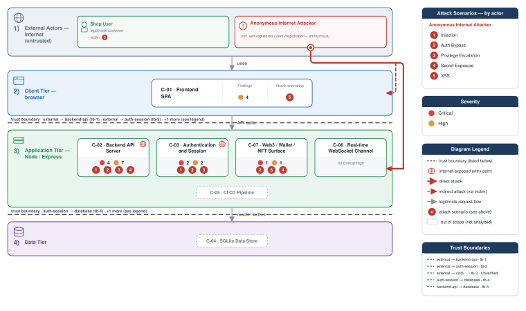
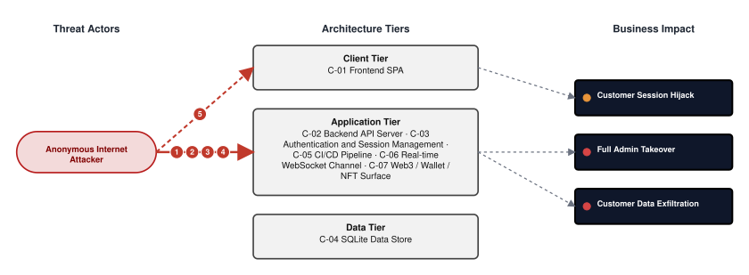
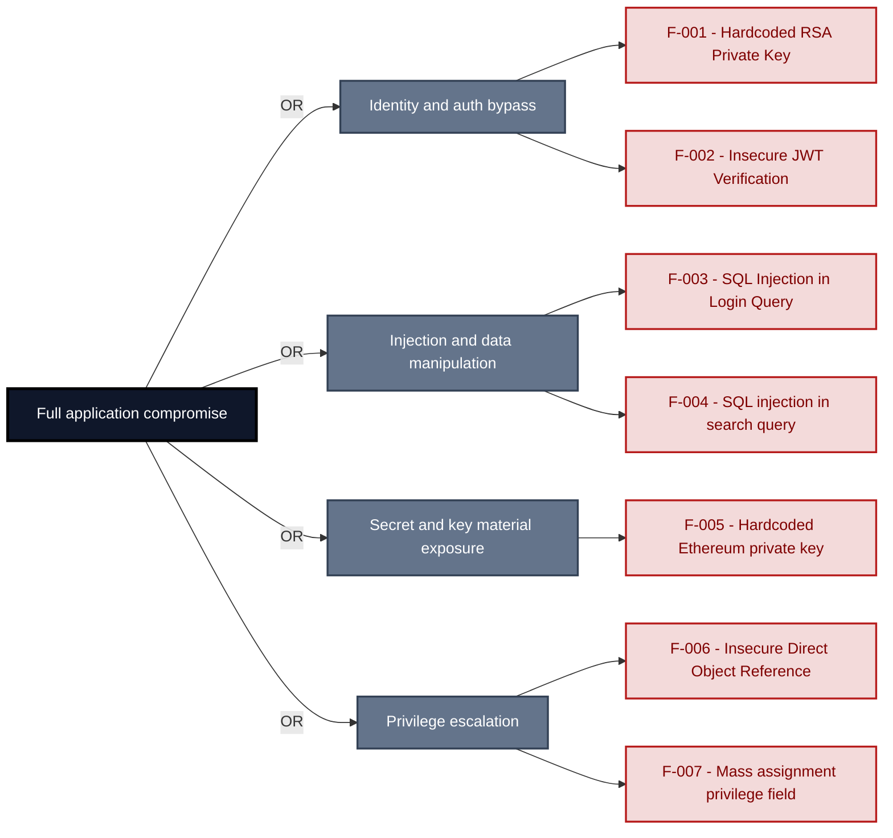
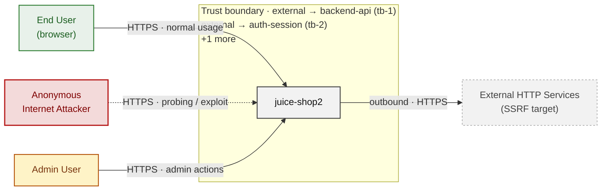
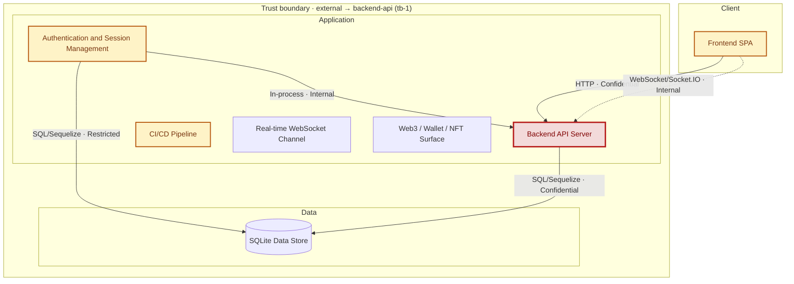
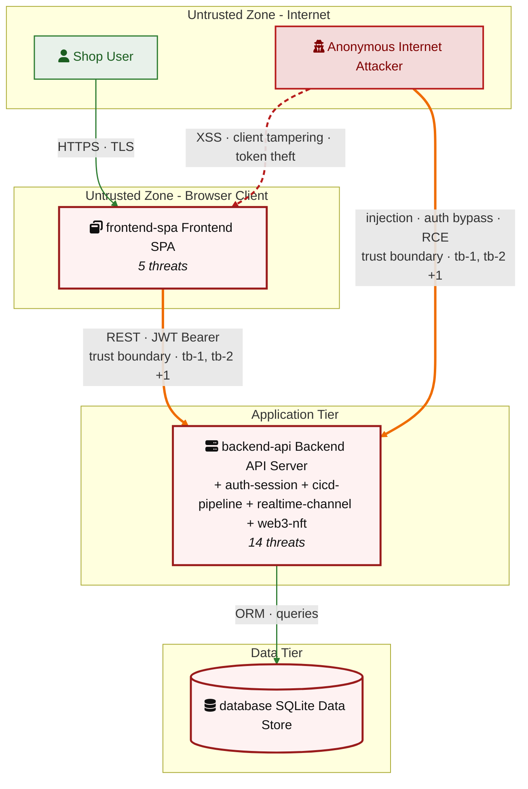
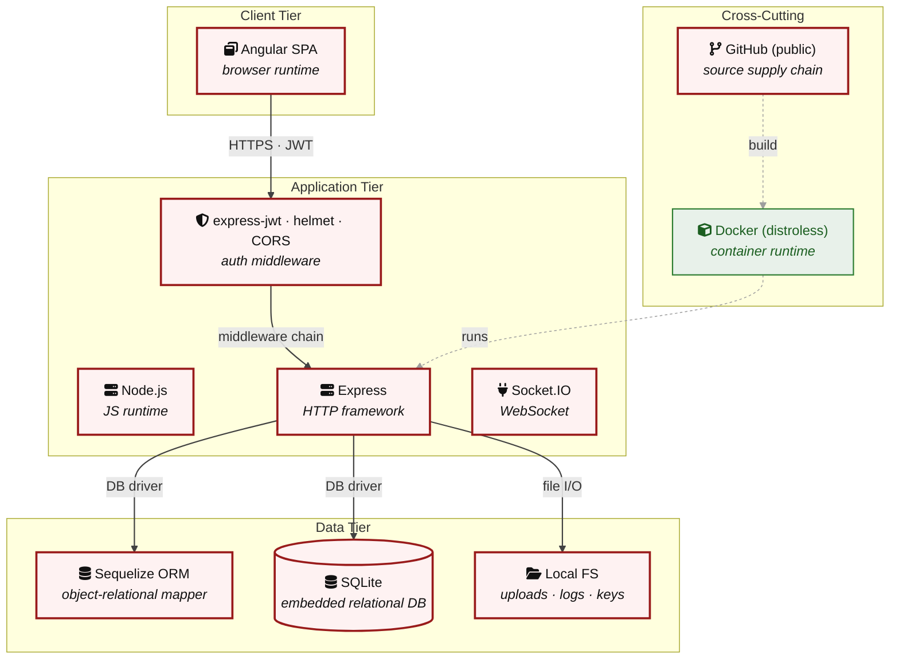

# Threat Model - Juice Shop

_Generated by appsec-advisor v0.5.2-dev (analysis v5)_

---

> | | |
> |---|---|
> | **Project** | Juice Shop v20.1.1 |
> | **Description** | Probably the most modern and sophisticated insecure web application |
> | **Author** | Björn Kimminich <bjoern.kimminich@owasp\.org> (`https://kimminich.de`) |
> | **License** | MIT |
> | **Repository** | `https://github.com/juice-shop/juice-shop.git` |
> | **Homepage** | `https://owasp-juice.shop` |
> | **Runtime** | Node\.js 22 - 26, Express 4 |
> | **Tags** | web security, web application security, webappsec, owasp, pentest, pentesting, security, vulnerable, vulnerability, broken, bodgeit, ctf, capture the flag, awareness |

---

## Changelog

_Append-only history of assessment runs. Most recent first._

| Version | Date | Mode | Depth | Reasoning | Baseline → Current | Δ Threats | Code | Note |
|--------|---------------------|--------|--------|--------------|------------------|----------------|--------|---------------|
| v1 | 2026-08-17 19:53 CEST | full | quick | sonnet-economy | _(initial)_ | 36 total | - | first full scan |

---

> ⚠ **Quick depth - reduced-scope assessment.**
> 
> This report ran with intentionally narrower depth to keep wall-time short:
> 
> - **5 of 7 components** under full STRIDE analysis (criteria-selected: frontend, auth, and internet-exposed components only)
> - **Max 2 threats per STRIDE category** per component (vs. unlimited at standard/thorough)
> - **No CVSS vectors**, no per-finding evidence excerpts
> - **No §3 Attack Walkthroughs** (entirely skipped at `--quick`)
> - **No LLM-enriched [§7](#7-weakness-register) architecture narrative** (scaffold + control tables only)
> - **No QA reviewer pass**, no architect-level review
> 
> Re-run with `--standard` (≈ +30 min) for full STRIDE coverage and QA, or
> `--thorough` (≈ +90 min) for architect review and enriched architecture sections.

---

## Table of Contents

- [Management Summary](#management-summary)
- [Critical Attack Tree](#critical-attack-tree)
1. [System Overview](#1-system-overview)
   - [Scope](#scope)
   - [Identified Actors](#identified-actors)
   - [Trust Boundaries](#trust-boundaries)
2. [Architecture Diagrams](#2-architecture-diagrams)
   - [2.1 System Context](#21-system-context)
   - [2.2 Container Architecture](#22-container-architecture)
   - [2.3 Components](#23-components)
   - [2.4 Technology Architecture](#24-technology-architecture)
4. [Assets](#4-assets)
5. [Attack Surface](#5-attack-surface)
   - [5.1 Unauthenticated Entry Points (54)](#51-unauthenticated-entry-points-54)
   - [5.2 Authenticated Entry Points (52)](#52-authenticated-entry-points-52)
7. [Weakness Register](#7-weakness-register)
8. [Findings Register](#8-findings-register)
9. [Abuse Cases](#9-abuse-cases)
10. [Mitigation Register](#10-mitigation-register)
11. [Out of Scope](#11-out-of-scope)
   - [Not Covered by This Method](#not-covered-by-this-method)
   - [Excluded from This Assessment](#excluded-from-this-assessment)
   - [Components Not Individually Analyzed](#components-not-individually-analyzed)
- [Appendix: Run Statistics](#appendix-run-statistics)
- [Appendix A - Vektor Taxonomy](#appendix-a-vektor-taxonomy)

> _Section numbering is non-contiguous: §3, §6 are omitted at the current (quick) depth and return at `--standard`/`--thorough`. The remaining sections keep their original numbers so existing cross-references stay valid._

---

## Management Summary

### Verdict

🔴 Not production-ready. Anyone on the internet can gain administrator access, read all customer records, and bypass login without any account - multiple independent paths that require only a web browser.

**Risk distribution:** 🔴 Critical: 7 · 🟠 High: 15 · 🟡 Medium: 12 · 🟢 Low: 0 · **Total: 34**<br/>**Assessment evidence:** 27 confirmed-exploitable finding(s) · 1 implementation weakness(es) · 7 design weakness(es)

**Scope:** 5 of 7 components received full STRIDE analysis - the externally-reachable, authentication-bearing, and business-critical surface. The other 2 (lower-priority / internal) were not individually assessed at this depth (see [§1 Scope](#scope)).

**Basis:** a code-derived threat model at implementation level - built from repository evidence, not a planning document. Design intent, business processes, runtime behaviour and production-only configuration are outside what this analysis can see (see [§11 Out of Scope](#11-out-of-scope)).

<br/>

**Worst-case scenarios an attacker could execute today:**

<blockquote style="border-left: 3px solid #dc2626; background: #fef2f2; padding: 16px 20px; margin: 0;">

- **Administrator access without an account** — The key that signs every user session is committed to the public repository, so any visitor can create a valid administrator login token. *(🔴 [F-001](#f-001) — Hardcoded RSA Private Key (`lib/insecurity.ts:21`), 🔴 [F-002](#f-002) — Insecure JWT Verification → [W-003](#w-003))*
- **Login bypass for any customer account** — The login form accepts a crafted entry that skips credential verification and returns any targeted account without a password. *(🔴 [F-003](#f-003) — SQL Injection in Login Query (`routes/login.ts:34`) → [W-001](#w-001))*
- **Any customer's personal data exposed** — Customer orders and addresses lack ownership checks, so a logged-in user can read or overwrite any other customer's personal records. *(🔴 [F-006](#f-006) — Insecure Direct Object Reference → [W-002](#w-002))*
- **Self-promotion to administrator** — Account update accepts fields the server should control, letting any registered user grant themselves administrator privileges. *(🔴 [F-007](#f-007) — Mass assignment privileged field accepted from request (`routes/verify.ts:53`))*
- **Cryptocurrency wallet exposed publicly** — A hardcoded cryptocurrency wallet key is bundled in the repository and readable by anyone without logging in. *(🔴 [F-005](#f-005) — Hardcoded BIP39 mnemonic exposes Ethereum private key (`routes/checkKeys.ts:10`) → [W-003](#w-003))*

</blockquote>

<br/>

These are structural defects - not configuration gaps. The account, login, and access-decision layer requires remediation before any customer data can safely be stored in this application.

### Top Weaknesses

The systemic root-cause problems behind the findings - the classes to fix, not just individual bugs. Each links to the full [Weakness Register](#7-weakness-register) with its findings and remediation.

- 🔴 **[W-001](#w-001) - Database access relies on concatenated queries** (Critical) - Database queries are assembled from application values instead of passing those values through an enforced parameterised data-access path. _Proven by [F-003](#f-003), [F-004](#f-004)._
- 🔴 **[W-002](#w-002) - Authorization is implemented route by route** (Critical) - Authorization depends on per-handler checks instead of a policy boundary that consistently enforces role, ownership, and tenant scope. _Proven by [F-006](#f-006), [F-022](#f-022)._
- 🔴 **[W-003](#w-003) - Secrets are committed to source instead of a managed store** (Critical) - Cryptographic keys, credentials, and other high-entropy secrets are embedded as literals in source or config rather than resolved at runtime from a managed secret store, so anyone with repository r… _Proven by [F-001](#f-001), [F-005](#f-005)._
- 🟠 **[W-004](#w-004) - Endpoints are reachable without enforced authentication** (High) - Sensitive API routes and real-time channels are exposed without an enforced authentication check at the endpoint boundary. _Proven by [F-024](#f-024), [F-025](#f-025)._
- 🟠 **[W-005](#w-005) - Input handling lacks enforced boundary validation** (High) - Request handlers do not validate input against one enforced server-side schema or allowlist at the boundary - validation is either absent on the vulnerable parameters or limited to rejecting select… _Proven by [F-010](#f-010)._
- 🟠 **[W-006](#w-006) - Build pipeline trusts mutable third-party references** (High) - CI/CD workflows resolve third-party actions and other build dependencies to mutable tags or branches instead of immutable commit digests, so a retagged or compromised upstream runs inside the pipel… _Proven by [F-016](#f-016)._

### Security Posture & Top Threats

**Figure 1 - Architecture & Top Threats**

Architecture tiers top-to-bottom (External Actors → Client → Application → Data) with the top threats per component. The in-figure legend on the right explains the attack scenarios, severity dots and symbols. Dashed slate lines mark trust-boundary crossings, labelled with the `tb-N` ids catalogued in [§1 Trust Boundaries](#trust-boundaries).



**Figure 2 - Risk Flow: Actor → Tier → Impact**

Heatmap: **actors** (left) → **architecture tiers** (middle, Client → Application → Data) → **impact** (right). Numbered red arrows ①–⑤ are the threats enumerated in the Top Threats table below. Self-registration is open, so the **Authenticated Internet Attacker** tier is one POST away from anonymous - it is shown distinctly because a post-login endpoint is still a different attack surface.



**Threat actors.** The actors below drive the numbered attack paths in the figures above. The **Shop User** is the *victim* of client-side attacks (XSS / CSRF), not an attacker - in Figure 2 the compromise surfaces as the resulting business-impact node rather than as a separate actor box.

- **Shop User** — legitimate customer; target of client-side attacks; target of ⑤ Output Encoding / Cross-Site Scripting.
- **Anonymous Internet Attacker** — no account; registers in seconds when needed; drives ① Insecure Query Construction & Data Access, ② Hardcoded Secrets & Weak Cryptography, ③ Broken Authorization & Access Control, ④ Sensitive File & Secret Exposure.

**5 structural threats**, grouped by weakness class - each row is one threat, not one finding. *Threat Description* states the general architectural weakness (STRIDE in brackets); *Findings* lists the concrete instances, each linked to [§8 Findings Register](#8-findings-register) with its component; *Risk & Impact* combines severity with business consequence.

| # | Threat Description | Findings (→ Component) | Risk & Impact | Fix |
|---|------------------------------------|------------------------------------------------|------------------------------------|--------|
| <a id="path-injection"></a>① | **Insecure Query Construction & Data Access** _(T·I)_<br/>user input flows into a server-side interpreter (SQL, NoSQL, XML, YAML, LDAP, OS shell) without parameterization or schema validation. | <span style="white-space:nowrap">🔴&nbsp;[F-003](#f-003)</span> - SQL Injection in Login Query (`login.ts:34`) <span style="white-space:nowrap">→&nbsp;[C-03](#c-03)</span>&nbsp;Authentication and Session Management<br/><span style="white-space:nowrap">🔴&nbsp;[F-004](#f-004)</span> - SQL injection request data interpolated into a SQL string (`search.ts:23`) <span style="white-space:nowrap">→&nbsp;[C-02](#c-02)</span>&nbsp;Backend API Server | 🔴 **Critical**<br/>Customer Data Exfiltration | <span style="white-space:nowrap">● [M-014](#m-014)</span> — Use parameterized database queries<br/><span style="white-space:nowrap">● [M-015](#m-015)</span> — Use parameterized database queries |
| <a id="path-auth-bypass"></a>② | **Hardcoded Secrets & Weak Cryptography** _(S·E)_<br/>authentication can be circumvented or forged because credentials, signing keys, or password hashes are weak, missing, or exposed. | <span style="white-space:nowrap">🔴&nbsp;[F-001](#f-001)</span> - Hardcoded RSA Private Key (`insecurity.ts:21`) <span style="white-space:nowrap">→&nbsp;[C-03](#c-03)</span>&nbsp;Authentication and Session Management<br/><span style="white-space:nowrap">🔴&nbsp;[F-002](#f-002)</span> - Insecure JWT Verification (`insecurity.ts:189`) <span style="white-space:nowrap">→&nbsp;[C-02](#c-02)</span>&nbsp;Backend API Server<br/><span style="white-space:nowrap">🔴&nbsp;[F-005](#f-005)</span> - Hardcoded BIP39 mnemonic exposes Ethereum private key (`checkKeys.ts:10`) <span style="white-space:nowrap">→&nbsp;[C-07](#c-07)</span>&nbsp;Web3 / Wallet / NFT Surface<br/><span style="white-space:nowrap">🟠&nbsp;[F-009](#f-009)</span> - Predictable OAuth Password Derivation (`oauth.component.ts:30`) <span style="white-space:nowrap">→&nbsp;[C-01](#c-01)</span>&nbsp;Frontend SPA<br/><span style="white-space:nowrap">🟠&nbsp;[F-011](#f-011)</span> - Non-cryptographic RNG for a secret/token (`insecurity.ts:53`) <span style="white-space:nowrap">→&nbsp;[C-02](#c-02)</span>&nbsp;Backend API Server<br/><span style="white-space:nowrap">🟠&nbsp;[F-013](#f-013)</span> - `MD5` Password Hash (`insecurity.ts:41`) <span style="white-space:nowrap">→&nbsp;[C-03](#c-03)</span>&nbsp;Authentication and Session Management<br/><span style="white-space:nowrap">🟡&nbsp;[F-027](#f-027)</span> - Broken hash primitive (`insecurity.ts:41`) <span style="white-space:nowrap">→&nbsp;[C-02](#c-02)</span>&nbsp;Backend API Server<br/><span style="white-space:nowrap">🟡&nbsp;[F-032](#f-032)</span> - Container image signing (`ci.yml:1`) <span style="white-space:nowrap">→&nbsp;[C-05](#c-05)</span>&nbsp;CI/CD Pipeline | 🔴 **Critical**<br/>Full Admin Takeover · Customer Data Exfiltration | <span style="white-space:nowrap">● [M-012](#m-012)</span> — Move cryptographic keys to a managed secret store<br/><span style="white-space:nowrap">● [M-013](#m-013)</span> — Enforce JWT signature and algorithm verification |
| <a id="path-privilege-escalation"></a>③ | **Broken Authorization & Access Control** _(E·I)_<br/>authorization checks are absent or bypassable, allowing horizontal and vertical privilege jumps from a self-registered or low-rights account. Includes mass-assignment of privileged attributes. | <span style="white-space:nowrap">🔴&nbsp;[F-006](#f-006)</span> - Insecure Direct Object Reference (`order.ts:157`) <span style="white-space:nowrap">→&nbsp;[C-02](#c-02)</span>&nbsp;Backend API Server<br/><span style="white-space:nowrap">🔴&nbsp;[F-007](#f-007)</span> - Mass assignment privileged field accepted from request (`verify.ts:53`) <span style="white-space:nowrap">→&nbsp;[C-02](#c-02)</span>&nbsp;Backend API Server<br/><span style="white-space:nowrap">🟠&nbsp;[F-015](#f-015)</span> - GitHub Actions workflow-level permissions block (`ci.yml:1`) <span style="white-space:nowrap">→&nbsp;[C-05](#c-05)</span>&nbsp;CI/CD Pipeline<br/><span style="white-space:nowrap">🟠&nbsp;[F-021](#f-021)</span> - Optional Current Password Verification (`changePassword.ts:39`) <span style="white-space:nowrap">→&nbsp;[C-03](#c-03)</span>&nbsp;Authentication and Session Management<br/><span style="white-space:nowrap">🟠&nbsp;[F-022](#f-022)</span> - Sensitive Routes Registered Without Authentication Middleware (`server.ts:310`) <span style="white-space:nowrap">→&nbsp;[C-02](#c-02)</span>&nbsp;Backend API Server<br/><span style="white-space:nowrap">🟡&nbsp;[F-028](#f-028)</span> - Unauth wallet address injection into server state (`web3Wallet.ts:16`) <span style="white-space:nowrap">→&nbsp;[C-07](#c-07)</span>&nbsp;Web3 / Wallet / NFT Surface<br/><span style="white-space:nowrap">🟡&nbsp;[F-034](#f-034)</span> - `GITHUB_TOKEN` scope minimization (`ci.yml:1`) <span style="white-space:nowrap">→&nbsp;[C-05](#c-05)</span>&nbsp;CI/CD Pipeline | 🔴 **Critical**<br/>Full Admin Takeover · Customer Data Exfiltration | <span style="white-space:nowrap">● [M-017](#m-017)</span> — Enforce object-level (ownership) authorization<br/><span style="white-space:nowrap">● [M-018](#m-018)</span> — Allowlist client-controlled fields |
| <a id="path-sensitive-data-exposure"></a>④ | **Sensitive File & Secret Exposure** _(I)_<br/>confidential files, credentials, and management-plane endpoints are reachable on unauthenticated routes; SSRF lets the server fetch internal resources on the attacker's behalf; unsafe path-handling primitives leak server content. | <span style="white-space:nowrap">🟠&nbsp;[F-010](#f-010)</span> - Path traversal filesystem access from request input (`dataErasure.ts:104`) <span style="white-space:nowrap">→&nbsp;[C-02](#c-02)</span>&nbsp;Backend API Server<br/><span style="white-space:nowrap">🟠&nbsp;[F-014](#f-014)</span> - SSRF (`profileImageUrlUpload.ts:24`) <span style="white-space:nowrap">→&nbsp;[C-02](#c-02)</span>&nbsp;Backend API Server<br/><span style="white-space:nowrap">🟡&nbsp;[F-026](#f-026)</span> - Open Redirect (`insecurity.ts:136`) <span style="white-space:nowrap">→&nbsp;[C-07](#c-07)</span>&nbsp;Web3 / Wallet / NFT Surface | 🟠 **High**<br/>Customer Data Exfiltration | <span style="white-space:nowrap">◕ [M-021](#m-021)</span> — Constrain file paths to a safe base directory<br/><span style="white-space:nowrap">◕ [M-025](#m-025)</span> — Validate and allowlist outbound request targets |
| <a id="path-cross-site-scripting"></a>⑤ | **Output Encoding / Cross-Site Scripting** _(T·I)_<br/>attacker-controlled content is rendered in the victim's browser without sanitization; combined with session tokens held in JavaScript-readable storage, any payload yields immediate account takeover. | <span style="white-space:nowrap">🟠&nbsp;[F-012](#f-012)</span> - Sanitizer Bypass on Search URL Parameter (`search-result.component.ts:143`) <span style="white-space:nowrap">→&nbsp;[C-01](#c-01)</span>&nbsp;Frontend SPA<br/><span style="white-space:nowrap">🟠&nbsp;[F-019](#f-019)</span> - JWT Bearer Token Stored in localStorage (`app.guard.ts:18`) <span style="white-space:nowrap">→&nbsp;[C-01](#c-01)</span>&nbsp;Frontend SPA | 🟠 **High**<br/>Customer Session Hijack | <span style="white-space:nowrap">◕ [M-023](#m-023)</span> — Encode output instead of bypassing the framework sanitizer<br/><span style="white-space:nowrap">◑ [M-026](#m-026)</span> — Store session tokens in HttpOnly, Secure cookies |

_STRIDE: S spoofing · T tampering · R repudiation · I information disclosure · D denial of service · E elevation of privilege. Risk, findings, components, impact and Fix are derived deterministically; only the one-line weakness description is authored._

### Top Mitigations

Highest-impact P1/P2 mitigations - 10 of 20 qualifying (39 total). Full detail in [§10 Mitigation Register](#10-mitigation-register). All 7 mitigation(s) that fix a Critical finding are always listed here.

| # | Component | Mitigation | Addresses | Effort |
|---|----------------------|------------------------------------------------|------------------------------------------------|------|
| **1** | [C-02](#c-02) — Backend API Server | ● [M-017](#m-017) — Enforce object-level (ownership) authorization (`order.ts:157`) | 🔴 [F-006](#f-006) — Insecure Direct Object Reference (`routes/order.ts`) | Low |
| **2** | [C-02](#c-02) — Backend API Server | ● [M-013](#m-013) — Enforce JWT signature and algorithm verification (`insecurity.ts:189`) | 🔴 [F-002](#f-002) — Insecure JWT Verification (`lib/insecurity.ts`) | Medium |
| **3** | [C-02](#c-02) — Backend API Server | ● [M-015](#m-015) — Use parameterized database queries (`search.ts:23`) | 🔴 [F-004](#f-004) — SQL injection request data interpolated into a SQL string (`routes/search.ts`) | Medium |
| **4** | [C-02](#c-02) — Backend API Server | ● [M-018](#m-018) — Allowlist client-controlled fields (`verify.ts:53`) | 🔴 [F-007](#f-007) — Mass assignment privileged field accepted from request (`routes/verify.ts`) | Medium |
| **5** | [C-03](#c-03) — Authentication and Session Management | ● [M-014](#m-014) — Use parameterized database queries (`login.ts:34`) | 🔴 [F-003](#f-003) — SQL Injection in Login Query (`routes/login.ts`) | Low |
| **6** | [C-03](#c-03) — Authentication and Session Management | ● [M-012](#m-012) — Move cryptographic keys to a managed secret store (`insecurity.ts:21`) | 🔴 [F-001](#f-001) — Hardcoded RSA Private Key (`lib/insecurity.ts`) | Medium |
| **7** | [C-07](#c-07) — Web3 / Wallet / NFT Surface | ● [M-016](#m-016) — Move secrets to a managed secret store (`checkKeys.ts:10`) | 🔴 [F-005](#f-005) — Hardcoded BIP39 mnemonic exposes Ethereum private key (`routes/checkKeys.ts`) | Medium |
| **8** | [C-02](#c-02) — Backend API Server | ◕ [M-010](#m-010) — Pin the container base image to an immutable digest (`package-lock.json:0`) | 🟠 [F-018](#f-018) — On present and committed (`package-lock.json`) | Low |
| **9** | [C-05](#c-05) — CI/CD Pipeline | ◕ [M-008](#m-008) — Pin third-party dependencies to immutable versions (`ci.yml:188`) | 🟠 [F-016](#f-016) — Third-party GitHub Actions pinned to commit SHA (`ci.yml`) | Low |
| **10** | [C-05](#c-05) — CI/CD Pipeline | ◕ [M-009](#m-009) — Pin the container base image to an immutable digest (`Dockerfile:1`) | 🟠 [F-017](#f-017) — Base image must be digest-pinned (Dockerfile) | Low |

*10 additional P1/P2 mitigations capped from the leader-board · 19 P3 backlog items in [§10 Mitigation Register](#10-mitigation-register). Sorted by priority (P1 first), then component, then leverage (most findings first), severity (Critical first), and effort (Low first).*

### Operational Strengths

Operational controls rated Adequate or Partial - grouped into broad clusters. Clusters demoted to Weak by open Critical/High findings are excluded here.

<table style="table-layout:fixed;width:100%">
<colgroup><col width="20%" style="width:20%"><col width="33%" style="width:33%"><col width="47%" style="width:47%"></colgroup>
<thead><tr><th>Strength</th><th>What's in Place</th><th>Effectiveness</th></tr></thead>
<tbody>
<tr><td style="overflow-wrap:break-word"><strong>Container &amp; Supply-Chain Hardening</strong></td><td style="overflow-wrap:break-word"><em>Build-time and runtime hardening - minimal base image, non-root execution, dependency inventory.</em><br/>Container Runtime Hardening<br/>Third-Party Action Pinning</td><td style="overflow-wrap:break-word">✅ Adequate</td></tr>
<tr><td style="overflow-wrap:break-word"><strong>Hardened HTTP Stack</strong></td><td style="overflow-wrap:break-word"><em>Browser-facing HTTP hardening - security headers, cookie flags, cross-origin policy, and abuse-protection limits.</em><br/>CORS Policy</td><td style="overflow-wrap:break-word">⚠️ Partial - Bypassed by 1 High finding(s) of the kind this cluster is supposed to prevent - e.g.<br/>🟠 <a href="#f-014">F-014</a> — SSRF (<code>routes/profileImageUrlUpload.ts:24</code>).</td></tr>
<tr><td style="overflow-wrap:break-word"><strong>Observability &amp; Audit</strong></td><td style="overflow-wrap:break-word"><em>Runtime visibility - access logging, audit trails, and operational telemetry for post-incident review.</em><br/>Security Event Logging</td><td style="overflow-wrap:break-word">⚠️ Partial - Coverage incomplete - see <a href="#7-weakness-register">§7</a> control assessment.</td></tr>
</tbody>
</table>

**Bottom line:** These controls narrow specific attack surfaces but none eliminates a Critical finding on its own.

---

<a id="critical-attack-chain"></a><a id="critical-attack-tree"></a>
## Critical Attack Tree

The root is the worst-case attacker goal; below it, each capability branch groups the Critical findings that achieve it. Branches feed the goal by OR - any single path suffices.



**Findings** (full detail in [§8 Findings Register](#8-findings-register)): [F-001](#f-001) · [F-002](#f-002) · [F-003](#f-003) · [F-004](#f-004) · [F-005](#f-005) · [F-006](#f-006) · [F-007](#f-007)

---

## 1. System Overview

Probably the most modern and sophisticated insecure web application

**Repository:** `https://github.com/juice-shop/juice-shop.git`
**Runtime:** Node\.js 22 - 26

### Scope

juice-shop2 comprises **7** modeled components. This threat model applied full STRIDE threat analysis to **5 of 7** - the components on the externally-reachable, authentication-bearing, and business-critical surface: **Frontend SPA**, **Backend API Server**, **Authentication and Session Management**, **Real-time WebSocket Channel**, **Web3 / Wallet / NFT Surface**. Selection criteria: frontend attack surface; internet-exposed; AI/LLM surface; auth.

The remaining **2** component(s) were **not individually analyzed** at this assessment depth (lower-priority / internal surface): SQLite Data Store, CI/CD Pipeline. Re-run at a higher `--assessment-depth` to extend STRIDE coverage to them.

**Out of scope:** third-party hosted dependencies, browser runtime, operating-system kernel, and the underlying network infrastructure.

**Basis:** a code-derived threat model at implementation level, built from source, configuration and git history. It describes the system as built, not as designed.

---

<a id="identified-actors"></a>
### Identified Actors

The consolidated threat actors that drive this model - the same set named in the Management Summary. Each row aggregates the findings reachable from that actor's position; the **Shop User** appears as the *victim* of client-side attacks, not an attacker.

| Actor | Role | Reach | Findings | Components |
|----------------------|--------|----------------------|----------------|----------------------|
| Shop User | victim | legitimate customer; target of client-side<br/>attacks | 2 | frontend-spa, web3-nft |
| Anonymous Internet Attacker | attacker | no account; registers in seconds when needed | 34 | auth-session, backend-api, cicd-pipeline,<br/>frontend-spa, realtime-channel, web3-nft |

---

### Trust Boundaries

Canonical boundary crossings. **Assumption & verdict** names the condition that makes each crossing safe and whether this report still supports it, judged one condition at a time - which conditions apply follows from the direction of the crossing.

<table style="table-layout:fixed;width:100%">
<colgroup><col width="6%" style="width:6%"><col width="25%" style="width:25%"><col width="11%" style="width:11%"><col width="15%" style="width:15%"><col width="25%" style="width:25%"><col width="18%" style="width:18%"></colgroup>
<thead><tr><th>ID</th><th>Boundary / crossing</th><th>Exposure</th><th>Kind</th><th>Assumption &amp; verdict</th><th>Linked findings</th></tr></thead>
<tbody>
<tr><td style="white-space:nowrap"><a id="tb-1"></a>tb-1</td><td style="overflow-wrap:break-word"><strong>external → backend-api</strong><br/>Control: <code>security.isAuthorized()</code> expressJwt middleware · Also covers: realtime-channel, web3-nft</td><td>🌐 <strong>External</strong></td><td style="overflow-wrap:break-word">network</td><td style="overflow-wrap:break-word">Every state-changing and sensitive route is protected by a verified JWT before the handler executes.<br/><em>confirmed</em><br/>Validation: in doubt · 5 related<br/>Authentication: <strong>broken</strong> · 4 related<br/>Authorization: in doubt · 3 related</td><td style="overflow-wrap:break-word"><em>Authentication</em><br/>🔴 <a href="#f-001">F-001</a><br/>🟠 <a href="#f-024">F-024</a><br/>🟡 <a href="#f-025">F-025</a></td></tr>
<tr><td style="white-space:nowrap"><a id="tb-2"></a>tb-2</td><td style="overflow-wrap:break-word"><strong>external → auth-session</strong><br/>Control: <code>security.authorize()</code> <code>jwt.sign</code> RS256</td><td>🌐 <strong>External</strong></td><td style="overflow-wrap:break-word">network · identity</td><td style="overflow-wrap:break-word">A JWT is issued only after credential verification returns a confirmed user from the data store.<br/><em>confirmed</em><br/>Validation: <strong>broken</strong><br/>Authentication: <strong>broken</strong><br/>Authorization: <em>not examined</em></td><td style="overflow-wrap:break-word"><em>Validation</em><br/>🔴 <a href="#f-003">F-003</a><br/><em>Authentication</em><br/>🔴 <a href="#f-001">F-001</a></td></tr>
<tr><td style="white-space:nowrap"><a id="tb-3"></a>tb-3</td><td style="overflow-wrap:break-word"><strong>external → cicd-pipeline</strong><br/>Control: <code>GITHUB_TOKEN</code> scopes and branch protection</td><td>◐ <strong>Unverified</strong></td><td style="overflow-wrap:break-word">build pipeline · operator</td><td style="overflow-wrap:break-word">Workflows that access secrets or deployment targets run only for events from contributors authorized by branch protection rules.<br/><em>inferred</em><br/>Validation: in doubt · 1 related<br/>Authentication: in doubt · 1 related<br/>Authorization: in doubt · 2 related</td><td style="overflow-wrap:break-word">-</td></tr>
<tr><td style="white-space:nowrap"><a id="tb-4"></a>tb-4</td><td style="overflow-wrap:break-word"><strong>auth-session → database</strong><br/>Control: Sequelize parameterized query binding</td><td>🔒 <strong>Internal</strong></td><td style="overflow-wrap:break-word">in-process - enforcement interface, no trust transition</td><td style="overflow-wrap:break-word">Every credential lookup reaches SQLite through parameterized query binding, not string interpolation.<br/><em>confirmed</em><br/><em>No finding contradicts it.</em></td><td style="overflow-wrap:break-word">-</td></tr>
<tr><td style="white-space:nowrap"><a id="tb-5"></a>tb-5</td><td style="overflow-wrap:break-word"><strong>backend-api → database</strong><br/>Control: Sequelize ORM model method binding</td><td>🔒 <strong>Internal</strong></td><td style="overflow-wrap:break-word">in-process - enforcement interface, no trust transition</td><td style="overflow-wrap:break-word">Every application query from backend-api reaches SQLite through Sequelize model method parameterized binding.<br/><em>confirmed</em><br/><em>No finding contradicts it.</em></td><td style="overflow-wrap:break-word">-</td></tr>
</tbody>
</table>

_Exposure, most exposed first: ⚠ Review (endpoints unresolved) · 🌐 External (reached from outside the model) · ◐ Unverified (crossing not confirmed) · 🔒 Internal (both ends modelled) · ↗ Egress (reaches outside the model)._

_Kind - the crossing mechanism (build pipeline, in-process, network), then after `·` what changes across it: data-origin, identity, operator, privilege, tenant. Shown alone, nothing changes._

_Conditions - **inbound**: validation, authentication, authorization · **outbound**: egress content, egress destination, response trust (replies are untrusted input) · **internal**: query construction (data never becomes program text), authentication, authorization._

_Verdict per condition - **broken**: a linked finding proves the gap · in doubt: related findings, none linked here · not examined: nothing bears on it. `N related` counts further findings on the same condition. Linked findings sit under the condition they break, or under _Unattributed_. A link raises effective severity only at a confirmed internet ingress; raw risk never changes._

_Identical on every row, so stated once here instead of in a column: source `detected` (derived from inspected repository evidence); status `resolved`. Any row that deviates is shown in the table._

---

## 2. Architecture Diagrams

### 2.1 System Context

Who interacts with juice-shop2 from the outside, and through which channels. Solid arrows show normal usage; dashed red arrows mark unauthenticated probing or exploit paths (C4 Level 1).



*Trust boundaries not named above: external → cicd-pipeline (tb-3), auth-session → database (tb-4), backend-api → database (tb-5) - every boundary is listed in [§1 Trust Boundaries](#trust-boundaries).*

**Key takeaway:** Every actor in the context interacts with juice-shop2 through its external interface, so authentication and input validation at that edge govern the entire attack surface.

### 2.2 Container Architecture

How the system decomposes into deployable units. Each box is a separate runtime process or service container; arrows show synchronous request paths between them. Components with ≥3 Critical findings carry a red border, ≥2 High amber (C4 Level 2).



*Trust boundaries not drawn above: auth-session → database (tb-4), backend-api → database (tb-5) - every boundary is listed in [§1 Trust Boundaries](#trust-boundaries).*

**Key takeaway:** The system decomposes into 1 client, 5 application and 1 data unit(s); Backend API Server carries the most Critical findings (4) and bounds the worst-case blast radius.

### 2.3 Components

Who reaches each component, and through which trust zone. Browser code runs on the user's device, so the client column is part of the untrusted zone, not a zone of its own - trust changes only where traffic enters the Application tier. Solid green arrows show legitimate data flow, dashed red arrows mark intrusion vectors. The component table directly below holds source paths and linked threats per `C-NN`; per-finding evidence is in [§8 Findings Register](#8-findings-register).



*Trust boundaries crossed by the `==>` edges above: external → backend-api (tb-1), external → auth-session (tb-2), external → cicd-pipeline (tb-3) - every boundary is listed in [§1 Trust Boundaries](#trust-boundaries).*

**Key takeaway:** Backend API Server concentrates the most findings (14 of 36 across all components); the table below maps each component to its source paths and linked threats.

| ID | Name | Type | Key Paths | Linked Threats | Scope |
|----|----------------------|-----------|--------------------------------------|------------------------------------------------|------------|
| <a id="c-01"></a><a id="frontend-spa"></a><span style="white-space:nowrap">C-01</span> | Frontend SPA | client | `frontend/**` | 🟠 [F-009](#f-009) — Predictable OAuth Password Derivation (`oauth.component.ts:30`)<br/>🟠 [F-012](#f-012) — Sanitizer Bypass on Search URL Parameter (`search-result.component.ts:143`)<br/>🟠 [F-019](#f-019) — JWT Bearer Token Stored in localStorage (`app.guard.ts:18`)<br/>🟠 [F-023](#f-023) — Client-Side-Only AdminGuard Role Check (`app.guard.ts:54`)<br/>🟡 [F-030](#f-030) — Unauthenticated WebSocket Prevents Challenge Event (`socket-io.service.ts:22`) | Analyzed |
| <a id="c-02"></a><a id="backend-api"></a><span style="white-space:nowrap">C-02</span> | Backend API Server | application | `server.ts`<br/>`app.ts`<br/>`routes/**`<br/>`lib/**` | 🔴 [F-002](#f-002) — Insecure JWT Verification (`insecurity.ts:189`)<br/>🔴 [F-004](#f-004) — SQL injection request data interpolated into a SQL string (`search.ts:23`)<br/>🔴 [F-006](#f-006) — Insecure Direct Object Reference (`order.ts:157`)<br/>🔴 [F-007](#f-007) — Mass assignment privileged field accepted from request (`verify.ts:53`)<br/>🟠 [F-008](#f-008) — Password reset accepts a security-question answer (`resetPassword.ts:10`)<br/>🟠 [F-010](#f-010) — Path traversal filesystem access from request input (`dataErasure.ts:104`)<br/>🟠 [F-011](#f-011) — Non-cryptographic RNG for a secret/token (`insecurity.ts:53`)<br/>🟠 [F-014](#f-014) — SSRF (`profileImageUrlUpload.ts:24`)<br/>🟠 [F-018](#f-018) — On present and committed (`package-lock.json:0`)<br/>🟠 [F-022](#f-022) — Sensitive Routes Registered Without Authentication Middleware (`server.ts:310`)<br/>🟠 [F-024](#f-024) — Missing authentication on all web3 challenge endpoints (`server.ts:641`)<br/>🟡 [F-027](#f-027) — Broken hash primitive (`insecurity.ts:41`)<br/>🟡 [F-031](#f-031) — USER directive — Dockerfile:1 (`Dockerfile:1`)<br/>🟡 [F-036](#f-036) — No rate limit on POST `/rest/user/login` allows unbounded (`server.ts:596`) | Analyzed |
| <a id="c-03"></a><a id="auth-session"></a><span style="white-space:nowrap">C-03</span> | Authentication and Session Management | application | `lib/insecurity.ts`<br/>`routes/login.ts`<br/>`routes/2fa.ts`<br/>`routes/changePassword.ts`<br/>`routes/resetPassword.ts` | 🔴 [F-001](#f-001) — Hardcoded RSA Private Key (`insecurity.ts:21`)<br/>🔴 [F-003](#f-003) — SQL Injection in Login Query (`login.ts:34`)<br/>🟠 [F-013](#f-013) — MD5 Password Hash (`insecurity.ts:41`)<br/>🟠 [F-021](#f-021) — Optional Current Password Verification (`changePassword.ts:39`)<br/>🟡 [F-029](#f-029) — Missing Auth Event Logging (`login.ts:26`)<br/>🟡 [F-035](#f-035) — Unbounded In-Memory Token Store (`insecurity.ts:74`) | Analyzed |
| <a id="c-04"></a><a id="database"></a><span style="white-space:nowrap">C-04</span> | SQLite Data Store | data | `models/**`<br/>`data/**` | - | Out of scope |
| <a id="c-05"></a><a id="cicd-pipeline"></a><span style="white-space:nowrap">C-05</span> | CI/CD Pipeline | application | `.github/workflows/**`<br/>.gitlab`-ci.yml`<br/>`Dockerfile`<br/>`docker-compose.test.yml` | 🟠 [F-015](#f-015) — GitHub Actions workflow-level permissions block (`ci.yml:1`)<br/>🟠 [F-016](#f-016) — Third-party GitHub Actions pinned to commit SHA (`ci.yml:188`)<br/>🟠 [F-017](#f-017) — Base image must be digest-pinned (`Dockerfile:1`)<br/>🟡 [F-032](#f-032) — Container image signing (`ci.yml:1`)<br/>🟡 [F-033](#f-033) — Untrusted npm Install/Postinstall Scripts Enabled (`Dockerfile:4`)<br/>🟡 [F-034](#f-034) — `GITHUB_TOKEN` scope minimization (`ci.yml:1`) | Out of scope |
| <a id="c-06"></a><a id="realtime-channel"></a><span style="white-space:nowrap">C-06</span> | Real-time WebSocket Channel | application | `lib/challengeUtils.ts`<br/>`lib/startup/registerWebsocketEvents.ts` | 🟡 [F-025](#f-025) — Unauthenticated WebSocket Channel (`registerWebsocketEvents.ts:23`) | Analyzed |
| <a id="c-07"></a><a id="web3-nft"></a><span style="white-space:nowrap">C-07</span> | Web3 / Wallet / NFT Surface | application | `routes/checkKeys.ts`<br/>`routes/nftMint.ts`<br/>`routes/redirect.ts`<br/>`routes/web3Wallet.ts` | 🔴 [F-005](#f-005) — Hardcoded BIP39 mnemonic exposes Ethereum private key (`checkKeys.ts:10`)<br/>🟠 [F-020](#f-020) — Unbounded Set growth (`web3Wallet.ts:10`)<br/>🟡 [F-026](#f-026) — Open Redirect (`insecurity.ts:136`)<br/>🟡 [F-028](#f-028) — Unauth wallet address injection into server state (`web3Wallet.ts:16`) | Analyzed |
### 2.4 Technology Architecture

The technology stack the system is built on. Each box names the framework or runtime that fills that role; per-component findings live in the [§2.3](#23-components) component table above, and the full per-finding catalogue is in [§8 Findings Register](#8-findings-register).



**Key takeaway:** The stack spans 1 data-tier store(s) behind the application tier; injection and data-at-rest exposure track the data tier, detailed per finding in [§8 Findings Register](#8-findings-register).

> **Legend:** `-->` synchronous request/response (REST, HTTPS, gRPC) · `-.->` asynchronous / event-driven (WebSocket, queue, pub-sub) · `==>` crosses an untrusted trust boundary (security-critical) · **red border** ≥ 3 Critical threats on the component · **amber border** ≥ 2 High threats

---

## 4. Assets

Information assets and the classification level that drives the Confidentiality / Integrity / Availability targets used in [§8 Findings Register](#8-findings-register) risk scoring.

<table style="table-layout:fixed;width:100%">
<colgroup><col width="22%" style="width:22%"><col width="13%" style="width:13%"><col width="32%" style="width:32%"><col width="33%" style="width:33%"></colgroup>
<thead><tr><th>Asset</th><th>Classification</th><th>Description</th><th>Linked Threats</th></tr></thead>
<tbody>
<tr><td style="overflow-wrap:break-word">JWT Signing Private Key</td><td>Restricted</td><td>RSA-2048 private key hardcoded in <code>lib/insecurity.ts</code> at line 21 used to sign all session tokens. Any party with this key can forge valid tokens for any user identity including admin accounts.</td><td style="overflow-wrap:break-word">🔴 <a href="#f-001">F-001</a> — Hardcoded RSA Private Key (<code>insecurity.ts:21</code>)<br/>🔴 <a href="#f-002">F-002</a> — Insecure JWT Verification (<code>insecurity.ts:189</code>)<br/>🔴 <a href="#f-005">F-005</a> — Hardcoded BIP39 mnemonic exposes Ethereum private key (<code>checkKeys.ts:10</code>)<br/>🟠 <a href="#f-010">F-010</a> — Path traversal filesystem access from request input (<code>dataErasure.ts:104</code>)<br/>🟠 <a href="#f-011">F-011</a> — Non-cryptographic RNG for a secret/token (<code>insecurity.ts:53</code>)<br/>🟠 <a href="#f-013">F-013</a> — MD5 Password Hash (<code>insecurity.ts:41</code>)<br/>🟡 <a href="#f-026">F-026</a> — Open Redirect (<code>insecurity.ts:136</code>)<br/>🟡 <a href="#f-027">F-027</a> — Broken hash primitive (<code>insecurity.ts:41</code>)<br/>🟡 <a href="#f-035">F-035</a> — Unbounded In-Memory Token Store (<code>insecurity.ts:74</code>)</td></tr>
<tr><td style="overflow-wrap:break-word">Payment Card Data</td><td>Restricted</td><td>Credit and debit card numbers stored in the cards table (<code>models/card.ts</code>). Accessible to authenticated users via <code>/api/Cards/:id</code> with missing authorization checks. Regulatory exposure under PCI-DSS if the application were production-deployed.</td><td style="overflow-wrap:break-word">🔴 <a href="#f-003">F-003</a> — SQL Injection in Login Query (<code>login.ts:34</code>)<br/>🔴 <a href="#f-004">F-004</a> — SQL injection request data interpolated into a SQL string (<code>search.ts:23</code>)<br/>🔴 <a href="#f-006">F-006</a> — Insecure Direct Object Reference (<code>order.ts:157</code>)<br/>🟠 <a href="#f-012">F-012</a> — Sanitizer Bypass on Search URL Parameter (<code>search-result.component.ts:143</code>)<br/>🟠 <a href="#f-022">F-022</a> — Sensitive Routes Registered Without Authentication Middleware (<code>server.ts:310</code>)</td></tr>
<tr><td style="overflow-wrap:break-word">User Credentials</td><td>Confidential</td><td>Email addresses and bcrypt-hashed passwords for all registered users stored in the SQLite users table. Compromise enables account takeover across all user accounts. Evidence: <code>models/user.ts</code>, <code>routes/login.ts</code>.</td><td style="overflow-wrap:break-word">🔴 <a href="#f-003">F-003</a> — SQL Injection in Login Query (<code>login.ts:34</code>)<br/>🔴 <a href="#f-004">F-004</a> — SQL injection request data interpolated into a SQL string (<code>search.ts:23</code>)<br/>🟠 <a href="#f-012">F-012</a> — Sanitizer Bypass on Search URL Parameter (<code>search-result.component.ts:143</code>)<br/>🟠 <a href="#f-013">F-013</a> — MD5 Password Hash (<code>insecurity.ts:41</code>)<br/>🟠 <a href="#f-022">F-022</a> — Sensitive Routes Registered Without Authentication Middleware (<code>server.ts:310</code>)<br/>🟡 <a href="#f-036">F-036</a> — No rate limit on POST <code>/rest/user/login</code> allows unbounded (<code>server.ts:596</code>)</td></tr>
<tr><td style="overflow-wrap:break-word">Session Tokens (JWT)</td><td>Confidential</td><td><code>RS256</code>-signed JWTs issued at login and stored by the frontend in localStorage (<code>frontend/src/app/Services/basket.service.ts:64</code>). Exposure via XSS grants full authenticated access to the token holder's account for up to 6 hours.</td><td style="overflow-wrap:break-word">🔴 <a href="#f-002">F-002</a> — Insecure JWT Verification (<code>insecurity.ts:189</code>)<br/>🟠 <a href="#f-009">F-009</a> — Predictable OAuth Password Derivation (<code>oauth.component.ts:30</code>)<br/>🟠 <a href="#f-012">F-012</a> — Sanitizer Bypass on Search URL Parameter (<code>search-result.component.ts:143</code>)<br/>🟠 <a href="#f-019">F-019</a> — JWT Bearer Token Stored in localStorage (<code>app.guard.ts:18</code>)<br/>🟡 <a href="#f-032">F-032</a> — Container image signing (<code>ci.yml:1</code>)</td></tr>
<tr><td style="overflow-wrap:break-word">User Personal Data and Order History</td><td>Confidential</td><td>Delivery addresses, order history, basket contents, and user profile data persisted in SQLite. Reachable via multiple missing-authz API endpoints (e.g., <code>/rest/user/data-export</code>, <code>/api/Addresss/:id</code>). GDPR-category PII.</td><td style="overflow-wrap:break-word">🔴 <a href="#f-003">F-003</a> — SQL Injection in Login Query (<code>login.ts:34</code>)<br/>🔴 <a href="#f-004">F-004</a> — SQL injection request data interpolated into a SQL string (<code>search.ts:23</code>)<br/>🔴 <a href="#f-006">F-006</a> — Insecure Direct Object Reference (<code>order.ts:157</code>)<br/>🔴 <a href="#f-007">F-007</a> — Mass assignment privileged field accepted from request (<code>verify.ts:53</code>)<br/>🟠 <a href="#f-012">F-012</a> — Sanitizer Bypass on Search URL Parameter (<code>search-result.component.ts:143</code>)<br/>🟠 <a href="#f-022">F-022</a> — Sensitive Routes Registered Without Authentication Middleware (<code>server.ts:310</code>)</td></tr>
<tr><td style="overflow-wrap:break-word">Challenge Progress and Application State</td><td>Internal</td><td>User challenge completion records, continue-code tokens, and scoreboard state stored in the database. Manipulation via unauthenticated <code>/rest/continue-code/apply/:continueCode</code> endpoints would corrupt training-session integrity.</td><td style="overflow-wrap:break-word">🟡 <a href="#f-030">F-030</a> — Unauthenticated WebSocket Prevents Challenge Event (<code>socket-io.service.ts:22</code>)</td></tr>
<tr><td style="overflow-wrap:break-word">Application Source and CI/CD Build Artifacts</td><td>Internal</td><td>Source code, compiled Angular SPA, Docker images, and SBOM artifacts produced by GitHub Actions and GitLab CI pipelines. Images are not digest-pinned and no container signing (cosign) is in place, creating integrity gaps.</td><td style="overflow-wrap:break-word">-</td></tr>
</tbody>
</table>

---

## 5. Attack Surface

Network-reachable entry points classified by authentication requirement. Each row links to the threat(s) referenced in its **Notes** column. The **Risk** column reflects the highest-severity linked finding. Entry points with no linked finding are still listed when they sit on a sensitive surface (authentication, registration, management) or look like a missing-auth/authz suspect - marked **⚑ Review** in Notes.

### 5.1 Unauthenticated Entry Points (54)

<table style="table-layout:fixed;width:100%">
<colgroup><col width="9%" style="width:9%"><col width="30%" style="width:30%"><col width="14%" style="width:14%"><col width="47%" style="width:47%"></colgroup>
<thead><tr><th>Method</th><th>Route</th><th>Risk</th><th>Notes</th></tr></thead>
<tbody>
<tr><td>POST</td><td style="overflow-wrap:anywhere"><code>/rest/user/login</code></td><td>🔴 Critical</td><td>🔴 <a href="#f-003">F-003</a> — SQL Injection in Login Query (<code>login.ts:34</code>)<br/>🟠 <a href="#f-009">F-009</a> — Predictable OAuth Password Derivation (<code>oauth.component.ts:30</code>)<br/>🟡 <a href="#f-035">F-035</a> — Unbounded In-Memory Token Store (<code>insecurity.ts:74</code>)<br/>handler: <code>server.ts:596</code></td></tr>
<tr><td>GET</td><td style="overflow-wrap:anywhere"><code>/rest/products/search</code></td><td>🔴 Critical</td><td>🔴 <a href="#f-004">F-004</a> — SQL injection request data interpolated into a SQL string (<code>search.ts:23</code>)<br/>handler: <code>server.ts:602</code></td></tr>
<tr><td>POST</td><td style="overflow-wrap:anywhere"><code>/profile</code></td><td>🟠 High</td><td>🟠 <a href="#f-014">F-014</a> — SSRF (<code>profileImageUrlUpload.ts:24</code>)<br/>POST <code>/profile</code> — unauthenticated profile update; CSP bypass vector via userProfile route</td></tr>
<tr><td>POST</td><td style="overflow-wrap:anywhere"><code>/profile/image/file</code></td><td>🟠 High</td><td>🟠 <a href="#f-014">F-014</a> — SSRF (<code>profileImageUrlUpload.ts:24</code>)<br/>POST <code>/profile/image/file</code> — unauthenticated profile image file upload; exploitable for stored XSS or path traversal</td></tr>
<tr><td>POST</td><td style="overflow-wrap:anywhere"><code>/profile/image/url</code></td><td>🟠 High</td><td>🟠 <a href="#f-014">F-014</a> — SSRF (<code>profileImageUrlUpload.ts:24</code>)<br/>POST <code>/profile/image/url</code> — unauthenticated profile image via URL; exploitable for SSRF</td></tr>
<tr><td>POST</td><td style="overflow-wrap:anywhere"><code>/rest/user/reset-password</code></td><td>🟠 High</td><td>🟡 <a href="#f-036">F-036</a> — No rate limit on POST <code>/rest/user/login</code> allows unbounded (<code>server.ts:596</code>)<br/>🟠 <a href="#f-008">F-008</a> — Password reset accepts a security-question answer (<code>resetPassword.ts:10</code>)<br/>handler: <code>server.ts:598</code></td></tr>
<tr><td>POST</td><td style="overflow-wrap:anywhere"><code>/rest/web3/submitKey</code></td><td>🟠 High</td><td>🟠 <a href="#f-024">F-024</a> — Missing authentication on all web3 challenge endpoints (<code>server.ts:641</code>)<br/>POST <code>/rest/web3/submitKey</code> — unauthenticated Web3 key submission</td></tr>
<tr><td>POST</td><td style="overflow-wrap:anywhere"><code>/​rest/​web3/​walletExploitAddress</code></td><td>🟠 High</td><td>🟠 <a href="#f-020">F-020</a> — Unbounded Set growth (<code>web3Wallet.ts:10</code>)<br/>🟠 <a href="#f-024">F-024</a> — Missing authentication on all web3 challenge endpoints (<code>server.ts:641</code>)<br/>🟡 <a href="#f-028">F-028</a> — Unauth wallet address injection into server state (<code>web3Wallet.ts:16</code>)<br/>POST <code>/rest/web3/walletExploitAddress</code> — unauthenticated wallet exploit address submission</td></tr>
<tr><td>POST</td><td style="overflow-wrap:anywhere"><code>/rest/web3/walletNFTVerify</code></td><td>🟠 High</td><td>🟠 <a href="#f-024">F-024</a> — Missing authentication on all web3 challenge endpoints (<code>server.ts:641</code>)<br/>POST <code>/rest/web3/walletNFTVerify</code> — unauthenticated NFT wallet verification</td></tr>
<tr><td>GET</td><td style="overflow-wrap:anywhere"><code>/profile</code></td><td>🟠 High</td><td>🟠 <a href="#f-014">F-014</a> — SSRF (<code>profileImageUrlUpload.ts:24</code>)<br/>handler: <code>server.ts:666</code></td></tr>
<tr><td>GET</td><td style="overflow-wrap:anywhere"><code>/rest/user/change-password</code></td><td>🟠 High</td><td>🟠 <a href="#f-021">F-021</a> — Optional Current Password Verification (<code>changePassword.ts:39</code>)<br/>handler: <code>server.ts:597</code></td></tr>
<tr><td>GET</td><td style="overflow-wrap:anywhere"><code>/rest/web3/nftMintListen</code></td><td>🟠 High</td><td>🟠 <a href="#f-024">F-024</a> — Missing authentication on all web3 challenge endpoints (<code>server.ts:641</code>)<br/>handler: <code>server.ts:643</code></td></tr>
<tr><td>GET</td><td style="overflow-wrap:anywhere"><code>/redirect</code></td><td>🟡 Medium</td><td>🟡 <a href="#f-026">F-026</a> — Open Redirect (<code>insecurity.ts:136</code>)<br/>handler: <code>server.ts:659</code></td></tr>
<tr><td>POST</td><td style="overflow-wrap:anywhere"><code>/</code></td><td>-</td><td>POST / (dataErasure) - unauthenticated GDPR erasure request; triggers data deletion without identity verification<br/><em>⚑ Review: no auth guard detected</em></td></tr>
<tr><td>POST</td><td style="overflow-wrap:anywhere"><code>/api/Feedbacks</code></td><td>-</td><td>handler: <code>server.ts:402</code><br/><em>⚑ Review: no auth guard detected</em></td></tr>
<tr><td>POST</td><td style="overflow-wrap:anywhere"><code>/file-upload</code></td><td>-</td><td>POST <code>/file-upload</code> - unauthenticated file upload; high-severity attack surface for path traversal and malicious file planting<br/><em>⚑ Review: no auth guard detected</em></td></tr>
<tr><td>GET</td><td style="overflow-wrap:anywhere"><code>/​rest/​admin/​application-​configuration</code></td><td>-</td><td>GET <code>/rest/admin/application-configuration</code> - management surface with unknown auth; exposes full application config including feature flags<br/><em>⚑ Review: no auth guard detected</em></td></tr>
<tr><td>GET</td><td style="overflow-wrap:anywhere"><code>/​rest/​admin/​application-​version</code></td><td>-</td><td>GET <code>/rest/admin/application-version</code> - management surface with unknown auth; exposes version fingerprinting to unauthenticated callers<br/><em>⚑ Review: no auth guard detected</em></td></tr>
<tr><td>PUT</td><td style="overflow-wrap:anywhere"><code>/​rest/​continue-​code-​findIt/​apply/​:​continueCode</code></td><td>-</td><td>PUT <code>/rest/continue-code-findIt/apply/:continueCode</code> - unauthenticated challenge state manipulation via continue code<br/><em>⚑ Review: no auth guard detected</em></td></tr>
<tr><td>PUT</td><td style="overflow-wrap:anywhere"><code>/​rest/​continue-​code-​fixIt/​apply/​:​continueCode</code></td><td>-</td><td>PUT <code>/rest/continue-code-fixIt/apply/:continueCode</code> - unauthenticated challenge state manipulation via continue code<br/><em>⚑ Review: no auth guard detected</em></td></tr>
<tr><td>PUT</td><td style="overflow-wrap:anywhere"><code>/​rest/​continue-​code/​apply/​:​continueCode</code></td><td>-</td><td>PUT <code>/rest/continue-code/apply/:continueCode</code> - unauthenticated challenge progress restore; bypasses intended challenge flow<br/><em>⚑ Review: no auth guard detected</em></td></tr>
<tr><td>POST</td><td style="overflow-wrap:anywhere"><code>/rest/memories</code></td><td>-</td><td>POST <code>/rest/memories</code> - unauthenticated memory creation; allows arbitrary data injection into other users' feeds<br/><em>⚑ Review: no auth guard detected</em></td></tr>
<tr><td>PUT</td><td style="overflow-wrap:anywhere"><code>/​rest/​order-​history/​:​id/​delivery-​status</code></td><td>-</td><td>PUT <code>/rest/order-history/:id/delivery-status</code> - unauthenticated order delivery status mutation; BOLA on order records<br/><em>⚑ Review: no auth guard detected</em></td></tr>
<tr><td>POST</td><td style="overflow-wrap:anywhere"><code>/rest/user/data-export</code></td><td>-</td><td>POST <code>/rest/user/data-export</code> - unauthenticated GDPR data export; enumerates and exports arbitrary user data<br/><em>⚑ Review: no auth guard detected</em></td></tr>
<tr><td>POST</td><td style="overflow-wrap:anywhere"><code>/snippets/fixes</code></td><td>-</td><td>POST <code>/snippets/fixes</code> - unauthenticated code fix submission<br/><em>⚑ Review: no auth guard detected</em></td></tr>
<tr><td>POST</td><td style="overflow-wrap:anywhere"><code>/snippets/verdict</code></td><td>-</td><td>POST <code>/snippets/verdict</code> - unauthenticated coding challenge verdict submission<br/><em>⚑ Review: no auth guard detected</em></td></tr>
</tbody>
</table>

_28 further entry point(s) in this category carry no linked finding and no elevated review signal, and are not listed individually (54 total). The complete route inventory is available in `.route-inventory.json` and, when exported, `pentest-tasks.yaml`._

### 5.2 Authenticated Entry Points (52)

<table style="table-layout:fixed;width:100%">
<colgroup><col width="9%" style="width:9%"><col width="30%" style="width:30%"><col width="14%" style="width:14%"><col width="47%" style="width:47%"></colgroup>
<thead><tr><th>Method</th><th>Route</th><th>Risk</th><th>Notes</th></tr></thead>
<tbody>
<tr><td>POST</td><td style="overflow-wrap:anywhere"><code>/rest/2fa/verify</code></td><td>🔴 Critical</td><td>🔴 <a href="#f-007">F-007</a> — Mass assignment privileged field accepted from request (<code>verify.ts:53</code>)<br/>handler: <code>server.ts:458</code></td></tr>
<tr><td>GET</td><td style="overflow-wrap:anywhere"><code>/rest/basket/:id</code></td><td>🔴 Critical</td><td>🔴 <a href="#f-006">F-006</a> — Insecure Direct Object Reference (<code>order.ts:157</code>)<br/>handler: <code>server.ts:603</code></td></tr>
<tr><td>PUT</td><td style="overflow-wrap:anywhere"><code>/api/Addresss/:id</code></td><td>-</td><td>handler: <code>server.ts:450</code><br/><em>⚑ Review: no authz guard detected</em></td></tr>
<tr><td>DELETE</td><td style="overflow-wrap:anywhere"><code>/api/Addresss/:id</code></td><td>-</td><td>handler: <code>server.ts:451</code><br/><em>⚑ Review: no authz guard detected</em></td></tr>
<tr><td>PUT</td><td style="overflow-wrap:anywhere"><code>/api/BasketItems/:id</code></td><td>-</td><td>handler: <code>server.ts:426</code><br/><em>⚑ Review: no authz guard detected</em></td></tr>
<tr><td>PUT</td><td style="overflow-wrap:anywhere"><code>/api/Cards/:id</code></td><td>-</td><td>handler: <code>server.ts:440</code><br/><em>⚑ Review: no authz guard detected</em></td></tr>
<tr><td>DELETE</td><td style="overflow-wrap:anywhere"><code>/api/Cards/:id</code></td><td>-</td><td>handler: <code>server.ts:441</code><br/><em>⚑ Review: no authz guard detected</em></td></tr>
<tr><td>GET</td><td style="overflow-wrap:anywhere"><code>/api/Cards/:id</code></td><td>-</td><td>handler: <code>server.ts:442</code><br/><em>⚑ Review: no authz guard detected</em></td></tr>
<tr><td>PUT</td><td style="overflow-wrap:anywhere"><code>/api/Feedbacks/:id</code></td><td>-</td><td>handler: <code>server.ts:433</code><br/><em>⚑ Review: no authz guard detected</em></td></tr>
<tr><td>PUT</td><td style="overflow-wrap:anywhere"><code>/api/Products/:id</code></td><td>-</td><td>handler: <code>server.ts:370</code><br/><em>⚑ Review: no authz guard detected</em></td></tr>
<tr><td>DELETE</td><td style="overflow-wrap:anywhere"><code>/api/Products/:id</code></td><td>-</td><td>handler: <code>server.ts:371</code><br/><em>⚑ Review: no authz guard detected</em></td></tr>
<tr><td>DELETE</td><td style="overflow-wrap:anywhere"><code>/api/Quantitys/:id</code></td><td>-</td><td>handler: <code>server.ts:429</code><br/><em>⚑ Review: no authz guard detected</em></td></tr>
<tr><td>GET</td><td style="overflow-wrap:anywhere"><code>/api/Recycles/:id</code></td><td>-</td><td>handler: <code>server.ts:388</code><br/><em>⚑ Review: no authz guard detected</em></td></tr>
<tr><td>PUT</td><td style="overflow-wrap:anywhere"><code>/api/Recycles/:id</code></td><td>-</td><td>handler: <code>server.ts:389</code><br/><em>⚑ Review: no authz guard detected</em></td></tr>
<tr><td>DELETE</td><td style="overflow-wrap:anywhere"><code>/api/Recycles/:id</code></td><td>-</td><td>handler: <code>server.ts:390</code><br/><em>⚑ Review: no authz guard detected</em></td></tr>
<tr><td>GET</td><td style="overflow-wrap:anywhere"><code>/metrics</code></td><td>-</td><td>GET <code>/metrics</code> - Prometheus metrics endpoint with middleware present but authz unknown; primary <code>server.ts</code> registration (R-109) preferred over challenge-codefix variants</td></tr>
<tr><td>POST</td><td style="overflow-wrap:anywhere"><code>/rest/2fa/disable</code></td><td>-</td><td>handler: <code>server.ts:471</code><br/><em>⚑ Review: auth/token endpoint</em></td></tr>
<tr><td>POST</td><td style="overflow-wrap:anywhere"><code>/rest/2fa/setup</code></td><td>-</td><td>handler: <code>server.ts:465</code><br/><em>⚑ Review: auth/token endpoint</em></td></tr>
<tr><td>GET</td><td style="overflow-wrap:anywhere"><code>/rest/2fa/status</code></td><td>-</td><td>handler: <code>server.ts:463</code><br/><em>⚑ Review: auth/token endpoint</em></td></tr>
<tr><td>POST</td><td style="overflow-wrap:anywhere"><code>/rest/basket/:id/checkout</code></td><td>-</td><td>handler: <code>server.ts:604</code><br/><em>⚑ Review: no authz guard detected</em></td></tr>
<tr><td>PUT</td><td style="overflow-wrap:anywhere"><code>/​rest/​basket/​:​id/​coupon/​:​coupon</code></td><td>-</td><td>handler: <code>server.ts:605</code><br/><em>⚑ Review: no authz guard detected</em></td></tr>
<tr><td>POST</td><td style="overflow-wrap:anywhere"><code>/rest/chat</code></td><td>-</td><td>handler: <code>server.ts:638</code><br/><em>⚑ Review: model/prompt endpoint</em></td></tr>
<tr><td>GET</td><td style="overflow-wrap:anywhere"><code>/rest/products/:id/reviews</code></td><td>-</td><td>handler: <code>server.ts:632</code><br/><em>⚑ Review: no authz guard detected</em></td></tr>
<tr><td>PUT</td><td style="overflow-wrap:anywhere"><code>/rest/products/:id/reviews</code></td><td>-</td><td>handler: <code>server.ts:633</code><br/><em>⚑ Review: no authz guard detected</em></td></tr>
</tbody>
</table>

_28 further entry point(s) in this category carry no linked finding and no elevated review signal, and are not listed individually (52 total). The complete route inventory is available in `.route-inventory.json` and, when exported, `pentest-tasks.yaml`._

---

_§6 Security Architecture is omitted at `--quick` depth. Re-run with `--standard` (≈ +30 min) or `--thorough` (≈ +90 min) to render the per-domain analysis._

---

<a id="weakness-register"></a>
## 7. Weakness Register

Systemic control gaps behind the findings, ordered by severity (W-001 = most severe). Each weakness names the missing, home-grown, or misused control, the findings that evidence it, the components it spans, and its remediation. A weakness may also rest on observed unsafe practice or an absent architectural control with no confirmed exploit - only confirmed findings carry a CVSS score.

- 🔴 **Critical** · [W-001](#w-001) - Database access relies on concatenated queries · confirmed · 2 findings · 2 components
- 🔴 **Critical** · [W-002](#w-002) - Authorization is implemented route by route · confirmed · 2 findings · 1 component
- 🔴 **Critical** · [W-003](#w-003) - Secrets are committed to source instead of a managed store · confirmed · 2 findings · 2 components
- 🟠 **High** · [W-004](#w-004) - Endpoints are reachable without enforced authentication · confirmed · 2 findings · 2 components
- 🟠 **High** · [W-005](#w-005) - Input handling lacks enforced boundary validation · confirmed · 1 finding · 1 component
- 🟠 **High** · [W-006](#w-006) - Build pipeline trusts mutable third-party references · confirmed · 1 finding · 1 component
- 🟡 **Medium** · [W-007](#w-007) - Security-sensitive data uses weak cryptographic primitives · observed-practice · 3 findings · 2 components
- 🟡 **Medium** · [W-008](#w-008) - Frontend rendering lacks enforced output encoding · design-risk · 0 findings · 0 components

<a id="w-001"></a>
### W-001 — Database access relies on concatenated queries

🔴 **Critical** · design weakness · confirmed · 2 findings

Database queries are assembled from application values instead of passing those values through an enforced parameterised data-access path. This leaves every call site responsible for preserving query structure.

**Architectural anti-pattern - Raw SQL string interpolation.** Login and search routes construct SQL queries by concatenating user-supplied values directly into query strings rather than using parameterized queries. The same pattern appears independently across two routes, so a fix to one route leaves the other exploitable.

**Confirmed findings:**

- 🔴 [F-003](#f-003) — SQL Injection in Login Query (`routes/login.ts:34`)
- 🔴 [F-004](#f-004) — SQL injection request data interpolated into a SQL string (`routes/search.ts:23`)

**Architecture evidence:** Parameterized Queries, ORM / Repository Layer

**Affected components:** [C-03](#c-03), [C-02](#c-02)

**Remediation:**

- **Structural** — provide one parameterised repository or query-builder path and prohibit application-value interpolation in database queries
- **Tactical** — ● [M-014](#m-014) — Use parameterized database queries, ● [M-015](#m-015) — Use parameterized database queries

<a id="w-002"></a>
### W-002 — Authorization is implemented route by route

🔴 **Critical** · design weakness · confirmed · 2 findings

Authorization depends on per-handler checks instead of a policy boundary that consistently enforces role, ownership, and tenant scope. New routes can bypass protection by omitting a local check.

**Confirmed findings:**

- 🔴 [F-006](#f-006) — Insecure Direct Object Reference
- 🟠 [F-022](#f-022) — Sensitive Routes Registered Without Authentication Middleware

**Architecture evidence:** Centralised AuthZ Policy, Role / Scope Enforcement, Ownership Check, Object-Level Ownership Check, Tenant Scoping

**Affected components:** [C-02](#c-02)

**Remediation:**

- **Structural** — enforce authorization through a shared server-side policy layer and make ownership and tenant scope mandatory inputs to data access
- **Tactical** — ● [M-017](#m-017) — Enforce object-level (ownership) authorization, ◕ [M-029](#m-029) — Enforce server-side authorization on every endpoint

<a id="w-003"></a>
### W-003 — Secrets are committed to source instead of a managed store

🔴 **Critical** · design weakness · confirmed · 2 findings

Cryptographic keys, credentials, and other high-entropy secrets are embedded as literals in source or config rather than resolved at runtime from a managed secret store, so anyone with repository read access obtains reusable signing material and credentials.

**Architectural anti-pattern - Secrets hardcoded in source.** Both the RSA private key used to sign all session tokens and an Ethereum wallet key are committed directly in source files. Any repository clone - including forks and CI artifact caches - exposes keying material that cannot be rotated without a code change.

**Confirmed findings:**

- 🔴 [F-001](#f-001) — Hardcoded RSA Private Key (`lib/insecurity.ts:21`)
- 🔴 [F-005](#f-005) — Hardcoded BIP39 mnemonic exposes Ethereum private key (`routes/checkKeys.ts:10`)

**Architecture evidence:** Managed Secret Store, Runtime Secret Injection

**Affected components:** [C-03](#c-03), [C-07](#c-07)

**Remediation:**

- **Structural** — move every secret to a managed secret store or injected environment configuration, rotate the exposed values, and add secret-scanning to CI
- **Tactical** — ● [M-012](#m-012) — Move cryptographic keys to a managed secret store, ● [M-016](#m-016) — Move secrets to a managed secret store

<a id="w-004"></a>
### W-004 — Endpoints are reachable without enforced authentication

🟠 **High** · design weakness · confirmed · 2 findings

Sensitive API routes and real-time channels are exposed without an enforced authentication check at the endpoint boundary. Access control depends on each handler (or the caller) remembering to require a session, so an unauthenticated client can reach privileged operations directly.

**Confirmed findings:**

- 🟠 [F-024](#f-024) — Missing authentication on all web3 challenge endpoints (`server.ts:641`)
- 🟡 [F-025](#f-025) — Unauthenticated WebSocket Channel

**Architecture evidence:** Route Authentication Middleware, Server-Side Session Enforcement

**Affected components:** [C-06](#c-06), [C-07](#c-07)

**Remediation:**

- **Structural** — enforce authentication centrally at the routing and channel boundary so every exposed endpoint requires a verified session unless explicitly marked public
- **Tactical** — ◕ [M-031](#m-031) — Require authentication on every exposed endpoint, ◑ [M-032](#m-032) — Require authentication on every exposed endpoint

<a id="w-005"></a>
### W-005 — Input handling lacks enforced boundary validation

🟠 **High** · design weakness · confirmed · 1 finding

Request handlers do not validate input against one enforced server-side schema or allowlist at the boundary - validation is either absent on the vulnerable parameters or limited to rejecting selected bad patterns (a blacklist). New encodings and unanticipated input forms can therefore reach downstream parsers or interpreters.

**Confirmed findings:**

- 🟠 [F-010](#f-010) — Path traversal filesystem access from request input (`routes/dataErasure.ts:104`)

**Architecture evidence:** Schema Validation, Allowlist Validation

**Affected components:** [C-02](#c-02)

**Remediation:**

- **Structural** — enforce server-side schemas and domain-specific allowlists before input reaches parsing, persistence, or command construction
- **Tactical** — ◕ [M-021](#m-021) — Constrain file paths to a safe base directory

<a id="w-006"></a>
### W-006 — Build pipeline trusts mutable third-party references

🟠 **High** · design weakness · confirmed · 1 finding

CI/CD workflows resolve third-party actions and other build dependencies to mutable tags or branches instead of immutable commit digests, so a retagged or compromised upstream runs inside the pipeline with its token and secret scope.

**Confirmed findings:**

- 🟠 [F-016](#f-016) — Third-party GitHub Actions pinned to commit SHA

**Architecture evidence:** Commit-SHA Action Pinning, Dependency Provenance Verification

**Affected components:** ci-cd-pipeline

**Remediation:**

- **Structural** — pin every third-party action and build dependency to an immutable commit SHA (or a vetted internal mirror) and enforce SHA-pinning in CI
- **Tactical** — ◕ [M-008](#m-008) — Pin third-party dependencies to immutable versions

<a id="w-007"></a>
### W-007 — Security-sensitive data uses weak cryptographic primitives

🟡 **Medium** · implementation weakness · observed-practice · 3 findings

Password, token, or integrity protection uses a weak hash, predictable random source, or insufficient work factor. The application may use a standard library, but the selected primitive does not provide the required security property.

**Practice sites:**

- 🟠 [F-011](#f-011) — Non-cryptographic RNG for a secret/token (`lib/insecurity.ts:53`) (`lib/insecurity.ts:53`)
- 🟠 [F-013](#f-013) — MD5 Password Hash (`lib/insecurity.ts:41`) (`lib/insecurity.ts:41`)
- 🟡 [F-027](#f-027) — Broken hash primitive (`lib/insecurity.ts:41`) (`lib/insecurity.ts:41`)

**Affected components:** [C-03](#c-03), [C-02](#c-02)

**Remediation:**

- **Structural** — standardise on a password KDF, a CSPRNG for secrets, and modern authenticated cryptographic primitives with centrally reviewed parameters
- **Tactical** — ◑ [M-003](#m-003) — Use cryptographically secure random values, ◕ [M-022](#m-022) — Use cryptographically secure random values, ◑ [M-024](#m-024) — Hash passwords with a strong, salted algorithm, ◑ [M-034](#m-034) — Use modern cryptographic hash and KDF algorithms

<a id="w-008"></a>
### W-008 — Frontend rendering lacks enforced output encoding

🟡 **Medium** · design weakness · design-risk

Browser rendering paths write HTML or DOM content directly without one enforced contextual-encoding or sanitisation boundary. Safety depends on each individual component using the right API.

**Architecture evidence:** Template Autoescape, Output Encoding, Content Security Policy

**Remediation:**

- **Structural** — use framework-safe rendering by default and isolate any required raw HTML behind one reviewed sanitisation and Trusted Types policy

---

## 8. Findings Register

Findings are grouped by severity (Critical → High → Medium → Low); within a tier they are ordered by attack vektor (Repo-Read → Internet-Anon → Internet-User → Victim-Required). Each finding is a card with the same fixed fields, in order: **Severity · Component · Location** → **Issue** → **Root cause** → **Evidence** → **Fix** → **Classification** (with external CWE / OWASP links).

**Risk Distribution:** 🔴 Critical: 7 · 🟠 High: 17 · 🟡 Medium: 12 · 🟢 Low: 0 · **Total findings: 36**
**STRIDE Coverage:** Spoofing: 6 · Tampering: 7 · Repudiation: 2 · Information Disclosure: 12 · Denial of Service: 3 · Elevation of Privilege: 6

The systemic root-cause view is summarized in **Top Weaknesses** in the Management Summary; evidence-backed weaknesses are documented in the [Weakness Register](#weakness-register).

**Findings index:**<br/>🔴 [F-001](#f-001) — Hardcoded RSA Private Key (`lib/insecurity.ts:21`)…<br/>🔴 [F-002](#f-002) — Insecure JWT Verification<br/>🔴 [F-003](#f-003) — SQL Injection in Login Query (`routes/login.ts:34`) — `routes/login.ts:34`<br/>🔴 [F-004](#f-004) — SQL injection request data interpolated into a SQL string…<br/>🔴 [F-005](#f-005) — Hardcoded BIP39 mnemonic exposes Ethereum private key…<br/>🔴 [F-006](#f-006) — Insecure Direct Object Reference<br/>🔴 [F-007](#f-007) — Mass assignment privileged field accepted from request…<br/>🟠 [F-008](#f-008) — Password reset accepts a security-question answer…<br/>🟠 [F-009](#f-009) — Predictable OAuth Password Derivation (`oauth.component.ts:30`)…<br/>🟠 [F-010](#f-010) — Path traversal filesystem access from request input…<br/>🟠 [F-011](#f-011) — Non-cryptographic RNG for a secret/token (`lib/insecurity.ts:53`)…<br/>🟠 [F-012](#f-012) — Sanitizer Bypass on Search URL Parameter…<br/>🟠 [F-013](#f-013) — MD5 Password Hash (`lib/insecurity.ts:41`) — `lib/insecurity.ts:41`<br/>🟠 [F-014](#f-014) — SSRF (`routes/profileImageUrlUpload.ts:24`)…<br/>🟠 [F-015](#f-015) — GitHub Actions workflow-level permissions block<br/>🟠 [F-016](#f-016) — Third-party GitHub Actions pinned to commit SHA<br/>🟠 [F-017](#f-017) — Base image must be digest-pinned<br/>🟠 [F-018](#f-018) — On present and committed (`package-lock.json`) — `package-lock.json`<br/>🟠 [F-019](#f-019) — JWT Bearer Token Stored in localStorage (`app.guard.ts:18`)…<br/>🟠 [F-020](#f-020) — Unbounded Set growth (`routes/web3Wallet.ts:10`)…<br/>🟠 [F-021](#f-021) — Optional Current Password Verification (`routes/changePassword.ts:39`)…<br/>🟠 [F-022](#f-022) — Sensitive Routes Registered Without Authentication Middleware<br/>🟠 [F-023](#f-023) — Client-Side-Only AdminGuard Role Check (`app.guard.ts:54`)…<br/>🟠 [F-024](#f-024) — Missing authentication on all web3 challenge endpoints (`server.ts:641`)…<br/>🟡 [F-025](#f-025) — Unauthenticated WebSocket Channel<br/>🟡 [F-026](#f-026) — Open Redirect (`lib/insecurity.ts:136`) — `lib/insecurity.ts:136`<br/>🟡 [F-027](#f-027) — Broken hash primitive (`lib/insecurity.ts:41`) — `lib/insecurity.ts:41`<br/>🟡 [F-028](#f-028) — Unauth wallet address injection into server state…<br/>🟡 [F-029](#f-029) — Missing Auth Event Logging<br/>🟡 [F-030](#f-030) — Unauthenticated WebSocket Prevents Challenge Event…<br/>🟡 [F-031](#f-031) — USER directive — `test/smoke/Dockerfile:1`<br/>🟡 [F-032](#f-032) — Container image signing<br/>🟡 [F-033](#f-033) — Untrusted npm Install/Postinstall Scripts Enabled<br/>🟡 [F-034](#f-034) — Incorrect Permission Assignment<br/>🟡 [F-035](#f-035) — Unbounded In-Memory Token Store (`lib/insecurity.ts:74`)…<br/>🟡 [F-036](#f-036) — No rate limit on POST `/rest/user/login` allows unbounded…

<a id="th-01"></a><a id="th-02"></a><a id="th-03"></a><a id="th-06"></a><a id="th-04"></a><a id="th-07"></a><a id="th-08"></a><a id="th-09"></a><a id="th-11"></a><a id="th-12"></a><a id="th-14"></a><a id="th-17"></a><a id="th-16"></a><a id="th-18"></a>

### 🔴 Critical (7)

<a id="t-001"></a><a id="f-001"></a>
#### F-001 · Hardcoded RSA Private Key (lib/insecurity.ts:21)

**Severity:** 🔴 Critical - secret committed to the public source repo - extractable on clone, no prior access needed  ·  **Component:** [C-03](#c-03) - Authentication and Session Management  ·  **Location:** `lib/insecurity.ts:21`

**Weakness:** [W-003](#w-003) - Secrets are committed to source instead of a managed store

**Trust boundary gap:** [tb-2](#tb-2) 🌐 External - external → auth-session · Authentication: Hardcoded key defeats the tb-2 authentication assumption: a JWT is no longer proof of verified credentials when any reader of the source can forge one offline.<br>[tb-1](#tb-1) 🌐 External - external → backend-api · Authentication: Forged JWT satisfies the tb-1 authentication leg and crosses the external-to-backend-api network boundary with a false identity.

**Issue:** An attacker who reads the source repository extracts the RSA private key literal, uses it to sign a crafted JWT with `data.role`=`'admin'`, and presents the token to any route protected by `isAuthorized()` to gain full administrative access without valid credentials. Attacker forges valid `RS256` JWTs for any user account including admin, defeating all JWT-based authorization controls across the entire application.

**Evidence:** ✓ verified - Line 21 of `lib/insecurity.ts` defines privateKey as a string literal containing the full PEM-encoded RSA private key, making it available to any actor with read access to the source repository.

**Fix:** Move the cryptographic key out of source control into a managed secret store and rotate it → ● [M-012](#m-012) — Move cryptographic keys to a managed secret store (`insecurity.ts:21`)

**Classification:** Cryptographic Failures · STRIDE: Spoofing · [CWE-321](https://cwe.mitre.org/data/definitions/321.html) · [OWASP A04:2025](https://owasp.org/Top10/2025/A04_2025-Cryptographic_Failures/)

<a id="t-005"></a><a id="f-005"></a>
#### F-005 · Hardcoded BIP39 mnemonic exposes Ethereum private key (routes/checkKeys.ts:10)

**Severity:** 🔴 Critical - secret committed to the public source repo - extractable on clone, no prior access needed  ·  **Component:** [C-07](#c-07) - Web3 / Wallet / NFT Surface  ·  **Location:** `routes/checkKeys.ts:10`

**Weakness:** [W-003](#w-003) - Secrets are committed to source instead of a managed store

**Issue:** The BIP39 mnemonic phrase is stored in plaintext in `routes/checkKeys.ts:10` in the public repository. Any person with repository read access runs HDNodeWallet.fromPhrase(mnemonic).privateKey using `ethers.js` and recovers the full Ethereum private key, gaining unconditional signing authority over the associated wallet address and all on-chain assets it holds.

Permanent and unconditional compromise of the Ethereum wallet: any ETH, tokens, or NFTs held at the derived address are accessible to any party who reads the public repository; the mnemonic cannot be rotated without source code changes.

**Evidence:** ✓ verified - `routes/checkKeys.ts:10` contains the literal BIP39 mnemonic 'purpose betray marriage blame crunch monitor spin slide donate sport lift clutch' in committed source code. This mnemonic deterministically derives the Ethereum private key and wallet address used across all NFT challenge interactions.

```typescript
// routes/checkKeys.ts:10
  return async (req: Request, res: Response) => {
    try {
      const { HDNodeWallet } = await import('ethers')
      const mnemonic = 'purpose betray marriage blame crunch monitor spin slide donate sport lift clutch'
      const mnemonicWallet = HDNodeWallet.fromPhrase(mnemonic)
      const privateKey = mnemonicWallet.privateKey
      const publicKey = mnemonicWallet.publicKey
```

**Fix:** Move the credential out of source control into a secret store and rotate it → ● [M-016](#m-016) — Move secrets to a managed secret store (`checkKeys.ts:10`)

**Classification:** Cryptographic Failures · STRIDE: Information Disclosure · [CWE-798](https://cwe.mitre.org/data/definitions/798.html) · [OWASP A04:2025](https://owasp.org/Top10/2025/A04_2025-Cryptographic_Failures/)

<a id="t-002"></a><a id="f-002"></a>
#### F-002 · Insecure JWT Verification

**Severity:** 🔴 Critical - elevated as an attack-chain keystone (individual baseline: High)  ·  **Component:** [C-02](#c-02) - Backend API Server  ·  **Location:** Multiple locations (4)

**Instances (4):** 🟠 `lib/insecurity.ts:53`, 🟠 `lib/insecurity.ts:56`, 🔴 `lib/insecurity.ts:189`, 🔴 `routes/verify.ts:120`

**Issue:** Without an explicit algorithm allowlist, attackers can forge tokens with `alg:none` (older lib versions) or use the public key as an HMAC secret to mint valid signatures.

**Evidence:** ✓ verified

```typescript
// lib/insecurity.ts:189
export const updateAuthenticatedUsers = () => (req: Request, res: Response, next: NextFunction) => {
  const token = req.cookies.token || utils.jwtFrom(req)
  if (token && authenticatedUsers.get(token) === undefined) {
    jwt.verify(token, publicKey, (err: Error | null, decoded: any) => {
      if (err === null && decoded?.data !== undefined) {
        authenticatedUsers.put(token, decoded)
        res.cookie('token', token)
```

**Fix:** Pin the signature algorithm explicitly and reject `alg:none` and unknown algorithms → ● [M-013](#m-013) — Enforce JWT signature and algorithm verification (`insecurity.ts:189`)

**Classification:** Broken Authentication · STRIDE: Spoofing · [CWE-347](https://cwe.mitre.org/data/definitions/347.html) · [OWASP A07:2025](https://owasp.org/Top10/2025/A07_2025-Authentication_Failures/)

<a id="t-003"></a><a id="f-003"></a>
#### F-003 · SQL Injection in Login Query (routes/login.ts:34)

**Severity:** 🔴 Critical  ·  **Component:** [C-03](#c-03) - Authentication and Session Management  ·  **Location:** `routes/login.ts:34`

**Weakness:** [W-001](#w-001) - Database access relies on concatenated queries

**Trust boundary gap:** [tb-2](#tb-2) 🌐 External - external → auth-session · Validation: SQL injection violates the tb-2 validation assumption: credential inputs reach the database query without type or format validation applied at the trust boundary.

**Issue:** An attacker sends a crafted email value containing SQL metacharacters to POST `/rest/user/login`; the raw template-literal query interpolates the input without parameterization, allowing the attacker to authenticate as any user including admin without a valid password. Attacker bypasses authentication for any user account, can enumerate or exfiltrate the full Users table, and may corrupt or delete records depending on database permissions.

**Evidence:** ✓ verified - `routes/login.ts:34` constructs the authentication query by direct template-literal interpolation of `req.body.email` and `security.hash(req.body.password),` with no parameterized binding or ORM where-clause usage.

```typescript
// routes/login.ts:34

  return (req: Request, res: Response, next: NextFunction) => {
    verifyPreLoginChallenges(req) // vuln-code-snippet hide-line
    models.sequelize.query(`SELECT * FROM Users WHERE email = '${req.body.email || ''}' AND password = '${security.hash(req.body.password || '')}' AND deletedAt IS NULL`, { model: UserModel, plain: true }) // vuln-code-snippet vuln-line loginAdminChallenge loginBenderChallenge loginJimChallenge
      .then((authenticatedUser) => { // vuln-code-snippet neutral-line loginAdminChallenge loginBenderChallenge loginJimChallenge
        const user = utils.queryResultToJson(authenticatedUser)
        if (user.data?.id && user.data.totpSecret !== '') {
```

**Fix:** Switch all SQL execution to parameterised queries or ORM-bound parameters → ● [M-014](#m-014) — Use parameterized database queries (`login.ts:34`)

**Classification:** Injection · STRIDE: Tampering · [CWE-89](https://cwe.mitre.org/data/definitions/89.html) · [OWASP A05:2025](https://owasp.org/Top10/2025/A05_2025-Injection/)

<a id="t-004"></a><a id="f-004"></a>
#### F-004 · SQL injection request data interpolated into a SQL string (routes/search.ts:23)

**Severity:** 🔴 Critical  ·  **Component:** [C-02](#c-02) - Backend API Server  ·  **Location:** `routes/search.ts:23`

**Weakness:** [W-001](#w-001) - Database access relies on concatenated queries

**Issue:** Interpolating request-controlled text into a SQL statement lets an attacker alter the query - exfiltrating or modifying arbitrary rows, bypassing authentication, or escalating to full database control.

**Evidence:** ✓ verified

```typescript
// routes/search.ts:23
  return (req: Request, res: Response, next: NextFunction) => {
    let criteria: any = req.query.q === 'undefined' ? '' : req.query.q ?? ''
    criteria = (criteria.length <= 200) ? criteria : criteria.substring(0, 200)
    models.sequelize.query(`SELECT * FROM Products WHERE ((name LIKE '%${criteria}%' OR description LIKE '%${criteria}%') AND deletedAt IS NULL) ORDER BY name`) // vuln-code-snippet vuln-line unionSqlInjectionChallenge dbSchemaChallenge
      .then(([products]: any) => {
        const dataString = JSON.stringify(products)
        if (challengeUtils.notSolved(challenges.unionSqlInjectionChallenge)) { // vuln-code-snippet hide-start
```

**Fix:** Switch all SQL execution to parameterised queries or ORM-bound parameters → ● [M-015](#m-015) — Use parameterized database queries (`search.ts:23`)

**Classification:** Injection · STRIDE: Tampering · [CWE-89](https://cwe.mitre.org/data/definitions/89.html) · [OWASP A05:2025](https://owasp.org/Top10/2025/A05_2025-Injection/)

<a id="t-006"></a><a id="f-006"></a>
#### F-006 · Insecure Direct Object Reference

**Severity:** 🔴 Critical  ·  **Component:** [C-02](#c-02) - Backend API Server  ·  **Location:** Multiple locations (20)

**Weakness:** [W-002](#w-002) - Authorization is implemented route by route

**Instances (20):** 🔴 `routes/order.ts:157`, 🔴 `routes/address.ts:11`, 🔴 `routes/address.ts:18`, 🔴 `routes/address.ts:29`, 🟠 `routes/basketItems.ts:68`, 🔴 `routes/dataExport.ts:26`, 🟠 `routes/delivery.ts:34`, 🔴 `routes/deluxe.ts:25` … (+12 more)

**Issue:** An authenticated attacker POSTs to `/rest/basket/:id/checkout` with a JSON body where UserId is set to a victim's user ID. The placeOrder handler uses `req.body.UserId` directly as the WHERE key for WalletModel.increment without comparing it to the JWT-authenticated user identity.

The attacker credits loyalty points to any account and, through the paymentId=wallet path at line 150, can also decrement any account's balance. Any authenticated user can drain or manipulate any other user's wallet balance and loyalty points, enabling financial fraud across all accounts.

**Evidence:** ✓ verified - `routes/order.ts:146` reads `req.body.UserId` without validation; `routes/order.ts:157` passes that value as the WHERE clause key to WalletModel.increment with no comparison against the JWT-authenticated user from security.authenticatedUsers.from(req).

```typescript
// routes/order.ts:157
              }
            }
            try {
              await WalletModel.increment({ balance: totalPoints }, { where: { UserId: req.body.UserId } })
            } catch (error: unknown) {
              next(error)
              return
```

**Fix:** Tie every object lookup to the requesting user's identity and reject cross-tenant references → ● [M-017](#m-017) — Enforce object-level (ownership) authorization (`order.ts:157`)

**Classification:** Broken Access Control · STRIDE: Elevation of Privilege · [CWE-639](https://cwe.mitre.org/data/definitions/639.html) · [OWASP A01:2025](https://owasp.org/Top10/2025/A01_2025-Broken_Access_Control/)

<a id="t-007"></a><a id="f-007"></a>
#### F-007 · Mass assignment privileged field accepted from request (routes/verify.ts:53)

**Severity:** 🔴 Critical - reaches a privileged operation on an unauthenticated endpoint  ·  **Component:** [C-02](#c-02) - Backend API Server  ·  **Location:** `routes/verify.ts:53`

**Issue:** Server code that consumes `req.body.role` / `req.body.isAdmin` / etc. without an explicit allowlist trusts the client to behave. An attacker simply adds `{"role":"admin"}` to their request to escalate.

**Evidence:** ◌ ambiguous

```typescript
// routes/verify.ts:53

export const registerAdminChallenge = () => (req: Request, res: Response, next: NextFunction) => {
  challengeUtils.solveIf(challenges.registerAdminChallenge, () => {
    return req.body && req.body.role === security.roles.admin
  })
  next()
}
```

**Fix:** ◑ [M-001](#m-001) — Allowlist client-controlled fields (`verify.ts:53`) · ● [M-018](#m-018) — Allowlist client-controlled fields (`verify.ts:53`)

**Classification:** Broken Access Control · STRIDE: Elevation of Privilege · [CWE-915](https://cwe.mitre.org/data/definitions/915.html) · [OWASP A01:2025](https://owasp.org/Top10/2025/A01_2025-Broken_Access_Control/)

### 🟠 High (17)

<a id="t-008"></a><a id="f-008"></a>
#### F-008 · Password reset accepts a security-question answer (routes/resetPassword.ts:10)

**Severity:** 🟠 High  ·  **Component:** [C-02](#c-02) - Backend API Server  ·  **Location:** `routes/resetPassword.ts:10`

**Issue:** An attacker who can research or guess the answer can satisfy the recovery check and take over the account without the original credential.

**Evidence:** ◌ ambiguous

```typescript
// routes/resetPassword.ts:10

import type { Memory as MemoryConfig } from '../lib/config.schema'
import { SecurityAnswerModel } from '../models/securityAnswer'
import * as challengeUtils from '../lib/challengeUtils'
import { challenges, users } from '../data/datacache'
```

**Fix:** ◑ [M-002](#m-002) — Manual review: verify Password reset accepts a security-question answer (`resetPassword.ts:10`) · ◕ [M-019](#m-019) — Replace security-question recovery with a CSPRNG reset token delivered through a (`resetPassword.ts:10`)

**Classification:** Broken Authentication · STRIDE: Spoofing · [CWE-640](https://cwe.mitre.org/data/definitions/640.html) · [OWASP A07:2025](https://owasp.org/Top10/2025/A07_2025-Authentication_Failures/)

<a id="t-009"></a><a id="f-009"></a>
#### F-009 · Predictable OAuth Password Derivation (oauth.component.ts:30)

**Severity:** 🟠 High  ·  **Component:** [C-01](#c-01) - Frontend SPA  ·  **Location:** `frontend/src/app/oauth/oauth.component.ts:30`

**Issue:** An attacker who knows a victim's email address (e.g. from a public profile or data breach) computes the Juice Shop account password as btoa(email.split('').reverse().join('')), then calls POST `/rest/user/login` directly, authenticating as the victim without completing the OAuth flow. Full account takeover for any user registered via Google OAuth; attacker obtains a valid JWT with victim's identity, basket, and order data.

**Evidence:** ✓ verified - `oauth.component.ts:30` derives the account password as `btoa(reversed email)`; this deterministic, reversible transformation lets anyone who knows the email reconstruct the credential offline.

```typescript
// frontend/src/app/oauth/oauth.component.ts:30
    this.userService.oauthLogin(this.parseRedirectUrlParams().access_token).subscribe({
      next: (profile: any) => {
        const password = btoa(profile.email.split('').reverse().join(''))
        this.userService.save({ email: profile.email, password, passwordRepeat: password }).subscribe({
          next: () => {
```

**Fix:** Strengthen authentication: enforce a vetted JWT verifier with explicit algorithm, MFA where appropriate → ◑ [M-020](#m-020) — Harden the authentication flow (`oauth.component.ts:30`)

**Classification:** Broken Authentication · STRIDE: Spoofing · [CWE-287](https://cwe.mitre.org/data/definitions/287.html) · [OWASP A07:2025](https://owasp.org/Top10/2025/A07_2025-Authentication_Failures/)

<a id="t-010"></a><a id="f-010"></a>
#### F-010 · Path traversal filesystem access from request input (routes/dataErasure.ts:104)

**Severity:** 🟠 High  ·  **Component:** [C-02](#c-02) - Backend API Server  ·  **Location:** `routes/dataErasure.ts:104`

**Weakness:** [W-005](#w-005) - Input handling lacks enforced boundary validation

**Issue:** A request-controlled path with `../` can read arbitrary files (`/etc/passwd`, source, secrets) or write outside the intended root.

**Evidence:** ✓ verified

```typescript
// routes/dataErasure.ts:104

      if (req.body.layout) {
        const filePath: string = path.resolve(req.body.layout).toLowerCase()
        const isForbiddenFile: boolean = (filePath.includes('ftp') || filePath.includes('ctf.key') || filePath.includes('encryptionkeys'))
        if (!isForbiddenFile) {
```

**Fix:** Resolve and normalise every constructed path and reject anything that escapes the intended base directory → ◕ [M-021](#m-021) — Constrain file paths to a safe base directory (`dataErasure.ts:104`)

**Classification:** Insecure File Handling · STRIDE: Tampering · [CWE-22](https://cwe.mitre.org/data/definitions/22.html) · [OWASP A06:2025](https://owasp.org/Top10/2025/A06_2025-Insecure_Design/)

<a id="t-011"></a><a id="f-011"></a>
#### F-011 · Non-cryptographic RNG for a secret/token (lib/insecurity.ts:53)

**Severity:** 🟠 High  ·  **Component:** [C-02](#c-02) - Backend API Server  ·  **Location:** `lib/insecurity.ts:53`

**Weakness:** [W-007](#w-007) - Security-sensitive data uses weak cryptographic primitives

**Issue:** A predictable token/secret lets an attacker guess or brute-force session identifiers, reset links, or OTPs.

**Evidence:** ◌ ambiguous

```typescript
// lib/insecurity.ts:53

export const isAuthorized = () => expressJwt(({ secret: publicKey }) as any)
export const denyAll = () => expressJwt({ secret: '' + Math.random() } as any)
export const authorize = (user = {}) => jwt.sign(user, privateKey, { expiresIn: '6h', algorithm: 'RS256' })
export const verify = (token: string) => token ? (jws.verify as ((token: string, secret: string) => boolean))(token, publicKey) : false
```

**Fix:** Switch to a cryptographically secure RNG (`crypto.randomBytes` / OS `/dev/urandom`) → ◑ [M-003](#m-003) — Use cryptographically secure random values (`insecurity.ts:53`) · ◕ [M-022](#m-022) — Use cryptographically secure random values (`insecurity.ts:53`)

**Classification:** Cryptographic Failures · STRIDE: Tampering · [CWE-330](https://cwe.mitre.org/data/definitions/330.html) · [OWASP A04:2025](https://owasp.org/Top10/2025/A04_2025-Cryptographic_Failures/)

<a id="t-013"></a><a id="f-013"></a>
#### F-013 · MD5 Password Hash (lib/insecurity.ts:41)

**Severity:** 🟠 High  ·  **Component:** [C-03](#c-03) - Authentication and Session Management  ·  **Location:** `lib/insecurity.ts:41`

**Weakness:** [W-007](#w-007) - Security-sensitive data uses weak cryptographic primitives

**Issue:** An attacker who obtains the Users table via the SQL injection at `routes/login.ts:34` cracks the `MD5` password hashes offline using GPU-accelerated brute force or rainbow tables at billions of hashes per second, recovering plaintext passwords for every account within minutes. All stored user passwords are recoverable within minutes of database exfiltration; recovered credentials enable credential-stuffing attacks against external services used by the same users.

**Evidence:** ✓ verified - `lib/insecurity.ts:41` defines `hash()` as `crypto.createHash('md5')`, and this function is used as the sole password hashing mechanism in the login SQL query and password-change comparison.

**Fix:** Replace the broken hash with a salted password-hashing function (bcrypt/Argon2id) → ◑ [M-024](#m-024) — Hash passwords with a strong, salted algorithm (`insecurity.ts:41`)

**Classification:** Cryptographic Failures · STRIDE: Information Disclosure · [CWE-916](https://cwe.mitre.org/data/definitions/916.html) · [OWASP A04:2025](https://owasp.org/Top10/2025/A04_2025-Cryptographic_Failures/)

<a id="t-014"></a><a id="f-014"></a>
#### F-014 · SSRF (routes/profileImageUrlUpload.ts:24)

**Severity:** 🟠 High  ·  **Component:** [C-02](#c-02) - Backend API Server  ·  **Location:** `routes/profileImageUrlUpload.ts:24`

**Issue:** An authenticated attacker POSTs to `/profile/image/url` with imageUrl set to `http://169.254.169.254/latest/meta-data/` or any private-range host. The handler calls fetch(url) without scheme or host validation; the server issues an HTTP GET from its network context, writes the response body to disk as a profile image file, and updates the user's profile image path.

The attacker then retrieves the saved file via the static file path to read the response from the internal target. Attacker can probe cloud metadata endpoints, internal services, and RFC-1918 ranges from the server's network context; responses are exfiltrated via the static assets path.

**Evidence:** ✓ verified - `routes/profileImageUrlUpload.ts:24` calls fetch(url) where url is taken directly from `req.body.imageUrl`; the only pre-fetch check at line 20 tests for a challenge-solve pattern string and not a scheme/host allowlist.

```typescript
// routes/profileImageUrlUpload.ts:24
      if (loggedInUser) {
        try {
          const response = await fetch(url)
          if (!response.ok || !response.body) {
            throw new Error('url returned a non-OK status code or an empty body')
```

**Fix:** Validate the URL scheme + host against an explicit allow-list before issuing outbound requests → ◕ [M-025](#m-025) — Validate and allowlist outbound request targets (`profileImageUrlUpload.ts:24`)

**Classification:** Server-Side Request Forgery · STRIDE: Information Disclosure · [CWE-918](https://cwe.mitre.org/data/definitions/918.html) · [OWASP A01:2025](https://owasp.org/Top10/2025/A01_2025-Broken_Access_Control/)

<a id="t-015"></a><a id="f-015"></a>
#### F-015 · GitHub Actions workflow-level permissions block

**Severity:** 🟠 High  ·  **Component:** [C-05](#c-05) - CI/CD Pipeline  ·  **Location:** Multiple locations (5)

**Instances (5):** `.github/workflows/ci.yml:1`, `.github/workflows/codeql-analysis.yml:1`, `.github/workflows/frontend-bundle-analysis.yml:1`, `.github/workflows/image_actions.yml:1`, `.github/workflows/lint-fixer.yml:1`

**Issue:** GitHub Actions workflow-level permissions block: Without an explicit permissions block, the workflow inherits the repository default (commonly write-all) for `GITHUB_TOKEN` - any compromised step can push code, create releases, or approve PRs.

**Evidence:** ◌ ambiguous

```yaml
// .github/workflows/ci.yml:1
name: "CI/CD Pipeline"
on:
  push:
```

**Fix:** ◑ [M-004](#m-004) — Apply least-privilege permissions (`ci.yml:1`)

**Classification:** Error Information Disclosure · STRIDE: Information Disclosure · [CWE-732](https://cwe.mitre.org/data/definitions/732.html) · [OWASP A02:2025](https://owasp.org/Top10/2025/A02_2025-Security_Misconfiguration/)

<a id="t-016"></a><a id="f-016"></a>
#### F-016 · Third-party GitHub Actions pinned to commit SHA

**Severity:** 🟠 High  ·  **Component:** [C-05](#c-05) - CI/CD Pipeline  ·  **Location:** Multiple locations (3)

**Weakness:** [W-006](#w-006) - Build pipeline trusts mutable third-party references

**Instances (3):** `.github/workflows/ci.yml:188`, `.github/workflows/codeql-analysis.yml:23`, `.github/workflows/image_actions.yml:33`

**Issue:** Third-party GitHub Actions pinned to commit SHA: Tag-based action references (@v3, @main) are mutable - a compromised publisher can retroactively inject malicious code into an already-used tag.

**Evidence:** ✓ verified

```yaml
// .github/workflows/ci.yml:188
          name: api-test-lcov
      - name: "Publish coverage to Coveralls"
        uses: coverallsapp/github-action@v2
        with:
          github-token: ${{ secrets.GITHUB_TOKEN }}
```

**Fix:** ◕ [M-008](#m-008) — Pin third-party dependencies to immutable versions (`ci.yml:188`)

**Classification:** Supply-Chain Integrity · STRIDE: Information Disclosure · [CWE-829](https://cwe.mitre.org/data/definitions/829.html) · [OWASP A03:2025](https://owasp.org/Top10/2025/A03_2025-Software_Supply_Chain_Failures/)

<a id="t-017"></a><a id="f-017"></a>
#### F-017 · Base image must be digest-pinned

**Severity:** 🟠 High  ·  **Component:** [C-05](#c-05) - CI/CD Pipeline  ·  **Location:** Multiple locations (2)

**Instances (2):** `Dockerfile:1`, `test/smoke/Dockerfile:1`

**Issue:** Dockerfile base image must be digest-pinned: Tag-only base images (FROM node:24) can be silently substituted by a malicious publisher. Digest-pinning (@sha256:…) ensures the exact image bytes are used on every build.

**Evidence:** ✓ verified

```dockerfile
// Dockerfile:1
FROM node:24 AS installer
COPY . /juice-shop
WORKDIR /juice-shop
```

**Fix:** Replace the unmaintained dependency with a maintained equivalent or fork it under ownership → ◕ [M-009](#m-009) — Pin the container base image to an immutable digest (`Dockerfile:1`)

**Classification:** Supply-Chain Integrity · STRIDE: Information Disclosure · [CWE-1104](https://cwe.mitre.org/data/definitions/1104.html) · [OWASP A03:2025](https://owasp.org/Top10/2025/A03_2025-Software_Supply_Chain_Failures/)

<a id="t-018"></a><a id="f-018"></a>
#### F-018 · On present and committed (package-lock.json)

**Severity:** 🟠 High  ·  **Component:** [C-02](#c-02) - Backend API Server  ·  **Location:** `package-lock.json`

**Issue:** `package-lock.json` present and committed: Without a lockfile, `npm install` installs different transitive versions on each run - supply-chain attacks become undetectable.

**Evidence:** ✓ verified

**Fix:** Replace the unmaintained dependency with a maintained equivalent or fork it under ownership → ◕ [M-010](#m-010) — Pin the container base image to an immutable digest (`package-lock.json:0`)

**Classification:** Supply-Chain Integrity · STRIDE: Information Disclosure · [CWE-1104](https://cwe.mitre.org/data/definitions/1104.html) · [OWASP A03:2025](https://owasp.org/Top10/2025/A03_2025-Software_Supply_Chain_Failures/)

<a id="t-019"></a><a id="f-019"></a>
#### F-019 · JWT Bearer Token Stored in localStorage (app.guard.ts:18)

**Severity:** 🟠 High  ·  **Component:** [C-01](#c-01) - Frontend SPA  ·  **Location:** `frontend/src/app/app.guard.ts:18`

**Issue:** After login the JWT is stored in localStorage under key 'token'. When any XSS payload executes in the same origin (e.g. via the search-query bypass at 🟠 [F-012](#f-012) — Sanitizer Bypass on Search URL Parameter (`search-result.component.ts:143`) or the administration panel at `administration.component.ts:73`/91), the attacker reads `localStorage.getItem('token')` and exfiltrates it to an external server, gaining persistent API access for the token's full lifetime.

JWT exfiltration enables full impersonation of the victim across all authenticated API endpoints; the session cannot be invalidated without server-side token rotation.

**Evidence:** ✓ verified - `app.guard.ts:18` reads the JWT exclusively from localStorage, confirming the token is stored in script-accessible browser storage with no HttpOnly protection.

**Fix:** ◑ [M-026](#m-026) — Store session tokens in HttpOnly, Secure cookies (`app.guard.ts:18`)

**Classification:** Insecure Client-Side Storage · STRIDE: Information Disclosure · [CWE-922](https://cwe.mitre.org/data/definitions/922.html) · [OWASP A04:2025](https://owasp.org/Top10/2025/A04_2025-Cryptographic_Failures/)

<a id="t-020"></a><a id="f-020"></a>
#### F-020 · Unbounded Set growth (routes/web3Wallet.ts:10)

**Severity:** 🟠 High  ·  **Component:** [C-07](#c-07) - Web3 / Wallet / NFT Surface  ·  **Location:** `routes/web3Wallet.ts:10`

**Issue:** An attacker sends unlimited POST requests to `/rest/web3/walletExploitAddress` with distinct wallet address values. Each request unconditionally appends the caller-supplied address to the module-level walletsConnected Set.

The endpoint requires no authentication, applies no rate limit, and the Set has no size bound; sustained flooding exhausts Node\.js heap memory and crashes the server process. Sustained POST flooding causes Node\.js heap exhaustion and process crash, producing complete denial of service for all application users until the process is restarted.

**Evidence:** ✓ verified - `routes/web3Wallet.ts:10` declares `const walletsConnected = new Set()` at module scope with no maximum size; line 16 calls `walletsConnected.add(metamaskAddress)` on every request without bounds checks; `server.ts:645` registers the handler with no rate-limiting middleware.

**Fix:** Bound the request rate and the per-request resource budget on this endpoint → ◕ [M-027](#m-027) — Rate-limit expensive requests and bound input size (`web3Wallet.ts:10`)

**Classification:** Denial of Service · STRIDE: Denial of Service · [CWE-400](https://cwe.mitre.org/data/definitions/400.html) · [OWASP A06:2025](https://owasp.org/Top10/2025/A06_2025-Insecure_Design/)

<a id="t-021"></a><a id="f-021"></a>
#### F-021 · Optional Current Password Verification (routes/changePassword.ts:39)

**Severity:** 🟠 High  ·  **Component:** [C-03](#c-03) - Authentication and Session Management  ·  **Location:** `routes/changePassword.ts:39`

**Issue:** An attacker who obtains a victim's Bearer token calls PUT `/rest/user/change-password` without the 'current' query parameter; `routes/changePassword.ts:39` evaluates 'if (currentPassword && ...)' which short-circuits to false when currentPassword is absent, skipping the hash comparison and allowing the attacker to set a new password and permanently lock the victim out. An attacker with temporary access to a victim's session token gains permanent account control by resetting the password without knowing the current one, converting session theft into full account takeover.

**Evidence:** ✓ verified - `routes/changePassword.ts:39` gates the current-password check with 'if (currentPassword && ...)' - when the query parameter is missing or empty, the condition evaluates to false and the password update at line 51 proceeds unconditionally.

```typescript
// routes/changePassword.ts:39
    }

    if (currentPassword && security.hash(currentPassword) !== loggedInUser.data.password) {
      res.status(401).send(res.__('Current password is not correct.'))
      return
```

**Fix:** ◕ [M-028](#m-028) — Make current password mandatory for all password changes (`changePassword.ts:39`)

**Classification:** Broken Authentication · STRIDE: Elevation of Privilege · [CWE-620](https://cwe.mitre.org/data/definitions/620.html) · [OWASP A07:2025](https://owasp.org/Top10/2025/A07_2025-Authentication_Failures/)

<a id="t-022"></a><a id="f-022"></a>
#### F-022 · Sensitive Routes Registered Without Authentication Middleware

**Severity:** 🟠 High  ·  **Component:** [C-02](#c-02) - Backend API Server  ·  **Location:** Multiple locations (17)

**Weakness:** [W-002](#w-002) - Authorization is implemented route by route

**Instances (17):** `server.ts:310`, `server.ts:311`, `server.ts:408`, `server.ts:420`, `server.ts:421`, `server.ts:422`, `server.ts:438`, `server.ts:441` … (+9 more)

**Issue:** State-changing operations on sensitive resources MUST require a proven session. A registration line that lacks any auth marker either trusts the URL itself or relies on a downstream check that the static signature cannot prove exists.

**Evidence:** ✓ verified

```typescript
// server.ts:310
  /* File Upload */
  app.post('/file-upload', uploadToMemory.single('file'), ensureFileIsPassed, metrics.observeFileUploadMetricsMiddleware(), checkUploadSize, checkFileType, handleZipFileUpload, handleXmlUpload, handleYamlUpload)
  app.post('/profile/image/file', uploadToMemory.single('file'), ensureFileIsPassed, metrics.observeFileUploadMetricsMiddleware(), utils.asyncHandler(profileImageFileUpload()))
  app.post('/profile/image/url', uploadToMemory.single('file'), utils.asyncHandler(profileImageUrlUpload()))
  app.post('/rest/memories', uploadToDisk.single('image'), ensureFileIsPassed, security.appendUserId(), metrics.observeFileUploadMetricsMiddleware(), utils.asyncHandler(addMemory()))
```

**Fix:** ◕ [M-029](#m-029) — Enforce server-side authorization on every endpoint (`server.ts:310`)

**Classification:** Broken Access Control · STRIDE: Elevation of Privilege · [CWE-862](https://cwe.mitre.org/data/definitions/862.html) · [OWASP A01:2025](https://owasp.org/Top10/2025/A01_2025-Broken_Access_Control/)

<a id="t-023"></a><a id="f-023"></a>
#### F-023 · Client-Side-Only AdminGuard Role Check (app.guard.ts:54)

**Severity:** 🟠 High  ·  **Component:** [C-01](#c-01) - Frontend SPA  ·  **Location:** `frontend/src/app/app.guard.ts:54`

**Issue:** An attacker sets a locally forged JWT with `role:admin` in localStorage, navigates to `/administration`; `AdminGuard.canActivate()` at line 54 decodes the token with jwtDecode (no signature verification) and grants navigation access, rendering the full admin panel UI including user emails and feedback data before any backend rejection can occur. Attacker reaches the admin panel UI and may trigger admin API calls; even if the backend rejects individual calls, admin-panel data briefly visible in the browser before rejection may leak sensitive user information.

**Evidence:** ✓ verified - `app.guard.ts:54` checks `payload.data.role` === `roles.admin` using jwtDecode output, which decodes without verifying the JWT signature; an attacker who controls localStorage content can satisfy this check with an arbitrary payload.

**Fix:** ◕ [M-030](#m-030) — Enforce authorization on the server (`app.guard.ts:54`)

**Classification:** Broken Access Control · STRIDE: Elevation of Privilege · [CWE-602](https://cwe.mitre.org/data/definitions/602.html) · [OWASP A01:2025](https://owasp.org/Top10/2025/A01_2025-Broken_Access_Control/)

<a id="t-024"></a><a id="f-024"></a>
#### F-024 · Missing authentication on all web3 challenge endpoints (server.ts:641)

**Severity:** 🟠 High  ·  **Component:** [C-02](#c-02) - Backend API Server  ·  **Location:** `server.ts:641`

**Weakness:** [W-004](#w-004) - Endpoints are reachable without enforced authentication

**Trust boundary gap:** [tb-1](#tb-1) 🌐 External - external → backend-api · Authentication: Web3 endpoints bypass the expressJwt authentication gate at tb-1; all four handlers registered without `security.isAuthorized()` middleware

**Issue:** All four web3 endpoints - `/rest/web3/submitKey`, `/rest/web3/nftMintListen`, `/rest/web3/walletNFTVerify`, and `/rest/web3/walletExploitAddress` - are registered at `server.ts:641-645` without `security.isAuthorized()` JWT middleware. An unauthenticated internet attacker submits the pre-derived private key from the hardcoded mnemonic to `/rest/web3/submitKey` and solves the nftUnlockChallenge without holding a valid user account or JWT, gaining challenge credit that should require authenticated user identity.

Any unauthenticated internet caller can invoke all web3 challenge operations, solve challenges without account ownership, claim verification credit for wallet addresses they do not own, and trigger server-side state changes reserved for authenticated users.

**Evidence:** ✓ verified - `server.ts:641-645` registers all web3 handlers with `app.post`/app.get with no `security.isAuthorized()` argument. Authenticated endpoints at `server.ts:634-635` `(e.g., app.patch('/rest/products/reviews', security.isAuthorized(), ...))` demonstrate the middleware is available and intentionally applied elsewhere.

```typescript
// server.ts:641

  /* Web3 API endpoints */
  app.post('/rest/web3/submitKey', utils.asyncHandler(checkKeys()))
  app.get('/rest/web3/nftUnlocked', nftUnlocked())
  app.get('/rest/web3/nftMintListen', utils.asyncHandler(nftMintListener()))
```

**Fix:** ◕ [M-031](#m-031) — Require authentication on every exposed endpoint (`server.ts:641`)

**Classification:** Unauthenticated Management Plane · STRIDE: Elevation of Privilege · [CWE-306](https://cwe.mitre.org/data/definitions/306.html) · [OWASP A01:2025](https://owasp.org/Top10/2025/A01_2025-Broken_Access_Control/)

<a id="t-012"></a><a id="f-012"></a>
#### F-012 · Sanitizer Bypass on Search URL Parameter (search-result.component.ts:143)

**Severity:** 🟠 High  ·  **Component:** [C-01](#c-01) - Frontend SPA  ·  **Location:** `frontend/src/app/search-result/search-result.component.ts:143`

**Issue:** An attacker sends a victim a link with ?q=``; the search-result component reads the q parameter from the URL and at line 143 calls `bypassSecurityTrustHtml(queryParam)`, injecting the payload into the DOM and executing the JavaScript in the victim's browser session, exfiltrating the stored JWT. Arbitrary JavaScript execution in victim browser; combined with localStorage JWT storage (🟠 [F-019](#f-019) — JWT Bearer Token Stored in localStorage (`app.guard.ts:18`)) enables full session token exfiltration and persistent account takeover.

**Evidence:** ✓ verified - `search-result.component.ts:143` passes the raw URL query parameter to bypassSecurityTrustHtml, permanently disabling Angular's DOM sanitizer for the rendered search-value binding.

```typescript
// frontend/src/app/search-result/search-result.component.ts:143
      }) // vuln-code-snippet hide-end
      this.dataSource.filter = queryParam.toLowerCase()
      this.searchValue = this.sanitizer.bypassSecurityTrustHtml(queryParam) // vuln-code-snippet vuln-line localXssChallenge xssBonusChallenge
      if (this.gridDataSourceSubscription) {
        this.gridDataSourceSubscription.unsubscribe()
```

**Fix:** Output-encode untrusted strings at every sink and remove all `bypassSecurityTrustHtml` calls → ◕ [M-023](#m-023) — Encode output instead of bypassing the framework sanitizer (`search-result.component.ts:143`)

**Classification:** Cross-Site Scripting (XSS) · STRIDE: Tampering · [CWE-79](https://cwe.mitre.org/data/definitions/79.html) · [OWASP A05:2025](https://owasp.org/Top10/2025/A05_2025-Injection/)

### 🟡 Medium (12)

<a id="t-025"></a><a id="f-025"></a>
#### F-025 · Unauthenticated WebSocket Channel

**Severity:** 🟡 Medium  ·  **Component:** [C-06](#c-06) - Real-time WebSocket Channel  ·  **Location:** Multiple locations (4)

**Weakness:** [W-004](#w-004) - Endpoints are reachable without enforced authentication

**Trust boundary gap:** [tb-1](#tb-1) 🌐 External - external → backend-api · Authentication: WebSocket connection at `registerWebsocketEvents.ts:23` shares the HTTP server with backend-api but has no `io.use`() middleware, violating the tb-1 authentication assumption that covers all routes on the shared listener.

**Instances (4):** 🟡 `lib/startup/registerWebsocketEvents.ts:23`, 🟢 `lib/startup/registerWebsocketEvents.ts:34`, 🟡 `lib/startup/registerWebsocketEvents.ts:30`, 🟡 `lib/startup/registerWebsocketEvents.ts:40`

**Issue:** An attacker opens a socket\.io connection to /socket.io without a JWT; the server accepts the connection unconditionally and immediately delivers all pending challenge-solved notifications including flag strings to the attacker's socket. Any client can attach to the server-side event bus and impersonate a legitimate connected browser session, receiving challenge broadcast events without holding a valid session.

**Evidence:** ✓ verified - `io.on`('connection', (socket) => {...}) at line 23 executes with no preceding `io.use()` middleware that would verify a JWT; the control assessment confirms no authentication middleware is present in the handler chain.

**Fix:** ◑ [M-032](#m-032) — Require authentication on every exposed endpoint (`registerWebsocketEvents.ts:23`)

**Classification:** Unauthenticated Management Plane · STRIDE: Spoofing · [CWE-306](https://cwe.mitre.org/data/definitions/306.html) · [OWASP A01:2025](https://owasp.org/Top10/2025/A01_2025-Broken_Access_Control/)

<a id="t-027"></a><a id="f-027"></a>
#### F-027 · Broken hash primitive (lib/insecurity.ts:41)

**Severity:** 🟡 Medium  ·  **Component:** [C-02](#c-02) - Backend API Server  ·  **Location:** `lib/insecurity.ts:41`

**Weakness:** [W-007](#w-007) - Security-sensitive data uses weak cryptographic primitives

**Issue:** `MD5`/SHA-1 are collision-broken; used for passwords they are trivially cracked, and for integrity of attacker-influenced data they are forgeable.

**Evidence:** ✓ verified

**Fix:** Replace the broken hash with a salted password-hashing function (bcrypt/Argon2id) → ◑ [M-034](#m-034) — Use modern cryptographic hash and KDF algorithms (`insecurity.ts:41`)

**Classification:** Cryptographic Failures · STRIDE: Tampering · [CWE-328](https://cwe.mitre.org/data/definitions/328.html) · [OWASP A04:2025](https://owasp.org/Top10/2025/A04_2025-Cryptographic_Failures/)

<a id="t-028"></a><a id="f-028"></a>
#### F-028 · Unauth wallet address injection into server state (routes/web3Wallet.ts:16)

**Severity:** 🟡 Medium  ·  **Component:** [C-07](#c-07) - Web3 / Wallet / NFT Surface  ·  **Location:** `routes/web3Wallet.ts:16`

**Issue:** An attacker sends POST `/rest/web3/walletExploitAddress` with an arbitrary walletAddress body field. The handler calls `walletsConnected.add(metamaskAddress)` before any authentication is applied, inserting the attacker-chosen address into the module-level Set.

Attacker can plant any Ethereum address in the server challenge state, enabling fraudulent challenge completions and unauthorized modification of server-side security-game data shared across all sessions.

**Evidence:** ✓ verified - `routes/web3Wallet.ts:16` executes `walletsConnected.add(metamaskAddress)` from `req.body.walletAddress` with no preceding authentication or ownership proof; `server.ts:645` registers the handler with no `security.isAuthorized()` middleware.

**Fix:** Add explicit server-side authorisation checks on every protected route → ◑ [M-035](#m-035) — Apply least-privilege filesystem access (`web3Wallet.ts:16`)

**Classification:** Broken Access Control · STRIDE: Tampering · [CWE-284](https://cwe.mitre.org/data/definitions/284.html) · [OWASP A01:2025](https://owasp.org/Top10/2025/A01_2025-Broken_Access_Control/)

<a id="t-029"></a><a id="f-029"></a>
#### F-029 · Missing Auth Event Logging

**Severity:** 🟡 Medium  ·  **Component:** [C-03](#c-03) - Authentication and Session Management  ·  **Location:** Multiple locations (2)

**Instances (2):** `routes/login.ts:26`, `routes/login.ts:50`

**Issue:** An attacker successfully authenticates via SQL injection or a forged JWT; because `routes/login.ts:26` returns the session token with no preceding security log entry, no audit trail exists to detect, correlate, or attribute the unauthorized access after the fact. Authentication abuse events cannot be forensically reconstructed; an attacker exploiting the SQL injection or forged JWT leaves no application-level trace.

**Evidence:** ✓ verified - The afterLogin function at `routes/login.ts:26` issues the JWT response immediately after basket creation with no logging call; no logging import or call appears anywhere in `routes/login.ts`.

**Fix:** ◑ [M-036](#m-036) — Add security audit logging (`login.ts:26`)

**Classification:** Missing Audit Logging & Accountability · STRIDE: Repudiation · [CWE-778](https://cwe.mitre.org/data/definitions/778.html) · [OWASP A09:2025](https://owasp.org/Top10/2025/A09_2025-Security_Logging_and_Alerting_Failures/)

<a id="t-030"></a><a id="f-030"></a>
#### F-030 · Unauthenticated WebSocket Prevents Challenge Event (socket-io.service.ts:22)

**Severity:** 🟡 Medium  ·  **Component:** [C-01](#c-01) - Frontend SPA  ·  **Location:** `frontend/src/app/Services/socket-io.service.ts:22`

**Issue:** Any browser context establishes a Socket\.IO connection without a JWT (no auth option in the `io()` call at line 22) and emits verifyLocalXssChallenge with an arbitrary payload; the server records the challenge completion with no cryptographic binding to an authenticated user identity, allowing an actor to forge or deny responsibility for recorded events. Challenge-completion records cannot be attributed to an authenticated user; an attacker can emit arbitrary events as any user or deny having triggered recorded completions.

**Evidence:** ✓ verified - `socket-io.service.ts:22` calls `io(origin, {path:...})` without an auth option, so the resulting connection carries no verifiable identity that the server can attach to recorded events.

**Fix:** ◑ [M-037](#m-037) — Add security audit logging (`socket-io.service.ts:22`)

**Classification:** Missing Audit Logging & Accountability · STRIDE: Repudiation · [CWE-778](https://cwe.mitre.org/data/definitions/778.html) · [OWASP A09:2025](https://owasp.org/Top10/2025/A09_2025-Security_Logging_and_Alerting_Failures/)

<a id="t-031"></a><a id="f-031"></a>
#### F-031 · USER directive

**Severity:** 🟡 Medium  ·  **Component:** [C-02](#c-02) - Backend API Server  ·  **Location:** `test/smoke/Dockerfile:1`

**Issue:** Dockerfile USER directive (non-root): Containers running as root expand container-escape blast radius.

**Evidence:** ✓ verified

**Fix:** ◑ [M-011](#m-011) — Drop unnecessary privileges in build and runtime (`Dockerfile:1`)

**Classification:** Error Information Disclosure · STRIDE: Information Disclosure · [CWE-250](https://cwe.mitre.org/data/definitions/250.html) · [OWASP A02:2025](https://owasp.org/Top10/2025/A02_2025-Security_Misconfiguration/)

<a id="t-032"></a><a id="f-032"></a>
#### F-032 · Container image signing

**Severity:** 🟡 Medium  ·  **Component:** [C-05](#c-05) - CI/CD Pipeline  ·  **Location:** Multiple locations (5)

**Instances (5):** `.github/workflows/ci.yml:1`, `.github/workflows/codeql-analysis.yml:1`, `.github/workflows/frontend-bundle-analysis.yml:1`, `.github/workflows/image_actions.yml:1`, `.github/workflows/lint-fixer.yml:1`

**Issue:** Container image signing via cosign or attest-build-provenance: Unsigned container images cannot be verified for provenance - any registry intermediary could substitute them.

**Evidence:** ◌ ambiguous

**Fix:** Pin the signature algorithm explicitly and reject `alg:none` and unknown algorithms → ◑ [M-005](#m-005) — Sign and verify release artifacts (`ci.yml:1`)

**Classification:** Broken Authentication · STRIDE: Information Disclosure · [CWE-347](https://cwe.mitre.org/data/definitions/347.html) · [OWASP A07:2025](https://owasp.org/Top10/2025/A07_2025-Authentication_Failures/)

<a id="t-033"></a><a id="f-033"></a>
#### F-033 · Untrusted npm Install/Postinstall Scripts Enabled

**Severity:** 🟡 Medium  ·  **Component:** [C-05](#c-05) - CI/CD Pipeline  ·  **Location:** Multiple locations (2)

**Instances (2):** `Dockerfile:4`, `package.json:56`

**Issue:** Dockerfile npm/pnpm/yarn install without --ignore-scripts: Without --ignore-scripts, any compromised dependency publisher can execute postinstall code at build time.

**Evidence:** ◌ ambiguous

**Fix:** ◑ [M-006](#m-006) — Disable untrusted package install scripts (`Dockerfile:4`)

**Classification:** Supply-Chain Integrity · STRIDE: Information Disclosure · [CWE-506](https://cwe.mitre.org/data/definitions/506.html) · [OWASP A03:2025](https://owasp.org/Top10/2025/A03_2025-Software_Supply_Chain_Failures/)

<a id="t-034"></a><a id="f-034"></a>
#### F-034 · Incorrect Permission Assignment

**Severity:** 🟡 Medium  ·  **Component:** [C-05](#c-05) - CI/CD Pipeline  ·  **Location:** Multiple locations (5)

**Instances (5):** `.github/workflows/ci.yml:1`, `.github/workflows/codeql-analysis.yml:1`, `.github/workflows/frontend-bundle-analysis.yml:1`, `.github/workflows/image_actions.yml:1`, `.github/workflows/lint-fixer.yml:1`

**Issue:** `GITHUB_TOKEN` scope minimization: `contents: read` at workflow root forces per-job opt-in for write scopes - minimal privilege by default.

**Evidence:** ◌ ambiguous

**Fix:** ◑ [M-007](#m-007) — Apply least-privilege permissions (`ci.yml:1`)

**Classification:** Error Information Disclosure · STRIDE: Information Disclosure · [CWE-732](https://cwe.mitre.org/data/definitions/732.html) · [OWASP A02:2025](https://owasp.org/Top10/2025/A02_2025-Security_Misconfiguration/)

<a id="t-035"></a><a id="f-035"></a>
#### F-035 · Unbounded In-Memory Token Store (lib/insecurity.ts:74)

**Severity:** 🟡 Medium  ·  **Component:** [C-03](#c-03) - Authentication and Session Management  ·  **Location:** `lib/insecurity.ts:74`

**Issue:** An attacker issues unlimited login requests to POST `/rest/user/login` with no rate-limiting enforcement; each successful authentication appends an entry to the tokenMap plain Object with no eviction or size cap, causing the Node\.js process heap to grow without bound until the server is killed by OOM or becomes unresponsive. Node\.js process exhausts heap memory and crashes or becomes unresponsive, dropping all active user sessions stored exclusively in the same in-memory map.

**Evidence:** ✓ verified - `authenticatedUsers.tokenMap` is initialized as an empty plain Object at `lib/insecurity.ts:71`; the `put()` method at line 73 assigns entries unconditionally with no max-size check, TTL sweep, or LRU eviction policy.

**Fix:** Bound the request rate and the per-request resource budget on this endpoint → ◑ [M-038](#m-038) — Rate-limit expensive requests and bound input size (`insecurity.ts:74`)

**Classification:** Denial of Service · STRIDE: Denial of Service · [CWE-400](https://cwe.mitre.org/data/definitions/400.html) · [OWASP A06:2025](https://owasp.org/Top10/2025/A06_2025-Insecure_Design/)

<a id="t-036"></a><a id="f-036"></a>
#### F-036 · No rate limit on POST /rest/user/login allows unbounded (server.ts:596)

**Severity:** 🟡 Medium  ·  **Component:** [C-02](#c-02) - Backend API Server  ·  **Location:** `server.ts:596`

**Issue:** An unauthenticated attacker sends POST `/rest/user/login` in a tight loop with credential-guessing payloads. No rate-limiting middleware is registered on this route - the only `rateLimit()` call in `server.ts` (line 343) covers `/rest/user/reset-password`.

Unlimited credential-guessing enables account takeover and connection-pool exhaustion; no lockout or throttle boundary exists on the primary authentication endpoint.

**Evidence:** ✓ verified - `server.ts:596` registers `app.post('/rest/user/login', login())` with no preceding `rateLimit()` or throttle middleware; `server.ts:343` applies rateLimit only to `/rest/user/reset-password`.

**Fix:** Apply rate limiting and lock-out thresholds on authentication endpoints → ◑ [M-039](#m-039) — Rate-limit and lock out repeated authentication attempts (`server.ts:596`)

**Classification:** Broken Authentication · STRIDE: Denial of Service · [CWE-307](https://cwe.mitre.org/data/definitions/307.html) · [OWASP A07:2025](https://owasp.org/Top10/2025/A07_2025-Authentication_Failures/)

<a id="t-026"></a><a id="f-026"></a>
#### F-026 · Open Redirect (lib/insecurity.ts:136)

**Severity:** 🟡 Medium  ·  **Component:** [C-07](#c-07) - Web3 / Wallet / NFT Surface  ·  **Location:** `lib/insecurity.ts:136`

**Issue:** An attacker crafts a URL such as `https://evil.com/?x=https://github.com/juice-shop/juice-shop` and passes it as the `to` query parameter to GET `/redirect`. The `url.includes(allowedUrl)` check returns true because the destination string contains an allowlisted URL as a query-parameter substring, causing the server to issue a 302 redirect to the attacker-controlled domain.

Victim browsers navigate to an attacker-controlled domain, enabling phishing credential theft and OAuth state-token exfiltration when combined with authentication flows that use the redirect endpoint.

**Evidence:** ✓ verified - `lib/insecurity.ts:136` evaluates `url.includes(allowedUrl)` rather than an exact or strict-prefix match. Any URL that embeds an allowlisted string as a parameter value or path fragment passes validation and is redirected without restriction.

**Fix:** ◑ [M-033](#m-033) — Validate redirect targets against an allowlist (`insecurity.ts:136`)

**Classification:** Open Redirect · STRIDE: Spoofing · [CWE-601](https://cwe.mitre.org/data/definitions/601.html) · [OWASP A01:2025](https://owasp.org/Top10/2025/A01_2025-Broken_Access_Control/)

---

## 9. Abuse Cases

_No abuse cases were identified or mandated for this assessment._

---

## 10. Mitigation Register

Each mitigation block lists the findings it **Addresses**, the CWEs it **Prevents**, and the **Priority** (P1 = before deployment, P2 = current sprint, P3 = next quarter, P4 = backlog). The **Why** / **How** / **Verification** fields are populated only when authored; if a field is omitted, refer to the linked finding's *Evidence* line for file:line context and to the threat-category description in [§8 Findings Register](#8-findings-register) for the underlying weakness.

**Mitigations index:**<br/>● [M-012](#m-012) — Move cryptographic keys to a managed secret store<br/>● [M-013](#m-013) — Enforce JWT signature and algorithm verification<br/>● [M-014](#m-014) — Use parameterized database queries<br/>● [M-015](#m-015) — Use parameterized database queries<br/>● [M-016](#m-016) — Move secrets to a managed secret store<br/>● [M-017](#m-017) — Enforce object-level (ownership) authorization<br/>● [M-018](#m-018) — Allowlist client-controlled fields<br/>◕ [M-008](#m-008) — Pin third-party dependencies to immutable versions<br/>◕ [M-009](#m-009) — Pin the container base image to an immutable digest<br/>◕ [M-010](#m-010) — Pin the container base image to an immutable digest<br/>◕ [M-019](#m-019) — Replace security-question recovery with a CSPRNG reset token delivered…<br/>◕ [M-021](#m-021) — Constrain file paths to a safe base directory<br/>◕ [M-022](#m-022) — Use cryptographically secure random values<br/>◕ [M-023](#m-023) — Encode output instead of bypassing the framework sanitizer<br/>◕ [M-025](#m-025) — Validate and allowlist outbound request targets<br/>◕ [M-027](#m-027) — Rate-limit expensive requests and bound input size<br/>◕ [M-028](#m-028) — Make current password mandatory for all password changes<br/>◕ [M-029](#m-029) — Enforce server-side authorization on every endpoint<br/>◕ [M-030](#m-030) — Enforce authorization on the server<br/>◕ [M-031](#m-031) — Require authentication on every exposed endpoint<br/>◑ [M-001](#m-001) — Allowlist client-controlled fields<br/>◑ [M-002](#m-002) — Manual review: verify Password reset accepts a security-question answer<br/>◑ [M-003](#m-003) — Use cryptographically secure random values<br/>◑ [M-004](#m-004) — Apply least-privilege permissions<br/>◑ [M-005](#m-005) — Sign and verify release artifacts<br/>◑ [M-006](#m-006) — Disable untrusted package install scripts<br/>◑ [M-007](#m-007) — Apply least-privilege permissions<br/>◑ [M-011](#m-011) — Drop unnecessary privileges in build and runtime<br/>◑ [M-020](#m-020) — Harden the authentication flow<br/>◑ [M-024](#m-024) — Hash passwords with a strong, salted algorithm<br/>◑ [M-026](#m-026) — Store session tokens in HttpOnly, Secure cookies<br/>◑ [M-032](#m-032) — Require authentication on every exposed endpoint<br/>◑ [M-033](#m-033) — Validate redirect targets against an allowlist<br/>◑ [M-034](#m-034) — Use modern cryptographic hash and KDF algorithms<br/>◑ [M-035](#m-035) — Apply least-privilege filesystem access<br/>◑ [M-036](#m-036) — Add security audit logging<br/>◑ [M-037](#m-037) — Add security audit logging<br/>◑ [M-038](#m-038) — Rate-limit expensive requests and bound input size<br/>◑ [M-039](#m-039) — Rate-limit and lock out repeated authentication attempts

### P1 — Immediate

<a id="m-012"></a>
#### M-012 — Move cryptographic keys to a managed secret store

**Addresses:**

- 🔴 [F-001](#f-001) — Hardcoded RSA Private Key (`insecurity.ts:21`)

**Weaknesses addressed:** [W-003](#w-003)

**Prevents CWEs:**

- [CWE-321](https://cwe.mitre.org/data/definitions/321.html) - Use of Hard-coded Cryptographic Key

**Priority:** P1 - Immediate · **Effort:** Medium · **File:** `lib/insecurity.ts:21`

**How:**

1. Remove the private key literal from `lib/insecurity.ts:21` and replace with `process.env.JWT_PRIVATE_KEY` loaded at startup; fail closed (throw) if the variable is absent.
2. Immediately rotate the compromised key pair and revoke all existing sessions by restarting the service with the new key.
3. Add a secret-scanning pre-commit hook and CI gate to reject commits containing RSA or PEM key material.

_Example implementation in `lib/insecurity.ts:21`: it applies **Move cryptographic keys to a managed secret store**. The ordered steps above remain authoritative._

```typescript
// Load the RSA private key from an environment variable / KMS — never
// the source tree. Rotate the prior key and revoke outstanding tokens.
const privateKey = process.env.JWT_PRIVATE_KEY
if (!privateKey) throw new Error('JWT_PRIVATE_KEY not set')
const token = jwt.sign(claims, privateKey, { algorithm: 'RS256' })
```

**Verification:** Start the server with `JWT_PRIVATE_KEY` unset and confirm the process exits with a configuration error rather than using a fallback key.

**Reference:** [CWE-321](https://cwe.mitre.org/data/definitions/321.html): Use of Hard-coded Cryptographic Key

---

<a id="m-013"></a>
#### M-013 — Enforce JWT signature and algorithm verification

**Addresses:**

- 🔴 [F-002](#f-002) — Insecure JWT Verification (`insecurity.ts:189`)

**Prevents CWEs:**

- [CWE-347](https://cwe.mitre.org/data/definitions/347.html) - Improper Verification of Cryptographic Signature

**Priority:** P1 - Immediate · **Effort:** Medium · **File:** `lib/insecurity.ts:189`

**How:** Always pass `algorithms: ['RS256']` (or the project's chosen alg) as the third argument's options object to `jwt.verify`.

1. Always pass `algorithms: ['RS256']` (or the project's chosen alg) as the third argument's options object to `jwt.verify`.
2. Add a regression test (or CI check) that fails on the vulnerable pattern and passes once the fix is in place.

_Example implementation in `lib/insecurity.ts:189`: it applies **Enforce JWT signature and algorithm verification**. The ordered steps above remain authoritative._

```typescript
// Always verify on the public key; never trust the unsigned header.
const decoded = jwt.verify(token, publicKey, { algorithms: ['RS256'] })
```

**Verification:** Re-run the AUTHZ-005 scanner check; it reports no match at `lib/insecurity.ts:189`, and the regression test passes.

---

<a id="m-014"></a>
#### M-014 — Use parameterized database queries

**Addresses:**

- 🔴 [F-003](#f-003) — SQL Injection in Login Query (`login.ts:34`)

**Weaknesses addressed:** [W-001](#w-001)

**Prevents CWEs:**

- [CWE-89](https://cwe.mitre.org/data/definitions/89.html) - SQL Injection

**Priority:** P1 - Immediate · **Effort:** Low · **File:** `routes/login.ts:34`

**How:**

1. Replace the `models.sequelize.query()` call at `routes/login.ts:34` with a Sequelize UserModel.`findOne`({ where: `{ email: req.body.email, password: security.hash(req.body.password), deletedAt: null }` }) to use parameterized bindings.
2. Add an integration test that sends a SQL metacharacter payload (email="admin@juice-`sh.op`'--") and asserts HTTP 401 is returned with no token in the response.

_Example implementation in `routes/login.ts:34`: it applies **Use parameterized database queries**. The ordered steps above remain authoritative._

```typescript
// Reject string interpolation; use parameter binding.
await sequelize.query(
  'SELECT * FROM Users WHERE email = :email AND password = :password',
  { replacements: { email, password: hash(password) }, type: QueryTypes.SELECT }
)
```

**Verification:** `POST /rest/user/login` with `{"email":"admin@juice-sh.op'--","password":"x"}` and confirm HTTP 401 with no authentication token in the response body.

**Reference:** [CWE-89](https://cwe.mitre.org/data/definitions/89.html): Improper Neutralization of Special Elements used in an SQL Command

---

<a id="m-015"></a>
#### M-015 — Use parameterized database queries

**Addresses:**

- 🔴 [F-004](#f-004) — SQL injection request data interpolated into a SQL string (`search.ts:23`)

**Weaknesses addressed:** [W-001](#w-001)

**Prevents CWEs:**

- [CWE-89](https://cwe.mitre.org/data/definitions/89.html) - SQL Injection

**Priority:** P1 - Immediate · **Effort:** Medium · **File:** `routes/search.ts:23`

**How:** Use parameterized / bound queries (placeholders + a values array, or an ORM's safe query builder); never interpolate request data into the SQL string.

1. Use parameterized / bound queries (placeholders + a values array, or an ORM's safe query builder); never interpolate request data into the SQL string.
2. Add a regression test (or CI check) that fails on the vulnerable pattern and passes once the fix is in place.

_Example implementation in `routes/search.ts:23`: it applies **Use parameterized database queries**. The ordered steps above remain authoritative._

```typescript
// Reject string interpolation; use parameter binding.
await sequelize.query(
  'SELECT * FROM Users WHERE email = :email AND password = :password',
  { replacements: { email, password: hash(password) }, type: QueryTypes.SELECT }
)
```

**Verification:** Re-run the INJ-001 scanner check; it reports no match at `routes/search.ts:23`, and the regression test passes.

---

<a id="m-016"></a>
#### M-016 — Move secrets to a managed secret store

**Addresses:**

- 🔴 [F-005](#f-005) — Hardcoded BIP39 mnemonic exposes Ethereum private key (`checkKeys.ts:10`)

**Weaknesses addressed:** [W-003](#w-003)

**Prevents CWEs:**

- [CWE-798](https://cwe.mitre.org/data/definitions/798.html) - Use of Hard-coded Credentials

**Priority:** P1 - Immediate · **Effort:** Medium · **File:** `routes/checkKeys.ts:10`

**How:**

1. Remove the hardcoded mnemonic from `routes/checkKeys.ts` and load it from a required environment variable (e.g., `JUICE_SHOP_ETH_MNEMONIC`); fail startup if the variable is absent
2. Rotate the compromised mnemonic immediately and transfer any remaining on-chain assets to a freshly generated wallet before any future deployment
3. Add a secret-scanning CI check (e.g., gitleaks or `truffleHog`) to block future BIP39 mnemonic commits

_Example implementation in `routes/checkKeys.ts:10`: it applies **Move secrets to a managed secret store**. The ordered steps above remain authoritative._

```typescript
// Read secrets from env / vault, not the source.
const hmacKey = process.env.ORDER_HMAC_KEY
if (!hmacKey) throw new Error('ORDER_HMAC_KEY not set')
const sig = createHmac('sha256', hmacKey).update(payload).digest('hex')
```

**Verification:** Confirm `git log -S 'purpose betray' --all` returns no matches after the remediation commit; verify that starting the server without `JUICE_SHOP_ETH_MNEMONIC` set causes a startup error rather than using a default

**Reference:** [CWE-798: Use of Hard-coded Credentials](https://cwe.mitre.org/data/definitions/798.html)

---

<a id="m-017"></a>
#### M-017 — Enforce object-level (ownership) authorization

**Addresses:**

- 🔴 [F-006](#f-006) — Insecure Direct Object Reference (`order.ts:157`)

**Weaknesses addressed:** [W-002](#w-002)

**Prevents CWEs:**

- [CWE-639](https://cwe.mitre.org/data/definitions/639.html) - Authorization Bypass Through User-Controlled Key (IDOR)

**Priority:** P1 - Immediate · **Effort:** Low · **File:** `routes/order.ts:157`

**How:**

1. Replace all reads of `req.body.UserId` at `routes/order.ts:146` with `security.authenticatedUsers.from(req)?.data?.id`, which is derived from the verified JWT and cannot be forged by the caller.
2. Add a test that checks out as `userA` while supplying `userB`'s ID in the body and asserts only `userA`'s wallet is modified.

_Example implementation in `routes/order.ts:157`: it applies **Enforce object-level (ownership) authorization**. The ordered steps above remain authoritative._

```typescript
// Ownership check before touching a resource.
const basket = await Basket.findByPk(req.params.id)
if (!basket || basket.UserId !== req.user.id) return res.status(403).end()
```

**Verification:** Issue a checkout request with UserId belonging to a second test account and confirm only the authenticated account's wallet balance changes.

**Reference:** [CWE-639](https://cwe.mitre.org/data/definitions/639.html) - Authorization Bypass Through User-Controlled Key

---

<a id="m-018"></a>
#### M-018 — Allowlist client-controlled fields

**Addresses:**

- 🔴 [F-007](#f-007) — Mass assignment privileged field accepted from request (`verify.ts:53`)

**Prevents CWEs:**

- [CWE-915](https://cwe.mitre.org/data/definitions/915.html)

**Priority:** P1 - Immediate · **Effort:** Medium · **File:** `routes/verify.ts:53`

**How:** Apply an allowlist filter (Joi/Zod/yup schema, `_.pick`, or explicit field copy) before passing the body to any model, and strip privilege fields before persistence.

1. Apply an allowlist filter (Joi/Zod/yup schema, `_.pick`, or explicit field copy) before passing the body to any model, and strip privilege fields before persistence.
2. Add a regression test (or CI check) that fails on the vulnerable pattern and passes once the fix is in place.

_Example implementation in `routes/verify.ts:53`: it applies **Allowlist client-controlled fields**. The ordered steps above remain authoritative._

```typescript
// Whitelist mutable fields server-side; never trust the body.
const ALLOWED = ['email', 'username'] as const
const patch = Object.fromEntries(
  Object.entries(req.body).filter(([k]) => ALLOWED.includes(k as any))
)
await user.update(patch)
```

**Verification:** Re-run the AUTHZ-003 scanner check; it reports no match at `routes/verify.ts:53`, and the regression test passes.

---

### P2 — This Sprint

<a id="m-008"></a>
#### M-008 — Pin third-party dependencies to immutable versions

**Addresses:**

- 🟠 [F-016](#f-016) — Third-party GitHub Actions pinned to commit SHA (`ci.yml:188`)

**Weaknesses addressed:** [W-006](#w-006)

**Prevents CWEs:**

- [CWE-829](https://cwe.mitre.org/data/definitions/829.html)

**Priority:** P2 - This Sprint · **Effort:** Low · **File:** `.github/workflows/ci.yml:188`

**How:** Pin every third-party action to a full 40-char commit SHA - Tag-based action references (@v3, @main) are mutable - a compromised publisher can retroactively inject malicious code into an already-used tag.

1. Pin every third-party action to a full 40-char commit SHA
2. Add a regression test (or CI check) that fails on the vulnerable pattern and passes once the fix is in place.

**Verification:** Re-run the IAC-011 scanner check; it reports no match at .`github/workflows/ci.yml:188`, and the regression test passes.

---

<a id="m-009"></a>
#### M-009 — Pin the container base image to an immutable digest

**Addresses:**

- 🟠 [F-017](#f-017) — Base image must be digest-pinned (`Dockerfile:1`)

**Prevents CWEs:**

- [CWE-1104](https://cwe.mitre.org/data/definitions/1104.html) - Use of Unmaintained Third-Party Components

**Priority:** P2 - This Sprint · **Effort:** Low · **File:** `Dockerfile:1`

**How:** Pin base image to @sha256:<digest> - Tag-only base images (FROM node:24) can be silently substituted by a malicious publisher. Digest-pinning (@sha256:…) ensures the exact image bytes are used on every build.

1. Pin base image to @sha256:<digest>
2. Add a regression test (or CI check) that fails on the vulnerable pattern and passes once the fix is in place.

_Example implementation in `Dockerfile:1`: it applies **Pin the container base image to an immutable digest**. The ordered steps above remain authoritative._

```bash
# Pin and audit dependencies; fail CI on known vulns.
npm audit --omit=dev --audit-level=high
# Upgrade unmaintained packages in package.json, then:
npm install && npm test
```

**Verification:** Re-run the IAC-001 scanner check; it reports no match at Dockerfile:1, and the regression test passes.

---

<a id="m-010"></a>
#### M-010 — Pin the container base image to an immutable digest

**Addresses:**

- 🟠 [F-018](#f-018) — On present and committed (`package-lock.json:0`)

**Prevents CWEs:**

- [CWE-1104](https://cwe.mitre.org/data/definitions/1104.html) - Use of Unmaintained Third-Party Components

**Priority:** P2 - This Sprint · **Effort:** Low · **File:** `package-lock.json:0`

**How:** Commit `package-lock.json`; use `npm ci` in CI - Without a lockfile, `npm install` installs different transitive versions on each run - supply-chain attacks become undetectable.

1. Commit `package-lock.json`; use `npm ci` in CI
2. Add a regression test (or CI check) that fails on the vulnerable pattern and passes once the fix is in place.

_Example implementation in `package-lock.json:0`: it applies **Pin the container base image to an immutable digest**. The ordered steps above remain authoritative._

```bash
# Pin and audit dependencies; fail CI on known vulns.
npm audit --omit=dev --audit-level=high
# Upgrade unmaintained packages in package.json, then:
npm install && npm test
```

**Verification:** Re-run the IAC-050 scanner check; it reports no match at `package-lock.json:0`, and the regression test passes.

---

<a id="m-019"></a>
#### M-019 — Replace security-question recovery with a CSPRNG reset token delivered through a

**Addresses:**

- 🟠 [F-008](#f-008) — Password reset accepts a security-question answer (`resetPassword.ts:10`)

**Prevents CWEs:**

- [CWE-640](https://cwe.mitre.org/data/definitions/640.html) - Weak Password Recovery Mechanism

**Priority:** P2 - This Sprint · **Effort:** Medium · **File:** `routes/resetPassword.ts:10`

**How:** Replace security-question recovery with a CSPRNG reset token delivered through a verified out-of-band channel; expire it quickly and invalidate it after one use.

1. Replace security-question recovery with a CSPRNG reset token delivered through a verified out-of-band channel; expire it quickly and invalidate it after one use.
2. Add a regression test (or CI check) that fails on the vulnerable pattern and passes once the fix is in place.

**Verification:** Re-run the AUTHN-001 scanner check; it reports no match at `routes/resetPassword.ts:10`, and the regression test passes.

---

<a id="m-021"></a>
#### M-021 — Constrain file paths to a safe base directory

**Addresses:**

- 🟠 [F-010](#f-010) — Path traversal filesystem access from request input (`dataErasure.ts:104`)

**Weaknesses addressed:** [W-005](#w-005)

**Prevents CWEs:**

- [CWE-22](https://cwe.mitre.org/data/definitions/22.html)

**Priority:** P2 - This Sprint · **Effort:** Medium · **File:** `routes/dataErasure.ts:104`

**How:** Resolve the path, assert it stays within an allowed base directory (`path.resolve` + `startsWith`), and use `path.basename` on user input.

1. Resolve the path, assert it stays within an allowed base directory (`path.resolve` + `startsWith`), and use `path.basename` on user input.
2. Add a regression test (or CI check) that fails on the vulnerable pattern and passes once the fix is in place.

**Verification:** Re-run the INJ-004 scanner check; it reports no match at `routes/dataErasure.ts:104`, and the regression test passes.

---

<a id="m-022"></a>
#### M-022 — Use cryptographically secure random values

**Addresses:**

- 🟠 [F-011](#f-011) — Non-cryptographic RNG for a secret/token (`insecurity.ts:53`)

**Weaknesses addressed:** [W-007](#w-007)

**Prevents CWEs:**

- [CWE-330](https://cwe.mitre.org/data/definitions/330.html)

**Priority:** P2 - This Sprint · **Effort:** Medium · **File:** `lib/insecurity.ts:53`

**How:** Use crypto.`randomBytes` / crypto.`randomUUID` / webcrypto `getRandomValues` for any security value.

1. Use crypto.`randomBytes` / crypto.`randomUUID` / webcrypto `getRandomValues` for any security value.
2. Add a regression test (or CI check) that fails on the vulnerable pattern and passes once the fix is in place.

**Verification:** Re-run the CRYPTO-002 scanner check; it reports no match at `lib/insecurity.ts:53`, and the regression test passes.

---

<a id="m-023"></a>
#### M-023 — Encode output instead of bypassing the framework sanitizer

**Addresses:**

- 🟠 [F-012](#f-012) — Sanitizer Bypass on Search URL Parameter (`search-result.component.ts:143`)

**Prevents CWEs:**

- [CWE-79](https://cwe.mitre.org/data/definitions/79.html) - Cross-site Scripting

**Priority:** P2 - This Sprint · **Effort:** Low · **File:** `frontend/src/app/search-result/search-result.component.ts:143`

**How:**

1. Delete the `bypassSecurityTrustHtml` call in `filterTable()` and store `queryParam` as a plain string bound with Angular's default text interpolation {{ `searchValue` }} in the template instead of an `innerHTML` binding.
2. Add an Angular unit test asserting that a search query containing onerror= or `<script>` is rendered as literal text and does not execute.

_Example implementation in `frontend/src/app/search-result/search-result.component.ts:143`: it applies **Encode output instead of bypassing the framework sanitizer**. The ordered steps above remain authoritative._

```typescript
// Never call bypassSecurityTrust*; let Angular sanitize.
// template:  <div [innerHTML]="product.description"></div>
// component: no DomSanitizer.bypassSecurityTrustHtml(...)
this.product.description = raw  // bound directly; Angular escapes
```

**Verification:** Navigate to /#`/search?q= and confirm no alert fires and the literal string is displayed as text.

**Reference:** [CWE-79: Improper Neutralization of Input During Web Page Generation (XSS)](https://cwe.mitre.org/data/definitions/79.html)

---

<a id="m-025"></a>
#### M-025 — Validate and allowlist outbound request targets

**Addresses:**

- 🟠 [F-014](#f-014) — SSRF (`profileImageUrlUpload.ts:24`)

**Prevents CWEs:**

- [CWE-918](https://cwe.mitre.org/data/definitions/918.html) - Server-Side Request Forgery (SSRF)

**Priority:** P2 - This Sprint · **Effort:** Medium · **File:** `routes/profileImageUrlUpload.ts:24`

**How:**

1. Parse the URL before `fetch()`; reject schemes other than https and hosts not in an explicit allowlist; block RFC-1918, link-local (`169.254.0.0/16`), and loopback ranges using an IP-range check after DNS resolution.
2. Add an integration test that POSTs `imageUrl`=`http://127.0.0.1/` and asserts a 400 or 422 response with no outbound connection made.

_Example implementation in `routes/profileImageUrlUpload.ts:24`: it applies **Validate and allowlist outbound request targets**. The ordered steps above remain authoritative._

```typescript
// Allowlist external image hosts; block private IP ranges.
const ALLOWED_HOSTS = new Set(['images.example.com', 'cdn.example.com'])
const url = new URL(input)
if (!ALLOWED_HOSTS.has(url.hostname)) throw new Error('host not allowed')
if (/^(10\.|172\.(1[6-9]|2[0-9]|3[01])\.|192\.168\.|127\.)/.test(url.hostname))
  throw new Error('private range blocked')
```

**Verification:** Send `POST /profile/image/url` with `imageUrl`=`http://169.254.169.254/latest/meta-data/` (while authenticated) and confirm the server returns 4xx without fetching the URL.

**Reference:** [CWE-918](https://cwe.mitre.org/data/definitions/918.html) - Server-Side Request Forgery (SSRF)

---

<a id="m-027"></a>
#### M-027 — Rate-limit expensive requests and bound input size

**Addresses:**

- 🟠 [F-020](#f-020) — Unbounded Set growth (`web3Wallet.ts:10`)

**Prevents CWEs:**

- [CWE-400](https://cwe.mitre.org/data/definitions/400.html) - Uncontrolled Resource Consumption

**Priority:** P2 - This Sprint · **Effort:** Low · **File:** `routes/web3Wallet.ts:10`

**How:**

1. Apply express-rate-limit middleware on `POST /rest/web3/walletExploitAddress` at `server.ts:645`, limiting to 10 requests per minute per IP
2. Add a size check before `walletsConnected.add()`: reject with HTTP 429 if `walletsConnected.size` exceeds a defined cap (e.g., 10000)
3. Add a test asserting that requests beyond the rate limit return HTTP 429 and that the Set size does not grow past the cap

**Verification:** Send 10001 POST requests with distinct `walletAddress` values and confirm the server remains responsive and returns HTTP 429 after the cap is reached

**Reference:** [CWE-400: Uncontrolled Resource Consumption](https://cwe.mitre.org/data/definitions/400.html)

---

<a id="m-028"></a>
#### M-028 — Make current password mandatory for all password changes

**Addresses:**

- 🟠 [F-021](#f-021) — Optional Current Password Verification (`changePassword.ts:39`)

**Prevents CWEs:**

- [CWE-620](https://cwe.mitre.org/data/definitions/620.html)

**Priority:** P2 - This Sprint · **Effort:** Low · **File:** `routes/changePassword.ts:39`

**How:**

1. Replace the conditional at `routes/changePassword.ts:39` with an unconditional check: if (!`currentPassword` || `security.hash(currentPassword)` !== `loggedInUser.data.password`) { return `res.status(401)`... } - removing the short-circuit bypass.
2. Move the password parameters from the query string (`routes/changePassword.ts:13-17`) to the POST request body to prevent plaintext passwords appearing in access logs and browser history.
3. Add a test that authenticates as a user, omits the 'current' parameter, and asserts HTTP 401 with the password unchanged in the database.

**Verification:** Authenticate as a test user, send `PUT /rest/user/change-password` without the 'current' query parameter, and confirm HTTP 401 is returned and the stored password hash is unchanged.

**Reference:** [CWE-620](https://cwe.mitre.org/data/definitions/620.html): Unverified Password Change

---

<a id="m-029"></a>
#### M-029 — Enforce server-side authorization on every endpoint

**Addresses:**

- 🟠 [F-022](#f-022) — Sensitive Routes Registered Without Authentication Middleware (`server.ts:310`)

**Weaknesses addressed:** [W-002](#w-002)

**Prevents CWEs:**

- [CWE-862](https://cwe.mitre.org/data/definitions/862.html) - Missing Authorization

**Priority:** P2 - This Sprint · **Effort:** Medium · **File:** `server.ts:310`

**How:** Add an explicit auth middleware (`isAuthorized()` / `passport.authenticate()` / `requireAuth`) to the route registration, or mark the route intentionally public via `app.get(...)` for read-only access only.

1. Add an explicit auth middleware (`isAuthorized()` / `passport.authenticate()` / `requireAuth`) to the route registration, or mark the route intentionally public via `app.get(...)` for read-only access only.
2. Add a regression test (or CI check) that fails on the vulnerable pattern and passes once the fix is in place.

_Example implementation in `server.ts:310`: it applies **Enforce server-side authorization on every endpoint**. The ordered steps above remain authoritative._

```typescript
// Add server-side role check on every admin route.
router.use('/admin/*', (req, res, next) => {
  if (req.user?.role !== 'admin') return res.status(403).end()
  next()
})
```

**Verification:** Re-run the AUTHZ-008 scanner check; it reports no match at `server.ts:310`, and the regression test passes.

---

<a id="m-030"></a>
#### M-030 — Enforce authorization on the server

**Addresses:**

- 🟠 [F-023](#f-023) — Client-Side-Only AdminGuard Role Check (`app.guard.ts:54`)

**Prevents CWEs:**

- [CWE-602](https://cwe.mitre.org/data/definitions/602.html)

**Priority:** P2 - This Sprint · **Effort:** Medium · **File:** `frontend/src/app/app.guard.ts:54`

**How:**

1. Add a backend `/api/user/role` endpoint that returns the authenticated user's role from a server-verified JWT; update `AdminGuard.canActivate()` to call this endpoint and block navigation if the response does not carry the admin role.
2. Add an integration test asserting that a request with a locally forged `role:admin` token is rejected with HTTP 403 on all admin-panel API endpoints.

**Verification:** Set `localStorage.token` to a JWT with `role:admin` but an invalid signature, navigate to `/administration`, and confirm the guard redirects to /403.

**Reference:** [CWE-602: Client-Side Enforcement of Server-Side Security](https://cwe.mitre.org/data/definitions/602.html)

---

<a id="m-031"></a>
#### M-031 — Require authentication on every exposed endpoint

**Addresses:**

- 🟠 [F-024](#f-024) — Missing authentication on all web3 challenge endpoints (`server.ts:641`)

**Weaknesses addressed:** [W-004](#w-004)

**Prevents CWEs:**

- [CWE-306](https://cwe.mitre.org/data/definitions/306.html)

**Priority:** P2 - This Sprint · **Effort:** Low · **File:** `server.ts:641`

**How:**

1. Add `security.isAuthorized()` as a middleware argument to each web3 route at `server.ts:641-645` (e.g., `app.post`('/rest/web3/`submitKey`', `security.isAuthorized()`, utils.`asyncHandler`(`checkKeys()`)))
2. Add integration tests asserting that each web3 endpoint returns HTTP 401 when called without a valid JWT

**Verification:** `curl -s -o` `/dev/null` -w '%{`http_code`}' -X POST `http://localhost:3000/rest/web3`/`submitKey` -H 'Content-Type: application/json' -d '`{"privateKey":"x"}`' must return 401

**Reference:** [CWE-306: Missing Authentication for Critical Function](https://cwe.mitre.org/data/definitions/306.html)

---

### P3 — Next Quarter

<a id="m-001"></a>
#### M-001 — Allowlist client-controlled fields

**Addresses:**

- 🔴 [F-007](#f-007) — Mass assignment privileged field accepted from request (`verify.ts:53`)

**Priority:** P3 - Next Quarter · **Effort:** Medium · **File:** `routes/verify.ts:53`

**How:** The evidence-verifier sample could not confirm or refute the claim from the cited snippet alone. Have a developer familiar with this code path read ±20 lines around the cited location (`routes/verify.ts:53`) and decide whether to keep, downgrade, or remove this finding.

1. Apply an allowlist filter (Joi/Zod/yup schema, `_.pick`, or explicit field copy) before passing the body to any model, and strip privilege fields before persistence.
2. Add a regression test (or CI check) that fails on the vulnerable pattern and passes once the fix is in place.

_Example implementation in `routes/verify.ts:53`: it applies **Allowlist client-controlled fields**. The ordered steps above remain authoritative._

```typescript
// Whitelist mutable fields server-side; never trust the body.
const ALLOWED = ['email', 'username'] as const
const patch = Object.fromEntries(
  Object.entries(req.body).filter(([k]) => ALLOWED.includes(k as any))
)
await user.update(patch)
```

**Verification:** Re-run the AUTHZ-003 scanner check; it reports no match at `routes/verify.ts:53`, and the regression test passes.

---

<a id="m-002"></a>
#### M-002 — Manual review: verify Password reset accepts a security-question answer

**Addresses:**

- 🟠 [F-008](#f-008) — Password reset accepts a security-question answer (`resetPassword.ts:10`)

**Priority:** P3 - Next Quarter · **Effort:** Medium · **File:** `routes/resetPassword.ts:10`

**How:** The evidence-verifier sample could not confirm or refute the claim from the cited snippet alone. Have a developer familiar with this code path read ±20 lines around the cited location (`routes/resetPassword.ts:10`) and decide whether to keep, downgrade, or remove this finding.

1. Replace security-question recovery with a CSPRNG reset token delivered through a verified out-of-band channel; expire it quickly and invalidate it after one use.
2. Add a regression test (or CI check) that fails on the vulnerable pattern and passes once the fix is in place.

**Verification:** Re-run the AUTHN-001 scanner check; it reports no match at `routes/resetPassword.ts:10`, and the regression test passes.

---

<a id="m-003"></a>
#### M-003 — Use cryptographically secure random values

**Addresses:**

- 🟠 [F-011](#f-011) — Non-cryptographic RNG for a secret/token (`insecurity.ts:53`)

**Weaknesses addressed:** [W-007](#w-007)

**Priority:** P3 - Next Quarter · **Effort:** Medium · **File:** `lib/insecurity.ts:53`

**How:** The evidence-verifier sample could not confirm or refute the claim from the cited snippet alone. Have a developer familiar with this code path read ±20 lines around the cited location (`lib/insecurity.ts:53`) and decide whether to keep, downgrade, or remove this finding.

1. Use crypto.`randomBytes` / crypto.`randomUUID` / webcrypto `getRandomValues` for any security value.
2. Add a regression test (or CI check) that fails on the vulnerable pattern and passes once the fix is in place.

**Verification:** Re-run the CRYPTO-002 scanner check; it reports no match at `lib/insecurity.ts:53`, and the regression test passes.

---

<a id="m-004"></a>
#### M-004 — Apply least-privilege permissions

**Addresses:**

- 🟠 [F-015](#f-015) — GitHub Actions workflow-level permissions block (`ci.yml:1`)

**Priority:** P3 - Next Quarter · **Effort:** Medium · **File:** `.github/workflows/ci.yml:1`

**How:** The evidence-verifier sample could not confirm or refute the claim from the cited snippet alone. Have a developer familiar with this code path read ±20 lines around the cited location (.`github/workflows/ci.yml:1`) and decide whether to keep, downgrade, or remove this finding.

1. Add `permissions: { contents: read }` at workflow root; elevate per-job only where needed
2. Add a regression test (or CI check) that fails on the vulnerable pattern and passes once the fix is in place.

**Verification:** Re-run the IAC-010 scanner check; it reports no match at .`github/workflows/ci.yml:1`, and the regression test passes.

---

<a id="m-005"></a>
#### M-005 — Sign and verify release artifacts

**Addresses:**

- 🟡 [F-032](#f-032) — Container image signing (`ci.yml:1`)

**Priority:** P3 - Next Quarter · **Effort:** Medium · **File:** `.github/workflows/ci.yml:1`

**How:** The evidence-verifier sample could not confirm or refute the claim from the cited snippet alone. Have a developer familiar with this code path read ±20 lines around the cited location (.`github/workflows/ci.yml:1`) and decide whether to keep, downgrade, or remove this finding.

1. Add cosign signing step to release workflow; or use actions/attest-build-provenance
2. Add a regression test (or CI check) that fails on the vulnerable pattern and passes once the fix is in place.

_Example implementation in `.github/workflows/ci.yml:1`: it applies **Sign and verify release artifacts**. The ordered steps above remain authoritative._

```typescript
// Always verify on the public key; never trust the unsigned header.
const decoded = jwt.verify(token, publicKey, { algorithms: ['RS256'] })
```

**Verification:** Re-run the IAC-040 scanner check; it reports no match at .`github/workflows/ci.yml:1`, and the regression test passes.

---

<a id="m-006"></a>
#### M-006 — Disable untrusted package install scripts

**Addresses:**

- 🟡 [F-033](#f-033) — Untrusted npm Install/Postinstall Scripts Enabled (`Dockerfile:4`)

**Priority:** P3 - Next Quarter · **Effort:** Medium · **File:** `Dockerfile:4`

**How:** The evidence-verifier sample could not confirm or refute the claim from the cited snippet alone. Have a developer familiar with this code path read ±20 lines around the cited location (Dockerfile:4) and decide whether to keep, downgrade, or remove this finding.

1. Use `npm ci --ignore-scripts` and audit required postinstalls separately
2. Add a regression test (or CI check) that fails on the vulnerable pattern and passes once the fix is in place.

**Verification:** Re-run the IAC-005 scanner check; it reports no match at Dockerfile:4, and the regression test passes.

---

<a id="m-007"></a>
#### M-007 — Apply least-privilege permissions

**Addresses:**

- 🟡 [F-034](#f-034) — `GITHUB_TOKEN` scope minimization (`ci.yml:1`)

**Priority:** P3 - Next Quarter · **Effort:** Medium · **File:** `.github/workflows/ci.yml:1`

**How:** The evidence-verifier sample could not confirm or refute the claim from the cited snippet alone. Have a developer familiar with this code path read ±20 lines around the cited location (.`github/workflows/ci.yml:1`) and decide whether to keep, downgrade, or remove this finding.

1. Add `permissions: { contents: read }` at root; per-job elevate to `contents: write` only where needed
2. Add a regression test (or CI check) that fails on the vulnerable pattern and passes once the fix is in place.

**Verification:** Re-run the IAC-015 scanner check; it reports no match at .`github/workflows/ci.yml:1`, and the regression test passes.

---

<a id="m-011"></a>
#### M-011 — Drop unnecessary privileges in build and runtime

**Addresses:**

- 🟡 [F-031](#f-031) — USER directive — Dockerfile:1 (`Dockerfile:1`)

**Prevents CWEs:**

- [CWE-250](https://cwe.mitre.org/data/definitions/250.html)

**Priority:** P3 - Next Quarter · **Effort:** Low · **File:** `test/smoke/Dockerfile:1`

**How:** Add USER <non-root-uid> - Containers running as root expand container-escape blast radius.

1. Add USER <non-root-uid>
2. Add a regression test (or CI check) that fails on the vulnerable pattern and passes once the fix is in place.

**Verification:** Re-run the IAC-002 scanner check; it reports no match at test/smoke/Dockerfile:1, and the regression test passes.

---

<a id="m-020"></a>
#### M-020 — Harden the authentication flow

**Addresses:**

- 🟠 [F-009](#f-009) — Predictable OAuth Password Derivation (`oauth.component.ts:30`)

**Prevents CWEs:**

- [CWE-287](https://cwe.mitre.org/data/definitions/287.html)

**Priority:** P3 - Next Quarter · **Effort:** High · **File:** `frontend/src/app/oauth/oauth.component.ts:30`

**How:**

1. Replace the `btoa(email.reverse)` formula with a CSPRNG-generated 256-bit secret stored server-side and linked to the OAuth subject claim; remove the client-side password computation in `oauth.component.ts`.
2. Issue the session token directly from a server-side OAuth token-exchange endpoint rather than re-authenticating with a client-derived password.

**Verification:** Confirm that `POST /rest/user/login` with a btoa-reversed email password returns HTTP 401 for an OAuth-created account.

**Reference:** [CWE-330: Use of Insufficiently Random Values](https://cwe.mitre.org/data/definitions/330.html)

---

<a id="m-024"></a>
#### M-024 — Hash passwords with a strong, salted algorithm

**Addresses:**

- 🟠 [F-013](#f-013) — MD5 Password Hash (`insecurity.ts:41`)

**Weaknesses addressed:** [W-007](#w-007)

**Prevents CWEs:**

- [CWE-916](https://cwe.mitre.org/data/definitions/916.html)

**Priority:** P3 - Next Quarter · **Effort:** High · **File:** `lib/insecurity.ts:41`

**How:**

1. Replace the `crypto.createHash('md5')` call at `lib/insecurity.ts:41` with `argon2.hash()` (argon2id, memory 64 MB, iterations 3) or `bcrypt.hash()` (cost 12) for new password storage.
2. Remove the in-SQL password comparison at `routes/login.ts:34`; fetch the user row by email alone, then compare the supplied password with `argon2.verify()` or `bcrypt.compare()` in application code.
3. Implement progressive re-hashing: on next successful login with the legacy `MD5` hash, store the new strong hash and clear the `MD5` value.
4. Add a test that registers a user and asserts the stored password field is an argon2 or bcrypt encoded string, not a 32-character hex value.

_Example implementation in `lib/insecurity.ts:41`: it applies **Hash passwords with a strong, salted algorithm**. The ordered steps above remain authoritative._

```typescript
// Replace md5/sha1 password hashes with bcrypt or argon2.
import bcrypt from 'bcrypt'
const hash = await bcrypt.hash(plaintext, 12)
const ok = await bcrypt.compare(plaintext, storedHash)
```

**Verification:** Register a user and query the database directly; confirm the password column contains a '\$argon2' or '\$2b\$' prefixed string rather than a 32-character lowercase hex string.

**Reference:** [CWE-916](https://cwe.mitre.org/data/definitions/916.html): Use of Password Hash With Insufficient Computational Effort

---

<a id="m-026"></a>
#### M-026 — Store session tokens in HttpOnly, Secure cookies

**Addresses:**

- 🟠 [F-019](#f-019) — JWT Bearer Token Stored in localStorage (`app.guard.ts:18`)

**Prevents CWEs:**

- [CWE-922](https://cwe.mitre.org/data/definitions/922.html) - Insecure Storage of Sensitive Information

**Priority:** P3 - Next Quarter · **Effort:** High · **File:** `frontend/src/app/app.guard.ts:18`

**How:**

1. Set the JWT as an HttpOnly, Secure, SameSite=Strict cookie from the server-side login response and remove all `localStorage.setItem('token')` calls in `login.component.ts` and `oauth.component.ts`.
2. Update LoginGuard, `basket.service.ts`, and all other components that read `localStorage` for 'token' to rely on cookie-based session state or a backend `/api/user/whoami` endpoint.

_Example implementation in `frontend/src/app/app.guard.ts:18`: it applies **Store session tokens in HttpOnly, Secure cookies**. The ordered steps above remain authoritative._

```typescript
// Move the JWT out of localStorage into an httpOnly cookie.
res.cookie('session', token, {
  httpOnly: true, secure: true, sameSite: 'lax', maxAge: 3600_000
})
```

**Verification:** After login, confirm `document.cookie` does not expose the token value and `localStorage.getItem('token')` returns null.

**Reference:** [CWE-922: Insecure Storage of Sensitive Information](https://cwe.mitre.org/data/definitions/922.html)

---

<a id="m-032"></a>
#### M-032 — Require authentication on every exposed endpoint

**Addresses:**

- 🟡 [F-025](#f-025) — Unauthenticated WebSocket Channel (`registerWebsocketEvents.ts:23`)

**Weaknesses addressed:** [W-004](#w-004)

**Prevents CWEs:**

- [CWE-306](https://cwe.mitre.org/data/definitions/306.html)

**Priority:** P3 - Next Quarter · **Effort:** Medium · **File:** `lib/startup/registerWebsocketEvents.ts:23`

**How:**

1. Add `io.use`((socket, next) => { verify the JWT from `socket.handshake.auth.token` using the existing `security.verify()` utility; call `next(new Error('Unauthenticated'))` on failure }) before the `io.on('connection', ...)` call at line 23.
2. Update the CORS origin to read from application configuration rather than the hardcoded 'http://localhost:4200' string at line 20, so production and development origins are correct.
3. Add an integration test that asserts a socket\.io connection without a valid Bearer token receives a `connection_error` and is not delivered any 'challenge solved' events.

**Verification:** Run socket\.io-client without a token against the running server; assert the `connect_error` event fires and no 'challenge solved' events are received.

**Reference:** [socket.io: Middlewares](https://socket.io/docs/v4/middlewares/#sending-credentials)

---

<a id="m-033"></a>
#### M-033 — Validate redirect targets against an allowlist

**Addresses:**

- 🟡 [F-026](#f-026) — Open Redirect (`insecurity.ts:136`)

**Prevents CWEs:**

- [CWE-601](https://cwe.mitre.org/data/definitions/601.html)

**Priority:** P3 - Next Quarter · **Effort:** Low · **File:** `lib/insecurity.ts:136`

**How:**

1. Replace `url.includes(allowedUrl)` at `lib/insecurity.ts:136` with `url === allowedUrl` for exact matching, or a strict `url.startsWith(allowedUrl)` after normalizing scheme+host+path
2. Add a regression test asserting that `https://evil.com/?bypass=https://github.com/juice-shop/juice-shop` returns HTTP 406 from `GET /redirect`

**Verification:** `curl -s -o` `/dev/null` -w '%{`http_code`}' 'http://localhost:3000/redirect?to=https://evil.com/%3Fx%3Dhttps%3A%2F%2Fgithub.com%2Fjuice-shop%2Fjuice-shop' must return 406

**Reference:** [CWE-601: URL Redirection to Untrusted Site (Open Redirect)](https://cwe.mitre.org/data/definitions/601.html)

---

<a id="m-034"></a>
#### M-034 — Use modern cryptographic hash and KDF algorithms

**Addresses:**

- 🟡 [F-027](#f-027) — Broken hash primitive (`insecurity.ts:41`)

**Weaknesses addressed:** [W-007](#w-007)

**Prevents CWEs:**

- [CWE-328](https://cwe.mitre.org/data/definitions/328.html)

**Priority:** P3 - Next Quarter · **Effort:** Medium · **File:** `lib/insecurity.ts:41`

**How:** Use `SHA-256`+ for integrity and a password KDF (argon2id / bcrypt / scrypt) for credentials.

1. Use `SHA-256`+ for integrity and a password KDF (argon2id / bcrypt / scrypt) for credentials.
2. Add a regression test (or CI check) that fails on the vulnerable pattern and passes once the fix is in place.

**Verification:** Re-run the CRYPTO-001 scanner check; it reports no match at `lib/insecurity.ts:41`, and the regression test passes.

---

<a id="m-035"></a>
#### M-035 — Apply least-privilege filesystem access

**Addresses:**

- 🟡 [F-028](#f-028) — Unauth wallet address injection into server state (`web3Wallet.ts:16`)

**Prevents CWEs:**

- [CWE-284](https://cwe.mitre.org/data/definitions/284.html) - Improper Access Control

**Priority:** P3 - Next Quarter · **Effort:** Medium · **File:** `routes/web3Wallet.ts:16`

**How:**

1. Apply `security.isAuthorized()` JWT middleware on `POST /rest/web3/walletExploitAddress` at `server.ts:645`
2. Before calling `walletsConnected.add()`, verify the caller proves ownership of the claimed wallet address by signing a server-generated nonce with the corresponding private key
3. Add an integration test asserting an unauthenticated POST returns HTTP 401 and does not modify `walletsConnected`

_Example implementation in `routes/web3Wallet.ts:16`: it applies **Apply least-privilege filesystem access**. The ordered steps above remain authoritative._

```typescript
// Centralize access decisions in a single middleware.
function requireRole(role: 'admin' | 'user') {
  return (req, res, next) =>
    req.user?.role === role ? next() : res.status(403).end()
}
```

**Verification:** `curl -s -o` `/dev/null` -w '%{`http_code`}' -X POST `http://localhost:3000/rest/web3`/`walletExploitAddress` -H 'Content-Type: application/json' -d '`{"walletAddress":"0xdeadbeef"}`' must return 401

**Reference:** [CWE-284: Improper Access Control](https://cwe.mitre.org/data/definitions/284.html)

---

<a id="m-036"></a>
#### M-036 — Add security audit logging

**Addresses:**

- 🟡 [F-029](#f-029) — Missing Auth Event Logging (`login.ts:26`)

**Prevents CWEs:**

- [CWE-778](https://cwe.mitre.org/data/definitions/778.html) - Insufficient Logging

**Priority:** P3 - Next Quarter · **Effort:** Low · **File:** `routes/login.ts:26`

**How:**

1. Before the `res.json`() call at `routes/login.ts:26`, emit a structured log entry containing the outcome (success), user identifier, source IP (`req.connection`.`remoteAddress`), and timestamp; emit a matching failure entry at `routes/login.ts:50` for rejected credentials.
2. Apply the same pattern to `routes/resetPassword.ts` and `routes/changePassword.ts`.
3. Ensure log entries are written to an append-only sink (file or log aggregator) inaccessible to the application process at runtime.

_Example implementation in `routes/login.ts:26`: it applies **Add security audit logging**. The ordered steps above remain authoritative._

```typescript
// Log authn / authz outcomes with stable correlation ids.
logger.info({ event: 'auth.login.fail', userId, ip: req.ip, reqId })
logger.info({ event: 'authz.deny', userId, route: req.path, reqId })
```

**Verification:** Perform a successful and a failed login; confirm both events appear in the security log with user identifier and source IP within one second of the request.

**Reference:** [CWE-778](https://cwe.mitre.org/data/definitions/778.html): Insufficient Logging

---

<a id="m-037"></a>
#### M-037 — Add security audit logging

**Addresses:**

- 🟡 [F-030](#f-030) — Unauthenticated WebSocket Prevents Challenge Event (`socket-io.service.ts:22`)

**Prevents CWEs:**

- [CWE-778](https://cwe.mitre.org/data/definitions/778.html) - Insufficient Logging

**Priority:** P3 - Next Quarter · **Effort:** Medium · **File:** `frontend/src/app/Services/socket-io.service.ts:22`

**How:**

1. Pass the stored JWT as an auth `option: io(origin, { path: '...', auth: { token: localStorage.getItem('token') } })` so the server-side middleware validates identity on connection.
2. Add server-side Socket\.IO middleware that rejects connections with missing or invalid JWT and logs the authenticated user ID alongside each recorded event.

_Example implementation in `frontend/src/app/Services/socket-io.service.ts:22`: it applies **Add security audit logging**. The ordered steps above remain authoritative._

```typescript
// Log authn / authz outcomes with stable correlation ids.
logger.info({ event: 'auth.login.fail', userId, ip: req.ip, reqId })
logger.info({ event: 'authz.deny', userId, route: req.path, reqId })
```

**Verification:** Establish a Socket\.IO connection without a token and confirm the server responds with an auth-error event and closes the connection.

**Reference:** [CWE-778: Insufficient Logging](https://cwe.mitre.org/data/definitions/778.html)

---

<a id="m-038"></a>
#### M-038 — Rate-limit expensive requests and bound input size

**Addresses:**

- 🟡 [F-035](#f-035) — Unbounded In-Memory Token Store (`insecurity.ts:74`)

**Prevents CWEs:**

- [CWE-400](https://cwe.mitre.org/data/definitions/400.html) - Uncontrolled Resource Consumption

**Priority:** P3 - Next Quarter · **Effort:** Medium · **File:** `lib/insecurity.ts:74`

**How:**

1. Replace the `tokenMap` plain Object at `lib/insecurity.ts:71` with a TTL cache (e.g., lru-cache or node-cache) configured to evict entries after 6 hours, matching the JWT expiry.
2. Add express-rate-limit middleware on `POST /rest/user/login` to cap requests to a safe threshold per IP (e.g., 10 per 15 minutes).
3. Add an integration test that performs a burst of 500 logins and asserts the process heap size and `tokenMap` entry count remain within configured bounds.

**Verification:** Generate 10,000 login tokens and confirm via `process.memoryUsage()` that heap growth is bounded; confirm entries older than 6 hours are absent from the map.

**Reference:** [CWE-400](https://cwe.mitre.org/data/definitions/400.html): Uncontrolled Resource Consumption

---

<a id="m-039"></a>
#### M-039 — Rate-limit and lock out repeated authentication attempts

**Addresses:**

- 🟡 [F-036](#f-036) — No rate limit on POST `/rest/user/login` allows unbounded (`server.ts:596`)

**Prevents CWEs:**

- [CWE-307](https://cwe.mitre.org/data/definitions/307.html) - Improper Restriction of Excessive Authentication Attempts

**Priority:** P3 - Next Quarter · **Effort:** Low · **File:** `server.ts:596`

**How:**

1. Register `rateLimit({ windowMs: 15 * 60 * 1000, max: 10, keyGenerator: (req) => req.body.email || req.ip })` immediately before `login()` at `server.ts:596`.
2. Add an integration test that fires 11 login requests in sequence and asserts the 11th returns HTTP 429.

_Example implementation in `server.ts:596`: it applies **Rate-limit and lock out repeated authentication attempts**. The ordered steps above remain authoritative._

```typescript
// Per-IP + per-account rate limiting on auth endpoints.
import rateLimit from 'express-rate-limit'
app.use('/rest/user/login',
  rateLimit({ windowMs: 60_000, max: 5, standardHeaders: true }))
```

**Verification:** Send 11 `POST /rest/user/login` requests within 1 second and confirm the 11th response is HTTP 429.

**Reference:** [CWE-307](https://cwe.mitre.org/data/definitions/307.html) - Improper Restriction of Excessive Authentication Attempts

---

### P4 — Backlog

_No P4 mitigations._

---

## 11. Out of Scope

### Not Covered by This Method

This is a code-derived threat model at implementation level: it is built from source, configuration and git history, models the system as built rather than as designed, and does not replace a design-time review.

- Design intent and the reasoning behind it - no design documents, ADRs or workshop context are read.
- Business processes and user journeys that leave the code.
- Runtime behaviour, deployment topology and production-only configuration.
- External and organizational controls.

Treat this report as review input, not sign-off.

### Excluded from This Assessment

The following items are **explicitly excluded** from this threat model. Findings against these areas should be tracked separately.

- Third-party hosted dependencies and SaaS endpoints
- Browser runtime vulnerabilities and end-user device security
- Operating system kernel and container runtime
- Underlying network infrastructure (DNS, BGP, ISP)
- Physical security of hosting facilities

### Components Not Individually Analyzed

These components were enumerated in the architecture inventory but did not receive a dedicated STRIDE pass at this assessment depth (5 of 7 components analyzed). Re-run at a deeper depth to analyze them individually.

| ID | Component | Reason not analyzed |
|--------|-----------------|---------------------------|
| database | SQLite Data Store | out-of-scope at depth=quick |
| cicd-pipeline | CI/CD Pipeline | out-of-scope at depth=quick |

---

## Appendix: Run Statistics

| Field | Value |
|----------------------|----------------------|
| Invocation | `/appsec-advisor:create-threat-model --quick --skip-context --slug juice-shop-quick-v0.5.2 --keep-runtime-files` |
| Generated | 2026-08-17 17:53 UTC |
| Mode | full |
| Assessment depth | quick |
| STRIDE per-category cap | 1 threat(s) per category per component<br/>(Critical-safe; `--stride-cap`) |
| Plugin version | 0.5.2-dev (analysis v5) |
| Orchestrator model | claude-sonnet-4-6 |
| Reasoning models | sonnet-economy - STRIDE claude-sonnet-4-6,<br/>triage claude-sonnet-4-6, merger<br/>claude-sonnet-4-6 |
| Repository | `/home/mrohr/juice-shop2` |
| Output directory | `/home/mrohr/juice-shop2/docs/security` |
| Wall clock (active) | 55m 39s |
| Agent compute (Σ parallel dispatches) | 31m 48s |

### Per-Stage Breakdown

| Stage | Description | Agent | Model | Duration | Tool calls | Tokens |
|--------|-----------------------|----------------------|--------|--------|----------|--------|
| 1 | `recon_scanner` | appsec-recon-scanner | haiku | 2m 50s | 18 | 87,256 |
| 1 | `architecture_analyst` | appsec-architecture-analyst | sonnet | 5m 14s | 27 | 65,790 |
| 1 | `trust_boundary_analyst` | appsec-trust-boundary-analyst | sonnet | 5m 36s | 14 | 57,646 |
| 1 | `control_analyst` | appsec-control-analyst | sonnet | 5m 38s | 14 | 75,709 |
| 1 | `stride_analyzer` | appsec-stride-analyzer-v2 | sonnet | 6m 14s | 19 | 52,763 |
| 1 | `threat_merger` | appsec-threat-merger | sonnet | 2m 29s | 6 | 28,640 |
| 1 | `evidence_verifier` | appsec-evidence-verifier | sonnet | 2m 25s | 11 | 33,824 |
| 1 | `post_stride_synthesizer` | appsec-post-stride-synthesizer | sonnet | 1m 18s | 7 | 29,163 |
| **Total** | - | - | - | **31m 48s** | **116** | **430,791** |

### Per-Phase Duration Breakdown

_No per-phase timing captured - `.agent-run.log` missing or unparseable._

---

<a id="appendix-a-vektor-taxonomy"></a>
## Appendix A — Vektor Taxonomy

This appendix defines the attacker-starting-position labels used in the Top Threats table and throughout [§8 Findings Register](#8-findings-register). Each label answers the question *what does the attacker need before the exploit begins?*

<a id="vektor-internet-anon"></a>
### Internet Anon

**Attacker position:** Unauthenticated attacker from the public internet · **Breach distance:** 1

**Preconditions:**

- Endpoint is reachable from the internet (no IP allowlist, no VPN)
- No authentication middleware blocks the request

**Typical CWEs:** [CWE-89](https://cwe.mitre.org/data/definitions/89.html) · [CWE-79](https://cwe.mitre.org/data/definitions/79.html) · [CWE-306](https://cwe.mitre.org/data/definitions/306.html) · [CWE-327](https://cwe.mitre.org/data/definitions/327.html) · [CWE-611](https://cwe.mitre.org/data/definitions/611.html) · [CWE-918](https://cwe.mitre.org/data/definitions/918.html)

**Typical OWASP Top 10:** A01:2025, A05:2025, A07:2025

<a id="vektor-internet-user"></a>
### Internet User

**Attacker position:** Any authenticated low-privilege user (valid JWT / session) · **Breach distance:** 2

**Preconditions:**

- Attacker has signed up or otherwise obtained a valid user session
- Endpoint is behind auth but not behind role/admin checks

**Typical CWEs:** [CWE-434](https://cwe.mitre.org/data/definitions/434.html) · [CWE-611](https://cwe.mitre.org/data/definitions/611.html) · [CWE-918](https://cwe.mitre.org/data/definitions/918.html) · [CWE-352](https://cwe.mitre.org/data/definitions/352.html) · [CWE-287](https://cwe.mitre.org/data/definitions/287.html)

**Typical OWASP Top 10:** A01:2025, A06:2025, A02:2025

<a id="vektor-internet-priv-user"></a>
### Internet Priv User

**Attacker position:** Authenticated admin-level user (JWT with admin role or equivalent) · **Breach distance:** 2

**Preconditions:**

- Attacker holds admin credentials or has elevated privileges
- Endpoint gated on admin role but still exploitable once reached

**Typical CWEs:** [CWE-862](https://cwe.mitre.org/data/definitions/862.html) · [CWE-79](https://cwe.mitre.org/data/definitions/79.html) · [CWE-94](https://cwe.mitre.org/data/definitions/94.html)

**Typical OWASP Top 10:** A01:2025

<a id="vektor-victim-required"></a>
### Victim-Required

**Attacker position:** Attacker needs victim interaction - social engineering, crafted link, or live session · **Breach distance:** 2

**Preconditions:**

- Victim must click a link, load a page, or have an active session
- Applies to XSS, CSRF, click-jacking, open redirect

**Typical CWEs:** [CWE-79](https://cwe.mitre.org/data/definitions/79.html) · [CWE-352](https://cwe.mitre.org/data/definitions/352.html) · [CWE-601](https://cwe.mitre.org/data/definitions/601.html) · [CWE-1021](https://cwe.mitre.org/data/definitions/1021.html)

**Typical OWASP Top 10:** A01:2025, A05:2025

<a id="vektor-build-time"></a>
### Build-Time

**Attacker position:** Attacker controls a build input - CI runner, dependency, base image, or external data fetched during build · **Breach distance:** 3

**Preconditions:**

- Compromise of a dependency, registry, or base image
- OR compromise of a CI runner with write access to artifacts

**Typical CWEs:** [CWE-506](https://cwe.mitre.org/data/definitions/506.html) · [CWE-829](https://cwe.mitre.org/data/definitions/829.html) · [CWE-1039](https://cwe.mitre.org/data/definitions/1039.html) · [CWE-1104](https://cwe.mitre.org/data/definitions/1104.html)

**Typical OWASP Top 10:** A08:2025

<a id="vektor-repo-read"></a>
### Repo-Read

**Attacker position:** Attacker gains read access to source repository (leaked clone, forked fork, insider, compromised developer workstation) · **Breach distance:** 3

**Preconditions:**

- Read access to the source tree at or after commit time
- No runtime exploit needed - the vulnerability is the content of the repo

**Typical CWEs:** [CWE-798](https://cwe.mitre.org/data/definitions/798.html) · [CWE-312](https://cwe.mitre.org/data/definitions/312.html) · [CWE-540](https://cwe.mitre.org/data/definitions/540.html)

**Typical OWASP Top 10:** A04:2025, A07:2025

<a id="vektor-n-a"></a>
### n/a

**Attacker position:** Architectural / meta-finding - no runtime entry point, the finding describes a design defect aggregating multiple code-level findings

**Preconditions:**

- Finding is AF-NNN (architectural) rather than F-NNN (code-level)