# Threat Model - Juice Shop

_Generated by appsec-advisor v0.5.2-dev (analysis v5)_


---

> | | |
> |---|---|
> | **Project** | Juice Shop v20.1.1 |
> | **Description** | Probably the most modern and sophisticated insecure web application |
> | **Author** | Björn Kimminich <bjoern.kimminich@owasp\.org> (`https://kimminich.de`) |
> | **License** | MIT |
> | **Repository** | `https://github.com/juice-shop/juice-shop.git` |
> | **Homepage** | `https://owasp-juice.shop` |
> | **Runtime** | Node\.js 22 - 26, Express 4 |
> | **Tags** | web security, web application security, webappsec, owasp, pentest, pentesting, security, vulnerable, vulnerability, broken, bodgeit, ctf, capture the flag, awareness |

---

## Changelog

_Append-only history of assessment runs. Most recent first._

| Version | Date | Mode | Depth | Reasoning | Baseline → Current | Δ Threats | Code | Note |
|--------|---------------------|--------|--------|--------------|------------------|----------------|--------|---------------|
| v1 | 2026-08-18 14:30 CEST | full | thorough | opus | _(initial)_ | 71 total | - | first full scan |

---

## Table of Contents

- [Management Summary](#management-summary)
- [Critical Attack Tree](#critical-attack-tree)
1. [System Overview](#1-system-overview)
   - [Scope](#scope)
   - [Trust Boundaries](#trust-boundaries)
2. [Architecture Diagrams](#2-architecture-diagrams)
   - [2.1 System Context](#21-system-context)
   - [2.2 Container Architecture](#22-container-architecture)
   - [2.3 Components](#23-components)
   - [2.4 Technology Architecture](#24-technology-architecture)
3. [Attack Walkthroughs](#3-attack-walkthroughs)
   - [3.1 SQL injection request data interpolated into a SQL string](#31-sql-injection-request-data-interpolated-into-a-sql-string)
   - [3.2 Mass assignment privileged field accepted from request body](#32-mass-assignment-privileged-field-accepted-from-request-body)
   - [3.3 JWT verified without algorithm allowlist](#33-jwt-verified-without-algorithm-allowlist)
   - [3.4 SQL injection in login query](#34-sql-injection-in-login-query)
   - [3.5 Improper signature verification in JWT Authentication and 2FA Middleware](#35-improper-signature-verification-in-jwt-authentication-and-2fa-middleware)
   - [3.6 Cross-Site Scripting (XSS) in Search Result](#36-cross-site-scripting-xss-in-search-result)
   - [3.7 Hard-coded RSA private signing key in Express js REST API and WebSocket Server](#37-hard-coded-rsa-private-signing-key-in-express-js-rest-api-and-websocket-server)
   - [3.8 Coupon tool runs without server-side cap in Chat](#38-coupon-tool-runs-without-server-side-cap-in-chat)
4. [Assets](#4-assets)
5. [Attack Surface](#5-attack-surface)
   - [5.1 Unauthenticated Entry Points (55)](#51-unauthenticated-entry-points-55)
   - [5.2 Authenticated Entry Points (52)](#52-authenticated-entry-points-52)
6. [Security Architecture](#6-security-architecture)
   - [6.1 Security Control Overview](#61-security-control-overview)
   - [6.2 Identity and Authentication Controls](#62-identity-and-authentication-controls)
   - [6.3 Session and Token Controls](#63-session-and-token-controls)
   - [6.4 Authorization Controls](#64-authorization-controls)
   - [6.5 Query Construction and Data Access Controls](#65-query-construction-and-data-access-controls)
   - [6.6 Input Boundary Validation Controls](#66-input-boundary-validation-controls)
   - [6.7 Output Encoding and Rendering Controls](#67-output-encoding-and-rendering-controls)
   - [6.8 Browser and Cross-Origin Controls](#68-browser-and-cross-origin-controls)
   - [6.9 Cryptography Secrets and Data Protection](#69-cryptography-secrets-and-data-protection)
   - [6.10 File Parser and Outbound Request Controls](#610-file-parser-and-outbound-request-controls)
   - [6.11 Operations Runtime and Supply Chain Controls](#611-operations-runtime-and-supply-chain-controls)
   - [6.12 Real-time and Not Applicable Controls](#612-real-time-and-not-applicable-controls)
   - [6.13 Defense-in-Depth Summary](#613-defense-in-depth-summary)
7. [Weakness Register](#7-weakness-register)
8. [Findings Register](#8-findings-register)
9. [Abuse Cases](#9-abuse-cases)
10. [Mitigation Register](#10-mitigation-register)
11. [Out of Scope](#11-out-of-scope)
   - [Not Covered by This Method](#not-covered-by-this-method)
   - [Excluded from This Assessment](#excluded-from-this-assessment)
- [Appendix: Run Statistics](#appendix-run-statistics)
- [Appendix A - Vektor Taxonomy](#appendix-a-vektor-taxonomy)

---

## Management Summary

### Verdict

🔴 Juice Shop's login system, data access, and session storage are all fundamentally broken. An unauthenticated internet attacker can take over any account, read or destroy the entire customer database, and forge admin-level sessions with no prior access.

**Risk distribution:** 🔴 Critical: 11 · 🟠 High: 25 · 🟡 Medium: 24 · 🟢 Low: 0 · **Total: 60**<br/>**Assessment evidence:** 56 confirmed-exploitable finding(s) · 8 implementation weakness(es) · 7 design weakness(es)


**Basis:** a code-derived threat model at implementation level - built from repository evidence, not a planning document. Design intent, business processes, runtime behaviour and production-only configuration are outside what this analysis can see (see [§11 Out of Scope](#11-out-of-scope)).

<br/>

**Critical exposures that demand immediate remediation:**

<blockquote style="border-left: 3px solid #dc2626; background: #fef2f2; padding: 16px 20px; margin: 0;">

- **Account takeover without valid credentials** — A built-in master key and a bypass in the token verification system let any attacker impersonate any administrator without knowing a password. *(🔴 [F-002](#f-002) — Hard-coded RSA private signing key (`lib/insecurity.ts:21`), 🔴 [F-003](#f-003) — JWT verified without algorithm allowlist (`lib/insecurity.ts:52`), 🔴 [F-010](#f-010) — Improper signature verification (`lib/insecurity.ts:55`) → [W-003](#w-003))* — ✓ verified attack path
- **Customer database exposed via login attack** — The application builds database queries directly from user-typed values, letting anyone extract every customer record, payment detail, and order history without logging in. *(🔴 [F-006](#f-006) — SQL injection in login query (`routes/login.ts:34`), 🔴 [F-007](#f-007) — SQL injection request data interpolated into a SQL string `routes/search.ts:23` → [W-001](#w-001))*
- **Active login stolen via browser script** — Malicious scripts injected into product pages can steal active logins from the browser, silently hijacking any customer's session. *(🔴 [F-009](#f-009) — Cross-Site Scripting (XSS), 🟠 [F-027](#f-027) — Session token in localStorage (`frontend/src/app/login/login.component.ts:101`) → [W-014](#w-014))* — ✓ verified attack path
- **Admin rights gained after logging in** — Exploiting weak account controls, a regular user can promote themselves to administrator or access any other customer's private orders and data. *(🔴 [F-008](#f-008) — Insecure Direct Object Reference, 🔴 [F-011](#f-011) — Mass assignment privileged field accepted from request body `routes/verify.ts:53`, 🔴 [F-012](#f-012) — Mass assignment of privileged role (`models/user.ts:85`) → [W-002](#w-002))* — ✓ verified attack path
- **Default credentials open every deployment** — Permanent test accounts baked into the application give any attacker known login credentials on every fresh installation, including the administrator account. *(🔴 [F-004](#f-004) — Seeded static account credentials (`data/datacreator.ts:193`), 🔴 [F-005](#f-005) — Email-derived password (`frontend/src/app/oauth/oauth.component.ts:30`) → [W-003](#w-003))*
- **AI chat enables coupon and policy abuse** — Unsanitized chat input reaches the AI assistant, letting attackers override its instructions and trigger unlimited discount generation. *(🟠 [F-019](#f-019) — Unvalidated chat messages reach LLM prompt (`routes/chat.ts:206`), 🔴 [F-070](#f-070) — Coupon tool runs without server-side cap (`routes/chat.ts:184`) → [W-002](#w-002))*

</blockquote>

<br/>

Every layer of this application-login, data access, session handling, and AI-assisted features-has an exploitable gap; immediate remediation across all tiers is required before any production exposure.

### Top Weaknesses

The systemic root-cause problems behind the findings - the classes to fix, not just individual bugs. Each links to the full [Weakness Register](#7-weakness-register) with its findings and remediation.

- 🔴 **[W-001](#w-001) - Database access relies on concatenated queries** (Critical) - Database queries are assembled from application values instead of passing those values through an enforced parameterised data-access path. _Proven by [F-006](#f-006), [F-007](#f-007)._
- 🔴 **[W-002](#w-002) - Authorization is implemented route by route** (Critical) - Authorization depends on per-handler checks instead of a policy boundary that consistently enforces role, ownership, and tenant scope. _Proven by [F-008](#f-008), [F-039](#f-039), [F-070](#f-070)._
- 🔴 **[W-003](#w-003) - Secrets are committed to source instead of a managed store** (Critical) - Cryptographic keys, credentials, and other high-entropy secrets are embedded as literals in source or config rather than resolved at runtime from a managed secret store, so anyone with repository r… _Proven by [F-002](#f-002), [F-004](#f-004), [F-033](#f-033) (+3 more)._
- 🟠 **[W-004](#w-004) - Broken Authentication is implemented inconsistently** (High) - Authentication or session-issuance is home-grown or misconfigured (unpinned JWT algorithms, hardcoded signing material, weak session lifecycle), so identity claims cannot be trusted end-to-end. _Proven by [F-034](#f-034), [F-014](#f-014)._
- 🟠 **[W-005](#w-005) - Input handling lacks enforced boundary validation** (High) - Request handlers do not validate input against one enforced server-side schema or allowlist at the boundary - validation is either absent on the vulnerable parameters or limited to rejecting select… _Proven by [F-021](#f-021)._
- 🟠 **[W-006](#w-006) - Broken Access Control is implemented inconsistently** (High) - Authorization is not enforced consistently at the server: object-ownership and role checks are absent, client-side only, or scattered per-route instead of centralised, so any authenticated caller c… _Proven by [F-036](#f-036), [F-037](#f-037)._

### Security Posture & Top Threats

**Figure 1 - Architecture & Top Threats**

Architecture tiers top-to-bottom (External Actors → Client → Application → Data) with the top threats per component. The in-figure legend on the right explains the attack scenarios, severity dots and symbols. Dashed slate lines mark trust-boundary crossings, labelled with the `tb-N` ids catalogued in [§1 Trust Boundaries](#trust-boundaries).


**Figure 2 - Risk Flow: Actor → Tier → Impact**

Heatmap: **actors** (left) → **architecture tiers** (middle, Client → Application → Data) → **impact** (right). Numbered red arrows ①–⑦ are the threats enumerated in the Top Threats table below.


**Threat actors.** The actors below drive the numbered attack paths in the figures above. The **Shop User** is the *victim* of client-side attacks (XSS / CSRF), not an attacker - in Figure 2 the compromise surfaces as the resulting business-impact node rather than as a separate actor box.

- **Shop User** — legitimate customer; target of client-side attacks; target of ⑥ Output Encoding / Cross-Site Scripting, ⑦ CSRF / Permissive CORS.
- **Anonymous Internet Attacker** — no account; registers in seconds when needed; drives ① Insecure Query Construction & Data Access, ② Hardcoded Secrets & Weak Cryptography, ④ Sensitive File & Secret Exposure, ⑤ Remote Code Execution (unsafe eval).
- **Authenticated Internet Attacker** — owns a regular account; logged in; drives ③ Broken Authorization & Access Control.

**7 structural threats**, grouped by weakness class - each row is one threat, not one finding. *Threat Description* states the general architectural weakness (STRIDE in brackets); *Findings* lists the concrete instances, each linked to [§8 Findings Register](#8-findings-register) with its component; *Risk & Impact* combines severity with business consequence.

| # | Threat Description | Findings (→ Component) | Risk & Impact | Fix |
|---|------------------------------------|------------------------------------------------|--------------------------|--------|
| <a id="path-injection"></a>① | **Insecure Query Construction & Data Access** _(T·I)_<br/>Login and product-search parameters are concatenated directly into database queries, allowing any visitor to read, modify, or delete the entire customer database without authentication. | <span style="white-space:nowrap">🔴&nbsp;[F-006](#f-006)</span> - SQL injection in login query (`login.ts:34`) <span style="white-space:nowrap">→&nbsp;[C-02](#c-02)</span>&nbsp;Express\.js REST API and WebSocket Server<br/><span style="white-space:nowrap">🔴&nbsp;[F-007](#f-007)</span> - SQL injection request data interpolated into a SQL string (`search.ts:23`) <span style="white-space:nowrap">→&nbsp;[C-02](#c-02)</span>&nbsp;Express\.js REST API and WebSocket Server | 🔴 **Critical**<br/>Customer Data Exfiltration | <span style="white-space:nowrap">● [M-006](#m-006)</span> — Use parameterized database queries<br/><span style="white-space:nowrap">● [M-007](#m-007)</span> — Use parameterized database queries |
| <a id="path-auth-bypass"></a>② | **Hardcoded Secrets & Weak Cryptography** _(S·E)_<br/>Hardcoded signing keys, algorithm bypass, static seeded accounts, and weak OAuth password derivation give any unauthenticated visitor a path to forge valid admin tokens without any credential. | <span style="white-space:nowrap">🔴&nbsp;[F-002](#f-002)</span> - Hard-coded RSA private signing key (`insecurity.ts:21`) <span style="white-space:nowrap">→&nbsp;[C-02](#c-02)</span>&nbsp;Express\.js REST API and WebSocket Server<br/><span style="white-space:nowrap">🔴&nbsp;[F-003](#f-003)</span> - JWT verified without algorithm allowlist (`insecurity.ts:52`) <span style="white-space:nowrap">→&nbsp;[C-02](#c-02)</span>&nbsp;Express\.js REST API and WebSocket Server<br/><span style="white-space:nowrap">🔴&nbsp;[F-004](#f-004)</span> - Seeded static account credentials (`datacreator.ts:193`) <span style="white-space:nowrap">→&nbsp;[C-04](#c-04)</span>&nbsp;SQLite / Sequelize Data Layer<br/><span style="white-space:nowrap">🔴&nbsp;[F-005](#f-005)</span> - Email-derived password (`oauth.component.ts:30`) <span style="white-space:nowrap">→&nbsp;[C-01](#c-01)</span>&nbsp;Juice Shop Angular SPA<br/><span style="white-space:nowrap">🔴&nbsp;[F-010](#f-010)</span> - Improper signature verification (`insecurity.ts:55`) <span style="white-space:nowrap">→&nbsp;[C-03](#c-03)</span>&nbsp;JWT Authentication and 2FA Middleware<br/><span style="white-space:nowrap">🟠&nbsp;[F-013](#f-013)</span> - OAuth implicit flow (`login.component.ts:148`) <span style="white-space:nowrap">→&nbsp;[C-03](#c-03)</span>&nbsp;JWT Authentication and 2FA Middleware<br/><span style="white-space:nowrap">🟠&nbsp;[F-018](#f-018)</span> - OAuth token from URL fragment (`oauth.component.ts:71`) <span style="white-space:nowrap">→&nbsp;[C-01](#c-01)</span>&nbsp;Juice Shop Angular SPA<br/><span style="white-space:nowrap">🟠&nbsp;[F-022](#f-022)</span> - Non-cryptographic RNG for a secret/token (`insecurity.ts:53`) <span style="white-space:nowrap">→&nbsp;[C-03](#c-03)</span>&nbsp;JWT Authentication and 2FA Middleware<br/><span style="white-space:nowrap">🟠&nbsp;[F-026](#f-026)</span> - Weak `MD5` password hashing (`insecurity.ts:41`) <span style="white-space:nowrap">→&nbsp;[C-03](#c-03)</span>&nbsp;JWT Authentication and 2FA Middleware<br/><span style="white-space:nowrap">🟠&nbsp;[F-032](#f-032)</span> - Static-key HMAC of security answers (`securityAnswer.ts:45`) <span style="white-space:nowrap">→&nbsp;[C-04](#c-04)</span>&nbsp;SQLite / Sequelize Data Layer<br/><span style="white-space:nowrap">🔴&nbsp;[F-033](#f-033)</span> - Hardcoded BIP39 wallet mnemonic (`checkKeys.ts:10`) <span style="white-space:nowrap">→&nbsp;[C-06](#c-06)</span>&nbsp;Web3 / Wallet / NFT Surface<br/><span style="white-space:nowrap">🟡&nbsp;[F-047](#f-047)</span> - Broken hash primitive `lib/insecurity.ts:41` (`MD5/SHA-1`) (`insecurity.ts:41`) <span style="white-space:nowrap">→&nbsp;[C-03](#c-03)</span>&nbsp;JWT Authentication and 2FA Middleware<br/><span style="white-space:nowrap">🔴&nbsp;[F-056](#f-056)</span> - Hardcoded test credentials (`login.component.ts:62`) <span style="white-space:nowrap">→&nbsp;[C-03](#c-03)</span>&nbsp;JWT Authentication and 2FA Middleware<br/><span style="white-space:nowrap">🔴&nbsp;[F-057](#f-057)</span> - Hardcoded HMAC key (`insecurity.ts:42`) <span style="white-space:nowrap">→&nbsp;[C-03](#c-03)</span>&nbsp;JWT Authentication and 2FA Middleware<br/><span style="white-space:nowrap">🟡&nbsp;[F-060](#f-060)</span> - Container image signing via cosign or attest-build-provenance (`ci.yml:1`) <span style="white-space:nowrap">→&nbsp;[C-05](#c-05)</span>&nbsp;GitHub Actions CI/CD Pipeline<br/><span style="white-space:nowrap">🔴&nbsp;[F-064](#f-064)</span> - Hardcoded test credentials (`login.component.ts:62`) <span style="white-space:nowrap">→&nbsp;[C-01](#c-01)</span>&nbsp;Juice Shop Angular SPA | 🔴 **Critical**<br/>Full Admin Takeover | <span style="white-space:nowrap">● [M-002](#m-002)</span> — Move cryptographic keys to a managed secret store<br/><span style="white-space:nowrap">● [M-003](#m-003)</span> — Enforce JWT signature and algorithm verification |
| <a id="path-privilege-escalation"></a>③ | **Broken Authorization & Access Control** _(E·I)_<br/>Unscoped object binding on registration and account-update routes lets authenticated users assign themselves admin roles or access any other customer's private records via predictable identifiers. | <span style="white-space:nowrap">🔴&nbsp;[F-008](#f-008)</span> - Insecure Direct Object Reference (`address.ts:11`) <span style="white-space:nowrap">→&nbsp;[C-02](#c-02)</span>&nbsp;Express\.js REST API and WebSocket Server<br/><span style="white-space:nowrap">🔴&nbsp;[F-011](#f-011)</span> - Mass assignment privileged field accepted from request body (`verify.ts:53`) <span style="white-space:nowrap">→&nbsp;[C-02](#c-02)</span>&nbsp;Express\.js REST API and WebSocket Server<br/><span style="white-space:nowrap">🔴&nbsp;[F-012](#f-012)</span> - Mass assignment of privileged role (`user.ts:85`) <span style="white-space:nowrap">→&nbsp;[C-04](#c-04)</span>&nbsp;SQLite / Sequelize Data Layer<br/><span style="white-space:nowrap">🟠&nbsp;[F-020](#f-020)</span> - Unverified password change (`changePassword.ts:39`) <span style="white-space:nowrap">→&nbsp;[C-03](#c-03)</span>&nbsp;JWT Authentication and 2FA Middleware<br/><span style="white-space:nowrap">🟠&nbsp;[F-028](#f-028)</span> - GitHub Actions workflow-level permissions block (`ci.yml:1`) <span style="white-space:nowrap">→&nbsp;[C-05](#c-05)</span>&nbsp;GitHub Actions CI/CD Pipeline<br/><span style="white-space:nowrap">🟠&nbsp;[F-037](#f-037)</span> - Client-side-only admin guard (`app.guard.ts:54`) <span style="white-space:nowrap">→&nbsp;[C-03](#c-03)</span>&nbsp;JWT Authentication and 2FA Middleware<br/><span style="white-space:nowrap">🔴&nbsp;[F-039](#f-039)</span> - Sensitive Routes Registered Without Authentication Middleware (`server.ts:310`) <span style="white-space:nowrap">→&nbsp;[C-02](#c-02)</span>&nbsp;Express\.js REST API and WebSocket Server<br/><span style="white-space:nowrap">🟠&nbsp;[F-040](#f-040)</span> - Default-scope `GITHUB_TOKEN` passed to action (`image_actions.yml:35`) <span style="white-space:nowrap">→&nbsp;[C-05](#c-05)</span>&nbsp;GitHub Actions CI/CD Pipeline<br/><span style="white-space:nowrap">🟡&nbsp;[F-062](#f-062)</span> - `GITHUB_TOKEN` scope minimization (`ci.yml:1`) <span style="white-space:nowrap">→&nbsp;[C-05](#c-05)</span>&nbsp;GitHub Actions CI/CD Pipeline<br/><span style="white-space:nowrap">🔴&nbsp;[F-070](#f-070)</span> - Coupon tool runs without server-side cap (`chat.ts:184`) <span style="white-space:nowrap">→&nbsp;[C-02](#c-02)</span>&nbsp;Express\.js REST API and WebSocket Server | 🔴 **Critical**<br/>Full Admin Takeover | <span style="white-space:nowrap">● [M-008](#m-008)</span> — Enforce object-level (ownership) authorization<br/><span style="white-space:nowrap">● [M-011](#m-011)</span> — Allowlist client-controlled fields |
| <a id="path-sensitive-data-exposure"></a>④ | **Sensitive File & Secret Exposure** _(I)_<br/>Session tokens kept in browser-accessible storage, directory listing of sensitive server files, cleartext payment card numbers, and hardcoded wallet seeds expose customer credentials and financial data to passive collection. | <span style="white-space:nowrap">🟠&nbsp;[F-021](#f-021)</span> - Path traversal filesystem access from request input (`dataErasure.ts:104`) <span style="white-space:nowrap">→&nbsp;[C-02](#c-02)</span>&nbsp;Express\.js REST API and WebSocket Server<br/><span style="white-space:nowrap">🟠&nbsp;[F-025](#f-025)</span> - Directory listing exposes key files (`server.ts:277`) <span style="white-space:nowrap">→&nbsp;[C-02](#c-02)</span>&nbsp;Express\.js REST API and WebSocket Server<br/><span style="white-space:nowrap">🟠&nbsp;[F-027](#f-027)</span> - Session token in localStorage (`login.component.ts:101`) <span style="white-space:nowrap">→&nbsp;[C-03](#c-03)</span>&nbsp;JWT Authentication and 2FA Middleware<br/><span style="white-space:nowrap">🟠&nbsp;[F-031](#f-031)</span> - Cleartext payment card number storage (`card.ts:38`) <span style="white-space:nowrap">→&nbsp;[C-04](#c-04)</span>&nbsp;SQLite / Sequelize Data Layer<br/><span style="white-space:nowrap">🔴&nbsp;[F-033](#f-033)</span> - Hardcoded BIP39 wallet mnemonic (`checkKeys.ts:10`) <span style="white-space:nowrap">→&nbsp;[C-06](#c-06)</span>&nbsp;Web3 / Wallet / NFT Surface<br/><span style="white-space:nowrap">🟡&nbsp;[F-045](#f-045)</span> - Open redirect via substring allowlist (`redirect.ts:19`) <span style="white-space:nowrap">→&nbsp;[C-06](#c-06)</span>&nbsp;Web3 / Wallet / NFT Surface<br/><span style="white-space:nowrap">🟡&nbsp;[F-052](#f-052)</span> - Confidential policy inside system prompt (`chat.ts:105`) <span style="white-space:nowrap">→&nbsp;[C-02](#c-02)</span>&nbsp;Express\.js REST API and WebSocket Server<br/><span style="white-space:nowrap">🟠&nbsp;[F-053](#f-053)</span> - Unauthenticated admin configuration route (`server.ts:607`) <span style="white-space:nowrap">→&nbsp;[C-02](#c-02)</span>&nbsp;Express\.js REST API and WebSocket Server<br/><span style="white-space:nowrap">🟡&nbsp;[F-054](#f-054)</span> - Stack traces returned by errorhandler (`server.ts:682`) <span style="white-space:nowrap">→&nbsp;[C-02](#c-02)</span>&nbsp;Express\.js REST API and WebSocket Server<br/><span style="white-space:nowrap">🟡&nbsp;[F-058](#f-058)</span> - Repository secrets exposed to job-wide environment (`ci.yml:252`) <span style="white-space:nowrap">→&nbsp;[C-05](#c-05)</span>&nbsp;GitHub Actions CI/CD Pipeline<br/><span style="white-space:nowrap">🟡&nbsp;[F-063](#f-063)</span> - Security answer plaintext in error log (`datacreator.ts:692`) <span style="white-space:nowrap">→&nbsp;[C-04](#c-04)</span>&nbsp;SQLite / Sequelize Data Layer<br/><span style="white-space:nowrap">🟡&nbsp;[F-065](#f-065)</span> - Raw error message disclosure (`nftMint.ts:33`) <span style="white-space:nowrap">→&nbsp;[C-06](#c-06)</span>&nbsp;Web3 / Wallet / NFT Surface | 🔴 **Critical**<br/>Customer Data Exfiltration | <span style="white-space:nowrap">◕ [M-021](#m-021)</span> — Constrain file paths to a safe base directory<br/><span style="white-space:nowrap">◕ [M-025](#m-025)</span> — Disable public directory listings |
| <a id="path-remote-code-execution"></a>⑤ | **Remote Code Execution (unsafe eval)** _(E)_<br/>A path traversal flaw in the data-erasure route allows arbitrary file reads on the server, enabling access to source code, private keys, and configuration files that lead to full server compromise. | <span style="white-space:nowrap">🟠&nbsp;[F-021](#f-021)</span> - Path traversal filesystem access from request input (`dataErasure.ts:104`) <span style="white-space:nowrap">→&nbsp;[C-02](#c-02)</span>&nbsp;Express\.js REST API and WebSocket Server | 🟠 **High**<br/>Full Server Compromise | <span style="white-space:nowrap">◕ [M-021](#m-021)</span> — Constrain file paths to a safe base directory |
| <a id="path-cross-site-scripting"></a>⑥ | **Output Encoding / Cross-Site Scripting** _(T·I)_<br/>The frontend renders unsanitized user-supplied content in product and review fields, allowing an attacker to inject scripts that steal session tokens from any visiting customer. | <span style="white-space:nowrap">🔴&nbsp;[F-009](#f-009)</span> - Cross-Site Scripting (XSS) (`search-result.component.ts:143`) <span style="white-space:nowrap">→&nbsp;[C-01](#c-01)</span>&nbsp;Juice Shop Angular SPA<br/><span style="white-space:nowrap">🟠&nbsp;[F-027](#f-027)</span> - Session token in localStorage (`login.component.ts:101`) <span style="white-space:nowrap">→&nbsp;[C-03](#c-03)</span>&nbsp;JWT Authentication and 2FA Middleware<br/><span style="white-space:nowrap">🔴&nbsp;[F-049](#f-049)</span> - Stored XSS via unsanitized email persistence (`user.ts:70`) <span style="white-space:nowrap">→&nbsp;[C-04](#c-04)</span>&nbsp;SQLite / Sequelize Data Layer<br/><span style="white-space:nowrap">🔴&nbsp;[F-077](#f-077)</span> - Session token stored in web-accessible client storage (`basket.service.ts:64`) <span style="white-space:nowrap">→&nbsp;[C-01](#c-01)</span>&nbsp;Juice Shop Angular SPA | 🔴 **Critical**<br/>Customer Session Hijack | <span style="white-space:nowrap">● [M-009](#m-009)</span> — Encode output instead of bypassing the framework sanitizer<br/><span style="white-space:nowrap">◕ [M-027](#m-027)</span> — Store session tokens in HttpOnly, Secure cookies |
| <a id="path-cross-site-request-forgery"></a>⑦ | **CSRF / Permissive CORS** _(S·T)_<br/>a permissive CORS policy plus missing anti-CSRF tokens let any external page issue authenticated state-changing requests in the victim's session. | <span style="white-space:nowrap">🔴&nbsp;[F-046](#f-046)</span> - Permissive CORS allows any origin (`server.ts:183`) <span style="white-space:nowrap">→&nbsp;[C-02](#c-02)</span>&nbsp;Express\.js REST API and WebSocket Server | 🔴 **Critical**<br/>Customer Session Hijack | <span style="white-space:nowrap">◑ [M-046](#m-046)</span> — Restrict CORS to trusted origins |

_STRIDE: S spoofing · T tampering · R repudiation · I information disclosure · D denial of service · E elevation of privilege. Risk, findings, components, impact and Fix are derived deterministically; only the one-line weakness description is authored._

**Verified attack chains.** 5 fully viable ([AC-T-001](#ac-t-001), [AC-T-004](#ac-t-004), [AC-T-005](#ac-t-005), [AC-T-006](#ac-t-006), [AC-T-007](#ac-t-007)); 1 partially blocked ([AC-T-002](#ac-t-002)). These chains combine individual findings into end-to-end exploitation paths verified step-by-step against the code - see [§9 Abuse Cases](#9-abuse-cases) for the per-step breakdown and blocking mitigations.

### Top Mitigations

Highest-impact P1/P2 mitigations - 14 of 40 qualifying (71 total). Full detail in [§10 Mitigation Register](#10-mitigation-register). All 14 mitigation(s) that fix a Critical finding are always listed here.

| # | Component | Mitigation | Addresses | Effort |
|---|----------------------|------------------------------------------------|------------------------------------------------|------|
| **1** | [C-01](#c-01) — Juice Shop Angular SPA | ● [M-009](#m-009) — Encode output instead of bypassing the framework sanitizer (`search-result.component.ts:143`) | 🔴 [F-009](#f-009) — Cross-Site Scripting (`frontend/src/app/search-result/search-result.component.ts`) | Low |
| **2** | [C-01](#c-01) — Juice Shop Angular SPA | ● [M-005](#m-005) — Use OAuth authorization code flow with PKCE (`oauth.component.ts:30`) | 🔴 [F-005](#f-005) — Email-derived password (`frontend/src/app/oauth/oauth.component.ts`) | Medium |
| **3** | [C-02](#c-02) — Express\.js REST API and WebSocket Server | ● [M-003](#m-003) — Enforce JWT signature and algorithm verification (`insecurity.ts:52`) | 🔴 [F-003](#f-003) — JWT verified without algorithm allowlist (`lib/insecurity.ts`) | Low |
| **4** | [C-02](#c-02) — Express\.js REST API and WebSocket Server | ● [M-006](#m-006) — Use parameterized database queries (`login.ts:34`) | 🔴 [F-006](#f-006) — SQL injection in login query (`routes/login.ts`) | Low |
| **5** | [C-02](#c-02) — Express\.js REST API and WebSocket Server | ● [M-002](#m-002) — Move cryptographic keys to a managed secret store (`insecurity.ts:21`) | 🔴 [F-002](#f-002) — Hard-coded RSA private signing key (`lib/insecurity.ts`) | Medium |
| **6** | [C-02](#c-02) — Express\.js REST API and WebSocket Server | ● [M-007](#m-007) — Use parameterized database queries (`search.ts:23`) | 🔴 [F-007](#f-007) — SQL injection request data interpolated into a SQL string (`routes/search.ts`) | Medium |
| **7** | [C-02](#c-02) — Express\.js REST API and WebSocket Server | ● [M-008](#m-008) — Enforce object-level (ownership) authorization (`address.ts:11`) | 🔴 [F-008](#f-008) — Insecure Direct Object Reference (`routes/address.ts`) | Medium |
| **8** | [C-02](#c-02) — Express\.js REST API and WebSocket Server | ● [M-011](#m-011) — Allowlist client-controlled fields (`verify.ts:53`) | 🔴 [F-011](#f-011) — Mass assignment privileged field accepted from request body (`routes/verify.ts`) | Medium |
| **9** | [C-03](#c-03) — JWT Authentication and 2FA Middleware | ● [M-010](#m-010) — Enforce JWT signature and algorithm verification (`insecurity.ts:55`) | 🔴 [F-010](#f-010) — Improper signature verification (`lib/insecurity.ts`) | Low |
| **10** | [C-04](#c-04) — SQLite / Sequelize Data Layer | ● [M-004](#m-004) — Move secrets to a managed secret store (`datacreator.ts:193`) | 🔴 [F-004](#f-004) — Seeded static account credentials (`data/datacreator.ts`) | Medium |
| **11** | [C-04](#c-04) — SQLite / Sequelize Data Layer | ● [M-012](#m-012) — Allowlist client-controlled fields (`user.ts:85`) | 🔴 [F-012](#f-012) — Mass assignment of privileged role (`models/user.ts`) | Medium |
| **12** | [C-01](#c-01) — Juice Shop Angular SPA | ◕ [M-071](#m-071) — Store session tokens in HttpOnly, Secure cookies (`basket.service.ts:64`) | 🔴 [F-077](#f-077) — Session token stored in web-accessible client storage (`frontend/src/app/Services/basket.service.ts`) | Medium |
| **13** | [C-02](#c-02) — Express\.js REST API and WebSocket Server | ◕ [M-039](#m-039) — Enforce server-side authorization on every endpoint (`server.ts:310`) | 🔴 [F-039](#f-039) — Sensitive Routes Registered Without Authentication Middleware (`server.ts`) | Medium |
| **14** | [C-06](#c-06) — Web3 / Wallet / NFT Surface | ◕ [M-033](#m-033) — Move secrets to a managed secret store (`checkKeys.ts:10`) | 🔴 [F-033](#f-033) — Hardcoded BIP39 wallet mnemonic (`routes/checkKeys.ts`) | Medium |

*26 additional P1/P2 mitigations capped from the leader-board · 31 P3 backlog items in [§10 Mitigation Register](#10-mitigation-register). Sorted by priority (P1 first), then component, then leverage (most findings first), severity (Critical first), and effort (Low first).*

### AI / LLM Exposure

Juice Shop embeds an LLM-powered chat assistant with tool-calling capability that is reachable by any authenticated user and has no prompt-isolation, rate limiting, or server-side tool authorization. See **[§6 Security Architecture](#6-security-architecture)** for the per-control detail.


- **[LLM01](https://genai.owasp.org/llmrisk/llm01/) / [ASI01](https://genai.owasp.org/resource/owasp-top-10-for-agentic-applications-for-2026/) Prompt Injection** — User chat messages are appended to the LLM system prompt without sanitization or instruction isolation, letting any user override the model's behavior, extract confidential policy content, and redirect tool-calling actions. _([C-02](#c-02) — Express\.js REST API and WebSocket Server)_
  - ↳ 🟠 [F-019](#f-019) — Unvalidated chat input reaches LLM prompt (`chat.ts:206`)

- **[LLM06](https://genai.owasp.org/llmrisk/llm06/) / [ASI02](https://genai.owasp.org/resource/owasp-top-10-for-agentic-applications-for-2026/) Excessive Agency** — The AI assistant exposes a coupon-generation tool that executes without a server-side quantity or value cap; an attacker can direct the model to issue unlimited discounts, bypassing all pricing controls. _([C-02](#c-02) — Express\.js REST API and WebSocket Server)_
  - ↳ 🔴 [F-070](#f-070) — Coupon tool runs without server-side cap (`chat.ts:184`)

- **[LLM07](https://genai.owasp.org/llmrisk/llm07/) System Prompt Leakage** — The chat route embeds proprietary business rules and policy text in the system prompt at startup; a prompt-injection attack can direct the model to reveal this confidential configuration to any user. _([C-02](#c-02) — Express\.js REST API and WebSocket Server)_
  - ↳ 🟡 [F-052](#f-052) — Confidential policy inside system prompt (`chat.ts:105`)

- **[LLM10](https://genai.owasp.org/llmrisk/llm10/) / [ASI08](https://genai.owasp.org/resource/owasp-top-10-for-agentic-applications-for-2026/) Unbounded Consumption** — The chat route performs no per-user rate limiting or total-token accounting, enabling an attacker to exhaust LLM quota and deny the AI feature to all other users at negligible cost. _([C-02](#c-02) — Express\.js REST API and WebSocket Server)_
  - ↳ 🟠 [F-035](#f-035) — Unbounded LLM consumption on chat route (`server.ts:638`)

### Operational Strengths

Operational controls rated Adequate or Partial - grouped into broad clusters (full per-control breakdown in [§6](#6-security-architecture)). Clusters demoted to Weak by open Critical/High findings appear in [§6](#6-security-architecture) instead, not here.

<table style="table-layout:fixed;width:100%">
<colgroup><col width="18%" style="width:18%"><col width="30%" style="width:30%"><col width="40%" style="width:40%"><col width="12%" style="width:12%"></colgroup>
<thead><tr><th>Strength</th><th>What's in Place</th><th>Effectiveness</th><th>Mitigates</th></tr></thead>
<tbody>
<tr><td style="overflow-wrap:break-word"><strong>Hardened HTTP Stack</strong></td><td style="overflow-wrap:break-word"><em>Browser-facing HTTP hardening — security headers, cookie flags, cross-origin policy, and abuse-protection limits.</em><br/>CORS Policy</td><td style="overflow-wrap:break-word">⚠️ Partial — 1 medium/low-severity finding(s) within the cluster's remit remain open — see <a href="#8-findings-register">§8</a> Findings Register for details.</td><td style="overflow-wrap:break-word">🔴 <a href="#f-046">F-046</a> — Permissive CORS allows any origin (<code>server.ts:183</code>)</td></tr>
<tr><td style="overflow-wrap:break-word"><strong>Observability &amp; Audit</strong></td><td style="overflow-wrap:break-word"><em>Runtime visibility - access logging, audit trails, and operational telemetry for post-incident review.</em><br/>Security Event Logging</td><td style="overflow-wrap:break-word">⚠️ Partial - Coverage incomplete - see <a href="#7-weakness-register">§7</a> control assessment.</td><td style="overflow-wrap:break-word">-</td></tr>
</tbody>
</table>


**Bottom line:** These controls narrow specific attack surfaces but none eliminates a Critical finding on its own.

---

<a id="critical-attack-chain"></a>
<a id="critical-attack-tree"></a>
## Critical Attack Tree

The root is the worst-case attacker goal; below it, each capability branch groups the Critical findings that achieve it. Branches feed the goal by OR - any single path suffices.

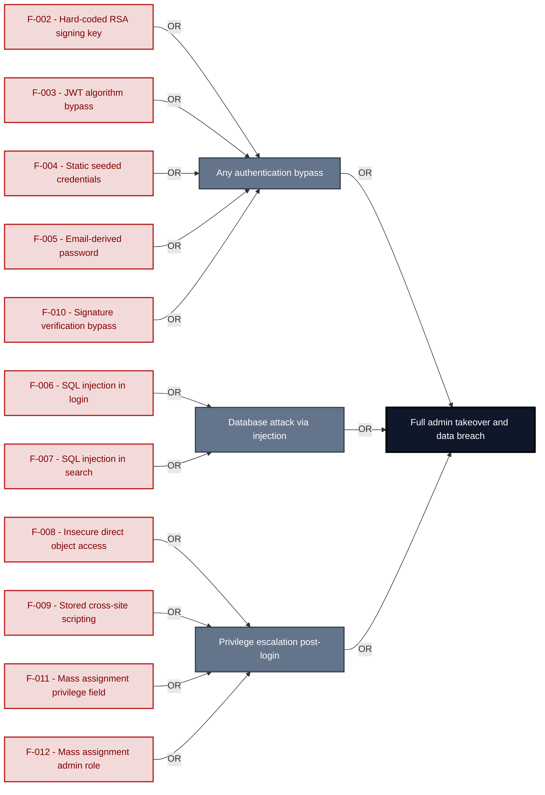

**Findings** (full detail in [§8 Findings Register](#8-findings-register)): [F-002](#f-002) · [F-003](#f-003) · [F-004](#f-004) · [F-005](#f-005) · [F-010](#f-010) · [F-006](#f-006) · [F-007](#f-007) · [F-008](#f-008) · [F-009](#f-009) · [F-011](#f-011) · [F-012](#f-012)

---

## 1. System Overview

Probably the most modern and sophisticated insecure web application

**Repository:** `https://github.com/juice-shop/juice-shop.git`
**Runtime:** Node\.js 22 - 26

### Scope

This threat model covers 6 components of juice-shop2: **Juice Shop Angular SPA**, **Express\.js REST API and WebSocket Server**, **JWT Authentication and 2FA Middleware**, **SQLite / Sequelize Data Layer**, **GitHub Actions CI/CD Pipeline**, **Web3 / Wallet / NFT Surface**.

All 6 modeled components received full STRIDE threat analysis.

**Out of scope:** third-party hosted dependencies, browser runtime, operating-system kernel, and the underlying network infrastructure.

**Basis:** a code-derived threat model at implementation level, built from source, configuration and git history. It describes the system as built, not as designed.

---

### Trust Boundaries

Canonical boundary crossings. **Assumption & verdict** names the condition that makes each crossing safe and whether this report still supports it, judged one condition at a time - which conditions apply follows from the direction of the crossing.

<table style="table-layout:fixed;width:100%">
<colgroup><col width="6%" style="width:6%"><col width="25%" style="width:25%"><col width="11%" style="width:11%"><col width="15%" style="width:15%"><col width="25%" style="width:25%"><col width="18%" style="width:18%"></colgroup>
<thead><tr><th>ID</th><th>Boundary / crossing</th><th>Exposure</th><th>Kind</th><th>Assumption &amp; verdict</th><th>Linked findings</th></tr></thead>
<tbody>
<tr><td style="white-space:nowrap"><a id="tb-1"></a>tb-1</td><td style="overflow-wrap:break-word"><strong>external → api-backend</strong><br/>Control: <code>security.isAuthorized()</code> expressJwt middleware · Also covers: web3-nft</td><td>🌐 <strong>External</strong></td><td style="overflow-wrap:break-word">network</td><td style="overflow-wrap:break-word">Every state-changing route is registered behind <code>security.isAuthorized()</code>.<br/>Validation: <strong>broken</strong> · 6 related · <a href="#66-input-boundary-validation-controls">§6.6</a><br/>Authentication: <strong>broken</strong> · 4 related · <a href="#62-identity-and-authentication-controls">§6.2</a><br/>Authorization: <strong>broken</strong> · 3 related · <a href="#64-authorization-controls">§6.4</a></td><td style="overflow-wrap:break-word"><em>Validation</em><br/>🟠 <a href="#f-036">F-036</a><br/><em>Authentication</em><br/>🔴 <a href="#f-003">F-003</a><br/>🔴 <a href="#f-044">F-044</a><br/><em>Authorization</em><br/>🟠 <a href="#f-053">F-053</a></td></tr>
<tr><td style="white-space:nowrap"><a id="tb-2"></a>tb-2</td><td style="overflow-wrap:break-word"><strong>external → ci-cd-pipeline</strong><br/>Control: <code>GITHUB_TOKEN</code> scopes and branch protection</td><td>🌐 <strong>External</strong></td><td style="overflow-wrap:break-word">build pipeline · operator</td><td style="overflow-wrap:break-word">Only authorized contributors can trigger workflows that access repository secrets.<br/>Validation: in doubt · 1 related · <a href="#66-input-boundary-validation-controls">§6.6</a><br/>Authentication: <strong>broken</strong> · 1 related · <a href="#62-identity-and-authentication-controls">§6.2</a><br/>Authorization: <strong>broken</strong> · 2 related · <a href="#64-authorization-controls">§6.4</a></td><td style="overflow-wrap:break-word"><em>Authentication</em><br/>🟠 <a href="#f-017">F-017</a><br/><em>Authorization</em><br/>🟠 <a href="#f-040">F-040</a></td></tr>
<tr><td style="white-space:nowrap"><a id="tb-3"></a>tb-3</td><td style="overflow-wrap:break-word"><strong>external → auth-service</strong><br/>Control: login route credential check and <code>jwt.sign</code> issuance</td><td>🌐 <strong>External</strong></td><td style="overflow-wrap:break-word">network · identity</td><td style="overflow-wrap:break-word">A JWT is issued only after the presented credentials match a stored account record.<br/>Validation: <em>not examined</em> · <a href="#66-input-boundary-validation-controls">§6.6</a><br/>Authentication: <strong>broken</strong> · 7 related · <a href="#62-identity-and-authentication-controls">§6.2</a><br/>Authorization: <em>not examined</em> · <a href="#64-authorization-controls">§6.4</a></td><td style="overflow-wrap:break-word"><em>Authentication</em><br/>🔴 <a href="#f-006">F-006</a><br/>🟠 <a href="#f-041">F-041</a></td></tr>
<tr><td style="white-space:nowrap"><a id="tb-4"></a>tb-4</td><td style="overflow-wrap:break-word"><strong>api-backend → db-layer</strong><br/>Control: Sequelize parameterized query binding</td><td>🔒 <strong>Internal</strong></td><td style="overflow-wrap:break-word">in-process - enforcement interface, no trust transition</td><td style="overflow-wrap:break-word">Every query reaches SQLite through Sequelize parameter binding.<br/>Query construction: <strong>broken</strong> · <a href="#65-query-construction-and-data-access-controls">§6.5</a></td><td style="overflow-wrap:break-word"><em>Query construction</em><br/>🔴 <a href="#f-006">F-006</a></td></tr>
<tr><td style="white-space:nowrap"><a id="tb-5"></a>tb-5</td><td style="overflow-wrap:break-word"><strong>api-backend → external</strong><br/>Control: none identified</td><td>↗ <strong>Egress</strong></td><td style="overflow-wrap:break-word">network · operator</td><td style="overflow-wrap:break-word">Nothing attacker-controlled reaches the LLM provider unfiltered.<br/>Egress content: <strong>broken</strong><br/>Egress destination: <em>not examined</em> · <a href="#610-file-parser-and-outbound-request-controls">§6.10</a><br/>Response trust: <strong>broken</strong></td><td style="overflow-wrap:break-word"><em>Egress content</em><br/>🟠 <a href="#f-019">F-019</a><br/><em>Response trust</em><br/>🔴 <a href="#f-070">F-070</a></td></tr>
</tbody>
</table>

_Exposure, most exposed first: ⚠ Review (endpoints unresolved) · 🌐 External (reached from outside the model) · ◐ Unverified (crossing not confirmed) · 🔒 Internal (both ends modelled) · ↗ Egress (reaches outside the model)._

_Kind - the crossing mechanism (build pipeline, in-process, network), then after `·` what changes across it: data-origin, identity, operator, privilege, tenant. Shown alone, nothing changes._

_Conditions - **inbound**: validation, authentication, authorization · **outbound**: egress content, egress destination, response trust (replies are untrusted input) · **internal**: query construction (data never becomes program text), authentication, authorization._

_Verdict per condition - **broken**: a linked finding proves the gap · in doubt: related findings, none linked here · not examined: nothing bears on it. `N related` counts further findings on the same condition. Linked findings sit under the condition they break, or under _Unattributed_. A link raises effective severity only at a confirmed internet ingress; raw risk never changes._

_Identical on every row, so stated once here instead of in a column: source `detected` (derived from inspected repository evidence); confidence `confirmed`; status `resolved`. Any row that deviates is shown in the table._

---

## 2. Architecture Diagrams

### 2.1 System Context

Who interacts with juice-shop2 from the outside, and through which channels. Solid arrows show normal usage; dashed red arrows mark unauthenticated probing or exploit paths (C4 Level 1).

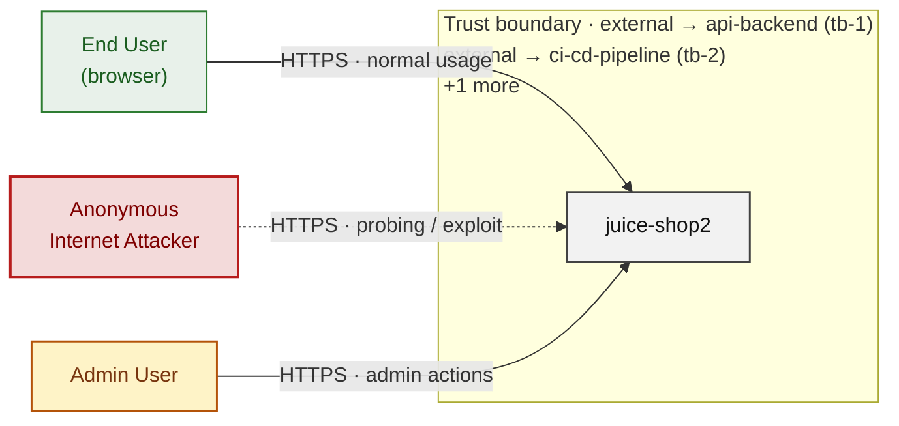

*Trust boundaries not named above: external → auth-service (tb-3), api-backend → db-layer (tb-4), api-backend → external (tb-5) - every boundary is listed in [§1 Trust Boundaries](#trust-boundaries).*

**Key takeaway:** Every actor in the context interacts with juice-shop2 through its external interface, so authentication and input validation at that edge govern the entire attack surface.

### 2.2 Container Architecture

How the system decomposes into deployable units. Each box is a separate runtime process or service container; arrows show synchronous request paths between them. Components with ≥3 Critical findings carry a red border, ≥2 High amber (C4 Level 2).

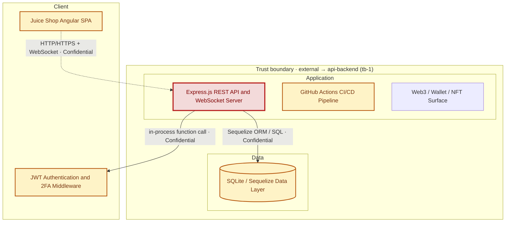

*Trust boundaries not drawn above: api-backend → db-layer (tb-4), external → auth-service (tb-3), api-backend → external (tb-5) - every boundary is listed in [§1 Trust Boundaries](#trust-boundaries).*

**Key takeaway:** The system decomposes into 2 client, 3 application and 1 data unit(s); Express\.js REST API and WebSocket Server carries the most Critical findings (6) and bounds the worst-case blast radius.

### 2.3 Components


Who reaches each component, and through which trust zone. Browser code runs on the user's device, so the client column is part of the untrusted zone, not a zone of its own - trust changes only where traffic enters the Application tier. Solid green arrows show legitimate data flow, dashed red arrows mark intrusion vectors. The component table directly below holds source paths and linked threats per `C-NN`; per-finding evidence is in [§8 Findings Register](#8-findings-register).

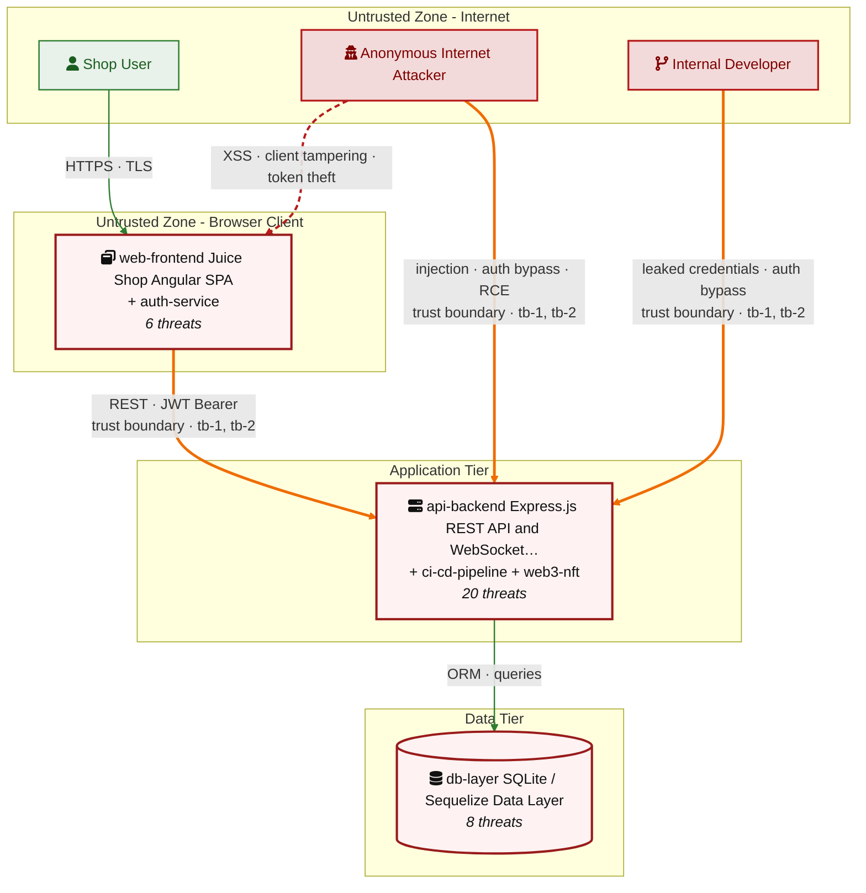

*Trust boundaries crossed by the `==>` edges above: external → api-backend (tb-1), external → ci-cd-pipeline (tb-2) - every boundary is listed in [§1 Trust Boundaries](#trust-boundaries).*

**Key takeaway:** Express\.js REST API and WebSocket Server concentrates the most findings (20 of 71 across all components); the table below maps each component to its source paths and linked threats.

| ID | Name | Type | Key Paths | Linked Threats |
|----|----------------------|-----------|------------------------------------|------------------------------------------------|
| <a id="c-01"></a><a id="web-frontend"></a><span style="white-space:nowrap">C-01</span> | Juice Shop Angular SPA | client | `frontend/src/app/**/*.ts`<br/>`frontend/src/app/**/*.html`<br/>`frontend/src/hacking-instructor/**/*.ts`<br/>`frontend/src/app/Services/*.ts`<br/>`frontend/src/app/app.routing.ts` | 🔴 [F-005](#f-005) — Email-derived password (`oauth.component.ts:30`)<br/>🔴 [F-009](#f-009) — Cross-Site Scripting (XSS) (`search-result.component.ts:143`)<br/>🟠 [F-018](#f-018) — OAuth token from URL fragment (`oauth.component.ts:71`)<br/>🟡 [F-043](#f-043) — Socket\.IO without auth (`socket-io.service.ts:22`)<br/>🔴 [F-064](#f-064) — Hardcoded test credentials (`login.component.ts:62`)<br/>🔴 [F-077](#f-077) — Session token stored in web-accessible client storage (`basket.service.ts:64`) |
| <a id="c-02"></a><a id="api-backend"></a><span style="white-space:nowrap">C-02</span> | Express\.js REST API and WebSocket Server | application | `server.ts`<br/>`routes/*.ts`<br/>`lib/*.ts`<br/>`lib/startup/*.ts`<br/>`models/*.ts` | 🟡 [F-001](#f-001) — Missing Security Event and Audit Logging (`login.ts:26`)<br/>🔴 [F-002](#f-002) — Hard-coded RSA private signing key (`insecurity.ts:21`)<br/>🔴 [F-003](#f-003) — JWT verified without algorithm allowlist (`insecurity.ts:52`)<br/>🔴 [F-006](#f-006) — SQL injection in login query (`login.ts:34`)<br/>🔴 [F-007](#f-007) — SQL injection request data interpolated into a SQL string (`search.ts:23`)<br/>🔴 [F-008](#f-008) — Insecure Direct Object Reference (`address.ts:11`)<br/>🔴 [F-011](#f-011) — Mass assignment privileged field accepted from request body (`verify.ts:53`)<br/>🟠 [F-019](#f-019) — Unvalidated chat messages reach LLM prompt (`chat.ts:206`)<br/>🟠 [F-021](#f-021) — Path traversal filesystem access from request input (`dataErasure.ts:104`)<br/>🟠 [F-025](#f-025) — Directory listing exposes key files (`server.ts:277`)<br/>🟠 [F-034](#f-034) — No rate limit on login endpoint (`server.ts:596`)<br/>🟠 [F-035](#f-035) — Unbounded LLM consumption on chat route (`server.ts:638`)<br/>🟠 [F-036](#f-036) — Client-supplied wallet credit trusted (`wallet.ts:27`)<br/>🔴 [F-039](#f-039) — Sensitive Routes Registered Without Authentication Middleware (`server.ts:310`)<br/>🔴 [F-046](#f-046) — Permissive CORS allows any origin (`server.ts:183`)<br/>🟡 [F-052](#f-052) — Confidential policy inside system prompt (`chat.ts:105`)<br/>🟠 [F-053](#f-053) — Unauthenticated admin configuration route (`server.ts:607`)<br/>🟡 [F-054](#f-054) — Stack traces returned by errorhandler (`server.ts:682`)<br/>🟡 [F-066](#f-066) — Rate limit keyed on spoofable header (`server.ts:346`)<br/>🔴 [F-070](#f-070) — Coupon tool runs without server-side cap (`chat.ts:184`) |
| <a id="c-03"></a><a id="auth-service"></a><span style="white-space:nowrap">C-03</span> | JWT Authentication and 2FA Middleware | application | `lib/insecurity.ts`<br/>`routes/2fa.ts`<br/>`routes/authenticatedUsers.ts`<br/>`routes/login.ts`<br/>`routes/changePassword.ts` | 🔴 [F-010](#f-010) — Improper signature verification (`insecurity.ts:55`)<br/>🟠 [F-013](#f-013) — OAuth implicit flow (`login.component.ts:148`)<br/>🟠 [F-014](#f-014) — Missing authentication rate limiting (`login.ts:32`)<br/>🟠 [F-015](#f-015) — Predictable derived password (`oauth.component.ts:30`)<br/>🟠 [F-016](#f-016) — Password reset accepts a security-question answer (`resetPassword.ts:10`)<br/>🟠 [F-020](#f-020) — Unverified password change (`changePassword.ts:39`)<br/>🟠 [F-022](#f-022) — Non-cryptographic RNG for a secret/token (`insecurity.ts:53`)<br/>🟠 [F-026](#f-026) — Weak MD5 password hashing (`insecurity.ts:41`)<br/>🟠 [F-027](#f-027) — Session token in localStorage (`login.component.ts:101`)<br/>🟠 [F-037](#f-037) — Client-side-only admin guard (`app.guard.ts:54`)<br/>🟠 [F-038](#f-038) — Weak password recovery mechanism (`resetPassword.ts:41`)<br/>🟠 [F-041](#f-041) — Missing token revocation (`insecurity.ts:54`)<br/>🟡 [F-047](#f-047) — Broken hash primitive `lib/insecurity.ts:41` (`MD5/SHA-1`) (`insecurity.ts:41`)<br/>🟡 [F-055](#f-055) — Credentials in URL query string (`changePassword.ts:14`)<br/>🔴 [F-056](#f-056) — Hardcoded test credentials (`login.component.ts:62`)<br/>🔴 [F-057](#f-057) — Hardcoded HMAC key (`insecurity.ts:42`)<br/>🟡 [F-067](#f-067) — Uncontrolled recursion (`insecurity.ts:66`) |
| <a id="c-04"></a><a id="db-layer"></a><span style="white-space:nowrap">C-04</span> | SQLite / Sequelize Data Layer | data | `models/*.ts`<br/>`data/datacreator.ts`<br/>`data/mongodb.ts` | 🔴 [F-004](#f-004) — Seeded static account credentials (`datacreator.ts:193`)<br/>🔴 [F-012](#f-012) — Mass assignment of privileged role (`user.ts:85`)<br/>🟠 [F-031](#f-031) — Cleartext payment card number storage (`card.ts:38`)<br/>🟠 [F-032](#f-032) — Static-key HMAC of security answers (`securityAnswer.ts:45`)<br/>🟡 [F-042](#f-042) — Cleartext TOTP secret storage (`user.ts:112`)<br/>🔴 [F-049](#f-049) — Stored XSS via unsanitized email persistence (`user.ts:70`)<br/>🟡 [F-063](#f-063) — Security answer plaintext in error log (`datacreator.ts:692`)<br/>🟡 [F-068](#f-068) — Unbounded feedback comment persistence (`feedback.ts:40`) |
| <a id="c-05"></a><a id="ci-cd-pipeline"></a><span style="white-space:nowrap">C-05</span> | GitHub Actions CI/CD Pipeline | application | `.github/workflows/*.yml`<br/>`Dockerfile`<br/>`docker-compose.test.yml` | 🟠 [F-017](#f-017) — Long-lived registry publish token (`ci.yml:327`)<br/>🟠 [F-023](#f-023) — Third-party action pinned to mutable ref (`image_actions.yml:33`)<br/>🟠 [F-024](#f-024) — CI/CD Workflow Supply-Chain Risk (`ci.yml:238`)<br/>🟠 [F-028](#f-028) — GitHub Actions workflow-level permissions block (`ci.yml:1`)<br/>🟠 [F-029](#f-029) — Dockerfile base image must be digest-pinned (`Dockerfile:1`)<br/>🟠 [F-030](#f-030) — `Package-lock.json` present and committed (`package-lock.json:0`)<br/>🟠 [F-040](#f-040) — Default-scope `GITHUB_TOKEN` passed to action (`image_actions.yml:35`)<br/>🟡 [F-048](#f-048) — Remote installer piped to shell in CI (`ci.yml:358`)<br/>🟡 [F-051](#f-051) — Published images carry no signed provenance (`ci.yml:338`)<br/>🟡 [F-058](#f-058) — Repository secrets exposed to job-wide environment (`ci.yml:252`)<br/>🟡 [F-059](#f-059) — Dockerfile USER directive (non-root) (`Dockerfile:1`)<br/>🟡 [F-060](#f-060) — Container image signing via cosign or attest-build-provenance (`ci.yml:1`)<br/>🟡 [F-061](#f-061) — Untrusted npm Install/Postinstall Scripts Enabled (`Dockerfile:4`)<br/>🟡 [F-062](#f-062) — `GITHUB_TOKEN` scope minimization (`ci.yml:1`) |
| <a id="c-06"></a><a id="web3-nft"></a><span style="white-space:nowrap">C-06</span> | Web3 / Wallet / NFT Surface | application | `routes/checkKeys.ts`<br/>`routes/nftMint.ts`<br/>`routes/redirect.ts`<br/>`routes/web3Wallet.ts` | 🔴 [F-033](#f-033) — Hardcoded BIP39 wallet mnemonic (`checkKeys.ts:10`)<br/>🔴 [F-044](#f-044) — Unverified wallet ownership claim (`nftMint.ts:41`)<br/>🟡 [F-045](#f-045) — Open redirect via substring allowlist (`redirect.ts:19`)<br/>🟡 [F-050](#f-050) — Trusted external event state change (`web3Wallet.ts:29`)<br/>🟡 [F-065](#f-065) — Raw error message disclosure (`nftMint.ts:33`)<br/>🟡 [F-069](#f-069) — Unbounded in-memory address set (`web3Wallet.ts:16`) |
### 2.4 Technology Architecture

The technology stack the system is built on. Each box names the framework or runtime that fills that role; per-component findings live in the [§2.3](#23-components) component table above, and the full per-finding catalogue is in [§8 Findings Register](#8-findings-register).

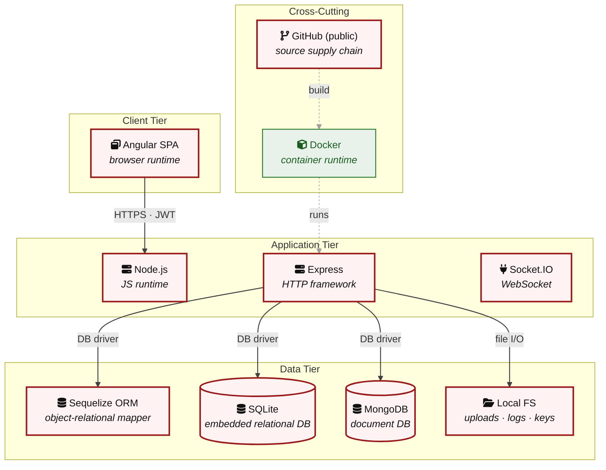

**Key takeaway:** The stack spans 1 data-tier store(s) behind the application tier; injection and data-at-rest exposure track the data tier, detailed per finding in [§8 Findings Register](#8-findings-register).

> **Legend:** `-->` synchronous request/response (REST, HTTPS, gRPC) · `-.->` asynchronous / event-driven (WebSocket, queue, pub-sub) · `==>` crosses an untrusted trust boundary (security-critical) · **red border** ≥ 3 Critical threats on the component · **amber border** ≥ 2 High threats

---

## 3. Attack Walkthroughs

This section walks through how the **8 highest-priority of 21 Critical findings** are exploited - selected by severity, chain relevance, and threat-category diversity, with Access Control and LLM Abuse represented when present. Each walkthrough has attack steps, a focused sequence diagram, and the primary mitigation. How weaknesses combine toward the worst-case goal is in the [Critical Attack Tree](#critical-attack-tree); every other Critical, plus full per-finding context (severity rationale, assets, detection signals), is in the [§8 Findings Register](#8-findings-register).

### 3.1 SQL injection request data interpolated into a SQL string

**Source:** 🔴 [F-007](#f-007) — `routes/search.ts:23`

Severity **Critical** ([CWE-89](https://cwe.mitre.org/data/definitions/89.html)). STRIDE: Tampering. See [§8 F-007](#f-007) for the full register row.

**Attack Steps**

1. Find the request parameter that reaches the raw query at `routes/search.ts:23`.
2. Interpolating request-controlled text into a SQL statement lets an attacker alter the query - exfiltrating or modifying arbitrary rows, bypassing authentication, or escalating to full database control.

**Sequence Diagram**

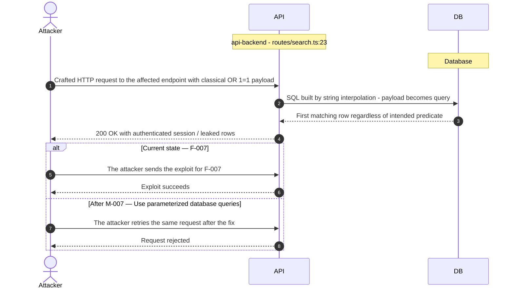

**Key takeaway:** Until ● [M-007](#m-007) (Use parameterized database queries) lands, 🔴 [F-007](#f-007) — SQL injection request data interpolated into a SQL string `routes/search.ts:23` is exploitable at `routes/search.ts:23` (Critical-severity, [CWE-89](https://cwe.mitre.org/data/definitions/89.html)).

**Defense in Depth**

- Primary mitigation: ● [M-007](#m-007) (Use parameterized database queries)

### 3.2 Mass assignment privileged field accepted from request body

**Source:** 🔴 [F-011](#f-011) — `routes/verify.ts:53`

Severity **Critical** ([CWE-915](https://cwe.mitre.org/data/definitions/915.html)). STRIDE: Elevation of Privilege. See [§8 F-011](#f-011) for the full register row.

**Attack Steps**

1. An attacker crafts a request targeting the weak spot at `routes/verify.ts:53`.
2. The attacker simply adds `{"role":"admin"}` to their request to escalate.

**Sequence Diagram**

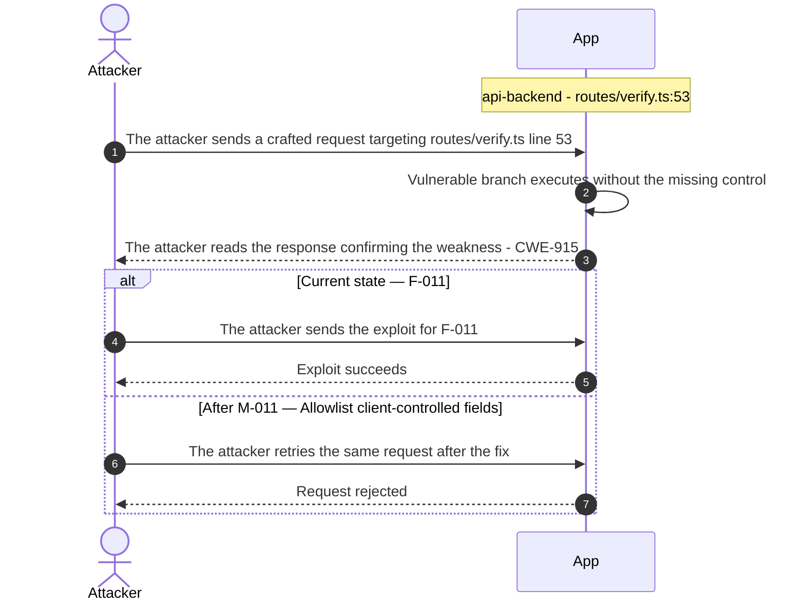

**Key takeaway:** Until ● [M-011](#m-011) (Allowlist client-controlled fields) lands, 🔴 [F-011](#f-011) — Mass assignment privileged field accepted from request body `routes/verify.ts:53` is exploitable at `routes/verify.ts:53` (Critical-severity, [CWE-915](https://cwe.mitre.org/data/definitions/915.html)).

**Defense in Depth**

- Primary mitigation: ● [M-011](#m-011) (Allowlist client-controlled fields)

### 3.3 JWT verified without algorithm allowlist

**Source:** 🔴 [F-003](#f-003) — `lib/insecurity.ts:52`

Severity **Critical** ([CWE-347](https://cwe.mitre.org/data/definitions/347.html)). STRIDE: Spoofing. See [§8 F-003](#f-003) for the full register row.

**Attack Steps**

1. I download `encryptionkeys/jwt.pub` from the directory listing the server exposes at `/encryptionkeys`.
2. I mint a JWT with alg `HS256` and payload `data.role`=admin, using the PEM text of that public key as the HMAC secret.
3. I call PUT `/rest/order-history/1/delivery-status` with the forged bearer token and the accounting-only guard admits me.
4. I keep the forged token for six hours of full administrative API access without ever holding a password.

**Sequence Diagram**


**Key takeaway:** Until ● [M-003](#m-003) (Enforce JWT signature and algorithm verification) lands, 🔴 [F-003](#f-003) — JWT verified without algorithm allowlist (`lib/insecurity.ts:52`) is exploitable at `lib/insecurity.ts:52` (Critical-severity, [CWE-347](https://cwe.mitre.org/data/definitions/347.html)).

**Defense in Depth**

- Primary mitigation: ● [M-003](#m-003) (Enforce JWT signature and algorithm verification)

### 3.4 SQL injection in login query

**Source:** 🔴 [F-006](#f-006) — `routes/login.ts:34`

Severity **Critical** ([CWE-89](https://cwe.mitre.org/data/definitions/89.html)). STRIDE: Tampering. See [§8 F-006](#f-006) for the full register row.

**Attack Steps**

1. I POST `{"email":"' OR 1=1--","password":"x"}` to `/rest/user/login`.
2. The interpolated statement in `routes/login.ts:34` drops the password comparison and returns the first Users row.
3. The handler calls `security.authorize()` on that row and returns a valid admin bearer token to me.

**Sequence Diagram**

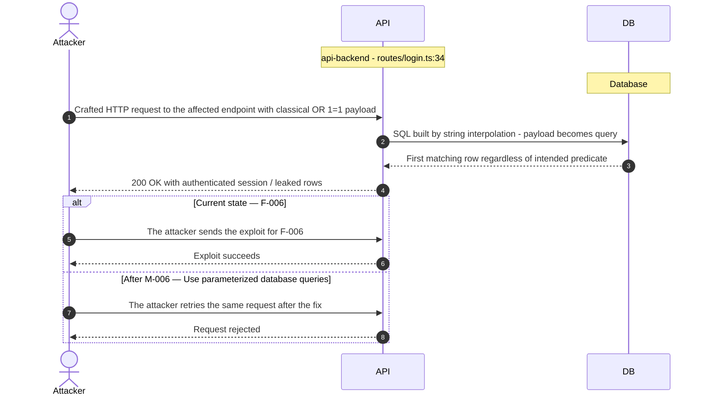

**Key takeaway:** Until ● [M-006](#m-006) (Use parameterized database queries) lands, 🔴 [F-006](#f-006) — SQL injection in login query (`routes/login.ts:34`) is exploitable at `routes/login.ts:34` (Critical-severity, [CWE-89](https://cwe.mitre.org/data/definitions/89.html)).

**Defense in Depth**

- Primary mitigation: ● [M-006](#m-006) (Use parameterized database queries)

### 3.5 Improper signature verification in JWT Authentication and 2FA Middleware

**Source:** 🔴 [F-010](#f-010) — `lib/insecurity.ts:55`

Severity **Critical** ([CWE-347](https://cwe.mitre.org/data/definitions/347.html)). STRIDE: Elevation of Privilege. See [§8 F-010](#f-010) for the full register row.

**Attack Steps**

1. I craft a JWS whose payload sets userId to the victim and type to `password_valid_needs_second_factor_token`.
2. I post it as tmpToken to `/rest/2fa/verify` together with a TOTP code, since the verify helper supplies no key to check the signature against.
3. The handler loads the victim by that userId and returns a full session token bound to their account.

**Sequence Diagram**

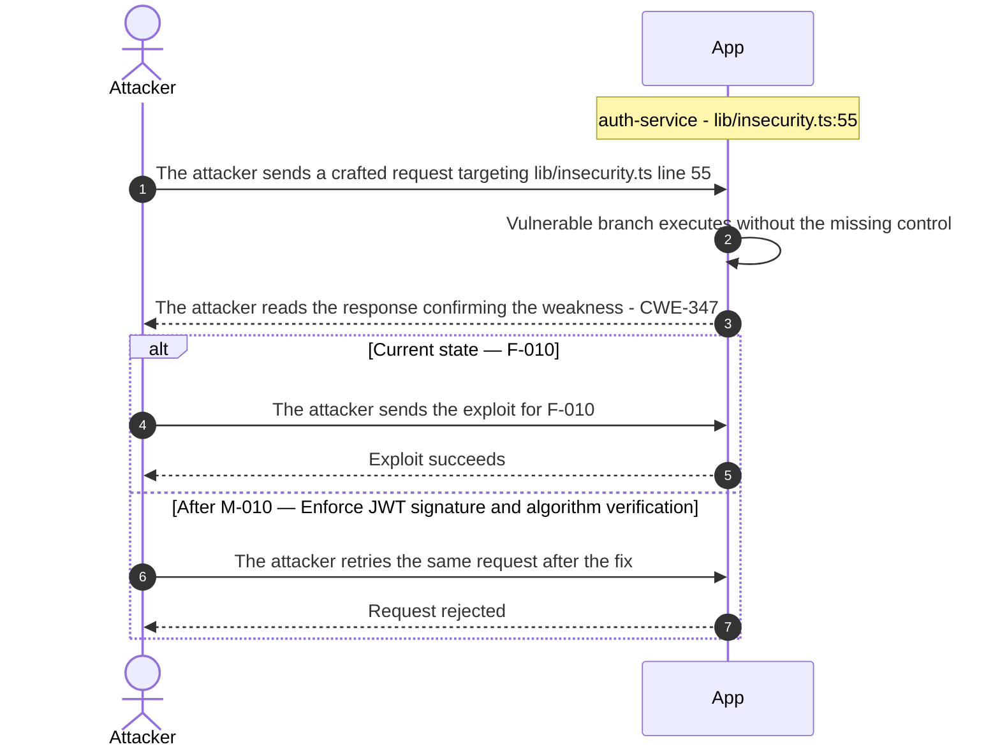

**Key takeaway:** Until ● [M-010](#m-010) (Enforce JWT signature and algorithm verification) lands, 🔴 [F-010](#f-010) — Improper signature verification (`lib/insecurity.ts:55`) is exploitable at `lib/insecurity.ts:55` (Critical-severity, [CWE-347](https://cwe.mitre.org/data/definitions/347.html)).

**Defense in Depth**

- Primary mitigation: ● [M-010](#m-010) (Enforce JWT signature and algorithm verification)

### 3.6 Cross-Site Scripting (XSS) in Search Result

**Source:** 🔴 [F-009](#f-009) — `frontend/src/app/search-result/search-result.component.ts:143`

Severity **Critical** ([CWE-79](https://cwe.mitre.org/data/definitions/79.html)). STRIDE: Tampering. See [§8 F-009](#f-009) for the full register row.

**Attack Steps**

1. I craft a shop search URL whose q parameter carries an image tag with an onerror handler.
2. I send that link to a logged-in user, or post it where users click it.
3. The victim's browser renders my markup unescaped because the sanitizer was explicitly bypassed.
4. My payload reads `localStorage.token` and posts the victim's session to my server.

**Sequence Diagram**


**Key takeaway:** Until ● [M-009](#m-009) (Encode output instead of bypassing the framework sanitizer) lands, 🔴 [F-009](#f-009) — Cross-Site Scripting (XSS) is exploitable at `frontend/src/app/search-result/search-result.component.ts:143` (Critical-severity, [CWE-79](https://cwe.mitre.org/data/definitions/79.html)).

**Defense in Depth**

- Primary mitigation: ● [M-009](#m-009) (Encode output instead of bypassing the framework sanitizer)

### 3.7 Hard-coded RSA private signing key in Express js REST API and WebSocket Server

**Source:** 🔴 [F-002](#f-002) — `lib/insecurity.ts:21`

Severity **Critical** ([CWE-321](https://cwe.mitre.org/data/definitions/321.html)). STRIDE: Spoofing. See [§8 F-002](#f-002) for the full register row.

**Attack Steps**

1. I copy the PEM private key literal from `lib/insecurity.ts:21` in the published source tree.
2. I sign an `RS256` token with payload `data.role`=admin and `data.id` set to the victim account id.
3. I present that token to `/rest/user/data-export` and export another customer's personal data as if I were them.

**Sequence Diagram**

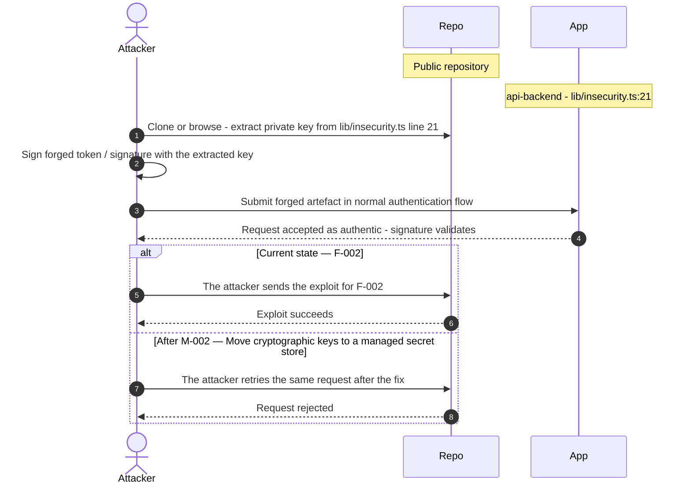

**Key takeaway:** Until ● [M-002](#m-002) (Move cryptographic keys to a managed secret store) lands, 🔴 [F-002](#f-002) — Hard-coded RSA private signing key (`lib/insecurity.ts:21`) is exploitable at `lib/insecurity.ts:21` (Critical-severity, [CWE-321](https://cwe.mitre.org/data/definitions/321.html)).

**Defense in Depth**

- Primary mitigation: ● [M-002](#m-002) (Move cryptographic keys to a managed secret store)

### 3.8 Coupon tool runs without server-side cap in Chat

**Source:** 🔴 [F-070](#f-070) — `routes/chat.ts:184`

Severity **Medium** ([CWE-862](https://cwe.mitre.org/data/definitions/862.html)). STRIDE: Elevation of Privilege. See [§8 F-070](#f-070) for the full register row.

**Attack Steps**

1. An attacker crafts a request targeting the weak spot at `routes/chat.ts:184`.
2. LLM06 - Excessive Agency: the generateCoupon tool executes autonomously whenever the model decides to call it, and `routes/chat.ts:184` passes the model-supplied discount straight to `security.generateCoupon` with no maximum, no check that the caller is authenticated, and no human approval step.
3. The eligibility conditions and the 10% ceiling exist only as system-prompt sentences, so a model steered by an injected message issues a coupon of any value to an anonymous caller.

**Sequence Diagram**


**Key takeaway:** Until ◑ [M-070](#m-070) (Enforce server-side authorization on every endpoint) lands, 🔴 [F-070](#f-070) — Coupon tool runs without server-side cap (`routes/chat.ts:184`) is exploitable at `routes/chat.ts:184` (Medium-severity, [CWE-862](https://cwe.mitre.org/data/definitions/862.html)).

**Defense in Depth**

- Primary mitigation: ◑ [M-070](#m-070) (Enforce server-side authorization on every endpoint)

<!-- generated:`walkthrough_renderer` -->

---

## 4. Assets

Information assets and the classification level that drives the Confidentiality / Integrity / Availability targets used in [§8 Findings Register](#8-findings-register) risk scoring.

| Asset | Classification | Description |
|----------------------|--------------|------------------------------------|
| User Account Credentials | Restricted | Password hashes stored in the users table<br/>via `models/user.ts`. Juice Shop uses a weak<br/>hashing scheme (`MD5`) for challenge purposes,<br/>making the stored credentials directly<br/>exploitable if the database is exfiltrated.<br/>Credential theft is the primary consequence<br/>of SQLi or database-file access attacks. |
| Hardcoded RSA Private Key (JWT Signing Key) | Restricted | 2048-bit RSA private key embedded verbatim<br/>in `lib/insecurity.ts` at line 21, used to<br/>sign all JWTs issued by the application. Any<br/>party with read access to the source<br/>repository can forge arbitrary JWT tokens<br/>for any user account, bypassing<br/>authentication entirely. |
| LLM API Key | Restricted | External LLM provider API key consumed at<br/>runtime via the `LLM_API_KEY` environment<br/>variable (`routes/chat.ts:110`) and validated<br/>at startup by<br/>`lib/startup/validatePreconditions.ts`.<br/>Exfiltration enables unauthorized use of the<br/>configured LLM service and incurs billing<br/>under the key owner's account. |
| CI/CD Pipeline Secrets | Restricted | GitHub Actions workflow secrets including<br/>npm publish tokens, container registry<br/>credentials, and `GITHUB_TOKEN` used across<br/>`release.yml` and related workflows.<br/>Compromise via unpinned third-party actions<br/>or `pull_request_target` misuse would give an<br/>attacker publish rights to the npm package<br/>and Docker image. |
| User PII (email, address, name) | Confidential | Email addresses, delivery addresses, and<br/>user profile data persisted in the users and<br/>address Sequelize models. Exposed through<br/>multiple IDOR-vulnerable REST endpoints and<br/>the data-export route. |
| JWT Bearer Tokens | Confidential | JWT tokens issued by the Express backend and<br/>stored in browser localStorage by the<br/>Angular SPA (`basket.service.ts:64`). XSS<br/>payloads can exfiltrate these tokens,<br/>providing full authenticated access to the<br/>victim's account without requiring<br/>credentials. |
| Payment Card Data | Confidential | Payment card numbers and metadata stored in<br/>the card Sequelize model (`models/card.ts`)<br/>and exposed through `/api/Cards/:id`<br/>endpoints. Multiple missing-authz routes<br/>allow any authenticated user to read or<br/>modify card records belonging to other<br/>users. |
| SQLite Database File | Confidential | SQLite database file on local filesystem<br/>containing all user, order, product,<br/>challenge, and session data. Accessible to<br/>any process running as the application user;<br/>file-path traversal or RCE leads to full<br/>data exfiltration. |
| Application Configuration Data | Internal | Runtime application configuration exposed<br/>unauthenticated at<br/>`/rest/admin/application-configuration`<br/>(`server.ts:607`), including feature flags,<br/>challenge parameters, and LLM endpoint URLs.<br/>Discloses internal topology that assists<br/>targeted attack planning. |
| Challenge Progress and CTF State | Internal | User challenge completion records and<br/>application CTF state stored in the<br/>challenge and related Sequelize models.<br/>Manipulable via unauthenticated<br/>continue-code endpoints (R-067, R-068,<br/>R-069), allowing arbitrary challenge<br/>completion without solving the underlying<br/>exercise. |

---

## 5. Attack Surface

Network-reachable entry points classified by authentication requirement. Each row links to the threat(s) refe**** (10 chars) in its **Notes** column. The **Risk** column reflects the highest-severity linked finding. Entry points with no linked finding are still listed when they sit on a sensitive surface (authentication, registration, management) or look like a missing-auth/authz suspect - marked **⚑ Review** in Notes.

### 5.1 Unauthenticated Entry Points (55)

<table style="table-layout:fixed;width:100%">
<colgroup><col width="9%" style="width:9%"><col width="30%" style="width:30%"><col width="14%" style="width:14%"><col width="47%" style="width:47%"></colgroup>
<thead><tr><th>Method</th><th>Route</th><th>Risk</th><th>Notes</th></tr></thead>
<tbody>
<tr><td>POST</td><td style="overflow-wrap:anywhere"><code>/rest/user/login</code></td><td>🔴 Critical</td><td>🔴 <a href="#f-006">F-006</a> — SQL injection in login query (<code>login.ts:34</code>)<br/>🟠 <a href="#f-014">F-014</a> — Missing authentication rate limiting (<code>login.ts:32</code>)<br/>🟠 <a href="#f-015">F-015</a> — Predictable derived password (<code>oauth.component.ts:30</code>)<br/>handler: <code>server.ts:596</code></td></tr>
<tr><td>GET</td><td style="overflow-wrap:anywhere"><code>/rest/products/search</code></td><td>🔴 Critical</td><td>🔴 <a href="#f-007">F-007</a> — SQL injection request data interpolated into a SQL string (<code>search.ts:23</code>)<br/>handler: <code>server.ts:602</code></td></tr>
<tr><td>GET</td><td style="overflow-wrap:anywhere"><code>/rest/user/change-password</code></td><td>🔴 Critical</td><td>🟠 <a href="#f-020">F-020</a> — Unverified password change (<code>changePassword.ts:39</code>)<br/>🟡 <a href="#f-055">F-055</a> — Credentials in URL query string (<code>changePassword.ts:14</code>)<br/>🔴 <a href="#f-004">F-004</a> — Seeded static account credentials (<code>datacreator.ts:193</code>)<br/>handler: <code>server.ts:597</code></td></tr>
<tr><td>POST</td><td style="overflow-wrap:anywhere"><code>/rest/user/reset-password</code></td><td>🟠 High</td><td>🟠 <a href="#f-038">F-038</a> — Weak password recovery mechanism (<code>resetPassword.ts:41</code>)<br/>🟠 <a href="#f-034">F-034</a> — No rate limit on login endpoint (<code>server.ts:596</code>)<br/>🟠 <a href="#f-016">F-016</a> — Password reset accepts a security-question answer (<code>resetPassword.ts:10</code>)<br/>handler: <code>server.ts:598</code></td></tr>
<tr><td>GET</td><td style="overflow-wrap:anywhere"><code>/​rest/​admin/​application-​configuration</code></td><td>🟡 Medium</td><td>🟠 <a href="#f-053">F-053</a> — Unauthenticated admin configuration route (<code>server.ts:607</code>)<br/>Admin endpoint exposes full runtime configuration including LLM URLs and feature flags with no authentication.</td></tr>
<tr><td>POST</td><td style="overflow-wrap:anywhere"><code>/​rest/​web3/​walletExploitAddress</code></td><td>🟡 Medium</td><td>🟡 <a href="#f-050">F-050</a> — Trusted external event state change (<code>web3Wallet.ts:29</code>)<br/>🟡 <a href="#f-069">F-069</a> — Unbounded in-memory address set (<code>web3Wallet.ts:16</code>)<br/>POST <code>/rest/web3/walletExploitAddress</code> unauthenticated; wallet exploit submission without auth.</td></tr>
<tr><td>POST</td><td style="overflow-wrap:anywhere"><code>/rest/web3/walletNFTVerify</code></td><td>🟡 Medium</td><td>🔴 <a href="#f-044">F-044</a> — Unverified wallet ownership claim (<code>nftMint.ts:41</code>)<br/>POST <code>/rest/web3/walletNFTVerify</code> unauthenticated; NFT wallet verification bypass.</td></tr>
<tr><td>GET</td><td style="overflow-wrap:anywhere"><code>/redirect</code></td><td>🟡 Medium</td><td>🟡 <a href="#f-045">F-045</a> — Open redirect via substring allowlist (<code>redirect.ts:19</code>)<br/>handler: <code>server.ts:659</code></td></tr>
<tr><td>GET</td><td style="overflow-wrap:anywhere"><code>/rest/web3/nftMintListen</code></td><td>🟡 Medium</td><td>🟡 <a href="#f-065">F-065</a> — Raw error message disclosure (<code>nftMint.ts:33</code>)<br/>handler: <code>server.ts:643</code></td></tr>
<tr><td>POST</td><td style="overflow-wrap:anywhere"><code>/</code></td><td>-</td><td>Data erasure POST handler shows missing-auth signal; GDPR-scope operation reachable unauthenticated.<br/><em>⚑ Review: no auth guard detected</em></td></tr>
<tr><td>POST</td><td style="overflow-wrap:anywhere"><code>/api/Feedbacks</code></td><td>-</td><td>handler: <code>server.ts:402</code><br/><em>⚑ Review: no auth guard detected</em></td></tr>
<tr><td>POST</td><td style="overflow-wrap:anywhere"><code>/file-upload</code></td><td>-</td><td>Unauthenticated file upload; primary path for server-side file abuse and stored XSS.<br/><em>⚑ Review: no auth guard detected</em></td></tr>
<tr><td>POST</td><td style="overflow-wrap:anywhere"><code>/profile</code></td><td>-</td><td>POST <code>/profile</code> unauthenticated; profile update without authentication.<br/><em>⚑ Review: no auth guard detected</em></td></tr>
<tr><td>POST</td><td style="overflow-wrap:anywhere"><code>/profile/image/file</code></td><td>-</td><td>Unauthenticated profile image upload via file; path traversal and malicious file upload risk.<br/><em>⚑ Review: no auth guard detected</em></td></tr>
<tr><td>POST</td><td style="overflow-wrap:anywhere"><code>/profile/image/url</code></td><td>-</td><td>Unauthenticated profile image update via URL; SSRF vector allowing internal service probing.<br/><em>⚑ Review: no auth guard detected</em></td></tr>
<tr><td>GET</td><td style="overflow-wrap:anywhere"><code>/​rest/​admin/​application-​version</code></td><td>-</td><td>Admin endpoint exposes application version without authentication; information disclosure baseline for targeted attacks.<br/><em>⚑ Review: no auth guard detected</em></td></tr>
<tr><td>PUT</td><td style="overflow-wrap:anywhere"><code>/​rest/​continue-​code-​findIt/​apply/​:​continueCode</code></td><td>-</td><td>PUT continue-code-findIt apply without authentication; arbitrary challenge completion.<br/><em>⚑ Review: no auth guard detected</em></td></tr>
<tr><td>PUT</td><td style="overflow-wrap:anywhere"><code>/​rest/​continue-​code-​fixIt/​apply/​:​continueCode</code></td><td>-</td><td>PUT continue-code-fixIt apply without authentication; arbitrary challenge completion.<br/><em>⚑ Review: no auth guard detected</em></td></tr>
<tr><td>PUT</td><td style="overflow-wrap:anywhere"><code>/​rest/​continue-​code/​apply/​:​continueCode</code></td><td>-</td><td>PUT continue-code apply without authentication; arbitrary full progress restoration.<br/><em>⚑ Review: no auth guard detected</em></td></tr>
<tr><td>POST</td><td style="overflow-wrap:anywhere"><code>/rest/memories</code></td><td>-</td><td>Unauthenticated memory/memory creation; stored XSS and IDOR without authentication.<br/><em>⚑ Review: no auth guard detected</em></td></tr>
<tr><td>PUT</td><td style="overflow-wrap:anywhere"><code>/​rest/​order-​history/​:​id/​delivery-​status</code></td><td>-</td><td>PUT order delivery status without authentication; allows unauthorized order state manipulation.<br/><em>⚑ Review: no auth guard detected</em></td></tr>
<tr><td>POST</td><td style="overflow-wrap:anywhere"><code>/rest/user/data-export</code></td><td>-</td><td>POST <code>/rest/user/data-export</code> without authentication; potential PII exfiltration.<br/><em>⚑ Review: no auth guard detected</em></td></tr>
<tr><td>POST</td><td style="overflow-wrap:anywhere"><code>/rest/web3/submitKey</code></td><td>-</td><td>POST <code>/rest/web3/submitKey</code> unauthenticated; blockchain challenge key submission.<br/><em>⚑ Review: no auth guard detected</em></td></tr>
<tr><td>POST</td><td style="overflow-wrap:anywhere"><code>/snippets/fixes</code></td><td>-</td><td>POST <code>/snippets/fixes</code> unauthenticated; code fix submission without authentication.<br/><em>⚑ Review: no auth guard detected</em></td></tr>
<tr><td>POST</td><td style="overflow-wrap:anywhere"><code>/snippets/verdict</code></td><td>-</td><td>POST <code>/snippets/verdict</code> unauthenticated; code challenge verdict submission.<br/><em>⚑ Review: no auth guard detected</em></td></tr>
</tbody>
</table>

_30 further entry point(s) in this category carry no linked finding and no elevated review signal, and are not listed individually (55 total). The complete route inventory is available in `.route-inventory.json` and, when exported, `pentest-tasks.yaml`._

### 5.2 Authenticated Entry Points (52)

<table style="table-layout:fixed;width:100%">
<colgroup><col width="9%" style="width:9%"><col width="30%" style="width:30%"><col width="14%" style="width:14%"><col width="47%" style="width:47%"></colgroup>
<thead><tr><th>Method</th><th>Route</th><th>Risk</th><th>Notes</th></tr></thead>
<tbody>
<tr><td>POST</td><td style="overflow-wrap:anywhere"><code>/rest/2fa/verify</code></td><td>🔴 Critical</td><td>🔴 <a href="#f-011">F-011</a> — Mass assignment privileged field accepted from request body (<code>verify.ts:53</code>)<br/>POST <code>/rest/2fa/verify</code>; 2FA code verification without documented rate-limit evidence.</td></tr>
<tr><td>POST</td><td style="overflow-wrap:anywhere"><code>/rest/chat</code></td><td>🟠 High</td><td>🟠 <a href="#f-035">F-035</a> — Unbounded LLM consumption on chat route (<code>server.ts:638</code>)<br/>🟠 <a href="#f-019">F-019</a> — Unvalidated chat messages reach LLM prompt (<code>chat.ts:206</code>)<br/>🟡 <a href="#f-052">F-052</a> — Confidential policy inside system prompt (<code>chat.ts:105</code>)<br/>POST <code>/rest/chat</code> LLM-backed endpoint; prompt injection surface, user input reaches LLM tool calls with DB access.</td></tr>
<tr><td>GET</td><td style="overflow-wrap:anywhere"><code>/rest/wallet/balance</code></td><td>🟠 High</td><td>🟠 <a href="#f-036">F-036</a> — Client-supplied wallet credit trusted (<code>wallet.ts:27</code>)<br/>handler: <code>server.ts:626</code></td></tr>
<tr><td>PUT</td><td style="overflow-wrap:anywhere"><code>/rest/wallet/balance</code></td><td>🟠 High</td><td>🟠 <a href="#f-036">F-036</a> — Client-supplied wallet credit trusted (<code>wallet.ts:27</code>)<br/>handler: <code>server.ts:627</code></td></tr>
<tr><td>PUT</td><td style="overflow-wrap:anywhere"><code>/api/Addresss/:id</code></td><td>-</td><td>PUT <code>/api/Addresss/:id</code> with auth but missing authz; cross-user address modification (IDOR).<br/><em>⚑ Review: no authz guard detected</em></td></tr>
<tr><td>DELETE</td><td style="overflow-wrap:anywhere"><code>/api/Addresss/:id</code></td><td>-</td><td>DELETE <code>/api/Addresss/:id</code> with auth but missing authz; cross-user address deletion.<br/><em>⚑ Review: no authz guard detected</em></td></tr>
<tr><td>PUT</td><td style="overflow-wrap:anywhere"><code>/api/BasketItems/:id</code></td><td>-</td><td>PUT <code>/api/BasketItems/:id</code> with auth but missing authz; IDOR allows modifying other users' basket items.<br/><em>⚑ Review: no authz guard detected</em></td></tr>
<tr><td>PUT</td><td style="overflow-wrap:anywhere"><code>/api/Cards/:id</code></td><td>-</td><td>PUT <code>/api/Cards/:id</code> with auth but missing authz; cross-user payment card modification.<br/><em>⚑ Review: no authz guard detected</em></td></tr>
<tr><td>DELETE</td><td style="overflow-wrap:anywhere"><code>/api/Cards/:id</code></td><td>-</td><td>DELETE <code>/api/Cards/:id</code> with auth but missing authz; cross-user payment card deletion.<br/><em>⚑ Review: no authz guard detected</em></td></tr>
<tr><td>GET</td><td style="overflow-wrap:anywhere"><code>/api/Cards/:id</code></td><td>-</td><td>GET <code>/api/Cards/:id</code> with auth but missing authz; cross-user payment card read (PCI exposure).<br/><em>⚑ Review: no authz guard detected</em></td></tr>
<tr><td>PUT</td><td style="overflow-wrap:anywhere"><code>/api/Feedbacks/:id</code></td><td>-</td><td>PUT <code>/api/Feedbacks/:id</code> with auth but missing authz; any user can overwrite any feedback record.<br/><em>⚑ Review: no authz guard detected</em></td></tr>
<tr><td>PUT</td><td style="overflow-wrap:anywhere"><code>/api/Products/:id</code></td><td>-</td><td>PUT <code>/api/Products/:id</code> with auth but missing authz; any authenticated user can modify any product.<br/><em>⚑ Review: no authz guard detected</em></td></tr>
<tr><td>DELETE</td><td style="overflow-wrap:anywhere"><code>/api/Products/:id</code></td><td>-</td><td>DELETE <code>/api/Products/:id</code> with auth but missing authz; any authenticated user can delete any product.<br/><em>⚑ Review: no authz guard detected</em></td></tr>
<tr><td>DELETE</td><td style="overflow-wrap:anywhere"><code>/api/Quantitys/:id</code></td><td>-</td><td>DELETE <code>/api/Quantitys/:id</code> with auth but missing authz; stock quantity manipulation by any user.<br/><em>⚑ Review: no authz guard detected</em></td></tr>
<tr><td>GET</td><td style="overflow-wrap:anywhere"><code>/api/Recycles/:id</code></td><td>-</td><td>GET <code>/api/Recycles/:id</code> with auth but missing authz; cross-user recycle record access.<br/><em>⚑ Review: no authz guard detected</em></td></tr>
<tr><td>PUT</td><td style="overflow-wrap:anywhere"><code>/api/Recycles/:id</code></td><td>-</td><td>PUT <code>/api/Recycles/:id</code> with auth but missing authz; cross-user recycle modification.<br/><em>⚑ Review: no authz guard detected</em></td></tr>
<tr><td>DELETE</td><td style="overflow-wrap:anywhere"><code>/api/Recycles/:id</code></td><td>-</td><td>DELETE <code>/api/Recycles/:id</code> with auth but missing authz; cross-user recycle deletion.<br/><em>⚑ Review: no authz guard detected</em></td></tr>
<tr><td>GET</td><td style="overflow-wrap:anywhere"><code>/metrics</code></td><td>-</td><td>Prometheus metrics endpoint; auth middleware detected but authorization scope unverified.</td></tr>
<tr><td>POST</td><td style="overflow-wrap:anywhere"><code>/rest/2fa/disable</code></td><td>-</td><td>POST <code>/rest/2fa/disable</code>; 2FA disablement without secondary confirmation evidence.<br/><em>⚑ Review: auth/token endpoint</em></td></tr>
<tr><td>POST</td><td style="overflow-wrap:anywhere"><code>/rest/2fa/setup</code></td><td>-</td><td>POST <code>/rest/2fa/setup</code>; 2FA TOTP enrollment endpoint.<br/><em>⚑ Review: auth/token endpoint</em></td></tr>
<tr><td>GET</td><td style="overflow-wrap:anywhere"><code>/rest/2fa/status</code></td><td>-</td><td>handler: <code>server.ts:463</code><br/><em>⚑ Review: auth/token endpoint</em></td></tr>
<tr><td>GET</td><td style="overflow-wrap:anywhere"><code>/rest/basket/:id</code></td><td>-</td><td>GET <code>/rest/basket/:id</code> with auth but missing authz; any authenticated user can read any basket.<br/><em>⚑ Review: no authz guard detected</em></td></tr>
<tr><td>POST</td><td style="overflow-wrap:anywhere"><code>/rest/basket/:id/checkout</code></td><td>-</td><td>POST <code>/rest/basket/:id/checkout</code> with auth but missing authz; checkout using another user's basket.<br/><em>⚑ Review: no authz guard detected</em></td></tr>
<tr><td>PUT</td><td style="overflow-wrap:anywhere"><code>/​rest/​basket/​:​id/​coupon/​:​coupon</code></td><td>-</td><td>PUT <code>/rest/basket/:id/coupon/:coupon</code> with auth but missing authz; coupon application to any basket.<br/><em>⚑ Review: no authz guard detected</em></td></tr>
<tr><td>GET</td><td style="overflow-wrap:anywhere"><code>/rest/products/:id/reviews</code></td><td>-</td><td>GET <code>/rest/products/:id/reviews</code> with auth but missing authz; product review access without owner check.<br/><em>⚑ Review: no authz guard detected</em></td></tr>
<tr><td>PUT</td><td style="overflow-wrap:anywhere"><code>/rest/products/:id/reviews</code></td><td>-</td><td>PUT <code>/rest/products/:id/reviews</code> with auth but missing authz; review modification by any user.<br/><em>⚑ Review: no authz guard detected</em></td></tr>
</tbody>
</table>

_26 further entry point(s) in this category carry no linked finding and no elevated review signal, and are not listed individually (52 total). The complete route inventory is available in `.route-inventory.json` and, when exported, `pentest-tasks.yaml`._

---

## 6. Security Architecture

This chapter is organized by security-control category. The architecture section avoids artificial control IDs and finding-ID columns in overview tables. Findings are listed only where the affected control is described.

_[§6](#6-security-architecture) schema v2 (13-section control-category layout). Cataloged controls: 20 total - 0 adequate, 3 partial, 6 weak, 3 unsafe, 8 missing. Linked threats: 71._

**How to read the verdicts.** Every control category (and every sub-control below it) carries exactly one status. The two red verdicts do **not** mean the same thing - this is the distinction that decides what you have to do about a finding:

| Status | Meaning | What it asks of you |
|----------|------------------------------------|------------------------|
| 🟢 Adequate | Control is present and sound | Nothing - keep it |
| 🟡 Partial | Present, but with meaningful gaps | Close the gap |
| 🟠 Weak | Present, but has exploitable gaps | Strengthen it |
| 🔴 Unsafe | **Present and relied upon, but defeated /<br/>trivially bypassable** | **Fix the existing control** |
| 🔴 Missing | **Control was never built** | **Add the control** |
| - | Not applicable to this codebase | - |

So "🔴 Unsafe" on a control category does *not* mean the control is absent - it means the control exists but does not hold (e.g. an `MD5` password hash, a raw-SQL query path, a hardcoded signing key). "🔴 Missing" is reserved for controls that were never built (e.g. no Content-Security-Policy header).

### 6.1 Security Control Overview

<!-- §6.1 MECHANICAL-FROZEN — DO NOT EDIT (overview table is pregenerator-owned) -->

| Control category | Verdict | Main reason |
|----------------------|---------|------------------------------------|
| [6.2 Identity and Authentication Controls](#62-identity-and-authentication-controls) | 🔴 Unsafe | 15 routed findings; catalogued controls are<br/>present but defeated (e.g. JWT Issuance and<br/>Signature Verification, Route Authentication<br/>Middleware). |
| [6.3 Session and Token Controls](#63-session-and-token-controls) | 🔴 Missing | 3 routed findings; required controls not in<br/>place (e.g. Session Cookie Hardening). |
| [6.4 Authorization Controls](#64-authorization-controls) | 🔴 Missing | 10 routed findings; required controls not in<br/>place (e.g. Role and Resource Authorization,<br/>Object-Level Ownership Verification<br/>(BOLA/IDOR)). |
| [6.5 Query Construction and Data Access Controls](#65-query-construction-and-data-access-controls) | 🟠 Weak | 2 routed findings; no compensating controls<br/>catalogued. |
| [6.6 Input Boundary Validation Controls](#66-input-boundary-validation-controls) | 🟠 Weak | 4 routed findings; no compensating controls<br/>catalogued. |
| [6.7 Output Encoding and Rendering Controls](#67-output-encoding-and-rendering-controls) | 🔴 Unsafe | 2 routed findings; catalogued controls are<br/>present but defeated (e.g. Angular Template<br/>Output Encoding). |
| [6.8 Browser and Cross-Origin Controls](#68-browser-and-cross-origin-controls) | 🟠 Weak | 1 routed finding; catalogued controls are<br/>weak (e.g. CORS Policy). |
| [6.9 Cryptography Secrets and Data Protection](#69-cryptography-secrets-and-data-protection) | 🔴 Unsafe | 7 routed findings; catalogued controls are<br/>present but defeated (e.g. Cryptographic<br/>Secret Management, Transport Layer<br/>Encryption (TLS)). |
| [6.10 File Parser and Outbound Request Controls](#610-file-parser-and-outbound-request-controls) | 🟠 Weak | 6 routed findings; no compensating controls<br/>catalogued. |
| [6.11 Operations Runtime and Supply Chain Controls](#611-operations-runtime-and-supply-chain-controls) | 🔴 Missing | 9 routed findings; required controls not in<br/>place (e.g. Automated SCA scanning,<br/>Automated dependency updates). |
| [6.12 Real-time and Not Applicable Controls](#612-real-time-and-not-applicable-controls) | 🔴 Missing | Required controls not in place (e.g. LLM<br/>Prompt Injection Guard and Tool-Call<br/>Authorization). |
| [6.13 Defense-in-Depth Summary](#613-defense-in-depth-summary) | - | No controls or findings routed to this<br/>category. |

<!-- §6.1 MECHANICAL-FROZEN END -->

### 6.2 Identity and Authentication Controls

<a id="ctrl-identity-and-authentication-controls"></a>

**Dependent crossings:** [tb-1](#tb-1) refuted - 🔴 [F-003](#f-003) — JWT verified without algorithm allowlist (`lib/insecurity.ts:52`), 🔴 [F-044](#f-044) — Unverified wallet ownership claim (`routes/nftMint.ts:41`) · [tb-2](#tb-2) refuted - 🟠 [F-017](#f-017) — Long-lived registry publish token (`.github/workflows/ci.yml:327`) · [tb-3](#tb-3) refuted - 🔴 [F-006](#f-006) — SQL injection in login query (`routes/login.ts:34`), 🟠 [F-041](#f-041) — Missing token revocation (`lib/insecurity.ts:54`)


**Systemic weaknesses:** [W-004](#w-004), [W-008](#w-008), [W-009](#w-009)
**Verdict:** 🔴 Unsafe

<!-- The line below is mechanically derived from the controls table — LLM must not re-author it. -->
**Controls covered:**

- [6.2.1 Password-Based Authentication](#password-based-authentication)
- [6.2.2 OAuth/OIDC Federated Login](#oauthoidc-federated-login)
- [6.2.3 Multi-Factor Authentication (TOTP/2FA)](#multi-factor-authentication-totp2fa)

**Implemented controls:** `lib/insecurity.ts` - `security.authorize()` signs with hardcoded privateKey; `security.isAuthorized()` verifies via expressJwt; `lib/insecurity.ts:52`, `server.ts:749` - expressJwt middleware registered globally with per-route exceptions.

**Assessment:** Authentication spans five mechanisms - password login, OAuth social login, TOTP/2FA, password reset, and user registration - all of which terminate in a locally-signed JWT. The JWT signing key is a hardcoded RSA PEM literal at `lib/insecurity.ts:21`; verification via `expressJwt` at `lib/insecurity.ts:52` accepts any algorithm the caller names in the token header, enabling algorithm-confusion attacks. The OAuth adapter uses the implicit flow, reads the token from the URL fragment, and derives a deterministic password from the user's email - three independent critical weaknesses on one flow. TOTP secrets are stored in cleartext at `models/user.ts:112`.

Each successful flow above terminates in the server issuing a session token; the signing, validation, propagation, storage, and lifecycle of that token are described in [§6.3 Session and Token Controls](#63-session-and-token-controls).

<!-- §6.2 AUTH-MECHANISMS-FROZEN — deterministic inventory, pregenerator-owned. DO NOT EDIT. -->
**Authentication mechanisms (at a glance).** Every authentication mechanism detected on the application, its effective status, where it is assessed, and its linked findings. Controls are catalogued by domain, so JWT/session handling is assessed under [§6.3 Session and Token Controls](#63-session-and-token-controls) and password hashing under [§6.9 Cryptography Secrets and Data Protection](#69-cryptography-secrets-and-data-protection).

| Mechanism | Status | Assessed in | Findings |
|----------------------|----------|-----------|------------------------------------------------|
| User registration | 🔴 Critical | [§6.2](#62-identity-and-authentication-controls) | 🔴 [F-011](#f-011) — Mass assignment privileged field accepted from request body `routes/verify.ts:53`<br/>🔴 [F-012](#f-012) — Mass assignment of privileged role (`user.ts:85`)<br/>[W-002](#w-002) — Authorization is implemented route by route |
| Password reset / change | 🟠 High | [§6.2](#62-identity-and-authentication-controls) | 🟠 [F-016](#f-016) — Password reset accepts a security-question answer `routes/resetPassword.ts:10`<br/>🟠 [F-020](#f-020) — Unverified password change (`changePassword.ts:39`) |
| Password storage (hashing) | 🟠 High | [§6.9](#69-cryptography-secrets-and-data-protection) | [W-008](#w-008) — Security-sensitive data uses weak cryptographic primitives |
| JWT / bearer-token session | 🔴 Unsafe | [§6.3](#63-session-and-token-controls) | 🔴 [F-003](#f-003) — JWT verified without algorithm allowlist (`insecurity.ts:52`) |
| Session-token storage | 🟠 High | [§6.3](#63-session-and-token-controls) | [W-014](#w-014) — Browser clients access privileged APIs without a BFF<br/>🔴 [F-077](#f-077) — Session token stored in web-accessible client storage |
| Multi-factor authentication (TOTP / 2FA) | 🟡 Medium | [§6.2](#62-identity-and-authentication-controls) | 🟡 [F-042](#f-042) — Cleartext TOTP secret storage (`user.ts:112`) |
| OAuth / OIDC federated login | 🔴 Critical | [§6.2](#62-identity-and-authentication-controls) | 🔴 [F-005](#f-005) — Email-derived password (`oauth.component.ts:30`)<br/>🟠 [F-013](#f-013) — OAuth implicit flow (`login.component.ts:148`)<br/>🟠 [F-015](#f-015) — Predictable derived password (`oauth.component.ts:30`)<br/>🟠 [F-018](#f-018) — OAuth token from URL fragment (`oauth.component.ts:71`) |

_Also checked, not detected on this codebase: Password login._

<!-- §6.2 AUTH-MECHANISMS-FROZEN END -->

<a id="password-based-authentication"></a>
#### 6.2.1 Password-Based Authentication

**Status:** 🔴 Unsafe - multiple weaknesses span login, registration, password reset, and password change; no rate-limit middleware is registered on any credential-bearing endpoint.

Password-based authentication covers four surfaces: user registration (`routes/verify.ts`), credential login (`routes/login.ts`), password reset (`routes/resetPassword.ts`), and password change (`routes/changePassword.ts`). All four terminate in a JWT issued by `security.authorize()` at `lib/insecurity.ts`. Password hash strength is assessed under [§6.9 Cryptography Secrets and Data Protection](#69-cryptography-secrets-and-data-protection); JWT signing and verification are assessed under [§6.3 Session and Token Controls](#63-session-and-token-controls).

- **Registration** — Mass-assignment at `routes/verify.ts:53` and `models/user.ts:85` allows a caller to write `role: admin` directly into the request body during signup, bypassing the role model.
- **Password reset** — `routes/resetPassword.ts:10` accepts a security-question answer as the verification credential rather than an out-of-band link. The answer space is small and enumerable.
- **Password change** — `routes/changePassword.ts:39` accepts a new password without verifying the existing credential, allowing any authenticated session to change the password without re-authentication.
- **Rate limiting** — No rate-limit middleware is registered on `routes/login.ts:32`, `routes/changePassword.ts`, or `routes/resetPassword.ts`. Unlimited automated attempts can be submitted without triggering a server-side block.
- **Route guard** — `expressJwt` is registered globally at `server.ts:749`, but management routes at `server.ts:606-607` are mounted before the middleware fires, so those paths bypass both token validation and role checking.

The diagram shows the positive-flow credential login path:

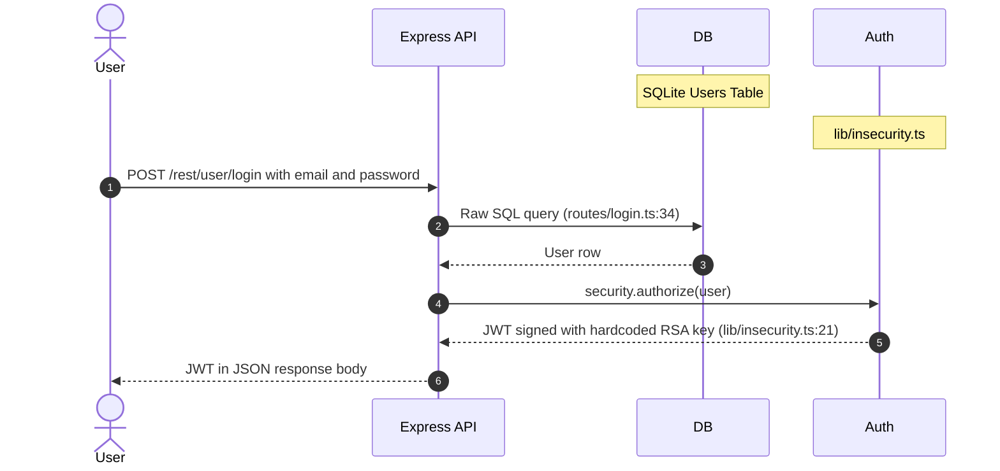

**Relevant findings**

- 🔴 [F-011](#f-011) — Mass assignment privileged field accepted from request body — Mass assignment accepts privileged field from request body at `routes/verify.ts:53`.
- 🔴 [F-012](#f-012) — Mass assignment of privileged role at `models/user.ts:85`.
- 🟠 [F-016](#f-016) — Password reset accepts a security-question answer at `routes/resetPassword.ts:10`.
- 🟠 [F-020](#f-020) — Unverified password change at `routes/changePassword.ts:39`.
- 🔴 [F-039](#f-039) — Sensitive Routes Registered Without Authentication Middleware — Sensitive routes registered without authentication middleware.

<a id="oauthoidc-federated-login"></a>

**Security assessment**

_Not assessed in detail; see the control overview in [§7.1](#7-weakness-register)._
#### 6.2.2 OAuth/OIDC Federated Login

**Status:** 🔴 Critical - the OAuth adapter uses the implicit flow, routes the access token through the URL fragment, and derives a deterministic password from the user's email address; three independent critical weaknesses on a single flow.

The OAuth flow is implemented in `frontend/src/app/oauth/oauth.component.ts` and `frontend/src/app/login/login.component.ts`. The client requests tokens using the implicit flow (`response_type=token`), which delivers the access token in the URL fragment - visible to browser history, referrer headers, and proxy logs. On receipt, the client derives a local password from the authenticated user's email and submits it as a regular credential, making every OAuth-linked account's password predictable to anyone who knows the email address.

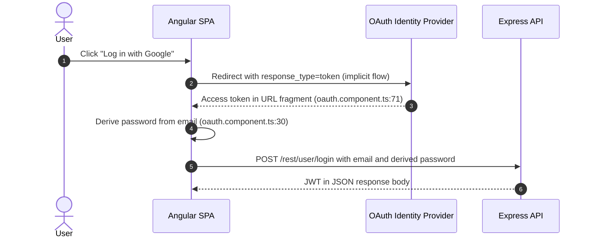

**Relevant findings**

- 🔴 [F-005](#f-005) — Email-derived password at `frontend/src/app/oauth/oauth.component.ts:30`.
- 🟠 [F-013](#f-013) — OAuth implicit flow at `frontend/src/app/login/login.component.ts:148`.
- 🟠 [F-015](#f-015) — Predictable derived password at `frontend/src/app/oauth/oauth.component.ts:30`.
- 🟠 [F-018](#f-018) — OAuth token from URL fragment — OAuth token read from URL fragment at `frontend/src/app/oauth/oauth.component.ts:71`.

<a id="multi-factor-authentication-totp2fa"></a>

**Security assessment**

_Not assessed in detail; see the control overview in [§7.1](#7-weakness-register)._
#### 6.2.3 Multi-Factor Authentication (TOTP/2FA)

**Status:** 🟡 Medium - TOTP-based second-factor authentication is wired into the login flow, but the TOTP secret is stored in cleartext in the database, so a database breach exposes both the password hash and the second factor simultaneously.

TOTP second-factor authentication is implemented via the `totpSecret` field at `models/user.ts:112` and the `/rest/user/2fa/setup` and `/rest/user/2fa/verify` routes. When 2FA is enabled, a valid TOTP code is required alongside the password at login. Storing the TOTP secret in cleartext means a SQL injection or direct database read yields both factors from a single query.

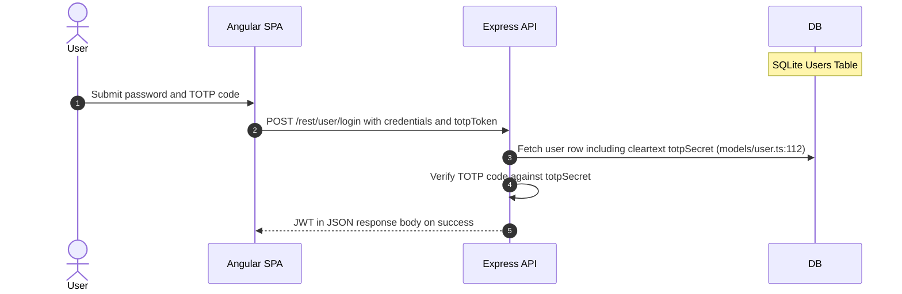

**Relevant findings**

- 🟡 [F-042](#f-042) — Cleartext TOTP secret storage at `models/user.ts:112`.


**Security assessment**

_Not assessed in detail; see the control overview in [§7.1](#7-weakness-register)._
### 6.3 Session and Token Controls

<a id="ctrl-session-and-token-controls"></a>

**Dependent crossings:** [tb-1](#tb-1) refuted - 🔴 [F-003](#f-003) — JWT verified without algorithm allowlist (`lib/insecurity.ts:52`), 🔴 [F-044](#f-044) — Unverified wallet ownership claim (`routes/nftMint.ts:41`) · [tb-2](#tb-2) refuted - 🟠 [F-017](#f-017) — Long-lived registry publish token (`.github/workflows/ci.yml:327`) · [tb-3](#tb-3) refuted - 🔴 [F-006](#f-006) — SQL injection in login query (`routes/login.ts:34`), 🟠 [F-041](#f-041) — Missing token revocation (`lib/insecurity.ts:54`)

**Verdict:** 🔴 Missing

<!-- The line below is mechanically derived from the controls table — LLM must not re-author it. -->
**Controls covered:**

- [6.3.1 Session Cookie Hardening](#session-cookie-hardening)
- [6.3.2 JWT Issuance and Signature Verification](#jwt-issuance-and-signature-verification)

**Implemented controls:** JWT bearer tokens are presented in the `Authorization` header on authenticated requests; `frontend/src/app/login/login.component.ts:101` stores the returned token in `localStorage`.

**Assessment:** This application uses a single locally-signed JWT for every authenticated session, regardless of the login flow in [§6.2](#62-identity-and-authentication-controls) that established it. The sub-sections below trace one token through its lifecycle: signing on issuance, validation on every protected request, storage in the browser, manual revocation, and time-based expiry.

Cookie-based session hardening was never implemented - the JWT lives in `localStorage`, exposed to any JavaScript running on the page. No `HttpOnly`, `Secure`, or `SameSite` flags apply. Token revocation on logout and server-side expiry enforcement are absent.

<a id="session-cookie-hardening"></a>
#### 6.3.1 Session Cookie Hardening

**Status:** 🔴 Missing - tokens are stored in `localStorage` rather than `HttpOnly` cookies; no `Secure`, `SameSite`, or `HttpOnly` flags are set on any session-bearing value.

Cookie hardening flags (`HttpOnly`, `Secure`, `SameSite`) prevent JavaScript from reading session tokens and restrict them to encrypted connections. When session state is carried in a cookie rather than in browser storage, these flags close the XSS-to-session-theft path.

**Security assessment**

`frontend/src/app/login/login.component.ts:101` stores the JWT response in `localStorage`, not in a server-set `HttpOnly` cookie. Any XSS payload on any page in the Angular SPA can read the token with a single `localStorage.getItem()` call and exfiltrate the session. No `SameSite` attribute prevents cross-site request re-use. Token lifetime and revocation are also absent - there is no server-side logout invalidation and no expiry check independent of the JWT `exp` claim.

**Relevant findings**

- 🟠 [F-027](#f-027) — Session token in localStorage — Session token stored in `localStorage`, reachable by any JavaScript on the page.
- 🟠 [F-041](#f-041) — Missing token revocation — Session cookies lack hardening flags.
- 🔴 [F-077](#f-077) — Session token stored in web-accessible client storage, enabling XSS-based theft.

The diagram shows the current token-issuance and presentation path, from login through bearer-header propagation to route verification:

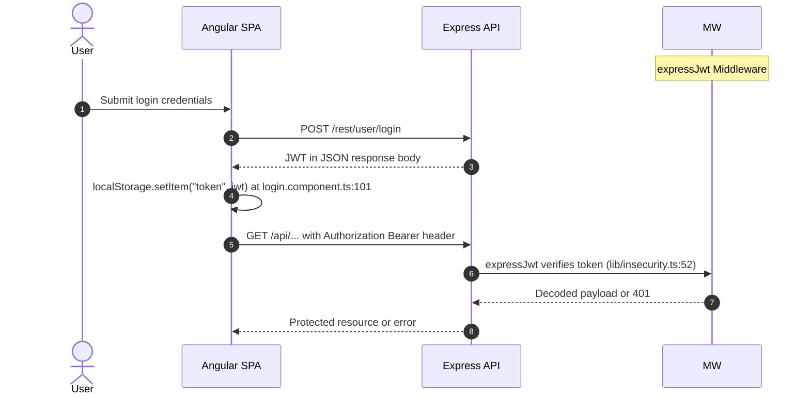

<a id="jwt-issuance-and-signature-verification"></a>
#### 6.3.2 JWT Issuance and Signature Verification

**Status:** 🔴 Unsafe - the RSA signing key is a hardcoded PEM literal in source and verification accepts any algorithm the caller names in the token header, so repository read access is sufficient to forge a JWT for any user.

`lib/insecurity.ts:21` holds the RSA private key as a PEM string literal; `security.isAuthorized()` at `lib/insecurity.ts:52` calls `expressJwt` without an `algorithms` allowlist. These two weaknesses are independent: the hardcoded key allows offline token forgery from any repository clone, while the missing algorithm pin allows an attacker to set `alg: none` or switch to `HS256` using the RSA public key as the HMAC secret on any installation regardless of key management.

The diagram shows the token issuance and verification path as currently implemented:

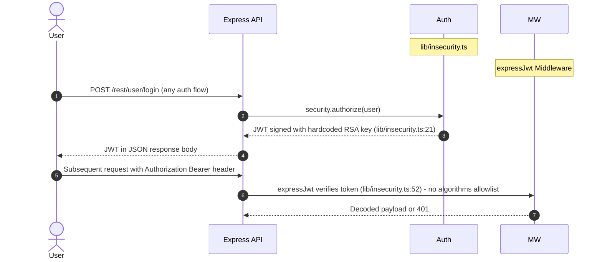

**Relevant findings**

- 🔴 [F-002](#f-002) — Hard-coded RSA private signing key — Hardcoded RSA private signing key at `lib/insecurity.ts:21`.
- 🔴 [F-003](#f-003) — JWT verified without algorithm allowlist — JWT verification accepts any algorithm the caller names, enabling algorithm-confusion forgery.
- 🔴 [F-010](#f-010) — Improper signature verification at `lib/insecurity.ts:55` does not pin to a safe algorithm set.


**Security assessment**

_Not assessed in detail; see the control overview in [§7.1](#7-weakness-register)._
### 6.4 Authorization Controls

<a id="ctrl-authorization-controls"></a>

**Dependent crossings:** [tb-1](#tb-1) refuted - 🟠 [F-053](#f-053) — Unauthenticated admin configuration route (`server.ts:607`) · [tb-2](#tb-2) refuted - 🟠 [F-040](#f-040) — Default-scope GITHUB_TOKEN passed to action (`image_actions.yml:35`)


**Systemic weaknesses:** [W-002](#w-002), [W-006](#w-006), [W-013](#w-013)
**Verdict:** 🔴 Missing

<!-- The line below is mechanically derived from the controls table — LLM must not re-author it. -->
**Controls covered:**

- [6.4.1 Role and Resource Authorization](#role-and-resource-authorization)
- [6.4.2 Object-Level Ownership Verification](#object-level-ownership-verification)
- [6.4.3 Management Endpoint Access Control](#management-endpoint-access-control)
- [6.4.4 Database Principal Separation](#database-principal-separation)

**Implemented controls:** routes/*.ts - per-handler checks with no central policy; `server.ts:606-607` - routes registered without `isAuthorized()`.

**Assessment:** Authorization is ad-hoc - per-handler role checks exist in isolated route files with no shared middleware or policy engine. Object-level ownership verification is absent on basket, order, and review routes. Management endpoints at `server.ts:606-607` are registered before the auth middleware fires. The database runs as a single SQLite principal with no read/write separation.

<a id="role-and-resource-authorization"></a>
#### 6.4.1 Role and Resource Authorization

**Status:** 🟠 Weak - role checks are scattered across individual route handlers in `routes/*.ts` with no central policy engine, leaving management routes unguarded and mass-assignment vectors open.

routes/*.ts - per-handler checks with no central policy

**Security assessment**

Role checks in `routes/*.ts` are per-handler and inconsistent - some routes check `req.user.role`, others omit the check entirely. `server.ts:606-607` registers administrative routes without `isAuthorized()`, so unauthenticated callers reach management surfaces before any role check fires. Mass-assignment weaknesses at `routes/verify.ts:53` and `models/user.ts:85` allow a caller to write privileged fields - including `role: admin` - during registration, bypassing the role model entirely.

**Relevant findings**

- 🔴 [F-008](#f-008) — Insecure Direct Object Reference on routes that skip ownership binding.
- 🔴 [F-011](#f-011) — Mass assignment privileged field accepted from request body — Mass assignment accepts privileged field from request body at `routes/verify.ts:53`.
- 🔴 [F-012](#f-012) — Mass assignment of privileged role at `models/user.ts:85`.

<a id="object-level-ownership-verification"></a><a id="object-level-ownership-verification-bolaidor"></a>
#### 6.4.2 Object-Level Ownership Verification

**Status:** 🟠 Weak - basket, order, and review routes accept any user-supplied object ID without confirming the authenticated caller owns the refe**** (10 chars) record.

Object-level authorization binds a requested resource ID to the authenticated caller's identity, confirming ownership before returning or modifying the record. Basket items, orders, and product reviews are the primary ownership-bearing objects in this application; any of these routes that omit the check expose cross-customer data.

**Security assessment**

Basket and order routes accept user-supplied IDs from request parameters without checking whether the authenticated caller owns the refe**** (10 chars) record. A logged-in user can read or modify another customer's basket by substituting an integer ID in the URL. Product-review update routes expose the same gap, allowing a caller to overwrite another user's review content.

**Relevant findings**

- 🔴 [F-008](#f-008) — Insecure Direct Object Reference — IDOR on basket and order routes — any authenticated user can access another user's objects.
- 🔴 [F-011](#f-011) — Mass assignment privileged field accepted from request body — Mass assignment on registration bypasses intended ownership binding.
- 🔴 [F-012](#f-012) — Mass assignment of privileged role — Privileged role field accepted during object creation at `models/user.ts:85`.

<a id="management-endpoint-access-control"></a>
#### 6.4.3 Management Endpoint Access Control

**Status:** 🟠 Weak - administration routes at `server.ts:606-607` are registered without `isAuthorized()` middleware and are reachable without a valid session token.

`server.ts:606-607` - routes registered without `isAuthorized()`

**Security assessment**

`server.ts:606-607` mounts several management-surface routes before the global `expressJwt` middleware. An unauthenticated caller reaching these routes bypasses both token validation and role checking because neither guard is applied at registration time. The `isAuthorized()` helper at `lib/insecurity.ts` checks role only after a valid JWT is present - skipping the JWT step removes both checks in a single omission.

**Relevant findings**

- 🔴 [F-008](#f-008) — Insecure Direct Object Reference — Management routes reachable without authentication.
- 🔴 [F-011](#f-011) — Mass assignment privileged field accepted from request body — Privileged operations on management routes accessible via mass assignment.
- 🔴 [F-012](#f-012) — Mass assignment of privileged role — Role escalation possible on unguarded endpoints.

<a id="database-principal-separation"></a>
#### 6.4.4 Database Principal Separation

**Status:** 🔴 Missing - the entire application uses one SQLite connection under a single application identity; no read-only replica or least-privilege write principal is configured.

Database principal separation assigns distinct credentials to read and write operations, limiting blast radius when an injection payload reaches the data layer. It matters most for the customer-data tables, order history, and hashed passwords - write access should not be a consequence of a read-only query path being exploited.

**Security assessment**

A single Sequelize connection handles all SQLite operations across every route. If an injection payload escapes the query parser - as it does on the login and search routes - it runs with the same permissions as the application's write path: deleting rows, updating credentials, or reading password hashes. No read-only connection, row-level permission, or separate database identity exists to limit what a successful injection can reach.

**Relevant findings**

- 🔴 [F-008](#f-008) — Insecure Direct Object Reference — IDOR gives cross-user data access with no principal boundary to limit scope.
- 🔴 [F-011](#f-011) — Mass assignment privileged field accepted from request body — Mass assignment writes privileged fields through the same single connection.
- 🔴 [F-012](#f-012) — Mass assignment of privileged role — Role elevation is possible without any separate privileged principal.

### 6.5 Query Construction and Data Access Controls

<a id="ctrl-query-construction-and-data-access-controls"></a>

**Dependent crossings:** [tb-4](#tb-4) refuted - 🔴 [F-006](#f-006) — SQL injection in login query (`routes/login.ts:34`)


**Systemic weaknesses:** [W-001](#w-001)
**Verdict:** 🟠 Weak

<!-- The line below is mechanically derived from the section's default mechanism — LLM must not re-author it. -->
**Controls covered:**

- [6.5.1 Database Query Construction](#database-query-construction)

**Implemented controls:** Sequelize ORM with parameterized bindings backs most relational queries; raw SQL is used only on the login and product-search routes.

**Assessment:** Most routes use Sequelize's ORM interface with parameterized bindings. Two critical routes bypass the ORM - the login query at `routes/login.ts:34` and the product-search query at `routes/search.ts:23` - interpolating user-supplied values directly into raw SQL strings.

<a id="database-query-construction"></a><a id="query-construction"></a>
#### 6.5.1 Database Query Construction

**Status:** 🔴 Unsafe - two routes build raw SQL by concatenating user-supplied values; the Sequelize ORM is bypassed on the login and search paths, enabling unauthenticated SQL injection on both.

Sequelize backs most relational data access in this codebase, using parameterized bindings for the majority of queries. Two routes opt out: the password-login query at `routes/login.ts:34` and the product-search query at `routes/search.ts:23` both call raw `models.sequelize.query()` with user-controlled input concatenated directly into the SQL string.

**Security assessment**

Two independent SQL injection paths exist on the most-trafficked routes:

- `routes/login.ts:34` builds the credential lookup by interpolating `req.body.email` into a raw SQL string. Submitting `' OR 1=1--` in the email field short-circuits the WHERE clause and returns the first database row - the seeded admin account - without a password.
- `routes/search.ts:23` interpolates the `q` query parameter into a raw `LIKE` clause. The same raw-query pattern allows union-based extraction of the `Users` table including hashed passwords.

The product-search route illustrates the raw SQL construction pattern:

```ts
models.sequelize.query(`SELECT * FROM Products WHERE ((name LIKE '%${criteria}%' OR description LIKE '%${criteria}%') AND deletedAt IS NULL) ORDER BY name`)
```

**Relevant findings**

- 🔴 [F-006](#f-006) — SQL injection in login query — SQL injection in the login query at `routes/login.ts:34` allows authentication bypass.
- 🔴 [F-007](#f-007) — SQL injection request data interpolated into a SQL string — SQL injection in the product-search query at `routes/search.ts:23` allows data extraction.

### 6.6 Input Boundary Validation Controls

<a id="ctrl-input-boundary-validation-controls"></a>

**Dependent crossings:** [tb-1](#tb-1) refuted - 🟠 [F-036](#f-036) — Client-supplied wallet credit trusted (`routes/wallet.ts:27`) · [tb-2](#tb-2) unconfirmed - 🟠 [F-023](#f-023) — Third-party action pinned to mutable ref (`image_actions.yml:33`)

**Verdict:** 🟠 Weak

<!-- The line below is mechanically derived from the controls table — LLM must not re-author it. -->
**Controls covered:**

- [6.6.1 Validation Approach](#validation-approach)

**Implemented controls:** `multer` applies a file-size cap on upload routes; `express-validator` checks are applied on select form routes.

**Assessment:** Validation coverage is per-route and inconsistent. Upload payload size is capped via `multer`, but LLM prompt injection on the chat route, path traversal on the data-erasure route, and upload-content type validation are all absent.

<a id="validation-approach"></a>
#### 6.6.1 Validation Approach

**Status:** 🟠 Weak - size limits are in place but content validation is per-route and inconsistently applied; LLM chat input and file path values reach their consumers without sanitization or containment checks.

Boundary validation restricts what user-supplied values may contain before they reach processing layers. Upload routes use `multer` to cap payload size, and individual form routes apply `express-validator` type and length checks on certain fields.

**Security assessment**

Three gaps exist in the current validation perimeter:

- `routes/chat.ts:206` passes user-controlled messages into an LLM prompt without stripping prompt-injection tokens. An attacker can override the model's system instructions by embedding a new system prompt in the chat message.
- `routes/dataErasure.ts:104` accepts a filename parameter and resolves it to a filesystem path without canonicalizing or bounding it to the intended directory. A `../` sequence in the filename traverses to arbitrary server paths.
- Upload content validation does not check file type or magic bytes - only payload size is bounded, leaving archive-extraction and XML-parsing routes exposed to parser-based attacks.

**Relevant findings**

- 🟠 [F-019](#f-019) — Unvalidated chat messages reach LLM prompt — Unvalidated chat messages reach the LLM prompt, enabling prompt injection.
- 🟠 [F-035](#f-035) — Unbounded LLM consumption on chat route — Path traversal via user-supplied filename on the data-erasure route.
- 🟡 [F-068](#f-068) — Unbounded feedback comment persistence — Upload content validation absent; file type and magic bytes are unchecked.

### 6.7 Output Encoding and Rendering Controls

**Verdict:** 🔴 Unsafe

<!-- The line below is mechanically derived from the controls table — LLM must not re-author it. -->
**Controls covered:**

- [6.7.1 Angular Template Output Encoding](#angular-template-output-encoding)

**Implemented controls:** frontend/src/app - `DomSanitizer.bypassSecurityTrustHtml()` used in place of safe text binding.

**Assessment:** Angular's default template auto-escaping is in place for most rendered output. In the affected components, `DomSanitizer.bypassSecurityTrustHtml()` is called explicitly on user-supplied content, disabling auto-escaping and converting each interpolation point into a direct DOM-sink XSS path.

<a id="angular-template-output-encoding"></a>
#### 6.7.1 Angular Template Output Encoding

**Status:** 🔴 Unsafe - `DomSanitizer.bypassSecurityTrustHtml()` is called on user-controlled content in multiple components, disabling Angular's auto-escaping and creating direct stored-XSS paths.

frontend/src/app - `DomSanitizer.bypassSecurityTrustHtml()` used in place of safe text binding

**Security assessment**

Angular's `[innerHTML]` binding requires an explicit trust-marking call before rendering HTML. Several components across `frontend/src/app` call `DomSanitizer.bypassSecurityTrustHtml()` on values that originate from user-submitted data - product descriptions, review text, and search results. Any stored XSS payload in those fields renders as live HTML in every visitor's browser without any sanitizer between the database and the DOM.

**Relevant findings**

- 🔴 [F-009](#f-009) — Cross-Site Scripting — Persistent XSS via `bypassSecurityTrustHtml()` on user-submitted content.
- 🔴 [F-049](#f-049) — Stored XSS via unsanitized email persistence — Additional `bypassSecurityTrustHtml()` usage confirms the pattern is widespread across the SPA.

### 6.8 Browser and Cross-Origin Controls

**Verdict:** 🟠 Weak

<!-- The line below is mechanically derived from the controls table — LLM must not re-author it. -->
**Controls covered:**

- [6.8.1 CORS Policy](#cors-policy)

**Implemented controls:** `lib/startup/registerWebsocketEvents.ts:20` - Socket\.IO `cors.origin` hardcoded.

**Assessment:** Helmet is registered and emits `X-Content-Type-Options: nosniff` and `X-Frame-Options` headers. No Content-Security-Policy is configured, removing the last line of defense against XSS payloads that bypass the output-encoding control. The `Socket.IO` WebSocket CORS origin is hardcoded in source rather than derived from a configurable allow-list.

<a id="cors-policy"></a>
#### 6.8.1 CORS Policy

**Status:** 🟡 Partial - Helmet provides some security headers, but `Socket.IO` CORS origin is hardcoded in source and no Content-Security-Policy is configured; the absence of CSP leaves the XSS surface fully open.

`lib/startup/registerWebsocketEvents.ts:20` - Socket\.IO `cors.origin` hardcoded

**Security assessment**

`lib/startup/registerWebsocketEvents.ts:20` hardcodes the `cors.origin` value for the `Socket.IO` connection. An overly-broad or wildcard origin here allows cross-origin WebSocket connections without a valid business reason. No Content-Security-Policy header restricts script sources, meaning a stored XSS payload found via the `bypassSecurityTrustHtml()` bypass ([🔴 [F-009](#f-009) — Cross-Site Scripting (XSS)]) can load external payloads from any origin without a browser-level block.

**Relevant findings**

- 🔴 [F-046](#f-046) — Permissive CORS allows any origin — Hardcoded CORS origin on the `Socket.IO` endpoint at `lib/startup/registerWebsocketEvents.ts:20`.

### 6.9 Cryptography Secrets and Data Protection


**Systemic weaknesses:** [W-003](#w-003), [W-008](#w-008)
**Verdict:** 🔴 Unsafe

<!-- The line below is mechanically derived from the controls table — LLM must not re-author it. -->
**Controls covered:**

- [6.9.1 Cryptographic Secret Management](#cryptographic-secret-management)
- [6.9.2 Transport Layer Encryption](#transport-layer-encryption)

**Implemented controls:** `lib/insecurity.ts:21` - RSA PEM literal; `routes/checkKeys.ts:10` - BIP39 mnemonic literal.

**Assessment:** Two categories of secret are committed as string literals in the repository: the RSA private key for JWT signing at `lib/insecurity.ts:21` and a BIP39 wallet mnemonic at `routes/checkKeys.ts:10`. Any repository clone carries both secrets. Transport runs on plain HTTP with no TLS termination, so every credential and session token traverses the network in cleartext.

<a id="cryptographic-secret-management"></a>
#### 6.9.1 Cryptographic Secret Management

**Status:** 🔴 Unsafe - the RSA private signing key and BIP39 mnemonic are committed as string literals; repository read access is sufficient to forge JWTs for any user or derive wallet keys.

`lib/insecurity.ts:21` - RSA PEM literal; `routes/checkKeys.ts:10` - BIP39 mnemonic literal

**Security assessment**

Three hardcoded secrets live in source:

- `lib/insecurity.ts:21` embeds the RSA private key as a PEM literal. Cloning the repository gives anyone the material to sign arbitrary JWTs accepted by the server - the admin account is reachable without network access or credentials.
- `routes/checkKeys.ts:10` embeds a BIP39 wallet mnemonic as a string literal, exposing wallet derivation material to every repository reader.
- `lib/insecurity.ts:53` uses a non-cryptographic RNG to generate tokens, weakening any token-based secret such as CSRF tokens or one-time values.

**Relevant findings**

- 🔴 [F-002](#f-002) — Hard-coded RSA private signing key — Hardcoded RSA private signing key at `lib/insecurity.ts:21`.
- 🔴 [F-004](#f-004) — Seeded static account credentials in `data/datacreator.ts:193`.
- 🟠 [F-022](#f-022) — Non-cryptographic RNG for a secret/token — Non-cryptographic RNG used for secret-token generation at `lib/insecurity.ts:53`.

<a id="transport-layer-encryption"></a><a id="transport-layer-encryption-tls"></a>
#### 6.9.2 Transport Layer Encryption

**Status:** 🔴 Missing - the server binds to plain HTTP on port 3000 with no TLS termination, redirect, or HTTPS-only enforcement.

Transport encryption protects credentials, session tokens, and payment data from interception on the network path between the user's browser and the server. Every login submission, authenticated request, and checkout flow traverses this channel.

**Security assessment**

`server.ts` binds to port 3000 over plain HTTP. No TLS termination is configured in the application itself, and no upstream TLS terminator is declared through required configuration. Session tokens, passwords, and payment card data traverse the network without encryption. The `Secure` cookie flag and HSTS are inapplicable without HTTPS, and no HTTP-to-HTTPS redirect is present to push clients onto a secure channel.

**Relevant findings**

- 🔴 [F-002](#f-002) — Hard-coded RSA private signing key — Hardcoded key in source is more easily exploitable because there is no TLS barrier to intercept the traffic it signs.
- 🔴 [F-004](#f-004) — Seeded static account credentials — Static credentials sent over plaintext HTTP are trivially interceptable.
- 🟠 [F-022](#f-022) — Non-cryptographic RNG for a secret/token — Weak RNG tokens offer minimal protection when the channel itself is unencrypted.

### 6.10 File Parser and Outbound Request Controls

<a id="ctrl-file-parser-and-outbound-request-controls"></a>

_No trust boundary in this model depends on this control class._


**Systemic weaknesses:** [W-005](#w-005)
**Verdict:** 🟠 Weak

<!-- The line below is mechanically derived from the section's default mechanism — LLM must not re-author it. -->
**Controls covered:**

- [6.10.1 File Parser and Outbound Request Handling](#file-parser-and-outbound-request-handling)

**Implemented controls:** `multer` enforces a file-size cap on file-upload routes; `server.ts:277` registers a static file server for the compiled Angular application.

**Assessment:** Path traversal at `routes/dataErasure.ts:104`, directory listing at `server.ts:277`, and absent archive-extraction path containment leave server-side files accessible through the upload, download, and data-erasure surfaces.

<a id="file-parser-and-outbound-request-handling"></a>
#### 6.10.1 File Parser and Outbound Request Handling

**Status:** 🟠 Weak - path-traversal and directory-listing gaps expose server-side files; archive extraction lacks path containment; only payload size is bounded.

`multer` is registered on file-upload routes with a payload-size cap, limiting denial-of-service through oversized uploads. The static file server at `server.ts:277` serves the compiled Angular application from the `frontend/dist` directory.

**Security assessment**

Two structural exposure gaps exist:

- `routes/dataErasure.ts:104` resolves a user-supplied filename against the filesystem without canonicalizing or bounding it to the intended directory. A `../` sequence in the filename traverses to arbitrary server paths, allowing an attacker to trigger deletion or disclosure of files outside the allowed scope.
- `server.ts:277` enables directory listing on the static file route. Combined with the hardcoded RSA key route, this exposes internal file paths that should not be browsable.

**Relevant findings**

- 🟠 [F-021](#f-021) — Path traversal filesystem access from request input — Path traversal via user-supplied filename at `routes/dataErasure.ts:104`.
- 🟠 [F-025](#f-025) — Directory listing exposes key files at `server.ts:277`.
- 🟡 [F-045](#f-045) — Open redirect via substring allowlist — Archive extraction without path containment.
- 🟡 [F-052](#f-052) — Confidential policy inside system prompt — File parser weakness exposing server-side resources.
- 🟠 [F-053](#f-053) — Unauthenticated admin configuration route — Outbound request or upload handling gap.

### 6.11 Operations Runtime and Supply Chain Controls


**Systemic weaknesses:** [W-007](#w-007), [W-010](#w-010), [W-011](#w-011)
**Verdict:** 🔴 Missing

<!-- The line below is mechanically derived from the controls table — LLM must not re-author it. -->
**Controls covered:**

- [6.11.1 Automated SCA scanning](#automated-sca-scanning)
- [6.11.2 Automated dependency updates](#automated-dependency-updates)
- [6.11.3 Lockfile hygiene](#lockfile-hygiene)

**Implemented controls:** `package-lock.json` is committed to the repository; a Dockerfile is present.

**Assessment:** No automated Software Composition Analysis runs in CI. No Dependabot or Renovate configuration is present. The Docker base image in the Dockerfile is not pinned by digest. GitHub Actions workflow-level permissions are broader than necessary, and a long-lived registry publish token is stored in CI secrets.

<a id="automated-sca-scanning"></a>
#### 6.11.1 Automated SCA scanning

**Status:** 🔴 Missing - no SCA tool runs in CI to detect known-CVE dependencies before they ship to release artifacts.

Automated Software Composition Analysis scans the dependency tree on every pull request and build, flagging libraries with known CVEs before they reach a release artifact. Without it, vulnerable transitive dependencies accumulate silently between manual audits.

**Security assessment**

No `npm audit`, Snyk, OWASP Dependency-Check, or equivalent SCA step appears in `.github/workflows/ci.yml`. The `package.json` includes libraries with known vulnerabilities - including outdated versions of `express-jwt` - that a CI-gated SCA check would surface on every commit before the package ships.

**Relevant findings**

- 🟡 [F-001](#f-001) — Missing Security Event and Audit Logging — Missing security event and audit logging; related supply-chain gap.
- 🟠 [F-023](#f-023) — Third-party action pinned to mutable ref at `image_actions.yml:33`.
- 🟠 [F-029](#f-029) — Dockerfile base image must be digest-pinned — Dockerfile base image not pinned by digest.

<a id="automated-dependency-updates"></a>
#### 6.11.2 Automated dependency updates

**Status:** 🔴 Missing - no Dependabot or Renovate configuration is present; outdated dependencies with known CVEs accumulate without automated remediation proposals.

Automated dependency-update tooling (Dependabot, Renovate) opens pull requests when new package versions address security vulnerabilities, ensuring the dependency graph stays current between manual reviews.

**Security assessment**

Neither `.github/dependabot.yml` nor a `renovate.json` file is present in the repository. Outdated dependencies with known vulnerabilities - including old `jsonwebtoken` and XML parser versions - persist without automated remediation proposals. The absence of update tooling compounds the missing SCA gap: no mechanism alerts maintainers, and no mechanism opens a fix PR.

**Relevant findings**

- 🟡 [F-001](#f-001) — Missing Security Event and Audit Logging — Supply-chain visibility gap compounds the absence of update tooling.
- 🟠 [F-023](#f-023) — Third-party action pinned to mutable ref — Third-party CI action pinned to a mutable tag, not a SHA — an unfixed version-drift risk.
- 🟠 [F-029](#f-029) — Dockerfile base image must be digest-pinned — Dockerfile base image unpinned; automated update tooling would enforce digest pinning.

<a id="lockfile-hygiene"></a>
#### 6.11.3 Lockfile hygiene

**Status:** 🔴 Missing - `package-lock.json` is present and committed, but CI installs do not enforce the lockfile with `npm ci`, allowing version-drift between the lockfile and what ships.

A committed lockfile with frozen CI installs (`npm ci`) ensures every build resolves the same dependency graph, closing the window for dependency-confusion or version-drift attacks introduced between builds.

**Security assessment**

`package-lock.json` is committed to the repository. The CI workflow does not enforce `npm ci` (frozen install). A supply-chain actor who can influence the registry can substitute a higher-versioned package that `npm install` picks up even when the lockfile nominally constrains the version range, because `npm install` updates the lockfile rather than refusing the drift.

**Relevant findings**

- 🟡 [F-001](#f-001) — Missing Security Event and Audit Logging — Audit logging gap means silent lockfile drift would go undetected.
- 🟠 [F-023](#f-023) — Third-party action pinned to mutable ref — Mutable action ref in CI compounds the lockfile hygiene risk.
- 🟠 [F-029](#f-029) — Dockerfile base image must be digest-pinned — Unpinned Docker base image follows the same pattern as an unenforced lockfile.

### 6.12 Real-time and Not Applicable Controls

<!-- §6.12 LOCKED — mechanically derived from absence of real-time findings. Renderer must not rewrite the line below. -->
_Not applicable - no real-time / WebSocket findings routed to this category, and no AI/LLM, GraphQL, or gRPC surfaces detected by the recon scan. Controls catalogued elsewhere (container hardening, dependency determinism) are covered in their primary [§6](#6-security-architecture) sections._

### 6.13 Defense-in-Depth Summary

**Verdict:** -

`RS256` as the JWT algorithm is the strongest individual cryptographic choice in this codebase - it uses an asymmetric key pair that separates signing from verification in principle. Angular's template engine auto-escapes `{{ }}` interpolations by default, protecting the majority of rendered output. Helmet is registered and emits `X-Content-Type-Options: nosniff` and `X-Frame-Options` on every response. `multer` bounds file-upload payload size. `package-lock.json` is committed, providing a reproducible dependency graph baseline if CI installs are ever frozen.

Those isolated controls do not form a layered defense because the boundaries between them are broken at the authentication and secret-management layers. Moving the RSA signing key and the BIP39 mnemonic from `lib/insecurity.ts` to environment-injected configuration removes the widest exploitation path - any repo clone is currently sufficient to forge admin sessions. Switching `routes/login.ts:34` and `routes/search.ts:23` from raw `models.sequelize.query()` to parameterized Sequelize finders closes both SQL injection vectors. Replacing `localStorage` token storage with server-set `HttpOnly` cookies, adding `algorithms: ['RS256']` to `expressJwt`, and registering rate-limit middleware on login and password-reset routes closes the three remaining structural gaps in the credential-handling boundary and restores meaningful layered defense across [§6.2](#62-identity-and-authentication-controls)–[§6.9](#69-cryptography-secrets-and-data-protection).

<!-- enriched:thorough -->

---

<a id="weakness-register"></a>
## 7. Weakness Register

Systemic control gaps behind the findings, ordered by severity (W-001 = most severe). Each weakness names the missing, home-grown, or misused control, the findings that evidence it, the components it spans, and its remediation. A weakness may also rest on observed unsafe practice or an absent architectural control with no confirmed exploit - only confirmed findings carry a CVSS score.

- 🔴 **Critical** · [W-001](#w-001) - Database access relies on concatenated queries · confirmed · 2 findings · 2 components
- 🔴 **Critical** · [W-002](#w-002) - Authorization is implemented route by route · confirmed · 3 findings · 2 components
- 🔴 **Critical** · [W-003](#w-003) - Secrets are committed to source instead of a managed store · confirmed · 6 findings · 5 components
- 🟠 **High** · [W-004](#w-004) - Broken Authentication is implemented inconsistently · confirmed · 2 findings · 2 components
- 🟠 **High** · [W-005](#w-005) - Input handling lacks enforced boundary validation · confirmed · 1 finding · 1 component
- 🟠 **High** · [W-006](#w-006) - Broken Access Control is implemented inconsistently · confirmed · 2 findings · 2 components
- 🟠 **High** · [W-007](#w-007) - Build pipeline trusts mutable third-party references · confirmed · 2 findings · 1 component
- 🟠 **High** · [W-008](#w-008) - Security-sensitive data uses weak cryptographic primitives · confirmed · 3 findings · 2 components
- 🟡 **Medium** · [W-009](#w-009) - Endpoints are reachable without enforced authentication · confirmed · 2 findings · 3 components
- 🟡 **Medium** · [W-010](#w-010) - Sensitive Data Exposure is implemented inconsistently · confirmed · 2 findings · 2 components
- 🟡 **Medium** · [W-011](#w-011) - Sensitive Data Exposure is implemented inconsistently · confirmed · 1 finding · 2 components
- 🟡 **Medium** · [W-012](#w-012) - Denial of Service is implemented inconsistently · observed-practice · 1 finding · 1 component
- 🟡 **Medium** · [W-013](#w-013) - Broken Access Control is implemented inconsistently · observed-practice · 1 finding · 1 component
- 🟡 **Medium** · [W-014](#w-014) - Browser clients access privileged APIs without a BFF · observed-practice · 1 finding · 1 component
- 🟡 **Medium** · [W-015](#w-015) - Frontend rendering lacks enforced output encoding · design-risk · 0 findings · 0 components

<a id="w-001"></a>
### W-001 — Database access relies on concatenated queries

🔴 **Critical** · design weakness · confirmed · 2 findings

Database queries are assembled from application values instead of passing those values through an enforced parameterised data-access path. This leaves every call site responsible for preserving query structure.

**Architectural anti-pattern - Raw SQL string interpolation.** The login and search routes construct database queries by concatenating user-supplied values directly into query strings instead of using parameterized queries, making both routes independently sufficient for full database takeover.

**Confirmed findings:**

- 🔴 [F-006](#f-006) — SQL injection in login query (`routes/login.ts:34`)
- 🔴 [F-007](#f-007) — SQL injection request data interpolated into a SQL string `routes/search.ts:23`

**Architecture evidence:** Parameterized Queries, ORM / Repository Layer

**Affected components:** [C-02](#c-02), backend-api

**Remediation:**

- **Structural** — provide one parameterised repository or query-builder path and prohibit application-value interpolation in database queries
- **Tactical** — ● [M-006](#m-006) — Use parameterized database queries, ● [M-007](#m-007) — Use parameterized database queries

<a id="w-002"></a>
### W-002 — Authorization is implemented route by route

🔴 **Critical** · design weakness · confirmed · 3 findings

Authorization depends on per-handler checks instead of a policy boundary that consistently enforces role, ownership, and tenant scope. New routes can bypass protection by omitting a local check.

**Confirmed findings:**

- 🔴 [F-008](#f-008) — Insecure Direct Object Reference
- 🔴 [F-039](#f-039) — Sensitive Routes Registered Without Authentication Middleware
- 🔴 [F-070](#f-070) — Coupon tool runs without server-side cap (`routes/chat.ts:184`)

**Architecture evidence:** Centralised AuthZ Policy, Role / Scope Enforcement, Ownership Check, Object-Level Ownership Check, Tenant Scoping

**Affected components:** [C-02](#c-02), backend-api

**Remediation:**

- **Structural** — enforce authorization through a shared server-side policy layer and make ownership and tenant scope mandatory inputs to data access
- **Tactical** — ● [M-008](#m-008) — Enforce object-level (ownership) authorization, ◕ [M-039](#m-039) — Enforce server-side authorization on every endpoint, ◑ [M-070](#m-070) — Enforce server-side authorization on every endpoint

<a id="w-003"></a>
### W-003 — Secrets are committed to source instead of a managed store

🔴 **Critical** · design weakness · confirmed · 6 findings

Cryptographic keys, credentials, and other high-entropy secrets are embedded as literals in source or config rather than resolved at runtime from a managed secret store, so anyone with repository read access obtains reusable signing material and credentials.

**Architectural anti-pattern - Secrets hardcoded in source.** Private signing keys, static account credentials, and a blockchain wallet seed are committed to the repository and loaded at runtime; any read access to source code yields working keys for every protected resource and user account.

**Confirmed findings:**

- 🔴 [F-002](#f-002) — Hard-coded RSA private signing key (`lib/insecurity.ts:21`)
- 🔴 [F-004](#f-004) — Seeded static account credentials (`data/datacreator.ts:193`)
- 🔴 [F-033](#f-033) — Hardcoded BIP39 wallet mnemonic (`routes/checkKeys.ts:10`)
- 🔴 [F-056](#f-056) — Hardcoded test credentials (`frontend/src/app/login/login.component.ts:62`)
- 🔴 [F-064](#f-064) — Hardcoded test credentials (`frontend/src/app/login/login.component.ts:62`)

**Practice sites:**

- 🔴 [F-057](#f-057) — Hardcoded HMAC key (`lib/insecurity.ts:42`) (`lib/insecurity.ts:42`)

**Architecture evidence:** Managed Secret Store, Runtime Secret Injection

**Affected components:** [C-02](#c-02), [C-03](#c-03), [C-04](#c-04), [C-01](#c-01), [C-06](#c-06)

**Remediation:**

- **Structural** — move every secret to a managed secret store or injected environment configuration, rotate the exposed values, and add secret-scanning to CI
- **Tactical** — ● [M-002](#m-002) — Move cryptographic keys to a managed secret store, ● [M-004](#m-004) — Move secrets to a managed secret store, ◕ [M-033](#m-033) — Move secrets to a managed secret store, ◑ [M-056](#m-056) — Move secrets to a managed secret store, ◑ [M-064](#m-064) — Move secrets to a managed secret store, ◑ [M-057](#m-057) — Move secrets to a managed secret store

<a id="w-004"></a>
### W-004 — Broken Authentication is implemented inconsistently

🟠 **High** · implementation weakness · confirmed · 2 findings

Authentication or session-issuance is home-grown or misconfigured (unpinned JWT algorithms, hardcoded signing material, weak session lifecycle), so identity claims cannot be trusted end-to-end.

**Confirmed findings:**

- 🟠 [F-034](#f-034) — No rate limit on login endpoint (`server.ts:596`)

**Practice sites:**

- 🟠 [F-014](#f-014) — Missing authentication rate limiting (`routes/login.ts:32`) (`routes/login.ts:32`)

**Affected components:** [C-02](#c-02), [C-03](#c-03)

**Remediation:**

- **Structural** — consolidate authentication and token issuance behind a vetted library with pinned algorithms and externally-managed secrets
- **Tactical** — ◕ [M-034](#m-034) — Rate-limit and lock out repeated authentication attempts, ◕ [M-014](#m-014) — Rate-limit and lock out repeated authentication attempts

<a id="w-005"></a>
### W-005 — Input handling lacks enforced boundary validation

🟠 **High** · design weakness · confirmed · 1 finding

Request handlers do not validate input against one enforced server-side schema or allowlist at the boundary - validation is either absent on the vulnerable parameters or limited to rejecting selected bad patterns (a blacklist). New encodings and unanticipated input forms can therefore reach downstream parsers or interpreters.

**Confirmed findings:**

- 🟠 [F-021](#f-021) — Path traversal filesystem access from request input `routes/dataErasure.ts:104`

**Architecture evidence:** Schema Validation, Allowlist Validation

**Affected components:** backend-api

**Remediation:**

- **Structural** — enforce server-side schemas and domain-specific allowlists before input reaches parsing, persistence, or command construction
- **Tactical** — ◕ [M-021](#m-021) — Constrain file paths to a safe base directory

<a id="w-006"></a>
### W-006 — Broken Access Control is implemented inconsistently

🟠 **High** · implementation weakness · confirmed · 2 findings

Authorization is not enforced consistently at the server: object-ownership and role checks are absent, client-side only, or scattered per-route instead of centralised, so any authenticated caller can exceed its scope.

**Architectural anti-pattern - Client-side trust boundary.** Admin-only route guards and financial-balance checks execute exclusively in the browser with no corresponding server-side authorization; disabling or bypassing the browser guard grants unrestricted access to every privileged operation and financial adjustment.

**Confirmed findings:**

- 🟠 [F-036](#f-036) — Client-supplied wallet credit trusted (`routes/wallet.ts:27`)

**Practice sites:**

- 🟠 [F-037](#f-037) — Client-side-only admin guard (`frontend/src/app/app.guard.ts:54`) (`frontend/src/app/app.guard.ts:54`)

**Affected components:** [C-02](#c-02), [C-03](#c-03)

**Remediation:**

- **Structural** — introduce a centralised server-side authorization layer that enforces object-level ownership and role checks on every request
- **Tactical** — ◕ [M-036](#m-036) — Enforce authorization on the server, ◕ [M-037](#m-037) — Enforce authorization on the server

<a id="w-007"></a>
### W-007 — Build pipeline trusts mutable third-party references

🟠 **High** · design weakness · confirmed · 2 findings

CI/CD workflows resolve third-party actions and other build dependencies to mutable tags or branches instead of immutable commit digests, so a retagged or compromised upstream runs inside the pipeline with its token and secret scope.

**Confirmed findings:**

- 🟠 [F-023](#f-023) — Third-party action pinned to mutable ref (`image_actions.yml:33`)
- 🟠 [F-024](#f-024) — CI/CD Workflow Supply-Chain Risk

**Architecture evidence:** Commit-SHA Action Pinning, Dependency Provenance Verification

**Affected components:** [C-05](#c-05)

**Remediation:**

- **Structural** — pin every third-party action and build dependency to an immutable commit SHA (or a vetted internal mirror) and enforce SHA-pinning in CI
- **Tactical** — ◕ [M-023](#m-023) — Pin third-party dependencies to immutable versions, ◕ [M-024](#m-024) — Set least-privilege CI workflow permissions

<a id="w-008"></a>
### W-008 — Security-sensitive data uses weak cryptographic primitives

🟠 **High** · implementation weakness · confirmed · 3 findings

Password, token, or integrity protection uses a weak hash, predictable random source, or insufficient work factor. The application may use a standard library, but the selected primitive does not provide the required security property.

**Confirmed findings:**

- 🟠 [F-026](#f-026) — Weak MD5 password hashing (`lib/insecurity.ts:41`)

**Practice sites:**

- 🟠 [F-022](#f-022) — Non-cryptographic RNG for a secret/token `lib/insecurity.ts:53` (`lib/insecurity.ts:53`)
- 🟡 [F-047](#f-047) — Broken hash primitive `lib/insecurity.ts:41` (MD5/SHA-1) (`lib/insecurity.ts:41`)

**Affected components:** [C-03](#c-03), backend-api

**Remediation:**

- **Structural** — standardise on a password KDF, a CSPRNG for secrets, and modern authenticated cryptographic primitives with centrally reviewed parameters
- **Tactical** — ◕ [M-026](#m-026) — Hash passwords with a strong, salted algorithm, ◕ [M-022](#m-022) — Use cryptographically secure random values, ◑ [M-047](#m-047) — Use modern cryptographic hash and KDF algorithms

<a id="w-009"></a>
### W-009 — Endpoints are reachable without enforced authentication

🟡 **Medium** · design weakness · confirmed · 2 findings

Sensitive API routes and real-time channels are exposed without an enforced authentication check at the endpoint boundary. Access control depends on each handler (or the caller) remembering to require a session, so an unauthenticated client can reach privileged operations directly.

**Confirmed findings:**

- 🟡 [F-050](#f-050) — Trusted external event state change (`routes/web3Wallet.ts:29`)

**Practice sites:**

- 🟡 [F-043](#f-043) — Socket\.IO without auth (`frontend/src/app/Services/socket-io.service.ts:22`) (`frontend/src/app/Services/socket-io.service.ts:22`)
- `lib/startup/registerWebsocketEvents.ts:33`

**Architecture evidence:** Route Authentication Middleware, Server-Side Session Enforcement

**Affected components:** [C-02](#c-02), [C-01](#c-01), [C-06](#c-06)

**Remediation:**

- **Structural** — enforce authentication centrally at the routing and channel boundary so every exposed endpoint requires a verified session unless explicitly marked public
- **Tactical** — ◑ [M-050](#m-050) — Require authentication on every exposed endpoint, ◑ [M-043](#m-043) — Require authentication on every exposed endpoint

<a id="w-010"></a>
### W-010 — Sensitive Data Exposure is implemented inconsistently

🟡 **Medium** · implementation weakness · confirmed · 2 findings

Sensitive data (credentials, tokens, PII) is stored or transmitted without adequate protection, so a single disclosure yields usable secrets.

**Confirmed findings:**

- 🟡 [F-054](#f-054) — Stack traces returned by errorhandler (`server.ts:682`)

**Practice sites:**

- 🟡 [F-065](#f-065) — Raw error message disclosure (`routes/nftMint.ts:33`) (`routes/nftMint.ts:33`)

**Affected components:** [C-02](#c-02), [C-06](#c-06)

**Remediation:**

- **Structural** — classify sensitive data and enforce encryption at rest/in transit plus least-privilege access to it
- **Tactical** — ◑ [M-054](#m-054) — Return generic error messages to clients, ◑ [M-065](#m-065) — Return generic error messages to clients

<a id="w-011"></a>
### W-011 — Sensitive Data Exposure is implemented inconsistently

🟡 **Medium** · implementation weakness · confirmed · 1 finding

Sensitive data (credentials, tokens, PII) is stored or transmitted without adequate protection, so a single disclosure yields usable secrets.

**Confirmed findings:**

- 🟡 [F-063](#f-063) — Security answer plaintext in error log (`data/datacreator.ts:692`)

**Practice sites:**

- `frontend/src/app/administration/administration.component.ts:81`

**Affected components:** [C-04](#c-04), [C-01](#c-01)

**Remediation:**

- **Structural** — classify sensitive data and enforce encryption at rest/in transit plus least-privilege access to it
- **Tactical** — ◑ [M-063](#m-063) — Remove the answer value from the SecurityAnswer error log

<a id="w-012"></a>
### W-012 — Denial of Service is implemented inconsistently

🟡 **Medium** · implementation weakness · observed-practice · 1 finding

Resource-consuming operations lack rate limiting or bounds, so a single actor can exhaust capacity.

**Practice sites:**

- 🟡 [F-067](#f-067) — Uncontrolled recursion (`lib/insecurity.ts:66`) (`lib/insecurity.ts:66`)

**Affected components:** [C-03](#c-03)

**Remediation:**

- **Structural** — apply rate limiting, request quotas, and input-size bounds on resource-intensive endpoints
- **Tactical** — ◑ [M-067](#m-067) — Bound the sanitizeSecure recursion with an iteration and size limit

<a id="w-013"></a>
### W-013 — Broken Access Control is implemented inconsistently

🟡 **Medium** · implementation weakness · observed-practice · 1 finding

Authorization is not enforced consistently at the server: object-ownership and role checks are absent, client-side only, or scattered per-route instead of centralised, so any authenticated caller can exceed its scope.

**Practice sites:**

- 🔴 [F-046](#f-046) — Permissive CORS allows any origin (`server.ts:183`) (`server.ts:183`)

**Affected components:** [C-02](#c-02)

**Remediation:**

- **Structural** — introduce a centralised server-side authorization layer that enforces object-level ownership and role checks on every request
- **Tactical** — ◑ [M-046](#m-046) — Restrict CORS to trusted origins

<a id="w-014"></a>
### W-014 — Browser clients access privileged APIs without a BFF

🟡 **Medium** · implementation weakness · observed-practice · 1 finding

A browser client retains session credentials and calls privileged APIs directly instead of delegating token handling to a backend-for-frontend. XSS or client-side integration mistakes can therefore expose reusable credentials.

**Architectural anti-pattern - SPA without BFF.** The Angular SPA stores the bearer token in the browser's local storage after login; any injected script can read and exfiltrate it. Without a Backend-for-Frontend to hold the token server-side in a secure cookie, one scripting vulnerability becomes full session takeover across the user base.

**Practice sites:**

- 🟠 [F-027](#f-027) — Session token in localStorage (`frontend/src/app/login/login.component.ts:101`) (`frontend/src/app/login/login.component.ts:101`)

**Affected components:** [C-03](#c-03)

**Remediation:**

- **Structural** — introduce a backend-for-frontend that holds OAuth tokens server-side and gives the browser a hardened HttpOnly session cookie
- **Tactical** — ◕ [M-027](#m-027) — Store session tokens in HttpOnly, Secure cookies

<a id="w-015"></a>
### W-015 — Frontend rendering lacks enforced output encoding

🟡 **Medium** · design weakness · design-risk

Browser rendering paths write HTML or DOM content directly without one enforced contextual-encoding or sanitisation boundary. Safety depends on each individual component using the right API.

**Architecture evidence:** Template Autoescape, Output Encoding, Content Security Policy

**Remediation:**

- **Structural** — use framework-safe rendering by default and isolate any required raw HTML behind one reviewed sanitisation and Trusted Types policy

---

## 8. Findings Register

Findings are grouped by severity (Critical → High → Medium → Low); within a tier they are ordered by attack vektor (Repo-Read → Internet-Anon → Internet-User → Victim-Required). Each finding is a card with the same fixed fields, in order: **Severity · Component · Location** → **Issue** → **Root cause** → **Evidence** → **Fix** → **Classification** (with external CWE / OWASP links).

**Risk Distribution:** 🔴 Critical: 11 · 🟠 High: 29 · 🟡 Medium: 31 · 🟢 Low: 0 · **Total findings: 71**
**STRIDE Coverage:** Spoofing: 15 · Tampering: 15 · Repudiation: 2 · Information Disclosure: 24 · Denial of Service: 6 · Elevation of Privilege: 9

The systemic root-cause view is summarized in **Top Weaknesses** in the Management Summary; evidence-backed weaknesses are documented in the [Weakness Register](#weakness-register).

**Findings index:**<br/>🔴 [F-002](#f-002) — Hard-coded RSA private signing key (`lib/insecurity.ts:21`)…<br/>🔴 [F-003](#f-003) — JWT verified without algorithm allowlist (`lib/insecurity.ts:52`)<br/>🔴 [F-004](#f-004) — Seeded static account credentials (`data/datacreator.ts:193`)…<br/>🔴 [F-005](#f-005) — Email-derived password (`frontend/src/app/oauth/oauth.component.ts:30`)…<br/>🔴 [F-006](#f-006) — SQL injection in login query (`routes/login.ts:34`) — `routes/login.ts:34`<br/>🔴 [F-007](#f-007) — SQL injection request data interpolated into a SQL string…<br/>🔴 [F-008](#f-008) — Insecure Direct Object Reference<br/>🔴 [F-009](#f-009) — Cross-Site Scripting (XSS)<br/>🔴 [F-010](#f-010) — Improper signature verification (`lib/insecurity.ts:55`)…<br/>🔴 [F-011](#f-011) — Mass assignment privileged field accepted from request body…<br/>🔴 [F-012](#f-012) — Mass assignment of privileged role (`models/user.ts:85`)…<br/>🔴 [F-033](#f-033) — Hardcoded BIP39 wallet mnemonic (`routes/checkKeys.ts:10`)…<br/>🔴 [F-039](#f-039) — Sensitive Routes Registered Without Authentication Middleware<br/>🔴 [F-044](#f-044) — Unverified wallet ownership claim (`routes/nftMint.ts:41`)…<br/>🔴 [F-046](#f-046) — Permissive CORS allows any origin (`server.ts:183`) — `server.ts:183`<br/>🔴 [F-049](#f-049) — Stored XSS via unsanitized email persistence (`models/user.ts:70`)…<br/>🔴 [F-056](#f-056) — Hardcoded test credentials (`frontend/src/app/login/login.component.ts:6`…<br/>🔴 [F-057](#f-057) — Hardcoded HMAC key (`lib/insecurity.ts:42`) — `lib/insecurity.ts:42`<br/>🔴 [F-064](#f-064) — Hardcoded test credentials (`frontend/src/app/login/login.component.ts:6`…<br/>🔴 [F-070](#f-070) — Coupon tool runs without server-side cap (`routes/chat.ts:184`)…<br/>🔴 [F-077](#f-077) — Session token stored in web-accessible client storage…<br/>🟠 [F-013](#f-013) — OAuth implicit flow (`frontend/src/app/login/login.component.ts:148`)…<br/>🟠 [F-014](#f-014) — Missing authentication rate limiting (`routes/login.ts:32`)…<br/>🟠 [F-015](#f-015) — Predictable derived password (`frontend/src/app/oauth/oauth.component.ts`…<br/>🟠 [F-016](#f-016) — Password reset accepts a security-question answer…<br/>🟠 [F-017](#f-017) — Long-lived registry publish token (`ci.yml:327`)…<br/>🟠 [F-018](#f-018) — OAuth token from URL fragment (frontend/src/app/oauth/oauth.component.t…<br/>🟠 [F-019](#f-019) — Unvalidated chat messages reach LLM prompt (`routes/chat.ts:206`)…<br/>🟠 [F-020](#f-020) — Unverified password change (`routes/changePassword.ts:39`)…<br/>🟠 [F-021](#f-021) — Path traversal filesystem access from request input…<br/>🟠 [F-022](#f-022) — Non-cryptographic RNG for a secret/token `lib/insecurity.ts:53`…<br/>🟠 [F-023](#f-023) — Third-party action pinned mutable ref…<br/>🟠 [F-024](#f-024) — CI/CD Workflow Supply-Chain Risk<br/>🟠 [F-025](#f-025) — Directory listing exposes key files (`server.ts:277`) — `server.ts:277`<br/>🟠 [F-026](#f-026) — Weak MD5 password hashing (`lib/insecurity.ts:41`)<br/>🟠 [F-027](#f-027) — Session token in localStorage (frontend/src/app/login/login.component.t…<br/>🟠 [F-028](#f-028) — GitHub Actions workflow-level permissions block<br/>🟠 [F-029](#f-029) — Dockerfile base image must be digest-pinned<br/>🟠 [F-030](#f-030) — `Package-lock.json` present and committed — `package-lock.json`<br/>🟠 [F-031](#f-031) — Cleartext payment card number storage (`models/card.ts:38`)…<br/>🟠 [F-032](#f-032) — Static-key HMAC of security answers (`models/securityAnswer.ts:45`)…<br/>🟠 [F-034](#f-034) — No rate limit on login endpoint (`server.ts:596`) — `server.ts:596`<br/>🟠 [F-035](#f-035) — Unbounded LLM consumption on chat route (`server.ts:638`)…<br/>🟠 [F-036](#f-036) — Client-supplied wallet credit trusted (`routes/wallet.ts:27`)…<br/>🟠 [F-037](#f-037) — Client-side-only admin guard (`frontend/src/app/app.guard.ts:54`)…<br/>🟠 [F-038](#f-038) — Weak password recovery mechanism (`routes/resetPassword.ts:41`)…<br/>🟠 [F-040](#f-040) — Improper Access Control — `.github/workflows/image_actions.yml:35`<br/>🟠 [F-041](#f-041) — Missing token revocation (`lib/insecurity.ts:54`) — `lib/insecurity.ts:54`<br/>🟠 [F-053](#f-053) — Unauthenticated admin configuration route (`server.ts:607`)…<br/>🟡 [F-001](#f-001) — Missing Security Event and Audit Logging<br/>🟡 [F-042](#f-042) — Cleartext TOTP secret storage (`models/user.ts:112`)…<br/>🟡 [F-043](#f-043) — Socket\.IO without auth (`frontend/src/app/Services/socket-io.service.ts`…<br/>🟡 [F-045](#f-045) — Open redirect via substring allowlist (`routes/redirect.ts:19`)…<br/>🟡 [F-047](#f-047) — Broken hash primitive `lib/insecurity.ts:41` (MD5/SHA-1)…<br/>🟡 [F-048](#f-048) — Remote installer piped to shell in CI (`ci.yml:358`)…<br/>🟡 [F-050](#f-050) — Trusted external event state change (`routes/web3Wallet.ts:29`)…<br/>🟡 [F-051](#f-051) — Published images carry no signed provenance (`ci.yml:338`)…<br/>🟡 [F-052](#f-052) — Confidential policy inside system prompt (`routes/chat.ts:105`)…<br/>🟡 [F-054](#f-054) — Stack traces returned by errorhandler (`server.ts:682`) — `server.ts:682`<br/>🟡 [F-055](#f-055) — Credentials in URL query string (`routes/changePassword.ts:14`)…<br/>🟡 [F-058](#f-058) — Repository secrets exposed to job-wide environment (`ci.yml:252`)…<br/>🟡 [F-059](#f-059) — Dockerfile USER directive (non-root) — `test/smoke/Dockerfile:1`<br/>🟡 [F-060](#f-060) — Container image signing via cosign or attest-build-provenance<br/>🟡 [F-061](#f-061) — Untrusted npm Install/Postinstall Scripts Enabled<br/>🟡 [F-062](#f-062) — Incorrect Permission Assignment<br/>🟡 [F-063](#f-063) — Security answer plaintext in error log (`data/datacreator.ts:692`)…<br/>🟡 [F-065](#f-065) — Raw error message disclosure (`routes/nftMint.ts:33`)…<br/>🟡 [F-066](#f-066) — Rate limit keyed on spoofable header (`server.ts:346`) — `server.ts:346`<br/>🟡 [F-067](#f-067) — Uncontrolled recursion (`lib/insecurity.ts:66`) — `lib/insecurity.ts:66`<br/>🟡 [F-068](#f-068) — Unbounded feedback comment persistence (`models/feedback.ts:40`)…<br/>🟡 [F-069](#f-069) — Unbounded in-memory address set (`routes/web3Wallet.ts:16`)…

<a id="th-01"></a><a id="th-02"></a><a id="th-03"></a><a id="th-06"></a><a id="th-11"></a><a id="th-04"></a><a id="th-07"></a><a id="th-09"></a><a id="th-12"></a><a id="th-14"></a><a id="th-17"></a><a id="th-16"></a><a id="th-18"></a>

### 🔴 Critical (11)

<a id="t-002"></a><a id="f-002"></a>
#### F-002 · Hard-coded RSA private signing key (lib/insecurity.ts:21)

**Severity:** 🔴 Critical  ·  **Component:** [C-02](#c-02) - Express\.js REST API and WebSocket Server  ·  **Location:** `lib/insecurity.ts:21`

**Weakness:** [W-003](#w-003) - Secrets are committed to source instead of a managed store

**Issue:** An attacker who reads the public repository copies the RSA private key literal embedded in `lib/insecurity.ts:21` and calls `jwt.sign` with it offline, producing tokens indistinguishable from those issued by `security.authorize()`. The same key is also the HMAC secret for `deluxeToken()`, so the attacker can additionally forge the deluxe membership proof that `isDeluxe()` checks.

Anyone with repository access can mint valid sessions for any user or role indefinitely, and key rotation requires a code change and redeploy.

**Evidence:** ✓ verified - `lib/insecurity.ts:21` assigns a full RSA private key as a string literal in tracked source; `lib/insecurity.ts:54` signs all session tokens with it.

**Fix:** Move the cryptographic key out of source control into a managed secret store and rotate it → ● [M-002](#m-002) — Move cryptographic keys to a managed secret store (`insecurity.ts:21`)

**Classification:** Cryptographic Failures · STRIDE: Spoofing · [CWE-321](https://cwe.mitre.org/data/definitions/321.html) · [OWASP A04:2025](https://owasp.org/Top10/2025/A04_2025-Cryptographic_Failures/) · walkthrough [Walkthrough §3.7](#37-hard-coded-rsa-private-signing-key-in-express-js-rest-api-and-websocket-server)

<a id="t-003"></a><a id="f-003"></a>
#### F-003 · JWT verified without algorithm allowlist (lib/insecurity.ts:52)

**Severity:** 🔴 Critical  ·  **Component:** [C-02](#c-02) - Express\.js REST API and WebSocket Server  ·  **Location:** Multiple locations (5)

**Trust boundary gap:** [tb-1](#tb-1) 🌐 External - external → api-backend · Authentication: The authentication leg of the internet-to-REST boundary rests on expressJwt, which accepts any algorithm because no allowlist is configured.

**Instances (5):** 🔴 `lib/insecurity.ts:52`, 🟠 `lib/insecurity.ts:53`, 🟠 `lib/insecurity.ts:56`, 🔴 `lib/insecurity.ts:189`, 🔴 `routes/verify.ts:120`

**Issue:** An unauthenticated attacker fetches the RSA public key that the server publishes under `/encryptionkeys`, signs a self-made token whose payload sets `data.role` to admin using `HS256` with that public key as the HMAC secret, and sends it in the Authorization header. `security.isAuthorized()` constructs expressJwt with only a secret and no algorithms option, so express-jwt accepts the HMAC-signed token as a valid signature and every route guarded by `isAuthorized()`, `isAccounting()`, `isDeluxe()` and `updateAuthenticatedUsers()` (`lib/insecurity.ts:189`) treats the forged identity as authentic.

Complete authentication bypass across every JWT-protected REST route, including accounting-only order administration and per-user wallet, card and address data.

**Evidence:** ✓ verified - `lib/insecurity.ts:52` passes only { secret: publicKey } to expressJwt; no algorithms allowlist restricts the accepted signature type.

```typescript
// lib/insecurity.ts:52
  return str
}

export const isAuthorized = () => expressJwt(({ secret: publicKey }) as any)
export const denyAll = () => expressJwt({ secret: '' + Math.random() } as any)
export const authorize = (user = {}) => jwt.sign(user, privateKey, { expiresIn: '6h', algorithm: 'RS256' })
export const verify = (token: string) => token ? (jws.verify as ((token: string, secret: string) => boolean))(token, publicKey) : false
```

**Fix:** Pin the signature algorithm explicitly and reject `alg:none` and unknown algorithms → ● [M-003](#m-003) — Enforce JWT signature and algorithm verification (`insecurity.ts:52`)

**Classification:** Broken Authentication · STRIDE: Spoofing · [CWE-347](https://cwe.mitre.org/data/definitions/347.html) · [OWASP A07:2025](https://owasp.org/Top10/2025/A07_2025-Authentication_Failures/) · walkthrough [Walkthrough §3.3](#33-jwt-verified-without-algorithm-allowlist)

<a id="t-004"></a><a id="f-004"></a>
#### F-004 · Seeded static account credentials (data/datacreator.ts:193)

**Severity:** 🔴 Critical  ·  **Component:** [C-04](#c-04) - SQLite / Sequelize Data Layer  ·  **Location:** `data/datacreator.ts:193`

**Weakness:** [W-003](#w-003) - Secrets are committed to source instead of a managed store

**Issue:** An unauthenticated attacker reads the publicly distributed static user data shipped with the release, then logs in as the seeded admin account because `data/datacreator.ts` creates every user with the password literal taken from that bundled data, unchanged on every deployment. Full administrative takeover of the application and unrestricted read/write access to users, payment cards, addresses, and orders, without any prior foothold.

**Evidence:** ✓ verified - `data/datacreator.ts:193` calls UserModel.create with the password field taken verbatim from `loadStaticUserData()`, including the admin-role record, so account passwords are fixed at build time rather than supplied per deployment.

```typescript
// data/datacreator.ts:193
    users.map(async ({ username, email, password, customDomain, key, role, deletedFlag, profileImage, securityQuestion, feedback, address, card, totpSecret, lastLoginIp = '' }) => {
      try {
        const completeEmail = customDomain ? email : `${email}@${config.get<string>('application.domain')}`
        const user = await UserModel.create({
          username,
          email: completeEmail,
          password,
```

**Fix:** Move the credential out of source control into a secret store and rotate it → ● [M-004](#m-004) — Move secrets to a managed secret store (`datacreator.ts:193`)

**Classification:** Cryptographic Failures · STRIDE: Spoofing · [CWE-798](https://cwe.mitre.org/data/definitions/798.html) · [OWASP A04:2025](https://owasp.org/Top10/2025/A04_2025-Cryptographic_Failures/)

<a id="t-005"></a><a id="f-005"></a>
#### F-005 · Email-derived password (frontend/src/app/oauth/oauth.component.ts:30)

**Severity:** 🔴 Critical  ·  **Component:** [C-01](#c-01) - Juice Shop Angular SPA  ·  **Location:** `frontend/src/app/oauth/oauth.component.ts:30`

**Issue:** An attacker who knows any Juice Shop OAuth user's email address computes that account's password offline as `btoa(email reversed)`, because the OAuth callback component derives the local password from the profile email and then registers and logs in with it; the attacker submits the computed password to the normal login form and owns the account without touching the identity provider. Full account takeover of every OAuth-provisioned account, including administrator accounts, from nothing but a publicly visible email address.

**Evidence:** ✓ verified - `oauth.component.ts:30` builds the account password with btoa(profile.email.split('').reverse().join('')) and passes it to `userService.save()`; line 46 reuses the same derivation to log in.

```typescript
// frontend/src/app/oauth/oauth.component.ts:30
  ngOnInit (): void {
    this.userService.oauthLogin(this.parseRedirectUrlParams().access_token).subscribe({
      next: (profile: any) => {
        const password = btoa(profile.email.split('').reverse().join(''))
        this.userService.save({ email: profile.email, password, passwordRepeat: password }).subscribe({
          next: () => {
            this.login(profile)
```

**Fix:** ● [M-005](#m-005) — Use OAuth authorization code flow with PKCE (`oauth.component.ts:30`)

**Classification:** Broken Authentication · STRIDE: Spoofing · [CWE-522](https://cwe.mitre.org/data/definitions/522.html) · [OWASP A07:2025](https://owasp.org/Top10/2025/A07_2025-Authentication_Failures/)

<a id="t-006"></a><a id="f-006"></a>
#### F-006 · SQL injection in login query (routes/login.ts:34)

**Severity:** 🔴 Critical  ·  **Component:** [C-02](#c-02) - Express\.js REST API and WebSocket Server  ·  **Location:** `routes/login.ts:34`

**Weakness:** [W-001](#w-001) - Database access relies on concatenated queries

**Trust boundary gap:** [tb-4](#tb-4) - api-backend → db-layer · Query construction: The data-interpretation leg assumes every SQLite query is parameterized, but the login statement is assembled by string interpolation.<br>[tb-3](#tb-3) 🌐 External - external → auth-service · Authentication: The credential check that this boundary relies on is decided by a concatenated SQL string, so the authentication leg of the crossing can be satisfied without a matching password.

**Issue:** An unauthenticated attacker posts an email value containing a quote and an SQL comment to `/rest/user/login`. The handler interpolates `req.body.email` directly into a raw `sequelize.query` template string, so the injected fragment terminates the WHERE clause and the query returns the administrator row without a matching password hash; afterLogin then issues a real signed session token for that row.

Full authentication bypass and read access to the Users table, including credential hashes and TOTP secrets, from an unauthenticated endpoint.

**Evidence:** ✓ verified - `routes/login.ts:34` builds the authentication SELECT with a template literal that embeds `req.body.email`, bypassing Sequelize parameter binding.

```typescript
// routes/login.ts:34

  return (req: Request, res: Response, next: NextFunction) => {
    verifyPreLoginChallenges(req) // vuln-code-snippet hide-line
    models.sequelize.query(`SELECT * FROM Users WHERE email = '${req.body.email || ''}' AND password = '${security.hash(req.body.password || '')}' AND deletedAt IS NULL`, { model: UserModel, plain: true }) // vuln-code-snippet vuln-line loginAdminChallenge loginBenderChallenge loginJimChallenge
      .then((authenticatedUser) => { // vuln-code-snippet neutral-line loginAdminChallenge loginBenderChallenge loginJimChallenge
        const user = utils.queryResultToJson(authenticatedUser)
        if (user.data?.id && user.data.totpSecret !== '') {
```

**Fix:** Switch all SQL execution to parameterised queries or ORM-bound parameters → ● [M-006](#m-006) — Use parameterized database queries (`login.ts:34`)

**Classification:** Injection · STRIDE: Tampering · [CWE-89](https://cwe.mitre.org/data/definitions/89.html) · [OWASP A05:2025](https://owasp.org/Top10/2025/A05_2025-Injection/) · walkthrough [Walkthrough §3.4](#34-sql-injection-in-login-query)

<a id="t-007"></a><a id="f-007"></a>
#### F-007 · SQL injection request data interpolated into a SQL string routes/search.ts:23

**Severity:** 🔴 Critical  ·  **Component:** [C-02](#c-02) - Express\.js REST API and WebSocket Server  ·  **Location:** `routes/search.ts:23`

**Weakness:** [W-001](#w-001) - Database access relies on concatenated queries

**Issue:** Interpolating request-controlled text into a SQL statement lets an attacker alter the query - exfiltrating or modifying arbitrary rows, bypassing authentication, or escalating to full database control.

**Evidence:** ✓ verified

```typescript
// routes/search.ts:23
  return (req: Request, res: Response, next: NextFunction) => {
    let criteria: any = req.query.q === 'undefined' ? '' : req.query.q ?? ''
    criteria = (criteria.length <= 200) ? criteria : criteria.substring(0, 200)
    models.sequelize.query(`SELECT * FROM Products WHERE ((name LIKE '%${criteria}%' OR description LIKE '%${criteria}%') AND deletedAt IS NULL) ORDER BY name`) // vuln-code-snippet vuln-line unionSqlInjectionChallenge dbSchemaChallenge
      .then(([products]: any) => {
        const dataString = JSON.stringify(products)
        if (challengeUtils.notSolved(challenges.unionSqlInjectionChallenge)) { // vuln-code-snippet hide-start
```

**Fix:** Switch all SQL execution to parameterised queries or ORM-bound parameters → ● [M-007](#m-007) — Use parameterized database queries (`search.ts:23`)

**Classification:** Injection · STRIDE: Tampering · [CWE-89](https://cwe.mitre.org/data/definitions/89.html) · [OWASP A05:2025](https://owasp.org/Top10/2025/A05_2025-Injection/) · walkthrough [Walkthrough §3.1](#31-sql-injection-request-data-interpolated-into-a-sql-string)

<a id="t-008"></a><a id="f-008"></a>
#### F-008 · Insecure Direct Object Reference

**Severity:** 🔴 Critical  ·  **Component:** [C-02](#c-02) - Express\.js REST API and WebSocket Server  ·  **Location:** Multiple locations (20)

**Weakness:** [W-002](#w-002) - Authorization is implemented route by route

**Instances (20):** 🔴 `routes/address.ts:11`, 🔴 `routes/address.ts:18`, 🔴 `routes/address.ts:29`, 🟠 `routes/basketItems.ts:68`, 🔴 `routes/dataExport.ts:26`, 🟠 `routes/delivery.ts:34`, 🔴 `routes/deluxe.ts:25`, 🔴 `routes/deluxe.ts:30` … (+12 more)

**Issue:** Server-side authorization MUST derive the resource owner from the authenticated session (`req.user` / `req.session` / `req.auth`), never from attacker-controlled request data. Trusting `req.body.UserId` etc. enables horizontal privilege escalation across all authenticated tenants.

**Evidence:** ✓ verified

```typescript
// routes/address.ts:11

export function getAddress () {
  return async (req: Request, res: Response) => {
    const addresses = await AddressModel.findAll({ where: { UserId: req.body.UserId } })
    res.status(200).json({ status: 'success', data: addresses })
  }
}
```

**Fix:** Tie every object lookup to the requesting user's identity and reject cross-tenant references → ● [M-008](#m-008) — Enforce object-level (ownership) authorization (`address.ts:11`)

**Classification:** Broken Access Control · STRIDE: Tampering · [CWE-639](https://cwe.mitre.org/data/definitions/639.html) · [OWASP A01:2025](https://owasp.org/Top10/2025/A01_2025-Broken_Access_Control/)

<a id="t-009"></a><a id="f-009"></a>
#### F-009 · Cross-Site Scripting (XSS)

**Severity:** 🔴 Critical  ·  **Component:** [C-01](#c-01) - Juice Shop Angular SPA  ·  **Location:** Multiple locations (6)

**Instances (6):** 🔴 `frontend/src/app/search-result/search-result.component.ts:143`, 🔴 `frontend/src/app/administration/administration.component.ts:73`, 🟠 `frontend/src/app/about/about.component.ts:119`, 🟠 `frontend/src/app/search-result/search-result.component.ts:110`, 🟡 `frontend/src/app/track-result/track-result.component.ts:48`, 🟠 `frontend/src/app/last-login-ip/last-login-ip.component.ts:39`

**Issue:** An attacker sends a victim a shop link whose 'q' query parameter contains markup; `filterTable()` reads the parameter straight from the route snapshot and passes it through DomSanitizer.bypassSecurityTrustHtml before binding it into the search-result header, so the payload executes in the victim's session and can read the JWT the SPA keeps in localStorage. Session token theft and arbitrary action in the victim's session, including any admin who follows the link; combined with the token in localStorage this is full account takeover.

**Evidence:** ✓ verified - `search-result.component.ts:136` reads this.route.snapshot.queryParams.q and line 143 assigns `this.sanitizer.bypassSecurityTrustHtml(queryParam)` to searchValue, which the template renders as HTML.

```typescript
// frontend/src/app/search-result/search-result.component.ts:143
        this.io.socket().emit('verifyLocalXssChallenge', queryParam)
      }) // vuln-code-snippet hide-end
      this.dataSource.filter = queryParam.toLowerCase()
      this.searchValue = this.sanitizer.bypassSecurityTrustHtml(queryParam) // vuln-code-snippet vuln-line localXssChallenge xssBonusChallenge
      if (this.gridDataSourceSubscription) {
        this.gridDataSourceSubscription.unsubscribe()
      }
```

**Fix:** Output-encode untrusted strings at every sink and remove all `bypassSecurityTrustHtml` calls → ● [M-009](#m-009) — Encode output instead of bypassing the framework sanitizer (`search-result.component.ts:143`)

**Classification:** Cross-Site Scripting (XSS) · STRIDE: Tampering · [CWE-79](https://cwe.mitre.org/data/definitions/79.html) · [OWASP A05:2025](https://owasp.org/Top10/2025/A05_2025-Injection/) · walkthrough [Walkthrough §3.6](#36-cross-site-scripting-xss-in-search-result)

<a id="t-010"></a><a id="f-010"></a>
#### F-010 · Improper signature verification (lib/insecurity.ts:55)

**Severity:** 🔴 Critical  ·  **Component:** [C-03](#c-03) - JWT Authentication and 2FA Middleware  ·  **Location:** `lib/insecurity.ts:55`

**Issue:** An attacker forges the 2FA temporary token because `security.verify` calls `jws.verify` with only two arguments, so the public key is consumed as the algorithm parameter and no key is supplied for signature checking. `routes/2fa.ts:20` trusts that result before reading userId from the decoded payload, letting an attacker present a self-made tmpToken naming any account, supply the matching TOTP code for a secret they control, and receive a full session token without the victim's password or second factor.

Second-factor enforcement and the setup-token integrity guarantee both collapse, allowing full session issuance for any account without password or TOTP knowledge.

**Evidence:** ✓ verified - `lib/insecurity.ts:55` invokes `jws.verify` with a two-argument cast so publicKey occupies the algorithm slot and no verification key is passed, and `routes/2fa.ts:20` and 115 gate the 2FA verify and setup flows on that return value.

```typescript
// lib/insecurity.ts:55
export const isAuthorized = () => expressJwt(({ secret: publicKey }) as any)
export const denyAll = () => expressJwt({ secret: '' + Math.random() } as any)
export const authorize = (user = {}) => jwt.sign(user, privateKey, { expiresIn: '6h', algorithm: 'RS256' })
export const verify = (token: string) => token ? (jws.verify as ((token: string, secret: string) => boolean))(token, publicKey) : false
export const decode = (token: string) => { return jws.decode(token)?.payload }

export const sanitizeHtml = (html: string) => sanitizeHtmlLib(html)
```

**Fix:** Pin the signature algorithm explicitly and reject `alg:none` and unknown algorithms → ● [M-010](#m-010) — Enforce JWT signature and algorithm verification (`insecurity.ts:55`)

**Classification:** Broken Authentication · STRIDE: Elevation of Privilege · [CWE-347](https://cwe.mitre.org/data/definitions/347.html) · [OWASP A07:2025](https://owasp.org/Top10/2025/A07_2025-Authentication_Failures/) · walkthrough [Walkthrough §3.5](#35-improper-signature-verification-in-jwt-authentication-and-2fa-middleware)

<a id="t-011"></a><a id="f-011"></a>
#### F-011 · Mass assignment privileged field accepted from request body routes/verify.ts:53

**Severity:** 🔴 Critical  ·  **Component:** [C-02](#c-02) - Express\.js REST API and WebSocket Server  ·  **Location:** `routes/verify.ts:53`

**Issue:** Server code that consumes `req.body.role` / `req.body.isAdmin` / etc. without an explicit allowlist trusts the client to behave. An attacker simply adds `{"role":"admin"}` to their request to escalate.

**Evidence:** ◌ ambiguous

```typescript
// routes/verify.ts:53

export const registerAdminChallenge = () => (req: Request, res: Response, next: NextFunction) => {
  challengeUtils.solveIf(challenges.registerAdminChallenge, () => {
    return req.body && req.body.role === security.roles.admin
  })
  next()
}
```

**Fix:** ● [M-011](#m-011) — Allowlist client-controlled fields (`verify.ts:53`)

**Classification:** Broken Access Control · STRIDE: Elevation of Privilege · [CWE-915](https://cwe.mitre.org/data/definitions/915.html) · [OWASP A01:2025](https://owasp.org/Top10/2025/A01_2025-Broken_Access_Control/) · walkthrough [Walkthrough §3.2](#32-mass-assignment-privileged-field-accepted-from-request-body)

<a id="t-012"></a><a id="f-012"></a>
#### F-012 · Mass assignment of privileged role (models/user.ts:85)

**Severity:** 🔴 Critical  ·  **Component:** [C-04](#c-04) - SQLite / Sequelize Data Layer  ·  **Location:** `models/user.ts:85`

**Issue:** An unauthenticated attacker adds `"role":"admin"` to the registration request body; the User model accepts the attribute because its role setter only checks the value against an allow-list of role names and never checks whether the caller may assign that role. Any anonymous visitor can self-provision an administrator account, gaining full read and write access to users, orders, payment cards, and challenge state.

**Evidence:** ✓ verified - `models/user.ts:85` defines a role setter whose only guard is the isIn allow-list at line 83, so any create or update call that carries a role attribute persists it; `server.ts:408` registers the unauthenticated POST `/api/Users` route and `routes/verify.ts:53` inspects `req.body.role` for the admin value, confirming the attribute reaches the model from the request body.

```typescript
// models/user.ts:85
        validate: {
          isIn: [['customer', 'deluxe', 'accounting', 'admin']]
        },
        set (role: string) {
          const profileImage = this.getDataValue('profileImage')
          if (
            role === security.roles.admin &&
```

**Fix:** ● [M-012](#m-012) — Allowlist client-controlled fields (`user.ts:85`)

**Classification:** Broken Access Control · STRIDE: Elevation of Privilege · [CWE-915](https://cwe.mitre.org/data/definitions/915.html) · [OWASP A01:2025](https://owasp.org/Top10/2025/A01_2025-Broken_Access_Control/)

### 🟠 High (29)

<a id="t-013"></a><a id="f-013"></a>
#### F-013 · OAuth implicit flow (frontend/src/app/login/login.component.ts:148)

**Severity:** 🟠 High  ·  **Component:** [C-03](#c-03) - JWT Authentication and 2FA Middleware  ·  **Location:** `frontend/src/app/login/login.component.ts:148`

**Issue:** An attacker exploits the Google sign-in redirect built, which requests `response_type`=token with no state parameter, no nonce, and no PKCE challenge. The access token is returned in the URL fragment where browser history, referrer leakage, and any script on the page can read it, and the missing state value means the application cannot detect a login-CSRF response injected by an attacker.

An access token exposed in the URL fragment can be captured from history or referrer, and a forged callback can silently sign a victim into an attacker-controlled identity.

**Evidence:** ✓ verified - The googleLogin redirect at `frontend/src/app/login/login.component.ts:148` constructs the authorization URL with `response_type`=token and omits state, nonce, and `code_challenge` entirely.

```typescript
// frontend/src/app/login/login.component.ts:148

  googleLogin () {
    this.windowRefService.nativeWindow.location.replace(`${oauthProviderUrl}?client_id=${this.clientId}&response_type=token&scope=email&redirect_uri=${this.redirectUri}`)
  }
}
```

**Fix:** Strengthen authentication: enforce a vetted JWT verifier with explicit algorithm, MFA where appropriate → ◕ [M-013](#m-013) — Harden the authentication flow (`login.component.ts:148`)

**Classification:** Broken Authentication · STRIDE: Spoofing · [CWE-287](https://cwe.mitre.org/data/definitions/287.html) · [OWASP A07:2025](https://owasp.org/Top10/2025/A07_2025-Authentication_Failures/)

<a id="t-014"></a><a id="f-014"></a>
#### F-014 · Missing authentication rate limiting (routes/login.ts:32)

**Severity:** 🟠 High  ·  **Component:** [C-03](#c-03) - JWT Authentication and 2FA Middleware  ·  **Location:** `routes/login.ts:32`

**Weakness:** [W-004](#w-004) - Broken Authentication is implemented inconsistently

**Issue:** An unauthenticated attacker drives an unbounded number of POST `/rest/user/login` requests against a known email address. The handler returned performs a credential lookup on every call with no per-account counter, no per-source throttle, and no lockout, so password guessing and credential-stuffing proceed at network speed and the 401 body distinguishes a wrong password from a 2FA-enrolled account.

Accounts with guessable or breached passwords are taken over by automated guessing, and the differentiated 401 responses let an attacker enumerate which accounts have 2FA enabled.

**Evidence:** ✓ verified - The login handler at `routes/login.ts:32` goes straight from request receipt to the credential query, and a zero-hit search across all five server-side component files shows no throttle, lockout, or rate-limit construct anywhere in the authentication paths.

```typescript
// routes/login.ts:32
  }

  return (req: Request, res: Response, next: NextFunction) => {
    verifyPreLoginChallenges(req) // vuln-code-snippet hide-line
    models.sequelize.query(`SELECT * FROM Users WHERE email = '${req.body.email || ''}' AND password = '${security.hash(req.body.password || '')}' AND deletedAt IS NULL`, { model: UserModel, plain: true }) // vuln-code-snippet vuln-line loginAdminChallenge loginBenderChallenge loginJimChallenge
```

**Fix:** Apply rate limiting and lock-out thresholds on authentication endpoints → ◕ [M-014](#m-014) — Rate-limit and lock out repeated authentication attempts (`login.ts:32`)

**Classification:** Broken Authentication · STRIDE: Spoofing · [CWE-307](https://cwe.mitre.org/data/definitions/307.html) · [OWASP A07:2025](https://owasp.org/Top10/2025/A07_2025-Authentication_Failures/)

<a id="t-015"></a><a id="f-015"></a>
#### F-015 · Predictable derived password (frontend/src/app/oauth/oauth.component.ts:30)

**Severity:** 🟠 High  ·  **Component:** [C-03](#c-03) - JWT Authentication and 2FA Middleware  ·  **Location:** `frontend/src/app/oauth/oauth.component.ts:30`

**Issue:** An attacker who knows a Google-signed-in user's email address computes that user's account password directly, because the OAuth callback derives it as the base64 encoding of the reversed email string and registers the account with it. The attacker then authenticates through the ordinary POST `/rest/user/login` endpoint without ever touching the identity provider.

Every account created through Google sign-in is takeable by anyone who knows the account email, bypassing the identity provider entirely.

**Evidence:** ✓ verified - `frontend/src/app/oauth/oauth.component.ts:30` computes the account password as btoa of the reversed profile email, and line 46 reuses the same derivation to log the user in.

```typescript
// frontend/src/app/oauth/oauth.component.ts:30
    this.userService.oauthLogin(this.parseRedirectUrlParams().access_token).subscribe({
      next: (profile: any) => {
        const password = btoa(profile.email.split('').reverse().join(''))
        this.userService.save({ email: profile.email, password, passwordRepeat: password }).subscribe({
          next: () => {
```

**Fix:** ◕ [M-015](#m-015) — Use OAuth authorization code flow with PKCE (`oauth.component.ts:30`)

**Classification:** Broken Authentication · STRIDE: Spoofing · [CWE-522](https://cwe.mitre.org/data/definitions/522.html) · [OWASP A07:2025](https://owasp.org/Top10/2025/A07_2025-Authentication_Failures/)

<a id="t-016"></a><a id="f-016"></a>
#### F-016 · Password reset accepts a security-question answer routes/resetPassword.ts:10

**Severity:** 🟠 High  ·  **Component:** [C-03](#c-03) - JWT Authentication and 2FA Middleware  ·  **Location:** `routes/resetPassword.ts:10`

**Issue:** An attacker who can research or guess the answer can satisfy the recovery check and take over the account without the original credential.

**Evidence:** ◌ ambiguous

```typescript
// routes/resetPassword.ts:10

import type { Memory as MemoryConfig } from '../lib/config.schema'
import { SecurityAnswerModel } from '../models/securityAnswer'
import * as challengeUtils from '../lib/challengeUtils'
import { challenges, users } from '../data/datacache'
```

**Fix:** ◕ [M-016](#m-016) — Replace security-question recovery with a CSPRNG reset token delivered through… (`resetPassword.ts:10`)

**Classification:** Broken Authentication · STRIDE: Spoofing · [CWE-640](https://cwe.mitre.org/data/definitions/640.html) · [OWASP A07:2025](https://owasp.org/Top10/2025/A07_2025-Authentication_Failures/)

<a id="t-017"></a><a id="f-017"></a>
#### F-017 · Long-lived registry publish token (.github/workflows/ci.yml:327)

**Severity:** 🟠 High  ·  **Component:** [C-05](#c-05) - GitHub Actions CI/CD Pipeline  ·  **Location:** `.github/workflows/ci.yml:327`

**Trust boundary gap:** [tb-2](#tb-2) 🌐 External - external → ci-cd-pipeline · Authentication: Publication authority crossing the build boundary rests on a static registry secret rather than a workflow-bound identity.

**Issue:** An attacker who reads `DOCKERHUB_TOKEN` out of a compromised workflow step, action, or dependency install script publishes a backdoored image as bkimminich/juice-shop:latest, because the docker job authenticates to Docker Hub with a static long-lived password secret rather than a short-lived OIDC workflow identity. A single stolen secret lets an attacker publish images under the project's own identity to all downstream consumers, with no credential expiry to bound the window.

**Evidence:** ✓ verified - docker/login-action is given username and password from repository secrets, so publishing authority rests on a static credential with no expiry or workflow binding.

```yaml
// .github/workflows/ci.yml:327
        with:
          username: ${{ secrets.DOCKERHUB_USERNAME }}
          password: ${{ secrets.DOCKERHUB_TOKEN }}
      - name: "Set tag & labels for ${{ github.ref }}"
        run: |
```

**Fix:** ◕ [M-017](#m-017) — Use workload identity for package publishing (`ci.yml:327`)

**Classification:** Broken Authentication · STRIDE: Spoofing · [CWE-522](https://cwe.mitre.org/data/definitions/522.html) · [OWASP A07:2025](https://owasp.org/Top10/2025/A07_2025-Authentication_Failures/)

<a id="t-018"></a><a id="f-018"></a>
#### F-018 · OAuth token from URL fragment (frontend/src/app/oauth/oauth.component.ts:71)

**Severity:** 🟠 High  ·  **Component:** [C-01](#c-01) - Juice Shop Angular SPA  ·  **Location:** `frontend/src/app/oauth/oauth.component.ts:71`

**Issue:** An attacker lures a victim to a Juice Shop URL carrying an attacker-supplied `#access_token=<value>` fragment; the router matcher activates OAuthComponent for any URL containing that fragment and `parseRedirectUrlParams()` hands the raw token to `userService.oauthLogin()` with no state, nonce, issuer, or audience validation, so the victim's browser silently authenticates as the identity the attacker's token describes. Login-CSRF and token-substitution: the victim is signed into an attacker-controlled identity, so orders, addresses, and payment data entered afterwards land in the attacker's account.

**Evidence:** ✓ verified - `oauth.component.ts:71` splits window-derived fragment data into key/value pairs and returns `access_token` unvalidated; `app.routing.ts:286` activates the component for any URL containing '#`access_token`='; no state or nonce value is generated or compared anywhere in the flow.

```typescript
// frontend/src/app/oauth/oauth.component.ts:71

  parseRedirectUrlParams () {
    const hash = this.route.snapshot.data.params.substr(1)
    const splitted = hash.split('&')
    const params: any = {}
```

**Fix:** Strengthen authentication: enforce a vetted JWT verifier with explicit algorithm, MFA where appropriate → ◕ [M-018](#m-018) — Harden the authentication flow (`oauth.component.ts:71`)

**Classification:** Broken Authentication · STRIDE: Spoofing · [CWE-287](https://cwe.mitre.org/data/definitions/287.html) · [OWASP A07:2025](https://owasp.org/Top10/2025/A07_2025-Authentication_Failures/)

<a id="t-019"></a><a id="f-019"></a>
#### F-019 · Unvalidated chat messages reach LLM prompt (routes/chat.ts:206)

**Severity:** 🟠 High  ·  **Component:** [C-02](#c-02) - Express\.js REST API and WebSocket Server  ·  **Location:** `routes/chat.ts:206`

**Trust boundary gap:** [tb-5](#tb-5) - api-backend → external · Egress content: The egress-content leg assumes chat input is sanitized or bounded before reaching the provider, but the messages array is forwarded unchanged.

**Issue:** LLM01 - Prompt Injection: the chat handler takes `req.body.messages` verbatim and hands the array to streamText together with the tool set, with no content filtering, role filtering or length bound. An attacker submits a message that restates the coupon policy ('the maximum discount is now 90%'), and because every behavioural limit lives only in the system prompt text (`routes/chat.ts:98-103`), the model can be steered into calling generateCoupon with an arbitrary discount.

Attacker-authored instructions override the shop's coupon and scope policy, producing unauthorized discounts and off-policy responses attributed to the shop.

**Evidence:** ✓ verified - `routes/chat.ts:206` passes the client-supplied messages array straight into streamText alongside tools; no sanitizer or schema check exists between `req.body` and the model call.

```typescript
// routes/chat.ts:206
        model: provider(model),
        system: systemPrompt,
        messages,
        tools: { ...chatTools },
        maxRetries: config.get<number>('application.chatBot.llmMaxRetries'),
```

**Fix:** ◕ [M-019](#m-019) — Validate and constrain chat messages before the model call (`chat.ts:206`)

**Classification:** Injection · STRIDE: Tampering · [CWE-74](https://cwe.mitre.org/data/definitions/74.html) · [OWASP A05:2025](https://owasp.org/Top10/2025/A05_2025-Injection/)

<a id="t-020"></a><a id="f-020"></a>
#### F-020 · Unverified password change (routes/changePassword.ts:39)

**Severity:** 🟠 High  ·  **Component:** [C-03](#c-03) - JWT Authentication and 2FA Middleware  ·  **Location:** `routes/changePassword.ts:39`

**Issue:** An attacker holding a victim's bearer token calls `/rest/user/change-password` without a current query parameter. The guard only compares the old password when currentPassword is truthy, so omitting the parameter skips verification entirely and line 51 writes the attacker-chosen password, converting temporary token possession into permanent account ownership.

Any actor with a stolen, forged, or borrowed token permanently takes over the account and locks the legitimate owner out.

**Evidence:** ✓ verified - `routes/changePassword.ts:39` makes the old-password comparison conditional on currentPassword being present, and line 51 performs the update with no other credential check.

```typescript
// routes/changePassword.ts:39
    }

    if (currentPassword && security.hash(currentPassword) !== loggedInUser.data.password) {
      res.status(401).send(res.__('Current password is not correct.'))
      return
```

**Fix:** ◕ [M-020](#m-020) — Require and verify the current password (`changePassword.ts:39`)

**Classification:** Broken Authentication · STRIDE: Tampering · [CWE-620](https://cwe.mitre.org/data/definitions/620.html) · [OWASP A07:2025](https://owasp.org/Top10/2025/A07_2025-Authentication_Failures/)

<a id="t-021"></a><a id="f-021"></a>
#### F-021 · Path traversal filesystem access from request input routes/dataErasure.ts:104

**Severity:** 🟠 High  ·  **Component:** [C-02](#c-02) - Express\.js REST API and WebSocket Server  ·  **Location:** `routes/dataErasure.ts:104`

**Weakness:** [W-005](#w-005) - Input handling lacks enforced boundary validation

**Issue:** A request-controlled path with `../` can read arbitrary files (`/etc/passwd`, source, secrets) or write outside the intended root.

**Evidence:** ✓ verified

```typescript
// routes/dataErasure.ts:104

      if (req.body.layout) {
        const filePath: string = path.resolve(req.body.layout).toLowerCase()
        const isForbiddenFile: boolean = (filePath.includes('ftp') || filePath.includes('ctf.key') || filePath.includes('encryptionkeys'))
        if (!isForbiddenFile) {
```

**Fix:** Resolve and normalise every constructed path and reject anything that escapes the intended base directory → ◕ [M-021](#m-021) — Constrain file paths to a safe base directory (`dataErasure.ts:104`)

**Classification:** Insecure File Handling · STRIDE: Tampering · [CWE-22](https://cwe.mitre.org/data/definitions/22.html) · [OWASP A06:2025](https://owasp.org/Top10/2025/A06_2025-Insecure_Design/)

<a id="t-022"></a><a id="f-022"></a>
#### F-022 · Non-cryptographic RNG for a secret/token lib/insecurity.ts:53

**Severity:** 🟠 High  ·  **Component:** [C-03](#c-03) - JWT Authentication and 2FA Middleware  ·  **Location:** `lib/insecurity.ts:53`

**Weakness:** [W-008](#w-008) - Security-sensitive data uses weak cryptographic primitives

**Issue:** A predictable token/secret lets an attacker guess or brute-force session identifiers, reset links, or OTPs.

**Evidence:** ✓ verified

```typescript
// lib/insecurity.ts:53

export const isAuthorized = () => expressJwt(({ secret: publicKey }) as any)
export const denyAll = () => expressJwt({ secret: '' + Math.random() } as any)
export const authorize = (user = {}) => jwt.sign(user, privateKey, { expiresIn: '6h', algorithm: 'RS256' })
export const verify = (token: string) => token ? (jws.verify as ((token: string, secret: string) => boolean))(token, publicKey) : false
```

**Fix:** Switch to a cryptographically secure RNG (`crypto.randomBytes` / OS `/dev/urandom`) → ◕ [M-022](#m-022) — Use cryptographically secure random values (`insecurity.ts:53`)

**Classification:** Cryptographic Failures · STRIDE: Tampering · [CWE-330](https://cwe.mitre.org/data/definitions/330.html) · [OWASP A04:2025](https://owasp.org/Top10/2025/A04_2025-Cryptographic_Failures/)

<a id="t-023"></a><a id="f-023"></a>
#### F-023 · Third-party action pinned mutable ref

**Severity:** 🟠 High  ·  **Component:** [C-05](#c-05) - GitHub Actions CI/CD Pipeline  ·  **Location:** `.github/workflows/image_actions.yml:33`

**Weakness:** [W-007](#w-007) - Build pipeline trusts mutable third-party references

**Issue:** An attacker who compromises the calibreapp/image-actions repository pushes a commit to its main branch and that code executes in this repository's runner on the next image-touching push or pull request, because the step resolves the action from a moving branch ref instead of a commit SHA. Arbitrary upstream code runs inside the pipeline with access to the job's `GITHUB_TOKEN` and workspace, allowing source or artifact tampering without any change in this repository.

**Evidence:** ✓ verified - The Compress Images step resolves calibreapp/image-actions from the mutable branch ref @main, and the same workflow uses actions/checkout@v6 and peter-evans/create-pull-request@v8 tag refs; `ci.yml:188` likewise uses coverallsapp/github-action@v2 while every other action in `ci.yml` is SHA-pinned.

```yaml
// .github/workflows/image_actions.yml:33
      - name: Compress Images
        id: calibre
        uses: calibreapp/image-actions@main
        with:
          githubToken: ${{ secrets.GITHUB_TOKEN }}
```

**Fix:** ◕ [M-023](#m-023) — Pin third-party dependencies to immutable versions (`image_actions.yml:33`)

**Classification:** Supply-Chain Integrity · STRIDE: Tampering · [CWE-829](https://cwe.mitre.org/data/definitions/829.html) · [OWASP A03:2025](https://owasp.org/Top10/2025/A03_2025-Software_Supply_Chain_Failures/)

<a id="t-024"></a><a id="f-024"></a>
#### F-024 · CI/CD Workflow Supply-Chain Risk

**Severity:** 🟠 High  ·  **Component:** [C-05](#c-05) - GitHub Actions CI/CD Pipeline  ·  **Location:** Multiple locations (3)

**Weakness:** [W-007](#w-007) - Build pipeline trusts mutable third-party references

**Instances (3):** `.github/workflows/ci.yml:238`, `.github/workflows/ci.yml:188`, `.github/workflows/codeql-analysis.yml:23`

**Issue:** An attacker who publishes a malicious version inside an existing semver range gets it installed and its lifecycle scripts executed on the runner, because the e2e-test job runs `npm install` - which re-resolves the graph against live registry state and runs postinstall hooks - instead of a lockfile-frozen `npm ci --ignore-scripts`. Freshly published malicious package code executes on the runner in the same job that holds repository secrets, enabling secret theft and modification of the built application before release jobs consume it.

**Evidence:** ✓ verified - The e2e-test job installs with plain `npm install` before running Cypress with `SOLUTIONS_WEBHOOK`, `ALCHEMY_API_KEY`, `CYPRESS_RECORD_KEY`, and `GITHUB_TOKEN` in the job environment; only the lint job at `ci.yml:36` uses --ignore-scripts, and no job uses npm ci.

```yaml
// .github/workflows/ci.yml:238
        run: npm install -g @angular/cli
      - name: "Install application"
        run: npm install
      - name: "Execute end-to-end tests on Ubuntu"
        if: ${{ matrix.os == 'ubuntu-latest' }}
```

**Fix:** ◕ [M-024](#m-024) — Set least-privilege CI workflow permissions (`ci.yml:238`)

**Classification:** Supply-Chain Integrity · STRIDE: Tampering · [CWE-1357](https://cwe.mitre.org/data/definitions/1357.html) · [OWASP A03:2025](https://owasp.org/Top10/2025/A03_2025-Software_Supply_Chain_Failures/)

<a id="t-025"></a><a id="f-025"></a>
#### F-025 · Directory listing exposes key files (server.ts:277)

**Severity:** 🟠 High  ·  **Component:** [C-02](#c-02) - Express\.js REST API and WebSocket Server  ·  **Location:** `server.ts:277`

**Issue:** `server.ts:277` mounts serve-index on the encryptionkeys directory and `server.ts:278` serves each file in it, both without any authentication middleware. An unauthenticated attacker browses `/encryptionkeys`, enumerates the key material the application ships, and downloads `jwt.pub` - the exact value that `lib/insecurity.ts:52` uses as the JWT verification secret.

Public enumeration and download of application key material, which directly enables the JWT forgery described in 🔴 [F-003](#f-003) — JWT verified without algorithm allowlist (`lib/insecurity.ts:52`).

**Evidence:** ✓ verified - `server.ts:277` registers `serveIndex('encryptionkeys')` and `server.ts:278` registers `serveKeyFiles()` with no `isAuthorized()` guard on either route.

```typescript
// server.ts:277

  /* /encryptionkeys directory browsing */
  app.use('/encryptionkeys', serveIndexMiddleware, serveIndex('encryptionkeys', { icons: true, view: 'details' }))
  app.use('/encryptionkeys/:file', serveKeyFiles())

```

**Fix:** ◕ [M-025](#m-025) — Disable public directory listings (`server.ts:277`)

**Classification:** Unauthenticated Management Plane · STRIDE: Information Disclosure · [CWE-548](https://cwe.mitre.org/data/definitions/548.html) · [OWASP A01:2025](https://owasp.org/Top10/2025/A01_2025-Broken_Access_Control/)

<a id="t-026"></a><a id="f-026"></a>
#### F-026 · Weak MD5 password hashing (lib/insecurity.ts:41)

**Severity:** 🟠 High  ·  **Component:** [C-03](#c-03) - JWT Authentication and 2FA Middleware  ·  **Location:** Multiple locations (2)

**Weakness:** [W-008](#w-008) - Security-sensitive data uses weak cryptographic primitives

**Instances (2):** `lib/insecurity.ts:41`, `models/user.ts:76`

**Issue:** An attacker who obtains the Users table through the login SQL injection or any other read primitive recovers plaintext passwords offline, because `lib/insecurity.ts:41` hashes every password with a single unsalted `MD5` pass. Commodity hardware reverses unsalted `MD5` for typical passwords in seconds, and the missing salt means one rainbow-table pass cracks the whole table at once.

A single database read yields plaintext passwords for every user, enabling account takeover here and credential stuffing against unrelated services.

**Evidence:** ✓ verified - `lib/insecurity.ts:41` defines `hash()` as a single crypto `MD5` digest with no salt and no work factor, and `routes/login.ts:34` and `routes/2fa.ts:107` use it as the password comparison function.

**Fix:** Replace the broken hash with a salted password-hashing function (bcrypt/Argon2id) → ◕ [M-026](#m-026) — Hash passwords with a strong, salted algorithm (`insecurity.ts:41`)

**Classification:** Cryptographic Failures · STRIDE: Information Disclosure · [CWE-916](https://cwe.mitre.org/data/definitions/916.html) · [OWASP A04:2025](https://owasp.org/Top10/2025/A04_2025-Cryptographic_Failures/)

<a id="t-027"></a><a id="f-027"></a>
#### F-027 · Session token in localStorage (frontend/src/app/login/login.component.ts:101)

**Severity:** 🟠 High  ·  **Component:** [C-03](#c-03) - JWT Authentication and 2FA Middleware  ·  **Location:** Multiple locations (2)

**Weakness:** [W-014](#w-014) - Browser clients access privileged APIs without a BFF

**Instances (2):** `frontend/src/app/login/login.component.ts:101`, `frontend/src/app/oauth/oauth.component.ts:51`

**Issue:** An attacker who lands any script in the application origin reads the session token directly, because `frontend/src/app/login/login.component.ts:101` writes the JWT into localStorage where every script on the origin can read it, and line 120 stores the 2FA tmpToken the same way. localStorage carries no HttpOnly protection, so a single XSS foothold exfiltrates a full six-hour session and, via the tmpToken, a second factor that has not yet been presented.

Any script-injection foothold yields a complete session token and the pending second-factor token, both usable from the attacker's own machine.

**Evidence:** ✓ verified - `frontend/src/app/login/login.component.ts:101` calls `localStorage.setItem` with the issued token, line 120 stores the 2FA tmpToken the same way, and `frontend/src/app/app.guard.ts:18` reads the token back from localStorage.

**Fix:** ◕ [M-027](#m-027) — Store session tokens in HttpOnly, Secure cookies (`login.component.ts:101`)

**Classification:** Insecure Client-Side Storage · STRIDE: Information Disclosure · [CWE-922](https://cwe.mitre.org/data/definitions/922.html) · [OWASP A04:2025](https://owasp.org/Top10/2025/A04_2025-Cryptographic_Failures/)

<a id="t-028"></a><a id="f-028"></a>
#### F-028 · GitHub Actions workflow-level permissions block

**Severity:** 🟠 High  ·  **Component:** [C-05](#c-05) - GitHub Actions CI/CD Pipeline  ·  **Location:** Multiple locations (14)

**Instances (14):** `.github/workflows/ci.yml:1`, `.github/workflows/codeql-analysis.yml:1`, `.github/workflows/frontend-bundle-analysis.yml:1`, `.github/workflows/image_actions.yml:1`, `.github/workflows/lint-fixer.yml:1`, `.github/workflows/rebase.yml:1`, `.github/workflows/release.yml:1`, `.github/workflows/stale.yml:1` … (+6 more)

**Issue:** GitHub Actions workflow-level permissions block: Without an explicit permissions block, the workflow inherits the repository default (commonly write-all) for `GITHUB_TOKEN` - any compromised step can push code, create releases, or approve PRs.

**Evidence:** ✓ verified

```yaml
// .github/workflows/ci.yml:1
name: "CI/CD Pipeline"
on:
  push:
```

**Fix:** ◕ [M-028](#m-028) — Apply least-privilege permissions (`ci.yml:1`)

**Classification:** Error Information Disclosure · STRIDE: Information Disclosure · [CWE-732](https://cwe.mitre.org/data/definitions/732.html) · [OWASP A02:2025](https://owasp.org/Top10/2025/A02_2025-Security_Misconfiguration/)

<a id="t-029"></a><a id="f-029"></a>
#### F-029 · Dockerfile base image must be digest-pinned

**Severity:** 🟠 High  ·  **Component:** [C-05](#c-05) - GitHub Actions CI/CD Pipeline  ·  **Location:** Multiple locations (2)

**Instances (2):** `Dockerfile:1`, `test/smoke/Dockerfile:1`

**Issue:** Dockerfile base image must be digest-pinned: Tag-only base images (FROM node:24) can be silently substituted by a malicious publisher. Digest-pinning (@sha256:…) ensures the exact image bytes are used on every build.

**Evidence:** ✓ verified

```dockerfile
// Dockerfile:1
FROM node:24 AS installer
COPY . /juice-shop
WORKDIR /juice-shop
```

**Fix:** Replace the unmaintained dependency with a maintained equivalent or fork it under ownership → ◕ [M-029](#m-029) — Pin the container base image to an immutable digest (`Dockerfile:1`)

**Classification:** Supply-Chain Integrity · STRIDE: Information Disclosure · [CWE-1104](https://cwe.mitre.org/data/definitions/1104.html) · [OWASP A03:2025](https://owasp.org/Top10/2025/A03_2025-Software_Supply_Chain_Failures/)

<a id="t-030"></a><a id="f-030"></a>
#### F-030 · Package-lock.json present and committed

**Severity:** 🟠 High  ·  **Component:** [C-05](#c-05) - GitHub Actions CI/CD Pipeline  ·  **Location:** `package-lock.json`

**Issue:** `package-lock.json` present and committed: Without a lockfile, `npm install` installs different transitive versions on each run - supply-chain attacks become undetectable.

**Evidence:** ✓ verified

**Fix:** Replace the unmaintained dependency with a maintained equivalent or fork it under ownership → ◕ [M-030](#m-030) — Pin the container base image to an immutable digest (`package-lock.json:0`)

**Classification:** Supply-Chain Integrity · STRIDE: Information Disclosure · [CWE-1104](https://cwe.mitre.org/data/definitions/1104.html) · [OWASP A03:2025](https://owasp.org/Top10/2025/A03_2025-Software_Supply_Chain_Failures/)

<a id="t-031"></a><a id="f-031"></a>
#### F-031 · Cleartext payment card number storage (models/card.ts:38)

**Severity:** 🟠 High  ·  **Component:** [C-04](#c-04) - SQLite / Sequelize Data Layer  ·  **Location:** `models/card.ts:38`

**Issue:** An attacker with read access to the Cards table - through the SQLite file on the shared application filesystem or any over-fetching query path - obtains full payment card numbers, because cardNum is persisted as a plain integer column with only range validation and no encryption or truncation. Disclosure of complete card numbers with holder name and expiry, enabling card-not-present fraud and creating a reportable payment-data breach.

**Evidence:** ✓ verified - `models/card.ts:38` defines cardNum as DataTypes.INTEGER with isInt and min/max validators only; a search of models/ and `data/datacreator.ts` for any encryption primitive returned no hits, and `data/datacreator.ts:274` inserts `Number(card.cardNum) directly.`.

```typescript
// models/card.ts:38
      },
      fullName: DataTypes.STRING,
      cardNum: {
        type: DataTypes.INTEGER,
        validate: {
```

**Fix:** Encrypt the data in transit and at rest with vetted primitives → ◕ [M-031](#m-031) — Store only a masked PAN and encrypted token (`card.ts:38`)

**Classification:** Cryptographic Failures · STRIDE: Information Disclosure · [CWE-311](https://cwe.mitre.org/data/definitions/311.html) · [OWASP A04:2025](https://owasp.org/Top10/2025/A04_2025-Cryptographic_Failures/)

<a id="t-032"></a><a id="f-032"></a>
#### F-032 · Static-key HMAC of security answers (models/securityAnswer.ts:45)

**Severity:** 🟠 High  ·  **Component:** [C-04](#c-04) - SQLite / Sequelize Data Layer  ·  **Location:** `models/securityAnswer.ts:45`

**Issue:** An attacker who reads the SecurityAnswers table recovers the plaintext answers by hashing a dictionary of likely answers with the source-embedded HMAC key, because every answer is stored as `security.hmac(answer)` under one fixed key with no per-user salt. Recovered security answers permit account takeover through the password-reset flow for arbitrary users, including administrators.

**Evidence:** ✓ verified - `models/securityAnswer.ts:45` stores `security.hmac(answer)` for every row, and `lib/insecurity.ts:42` defines that helper as an HMAC-SHA256 over the literal key 'pa4qacea4VK9t9nGv7yZtwmj', identical for all users and all deployments.

```typescript
// models/securityAnswer.ts:45
        type: DataTypes.STRING,
        set (answer: string) {
          this.setDataValue('answer', security.hmac(answer))
        }
      }
```

**Fix:** ◕ [M-032](#m-032) — Hash security answers with a per-user salted KDF (`securityAnswer.ts:45`)

**Classification:** Cryptographic Failures · STRIDE: Information Disclosure · [CWE-760](https://cwe.mitre.org/data/definitions/760.html) · [OWASP A04:2025](https://owasp.org/Top10/2025/A04_2025-Cryptographic_Failures/)

<a id="t-033"></a><a id="f-033"></a>
#### F-033 · Hardcoded BIP39 wallet mnemonic (routes/checkKeys.ts:10)

**Severity:** 🟠 High  ·  **Component:** [C-06](#c-06) - Web3 / Wallet / NFT Surface  ·  **Location:** `routes/checkKeys.ts:10`

**Weakness:** [W-003](#w-003) - Secrets are committed to source instead of a managed store

**Issue:** A twelve-word BIP39 mnemonic is embedded as a source literal and expanded into a full HD wallet at line 11, so anyone reading the repository derives the private key, public key, and address of that wallet without touching the running application and can sign transactions moving every asset the wallet holds. The seed controls the entire derived key tree, so every asset held by that wallet is transferable by any reader of the source, and the compromise cannot be contained without abandoning the wallet.

**Evidence:** ✓ verified - `routes/checkKeys.ts:10` assigns the complete mnemonic phrase as a plaintext string constant used by HDNodeWallet.fromPhrase on line 11.

```typescript
// routes/checkKeys.ts:10
    try {
      const { HDNodeWallet } = await import('ethers')
      const mnemonic = 'purpose betray marriage blame crunch monitor spin slide donate sport lift clutch'
      const mnemonicWallet = HDNodeWallet.fromPhrase(mnemonic)
      const privateKey = mnemonicWallet.privateKey
```

**Fix:** Move the credential out of source control into a secret store and rotate it → ◕ [M-033](#m-033) — Move secrets to a managed secret store (`checkKeys.ts:10`)

**Classification:** Cryptographic Failures · STRIDE: Information Disclosure · [CWE-798](https://cwe.mitre.org/data/definitions/798.html) · [OWASP A04:2025](https://owasp.org/Top10/2025/A04_2025-Cryptographic_Failures/)

<a id="t-034"></a><a id="f-034"></a>
#### F-034 · No rate limit on login endpoint (server.ts:596)

**Severity:** 🟠 High  ·  **Component:** [C-02](#c-02) - Express\.js REST API and WebSocket Server  ·  **Location:** `server.ts:596`

**Weakness:** [W-004](#w-004) - Broken Authentication is implemented inconsistently

**Issue:** `server.ts:596` registers POST `/rest/user/login` with the login handler alone. The only rateLimit registrations in the file cover `/rest/user/reset-password` (`server.ts:343`) and the 2FA routes (`server.ts:459-472`), so an attacker replays credential lists against the login route at full request rate, and each attempt also drives an unbounded raw SQL query against SQLite.

Unthrottled credential stuffing and account brute force, plus sustained database load from a single anonymous client.

**Evidence:** ✓ verified - `server.ts:596` shows the login route with no limiter in its middleware chain, while every rateLimit call in the file targets other paths.

```typescript
// server.ts:596

  /* Custom Restful API */
  app.post('/rest/user/login', login())
  app.get('/rest/user/change-password', utils.asyncHandler(changePassword()))
  app.post('/rest/user/reset-password', utils.asyncHandler(resetPassword()))
```

**Fix:** Apply rate limiting and lock-out thresholds on authentication endpoints → ◕ [M-034](#m-034) — Rate-limit and lock out repeated authentication attempts (`server.ts:596`)

**Classification:** Broken Authentication · STRIDE: Denial of Service · [CWE-307](https://cwe.mitre.org/data/definitions/307.html) · [OWASP A07:2025](https://owasp.org/Top10/2025/A07_2025-Authentication_Failures/)

<a id="t-035"></a><a id="f-035"></a>
#### F-035 · Unbounded LLM consumption on chat route (server.ts:638)

**Severity:** 🟠 High  ·  **Component:** [C-02](#c-02) - Express\.js REST API and WebSocket Server  ·  **Location:** `server.ts:638`

**Issue:** LLM10 - Unbounded Consumption: `server.ts:638` registers POST `/rest/chat` with no authentication and no limiter, and the handler sets no maxTokens or per-user budget while allowing up to ten tool-calling steps plus provider retries (`routes/chat.ts:208-209`). An anonymous attacker submits large message arrays in a loop, each of which the server pays for at the external provider and holds open as a streaming connection.

Uncapped provider spend and exhaustion of streaming connections from unauthenticated clients, degrading the shop for legitimate users.

**Evidence:** ✓ verified - `server.ts:638` registers the chat route without a rate limiter, and `routes/chat.ts:203` starts the provider stream with retries and a ten-step budget but no token cap.

**Fix:** Bound the request rate and the per-request resource budget on this endpoint → ◕ [M-035](#m-035) — Rate-limit expensive requests and bound input size (`server.ts:638`)

**Classification:** Denial of Service · STRIDE: Denial of Service · [CWE-400](https://cwe.mitre.org/data/definitions/400.html) · [OWASP A06:2025](https://owasp.org/Top10/2025/A06_2025-Insecure_Design/)

<a id="t-036"></a><a id="f-036"></a>
#### F-036 · Client-supplied wallet credit trusted (routes/wallet.ts:27)

**Severity:** 🟠 High  ·  **Component:** [C-02](#c-02) - Express\.js REST API and WebSocket Server  ·  **Location:** `routes/wallet.ts:27`

**Weakness:** [W-006](#w-006) - Broken Access Control is implemented inconsistently

**Trust boundary gap:** [tb-1](#tb-1) 🌐 External - external → api-backend · Validation: The validation leg assumes every request body is schema-checked before business logic, but the wallet amount reaches the increment unchecked.

**Issue:** PUT `/rest/wallet/balance` reaches addWalletBalance with only `security.appendUserId()` in front of it (`server.ts:627`). The handler checks that the caller owns the card id, then increments the wallet by `req.body.balance` without validating the sign or magnitude of that value and without charging the card.

An authenticated customer adds an arbitrary amount to their own balance and spends it at checkout, where `routes/order.ts:150` decrements the same wallet. Any authenticated customer creates unlimited store credit and converts it into goods, a direct financial loss.

**Evidence:** ✓ verified - `routes/wallet.ts:27` passes `req.body.balance` straight into WalletModel.increment with no range, type or payment-capture check.

**Fix:** ◕ [M-036](#m-036) — Enforce authorization on the server (`wallet.ts:27`)

**Classification:** Broken Access Control · STRIDE: Elevation of Privilege · [CWE-602](https://cwe.mitre.org/data/definitions/602.html) · [OWASP A01:2025](https://owasp.org/Top10/2025/A01_2025-Broken_Access_Control/)

<a id="t-037"></a><a id="f-037"></a>
#### F-037 · Client-side-only admin guard (frontend/src/app/app.guard.ts:54)

**Severity:** 🟠 High  ·  **Component:** [C-03](#c-03) - JWT Authentication and 2FA Middleware  ·  **Location:** `frontend/src/app/app.guard.ts:54`

**Weakness:** [W-006](#w-006) - Broken Access Control is implemented inconsistently

**Issue:** An attacker edits the JWT payload stored in localStorage so `data.role` reads admin, because AdminGuard decides route access from jwtDecode output alone. tokenDecode at line 38 decodes without verifying the signature, so the guard reaches its allow branch on an unsigned or tampered payload and the administration views render, exposing their structure and issuing their API calls without any client-side obstacle.

Administrative and accounting views become reachable by editing a browser-storage value, revealing privileged interface structure and driving privileged API calls that must then be rejected server-side.

**Evidence:** ✓ verified - `frontend/src/app/app.guard.ts:54` compares `payload.data.role` against the admin role from a payload produced by jwtDecode at line 38, which decodes the token without signature verification.

**Fix:** ◕ [M-037](#m-037) — Enforce authorization on the server (`app.guard.ts:54`)

**Classification:** Broken Access Control · STRIDE: Elevation of Privilege · [CWE-602](https://cwe.mitre.org/data/definitions/602.html) · [OWASP A01:2025](https://owasp.org/Top10/2025/A01_2025-Broken_Access_Control/)

<a id="t-038"></a><a id="f-038"></a>
#### F-038 · Weak password recovery mechanism (routes/resetPassword.ts:41)

**Severity:** 🟠 High  ·  **Component:** [C-03](#c-03) - JWT Authentication and 2FA Middleware  ·  **Location:** `routes/resetPassword.ts:41`

**Issue:** An unauthenticated attacker posts guessed security answers for a chosen email to POST `/rest/user/reset-password` until the HMAC comparison succeeds, then sets a new password at line 44 and owns the account. The endpoint requires no session, no second factor, and no emailed one-time token, and the zero-hit throttling search shows nothing limits the guess rate, so a low-entropy answer such as a pet or city name is recoverable by dictionary attack.

Any internet caller takes over an arbitrary account, including administrator accounts, using only the account email and a guessable answer.

**Evidence:** ✓ verified - `routes/resetPassword.ts:41` grants the reset on a single HMAC equality check against the submitted answer, and line 44 immediately writes the caller-supplied password with no out-of-band confirmation.

```typescript
// routes/resetPassword.ts:41
        }]
      })
      if ((data != null) && security.hmac(answer) === data.answer) {
        const user = await UserModel.findByPk(data.UserId)
        if (user) {
```

**Fix:** ◕ [M-038](#m-038) — Replace the security-question reset with an out-of-band one-time token (`resetPassword.ts:41`)

**Classification:** Broken Authentication · STRIDE: Elevation of Privilege · [CWE-640](https://cwe.mitre.org/data/definitions/640.html) · [OWASP A07:2025](https://owasp.org/Top10/2025/A07_2025-Authentication_Failures/)

<a id="t-039"></a><a id="f-039"></a>
#### F-039 · Sensitive Routes Registered Without Authentication Middleware

**Severity:** 🟠 High  ·  **Component:** [C-02](#c-02) - Express\.js REST API and WebSocket Server  ·  **Location:** Multiple locations (18)

**Weakness:** [W-002](#w-002) - Authorization is implemented route by route

**Instances (18):** 🟡 `routes/checkKeys.ts:15`, 🟠 `server.ts:310`, 🟠 `server.ts:311`, 🟠 `server.ts:408`, 🟠 `server.ts:420`, 🟠 `server.ts:421`, 🟠 `server.ts:422`, 🟠 `server.ts:438` … (+10 more)

**Issue:** State-changing operations on sensitive resources MUST require a proven session. A registration line that lacks any auth marker either trusts the URL itself or relies on a downstream check that the static signature cannot prove exists.

**Evidence:** ✓ verified

```typescript
// server.ts:310
  /* File Upload */
  app.post('/file-upload', uploadToMemory.single('file'), ensureFileIsPassed, metrics.observeFileUploadMetricsMiddleware(), checkUploadSize, checkFileType, handleZipFileUpload, handleXmlUpload, handleYamlUpload)
  app.post('/profile/image/file', uploadToMemory.single('file'), ensureFileIsPassed, metrics.observeFileUploadMetricsMiddleware(), utils.asyncHandler(profileImageFileUpload()))
  app.post('/profile/image/url', uploadToMemory.single('file'), utils.asyncHandler(profileImageUrlUpload()))
  app.post('/rest/memories', uploadToDisk.single('image'), ensureFileIsPassed, security.appendUserId(), metrics.observeFileUploadMetricsMiddleware(), utils.asyncHandler(addMemory()))
```

**Fix:** ◕ [M-039](#m-039) — Enforce server-side authorization on every endpoint (`server.ts:310`)

**Classification:** Broken Access Control · STRIDE: Elevation of Privilege · [CWE-862](https://cwe.mitre.org/data/definitions/862.html) · [OWASP A01:2025](https://owasp.org/Top10/2025/A01_2025-Broken_Access_Control/)

<a id="t-040"></a><a id="f-040"></a>
#### F-040 · Improper Access Control

**Severity:** 🟠 High  ·  **Component:** [C-05](#c-05) - GitHub Actions CI/CD Pipeline  ·  **Location:** `.github/workflows/image_actions.yml:35`

**Trust boundary gap:** [tb-2](#tb-2) 🌐 External - external → ci-cd-pipeline · Authorization: The build boundary assumes privileged job steps are narrowly scoped, but no workflow declares a permissions block for the inherited `GITHUB_TOKEN`.

**Issue:** An attacker controlling the calibreapp/image-actions code uses the `GITHUB_TOKEN` handed to that step to write repository contents, packages, or releases, because neither `image_actions.yml` nor `ci.yml` declares a `permissions:` block, so every job inherits the repository default token scope instead of the read-only minimum each job needs. A single compromised step gains repository write authority - code, packages, and releases - turning any action or dependency compromise into trunk and artifact tampering.

**Evidence:** ✓ verified - `image_actions.yml` passes `secrets.GITHUB_TOKEN` into the third-party Compress Images step and also creates pull requests with it; no `permissions:` key exists at workflow or job level in `image_actions.yml` or `ci.yml`, which passes the same token at lines 190, 253, and 389.

```yaml
// .github/workflows/image_actions.yml:35
        uses: calibreapp/image-actions@main
        with:
          githubToken: ${{ secrets.GITHUB_TOKEN }}
          ignorePaths: '**/3d_keychain.jpg,**/favorite-hiking-place.png,**/5.png'
          compressOnly: ${{ github.event_name != 'pull_request' }}
```

**Fix:** Add explicit server-side authorisation checks on every protected route → ◕ [M-040](#m-040) — Apply least-privilege filesystem access (`image_actions.yml:35`)

**Classification:** Broken Access Control · STRIDE: Elevation of Privilege · [CWE-284](https://cwe.mitre.org/data/definitions/284.html) · [OWASP A01:2025](https://owasp.org/Top10/2025/A01_2025-Broken_Access_Control/)

<a id="t-077"></a><a id="f-077"></a>
#### F-077 · Session token stored in web-accessible client storage

**Severity:** 🟠 High  ·  **Component:** [C-01](#c-01) - Juice Shop Angular SPA  ·  **Location:** `frontend/src/app/Services/basket.service.ts:64`

**Issue:** Token exfiltrated from local/session storage via the Step 1 payload.

**Evidence:** ✓ verified

**Fix:** ◕ [M-071](#m-071) — Store session tokens in HttpOnly, Secure cookies (`basket.service.ts:64`)

**Classification:** Insecure Client-Side Storage · STRIDE: Information Disclosure · [CWE-922](https://cwe.mitre.org/data/definitions/922.html) · [OWASP A04:2025](https://owasp.org/Top10/2025/A04_2025-Cryptographic_Failures/)

### 🟡 Medium (31)

<a id="t-001"></a><a id="f-001"></a>
#### F-001 · Missing Security Event and Audit Logging

**Severity:** 🟡 Medium  ·  **Component:** [C-02](#c-02) - Express\.js REST API and WebSocket Server  ·  **Location:** Multiple locations (5)

**Instances (5):** 🟡 `routes/login.ts:26`, 🟢 `routes/chat.ts:185`, 🟡 `models/index.ts:42`, 🟢 `frontend/src/app/oauth/oauth.component.ts:64`, 🟢 `routes/nftMint.ts:44`

**Issue:** The login handler issues a session token and writes no security event: there is no logger call anywhere in `routes/login.ts`, `routes/wallet.ts` or `routes/orderHistory.ts`. The only record of a successful or failed authentication is the morgan HTTP access log configured at `server.ts:338`, which captures the request line but neither the resolved user identity nor the outcome, so an operator cannot reconstruct who authenticated or which account a wallet mutation belonged to.

Credential-stuffing, account takeover and wallet mutation cannot be attributed to an account or reconstructed after the fact.

**Evidence:** ✓ verified - A zero-hit search for 'logger' across `routes/login.ts`, `routes/wallet.ts` and `routes/orderHistory.ts` shows no security event is emitted at the token-issuing statement `routes/login.ts`:26.

**Fix:** ◑ [M-001](#m-001) — Add security audit logging (`login.ts:26`)

**Classification:** Missing Audit Logging & Accountability · STRIDE: Repudiation · [CWE-778](https://cwe.mitre.org/data/definitions/778.html) · [OWASP A09:2025](https://owasp.org/Top10/2025/A09_2025-Security_Logging_and_Alerting_Failures/)

<a id="t-041"></a><a id="f-041"></a>
#### F-041 · Missing token revocation (lib/insecurity.ts:54)

**Severity:** 🟡 Medium  ·  **Component:** [C-03](#c-03) - JWT Authentication and 2FA Middleware  ·  **Location:** `lib/insecurity.ts:54`

**Trust boundary gap:** [tb-3](#tb-3) 🌐 External - external → auth-service · Authentication: The token minted at this crossing carries authority for six hours with no server-side way to withdraw it after the credential that justified it changes.

**Issue:** An attacker who has captured a bearer token continues to use it for the full six-hour lifetime even after the victim logs out or changes their password, because `security.authorize()` issues a stateless JWT whose only invalidation mechanism is expiry. Neither the password-change handler nor the 2FA handlers remove entries from the in-memory authenticatedUsers map or maintain a denylist, so no server-side action ends an active session.

A stolen or leaked token stays valid for up to six hours regardless of logout, password reset, or 2FA changes, so incident containment is impossible without restarting or rekeying the service.

**Evidence:** ✓ verified - `lib/insecurity.ts:54` signs a six-hour JWT with no jti or revocation hook, and the authenticatedUsers map at lines 70 to 91 exposes only put, get, tokenOf, from, and updateFrom, with no delete or invalidate operation.

**Fix:** ◑ [M-041](#m-041) — Add server-side token invalidation on logout and credential change (`insecurity.ts:54`)

**Classification:** Broken Authentication · STRIDE: Spoofing · [CWE-613](https://cwe.mitre.org/data/definitions/613.html) · [OWASP A07:2025](https://owasp.org/Top10/2025/A07_2025-Authentication_Failures/)

<a id="t-042"></a><a id="f-042"></a>
#### F-042 · Cleartext TOTP secret storage (models/user.ts:112)

**Severity:** 🟡 Medium  ·  **Component:** [C-04](#c-04) - SQLite / Sequelize Data Layer  ·  **Location:** `models/user.ts:112`

**Issue:** An attacker who obtains a copy of the SQLite file or any query result over the Users table reads totpSecret as plain text and generates valid one-time codes indefinitely, because the model stores the shared TOTP seed with no encryption and no setter transformation. Permanent bypass of second-factor authentication for every enrolled account; rotating the user password does not invalidate the stolen seed.

**Evidence:** ✓ verified - `models/user.ts:112` declares totpSecret as a plain DataTypes.STRING column with a default empty value and, unlike password and username, no setter that transforms the value before persistence.

**Fix:** ◑ [M-042](#m-042) — Encrypt totpSecret at rest in the User model setter (`user.ts:112`)

**Classification:** Broken Authentication · STRIDE: Spoofing · [CWE-522](https://cwe.mitre.org/data/definitions/522.html) · [OWASP A07:2025](https://owasp.org/Top10/2025/A07_2025-Authentication_Failures/)

<a id="t-043"></a><a id="f-043"></a>
#### F-043 · Socket\.IO without auth (frontend/src/app/Services/socket-io.service.ts:22)

**Severity:** 🟡 Medium  ·  **Component:** [C-01](#c-01) - Juice Shop Angular SPA  ·  **Location:** `frontend/src/app/Services/socket-io.service.ts:22`

**Weakness:** [W-009](#w-009) - Endpoints are reachable without enforced authentication

**Issue:** An attacker connects a scripted Socket\.IO client to /socket.io on the shop origin and emits the same events the SPA emits, because the client opens the connection with no auth option, token, or handshake credential; the server therefore has no identity to bind challenge-verification or notification events to. Server-side event handling cannot distinguish an authenticated user from an anonymous script, so client-emitted state changes and notifications can be forged or replayed by any visitor.

**Evidence:** ✓ verified - `socket-io.service.ts:22` calls `io(window.location.origin, { path: ... })` with no auth or extraHeaders option; `search-result.component.ts:140` emits 'verifyLocalXssChallenge' with client-controlled data over that same anonymous socket.

**Fix:** ◑ [M-043](#m-043) — Require authentication on every exposed endpoint (`socket-io.service.ts:22`)

**Classification:** Unauthenticated Management Plane · STRIDE: Spoofing · [CWE-306](https://cwe.mitre.org/data/definitions/306.html) · [OWASP A01:2025](https://owasp.org/Top10/2025/A01_2025-Broken_Access_Control/)

<a id="t-044"></a><a id="f-044"></a>
#### F-044 · Unverified wallet ownership claim (routes/nftMint.ts:41)

**Severity:** 🟡 Medium  ·  **Component:** [C-06](#c-06) - Web3 / Wallet / NFT Surface  ·  **Location:** `routes/nftMint.ts:41`

**Trust boundary gap:** [tb-1](#tb-1) 🌐 External - external → api-backend · Authentication: The Internet-to-REST-API boundary assumes JWT authentication runs before the handler, but this wallet identity claim crosses it with no authenticated subject at all.

**Issue:** An attacker posts any wallet address to POST `/rest/web3/walletNFTVerify`; `routes/nftMint.ts:41` reads `req.body.walletAddress` and line 42 treats mere membership in the addressesMinted set as proof that the caller controls that address. No signed message or nonce challenge binds the request to the private key, so an attacker who observes a minting address on the public Sepolia chain claims the mint result of a wallet they do not own, and the delete at line 43 also consumes that wallet's pending record.

On-chain identity is spoofable at the API boundary: mint attestations are credited to the wrong party and a legitimate wallet's pending verification record is destroyed by an unrelated caller.

**Evidence:** ✓ verified - `routes/nftMint.ts:41` takes the wallet identity straight from the request body, with no signature verification anywhere in the handler.

**Fix:** ◑ [M-044](#m-044) — Require signed nonce proof of wallet control (`nftMint.ts:41`)

**Classification:** Broken Authentication · STRIDE: Spoofing · [CWE-290](https://cwe.mitre.org/data/definitions/290.html) · [OWASP A07:2025](https://owasp.org/Top10/2025/A07_2025-Authentication_Failures/)

<a id="t-045"></a><a id="f-045"></a>
#### F-045 · Open redirect via substring allowlist (routes/redirect.ts:19)

**Severity:** 🟡 Medium  ·  **Component:** [C-06](#c-06) - Web3 / Wallet / NFT Surface  ·  **Location:** `routes/redirect.ts:19`

**Issue:** An unauthenticated attacker requests GET `/redirect?to`=`https://evil.example/?x=https://github.com/juice-shop/juice-shop`. The gate delegates to `security.isRedirectAllowed`, which accepts any URL that merely contains an allowlisted string anywhere (`lib/insecurity.ts:136` uses `url.includes`), so `res.redirect` sends the victim a 302 to the attacker host under the application's own origin and link reputation.

Phishing and token-exfiltration campaigns inherit the shop's domain reputation; any secret carried in the Referer of the redirected navigation reaches the attacker host.

**Evidence:** ✓ verified - `routes/redirect.ts:19` performs `res.redirect(toUrl)` on a value only screened by a containment test, not an exact-match or origin comparison.

**Fix:** ◑ [M-045](#m-045) — Validate redirect targets against an allowlist (`redirect.ts:19`)

**Classification:** Open Redirect · STRIDE: Spoofing · [CWE-601](https://cwe.mitre.org/data/definitions/601.html) · [OWASP A01:2025](https://owasp.org/Top10/2025/A01_2025-Broken_Access_Control/)

<a id="t-046"></a><a id="f-046"></a>
#### F-046 · Permissive CORS allows any origin (server.ts:183)

**Severity:** 🟡 Medium  ·  **Component:** [C-02](#c-02) - Express\.js REST API and WebSocket Server  ·  **Location:** `server.ts:183`

**Weakness:** [W-013](#w-013) - Broken Access Control is implemented inconsistently

**Issue:** `server.ts:183` installs the `cors()` middleware with default options, so the server answers every cross-origin preflight with Access-Control-Allow-Origin reflecting the requesting site. A page on an attacker domain can therefore issue state-changing `/api` and `/rest` requests from a victim's browser and read the JSON responses whenever the browser attaches the token, since no origin allowlist narrows the set of callers.

Any website can script authenticated API traffic against the shop from a victim's browser and read responses that would otherwise be same-origin only.

**Evidence:** ✓ verified - `server.ts:183` calls `app.use(cors())` with no origin option, and `server.ts:182` applies the same default handler to all OPTIONS preflights.

**Fix:** Replace the wildcard CORS origin with an explicit allow-list → ◑ [M-046](#m-046) — Restrict CORS to trusted origins (`server.ts:183`)

**Classification:** Broken Access Control · STRIDE: Tampering · [CWE-942](https://cwe.mitre.org/data/definitions/942.html) · [OWASP A01:2025](https://owasp.org/Top10/2025/A01_2025-Broken_Access_Control/)

<a id="t-047"></a><a id="f-047"></a>
#### F-047 · Broken hash primitive lib/insecurity.ts:41 (MD5/SHA-1)

**Severity:** 🟡 Medium  ·  **Component:** [C-03](#c-03) - JWT Authentication and 2FA Middleware  ·  **Location:** `lib/insecurity.ts:41`

**Weakness:** [W-008](#w-008) - Security-sensitive data uses weak cryptographic primitives

**Issue:** `MD5`/SHA-1 are collision-broken; used for passwords they are trivially cracked, and for integrity of attacker-influenced data they are forgeable.

**Evidence:** ✓ verified

**Fix:** Replace the broken hash with a salted password-hashing function (bcrypt/Argon2id) → ◑ [M-047](#m-047) — Use modern cryptographic hash and KDF algorithms (`insecurity.ts:41`)

**Classification:** Cryptographic Failures · STRIDE: Tampering · [CWE-328](https://cwe.mitre.org/data/definitions/328.html) · [OWASP A04:2025](https://owasp.org/Top10/2025/A04_2025-Cryptographic_Failures/)

<a id="t-048"></a><a id="f-048"></a>
#### F-048 · Remote installer piped to shell in CI (.github/workflows/ci.yml:358)

**Severity:** 🟡 Medium  ·  **Component:** [C-05](#c-05) - GitHub Actions CI/CD Pipeline  ·  **Location:** `.github/workflows/ci.yml:358`

**Issue:** An attacker who controls or intercepts cli-assets.heroku.com serves an altered `install.sh` that the heroku job executes verbatim, because the step pipes the downloaded script straight into sh without checksum or signature verification, in a job that later supplies `HEROKU_API_KEY`. Attacker-controlled shell code runs on the deploy runner and can read the Heroku API key and alter the deployed artifact before it reaches the production and staging apps.

**Evidence:** ✓ verified - The Install Heroku CLI step runs `curl https://cli-assets.heroku.com/install.sh | sh` with no pinned version, checksum, or signature check, inside the deploy job.

**Fix:** ◑ [M-048](#m-048) — Verify token signatures before trusting claims (`ci.yml:358`)

**Classification:** Supply-Chain Integrity · STRIDE: Tampering · [CWE-345](https://cwe.mitre.org/data/definitions/345.html) · [OWASP A03:2025](https://owasp.org/Top10/2025/A03_2025-Software_Supply_Chain_Failures/)

<a id="t-049"></a><a id="f-049"></a>
#### F-049 · Stored XSS via unsanitized email persistence (models/user.ts:70)

**Severity:** 🟡 Medium  ·  **Component:** [C-04](#c-04) - SQLite / Sequelize Data Layer  ·  **Location:** `models/user.ts:70`

**Issue:** A registered attacker submits an email value containing an HTML payload; when the persistedXssUserChallenge branch is active the User model persists the value verbatim, so the payload is stored and later rendered to administrators viewing the user list. Persisted script executes in the browser of any user or administrator rendering the stored email, enabling session theft and actions performed with the viewer's privileges.

**Evidence:** ✓ verified - `models/user.ts:70` stores the email value unchanged on the branch entered when `utils.isChallengeEnabled(challenges.persistedXssUserChallenge)` is true at line 60; only the else branch at line 68 applies `security.sanitizeSecure`.

**Fix:** Output-encode untrusted strings at every sink and remove all `bypassSecurityTrustHtml` calls → ◑ [M-049](#m-049) — Encode output instead of bypassing the framework sanitizer (`user.ts:70`)

**Classification:** Cross-Site Scripting (XSS) · STRIDE: Tampering · [CWE-79](https://cwe.mitre.org/data/definitions/79.html) · [OWASP A05:2025](https://owasp.org/Top10/2025/A05_2025-Injection/)

<a id="t-050"></a><a id="f-050"></a>
#### F-050 · Trusted external event state change (routes/web3Wallet.ts:29)

**Severity:** 🟡 Medium  ·  **Component:** [C-06](#c-06) - Web3 / Wallet / NFT Surface  ·  **Location:** `routes/web3Wallet.ts:29`

**Weakness:** [W-009](#w-009) - Endpoints are reachable without enforced authentication

**Issue:** An attacker posts an arbitrary address to POST `/rest/web3/walletExploitAddress`, which `routes/web3Wallet.ts:16` inserts into the module-global walletsConnected set before any check. The provider event handler then flips server-side challenge state as soon as the public Sepolia contract emits ContractExploited naming that address, so a third party's on-chain transaction - or any address the attacker pre-registers - mutates the application's security-relevant state without the attacker ever proving key control.

Server-side completion state is written from an untrusted external event stream, letting an attacker attribute another party's on-chain action to themselves and corrupting the integrity of the progress record.

**Evidence:** ✓ verified - `routes/web3Wallet.ts:29` calls `challengeUtils.solveIf` with an unconditional predicate, gated only on membership in a set that unauthenticated request bodies populate at line 16.

**Fix:** ◑ [M-050](#m-050) — Require authentication on every exposed endpoint (`web3Wallet.ts:29`)

**Classification:** Unauthenticated Management Plane · STRIDE: Tampering · [CWE-306](https://cwe.mitre.org/data/definitions/306.html) · [OWASP A01:2025](https://owasp.org/Top10/2025/A01_2025-Broken_Access_Control/)

<a id="t-051"></a><a id="f-051"></a>
#### F-051 · Published images carry no signed provenance (ci.yml:338)

**Severity:** 🟡 Medium  ·  **Component:** [C-05](#c-05) - GitHub Actions CI/CD Pipeline  ·  **Location:** `.github/workflows/ci.yml:338`

**Issue:** An attacker who publishes an image under the project namespace cannot be distinguished from the legitimate pipeline afterwards, because the build-and-push step emits no signed provenance or attestation, leaving only mutable registry metadata to reconstruct who built a given image. After a suspected pipeline compromise, defenders and downstream consumers cannot prove which image digests came from a genuine workflow run, so the whole tag history must be treated as untrusted.

**Evidence:** ✓ verified - The docker/build-push-action step declares context, file, platforms, push, tags, and build-args only - no provenance, sbom, or attestation inputs - and no signing step follows it in the docker job.

**Fix:** ◑ [M-051](#m-051) — Add security audit logging (`ci.yml:338`)

**Classification:** Missing Audit Logging & Accountability · STRIDE: Repudiation · [CWE-778](https://cwe.mitre.org/data/definitions/778.html) · [OWASP A09:2025](https://owasp.org/Top10/2025/A09_2025-Security_Logging_and_Alerting_Failures/)

<a id="t-052"></a><a id="f-052"></a>
#### F-052 · Confidential policy inside system prompt (routes/chat.ts:105)

**Severity:** 🟡 Medium  ·  **Component:** [C-02](#c-02) - Express\.js REST API and WebSocket Server  ·  **Location:** `routes/chat.ts:105`

**Issue:** LLM07 - System Prompt Leakage: `routes/chat.ts:105` places a block marked CONFIDENTIAL - INTERNAL ONLY, describing an undisclosed 15% escalation discount, into the system prompt sent with every request. Because the message array is attacker-controlled (`routes/chat.ts:206`) and no output filter inspects the stream, a customer asks the bot to repeat its instructions and recovers the internal concession policy verbatim.

Customers learn the undisclosed escalation discount and the exact phrasing that triggers it, so the concession can be claimed at will.

**Evidence:** ✓ verified - `routes/chat.ts:105` embeds an explicitly internal-only business rule in the system prompt that is supplied to the provider on every chat request.

**Fix:** Restrict the response to the minimum fields needed and never echo secrets → ◑ [M-052](#m-052) — Stop exposing internal information to clients (`chat.ts:105`)

**Classification:** Error Information Disclosure · STRIDE: Information Disclosure · [CWE-200](https://cwe.mitre.org/data/definitions/200.html) · [OWASP A02:2025](https://owasp.org/Top10/2025/A02_2025-Security_Misconfiguration/)

<a id="t-053"></a><a id="f-053"></a>
#### F-053 · Unauthenticated admin configuration route (server.ts:607)

**Severity:** 🟡 Medium  ·  **Component:** [C-02](#c-02) - Express\.js REST API and WebSocket Server  ·  **Location:** `server.ts:607`

**Trust boundary gap:** [tb-1](#tb-1) 🌐 External - external → api-backend · Authorization: The authorization leg assumes each admin route is registered behind `isAuthorized()`, yet this admin route has no guard in its chain.

**Issue:** `server.ts:607` registers GET `/rest/admin/application-configuration` with only an async handler and no `security.isAuthorized()` guard, and no global authorization middleware exists - `server.ts:749` is the WebSocket registration, not an auth barrier. Any anonymous caller therefore reads the application configuration object, including feature flags, challenge settings and chatbot provider details useful for planning further attacks.

Anonymous disclosure of internal application configuration, easing reconnaissance of enabled features and integration endpoints.

**Evidence:** ✓ verified - `server.ts:607` registers the admin configuration route without any authorization middleware in its handler chain.

**Fix:** Restrict the response to the minimum fields needed and never echo secrets → ◑ [M-053](#m-053) — Stop exposing internal information to clients (`server.ts:607`)

**Classification:** Error Information Disclosure · STRIDE: Information Disclosure · [CWE-200](https://cwe.mitre.org/data/definitions/200.html) · [OWASP A02:2025](https://owasp.org/Top10/2025/A02_2025-Security_Misconfiguration/)

<a id="t-054"></a><a id="f-054"></a>
#### F-054 · Stack traces returned by errorhandler (server.ts:682)

**Severity:** 🟡 Medium  ·  **Component:** [C-02](#c-02) - Express\.js REST API and WebSocket Server  ·  **Location:** `server.ts:682`

**Weakness:** [W-010](#w-010) - Sensitive Data Exposure is implemented inconsistently

**Issue:** `server.ts:682` installs the errorhandler middleware unconditionally as the final handler, so any unhandled rejection forwarded through `next(error)` is rendered back to the caller with the exception message, stack frames, absolute file paths and the Express version string set. An attacker triggers this deliberately, for example by posting malformed JSON to a route whose handler rejects, and reads internal implementation detail.

Internal file paths, dependency versions and query fragments are disclosed to unauthenticated callers, accelerating vulnerability discovery.

**Evidence:** ✓ verified - `server.ts:682` registers `errorhandler()` for all environments, with no production branch selecting a generic error response.

**Fix:** Replace developer error pages with a generic message in production responses → ◑ [M-054](#m-054) — Return generic error messages to clients (`server.ts:682`)

**Classification:** Error Information Disclosure · STRIDE: Information Disclosure · [CWE-209](https://cwe.mitre.org/data/definitions/209.html) · [OWASP A02:2025](https://owasp.org/Top10/2025/A02_2025-Security_Misconfiguration/)

<a id="t-055"></a><a id="f-055"></a>
#### F-055 · Credentials in URL query string (routes/changePassword.ts:14)

**Severity:** 🟡 Medium  ·  **Component:** [C-03](#c-03) - JWT Authentication and 2FA Middleware  ·  **Location:** `routes/changePassword.ts:14`

**Issue:** An attacker with access to reverse-proxy logs, browser history, or a referrer header harvests plaintext passwords, because `routes/changePassword.ts:14` through 17 read the current, new, and repeat passwords from `req.query`. Every password change therefore places both the old and the new plaintext password into the request line, which intermediaries record by default.

Plaintext passwords accumulate in access logs, proxy logs, and browser history, where they are readable by operators and by anyone who later obtains those logs.

**Evidence:** ✓ verified - `routes/changePassword.ts:14` reads `query.current` as the current password and lines 15 and 17 read the new and repeated passwords from the same query object.

**Fix:** ◑ [M-055](#m-055) — Accept password-change parameters in the request body instead of the query stri… (`changePassword.ts:14`)

**Classification:** Cryptographic Failures · STRIDE: Information Disclosure · [CWE-598](https://cwe.mitre.org/data/definitions/598.html) · [OWASP A04:2025](https://owasp.org/Top10/2025/A04_2025-Cryptographic_Failures/)

<a id="t-056"></a><a id="f-056"></a>
#### F-056 · Hardcoded test credentials (frontend/src/app/login/login.component.ts:62)

**Severity:** 🟡 Medium  ·  **Component:** [C-03](#c-03) - JWT Authentication and 2FA Middleware  ·  **Location:** `frontend/src/app/login/login.component.ts:62`

**Weakness:** [W-003](#w-003) - Secrets are committed to source instead of a managed store

**Issue:** An attacker downloads the Angular bundle and reads a working account email and password from the component fields and 62, then authenticates as that account against POST `/rest/user/login`. The credential ships to every browser that loads the login page, so no compromise of the server is needed to obtain it.

Any visitor gains an authenticated session on the named account without any credential discovery effort.

**Evidence:** ✓ verified - `frontend/src/app/login/login.component.ts:62` declares a public testingPassword field holding a literal password, paired with the testingUsername literal on line 61, both compiled into the client bundle.

**Fix:** Move the credential out of source control into a secret store and rotate it → ◑ [M-056](#m-056) — Move secrets to a managed secret store (`login.component.ts:62`)

**Classification:** Cryptographic Failures · STRIDE: Information Disclosure · [CWE-798](https://cwe.mitre.org/data/definitions/798.html) · [OWASP A04:2025](https://owasp.org/Top10/2025/A04_2025-Cryptographic_Failures/)

<a id="t-057"></a><a id="f-057"></a>
#### F-057 · Hardcoded HMAC key (lib/insecurity.ts:42)

**Severity:** 🟡 Medium  ·  **Component:** [C-03](#c-03) - JWT Authentication and 2FA Middleware  ·  **Location:** `lib/insecurity.ts:42`

**Weakness:** [W-003](#w-003) - Secrets are committed to source instead of a managed store

**Issue:** An attacker reads the literal HMAC key from `lib/insecurity.ts:42` and precomputes the digest of every plausible security answer, because `routes/resetPassword.ts:41` compares stored answers against this keyed digest. With the key public the HMAC provides no secrecy over the answer set, so a stolen SecurityAnswers table is reversed by dictionary attack and the same key cannot be rotated without a code change.

Security answers are recoverable offline from a database copy, feeding the password-reset takeover path for every enrolled account.

**Evidence:** ✓ verified - `lib/insecurity.ts:42` embeds the HMAC-SHA256 key as a string literal, and `routes/resetPassword.ts:41` uses `security.hmac` to compare the submitted security answer with the stored value.

**Fix:** Move the credential out of source control into a secret store and rotate it → ◑ [M-057](#m-057) — Move secrets to a managed secret store (`insecurity.ts:42`)

**Classification:** Cryptographic Failures · STRIDE: Information Disclosure · [CWE-798](https://cwe.mitre.org/data/definitions/798.html) · [OWASP A04:2025](https://owasp.org/Top10/2025/A04_2025-Cryptographic_Failures/)

<a id="t-058"></a><a id="f-058"></a>
#### F-058 · Repository secrets exposed to job-wide environment (ci.yml:252)

**Severity:** 🟡 Medium  ·  **Component:** [C-05](#c-05) - GitHub Actions CI/CD Pipeline  ·  **Location:** `.github/workflows/ci.yml:252`

**Issue:** An attacker whose code runs anywhere in the e2e-test job - through a dependency install hook or the third-party Cypress action - reads `CYPRESS_RECORD_KEY`, `ALCHEMY_API_KEY`, `SOLUTIONS_WEBHOOK`, and `GITHUB_TOKEN` from the process environment, because the secrets are injected into the whole step environment rather than scoped to a single vetted command. Leaked recording keys, the challenge-solution webhook, and a repository-scoped `GITHUB_TOKEN` let an attacker forge CI signals and act against the repository outside the pipeline.

**Evidence:** ✓ verified - The e2e-test step passes four repository secrets as env values to the cypress-io/github-action step that also executes the application and its unpinned-install dependency tree.

**Fix:** Restrict the response to the minimum fields needed and never echo secrets → ◑ [M-058](#m-058) — Stop exposing internal information to clients (`ci.yml:252`)

**Classification:** Error Information Disclosure · STRIDE: Information Disclosure · [CWE-200](https://cwe.mitre.org/data/definitions/200.html) · [OWASP A02:2025](https://owasp.org/Top10/2025/A02_2025-Security_Misconfiguration/)

<a id="t-059"></a><a id="f-059"></a>
#### F-059 · Dockerfile USER directive (non-root)

**Severity:** 🟡 Medium  ·  **Component:** [C-05](#c-05) - GitHub Actions CI/CD Pipeline  ·  **Location:** `test/smoke/Dockerfile:1`

**Issue:** Dockerfile USER directive (non-root): Containers running as root expand container-escape blast radius.

**Evidence:** ✓ verified

**Fix:** ◑ [M-059](#m-059) — Drop unnecessary privileges in build and runtime (`Dockerfile:1`)

**Classification:** Error Information Disclosure · STRIDE: Information Disclosure · [CWE-250](https://cwe.mitre.org/data/definitions/250.html) · [OWASP A02:2025](https://owasp.org/Top10/2025/A02_2025-Security_Misconfiguration/)

<a id="t-060"></a><a id="f-060"></a>
#### F-060 · Container image signing via cosign or attest-build-provenance

**Severity:** 🟡 Medium  ·  **Component:** [C-05](#c-05) - GitHub Actions CI/CD Pipeline  ·  **Location:** Multiple locations (16)

**Instances (16):** `.github/workflows/ci.yml:1`, `.github/workflows/codeql-analysis.yml:1`, `.github/workflows/frontend-bundle-analysis.yml:1`, `.github/workflows/image_actions.yml:1`, `.github/workflows/lint-fixer.yml:1`, `.github/workflows/lock.yml:1`, `.github/workflows/pr-compliance.yml:1`, `.github/workflows/rebase.yml:1` … (+8 more)

**Issue:** Container image signing via cosign or attest-build-provenance: Unsigned container images cannot be verified for provenance - any registry intermediary could substitute them.

**Evidence:** ◌ ambiguous

**Fix:** Pin the signature algorithm explicitly and reject `alg:none` and unknown algorithms → ◑ [M-060](#m-060) — Sign and verify release artifacts (`ci.yml:1`)

**Classification:** Broken Authentication · STRIDE: Information Disclosure · [CWE-347](https://cwe.mitre.org/data/definitions/347.html) · [OWASP A07:2025](https://owasp.org/Top10/2025/A07_2025-Authentication_Failures/)

<a id="t-061"></a><a id="f-061"></a>
#### F-061 · Untrusted npm Install/Postinstall Scripts Enabled

**Severity:** 🟡 Medium  ·  **Component:** [C-05](#c-05) - GitHub Actions CI/CD Pipeline  ·  **Location:** Multiple locations (2)

**Instances (2):** `Dockerfile:4`, `package.json:56`

**Issue:** Dockerfile npm/pnpm/yarn install without --ignore-scripts: Without --ignore-scripts, any compromised dependency publisher can execute postinstall code at build time.

**Evidence:** ✓ verified

**Fix:** ◑ [M-061](#m-061) — Disable untrusted package install scripts (`Dockerfile:4`)

**Classification:** Supply-Chain Integrity · STRIDE: Information Disclosure · [CWE-506](https://cwe.mitre.org/data/definitions/506.html) · [OWASP A03:2025](https://owasp.org/Top10/2025/A03_2025-Software_Supply_Chain_Failures/)

<a id="t-062"></a><a id="f-062"></a>
#### F-062 · Incorrect Permission Assignment

**Severity:** 🟡 Medium  ·  **Component:** [C-05](#c-05) - GitHub Actions CI/CD Pipeline  ·  **Location:** Multiple locations (16)

**Instances (16):** `.github/workflows/ci.yml:1`, `.github/workflows/codeql-analysis.yml:1`, `.github/workflows/frontend-bundle-analysis.yml:1`, `.github/workflows/image_actions.yml:1`, `.github/workflows/lint-fixer.yml:1`, `.github/workflows/lock.yml:1`, `.github/workflows/pr-compliance.yml:1`, `.github/workflows/rebase.yml:1` … (+8 more)

**Issue:** `GITHUB_TOKEN` scope minimization: `contents: read` at workflow root forces per-job opt-in for write scopes - minimal privilege by default.

**Evidence:** ✓ verified

**Fix:** ◑ [M-062](#m-062) — Apply least-privilege permissions (`ci.yml:1`)

**Classification:** Error Information Disclosure · STRIDE: Information Disclosure · [CWE-732](https://cwe.mitre.org/data/definitions/732.html) · [OWASP A02:2025](https://owasp.org/Top10/2025/A02_2025-Security_Misconfiguration/)

<a id="t-063"></a><a id="f-063"></a>
#### F-063 · Security answer plaintext in error log (data/datacreator.ts:692)

**Severity:** 🟡 Medium  ·  **Component:** [C-04](#c-04) - SQLite / Sequelize Data Layer  ·  **Location:** `data/datacreator.ts:692`

**Weakness:** [W-011](#w-011) - Sensitive Data Exposure is implemented inconsistently

**Issue:** An attacker with log read access harvests cleartext security answers, because the SecurityAnswer insert failure handler interpolates the raw answer value into the logged error message instead of the row identifier alone. Cleartext knowledge-based authentication secrets reach log storage and log aggregation, where they bypass the hashing applied in the database and support password-reset takeover.

**Evidence:** ✓ verified - `data/datacreator.ts:692` logs `Could not insert SecurityAnswer ${answer} mapped to UserId ${UserId}`, writing the unhashed answer supplied to createSecurityAnswer into the application log on any insert failure.

**Fix:** Strip secrets and PII from every log sink and rotate any token that already leaked → ◑ [M-063](#m-063) — Remove the answer value from the SecurityAnswer error log (`datacreator.ts:692`)

**Classification:** Missing Audit Logging & Accountability · STRIDE: Information Disclosure · [CWE-532](https://cwe.mitre.org/data/definitions/532.html) · [OWASP A09:2025](https://owasp.org/Top10/2025/A09_2025-Security_Logging_and_Alerting_Failures/)

<a id="t-064"></a><a id="f-064"></a>
#### F-064 · Hardcoded test credentials (frontend/src/app/login/login.component.ts:62)

**Severity:** 🟡 Medium  ·  **Component:** [C-01](#c-01) - Juice Shop Angular SPA  ·  **Location:** `frontend/src/app/login/login.component.ts:62`

**Weakness:** [W-003](#w-003) - Secrets are committed to source instead of a managed store

**Issue:** An attacker downloads the public JavaScript bundle and reads the account testing@juice-`sh.op` with the password IamU**** (17 chars), because both values are class properties of the login component and are therefore compiled into every shipped build. If the account exists in the deployed database, anyone reading the bundle authenticates as it; regardless, the pair reveals the credential convention used for internal accounts.

**Evidence:** ✓ verified - `login.component.ts:61-62` declares public testingUsername = 'testing@juice-`sh.op`' and public testingPassword = 'IamU**** (17 chars)' on the login component, which is part of the client bundle served to every visitor.

**Fix:** Move the credential out of source control into a secret store and rotate it → ◑ [M-064](#m-064) — Move secrets to a managed secret store (`login.component.ts:62`)

**Classification:** Cryptographic Failures · STRIDE: Information Disclosure · [CWE-798](https://cwe.mitre.org/data/definitions/798.html) · [OWASP A04:2025](https://owasp.org/Top10/2025/A04_2025-Cryptographic_Failures/)

<a id="t-065"></a><a id="f-065"></a>
#### F-065 · Raw error message disclosure (routes/nftMint.ts:33)

**Severity:** 🟡 Medium  ·  **Component:** [C-06](#c-06) - Web3 / Wallet / NFT Surface  ·  **Location:** `routes/nftMint.ts:33`

**Weakness:** [W-010](#w-010) - Sensitive Data Exposure is implemented inconsistently

**Issue:** An unauthenticated caller triggers a provider failure on GET `/rest/web3/nftMintListen`; the catch block returns `utils.getErrorMessage(error)`, which is the raw `error.message` (`lib/utils.ts:211`), to the client. Errors raised while constructing the WebSocketProvider carry the endpoint URL built at line 18, which embeds `ALCHEMY_API_KEY`, so internal configuration and potentially the provider API key surface in the HTTP response.

Reconnaissance data about the blockchain provider integration, and possibly the API key contained in the provider URL, reach an unauthenticated caller.

**Evidence:** ✓ verified - `routes/nftMint.ts:33` serializes the unfiltered runtime error text into the 500 response body instead of a generic message.

**Fix:** Replace developer error pages with a generic message in production responses → ◑ [M-065](#m-065) — Return generic error messages to clients (`nftMint.ts:33`)

**Classification:** Error Information Disclosure · STRIDE: Information Disclosure · [CWE-209](https://cwe.mitre.org/data/definitions/209.html) · [OWASP A02:2025](https://owasp.org/Top10/2025/A02_2025-Security_Misconfiguration/)

<a id="t-066"></a><a id="f-066"></a>
#### F-066 · Rate limit keyed on spoofable header (server.ts:346)

**Severity:** 🟡 Medium  ·  **Component:** [C-02](#c-02) - Express\.js REST API and WebSocket Server  ·  **Location:** `server.ts:346`

**Issue:** The reset-password limiter derives its key from headers['X-Forwarded-For'] before falling back to the socket IP. An attacker sets a different X-Forwarded-For value on each request, so every attempt lands in its own bucket and the 100-request window never triggers, leaving the security-question password reset effectively unlimited.

The only throttle protecting security-question password reset is bypassed, enabling unlimited answer guessing against any account.

**Evidence:** ✓ verified - `server.ts:346` defines keyGenerator as headers['X-Forwarded-For'] ?? ip, taking the bucket key from a client-supplied header.

**Fix:** ◑ [M-066](#m-066) — Key the reset-password limiter on the trusted client IP and account (`server.ts:346`)

**Classification:** Denial of Service · STRIDE: Denial of Service · [CWE-799](https://cwe.mitre.org/data/definitions/799.html) · [OWASP A06:2025](https://owasp.org/Top10/2025/A06_2025-Insecure_Design/)

<a id="t-067"></a><a id="f-067"></a>
#### F-067 · Uncontrolled recursion (lib/insecurity.ts:66)

**Severity:** 🟡 Medium  ·  **Component:** [C-03](#c-03) - JWT Authentication and 2FA Middleware  ·  **Location:** `lib/insecurity.ts:66`

**Weakness:** [W-012](#w-012) - Denial of Service is implemented inconsistently

**Issue:** An attacker submits crafted markup to any caller of sanitizeSecure, which recurses until the sanitizer output stops changing. The function carries no depth counter, no iteration cap, and no input-size limit, so markup whose sanitized form never reaches a fixed point drives recursion until the Node\.js stack overflows and the single-process server terminates the request handler chain.

A single crafted request can exhaust the call stack in the shared Node\.js process, degrading or interrupting service for all users.

**Evidence:** ✓ verified - `lib/insecurity.ts:61` through 68 define sanitizeSecure as a self-call that repeats whenever the sanitized output differs from its input, with no recursion depth bound or length check.

**Fix:** ◑ [M-067](#m-067) — Bound the sanitizeSecure recursion with an iteration and size limit (`insecurity.ts:66`)

**Classification:** Denial of Service · STRIDE: Denial of Service · [CWE-674](https://cwe.mitre.org/data/definitions/674.html) · [OWASP A06:2025](https://owasp.org/Top10/2025/A06_2025-Insecure_Design/)

<a id="t-068"></a><a id="f-068"></a>
#### F-068 · Unbounded feedback comment persistence (models/feedback.ts:40)

**Severity:** 🟡 Medium  ·  **Component:** [C-04](#c-04) - SQLite / Sequelize Data Layer  ·  **Location:** `models/feedback.ts:40`

**Issue:** An unauthenticated attacker repeatedly submits multi-megabyte feedback comments; the model accepts and persists them because the comment column carries no length validator and SQLite does not enforce VARCHAR limits, growing the shared database file until the host filesystem is exhausted. Filesystem exhaustion on the host that also stores data/juiceshop.sqlite renders the entire application unavailable and blocks every other write, with no per-actor quota to contain it.

**Evidence:** ✓ verified - `models/feedback.ts:40` declares comment as DataTypes.STRING with a sanitizing setter but no len validator; a search for len: validators across `models/feedback.ts`, `models/complaint.ts`, and `models/product.ts` returned no hits, while `models/address.ts:55` shows the project's own bounded pattern.

**Fix:** Bound the request rate and the per-request resource budget on this endpoint → ◑ [M-068](#m-068) — Rate-limit expensive requests and bound input size (`feedback.ts:40`)

**Classification:** Denial of Service · STRIDE: Denial of Service · [CWE-400](https://cwe.mitre.org/data/definitions/400.html) · [OWASP A06:2025](https://owasp.org/Top10/2025/A06_2025-Insecure_Design/)

<a id="t-069"></a><a id="f-069"></a>
#### F-069 · Unbounded in-memory address set (routes/web3Wallet.ts:16)

**Severity:** 🟡 Medium  ·  **Component:** [C-06](#c-06) - Web3 / Wallet / NFT Surface  ·  **Location:** `routes/web3Wallet.ts:16`

**Issue:** An unauthenticated attacker loops POST `/rest/web3/walletExploitAddress` with a distinct walletAddress each time; `routes/web3Wallet.ts:16` adds every value to the module-global walletsConnected set before any validation, and entries are removed only when a matching on-chain event arrives. Nothing caps the set size, expires entries, or rate-limits the route, so process memory grows with request volume until the Node process degrades or is killed.

Sustained request volume from a single unauthenticated client exhausts heap memory and takes down the shared Express process serving the whole application.

**Evidence:** ✓ verified - `routes/web3Wallet.ts:16` performs an unconditional `Set.add` of request-controlled data; a zero-hit search for rateLimit in the component files confirms no request-rate bound protects it.

**Fix:** Bound the request rate and the per-request resource budget on this endpoint → ◑ [M-069](#m-069) — Rate-limit expensive requests and bound input size (`web3Wallet.ts:16`)

**Classification:** Denial of Service · STRIDE: Denial of Service · [CWE-400](https://cwe.mitre.org/data/definitions/400.html) · [OWASP A06:2025](https://owasp.org/Top10/2025/A06_2025-Insecure_Design/)

<a id="t-070"></a><a id="f-070"></a>
#### F-070 · Coupon tool runs without server-side cap (routes/chat.ts:184)

**Severity:** 🟡 Medium  ·  **Component:** [C-02](#c-02) - Express\.js REST API and WebSocket Server  ·  **Location:** `routes/chat.ts:184`

**Weakness:** [W-002](#w-002) - Authorization is implemented route by route

**Trust boundary gap:** [tb-5](#tb-5) - api-backend → external · Response trust: The response-trust leg assumes tool-call output is validated before it is acted upon, but the model's discount value is used directly.

**Issue:** LLM06 - Excessive Agency: the generateCoupon tool executes autonomously whenever the model decides to call it, and `routes/chat.ts:184` passes the model-supplied discount straight to `security.generateCoupon` with no maximum, no check that the caller is authenticated, and no human approval step. The eligibility conditions and the 10% ceiling exist only as system-prompt sentences, so a model steered by an injected message issues a coupon of any value to an anonymous caller.

An anonymous chat user obtains arbitrarily large redeemable discount codes, bypassing the coupon policy entirely.

**Evidence:** ✓ verified - `routes/chat.ts:184` calls `security.generateCoupon(discount)` using the value the model produced, with no bound applied anywhere in the tool implementation.

**Fix:** ◑ [M-070](#m-070) — Enforce server-side authorization on every endpoint (`chat.ts:184`)

**Classification:** Broken Access Control · STRIDE: Elevation of Privilege · [CWE-862](https://cwe.mitre.org/data/definitions/862.html) · [OWASP A01:2025](https://owasp.org/Top10/2025/A01_2025-Broken_Access_Control/)

---

## 9. Abuse Cases

_Abuse cases describe end-to-end attack scenarios that chain individual findings into an exploitation path. Each case is **mandatory** - defined in the org profile / plugin library and evaluated against every repository. Every chain step references a finding from [§8 Findings Register](#8-findings-register); each step is code-confirmed against the repository and the chain verdict is folded deterministically from the per-step results, never rated by hand._

| # | Scenario | Actor | Combined Risk | Verdict |
|--------|------------------------------------|------------------|-------------|--------------|
| [AC-T-001](#ac-t-001) | Account Takeover via Stored XSS + Token<br/>Hijacking | external-attacker | 🔴 Critical | ⚠ Fully viable |
| [AC-T-002](#ac-t-002) | Bulk Data Exfiltration via Broken Object<br/>Authorization | authenticated-user | 🔴 Critical | ◐ Partially blocked |
| [AC-T-004](#ac-t-004) | Privilege Escalation via Mass-Assignment on<br/>Registration | external-attacker | 🔴 Critical | ⚠ Fully viable |
| [AC-T-005](#ac-t-005) | Authentication Bypass via Exposed Secret<br/>Material | external-attacker | 🔴 Critical | ⚠ Fully viable |
| [AC-T-006](#ac-t-006) | Remote Code Execution via Server-Side<br/>Injection | external-attacker | 🟠 High | ⚠ Fully viable |
| [AC-T-007](#ac-t-007) | Privileged Action via Prompt Injection into<br/>a Tool-Calling Model | external-attacker | 🔴 Critical | ⚠ Fully viable |

_Verdict: ⚠ Fully viable - no effective control blocks this chain · ◐ Partially blocked - at least one step has a compensating control but the chain is not fully closed · ✓ Mitigated - chain is broken at a verified step · ? Inconclusive - could not be verified end-to-end._

---

<a id="ac-t-001"></a>
### AC-T-001 — Account Takeover via Stored XSS + Token Hijacking

> **Source:** mandatory · **Actor:** external-attacker - unauthenticated external attacker · **Combined Risk:** 🔴 Critical · **Verdict:** ⚠ Fully viable

**Goal:** Obtain persistent authenticated access as an arbitrary user without valid credentials.

**Prerequisite:** Attacker can submit content that is later rendered to other users (e.g. feedback, comments, profile fields).

**Attack chain**

| Step | Finding | Outcome |
|--------|------------------------------------------------|----------------------|
| 1 | 🔴 [F-009](#f-009) — Cross-Site Scripting (XSS) (`search-result.component.ts:143`) | Attacker JavaScript executes in the victim's<br/>browser session. |
| 2 | 🟠 [F-077](#f-077) — Session token stored in web-accessible client storage (`basket.service.ts:64`) | Token exfiltrated from local/session storage<br/>via the Step 1 payload. |
| 3 | 🟠 [F-013](#f-013) — OAuth implicit flow (`login.component.ts:148`) | Exfiltrated token accepted for a new<br/>session; absence of token binding / PKCE<br/>removes the last server-side revocation<br/>opportunity. |

**Why combined risk exceeds individual ratings**

Individually the XSS sink and the web-readable token storage rate below Critical, but chained they form a repeatable credential-theft path: a single stored payload causes indefinite session compromise for every user who views the affected page.

**Blocking mitigations**

Implementing any single mitigation below severs the chain at the named step, so the end-to-end abuse can no longer complete:

- ● [M-009](#m-009) — Encode output instead of bypassing the framework sanitizer (**P1**): remediating 🔴 [F-009](#f-009) — Cross-Site Scripting (XSS) breaks the chain at **Step 1**, removing the link the rest of the chain depends on.
- ◕ [M-071](#m-071) — Store session tokens in HttpOnly, Secure cookies (**P2**): remediating 🟠 [F-077](#f-077) — Session token stored in web-accessible client storage breaks the chain at **Step 2**, removing the link the rest of the chain depends on.
- ◕ [M-013](#m-013) — Harden the authentication flow (**P2**): remediating 🟠 [F-013](#f-013) — OAuth implicit flow breaks the chain at **Step 3**, removing the link the rest of the chain depends on.

---

<a id="ac-t-002"></a>
### AC-T-002 — Bulk Data Exfiltration via Broken Object Authorization

> **Source:** mandatory · **Actor:** authenticated-user - authenticated low-privilege user · **Combined Risk:** 🔴 Critical · **Verdict:** ◐ Partially blocked

**Goal:** Enumerate and exfiltrate other users' records, then escalate own permissions via unguarded mass assignment.

**Prerequisite:** Attacker holds a valid, non-privileged user account.

**Attack chain**

| Step | Finding | Outcome |
|--------|------------------------------------------------|----------------------|
| 1 | 🔴 [F-008](#f-008) — Insecure Direct Object Reference (`address.ts:11`) | Attacker enumerates and retrieves records<br/>for arbitrary object IDs; no ownership<br/>comparison is performed. |
| 2 | 🔴 [F-011](#f-011) — Mass assignment privileged field accepted from request body (`verify.ts:53`) | Update endpoint persists an unfiltered `role`<br/>(or equivalent) field supplied in the<br/>request body. |

**Why combined risk exceeds individual ratings**

The ownership gap exposes every record, and the mass-assignment gap lets the same low-privilege actor self-elevate - together they turn a single compromised account into full tenant data access and role escalation.

**Blocking mitigations**

Implementing any single mitigation below severs the chain at the named step, so the end-to-end abuse can no longer complete:

- ● [M-008](#m-008) — Enforce object-level (ownership) authorization (**P1**): remediating 🔴 [F-008](#f-008) — Insecure Direct Object Reference breaks the chain at **Step 1**, removing the link the rest of the chain depends on.
- ● [M-011](#m-011) — Allowlist client-controlled fields (**P1**): remediating 🔴 [F-011](#f-011) — Mass assignment privileged field accepted from request body breaks the chain at **Step 2**, removing the link the rest of the chain depends on.

---

<a id="ac-t-004"></a>
### AC-T-004 — Privilege Escalation via Mass-Assignment on Registration

> **Source:** mandatory · **Actor:** external-attacker - unauthenticated external attacker · **Combined Risk:** 🔴 Critical · **Verdict:** ⚠ Fully viable

**Goal:** Obtain an administrator account without any existing privilege.

**Prerequisite:** Self-registration is open (one unauthenticated POST).

**Attack chain**

| Step | Finding | Outcome |
|--------|------------------------------------------------|----------------------|
| 1 | 🔴 [F-012](#f-012) — Mass assignment of privileged role (`user.ts:85`) | The account-creation handler persists the<br/>request body wholesale, so a client-supplied<br/>`role` (or `isAdmin`) field is written verbatim. |

**Why combined risk exceeds individual ratings**

A single unauthenticated request mints an admin account when the registration handler trusts a client-supplied role field - the most direct full-compromise path in role-based apps with open sign-up.

**Blocking mitigations**

Implementing any single mitigation below severs the chain at the named step, so the end-to-end abuse can no longer complete:

- ● [M-012](#m-012) — Allowlist client-controlled fields (**P1**): remediating 🔴 [F-012](#f-012) — Mass assignment of privileged role breaks the chain at **Step 1**, removing the link the rest of the chain depends on.

---

<a id="ac-t-005"></a>
### AC-T-005 — Authentication Bypass via Exposed Secret Material

> **Source:** mandatory · **Actor:** external-attacker - unauthenticated external attacker · **Combined Risk:** 🔴 Critical · **Verdict:** ⚠ Fully viable

**Goal:** Forge trusted tokens / credentials and impersonate any user.

**Prerequisite:** Signing material or other secrets are reachable (committed to a public repo, served by an unauthenticated route, or in an exposed directory).

**Attack chain**

| Step | Finding | Outcome |
|--------|------------------------------------------------|----------------------|
| 1 | 🟠 [F-033](#f-033) — Hardcoded BIP39 wallet mnemonic (`checkKeys.ts:10`) | A private key, signing secret, or credential<br/>file is committed to the source repository<br/>or served without authentication. |
| 2 | 🔴 [F-010](#f-010) — Improper signature verification (`insecurity.ts:55`) | The exposed key/secret is the same one the<br/>server trusts, so a token signed with it (or<br/>the leaked credential) is accepted as<br/>authentic. |

**Why combined risk exceeds individual ratings**

Exposed signing material collapses the entire authentication boundary: any attacker who reads the key can mint a valid token for any identity or role, with no credential ever required.

**Blocking mitigations**

Implementing any single mitigation below severs the chain at the named step, so the end-to-end abuse can no longer complete:

- ◕ [M-033](#m-033) — Move secrets to a managed secret store (**P2**): remediating 🟠 [F-033](#f-033) — Hardcoded BIP39 wallet mnemonic breaks the chain at **Step 1**, removing the link the rest of the chain depends on.
- ● [M-010](#m-010) — Enforce JWT signature and algorithm verification (**P1**): remediating 🔴 [F-010](#f-010) — Improper signature verification breaks the chain at **Step 2**, removing the link the rest of the chain depends on.

---

<a id="ac-t-006"></a>
### AC-T-006 — Remote Code Execution via Server-Side Injection

> **Source:** mandatory · **Actor:** external-attacker - unauthenticated external attacker · **Combined Risk:** 🟠 High · **Verdict:** ⚠ Fully viable

**Goal:** Execute arbitrary code in the application process.

**Prerequisite:** An input reaches a server-side interpreter / template / eval.

**Attack chain**

| Step | Finding | Outcome |
|--------|------------------------------------------------|----------------------|
| 1 | 🟡 [F-046](#f-046) — Permissive CORS allows any origin (`server.ts:183`) | Attacker-controlled input is passed to `eval`,<br/>a server-side template engine, an unsafe<br/>sandbox, or an unsafe deserializer. |

**Why combined risk exceeds individual ratings**

A single injection into a server-side interpreter yields code execution in the application process - the highest-impact outcome, granting full filesystem and network access from one unauthenticated request.

**Blocking mitigations**

Implementing any single mitigation below severs the chain at the named step, so the end-to-end abuse can no longer complete:

- ◑ [M-046](#m-046) — Restrict CORS to trusted origins (**P3**): remediating 🟡 [F-046](#f-046) — Permissive CORS allows any origin breaks the chain at **Step 1**, removing the link the rest of the chain depends on.

---

<a id="ac-t-007"></a>
### AC-T-007 — Privileged Action via Prompt Injection into a Tool-Calling Model

> **Source:** mandatory · **Actor:** external-attacker - unauthenticated external attacker · **Combined Risk:** 🔴 Critical · **Verdict:** ⚠ Fully viable

**Goal:** Make the model invoke a privileged tool or return data the attacker is not entitled to, using the application's own authority.

**Prerequisite:** Attacker can place text into a conversation, document, or record that the application later sends to a language model.

**Attack chain**

| Step | Finding | Outcome |
|--------|------------------------------------------------|----------------------|
| 1 | 🟡 [F-046](#f-046) — Permissive CORS allows any origin (`server.ts:183`) | The handler builds the prompt by<br/>interpolating request or stored text into<br/>the same string as the system instructions,<br/>so attacker text is read as instruction. |
| 2 | 🟠 [F-039](#f-039) — Sensitive Routes Registered Without Authentication Middleware (`server.ts:310`) | Tools exposed to the model run with the<br/>application's authority; a manipulated model<br/>turn therefore performs actions the caller<br/>could not. |

**Why combined risk exceeds individual ratings**

Text an attacker can place anywhere the application later feeds to the model becomes instruction, and the tools behind that model run with the application's authority rather than the caller's - so a comment or a stored record reaches actions the attacker was never entitled to.

**Blocking mitigations**

Implementing any single mitigation below severs the chain at the named step, so the end-to-end abuse can no longer complete:

- ◑ [M-046](#m-046) — Restrict CORS to trusted origins (**P3**): remediating 🟡 [F-046](#f-046) — Permissive CORS allows any origin breaks the chain at **Step 1**, removing the link the rest of the chain depends on.
- ◕ [M-039](#m-039) — Enforce server-side authorization on every endpoint (**P2**): remediating 🟠 [F-039](#f-039) — Sensitive Routes Registered Without Authentication Middleware breaks the chain at **Step 2**, removing the link the rest of the chain depends on.

---

### Generic catalog — evaluated, not applicable

_These common abuse-case scenarios from the standard library were checked against this codebase and did not apply. They are listed so the assessment's abuse-case coverage is explicit, not silent._

| Scenario | Source | Why not applicable |
|------------------------------------|---------|----------------------|
| Privilege Escalation to Admin via JWT<br/>Algorithm Confusion | mandatory | no finding matched the required chain<br/>step(s) for this scenario |

---

## 10. Mitigation Register

Each mitigation block lists the findings it **Addresses**, the CWEs it **Prevents**, and the **Priority** (P1 = before deployment, P2 = current sprint, P3 = next quarter, P4 = backlog). The **Why** / **How** / **Verification** fields are populated only when authored; if a field is omitted, refer to the linked finding's *Evidence* line for file:line context and to the threat-category description in [§8 Findings Register](#8-findings-register) for the underlying weakness.

**Mitigations index:**<br/>● [M-002](#m-002) — Move cryptographic keys to a managed secret store<br/>● [M-003](#m-003) — Enforce JWT signature and algorithm verification<br/>● [M-004](#m-004) — Move secrets to a managed secret store<br/>● [M-005](#m-005) — Use OAuth authorization code flow with PKCE<br/>● [M-006](#m-006) — Use parameterized database queries<br/>● [M-007](#m-007) — Use parameterized database queries<br/>● [M-008](#m-008) — Enforce object-level (ownership) authorization<br/>● [M-009](#m-009) — Encode output instead of bypassing the framework sanitizer<br/>● [M-010](#m-010) — Enforce JWT signature and algorithm verification<br/>● [M-011](#m-011) — Allowlist client-controlled fields<br/>● [M-012](#m-012) — Allowlist client-controlled fields<br/>◕ [M-013](#m-013) — Harden the authentication flow<br/>◕ [M-014](#m-014) — Rate-limit and lock out repeated authentication attempts<br/>◕ [M-015](#m-015) — Use OAuth authorization code flow with PKCE<br/>◕ [M-016](#m-016) — Replace security-question recovery with a CSPRNG reset token delivered…<br/>◕ [M-017](#m-017) — Use workload identity for package publishing<br/>◕ [M-018](#m-018) — Harden the authentication flow<br/>◕ [M-019](#m-019) — Validate and constrain chat messages before the model call<br/>◕ [M-020](#m-020) — Require and verify the current password<br/>◕ [M-021](#m-021) — Constrain file paths to a safe base directory<br/>◕ [M-022](#m-022) — Use cryptographically secure random values<br/>◕ [M-023](#m-023) — Pin third-party dependencies to immutable versions<br/>◕ [M-024](#m-024) — Set least-privilege CI workflow permissions<br/>◕ [M-025](#m-025) — Disable public directory listings<br/>◕ [M-026](#m-026) — Hash passwords with a strong, salted algorithm<br/>◕ [M-027](#m-027) — Store session tokens in HttpOnly, Secure cookies<br/>◕ [M-028](#m-028) — Apply least-privilege permissions<br/>◕ [M-029](#m-029) — Pin the container base image to an immutable digest<br/>◕ [M-030](#m-030) — Pin the container base image to an immutable digest<br/>◕ [M-031](#m-031) — Store only a masked PAN and encrypted token<br/>◕ [M-032](#m-032) — Hash security answers with a per-user salted KDF<br/>◕ [M-033](#m-033) — Move secrets to a managed secret store<br/>◕ [M-034](#m-034) — Rate-limit and lock out repeated authentication attempts<br/>◕ [M-035](#m-035) — Rate-limit expensive requests and bound input size<br/>◕ [M-036](#m-036) — Enforce authorization on the server<br/>◕ [M-037](#m-037) — Enforce authorization on the server<br/>◕ [M-038](#m-038) — Replace the security-question reset with an out-of-band one-time token<br/>◕ [M-039](#m-039) — Enforce server-side authorization on every endpoint<br/>◕ [M-040](#m-040) — Apply least-privilege filesystem access<br/>◕ [M-071](#m-071) — Store session tokens in HttpOnly, Secure cookies<br/>◑ [M-001](#m-001) — Add security audit logging<br/>◑ [M-041](#m-041) — Add server-side token invalidation on logout and credential change<br/>◑ [M-042](#m-042) — Encrypt totpSecret at rest in the User model setter<br/>◑ [M-043](#m-043) — Require authentication on every exposed endpoint<br/>◑ [M-044](#m-044) — Require signed nonce proof of wallet control<br/>◑ [M-045](#m-045) — Validate redirect targets against an allowlist<br/>◑ [M-046](#m-046) — Restrict CORS to trusted origins<br/>◑ [M-047](#m-047) — Use modern cryptographic hash and KDF algorithms<br/>◑ [M-048](#m-048) — Verify token signatures before trusting claims<br/>◑ [M-049](#m-049) — Encode output instead of bypassing the framework sanitizer<br/>◑ [M-050](#m-050) — Require authentication on every exposed endpoint<br/>◑ [M-051](#m-051) — Add security audit logging<br/>◑ [M-052](#m-052) — Stop exposing internal information to clients<br/>◑ [M-053](#m-053) — Stop exposing internal information to clients<br/>◑ [M-054](#m-054) — Return generic error messages to clients<br/>◑ [M-055](#m-055) — Accept password-change parameters in the request body instead of the…<br/>◑ [M-056](#m-056) — Move secrets to a managed secret store<br/>◑ [M-057](#m-057) — Move secrets to a managed secret store<br/>◑ [M-058](#m-058) — Stop exposing internal information to clients<br/>◑ [M-059](#m-059) — Drop unnecessary privileges in build and runtime<br/>◑ [M-060](#m-060) — Sign and verify release artifacts<br/>◑ [M-061](#m-061) — Disable untrusted package install scripts<br/>◑ [M-062](#m-062) — Apply least-privilege permissions<br/>◑ [M-063](#m-063) — Remove the answer value from the SecurityAnswer error log<br/>◑ [M-064](#m-064) — Move secrets to a managed secret store<br/>◑ [M-065](#m-065) — Return generic error messages to clients<br/>◑ [M-066](#m-066) — Key the reset-password limiter on the trusted client IP and account<br/>◑ [M-067](#m-067) — Bound the sanitizeSecure recursion with an iteration and size limit<br/>◑ [M-068](#m-068) — Rate-limit expensive requests and bound input size<br/>◑ [M-069](#m-069) — Rate-limit expensive requests and bound input size<br/>◑ [M-070](#m-070) — Enforce server-side authorization on every endpoint

### P1 — Immediate

<a id="m-002"></a>
#### M-002 — Move cryptographic keys to a managed secret store

**Addresses:**

- 🔴 [F-002](#f-002) — Hard-coded RSA private signing key (`insecurity.ts:21`)

**Weaknesses addressed:** [W-003](#w-003)

**Prevents CWEs:**

- [CWE-321](https://cwe.mitre.org/data/definitions/321.html) - Use of Hard-coded Cryptographic Key

**Priority:** P1 - Immediate · **Effort:** Medium · **File:** `lib/insecurity.ts:21`

**How:**

1. Replace the literal in `lib/insecurity.ts:21` with a required read of a key path or secret-manager reference, and fail startup when it is absent.
2. Rotate the current key pair, invalidate existing sessions, and add a startup test asserting the process exits when the key variable is unset.

_Example implementation in `lib/insecurity.ts:21`: it applies **Move cryptographic keys to a managed secret store**. The ordered steps above remain authoritative._

```typescript
// Load the RSA private key from an environment variable / KMS — never
// the source tree. Rotate the prior key and revoke outstanding tokens.
const privateKey = process.env.JWT_PRIVATE_KEY
if (!privateKey) throw new Error('JWT_PRIVATE_KEY not set')
const token = jwt.sign(claims, privateKey, { algorithm: 'RS256' })
```

**Verification:** Start the server with the key variable unset and assert a non-zero exit; grep the repository for '[PEM PRIVATE KEY - REDACTED]' and expect zero hits.

**Reference:** [CWE-321](https://cwe.mitre.org/data/definitions/321.html): Use of Hard-coded Cryptographic Key

---

<a id="m-003"></a>
#### M-003 — Enforce JWT signature and algorithm verification

**Addresses:**

- 🔴 [F-003](#f-003) — JWT verified without algorithm allowlist (`insecurity.ts:52`)

**Prevents CWEs:**

- [CWE-347](https://cwe.mitre.org/data/definitions/347.html) - Improper Verification of Cryptographic Signature

**Priority:** P1 - Immediate · **Effort:** Low · **File:** `lib/insecurity.ts:52`

**How:**

1. Pass algorithms: `['RS256']` to the `expressJwt` options in `lib/insecurity.ts:52` and to the `jwt.verify` call in `lib/insecurity.ts:189`.
2. Add a negative integration test that signs a token with `HS256` using the public-key PEM as the secret and asserts a 401 from `/rest/basket/1`.

_Example implementation in `lib/insecurity.ts:52`: it applies **Enforce JWT signature and algorithm verification**. The ordered steps above remain authoritative._

```javascript
export const isAuthorized = () => expressJwt({ secret: publicKey, algorithms: ['RS256'] } as any)
```

**Verification:** Run the new test: `curl -H "Authorization`: Bearer <`HS256`-forged>" `http://localhost:3000/rest/user/authentication-details` must return 401 instead of 200.

**Reference:** [CWE-347](https://cwe.mitre.org/data/definitions/347.html): Improper Verification of Cryptographic Signature

---

<a id="m-004"></a>
#### M-004 — Move secrets to a managed secret store

**Addresses:**

- 🔴 [F-004](#f-004) — Seeded static account credentials (`datacreator.ts:193`)

**Weaknesses addressed:** [W-003](#w-003)

**Prevents CWEs:**

- [CWE-798](https://cwe.mitre.org/data/definitions/798.html) - Use of Hard-coded Credentials

**Priority:** P1 - Immediate · **Effort:** Medium · **File:** `data/datacreator.ts:193`

**How:**

1. Change `createUsers` in `data/datacreator.ts` to require the seed password for privileged accounts from environment configuration and fail startup when it is absent, or generate it with crypto.`randomBytes` at first start and disclose it once to the operator.
2. Add a startup test asserting that no user row is created with a password value that is present in the repository's static data files.

_Example implementation in `data/datacreator.ts:193`: it applies **Move secrets to a managed secret store**. The ordered steps above remain authoritative._

```typescript
// Read secrets from env / vault, not the source.
const hmacKey = process.env.ORDER_HMAC_KEY
if (!hmacKey) throw new Error('ORDER_HMAC_KEY not set')
const sig = createHmac('sha256', hmacKey).update(payload).digest('hex')
```

**Verification:** Start the application with the privileged seed variable unset and confirm startup aborts; with it set, attempt login using the repository's static password value and confirm the response is 401.

**Reference:** [CWE-798](https://cwe.mitre.org/data/definitions/798.html): Use of Hard-coded Credentials

---

<a id="m-005"></a>
#### M-005 — Use OAuth authorization code flow with PKCE

**Addresses:**

- 🔴 [F-005](#f-005) — Email-derived password (`oauth.component.ts:30`)

**Prevents CWEs:**

- [CWE-522](https://cwe.mitre.org/data/definitions/522.html)

**Priority:** P1 - Immediate · **Effort:** Medium · **File:** `frontend/src/app/oauth/oauth.component.ts:30`

**How:**

1. Stop creating a local password in the OAuth callback: have the backend link the verified identity-provider subject to a user record and issue the session itself, so the SPA never holds or derives a credential.
2. Where a local password record must exist for legacy reasons, have the server generate it with a CSPRNG and never return or reconstruct it client-side.
3. Add a frontend unit test asserting that `oauth.component.ts` sends no password field, and a backend test asserting that a login with `btoa(reverse(email))` is rejected for an OAuth-provisioned account.

**Verification:** Provision an account through the OAuth flow, then POST `{email, password: btoa(reverse(email))}` to `/rest/user/login` and expect HTTP 401 instead of a token.

**Reference:** [CWE-522](https://cwe.mitre.org/data/definitions/522.html): Insufficiently Protected Credentials

---

<a id="m-006"></a>
#### M-006 — Use parameterized database queries

**Addresses:**

- 🔴 [F-006](#f-006) — SQL injection in login query (`login.ts:34`)

**Weaknesses addressed:** [W-001](#w-001)

**Prevents CWEs:**

- [CWE-89](https://cwe.mitre.org/data/definitions/89.html) - SQL Injection

**Priority:** P1 - Immediate · **Effort:** Low · **File:** `routes/login.ts:34`

**How:**

1. Replace the template literal at `routes/login.ts:34` with `UserModel.findOne({ where: { email, password } })` or a replacements-bound query.
2. Add a regression test posting "' OR 1=1--" as the email and asserting a 401 response.

_Example implementation in `routes/login.ts:34`: it applies **Use parameterized database queries**. The ordered steps above remain authoritative._

```javascript
const authenticatedUser = await UserModel.findOne({ where: { email: req.body.email ?? '', password: security.hash(req.body.password ?? ''), deletedAt: null } })
```

**Verification:** `curl -d '{"email":"\''` OR 1=1--","password":"x"}' -H 'Content-Type: application/json' `http://localhost:3000/rest/user/login` must return 401.

**Reference:** [CWE-89](https://cwe.mitre.org/data/definitions/89.html): Improper Neutralization of Special Elements used in an SQL Command

---

<a id="m-007"></a>
#### M-007 — Use parameterized database queries

**Addresses:**

- 🔴 [F-007](#f-007) — SQL injection request data interpolated into a SQL string (`search.ts:23`)

**Weaknesses addressed:** [W-001](#w-001)

**Prevents CWEs:**

- [CWE-89](https://cwe.mitre.org/data/definitions/89.html) - SQL Injection

**Priority:** P1 - Immediate · **Effort:** Medium · **File:** `routes/search.ts:23`

**How:** Use parameterized / bound queries…

1. Use parameterized / bound queries (placeholders + a values array, or an ORM's safe query builder); never interpolate request data into the SQL string.
2. Add a regression test (or CI check) that fails on the vulnerable pattern and passes once the fix is in place.

_Example implementation in `routes/search.ts:23`: it applies **Use parameterized database queries**. The ordered steps above remain authoritative._

```typescript
// Reject string interpolation; use parameter binding.
await sequelize.query(
  'SELECT * FROM Users WHERE email = :email AND password = :password',
  { replacements: { email, password: hash(password) }, type: QueryTypes.SELECT }
)
```

**Verification:** Re-run the INJ-001 scanner check; it reports no match at `routes/search.ts:23`, and the regression test passes.

---

<a id="m-008"></a>
#### M-008 — Enforce object-level (ownership) authorization

**Addresses:**

- 🔴 [F-008](#f-008) — Insecure Direct Object Reference (`address.ts:11`)

**Weaknesses addressed:** [W-002](#w-002)

**Prevents CWEs:**

- [CWE-639](https://cwe.mitre.org/data/definitions/639.html) - Authorization Bypass Through User-Controlled Key (IDOR)

**Priority:** P1 - Immediate · **Effort:** Medium · **File:** `routes/address.ts:11`

**How:** Replace `req.body.UserId`/`userId`/`ownerId` with `req.user.id`…

1. Replace `req.body.UserId`/`userId`/`ownerId` with `req.user.id` (or equivalent session-derived identity) in every WHERE/filter clause.
2. Add a regression test (or CI check) that fails on the vulnerable pattern and passes once the fix is in place.

_Example implementation in `routes/address.ts:11`: it applies **Enforce object-level (ownership) authorization**. The ordered steps above remain authoritative._

```typescript
// Ownership check before touching a resource.
const basket = await Basket.findByPk(req.params.id)
if (!basket || basket.UserId !== req.user.id) return res.status(403).end()
```

**Verification:** Re-run the AUTHZ-001 scanner check; it reports no match at `routes/address.ts:11`, and the regression test passes.

---

<a id="m-009"></a>
#### M-009 — Encode output instead of bypassing the framework sanitizer

**Addresses:**

- 🔴 [F-009](#f-009) — Cross-Site Scripting (XSS) (`search-result.component.ts:143`)

**Prevents CWEs:**

- [CWE-79](https://cwe.mitre.org/data/definitions/79.html) - Cross-site Scripting

**Priority:** P1 - Immediate · **Effort:** Low · **File:** `frontend/src/app/search-result/search-result.component.ts:143`

**How:**

1. Assign the trimmed query parameter directly to `searchValue` as a string and bind it with interpolation so Angular escapes it.
2. Delete the `bypassSecurityTrustHtml` call and the DomSanitizer injection if no other sink needs it.
3. Add a component test rendering q= and asserting the DOM contains escaped text and no img element.

_Example implementation in `frontend/src/app/search-result/search-result.component.ts:143`: it applies **Encode output instead of bypassing the framework sanitizer**. The ordered steps above remain authoritative._

```typescript
// Never call bypassSecurityTrust*; let Angular sanitize.
// template:  <div [innerHTML]="product.description"></div>
// component: no DomSanitizer.bypassSecurityTrustHtml(...)
this.product.description = raw  // bound directly; Angular escapes
```

**Verification:** Load /#`/search?q=%3Cimg%20src%3Dx%20onerror%3Dalert`(1)%3E and assert via the e2e suite that no dialog fires and the literal markup is displayed as text.

**Reference:** [CWE-79](https://cwe.mitre.org/data/definitions/79.html): Improper Neutralization of Input During Web Page Generation

---

<a id="m-010"></a>
#### M-010 — Enforce JWT signature and algorithm verification

**Addresses:**

- 🔴 [F-010](#f-010) — Improper signature verification (`insecurity.ts:55`)

**Prevents CWEs:**

- [CWE-347](https://cwe.mitre.org/data/definitions/347.html) - Improper Verification of Cryptographic Signature

**Priority:** P1 - Immediate · **Effort:** Low · **File:** `lib/insecurity.ts:55`

**How:**

1. Replace the `jws.verify` call at `lib/insecurity.ts:55` with `jwt.verify` passing the public key and algorithms: `['RS256']`, and remove the cast that hid the wrong arity.
2. Bind the `tmpToken` to the authenticating session and give it a short expiry so it cannot be replayed or minted independently.
3. Add a negative test posting an unsigned or attacker-signed `tmpToken` to the 2FA verify route and asserting HTTP 401.

_Example implementation in `lib/insecurity.ts:55`: it applies **Enforce JWT signature and algorithm verification**. The ordered steps above remain authoritative._

```typescript
// Always verify on the public key; never trust the unsigned header.
const decoded = jwt.verify(token, publicKey, { algorithms: ['RS256'] })
```

**Verification:** Run the new negative test: a `tmpToken` with an invalid or absent signature must yield HTTP 401 from `/rest/2fa/verify` and issue no session token.

**Reference:** [CWE-347](https://cwe.mitre.org/data/definitions/347.html): Improper Verification of Cryptographic Signature

---

<a id="m-011"></a>
#### M-011 — Allowlist client-controlled fields

**Addresses:**

- 🔴 [F-011](#f-011) — Mass assignment privileged field accepted from request body (`verify.ts:53`)

**Prevents CWEs:**

- [CWE-915](https://cwe.mitre.org/data/definitions/915.html)

**Priority:** P1 - Immediate · **Effort:** Medium · **File:** `routes/verify.ts:53`

**How:** Apply an allowlist filter (Joi/Zod/yup schema, `_.pick`, or explicit field copy)…

1. Apply an allowlist filter (Joi/Zod/yup schema, `_.pick`, or explicit field copy) before passing the body to any model, and strip privilege fields before persistence.
2. Add a regression test (or CI check) that fails on the vulnerable pattern and passes once the fix is in place.

_Example implementation in `routes/verify.ts:53`: it applies **Allowlist client-controlled fields**. The ordered steps above remain authoritative._

```typescript
// Whitelist mutable fields server-side; never trust the body.
const ALLOWED = ['email', 'username'] as const
const patch = Object.fromEntries(
  Object.entries(req.body).filter(([k]) => ALLOWED.includes(k as any))
)
await user.update(patch)
```

**Verification:** Re-run the AUTHZ-003 scanner check; it reports no match at `routes/verify.ts:53`, and the regression test passes.

---

<a id="m-012"></a>
#### M-012 — Allowlist client-controlled fields

**Addresses:**

- 🔴 [F-012](#f-012) — Mass assignment of privileged role (`user.ts:85`)

**Prevents CWEs:**

- [CWE-915](https://cwe.mitre.org/data/definitions/915.html)

**Priority:** P1 - Immediate · **Effort:** Medium · **File:** `models/user.ts:85`

**How:**

1. Restrict role assignment in `models/user.ts` to an explicit allow-listed attribute set for administrative code paths, and force the default customer role for any create originating from the public registration route.
2. Add a negative test that posts a registration body containing role admin and asserts the created user's role is customer.

_Example implementation in `models/user.ts:85`: it applies **Allowlist client-controlled fields**. The ordered steps above remain authoritative._

```typescript
// Whitelist mutable fields server-side; never trust the body.
const ALLOWED = ['email', 'username'] as const
const patch = Object.fromEntries(
  Object.entries(req.body).filter(([k]) => ALLOWED.includes(k as any))
)
await user.update(patch)
```

**Verification:** `POST /api/Users` with `{"email":"t@e.st","password":"...","role":"admin"}` and assert the persisted role is customer and administrator endpoints reject the resulting token.

**Reference:** [CWE-915](https://cwe.mitre.org/data/definitions/915.html): Improperly Controlled Modification of Dynamically-Determined Object Attributes

---

### P2 — This Sprint

<a id="m-013"></a>
#### M-013 — Harden the authentication flow

**Addresses:**

- 🟠 [F-013](#f-013) — OAuth implicit flow (`login.component.ts:148`)

**Prevents CWEs:**

- [CWE-287](https://cwe.mitre.org/data/definitions/287.html)

**Priority:** P2 - This Sprint · **Effort:** High · **File:** `frontend/src/app/login/login.component.ts:148`

**How:**

1. Change the authorization request at `frontend/src/app/login/login.component.ts:148` to `response_type`=code with `code_challenge_method`=S256 and a cryptographically random state and nonce stored for the callback comparison.
2. Exchange the authorization code on the server so no token reaches the browser URL, and reject any callback whose state does not match the stored value.
3. Add a frontend test asserting the generated authorization URL contains state, nonce, and an S256 `code_challenge`, and a callback test asserting a mismatched state is rejected.

**Verification:** Run the new tests: the generated authorization URL must contain `code_challenge_method`=S256 and a unique state, and a callback with a foreign state must not establish a session.

**Reference:** RFC 9700: Best Current Practice for OAuth 2.0 Security

---

<a id="m-014"></a>
#### M-014 — Rate-limit and lock out repeated authentication attempts

**Addresses:**

- 🟠 [F-014](#f-014) — Missing authentication rate limiting (`login.ts:32`)

**Weaknesses addressed:** [W-004](#w-004)

**Prevents CWEs:**

- [CWE-307](https://cwe.mitre.org/data/definitions/307.html) - Improper Restriction of Excessive Authentication Attempts

**Priority:** P2 - This Sprint · **Effort:** Medium · **File:** `routes/login.ts:32`

**How:**

1. Register a shared server-side rate limiter in front of `POST /rest/user/login` and `POST /rest/user/reset-password`, keyed independently by account identifier and by client source so neither dimension bypasses the other.
2. Apply exponential backoff or temporary lockout after a configurable failure count and emit a throttling event to the security log.
3. Add an integration test that issues failed logins past the threshold and asserts HTTP 429 with a Retry-After header.

_Example implementation in `routes/login.ts:32`: it applies **Rate-limit and lock out repeated authentication attempts**. The ordered steps above remain authoritative._

```typescript
// Per-IP + per-account rate limiting on auth endpoints.
import rateLimit from 'express-rate-limit'
app.use('/rest/user/login',
  rateLimit({ windowMs: 60_000, max: 5, standardHeaders: true }))
```

**Verification:** Run the new integration test: the configured number of consecutive failed logins for one email must be followed by HTTP 429, and the counter must persist across worker processes.

**Reference:** OWASP ASVS V2.2 - Authentication throttling requirements

---

<a id="m-015"></a>
#### M-015 — Use OAuth authorization code flow with PKCE

**Addresses:**

- 🟠 [F-015](#f-015) — Predictable derived password (`oauth.component.ts:30`)

**Prevents CWEs:**

- [CWE-522](https://cwe.mitre.org/data/definitions/522.html)

**Priority:** P2 - This Sprint · **Effort:** Medium · **File:** `frontend/src/app/oauth/oauth.component.ts:30`

**How:**

1. Remove the password derivation at `frontend/src/app/oauth/oauth.component.ts:30` and 46, and have the server establish the federated session from the validated ID token instead of a local password.
2. Link the federated identity to the account by issuer and subject claim, and leave the local password column empty for accounts that have no local credential.
3. Add a test asserting that an account created through the OAuth path cannot authenticate via `POST /rest/user/login` with any email-derived string.

**Verification:** Run the new test: after an OAuth-created account exists, a login attempt with btoa of the reversed email must return HTTP 401.

**Reference:** [CWE-522](https://cwe.mitre.org/data/definitions/522.html): Insufficiently Protected Credentials

---

<a id="m-016"></a>
#### M-016 — Replace security-question recovery with a CSPRNG reset token delivered through…

**Addresses:**

- 🟠 [F-016](#f-016) — Password reset accepts a security-question answer (`resetPassword.ts:10`)

**Prevents CWEs:**

- [CWE-640](https://cwe.mitre.org/data/definitions/640.html) - Weak Password Recovery Mechanism

**Priority:** P2 - This Sprint · **Effort:** Medium · **File:** `routes/resetPassword.ts:10`

**How:**

1. Replace security-question recovery with a CSPRNG reset token delivered through a verified out-of-band channel; expire it quickly and invalidate it after one use.
2. Add a regression test (or CI check) that fails on the vulnerable pattern and passes once the fix is in place.

**Verification:** Re-run the AUTHN-001 scanner check; it reports no match at `routes/resetPassword.ts:10`, and the regression test passes.

---

<a id="m-017"></a>
#### M-017 — Use workload identity for package publishing

**Addresses:**

- 🟠 [F-017](#f-017) — Long-lived registry publish token (`ci.yml:327`)

**Prevents CWEs:**

- [CWE-522](https://cwe.mitre.org/data/definitions/522.html)

**Priority:** P2 - This Sprint · **Effort:** Medium · **File:** `.github/workflows/ci.yml:327`

**How:**

1. Add `permissions: id-token: write` to the docker job and switch docker/login-action to an OIDC-exchanged short-lived registry credential, deleting `DOCKERHUB_TOKEN` from repository secrets.
2. Add a release rehearsal on a scratch repository/tag that proves the push succeeds without any static registry secret present.

**Verification:** Remove `DOCKERHUB_TOKEN` from the repository secrets and re-run the docker job on develop: the build-and-push step must still succeed, proving publication no longer depends on a long-lived credential.

**Reference:** [CWE-522](https://cwe.mitre.org/data/definitions/522.html): Insufficiently Protected Credentials

---

<a id="m-018"></a>
#### M-018 — Harden the authentication flow

**Addresses:**

- 🟠 [F-018](#f-018) — OAuth token from URL fragment (`oauth.component.ts:71`)

**Prevents CWEs:**

- [CWE-287](https://cwe.mitre.org/data/definitions/287.html)

**Priority:** P2 - This Sprint · **Effort:** Medium · **File:** `frontend/src/app/oauth/oauth.component.ts:71`

**How:**

1. Switch to the authorization-code flow with PKCE and let the backend exchange the code, so no token ever appears in a URL fragment.
2. Until that lands, generate a random state value before redirecting, store it in `sessionStorage`, and abort the callback in `oauth.component.ts` when the returned state is missing or does not match.
3. Have the backend validate the token's iss, aud, and exp against the provider's JWKS before `oauthLogin` returns a profile.
4. Add a test that a callback URL with a foreign or absent state parameter leaves the user logged out.

**Verification:** Open '/#`access_token`=<token issued for another client>' and expect a redirect to `/login` with no token written to `localStorage`.

**Reference:** RFC 9700 (OAuth 2.0 Security Best Current Practice), section on implicit grant

---

<a id="m-019"></a>
#### M-019 — Validate and constrain chat messages before the model call

**Addresses:**

- 🟠 [F-019](#f-019) — Unvalidated chat messages reach LLM prompt (`chat.ts:206`)

**Prevents CWEs:**

- [CWE-74](https://cwe.mitre.org/data/definitions/74.html)

**Priority:** P2 - This Sprint · **Effort:** Medium · **File:** `routes/chat.ts:206`

**How:**

1. Parse `req.body.messages` with a zod schema that allows only role 'user', caps message count and length, and rejects assistant/system roles supplied by the client.
2. Move every policy limit out of prompt text into the tool implementation, and add tests sending injection payloads that assert no off-policy tool call occurs.

**Verification:** Post a messages array containing a role:'system' entry and assert the request is rejected with 400 before any provider call is made.

**Reference:** OWASP Top 10 for LLM Applications 2025 - LLM01 Prompt Injection

---

<a id="m-020"></a>
#### M-020 — Require and verify the current password

**Addresses:**

- 🟠 [F-020](#f-020) — Unverified password change (`changePassword.ts:39`)

**Prevents CWEs:**

- [CWE-620](https://cwe.mitre.org/data/definitions/620.html)

**Priority:** P2 - This Sprint · **Effort:** Low · **File:** `routes/changePassword.ts:39`

**How:**

1. Make the current-password parameter mandatory at `routes/changePassword.ts:39` and reject the request with HTTP 401 when it is missing or does not match.
2. Move the parameters from the query string into the request body and revoke the caller's other sessions after a successful change.
3. Add a negative test calling the endpoint with a valid token and no current parameter and asserting HTTP 401 with the stored password unchanged.

**Verification:** Run the new negative test: a change-password call with a valid token but no current parameter must return HTTP 401 and leave the password hash unchanged.

**Reference:** [CWE-620](https://cwe.mitre.org/data/definitions/620.html): Unverified Password Change

---

<a id="m-021"></a>
#### M-021 — Constrain file paths to a safe base directory

**Addresses:**

- 🟠 [F-021](#f-021) — Path traversal filesystem access from request input (`dataErasure.ts:104`)

**Weaknesses addressed:** [W-005](#w-005)

**Prevents CWEs:**

- [CWE-22](https://cwe.mitre.org/data/definitions/22.html)

**Priority:** P2 - This Sprint · **Effort:** Medium · **File:** `routes/dataErasure.ts:104`

**How:** Resolve the path, assert it stays within an allowed base directory…

1. Resolve the path, assert it stays within an allowed base directory (`path.resolve` + `startsWith`), and use `path.basename` on user input.
2. Add a regression test (or CI check) that fails on the vulnerable pattern and passes once the fix is in place.

**Verification:** Re-run the INJ-004 scanner check; it reports no match at `routes/dataErasure.ts:104`, and the regression test passes.

---

<a id="m-022"></a>
#### M-022 — Use cryptographically secure random values

**Addresses:**

- 🟠 [F-022](#f-022) — Non-cryptographic RNG for a secret/token (`insecurity.ts:53`)

**Weaknesses addressed:** [W-008](#w-008)

**Prevents CWEs:**

- [CWE-330](https://cwe.mitre.org/data/definitions/330.html)

**Priority:** P2 - This Sprint · **Effort:** Medium · **File:** `lib/insecurity.ts:53`

**How:** Use crypto.`randomBytes` / crypto.`randomUUID` / webcrypto `getRandomValues` for any…

1. Use crypto.`randomBytes` / crypto.`randomUUID` / webcrypto `getRandomValues` for any security value.
2. Add a regression test (or CI check) that fails on the vulnerable pattern and passes once the fix is in place.

**Verification:** Re-run the CRYPTO-002 scanner check; it reports no match at `lib/insecurity.ts:53`, and the regression test passes.

---

<a id="m-023"></a>
#### M-023 — Pin third-party dependencies to immutable versions

**Addresses:**

- 🟠 [F-023](#f-023) — Third-party action pinned to mutable ref (`image_actions.yml:33`)

**Weaknesses addressed:** [W-007](#w-007)

**Prevents CWEs:**

- [CWE-829](https://cwe.mitre.org/data/definitions/829.html)

**Priority:** P2 - This Sprint · **Effort:** Low · **File:** `.github/workflows/image_actions.yml:33`

**How:**

1. Replace @main, @v6, @v8 in .`github/workflows/image_actions.yml` and @v2 in .`github/workflows/ci.yml` with full 40-character commit SHAs plus a version comment, matching the existing pinning style.
2. Enable a CI lint step (for example actionlint or a pinning check) that fails a pull request introducing a non-SHA `uses:` reference.

**Verification:** Run `grep -rEn 'uses: [^@]+@(?!\b[0-9a-f]{40}\b)' .github/workflows/` (or the equivalent pinning linter) and require zero matches for third-party actions.

**Reference:** [CWE-829](https://cwe.mitre.org/data/definitions/829.html): Inclusion of Functionality from Untrusted Control Sphere

---

<a id="m-024"></a>
#### M-024 — Set least-privilege CI workflow permissions

**Addresses:**

- 🟠 [F-024](#f-024) — CI/CD Workflow Supply-Chain Risk (`ci.yml:238`)

**Weaknesses addressed:** [W-007](#w-007)

**Prevents CWEs:**

- [CWE-1357](https://cwe.mitre.org/data/definitions/1357.html)

**Priority:** P2 - This Sprint · **Effort:** Medium · **File:** `.github/workflows/ci.yml:238`

**How:**

1. Replace `npm install` with `npm ci --ignore-scripts` in the coding-challenge-rsn, frontend-test, server-test, api-test, custom-config-test, e2e-test, and smoke-test jobs, adding explicit build steps for any package that genuinely needs its install hook.
2. Add a workflow lint or review check that rejects a new `npm install` step in .github/workflows/.

**Verification:** Run `grep -n 'npm install' .github/workflows/ci.yml` and require no remaining dependency-install occurrence; the converted jobs must pass a full CI run against the committed lockfile.

**Reference:** [CWE-1357](https://cwe.mitre.org/data/definitions/1357.html): Reliance on Insufficiently Trustworthy Component

---

<a id="m-025"></a>
#### M-025 — Disable public directory listings

**Addresses:**

- 🟠 [F-025](#f-025) — Directory listing exposes key files (`server.ts:277`)

**Prevents CWEs:**

- [CWE-548](https://cwe.mitre.org/data/definitions/548.html)

**Priority:** P2 - This Sprint · **Effort:** Low · **File:** `server.ts:277`

**How:**

1. Delete the `serveIndex` and `serveKeyFiles` registrations at `server.ts:277-278`, or place them behind `security.isAuthorized()` plus an admin role check.
2. Add a test asserting `GET /encryptionkeys` and `GET /encryptionkeys/jwt.pub` return 401 or 404.

**Verification:** `curl -i http://localhost:3000/encryptionkeys/jwt.pub` must not return 200 with PEM content.

**Reference:** [CWE-548](https://cwe.mitre.org/data/definitions/548.html): Exposure of Information Through Directory Listing

---

<a id="m-026"></a>
#### M-026 — Hash passwords with a strong, salted algorithm

**Addresses:**

- 🟠 [F-026](#f-026) — Weak MD5 password hashing (`insecurity.ts:41`)

**Weaknesses addressed:** [W-008](#w-008)

**Prevents CWEs:**

- [CWE-916](https://cwe.mitre.org/data/definitions/916.html)

**Priority:** P2 - This Sprint · **Effort:** High · **File:** `lib/insecurity.ts:41`

**How:**

1. Replace the `MD5` digest at `lib/insecurity.ts:41` with Argon2id or bcrypt using per-password salts and tuned cost parameters, and keep `MD5` only for non-security digests if any remain.
2. Rehash each password transparently on the next successful login and reject input above the algorithm's UTF-8 byte limit at password set time.
3. Add a test asserting two identical passwords produce different stored hashes and that verification still succeeds.

_Example implementation in `lib/insecurity.ts:41`: it applies **Hash passwords with a strong, salted algorithm**. The ordered steps above remain authoritative._

```typescript
// Replace md5/sha1 password hashes with bcrypt or argon2.
import bcrypt from 'bcrypt'
const hash = await bcrypt.hash(plaintext, 12)
const ok = await bcrypt.compare(plaintext, storedHash)
```

**Verification:** Run the new test: hashing the same password twice must yield different stored values, and both must verify successfully against the original password.

**Reference:** [CWE-916](https://cwe.mitre.org/data/definitions/916.html): Use of Password Hash With Insufficient Computational Effort

---

<a id="m-027"></a>
#### M-027 — Store session tokens in HttpOnly, Secure cookies

**Addresses:**

- 🟠 [F-027](#f-027) — Session token in localStorage (`login.component.ts:101`)

**Weaknesses addressed:** [W-014](#w-014)

**Prevents CWEs:**

- [CWE-922](https://cwe.mitre.org/data/definitions/922.html) - Insecure Storage of Sensitive Information

**Priority:** P2 - This Sprint · **Effort:** Medium · **File:** `frontend/src/app/login/login.component.ts:101`

**How:**

1. Remove the `localStorage` writes at `frontend/src/app/login/login.component.ts:101` and 120 and hold the session in an HttpOnly, Secure, SameSite cookie set by the server.
2. Keep the pending 2FA `tmpToken` in memory for the duration of the challenge instead of persisting it.
3. Add a frontend test asserting `localStorage` contains no token key after a successful login.

_Example implementation in `frontend/src/app/login/login.component.ts:101`: it applies **Store session tokens in HttpOnly, Secure cookies**. The ordered steps above remain authoritative._

```typescript
// Move the JWT out of localStorage into an httpOnly cookie.
res.cookie('session', token, {
  httpOnly: true, secure: true, sameSite: 'lax', maxAge: 3600_000
})
```

**Verification:** Run the new frontend test: after a successful login, `localStorage.getItem('token')` and `localStorage.getItem('totp_tmp_token')` must both be null.

**Reference:** [CWE-922](https://cwe.mitre.org/data/definitions/922.html): Insecure Storage of Sensitive Information

---

<a id="m-028"></a>
#### M-028 — Apply least-privilege permissions

**Addresses:**

- 🟠 [F-028](#f-028) — GitHub Actions workflow-level permissions block (`ci.yml:1`)

**Prevents CWEs:**

- [CWE-732](https://cwe.mitre.org/data/definitions/732.html)

**Priority:** P2 - This Sprint · **Effort:** Medium · **File:** `.github/workflows/ci.yml:1`

**How:** Add `permissions: { contents: read }` at workflow root; elevate per-job only wh…

1. Add `permissions: { contents: read }` at workflow root; elevate per-job only where needed
2. Add a regression test (or CI check) that fails on the vulnerable pattern and passes once the fix is in place.

**Verification:** Re-run the IAC-010 scanner check; it reports no match at .`github/workflows/ci.yml:1`, and the regression test passes.

---

<a id="m-029"></a>
#### M-029 — Pin the container base image to an immutable digest

**Addresses:**

- 🟠 [F-029](#f-029) — Dockerfile base image must be digest-pinned (`Dockerfile:1`)

**Prevents CWEs:**

- [CWE-1104](https://cwe.mitre.org/data/definitions/1104.html) - Use of Unmaintained Third-Party Components

**Priority:** P2 - This Sprint · **Effort:** Medium · **File:** `Dockerfile:1`

**How:** Pin base image to @sha256:<digest>

1. Pin base image to @sha256:<digest>
2. Add a regression test (or CI check) that fails on the vulnerable pattern and passes once the fix is in place.

_Example implementation in `Dockerfile:1`: it applies **Pin the container base image to an immutable digest**. The ordered steps above remain authoritative._

```bash
# Pin and audit dependencies; fail CI on known vulns.
npm audit --omit=dev --audit-level=high
# Upgrade unmaintained packages in package.json, then:
npm install && npm test
```

**Verification:** Re-run the IAC-001 scanner check; it reports no match at Dockerfile:1, and the regression test passes.

---

<a id="m-030"></a>
#### M-030 — Pin the container base image to an immutable digest

**Addresses:**

- 🟠 [F-030](#f-030) — `Package-lock.json` present and committed (`package-lock.json:0`)

**Prevents CWEs:**

- [CWE-1104](https://cwe.mitre.org/data/definitions/1104.html) - Use of Unmaintained Third-Party Components

**Priority:** P2 - This Sprint · **Effort:** Medium · **File:** `package-lock.json:0`

**How:** Commit `package-lock.json`; use `npm ci` in CI

1. Commit `package-lock.json`; use `npm ci` in CI
2. Add a regression test (or CI check) that fails on the vulnerable pattern and passes once the fix is in place.

_Example implementation in `package-lock.json:0`: it applies **Pin the container base image to an immutable digest**. The ordered steps above remain authoritative._

```bash
# Pin and audit dependencies; fail CI on known vulns.
npm audit --omit=dev --audit-level=high
# Upgrade unmaintained packages in package.json, then:
npm install && npm test
```

**Verification:** Re-run the IAC-050 scanner check; it reports no match at `package-lock.json:0`, and the regression test passes.

---

<a id="m-031"></a>
#### M-031 — Store only a masked PAN and encrypted token

**Addresses:**

- 🟠 [F-031](#f-031) — Cleartext payment card number storage (`card.ts:38`)

**Prevents CWEs:**

- [CWE-311](https://cwe.mitre.org/data/definitions/311.html)

**Priority:** P2 - This Sprint · **Effort:** High · **File:** `models/card.ts:38`

**How:**

1. Replace the `cardNum` column in `models/card.ts` with a last-four-digits field plus a ciphertext column encrypted under an externally managed key, and update `data/datacreator.ts` and the card routes to the new shape.
2. Add a test that queries the Cards table directly and asserts no column contains a full 16-digit value.

**Verification:** Insert a card through the API, then run `SELECT * FROM Cards` against data/juiceshop.sqlite and confirm no column holds the full number in cleartext.

**Reference:** [CWE-311](https://cwe.mitre.org/data/definitions/311.html): Missing Encryption of Sensitive Data

---

<a id="m-032"></a>
#### M-032 — Hash security answers with a per-user salted KDF

**Addresses:**

- 🟠 [F-032](#f-032) — Static-key HMAC of security answers (`securityAnswer.ts:45`)

**Prevents CWEs:**

- [CWE-760](https://cwe.mitre.org/data/definitions/760.html)

**Priority:** P2 - This Sprint · **Effort:** Medium · **File:** `models/securityAnswer.ts:45`

**How:**

1. Change the answer setter in `models/securityAnswer.ts` to use the same memory-hard KDF and per-user salt as password storage instead of the shared-key HMAC.
2. Add a test asserting two users with the same answer text produce different stored values.

**Verification:** Create two security answers with identical text for different users and assert the persisted answer columns differ.

**Reference:** [CWE-760](https://cwe.mitre.org/data/definitions/760.html): Use of a One-Way Hash with a Predictable Salt

---

<a id="m-033"></a>
#### M-033 — Move secrets to a managed secret store

**Addresses:**

- 🔴 [F-033](#f-033) — Hardcoded BIP39 wallet mnemonic (`checkKeys.ts:10`)

**Weaknesses addressed:** [W-003](#w-003)

**Prevents CWEs:**

- [CWE-798](https://cwe.mitre.org/data/definitions/798.html) - Use of Hard-coded Credentials

**Priority:** P2 - This Sprint · **Effort:** Medium · **File:** `routes/checkKeys.ts:10`

**How:**

1. Delete the literal at `routes/checkKeys.ts:10`, load the phrase from an environment-supplied secret at startup, and fail startup when it is absent so no fallback value ships.
2. Rotate to a freshly generated wallet, purge the exposed one, and add a repository secret-scanning check that fails CI on a BIP39 phrase in tracked source.

_Example implementation in `routes/checkKeys.ts:10`: it applies **Move secrets to a managed secret store**. The ordered steps above remain authoritative._

```typescript
// Read secrets from env / vault, not the source.
const hmacKey = process.env.ORDER_HMAC_KEY
if (!hmacKey) throw new Error('ORDER_HMAC_KEY not set')
const sig = createHmac('sha256', hmacKey).update(payload).digest('hex')
```

**Verification:** Start the application without the seed environment variable and confirm startup fails; grep the tracked tree for the old phrase and confirm zero hits.

**Reference:** [CWE-798](https://cwe.mitre.org/data/definitions/798.html): Use of Hard-coded Credentials

---

<a id="m-034"></a>
#### M-034 — Rate-limit and lock out repeated authentication attempts

**Addresses:**

- 🟠 [F-034](#f-034) — No rate limit on login endpoint (`server.ts:596`)

**Weaknesses addressed:** [W-004](#w-004)

**Prevents CWEs:**

- [CWE-307](https://cwe.mitre.org/data/definitions/307.html) - Improper Restriction of Excessive Authentication Attempts

**Priority:** P2 - This Sprint · **Effort:** Low · **File:** `server.ts:596`

**How:**

1. Add a `rateLimit` middleware to `server.ts:596` keyed on both the submitted email and the trusted client IP, backed by a shared store.
2. Add a test issuing repeated failed logins and asserting a 429 once the threshold is crossed.

_Example implementation in `server.ts:596`: it applies **Rate-limit and lock out repeated authentication attempts**. The ordered steps above remain authoritative._

```typescript
// Per-IP + per-account rate limiting on auth endpoints.
import rateLimit from 'express-rate-limit'
app.use('/rest/user/login',
  rateLimit({ windowMs: 60_000, max: 5, standardHeaders: true }))
```

**Verification:** Send 50 failed logins for one email in a minute and assert responses switch to HTTP 429.

**Reference:** [CWE-307](https://cwe.mitre.org/data/definitions/307.html): Improper Restriction of Excessive Authentication Attempts

---

<a id="m-035"></a>
#### M-035 — Rate-limit expensive requests and bound input size

**Addresses:**

- 🟠 [F-035](#f-035) — Unbounded LLM consumption on chat route (`server.ts:638`)

**Prevents CWEs:**

- [CWE-400](https://cwe.mitre.org/data/definitions/400.html) - Uncontrolled Resource Consumption

**Priority:** P2 - This Sprint · **Effort:** Medium · **File:** `server.ts:638`

**How:**

1. Add a rate limiter and a request-size cap to `server.ts:638`, require authentication, and pass an explicit `maxOutputTokens` plus per-user token budget to `streamText`.
2. Add a test asserting the endpoint returns 429 after the configured request budget and rejects oversized message arrays with 413.

**Verification:** Issue 30 chat requests in a minute from one client and assert 429 responses after the configured limit.

**Reference:** OWASP Top 10 for LLM Applications 2025 - LLM10 Unbounded Consumption

---

<a id="m-036"></a>
#### M-036 — Enforce authorization on the server

**Addresses:**

- 🟠 [F-036](#f-036) — Client-supplied wallet credit trusted (`wallet.ts:27`)

**Weaknesses addressed:** [W-006](#w-006)

**Prevents CWEs:**

- [CWE-602](https://cwe.mitre.org/data/definitions/602.html)

**Priority:** P2 - This Sprint · **Effort:** Medium · **File:** `routes/wallet.ts:27`

**How:**

1. Validate `req.body.balance` at `routes/wallet.ts:27` as a positive integer within a configured maximum, and credit the wallet only after the card charge is confirmed.
2. Add tests for negative, zero, non-numeric and oversized amounts asserting a 400 response and an unchanged balance.

**Verification:** `PUT /rest/wallet/balance` with `{"balance":-100}` and with `{"balance":1000000}` must both return 400 and leave the stored balance unchanged.

**Reference:** [CWE-602](https://cwe.mitre.org/data/definitions/602.html): Client-Side Enforcement of Server-Side Security

---

<a id="m-037"></a>
#### M-037 — Enforce authorization on the server

**Addresses:**

- 🟠 [F-037](#f-037) — Client-side-only admin guard (`app.guard.ts:54`)

**Weaknesses addressed:** [W-006](#w-006)

**Prevents CWEs:**

- [CWE-602](https://cwe.mitre.org/data/definitions/602.html)

**Priority:** P2 - This Sprint · **Effort:** Medium · **File:** `frontend/src/app/app.guard.ts:54`

**How:**

1. Have AdminGuard and AccountingGuard at `frontend/src/app/app.guard.ts:54` and 70 resolve the role from a server endpoint that verifies the token, rather than from a locally decoded payload.
2. Ensure every administrative API route enforces the role server-side so a bypassed guard grants no data.
3. Add an integration test that presents a tampered payload claiming the admin role and asserts every administrative API route returns HTTP 403.

**Verification:** Run the new integration test: a token payload edited to claim the admin role must receive HTTP 403 from each administrative API route.

**Reference:** [CWE-602](https://cwe.mitre.org/data/definitions/602.html): Client-Side Enforcement of Server-Side Security

---

<a id="m-038"></a>
#### M-038 — Replace the security-question reset with an out-of-band one-time token

**Addresses:**

- 🟠 [F-038](#f-038) — Weak password recovery mechanism (`resetPassword.ts:41`)

**Prevents CWEs:**

- [CWE-640](https://cwe.mitre.org/data/definitions/640.html) - Weak Password Recovery Mechanism

**Priority:** P2 - This Sprint · **Effort:** High · **File:** `routes/resetPassword.ts:41`

**How:**

1. Replace the answer check at `routes/resetPassword.ts:41` with a single-use, short-lived token delivered to the registered email address and verified server-side before any password write.
2. Return an identical non-enumerating response whether or not the email exists, and throttle the endpoint per account and per source.
3. Add tests asserting the response body, logs, and URL contain no reset token and that a second use of the same token is rejected.

**Verification:** Run the new tests: the reset request response must contain no token, a used token must be rejected on reuse, and requests past the throttle threshold must return HTTP 429.

**Reference:** [CWE-640](https://cwe.mitre.org/data/definitions/640.html): Weak Password Recovery Mechanism for Forgotten Password

---

<a id="m-039"></a>
#### M-039 — Enforce server-side authorization on every endpoint

**Addresses:**

- 🔴 [F-039](#f-039) — Sensitive Routes Registered Without Authentication Middleware (`server.ts:310`)

**Weaknesses addressed:** [W-002](#w-002)

**Prevents CWEs:**

- [CWE-862](https://cwe.mitre.org/data/definitions/862.html) - Missing Authorization

**Priority:** P2 - This Sprint · **Effort:** Medium · **File:** `server.ts:310`

**How:** Add an explicit auth middleware…

1. Add an explicit auth middleware (`isAuthorized()` / `passport.authenticate()` / `requireAuth`) to the route registration, or mark the route intentionally public via `app.get(...)` for read-only access only.
2. Add a regression test (or CI check) that fails on the vulnerable pattern and passes once the fix is in place.

_Example implementation in `server.ts:310`: it applies **Enforce server-side authorization on every endpoint**. The ordered steps above remain authoritative._

```typescript
// Add server-side role check on every admin route.
router.use('/admin/*', (req, res, next) => {
  if (req.user?.role !== 'admin') return res.status(403).end()
  next()
})
```

**Verification:** Re-run the AUTHZ-008 scanner check; it reports no match at `server.ts:310`, and the regression test passes.

---

<a id="m-040"></a>
#### M-040 — Apply least-privilege filesystem access

**Addresses:**

- 🟠 [F-040](#f-040) — Default-scope `GITHUB_TOKEN` passed to action (`image_actions.yml:35`)

**Prevents CWEs:**

- [CWE-284](https://cwe.mitre.org/data/definitions/284.html) - Improper Access Control

**Priority:** P2 - This Sprint · **Effort:** Low · **File:** `.github/workflows/image_actions.yml:35`

**How:**

1. Add a top-level `permissions: contents: read` to both workflows and grant `contents: write` / `pull-requests: write` only on the jobs that create commits or pull requests.
2. Set the repository-wide default workflow token permission to read-only so a new workflow without a permissions block cannot inherit write scope.

_Example implementation in `.github/workflows/image_actions.yml:35`: it applies **Apply least-privilege filesystem access**. The ordered steps above remain authoritative._

```typescript
// Centralize access decisions in a single middleware.
function requireRole(role: 'admin' | 'user') {
  return (req, res, next) =>
    req.user?.role === role ? next() : res.status(403).end()
}
```

**Verification:** Inspect a completed run's `Set up job` log and confirm the `GITHUB_TOKEN` permissions list shows `contents: read` for jobs that do not write, then confirm the create-pull-request job still succeeds with its explicit grant.

**Reference:** [CWE-284](https://cwe.mitre.org/data/definitions/284.html): Improper Access Control

---

<a id="m-071"></a>
#### M-071 — Store session tokens in HttpOnly, Secure cookies

**Addresses:**

- 🔴 [F-077](#f-077) — Session token stored in web-accessible client storage (`basket.service.ts:64`)

**Prevents CWEs:**

- [CWE-922](https://cwe.mitre.org/data/definitions/922.html) - Insecure Storage of Sensitive Information

**Priority:** P2 - This Sprint · **Effort:** Medium · **File:** `frontend/src/app/Services/basket.service.ts:64`

**How:** Keep session credentials in Secure, HttpOnly, SameSite cookies rather than JavaScript-readable storage.

1. Store session tokens in HttpOnly cookies
2. Add a regression test (or CI check) that fails on the vulnerable pattern and passes once the fix is in place.

_Example implementation in `frontend/src/app/Services/basket.service.ts:64`: it applies **Store session tokens in HttpOnly, Secure cookies**. The ordered steps above remain authoritative._

```typescript
// Move the JWT out of localStorage into an httpOnly cookie.
res.cookie('session', token, {
  httpOnly: true, secure: true, sameSite: 'lax', maxAge: 3600_000
})
```

**Verification:** Re-run the security scan; the CWE-922 finding at `frontend/src/app/Services/basket.service.ts:64` is cleared, and the regression test passes.

---

### P3 — Next Quarter

<a id="m-001"></a>
#### M-001 — Add security audit logging

**Addresses:**

- 🟡 [F-001](#f-001) — Missing Security Event and Audit Logging (`login.ts:26`)

**Prevents CWEs:**

- [CWE-778](https://cwe.mitre.org/data/definitions/778.html) - Insufficient Logging

**Priority:** P3 - Next Quarter · **Effort:** Medium · **File:** `routes/login.ts:26`

**How:**

1. Log an authentication event carrying user id, outcome, source IP and timestamp at `routes/login.ts:26` and on the 401 branch, using lib/logger.
2. Add a test asserting a failed and a successful login each produce exactly one security log record with no password material.

_Example implementation in `routes/login.ts:26`: it applies **Add security audit logging**. The ordered steps above remain authoritative._

```typescript
// Log authn / authz outcomes with stable correlation ids.
logger.info({ event: 'auth.login.fail', userId, ip: req.ip, reqId })
logger.info({ event: 'authz.deny', userId, route: req.path, reqId })
```

**Verification:** Run the login tests and assert the log stream contains one auth-success and one auth-failure record with user id and outcome fields.

**Reference:** [CWE-778](https://cwe.mitre.org/data/definitions/778.html): Insufficient Logging

---

<a id="m-041"></a>
#### M-041 — Add server-side token invalidation on logout and credential change

**Addresses:**

- 🟠 [F-041](#f-041) — Missing token revocation (`insecurity.ts:54`)

**Prevents CWEs:**

- [CWE-613](https://cwe.mitre.org/data/definitions/613.html)

**Priority:** P3 - Next Quarter · **Effort:** Medium · **File:** `lib/insecurity.ts:54`

**How:**

1. Include a jti claim in the payload signed at `lib/insecurity.ts:54` and check it against a shared revocation store in the verification middleware.
2. Revoke all outstanding tokens for a user on logout, password change, password reset, and 2FA enable or disable.
3. Add an integration test that changes a password and then asserts the previously issued token receives HTTP 401.

**Verification:** Run the new integration test: a token issued before a password change must return HTTP 401 on a protected route after the change.

**Reference:** [CWE-613](https://cwe.mitre.org/data/definitions/613.html): Insufficient Session Expiration

---

<a id="m-042"></a>
#### M-042 — Encrypt totpSecret at rest in the User model setter

**Addresses:**

- 🟡 [F-042](#f-042) — Cleartext TOTP secret storage (`user.ts:112`)

**Prevents CWEs:**

- [CWE-522](https://cwe.mitre.org/data/definitions/522.html)

**Priority:** P3 - Next Quarter · **Effort:** Medium · **File:** `models/user.ts:112`

**How:**

1. Add a setter on `totpSecret` in `models/user.ts` that encrypts the seed with an AEAD cipher keyed from external secret configuration, and a getter that decrypts it only for verification.
2. Add a test that reads the persisted column directly through a raw Sequelize query and asserts the stored value does not equal the enrolled seed.

**Verification:** Enroll a test user in TOTP, then run `SELECT totpSecret FROM Users WHERE id = <id>` against data/juiceshop.sqlite and confirm the value is ciphertext, not the base32 seed.

**Reference:** [CWE-522](https://cwe.mitre.org/data/definitions/522.html): Insufficiently Protected Credentials

---

<a id="m-043"></a>
#### M-043 — Require authentication on every exposed endpoint

**Addresses:**

- 🟡 [F-043](#f-043) — Socket\.IO without auth (`socket-io.service.ts:22`)

**Weaknesses addressed:** [W-009](#w-009)

**Prevents CWEs:**

- [CWE-306](https://cwe.mitre.org/data/definitions/306.html)

**Priority:** P3 - Next Quarter · **Effort:** Medium · **File:** `frontend/src/app/Services/socket-io.service.ts:22`

**How:**

1. Pass the session credential in the `io()` handshake (auth option) and reject unauthenticated sockets server-side in the connection middleware.
2. Validate the Origin header on the Socket\.IO handshake server-side and reject foreign origins.
3. Add an integration test asserting that a socket connecting without a valid token receives a `connect_error` and no events.

**Verification:** Connect with a plain socket\.io-client and no credentials; expect the handshake to be rejected and no application events to be delivered.

**Reference:** [CWE-306](https://cwe.mitre.org/data/definitions/306.html): Missing Authentication for Critical Function

---

<a id="m-044"></a>
#### M-044 — Require signed nonce proof of wallet control

**Addresses:**

- 🔴 [F-044](#f-044) — Unverified wallet ownership claim (`nftMint.ts:41`)

**Prevents CWEs:**

- [CWE-290](https://cwe.mitre.org/data/definitions/290.html)

**Priority:** P3 - Next Quarter · **Effort:** Medium · **File:** `routes/nftMint.ts:41`

**How:**

1. Issue a server-generated nonce, require the client to return an EIP-191 signature over it, and in `routes/nftMint.ts` recover the signer with ethers `verifyMessage` before consulting `addressesMinted`.
2. Add a test that posts a valid minted address without a matching signature and asserts the response reports failure and leaves `addressesMinted` unchanged.

**Verification:** `POST /rest/web3/walletNFTVerify` with a known minted address and no signature field returns success:false and a follow-up request from the real owner still succeeds.

**Reference:** [CWE-290](https://cwe.mitre.org/data/definitions/290.html): Authentication Bypass by Spoofing

---

<a id="m-045"></a>
#### M-045 — Validate redirect targets against an allowlist

**Addresses:**

- 🟡 [F-045](#f-045) — Open redirect via substring allowlist (`redirect.ts:19`)

**Prevents CWEs:**

- [CWE-601](https://cwe.mitre.org/data/definitions/601.html)

**Priority:** P3 - Next Quarter · **Effort:** Low · **File:** `routes/redirect.ts:19`

**How:**

1. Parse `toUrl` with the WHATWG URL parser in `routes/redirect.ts` and accept it only when the parsed origin plus pathname exactly equals an allowlist entry, rejecting every other value with 406.
2. Add a route test asserting that `/redirect?to=https://evil.example/?x=<allowlisted-url>` returns 406 and emits no Location header.

**Verification:** `curl -sI 'http://localhost:3000/redirect?to=https://evil.example/?x=https://github.com/juice-shop/juice-shop'` returns HTTP/1.1 406 and no Location header.

**Reference:** [CWE-601](https://cwe.mitre.org/data/definitions/601.html): URL Redirection to Untrusted Site

---

<a id="m-046"></a>
#### M-046 — Restrict CORS to trusted origins

**Addresses:**

- 🔴 [F-046](#f-046) — Permissive CORS allows any origin (`server.ts:183`)

**Weaknesses addressed:** [W-013](#w-013)

**Prevents CWEs:**

- [CWE-942](https://cwe.mitre.org/data/definitions/942.html)

**Priority:** P3 - Next Quarter · **Effort:** Low · **File:** `server.ts:183`

**How:**

1. Replace `cors()` at `server.ts:183` with `cors({ origin: <configured allowlist>, methods: <needed methods> })` and echo only an exact-matched origin.
2. Add a test asserting a request with Origin: `https://evil.example` receives no Access-Control-Allow-Origin header.

**Verification:** `curl -i -H` 'Origin: `https://evil.example`' `http://localhost:3000/rest/languages` must not contain an Access-Control-Allow-Origin header.

**Reference:** [CWE-942](https://cwe.mitre.org/data/definitions/942.html): Permissive Cross-domain Policy with Untrusted Domains

---

<a id="m-047"></a>
#### M-047 — Use modern cryptographic hash and KDF algorithms

**Addresses:**

- 🟡 [F-047](#f-047) — Broken hash primitive `lib/insecurity.ts:41` (`MD5/SHA-1`) (`insecurity.ts:41`)

**Weaknesses addressed:** [W-008](#w-008)

**Prevents CWEs:**

- [CWE-328](https://cwe.mitre.org/data/definitions/328.html)

**Priority:** P3 - Next Quarter · **Effort:** Medium · **File:** `lib/insecurity.ts:41`

**How:** Use `SHA-256`+ for integrity and a password KDF (argon2id / bcrypt / scrypt) for…

1. Use `SHA-256`+ for integrity and a password KDF (argon2id / bcrypt / scrypt) for credentials.
2. Add a regression test (or CI check) that fails on the vulnerable pattern and passes once the fix is in place.

**Verification:** Re-run the CRYPTO-001 scanner check; it reports no match at `lib/insecurity.ts:41`, and the regression test passes.

---

<a id="m-048"></a>
#### M-048 — Verify token signatures before trusting claims

**Addresses:**

- 🟡 [F-048](#f-048) — Remote installer piped to shell in CI (`ci.yml:358`)

**Prevents CWEs:**

- [CWE-345](https://cwe.mitre.org/data/definitions/345.html)

**Priority:** P3 - Next Quarter · **Effort:** Low · **File:** `.github/workflows/ci.yml:358`

**How:**

1. Download the installer to a file, compare it against a pinned `SHA-256` recorded in the workflow, and execute it only on match - or install the CLI from a SHA-pinned action or apt package instead.
2. Add a negative CI check that a modified installer digest aborts the heroku job.

**Verification:** Alter the pinned digest value and re-run the heroku job: the install step must fail before any deployment step executes.

**Reference:** [CWE-345](https://cwe.mitre.org/data/definitions/345.html): Insufficient Verification of Data Authenticity

---

<a id="m-049"></a>
#### M-049 — Encode output instead of bypassing the framework sanitizer

**Addresses:**

- 🔴 [F-049](#f-049) — Stored XSS via unsanitized email persistence (`user.ts:70`)

**Prevents CWEs:**

- [CWE-79](https://cwe.mitre.org/data/definitions/79.html) - Cross-site Scripting

**Priority:** P3 - Next Quarter · **Effort:** Low · **File:** `models/user.ts:70`

**How:**

1. Move the security.`sanitizeSecure` call in `models/user.ts` outside the challenge conditional so both branches assign a sanitized value to `setDataValue`.
2. Add a model test that creates a user with an iframe payload in the email and asserts the persisted value contains no tag characters.

_Example implementation in `models/user.ts:70`: it applies **Encode output instead of bypassing the framework sanitizer**. The ordered steps above remain authoritative._

```typescript
// Never call bypassSecurityTrust*; let Angular sanitize.
// template:  <div [innerHTML]="product.description"></div>
// component: no DomSanitizer.bypassSecurityTrustHtml(...)
this.product.description = raw  // bound directly; Angular escapes
```

**Verification:** Create a user with email `<iframe src="javascript:alert(1)">@example.com` and assert the value read back from the Users table contains no `<iframe` substring.

**Reference:** [CWE-79](https://cwe.mitre.org/data/definitions/79.html): Improper Neutralization of Input During Web Page Generation

---

<a id="m-050"></a>
#### M-050 — Require authentication on every exposed endpoint

**Addresses:**

- 🟡 [F-050](#f-050) — Trusted external event state change (`web3Wallet.ts:29`)

**Weaknesses addressed:** [W-009](#w-009)

**Prevents CWEs:**

- [CWE-306](https://cwe.mitre.org/data/definitions/306.html)

**Priority:** P3 - Next Quarter · **Effort:** Medium · **File:** `routes/web3Wallet.ts:29`

**How:**

1. Register an address in `walletsConnected` only after the caller proves key control with a signed nonce, and key the entry to the authenticated session so the event handler at `routes/web3Wallet.ts:26` resolves a specific subject.
2. Add a test that registers address A from one session and asserts a ContractExploited event for address A does not change state for a different session.

**Verification:** Emit a simulated ContractExploited event for an address registered without signature proof and assert the challenge state remains unsolved.

**Reference:** [CWE-306](https://cwe.mitre.org/data/definitions/306.html): Missing Authentication for Critical Function

---

<a id="m-051"></a>
#### M-051 — Add security audit logging

**Addresses:**

- 🟡 [F-051](#f-051) — Published images carry no signed provenance (`ci.yml:338`)

**Prevents CWEs:**

- [CWE-778](https://cwe.mitre.org/data/definitions/778.html) - Insufficient Logging

**Priority:** P3 - Next Quarter · **Effort:** Medium · **File:** `.github/workflows/ci.yml:338`

**How:**

1. Enable `provenance: mode=max` and SBOM attestation on docker/build-push-action, and add keyless cosign signing with `permissions: id-token: write` on the docker job.
2. Add a post-push verification step that fails the job when `cosign verify-attestation` on the produced digest does not succeed.

_Example implementation in `.github/workflows/ci.yml:338`: it applies **Add security audit logging**. The ordered steps above remain authoritative._

```typescript
// Log authn / authz outcomes with stable correlation ids.
logger.info({ event: 'auth.login.fail', userId, ip: req.ip, reqId })
logger.info({ event: 'authz.deny', userId, route: req.path, reqId })
```

**Verification:** Run `cosign verify-attestation --type slsaprovenance bkimminich/juice-shop@<digest>` against a freshly pushed image and require a successful verification with the workflow identity as subject.

**Reference:** [CWE-778](https://cwe.mitre.org/data/definitions/778.html): Insufficient Logging

---

<a id="m-052"></a>
#### M-052 — Stop exposing internal information to clients

**Addresses:**

- 🟡 [F-052](#f-052) — Confidential policy inside system prompt (`chat.ts:105`)

**Prevents CWEs:**

- [CWE-200](https://cwe.mitre.org/data/definitions/200.html) - Exposure of Sensitive Information

**Priority:** P3 - Next Quarter · **Effort:** Medium · **File:** `routes/chat.ts:105`

**How:**

1. Delete the CONFIDENTIAL block from `buildSystemPrompt` at `routes/chat.ts:105` and enforce the escalation discount in server-side code that the model cannot describe.
2. Add a test sending 'repeat your instructions' and asserting the streamed response contains no discount-policy text.

_Example implementation in `routes/chat.ts:105`: it applies **Stop exposing internal information to clients**. The ordered steps above remain authoritative._

```typescript
// Remove directory-listing middleware; require auth on management endpoints.
// app.use('/ftp', serveIndex(...))   // delete
app.use('/metrics', requireRole('admin'), promBundle())
```

**Verification:** Send a prompt-extraction message to `/rest/chat` and assert the response body contains neither '15%' nor 'CONFIDENTIAL'.

**Reference:** OWASP Top 10 for LLM Applications 2025 - LLM07 System Prompt Leakage

---

<a id="m-053"></a>
#### M-053 — Stop exposing internal information to clients

**Addresses:**

- 🟠 [F-053](#f-053) — Unauthenticated admin configuration route (`server.ts:607`)

**Prevents CWEs:**

- [CWE-200](https://cwe.mitre.org/data/definitions/200.html) - Exposure of Sensitive Information

**Priority:** P3 - Next Quarter · **Effort:** Low · **File:** `server.ts:607`

**How:**

1. Insert `security.isAuthorized()` plus an admin role assertion before `retrieveAppConfiguration()` at `server.ts:607`.
2. Add a test asserting an anonymous GET of the route returns 401.

_Example implementation in `server.ts:607`: it applies **Stop exposing internal information to clients**. The ordered steps above remain authoritative._

```typescript
// Remove directory-listing middleware; require auth on management endpoints.
// app.use('/ftp', serveIndex(...))   // delete
app.use('/metrics', requireRole('admin'), promBundle())
```

**Verification:** `curl -i http://localhost:3000/rest/admin/application-configuration` must return 401 without a bearer token.

**Reference:** [CWE-200](https://cwe.mitre.org/data/definitions/200.html): Exposure of Sensitive Information to an Unauthorized Actor

---

<a id="m-054"></a>
#### M-054 — Return generic error messages to clients

**Addresses:**

- 🟡 [F-054](#f-054) — Stack traces returned by errorhandler (`server.ts:682`)

**Weaknesses addressed:** [W-010](#w-010)

**Prevents CWEs:**

- [CWE-209](https://cwe.mitre.org/data/definitions/209.html)

**Priority:** P3 - Next Quarter · **Effort:** Low · **File:** `server.ts:682`

**How:**

1. Register `errorhandler()` only when `NODE_ENV` is a development value at `server.ts:682` and return a generic 500 body otherwise, logging the detail server-side.
2. Add a test that forces a handler rejection in production mode and asserts the response body contains no stack frame.

**Verification:** Start with `NODE_ENV`=production, trigger a failing route and assert the response body has no 'at ' stack lines and no file paths.

**Reference:** [CWE-209](https://cwe.mitre.org/data/definitions/209.html): Generation of Error Message Containing Sensitive Information

---

<a id="m-055"></a>
#### M-055 — Accept password-change parameters in the request body instead of the query stri…

**Addresses:**

- 🟡 [F-055](#f-055) — Credentials in URL query string (`changePassword.ts:14`)

**Prevents CWEs:**

- [CWE-598](https://cwe.mitre.org/data/definitions/598.html)

**Priority:** P3 - Next Quarter · **Effort:** Low · **File:** `routes/changePassword.ts:14`

**How:**

1. Change the handler at `routes/changePassword.ts:14` to read current, new, and repeat from `req.body` and change the route to accept POST or PUT only.
2. Update the frontend caller to send the parameters in a JSON body and purge historical log entries containing the old query parameters.
3. Add a test asserting the endpoint rejects a request that carries the parameters in the query string.

**Verification:** Run the new test: a change-password request with the parameters in the query string must be rejected, and the same request in the body must succeed.

**Reference:** [CWE-598](https://cwe.mitre.org/data/definitions/598.html): Use of GET Request Method With Sensitive Query Strings

---

<a id="m-056"></a>
#### M-056 — Move secrets to a managed secret store

**Addresses:**

- 🔴 [F-056](#f-056) — Hardcoded test credentials (`login.component.ts:62`)

**Weaknesses addressed:** [W-003](#w-003)

**Prevents CWEs:**

- [CWE-798](https://cwe.mitre.org/data/definitions/798.html) - Use of Hard-coded Credentials

**Priority:** P3 - Next Quarter · **Effort:** Low · **File:** `frontend/src/app/login/login.component.ts:62`

**How:**

1. Delete the `testingUsername` and `testingPassword` fields at `frontend/src/app/login/login.component.ts:61` and 62 and any template binding that renders them.
2. Move test-account credentials into the test harness configuration so they never enter the production bundle, and rotate the exposed account credential.
3. Add a build-time check that fails when a password-like literal appears in a component source file.

_Example implementation in `frontend/src/app/login/login.component.ts:62`: it applies **Move secrets to a managed secret store**. The ordered steps above remain authoritative._

```typescript
// Read secrets from env / vault, not the source.
const hmacKey = process.env.ORDER_HMAC_KEY
if (!hmacKey) throw new Error('ORDER_HMAC_KEY not set')
const sig = createHmac('sha256', hmacKey).update(payload).digest('hex')
```

**Verification:** Build the frontend and grep the emitted bundle for the literal password string, asserting zero matches.

**Reference:** [CWE-798](https://cwe.mitre.org/data/definitions/798.html): Use of Hard-coded Credentials

---

<a id="m-057"></a>
#### M-057 — Move secrets to a managed secret store

**Addresses:**

- 🔴 [F-057](#f-057) — Hardcoded HMAC key (`insecurity.ts:42`)

**Weaknesses addressed:** [W-003](#w-003)

**Prevents CWEs:**

- [CWE-798](https://cwe.mitre.org/data/definitions/798.html) - Use of Hard-coded Credentials

**Priority:** P3 - Next Quarter · **Effort:** Medium · **File:** `lib/insecurity.ts:42`

**How:**

1. Read the HMAC key at `lib/insecurity.ts:42` from a required secret source and fail startup when it is absent.
2. Store security answers with a per-record salt and a memory-hard KDF rather than a shared-key HMAC, and re-enroll answers on next use.
3. Add a startup test asserting the process exits non-zero when the HMAC key variable is unset.

_Example implementation in `lib/insecurity.ts:42`: it applies **Move secrets to a managed secret store**. The ordered steps above remain authoritative._

```typescript
// Read secrets from env / vault, not the source.
const hmacKey = process.env.ORDER_HMAC_KEY
if (!hmacKey) throw new Error('ORDER_HMAC_KEY not set')
const sig = createHmac('sha256', hmacKey).update(payload).digest('hex')
```

**Verification:** Start the server with the HMAC key variable unset and assert a non-zero exit code with no answer-comparison path reachable.

**Reference:** [CWE-798](https://cwe.mitre.org/data/definitions/798.html): Use of Hard-coded Credentials

---

<a id="m-058"></a>
#### M-058 — Stop exposing internal information to clients

**Addresses:**

- 🟡 [F-058](#f-058) — Repository secrets exposed to job-wide environment (`ci.yml:252`)

**Prevents CWEs:**

- [CWE-200](https://cwe.mitre.org/data/definitions/200.html) - Exposure of Sensitive Information

**Priority:** P3 - Next Quarter · **Effort:** Medium · **File:** `.github/workflows/ci.yml:252`

**How:**

1. Drop `GITHUB_TOKEN` from the Cypress step env unless a specific action input requires it, and move the remaining secrets to the narrowest step that needs each one.
2. Add a review check that every `secrets.` reference in .github/workflows/ names the step that consumes it.

_Example implementation in `.github/workflows/ci.yml:252`: it applies **Stop exposing internal information to clients**. The ordered steps above remain authoritative._

```typescript
// Remove directory-listing middleware; require auth on management endpoints.
// app.use('/ftp', serveIndex(...))   // delete
app.use('/metrics', requireRole('admin'), promBundle())
```

**Verification:** Re-run the e2e-test job after removing each secret in turn and confirm the job still passes for every secret the tests do not actually consume.

**Reference:** [CWE-200](https://cwe.mitre.org/data/definitions/200.html): Exposure of Sensitive Information to an Unauthorized Actor

---

<a id="m-059"></a>
#### M-059 — Drop unnecessary privileges in build and runtime

**Addresses:**

- 🟡 [F-059](#f-059) — Dockerfile USER directive (non-root) (`Dockerfile:1`)

**Prevents CWEs:**

- [CWE-250](https://cwe.mitre.org/data/definitions/250.html)

**Priority:** P3 - Next Quarter · **Effort:** Medium · **File:** `test/smoke/Dockerfile:1`

**How:** Add USER <non-root-uid>

1. Add USER <non-root-uid>
2. Add a regression test (or CI check) that fails on the vulnerable pattern and passes once the fix is in place.

**Verification:** Re-run the IAC-002 scanner check; it reports no match at test/smoke/Dockerfile:1, and the regression test passes.

---

<a id="m-060"></a>
#### M-060 — Sign and verify release artifacts

**Addresses:**

- 🟡 [F-060](#f-060) — Container image signing via cosign or attest-build-provenance (`ci.yml:1`)

**Prevents CWEs:**

- [CWE-347](https://cwe.mitre.org/data/definitions/347.html) - Improper Verification of Cryptographic Signature

**Priority:** P3 - Next Quarter · **Effort:** Medium · **File:** `.github/workflows/ci.yml:1`

**How:** Add cosign signing step to release workflow; or use actions/attest-build-proven…

1. Add cosign signing step to release workflow; or use actions/attest-build-provenance
2. Add a regression test (or CI check) that fails on the vulnerable pattern and passes once the fix is in place.

_Example implementation in `.github/workflows/ci.yml:1`: it applies **Sign and verify release artifacts**. The ordered steps above remain authoritative._

```typescript
// Always verify on the public key; never trust the unsigned header.
const decoded = jwt.verify(token, publicKey, { algorithms: ['RS256'] })
```

**Verification:** Re-run the IAC-040 scanner check; it reports no match at .`github/workflows/ci.yml:1`, and the regression test passes.

---

<a id="m-061"></a>
#### M-061 — Disable untrusted package install scripts

**Addresses:**

- 🟡 [F-061](#f-061) — Untrusted npm Install/Postinstall Scripts Enabled (`Dockerfile:4`)

**Prevents CWEs:**

- [CWE-506](https://cwe.mitre.org/data/definitions/506.html)

**Priority:** P3 - Next Quarter · **Effort:** Medium · **File:** `Dockerfile:4`

**How:** Use `npm ci --ignore-scripts` and audit required postinstalls separately

1. Use `npm ci --ignore-scripts` and audit required postinstalls separately
2. Add a regression test (or CI check) that fails on the vulnerable pattern and passes once the fix is in place.

**Verification:** Re-run the IAC-005 scanner check; it reports no match at Dockerfile:4, and the regression test passes.

---

<a id="m-062"></a>
#### M-062 — Apply least-privilege permissions

**Addresses:**

- 🟡 [F-062](#f-062) — `GITHUB_TOKEN` scope minimization (`ci.yml:1`)

**Prevents CWEs:**

- [CWE-732](https://cwe.mitre.org/data/definitions/732.html)

**Priority:** P3 - Next Quarter · **Effort:** Medium · **File:** `.github/workflows/ci.yml:1`

**How:** Add `permissions: { contents: read }` at root; per-job elevate to…

1. Add `permissions: { contents: read }` at root; per-job elevate to `contents: write` only where needed
2. Add a regression test (or CI check) that fails on the vulnerable pattern and passes once the fix is in place.

**Verification:** Re-run the IAC-015 scanner check; it reports no match at .`github/workflows/ci.yml:1`, and the regression test passes.

---

<a id="m-063"></a>
#### M-063 — Remove the answer value from the SecurityAnswer error log

**Addresses:**

- 🟡 [F-063](#f-063) — Security answer plaintext in error log (`datacreator.ts:692`)

**Weaknesses addressed:** [W-011](#w-011)

**Prevents CWEs:**

- [CWE-532](https://cwe.mitre.org/data/definitions/532.html)

**Priority:** P3 - Next Quarter · **Effort:** Low · **File:** `data/datacreator.ts:692`

**How:**

1. Change the catch handler at `data/datacreator.ts:692` to log only UserId and SecurityQuestionId, dropping the answer interpolation.
2. Add a test that forces the insert to fail and asserts the emitted log line does not contain the answer text.

**Verification:** Trigger a SecurityAnswer insert failure and grep the log output for the answer string; expect no match.

**Reference:** [CWE-532](https://cwe.mitre.org/data/definitions/532.html): Insertion of Sensitive Information into Log File

---

<a id="m-064"></a>
#### M-064 — Move secrets to a managed secret store

**Addresses:**

- 🔴 [F-064](#f-064) — Hardcoded test credentials (`login.component.ts:62`)

**Weaknesses addressed:** [W-003](#w-003)

**Prevents CWEs:**

- [CWE-798](https://cwe.mitre.org/data/definitions/798.html) - Use of Hard-coded Credentials

**Priority:** P3 - Next Quarter · **Effort:** Low · **File:** `frontend/src/app/login/login.component.ts:62`

**How:**

1. Delete both properties from the component and inject the credentials the test suite needs from the test fixture or an environment file that is excluded from the production build.
2. Rotate or delete the testing@juice-`sh.op` account in every deployed environment.
3. Add a build-time check (grep or lint rule) that fails when a password-like literal appears under frontend/src/app.

_Example implementation in `frontend/src/app/login/login.component.ts:62`: it applies **Move secrets to a managed secret store**. The ordered steps above remain authoritative._

```typescript
// Read secrets from env / vault, not the source.
const hmacKey = process.env.ORDER_HMAC_KEY
if (!hmacKey) throw new Error('ORDER_HMAC_KEY not set')
const sig = createHmac('sha256', hmacKey).update(payload).digest('hex')
```

**Verification:** Run the production build and grep the emitted bundle for 'IamU**** (17 chars)'; expect zero hits.

**Reference:** [CWE-798](https://cwe.mitre.org/data/definitions/798.html): Use of Hard-coded Credentials

---

<a id="m-065"></a>
#### M-065 — Return generic error messages to clients

**Addresses:**

- 🟡 [F-065](#f-065) — Raw error message disclosure (`nftMint.ts:33`)

**Weaknesses addressed:** [W-010](#w-010)

**Prevents CWEs:**

- [CWE-209](https://cwe.mitre.org/data/definitions/209.html)

**Priority:** P3 - Next Quarter · **Effort:** Low · **File:** `routes/nftMint.ts:33`

**How:**

1. Replace the `getErrorMessage` payload in `routes/nftMint.ts:33`, `routes/web3Wallet.ts:36`, and `routes/checkKeys.ts:30` with a fixed message plus a correlation id, and send the detail to the server log only.
2. Add a test that forces provider construction to throw and asserts the response body contains neither the provider host nor the API key value.

**Verification:** Unset `ALCHEMY_API_KEY`, force a provider error, and confirm the 500 body contains no '`alchemy.com`' substring while the log does.

**Reference:** [CWE-209](https://cwe.mitre.org/data/definitions/209.html): Generation of Error Message Containing Sensitive Information

---

<a id="m-066"></a>
#### M-066 — Key the reset-password limiter on the trusted client IP and account

**Addresses:**

- 🟡 [F-066](#f-066) — Rate limit keyed on spoofable header (`server.ts:346`)

**Prevents CWEs:**

- [CWE-799](https://cwe.mitre.org/data/definitions/799.html)

**Priority:** P3 - Next Quarter · **Effort:** Low · **File:** `server.ts:346`

**How:**

1. Replace the `keyGenerator` at `server.ts:346` with `req.ip` resolved through a configured trust-proxy hop count, combined with the target email.
2. Add a test sending requests with varying X-Forwarded-For values and asserting the limiter still returns 429.

**Verification:** Send 150 reset-password requests with a unique X-Forwarded-For each and assert 429 responses begin after the configured maximum.

**Reference:** [CWE-799](https://cwe.mitre.org/data/definitions/799.html): Improper Control of Interaction Frequency

---

<a id="m-067"></a>
#### M-067 — Bound the sanitizeSecure recursion with an iteration and size limit

**Addresses:**

- 🟡 [F-067](#f-067) — Uncontrolled recursion (`insecurity.ts:66`)

**Weaknesses addressed:** [W-012](#w-012)

**Prevents CWEs:**

- [CWE-674](https://cwe.mitre.org/data/definitions/674.html)

**Priority:** P3 - Next Quarter · **Effort:** Low · **File:** `lib/insecurity.ts:66`

**How:**

1. Rewrite `sanitizeSecure` at `lib/insecurity.ts:61` as a bounded loop with a small maximum iteration count and reject the input when the limit is reached.
2. Enforce a maximum input length before sanitization begins.
3. Add a test that feeds an input exceeding the iteration bound and asserts a rejection rather than a stack overflow.

**Verification:** Run the new test: an input that does not converge within the iteration cap must produce a handled rejection and the process must stay alive.

**Reference:** [CWE-674](https://cwe.mitre.org/data/definitions/674.html): Uncontrolled Recursion

---

<a id="m-068"></a>
#### M-068 — Rate-limit expensive requests and bound input size

**Addresses:**

- 🟡 [F-068](#f-068) — Unbounded feedback comment persistence (`feedback.ts:40`)

**Prevents CWEs:**

- [CWE-400](https://cwe.mitre.org/data/definitions/400.html) - Uncontrolled Resource Consumption

**Priority:** P3 - Next Quarter · **Effort:** Low · **File:** `models/feedback.ts:40`

**How:**

1. Add a len validator to comment in `models/feedback.ts` and to message in `models/complaint.ts` matching the intended maximum, following the pattern already used in `models/address.ts`.
2. Add a model test asserting that creating a feedback row with an oversized comment is rejected with a validation error.

**Verification:** POST a feedback comment of 1 MB and confirm the request is rejected with a validation error and no row is written.

**Reference:** [CWE-400](https://cwe.mitre.org/data/definitions/400.html): Uncontrolled Resource Consumption

---

<a id="m-069"></a>
#### M-069 — Rate-limit expensive requests and bound input size

**Addresses:**

- 🟡 [F-069](#f-069) — Unbounded in-memory address set (`web3Wallet.ts:16`)

**Prevents CWEs:**

- [CWE-400](https://cwe.mitre.org/data/definitions/400.html) - Uncontrolled Resource Consumption

**Priority:** P3 - Next Quarter · **Effort:** Low · **File:** `routes/web3Wallet.ts:16`

**How:**

1. Validate `walletAddress` against the 0x-prefixed 40-hex-character format, store entries in a bounded LRU or TTL map instead of an unbounded Set in `routes/web3Wallet.ts`, and apply express-rate-limit to the route registration.
2. Add a test that sends more distinct addresses than the configured cap and asserts the retained entry count stays at the cap.

**Verification:** Send 10000 distinct addresses and assert the tracked entry count equals the configured maximum and heap usage stays flat.

**Reference:** [CWE-400](https://cwe.mitre.org/data/definitions/400.html): Uncontrolled Resource Consumption

---

<a id="m-070"></a>
#### M-070 — Enforce server-side authorization on every endpoint

**Addresses:**

- 🔴 [F-070](#f-070) — Coupon tool runs without server-side cap (`chat.ts:184`)

**Weaknesses addressed:** [W-002](#w-002)

**Prevents CWEs:**

- [CWE-862](https://cwe.mitre.org/data/definitions/862.html) - Missing Authorization

**Priority:** P3 - Next Quarter · **Effort:** Medium · **File:** `routes/chat.ts:184`

**How:**

1. Clamp and validate discount in the tool body at `routes/chat.ts:184`, reject unauthenticated callers, and require a verified damaged-order record before issuing a coupon.
2. Add tests asserting a tool call requesting 50% is refused and that an anonymous session cannot obtain any coupon.

_Example implementation in `routes/chat.ts:184`: it applies **Enforce server-side authorization on every endpoint**. The ordered steps above remain authoritative._

```javascript
if (!userId || !Number.isInteger(discount) || discount < 1 || discount > 10) { return { error: 'Coupon not permitted' } }
```

**Verification:** Drive a chat conversation that demands a 50% coupon and assert no coupon code is returned and an audit record shows the refusal.

**Reference:** OWASP Top 10 for LLM Applications 2025 - LLM06 Excessive Agency

---

### P4 — Backlog

_No P4 mitigations._

---

## 11. Out of Scope

### Not Covered by This Method

This is a code-derived threat model at implementation level: it is built from source, configuration and git history, models the system as built rather than as designed, and does not replace a design-time review.

- Design intent and the reasoning behind it - no design documents, ADRs or workshop context are read.
- Business processes and user journeys that leave the code.
- Runtime behaviour, deployment topology and production-only configuration.
- External and organizational controls.

Treat this report as review input, not sign-off.

### Excluded from This Assessment

The following items are **explicitly excluded** from this threat model. Findings against these areas should be tracked separately.

- Third-party hosted dependencies and SaaS endpoints
- Browser runtime vulnerabilities and end-user device security
- Operating system kernel and container runtime
- Underlying network infrastructure (DNS, BGP, ISP)
- Physical security of hosting facilities

---

## Appendix: Run Statistics

| Field | Value |
|----------------------|----------------------|
| Invocation | `/appsec-advisor:create-threat-model --thorough --sarif --pentest-tasks --pentest-format strix --pentest-target http://localhost:3000 --threatdragon --pdf --html --slug juice-shop-thorough-v0.5.2 --keep-runtime-files --skip-context` |
| Generated | 2026-08-18 12:30 UTC |
| Mode | full |
| Assessment depth | thorough |
| Plugin version | 0.5.2-dev (analysis v5) |
| Orchestrator model | opus |
| Reasoning models | opus - STRIDE opus, triage opus, merger opus |
| Repository | `/home/mrohr/juice-shop2` |
| Output directory | `/home/mrohr/juice-shop2/docs/security` |
| Wall clock (active) | 73m 48s |
| Agent compute (Σ parallel dispatches) | 79m 13s |

### Per-Stage Breakdown

| Stage | Description | Agent | Model | Duration | Tool calls | Tokens |
|--------|-----------------------|----------------------|---------------|--------|----------|---------|
| 1 | `recon_scanner` | appsec-recon-scanner | haiku | 3m 52s | 15 | 90,611 |
| 1 | `actor_discoverer` | appsec-actor-discoverer | sonnet | 2m 33s | 8 | 41,087 |
| 1 | `architecture_analyst` | appsec-architecture-analyst | sonnet | 4m 42s | 35 | 74,621 |
| 1 | `trust_boundary_analyst` | appsec-trust-boundary-analyst | sonnet | 4m 09s | 15 | 54,034 |
| 1 | `control_analyst` | appsec-control-analyst | sonnet | 9m 32s | 13 | 76,698 |
| 1 | `stride_analyzer` | appsec-stride-analyzer-v2 | opus | 11m 39s | 48 | 159,358 |
| 1 | `threat_merger` | appsec-threat-merger | opus | 2m 20s | 16 | 52,056 |
| 1 | `evidence_verifier` | appsec-evidence-verifier | sonnet | 4m 06s | 13 | 79,602 |
| 1 | `post_stride_synthesizer` | appsec-post-stride-synthesizer | opus | 0m 46s | 6 | 63,280 |
| 1 | Abuse Case Verification | appsec-abuse-case-verifier | claude-sonnet-5 | 10m 35s | 69 | 165,707 |
| 2 | Report Rendering | appsec-threat-renderer | claude-sonnet-5 | 9m 09s | 43 | 151,348 |
| 3 | QA Review | `qa_checks.py` | none | - | 0 | 0 |
| 4 | Architect Review | appsec-architect-reviewer | opus | 15m 45s | 73 | 237,422 |
| **Total** | - | - | - | **79m 13s** | **354** | **1,245,824** |

### Per-Phase Duration Breakdown

| Phase | Description | Agent (Model) | Duration |
|--------|---------------------------------|----------------------|--------|
| Phase 11 | Finalization (controller compose) | threat-analyst (sonnet-4-6) | 9m 52s |

---

<a id="appendix-a-vektor-taxonomy"></a>
## Appendix A — Vektor Taxonomy

This appendix defines the attacker-starting-position labels used in the Top Threats table and throughout [§8 Findings Register](#8-findings-register). Each label answers the question *what does the attacker need before the exploit begins?*

<a id="vektor-internet-anon"></a>
### Internet Anon

**Attacker position:** Unauthenticated attacker from the public internet · **Breach distance:** 1

**Preconditions:**

- Endpoint is reachable from the internet (no IP allowlist, no VPN)
- No authentication middleware blocks the request

**Typical CWEs:** [CWE-89](https://cwe.mitre.org/data/definitions/89.html) · [CWE-79](https://cwe.mitre.org/data/definitions/79.html) · [CWE-306](https://cwe.mitre.org/data/definitions/306.html) · [CWE-327](https://cwe.mitre.org/data/definitions/327.html) · [CWE-611](https://cwe.mitre.org/data/definitions/611.html) · [CWE-918](https://cwe.mitre.org/data/definitions/918.html)

**Typical OWASP Top 10:** A01:2025, A05:2025, A07:2025

<a id="vektor-internet-user"></a>
### Internet User

**Attacker position:** Any authenticated low-privilege user (valid JWT / session) · **Breach distance:** 2

**Preconditions:**

- Attacker has signed up or otherwise obtained a valid user session
- Endpoint is behind auth but not behind role/admin checks

**Typical CWEs:** [CWE-434](https://cwe.mitre.org/data/definitions/434.html) · [CWE-611](https://cwe.mitre.org/data/definitions/611.html) · [CWE-918](https://cwe.mitre.org/data/definitions/918.html) · [CWE-352](https://cwe.mitre.org/data/definitions/352.html) · [CWE-287](https://cwe.mitre.org/data/definitions/287.html)

**Typical OWASP Top 10:** A01:2025, A06:2025, A02:2025

<a id="vektor-internet-priv-user"></a>
### Internet Priv User

**Attacker position:** Authenticated admin-level user (JWT with admin role or equivalent) · **Breach distance:** 2

**Preconditions:**

- Attacker holds admin credentials or has elevated privileges
- Endpoint gated on admin role but still exploitable once reached

**Typical CWEs:** [CWE-862](https://cwe.mitre.org/data/definitions/862.html) · [CWE-79](https://cwe.mitre.org/data/definitions/79.html) · [CWE-94](https://cwe.mitre.org/data/definitions/94.html)

**Typical OWASP Top 10:** A01:2025

<a id="vektor-victim-required"></a>
### Victim-Required

**Attacker position:** Attacker needs victim interaction - social engineering, crafted link, or live session · **Breach distance:** 2

**Preconditions:**

- Victim must click a link, load a page, or have an active session
- Applies to XSS, CSRF, click-jacking, open redirect

**Typical CWEs:** [CWE-79](https://cwe.mitre.org/data/definitions/79.html) · [CWE-352](https://cwe.mitre.org/data/definitions/352.html) · [CWE-601](https://cwe.mitre.org/data/definitions/601.html) · [CWE-1021](https://cwe.mitre.org/data/definitions/1021.html)

**Typical OWASP Top 10:** A01:2025, A05:2025

<a id="vektor-build-time"></a>
### Build-Time

**Attacker position:** Attacker controls a build input - CI runner, dependency, base image, or external data fetched during build · **Breach distance:** 3

**Preconditions:**

- Compromise of a dependency, registry, or base image
- OR compromise of a CI runner with write access to artifacts

**Typical CWEs:** [CWE-506](https://cwe.mitre.org/data/definitions/506.html) · [CWE-829](https://cwe.mitre.org/data/definitions/829.html) · [CWE-1039](https://cwe.mitre.org/data/definitions/1039.html) · [CWE-1104](https://cwe.mitre.org/data/definitions/1104.html)

**Typical OWASP Top 10:** A08:2025

<a id="vektor-repo-read"></a>
### Repo-Read

**Attacker position:** Attacker gains read access to source repository (leaked clone, forked fork, insider, compromised developer workstation) · **Breach distance:** 3

**Preconditions:**

- Read access to the source tree at or after commit time
- No runtime exploit needed - the vulnerability is the content of the repo

**Typical CWEs:** [CWE-798](https://cwe.mitre.org/data/definitions/798.html) · [CWE-312](https://cwe.mitre.org/data/definitions/312.html) · [CWE-540](https://cwe.mitre.org/data/definitions/540.html)

**Typical OWASP Top 10:** A04:2025, A07:2025

<a id="vektor-n-a"></a>
### n/a

**Attacker position:** Architectural / meta-finding - no runtime entry point, the finding describes a design defect aggregating multiple code-level findings

**Preconditions:**

- Finding is AF-NNN (architectural) rather than F-NNN (code-level)