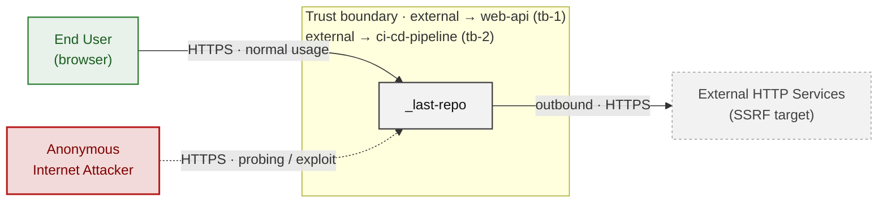
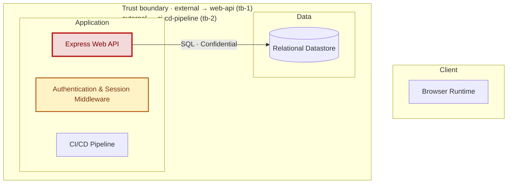
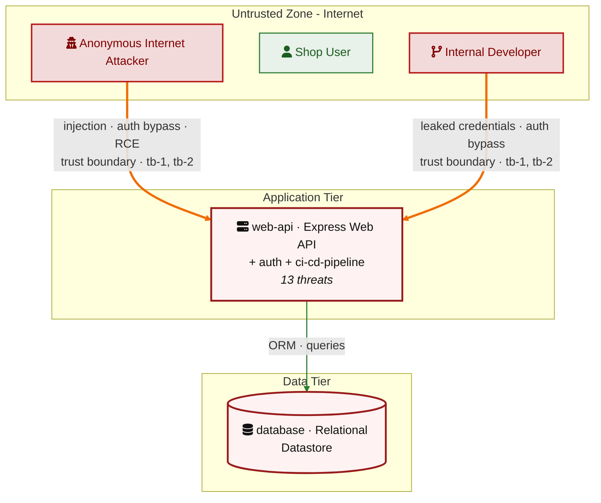
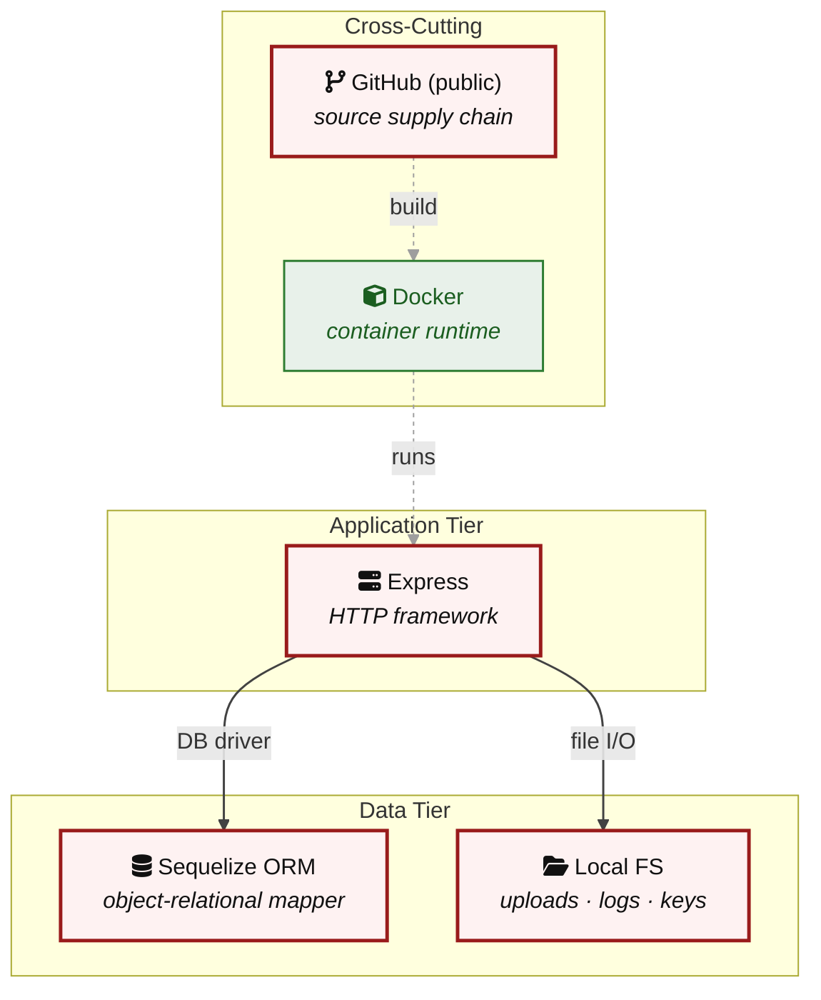

## 2. Architecture Diagrams

### 2.1 System Context

Who interacts with _last-repo from the outside, and through which channels. Solid arrows show normal usage; dashed red arrows mark unauthenticated probing or exploit paths (C4 Level 1).

*Trust boundaries not named above: web-api → database (tb-3), web-api → external (tb-4) — every boundary is listed in [§1 Trust Boundaries](#trust-boundaries).*

**Key takeaway:** Every actor in the context interacts with _last-repo through its external interface, so authentication and input validation at that edge govern the entire attack surface.

### 2.2 Container Architecture

How the system decomposes into deployable units. Each box is a separate runtime process or service container; arrows show synchronous request paths between them. Components with ≥3 Critical findings carry a red border, ≥2 High amber (C4 Level 2).

*Trust boundaries not drawn above: web-api → database (tb-3), web-api → external (tb-4) — every boundary is listed in [§1 Trust Boundaries](#trust-boundaries).*

**Key takeaway:** The system decomposes into 0 client, 3 application and 1 data unit(s); Express Web API carries the most Critical findings (3) and bounds the worst-case blast radius.

### 2.3 Components

Who reaches each component, and through which trust zone. Browser code runs on the user's device, so the client column is part of the untrusted zone, not a zone of its own — trust changes only where traffic enters the Application tier. Solid green arrows show legitimate data flow, dashed red arrows mark intrusion vectors. The component table directly below holds source paths and linked threats per `C-NN`; per-finding evidence is in [§8 Findings Register](#8-findings-register).

*Trust boundaries crossed by the `==>` edges above: external → web-api (tb-1), external → ci-cd-pipeline (tb-2) — every boundary is listed in [§1 Trust Boundaries](#trust-boundaries).*

**Key takeaway:** Express Web API concentrates the most findings (7 of 13 across all components); the table below maps each component to its source paths and linked threats.

| Component ID | Name | Tier | Source paths | Threats |
|---|---|---|---|---|
| web-api | Express Web API | Application | `server.js`, `routes/**/*.js`, `models/*.js` | 7 |
| auth | Authentication & Session Middleware | Application | `middleware/partnerAuth.js`, `middleware/tenantContext.js`, `server.js` | 6 |
| database | Relational Datastore | Data | `config/insecure-settings.ini` | 0 |
| ci-cd-pipeline | CI/CD Pipeline | Application | `.github/workflows/**`, `Dockerfile`, `package.json` | 0 |

### 2.4 Technology Architecture

The technology stack the system is built on. Each box names the framework or runtime that fills that role; per-component findings live in the §2.3 component table above, and the full per-finding catalogue is in [§8 Findings Register](#8-findings-register).

**Key takeaway:** The stack spans 1 data-tier store(s) behind the application tier; injection and data-at-rest exposure track the data tier, detailed per finding in [§8 Findings Register](#8-findings-register).

> **Legend:** `-->` synchronous request/response (REST, HTTPS, gRPC) · `==>` crosses an untrusted trust boundary (security-critical) · **red border** ≥ 3 Critical threats on the component · **amber border** ≥ 2 High threats
