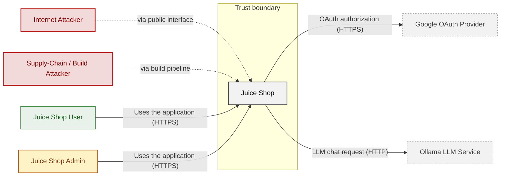
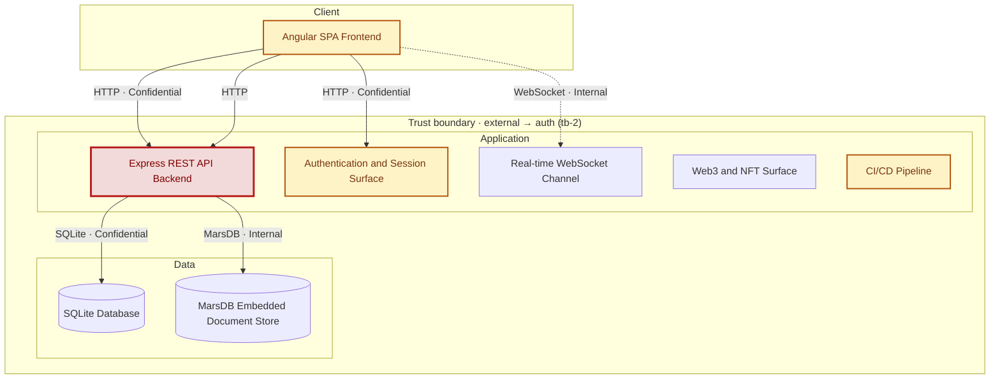

## 2. Architecture Diagrams

### 2.1 System Context

Who uses and attacks Juice Shop, and which external systems it exchanges data with. Solid arrows name the data a flow carries; dashed red arrows are attack routes. Actors carry the names Figure 1 uses (C4 Level 1).

**Key takeaway:** Juice Shop serves Juice Shop User and Juice Shop Admin and depends on Google OAuth Provider and Ollama LLM Service; Internet Attacker and Supply-Chain / Build Attacker attack it.

### 2.2 Container Architecture

How the system decomposes into deployable units. Each box is a separate runtime process or service container; arrows show synchronous request paths between them. Components with ≥3 Critical findings carry a red border, ≥2 High amber (C4 Level 2).

*Trust boundaries not drawn above: express-backend → sqlite-db (tb-4), express-backend → marsdb-store (tb-5), express-backend → external (tb-6) - every boundary is listed in [§1 Trust Boundaries](#trust-boundaries).*

**Key takeaway:** The system decomposes into 1 client, 5 application and 2 data unit(s); Express REST API Backend carries the most Critical findings (5) and bounds the worst-case blast radius.

### 2.3 Components

How each component is reached, what it handles, how many threats hit it, and how effective the controls evidenced on it are. The component table below holds source paths and linked threats per `C-NN`; per-finding evidence is in [§8 Findings Register](#8-findings-register).

<!-- detail-table -->
| Component | Inbound flows | Data handled | Threats | Controls: worst effectiveness per domain |
|----------------------|----------------------|----------------------|----------------------|----------------------|
| [C-01](#c-01) · Angular SPA Frontend | 2 authentication unknown | Confidential · credentials, personal-data | 12 (🟠 9 · 🟡 3) | 🔴 Unsafe: Output encoding 🟡 Partial: Session |
| [C-02](#c-02) · Express REST API Backend | 1 unauthenticated 1 authenticated | Confidential · credentials, payment-data, personal-data | 35 (🔴 6 · 🟠 19 · 🟡 10) | 🔴 Unsafe: Input / query (2) 🟡 Partial: AuthZ, LLM |
| [C-03](#c-03) · Authentication and Session Surface | 1 unauthenticated 1 authenticated | Confidential · credentials, secrets | 13 (🔴 1 · 🟠 6 · 🟡 6) | 🔴 Unsafe: AuthN (3), Input / query, Secrets / crypto, Supply chain (2) 🟠 Weak: AuthZ |
| [C-04](#c-04) · Real-time WebSocket Channel | 1 authentication unknown | Internal | 3 (🟡 3) | – |
| [C-05](#c-05) · Web3 and NFT Surface | none modeled | – | 4 (🟡 4) | – |
| [C-06](#c-06) · CI/CD Pipeline | none modeled | – | 14 (🟠 2 · 🟡 12) | 🔴 Missing: Supply chain (4) |
| [C-07](#c-07) · SQLite Database | 1 unauthenticated | Confidential · credentials, payment-data, personal-data | 1 (🟠 1) | – |
| [C-08](#c-08) · MarsDB Embedded Document Store | 1 unauthenticated | Internal | none | – |
| System-wide: evidence not tied to one component | – | – | – | 🔴 Unsafe: AuthN (4) 🟠 Weak: AuthZ (2) 🟡 Partial: Transport |

*🔴 **Unsafe**: relied upon but defeated or trivially bypassable - fix it · 🔴 **Missing**: never built - add it · 🟠 **Weak**: present, with exploitable gaps · 🟡 **Partial**: covers some surfaces, meaningful gaps remain · 🟢 **Adequate**: present and sound. A control counts for the component whose paths hold its implementation evidence; a domain without an evidenced control is not listed; (n) counts the controls behind a rating. Threat counts use the Figure 1 attribution; [§6](#6-security-architecture) holds the full assessment.*

**Key takeaway:** 4 components have at least one control rated Unsafe or Missing (C-01, C-02, C-03, C-06); 4 components have no component-specific control (C-04, C-05, C-07, C-08); 7 controls apply system-wide.

| ID | Name | Type | Key Paths | Linked Threats |
|----|----------------------|-----------|--------------------------------------|------------------------------------------------|
| C-01 | Angular SPA Frontend | client | `frontend/src/app/**/*.ts` `frontend/src/app/**/*.html` `frontend/src/hacking-instructor/**/*.ts` | 🟠 [F-008](#f-008) — Password derived from OAuth email (`oauth.component.ts:30`) 🟠 [F-013](#f-013) — Stored XSS (`administration.component.ts:73`) 🟠 [F-014](#f-014) — Stored XSS (`search-result.component.ts:110`) 🟠 [F-015](#f-015) — DOM XSS (`search-result.component.ts:143`) 🟠 [F-016](#f-016) — Reflected XSS (`track-result.component.ts:48`) 🟠 [F-025](#f-025) — JWT stored in localStorage (`login.component.ts:101`) 🟠 [F-035](#f-035) — Admin role enforced only in client guard (`app.guard.ts:54`) 🟠 [F-086](#f-086) — XSS renders attacker-controlled markup (`about.component.ts:119`) 🟠 [F-087](#f-087) — Token flow accepts a stolen bearer token without (`login.component.ts:148`) 🟡 [F-040](#f-040) — OAuth callback without state check (`oauth.component.ts:28`) 🟡 [F-047](#f-047) — Trusted HTML for feedback on About page (`about.component.ts:119`) 🟡 [F-048](#f-048) — Trusted HTML for feedback comment in admin (`administration.component.ts:91`) |
| C-02 | Express REST API Backend | application | `server.ts` `app.ts` `routes/*.ts` `lib/**/*.ts` `models/*.ts` | 🔴 [F-003](#f-003) — SQL injection request data interpolated into a SQL string (`search.ts:23`) 🔴 [F-004](#f-004) — Insecure Direct Object Reference (`address.ts:11`) 🔴 [F-005](#f-005) — Mass assignment privileged field accepted from request (`verify.ts:53`) 🔴 [F-006](#f-006) — Eval of stored username in profile page (`userProfile.ts:61`) 🔴 [F-007](#f-007) — Role mass assignment on user registration (`server.ts:501`) 🟠 [F-017](#f-017) — Path traversal filesystem access from request input (`dataErasure.ts:104`) 🟠 [F-022](#f-022) — Zip Slip arbitrary file write on upload (`fileUpload.ts:34`) 🟠 [F-023](#f-023) — Unsigned coupon codes accepted (`insecurity.ts:106`) 🟠 [F-024](#f-024) — NoSQL operator injection in review update (`updateProductReviews.ts:18`) 🟠 [F-028](#f-028) — Memories API exposes full user records (`memory.ts:24`) 🟠 [F-029](#f-029) — Directory listing of access logs and keys (`server.ts:281`) 🟠 [F-030](#f-030) — XXE with external entities enabled (`xml.ts:35`) 🟠 [F-031](#f-031) — NoSQL \$where injection in order tracking (`trackOrder.ts:18`) 🟠 [F-032](#f-032) — Unbounded LLM consumption on chat endpoint (`chat.ts:203`) 🟠 [F-033](#f-033) — Unauthenticated YAML/XML bombs block event loop (`fileUpload.ts:109`) 🟠 [F-034](#f-034) — Server-side JS (`showProductReviews.ts:36`) 🟠 [F-036](#f-036) — Input passed to code execution (`userProfile.ts:61`) 🟠 [F-037](#f-037) — Sensitive Routes Registered Without Authentication Middleware (`server.ts:310`) 🟠 [F-038](#f-038) — Model-chosen unbounded coupon discount (`chat.ts:184`) 🟠 [F-039](#f-039) — Deluxe role granted without payment (`deluxe.ts:43`) 🟡 [F-019](#f-019) — Input compiled as template source (`userProfile.ts:87`) 🟡 [F-041](#f-041) — Reset rate limit keyed on client header (`server.ts:346`) 🟡 [F-042](#f-042) — No rate limiting on login (`server.ts:596`) 🟡 [F-043](#f-043) — Chat tool trusts unverified JWT identity (`chat.ts:45`) 🟡 [F-053](#f-053) — Review author taken from request body (`createProductReviews.ts:26`) 🟡 [F-065](#f-065) — Template layout path traversal in data erasure (`dataErasure.ts:107`) 🟡 [F-066](#f-066) — Confidential discount rule in system prompt (`chat.ts:105`) 🟡 [F-067](#f-067) — Development error handler returns stack traces (`server.ts:682`) 🟡 [F-074](#f-074) — Insecure Direct Object Reference (`basket.ts:19`) |
| C-03 | Authentication and Session Surface | application | `routes/login.ts` `routes/saveLoginIp.ts` `lib/insecurity.ts` `lib/startup/registerWebsocketEvents.ts` `routes/2fa.ts` | 🔴 [F-002](#f-002) — SQL injection in login query (`login.ts:34`) 🟠 [F-001](#f-001) — JWT Verification Without Algorithm Allowlist (`insecurity.ts:55`) 🟠 [F-009](#f-009) — Hard-coded JWT RSA private key (`insecurity.ts:21`) 🟠 [F-010](#f-010) — Password reset by security answer only (`resetPassword.ts:41`) 🟠 [F-011](#f-011) — JWT decode used without signature verification (`insecurity.ts:56`) 🟠 [F-026](#f-026) — Password hash and TOTP secret embedded in JWT (`login.ts:24`) 🟠 [F-027](#f-027) — Unsalted MD5 password hashing (`insecurity.ts:41`) 🟡 [F-051](#f-051) — Login IP taken from client True-Client-IP header (`saveLoginIp.ts:18`) 🟡 [F-052](#f-052) — No audit logging of authentication events (`login.ts:50`) 🟡 [F-054](#f-054) — Hard-coded HMAC key for security answers (`insecurity.ts:42`) 🟡 [F-055](#f-055) — Session token cookie without HttpOnly or Secure (`insecurity.ts:192`) 🟡 [F-070](#f-070) — Unbounded in-memory token registry (`insecurity.ts:74`) 🟡 [F-072](#f-072) — User registry listing lacks role check (`authenticatedUsers.ts:12`) |
| C-04 | Real-time WebSocket Channel | application | `lib/challengeUtils.ts` `lib/startup/registerWebsocketEvents.ts` | 🟡 [F-044](#f-044) — Unauthenticated WebSocket Channel (`registerWebsocketEvents.ts:40`) 🟡 [F-068](#f-068) — CTF flags broadcast to all sockets (`challengeUtils.ts:66`) 🟡 [F-084](#f-084) — Untyped socket payload throws in handler (`registerWebsocketEvents.ts:46`) |
| C-05 | Web3 and NFT Surface | application | `routes/checkKeys.ts` `routes/nftMint.ts` `routes/redirect.ts` `routes/web3Wallet.ts` | 🟡 [F-045](#f-045) — Wallet ownership accepted without signature proof (`nftMint.ts:42`) 🟡 [F-046](#f-046) — Open redirect (`redirect.ts:19`) 🟡 [F-069](#f-069) — Hardcoded BIP39 wallet mnemonic (`checkKeys.ts:10`) 🟡 [F-071](#f-071) — Unbounded in-memory wallet set growth (`web3Wallet.ts:16`) |
| C-06 | CI/CD Pipeline | application | `.github/workflows/**` .gitlab`-ci.yml` `Dockerfile` `docker-compose.test.yml` `package.json` | 🟠 [F-020](#f-020) — Third-party action on mutable branch ref (`image_actions.yml:33`) 🟠 [F-021](#f-021) — Dependencies installed without lockfile — `Dockerfile:5` (`Dockerfile:5`) 🟡 [F-049](#f-049) — Heroku CLI piped from curl to sh (`ci.yml:358`) 🟡 [F-050](#f-050) — Base images referenced by mutable tag, no digest — `Dockerfile:22` (`Dockerfile:22`) 🟡 [F-056](#f-056) — Claude Code Command Sandbox Not Enabled (`settings.local.json:2`) 🟡 [F-057](#f-057) — Container Runs as Root — `Dockerfile:1` (`Dockerfile:1`) 🟡 [F-058](#f-058) — Missing Container Image Signing (`ci.yml:1`) 🟡 [F-059](#f-059) — Untrusted npm Install/Postinstall Scripts Enabled (`Dockerfile:4`) 🟡 [F-060](#f-060) — Missing Workflow Permissions Block (`ci.yml:1`) 🟡 [F-061](#f-061) — Default GITHUB_TOKEN Scope Not Restricted (`lock.yml:1`) 🟡 [F-062](#f-062) — Unpinned Third-Party GitHub Action (`ci.yml:188`) 🟡 [F-063](#f-063) — Unpinned Container Base Image (`Dockerfile:1`) 🟡 [F-064](#f-064) — Missing npm Lockfile (`package-lock.json:0`) 🟡 [F-073](#f-073) — Workflow token scope not restricted (`ci.yml:190`) |
| C-07 | SQLite Database | data | `data/datacreator.ts` `data/staticData.ts` | 🟠 [F-012](#f-012) — Seeded accounts use repository-committed credentials (`datacreator.ts:196`) |
| C-08 | MarsDB Embedded Document Store | data | `data/mongodb.ts` | - |

> **Legend:** `-->` synchronous request/response (REST, HTTPS, gRPC) · `-.->` asynchronous / event-driven (WebSocket, queue, pub-sub) · **red border** ≥ 3 Critical threats on the component · **amber border** ≥ 2 High threats

---

